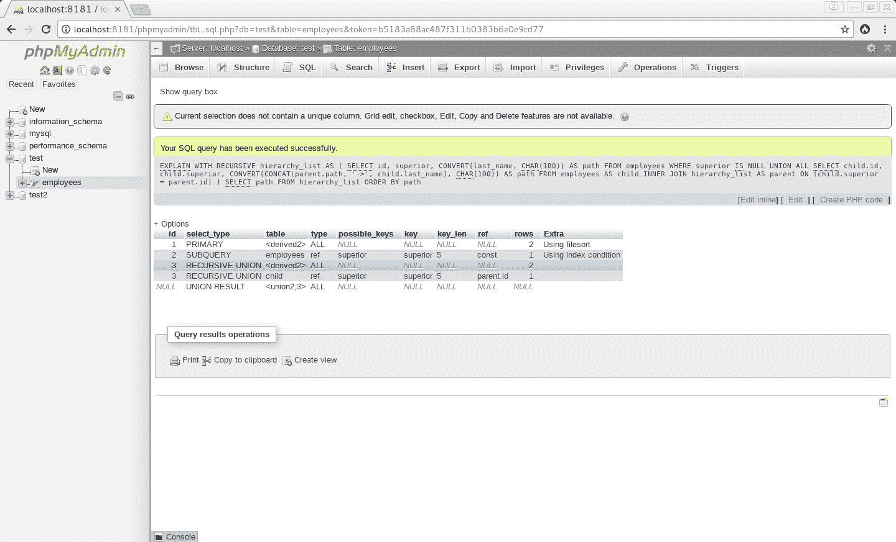
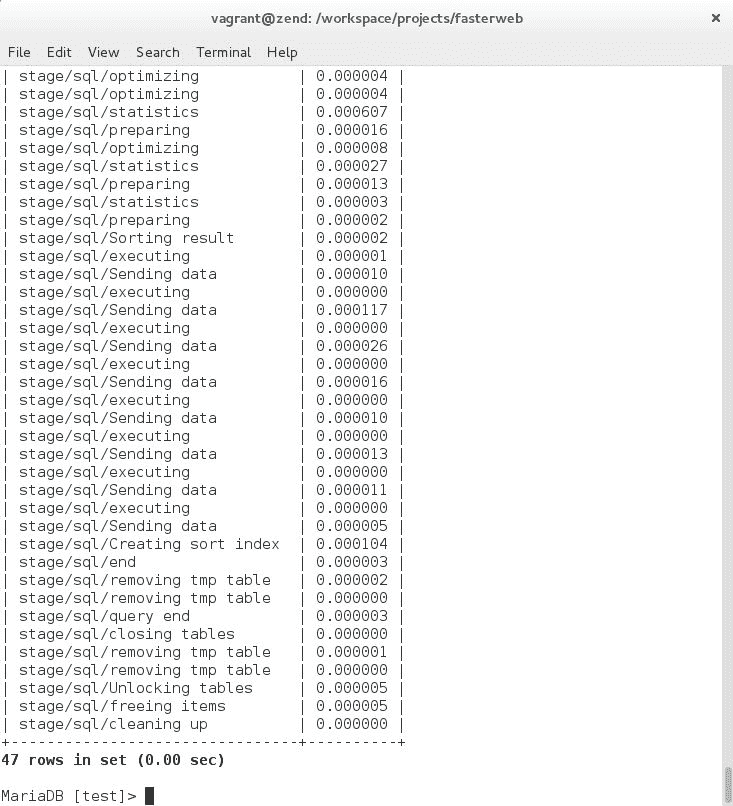
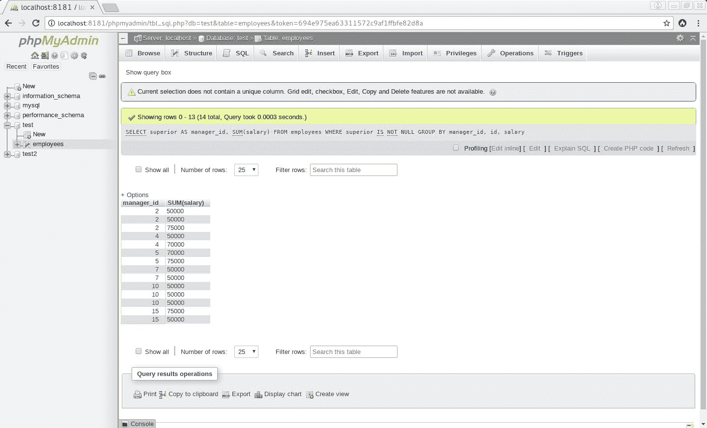
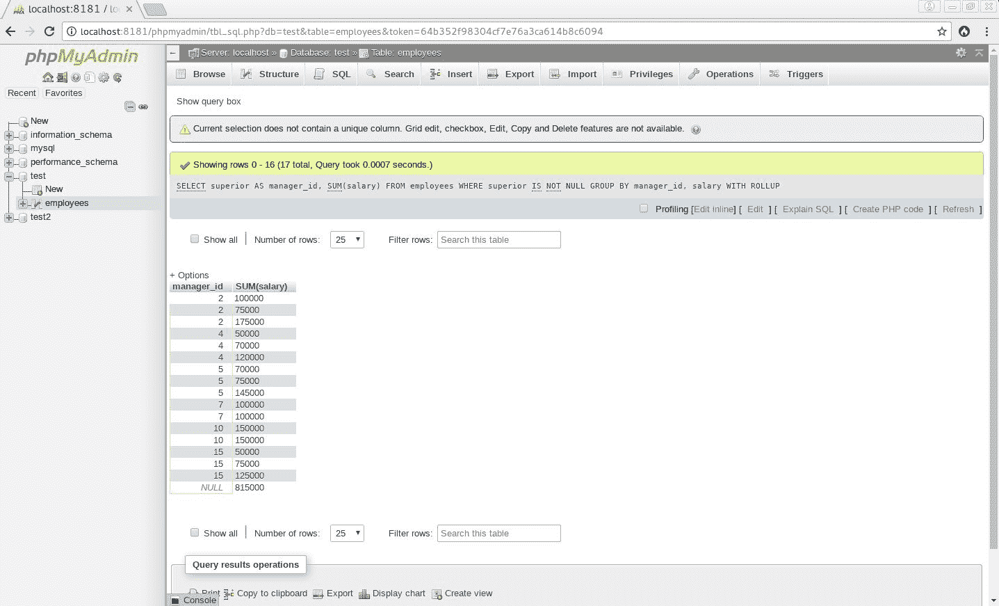
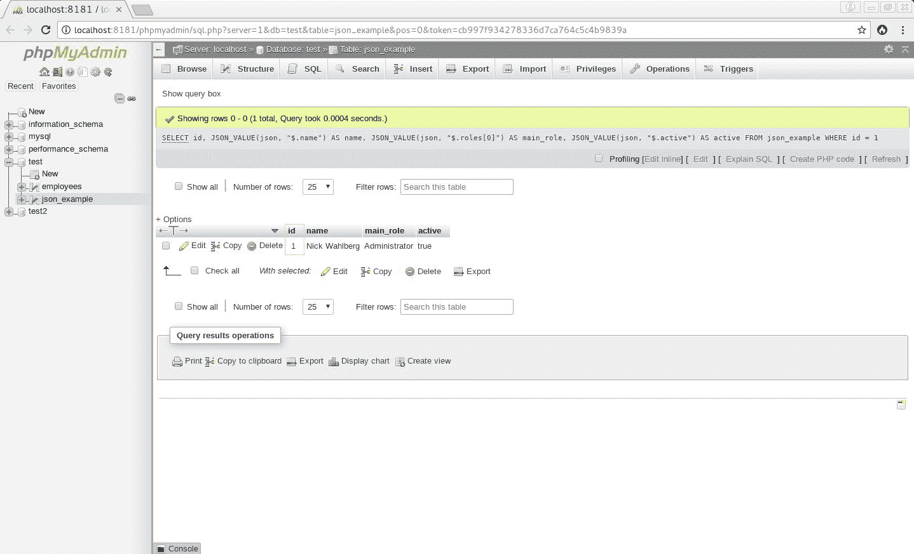
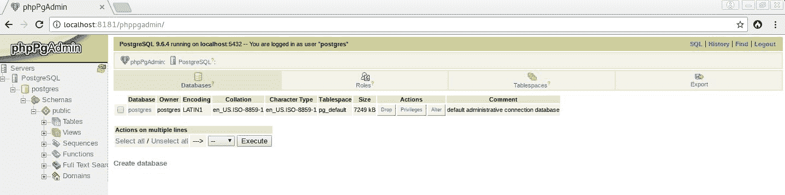
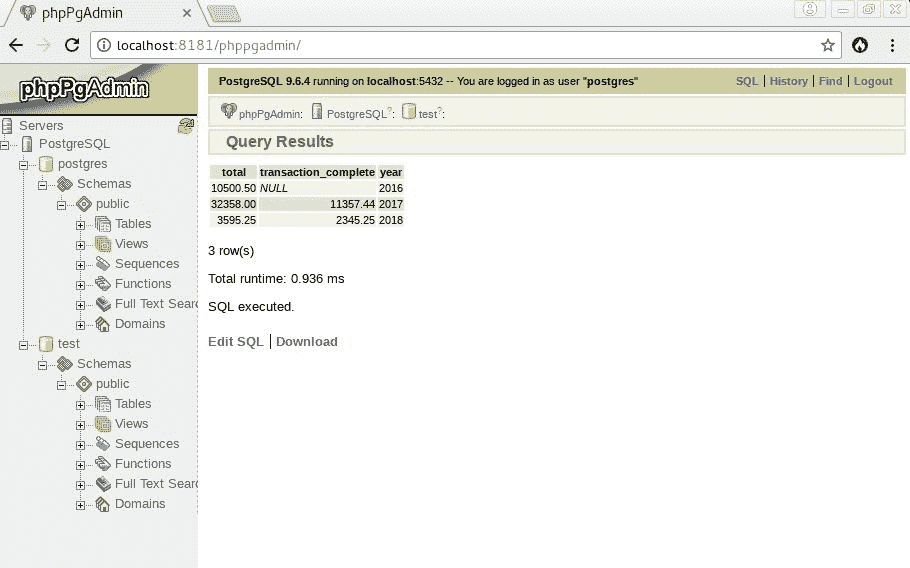

# 高效查询现代 SQL 数据库

现在我们将学习如何使用现代 SQL 高效地查询 SQL 数据库。在本章中，我们将定义什么是现代 SQL 以及如何使用它。我们将首先定义现代 SQL 的概念，并通过描述它的许多特性来理解它与传统 SQL 的区别。因此，我们将了解如何将某些传统 SQL 查询转换为现代 SQL 查询，以及何时最好这样做。此外，通过这样做，我们将更好地理解现代 SQL 如何通过多种方式帮助我们优化服务器的性能。

因此，我们将讨论以下几点：

*   了解什么是现代 SQL 及其特性
*   学习如何以及何时使用`WITH`和`WITH RECURSIVE`、`CASE`、`OVER AND PARTITION BY`、`OVER AND ORDER BY`、分组集、JSON 子句和函数、`FILTER`和`LATERAL`查询。

# 现代 SQL

什么是现代 SQL？它如何区别于传统 SQL？它的主要特点是什么？让我们从定义概念本身开始。

# 释义

正如马库斯·温南德（Markus Winand）在其网站[上所述 https://modern-sql.com](https://modern-sql.com) 中，现代 SQL 可以定义为“*一种国际标准化、广泛可用且图灵完整的数据处理语言，支持关系和非关系数据模型*这个定义指的是一组标准，这些标准由 ISO 和 ANSI 组织多年来推广，并为 SQL 编程语言添加了新功能。自 SQL-92 以来，采用了许多新版本的 SQL 标准，这些标准引入了许多基于关系和非关系模型的新特性。以下是这些功能的简短列表，以及确认其被 SQL 语言采用的相应标准：

*   `WITH`和`WITH RECURSIVE`（SQL:1999）
*   `CASE`（SQL:1999 和 SQL:2003）
*   `OVER AND PARTITION BY`（SQL:2003 和 SQL:2011）
*   `OVER AND ORDER BY`（SQL:2003 和 SQL:2011）
*   分组集（SQL:2011）
*   JSON 子句和函数（SQL:2016）
*   `FILTER`（SQL:2003）
*   `LATERAL`查询（SQL:1999）

尽管如此，应该注意的是，直到最近，大多数**关系数据库管理系统**（**RDBMS**才实现这些功能。大多数 RDBMS 只向用户提供一种更传统的 SQL 语言，它完全基于过时的 SQL-92 标准所提倡的关系模型。直到最近几年，很多（如果不是大多数的话）RDBMS 才开始实现现代 SQL 特性。

此外，让我们发出警告：使用这些功能不会立即提高数据库服务器的性能。那么，在代码库中使用这些特性有什么意义呢？关键是使您的代码库与未来的数据库引擎优化兼容，并避免与查询执行缓慢相关的大多数问题。

但是，在进一步研究新的 SQL 特性之前，我们将在 LinuxforPHP 容器中安装`phpMyAdmin`，以便以用户友好的方式查看查询结果。为此，请在容器的 CLI 上输入以下命令：

```php
# rm /srv/www
# ln -s /srv/fasterweb/chapter_6 /srv/www
# cd /srv
# wget -O phpMyAdmin-4.7.7-all-languages.zip https://files.phpmyadmin.net/phpMyAdmin/4.7.7/phpMyAdmin-4.7.7-all-languages.zip
# unzip phpMyAdmin-4.7.7-all-languages.zip
# cp phpMyAdmin-4.7.7-all-languages/config.sample.inc.php phpMyAdmin-4.7.7-all-languages/config.inc.php
# sed -i "s/AllowNoPassword'] = false/AllowNoPassword'] = true/" phpMyAdmin-4.7.7-all-languages/config.inc.php
# cd fasterweb/chapter_6
# ln -s ../../phpMyAdmin-4.7.7-all-languages ./phpmyadmin  
```

通过这些命令，可以从`http://localhost:8181/phpmyadmin`处的 web 界面访问数据库服务器。通过您喜爱的浏览器访问此地址时，您应看到以下屏幕：


Enter your username and password on phpMyAdmin's login page

安装`phpMyAdmin`后，您可以使用用户名`root`和空密码登录数据库服务器。

现在，让我们更详细地了解每一个新的 SQL 特性。

# 带和带递归

第一个特性是所谓的**公共表表达式**（**CTE**）。CTE 是一个临时结果集，允许您多次将同一数据连接到其自身。CTE 有两种类型：非递归（`WITH`）和递归（`WITH RECURSIVE`）。

非递归类型的 CTE 的工作原理类似于派生表，允许您从临时结果集中`SELECT`。一个简单的例子是，使用虚构的 staff 表：

```php
WITH accountants AS (
  SELECT id, first_name, last_name
  FROM staff
  WHERE dept = 'accounting'
)
SELECT id, first_name, last_name
FROM accountants;
```

递归类型的 CTE 由两部分组成。查询的第一部分称为 CTE 的锚定成员。锚的结果集被认为是基本结果集（T<sub class="calibre28">0</sub>。第二部分是递归成员，它将以 T<sub class="calibre28">i</sub>作为输入，T<sub class="calibre28">i+1</sub>作为输出运行，直到返回一个空结果集。查询的最终结果集将是递归结果集（T<sub class="calibre28">n</sub>和锚定（T<sub class="calibre28">0</sub>之间的一个`UNION ALL`。

为了更好地理解递归 CTE 以及它们的用处，让我们举个例子。但是，在开始之前，让我们先将下表加载到测试数据库中。在容器的 CLI 上，输入以下命令：

```php
# mysql -uroot test < /srv/www/employees.sql 
```

完成后，您可以通过使用`phpMyAdmin`打开数据库来确保所有内容都已正确加载，如下所示：


All the rows found in the employees table of the test database

为了更好地理解 CTE，我们将首先使用具有多个联接的基本查询来获得分层结果集。要仅基于数据库中员工记录中经理 ID 的存在来获取员工的整个层次结构，我们必须考虑一个查询，该查询具有多个到同一个表的连接。在 SQL 选项卡中，输入以下查询：

```php
SELECT CONCAT_WS('->', t1.last_name, t2.last_name, t3.last_name, t4.last_name, t5.last_name, t6.last_name) AS path
FROM employees AS t1
RIGHT JOIN employees AS t2 ON t2.superior = t1.id
RIGHT JOIN employees AS t3 ON t3.superior = t2.id
RIGHT JOIN employees AS t4 ON t4.superior = t3.id
RIGHT JOIN employees AS t5 ON t5.superior = t4.id
RIGHT JOIN employees AS t6 ON t6.superior = t5.id
WHERE t1.superior IS NULL
ORDER BY path;
```

您将获得此结果集：


Hierarchical tree of all the employees generated with the JOIN statements

首先要注意的是，这个查询假定我们预先知道这个层次结构中的级别数，这意味着我们做了前面的查询来确认关于数据集的这个事实。第二件事是为了检索整个结果集而不得不重复`JOIN`子句的笨拙。递归 CTE 是优化此类查询的完美方法。要使用递归 CTE 获得完全相同的结果集，我们必须运行以下查询：

```php
WITH RECURSIVE hierarchy_list AS (
  SELECT id, superior, CONVERT(last_name, CHAR(100)) AS path
  FROM employees
  WHERE superior IS NULL
  UNION ALL
  SELECT child.id, child.superior, CONVERT(CONCAT(parent.path, '->', child.last_name), CHAR(100)) AS path
  FROM employees AS child
  INNER JOIN hierarchy_list AS parent ON (child.superior = parent.id)
)
SELECT path
FROM hierarchy_list
ORDER BY path;
```

如果我们将前两个查询与 MariaDB 的性能模式进行比较，即使它们在动态发现层次结构中的级别数方面没有提供相同的功能，我们也会更好地了解引擎盖下的情况。

首先，让我们使用`EXPLAIN`语句运行多连接查询：


MariaDB's query execution plan with the JOIN statements

现在针对 RDBMS 的性能模式：


The multiple joins caused 65 operations in the database engine

其次，让我们执行相同的步骤，但使用递归 CTE：



MariaDB's query execution plan with the recursive CTE

而且，性能模式应产生以下结果：



The CTE caused 47 operations in the database engine

虽然这个递归 CTE 比我的计算机上的基本多连接查询慢一点，但当所有选定的列都被索引时，它确实生成了更少的引擎操作。那么，为什么这更有效呢？例如，递归 CTE 将允许您避免创建存储过程或类似内容的麻烦，以便递归地发现层次结构树中的级别数。如果我们将这些操作添加到主查询中，这无疑会使多连接查询的速度慢得多。此外，递归 CTE 可能是一种派生表，它不比视图快多少，也比基本的多连接查询稍慢一些，但在查询数据库以遍历层次结构树时，它肯定是非常可伸缩且非常有用的，当使用排名函数或基于小结果子集修改表内容时，请确保更复杂的查询将免费受益于未来的引擎优化。此外，通过保持代码**干燥**（**不要重复自己**），它将使您的开发周期更加高效，因为它将使您的代码更易于其他开发人员阅读。

让我们转到下一个特性，`CASE`表达式。

# 案例

尽管`CASE`表达式似乎提醒我们注意`IF`、`SWITCH`等命令式结构，但它仍然不允许像这些命令式结构那样进行程序流控制，而是允许基于特定条件对值进行声明式求值。为了更好地理解这个特性，让我们看一下下面的示例。

请通过`phpMyAdmin`界面在测试数据库的 SQL 页签中输入以下查询：

```php
SELECT id, COUNT(*) as Total, COUNT(CASE WHEN superior IS NOT NULL THEN id END) as 'Number of superiors'
FROM employees
WHERE id = 2;
```

此查询应生成以下结果集：


Result set of the query containing the CASE statement

结果显示，`id`值为`2`的行从第二个`COUNT`函数的输入中被过滤掉，因为`CASE`表达式应用了一个条件，即上级列不能有`NULL`值才能对 id 列进行计数。在大多数情况下，使用现代 SQL 的这一特性并不是一个增加性能的问题，而是一个尽可能避免存储过程和控制执行流的问题，同时保持代码干净、易于阅读和维护。

# 被

`OVER`和`PARTITION BY`是允许对一组行进行计算的窗口函数。与聚合函数不同，窗口函数不会对结果进行分组。为了更好地理解这两个窗口函数，让我们花点时间在`phpMyAdmin`web 界面中运行以下查询：

```php
SELECT DISTINCT superior AS manager_id, (SELECT last_name FROM employees WHERE id = manager_id) AS last_name, SUM(salary) OVER(PARTITION BY superior) AS 'payroll per manager'
FROM employees
WHERE superior IS NOT NULL
ORDER BY superior;
```

运行此查询后，您应该会看到以下结果：


List of managers with payroll per manager

正如我们所看到的，结果集显示了每个经理的工资单列，而没有对结果进行分组。这就是为什么我们必须使用`DISTINCT`语句来避免同一个管理器有多行。显然，在对与当前行有某种关系的行子集进行聚合计算时，窗口函数允许高效查询和优化性能。

# 过来点菜

`OVER AND ORDER BY`窗口函数对于在行子集内排序、计算运行总数或简单地避免自联接非常有用。

为了说明何时使用这一最有用的功能，我们将以前面的示例为例，通过执行以下查询来确定每个经理在每个工资单上的最佳薪酬员工：

```php
SELECT id, last_name, salary, superior AS manager_id, (SELECT last_name FROM employees WHERE id = manager_id) AS manager_last_name, SUM(salary) OVER(PARTITION BY superior ORDER BY manager_last_name, salary DESC, id) AS payroll_per_manager
FROM employees
WHERE superior IS NOT NULL
ORDER BY manager_last_name, salary DESC, id;
```

执行此查询将得到以下结果集：


List of the best paid employees on each payroll per manager

返回的结果集允许我们查看每个工资单的明细，并在每个子集中对每个员工进行排名。什么是底层的执行计划，可以让我们获得这些数据子集的所有细节？答案是一个`SIMPLE`查询！在我们的查询中，有一个依赖子查询，但这是因为我们获取每个管理器的姓氏，以便使结果集更有趣。

这将是删除依赖子查询后的结果查询：

```php
SELECT id, last_name, salary, superior AS manager_id, SUM(salary) OVER(PARTITION BY superior ORDER BY manager_id, salary DESC, id) AS payroll_per_manager
FROM employees
WHERE superior IS NOT NULL
ORDER BY manager_id, salary DESC, id;
```

下面是同一查询的此版本的基本执行计划：


The query execution plan is simple when avoiding to fetch the last name of the manager

通过在没有返回每个管理者姓氏的依赖子查询的情况下运行查询，我们的查询执行计划的`select_type`是`SIMPLE`。这使得高效的查询在将来很容易维护。

# 分组集

分组集使得在一个查询中应用多个`GROUP BY`子句成为可能。此外，这个新特性引入了`ROLLUP`的概念，这是添加到结果集中的一个额外行，它将结果摘要作为先前返回值的超级聚合。让我们使用测试数据库中的 employees 表给出一个非常简单的示例。让我们在`phpMyAdmin`web 界面中执行以下查询：

```php
SELECT superior AS manager_id, SUM(salary)
FROM employees
WHERE superior IS NOT NULL
GROUP BY manager_id, salary;
```

一旦执行，您将看到以下结果：



GROUPING SETS make it possible to apply many GROUP BY clauses in one single query

多重`GROUP BY`条款使我们能够在每位经理的监督下快速查看每位员工的个人薪酬。如果我们现在将`ROLLUP`操作符添加到`GROUP BY`子句中，我们将得到以下结果：



The result set when adding the ROLLUP operator to the GROUP BY clauses

`ROLLUP`运算符为每个子集和整个结果集添加包含超级聚合结果的额外行。执行计划显示，底层的`select_type`再次是`SIMPLE`，而不是像我们在该功能存在之前所做的那样，将多个查询与`UNION`操作符联合起来。现代 SQL 再一次为我们提供了一个高度优化的查询，它将在未来的许多年中保持高度可维护性。

# JSON 子句和函数

SQL 语言的最新添加之一是 JSON 特性。这组新特性使我们更容易从使用 SQL 本机函数以非常结构化和关系化的方式存储某些类型的非结构化和无模式数据（如 JSON 格式）的优势中获益。这允许做很多事情，例如对 JSON 文档中包含的某些 JSON 字段应用完整性约束、为某些 JSON 字段编制索引、轻松地将非结构化数据转换并返回到关系数据，反之亦然，以及通过经验证的 SQL 事务可靠性插入或更新非结构化数据。

为了充分了解这组新特性，让我们通过执行将 JSON 数据转换为关系数据的查询，将一些数据插入测试数据库。

首先，请在容器的 CLI 上执行以下命令：

```php
# mysql -uroot test < /srv/www/json_example.sql 
```

将新表加载到数据库后，可以执行以下查询：

```php
SELECT id,
   JSON_VALUE(json, "$.name") AS name,
   JSON_VALUE(json, "$.roles[0]") AS main_role,
   JSON_VALUE(json, "$.active") AS active
FROM json_example
WHERE id = 1;
```

一旦执行，您将看到以下结果：



The JSON functions automatically convert the JSON data into relational data

如我们所见，使用新的 JSON 函数将 JSON 非结构化数据转换为关系数据和结构化数据非常容易。将非结构化数据插入结构化数据库同样简单。此外，添加的约束将验证插入的 JSON 字符串是否有效。为了验证此功能，让我们尝试在测试表中插入无效的 JSON 数据：

```php
INSERT INTO `json_example` (`id`, `json`) VALUES (NULL, 'test');
```

在尝试执行查询时，我们将得到以下错误消息：


The JSON constraints make sure that the JSON string being inserted is valid

因此，现代 SQL 使在 SQL 环境中处理 JSON 格式的数据变得容易。这将极大地优化应用程序级别的性能，因为现在可以消除每次应用程序需要检索或将 JSON 格式的数据存储到关系数据库时必须执行`json_encode()`和`json_decode()`所带来的开销。

我们可以尝试更好地理解更多的现代 SQL 特性，但并非所有 RDBMS 都实现了它们，其中许多特性需要我们分析实现细节。我们将简单介绍另外两个功能，它们没有在 MariaDB 服务器中实现，但是已经在 PostgreSQL 服务器中实现。要启动和使用 Linux for PHP 容器中包含的 PostgreSQL server，请在容器的 CLI 上输入以下命令：

```php
# /etc/init.d/postgresql start 
# cd /srv 
# wget --no-check-certificate -O phpPgAdmin-5.1.tar.gz https://superb-sea2.dl.sourceforge.net/project/phppgadmin/phpPgAdmin%20%5Bstable%5D/phpPgAdmin-5.1/phpPgAdmin-5.1.tar.gz 
# tar -xvf phpPgAdmin-5.1.tar.gz 
# sed -i "s/extra_login_security'] = true/extra_login_security'] = false/" phpPgAdmin-5.1/conf/config.inc.php 
# cd fasterweb/chapter_6 
# ln -s ../../phpPgAdmin-5.1 ./phppgadmin # cd /srv/www
```

输入这些命令后，您应该能够通过位于`http://localhost:8181/phppgadmin`的`phpPgAdmin`web 界面访问 PostgreSQL server。将浏览器指向此地址，然后单击屏幕右上角的服务器图标，以查看以下界面：


Only one available PostgreSQL server is listed and is accessible through port 5432

从这里，点击页面中心的 PostgreSQL 链接，输入`postgres`作为用户名，并在登录页面上保留空密码：


On the login page, type in the username 'postgres' and the leave the password box empty

然后，单击登录按钮，您应该能够访问服务器：



The server displays postgres as its only available database

最后，我们将创建一个数据库，使我们能够学习如何使用本书中介绍的最后两个现代 SQL 特性。在`phpPgAdmin`界面，点击创建数据库链接，填写表格，创建测试数据库：


Create the database test with the template1 template and an encoding of LATIN1

单击 Create 按钮，您将在 postgres 数据库旁边创建测试数据库：


Now, the server displays the test database alongside the postgres database

完成此操作后，在容器的 CLI 上输入以下命令：

```php
# su postgres 
# psql test < sales.sql 
# exit 
```

我们现在准备试用`FILTER`条款。

# 滤器

现代 SQL 的另一个非常有趣的特性是`FILTER`子句。它可以将`WHERE`子句添加到聚合函数中。让我们在`phpPgAdmin`界面的测试数据库的 SQL 页签中执行以下查询，试试`FILTER`子句：

```php
SELECT
   SUM(total) as total,
   SUM(total) FILTER(WHERE closed IS TRUE) as transaction_complete,
   year
FROM sales
GROUP BY year;
```

您应该得到以下结果：



Result set of the query containing the FILTER statement

`FILTER`子句非常适合生成报告，而不会在查询的`WHERE`子句中增加太多开销。

此外，`FILTER`子句对于数据透视表非常有用，在数据透视表中，按年和月分组变得更加复杂，因为需要生成一个必须跨月和年在两个不同轴上的报告（例如，月=*x*和年=*y*。

让我们继续上一个现代 SQL 特性，`LATERAL`查询。

# 横向查询

`LATERAL`查询允许您在相关子查询中选择多个列和一行。这在创建 Top-N 子查询并尝试将表函数连接在一起时非常有用，因此很可能会取消对它们的测试。然后，可以将`LATERAL`查询视为一种 SQL`foreach`循环。

让我们举一个简单的例子来说明`LATERAL`查询是如何工作的。假设我们有两个假设表，其中包含关于电影和演员的数据：

```php
SELECT
    film.id,
    film.title,
    actor_bio.name,
    actor_bio.biography
FROM film,
    LATERAL (SELECT 
                 actor.name,
                 actor.biography
             FROM actor
             WHERE actor.film_id = film.id) AS actor_bio;
```

正如我们所看到的，`LATERAL`子查询正在从 actor 表`(actor.name and actor.biography)`中选择多个列，同时仍然能够关联来自 film 表`(film.id)`的引用。许多优化，无论是性能优化还是代码可读性和可维护性，在`LATERAL`查询中都成为了现实。

关于现代 SQL 的更多信息，我邀请您参考*Markus Winand*的优秀网站（[https://modern-sql.com](https://modern-sql.com) ），并在*Nomad PHP*（[上聆听*伊丽莎白·史密斯*关于此主题的精彩演讲 https://nomadphp.com/product/modern-sql/](https://nomadphp.com/product/modern-sql/) 。

# 总结

在本章中，我们学习了如何使用现代 SQL 高效地查询 SQL 数据库。我们已经定义了什么是现代 SQL 以及如何使用它。我们已经掌握了如何将某些传统 SQL 查询转换为现代 SQL 查询的知识，以及何时最好这样做。此外，通过这样做，我们现在可以更好地理解现代 SQL 如何以多种方式帮助我们优化服务器的性能。

在下一章中，我们将介绍一些 JavaScript 的最佳和最差部分，特别是与代码效率和总体性能有关的部分，以及开发人员应该如何始终编写安全、可靠和高效的 JavaScript 代码，主要是通过避免*危险驱动的开发*。