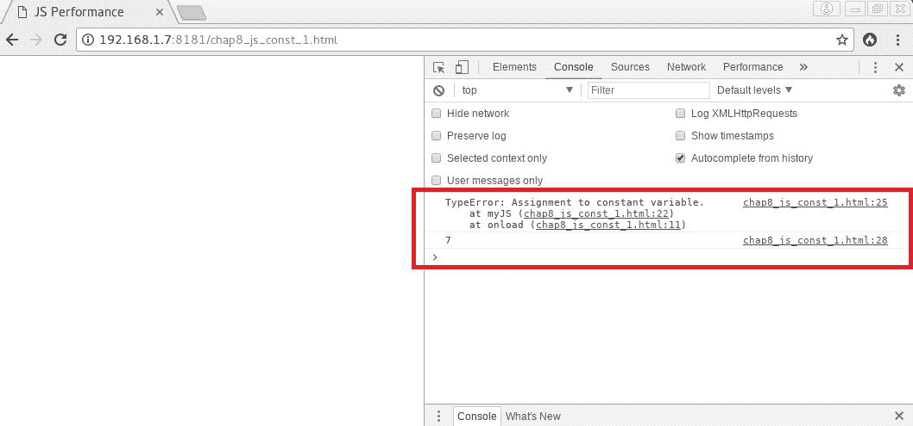
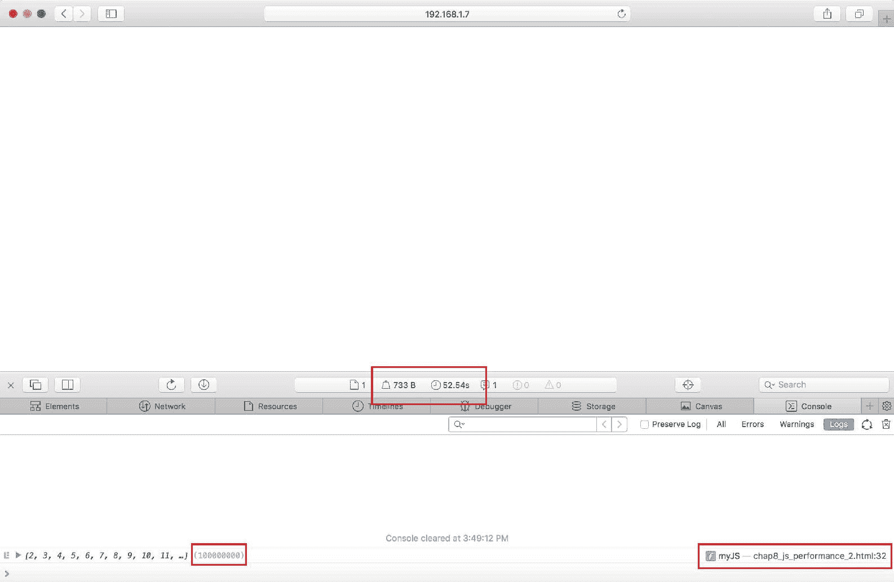

# 八、函数式 JavaScript

JavaScript 的未来将是功能性的。事实上，在过去几年中，该语言发生了许多变化，在使用函数式编程技术时，实现起来更容易、更高效。

在本章中，我们将看到 JavaScript 如何日益成为一种功能性语言，以及这种编程范式如何成为性能的载体。我们将学习如何用简化的函数版本替换过于复杂的代码，以及如何使用不变性和尾部调用优化从长远来看有助于提高 JavaScript 的效率。因此，我们将涵盖以下几点：

*   简化函数
*   函数式编程技术
*   更多即将推出的 JavaScript 功能

# 简化函数

传统上，计算机科学专业的学生被要求保持他们的功能简单。人们常说，一个功能对应一个动作。事实上，函数的圈复杂度越高，重用、维护和测试就越困难。一个函数越是成为一个纯粹的逻辑存在，在一个明确可识别的动作中没有现实世界的根源，它就越难掌握，也越难与其他函数结合使用。

# 函数式编程原理

**函数式编程**（**FP**范式将计算设计视为基于数学函数以及状态和数据的不变性，从而进一步推动了这种推理。FP 的指导原则是，整个计算机程序应该是一个单一的、引用透明的表达式。FP 的核心概念要求函数是纯的、引用透明的且没有副作用。如果给定相同的输入，函数总是返回相同的输出，则函数是纯函数。当其函数表达式与计算机程序中的任何位置的相应值可互换时，它是引用透明的。当它不在其作用域之外修改应用程序的状态时，它没有副作用。因此，例如，修改声明在其作用域之外的变量或将消息回显到屏幕被视为功能性副作用，必须尽可能避免。

纯函数的示例如下所示：

```php
function myJS()
{
    function add(n1, n2)
    {
        let number1 = Number(n1);
        let number2 = Number(n2);

        return number1 + number2;
    }

}
```

下一个功能不是纯粹的，因为有两个副作用：

```php
function myJS()
{
    function add(n1, n2)
    {
        // 1\. Modifies the global scope
        let number1 = Number(n1);
        let number2 = Number(n2);

        // 2\. The alert function
        alert( number1 + number2 );
    }

}
```

引用透明函数可以在代码中的任何位置替换为等于函数表达式计算值的常量：

```php
4 === addTwo(2);
```

例如，此函数不是引用透明的：

```php
function myJS()
{
    function addRandom(n1)
    {
        let number1 = Number(n1);

        return number1 + Math.random();
    }

}
```

在最值得注意的 JavaScript 函数中，不具有引用透明性且会产生副作用，我们可以提到这些函数：`Date`、`Math.random`、`delete`、`Object.assign`、`Array.splice`、`Array.sort`和`RegExp.exec`。

保持函数简单和纯粹有许多优点。最重要的是：

*   更简单的关键路径，从而在尝试维护或更新应用程序时减少开发人员的认知负担
*   更容易的功能测试
*   免费编译器优化，编译器可以在编译时决定用相应的常量值替换函数表达式，而不是每次都计算函数
*   运行时优化带来的未来性能提升
*   通过避免应用程序状态可变性导致的争用条件实现安全的多线程（JavaScript 目前是单线程的，但谁知道未来会发生什么）

# 作为一等公民的职能

函数作为一级公民是一项原则，规定函数应被视为与任何其他数据类型一样。当语言中允许这种情况时，函数可以成为高阶函数，因此任何函数都可以作为参数接收，并作为计算值从任何其他函数返回，就像任何其他数据类型一样。

当函数是纯的且引用透明时，它们可以更容易地用作一级公民函数。因此，将函数组合在一起以动态生成其他函数变得更容易。这就是所谓的函数合成。Curry 是将函数组合在一起的两种主要方法，Curry 动态生成一个新函数，将其单个参数的计算转换为另一个具有多个参数的函数；partial application 是将函数组合在一起的两种主要方法，通过 Curry 动态生成一个具有较少算术性的新函数来固定另一个函数的参数数量。正如我们将在本章后面看到的，ES2020 准备将这些概念引入 JavaScript 编程语言。

# 处理副作用

如果有必要避免所有形式的副作用，我们应该如何处理输入和输出、网络、用户输入和用户界面？根据 FP 原则，这些与现实世界的交互将封装在特殊的数据结构中。即使包含的一个或多个值在运行时之前是未知的，但这些特殊的数据结构使我们能够将函数映射到一个或多个包装值（functor），将包装函数映射到一个或多个包装值（applicative）或者将返回其自身数据结构类型的实例的包装函数映射到一个或多个包装值（monad）。这样，副作用仍然与纯功能分离。

# 不变性

FP 的另一个重要原则是不变性。修改状态和数据会产生圈复杂度，使任何计算机程序都容易出现错误和总体效率低下。事实上，所有变量都应该是不可变的。为了避免更改应用程序的状态，变量从分配到内存的那一刻起，直到释放为止，都不应该更改其值。

从 ES6 开始，现在可以使用`const`关键字定义常量或不可变变量。以下是其用法示例：

```php
function myJS()
{
    const number = 7;

    try {
        number = 9;
    } catch(err) {
```

```php
        // TypeError: invalid assignment to const 'number'
        console.log(err);
    }
  }
```

这一新增功能现在可以防止通过赋值修改变量。通过这种方式，可以在 JavaScript 应用程序的整个运行期间保护其状态不受变异的影响。

只要有可能，开发人员应始终选择使用`const`而不是`let`或`var`。试图修改使用`const`关键字声明的变量将导致以下错误（`chap8_js_const_1.html`：



Assigning to a constant variable causes a 'TypeError'

# 函数式编程技术

自 ES6 以来，JavaScript 使使用 FP 实现软件解决方案变得更加容易。添加了许多引擎优化，以便在根据 FP 原则编程 JavaScript 时获得更好的性能。映射、过滤、减少和尾部调用优化就是其中的一些技术。

# 地图

Map 是一个高阶函数，允许我们将回调映射到集合的每个元素。当将数组的所有元素从一组值转换为另一组值时，它特别有用。下面是一个简单的代码示例：

```php
function myJS()
{
    let array = [1, 2, 3];

    let arrayPlusTwo = array.map(current => current + 2);

    // arrayPlusTwo == [3, 4, 5]

}
```

这种技术可以在简单修改数组值时尽可能避免使用结构循环。

# 滤器

Filter 是一个高阶函数，它允许我们根据布尔谓词区分并仅保留集合的某些元素。当然，当根据特定条件从集合中删除某些元素时，过滤尤其有用。以以下代码为例：

```php
function myJS()
{
    let array = [1, 2, 3];

    let arrayEvenNumbers = array.filter(current => current % 2 == 0);

    // arrayEvenNumbers == [2]

}
```

过滤是避免循环和嵌套条件以提取所需数据集的好方法。

# 减少

Reduce 是一个高阶函数，它允许我们基于组合函数将集合的元素组合成单个返回值。在处理累积值或串联值时，此技术非常有用。在下面的示例中，我们正在计算数组元素的总和：

```php
function myJS()
{
    let array = [1, 2, 3];

    let sum = array.reduce((cumul, current) => cumul + current, 0);

    // sum == 6;

}
```

我们将要研究的另一个 FP 技术是尾部调用优化。

# 尾部调用优化

为了更好地理解什么是**尾部调用优化**（**TCO**），我们需要定义它是什么，了解它是如何工作的，并学习如何确定函数是否被尾部调用。

# 什么是 TCO？

尾部调用，或称尾部递归，是一种函数编程技术，通过这种技术，函数在将控制返回给自己的调用方之前调用子例程函数作为其最终过程。直接递归发生在函数递归调用自身时。如果一个函数调用另一个函数，而另一个函数又调用原始函数，则递归是相互的或间接的。

因此，例如，当函数尾部调用自身时，它会一次又一次地堆叠自身，直到满足某个条件，在该条件下它肯定会返回，从而有效地弹出整个调用堆栈。

优化尾部调用包括在执行尾部调用之前从调用堆栈中弹出当前函数，并将当前函数的调用方地址保留为尾部调用的返回地址。因此，堆栈的内存占用仍然很小，实际上可以完全避免堆栈溢出。

# TCO 的工作原理

让我们比较两个堆栈帧，一个没有 TCO，另一个有 TCO。让我们先看一下以下代码：

```php
function a(x)
{
    y = x + 2;
    return b(y);
}

function b(y)
{
    z = y + 3;
    return z;
}

console.log(a(1)); // 6
```

一旦分配给内存，不使用 TCO，前面代码中的三个堆栈帧将如下图所示：


A typical last-in, first-out (LIFO) call stack

一旦将值 6 分配给变量`z`，堆栈帧就准备好弹出。在这种情况下，堆栈帧**2**完全保留在内存中，只是为了保留`console.log()`的地址。这就是 TCO 可以发挥作用的地方。如果在调用`b()`之前，堆栈帧**2**将从堆栈中弹出，同时保持原始调用方的返回地址不变，则在运行时的任何给定时刻，只会堆叠一个函数，堆栈空间将减少。

无论函数被 tail 调用多少次，整个堆栈都只计算两个堆栈帧。因此，称为优化堆栈的尾部将如下所示：


A tail-call optimized call stack

有人指出，在某些 JavaScript 实现中实现 TCO 是一个坏主意，因为这样做会中断应用程序的实际执行流，使调试更加困难，并破坏遥测软件。对于某些 JavaScript 实现来说可能是这样，但从绝对意义上讲肯定不是这样。从技术上讲，由于某些 JavaScript 实现中的技术债务，实现 TCO 可能会很困难，但对于任何语言中都应该隐含的内容，尤其是在使用严格模式标志时，肯定不需要使用语法标志。

尽管如此，并不是所有的浏览器和 JavaScript 项目都实现了 ES6 特性，但是在他们实现这一特性之前，这是一个时间问题，开发人员应该为这一重大变化做好准备。事实上，这种从结构范式到功能范式的转变将使使用函数而不是众所周知的循环结构生成非常有效的循环成为可能。根据这些新原则进行编程的主要优点是：

*   通过消耗更少的内存和花费更少的时间来完成大型循环，提高了效率
*   更少的圈复杂度和简化的关键路径
*   减少了代码行数，减少了开发人员的认知负担
*   封装且组织良好的代码
*   一般来说，经过更好测试的代码

在撰写本文时，只有 Safari 11、iOS 11、Kinoma XS6 和 Duktape 2.2 完全支持尾部调用优化。

让我们以下面两个代码示例（`chap8_js_performance_1.html`和`chap8_js_performance_2.html`为例）来比较传统`for`循环与尾部调用优化函数的性能。这是第一个例子：

```php
function myJS()
{
    "use strict";

    function incrementArrayBy2(myArray, len = 1, index = 0)
    {
        myArray[index] = index;
        myArray[index] += 2;
        return (index === len - 1) ? myArray : incrementArrayBy2(myArray, len, index + 
                                                                     1); // tail call
    }

    let myArray = [];

    for(let i = 0; i < 100000000; i++) {
        myArray[i] = i;
        myArray[i] += 2;
    }

    console.log(myArray);
}
```

以下是第二点：

```php
function myJS()
{
    "use strict";

    function incrementArrayBy2(myArray, len = 1, index = 0)
    {
        myArray[index] = index;
        myArray[index] += 2;
        return (index === len - 1) ? myArray :    
       incrementArrayBy2(myArray, len, index +  
                                                                     1); // tail call
    }

    let myArray = [];

    myArray = incrementArrayBy2(myArray, 100000000);

    console.log(myArray);
}

```

如果我们对这两个脚本进行基准测试，我们会注意到，这两个脚本之间没有太大的区别，除了使用尾部调用的脚本可以更容易地进行单元测试，具有非常简单的关键路径，并且可以很容易地被记录，因为它仍然是引用透明的，即使出于明显的原因不是纯粹的。

以下是第一个脚本的结果：


The results when using a structural 'for' loop

第二个脚本的结果是：



The results when using stacked functions that are tail-call optimized

现在，让我们通过一些代码示例来更好地了解 ES6 特性，这些示例将使我们能够更好地识别尾部调用的不同使用方式。

# 识别尾声

如前所述，当被调用的子例程作为当前函数的最后一个过程被调用时，会发生尾部调用。有很多方法可以实现这一点。

如果以以下方式使用三元运算符，`one()`和`two()`函数都是尾部调用：

```php
function myFunction()
{
    // Both one() and two() are in tail positions
    return (x === 1) ? one() : two();
}
```

下面的代码示例不是尾部调用，因为被调用方是从函数体中调用的，可以用于执行进一步的计算，而不是简单地返回给调用方：

```php
function myFunction()
{
    // Not in a tail position
    one();
}
```

下面是另一个示例，其中一个被调用方不处于尾部调用位置：

```php
function myFunction()
{
    // Only two() is in a tail position
    const a = () => (one() , two());
}
```

原因是`one()`函数可以与此上下文中的其他计算组合，而`two()`函数不能，其返回值将简单地分配给`a`常量。如果我们使用逻辑运算符而不是如本例中所示的逗号，则同样适用。

让我们继续介绍其他即将推出的 JavaScript 功能。

# 更多即将推出的 JavaScript 功能

JavaScript 很快将添加许多其他功能，这将使该语言在函数式和异步编程的道路上走得更远。让我们看看其中的一些。

# 异步函数

由于异步编程，当使用发电机时，对 FP 的需求将更加强烈，避免竞争条件将变得比现在更加重要。

事实上，ES2017 引入了`async`/`await`功能。这些函数将允许我们轻松创建一个`event`循环，并从循环内进行异步 I/O 调用，以获得非阻塞代码。这将有许多实际应用，包括在渲染完成后通过异步下载免费的 JavaScript 文件来加速网页加载时间的可能性。下面是使用以下类型函数的代码示例：

```php
async function createEntity(req, res) {
    try {
        const urlResponse = await fetch(req.body.url)
        const html = await urlResponse.text()
        const entity = await Entity.post({ // POST request })
        // More stuff here
    } catch (error) {
        req.flash('error', `An error occurred : ${error.message}`)
        res.redirect('/entity/new')
    }
}
```

# 异步发生器和用于等待循环

ES2018 定义了异步发电机和`for-await-of`回路的规范。这些特性已经在大多数浏览器中可用，并且在使用 JavaScript 异步编程时将非常有帮助。当迭代异步请求时，它们将主要简化队列和循环的创建。此外，通过使用异步迭代器，通过使用承诺，异步调用的 iterables 和生成器将变得非常容易。下面是一个使用这些新功能的简单代码示例：

```php
async function* readLines(path) {
    let file = await fileOpen(path);

    try {
        while (!file.EOF) {
            yield await file.readLine();
        }
```

```php
    } finally {
        await file.close();
    }
}
```

# 管道操作员

ES2020 提案正在制定中，包括更多的 FP 概念，例如使用管道运营商进行简单的功能链接。因此，链接函数将变得更加简单。而不是做类似的事情：

```php
const text = capitalize(myClean(myTrim(' hAhaHAhA ')));
```

我们只需要这样做：

```php
const text = ' hAhaHAhA '
|> myTrim
|> myClean
|> capitalize
```

# 部分应用

ES2020 提案中还有一项非常重要的 FP 技术：部分应用。如前所述，这种 FP 技术可以通过生成一个新的动态生成的具有较少算术性的函数来修复函数的多个参数。下面是一个简单的代码示例：

```php
function add(num1, num2) {
    return num1 + num2;
}

function add1(num2) {
    return add(1, num2);
}
```

ES2020 提案建议可按以下方式进行部分应用：

```php
const add = (x, y) => x + y
const add1 = add(?, 1)
```

当然，我们可以提到许多其他的 FP 技术，它们可以进入 ES2020 规范，例如函数绑定、Curry 和模式匹配，但我们必须知道的是，JavaScript 正日益成为一种功能性语言，如果在编写任何已执行代码时考虑到 FP 原则，许多未来的引擎优化将自动提高其总体性能。

有关函数式编程和函数式 JavaScript 的更多信息，请从 Packt Publishing 近年来出版的许多关于这些主题的好书和视频中获取。

# 总结

我们现在更好地理解了为什么 JavaScript 越来越成为一种函数式语言，以及这种编程范式如何成为性能的载体。我们已经了解了如何用简化的函数版本替换过于复杂的代码，以及如何使用不变性和尾部调用优化来帮助提高 JavaScript 的效率。我们还快速了解了 JavaScript 语言即将推出的功能。

在下一章中，我们将看一看几年来与 Google 的快速 Web 计划一起进行的几个项目，我们将看到如何将这些技术结合起来以提高 Web 服务器的整体性能。