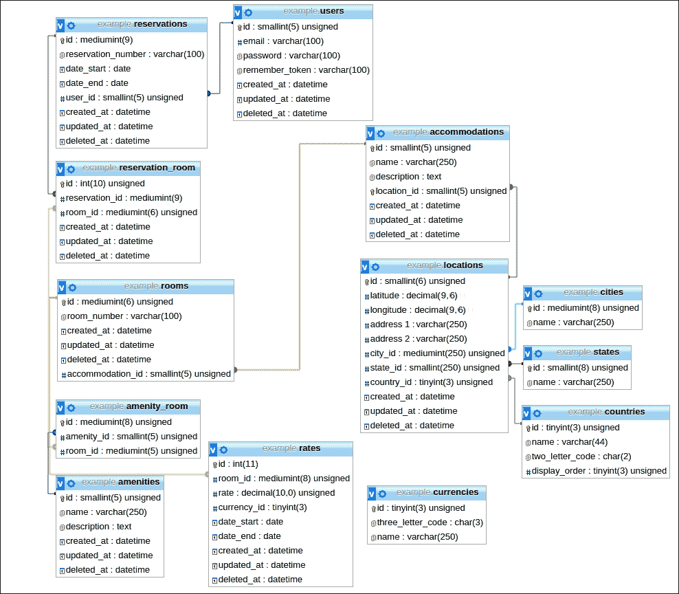

# 第一章。用 phpspec 正确完成设计

自从 2011 年 Laravel 卑微的开始以来，发生了很多事情。. NET 程序员泰勒·奥特韦尔(Taylor Otwell)将 PHP 作为一种辅助项目，因为他被告知托管 PHP 既便宜又无处不在。最初作为 CodeIgniter 扩展的东西变成了它自己的代码。将代码库从 CodeIgniter 的 PHP 5.2 的限制中解放出来，PHP 5.3 必须提供的所有新特性，例如名称间距和闭包，都可以使用。Laravel 第 1 版和第 3 版发布的时间跨度只有一年。有了版本 3，事情发生得非常快。在 4 版发布前后，它的受欢迎程度发生了爆炸，之后它迅速开始从 CodeIgniter、Zend、Symfony、Yii 和 CakePHP 等其他受欢迎的框架中窃取市场份额，最终占据了杆位。除了其富有表现力的语法、出色的文档和热情的创始人之外，还有大型社区支柱 IRC 和 Slack 聊天室、Laravel 播客和 Laracasts 教学视频网站。此外，新创建的商业支持，如提供 100%正常运行时间的 Envoyer，意味着 Laravel 也受到企业的欢迎。随着 Laravel 4.2 的发布，最低要求的 PHP 版本增加到了 5.4，以利用现代 PHP 特性，如*特性*。

使用 Laravel 的特性和新的语法，比如[]数组快捷方式，使得编码变得轻而易举。Laravel 富有表现力的语法，加上这些现代 PHP 特性，使它成为任何希望构建健壮应用程序的开发人员的绝佳选择。


正如谷歌趋势所报道的那样，Laravel 的成功崛起

# 新时代

2014 年末，拉弗尔历史上第二重要的部分发生了。当计划的 4.3 版本改变了 Laravel 的许多核心原则时，社区决定它应该成为版本 5。

Laravel 5 的到来给我们使用它构建软件的方式带来了许多变化。继承自 CodeIgniter 等框架的内置 MVC 架构已经被放弃，取而代之的是更加动态、模块化，甚至大胆地与框架无关。许多组件已经尽可能地去耦。Laravel 历史上最重要的部分将是 Laravel 5.1 版本的到来，这将有 **的长期支持** ( **LTS** )。这样，Laravel 在企业中的地位将更加巩固。此外，PHP 的最低要求将更改为 5.5 版本。所以，对于任何新项目，都建议使用 PHP 5.5，甚至 PHP 5.6，因为升级到 PHP 7 版本会更容易。

## 更精简的应用

`/app`目录被精简了，只留下了应用程序最重要的部分。像`config`、`database`、`storage`和`tests`这样的目录已经被移出`app`目录，因为它们是应用程序本身的辅助。最重要的是，测试工具的集成已经非常成熟。

## PSR

由于 **PHP 标准推荐** ( **PSR** )的开发者 **框架互操作小组** ( **PHP-FIG** )的努力，框架代码的读取、写入和格式化变得更加容易。它甚至允许开发人员更容易地在多个框架中工作。Laravel 是 FIG 的一部分，并将继续将其建议纳入框架。例如，Laravel 5.1 将采用 PSR-2 标准。关于 PHP FIG 和 PSR 的更多信息，请访问 PHP-FIG 网站，[http://www.php-fig.org](http://www.php-fig.org)。

# 安装和配置 Laravel

安装 Laravel 的最新说明可以在 Laravel 网站、[http://laravel.com](http://laravel.com)上找到。要在开发环境中开始使用 Laravel，当前的最佳实践建议使用以下内容:

*   **游民**:这个提供了一个管理虚拟机的便捷方式，比如 Virtualbox。
*   **puppet**:这个是一个优秀的工具，可以用来创建各种类型的虚拟机。欲了解更多关于 PuPHPet 的信息，请访问[https://puphpet.com](https://puphpet.com)。
*   **显形**:这个是 PuPHPet 的替代品。有关平台的信息，请访问[http://phansible.com](http://phansible.com)。
*   **家园**:这个是由 Laravel 社区维护的，是专门为 Laravel 创建的虚拟机，使用 NGINX 代替 Apache。关于宅地的更多信息，请访问[https://github.com/laravel/homestead](https://github.com/laravel/homestead)。

## 安装

基本的过程包括下载和安装 Composer，然后添加 Laravel 作为依赖项。一个重要的细节是，与`/app`目录平行的存储目录需要设置为网络服务器用户可写，以便允许 Laravel 5 执行写日志文件等操作。确保`$ php artisan key:generate`用于生成 32 个字符的密钥并用于哈希也很重要，因为自 PHP 5.6 发布以来，Mcrypt 对其要求更加严格。对于 Laravel 5.1，OpenSSL 将取代 Mcrypt。

## 配置

在 Laravel 4 中，环境的配置方式依赖于服务器或开发机器的主机名，这是相当不自然的。相反，Laravel 5 使用`.env`文件来设置各种环境。该文件包含在`.gitignore`中。因此，每台机器都应该从源代码控制之外的来源接收其配置。

例如，类似下面的代码可以用来设置本地开发:

```php
APP_ENV=local
APP_DEBUG=true
APP_KEY=SomeRandomString
DB_HOST=localhost
DB_DATABASE=example
DB_USERNAME=DBUser
DB_PASSWORD=DBPass
CACHE_DRIVER=file
SESSION_DRIVER=file
```

## 名称间距

Laravel 的一个很好的新功能是，它允许您通过`app:name`命令将最高级别的命名空间设置为`MyCompany`之类的东西。例如，该命令实际上将把`/app`目录内所有相关文件的名称空间从 App 更改为`MyCompany`。这个名字空间存在于`/app`目录中。这实际上在每个文件中都建立了名称空间，而以前在 4.x 版本中，它是可选的。

# TDD 做得对吗

测试驱动开发的文化并不新鲜。相反，它甚至在肯特·贝克(Kent Beck)在 20 世纪 90 年代编写 SUnit 之前就已经存在了。源自 SUnit 的 xUNIT 系列单元测试框架已经发展成为为 PHP 提供测试解决方案。

## PHPUnit

PHP 测试软件的 PHP 端口名为 PHPUnit。然而，PHP 语言中的测试驱动开发是一个相当新的概念。例如，在 2012 年底出版的《脾气暴躁的程序员构建可测试 PHP 应用程序指南》一书中，*克里斯·哈特杰斯*写道:“我开始研究围绕 CodeIgniter 的测试文化。比刚出生的婴儿还弱。”

自从版本 3 使用 PHPUnit 单元测试工具以来，测试一直是 Laravel 框架的一部分，因此 Laravel 包含`phpunit.xml`文件是鼓励开发人员接受测试驱动开发的一个巨大飞跃。

# phpspec

另一个测试工具，RSpec，在 2007 年出现在 Ruby 社区中，是对测试驱动开发的一种改进。它的特色是 **行为驱动开发** ( **BDD** )。将 RSpec 的 BDD 移植到 PHP 的 phpspec 工具正在迅速普及。它的共同创建者马塞洛·杜阿尔特反复声明，“发展局是发展局做得对的”。所以，BDD 简单来说就是 TDD 的*改进*或者进化。Laravel 5 现在巧妙地包含了 phpspec，作为通过行为驱动开发的规范范式来强调*设计的一种方式。*

由于构建 Laravel 5 应用程序的一个重要步骤是指定要创建哪些实体，因此在安装和配置 Laravel 5 之后，开发人员可以通过运行 phpspec 作为设计工具来立即开始设计。

# 实体创建

让我们创建一个示例网络应用程序。如果客户要求我们为旅游建筑建立一个预订系统，那么该系统可能包含住宿(例如酒店、床和早餐)、房间、价格和预订等实体。

简化的数据库模式如下所示:



# my company 数据库模式

数据库模式有以下假设:

*   住宿有许多房间
*   为单个用户预订
*   预订可能包含多个房间
*   预订有开始日期和结束日期
*   从开始日期到结束日期，房价对一个房间有效
*   一个房间有许多便利设施
*   预订的开始日期必须早于结束日期
*   预订不能超过十五天
*   预订不能超过四个房间

# 用 phpspec 设计

现在，让我们开始使用 phpspec 作为设计工具来构建我们的实体。

如果顶级命名空间是`MyCompany`，那么使用 phpspec，只需键入以下命令:

```php
# phpspec describe MyCompany/AccommodationRepository

```

键入前面的命令后，将创建`spec/AccommodationSpecRepository.php`:

```php
<?php

namespace spec\MyCompany;

use PhpSpec\ObjectBehavior;
use Prophecy\Argument;

class AccommodationRepositorySpec extends ObjectBehavior
{
    function it_is_initializable()
    {
        $this->shouldHaveType('MyCompany\AccommodationRepository');
    }
<?php

namespace MyCompany;

class AccommodationRepository
{
}
```

### 类型

phpspec 的路径应该添加到`.bashrc`或`.bash_profile`文件中，这样 phpspec 就可以直接运行。

然后，键入以下命令:

```php
# phpspec run

```

在键入前面的命令时，开发人员如下所示:

```php
class MyCompany\AcccommodationRepository does not exist.
Do you want me to create 'MyCompany\AccommodationRepository' for you? [Y/n]

```

输入 *Y* 后，创建`AccommodationRepository.php`类，如下所示:

```php
<?php

namespace MyCompany;

class AccommodationRepository
{}
```

### 类型

**下载示例代码**

您可以从您在[http://www.packtpub.com](http://www.packtpub.com)的账户下载您购买的所有 Packt Publishing 书籍的示例代码文件。如果您在其他地方购买了这本书，您可以访问[http://www.packtpub.com/support](http://www.packtpub.com/support)并注册，以便将文件直接通过电子邮件发送给您。

phpspec 的美在于它的简单性和加快创建伴随规范的类的能力。


用 phpspec 描述和创建类的基本步骤

# 用 phpspec 指定

phpspec 的核心是允许我们指定实体的行为并同时测试它们的能力。通过简单地指定客户给出的业务规则，我们可以轻松地为每个业务规则创建测试。然而，phpspec 的真正力量在于它如何使用一种富有表现力的自然语言语法。让我们看看之前给我们的关于预订的业务规则:

*   预订的开始日期必须早于结束日期
*   预订不能超过十五天
*   预订不能超过四个房间

运行以下命令:

```php
# phpspec describe
 MyCompany/Accommodation/ReservationValidator

```

phpspec 将为前面的命令生成以下输出:

```php
<?php

namespace spec\MyCompany\Accommodation;

use PhpSpec\ObjectBehavior;
use Prophecy\Argument;

class ReservationSpec extends ObjectBehavior
{
    function it_is_initializable()
    {
        $this->shouldHaveType('MyCompany\Accommodation\Reservation');
    }
}
```

然后，使用以下命令运行 phpspec:

```php
# phpspec run

```

phpspec 将照常响应，输出如下:

```php
Do you want me to create 
 'MyCompany\Accommodation\ReservationValidator' for you?

```

然后，phpspec 将创建`ReservationValidator`类，如下所示:

```php
<?php namespace MyCompany\Accommodation;

 class ReservationValidator {
 }
```

让我们创建一个`validate()`函数，该函数将采用以下参数:

*   确定预订开始的开始日期字符串
*   确定预订结束的结束日期字符串
*   要添加到保留中的`room`对象的数组

以下是创建`validate()`函数的代码片段:

```php
<?php
namespace MyCompany\Accommodation;

use Carbon\Carbon;

class ReservationValidator
{

    public function validate($start_date, $end_date, $rooms)
    {
    }
}
```

我们将包括`Carbon`课，这将帮助我们处理日期。对于第一个业务规则，即预订的开始日期必须在结束日期之前，我们现在可以在`ReservationValidatorSpec`类中创建我们的第一个规范方法，如下所示:

```php
function its_start_date_must_come_before_the_end_date ($start_date,$end_date,$room)
{
    $rooms = [$room];
    $start_date = '2015-06-03';
    $end_date = '2015-06-03';
    $this->shouldThrow('\InvalidArgumentException')->duringValidate( $start_date, $end_date, $rooms);
}
```

在前面的功能中，phpspec 以`it`或`its`开始规格。phpspec 使用蛇状外壳以获得高易读性，`start_date_must_be_less_than_the_end_date`是该规范的精确副本。这不是很棒吗？

当`$start_date`、`$end_date`、`room`通过时，自动被嘲讽。不需要别的了。我们将创建一个有效的`$rooms`数组。但是，我们将设置`$start_date`和`$end_date`，使它们具有相同的值，从而导致测试失败。表达式语法如前面的代码所示。`shouldThrow`在`during`之前，然后取方法名`Validate`。

我们已经为 phpspec 提供了自动为我们创建`validate()`方法所需的东西。我们将指定`ReservationValidator`类`$this`抛出`InvalidArgumentException`。运行以下命令:

```php
# phpspec run

```

phpspec 再次向我们提出以下问题:

```php
 Do you want me to create 'MyCompany\Accommodation\Reservation::validate()' 
 for you?

```

只需在提示符下键入 *Y* ，该方法就在`ReservationValidator`类中创建了。就这么简单。当 phpspec 再次运行时，它将失败，因为该方法尚未引发异常。所以现在，需要编写代码。在该函数中，我们将从一个格式类似“2015-06-02”的字符串中创建两个`Carbon`对象，以便我们能够利用 Carbon 强大的日期比较功能。在这种情况下，我们将使用`$date1->diffInDays($date2);`方法来测试`$end`和`$start`之间的差异是否小于 1。如果是这样，我们将抛出`InvalidArgumentException`并显示一条用户友好的消息。现在，当我们重新运行 phpspec 时，测试将通过:

```php
$end = Carbon::createFromFormat('Y-m-d', $end_date);
$start = Carbon::createFromFormat('Y-m-d', $start_date);

        if ($end->diffInDays($start)<1) {
            throw new \InvalidArgumentException('Requires end date to be greater than start date.');
        }
```

## 红色、绿色、重构

测试驱动开发的规则要求*红色*、*绿色*、*重构*，这意味着一旦测试通过(绿色)，我们应该在不改变功能的情况下尝试重构或简化方法内部的代码。

看看`if`测试:

```php
if ( $end->diffInDays($start) < 1 ) {
```

前面的代码不太可读。我们可以用以下方式重构它:

```php
if (!$end->diffInDays($start)>0)
```

然而，即使是前面的代码也不是很清晰，我们也是直接在代码中使用整数。

让我们将`0`移入一个常数。为了提高可读性，我们将它更改为预订所需的最小天数，如下所示:

```php
 const MINIMUM_STAY_LENGTH = 1;
```

让我们将比较提取到一个方法中，如下所示:

```php
    /**
     * @param $end
     * @param $start
     * @return bool
     */
    private function endDateIsGreaterThanStartDate($end, $start)
    {
        return $end->diffInDays($start) >= MINIMUM_STAY_LENGTH;
    }
```

我们现在可以这样写`if`语句:

```php
if (!$this->endDateIsGreaterThanStartDate($end, $start))
```

前面的陈述更具表现力和可读性。

现在，对于下一条规则，它规定预订不能超过十五天，我们需要以下面的方式创建方法:

```php
function it_cannot_be_made_for_more_than_fifteen_days(User $user, $start_date, $end_date, Room $room)
{
        $start_date = '2015-06-01';
        $end_date = '2015-07-30';
        $rooms = [$room];
        $this->shouldThrow('\InvalidArgumentException')
        ->duringCreateNew( $user,$start_date,$end_date,$rooms);
}
```

这里，我们设置`$end_date`使得它被分配一个发生在`$start_date`之后一个多月的日期，以使方法抛出一个`InvalidArgumentException`。再次，一旦执行`phpspec`命令，测试将失败。让我们修改现有的方法来检查日期范围。我们将向该方法添加以下代码:

```php
  if ($end->diffInDays($start)>15) {
       throw new \InvalidArgumentException('Cannot reserve a room
       for more than fifteen (15) days.');
  }
```

phpspec 再次愉快地成功运行了所有测试。重构时，我们将再次提取`if`条件并创建常量，如下所示:

```php
   const MAXIMUM_STAY_LENGTH = 15;
   /**
     * @param $end
     * @param $start
     * @return bool
     */
    private function daysAreGreaterThanMaximumAllowed($end, $start)
    {
        return $end->diffInDays($start) > self::MAXIMUM_STAY_LENGTH;
    }

   if ($this->daysAreGreaterThanMaximumAllowed($end, $start)) {
            throw new \InvalidArgumentException ('Cannot reserve a room for more than fifteen (15) days.');
   }
```

## 整理东西

我们可以把这样的东西留下，但是既然我们有测试，就让我们清理一下。由于`endDateIsGreaterThanStartDate($end, $start)`和`daysAreGreaterThanMaximumAllowed($end, $start)`函数都分别检查最小和最大允许停留时间，我们可以从另一个方法调用它们。

我们将把`endDateIsGreaterThanStartDate()`重构为`daysAreLessThanMinimumAllowed($end, $start)`，然后创建另一个检查最小和最大停留时间的方法，如下所示:

```php
private function daysAreWithinAcceptableRange($end, $start)
    {
        if ($this->daysAreLessThanMinimumAllowed($end, $start)
            || $this->daysAreGreaterThanMaximumAllowed($end, $start)) {
           return false;
        } else {
           return true;
        }
    }
```

这使得在`createNew`函数中只剩下一个函数，而不是两个，如下所示:

```php
if (!$this->daysAreWithinAcceptableRange($end, $start)) {
            throw new \InvalidArgumentException('Requires a stay length from '
                . self::MINIMUM_STAY_LENGTH . ' to '. self::MAXIMUM_STAY_LENGTH . ' days.');
        }
```

对于第三条规则，即预订不能包含超过四个房间，过程是相同的。创建规范，如下所示:

```php
it_cannot_contain_than_four_rooms
```

这里的变化将在参数中。这一次，我们将模拟五个房间，这样测试就会失败，如下所示:

```php
function it_cannot_contain_than_four_rooms(User $user, $start_date, $end_date, Room $room1, Room $room2, Room $room3, Room $room4, Room $room5)
```

五个房间对象将被加载到`$rooms`数组中，测试失败如下:

```php
$rooms = [$room1, $room2, $room3, $room4, $room5];
    $this->shouldThrow('\InvalidArgumentException')->duringCreateNew($user,$start_date,$end_date,$rooms);
    }
```

添加代码检查数组的大小后，最终的类将如下所示:

```php
<?php

namespace MyCompany\Accommodation;

use Carbon\Carbon;
class ReservationValidator
{

    const MINIMUM_STAY_LENGTH = 1;
    const MAXIMUM_STAY_LENGTH = 15;
    const MAXIMUM_ROOMS = 4;

    /**
     * @param $start_date
     * @param $end_date
     * @param $rooms
     * @return $this
     */
    public function validate($start_date, $end_date, $rooms)
    {
        $end = Carbon::createFromFormat('Y-m-d', $end_date);
        $start = Carbon::createFromFormat('Y-m-d', $start_date);

        if (!$this->daysAreWithinAcceptableRange($end, $start)) {
            throw new \InvalidArgumentException('Requires a stay length from '
                . self::MINIMUM_STAY_LENGTH . ' to '. self::MAXIMUM_STAY_LENGTH . ' days.');
        }
        if (!is_array($rooms)) {
            throw new \InvalidArgumentException('Requires last parameter rooms to be an array.');
        }
        if ($this->tooManyRooms($rooms)) {
            throw new \InvalidArgumentException('Cannot reserve more than '. self::MAXIMUM_ROOMS .' rooms.');
        }

        return $this;

    }

    /**
     * @param $end
     * @param $start
     * @return bool
     */
    private function daysAreLessThanMinimumAllowed($end, $start)
    {
        return $end->diffInDays($start) < self::MINIMUM_STAY_LENGTH;
    }

    /**
     * @param $end
     * @param $start
     * @return bool
     */
    private function daysAreGreaterThanMaximumAllowed($end, $start)
    {
        return $end->diffInDays($start) > self::MAXIMUM_STAY_LENGTH;
    }

    /**
     * @param $end
     * @param $start
     * @return bool
     */
    private function daysAreWithinAcceptableRange($end, $start)
    {
        if ($this->daysAreLessThanMinimumAllowed($end, $start)
            || $this->daysAreGreaterThanMaximumAllowed($end, $start)) {
            return false;
        } else {
            return true;
        }
    }

    /**
     * @param $rooms
     * @return bool
     */
    private function tooManyRooms($rooms)
    {
        return count($rooms) > self::MAXIMUM_ROOMS;
    }

    public function rooms(){
        return $this->belongsToMany('MyCompany\Accommodation\Room')->withTimestamps();
    }

}
```

方法很干净。只有两个`if`语句——第一个用于验证日期范围是否有效，另一个用于验证房间数量是否在有效范围内。常量很容易访问，并且可以随着业务需求的变化而变化。显然，将 phpspec 添加到开发工作流中结合了前面需要的两个步骤——用 PHPUnit 编写断言，然后编写代码。现在，我们将离开 phpspec，转到 Artisan，开发人员对它很熟悉，因为它是 Laravel 早期版本的一个特性。

# 控制器

接下来，我们将创建一些示例控制器。在写这本书的时候，我们需要一起使用 Artisan 和 phpspec。让我们为`room`实体创建一个控制器，如下所示:

```php
$ php artisan make:controller RoomController

<?php namespace MyCompany\Http\Controllers;

use MyCompany\Http\Requests;
use MyCompany\Http\Controllers\Controller;

use Illuminate\Http\Request;
class RoomController extends Controller {

        /**
        * Display a listing of the resource.
        *
        * @return Response
        */
        public function index()
        {}

        /**
        * Show the form for creating a new resource.
        *
        * @return Response
        */
        public function create()
        {}

        /**
        * Store a newly created resource in storage.
        *
        * @return Response
        */
        public function store()
        {}
….

}
```

### 注

请注意，这将在`app/Http/Controllers`目录中创建，这是 Laravel 5 的新位置。新的 HTTP 目录包含控制器、中间件和请求目录，将与 HTTP 请求或实际请求相关的文件组合在一起。此外，这种目录配置是可选的，路由可以调用任何自动加载的位置，通常通过命名空间 PSR-4 结构。

## 命令总线

Laravel 5 采用了命令总线模式，该模式创建在`app/Commands`目录中创建的命令。虽然 Laravel 4 中的命令被认为是命令行工具，但是在 Laravel 5 中，命令被认为是一个类，它的方法可以在应用程序中使用，允许代码的良好重用。这里命令的概念是需要完成的任务，或者在我们的例子中，是为用户保留的房间。总线的范例然后使用新的`DispatchesCommands`特性来传输命令，这在基本控制器类中使用。Artisan 创建的每个控制器都将这个类扩展到一个处理程序方法，在那里执行实际的工作。

为了使用 Laravel 的命令总线设计模式，我们现在将使用 Artisan 创建一些命令。我们将在以后的章节中详细介绍命令，但首先，我们将键入以下命令:

```php
$ php artisan make:commandReserveRoomCommand --handler

```

键入这个创建了一个命令来预留一个可以在代码中任何地方调用的空间，将业务逻辑与控制器和模型隔离开来，并允许以异步模式执行该命令。

```php
<?php namespace MyCompany\Commands;

use MyCompany\Commands\Command;

class ReserveRoomCommand extends Command {

    /**
    * Create a new command instance.
    *
    * @return void
    */
    public function __construct()
    {
        //
    }

}
```

填写完命令的细节后，该类现在将如下所示:

```php
<?php namespace MyCompany\Commands;

use MyCompany\Commands\Command;
use MyCompany\User;

class ReserveRoomCommand extends Command {

    public $user;
    public $rooms;
    public $start_date;
    public $end_date;

    /**
    * Create a new command instance.
    *
    * @return void
    */
    public function __construct(User $user, $start_date, $end_date, $rooms)
    {
        $this->rooms = $rooms;
        $this->user = $user;
        $this->start_date = $start_date;
        $this->end_date = $end_date;
    }

}
```

`--handler`参数创建一个额外的类`ReserveRoomCommandHandler`，包含一个构造函数和一个句柄方法，注入`ReserveRoomCommand`。该文件将出现在`app/Handlers/Commands`目录中。如果不使用`--handler`标志，那么`ReserveRoomCommand`类将包含自己的`handler`方法，并且不会创建单独的处理程序类:

```php
<?php namespace MyCompany\Handlers\Commands;

use MyCompany\Commands\ReserveRoomCommand;

use Illuminate\Queue\InteractsWithQueue;

class ReserveRoomCommandHandler {

    /**
    * Create the command handler.
    *
    * @return void
    */
    public function __construct()
    {
        //
    }

    /**
    * Handle the command.
    *
    * @paramReserveRoomCommand  $command
    * @return void
    */
    public function handle(ReserveRoomCommand $command)
    {
        //
    }

}
```

我们将填写预约验证的办理方式，如下:

```php
public function handle(ReserveRoomCommand $command)
    {
        $reservation = new \MyCompany\Accommodation\ReservationValidator();
        $reservation->validate(
        $command->start_date, $command->end_date, $command->rooms);
    } 
```

# 总结

phpspec 增加了一种成熟、健壮、测试优先、测试驱动和一种逐例规范的方法来创建软件的业务逻辑方面。这一点，再加上模型、控制器、命令、事件和事件处理程序的易于创建，将 Laravel 置于 PHP 框架竞赛的最前端。此外，它还采用了业内最佳程序员使用的许多最佳实践。

在本章中，我们学习了如何使用 phpspec 从命令行轻松设计类及其附带的测试。这个工作流程，伴随着 Artisan，使得建立 Laravel 5 应用程序基本结构的过程变得非常容易。

在下一章中，我们将了解数据库迁移、迁移背后的机制以及创建测试种子的方法。