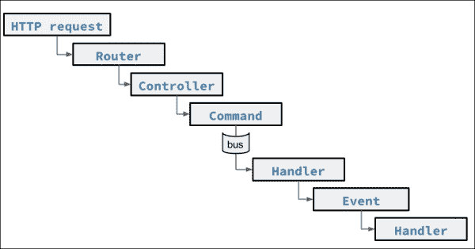

# 第三章。建筑服务、命令和事件

在前两章中，我们建立了住宿预订系统的基本结构。我们设计了我们的类，创建了我们的数据库模式，并学习了如何测试它们。现在我们需要将业务需求转化为代码。

在本章中，我们将涵盖以下主题:

*   命令
*   事件
*   命令处理程序
*   事件处理程序
*   排队事件处理程序
*   排队命令
*   控制台命令
*   命令调度程序

# 请求路由

如前所述，Laravel 5 采用了*命令总线模式*。Laravel 4 将命令视为可以从命令行执行的东西，而在 Laravel 5 中，命令可以在任何上下文中使用，从而允许代码的出色重用。

以下是 Laravel 4 HTTP 请求流的示例:


以下是 Laravel 5 HTTP 请求流的示例:



第一张图片展示了 Laravel 4 的请求流程。通过 HTTP 的请求由路由器处理，然后发送到控制器，在那里，我们通常可以与模型的存储库或目录进行对话。在 Laravel 5 中，这仍然是可能的；然而，如第二张图片所示，我们可以看到添加额外的块、层或模块的能力允许我们将请求的生命周期分成独立的部分。Laravel 4 允许我们将处理请求的所有代码放在控制器内部，而在 Laravel 5 中，我们可以自由地做同样的事情，尽管现在我们也能够轻松地将请求分成不同的部分。其中一些概念源自**领域驱动设计** ( **DDD** )。

在控制器内部，使用 **数据传输对象** ( **DTO** )范例来实例化该命令。然后，命令被发送到命令总线，在那里由一个处理程序类处理，该类有两种方法:`__construct()`和`handle()`。在处理程序内部，我们激发或实例化一个事件。事件同样由事件处理程序方法以相同的方式处理，有两种方法:`__construct()`和`handle()`。

目录结构非常干净，看起来是这样的:

```php
/app/Commands
/app/Events/
/app/Handlers/
/app/Handlers/Commands
/app/Handlers/Events
/app/HTTP/Controllers

```

这不言自明。命令和事件位于各自的目录中，而每个命令和事件的处理程序都有自己的目录。

### 注

Laravel 5.1 将`app/Commands`目录的名称改为`app/Jobs`，以确保程序员不会混淆命令总线和控制台命令的概念。

## 用户故事

命令组件的想法可以很容易地从用户故事或用户实现目标所需的任务中获得。最简单的例子是搜索房间:

```php
As a hotel website user,
I want to search for a room
so that I can select from a list of results.
```

源自敏捷方法的用户故事保证了编写的代码与业务需求紧密匹配。他们经常遵循这样的模式“作为一个……我想……这样……”。这定义了`actor`、`intent`和`benefit`。它帮助我们计划如何将每个任务转换成代码。在我们的例子中，用户故事可以转化为任务。

作为酒店网站用户，我将创建以下任务列表:

1.  作为一个酒店网站用户，我想搜索一个房间，这样我就可以从结果列表中选择一个房间。
2.  作为一个酒店网站用户，我想预订一个房间，这样我就可以住在酒店了。
3.  作为酒店网站用户，我想收到一封包含预订详细信息的电子邮件，这样我就可以有一份预订的副本。
4.  作为一个酒店网站用户，我想在等候名单上，这样我就可以在有房间的时候预订房间。
5.  作为一个酒店网站用户，我想得到房间可用性的通知，以便我可以预订房间。

## 要编码的用户故事

第一个任务，搜索房间，很可能是来自用户或外部服务的 RESTful 调用，因此这个任务将暴露给我们的控制器，从而暴露给我们的 RESTful API。

第二个任务，预订房间，是由用户或其他服务发起的类似操作。此任务可能需要用户登录。

第三个任务可能依赖于第二个任务。此任务需要与另一个流程进行交互，该流程会向用户发送一封包含预订详细信息的确认电子邮件。我们也可以这样写:*作为酒店网站，我想发一封邮件，里面有预订的详细信息，这样他或她就可以有一份预订的副本*。

第四个任务，被放在等待列表中，可以是在预订房间的请求启动后执行的命令；在另一用户同时预订房间的情况下。它很可能是从应用程序本身调用的，而不是从用户调用的，因为用户不知道实时住宿清单。这可能有助于我们处理比赛情况。此外，我们应该假设当网站用户决定预订哪个房间时，该房间没有锁定机制来保证可用性。我们也可以这样写:*作为一个酒店网站，我想把一个用户放在等候名单上，这样他们就可以在有房间的时候得到通知*。

对于第五个任务，当用户被放在等候名单上时，当房间变得可用时，也可以通知用户该房间。此操作检查房间的可用性，然后检查等候名单上的任何用户。用户故事可以改写如下:*作为酒店网站，我想通知一个等候名单用户房间的可用性，以便他或她可以预订房间*。如果有空房间，等候名单上的第一个用户将通过电子邮件被告知有空房。这个命令会频繁执行，就好像它是一个 cron 作业。幸运的是，Laravel 5 有一个新的机制，允许以给定的频率执行命令。

显而易见，如果用户故事的撰写必须同时使用网站作为演员(“作为酒店网站……”)或网站用户作为演员(“作为酒店网站用户……”)，命令很有用，可以从 RESTful API(用户端)或者从 Laravel 应用程序本身启动。

因为我们的第一个任务很可能涉及外部服务，所以我们将创建一个路由和一个控制器来处理请求。

## 控制器

第一步涉及路线的创建，第二步涉及控制器的创建。

### 寻找房间

首先，让我们在`routes.php`文件中创建一条路线，并将其映射到`controller`方法，如下所示:

```php
Route::get('search', 'RoomController@search');
```

请求参数，如开始/结束日期和位置详细信息如下:

```php
{
  "start_date": "2015-07-10"
  "end_date": "2015-07-17"
  "city": "London"
  "country": "England"
}
```

搜索参数将作为 JSON 编码的对象发送。它们将按如下方式发送:

```php
http://websiteurl.com/search?query={%22start_date%22:%222015-07-10%22,%22end_date%22:%222015-07-17%22,%22city%22:%22London%22,%22country%22:%22England%22}
```

现在，让我们向我们的`room`控制器添加一个`search`方法，以在请求作为对象进入的情况下处理 JSON 输入，如下所示:

```php
/**
* Search for a room in an accommodation
*/
public function search()
{
      json_decode(\Request::input('query'));
}
```

请求外观处理输入变量查询，然后将其 JSON 结构解码成一个对象。

在[第 4 章](04.html "Chapter 4. Creating RESTful APIs")、*创建 RESTful API*中，我们将完成`search`方法的代码，但是现在，我们将简单地创建 RESTful API 系统的这一部分的架构。

### 控制器发出命令

对于第二个任务，预订房间，我们将创建一个命令，因为我们很可能需要一个后续操作，我们将通过发布者订阅者模式启用它。发布者订阅者模式用于表示发送消息的*发布者*和收听这些消息的*订阅者*。

将路线添加到`routes.php`如下:

```php
Route::post('reserve-room', 'RoomController@store');

```

我们将柱子映射到房间控制器的`store`方法；这将创建预订。请记住，我们创建了如下命令:

```php
$ php artisan make:commandReserveRoomCommand -–handler

```

我们的`ReserveRoomCommand`课看起来是这样的:

```php
<?php namespace MyCompany\Commands;

use MyCompany\Commands\Command;
use MyCompany\User;

class ReserveRoomCommand extends Command {

    public $user;
    public $rooms;
    public $start_date;
    public $end_date;

    /**
    * Create a new command instance.
    *
    * @return void
    */
    public function __construct(User $user, $start_date, $end_date, $rooms)
    {
        $this->rooms = $rooms;
        $this->user = $user;
        $this->start_date = $start_date;
        $this->end_date = $end_date;
     }

}
```

我们需要向构造函数添加以下属性:

```php
    public $user;
    public $rooms;
    public $start_date;
    public $end_date;
```

另外，向构造函数添加以下赋值:

```php
        $this->rooms = $rooms;
        $this->user = $user;
        $this->start_date = $start_date;
        $this->end_date = $end_date;
```

这让我们能够贯彻价值观。

### 事件命令

现在让我们创造一个事件。使用`artisan`创建一个事件`RoomWasReserved`，当房间被创建时将被触发:

```php
$ phpartisan make:eventRoomWasReserved

```

`RoomWasReserved`事件类看起来像下面的代码片段:

```php
<?php namespace MyCompany\Events;

use MyCompany\Accommodation\Reservation;
use MyCompany\Events\Event;
use MyCompany\User;

use Illuminate\Queue\SerializesModels;

class RoomWasReserved extends Event {

    use SerializesModels;

    private $user;
    private $reservation;

    /**
    * Create a new event instance.
    *
    * @return void
    */
    public function __construct(User $user, Reservation $reservation)
    {
        $this->user = $user;
        $this->reservation = $reservation;
    }
}
```

我们将告诉它使用`MyCompany\Accommodation\Reservation`和`MyCompany\User`实体，以便我们可以将它们传递给构造函数。在构造函数中，我们将它们分配给`event`对象中的实体。

现在，让我们从命令处理程序内部激发事件。Laravel 为您提供了一个简单的`event()`方法，作为一个便利/助手方法，可以触发一个事件。我们将使用实例化的保留和`user`注入`RoomWasReserved`事件，如下所示:

```php
event(new RoomWasReserved($user, $reservation));

```

### ReserveRoomCommandHandler 类

我们的`ReserveRoomCommandHandler`类现在实例化一个新的预留，使用`createNew`工厂方法注入依赖项，最后，如下所示触发`RoomWasReserved`事件:

```php
<?phpnamespace MyCompany\Handlers\Commands;

use MyCompany\Commands\ReserveRoomCommand;

use Illuminate\Queue\InteractsWithQueue;

class ReserveRoomCommandHandler {

    /**
    * Create the command handler.
    *
    * @return void
    */
    public function __construct()
    {
        //
    }

    /**
    * Handle the command.
    *
    * @paramReserveRoomCommand  $command
    * @return void
    */
    public function handle(ReserveRoomCommand $command)
    {

        $reservationValidator = new \MyCompany\Accommodation\ReservationValidator();

        if ($reservationValidator->validate($command->start_date,$command->end_date,$command->rooms)) {
              $reservation = 
                $reservationRepository->create(
                ['date_start'=>$command->$command→start_date,
                'date_end'=>$command->end_date,
                'rooms'=>$command->'rooms']);
        }
    $reservation = new 
      event(new RoomWasReserved($command->user,$reservation));
    }
}
```

### 事件处理程序

现在，我们需要创建事件处理程序。正如您所料，Artisan 提供了一种方便的方法，尽管语法有点不同。奇怪的是，这一次短语中没有出现*使*这个词:

```php
$ php artisan handler:eventRoomReservedEmail --event=RoomWasReserved
 <?php namespace MyCompany\Handlers\Events;

 use MyCompany\Events\RoomWasReserved;

 use Illuminate\Queue\InteractsWithQueue;
 use Illuminate\Contracts\Queue\ShouldBeQueued;

 class RoomReservedEmail {

 /**
 * Create the event handler.
 * @return void
 */
 public function __construct()
 {
 }

 public function handle(RoomWasReserved $event)
 {
 //TODO: send email to $event->user
 //TODO: with details about $event->reservation;
 }
 }

```

现在我们需要将事件连接到它的侦听器。我们将如下编辑`app/Providers/EventServiceProvider.php`文件:

```php
protected $listen = [
    'MyCompany\Events\RoomWasReserved' => [
      'MyCompany\Handlers\Events\RoomReservedEmail',
      ],
    ];
```

如前面的代码片段所示，我们将向`$listen`数组添加键值对。如图所示，键、事件名称和处理程序数组需要完整的路径。在这种情况下，我们只有一个处理程序。

## 排队事件处理程序

如果我们不希望立即处理事件，而是将其放入队列中，我们可以将`–queued`添加到创建命令中，如下所示:

```php
$ php artisan handler:eventRoomReservedEmail --event=RoomWasReserved --queued

```

```php
 <?php namespace MyCompany\Handlers\Events;

 use MyCompany\Events\RoomWasReserved;

 use Illuminate\Queue\InteractsWithQueue;
 use Illuminate\Contracts\Queue\ShouldBeQueued;

 class RoomReservedEvent implements ShouldBeQueued {

 use InteractsWithQueue;

 public function __construct()
 {
 //
 }

 use Illuminate\Contracts\Queue\ShouldBeQueued;

```

这个接口告诉 Laravel 事件处理程序应该排队，而不是同步执行:

```php
use Illuminate\Queue\InteractsWithQueue;
```

这种特性允许我们与队列交互，以便能够执行任务，例如删除作业。

## 等待列表命令

对于第四个任务，被放在等待列表中，我们需要创建另一个命令，该命令将从预订控制器内部调用。同样，使用 Artisan，我们可以很容易地创建命令及其相应的事件，如下所示:

```php
$ php artisan make:commandPlaceOnWaitingListCommand
$ php artisan make:eventPlacedOnWaitinglist

```

现在，在我们的预订控制器中，我们将添加`roomAvailability`的支票，然后如下发送`PlaceOnWaitinglist`命令:

```php
public function store()
    {
    …
    …
        if ($roomAvailable) {
            $this->dispatch(
              new ReserveRoomCommand( $start_date, $end_date, $rooms)
            );
        } else {
            $this->dispatch(
              new PlaceOnWaitingListCommand($start_date, $end_date, $rooms)
            );
        }
    …
```

## 排队的命令

通过将`queued`添加到`create`命令中，我们可以轻松地对命令进行排队:

```php
$ php artisan make:commandReserveRoomCommand -–handler --queued

```

这将使用任何可用的排队系统，如 beanstalkd，并且不会立即运行命令。相反，它将被放在队列中，稍后运行。我们需要给`Command`类添加一个接口:

```php
Illuminate\Contracts\Queue\ShouldBeQueued

```

在这种情况下，`ReserveRoomCommand`类将如下所示:

```php
<?php namespace MyCompany\Commands;

use MyCompany\Commands\Command;

use Illuminate\Queue\SerializesModels;
use Illuminate\Queue\InteractsWithQueue;
use Illuminate\Contracts\Queue\ShouldBeQueued;

class MyCommand extends Command implements ShouldBeQueued {

	use InteractsWithQueue, SerializesModels;

	/**
	 * Create a new command instance.
	 *
	 * @return void
	 */
	public function __construct()
	{
		//
	}

}
```

在这里我们可以看到`InteractsWithQueue`和`ShouldBeQueued`类都已经包含进去了，`ReserveRoomCommand`类扩展了命令，实现了`ShouldBeQueued`类。另一个有趣的特点是`SerializesModels`。这将序列化传入的任何模型，以便以后使用。

## 控制台命令

对于第五个任务，让我们创建一个`console`命令，它将被频繁执行:

```php
$ php artisan make:consoleManageWaitinglist

```

这将创建一个可以从 Artisan 命令行工具执行的命令。如果您使用过 Laravel 4，您可能对这种类型的命令很熟悉。这些命令存储在`Console/Commands/`目录中。

为了让 Laravel 知道这件事，我们需要将其添加到`$commands`数组中的`app/Console/Kernel.php`中:

```php
protected $commands = [
    'MyCompany\Console\Commands\Inspire',
    'MyCompany\Console\Commands\ManageWaitinglist',
    ];
```

内容如下所示:

```php
<?php namespace MyCompany\Console\Commands;

use Illuminate\Console\Command;
use Symfony\Component\Console\Input\InputOption;
use Symfony\Component\Console\Input\InputArgument;

class ManageWaitinglist extends Command {

    /**
    * The console command name.
    *
    * @var string
    */
    protected $name = 'command:name';

    /**
    * The console command description.
    *
    * @var string
    */
    protected $description = 'Command description.';

    /**
    * Create a new command instance.
    *
    * @return void
    */
    public function __construct()
    {
        parent::__construct();
    }

    /**
    * Execute the console command.
    *
    * @return mixed
    */
    public function fire()
    {
        //
    }

    /**
    * Get the console command arguments.
    *
    * @return array
    */
    protected function getArguments()
    {
        return [
          ['example', InputArgument::REQUIRED, 'An example argument.'],
        ];
    }

    /**
    * Get the console command options.
    *
    * @return array
    */
    protected function getOptions()
    {
        return [
          ['example', null, InputOption::VALUE_OPTIONAL, 'An example option.', null],
        ];
    }
}
```

`$name`属性就是 Artisan 的叫法。例如，如果我们设置以下内容:

```php
protected $name = 'manage:waitinglist';
```

然后，通过运行以下命令，我们可以管理等待列表:

```php
$ php artisan manage:waitinglist

```

`getArguments()`和`getOptions()`方法是签名相同的类似方法，但用途不同。

`getArguments()`方法指定必须用于启动命令的参数数组。`getOptions()`方法用`–`指定，可以是`optional`、`repeated`，用`VALUE_NONE`选项，可以简单地作为标志使用。

我们将在`fire()`方法中编写命令的主代码。如果我们想从这个命令中调度一个命令，我们将把`DispatchesCommands`特性添加到类中，如下所示:

```php
 use DispatchesCommands;

 <?php namespace MyCompany\Console\Commands;

 use Illuminate\Console\Command;
 use Illuminate\Foundation\Bus\DispatchesCommands;
 use Symfony\Component\Console\Input\InputOption;
 use Symfony\Component\Console\Input\InputArgument;

 class ManageWaitinglist extends Command {

 use DispatchesCommands;

 /**
 * The console command name.
 * @var string
 */
 protected $name = 'manage:waitinglist';

 /**
 * The console command description.
 * @var string
 */
 protected $description = 'Manage the accommodation waiting list.';

 /**
 * Create a new command instance.
 *
 * @return void
 */
 public function __construct()
 {
 parent::__construct();
 }

 /**
 * Execute the console command.
 * @return mixed
 */
 public function fire()
 {
 // TODO: write business logic to manage waiting list
 if ($roomIsAvailableFor($user)) {
 $this->dispatch(new ReserveRoomCommand());
 }
 }

 /**
 * Get the console command arguments.
 * @return array
 */
 protected function getArguments()
 {
 return [];
 }

 /**
 * Get the console command options.
 * @return array
 */
 protected function getOptions()
 {
 return [];
 }
}

```

## 命令调度程序

现在，我们将安排该命令每 10 分钟运行一次。传统上，这是通过创建 cron 作业来执行 Laravel 控制台的命令来完成的。现在，Laravel 5 提供了一种新的机制来实现这一点——命令调度器。

新的`artisan`命令运行如下:

```php
$ php artisan schedule:run

```

只需将该命令添加到 cron 中，Laravel 就会自动运行`Kernel.php`文件中的所有命令。

这些命令需要添加到`Schedule`功能中，如下所示:

```php
protected function schedule(Schedule $schedule)
    {
        $schedule->command('inspire')
             ->hourly();
        $schedule->command('manage:waitinglist')
            ->everyFiveMinutes();

    }
```

`inspire`命令是 Laravel 提供的一个示例命令，用于演示功能。我们将简单地添加我们的命令。这将每 5 分钟调用一次`manage:waitinglist`命令——这再简单不过了。

现在我们需要修改`crontab`文件，让 Artisan 运行调度程序。

`crontab`是一个包含在特定时间运行的命令的文件。要修改此文件，请键入以下命令:

```php
$ sudo crontab -e

```

我们将使用`vi`或任何指定的编辑器来修改`cron`表。添加下面一行将告诉`cron`每分钟运行一次调度程序:

```php
* * * * * php /path/to/artisan schedule:run 1>> /dev/null 2>&1

```

# 总结

Laravel 在短短的两年时间里不断发展，从 CodeIgniter 的模型-视图-控制器范式转变为采用现代域驱动设计的命令总线和发布者订阅者事件侦听器模式。是否使用这些图案将取决于每层之间所需的分离量。当然，即使使用自处理命令也是创建完全独立的代码块的开始，这将代码提升到一个单独的处理程序类中，进一步贯彻了关注点分离原则。通过减少驻留在控制器内部的代码量，命令变得更加重要。

我们甚至还没有为每个用户故事编写与数据库交互的代码，我们只对数据库进行了播种和测试，但是结构开始变得非常好设计；每个类都有一个非常有意义的名字，并被组织成一个有用的目录结构。

在下一章中，我们将详细说明 RESTful 控制器将如何接受来自另一个系统或网站前端的输入，然后如何将模型的属性返回给用户以创建界面。