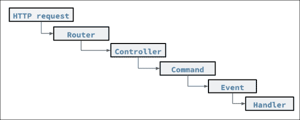

# 六、使用注解驯服复杂性

在前一章中，您学习了如何创建 RESTful API，包括从互联网接收请求，将其路由到控制器，并对其进行处理。在本章中，您将学习如何在 DocBlock 中使用注解，这是一种执行路由的方式，它需要更少的代码，并且可以是与团队进行协作编程的更快、更有组织的方式。

注解将演示以下内容:

*   HTTP 请求的路由，如 GET、POST 和 PUT
*   将控制器变成完全启用的 CRUDL 资源
*   正在侦听命令触发的事件
*   向控制器添加中间件以限制或过滤请求

注解是编程中使用的很好的机制。注解是增强其他数据的元数据。因为这看起来有点混乱，所以我们需要首先理解元数据的含义。 **元数据**这个词包含两个部分:

*   **meta** :这个是一个希腊语单词，意思是超越或者包含。
*   **数据**:这个是一个拉丁语单词，意思是信息片段。

因此，元数据用于增强或扩展事物的意义。

# 其他编程语言的注解

接下来，我们将讨论计算机编程中使用的注解。我们将看几个来自 Java、C#和 PHP 的例子，最后，看一下注解是如何在 Laravel 中使用的。

## Java 中的注解

注解最早是在 Java 版本中提出的，在 1.2 版本中加入。以下是用于覆盖动物`speak`方法的注解示例:

```php
Java 1.2
/**
 * @author      Jon Doe <jon@doe.com>
 * @version     1.6               (current version number)
 * @since       2010-03-31        (version package...)
 */
public void speak() {
}

public class Animal {
    public void speak() {
    }
} 
public class Cat extends Animal {
    @Override
    public void speak() {
        System.out.println("Meow.");
    }
 }
```

请注意，`@`符号用于向编译器发出信号，表明此注解`@Override`很重要。

## c#中的注解

在 C#中，注解被称为属性，并使用方括号代替更常用的`@`符号:

```php
[AttributeUsageAttribute(AttributeTargets.Property|AttributeTargets.Field, AllowMultiple = false, Inherited = true)]
public sealed class AssociationAttribute : Attribute
```

## PHP 中的注解

其他 PHP 框架使用注解。Symfony 大量使用注解。在 **主义**中，注解被用来定义关系，这是 Symfony 的 ORM，类似于 Laravel 的雄辩。Symfony 还使用注解进行路由。 **Zend 框架** ( **ZF** )也使用注解。测试工具 Behat 和 PHPUnit 都使用注解。在下面的 Behat 示例中，使用了一个注解来指示该方法应该在测试套件之前执行:

```php
/**
 * @BeforeSuite
 */
public static function prepare(SuiteEvent $event)
{
// prepare system for test suite
// before it runs
}
```

# DocBlock annotations

前面的 Behat 示例中显示的注解用法示例相当有趣，因为它将注解放在了 DocBlock 中。DocBlock 以正斜杠和两个星号开头:

```php
/**
```

它包含以星号开头的 *n* 行。

文档块以单个星号和正斜杠结束:

```php
 */
```

这个语法告诉解析器，除了正常的注解之外，DocBlock 中还有一些有用的东西。

## Laravel 中的 DocBlock 注解

当开发 Laravel 5时，最初添加了通过 DocBlock 注解对路由和事件监听器的支持。它的语法类似于 Symfony 和 Zend。

### 交响曲

符号的语法如下:

```php
/**
 * @Route("/accommodations/search")
 * @Method({"GET"})
 */

public function searchAction($id)
{
```

### Zend

Zend 的语法如下:

```php
/**
 * @Route(route="/accommodations/search")
 */

public function searchAction()
{
```

### 幼虫

Laravel 的语法如下:

```php
/**
 * @Get("/hotels/search")
 */

public function search()
{
```

DocBlock 注解试图解决什么类型的问题？

文档注解的一个用途是将它们添加到控制器中，从而将路由和中间件的控制权转移到控制器中。这将使控制器更具可移植性，甚至与框架无关，因为`routes.php`文件如果不是完全不存在的话，也将发挥较小的作用。如下例所示，`routes.php`文件可能会变得非常大，这将导致复杂性，甚至导致文件无法管理:

```php
Route::patch('hotel/{hid}/room/{rid}','AccommodationsController@editRoom');
Route::post('hotel/{hid}/room/{rid}','AccommodationsController@reserve');
Route::get('hotel/stats,HotelController@Stats');
Route::resource('country', 'CountryController');
Route::resource(city', 'CityController');
Route::resource('state', 'StateController');
Route::resource('amenity', 'AmenitiyController');
Route::resource('country', 'CountryController');
Route::resource(city', 'CityController');
Route::resource('country', 'CountryController');
Route::resource('city', 'CityController');
Route::resource('horse', 'HorseController');
Route::resource('cow', 'CowController');
Route::resource('zebra', 'ZebraController');
Route::get('dragon/{id}', 'DragonController@show');
Route::resource('giraffe', 'GiraffeController');
Route::resource('zebrafish', 'ZebrafishController');
```

文档块注解的想法是驯服这种复杂性，因为路由将被移动到控制器。

在 Laravel 5.0 发布前不久，由于社区不赞成，该功能被删除。此外，由于一些开发人员可能不想使用这种方法，将这个包从 Laravel 的核心转移到一个包中是合适的。安装包的方法类似于添加 HTML 包的方式。这个包也得到了 Laravel 集体的支持。通过键入以下 composer 命令可以轻松添加注解:

```php
$ composer require laravelcollective/annotations

```

这将安装注解包，而`composer.json`将显示在需求部分添加的包，如下所示:

```php
"require": {
    "laravel/framework": "5.0.*",
    "laravelcollective/annotations": "~5.0",
  },
```

下一步是创建一个名为`AnnotationsServiceProvider.php`的文件，并添加以下代码:

```php
<?php namespace App\Providers;

use Collective\Annotations\AnnotationsServiceProvider as ServiceProvider;

class AnnotationsServiceProvider extends ServiceProvider {

    /**
     * The classes to scan for event annotations.
     *
     * @var array
     */
    protected $scanEvents = [];

    /**
     * The classes to scan for route annotations.
     *
     * @var array
     */
    protected $scanRoutes = [];

    /**
     * The classes to scan for model annotations.
     *
     * @var array
     */
    protected $scanModels = [];

    /**
     * Determines if we will auto-scan in the local environment.
     *
     * @var bool
     */
    protected $scanWhenLocal = false;

    /**
     * Determines whether or not to automatically scan the controllers
     * directory (App\Http\Controllers) for routes
     *
     * @var bool
     */
    protected $scanControllers = false;

    /**
     * Determines whether or not to automatically scan all namespaced
     * classes for event, route, and model annotations.
     *
     * @var bool
     */
    protected $scanEverything = false;

}
```

接下来，需要将`AnnotationsServiceProvider.php`文件添加到`config/app.php`文件中。需要添加命名空间的类应该添加到提供者数组中，如下所示:

```php
'providers' => [
    // ...
    'App\Providers\AnnotationsServiceProvider'
  ];
```

# 使用文档块注解的资源控制器

现在，为了说明 Laravel 的 DocBlock 注解的使用，我们将检查这些步骤。

首先，我们将像往常一样创建住宿控制器:

```php
$ php artisan make:controller AccommodationsController

```

接下来，我们将把住宿控制器添加到注解服务提供商要扫描的路线列表中:

```php
protected $scanRoutes = [
    'App\Http\Controllers\HomeController',
    'App\Http\Controllers\AccommodationsController'
];
```

现在，我们将向控制器添加 DocBlock 注解。在这种情况下，我们将指示解析器使用这个控制器作为住宿路线的资源控制器。要添加的代码如下:

```php
/**
* @Resource("/accommodations")
*/

```

因为整个控制器将变成一个资源，所以 DocBlock 注解应该插入到类定义之前。`AccommodationsController`类现在应该如下:

```php
<?php namespace MyCompany\Http\Controllers;

use Illuminate\Support\Facades\Response;
use MyCompany\Http\Requests;
use MyCompany\Http\Controllers\Controller;
use MyCompany\Accommodation;
use Illuminate\Http\Request;

/**
* @Resource("/accommodations")
*/
class AccommodationsController extends Controller {

    /**
     * Display a listing of the resource.
     *
     * @return Response
     */
    public function index(Accommodation $accommodation)
    {
        return $accommodation->paginate();
    }
```

### 注

请注意，这里需要双引号:

```php
@Resource("/accommodations")
```

以下使用单引号的语法是不正确的，并且不起作用:

```php
@Resource('/accommodations')
```

# 单一方法布线

如果我们希望只给单个方法添加一条路线，比如“寻找住宿”，那么在单个方法的上方会添加一个注解；然而，这一次，在班级内部。为了处理 GET HTTP 请求动词，代码如下:

```php
/**
 * Search for an accommodation
 * @Get("/search-accommodation")
 */
```

类别如下:

```php
<?php namespace MyCompany\Http\Controllers;

use Illuminate\Support\Facades\Response;
use MyCompany\Http\Requests;
use MyCompany\Http\Controllers\Controller;
use MyCompany\Accommodation;
use Illuminate\Http\Request;

class AccommodationsController extends Controller {

    /**
    * Search for an accommodation
    * @Get("/search-accommodation")
    */
    public function index(Accommodation $accommodation)
    {
        return $accommodation->paginate();
    }
```

# 扫描路线

下一步极其重要。Laravel 应用必须处理注解。对于这项杂务，Artisan 被用来扫描路线。

以下命令用于扫描路由。输出将是`Routes scanned!`，如下图所示:

```php
$ php artisan route:scan

Routes scanned!

```

该扫描的结果将在`storage/framework`目录中产生一个名为`routes.scanned.php`的文件。

以下代码写入`storage/framework/routes.scanned.php`文件:

```php
$router->get('search-accommodation', [
  'uses' => 'MyCompany\Http\Controllers\AccommodationsController@search',
  'as' => NULL,
  'middleware' => [],
  'where' => [],
  'domain' => NULL,
]);
```

### 注

注意`storage/framework/routes.scanned.php`文件生成时不需要放入源代码控制。

# 自动扫描

如果开发人员在构建控制器时必须执行 Artisan 路由扫描命令，这样做的努力可能会变得乏味。为了方便开发人员，有一种方法可以让 Laravel 在开发模式下，根据对框架的每个请求，自动扫描`scanRoutes`数组中的控制器。

在`AnnotationsServiceProvider.php`文件中，将`scanWhenLocal`属性设置为`true`。

`$scanControllers``$scanEverything`也是如此；这两个布尔标志允许框架分别自动扫描`App\Http\Controllers`目录和任何命名空间的类。

务必记住，在开发期间和在开发机器上应该只使用*，因为这会给请求周期增加不必要的开销。下面的代码显示了如何将属性设置为`true`的示例:*

```php
<?php namespace App\Providers;

use Collective\Annotations\AnnotationsServiceProvider as ServiceProvider;

class AnnotationsServiceProvider extends ServiceProvider {

    /**
     * The classes to scan for event annotations.
     *
     * @var array
     */
    protected $scanEvents = [];

    …

    /**
     * Determines if we will auto-scan in the local environment.
     *
     * @var bool
     */
    protected $scanWhenLocal = true;

    /**
     * Determines whether or not to automatically scan the controllers
     * directory (App\Http\Controllers) for routes
     *
     * @var bool
     */
    protected $scanControllers = true;

    /**
     * Determines whether or not to automatically scan all namespaced
     * classes for event, route, and model annotations.
     *
     * @var bool
     */
    protected $scanEverything = true;

}
```

启用这些选项将减慢框架的速度，但允许开发阶段的灵活性。

# 附加注解

如在显示单个住宿时常见的那样，要将标识传递给路线，代码如下:

```php
/**
* Display the specified resource.
* @Get("/accommodation/{id}")
*/
```

这个 DocBlock 注解将放在类内函数的上方，这与前面的例子类似。

要将标识限制为一个或多个数字，可以使用`@Where`注解，如下所示:

```php
@Where({"id": "\d+"})
```

这两个注解组合在一起，如下面的代码所示:

```php
/**
 * Display the specified resource.
 * @Get("/accommodation/{id}")
 * @Where({"id": "\d+"})
 */
```

要在示例中添加中间件，将请求限制为只有经过身份验证的用户，可以使用`@Middleware`注解:

```php
/**
 * Display the specified resource.
 * @Get("/accommodation/{id}")
 * @Where({"id": "\d+"})
 * @Middleware("auth")
 */
```

## HTTP 动词

以下是可以使用注解的各种 HTTP 动词列表，反映了 RESTful 标准:

*   `@Delete`:这个动词删除一个资源。
*   `@Get`:这个动词表示一个或多个资源。
*   `@Options`:这个动词显示一个选项列表。
*   `@Patch`:这个动词修饰资源的一个或多个属性。
*   `@Post`:这个动词创建一个新的资源。
*   `@Put`:这个动词修饰一个资源。

### 其他注解

还有附加注解也可以在控制器中使用。注解如下:

*   `@Any`:这个响应任何 HTTP 请求。
*   `@Controller`:这个为一个资源创建一个控制器。
*   `@Middleware`:这个给资源增加了中间件。
*   `@Route`:此启用一条路线。
*   `@Where`:这个根据一定的标准限制请求。
*   `@Resource`:此启用一个资源。

# 使用 Laravel 5 中的注解

让我们回忆一下在 Laravel 中实现的路径，如下图所示:

*   HTTP 请求被路由到一个控制器
*   该命令在控制器内部实例化
*   事件被触发
*   事件得到处理



Laravel 的现代基于命令的酒馆-酒馆路径。

使用注解，这个过程可以变得更加容易。首先，将创建一个预订控制器:

```php
$ php artisan make:controller ReservationsController
```

要创建允许用户创建新预订的路由，将使用 POST HTTP 动词。`@Post`注解将使用附在`/bookRoom`网址上的`POST`方法听取请求。这用于代替通常在`routes.php`文件中找到的路线:

```php
<?php namespace MyCompany\Http\Controllers;

use ...

class ReservationsController extends Controller {
/**
* @Post("/bookRoom")
*/
  public function reserve()
  {
  }
```

如果我们想将请求限制在一个有效的网址上，域参数将请求限制在某个网址上。此外，认证中间件要求对任何希望预订房间的请求进行认证:

```php
<?php namespace App\Http\Controllers;

use …
/**
* @Controller(domain="booking.hotelwebsite.com")
*/

class ReservationsController extends Controller {

/**
* @Post("/bookRoom")
* @Middleware("auth")
*/
  public function reserve()
  {
```

接下来，应该创建`ReserveRoom`命令。该命令将在控制器内部实例化:

```php
$ php artisan make:command ReserveRoom

```

保留命令的内容如下:

```php
<?php namespace MyCompany\Commands;

use MyCompany\Commands\Command;
use MyCompany\User;
use MyCompany\Accommodation\Room;
use MyCompany\Events\RoomWasReserved;

use Illuminate\Contracts\Bus\SelfHandling;

class ReserveRoomCommand extends Command implements SelfHandling {

  public function __construct()
  {
  }
  /**
   * Execute the command.
   */
  public function handle()
  {
  }
}
```

接下来，我们将需要从预订控制器内部实例化`ReserveRoom`命令:

```php
<?php namespace MyCompany\Http\Controllers;

use MyCompany\Accommodation\Reservation;
use MyCompany\Commands\PlaceOnWaitingListCommand;
use MyCompany\Commands\ReserveRoomCommand;
use MyCompany\Events\RoomWasReserved;
use MyCompany\Http\Requests;
use MyCompany\Http\Controllers\Controller;
use MyCompany\User;
use MyCompany\Accommodation\Room;

use Illuminate\Http\Request;

class ReservationsController extends Controller {

/**
 * @Post("/bookRoom")
 * @Middleware("auth")
 */
  public function reserve()
  {	
    $this->dispatch(
    new ReserveRoom(\Auth::user(),$start_date,$end_date,$rooms)
    );
  }
```

现在，我们将创建 RoomWasReserved 事件:

```php
$ php artisan make:event RoomWasReserved

```

要从`ReserveRoom`处理程序实例化`RoomWasReserved`事件，我们可以利用`event()`助手方法。在本例中，该命令是自处理的，因此执行起来很简单:

```php
<?php namespace App\Commands;

use App\Commands\Command;
use Illuminate\Contracts\Bus\SelfHandling;

class ReserveRoom extends Command implements SelfHandling {
    public function __construct(User $user, $start_date, $end_date, $rooms)
    {
    }
    public function handle()
    {
        $reservation = Reservation::createNew();
        event(new RoomWasReserved($reservation));
    }
}
```

由于需要向用户发送房间预订电子邮件的详细信息，下一步是为`RoomWasReserved`事件创建电子邮件发送者处理程序。为此，再次使用`artisan`来创建处理程序:

```php
$ php artisan handler:event RoomReservedEmail –event=RoomWasReserved

```

`RoomWasReserved`事件的`SendEmail`处理程序的方法只是构造函数和处理程序。发送电子邮件的工作将在处理程序方法中执行。`@Hears`注解被添加到其文档块中以完成该过程:

```php
<?php namespace MyCompany\Handlers\Events;

use MyCompany\Events\RoomWasReserved;

use Illuminate\Queue\InteractsWithQueue;
use Illuminate\Contracts\Queue\ShouldBeQueued;

class RoomReservedEmail {
  public function __construct()
  {
  }

  /**
   * Handle the event.
   * @Hears("\App\Events\RoomWasReserved")
   * @param  RoomWasReserved  $event
   */
  public function handle(RoomWasReserved $event)
  {
     //TODO: send email to $event->user
  }
}
```

只需将`RoomReservedEmail`添加到`scanEvents`数组中，即可按如下方式扫描该事件:

```php
protected $scanEvents = [
   'App\Handlers\Events\RoomReservedEmail'
];
```

最后步是导入。Artisan 用于扫描事件的注解并写入输出文件:

```php
$ php artisan event:scan

 Events scanned!

```

以下是`storage/framework/events.scanned.php`文件的输出，显示了事件监听器:

```php
<?php $events->listen(array(0 => 'App\\Events\\RoomWasReserved',
), App\Handlers\Events\RoomReservedEmail@handle');
```

存储目录中扫描的注解文件的最终视图如下。请注意，它们是平行的:

```php
storage/framework/events.scanned.php
storage/framework/routes.scanned.php

```

### 类型

Laravel 使用`artisan`来缓存路由，但不扫描事件，因此以下命令会生成一个缓存文件:

```php
$ php artisan route:cache
Route cache cleared!
Routes cached successfully!

```

`route:scan`命令必须在`route:cache`运行之前运行，因此按以下顺序执行这两个命令很重要:

```php
$ php artisan route:scan
Routes scanned!

$ php artisan route:cache
Route cache cleared!
Routes cached successfully!
```

该命令写入:`storage/framework/routes.php`。

```php
<?php

app('router')->setRoutes(
  unserialize(base64_decode('TzozNDoiSWxsdW1pbmF0ZVxSb3V0aW5nXFd…'))
);
```

将创建两个文件，但仅使用已编译的`routes.php`文件，直到再次运行`php artisan route:scan`。

## 优势

在 Laravel 中使用 DocBlock 注解进行路由有几个主要优势:

*   每个控制器保持独立。控制器没有“绑定”到单独的路线上，这使得共享控制器以及将它们从一个项目移动到另一个项目变得更加容易。对于一个只有几个控制器的简单项目来说，`routes.php`文件可能被认为是不必要的。
*   开发者不用担心`routes.php`。当与其他开发人员一起工作时，路由文件需要持续保持同步。使用文档块注解方法，`routes.php`文件被缓存，不在源代码控制之下；每个开发人员可能只是专注于他或她的控制器。
*   路线注解将路线与控制器保存在一起。当控制器和路由分开时，当新程序员第一次读取代码时，可能不会立即清楚每个控制器方法连接到哪些路由。通过将路由直接放在函数上方的 DocBlock 中，这一点就很明显了。
*   熟悉并习惯于在框架中使用注解的开发人员，如 Symfony 和 Zend，可能会发现在 Laravel 中使用注解是开发软件应用的一种非常方便的方式。此外，使用 Laravel 作为第一次 PHP 体验的 Java 和 C#开发人员会发现注解非常方便。

# 结论

是否在软件中使用注解由开发人员决定。从 Laravel 的核心中移除它的决定，以及 HTML 表单包，表明该框架变得越来越灵活，默认情况下只有最少的一组包。这使得核心开发人员的稳定性和更少的维护成为可能，因为 Laravel 正在向使用 Laravel 5.1 的**长期支持** ( **LTS** )版本迈进。

由于注解包是 Laravel Collective 的一部分，对这个包的支持将由团队管理，这保证了特性的有用性将随着对存储库的贡献而扩展。

此外，该包还可以扩展到包括一个模板，该模板是使用与控制器同名的路线注解自动创建的。这将节省创建控制器和路由过程中的又一个步骤——这是软件开发过程中最重要但单调的任务之一。

# 总结

在这一章中，我们了解了注解，它们在一般编程中是如何使用的，它们在其他框架中是如何使用的，以及它们的使用是如何被采用到 Laravel 注解编辑器包中的。我们已经学习了如何通过使用注解来加快开发过程，以及如何自动扫描注解。在下一章中，我们将了解中间件，这是一种在路由和应用之间的*中间*使用的机制。*