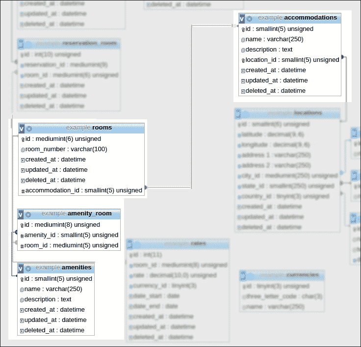

# 第八章。用语义表单查询数据库

在前几章中，您学习了如何构建应用的基本组件。在这一章中，将介绍另一个让 Laravel 如此受欢迎的最佳特性——雄辩的 ORM。

在本章中，我们将涵盖以下主题:

*   基本查询语句
*   一对一、一对多和多对多关系
*   多态关系
*   快速装载

ORM，或者说对象关系映射，用最简单的方式解释，将一个表变成一个类，它的列变成属性，它的行变成这个类的实例。它在开发人员和数据库之间创建了一个抽象层，并允许更容易的编程，因为它使用了熟悉的面向对象范例。

我们将假设我们有一个具有以下结构的员额表:

<colgroup><col style="text-align: left"> <col style="text-align: left"> <col style="text-align: left"> <col></colgroup> 
| **id** | **内容** | **作者 _id** |   |

为了说明这个例子，下面是一个帖子表的表示:

```php
<?php
namespace MyBlog;

class Post {
}
```

为了添加`id`、`contents`和`author_id`属性，我们将向类中添加以下代码:

```php
class Post {
    private $id;
    private $contents;
    private $author_id;

    public function getId()
    {
        return $this->id;
    }

    public function setId($id)
    {
        $this->id = $id;
    }

    public function getContents()
    {
        return $this->contents;
    }

    public function setContents($contents)
    {
        $this->contents = $contents;
    }

    public function getAuthorId()
    {
        return $this->author_id;
    }

    public function setAuthorId($author_id)
    {
        $this->author_id = $author_id;
    }

}
```

这给了我们一个表如何被一个类表示的概述:`Post`类表示一个有一组**帖子**的实体。

如果遵循了活动记录模式，那么雄辩可以自动管理所有类名、键名及其相关关系。雄辩的力量在于它赋予程序员使用面向对象方法来管理类之间关系的能力。

# 基本操作

我们现在将讨论一些基本操作。实际上有数百种方法来使用雄辩，当然每个开发人员都会以最好的方式为他们的项目使用雄辩。以下技术是开发更复杂查询的基本构件。

## 找到一个

最基本的操作之一是执行以下查询:

```php
select from rooms where id=1;
```

这是通过使用`find()`方法完成的。

`Room`门面用`find`方法调用，该方法接受 ID 作为参数:

```php
MyCompany\Accommodation\Room::find($id);
```

由于雄辩是基于流畅的查询生成器，任何流畅的方法都可以混合和匹配。一些流畅的方法是可链接的，而另一些方法执行查询。

`find()`方法实际执行查询，所以总是需要在表达式的末尾。

如果找不到模型的标识，则不返回任何内容。要强制一个`ModelNotFoundException`，然后将其困住以执行一些其他操作，如测井，添加`OrFail`如下:

```php
MyCompany\Accommodation\Room::findOrFail($id);
```

## where 方法

要查询除标识以外的属性(列)，请使用以下命令:

```php
select from accommodations where name='Lovely Hotel';
```

使用`where`方法，然后使用`get()`方法:

```php
MyCompany\Accommodation::where('name','Lovely Hotel')->get();
```

`like`比较器可以如下使用:

```php
MyCompany\Accommodation::where('name','like','%Lovely%')->get();
```

## 链接功能

多个方法可以如下链接:

```php
MyCompany\Accommodation::where('name','Lovely Hotel')- >where('city','like','%Pittsburgh%')->get();
```

前面的命令生成以下查询:

```php
select * from accommodations where name ='Lovely Hotel' and description like '%Pittsburgh%'
```

请注意，如果`where`比较器是`=`(等于)，则不需要第二个参数(比较器)，比较的第二部分被传递到函数中。另外，注意两个`where`方法之间增加了一个`and`操作。要实现`or`操作，必须对代码进行以下更改:

```php
MyCompany\Accommodation::where('name','Lovely Hotel')- >orWhere('description','like','%Pittsburgh%')->get();
```

注意`or`被添加到`where`中，创建`orWhere()`。

## 寻找所有

为了找到所有的房间，使用 `all()`方法代替`find`。请注意，该方法实际上执行查询:

```php
MyCompany\Accommodation\Room::all();
```

为了限制房间数量，使用`take`方法代替`find`。由于`take`是可链接的，因此需要`get`来执行查询:

```php
MyCompany\Accommodation\Room::take(10)->get();
```

为了实现分页，可以使用以下查询:

```php
MyCompany\Accommodation\Room::paginate();
```

默认情况下，前面的查询将返回一个 JSON 对象，如下所示:

```php
{"total":15,        "per_page":15,
"current_page":1,      "last_page":1,
"next_page_url":null,   "prev_page_url":null,
"from":1,        "to":15,
"data":[
{"id":9,"name":"LovelyHotel","description":"Lovely Hotel Greater Pittsburgh","location_id":1,"created_at":null,"updated_at": "2015-03-13 22:00:23","deleted_at":null,"franchise_id":1},{"id":12, "name":"Grand Hotel","description":"Grand Hotel Greater Cleveland","location_id":2,"created_at":"2015-02- 0820:09:35","updated_at":"2015-02- 0820:09:35","deleted_at":null,"franchise_id":1}
...
```

像`total`、`per_page`、`current_page`和`last_page`这样的属性被用来给开发人员提供一种简单的方式来实现分页，而数据数组则在一个名为`data`的数组中返回。

# 雄辩的关系

一对一、一对多(或多对一)、多对多等关系是数据库程序员熟悉的。Laravel 的《雄辩者》将这些概念带入了面向对象的环境。此外，雄辩拥有更强大的工具，例如多态关系，其中实体可以与多个其他实体相关。在下面的例子中，我们将看到住宿、房间和便利设施之间的关系。



## 一对一

第一种关系是一对一。在我们的示例软件中，我们可以使用我们住处的一个房间的示例。一个房间可能只(至少很容易)属于一个住宿，所以房间*属于*这个住宿。在`Room`雄辩模型内部，以下代码告诉雄辩，房间属于`accommodation`功能:

```php
class Room extends Eloquent {
     public function accommodation()
     {
         return $this->belongsTo('MyCompany\Accommodation');
     }
}
```

有时，数据库表不遵循活动记录模式，特别是如果程序员继承了一个遗留数据库。如果数据库使用名为`bedroom`而不是`rooms`的表，那么类将添加一个属性来指示表名:

```php
class Room extends Eloquent {
    protected $table = 'bedroom';
}
```

当执行以下路由代码时，`accommodation`对象将作为 JSON 对象返回:

```php
Route::get('test-relation',function(){
    $room = MyCompany\Accommodation\Room::find(1);
    return $room->accommodation;
});
```

答复如下:

```php
{"id":9,"name":"LovelyHotel","description":"Lovely Hotel Greater Pittsburgh","location_id":1,"created_at":null,"updated_at": "2015-03-13 22:00:23","deleted_at":null}
```

### 类型

一个常见的错误是使用以下命令:

```php
return $room->accommodation();
```

在这种情况下，程序员期望返回模型。这将返回实际的`belongsTo`关系，并且在 RESTful API 的上下文中，将会抛出一个错误:

```php
Object of class Illuminate\Database\Eloquent\Relations\BelongsTo could not be converted to string
```

这是因为 Laravel 可以将 JSON 对象转换为字符串，但不能转换为关系。

SQL 运行如下:

```php
select * from rooms where rooms.id = '1' limit 1
select * from accommodations where accommodations.id = '9' limit 1
```

与进行更大的连接相比，雄辩倾向于支持多个更简单的查询。

首先找到房间。然后，添加`limit 1`，因为`find`仅用于查找单个实体或行。一旦找到了`accommodation_id`，下一个查询将找到具有该对应 ID 的住宿并返回对象。如果遵循活动记录模式，那么雄辩生成的 SQL 非常易读。

## 一对多

第二种关系是一对多。在我们的示例软件中，我们可以使用具有多个房间的住宿的示例。既然房间可以属于一个房间，那么这个房间就有*多个房间*。在`Accommodation`雄辩模型内部，下面的代码告诉雄辩，住宿有很多房间。

```php
class Accommodation {
    public function rooms(){
        return $this->hasMany('\MyCompany\Accommodation\Room');
    }
}
```

在类似的路由中，运行以下代码。这一次，`rooms`对象的集合将作为 JSON 格式的对象返回到一个数组中:

```php
Route::get('test-relation',function(){
    $accommodation = MyCompany\Accommodation::find(9);
    return $accommodation->rooms;
});
```

响应将是以下数组:

```php
[{"id":1,"room_number":0,"created_at":null,"updated_at":null, "deleted_at":null,"accommodation_id":9},{"id":3,"room_number": 12,"created_at":"2015-03-14 08:52:25","updated_at":"2015-03-14  08:52:25","deleted_at":null,"accommodation_id":9},{"id":6, "room_number":12,"created_at":"2015-03-14  09:03:36","updated_at":"2015-03-14  09:03:36","deleted_at":null,"accommodation_id":9},{"id": 14,"room_number":12,"created_at":"2015-03-14  09:26:36","updated_at":"2015-03- 1409:26:36","deleted_at":null,"accommodation_id":9}]
```

SQL 运行如下:

```php
select * from accommodations where accommodations.id = ? limit 1
select * from rooms where rooms.accommodation_id = '9' and  rooms.accommodation_id is not null
```

和以前一样，找到了住处。第二个查询将找到属于该住宿的房间。增加一个检查，确认`accommodation_id`不为空。

## 多对多

在我们的示例软件应用中，舒适性和房间之间的关系是多对多的。每个房间都可以有许多便利设施，例如互联网接入和按摩浴缸，每个便利设施在许多房间之间共享:*住宿中的每个房间都可以并且应该有互联网接入！*以下代码使用`belongsToMany`关系，使一个设施属于多个房间:

```php
class Amenity {
  public function rooms(){
        return $this- >belongsToMany('\MyCompany\Accommodation\Room');
    }
}
```

测试路线，告诉我们每个房间如何有一定的舒适性，写如下:

```php
Route::get('test-relation',function(){
    $amenity = MyCompany\Accommodation\Amenity::find(3);
    return $amenity->rooms;
});
```

返回房间列表:

```php
[{"id":1,"room_number":0,"created_at":2015-03-14 08:10:45,"updated_at":null,"deleted_at":null, "accommodation_id":9},{"id":5,"room_number":12, "created_at":"2015-03-14 09:00:38","updated_at":"2015-03-14", 09:00:38","deleted_at":null,"accommodation_id":12},
...]
```

执行的 SQL 如下:

```php
select * from amenities where amenities.id = ? limit 1
select rooms.*, amenity_room.amenity_id as pivot_amenity_id, amenity_room.room_id as pivot_room_id from rooms inner join amenity_room on rooms.id = amenity_room.room_id where amenity_room.amenity_id = 3
```

我们回想起返回具有特定舒适性的房间的`belongToMany`关系:

```php
class Amenity {
   public function rooms(){
        return $this- >belongsToMany('\MyCompany\Accommodation\Room');
    }
}
```

雄辩的巧妙地给了我们相应的`belongsToMany`关系来确定一个特定房间有哪些便利设施。语法完全相同:

```php
class Room {
     public function amenities(){
         return $this- >belongsToMany('\MyCompany\Accommodation\Amenity');
     }
 }
```

测试路线基本相同，只是用`amenities`代替`rooms`:

```php
Route::get('test-relation',function(){
    $room = MyCompany\Accommodation\Room::find(1);
    return $room->amenities;
});
```

结果是 ID 为 1 的房间的便利设施列表:

```php
[{"id":1,"name":"Wifi","description":"Wireless Internet Access","created_at":"2015-03-1409:00:38","updated_at":"2015-03-14 09:00:38","deleted_at":null},{"id":2,"name": "Jacuzzi","description":"Hot tub","created_at":"2015-03-14 09:00:38","updated_at":null,"deleted_at":null},{"id":3,"name": "Safe","description":"Safe deposit box for protecting valuables","created_at":"2015-03-1409:00:38","updated_at": "2015-03-1409:00:38","deleted_at":null}]
```

使用的查询如下:

```php
select * from rooms where rooms.id = 1 limit 1
select amenities.*, amenity_room.room_id as pivot_room_id, amenity_room.amenity_id as pivot_amenity_id from amenities inner join amenity_room on amenities.id = amenity_room.amenity_id where amenity_room.room_id = '1'
```

这个查询，用`room_id`代替`amenity_id`，用`rooms`代替`amenities`，显然是并行的。

## 有多通

雄辩术的一个伟大的特征是“有许多-通过”。如果软件的需求发生变化，我们被要求将一些住宿组合成特许经营，会怎么样？如果应用用户想要搜索房间，可以找到属于该特许经营的任何住宿中的任何房间。将添加特许经营表，并且将在住宿表中添加名为`franchise_id`的可空列。这将选择性地允许住宿属于特许经营。通过`accommodation_id`栏，房间已经属于住宿。

房间通过其`accommodation_id`钥匙属于`accommodation`，而住宿通过其`franchise_id`钥匙属于特许经营。

雄辩允许我们通过使用`hasManyThrough`检索与特许经营相关的房间:

```php
<?php namespace MyCompany;

use Illuminate\Database\Eloquent\Model;

class Franchise extends Model {

    public function rooms()
    {
        return $this- >hasManyThrough('\MyCompany\Accommodation\Room', '\MyCompany\Accommodation');
    }
}
```

`hasManyThrough`关系将目标或“有”作为其第一个参数(在本例中为房间)，将其“通过”作为第二个参数(在本例中为容纳)。

作为一个短语陈述的逻辑是:*这个特许经营通过它的住宿*有许多房间。

使用前面的测试路线，代码编写如下:

```php
Route::get('test-relation',function(){
    $franchise = MyCompany\Franchise::find(1);
    return $franchise->rooms;
});
```

如预期的那样，房间作为数组返回:

```php
[{"id":1,"room_number":0,"created_at":null,"updated_at":null,"deleted_at":null,"accommodation_id":9,"franchise_id":1}, {"id":3,"room_number":12,"created_at":"2015-03-14 08:52:25","updated_at":"2015-03-14 08:52:25","deleted_at":null,"accommodation_id":9, "franchise_id":1},{"id":6,"room_number":12,"created_at":"2015-03-14 09:03:36","updated_at":"2015-03-14 09:03:36","deleted_at":null,"accommodation_id":9, "franchise_id":1},
]
```

执行的查询如下:

```php
select * from franchises where franchises.id = ? limit 1
select rooms.*, accommodations.franchise_id from rooms inner join accommodations on accommodations.id = rooms.accommodation_id where accommodations.franchise_id = 1
```

# 多态关系

雄辩术的一个伟大的特征是有可能有一个关系是多态的实体。这个词的两个部分， *poly* 和*emulate*，来自希腊语。由于*聚*表示*多**形*表示*形*，我们现在可以很容易地想象一段关系有多种形式。

## 可修正的关系

在我们的示例软件中，便利设施是与房间相关联的东西，例如按摩浴缸。某些便利设施，如有盖停车场或机场班车服务，也可能与住宿本身有关。我们可以为此创建两个数据透视表，一个叫做`amenity_room`，另一个叫做`accommodation_amenity`。另一个很好的方法是将两者合并成一个表，并使用一个字段来区分这两种类型或关系。

为此，我们需要一个字段来区分*舒适和房间*以及*舒适和房间*，我们可以称之为关系类型。Laravel 的雄辩者巧妙地自动处理了这一点。

雄辩使用后缀`-able`来实现这一点。在我们的示例中，我们将创建一个包含以下字段的表:

*   `id`
*   `name`
*   `description`
*   `amenitiable_id`
*   `amenitiable_type`

前三个字段很熟悉，但增加了两个新字段。其中一个将包含住宿或房间的 ID。

### 舒适性表结构

以为例，给定一个 ID 为 5 的房间，`amenitiable_id`为`5`，而`amenitiable_type`为`Room`。给定 ID 为 5 的住宿，`amenitiable_id`为`5`，而`amenitiable_type`为`Accommodation`:

<colgroup><col style="text-align: left"> <col style="text-align: left"> <col style="text-align: left"> <col style="text-align: left"> <col style="text-align: left"></colgroup> 
| 

身份证明（identification）

 | 

名字

 | 

描述

 | 

ameline _ id

 | 

可修改类型

 |
| --- | --- | --- | --- | --- |
| one | 无线互联网 | 互联网连接。 | five | 房间 |
| Two | 有盖停车场 | 车库停车 | five | 住处 |
| three | 海景 | 从房间可以看到海景 | five | 房间 |

### 舒适性模型

在代码方面，`Amenity`模型现在将包含一个“可修改”功能:

```php
<?php
namespace MyCompany\Accommodation;

use Illuminate\Database\Eloquent\Model;

class Amenity extends Model
{
    public function rooms(){
        return $this->belongsToMany('\MyCompany\Accommodation\Room');
    }
    public function amenitiable()
    {
        return $this->morphTo();
    }
```

### 住宿模式

`Accommodation`模式将改变`amenities`方式使用`morphMany`代替`hasMany`:

```php
<?php namespace MyCompany;

use Illuminate\Database\Eloquent\Model;

class Accommodation extends Model {
    public function rooms(){
        return $this->hasMany('\MyCompany\Accommodation\Room');
    }

    public function amenities()
    {
        return $this- >morphMany('\MyCompany\Accommodation\Amenity', 'amenitiable');
    }
}
```

### 房间模型

`Room`模型将包含相同的`morphMany`方法:

```php
<?php
namespace MyCompany\Accommodation;

use Illuminate\Database\Eloquent\Model;

class Room extends Model
{
    protected $casts = ['room_number'=>'integer'];
    public function accommodation(){
        return $this->belongsTo('\MyCompany\Accommodation');
    }
    public function amenities() {
        return $this- >morphMany('\MyCompany\Accommodation\Amenity', 'amenitiable');
    }

}
```

现在，当房间或住宿需要便利设施时，雄辩者会自动区分它们:

```php
$accommodation->amenities();
$room->amenities();
```

这些功能都返回房间和住宿的正确舒适类型。

## 多对多多态关系

然而，一些便利设施可以在一个房间和一个住处之间共享是可能的。在这种情况下，使用多对多多态关系。透视表现在添加了几个字段:

<colgroup><col style="text-align: left"> <col style="text-align: left"> <col style="text-align: left"></colgroup> 
| 

舒适性 _id

 | 

ameline _ id

 | 

可修改类型

 |
| --- | --- | --- |
| one | five | 房间 |
| one | five | 住处 |
| Two | five | 房间 |
| Two | five | 住处 |

如图所示，ID 为 5 的房间和 ID 为 5 的住宿都有 ID 为 1 和 2 的便利设施。

## 有关系

如果我们想要选择所有与特许经营相关的住宿，则使用`has()`方法，其中关系作为参数传递:

```php
MyCompany\Accommodation::has('franchise')->get();
```

我们将获得以下 JSON 数组:

```php
[{"id":9,"name":"LovelyHotel","description":"Lovely Hotel Greater Pittsburgh","location_id":1,"created_at":null,"updated_at": "2015-03-13 22:00:23","deleted_at":null,"franchise_id":1}, {"id":12,"name": "Grand Hotel","description":"Grand Hotel Greater Cleveland","location_id":2,"created_at": "2015-02-0820:09:35","updated_at": "2015-02-0820:09:35","deleted_at":null,"franchise_id":1}]
```

请注意`franchise_id`值为 1，这意味着住宿有与之相关的特许经营权。可选地，可以将`where`添加到`has`中，创建`whereHas`功能。代码如下:

```php
MyCompany\Accommodation::whereHas('franchise',
                  function($query){
      $query->where('description','like','%Pittsburgh%'); 
      })->get();
```

请注意`whereHas`将闭包作为其第二个参数。

这将只返回描述包含`Pittsburgh`的住宿，因此返回的数组将只包含如下结果:

```php
[{"id":9,"name":"LovelyHotel","description":"Lovely Hotel Greater Pittsburgh","location_id":1,"created_at":null,"updated_at": "2015-03-13 22:00:23","deleted_at":null,"franchise_id":1}]
```

## 急装

雄辩术提供的另一个伟大的机制是热切的装载。如果我们想要归还所有的特许经营权以及所有的住宿，我们只需要在我们的`Franchise`模型中添加一个`accommodations`功能，如下所示:

```php
    public function accommodations()
    {
        return $this->hasMany('\MyCompany\Accommodation');
    }
```

然后，通过在声明中添加一个`with`条款，为每个特许经营权返还住宿:

```php
MyCompany\Franchise::with('accommodations')->get();
```

我们还可以列出与每个住宿相关的房间，如下所示:

```php
MyCompany\Franchise::with('accommodations','rooms')->get();
```

如果我们想要返回嵌套在容纳数组内部的房间，那么应该使用以下语法:

```php
MyCompany\Franchise::with('accommodations','accommodations.rooms') ->get();
```

我们将获得以下输出:

```php
[{"id":1,"accommodations":
[
{"id":9,
"name":"Lovely Hotel",
"description":"Lovely Hotel Greater Pittsburgh",
"location_id":1,
"created_at":null,
"updated_at":"2015-03-13 22:00:23",
"deleted_at":null,
"franchise_id":1,
"rooms":[{"id":1,"room_number":0,"created_at":null,"updated_at": null,"deleted_at":null,"accommodation_id":9},
]},
{"id":12,"name":"GrandHotel","description":"Grand Hotel Greater Cleveland","location_id":2,"created_at":"2015-02-08…
```

在本例中，`rooms`包含在`accommodation`中。

# 结论

Laravel 的 ORM 功能强大。事实上，一本书里列举的操作类型太多了。最简单的查询可以通过几次击键来完成。

Laravel 的雄辩命令被转换成流畅的命令，所以如果需要更复杂的东西，那么可以使用流畅的语法。如果需要进行非常复杂的查询，甚至可以使用`DB::raw()`功能。这将允许在查询生成器中使用精确的字符串。这里有一个例子:

```php
$users = DB::table('accommodation')
                     ->select(DB::raw('count(*) as number_of_hotels'))->get();
```

这将返回酒店的数量:

```php
[{"number_of_hotels":15}]
```

学习设计软件，从领域开始，然后考虑哪些实体涉及到那个领域，将有助于开发人员以面向对象的方式思考。拥有实体列表会导致创建表，因此模式的实际创建将在最后执行。这种方法可能需要一些时间来适应。理解有说服力的关系是能够生成表达性的、可读的语句的关键，这些语句可以查询数据库，同时隐藏复杂性。

雄辩非常有用的另一个原因是遗留数据库。如果 ORM 应用于表具有非标准名称、键没有以相同名称命名或者列名不容易理解的情况，则雄辩为开发人员提供了工具来实际帮助统一表名和字段名，并通过提供属性获取器和设置器来执行关系。

例如，如果字段名是`fname1`和`fname2`，我们可以在模型中使用一个 get 属性函数，其中语法是`get`，后跟应用中要使用的名称和属性。因此，在`fname1`的情况下，该功能将被添加如下:

```php
public function getUsernameAttribute($value)
{
  return $this->attributes['fname1'];
}
```

诸如此类的功能才是雄辩的真正卖点。在本章中，您学习了如何使用实体模型在数据库中查找数据，通过添加`where`、关系、强大的约定(如多态关系)和辅助助手(如分页)来限制结果。

# 总结

在这一章中，详细展示了雄辩的 ORM。雄辩是数据库和代码之间实际发生的面向对象的包装。由于 Fluent 查询生成器很容易访问，所以熟悉查询的编写方式非常重要。这将有助于调试，也涵盖了雄辩不足的复杂情况。在这一章中，大部分雄辩的概念已经讨论过了。然而，还有很多方法可以利用，所以鼓励进一步阅读。

在下一章中，除了其他主题之外，您将学习如何扩展数据库以在更大范围内更好地运行。