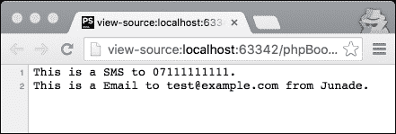
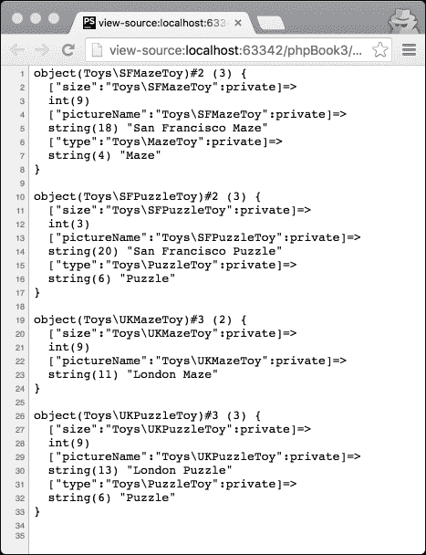
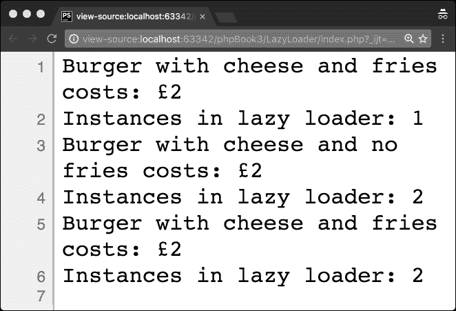
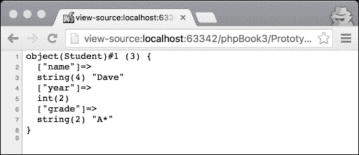
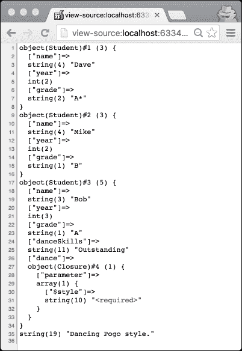

# 三、创建设计模式

创建设计模式是“四人帮”中常见的三种设计模式之一；它们是涉及对象创建机制的设计模式。

在不控制该过程的情况下，自行实例化对象或创建基本类可能会导致设计问题，或只是增加该过程的复杂性。

在本章中，我们将介绍以下主题：

*   软件设计过程
*   简易工厂
*   工厂法
*   抽象工厂模式
*   延迟初始化
*   建造者模式
*   原型模式

在我们学习创造性设计模式之前，让我们先谈谈架构过程。

# 软件设计过程

*软件工程知识体系*是由*IEEE*出版的一本书，通常被称为**SWEBoK**，它总结了整个软件工程领域公认的知识体系。

在本书中，软件设计的定义如下：

> *“定义系统或组件的架构、组件、接口和其他特性的过程”和“该过程的结果”。*

具体而言，软件设计可分为两个层次：

*   体系结构设计，描述如何将软件拆分为其复合组件
*   详细设计，详细描述每个组件的细节，以描述其组件。

组件是软件解决方案的一部分，与组件相连的接口既是*所需接口*（软件运行所需的东西）又是*所提供接口*（软件提供给其他组件的东西）。

这两个设计过程（架构设计和详细设计）应该产生一组记录主要决策的模型和工件，并解释为什么做出了非琐碎决策。在将来，开发人员可能会很容易地参考这些文档，以便找出架构决策背后的基本原理，通过确保决策经过深思熟虑，并将思考过程传递下去，使代码更易于维护。

这些过程中的第一个，架构设计，对于整个团队来说是相当有创造力和吸引力的。无论您如何选择，这个过程的结果都应该是一个通过接口将组件互连在一起的组件图。

这个过程通常有利于一般开发人员的团队，而不是老虎团队。*Tiger 团队*通常是特定产品知识领域的专家组成的小组，他们在时间有限的环境中聚集在一起，在架构师的主持下解决特定问题。通常，特别是在涉及遗留问题的情况下，此类设计工作可能需要广泛的知识来提取必要的体系结构约束。

这就是说，为了防止流程转变为委员会设计或 mob 规则，您可能需要遵循一些基本规则：让架构师主持会议，从组件级图开始工作，而无需进一步钻研。它通常有助于在会议之前模拟一个组件图，并在会议中根据需要对其进行编辑，这有助于确保团队在不深入讨论如何修改图的情况下保持正轨。

在我所处的一个环境中，有一位非常详细的工程师，他是工程团队的负责人；他坚持通过立即钻研组件的细节来进行架构设计，这将迅速导致流程解体和无组织；他将在飞行中开始一次又一次的会议。事实证明，在这些架构（architecture）会议中构建组件图对于保持会议秩序以及确保操作事项和详细设计事项不会过早介入至关重要。如何以及在何处托管某些东西的操作问题通常不在软件工程的职权范围内，除非它必须直接改变软件的创建方式。

下一步是详细设计；这说明了如何构造组件。构建中使用的设计模式、类图和必要的外部资源都可以在此时决定。一些详细的设计工作将在施工阶段完成，无论设计有多好，软件开发人员都需要对设计进行微小的更改，以添加更多细节或充实架构过程中的一些疏忽。在这个设计之前的过程必须简单地指定组件以足够的细节来促进它的构建，并且允许开发者不必太多地考虑架构。开发人员应该从与代码密切相关的工件（例如，详细设计）开发代码，而不是从高级需求、设计或计划进行编码。

另外，让我们记住，单元测试可以构成设计的一部分（例如，当使用测试驱动开发时），每个单元测试指定一个设计元素（类、方法和特定行为）。虽然将代码反向工程到设计工件中是不现实的（尽管有些人会声称是这样）；如果愿意，可以将*架构表示为代码*；单元测试就是实现这一点的一种方法。

正如本书前面提到的，设计模式在软件设计中起着至关重要的作用；它们允许在不重新发明轮子的情况下设计更复杂的软件。

正当现在来谈谈创造性的设计模式。

# 简易工厂

什么是工厂？让我们想象你订购了一辆新车；经销商将您的订单发送到工厂，工厂将为您制造汽车。你的汽车是以组装好的形式寄给你的，你不必在意它是如何制造的。

类似地，软件工厂为您生成对象。工厂接受您的请求，使用构造函数组装对象，并将它们返回给您使用。其中一种工厂模式被称为**简单工厂**。让我告诉你它是如何工作的。

首先，我们定义了一个抽象类，我们想用其他类扩展它：

```php
<?php 

abstract class Notifier 
{ 
  protected $to; 

  public function __construct(string $to) 
  { 
    $this->to = $to; 
  } 

  abstract public function validateTo(): bool; 

  abstract public function sendNotification(): string; 

} 

```

这个类允许我们拥有通用方法，并定义我们希望工厂中构建的所有类都具有的通用功能。我们也可以使用接口而不是抽象类来实现，而无需定义任何功能。

使用此接口，我们可以构建两个通知程序，`SMS`和`Email`。

`SMS`通知程序在`SMS.php`文件中如下：

```php
<?php 

class SMS extends Notifier 
{ 
  public function validateTo(): bool 
  { 
    $pattern = '/^(\+44\s?7\d{3}|\(?07\d{3}\)?)\s?\d{3}\s?\d{3}$/'; 
    $isPhone = preg_match($pattern, $this->to); 

    return $isPhone ? true : false; 

  } 

  public function sendNotification(): string 
  { 

    if ($this->validateTo() === false) { 
      throw new Exception("Invalid phone number."); 
    } 

    $notificationType = get_class($this); 
    return "This is a " . $notificationType . " to " . $this->to . "."; 
  } 
} 

```

同样，让我们在`Email.php`文件中发出`Email`通知：

```php
<?php 

class Email extends Notifier 
{ 

  private $from; 

  public function __construct($to, $from) 
  { 
    parent::__construct($to); 

    if (isset($from)) { 
      $this->from = $from; 
    } else { 
      $this->from = "Anonymous"; 
    } 
  } 

  public function validateTo(): bool 
  { 
    $isEmail = filter_var($this->to, FILTER_VALIDATE_EMAIL); 

    return $isEmail ? true : false; 

  } 

  public function sendNotification(): string 
  { 
    if ($this->validateTo() === false) { 
      throw new Exception("Invalid email address."); 
    } 

    $notificationType = get_class($this); 
    return "This is a " . $notificationType . " to " . $this->to . " from " . $this->from . "."; 
  } 
} 

```

我们可以按如下方式建造工厂：

```php
<?php 

class NotifierFactory 
{ 
  public static function getNotifier($notifier, $to) 
  { 

    if (empty($notifier)) { 
      throw new Exception("No notifier passed."); 
    } 

    switch ($notifier) { 
      case 'SMS': 
        return new SMS($to); 
        break; 
      case 'Email': 
        return new Email($to, 'Junade'); 
        break; 
      default: 
        throw new Exception("Notifier invalid."); 
        break; 
    } 
  } 
} 

```

虽然我们通常使用 Composer 进行自动加载，但为了演示此方法有多简单，我将手动包含依赖项；不用多说，下面是我们的演示：

```php
<?php 

require_once('Notifier.php'); 
require_once('NotifierFactory.php'); 

require_once('SMS.php'); 
$mobile = NotifierFactory::getNotifier("SMS", "07111111111"); 
echo $mobile->sendNotification(); 

require_once('Email.php'); 
$email = NotifierFactory::getNotifier("Email", "test@example.com"); 
echo $email->sendNotification(); 

```

我们应该得到如下输出：



# 工厂法

工厂法不同于普通的简单工厂，它的基础是我们可以有很多工厂，而不是一个工厂。

那你为什么要这么做？为了理解这一点，我们必须研究开/闭原理（OCP）。Bertrand Meyer 通常与他在其著作*面向对象软件构造*中提出的术语*打开/关闭原则*有关。迈耶说：

> *“软件实体（类、模块、函数等）应开放扩展，关闭修改”*

当软件实体需要扩展时，不需要修改其源代码就可以进行扩展。熟悉**固体**（**单一责任**、**开闭**、**利斯科夫替代**、**接口分类**和**依赖倒置**的同学们）面向对象软件的原则可能已经听说过这个原则。

Factory 方法允许您将某些类分组在一起，并通过一组类的单个工厂来处理它们。如果要添加另一个组，只需添加另一个工厂即可。

那么现在，我们怎么做呢？实际上，我们将为每个工厂创建一个接口（或者为此创建一个抽象方法）；然后，我们将该接口实现到我们想要构建的任何其他工厂中。

因此，让我们克隆我们的简单工厂演示；我们要做的是把我们的`NotifierFactory`变成一个接口。然后我们可以重建工厂，使其拥有一个用于电子通知（电子邮件或 SMS）的工厂，然后我们可以实现我们的接口来创建（比如）邮政快递通知工厂。

那么让我们从在`NotifierFactory.php`文件中创建接口开始：

```php
<?php 

interface NotifierFactory 
{ 
  public static function getNotifier($notifier, $to); 
} 

```

现在，让我们构建实现`NotifierFactory`接口的`ElectronicNotifierFactory`：

```php
<?php 

class ElectronicNotifierFactory implements NotifierFactory 
{ 
  public static function getNotifier($notifier, $to) 
  { 

    if (empty($notifier)) { 
      throw new Exception("No notifier passed."); 
    } 

    switch ($notifier) { 
      case 'SMS': 
        return new SMS($to); 
        break; 
      case 'Email': 
        return new Email($to, 'Junade'); 
        break; 
      default: 
        throw new Exception("Notifier invalid."); 
        break; 
    } 
  } 
} 

```

我们现在可以重构我们的`index.php`以使用我们制造的新工厂：

```php
<?php 

require_once('Notifier.php'); 
require_once('NotifierFactory.php'); 
require_once('ElectronicNotifierFactory.php'); 

require_once('SMS.php'); 
$mobile = ElectronicNotifierFactory::getNotifier("SMS", "07111111111"); 
echo $mobile->sendNotification(); 

echo "\n"; 

require_once('Email.php'); 
$email = ElectronicNotifierFactory::getNotifier("Email", "test@example.com"); 
echo $email->sendNotification(); 

```

现在输出与以前相同：

```php
This is a SMS to 07111111111\. 
This is a Email to test@example.com from Junade. 

```

但是，现在的好处是，我们现在可以添加一种新类型的通知程序，而无需打开工厂，因此，让我们为邮政通信添加一种新的通知程序：

```php
<?php 

class Post extends Notifier 
{ 
  public function validateTo(): bool 
  { 
    $address = explode(',', $this->to); 
    if (count($address) !== 2) { 
      return false; 
    } 

    return true; 
  } 

  public function sendNotification(): string 
  { 

    if ($this->validateTo() === false) { 
      throw new Exception("Invalid address."); 
    } 

    $notificationType = get_class($this); 
    return "This is a " . $notificationType . " to " . $this->to . "."; 
  } 
} 

```

然后我们可以介绍`CourierNotifierFactory`：

```php
<?php 

class CourierNotifierFactory implements NotifierFactory 
{ 
  public static function getNotifier($notifier, $to) 
  { 

    if (empty($notifier)) { 
      throw new Exception("No notifier passed."); 
    } 

    switch ($notifier) { 
      case 'Post': 
        return new Post($to); 
        break; 
      default: 
        throw new Exception("Notifier invalid."); 
        break; 
    } 
  } 
} 

```

最后，我们现在可以修改我们的`index.php`文件以包含此新格式：

```php
<?php 

require_once('Notifier.php'); 
require_once('NotifierFactory.php'); 
require_once('ElectronicNotifierFactory.php'); 

require_once('SMS.php'); 
$mobile = ElectronicNotifierFactory::getNotifier("SMS", "07111111111"); 
echo $mobile->sendNotification(); 

echo "\n"; 

require_once('Email.php'); 
$email = ElectronicNotifierFactory::getNotifier("Email", "test@example.com"); 
echo $email->sendNotification(); 

echo "\n"; 

require_once('CourierNotifierFactory.php'); 

require_once('Post.php'); 
$post = CourierNotifierFactory::getNotifier("Post", "10 Downing Street, SW1A 2AA"); 
echo $post->sendNotification(); 

```

`index.php`文件现在生成以下结果：


在生产中，通常会将通知程序放在不同的命名空间中，同时将工厂放在不同的命名空间中。

# 抽象工厂模式

首先，如果你在读这本书之前做过背景阅读，你会听到短语*具体类*。这是什么意思？简单地说，它是抽象类的对立面；它是一个可以实例化以生成对象的类。

抽象工厂由以下类别组成：抽象工厂、具体工厂、抽象产品、具体产品和我们的客户。

在工厂模式中，我们生成了特定接口的实现（例如，`notifier`是我们的接口，电子邮件、SMS 和 post 是我们的实现）。使用抽象工厂模式，我们将创建工厂接口的实现，每个工厂都知道如何创建自己的产品。

假设我们有两个玩具工厂，一个在旧金山，一个在伦敦。他们都知道如何为两个地点创建两家公司的产品。

考虑到这一点，我们的`ToyFactory`界面如下所示：

```php
<?php 

interface ToyFactory { 
  function makeMaze(); 
  function makePuzzle(); 
} 

```

既然这样，我们就可以建造我们的旧金山玩具厂作为我们的混凝土工厂：

```php
<?php 

class SFToyFactory implements ToyFactory 
{ 
  private $location = "San Francisco"; 

  public function makeMaze() 
  { 
    return new Toys\SFMazeToy(); 
  } 

  public function makePuzzle() 
  { 
    return new Toys\SFPuzzleToy; 
  } 
} 

```

现在我们可以添加我们的英国玩具工厂（`UKToyFactory`：

```php
<?php 

class UKToyFactory implements ToyFactory 
{ 
  private $location = "United Kingdom"; 

  public function makeMaze() 
  { 
    return new Toys\UKMazeToy; 
  } 

  public function makePuzzle() 
  { 
    return new Toys\UKPuzzleToy; 
  } 
} 

```

正如您所注意到的，我们正在 toys 名称空间中创建各种玩具，因此现在我们可以为我们的玩具组合抽象方法。让我们从我们的`Toy`课开始。每个玩具最终都会扩展这一类：

```php
<?php 

namespace Toys; 

abstract class Toy 
{ 
  abstract public function getSize(): int; 
  abstract public function getPictureName(): string; 
} 

```

现在，对于我们在开始时在`ToyFactory`界面中声明的两种类型的玩具（迷宫和拼图），我们可以声明它们的抽象方法，从我们的`Maze`类开始：

```php
<?php 

namespace Toys; 

abstract class MazeToy extends Toy 
{ 
  private $type = "Maze"; 
} 

```

现在我们来上`Puzzle`课：

```php
<?php 

namespace Toys; 

abstract class PuzzleToy extends Toy 
{ 
  private $type = "Puzzle"; 
} 

```

现在是我们具体类的时候了，让我们从旧金山的实现开始。

`SFMazeToy`的代码如下：

```php
<?php 

namespace Toys; 

class SFMazeToy extends MazeToy 
{ 
  private $size; 
  private $pictureName; 

  public function __construct() 
  { 
    $this->size = 9; 
    $this->pictureName = "San Francisco Maze"; 
  } 

  public function getSize(): int 
  { 
    return $this->size; 
  } 

  public function getPictureName(): string 
  { 
    return $this->pictureName; 
  } 
} 

```

下面是`SFPuzzleToy`类的代码，它是`Maze`玩具类的不同实现：

```php
<?php 

namespace Toys; 

class SFPuzzleToy extends PuzzleToy 
{ 
  private $size; 
  private $pictureName; 

  public function __construct() 
  { 
    $rand = rand(1, 3); 

    switch ($rand) { 
      case 1: 
        $this->size = 3; 
        break; 
      case 2: 
        $this->size = 6; 
        break; 
      case 3: 
        $this->size = 9; 
        break; 
    } 

    $this->pictureName = "San Francisco Puzzle"; 
  } 

  public 
  function getSize(): int 
  { 
    return $this->size; 
  } 

  public function getPictureName(): string 
  { 
    return $this->pictureName; 
  } 
} 

```

现在，我们可以通过在英国工厂的实现来完成这项工作。

让我们先为迷宫玩具制作一个`UKMazeToy.php`：

```php
<?php 

namespace Toys; 

class UKMazeToy extends Toy 
{ 
  private $size; 
  private $pictureName; 

  public function __construct() 
  { 
    $this->size = 9; 
    $this->pictureName = "London Maze"; 
  } 

  public function getSize(): int 
  { 
    return $this->size; 
  } 

  public function getPictureName(): string 
  { 
    return $this->pictureName; 
  } 
} 

```

让我们也为益智玩具做一个课程，`UKPuzzleToy.php`

```php
<?php 

namespace Toys; 

class UKPuzzleToy extends PuzzleToy 
{ 
  private $size; 
  private $pictureName; 

  public function __construct() 
  { 
    $rand = rand(1, 2); 

    switch ($rand) { 
      case 1: 
        $this->size = 3; 
        break; 
      case 2: 
        $this->size = 9; 
        break; 
    } 

    $this->pictureName = "London Puzzle"; 
  } 

  public 
  function getSize(): int 
  { 
    return $this->size; 
  } 

  public 
  function getPictureName(): string 
  { 
    return $this->pictureName; 
  } 
} 

```

现在让我们把这些放在我们的`index.php`文件中：

```php
<?php 

require_once('ToyFactory.php'); 
require_once('Toys/Toy.php'); 
require_once('Toys/MazeToy.php'); 
require_once('Toys/PuzzleToy.php'); 

require_once('SFToyFactory.php'); 
require_once('Toys/SFMazeToy.php'); 
require_once('Toys/SFPuzzleToy.php'); 

$sanFraciscoFactory = new SFToyFactory(); 
var_dump($sanFraciscoFactory->makeMaze()); 
echo "\n"; 
var_dump($sanFraciscoFactory->makePuzzle()); 
echo "\n"; 

require_once('UKToyFactory.php'); 
require_once('Toys/UKMazeToy.php'); 
require_once('Toys/UKPuzzleToy.php'); 

$britishToyFactory = new UKToyFactory(); 
var_dump($britishToyFactory->makeMaze()); 
echo "\n"; 
var_dump($britishToyFactory->makePuzzle()); 
echo "\n"; 

```

如果运行给定的代码，则输出应与以下屏幕截图中所示的输出类似：



现在，假设我们想用一套新产品（比如说纽约）添加一个新工厂，我们只需添加玩具`NYMazeToy`和`NYPuzzleToy`，我们就可以创建一个名为`NYToyFactory`（实现`ToyFactory`接口）的新工厂，我们就可以完成了。

现在，当您需要添加新的产品类时，这个类的缺点就会出现；抽象工厂需要更新，这违反了接口隔离原则。因此，如果您需要添加新的产品类，它就不能严格满足可靠的原则。

这种设计模式可能需要一些时间才能完全理解，所以一定要仔细研究源代码，看看你能用它做些什么。

# 延迟初始化

Slappy Joe's burgers 是一家高质量的餐厅，在这里，汉堡的价格是根据所用肉类的确切重量来确定的。不幸的是，由于制作时间的限制，对他们来说，在下订单之前制作每一种汉堡都会消耗大量的资源。

当有人点汉堡时，不是让每种汉堡都准备好让人点，而是制作汉堡（如果还没有），然后向他们收取价格。

`Burger.php`类的结构如下：

```php
<?php 
class Burger 
{ 
  private $cheese; 
  private $chips; 
  private $price; 

  public function __construct(bool $cheese, bool $chips) 
  { 
    $this->cheese = $cheese; 
    $this->chips = $chips; 

    $this->price = rand(1, 2.50) + ($cheese ? 0.5 : 0) + ($chips ? 1 : 0); 
  } 

  public function getPrice(): int 
  { 
    return $this->price; 
  } 
} 

```

请注意，汉堡的价格仅在实例化后计算，这意味着在制作之前不能向客户收费。类中的另一个函数只是返回汉堡的价格。

不是直接从`Burger`类实例化，而是创建一个名为`BurgerLazyLoader.php`的惰性初始化类，该类存储已制作的每个汉堡的实例列表；如果你要的汉堡不是做的，它会做的。或者，如果特定配置的汉堡已经存在，则返回该汉堡。

下面是根据需要实例化`Burger`对象的`LazyLoader`类：

```php
<?php 
class BurgerLazyLoader 
{ 
  private static $instances = array(); 

  public static function getBurger(bool $cheese, bool $chips): Burger 
  { 
    if (!isset(self::$instances[$cheese . $chips])) { 
      self::$instances[$cheese . $chips] = new Burger($cheese, $chips); 
    } 

    return self::$instances[$cheese . $chips]; 
  } 

  public static function getBurgerCount(): int 
  { 
    return count(self::$instances); 
  } 
} 

```

唯一添加的另一个函数是`getBurgerCount`函数，该函数返回`LazyLoader`实例中所有实例的计数。

因此，让我们将所有这些都打包到我们的`index.php`文件中：

```php
<?php 

require_once('Burger.php'); 
require_once('BurgerLazyLoader.php'); 

$burger = BurgerLazyLoader::getBurger(true, true); 
echo "Burger with cheese and fries costs: £".$burger->getPrice(); 

echo "\n"; 
echo "Instances in lazy loader: ".BurgerLazyLoader::getBurgerCount(); 
echo "\n"; 

$burger = BurgerLazyLoader::getBurger(true, false); 
echo "Burger with cheese and no fries costs: £".$burger->getPrice(); 

echo "\n"; 
echo "Instances in lazy loader: ".BurgerLazyLoader::getBurgerCount(); 
echo "\n"; 

$burger = BurgerLazyLoader::getBurger(true, true); 
echo "Burger with cheese and fries costs: £".$burger->getPrice(); 

echo "\n"; 
echo "Instances in lazy loader: ".BurgerLazyLoader::getBurgerCount(); 
echo "\n"; 

```

然后我们得到如下输出：



考虑到价格是随机的，你会注意到数字会有所不同，但奶酪和薯条汉堡的价格在你第一次和最后一次叫它时保持不变。实例只创建一次；此外，它仅在需要时创建，而不是在需要时实例化。

撇开假设的汉堡店不谈，当您需要它时，这种创造性模式可以有一些很好的用途，例如当您需要延迟从类构造对象时。当构造函数是一个昂贵或耗时的操作时，通常会使用这种方法。

如果一个对象还不能使用，则会以即时方式创建一个对象。

# 构建器模式

当我们回顾工厂设计模式时，我们看到它们对于启用多态性是多么有用。Factory 模式和 Builder 模式之间的关键区别在于 Builder 模式的唯一目的是解决一个反模式，而不是执行多态性。所讨论的反模式是伸缩构造函数。

伸缩构造函数的问题本质上是一个构造函数包含的参数数量增长到一定程度，以至于无法使用，甚至无法知道参数的顺序。

假设我们有一个`Pizza`类，如下所示，它本质上包含一个构造函数和一个`show`函数，用于详细说明比萨饼的大小和配料。该类如下所示：

```php
<?php 

class Pizza 
{ 

  private $size; 
  private $cheese; 
  private $pepperoni; 
  private $bacon; 

  public function __construct($size, $cheese, $pepperoni, $bacon) 
  { 
    $this->size = $size; 
    $this->cheese = $cheese; 
    $this->pepperoni = $pepperoni; 
    $this->bacon = $bacon; 
  } 

  public function show() 
  { 
    $recipe = $this->size . " inch pizza with the following toppings: "; 
    $recipe .= $this->cheese ? "cheese, " : ""; 
    $recipe .= $this->pepperoni ? "pepperoni, " : ""; 
    $recipe .= $this->bacon ? "bacon, " : ""; 

    return $recipe; 
  } 

} 

```

注意构造器包含多少参数，它实际上包含大小，然后是每个浇头。我们可以做得更好。事实上，我们的目标是通过将所有参数添加到构建器对象来构建比萨饼，然后使用该对象创建比萨饼。这就是我们的目标：

```php
$pizzaRecipe = (new PizzaBuilder(9)) 
  ->cheese(true) 
  ->pepperoni(true) 
  ->bacon(true) 
  ->build(); 

$order = new Pizza($pizzaRecipe); 

```

这并不难做到；事实上，您甚至可能会发现它是我们在这里学习的一种更简单的设计模式。让我们首先为我们的比萨饼制作一个生成器，让我们将这个类命名为 `PizzaBuilder`：

```php
<?php 

class PizzaBuilder 
{ 
  public $size; 
  public $cheese; 
  public $pepperoni; 
  public $bacon; 

  public function __construct(int $size) 
  { 
    $this->size = $size; 
  } 

  public function cheese(bool $present): PizzaBuilder 
  { 
    $this->cheese = $present; 
    return $this; 
  } 

  public function pepperoni(bool $present): PizzaBuilder 
  { 
    $this->pepperoni = $present; 
    return $this; 
  } 

  public function bacon(bool $present): PizzaBuilder 
  { 
    $this->bacon = $present; 
    return $this; 
  } 

  public function build() 
  { 
    return $this; 
  } 
} 

```

这个类并不难理解，我们有一个设置大小的构造函数，对于我们想要添加的每个额外的 topping，我们可以调用相关的 topping 方法，相应地将参数设置为 true 或 false。如果未调用 topping 方法，则所讨论的 topping 不会设置为参数。

最后，我们有一个 build 方法，可以调用它来运行任何最后一分钟的逻辑来组织数据，然后再将数据发送到`Pizza`类的构造函数中。这就是说，我通常不喜欢这样做，因为如果方法需要以特定的顺序进行，那么这可以被视为顺序耦合，这从本质上违背了我们让构建器执行类似任务的目的。

因此，每个 topping 方法还返回它们正在创建的对象，允许将任何函数的输出直接注入到我们想要使用它构造的任何类中。

接下来，让我们调整`Pizza`类以使用此生成器：

```php
<?php 

class Pizza 
{ 

  private $size; 
  private $cheese; 
  private $pepperoni; 
  private $bacon; 

  public function __construct(PizzaBuilder $builder) 
  { 
    $this->size = $builder->size; 
    $this->cheese = $builder->cheese; 
    $this->pepperoni = $builder->pepperoni; 
    $this->bacon = $builder->bacon; 
  } 

  public function show() 
  { 
    $recipe = $this->size . " inch pizza with the following toppings: "; 
    $recipe .= $this->cheese ? "cheese, " : ""; 
    $recipe .= $this->pepperoni ? "pepperoni, " : ""; 
    $recipe .= $this->bacon ? "bacon, " : ""; 

    return $recipe; 
  } 

} 

```

对于构造器来说，这非常简单；我们只需在需要时访问生成器中的`public`属性。

请注意，我们可以在这里的构造函数中添加对构建器提供的数据的额外验证，不过您也可以在构建器中设置方法时添加验证，具体取决于所需的逻辑类型。

现在我们可以将所有这些放在我们的`index.php`文件中：

```php
<?php 

require_once('Pizza.php'); 
require_once('PizzaBuilder.php'); 

$pizzaRecipe = (new PizzaBuilder(9)) 
  ->cheese(true) 
  ->pepperoni(true) 
  ->bacon(true) 
  ->build(); 

$order = new Pizza($pizzaRecipe); 
echo $order->show(); 

```

我们应该得到的输出如下所示：


Builder 设计模式非常容易采用，但在构建对象时可以省去很多麻烦。

这种方法的缺点是每个类都需要一个单独的生成器；这是对对象构建过程进行控制的成本。

除此之外，构建器设计模式允许您改变构造函数变量，还提供了对构建对象本身的代码的良好封装。与所有设计模式一样，决定在代码中使用每种模式最合适的位置取决于您。

传统上，键值数组通常用于替换生成器类。但是，生成器类为您提供了对构建过程的更多控制。

还有一件事我应该提一提；这里，我们只是引用了我们的`index.php`方法；通常，我们在那里运行的方法放在一个类中，这个类可以称为*控制器*类。

在此之上，您也可以考虑在您的生成器中应用一个接口来实现，如果您的构建器将有很多逻辑的话。

# 原型模式

原型设计模式允许我们有效地复制对象，同时最小化重新实例化对象对性能的影响。

如果您使用过 JavaScript，您可能听说过原型语言。在这些语言中，您通过克隆原型对象来创建新对象；反过来，创建新对象的成本也会降低。

到目前为止，我们已经广泛讨论了`__construct magic`方法的使用，但是我们还没有涉及`__clone magic`方法。`__clone magic`方法是在克隆对象之前运行的方法（如果可能）；无法直接调用该方法，并且不接受任何参数。

在使用此设计模式时，您可能会发现使用`__clone`方法很有用；也就是说，根据您的用例，您可能不需要它。

记住，当我们克隆一个对象时，`__construct`函数不会重新运行，这一点非常重要。该对象已经被构造，因此 PHP 认为没有理由重新运行它，因此，出于这个原因，在使用此设计模式时，应该避免在这里放置有意义的逻辑。

让我们从定义一个基本的`Student`类开始：

```php
<?php 

class Student 
{ 
  public $name; 
  public $year; 
  public $grade; 

  public function setName(string $name) 
  { 
    $this->name = $name; 
  } 

  public function setYear(int $year) 
  { 
    $this->year = $year; 
  } 

  public function setGrade(string $grade) 
  { 
    $this->grade = $grade; 
  } 

} 

```

现在让我们开始构建我们的`index.php`文件，首先包括我们的`Student.php`类文件：

```php
require_once('Student.php'); 

```

然后我们可以创建这个类的一个实例，设置各种变量，然后`var_dump`对象的内容，这样我们就可以调试对象内部的细节，看看它是如何工作的：

```php
$prototypeStudent = new Student(); 
$prototypeStudent->setName('Dave'); 
$prototypeStudent->setYear(2); 
$prototypeStudent->setGrade('A*'); 

var_dump($prototypeStudent); 

```

此脚本的输出如下所示：



到目前为止，一切顺利；我们基本上已经声明了一个基本类并设置了各种属性。在下一个挑战中，让我们克隆这个脚本。我们可以通过在`index.php`文件中添加以下行来完成此操作：

```php
$theLesserChild = clone $prototypeStudent; 
$theLesserChild->setName('Mike'); 
$theLesserChild->setGrade('B'); 

var_dump($theLesserChild); 

```

这是什么样子的？那么看一看,


所以这看起来很简单；我们克隆了一个对象并成功更改了该对象的属性。我们最初的目标，原型，现在已经通过克隆它来建造一个新的学生而投入使用。

是的，我们可以再次这样做，如下所示：

```php
$theChildProdigy = clone $prototypeStudent; 
$theChildProdigy->setName('Bob'); 
$theChildProdigy->setYear(3); 
$theChildProdigy->setGrade('A'); 

```

但我们也可以做得更好；通过使用匿名函数（也称为闭包），我们实际上可以向该对象动态添加额外的方法。

让我们为对象定义一个匿名函数：

```php
$theChildProdigy->danceSkills = "Outstanding"; 
$theChildProdigy->dance = function (string $style) { 
  return "Dancing $style style."; 
}; 

```

最后，让我们回显新克隆对象的`var_dump`，但也执行我们刚刚创建的`dance`函数：

```php
var_dump($theChildProdigy); 
var_dump($theChildProdigy->dance->__invoke('Pogo')); 

```

你会注意到，事实上，我们不得不使用一个`__invoke`神奇的方法来调用匿名函数。当脚本试图将对象作为函数调用时，调用此方法；在类变量中调用匿名函数时，这一点至关重要。

这是因为 PHP 类属性和方法都位于不同的名称空间中；为了执行类变量中的闭包，您需要使用`__invoke`；首先，将其分配给类变量，使用`call_user_func`或`__call magic`方法。

在这种情况下，我们只使用`__invoke`方法。

因此，脚本的输出如下所示：



注意我们的函数运行在最底层？

因此，完成的`index.php`文件如下所示：

```php
<?php 

require_once('Student.php'); 

$prototypeStudent = new Student(); 
$prototypeStudent->setName('Dave'); 
$prototypeStudent->setYear(2); 
$prototypeStudent->setGrade('A*'); 

var_dump($prototypeStudent); 

$theLesserChild = clone $prototypeStudent; 
$theLesserChild->setName('Mike'); 
$theLesserChild->setGrade('B'); 

var_dump($theLesserChild); 

$theChildProdigy = clone $prototypeStudent; 
$theChildProdigy->setName('Bob'); 
$theChildProdigy->setYear(3); 
$theChildProdigy->setGrade('A'); 

$theChildProdigy->danceSkills = "Outstanding"; 
$theChildProdigy->dance = function (string $style) { 
  return "Dancing $style style."; 
}; 

var_dump($theChildProdigy); 
var_dump($theChildProdigy->dance->__invoke('Pogo')); 

```

这方面有一些好的用例；假设您想要执行事务。您可以获取一个对象，克隆它，然后在所有查询都成功的情况下替换原始对象，并将克隆的对象提交到数据库以代替原始对象。

如果您知道克隆的对象需要与其父对象相同或几乎相同的内容，那么克隆对象是一种非常有用且轻量级的方法。

# 总结

在本章中，我们开始学习一些与对象创建相关的关键 PHP 设计模式。我们了解了各种不同的工厂设计模式，以及它们如何使您的代码更符合通用标准。我们还介绍了构建器设计模式如何帮助您避免构造函数中的过多参数。我们还学习了惰性实例化，以及它如何帮助您的代码更高效。最后，我们学习了如何使用原型设计模式从原型对象复制对象。

继续设计模式，在下一章中我们将讨论结构设计模式。