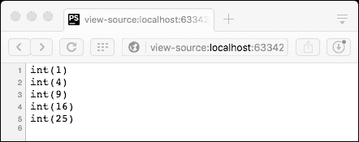
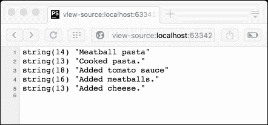
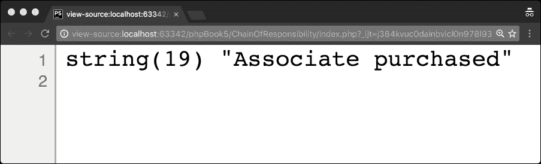
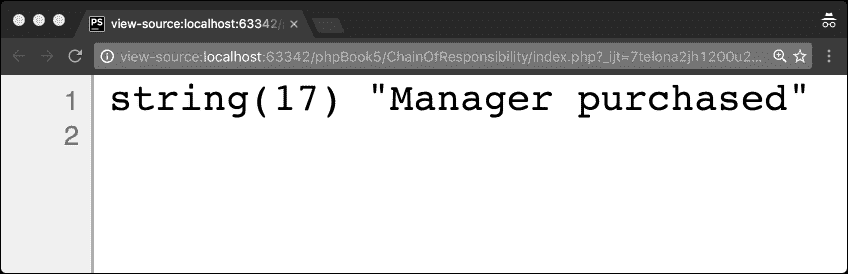
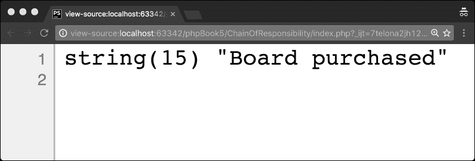
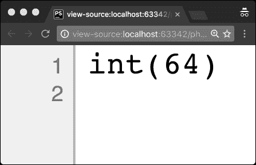
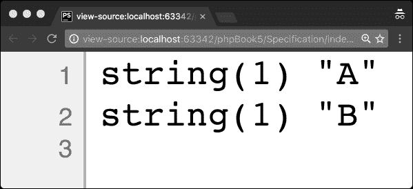

# 第五章行为设计模式

行为设计模式都是关于对象之间的通信。

牢记单一责任原则，类只封装一个责任是至关重要的。鉴于此，显然有必要允许对象进行通信。

通过使用行为设计模式，我们能够增加进行这些通信的灵活性。

在本章中，我们将介绍以下模式：

*   观察者模式（SplObserver/SplSubject）
*   迭代器
*   PHP 的许多迭代器
*   发电机
*   模板模式
*   责任链模式
*   战略模式
*   规范模式
*   计划任务模式

# 激情程序员的个性特征

在我们开始讨论行为设计模式之前，让我们先谈谈您作为开发人员的行为。在本书的前面，我已经谈到了由于糟糕的管理实践而导致开发失败的频率。

让我们设想两种情况：

*   一家公司将 Scrum 作为一种方法论（或另一种缺乏技术知识的*敏捷*方法论）引入，但他们的代码不够敏捷，无法承受代码。在这些场景中，当添加代码时，它通常会出错，而且几乎可以肯定的是，代码实现所需的时间要比没有技术债务时长得多。这导致开发速度缓慢。
*   或者，一家公司遵循一个严格预定义的流程，该方法是一成不变的。这些流程通常是不合理的，但开发人员通常会遵循这些流程，因为他们没有受过更好的流程教育，不想通过官僚主义纠纷来改变这些流程，甚至可能害怕试图改进流程而受到纪律处分。

在这两种情况下，糟糕的流程是问题的核心。即使您没有处理遗留项目，这也可能成为一个问题，因为整个属性的需求发生了变化。软件的一个很好的特性是能够改变，甚至改变软件本身的设计（我们将在重构的最后一章中讨论这一点）。

Alastair Cockburn 指出，软件开发人员通常不适合预定义的生产线流程。人类是不可预测的，当他们是任何给定过程中的关键参与者时，该过程也变得不可预测。人类容易犯错误，在预定义的过程中，当错误的空间和软件开发中一样大时，人类的行为就不会完美。从根本上说，这就是为什么人们必须走在流程之前，正如敏捷宣言中所说的那样。开发人员必须先于流程。

一些管理职位的人想买一种叫做敏捷的东西。他们会聘请一位顾问，但他不明白软件开发如何才能真正取得成功，相反，他们会实施一个荒谬的过程，作为摇钱树业务的一部分，来销售敏捷。我认为 Scrum 是这方面最糟糕的例子（部分原因是因为有很多不准确的课程和伪资格），但毫无疑问，其他敏捷过程可以作为摇钱树使用。

我曾多次与经理或**Scrum 大师**接触，他们声称*Scrum 说我们应该。。。*或*敏捷说我们应该。。。*。这在心理上是不合逻辑的，应该避免。当你这样说的时候，你根本不理解敏捷方法论是基于敏捷原则的，因此，人们必须超越过程。

让我们再次回顾第一个场景。请注意，争议主要源于缺乏开发质量，而不是项目管理过程。Scrum 无法实现开发过程，因此，通过 Scrum 尝试的项目往往会失败。

极限编程（XP）包含这些 Scrum 所缺乏的开发规则。以下是一些例子：

*   编码标准（在 PHP 中，您可以选择我们在前面章节中讨论的 PSR 标准）
*   首先编写单元测试，然后编写代码以使其通过测试
*   所有生产代码都是成对编程的
*   一个专用的集成服务器，一次只有一对集成代码，代码经常被集成
*   使用集体所有制；代码库的任何部分都不允许其他开发人员使用

这一切都是在 XP 崩溃时修复 XP 的背景下完成的，使改进过程成为开发的常规部分。

引入技术标准和开发规则既需要已有的开发知识，也需要学习更多的热情；为此，逻辑和证据驱动的思维过程至关重要。这些都是成为一名优秀软件工程师的关键要素。

结对编程绝不能成为指导的一种努力，它绝不能是一种师生关系；两个开发者都必须愿意提出想法，并对这些想法进行批评。事实上，相互学习是至关重要的。

在敏捷关系中，每个人都必须愿意理解规划过程并为之做出贡献，因为这种沟通是一项至关重要的技能。同样，相互尊重是关键；从客户到开发人员，每个人都值得尊重。开发人员必须在许多方面勇敢，不仅要对进度和评估保持诚实，同时还要适应变化。在处理或驳回反馈之前，我们必须设法了解我们收到的反馈。

这些技能不仅仅是开关或开关，它们是开放式的技能和知识库，我们必须努力维护和锻炼它们。事情出了差错；通过使用反馈，我们能够确保我们的代码在部署之前具有足够高的质量。

# 观察者模式（SplObserver/SplSubject）

观察者设计模式本质上允许一个对象（主体）维护一个观察者列表，当该对象的状态发生变化时，会自动通知观察者列表。

此模式在对象之间应用一对多依赖关系；总是有一个主题更新了许多观察者。

四人帮最初认为这种模式特别适用于抽象有两个方面的情况，一个方面依赖于另一个方面。除此之外，当对对象的更改需要对其他对象进行更改，而您不知道还有多少其他对象需要更改时，它非常有用。最后，当一个对象应该通知其他对象而不假设这些对象是什么时，这种模式也非常有用，因此这种模式非常适合松散耦合这种关系。

PHP 提供了一个非常有用的接口，称为`SplObserver`和`SplSubject`。这些接口提供了实现观察者设计模式的模板，而不是实际实现任何功能。

本质上，当我们实现这个模式时，我们允许无限量的对象观察主体中的事件。

通过在`subject`对象中调用`attach`方法，我们可以将观察者附加到主体上。当受试者发生变化时，受试者的`notify`方法可以迭代观察者并多态地调用他们的`update`方法。

我们还可以在主题中调用 un notify 方法，这将允许我们阻止`observer`对象观察`subject`对象。

有鉴于此，`Subject`类包含将观察者与自身连接和分离的方法，该类还包含更新观察者的`notify`方法。因此，PHP 的`SplSubject` 接口如下：

```php
interface SplSubject  { 
  public function attach (SplObserver $observer); 
   public function detach (SplObserver $observer); 
   public function notify (); 
} 

```

相比之下，我们的`SplObserver`界面看起来更简单；它只需要实现一种方法，允许受试者更新观察者：

```php
interface SplObserver  { 
  public function update (SplSubject $subject); 
} 

```

现在，让我们看看如何实现这两个接口来实现这个设计模式。在本例中，我们将有一个新闻提要类，它将更新正在阅读这些类的各种读者。

让我们定义我们的`Feed`类，它将实现`SplSubject` 接口：

```php
<?php 

class Feed implements SplSubject 
{ 
  private $name; 
  private $observers = array(); 
  private $content; 

  public function __construct($name) 
  { 
    $this->name = $name; 
  } 

  public function attach(SplObserver $observer) 
  { 
    $observerHash = spl_object_hash($observer); 
    $this->observers[$observerHash] = $observer; 
  } 

  public function detach(SplObserver $observer) 
  { 
    $observerHash = spl_object_hash($observer); 
    unset($this->observers[$observerHash]); 
  } 

  public function breakOutNews($content) 
  { 
    $this->content = $content; 
    $this->notify(); 
  } 

  public function getContent() 
  { 
    return $this->content . " on ". $this->name . "."; 
  } 

  public function notify() 
  { 
    foreach ($this->observers as $value) { 
      $value->update($this); 
    } 
  } 
} 

```

总体而言，我们介绍的实现非常简单。请注意它是如何使用我们在本书前面探讨过的`spl_object_hash`函数来轻松分离对象的。通过使用散列作为数组的键，我们可以快速找到给定的对象，而无需这样做。

现在我们可以定义我们的`Reader`类，它将实现`SplObserver`接口：

```php
<?php 

class Reader implements SplObserver 
{ 
  private $name; 

  public function __construct($name) 
  { 
    $this->name = $name; 
  } 

  public function update(SplSubject $subject) 
  { 
    echo $this->name . ' is reading the article ' . $subject->getContent() . ' '; 
  } 
} 

```

让我们将所有这些内容打包到我们的`index.php`文件中，如下所示：

```php
<?php 

require_once('Feed.php'); 
require_once('Reader.php'); 

$newspaper = new  Feed('Junade.com'); 

$allen = new Reader('Mark'); 
$jim = new Reader('Lily'); 
$linda = new Reader('Caitlin'); 

//add reader 
$newspaper->attach($allen); 
$newspaper->attach($jim); 
$newspaper->attach($linda); 

//remove reader 
$newspaper->detach($linda); 

//set break outs 
$newspaper->breakOutNews('PHP Design Patterns'); 

```

在这个脚本中，我们首先实例化一个包含三个读卡器的提要。我们把它们全部连接起来，然后拆下一个。最后，我们发送一个新警报，该警报生成以下输出：


这种设计模式的主要优势在于观察者和主体之间关系的松散耦合性。模块化程度更高，因为主体和观察者可以独立变化。除此之外，我们还可以添加任意数量的观察者，提供所需的任意多个功能。这种可扩展性和定制性通常是将这种设计模式应用于应用程序的视图上下文中的原因，并且通常在**模型视图控制器**（**MVC**框架中实现。

当我们需要调试整个过程时，使用这种模式的缺点就出现了；由于观察者彼此不了解，流量控制可能变得困难。除此之外，还有一个更新开销，当处理特别大的观察者时，这会使内存管理变得困难。

请记住，此设计模式仅用于一个程序中，它不是为进程间通信或消息传递系统而设计的。在本书的后面部分，我们将介绍如何使用消息传递模式来描述当我们希望允许不同进程之间的交互，而不仅仅是一个进程中的不同类之间的交互时，消息解析系统的不同部分是如何相互连接的。

# 迭代器

迭代器设计模式是使用迭代器遍历容器的模式。在 PHP 中，如果类最终继承了可遍历接口，则可以使用`foreach`构造来遍历该类。不幸的是，这是一个抽象的基本接口，您无法单独实现它（除非您是在 PHP 核心本身中编写的）。相反，您必须实现名为`Iterator`或`IteratorAggregate`的接口。通过实现这两个接口中的任何一个，您可以使用`foreach`使一个类成为可访问和可遍历的。

`Iterator`和`IteratorAggregate`接口非常相似，只是`IteratorAggregate`接口创建了一个外部迭代器。 `IteratorAggregate`作为接口只需要一种方式`getIterator`。此方法必须返回`ArrayIterator`接口的实例。

## 迭代器聚合

让我们假设我们想要创建这个接口的一个实现，它将遍历不同的时间。

首先，让我们从`IternatorAggregate`类的基本实现开始，了解它是如何工作的：

```php
<?php 

class timeIterator implements IteratorAggregate { 

  public function getIterator() 
  { 
    return new ArrayIterator(array( 
      'property1' => 1, 
      'property2' => 2, 
      'property4' => 3 
    )); 
  } 
} 

```

我们可以按如下方式迭代该类：

```php
<?php 

$time = new timeIterator; 

foreach($time as $key => $value) { 
  var_dump($key, $value); 
  echo "n"; 
} 

```

其结果如下：


我已经修改了这个脚本，使它接受一个`time`值，并计算两侧的各种值，使它们可以使用：

```php
<?php 

class timeIterator implements IteratorAggregate 
{ 

  public function __construct(int $time) 
  { 
    $this->weekAgo   = $time - 604800; 
    $this->yesterday = $time - 86400; 
    $this->now       = $time; 
    $this->tomorrow  = $time + 86400; 
    $this->nextWeek  = $time + 604800; 
  } 

  public function getIterator() 
  { 
    return new ArrayIterator($this); 
  } 
} 

$time = new timeIterator(time()); 

foreach ($time as $key => $value) { 
  var_dump($key, $value); 
  echo "n"; 
} 

```

此脚本的输出如下所示：


## 迭代器

让我们假设我们想要创建这个接口的一个实现，它将在不同的时间进行迭代。

## PHP 的众多迭代器

在此之前，我们已经研究了**SPL（标准 PHP 库）**中的一些函数，这是一个用于解决常见问题的接口和类的集合。鉴于这个目标，它们与设计模式有一个共同的目标，但它们都以不同的方式解决这些问题。不需要外部库来构建这个扩展并在 PHP7 中编译；事实上，你甚至不能禁用它。

作为这个库的一部分，SPL 中有很多迭代器。您可以在[的文档中找到它们的列表 http://php.net/manual/en/spl.iterators.php](http://php.net/manual/en/spl.iterators.php) 。

下面是一些迭代器的列表，让您了解如何利用它们：

*   附加迭代器
*   阵列致畸器
*   仙人掌计算器
*   callbackfilter 迭代器
*   目录迭代器
*   空致畸器
*   文件系统发射器
*   过滤器
*   全局迭代器
*   无限算子
*   迭代器
*   极限迭代器
*   乘法器
*   诺维因迪奥特
*   父迭代器
*   递归数组迭代器
*   递归计算器
*   递归 callbackfilter 迭代器
*   递归方向迭代器
*   递归过滤器
*   递归迭代器
*   递归运算器
*   递归树运算符
*   正则化器

# 发电机

PHP 有一个很好的机制来以紧凑的方式创建迭代器。这种类型的迭代器有一些严重的限制；它们只是向前的，不能倒转。实际上，即使只是从一开始就启动迭代器，也必须重新构建生成器。本质上，这是一个只向前的迭代器。

使用`yield`关键字而不是`return`关键字的函数。这将以与`return`语句相同的方式运行，但不会停止该函数的执行。一个发电机功能可以`yield`任意多次地收集数据。

当您用值填充数组时，这些值必须存储在内存中，这可能会导致您超出 PHP 内存限制或需要生成器大量的处理时间。当您将逻辑放入生成器函数中时，该开销并不存在。生成函数可能只产生所需的结果；不需要先预填充数组。

这是一个简单的生成器，它将`var_dump`一个字符串，表示生成器已启动。然后，该函数将生成前五个平方数，同时还将输出它们在序列中的位置与`var_dump` 。然后，它将最终指示发电机已结束：

```php
<?php 
function squaredNumbers() 
{ 
  var_dump("Generator starts."); 
  for ($i = 0; $i < 5; ++$i) { 
    var_dump($i . " in series."); 
    yield pow($i, 2); 
  } 
  var_dump("Generator ends."); 
} 

foreach (squaredNumbers() as $number) { 
  var_dump($number); 
} 

```

这个脚本的第二部分循环使用这个函数，并在每个数字上运行一个`var_dump`字符串。其结果如下：


让我们稍微修改一下这个函数。

需要注意的是，如果向变量添加返回类型，则只能声明返回类型为`Generator`、`Iterator`或`Traversable`、`integer`。

代码如下：

```php
<?php 
function squaredNumbers(int $start, int $end): Generator 
{ 
  for ($i = $start; $i <= $end; ++$i) { 
    yield pow($i, 2); 
  } 
} 

foreach (squaredNumbers(1, 5) as $number) { 
  var_dump($number); 
} 

```

结果如下：



如果我们想产生一个键和一个值呢？嗯，这相当容易。

对于在 PHP5 中使用生成器的人，还有一点需要提及：在 PHP5 中，当您想在将其设置为变量的同时生成一个变量时，必须将 yield 语句括在括号中。PHP7 中不存在此限制。

这适用于 PHP5 和 PHP7：

```php
$data = (yield $value);

```

这仅适用于 PHP 7：

```php
$data = yield $value;

```

假设我们要修改生成器，使其生成一个键值结果。下面是代码的样子：

```php
<?php 

function squaredNumbers(int $start, int $end): Generator 
{ 
  for ($i = $start; $i <= $end; ++$i) { 
    yield $i => pow($i, 2); 
  } 
} 

foreach (squaredNumbers(1, 5) as $key => $number) { 
  var_dump([$key, $number]); 
} 

```

当我们测试这个时，我们将`var_dump`一个二维数组，其中包含生成器在给定迭代中产生的任何内容的键值存储。

以下是输出：


还有一些提示，一个没有变量的 yield 语句（如后续命令中所示）只会产生`null`：

```php
yield;

```

您也可以使用`yield from`，它将产生任何给定生成器的内部值。

假设我们有一个包含两个值的数组：

```php
[1, 2] 

```

当我们使用`yield from`生成两个值的数组时，我们得到数组的内部值。让我示范一下：

```php
<?php 

function innerGenerator() 
{ 
  yield from [1, 2]; 
} 

foreach (innerGenerator() as $number) { 
  var_dump($number); 
} 

```

这将显示以下输出：


但是，现在让我们更改此脚本，使其使用`yield`而不是`yield from`：

```php
<?php 

function innerGenerator() 
{ 
  yield [1, 2]; 
} 

foreach (innerGenerator() as $number) { 
  var_dump($number); 
} 

```

现在我们将看到，不仅仅是数组的内部值，我们还得到了外部容器：


# 模板法设计模式

模板方法设计模式用于创建一组必须执行一组类似行为的子类。

这个设计模式由一个模板方法组成，它是一个抽象类。具体的子类可以重写抽象类中的方法。模板方法包括一个算法的框架；子类可以使用重写来更改算法的具体行为。

因此，这是一个非常简单的设计模式；它鼓励松耦合，同时也控制允许子类化的点。因此，它比简单的多态行为更细粒度。

考虑下面的一个 Apple T0.类的抽象：

```php
<?php 

abstract class Pasta 
{ 
  public function __construct(bool $cheese = true) 
  { 
    $this->cheese = $cheese; 
  } 

  public function cook() 
  { 

    var_dump('Cooked pasta.'); 

    $this->boilPasta(); 
    $this->addSauce(); 
    $this->addMeat(); 

    if ($this->cheese) { 
      $this->addCheese(); 
    } 
  } 

  public function boilPasta(): bool 
  { 
    return true; 
  } 

  public abstract function addSauce(): bool; 

  public abstract function addMeat(): bool; 

  public abstract function addCheese(): bool; 

} 

```

有一个简单的构造器来确定面食是否应该包含奶酪，还有一个`cook`函数来运行烹饪算法。

注意，添加各种成分的函数被抽象掉了；在子类中，我们用所需的行为实现这些方法。

假设我们想做肉丸意大利面。我们可以按如下方式实现这个抽象类：

```php
<?php 

class MeatballPasta extends Pasta 
{ 

  public function addSauce(): bool 
  { 
    var_dump("Added tomato sauce"); 

    return true; 
  } 

  public function addMeat(): bool 
  { 
    var_dump("Added meatballs."); 

    return true; 

  } 

  public function addCheese(): bool 
  { 
    var_dump("Added cheese."); 

    return true; 
  } 

} 

```

我们可以在`index.php` 文件中使用以下脚本对该代码进行采样：

```php
<?php 

require_once('Pasta.php'); 
require_once('MeatballPasta.php'); 

var_dump("Meatball pasta"); 
$dish = new MeatballPasta(true); 
$dish->cook(); 

```

由于显示各种状态消息的各种函数中的所有`var_dump`变量，我们可以看到如下输出：



现在，假设我们想做一份素食食谱。我们可以在不同的上下文中使用相同的抽象。

这一次，当涉及到添加肉类或奶酪时，这些功能没有任何作用；它们可以返回`false`或`null`值：

```php
<?php 

class VeganPasta extends Pasta 
{ 

  public function addSauce(): bool 
  { 
    var_dump("Added tomato sauce"); 

    return true; 
  } 

  public function addMeat(): bool 
  { 
    return false; 
  } 

  public function addCheese(): bool 
  { 
    return false; 
  } 

} 

```

让我们修改我们的`index.php` 文件来表示这种行为：

```php
<?php 

require_once('Pasta.php'); 
require_once('MeatballPasta.php'); 

var_dump("Meatball pasta"); 
$dish = new MeatballPasta(true); 
$dish->cook(); 

var_dump(""); 
var_dump("Vegan pasta"); 
require_once('VeganPasta.php'); 

$dish = new VeganPasta(true); 
$dish->cook(); 

```

结果如下：


这种设计模式简单易用，但它从根本上允许您抽象算法设计，并将该责任委托给您想要的子类。

# 责任链

假设我们有一组用于解决问题的对象。当一个对象无法解决问题时，我们希望该对象将任务发送到给定链中的另一个对象。这就是责任链设计模式的用途。

为了让它工作，我们需要一个处理程序，它将是我们的`Chain`接口。链中的各种对象都将实现这个`Chain`接口。

让我们从一个简单的例子开始；员工可以用不到 100 美元的价格购买资产，经理可以用不到 500 美元的价格购买东西。

我们对`Purchaser`接口的抽象如下所示：

```php
<?php 

interface Purchaser 
{ 
  public function setNextPurchaser(Purchaser $nextPurchaser): bool; 

  public function buy($price): bool; 
} 

```

我们的第一个实现是`Associate`类。非常简单，我们实现了`setNextPurchaser`函数，以便它将`nextPurchaser`类属性设置为链中的下一个对象。

当我们调用`buy`函数时，如果价格在范围内，关联方会购买。如果没有，则链中的下一个购买者将购买：

```php
<?php 

class AssociatePurchaser implements Purchaser 
{ 
  public function setNextPurchaser(Purchaser $nextPurchaser): bool 
  { 
    $this->nextPurchaser = $nextPurchaser; 
    return true; 
  } 

  public function buy($price): bool 
  { 
    if ($price < 100) { 
      var_dump("Associate purchased"); 
      return true; 
    } else { 
      if (isset($this->nextPurchaser)) { 
        reurn $this->nextPurchaser->buy($price); 
      } else { 
        var_dump("Could not buy"); 
        return false; 
      } 
    } 
  } 
} 

```

我们的`Manager`班是完全一样的；我们只允许经理购买 500 美元以下的资产。实际上，当您应用此模式时，您不会只是复制一个类，因为您的类将具有不同的逻辑；这个例子只是一个非常简单的实现。

代码如下：

```php
<?php 

class ManagerPurchaser implements Purchaser 
{ 
  public function setNextPurchaser(Purchaser $nextPurchaser): bool 
  { 
    $this->nextPurchaser = $nextPurchaser; 
    return true; 
  } 

  public function buy($price): bool 
  { 
    if ($price < 500) { 
      var_dump("Associate purchased"); 
      return true; 
    } else { 
      if (isset($this->nextPurchaser)) { 
        return $this->nextPurchaser->buy($price); 
      } else { 
        var_dump("Could not buy"); 
        return false; 
      } 
    } 
  } 
} 

```

让我们从`index.php` 文件中的一位同事处运行一个基本购买。

首先，这是我们在`index.php`文件中输入的代码：

```php
<?php 

require_once('Purchaser.php'); 
require_once('AssociatePurchaser.php'); 

$associate = new AssociatePurchaser(); 

$associate->buy(50); 

```

所有这些的输出如下所示：



接下来，让我们测试一下我们的`Manager`类。我们将在`index.php`文件中修改我们的购买价格，并将`Manager`类添加到链中。

以下是我们修订的`index.php`：

```php
<?php 

require_once('Purchaser.php'); 
require_once('AssociatePurchaser.php'); 
require_once('ManagerPurchaser.php'); 

$associate = new AssociatePurchaser(); 
$manager = new ManagerPurchaser(); 

$associate->setNextPurchaser($manager); 

$associate->buy(400); 

```

它具有以下输出：



让我们看看如果我们改变价格使购买失败会发生什么。

我们更改了`index.php` 文件的最后一行，因此购买价格现在为 600 美元：

```php
<?php 

require_once('Purchaser.php'); 
require_once('AssociatePurchaser.php'); 
require_once('ManagerPurchaser.php'); 

$associate = new AssociatePurchaser(); 
$manager = new ManagerPurchaser(); 

$associate->setNextPurchaser($manager); 

$associate->buy(600); 

```

它具有以下输出：


我们现在可以扩展这个脚本。让我们加上`DirectorPurchaser`和`BoardPurchaser`，这样我们可以以更高的成本进行采购。

我们将创建一个`DirectorPurchaser` ，可以在 10000 美元以下购买。

这类课程如下：

```php
<?php 

class DirectorPurchaser implements Purchaser 
{ 
  public function setNextPurchaser(Purchaser $nextPurchaser): bool 
  { 
    $this->nextPurchaser = $nextPurchaser; 
    return true; 
  } 

  public function buy($price): bool 
  { 
    if ($price < 10000) { 
      var_dump("Director purchased"); 
      return true; 
    } else { 
      if (isset($this->nextPurchaser)) { 
        return $this->nextPurchaser->buy($price); 
      } else { 
        var_dump("Could not buy"); 
        return false; 
      } 
    } 
  } 
} 

```

让我们对一个能购买 10 万美元以下物品的`BoardPurchaser`类也这样做：

```php
<?php 

class BoardPurchaser implements Purchaser 
{ 
  public function setNextPurchaser(Purchaser $nextPurchaser): bool 
  { 
    $this->nextPurchaser = $nextPurchaser; 
    return true; 
  } 

  public function buy($price): bool 
  { 
    if ($price < 100000) { 
      var_dump("Board purchased"); 
      return true; 
    } else { 
      if (isset($this->nextPurchaser)) { 
        return $this->nextPurchaser->buy($price); 
      } else { 
        var_dump("Could not buy"); 
        return false; 
      } 
    } 
  } 
} 

```

现在我们可以更新我们的`index.php` 脚本，以需要新的类，实例化它们，然后将所有内容绑定到一个链中。最后，我们将尝试通过调用链中的第一个来运行购买。

以下是脚本：

```php
<?php 

require_once('Purchaser.php'); 
require_once('AssociatePurchaser.php'); 
require_once('ManagerPurchaser.php'); 
require_once('DirectorPurchaser.php'); 
require_once('BoardPurchaser.php'); 

$associate = new AssociatePurchaser(); 
$manager = new ManagerPurchaser(); 
$director = new DirectorPurchaser(); 
$board = new BoardPurchaser(); 

$associate->setNextPurchaser($manager); 
$manager->setNextPurchaser($director); 
$director->setNextPurchaser($board); 

$associate->buy(11000); 

```

以下是此脚本的输出：



这允许我们遍历对象链来处理数据。这在处理树数据结构（例如，XML 树）时特别有用。这可以以一种启动和离开的方式进行，在这种方式中，我们可以降低处理循环链的开销。

此外，链是松散耦合的，数据通过链传递，直到被处理。任何对象都可以以任何顺序链接到任何其他对象。

# 战略设计模式

策略设计模式允许我们在运行时改变对象的行为。

让我们假设我们有一个类，它将一个数字提升为一个幂，但在运行时我们想要改变我们是平方还是立方。

让我们首先定义一个接口，一个将数字提升到给定幂的函数：

```php
<?php 

interface Power 
{ 
  public function raise(int $number): int; 
} 

```

通过实现接口，我们可以相应地将类定义为`Square`和`Cube`给定的数量。

这是我们的`Square`课程：

```php
<?php 

class Square implements Power 
{ 
  public function raise(int $number): int 
  { 
    return pow($number, 2); 
  } 
} 

```

让我们来定义我们的`Cube`类：

```php
<?php 

class Cube implements Power 
{ 
  public function raise(int $number): int 
  { 
    return pow($number, 3); 
  } 
} 

```

我们现在可以构建一个类，该类基本上使用这些类中的一个来处理一个数字。

下面是课程：

```php
<?php 

class RaiseNumber 
{ 
  public function __construct(Power $strategy) 
  { 
    $this->strategy = $strategy; 
  } 

  public function raise(int $number) 
  { 
    return $this->strategy->raise($number); 
  } 
} 

```

现在，我们可以使用`index.php` 文件演示整个设置：

```php
<?php 

require_once('Power.php'); 
require_once('Square.php'); 
require_once('Cube.php'); 
require_once('RaiseNumber.php'); 

$processor = new RaiseNumber(new Square()); 

var_dump($processor->raise(5)); 

```

输出如预期，5<sup>2</sup>为`25`。

以下是输出：


我们可以将`Square`对象与`index.php` 文件中的`Cube`对象进行交换：

```php
<?php 

require_once('Power.php'); 
require_once('Square.php'); 
require_once('Cube.php'); 
require_once('RaiseNumber.php'); 

$processor = new RaiseNumber(new Cube()); 

var_dump($processor->raise(5)); 

```

以下是更新脚本的输出：


到现在为止，一直都还不错；但这之所以伟大，是因为我们可以动态添加逻辑，从而实际更改类的操作。

这是一个相当粗糙的例子：

```php
<?php 

require_once('Power.php'); 
require_once('Square.php'); 
require_once('Cube.php'); 
require_once('RaiseNumber.php'); 

if (isset($_GET['n'])) { 
  $number = $_GET['n']; 
} else { 
  $number = 0; 
} 

if ($number < 5) { 
  $power = new Cube(); 
} else { 
  $power = new Square(); 
} 

$processor = new RaiseNumber($power); 

var_dump($processor->raise($number)); 

```

为了演示这一点，让我们运行脚本，将*n*`GET`变量设置为`4`，该变量应将数字`4`进行立方运算，输出`64`：



现在如果我们通过数字`6`，我们希望脚本将数字`6`平方，输出`36`：


在这种设计模式中，我们做了很多工作：

*   我们定义了一系列由一个公共接口绑定的算法
*   这些算法是可互换的；它们可以在不影响客户端实现的情况下进行交换
*   我们将每个算法封装在一个类中

现在，我们可以独立于使用它的客户端来改变算法。

# 规格设计模式

规范设计模式的功能非常强大。在这里，我将试图提供一个高层次的概述，但有很多要探讨；如果您有兴趣了解更多信息，我强烈推荐*Eric Evans*和*Martin Fowler*撰写的论文*规范*。

此设计模式用于编写业务规则，以说明对象的某些方面。它们告诉我们对象是否满足某些业务标准。

我们可以通过以下方式使用它们：

*   对对象进行断言，用于*验证*
*   从给定集合中获取对象的*选择*
*   指定*按订单建筑*如何创建对象

在本例中，我们将构建要查询的规范

让我们以以下对象为例：

```php
<?php 

$workers = array(); 

$workers['A'] = new StdClass(); 
$workers['A']->title = "Developer"; 
$workers['A']->department = "Engineering"; 
$workers['A']->salary = 50000; 

$workers['B'] = new StdClass(); 
$workers['B']->title = "Data Analyst"; 
$workers['B']->department = "Engineering"; 
$workers['B']->salary = 30000; 

$workers['C'] = new StdClass(); 
$workers['C']->title = "Personal Assistant"; 
$workers['C']->department = "CEO"; 
$workers['C']->salary = 25000; 

The workers array will look like this if we var_dump it: 
array(3) { 
  ["A"]=> 
  object(stdClass)#1 (3) { 
    ["title"]=> 
    string(9) "Developer" 
    ["department"]=> 
    string(11) "Engineering" 
    ["salary"]=> 
    int(50000) 
  } 
  ["B"]=> 
  object(stdClass)#2 (3) { 
    ["title"]=> 
    string(12) "Data Analyst" 
    ["department"]=> 
    string(11) "Engineering" 
    ["salary"]=> 
    int(30000) 
  } 
  ["C"]=> 
  object(stdClass)#3 (3) { 
    ["title"]=> 
    string(18) "Personal Assistant" 
    ["department"]=> 
    string(3) "CEO" 
    ["salary"]=> 
    int(25000) 
  } 
} 

```

让我们从一个`EmployeeSpecification`界面开始；这是我们所有规范都需要实现的接口。确保将`StdClass`替换为您正在处理的对象类型（例如，employee，或您实例化对象的类的名称）。

代码如下：

```php
<?php 

interface EmployeeSpecification 
{ 
  public function isSatisfiedBy(StdClass $customer): bool; 
} 

```

是时候编写一个名为`EmployeeIsEngineer`的实现了：

```php
<?php 

class EmployeeIsEngineer implements EmployeeSpecification 
{ 
  public function isSatisfiedBy(StdClass $customer): bool 
  { 
    if ($customer->department === "Engineering") { 
      return true; 
    } 

    return false; 
  } 
} 

```

然后，我们可以反复检查我们的员工，以检查哪些员工符合我们概述的标准：

```php
$isEngineer = new EmployeeIsEngineer(); 

foreach ($workers as $id => $worker) { 
  if ($isEngineer->isSatisfiedBy($worker)) { 
    var_dump($id); 
  } 
} 

```

让我们把这些放在我们的`index.php` 文件中：

```php
<?php 

require_once('EmployeeSpecification.php'); 
require_once('EmployeeIsEngineer.php'); 

$workers = array(); 

$workers['A'] = new StdClass(); 
$workers['A']->title = "Developer"; 
$workers['A']->department = "Engineering"; 
$workers['A']->salary = 50000; 

$workers['B'] = new StdClass(); 
$workers['B']->title = "Data Analyst"; 
$workers['B']->department = "Engineering"; 
$workers['B']->salary = 30000; 

$workers['C'] = new StdClass(); 
$workers['C']->title = "Personal Assistant"; 
$workers['C']->department = "CEO"; 
$workers['C']->salary = 25000; 

$isEngineer = new EmployeeIsEngineer(); 

foreach ($workers as $id => $worker) { 
  if ($isEngineer->isSatisfiedBy($worker)) { 
    var_dump($id); 
  } 
} 

```

以下是此脚本的输出：



复合规范允许您组合规范。通过使用`AND`、`NOT`、`OR`和`NOR`操作符，您可以将各自的函数构建到不同的规范类中。

类似地，还可以使用规范获取对象。

这段代码会随着您的深入而变得更加复杂，但您理解其要点。事实上，我在本节开头提到的埃里克·埃文斯（Eric Evans）和马丁·福勒（Martin Fowler）的论文涉及到了一些更为复杂的安排。

无论哪种方式，这种设计模式基本上都允许我们封装业务逻辑，以说明有关对象的某些内容。这是一个非常强大的设计模式，我非常鼓励更深入地研究它。

# 计划任务模式

计划任务基本上由三部分组成：任务本身、通过定义正在运行的任务和允许运行的任务来执行计划的作业，以及执行此作业的作业注册表。

通常，这些都是通过在 Linux 服务器上使用 cron 实现的。您可以使用以下配置语法向`configuration`文件添加一行：

```php
 # ┌───────────── min (0 - 59)
     # │ ┌────────────── hour (0 - 23)
     # │ │ ┌─────────────── day of month (1 - 31)
     # │ │ │ ┌──────────────── month (1 - 12)
     # │ │ │ │ ┌───────────────── day of week (0 - 6) (0 to 6 are Sunday to
     # │ │ │ │ │                  Saturday, or use names; 7 is also Sunday)
     # │ │ │ │ │
     # │ │ │ │ │
     # * * * * *  command to execute 

```

您通常可以通过在命令行中运行`crontab -e`来编辑`cron`文件。您可以使用此模式调度任何 Linux 命令。下面是一个 cronjob，它将在每天 20:00（晚上 8 点）运行一个 PHP 脚本：

```php
0 20 * * * /usr/bin/php /opt/test.php

```

这些很容易运行和实现，但以下是一些指导原则，可帮助您在创建它们时进行指导：

*   不要把你的工作暴露在互联网上。
*   运行任务时，任务不应检查是否需要运行的条件。此测试应在任务之外。
*   任务应该只执行计划的活动，而不执行任何其他目的。
*   注意我们在[第 7 章](7.html "Chapter 7. Refactoring")重构中讨论的数据库作为 IPC 模式。

你可以在任务中放任何你想要的东西（在合理的范围内）。您可能会发现异步执行是最佳的路径。Icicle 是执行异步行为的一个很棒的 PHP 库。您可以在网上[找到文档 https://icicle.io/](https://icicle.io/) 。

当我们的任务需要按特定顺序完成多个任务时，您可能会受益于使用我们在“结构设计模式”部分中讨论的复合设计模式，并调用使用此模式的单个任务来调用使用此模式的其他任务。

# 总结

在本章中，我们介绍了一些识别对象之间常见通信模式的模式。

我们介绍了如何使用观察者模式来更新观察者对给定主题的状态。此外，我们还了解了标准 PHP 库如何包含可以帮助我们实现这一点的功能。

然后，我们继续介绍如何在 PHP 中以多种不同的方式实现迭代器，使用 PHP 核心中的各种接口以及生成器函数。

我们接着讨论了模板模式如何定义一个算法框架，我们可以以比标准多态性更严格的方式动态地适应该框架。我们介绍了责任链模式，它允许我们将链中的对象链接在一起以执行各种功能。策略模式教会了我们如何在运行时改变代码的行为。然后，我介绍了规范模式的基础知识以及其中的功能有多先进。最后，我们修改了调度任务模式，以及如何在 Linux 上使用 cron 实现它。

这些设计模式对于开发人员来说是最关键的。在许多项目中，对象之间的通信是至关重要的，这些模式可以真正帮助我们进行这种通信。

在下一章中，我们将介绍架构模式，以及这些模式如何帮助您完成出现的软件架构任务，以及它们如何帮助您解决您可能面临的更广泛的软件工程挑战（尽管它们本身在技术上可能不是设计模式）。