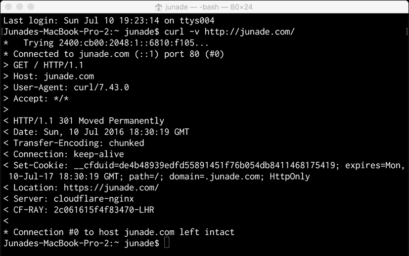
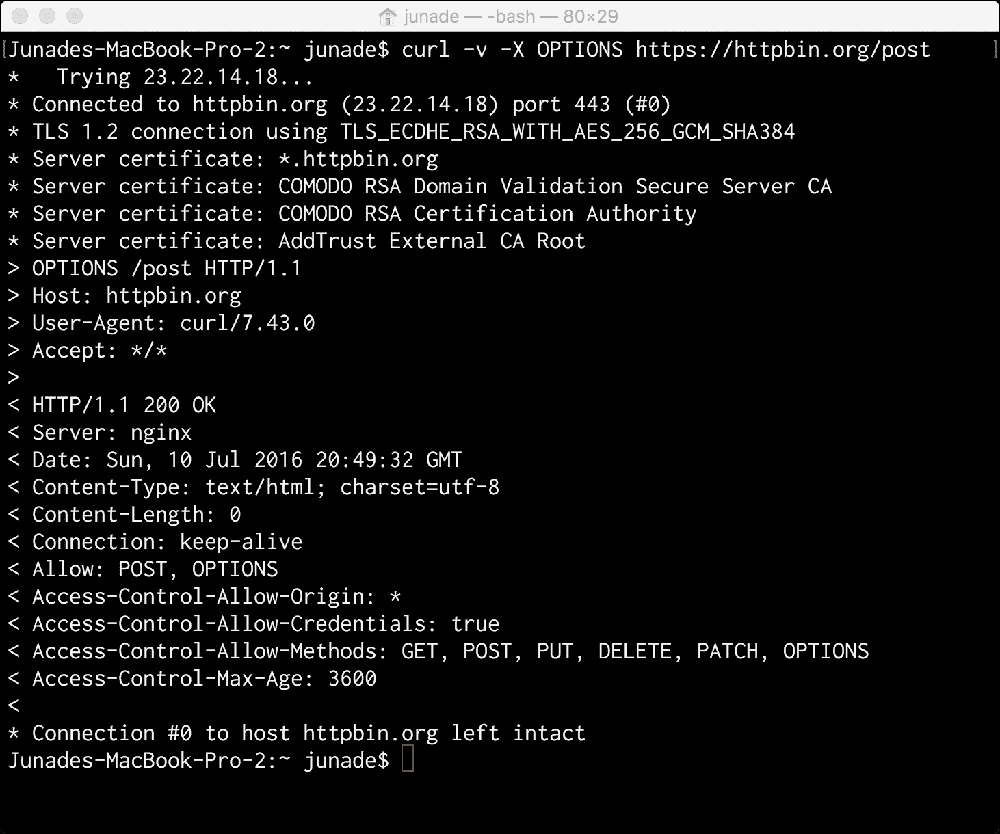
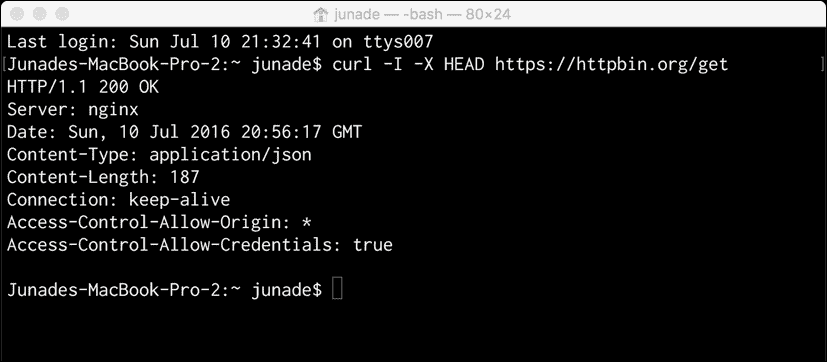
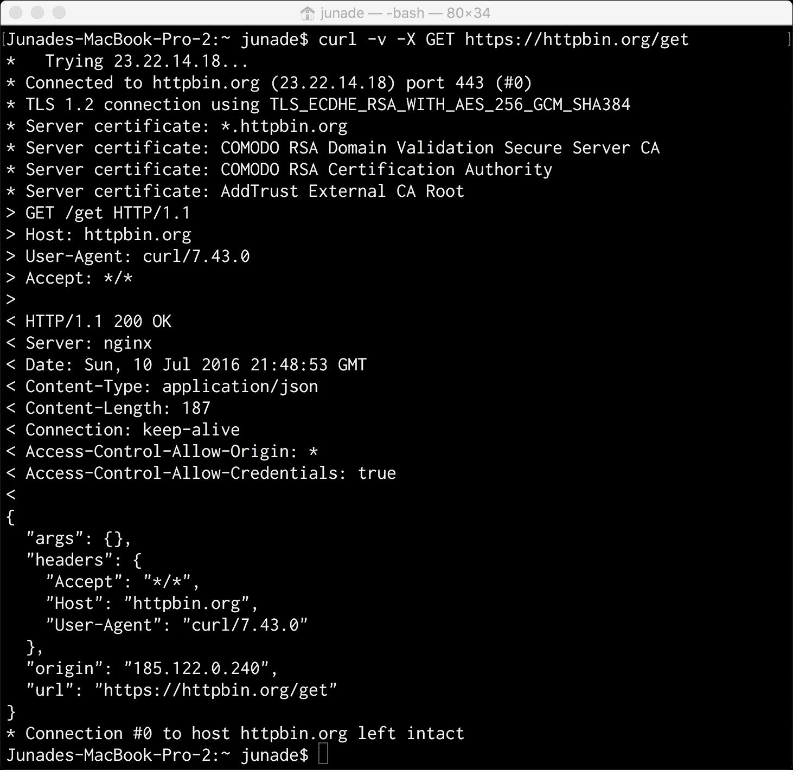
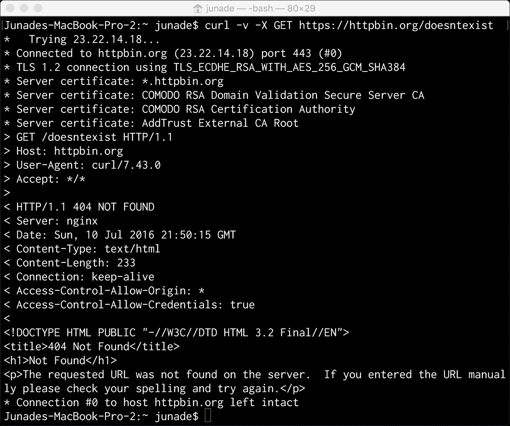
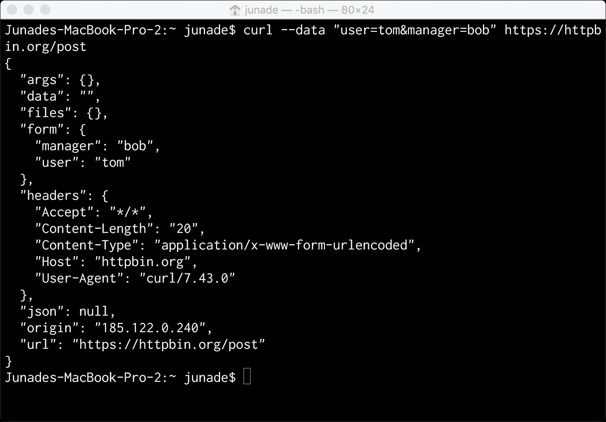
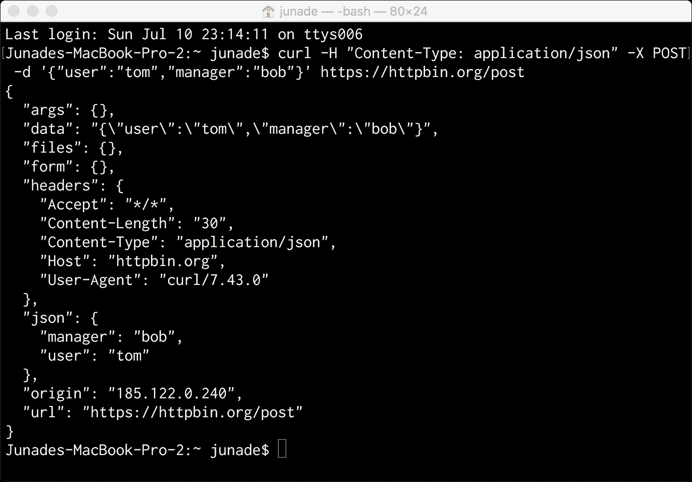
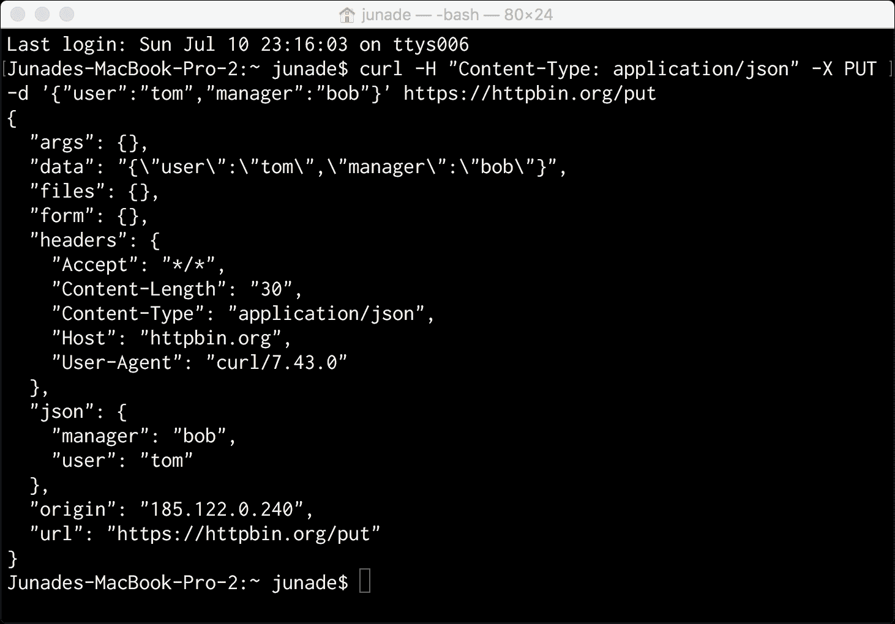
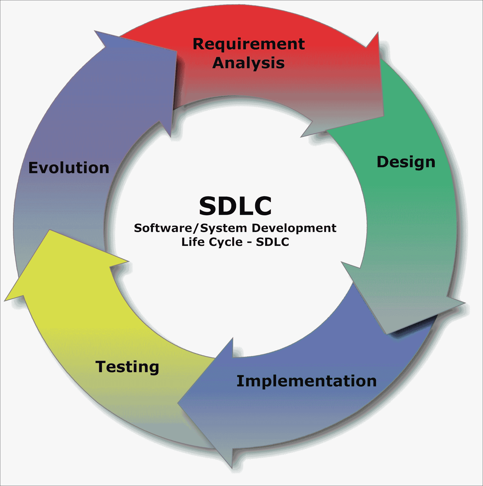
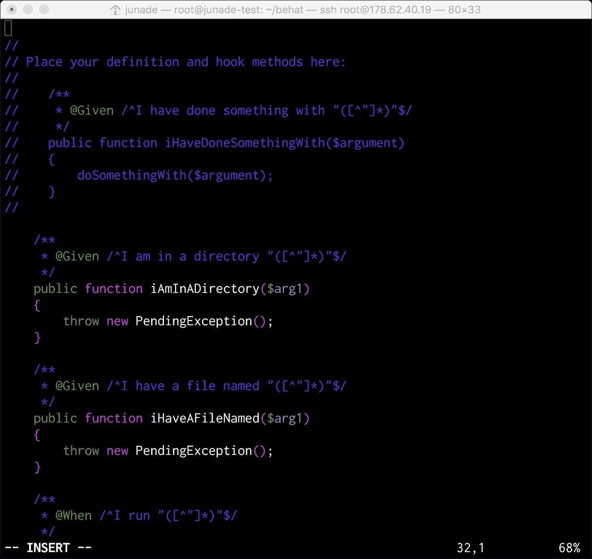

# 八、如何编写更好的代码

这是本书的最后一章。我们已经讨论了很多模式，但在最后一章中，我希望我们讨论如何应用这些模式。

我想让我们在这里谈一谈我们的代码是如何组合在一起的，以及我们编写优秀代码的关键要点是什么。

除此之外，我还想讨论在开发阶段哪些模式适合我们的应用程序。

在本章中，我们将介绍以下几点：

*   HTTP 请求的性质
*   RESTful API 设计
*   保持简单和直接
*   软件开发生命周期和工程实践
*   测试的重要性
*   BDD 简介

# HTTP 请求的性质

许多开发人员发现 HTTP 请求被抽象出来；事实上，许多 PHP 开发人员永远不需要了解 HTTP 请求在后台是如何工作的。

PHP 开发人员在开发时经常使用 HTTP 网络。实际上，PHP 包含一些在使用 HTTP 通信时非常有用的核心函数。

让我们来看看一个 HTTP 请求在一个高级别使用一个工具，称为 Endot0。curl 本质上是一个命令行工具，它允许我们模拟网络请求。它允许您使用各种协议模拟数据传输。

### 注

*cURL*的名称原意为*见 URL*。

curl 项目同时产生`libcurl`和`curl`命令行工具。Libcurl 是 PHP 支持的库，允许您通过 PHP 中的协议列表进行连接和通信，前提是您的安装已经安装了它。

但是，在本例中，我们将使用命令行工具模拟请求。

让我们首先向给定的网站发出一个简单的`curl`请求，如下所示：

```php
curl https://junade.com

```

根据您在命令中查询的站点，您将注意到终端输出为空：


这是怎么回事？为了找到答案，我们需要进一步挖掘。

您可以在`curl`命令中使用`-v`参数，这样我们可以看到详细的输出：

```php
curl -v http://junade.com

```

这项技术的这一输出有很大不同：


通过这个输出，我们可以看到发送的报头和接收的报头。

以星号`*`开头的方框表示正在建立连接。我们可以看到 curl 如何重建 URL，使其正确（在末尾包含正斜杠），然后解析服务器的 IP 地址（在我的例子中是 IPv6 地址），然后最终建立到 web 服务器的连接：

```php
* Rebuilt URL to: http://junade.com/ 
*   Trying 2400:cb00:2048:1::6810:f005... 
* Connected to junade.com (::1) port 80 (#0) 

```

通过查询 DNS 服务器将主机名转换为 IP 地址；稍后我们将对此进行更详细的讨论。但是在这一点上，重要的是要记住，在这一点之后，使用 IP 地址建立到服务器的连接。

如果我们在最后去掉正斜杠，我们实际上可以看到，在第一行中，重建 URL 将消失，因为在我们发出请求之前，它已经是正确的格式：



接下来让我们看下面几行星号。我们在大于号`>`中看到出站标头。

这些标题如下所示：

```php
> GET / HTTP/1.1 
> Host: junade.com 
> User-Agent: curl/7.43.0 
> Accept: */* 
> 

```

因此，我们看到的第一条消息是请求方法`GET`，然后是端点`/`和协议`HTTP/1.1`。

接下来，我们看到`Host`头，它告诉我们服务器的域名，还可以包含服务器正在侦听的 TCP 端口号，但如果端口是请求服务的标准端口，则通常会对其进行修改。但为什么需要这样做？假设一台服务器包含许多虚拟主机；这实际上允许服务器使用头来确定虚拟主机之间的关系。虚拟主机本质上允许服务器承载多个域名。为了做到这一点，我们需要这个标题；当服务器看到 HTTP 请求传入时，它们不会看到头。

还记得我说过使用 IP 地址建立连接吗？这个`Host`头允许我们通过 hostname 变量发送，该变量指示 IP 地址是什么。

接下来，我们看到`User-Agent`标题，指示客户端正在使用的浏览器；此请求中的`User-Agent`头表示我们正在使用 curl 命令发送 HTTP 请求。切记不要信任来自客户机的任何 HTTP 头，因为它们可以被操纵以包含恶意对手想要放入其中的任何数据。它们可以包含从伪浏览器标识符到 SQL 注入的所有内容。

最后，`Accept`头表示响应可接受的`Content-Type`头。在这里，我们看到一个通配符接受，表示我们很乐意接收服务器发送给我们的任何内容。在其他情况下，我们可以使用`Accept: text/plain`表示希望看到纯文本，或者使用`Accept:application/json`表示 JSON。我们甚至可以使用`Accept: image/jpg`指定是否要接收 JPG 图像。

也可以通过`Accept`头发送各种参数；例如，我们可以使用带有 Accept:`text/html`的 UTF-8 字符集请求 HTML；`charset=UTF-8`。

基本上，此标头中允许的语法如下所示：

```php
top-level type name / subtype name [ ; parameters ] 

```

服务器可以在响应中使用`Content-Type`头指示返回给用户的内容类型。因此，服务器可以按如下方式将标头发送回最终用户：

```php
Content-Type: text/html; charset=utf-8 

```

转到响应的主题，让我们来看看响应。它们的前缀为<:/>

```php
< HTTP/1.1 301 Moved Permanently 
< Date: Sun, 10 Jul 2016 18:23:22 GMT 
< Transfer-Encoding: chunked 
< Connection: keep-alive 
< Set-Cookie: __cfduid=d45c9e013b12286fe4e443702f3ec15f31468175002; expires=Mon, 10-Jul-17 18:23:22 GMT; path=/; domain=.junade.com; HttpOnly 
< Location: https://junade.com/ 
< Server: cloudflare-nginx 
< CF-RAY: 2c060be42065346a-LHR 
< 

```

因此，我们在响应中得到的第一件事是指示格式和状态代码。HTTP/1.1 表示我们正在接收一个`HTTP/1.1`响应，`301 Moved Permanently`消息表示永久重定向。因此，我们也会收到一个`Location: https://junade.com/ header`，它告诉我们下一步要去哪里。

`Server`头表示提供我们请求的 web 服务器的签名。它可以是 Apache 或 Nginx；在本例中，CloudFlare 在其网络中使用的是经过修改的 Nginx 版本。

Set Cookie 标头用于指示浏览器应设置哪些 Cookie；这方面的标准见 RFC 6265 文件。

**RFC**代表**征求意见书**；RFC 有多种类型。标准跟踪 RFC 是那些打算成为互联网标准（STD）的 RFC，而信息 RFC 可以是任何东西。还有许多其他类型的 RFC，例如实验性的、当前最佳实践的、历史性的，甚至对于那些状态不清楚是否将在今天发布的 RFC，还有未知的 RFC 类型。

`Transfer-Encoding`头表示用于将实体传输给用户的编码，可以是从分块到 gzip 之类的任何东西，gzip 是一个压缩实体。

有趣的是，2015 年 5 月 RFC 7540 中发布的`HTTP/2`协议实际上允许头压缩。如今，我们发送的报头数据比创建`HTTP/1`协议时最初发送的要多（原始`HTTP`协议甚至不包含`Host`报头！）。

`Connection`头为连接提供控制选项。它允许发送方指定当前连接所需的选项。最后，`Date`头表示消息发送的日期和时间。

考虑一下这一点：HTTP 请求/响应可以包含多个相同的名称头吗？

是的，这在某些标头中特别有用，例如`Link`标头。此表头用于执行`HTTP/2`服务器推送；服务器推送允许服务器在请求之前将请求推送到客户端。每个表头可以指定一个资产；因此，需要多个头来推送多个资产。

这是我们在 PHP 中可以做的事情。以 PHP 中的以下`header`函数调用为例：

```php
header("Link: <{$uri}>; rel=preload; as=image", false); 

```

虽然第一个参数是我们要发送的实际头的字符串，但第二个参数（`false`表示我们不希望替换相同头的前一个头，而是希望发送此头，但不替换它。通过将此标志设置为`true`，我们表示希望覆盖上一个标头；如果根本没有指定标志，则这是默认选项。

最后，当请求关闭时，您将看到最后一个星号，指示连接已关闭：

```php
* Connection #0 to host junade.com left intact 

```

通常情况下，如果有身体的话，它会在身体下方。在这个请求中，没有一个，因为它只是一个重定向。

我现在使用以下命令向`Location`头指向的位置发出`curl`请求：

```php
curl -v https://junade.com/

```

您现在会注意到，连接关闭消息出现在 HTML 正文的末尾：


现在让我们尝试探索一些 HTTP 方法。在 RESTAPI 中，您将经常使用`GET`、`POST`、`PUT`和`DELETE`；但首先，我们将探讨另外两个问题，`HEAD`和`OPTIONS`。

`HTTP OPTIONS`请求详细说明了可以在给定端点上使用的请求方法。它提供有关特定端点可用的通信选项的信息。

让我来演示一下。我将使用一个名为`HTTPBin`的服务，它允许我向 over curl 发出请求，以从真正的服务器获得一些响应。

这里有一个`OPTIONS`请求，我正在使用 curl：

```php
curl -v -X OPTIONS https://httpbin.org/get 

```

`-X`选项允许我们指定特定的 HTTP 请求类型，而不仅仅是默认为 curl。

让我们看看执行后的效果：


首先，您会注意到，如果请求是通过 HTTP 进行的，您将在星号中看到一些额外的信息；此信息包含用于加密连接的 TLS 证书信息。

请看下面一行：

```php
TLS 1.2 connection using TLS_ECDHE_RSA_WITH_AES_256_GCM_SHA384 

```

`TLS 1.2`表示我们正在处理的传输层安全性版本；第二部分表示`TLS_ECDHE_RSA_WITH_AES_256_GCM_SHA384`，表示连接的密码套件。

密码套件首先详细说明我们正在处理的`TLS. ECDHE_RSA`表明密钥交换是使用椭圆曲线 Diffie-Hellman 完成的。密钥交换本质上允许安全地传输加密密钥。通过使用椭圆曲线密码，可以共享特定的密钥，随后可以使用该密钥对数据进行加密。`ECDHE_RSA`表示我们使用椭圆曲线 Diffie-Hellman 来共享基于服务器获得的 RSA 密钥的密钥。还有许多其他的密钥交换算法；例如，`ECDH_ECDSA`使用带有 ECDSA 签名证书的固定 ECDH。

访问控制前缀头用于一种称为 CORS 的机制，该机制本质上允许 JavaScript 发出跨源 API 请求；我们不要担心这个。

对于`OPTIONS`请求，我们确实需要担心的头就是`Allow`头。这详细说明了允许我们将哪些请求方法提交回该特定端点。

因此，这是我们查询`/get`端点时得到的请求：

```php
< Allow: HEAD, OPTIONS, GET

```

注意，我在这里使用的端点使用`/get`端点。相反，让我们使用以下`curl`请求向`/post`端点发出另一个`OPTIONS`请求：

```php
curl -v -X OPTIONS https://httpbin.org/post

```

这是我们得到的回应：



您会注意到，`Allow`标题现在包含`POST`和`OPTIONS`。还请注意，`HEAD`选项已取消。

您很快就会发现`HEAD`请求与`GET`请求非常相似，只是没有消息体。它只返回 HTTP 请求的头，而不返回请求的主体。因此，它允许您获得有关实体的元信息，而无需获得完整的响应。

让我们向`/get`端点发出 HEAD 请求：

```php
curl -I -X HEAD https://httpbin.org/get

```

我没有在这个请求中使用`-v`（verbose）选项，而是使用`-I`选项，它只会获取`HTTP`头。这非常适合使用`HEAD`选项发出 HTTP 请求：



如您所见，我们在`Content-Type`标题中得到了响应的类型。除此之外，您将在`Content-Length`头中获得请求的长度。长度以八位字节（8 位）为单位测量；您可能认为这与字节相同，但在所有体系结构中，字节不一定是 8 位。

还有许多其他的头可以发送来表示元信息。这可能包括标准标头或非标准标头，以表达在标准化 RFC 支持的标头中无法表达的其他信息。

**HTTP ETags**（**实体标签**）是一种提供缓存验证的机制。您可以在 RESTful API 的上下文中使用它们来进行乐观并发控制；这基本上允许多个请求在不需要相互干扰的情况下完成。这是一个相当高级的 API 概念，所以我在这里不太详细。

注意，在我们的`HTTP HEAD`和`OPTIONS`请求中，我们都得到了`200 OK`头消息。`200`状态代码表示 HTTP 请求成功。

有许多不同类型的状态代码。它们分类如下：

*   **1xx 消息**：信息性
*   **2xx 消息**成功
*   **3xx 消息**：重定向
*   **4xx 消息**：客户端错误
*   **5xx 消息**：服务器错误

一个信息头可以是一个`101`响应，它表示客户端正在交换协议，而服务器已经同意这样做。如果您正在开发 RESTful API，您可能不会遇到信息头消息；这些最有可能是由 web 服务器发送的内容，而 web 服务器是从开发人员那里抽象出来的。

正确使用其他 HTTP 状态代码对于正确开发 API 至关重要，尤其是 RESTful API。

成功状态代码不仅限于`200 OK`消息；201 Created 表示已完成创建新资源的请求。这在`PUT`请求创建新资源或使用`POST`创建辅助资源时特别有用。`202 Accepted`表示已接受处理请求，但处理尚未完成，这在分布式系统中很有用。`204 No Content`表示服务器已处理请求，未返回任何信息；`205 Reset Content`标题也会执行相同的操作，但会要求请求者重置其文档视图。这些只是 200 条信息；显然还有很多。

重定向消息包括我们在第一个`curl`示例中展示的`301 Moved Permanently`，而`302 Found`可以用于更多的临时重定向。同样，还有其他消息代码。

当找不到资源时，客户端错误代码包括臭名昭著的`404 Not Found`消息。除此之外，我们还有`401 Unauthorized`当需要身份验证但未提供身份验证时，`403 Forbidden`表示服务器拒绝响应任何请求（例如，不正确的权限）。`405 Method Not Allowed`允许我们在使用无效请求方法提交请求的基础上拒绝请求，这同样对于 RESTful API 非常有用。`405 Not Acceptable`是服务器无法根据发送给它的`Accept`头生成响应的响应。同样，还有许多其他 4xx HTTP 代码。

### 注

HTTP 代码 451 表示由于法律原因请求不可用。根据作者声称 451 华氏度是纸张的自燃温度而命名的小说*华氏 451*后选择的代码。

最后，`Server Errors`允许服务器指出他们未能完成一个显然有效的请求。这些消息包括`500 Internal Server Error`，这是在遇到意外情况时给出的一般错误消息。

现在让我们来看一个`GET`请求。如果我们没有指定任何要发送的数据或特定的方法，则默认情况下，`curl`将发出`GET`请求：

```php
curl -v https://httpbin.org/get

```

我们还可以指定我们需要`GET`请求：

```php
curl -v -X GET https://httpbin.org/get

```

其结果如下：



在这里，您可以看到我们得到了与`HEAD`请求相同的标题，添加了一个主体；我们试图访问的任何资源的一些 JSON 数据。

我们得到一条`200 Success`消息，但让我们向一个不存在的端点发出 HTTP 请求，以便触发 404 消息：



正如您所看到的，我们得到的标题是`404 NOT FOUND`，而不是通常的`200 OK`消息。

`HTTP 404`没有身体也会有反应：


虽然`GET`请求仅显示现有资源，`POST`请求允许我们修改和更新资源。`PUT`请求允许我们创建一个新资源或覆盖一个资源，但特别是在给定的端点。

有什么区别？`PUT`是幂等的，而`POST`不是幂等的。`PUT`类似于设置一个变量`$x = 3`。你可以一遍又一遍地做，但是输出是一样的，`$x`是`3`。

`POST`更像是跑步`$x++`；它会导致一个不是幂等的变化，就像`$x++`不能反复给出相同的精确变量一样。`POST`更新资源、添加辅助资源或引起更改。当您知道要创建的 URL 时，将使用`PUT`。

当您知道为您创建资源的工厂的 URL 时，可以使用`POST`进行创建。

因此，例如，如果端点/用户希望生成具有唯一 ID 的用户帐户，我们将使用以下方法：

```php
POST /user

```

但如果我们想在特定端点创建用户帐户，我们将使用`PUT`：

```php
PUT /user/tom

```

同样，如果我们想在给定端点覆盖`tom`，我们可以在那里放置另一个`PUT`请求：

```php
PUT /user/tom

```

但是假设我们不知道汤姆的终点；相反，我们只想`PUT`到一个带有用户 ID 参数的端点，一些信息将被更新：

```php
POST /user

```

希望这是有道理的！

现在让我们来看一个给定的 ToRt0 请求。

我们可以使用 URL 编码的数据创建请求：

```php
curl --data "user=tom&manager=bob" https://httpbin.org/post

```

请注意，如果我们在`curl`中指定数据而不是请求类型，它将默认为`POST`。

如果我们执行此操作，您可以看到`Content-Type`是`x-www-form-urlencoded`：



但是，如果 API 允许并接受该格式，我们也可以向端点提交 JSON 数据：

```php
curl -H "Content-Type: application/json" -X POST -d '{"user":"tom","manager":"bob"}' https://httpbin.org/post

```

这提供了以下输出，注意到`Content-Type`现在是 JSON，而不是以前的`x-www-form-urlencoded`形式：



我们现在可以使用`PUT`向`/put`端点发送相同的数据，从而发出 HTTP 请求：

```php
curl -H "Content-Type: application/json" -X PUT -d '{"user":"tom","manager":"bob"}' https://httpbin.org/put

```

让我们将请求类型更改为`PUT`：



让我们使用以下`curl`请求向`DELETE`端点发出相同的请求（在本例中，我们将提交数据）：

```php
curl -H "Content-Type: application/json" -X DELETE -d '{"user":"tom"}' https://httpbin.org/delete

```

它具有以下输出：


在现实世界中，您可能不一定需要提交任何与我们刚刚删除资源相关的信息（这就是`DELETE`的用途）。相反，我们可能只想提交一条`204 No Content`信息。通常，我不会将消息传回。

`HTTP/2`在高级别上维护此请求结构。请记住，大多数`HTTP/2`实现需要 TLS（`h2`），并且大多数浏览器不支持明文（`h2c`）上的`HTTP/2`，即使在 RFC 标准中事实上是可能的。如果使用`HTTP/2`您实际需要对请求进行 TLS 加密。

求爱这是一个很好的例子，但这是您需要了解的关于 HTTP 请求的所有信息，在非常高的级别上。我们没有深入讨论网络细节，但这种理解对于 API 体系结构是必要的。

现在我们已经对 HTTP 请求和 HTTP 通信中使用的方法有了很好的了解，我们可以继续了解 API 的 RESTful 特性。

# RESTful API 设计

许多开发人员在使用和构建 RESTAPI 时都不了解 RESTful 的功能。那么*表征状态转移*到底是什么？此外，为什么 API 是*RESTful*很重要？

RESTful API 有一些关键的体系结构约束，第一个是本质上的无状态约束。

## 无国籍性质

RESTful API 是无状态的；在请求之间，客户端的上下文不存储在服务器上。

假设您创建了一个具有登录功能的基本 PHP 应用程序。验证登录表单中的用户凭据后，您可以继续使用会话来存储登录用户的状态，因为他们将进入下一个状态以执行下一个任务。

当涉及 RESTAPI 时，这是不可接受的；REST 是一个无状态协议。静止状态下的*ST*表示*状态转移*；请求的状态应该四处传输，而不仅仅存储在服务器上。通过传输会话而不是存储会话，您可以避免使用*粘性会话*或*会话亲缘关系*。

为了很好地实现这一点，HTTP 请求是完全隔离的。服务器执行`GET`、`POST`、`PUT`或`DELETE`请求所需的一切都在 HTTP 请求本身中。服务器从不依赖以前请求中的信息。

这样做的好处是什么？首先，它的规模要大得多；最明显的好处是根本不需要在服务器上存储会话。当您将 API Web 服务器置于负载平衡器之后时，它还附带了其他功能。

聚类困难；使用状态对 web 服务器进行集群意味着您需要进行粘性负载平衡，或者在会话方面需要一个公共存储。

## 版本控制

如果要修改 API 的版本，您需要进行更改，并且不希望它们破坏您的客户端实现。这可以使用标题或 URL 本身来完成。例如，您可以为版本标记（如`/api/v1/resource.json`）留出空间，而不是`/api/resource.json`。

您还可以实现`HTTP Accept`头来执行此行为，甚至可以放置您自己的头。客户端可以发送一个将`API-Version`头设置为`2`的请求，服务器将知道如何使用 API 版本 2 与客户端通信。

## 过滤

使用参数查询，我们可以通过使用参数筛选给定的。如果我们处理的是`/orders`端点上的排序系统，那么实现基本过滤是相当容易的。

这里，我们使用`state`参数过滤未结订单：

```php
GET /orders?state=open

```

## 分拣

我们还可以添加一个`sort`参数来按字段排序。`sort`字段依次包含一个逗号分隔列列表，用于排序；列表中的第一个是最高排序优先级。为了进行负排序，请在列前面加上负号`-`

*   `GET /tickets?sort=-amount`：按金额降序排序（最高优先）。
*   `GET /tickets?sort=-amount,created_at`：按金额降序排序（最高优先）。在这些金额中（订单金额相等），先列出较旧的订单。

## 搜索

然后，我们可以使用一个简单的参数进行搜索，该参数应用搜索查询，然后可以通过搜索服务（例如，ElasticSearch）进行路由。

假设我们要搜索订单以获得短语退款，我们可以为搜索查询定义一个字段：

```php
GET /orders?q=refund

```

## 极限场

此外，使用`fields`参数，我们可以查询特定字段：

```php
GET /orders?fields=amount,created_at,customer_name,shipping_address

```

## 返回新字段

`PUT`、`POST`或`PATCH`可以更改我们更新的字段以外的其他条件。这可能是新的时间戳或新生成的 ID。因此，我们应该在更新时返回新的资源表示。

在创建了资源的`POST`请求中，您可以在指向资源的`Location`头旁边发送`HTTP 201 CREATED`消息。

# 有疑问时——亲吻

**KISS**是**的首字母缩略词，简单、愚蠢**。

KISS 原则指出，如果系统保持简单而不是复杂，那么大多数系统工作得最好。在整个编程过程中，牢记这一原则至关重要。

决定用一些预定义的设计模式编写程序通常是个糟糕的主意。代码永远不应该强制进入模式。虽然为设计模式编写代码可能适用于*Hello World*演示模式，但反过来，它通常不起作用。

设计模式的存在是为了解决代码中经常出现的问题。重要的是，它们用于解决问题，而不是在实际不存在此类问题的情况下实施。通过使代码尽可能简单并降低整个程序的复杂性，您可以减少失败的机会。

英国计算机学会发布了名为*IT 项目高级管理人员*的建议，表明彻底了解项目、人员、利益、复杂性和进度是至关重要的；除此之外，事先充分了解项目至关重要。为什么项目正在完成？风险是什么？如果项目脱轨，恢复机制是什么？

复杂系统必须优雅地处理错误，才能具有鲁棒性。冗余必须与复杂性相平衡。

# 软件开发生命周期

此图表是一个开源图表，描述了软件开发的步骤：



生产软件有许多不同类型的过程，但都必须包含图表中所示的步骤，因为它们是软件工程过程的基础。

虽然现在几乎所有人都认为瀑布式软件工程方法不再适用，但替代它的敏捷方法仍然需要一些设计（尽管更小、更迭代）和强大的测试实践。

至关重要的是，软件开发不是通过显微镜来观察的，而是从软件工程更广阔的视野来观察的。

# 在 Scrum 上，真正的敏捷性

Scrum 是一个迭代的软件开发框架，它声称是敏捷的，基于 Scrum 联盟发布的过程。其图表如下所示：


我们中的许多人都看到了软件开发团队中经过认证的 Scrum 大师们留下的灾难，他们主要将敏捷作为一个时髦词来交付一些简单无聊的软件编写过程。

敏捷宣言的开头是这样一句话：*个人和交互，而不是流程和工具*。Scrum 是一个过程，并且是一个严格定义的过程。Scrum 的实现方式通常是强调开发过程而不是团队。如果本节有一个要点，请记住短语*人员优先于流程*。如果您选择实施 Scrum，您必须愿意调整和更改其流程以应对变化。

敏捷的全部要点就是要敏捷；我们希望快速适应不断变化的需求。我们想要灵活性，我们不想要一个严格定义的过程，限制我们适应快速变化的需求。

填写时间表、采购订单和处理官僚治理流程无助于将软件交到客户手中，因此，如果软件无法使用，则必须尽可能轻。

时间表是完全浪费的东西的完美想法。它们只是用来监视开发人员的性能，尽管在某些情况下，管理层会假装它们有一些神奇的敏捷优势。在任何方面，它们肯定不会帮助您做出更好的软件评估；敏捷环境应该寻求使用预测而不是预测。

我见过 Scrum 大师们没完没了地重复这句话：*与敌人*接触后，任何作战计划都无法幸存；同时执行刚性预测方案。

准确的预测在现实世界中是一个矛盾的说法。对于不确定的事情，您无法准确预测，而且在几乎所有情况下，开发人员都不会充分了解他们正在处理的系统。此外，他们每天都不知道自己的个人效率；这是无法准确预见的。

我甚至遇到过这样的环境：这些严格的预测（通常甚至不是由开发人员自己做出的）是由严格的纪律程序强制执行的。

通过将问题分成小块解决来降低复杂性是一个很好的实践；将庞大的程序员团队缩减为较小的团队也是一种令人惊奇的做法。

在开发人员在这些小团队（通常称为*部落*）中构建的系统之间，通常需要一个系统架构师来确保团队之间的一致性。

Spotify 使用这种部落架构开发软件；事实上，我强烈建议阅读亨里克·克尼伯格和安德斯·伊瓦尔森撰写的论文*将敏捷@Spotify 与部落、小队*、*章节&行会*。

该系统架构师确保构建的所有不同服务之间的一致性。

具体到 Scrum，Scrum 是一个敏捷的过程。Scrum 指南（是的，它甚至是一个商标）在一个 16 页的文档中定义了 Scrum 的规则。

然而，敏捷包含许多不同的过程以及许多其他方法；敏捷是一个非常广泛的知识基础。

Scrum 大师喜欢假装敏捷发生在开发团队中的一个孤立环境中。这与事实相去甚远,；整个组织结构在 Scrum 中发挥作用。

**极限编程**（**XP**）是一个非常广泛的过程，人们对这些过程之间的相互作用有很大的了解。通过挑选这些过程，你最终会得到一个无效的过程；这就是 Scrum 挣扎的原因。

需求变更；这包括他们在冲刺中期的改变。当 Scrum 大师坚持在冲刺开始后不做任何更改时，这会使团队对真正的更改做出更无效的响应。

在敏捷机制中开发时，我们必须记住，我们的软件必须具有足够的弹性，以应对不断变化的需求（导致不断变化的软件设计）。您的软件架构必须能够应对变化带来的压力。因此，开发人员还必须理解并参与实现软件弹性所需的技术过程，以应对变化的步伐。

不能灵活应对变化的公司比那些能灵活应对变化的公司效率更低；因此，他们在商业世界中具有显著优势。在选择一家公司时，他们的敏捷性不仅关系到你所做工作的质量，而且对你的工作安全也至关重要。

我的信息在这里很简单；在实施流程时要认真对待技术实践，切记不要盲目遵循淫秽流程，因为它可能会损害整个业务。

开发人员不应该像孩子一样被对待。如果他们不能编写代码或写不好的代码，他们就不能继续被聘为开发人员。

本质上，为了管理风险，最好查看您的积压工作，并使用历史进度来创建项目将在哪里的预测。经理的角色应该是消除阻碍开发人员工作的障碍。

最后，如果您所在的团队中有一位 Scrum 大师，他对软件开发（以及敏捷）的理解非常糟糕，请强烈提醒他们，人必须超越过程，真正的敏捷性是由能够承受变化压力的代码来辅助的。

Scrum 大师有时会争辩说，敏捷意味着没有前期设计。这是不真实的，敏捷意味着没有大的前期设计。

# 有时候你需要解雇一些人

我曾经在开发环境中工作过，在那里，经理们害怕解雇，他们要么只是折磨开发人员，因为他们的工作显然无法完成，他们试图对开发团队施加不正当的限制，要么让他们破坏开发过程。

优秀的开发人员会因产生糟糕的代码或不平等的技能基础而醒悟。当其他开发人员经常被迫陷入维护噩梦时，他们可以摆脱糟糕的代码。面对维护噩梦（或者很可能是维护噩梦不断增加）的前景，他们随后辞职。

或者，为补偿差劲的开发人员而强加的限制性工作条件会使有才华的开发人员幻灭。他们厌倦了被当作白痴对待（因为其他开发人员都是白痴），于是他们接受了一份更好的公司的工作，该公司为他们提供了更好的职业前景，以及一个更好的工作环境和更快乐、更有才华的员工。他们接受这一提议，因为他们将要迁往的公司可能也会有更好的商业前景和更好的薪酬，以及更快乐的工程师和更好的工作环境。

这种情况还有一个极端；企业获得了如此恶劣的声誉，他们无法雇佣永久开发商；然后，他们为昂贵的合同开发商支付高昂的费用，同时利用自己的技能进行冒险。在合同开发商身上耗费大量资金的同时，出于绝望的业务可能会吸引到任何愿意从事这些项目的人。这些开发商的面试官可能没有就他们将要建设的系统提出正确的问题，这将导致对雇佣承包商质量的一场大赌博。这家公司减少了雇佣优秀长期员工的机会，随着公司的倒闭越来越严重，业务也进入了尾声。我已经多次看到过这种情况；每次公司都面临着缓慢而痛苦的衰退。如果你曾被邀请为一家类似的公司工作，我强烈建议你去别处看看，除非你真的相信自己能够为这样一家公司带来改革。

如果你曾经在这样一个组织中担任管理工作，确保你有权做出有意义的改变，有权雇佣合适的人，解雇不合适的人。如果不是这样，你在这样一个组织的任期只会花在转移躺椅上，而员工流失率很高。

人才是可以信赖的；那些对自己正在做的事情充满激情的人不需要限制来阻止他们放松。

如果有才华横溢的员工不能履行他们的职责，那么你的开发人员很可能只是懒汉；您需要消除限制开发的官僚流程。

强迫性地执行一些仪式，这些仪式对将软件放在用户手中没有任何意义，对开发团队也没有任何价值。

# 精益项目管理

精益项目管理允许您定期交付业务价值，而无需基于需求、特性和功能列表。

这本书*改变世界的机器*是基于麻省理工学院（Massachusetts Institute of Technology）耗资 500 万美元对汽车行业进行的为期 5 年的研究，使精益生产这一术语闻名于世。

本书提出了以下精益原则：

*   识别客户并指定价值
*   识别并映射价值流
*   通过消除浪费创造流量
*   对客户拉动做出响应
*   追求完美

因此，在软件开发方面有以下精益原则，这些原则主要基于精益生产的制造原则：

*   消除浪费
*   扩大学习
*   尽可能晚地作出决定
*   尽快交货
*   授权团队
*   建立诚信
*   综观全局

通过可重用组件实现的良好体系结构、自动化部署以及良好的体系结构都有助于实现这一目标。

# 雅格尼和延期决定

*您不需要它*-您不需要在必要时添加功能。只添加对项目成功至关重要的内容。您可能不需要为 web 应用的第一个版本提供很多功能；最好推迟到必要的时候。

通过延迟不必要的功能，您可以使软件设计尽可能简单。这有助于你应对变化的步伐。在以后的软件开发过程中，您将获得更多关于需求的知识，更重要的是，您的客户将对他们希望产品的发展方向有更精确的预测。

当你以后对软件做出决定时，你有了更多的数据和更多的教育。有些决定必须提前做出，但如果你能推迟，那通常是个好主意。

# 监测

随着规模的扩大，监控系统变得至关重要。有效的监控可以大大简化服务的维护。

在与该领域的多位专家交谈后，我收集了以下关于该主题的建议：

*   仔细选择关键统计数据。用户不关心您的机器是否 CPU 不足，但他们关心您的 API 是否慢。
*   使用聚合器；想想服务，而不是机器。如果你有超过一把的机器，你应该把它们当作一个无定形的斑点。
*   避免图墙。它们速度很慢，对人类来说是信息过载。每个仪表板应有五个图形，每个图形不超过五行。
*   分位数是不可聚合的，它们很难从中获得有意义的信息。然而，平均数很容易推理。第一个四分位数中 10 毫秒的响应时间并不是真正有用的信息，但 400 毫秒的平均响应时间表明了一个需要解决的明显问题。
*   除此之外，平均数比分位数更容易计算。它们在计算上很简单，在需要缩放监控系统时特别有用。
*   监测是有代价的。考虑一下这些资源是否真的值得。1 秒的监控频率真的比 10 秒的监控好吗？成本值吗？监控不是免费的，它需要计算成本。
*   这就是说，奈奎斯特-香农采样定理证明，如果你每 20 秒采样一次，你就不能在 10 秒之间重建图案。让我们假设有一个服务每 10 秒就会崩溃或降低计算机系统的速度-它无法被检测到。在整个数据分析过程中都要记住这一点。
*   相关性而非因果关系-注意构象偏差。在做任何激烈的事情之前，一定要建立一种正式的关系，确定是什么导致了一个特定的问题。
*   日志和度量都很好。日志让您了解细节，指标让您了解高层。
*   有办法处理非关键警报。如何处理 web 服务器日志文件中的所有 404 错误？
*   记住前面提到的亲吻原则；让您的监控尽可能简单。

# 测试与遗产抗争

自动化测试是对抗遗留代码的最佳工具。

通过使用诸如单元测试或行为测试之类的自动化测试，您能够有效地重构遗留代码，并确信几乎没有什么可以破坏的。

写得不好的系统通常由紧密耦合的函数组成。对一个类中的函数进行一次更改可能会破坏另一个完全不同的类中的函数，从而导致多米诺骨牌效应，导致更多的类被破坏，直到整个应用程序被破坏。

为了解耦类并遵循诸如单一责任原则之类的实践，必须进行重构。任何重构工作都必须确保不会破坏应用程序中其他地方的代码。

这就引出了测试覆盖率的话题：它是一个真正有意义的数字吗？

阿尔贝托·萨沃亚（Alberto Savoia）在他放在 artima.com 网站上的一篇有趣的轶事中回答了这个问题；让我们读一读：

> *一天清晨，一位程序员问大师：“我已经准备好编写一些单元测试了。我应该追求什么样的代码覆盖率？”*
> 
> *大师回答：“不用担心覆盖率，只要写一些好的测试就行了。”*
> 
> *程序员微笑着鞠躬离开。*
> 
> *。。。*
> 
> *那天晚些时候，第二个程序员问了同样的问题。大师指着一壶开水说：“我应该在那壶里放几粒米？”*
> 
> *程序员看起来很困惑，回答说：“我怎么可能告诉你呢？这取决于你需要喂养多少人，他们有多饿，你还提供什么食物，你有多少米，等等。”*
> 
> *“没错，”大师说。*
> 
> *第二个程序员微笑着鞠躬离开了。*
> 
> *。。。*
> 
> *那天快结束时，第三个程序员过来问了同样的关于代码覆盖率的问题。*
> 
> *“百分之八十，不少于百分之八十！”大师用严厉的声音回答，用拳头猛击桌子。*
> 
> *第三个程序员微笑着鞠躬离开了。*
> 
> *。。。*
> 
> *在最后的回答之后，一个年轻的学徒走近大师：*
> 
> *“大师，今天我无意中听到您用三种不同的答案回答了关于代码覆盖率的相同问题。为什么？”*
> 
> *大师从椅子上站起来：“来和我一起喝点新鲜茶，我们来聊聊吧。”*
> 
> *在他们的杯子里装满了冒烟的热绿茶后，大师开始回答：“第一个程序员是新的，刚刚开始测试。现在他有很多代码，没有测试。他还有很长的路要走；此时专注于代码覆盖率将是令人沮丧的，而且毫无用处。他最好只是习惯于编写和运行一些测试。他以后可以担心保险范围。”*
> 
> *“另一方面，第二位程序员在编程和测试方面都很有经验。当我问她我应该在一个锅里放多少粒大米时，我帮助她意识到需要的测试量取决于许多因素，她比我更了解这些因素——毕竟这是她的代码。没有单一、简单的答案，而她足够聪明，能够处理事实并处理它。”*
> 
> *“我明白了，”年轻的学徒说，“但是如果没有一个简单的答案，那么为什么你要回答第三个程序员‘百分之八十，不少于’？”*
> 
> *这位大师大笑得如此之厉害，以至于他的肚子——证明他喝的不仅仅是绿茶的证据——跳上跳下。*
> 
> *“第三个程序员只想要简单的答案——即使没有简单的答案……但无论如何都不会遵循这些答案。”*
> 
> *年轻的学徒和白发苍苍的大师在沉思的沉默中喝完了茶。*

阿尔贝托传达了一个简单的信息：专注于拥有尽可能多的业务逻辑和功能是最好的前进之路。测试覆盖率不是你应该遵循的任意数字。

有些事情不进行测试是有意义的，甚至已经测试过的代码也有不同的逻辑路径。

此外，在分布式系统中，API 或系统之间的通信可能会破坏系统。在分布式体系结构中，测试代码可能不够。强大的监控系统变得至关重要。作为代码的基础架构，确保一致的部署和升级已成为前景。此外，实现松散耦合的服务和适当的进程间通信比一些单元测试更有利于整个体系结构。

测试驱动开发（TDD）有一种替代方法。行为驱动开发（BDD）为我们提供了不同的代码测试机制；让我们讨论一下。

# 行为驱动发展

BDD 的工作原理是使用人类可读的故事实现测试。

Cucumber 是一种通过使用纯英语编写的人类可读特征文件来实现 BDD 工作流的工具，例如：

```php
Feature: Log in to site. 
  In order to see my profile 
    As a user 
    I need to log-in to the site. 

Scenario: Logs in to the site 
  Given I am on "/" 
  When I follow "Log In" 
    And I fill in "Username" with "admin" 
    And I fill in "Password" with "test" 
    And I press "Log in" 
  Then I should see "Log out" 
    And I should see "My account" 

```

现在，本节将是一个非常简单的 Behat 探索，激发你的好奇心。如果您想了解更多信息，请前往[http://www.behat.org](http://www.behat.org) 。

Behat 指南包含一个`ls`命令的用户故事示例。这是一个值得尊敬的例子，因此：

```php
Feature: ls 
  In order to see the directory structure 
  As a UNIX user 
  I need to be able to list the current directory's contents 

  Scenario: List 2 files in a directory 
    Given I am in a directory "test" 
    And I have a file named "foo" 
    And I have a file named "bar" 
    When I run "ls" 
    Then I should get: 
      """ 
      bar 
      foo 
      """ 

```

为了安装 Behat，您可以修改`composer.json`文件，以便在您的开发环境中需要它：

```php
{ 
  "require-dev": { 
    "behat/behat": "~2.5" 
  }, 
  "config": { 
    "bin-dir": "bin/" 
  } 
} 

```

这将安装 Behat 版本 2.5，还有 Behat 版本 3，它包含一整套新功能，而不会失去太多向后兼容性。也就是说，许多项目仍然在使用 Behat 2。

然后可以使用以下命令运行 Behat：

```php
bin/behat

```

我们得到以下输出：


通过使用`init`标志，我们可以创建一个功能目录，其中包含一些基本信息，让我们开始：


因此，让我们编写具有以下特性和场景的`feature/ls.feature`文件，如下所示：


如果现在运行 Behat，我们将发现以下输出：


Behat 相应地返回一些代码片段，以便我们可以实现未定义的步骤：

```php
  /** 
   * @Given /^I am in a directory "([^"]*)"$/ 
   */ 
  public function iAmInADirectory($arg1) 
  { 
    throw new PendingException(); 
  } 

  /** 
   * @Given /^I have a file named "([^"]*)"$/ 
   */ 
  public function iHaveAFileNamed($arg1) 
  { 
    throw new PendingException(); 
  } 

  /** 
   * @When /^I run "([^"]*)"$/ 
   */ 
  public function iRun($arg1) 
  { 
    throw new PendingException(); 
  } 

  /** 
   * @Then /^I should get:$/ 
   */ 
  public function iShouldGet(PyStringNode $string) 
  { 
    throw new PendingException(); 
  } 

```

现在，在为我们创建的功能目录中有一个引导文件夹，其中包含一个`FeatureContext.php`文件。在此文件中，您将能够找到类的主体：


您可能已经注意到了类主体中的这个块。我们可以将生成的方法放在这里：

```php
// 
// Place your definition and hook methods here: 
// 
//  /** 
//   * @Given /^I have done something with "([^"]*)"$/ 
//   */ 
//  public function iHaveDoneSomethingWith($argument) 
//  { 
//    doSomethingWith($argument); 
//  } 
// 

```

我的做法如下：



你可能会注意到身体充满了`PendingException`信息。我们需要用实际功能取代这些机构；幸运的是，Behat 文档包含填充了以下方法的函数：

```php
  /** @Given /^I am in a directory "([^"]*)"$/ */ 
  public function iAmInADirectory($dir) 
  { 
    if (!file_exists($dir)) { 
      mkdir($dir); 
    } 
    chdir($dir); 
  } 

  /** @Given /^I have a file named "([^"]*)"$/ */ 
  public function iHaveAFileNamed($file) 
  { 
    touch($file); 
  } 

  /** @When /^I run "([^"]*)"$/ */ 
  public function iRun($command) 
  { 
    exec($command, $output); 
    $this->output = trim(implode("\n", $output)); 
  } 

  /** @Then /^I should get:$/ */ 
  public function iShouldGet(PyStringNode $string) 
  { 
    if ((string) $string !== $this->output) { 
      throw new Exception( 
        "Actual output is:\n" . $this->output 
      ); 
    } 
  } 

```

现在我们可以运行 Behat，我们应该看到我们的场景及其各个步骤已经完成：


通过将 Mink 与 Behat 结合使用，我们可以相应地使用 Selenium 来运行浏览器测试。Selenium 将使用 Mink 启动浏览器，然后我们可以在浏览器中运行 Behat 测试。

# 总结

在本章中，我试图解决一些未解决的问题。通过学习 HTTP，我们讨论了 web 开发的一些网络方面。除此之外，我们还了解了如何有效地设计 RESTful API。

这本书现在就要结束了；让我们重温一些使我们的代码变得伟大的核心价值：

*   重组合轻继承
*   避免重复编码（干燥原则意味着不要重复自己）
*   保持简单和直接
*   不要仅仅为了使用设计模式而使用设计模式，当您确定设计模式可以解决的反复出现的问题时，请引入设计模式
*   抽象非常棒，接口可以帮助您抽象
*   按照良好的标准编写代码
*   在整个代码中分别承担责任
*   使用依赖关系管理和依赖关系注入；Composer 现在可用
*   测试节省了开发时间；它们对于任何重构工作和减少中断都至关重要

谢谢你看完这本书；这本书收集了我关于软件开发的大量论述；在经历了令人难以置信的多样化的职业生涯后，我学到了很多残酷的教训，还有很多让人眼花缭乱的代码需要重构。我见过一些最糟糕的，但也曾参与过一些最令人兴奋的 PHP 项目。我希望在这本书中我能够分享我在这个领域的一些经验。

开发人员很容易逃避开发的现实；很少有人知道软件设计和体系结构方面的最佳实践，只有极少数人选择 PHP 作为他们的开发语言。

对于我们中的许多人来说，我们产生的代码不仅仅是一种爱好或工作，它是我们作为软件工程师表达的极限。因此，以一种诗意的、富有表现力的、持久的方式来写作是我们的职责。

想想你想维护的代码；这就是你有责任产生的代码。简约主义、降低复杂性和分离关注点是实现这一目标的关键。

计算机科学可能建立在数学和定理的基础上，但我们的代码就在上面。通过利用图灵完备语言的基础，我们能够编写具有创造性和功能性的代码。

与许多其他学科相比，软件工程处于一个奇怪的真空中；虽然它非常标准化，但它也必须对人类有吸引力。我希望这本书能帮助你达到这些目的。