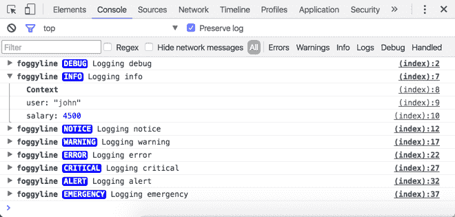

# 错误处理和日志记录

有效的错误处理和日志记录是应用程序的重要组成部分。早期版本的 PHP 缺乏对异常的支持，只使用错误来标记错误的应用程序状态。PHP5 版本为该语言带来了 OOP 特性，并由此带来了异常模型。这赋予了 PHP 和其他编程语言一样的`try...catch`块。后来，PHP5.5 版本带来了对`finally`块的支持，无论是否抛出异常，该块总是在`try...catch`块之后执行。

现在，PHP 语言将错误和异常区分为应用程序的错误状态。这两种情况都是我们的应用程序逻辑无法预料的。错误的类型有很多，比如`E_ERROR`、`E_WARNING`、`E_NOTICE`等等。当谈到错误时，我们默认为`E_ERROR`类型，它倾向于发出应用程序结束的信号，这是一种应用程序不应该尝试捕获并继续执行的意外状态。这可能是由于内存不足、IO 错误、TCP/IP 错误、空引用错误和许多其他原因造成的。另一方面，异常表示应用程序可能希望捕获并继续执行的意外状态。这可能是由于在给定时间无法在数据库中保存条目、意外的电子邮件发送失败等原因造成的。这有助于将异常视为错误的 OO 概念

PHP 有自己的机制，允许与某些错误类型和异常进行交互。使用`set_error_handler`，我们可以定义自定义错误处理程序，以便可能记录或向用户显示适当的消息。使用`try...catch...finally`块，我们可以安全地捕获可能的异常并继续执行应用程序。我们无法捕获的异常会自动转化为标准错误并中断应用程序的执行。

如果没有适当的日志记录机制，处理错误将不会真正完成。虽然 PHP 本身提供了一个有趣且有用的`error_log()`函数，但有更多以免费社区库的形式提供的健壮日志记录解决方案，如 Mongo。

接下来，我们将详细研究以下错误处理和日志记录领域：

*   错误处理
    *   错误
        *   `ArithmeticError`
        *   `DivisionByZeroError`
        *   `AssertionError`
        *   `ParseError`
        *   `TypeError`
    *   例外
*   登录中
    *   本地日志记录
    *   用独白记录日志

NASA lost a $125 million Mars orbiter on September 1999 because engineers failed to convert units from English to metric. While the system had nothing to do with PHP or the fatal runtime errors as such, it goes to say how great the impact a faulty software might have in real life.

# 错误处理

将错误和异常作为两种不同的错误处理系统会在开发人员中引起一定程度的混淆。旧版本的 PHP 很难用`E_ERROR`进行推理，因为它们无法用自定义错误处理程序捕获。PHP 7 版本试图通过引入`Throwable`接口来解决这一困惑，该接口概述如下：

```php
Throwable { 
  abstract public string getMessage (void) 
  abstract public int getCode (void) 
  abstract public string getFile (void) 
  abstract public int getLine (void) 
  abstract public array getTrace (void) 
  abstract public string getTraceAsString (void) 
  abstract public Throwable getPrevious (void) 
  abstract public string __toString (void) 
}

```

`Throwable`接口现在是`Error`、`Exception`以及可以通过`throw`语句抛出的任何其他对象的基本接口。本接口定义的方法与`Exception`的方法基本相同。PHP 类本身不能直接实现`Throwable`接口，也不能从`Error`扩展；只能扩展`Exception`，如下图所示：

```php
<?php

  class Glitch extends \Error
  {
  }

  try {
    throw new Glitch('Glitch!');
  } 
  catch (\Exception $e) {
    echo 'Caught ' . $e->getMessage();
  }

```

上述代码将产生以下输出：

```php
PHP Fatal error: Uncaught Glitch: Glitch! in index.php:7
Stack trace:
#0 {main}
thrown in /root/app/index.php on line 7

```

这里发生的事情是`Glitch`类试图扩展`Error`类，这是不允许的，并导致`Fatal error`不会被我们这里的`try...catch`块捕获：

```php
<?php

  class Flaw extends \Exception
  {
  }

  try {
    throw new Flaw('Flaw!');
  } 
  catch (\Exception $e) {
    echo 'Caught ' . $e->getMessage();
  }

```

前面的示例是 PHP`Throwable`的有效使用，而我们的自定义`Flaw`类扩展了`Exception`类。触发`catch`块，产生以下输出消息：

```php
Caught Flaw!

```

PHP 7 中新的异常层次结构如下所示：

```php
interface Throwable
 | Error implements Throwable
   | TypeError extends Error
   | ParseError extends Error
   | ArithmeticError extends Error
     | DivisionByZeroError extends ArithmeticError
   | AssertionError extends Error
 | Exception implements Throwable
   | ...

```

新的`Throwable`接口的明显好处是，我们现在可以在单个`try...catch`块中轻松捕获`Exception`和`Error`对象，如下例所示：

```php
<?php

try {
  throw new ArithmeticError('Missing numbers!');
} 
catch (Throwable $t) {
  echo $t->getMessage();
}

```

`AssertionError`扩展`Error`，进而实现`Throwable`接口。前面的`catch`块的签名指向`Throwable`接口，因此将捕获抛出的`ArithmeticError`并显示`Missing numbers!`的输出。

虽然我们的类不能实现`Throwable`接口，但我们可以定义扩展它的接口。这样的接口只能通过扩展`Exception`或`Error`的类来实现，如下例所示：

```php
<?php

  interface MyThrowable extends Throwable
  {
    //...
  }

  class MyException extends Exception implements MyThrowable
  {
    //...
  }

  throw new MyException();

```

虽然这可能不是一种常见的做法，但这种方法对于特定于包的接口可能很有用。

# 错误

`Error`类是 PHP7 中内部 PHP 错误的基类。PHP5.x 中几乎所有致命的和可恢复的致命错误现在都会抛出`Error`对象的实例，使它们可以通过`try...catch`块捕获。

`Error`类实现`Throwable`接口，具体如下：

```php
Error implements Throwable {
   /* Properties */
   protected string $message ;
   protected int $code ;
   protected string $file ;
   protected int $line ;

   /* Methods */
   public __construct (
     [ string $message = "" 
     [, int $code = 0 
     [, Throwable $previous = NULL ]]]
    )

    final public string getMessage (void)
    final public Throwable getPrevious (void)
    final public mixed getCode (void)
    final public string getFile (void)
    final public int getLine (void)
    final public array getTrace (void)
    final public string getTraceAsString (void)
    public string __toString (void)
    final private void __clone (void)
}

```

下面的示例演示了在`catch`块中使用`Error`实例：

```php
<?php

class User
{
  function hello($name)
  {
    return 'Hello ' . $name;
  }
}

// Case 1 - working
try {
  $user = new User();
  $user->greeting('John');
} 
catch (Error $e) {
  echo 'Caught: ' . $e->getMessage();
}

// Case 2 - working
try {
  $user = new User();
  $user->greeting('John');
} 
catch (Throwable $t) {
  echo 'Caught: ' . $t->getMessage();
}

```

但是，仍有一些错误无法捕获的情况：

```php
<?php

ini_set('memory_limit', '1M');

try {
  $content = '';
  while (true) {
    $content .= 'content';
  }
} 
catch (\Error $e) {
  echo 'Caught ' . $e->getMessage();
}

```

前面的例子触发了`PHP Fatal error: Allowed memory size of 2097152 bytes exhausted...`错误。

此外，甚至警告也会被忽略，如以下示例所示：

```php
    <?php

    error_reporting(E_ALL);
    ini_set('display_errors', 1);
    ini_set('memory_limit', '1M');

    try {
      str_pad('', PHP_INT_MAX);
    } 
    catch (Throwable $t) {
      echo 'Caught ' . $t->getMessage();
    }

```

前面的例子触发了`PHP Warning:  str_pad(): Padding length is too long...`错误。

可以说，我们应该谨慎对待我们对发现核心语言错误的期望，因为有些错误可能会漏掉。那些被抓到的人通常是卑鄙的人。但是，一些错误会抛出一个更具体的子类`Error`：`ArithmeticError`、`DivisionByZeroError`、`AssertionError`、`ParseError`和`TypeError`。

# 算术错误

`ArithmeticError`类处理执行数学运算可能出现的错误结果。PHP 将其用于两种情况——通过负数进行位移位或调用`intdiv()`，并使用`PHP_INT_MIN`的红利和`-1`的除数。

`ArithmeticError`类没有自己的方法；它们都是从父`Error`类继承的，如下所示：

```php
     ArithmeticError extends Error {
       final public string Error::getMessage (void)
       final public Throwable Error::getPrevious (void)
       final public mixed Error::getCode (void)
       final public string Error::getFile (void)
       final public int Error::getLine (void)
       final public array Error::getTrace (void)
       final public string Error::getTraceAsString (void)
       public string Error::__toString (void)
       final private void Error::__clone (void)
     }

```

下面的示例演示了抛出`ArithmeticError`以进行负数位移位的`try...catch`块：

```php
    <?php

    try {
      $value = 5 << -1;
    } 
    catch (ArithmeticError $e) {
      echo 'Caught: ' . $e->getMessage();
    }

```

结果输出如下：

```php
 Caught: Bit shift by negative number 

```

下面的示例演示了为调用被除数为`PHP_INT_MIN`和除数为`-1`的`intdiv()`而抛出的`try...catch`块，其中包含`ArithmeticError`：

```php
    <?php

    try {
      intdiv(PHP_INT_MIN, -1);
    } 
    catch (ArithmeticError $e) {
      echo 'Caught: ' . $e->getMessage();
    }

```

结果输出如下：

```php
 Caught: Division of PHP_INT_MIN by -1 is not an integer

```

# 除零误差

除零是一个未定义的数学表达式，至少在初等算术中是这样；因此，PHP 需要一种方法来应对这种情况。当我们试图将一个数字除以零时，会抛出`DivisionByZeroError`。

`DivisionByZeroError`类没有自己的方法，它们都是从父`ArithmeticError`类继承的，如下所示：

```php
    DivisionByZeroError extends ArithmeticError {
      final public string Error::getMessage (void)
      final public Throwable Error::getPrevious (void)
      final public mixed Error::getCode (void)
      final public string Error::getFile (void)
      final public int Error::getLine (void)
      final public array Error::getTrace (void)
      final public string Error::getTraceAsString (void)
      public string Error::__toString (void)
      final private void Error::__clone (void)
    }

```

我们需要注意用于除法的表达式。使用`/`运算符简单地将被除数除以`0`除数不会产生与使用`intdiv()`函数相同的结果。考虑下面的代码片段：

```php
    <?php

    try {
      $x = 5 / 0;
    } 
    catch (DivisionByZeroError $e) {
      echo 'Caught: ' . $e->getMessage();
    }

```

上述示例不会触发`DivisionByZeroError`捕捉块。相反，会发出以下警告

```php
PHP Warning: Division by zero

```

使用`intdiv()`函数而不是`/`操作符将触发`catch`块，如以下代码段所示：

```php
    <?php

    try {
      $x = intdiv(5, 0);
    } 
    catch (DivisionByZeroError $e) {
      echo 'Caught: ' . $e->getMessage();
    }

```

如果除数为`0`，则`intdiv()`函数抛出`DivisionByZeroError`异常。如果被除数为`PHP_INT_MIN`，除数为`-1`，则抛出`ArithmeticError`异常，如前一节所示。

# 断言错误

断言是用作调试功能的运行时检查。使用 PHP7`assert()`语言构造，我们可以确认某些 PHP 表达式是真是假。每当断言失败时，就会抛出`AssertionError`。

`AssertionError`类没有自己的方法，它们都是从父`Error`类继承的，如下所示：

```php
    AssertionError extends Error {
      final public string Error::getMessage (void)
      final public Throwable Error::getPrevious (void)
      final public mixed Error::getCode (void)
      final public string Error::getFile (void)
      final public int Error::getLine (void)
      final public array Error::getTrace (void)
      final public string Error::getTraceAsString (void)
      public string Error::__toString (void)
      final private void Error::__clone (void)
    }

```

PHP 7 提供了两个配置指令来控制`assert()`的行为--`zend.assertions`和`assert.exception`。`assert()`函数只有在`zend.assertions = 1`和`assert.exception = 1`的情况下才会被执行并可能抛出`AssertionError`，如下例：

```php
    <?php

    try {
      assert('developer' === 'programmer');
    } 
    catch (AssertionError $e) {
      echo 'Caught: ' . $e->getMessage();
    }

```

假设所有配置指令都已设置，前面的代码将输出`Caught: assert('developer' === 'programmer')`消息。如果只有`zend.assertions = 1`但`assert.exception = 0`，则`catch`块将无效，并发出以下警告：`Warning: assert(): assert('developer' === 'programmer') failed`。

The `zend.assertions` derivative may be completely enabled or disabled only in the `php.ini` file.

# 解析错误

`eval()`语言结构使我们能够执行任意 PHP 代码。唯一的要求是代码不能包装在打开和关闭 PHP 标记中。除此之外，传递的代码本身必须是有效的 PHP 代码。如果恰好传递的代码无效，则抛出`ParseError`。

`ParseError`类没有自己的方法，它们都是从父`Error`类继承的，如下所示：

```php
    ParseError extends Error {
      final public string Error::getMessage (void)
      final public Throwable Error::getPrevious (void)
      final public mixed Error::getCode (void)
      final public string Error::getFile (void)
      final public int Error::getLine (void)
      final public array Error::getTrace (void)
      final public string Error::getTraceAsString (void)
      public string Error::__toString (void)
      final private void Error::__clone (void)
    }

```

下面的代码片段演示了有效的`eval()`表达式：

```php
    <?php

    try {
      $now = eval("return date('D, d M Y H:i:s');");
      echo $now;
    } 
    catch (ParseError $e) {
      echo 'Caught: ' . $e->getMessage();
    }

```

以下代码块演示了评估代码中的分析错误：

```php
    <?php

    try {
      $now = eval("return date(D, d M Y H:i:s);");
      echo $now;
    } 
    catch (ParseError $e) {
      echo 'Caught: ' . $e->getMessage();
    }

```

看起来与工作示例几乎相同，您可以注意到 date 函数参数周围缺少打开和关闭（`'`）字符。这将中断 eval 功能，触发具有以下输出的`ParseError`捕捉块：

```php
Caught: syntax error, unexpected 'M' (T_STRING), expecting ',' or ')'

```

现在，让我们来看看下面的代码片段：

```php
    <?php

    try {
      $now = date(D, d M Y H:i:s);
      echo $now;
    }
    catch (ParseError $e) {
      echo 'Caught: ' . $e->getMessage();
    }

```

在这里，我们没有使用`eval()`表达式，而是故意破坏了代码。结果输出触发解析错误，但这一次不是通过对`catch`块的反应触发的，这在某种程度上是预期的。这种特殊情况在现代 IDE 环境（如 PhpStorm、Netbeans 等）中也不太可能发生，因为它们会自动提醒我们语法错误。

# 打字错误

PHP7 提出了*函数类型参数*和*函数返回类型*。这反过来意味着需要正确处理误用错误。引入`TypeError`是为了解决这些错误。

`TypeError`类没有自己的方法，它们都是从父`Error`类继承的，如下所示：

```php
    ParseError extends Error {
      final public string Error::getMessage (void)
      final public Throwable Error::getPrevious (void)
      final public mixed Error::getCode (void)
      final public string Error::getFile (void)
      final public int Error::getLine (void)
      final public array Error::getTrace (void)
      final public string Error::getTraceAsString (void)
      public string Error::__toString (void)
      final private void Error::__clone (void)
    } 

```

抛出`TypeError`的错误场景至少有三种，如下所示：

*   传递给函数的参数类型与声明的类型不匹配
*   函数返回值与声明的函数返回类型不匹配
*   传递给内置 PHP 函数的参数数量无效

以下代码演示了错误的函数参数类型：

```php
    <?php

    declare(strict_types = 1);

    function hello(string $name) {
      return "Hello $name!";
    }
    try {
      echo hello(34);
    } 
    catch (TypeError $e) {
      echo 'Caught: ' . $e->getMessage();
    }

```

在这里，我们定义了期望接收单个字符串参数的`hello()`函数。但是，函数被传递给整数值。如果我们希望`catch`块实际捕获`TypeError`，则需要使用`declare(strict_types = 1);`表达式。前面的示例产生以下输出：

```php
Caught: Argument 1 passed to hello() must be of the type string, integer given, called in...

```

以下代码演示了错误的函数返回类型：

```php
    <?php

    declare(strict_types = 1);

    function hello($name): string {
      return strlen($name);
    }

    try {
      echo hello('branko');
    } 
    catch (TypeError $e) {
      echo 'Caught: ' . $e->getMessage();
    }

```

在这里，定义的`hello()`函数没有定义特定的参数类型，但定义了函数返回类型。为了模拟错误场景，我们将函数体更改为返回整数值而不是字符串。与上一个示例相同，触发`TypeError`需要`strict_types = 1`声明，结果如下：

```php
Caught: Return value of hello() must be of the type string, integer returned

```

以下代码演示传递给内置 PHP 函数的参数数无效：

```php
    <?php

    declare(strict_types = 1);

    try {
      echo strlen('test', 'extra');
    } 
    catch (TypeError $e) {
      echo 'Caught: ' . $e->getMessage();
    }

```

这里，我们用两个参数调用`strlen()`函数。虽然这个核心 PHP 函数本身的定义使得它只接受一个参数，`strict_types = 1`声明将标准警告转换为`TypeError`，从而触发`catch`块。

# 未捕获错误处理程序

虽然现在可以通过`try...catch`捕获大量`Error`，但还有一种额外的机制来处理错误。PHP 以`set_error_handler()`函数的形式提供了一种机制，允许我们为所有未捕获的错误定义一个自定义处理函数。`set_error_handler()`功能接受两个参数，如下所述：

```php
    mixed set_error_handler ( 
      callable $error_handler 
      [, int $error_types = E_ALL | E_STRICT ] 
    )

```

`$error_handler`函数要么是作为字符串传递的处理程序函数名，要么是整个匿名处理程序函数，而`$error_types`是一个或多个（由`|`分隔）指定错误类型的掩码。根据以下描述，处理程序函数本身也接受多个参数：

```php
    bool handler ( 
      int $errno , 
      string $errstr 
      [, string $errfile 
        [, int $errline 
          [, array $errcontext ]]] 
    )

```

让我们来看看下面的两个例子：

```php
    <?php

    function handler($errno, $errstr, $errfile, $errline, $errcontext)

    {
      echo 'Handler: ' . $errstr;
    }

    set_error_handler('handler', E_USER_ERROR | E_USER_WARNING);

    echo 'start';
      trigger_error('Ups!', E_USER_ERROR);
    echo 'end';

```

```php
    <?php

    set_error_handler(function ($errno, $errstr, $errfile, $errline,
      $errcontext) {
      echo 'Handler: ' . $errstr;
    }, E_USER_ERROR | E_USER_WARNING);

    echo 'start';
      trigger_error('Ups!', E_USER_WARNING);
    echo 'end';

```

这些例子几乎相同。第一个是使用单独定义的处理函数，然后将其作为字符串参数传递给`set_error_handler()`。第二个示例使用具有相同定义的匿名函数。两个示例都使用了`trigger_error()`功能，一个触发`E_USER_ERROR`另一个触发`E_USER_WARNING`。执行时，两个输出都将包含`end`字符串。

虽然自定义处理函数使我们能够处理各种运行时错误，但也有一些错误我们无法处理。以下错误类型无法使用用户定义的函数处理：`E_ERROR`、`E_PARSE`、`E_CORE_ERROR`、`E_CORE_WARNING`、`E_COMPILE_ERROR`、`E_COMPILE_WARNING`，以及调用`set_error_handler()`的文件中提出的大部分`E_STRICT`。

# 触发错误

PHP`trigger_error()`函数提供了一种触发用户级错误/警告/通知消息的方法。它可以与内置错误处理程序结合使用，也可以与用户定义的错误处理程序结合使用，如前一节所述。

`trigger_error()`功能接受两个参数，如下所述：

```php
    bool trigger_error ( 
      string $error_msg 
      [, int $error_type = E_USER_NOTICE ] 
    )

```

`$error_msg`参数限制为 1024 字节，而`$error_type`限制为`E_USER_ERROR`、`E_USER_WARNING`、`E_USER_NOTICE`和`E_USER_DEPRECATED`常量。

让我们来看看下面的例子：

```php
    <?php

    set_error_handler(function ($errno, $errstr) {
      echo 'Handler: ' . $errstr;
    });

    echo 'start';
    trigger_error('E_USER_ERROR!', E_USER_ERROR);
    trigger_error('E_USER_ERROR!', E_USER_WARNING);
    trigger_error('E_USER_ERROR!', E_USER_NOTICE);
    trigger_error('E_USER_ERROR!', E_USER_DEPRECATED);
    echo 'end';

```

这里，我们有四个不同的`trigger_error()`函数调用，每个调用接受不同的错误类型。自定义错误处理程序对所有四个错误都起作用，并且我们的代码一直在执行，以将`end`显示为输出。

一方面**错误模型**（`set_error_handler`和`trigger_error`）与另一方面**可丢弃模型**（`try...catch`和`throw new ...`在概念上有一定的相似性。看起来，两者都可以捕捉并触发错误。主要区别在于，抛弃模型是一种更现代、更面向对象的方式。也就是说，我们应该将`trigger_error()`的使用限制在出于某些上下文原因绝对需要的时候。

# 例外

异常最初是在 PHP5 中引入的，它也提出了 OOP 模型。它们在整个时间内几乎保持不变。其中一个重要的变化是 PHP5.5 增加了`finally`块，PHP7 增加了使用`|`操作符的可能性，以便通过单个`catch`块捕获多个异常类型。

`Exception`是 PHP7 中所有用户异常的基类。与`Error`相同，`Exception`实现`Throwable`接口，如下类义：

```php
    Exception implements Throwable {
      /* Properties */
      protected string $message ;
      protected int $code ;
      protected string $file ;
      protected int $line ;

      /* Methods */
      public __construct (
        [ string $message = "" 
         [, int $code = 0 
          [, Throwable $previous = NULL ]]]
      )

      final public string getMessage (void)
      final public Throwable getPrevious (void)
      final public mixed getCode (void)
      final public string getFile (void)
      final public int getLine (void)
      final public array getTrace (void)
      final public string getTraceAsString (void)
      public string __toString (void)
      final private void __clone (void)
    }

```

异常仍然是 OO 错误处理的主干。扩展、抛出和捕获异常的简单性使它们易于处理。

# 创建自定义异常处理程序

通过扩展内置的`Exception`类，PHP 允许我们像抛出异常一样抛出任何对象。让我们来看看下面的例子：

```php
    <?php

    class UsernameException extends Exception {}

    class PasswordException extends Exception {}

    $username = 'john';
    $password = '';

    try {
      if (empty($username)) {
        throw new UsernameException();
      }
      if (empty($password)) {
        throw new PasswordException();
      }
      throw new Exception();
    } 
    catch (UsernameException $e) {
      echo 'Caught UsernameException.';
    } 
    catch (PasswordException $e) {
      echo 'Caught PasswordException.';
    } 
    catch (Exception $e) {
      echo 'Caught Exception.';
    } 
    finally {
      echo 'Finally.';
    }

```

在这里，我们定义了两个自定义异常，`UsernameException`和`PasswordException`。他们只是扩展了内置的`Exception`，并没有真正引入任何新的方法或功能。然后我们定义了两个变量，`$username`和`$password`。`$password`变量被设置为空字符串。最后，我们用三个不同的`catch`块设置`try...catch...finally`块。前两个`catch`块针对我们的自定义异常，第三个针对内置`Exception`。由于密码为空，前面的示例将抛出`new PasswordException`，因此输出`Caught PasswordException. Finally.`字符串。

# 转述例外

重新引用例外情况是开发中相对常见的做法。有时，我们希望捕获一个异常，研究它，执行一点额外的逻辑，然后将异常返回，以便父`catch`块可以进一步处理它。

让我们来看看下面的例子：

```php
    <?php

    class FileNotExistException extends Exception {}

    class FileReadException extends Exception {}

    class FileEmptyException extends Exception {}

    $file = 'story.txt';

    try {
      try {
        $content = file_get_contents($file);
        if (!$content) {
          throw new Exception();
        }
      } 
      catch (Exception $e) {
        if (!file_exists($file)) {
          throw new FileNotExistException();
        } 
        elseif (!is_readable($file)) {
          throw new FileReadException();
        } 
        elseif (empty($content)) {
          throw new FileEmptyException();
        } 
        else {
          throw new Exception();
        }
      }
    }

    catch (FileNotExistException $e) {
      echo 'Caught FileNotExistException.';
    } 
    catch (FileReadException $e) {
      echo 'Caught FileReadException.';
    } 
    catch (FileEmptyException $e) {
      echo 'Caught FileEmptyException.';
    } 
    catch (Exception $e) {
      echo 'Caught Exception.';
    } 
    finally {
      echo 'Finally.';
    }

```

在这里，我们定义了三个简单的异常--`FileNotExistException`、`FileReadException`和`FileEmptyException`。这对应于我们在处理文件时可能预期的三种不同的错误结果。然后，我们在`file_get_contents`函数调用周围添加了一些逻辑，试图将其封装在`try...catch`块中。如果无法读取文件，`file_get_contents`函数将生成布尔值`false`。知道了这一点，并且知道`empty`函数调用会导致`false`如果发现文件为空，我们可以在单个`if (!$content)`语句中轻松检查文件是否正常。一旦抛出`Exception`将军，有几种可能的场景。第一个也是最明显的一个是丢失的文件。令人惊讶的是，即使有了`try...catch`块，如果文件丢失，PHP 也会输出以下内容：

```php
Warning: file_get_contents(story.txt): failed to open stream: No such file or directory in /index.php on line 13
Caught FileNotExistException.Finally.

```

我们可以清楚地看到，核心 PHP 语言`Warning`已经被提出，同时触发了正确的`catch`和`finally`块。理想情况下，我们希望不受警告输出的影响。一种可能的方法是使用错误控制操作符——at 符号（`@`。它同时抑制错误和警告。这是非常危险的，使用时应格外小心。一般来说，触发错误和警告是为了处理，而不是抑制。然而，在这种情况下，我们可以称之为合理，因为我们将所有内容都包装在`try...catch`块中。最后一个通用的`catch`块只是用来捕获一个意外的错误状态，而我们的三个自定义异常并没有涵盖这个错误状态。

# 未捕获异常处理程序

PHP 以`set_exception_handler`函数的形式提供了一种机制，允许我们为所有未捕获的可丢弃文件（包括异常）定义自定义处理程序函数。`set_exception_handler`函数接受一个可调用的参数——作为字符串传递的*函数名，或整个*匿名函数*。*

让我们来看看下面的函数 T00.函数名称作为字符串 AuthT1。

```php
    <?php

    function throwableHandler(Throwable $t)
    {
      echo 'Throwable Handler: ' . $t->getMessage();
    }

    set_exception_handler('throwableHandler');

    echo 'start';
      throw new Exception('Ups!');
    echo 'end';

```

让我们来看看下面的 To.T0.匿名函数。

```php
    <?php

    set_exception_handler(function (Throwable $t) {
      echo 'Throwable Handler: ' . $t->getMessage();
    });

    echo 'start';
     throw new Exception('Ups!');
    echo 'end';

```

这两个代码示例做相同的事情，它们没有区别。除了第二个例子更令人满意之外，因为不需要定义像`throwableHandler()`这样只在一个地方使用的单独函数。这里需要注意的重要一点是，与`try...catch`块不同，对处理函数的调用是应用程序执行的最后一件事，在本例中，意味着我们永远不会在屏幕上看到`end`字符串。

# 登录中

日志记录是每个应用程序的一个重要方面。知道如何捕捉错误并不一定意味着我们正在尽可能地处理错误情况。如果我们没有记录正确的细节，并将其传递给正确的消费者，那么我们就没有真正正确地处理这种情况。

让我们考虑下面的 catch 并生成用户消息示例：

```php
    try {
      //...
    } 
    catch (\Exception $e) {
      $messages[] = __('We can't add this item to your shopping cart right now.');
    }

```

让我们考虑下面的例子：

```php
<?php

try {
    //...
} catch (\Exception $e) {
    $this->logger->critical($e);
    $messages[] = __("We can't add this item to your shopping cart right now . ");
}

```

这两个示例都通过将消息存储到一个`$messages`变量中来响应异常，该变量稍后会在屏幕上显示给当前用户。这非常好，因为应用程序不会崩溃，用户可以看到发生了什么，并且允许应用程序执行。然而，它很棒吗？除了一个小细节外，这些例子几乎相同。第一个例子只是对错误做出反应，并在瞬间做出反应。第二个示例使用`$this->logger->critical($e);`表达式将错误记录到一个文件中，这可能是必要的。通过记录错误，我们可以让消费者稍后查看它。消费者很可能是开发人员，他们可能会不时查看日志文件。请注意，`$messages`数组不是直接传递给`$e`变量的，而是适合用户情况的自定义消息。这是因为不应该向用户显示我们可能传递到日志中的详细程度。我们传递到日志中的详细信息越多，就越容易对应用程序进行故障排除。在本例中，通过记录整个异常实例对象，我们几乎提供了开发人员需要知道的所有详细信息，以尝试在将来防止错误。

经过深思熟虑的使用，日志可以提供高质量的分析洞察，我们可以在代码库中定期重申这些洞察，并防止在初始开发期间可能看不到的问题。除了记录错误之外，我们还可以轻松地记录其他分析数据或其他重要数据。

The open source Elastic stack, available at [https://www.elastic.co](https://www.elastic.co), enables us to reliably and securely take data from any source, in any format, and search, analyse, and visualize it in real time. The Kibana product, available at [https://www.elastic.co/products/kibana](https://www.elastic.co/products/kibana), gives shape to our data through its interactive visualizations.

# 本地日志记录

PHP 有一个内置的`error_log()`函数，向定义的错误处理例程发送错误消息；因此，为简单的日志记录提供了现成的解决方案。

下面的代码片段描述了`error_log()`函数定义：

```php
    bool error_log ( 
       string $message 
      [, int $message_type = 0 
        [, string $destination 
          [, string $extra_headers ] ]] 
    )

```

参数定义如下：

*   `$message`：这是一个字符串类型的值，是我们要记录的消息
*   `$message_type`：为整型值；它有四个可能的值之一，如下所示：
    *   `0`：这是一个操作系统日志机制
    *   `1`：通过电子邮件发送到目的地参数中的地址
    *   `2`：这不再是一个选项
    *   `3`：此消息附加到文件目标
    *   `4`：直接发送给 SAPI 日志处理程序
*   `$destination`：此字符串类型值仅对`$message_type = 1`生效，表示电子邮件地址
*   `$extra_headers`：此字符串类型值仅对`$message_type = 1`起作用，表示电子邮件头

`error_log()`功能与`php.ini`中定义的`log_errors`和`error_log`配置选项紧密配合：

*   `log_errors`：这是一个布尔型配置选项。它告诉您是否应该将错误消息记录到服务器错误日志或`error_log`。要登录到使用`error_log`配置选项指定的文件，请将其设置为`1`。
*   `error_log`：这是一个字符串类型的配置选项。它指定应记录错误的文件名。如果使用了`syslog`，则会将错误记录到系统记录器中。如果未设置任何值，则会将错误发送到 SAPI 错误记录器，这很可能是 Apache 中的错误日志或 CLI 中的 stderr。

以下示例演示如何记录到文件：

```php
    <?php

    ini_set('log_errors', 1);
    ini_set('error_log', dirname(__FILE__) . '/app-error.log');

    error_log('Test!');

```

`log_errors`和`error_log`选项可能在`.php`文件本身中定义；但是，建议在`php.ini`中这样做，否则，如果脚本有解析错误或根本无法运行，日志将不会记录任何错误。前面示例的结果输出将是一个`app-error.log`文件，位于与执行脚本本身相同的目录中，包含以下内容：

```php
    [26-Dec-2016 08:11:32 UTC] Test!
    [26-Dec-2016 08:11:39 UTC] Test!
    [26-Dec-2016 08:11:42 UTC] Test!

```

以下示例演示如何登录到电子邮件：

```php
    <?php

    ini_set('log_errors', 1);
    ini_set('error_log', dirname(__FILE__) . '/app-error.log');

    $headers = "From: john@server.loc\r\n";
    $headers .= "Subject: My PHP email logger\r\n";
    $headers .= "MIME-Version: 1.0\r\n";
    $headers .= "Content-Type: text/html; charset=ISO-8859-1\r\n";

    error_log('<html><h2>Test!</h2></html>', 1, 'john@mail.com', $headers);

```

这里，我们首先构建原始的`$headers`字符串，然后将其与目标电子邮件地址一起传递给`error_log()`函数。这是`error_log()`功能的一个明显缺点，因为我们需要熟悉电子邮件标题标准。

The `error_log()` function is not binary-safe, which means the `$message` argument should not contain a null character, otherwise, it will be truncated. To bypass this limitation, we can use one of the conversion/escape functions, such as `base64_encode()`, `rawurlencode()`, or `addslashes()` before calling `error_log()`. The following RFCs might be useful for dealing with e-mail message headers: RFC 1896, RFC 2045, RFC 2046, RFC 2047, RFC 2048, RFC 2049, and RFC 2822.

理解了`error_log()`函数，我们可以很容易地将其包装成我们的自定义函数，比如`app_error_log()`，从而抽象出整个电子邮件的样板文件，例如地址和标题。我们还可以让我们的`app_error_log()`函数立即登录到文件和电子邮件中，从而在我们的应用程序中形成一个简单的单行日志表达式，如以下所示：

```php
    try {
      //...
    } 
    catch (\Exception $e) {
      app_error_log($e);
    }

```

编写这样简单的日志是很容易的。然而，开发的简单性通常伴随着降低模块化的成本。幸运的是，有一些第三方库在日志功能方面非常强大。最重要的是，它们符合特定的日志标准，我们将在下一节中看到。

# 用独白记录日志

PHP 社区提供了几个日志库供我们选择，如 Monolog、Analog、KLogger、Log4HP 等。选择正确的库可能是一项艰巨的任务。更重要的是，我们以后可能会决定更改日志机制，这可能会给我们留下大量代码需要更改。这就是 PSR-3 日志记录标准的帮助所在。选择符合标准的库可以更容易地进行推理。

Monolog 是最流行的 PHP 日志库之一。它是一个免费的、MIT 授权的库，实现了 PSR-3 日志标准。它允许我们轻松地将日志发送到文件、套接字、收件箱、数据库和各种 web 服务。

通过在项目文件夹中运行以下控制台命令，我们可以轻松地将 Monolog 库安装为`composer`包：

```php
composer require monolog/monolog

```

如果`composer`不是一个选项，我们可以在[从 GitHub 下载独白 https://github.com/Seldaek/monolog](https://github.com/Seldaek/monolog) 。那些使用领先的 PHP 框架的人，如 Symfony 或 Laravel，可以从盒子里拿出独白。

符合 PSR-3 测井标准还意味着 Monolog 支持 RFC 5424 所述的测井级别，如下所示：

*   `DEBUG (100)`：调试级消息
*   `INFO (200)`：信息性消息
*   `NOTICE (250)`：正常但重要的情况
*   `WARNING (300)`：警告条件
*   `ERROR (400)`：错误条件
*   `CRITICAL (500)`：临界条件
*   `ALERT (550)`：必须立即采取行动
*   `EMERGENCY (600)`：系统不可用

这些常量被定义为`vendor/monolog/monolog/src/Monolog/Logger.php`文件的一部分，以及大多数常量的实际用例示例。

每个 Monog logger 实例背后的核心概念是，实例本身有一个通道（名称）和一堆处理程序。我们可以实例化多个记录器，每个记录器定义一个特定的通道（db、请求、路由器等）。每个通道可以组合各种处理程序。处理程序本身可以跨通道共享。该通道反映在日志中，使我们能够轻松查看或过滤记录。最后，每个处理程序还有一个格式化程序。格式化程序对传入记录进行规范化和格式化，以便处理程序可以使用这些记录输出有用的信息。

下图显示了此记录器通道格式化程序结构：


Monolog 提供了相当广泛的记录器和格式化程序列表。

*   伐木工人：
    *   记录到文件和系统日志（`StreamHandler`、`RotatingFileHandler`、`SyslogHandler`…）
    *   发送警报和电子邮件（`SwiftMailerHandler`、`SlackbotHandler`、`SendGridHandler`…）
    *   日志特定服务器和网络日志（`SocketHandler`、`CubeHandler`、`NewRelicHandler`…）
    *   登录开发（`FirePHPHandler`、`ChromePHPHandler`、`BrowserConsoleHandler`…）
    *   登录数据库（`RedisHandler`、`MongoDBHandler`、`ElasticSearchHandler`…）
*   格式化程序：
    *   `LineFormatter`
    *   `HtmlFormatter`
    *   `JsonFormatter`
    *   ...

A full list of Monolog loggers and formatters can be obtained through the official Monolog project page at [https://github.com/Seldaek/monolog](https://github.com/Seldaek/monolog).

让我们来看看下面的简单例子：

```php
    <?php

    require 'vendor/autoload.php';

    use Monolog\Logger;
    use Monolog\Handler\RotatingFileHandler;
    use Monolog\Handler\BrowserConsoleHandler;

    $logger = new Logger('foggyline');

    $logger->pushHandler(new RotatingFileHandler(__DIR__ .  
      '/foggyline.log'), 7);
    $logger->pushHandler(new BrowserConsoleHandler());

    $context = [
      'user' => 'john',
      'salary' => 4500.00
    ];

    $logger->addDebug('Logging debug', $context);
    $logger->addInfo('Logging info', $context);
    $logger->addNotice('Logging notice', $context);
    $logger->addWarning('Logging warning', $context);
    $logger->addError('Logging error', $context);
    $logger->addCritical('Logging critical', $context);
    $logger->addAlert('Logging alert', $context);
    $logger->addEmergency('Logging emergency', $context);

```

在这里，我们创建一个`Logger`实例并将其命名为`foggyline`，然后使用`pushHandler`方法推送两个不同处理程序的内联实例化实例。

`RotatingFileHandler`将记录记录到一个文件中，并每天创建一个日志文件。它还删除比`$maxFiles`参数旧的文件，在我们的示例中，该参数设置为`7`。无论日志文件名是否设置为`foggyline.log`，由`RotatingFileHandler`创建的实际日志文件中都包含时间戳，从而产生一个名称，如`foggyline-2016-12-26.log`。仔细想想，这个处理程序的作用非常显著。除了创建新的日志条目外，它还负责删除旧日志。

以下是我们`foggyline-2016-12-26.log`文件的输出：

```php
    [2016-12-26 12:36:46] foggyline.DEBUG: Logging debug {"user":"john","salary":4500} []
    [2016-12-26 12:36:46] foggyline.INFO: Logging info {"user":"john","salary":4500} []
    [2016-12-26 12:36:46] foggyline.NOTICE: Logging notice {"user":"john","salary":4500} []
    [2016-12-26 12:36:46] foggyline.WARNING: Logging warning {"user":"john","salary":4500} []
    [2016-12-26 12:36:46] foggyline.ERROR: Logging error {"user":"john","salary":4500} []
    [2016-12-26 12:36:46] foggyline.CRITICAL: Logging critical {"user":"john","salary":4500} []
    [2016-12-26 12:36:46] foggyline.ALERT: Logging alert {"user":"john","salary":4500} []
    [2016-12-26 12:36:46] foggyline.EMERGENCY: Logging emergency  {"user":"john","salary":4500} []

```

我们推送到堆栈中的第二个处理程序`BrowserConsoleHandler`将日志发送到浏览器的 JavaScript 控制台，而不需要浏览器扩展。这适用于大多数支持控制台 API 的现代浏览器。此处理程序的结果输出显示在以下屏幕截图中：



通过这几行简单的代码，我们为应用程序添加了一组令人印象深刻的日志功能。`RotatingFileHandler`似乎非常适合于以后对生产运行应用程序进行状态分析，而`BrowserConsoleHandler`可能是加速正在进行的开发的便捷方式。可以说，日志的作用更广泛，只是记录错误。在不同的日志级别记录各种信息，我们可以轻松地将 Monolog 库用作某种分析桥梁。所需要的只是将适当的处理程序推送到堆栈，而堆栈又将日志推送到不同的目的地，如 Elasticsearch 等。

# 总结

在本章中，我们详细介绍了 PHP 错误处理机制。PHP7 通过将大部分错误处理模型包装在`Throwable`接口下，对其错误处理模型进行了相当大的清理。这使得通过在 PHP7 之前仅为`Exception`保留的`try...catch`块捕获核心错误成为可能。这就给我们留下了一些术语上的模糊，因为我们现在遇到了`Throwable`、`Error`、`Exception`、系统错误、用户错误、通知、警告等等。从高层次上讲，我们可以说任何错误的状态都是错误的。更具体地说，我们现在一边有可丢弃的，另一边有错误。丢弃包括抛出的和可捕获的`Error`和`Exception`实例，而错误基本上包括任何不可捕获的`Throwable`实例。

如果没有适当的日志记录，处理错误状态就不可能真正完成。虽然内置的`error_log()`功能足以让我们开始，但更强大的解决方案以各种第三方库的形式提供。Monog 库是最流行的库之一，并在数十个社区项目中使用。

接下来，我们将研究神奇的方法以及它们给 PHP 语言带来的巨大威力。