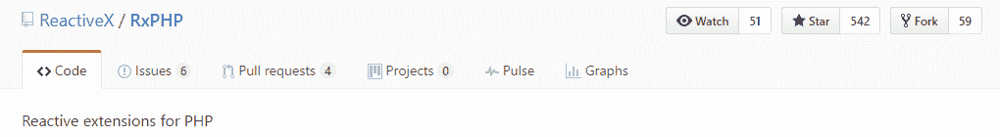
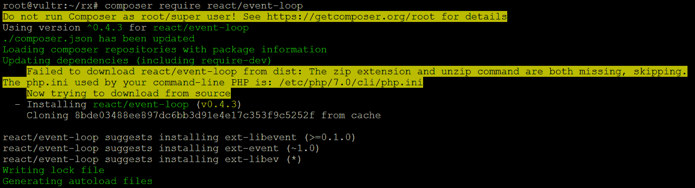
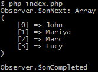
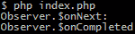
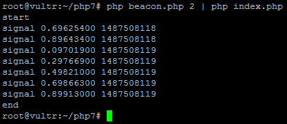
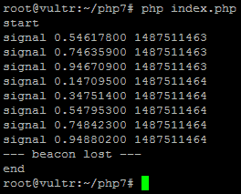
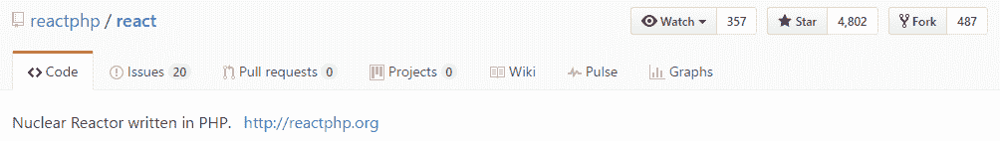
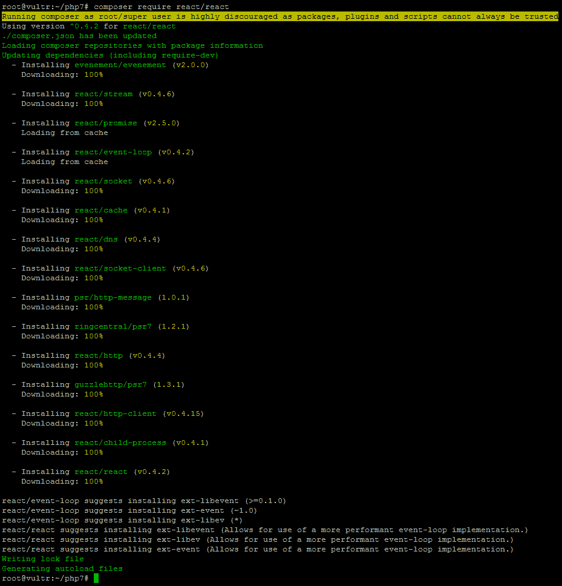
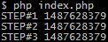

# 反应式编程

每隔一段时间，软件行业就会发生变化。这一转变丰富了生态系统，带来了更简单的系统和应用程序开发的想法。其背后的驱动力主要是当今的互联网，因为它是所有连接应用程序的媒介，而不仅仅是运行在浏览器中的应用程序。大多数移动用户消费大量云服务，甚至没有意识到这一点。在这样一个互联的世界中，确保一致的用户体验是一个以多种方式解决的挑战。其中一个观点是反应性，编程语言本身在其中起着重要作用。

传统上，PHP 遵循同步编程模型，并不真正适合异步编程。尽管标准库已经具备了编写异步 I/O 应用程序所需的一切，但实际情况却相差不远。例如，MySQLi 和 MySQL（PDO）都保持阻塞状态，使得使用 PHP 的异步编程毫无用处。幸运的是，潮流正在改变，PHP 开始意识到异步。

反应式编程是软件行业的一个新兴主题，它建立在可观察的基础之上，作为它的原语。我们将异步行为与之相关联，因为可观察性提供了访问多个项目的异步序列的理想方法。在更高的层次上，它只是另一种编程范式，就像过程式、面向对象、声明式和函数式编程一样。虽然采用可观察对象、操作符、观察者和其他构建块需要一定的思维转变，但反过来，它允许更高的表达能力和单向数据流，从而产生更干净、更简单的代码。

在本章中，我们将仔细查看以下部分：

*   与事件驱动编程的相似之处
*   使用 RxPHP：
    *   安装 RxPHP
    *   可观察和观察者
    *   主题
    *   操作人员
    *   编写自定义运算符
*   非阻塞 I/O
*   使用 React：
    *   安装反应器
    *   反应事件循环
    *   可观测和事件循环

# 与事件驱动编程的相似之处

维基百科对反应式编程的定义如下：

"A programming paradigm oriented around data flows and the propagation of change."

首先想到这一点可能意味着与众所周知的事件驱动编程有一些相似之处。数据流和变化的传播听起来有点像我们可以通过 PHP 中的`\SplSubject`、`\SplObjectStorage`和`\SplObserver`接口实现的东西，如下面的简单示例所示。`\SplObjectStorage`接口进一步封装了`\Countable`、`\Iterator`、`\Traversable`、`\Serializable`和`\ArrayAccess`接口：

```php
<?php

class UserRegister implements \SplSubject
{
    protected $user;
    protected $observers;

    public function __construct($user)
    {
        $this->user = $user;
        $this->observers = new \SplObjectStorage();
    }

    public function attach(\SplObserver $observer)
    {
        $this->observers->attach($observer);
    }

    public function detach(\SplObserver $observer)
    {
        $this->observers->detach($observer);
    }

    public function notify()
    {
        foreach ($this->observers as $observer) {
            $observer->update($this);
        }
    }

    public function getUser()
    {
        return $this->user;
    }
}

class Mailer implements \SplObserver
{
    public function update(\SplSubject $subject)
    {
        if ($subject instanceof UserRegister) {
            echo 'Mailing ', $subject->getUser(), PHP_EOL;
        }
    }
}

class Logger implements \SplObserver
{
    public function update(\SplSubject $subject)
    {
        if ($subject instanceof UserRegister) {
            echo 'Logging ', $subject->getUser(), PHP_EOL;
        }
    }
}

$userRegister = new UserRegister('John');
// some code...
$userRegister->attach(new Mailer());
// some code...
$userRegister->attach(new Logger());
// some code...
$userRegister->notify();

```

我们可以说，数据流转换为来自`$userRegister`实例的`notify()`方法的一系列更新，更改的传播转换为触发 mailer 和 logger 实例的`update()`方法，以及`\SplObjectStorage`方法起着重要的作用。这只是 PHP 代码上下文中反应式编程范例的一个简单而肤浅的解释。此外，目前这里没有异步性。PHP 运行时和标准库有效地提供了编写异步代码所需的一切。在混合物中加入*反应性*，仅仅是选择正确的库的问题。

虽然用于反应式编程的 PHP 库的选择远没有 JavaScript 生态系统丰富，但也有一些值得注意的库，如**RxPHP**和**React**。

# 使用 RxPHP

最初由微软为.NET 平台开发的一套名为**ReactiveX**（**reactiveextensions**的库可在[上找到 http://reactivex.io](http://reactivex.io) .ReactiveX 允许我们使用可观察序列编写异步和基于事件的程序。它们通过抽象出诸如非阻塞 I/O 之类的低级关注点来实现，我们将在后面讨论。随着时间的推移，一些编程语言按照几乎相同的设计模式实现了自己的 ReactiveX。名为 RxPHP 的 PHP 实现可从[下载 https://github.com/ReactiveX/RxPHP](https://github.com/ReactiveX/RxPHP) ：



# 安装 RxPHP

RxPHP 库作为 Composer`reactivex/rxphp`软件包提供。假设我们已经安装了 PHP 和 Composer，我们只需在空目录中执行以下命令：

```php
composer require reactivex/rxphp

```

这将为我们提供与以下类似的输出：


输出建议安装`react/event-loop`；我们需要确保通过执行以下命令来跟进：

```php
composer require react/event-loop

```

这将为我们提供与以下内容非常相似的输出：



现在剩下的就是创建一个`index.php`文件，其中包括由 Composer 生成的`autoload.php`文件，我们已经准备好开始使用它了


RxPHP 库由几个关键组件组成，最基本的组件如下：

*   可观察
*   观察者
*   主题
*   操作人员

向前看，让我们仔细看看每一个组件。

# 可观察和观察者

在我们的介绍示例中，我们使用`\SplSubject`和`\SplObserver`讨论了观察者模式。现在，我们将介绍一个 RxPHP 可观察和观察组件。我们可以说`\SplSubject`类似于`Rx\Observable`，而`\SplObserver`类似于`Rx\Observer\CallbackObserver`。然而，整个 SPL 和 Rx 只是表面上的相似。`Rx\Observable`比`\SplObserver`更强大。我们可以把`Rx\Observable`看作是一个懒惰的事件源，一个随着时间产生价值的东西。可观察对象向其观察者发出以下三种类型的事件：

*   流中的当前项
*   如果发生错误，则返回错误
*   完全状态

简而言之，它是一个反应式数据源，知道如何发出内部数据更改的信号。

让我们来看看下面的简单例子：

```php
<?php

require_once __DIR__ . '/vendor/autoload.php';

use \Rx\Observable;
use \Rx\Observer\CallbackObserver;
use \React\EventLoop\Factory;
use \Rx\Scheduler;

$loop = Factory::create();

Scheduler::setDefaultFactory(function () use ($loop) {
    return new Scheduler\EventLoopScheduler($loop);
});

$users = Observable::fromArray(['John', 'Mariya', 'Marc', 'Lucy']);

$logger = new CallbackObserver(
    function ($user) {
        echo 'Logging: ', $user, PHP_EOL;
    },
    function (\Throwable $t) {
        echo $t->getMessage(), PHP_EOL;
    },
    function () {
        echo 'Stream complete!', PHP_EOL;
    }
);

$users->subscribe($logger);

$loop->run();

```

其输出为：

```php
Logging: John
Logging: Mariya
Logging: Marc
Logging: Lucy
Stream complete!

```

我们看到`Observable`实例的`subscribe()`方法接受`CallbackObserver`实例。观察者的三个参数中的每一个都是回调函数。第一个回调处理流项，第二个回调返回潜在错误，第三个回调指示已完成的流。

RxPHP 提供了几种类型的可观测数据：

*   `AnonymousObservable`
*   `ArrayObservable`
*   `ConnectableObservable`
*   `EmptyObservable`
*   `ErrorObservable`
*   `ForkJoinObservable`
*   `GroupedObservable`
*   `IntervalObservable`
*   `IteratorObservable`
*   `MulticastObservable`
*   `NeverObservable`
*   `RangeObservable`
*   `RefCountObservable`
*   `ReturnObservable`
*   `TimerObservable`

让我们来看一个更详细的例子：观察者和观察者：

```php
<?php

require_once __DIR__ . '/vendor/autoload.php';

use \Rx\Observable;
use \Rx\Observer\CallbackObserver;
use \React\EventLoop\Factory;
use \Rx\Scheduler;

$loop = Factory::create();

Scheduler::setDefaultFactory(function () use ($loop) {
    return new Scheduler\EventLoopScheduler($loop);
});

// Generator function, reads CSV file
function users($file)
{
    $users = fopen($file, 'r');
    while (!feof($users)) {
        yield fgetcsv($users)[0];
    }
    fclose($users);
}

// The RxPHP Observer
$logger = new CallbackObserver(
    function ($user) {
        echo $user, PHP_EOL;
    },
    function (\Throwable $t) {
        echo $t->getMessage(), PHP_EOL;
    },
    function () {
        echo 'stream complete!', PHP_EOL;
    }
);

// Dummy map callback function
$mapper = function ($value) {
    return time() . ' | ' . $value;
};

// Dummy filter callback function
$filter = function ($value) {
    return strstr($value, 'Ma');
};

// Generator function
$users = users(__DIR__ . '/users.csv');

// The RxPHP Observable - from generator
Observable::fromIterator($users)
    ->map($mapper)
    ->filter($filter)
    ->subscribe($logger);

$loop->run();

```

我们首先创建了一个名为`users()`的简单生成器函数。生成器的优点是它们充当迭代器，这使得使用`fromIterator()`方法从它们创建 RxPHP 可观察对象变得很容易。一旦我们有了可观察的，我们就可以把它的一些方法，比如`map()`和`filter()`链接在一起。这样，我们就可以控制数据流击中我们订阅的观察者。

假设`users.csv`文件包含以下内容：

```php
"John"
"Mariya"
"Marc"
"Lucy"

```

前面代码的输出应如下所示：

```php
1487439356 | Mariya
1487439356 | Marc
stream complete!

```

现在，让我们假设我们想要将多个观察者附加到我们的`$users`流：

```php
$mailer = new CallbackObserver(
  function ($user) {
    echo 'Mailer: ', $user, PHP_EOL;
  },
  function (\Throwable $t) {
    echo 'Mailer: ', $t->getMessage(), PHP_EOL;
  },
  function () {
    echo 'Mailer stream complete!', PHP_EOL;
  }
);

$logger = new CallbackObserver(
  function ($user) {
    echo 'Logger: ', $user, PHP_EOL;
  },
  function (\Throwable $t) {
    echo 'Logger: ', $t->getMessage(), PHP_EOL;
  },
  function () {
    echo 'Logger stream complete!', PHP_EOL;
  }
);

$users = Observable::fromIterator(users(__DIR__ . '/users.csv'));

$users->subscribe($mailer);
$users->subscribe($logger);

```

这行不通。代码不会抛出任何错误，但结果可能不是我们所期望的：

```php
Mailer: John
Logger: Mariya
Mailer: Marc
Logger: Lucy
Mailer:
Logger:
Mailer stream complete!
Logger stream complete!

```

我们不能用这种方式连接多个订阅者。第一个连接的观察者使用流，这就是为什么第二个观察者认为它是空的。这就是`Rx\Subject\Subject`组件可能会派上用场的地方。

# 主题

`Rx\Subject\Subject`是一个有趣的组件——它是一个充当可观察者和观察者的类。从以下示例中可以看出这一点的好处：

```php
use \Rx\Subject\Subject;

$mailer = new class() extends Subject
{
    public function onCompleted()
    {
        echo 'mailer.onCompleted', PHP_EOL;
        parent::onCompleted();
    }

    public function onNext($val)
    {
        echo 'mailer.onNext: ', $val, PHP_EOL;
        parent::onNext($val);
    }

    public function onError(\Throwable $error)
    {
        echo 'mailer.onError', $error->getMessage(), PHP_EOL;
        parent::onError($error);
    }
};

$logger = new class() extends Subject
{
    public function onCompleted()
    {
        echo 'logger.onCompleted', PHP_EOL;
        parent::onCompleted();
    }

    public function onNext($val)
    {
        echo 'logger.onNext: ', $val, PHP_EOL;
        parent::onNext($val);
    }

    public function onError(\Throwable $error)
    {
        echo 'logger.onError', $error->getMessage(), PHP_EOL;
        parent::onError($error);
    }
};

$users = Observable::fromIterator(users(__DIR__ . '/users.csv'));
$mailer->subscribe($logger);
$users->subscribe($mailer);

```

使用匿名类，我们能够动态扩展`Rx\Subject\Subject`类。底层的`onCompleted()`、`onError(Exception $error)`和`onNext($value)`方法是我们*挖掘*与观察者相关的逻辑。一旦执行，代码将产生以下输出：

```php
mailer.onNext: John
logger.onNext: John
mailer.onNext: Mariya
logger.onNext: Mariya
mailer.onNext: Marc
logger.onNext: Marc
mailer.onNext: Lucy
logger.onNext: Lucy
mailer.onNext:
logger.onNext:
mailer.onCompleted
logger.onCompleted

```

这里发生的事情是，mailer 首先点击流，然后流回到记录器流。这是可能的，因为`Rx\Subject\Subject`具有双重性质。需要注意的是，记录器没有观察到原始流。我们可以通过在`$mailer`中添加过滤器来轻松测试：

```php
// ...

$mailer
 ->filter(function ($val) {
   return strstr($val, 'Marc') == false;
 })
 ->subscribe($logger);

$users->subscribe($mailer);

```

现在，结果输出将忽略 logger observer 上命名的用户：

```php
mailer.onNext: John
logger.onNext: John
mailer.onNext: Mariya
logger.onNext: Mariya
mailer.onNext: Marc
mailer.onNext: Lucy
logger.onNext: Lucy
mailer.onNext:
logger.onNext:
mailer.onCompleted
logger.onCompleted

```

# 操作人员

RxPHP 的可观察模型允许我们用简单且可组合的操作来处理流。每项操作都由一名操作员完成。操作符的组合是可能的，因为操作符本身作为其操作的结果返回的大部分是可观察的。快速浏览`vendor\reactivex\rxphp\lib\Rx\Operator`目录，可以发现 48 种不同的操作员实现，分为几个不同的类别

*   创建 o
*   变换观测值
*   滤波观测值
*   组合观测值
*   错误处理运算符
*   可观测效用算子
*   条件和布尔运算符
*   数学与聚合算子
*   可连通可观测算子

`map`、`filter`和`reduce`方法可能是最知名和最流行的运算符，因此让我们从它们开始我们的示例：

```php
<?php

require_once __DIR__ . '/vendor/autoload.php';

use \Rx\Observable;
use \Rx\Observer\CallbackObserver;
use \React\EventLoop\Factory;
use \Rx\Scheduler;

$loop = Factory::create();

Scheduler::setDefaultFactory(function () use ($loop) {
    return new Scheduler\EventLoopScheduler($loop);
});

// Generator function
function xrange($start, $end, $step = 1)
{
    for ($i = $start; $i <= $end; $i += $step) {
        yield $i;
    }
}

// Observer
$observer = new CallbackObserver(
    function ($item) {
        echo $item, PHP_EOL;
    }
);

echo 'start', PHP_EOL;
// Observable stream, made from iterator/generator
Observable::fromIterator(xrange(1, 10, 1))
    ->map(function ($item) {
        return $item * 2;
    })
    ->filter(function ($item) {
        return $item % 3 == 0;
    })
    ->reduce(function ($x, $y) {
        return $x + $y;
    })
    ->subscribe($observer);

echo 'end', PHP_EOL;

$loop->run();

```

我们首先编写了一个名为`xrange()`的简单生成器函数。这里生成器的美妙之处在于，`xrange()`函数将始终占用相同的内存量，而不管我们选择的范围如何。这给我们提供了一个很好的基础来使用 ReActux 运算符。然后，我们创建了一个简单的`$observer`，仅使用其`$onNext`可调用项，而忽略`$onError`和`$onCompleted`可调用项，用于本节。然后，我们从`xrange()`函数创建了一个可观察流，将其范围传递到 1 到 20。最后，我们将`map()`、`filter()`、`reduce()`和`subscribe()`方法调用连接到了可观察实例。

如果我们现在执行此代码，结果输出将是编号`36`。为了理解这是从哪里来的，让我们后退一步，注释一下 T1 和 T2 方法：

```php
Observable::fromIterator(xrange(1, 10, 1))
 ->map(function ($item) {
   return $item * 2;
 })
// ->filter(function ($item) {
  // return $item % 3 == 0;
// })
// ->reduce(function ($x, $y) {
  // return $x + $y;
// })
 ->subscribe($observer);

```

现在的输出如下：

```php
start
2
4
6
8
10
12
14
16
18
20
end

```

`map()`函数通过对每个项目应用函数来转换发出的项目。在这种情况下，该函数是`$item * 2`。现在，让我们继续恢复`filter()`函数，但将`reduce()`函数注释掉：

```php
Observable::fromIterator(xrange(1, 10, 1))
 ->map(function ($item) {
   return $item * 2;
 })
 ->filter(function ($item) {
   return $item % 3 == 0;
 })
// ->reduce(function ($x, $y) {
  // return $x + $y;
// })
 ->subscribe($observer);

```

现在知道`filter()`函数将接收`map()`函数输出流（`2`、`4`、`6`、`20`），我们观察以下输出：

```php
start
6
12
18
end

```

`filter()`函数通过只发回那些通过谓词测试的项来转换发出的项。在本例中，谓词测试为`$item % 3 == 0`，这意味着它返回可被`3`整除的项。

最后，如果我们恢复`reduce()`函数，结果返回为`36`。与接受单个发出项值的`map()`和`filter()`不同，`reduce()`函数回调接受两个值。

对`reduce()`回调主体的快速更改澄清了发生的情况：

```php
 ->reduce(function ($x, $y) {
   $z = $x + $y;
   echo '$x: ', $x, PHP_EOL;
   echo '$y: ', $y, PHP_EOL;
   echo '$z: ', $z, PHP_EOL, PHP_EOL;
   return $z;
 })

```

这将产生如下输出：

```php
start
$x: 6
$y: 12
$z: 18

$x: 18
$y: 18
$z: 36

36
end

```

我们可以看到，`$x`作为第一个发射项的值输入，而`$y`作为第二个发射项的值输入。然后，函数对它们应用求和计算，使返回结果现在成为第二次迭代中的第一个发出项，基本上给出了`(6 + 12) => 18 => (18 + 18) => 36`。

考虑到 RxPHP 支持的运算符数量之多，我们可以想象通过简单地将多个运算符组合成一个链来解决现实生活中的复杂性，如下所示：

```php
$observable
 ->operator1(function () { /* ...*/ })
 ->operator2(function () { /* ...*/ })
 ->operator3(function () { /* ...*/ })
 // ...
 ->operatorN(function () { /* ...*/ })
 ->subscribe($observer);

```

If existing operators are not enough, we can easily write our own by extending `Rx\Operator\OperatorInterface`.

# 编写自定义运算符

尽管 RxPHP 为我们提供了 40 多个运营商，但有时可能需要使用不存在的运营商。考虑以下情况：

```php
<?php

require_once __DIR__ . '/vendor/autoload.php';

use \Rx\Observer\CallbackObserver;
use \React\EventLoop\Factory;
use \Rx\Scheduler;

$loop = Factory::create();

Scheduler::setDefaultFactory(function () use ($loop) {
    return new Scheduler\EventLoopScheduler($loop);
});

// correct
$users = serialize(['John', 'Mariya', 'Marc', 'Lucy']);

// faulty
// $users = str_replace('i:', '', serialize(['John', 'Mariya', 'Marc', 'Lucy']));

$observer = new CallbackObserver(
    function ($value) {
        echo 'Observer.$onNext: ', print_r($value, true), PHP_EOL;
    },
    function (\Throwable $t) {
        echo 'Observer.$onError: ', $t->getMessage(), PHP_EOL;
    },
    function () {
        echo 'Observer.$onCompleted', PHP_EOL;
    }
);

Rx\Observable::just($users)
    ->map(function ($value) {
        return unserialize($value);
    })
    ->subscribe($observer);

$loop->run();

```

使用*correct*`$users`变量执行此代码，我们将获得以下预期输出：



但是，如果我们删除*错误的*`$user`变量前面的注释，输出结果会稍微出乎意料，或者至少不是我们希望如何处理它：



我们真正想要的是将非串行化逻辑转换为 RxPHP 操作符，并让它优雅地处理不成功的`unserialize()`尝试。幸运的是，编写自定义运算符是一项简单的任务。快速查看`vendor/reactivex/rxphp/src/Operator/OperatorInterface.php`文件可以看到以下界面：

```php
<?php

declare(strict_types=1);

namespace Rx\Operator;

use Rx\DisposableInterface;
use Rx\ObservableInterface;
use Rx\ObserverInterface;

interface OperatorInterface
{
    public function __invoke(
        ObservableInterface $observable,
        ObserverInterface $observer
    ): DisposableInterface;
}

```

很简单，接口只需要一个`__invoke()`方法实现。我们在[第 4 章](04.html)、*魔法背后的魔法*中广泛介绍了`__invoke()`方法。当我们尝试将对象作为函数调用时，会调用此方法。`OperatorInterface`在本例中，列出了`__invoke()`方法的三个参数，其中两个是必需的：

*   `$observable`：这将是我们订阅的可观察的输入
*   `$observer`：这是我们将输出价值的地方

考虑到这一点，以下是我们的定制`UnserializeOperator`的实现：

```php
<?php

use \Rx\DisposableInterface;
use \Rx\ObservableInterface;
use \Rx\ObserverInterface;
use \Rx\SchedulerInterface;
use \Rx\Observer\CallbackObserver;
use \Rx\Operator\OperatorInterface;

class UnserializeOperator implements OperatorInterface
{
    /**
     * @param \Rx\ObservableInterface $observable
     * @param \Rx\ObserverInterface $observer
     * @param \Rx\SchedulerInterface $scheduler
     * @return \Rx\DisposableInterface
     */
    public function __invoke(
        ObservableInterface $observable,
        ObserverInterface $observer,
        SchedulerInterface $scheduler = null
    ): DisposableInterface
    {
        $callbackObserver = new CallbackObserver(
            function ($value) use ($observer) {
                if ($unsValue = unserialize($value)) {
                    $observer->onNext($unsValue);
                } else {
                    $observer->onError(
                        new InvalidArgumentException('Faulty serialized string.')
                    );
                }
            },
            function ($error) use ($observer) {
                $observer->onError($error);
            },
            function () use ($observer) {
                $observer->onCompleted();
            }
        );

        // ->subscribe(...) => DisposableInterface
        return $observable->subscribe($callbackObserver, $scheduler);
    }
}

```

不幸的是，我们无法像连锁 RxPHP 运营商那样直接连锁我们的运营商。我们需要帮助`lift()`操作员：

```php
Rx\Observable::just($users)
 ->lift(function () {
  return new UnserializeOperator();
 })
 ->subscribe($observer);

```

`UnserializeOperator`就位后，出现故障的序列化`$users`字符串现在给出以下输出：


我们的操作员现在成功地处理了错误，在这一过程中，它将错误委托给观测者`onError`回调。

Making the best out of RxPHP is mostly about knowing the ins and outs of its operators. The `vendor/reactivex/rxphp/demo/` directory provides quite a few operator usage examples. It is worth spending some time going through each.

# 非阻塞 IO

使用 RxPHP 扩展提供了许多可能性。它的可观察对象、操作符和订阅者/观察者实现无疑是强大的。然而，它们没有提供异步性，这就是 React 库发挥作用的地方，它提供了一个事件驱动的、非阻塞的 I/O 抽象层。在我们讨论 React 之前，让我们首先展示一个 PHP 中阻塞 I/O 与非阻塞 I/O 的简单示例。

我们创建了一个小的*信标*脚本，随着时间的推移，它只会生成一些**标准输出**（**标准输出**。然后，我们将创建一个脚本，用于读取**标准输入**（**stdin**），并查看在流阻塞和流非阻塞模式下读取时的行为。

我们首先创建具有以下内容的`beacon.php`文件：

```php
<?php

$now = time();

while ($now + $argv[1] > time()) {
  echo 'signal ', microtime(), PHP_EOL;
  usleep(200000); // 0.2s
}

```

`$argv[1]`的使用提示该文件打算从控制台运行。使用`$argv[1]`，我们提供了希望脚本运行的秒数。在循环中，我们有一个信号。。。输出，然后是短时间的脚本睡眠`0.2`秒。

我们的 beacon 脚本就绪后，让我们继续创建具有以下内容的`index.php`文件：

```php
<?php

// stream_set_blocking(STDIN, 0);
// stream_set_blocking(STDIN, 1); // default

echo 'start', PHP_EOL;

while (($line = fgets(STDIN)) !== false) {
  echo $line;
}

echo 'end', PHP_EOL;

```

除了两个明显的开始/结束输出外，我们还利用`fgets()`函数读取标准输入。`stream_set_blocking()`方法暂时故意遗漏，注意两个脚本完全无关。`index.php`没有引用`beacon.php`文件。这是因为我们将使用控制台及其管道（`|`）将`beacon.php`脚本的 stdout 连接到`index.php`所使用的 stdin：

```php
php beacon.php 2 | php index.php

```

结果输出如下所示：



这个输出没有问题；这是我们所期望的。我们首先看到开始字符串出现，然后出现几个信号…，最后是结束字符串。然而，所有的信号都被捕捉到了。。。`fgets()`函数从标准输出中提取的位就是阻塞 IO 的一个例子。虽然在这个小示例中我们可能没有这样的感觉，但我们可以很容易地想象一个信标脚本从一个非常大的文件发送输出，或者一个缓慢的数据库连接。我们的`index.php`脚本只会在这段时间内挂起它的执行阻塞，或者更确切地说，它会等待`while (($line = fgets(STDIN)...`行解析。

我们如何解决这个问题呢？首先，我们需要明白，这实际上不是一个技术问题。等待接收数据没有什么错。无论我们如何抽象事物，总会有人或某事需要在某处等待数据。诀窍是将某处定位在正确的位置，因此它不会妨碍用户体验。JavaScript 承诺和回调就是我们可能希望将其放置在某处的一个例子。让我们来看一下 JavaScript java 查询库所做的简单的 Ajax 调用：

```php
console.log('start-time: ' + Date.now());

$.ajax({
  url: 'http://foggyline.net/',
  success: function (result) {
    console.log('result-time: ' + Date.now())
    console.log(result)
  }
});

console.log('end-time: ' + Date.now());

```

以下屏幕截图显示了结果输出：


注意`start-time`和`end-time`是如何在`result-time`之前输出的。JavaScript 并没有像前面示例中 PHP 在其`while (($line = fgets(STDIN)...`行上所做的那样，阻止`$.ajax({...`行的执行。这是因为 JavaScript 运行时与 PHP 有根本的不同。JavaScript 的异步特性依赖于代码块的分离和单独执行，然后通过回调机制更新所需的内容，这是基于 JavaScript 事件循环的并发模型和消息队列机制实现的功能。本例中的回调是分配给`ajax()`方法调用的 success 属性的匿名函数。一旦 AJAX 调用成功执行，它将调用分配的`success`函数，这反过来又会导致最后一次输出，因为 AJAX 调用需要时间来执行。

现在，让我们回到我们的小 PHP 示例，通过删除在`stream_set_blocking(STDIN, 0);`表达式前面的注释来修改`index.php`文件。再次使用管道（`|`）运行该命令，现在会产生如下输出：


这次，`while (($line = fgets(STDIN)...`行没有通过等待`beacon.php`完成来阻止执行。技巧在于`stream_set_blocking()`函数，因为它使我们能够控制流阻塞模式，默认情况下，流阻塞模式设置为阻塞 I/O。让我们继续制作一个更类似 PHP 的示例，这次不使用控制台管道。我们将保留`beacon.php`文件，但对`index.php`文件进行如下修改：

```php
<?php

echo 'start', PHP_EOL;

$process = proc_open('php beacon.php 2', [
  ['pipe', 'r'], // STDIN
  ['pipe', 'w'], // STDOUT
  ['file', './signals.log', 'a'] //STDERR
], $pipes);

//stream_set_blocking($pipes[1], 1); // Blocking I/O
//stream_set_blocking($pipes[1], 0); // Non-blocking I/O

while (proc_get_status($process)['running']) {
  usleep(100000); // 0.1s
  if ($signal = fgets($pipes[1])) {
    echo $signal;
  } else {
    echo '--- beacon lost ---', PHP_EOL;
  }
}

fclose($pipes[1]);
proc_close($process);

echo 'end', PHP_EOL;

```

我们从一个`proc_open()`函数开始，它允许我们执行一个命令并打开标准输入、输出和错误的文件指针。`'php beacon.php 2'`参数的作用与 console 命令的作用非常相似，与管道字符的命令左侧部分有关。捕获 beacon 脚本输出的方法是使用`fgets()`函数。然而，我们并不是直接做这件事，我们是通过 while 循环来做的，而条件是流程`running`状态。换句话说，只要流程正在运行，就要检查新创建的流程是否有新的输出。如果有输出，则显示它；如果没有，则显示---灯塔丢失---消息。以下屏幕截图显示了默认（阻塞）I/O 的结果输出：



如果我们现在删除`stream_set_blocking($pipes[1], 0);`前面的注释，结果输出将变为：


这里的输出显示了信标和我们正在运行的脚本之间的非阻塞关系。取消阻塞流，我们能够利用`fgets()`函数，该函数通常会阻塞脚本，以便在进程运行期间定期检查标准输入。简言之，我们现在能够读取子进程的输出，同时能够在此过程中初始化更多的子进程。尽管该示例本身距离 jQuery 承诺/回调示例的便利性还有很长的路要走，但它是解决阻塞和非阻塞 I/O 背后的复杂性的第一步，因为它会影响我们编写代码的方式。在这里，我们将了解 RxPHP 可观测和反应事件循环的作用。

# 使用 React

React 是一个库，它使 PHP 中的事件驱动编程成为可能，就像 JavaScript 一样。基于 reactor 模式，它本质上充当事件循环，允许使用其组件的各种其他第三方库编写异步代码。

页面位于[https://en.wikipedia.org/wiki/Reactor_pattern](https://en.wikipedia.org/wiki/Reactor_pattern) 表示，*反应器设计模式是一种事件处理模式，用于处理由一个或多个输入*并发传递给服务处理程序的服务请求

图书馆位于[https://github.com/reactphp/react](https://github.com/reactphp/react)



# 安装反应器

React 库作为 Composer`react/react`包提供。假设我们仍在安装 RxPHP 的项目目录中，我们只需执行以下命令即可将 React 添加到项目中：

```php
composer require react/react

```

这将为我们提供与以下类似的输出：



我们可以看到很多有趣的`react/*`包被拉进来，`react/event-loop`就是其中之一。建议我们安装一个性能更高的循环实现的消息无疑值得关注，尽管这超出了本书的范围

# 反应事件循环

没有任何建议的事件循环扩展，React 事件循环默认为`React\EventLoop\StreamSelectLoop`类，这是一个基于`stream_select()`函数的事件循环。

页面位于[http://php.net/manual/en/function.stream-select.php](http://php.net/manual/en/function.stream-select.php) 表示，*stream_select（）函数接受流数组并等待它们改变状态*

正如我们在前面的示例中已经看到的，在 React 中创建事件循环非常简单

```php
<?php

require_once __DIR__ . '/vendor/autoload.php';

use \React\EventLoop\Factory;
use \Rx\Scheduler;

$loop = Factory::create();

Scheduler::setDefaultFactory(function () use ($loop) {
    return new Scheduler\EventLoopScheduler($loop);
});

// Within the loop

$loop->run();

```

我们使用的是`Factory::create()`静态功能，具体实现如下：

```php
class Factory
{
  public static function create()
  {
    if (function_exists('event_base_new')) {
      return new LibEventLoop();
    } elseif (class_exists('libev\EventLoop', false)) {
      return new LibEvLoop;
    } elseif (class_exists('EventBase', false)) {
      return new ExtEventLoop;
    }
    return new StreamSelectLoop();
  }
}

```

在这里，我们可以看到，除非我们安装了`ext-libevent`、`ext-event`或`ext-libev`，否则将使用`StreamSelectLoop`实现。

循环的每次迭代都是一个记号。事件循环跟踪计时器和流。如果没有这两个选项中的任何一个，就不会有滴答声，循环也会变得简单

```php
<?php

require_once __DIR__ . '/vendor/autoload.php';

use \React\EventLoop\Factory;
use \Rx\Scheduler;

echo 'STEP#1 ', time(), PHP_EOL;

$loop = Factory::create();

Scheduler::setDefaultFactory(function () use ($loop) {
    return new Scheduler\EventLoopScheduler($loop);
});

echo 'STEP#2 ', time(), PHP_EOL;

$loop->run();

echo 'STEP#3 ', time(), PHP_EOL;

```

前面的代码为我们提供了以下输出：



只要我们加上一些计时器，情况就会改变

```php
<?php

require_once __DIR__ . '/vendor/autoload.php';

use \React\EventLoop\Factory;
use \Rx\Scheduler;

echo 'STEP#1 ', time(), PHP_EOL;

$loop = Factory::create();

Scheduler::setDefaultFactory(function () use ($loop) {
    return new Scheduler\EventLoopScheduler($loop);
});

echo 'STEP#2 ', PHP_EOL;

$loop->addTimer(2, function () {
    echo 'timer#1 ', time(), PHP_EOL;
});

echo 'STEP#3 ', time(), PHP_EOL;

$loop->addTimer(5, function () {
    echo 'timer#2 ', time(), PHP_EOL;
});

echo 'STEP#4 ', time(), PHP_EOL;

$loop->addTimer(3, function () {
    echo 'timer#3 ', time(), PHP_EOL;
});

echo 'STEP#5 ', time(), PHP_EOL;
$loop->run();

echo 'STEP#6 ', time(), PHP_EOL;

```

前面的代码为我们提供了以下输出：


请注意计时器输出的顺序以及每个输出旁边的时间。我们的循环仍然设法结束，因为我们的计时器过期了。为了保持循环持续运行，我们可以添加一个*周期计时器*

```php
<?php

require_once __DIR__ . '/vendor/autoload.php';

use \React\EventLoop\Factory;
use \Rx\Scheduler;

echo 'STEP#1 ', time(), PHP_EOL;

$loop = Factory::create();

Scheduler::setDefaultFactory(function () use ($loop) {
    return new Scheduler\EventLoopScheduler($loop);
});

echo 'STEP#2 ', PHP_EOL;

$loop->addPeriodicTimer(1, function () {
    echo 'timer ', time(), PHP_EOL;
});

echo 'STEP#3 ', time(), PHP_EOL;

$loop->run();

echo 'STEP#4 ', time(), PHP_EOL;

```

前面的代码为我们提供了以下输出：


这个循环现在将继续产生相同的计时器…输出，直到我们在控制台上点击*Ctrl*+*C*为止。我们可能想知道，这与 PHP`while`循环有何不同？通常情况下，`while`循环是轮询类型，因为它不断地检查事物，处理器几乎没有空间切换任务。事件循环使用更高效的中断驱动 I/O 而不是轮询。但是，默认的`StreamSelectLoop`将`while`循环用于其事件循环实现。

计时器和流的添加使它变得有用，因为它从我们这里提取了硬的部分。

# 观测值与事件循环

让我们继续，看看如何使我们的观测值与事件循环一起工作：

```php
<?php

require_once __DIR__ . '/vendor/autoload.php';

use \React\EventLoop\Factory;
use \Rx\Scheduler;
use \Rx\Observable;
use \Rx\Subject\Subject;
use \Rx\Scheduler\EventLoopScheduler;

$loop = Factory::create();

Scheduler::setDefaultFactory(function () use ($loop) {
    return new Scheduler\EventLoopScheduler($loop);
});

$stdin = fopen('php://stdin', 'r');

stream_set_blocking($stdin, 0);

$observer = new class() extends Subject
{
    public function onCompleted()
    {
        echo '$observer.onCompleted: ', PHP_EOL;
        parent::onCompleted();
    }

    public function onNext($val)
    {
        echo '$observer.onNext: ', $val, PHP_EOL;
        parent::onNext($val);
    }

    public function onError(\Throwable $error)
    {
        echo '$observer.onError: ', $error->getMessage(), PHP_EOL;
        parent::onError($error);
    }
};

$loop = Factory::create();

$scheduler = new EventLoopScheduler($loop);

$disposable = Observable::interval(500, $scheduler)
    ->map(function () use ($stdin) {
        return trim(fread($stdin, 1024));
    })
    ->filter(function ($str) {
        return strlen($str) > 0;
    })
    ->subscribe($observer);

$observer->filter(function ($value) {
    return $value == 'quit';
})->subscribeCallback(function ($value) use ($disposable) {
    echo 'disposed!', PHP_EOL;
    $disposable->dispose();
});

$loop->run();

```

这里发生了很多事情。我们首先创建一个标准输入，然后将其标记为非阻塞。然后我们创建了`Subject`类型的观察者。这是因为，我们将在后面看到，我们希望我们的观察者表现得像观察者和可观察者一样。然后我们实例化了循环，并将其传递到`EventLoopScheduler`。为了让可观察对象与循环一起工作，我们需要用调度器包装它们。然后我们使用了`IntervalObservable`的实例，使其`map()`操作符读取标准输入，而`filter()`操作符被设置为过滤掉任何空输入（在控制台上按 Enter 键，没有文本）。我们将这个可观测值存储到一个`$disposable`变量中。最后，考虑到我们的`$observer`是`Subject`的一个实例，我们能够将`filter()`操作符以及`subscribeCallback()`附加到它。我们指示这里的`filter()`操作符只过滤掉带有 quit 字符串的输入。在控制台上键入`quit`后，接着按*回车*键，`subscribeCallback()`被执行。在`subscribeCallback()`中，我们有一个`$disposable->dispose()`表达式。调用一次性使用的 dispose 方法会自动从`$observable`取消订阅`$observer`。假设循环中没有其他计时器或流，这会自动终止循环。

以下屏幕截图显示了上述代码的控制台输出：


当代码运行时，我们首先看到了`start`字符串，然后我们输入`John`并按下，然后我们说$observer.onNext…，它一直重复，直到我们输入`quit`。

React 事件循环为我们打开了一个有趣的可能性，就像我们习惯于在 JavaScript 和浏览器中看到的一样。关于 React 还有很多要说的，这应该足以让我们开始使用 RxPHP 和 React 组合。

# 总结

在本章中，我们讨论了 RxPHP 和 React，这两个库承诺将反应式编程引入 PHP。RxPHP 以可组合的语法提供了功能强大的 Observable，React 丰富了我们在事件循环实现方面的经验。仔细地说，我们应该强调，这对于 PHP 来说仍然是一个相对实验性的领域，还远没有准备好供主流生产使用。但是，演示 PHP 不受其运行时功能的限制，并在反应性领域显示出良好的前景。

接下来，我们将把重点转移到现代 PHP 应用程序中常见的设计模式上。