# 十六、调试、跟踪和分析

PHPUnit 和 Behat 等工具采用自动化的方法来测试软件。它们让我们非常放心，我们的应用程序将根据测试交付。然而，这些测试和代码本身一样，也存在缺陷。无论是错误的测试代码还是不完整的测试用例，对某些东西进行完整的书面测试并不一定意味着我们的代码在无 bug 和性能优化方面是完美的。

通常情况下，在开发周期中会出现一些意想不到的 bug 和性能问题，这些问题并不明显，只是偶尔会在生产阶段重新出现。虽然完美的代码是一个影响深远的概念，或者至少是一个值得争论的话题，但我们当然可以做更多的事情来提高软件的质量。为了完成软件测试的画布，需要在应用程序运行时进行更系统的过程并深入了解应用程序。

这就是调试开始的地方。该术语在开发人员中非常常见，通常表示以下三种不同的过程：

*   **调试**：这是检测和修复应用程序错误的过程
*   **跟踪**：这是记录应用程序的时间相关信息的过程
*   **评测**：这是一个记录应用程序性能相关信息的过程

虽然每次运行应用程序时，跟踪和分析过程都会自动记录相关信息，但调试过程更像是手动操作。

在本章中，我们将更详细地了解处理调试、跟踪和分析功能的两个 PHP 扩展：

*   Xdebug
    *   装置
    *   调试
    *   追踪
    *   轮廓
*   Zend Z 射线

    *   安装 Zend 服务器
    *   设置虚拟主机
    *   使用 Z 射线

# Xdebug

Xdebug 是一个 PHP 扩展，提供调试、跟踪和分析功能。调试器组件使用 DBGp 调试协议在 PHP 脚本引擎和调试器 IDE 之间建立通信。有几个 IDE 和文本编辑器支持 DBGp 调试协议；以下仅是较受欢迎的几个：

*   **NetBeans**：这是一个免费的跨平台 IDE，在[上提供 https://netbeans.org/](https://netbeans.org/)
*   **Eclipse PDT**：这是一个免费的跨平台 IDE，可在[上获得 https://eclipse.org/pdt/](https://eclipse.org/pdt/)
*   **PhpStorm**：这是一个商用跨平台 IDE，可在[上获得 https://www.jetbrains.com/phpstorm/](https://www.jetbrains.com/phpstorm/)
*   **Zend Studio**：这是一款商用跨平台 IDE，可在[上购买 http://www.zend.com/en/products/studio](http://www.zend.com/en/products/studio)
*   **升华文本 3**：这是一款商用跨平台文本编辑器，可在[上找到 https://www.sublimetext.com/3](https://www.sublimetext.com/3)
*   **记事本+++**：这是一个免费的 Windows 平台文本编辑器，可在[上获得 https://notepad-plus-plus.org/](https://notepad-plus-plus.org/)
*   **Vim**：这是一个免费的跨平台文本编辑器，可在[上获得 http://www.vim.org/](http://www.vim.org/)

虽然 DBGp 调试协议支持似乎足以作为调试器选择因素，但这些 ide 和文本编辑器的真正区别在于它们对最新版本 PHP 的支持程度。

With its cutting-edge PHP support and innovative solutions, PhpStorm is likely the most popular commercial choice among professional PHP developers. Considering the average hourly rate of a skilled PHP developer, the cost of tool seems all but expensive with regards to the abundance of features that speed up the development work.

为了更好地理解 Xdebug 功能，让我们继续执行以下步骤：

1.  安装灯组。
2.  安装 Xdebug 扩展插件。
3.  安装 NetBeans。
4.  拉入示例 PHP 应用程序作为调试的场所。
5.  配置调试。
6.  配置跟踪。
7.  配置分析。

# 安装

假设我们有一个全新的 Ubuntu 17.04（Zesty Zapus）安装，通过以下命令安装完整的 LAMP stack 和 Xdebug 扩展非常简单：

```php
apt-get update
apt-get -y install lamp-server^
apt-get -y install php-xdebug
sudo service apache2 restart

```

完成此过程后，打开[http://localhost/index.html 在我们的浏览器中](http://localhost/index.html)应该为我们提供一个默认的 Apache 页面。现在，让我们继续进行一些权限更改：

```php
sudo adduser user_name www-data
sudo chown -R www-data:www-data /var/www
sudo chmod -R g+rwX /var/www

```

确保将`user_name`替换为系统上实际用户的名称。

执行此权限更新的原因是，用户的 NetBeans IDE 可以访问`/var/www/html/`目录，我们的项目将位于该目录。执行这些命令后，我们需要注销并登录，或者重新启动计算机以获得启动权限。

我们现在可以在控制台上执行以下命令，然后打开`http://localhost/index.php`，以确认 PHP 和 Xdebug 是否已启动并运行：

```php
rm /var/www/html/index.html
echo "<?php phpinfo(); ?>" > /var/www/html/index.php

```

这将为我们提供一个指示 Xdebug 扩展存在的输出，非常类似于下面的屏幕截图：


到目前为止，我们只安装了扩展，但还没有真正启用它的三个核心功能：调试、跟踪和分析。在继续调试之前，让我们快速安装 NetBeans IDE。这将使我们的调试工作更加容易。我们首先需要从[下载用于 PHP 的 NetBeanshttps://netbeans.org/downloads/](https://netbeans.org/downloads/) 。下载并解压缩后，我们可以执行以下命令：

```php
chmod +x netbeans-8.2-php-linux-x64.sh
./netbeans-8.2-php-linux-x64.sh

```

值得注意的是，这里使用 NetBeans IDE 是完全可选的。我们本可以轻松地使用其他免费甚至商业解决方案之一。现在是打开 NetBeans IDE 的好时机；点击文件|新建项目|类别[PHP]|项目[PHP 应用程序与现有源代码]，并将其指向我们的`/var/www/html/`目录，如以下屏幕截图所示：


在“名称和位置”屏幕上填写所需数据后，单击“下一步”将进入运行配置设置：

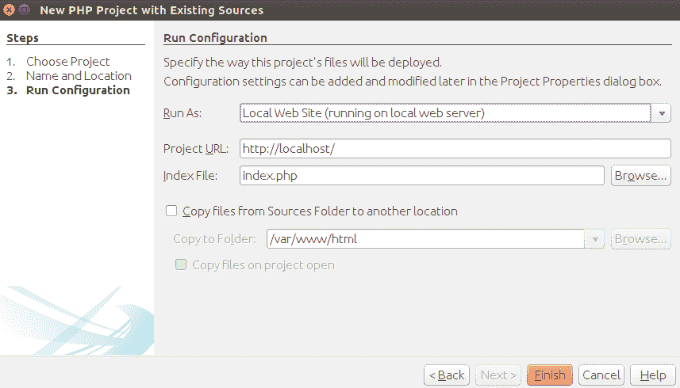

点击 Finish 按钮完成项目设置，我们现在应该可以看到我们的`index.php`文件：


最后，让我们继续执行以下控制台命令，引入示例应用程序：

```php
rm /var/www/html/index.php
cd /var/www/html/
git init
git remote add origin git@github.com:ajzele/MPHP7-CH16.git
git pull origin master

```

NetBeans IDE 应该能够立即在其“项目”选项卡中获取这些更改。到目前为止，我们还没有真正完成任何与 Xdebug 的调试、跟踪或分析组件相关的配置或设置。我们只安装了 LAMP 堆栈、Xdebug 本身、NetBeans IDE 并引入了示例应用程序。现在，让我们继续研究 Xdebug 的调试组件。

# 调试

Xdebug 的调试功能可以通过`xdebug.remote_enable=1`选项轻松打开。现代 PHP 通常有一个特殊的`xdebug.ini`配置文件；否则，我们将编辑默认的`php.ini`文件。在 Ubuntu 安装中，我们将其添加到`/etc/php/7.0/apache2/conf.d/20-xdebug.ini`文件中，如下所示：

```php
zend_extension=xdebug.so
xdebug.remote_enable=1

```

修改文件后，我们需要确保 Apache 服务器重新启动：

```php
 service apache2 restart 

```

虽然`xdebug.remote_enable`是开启调试功能的必需选项，但其他相关选项包括：

*   `xdebug.extended_info`
*   `xdebug.idekey`
*   `xdebug.remote_addr_header`
*   `xdebug.remote_autostart`
*   `xdebug.remote_connect_back`
*   `xdebug.remote_cookie_expire_time`
*   `xdebug.remote_enable`
*   `xdebug.remote_handler`
*   `xdebug.remote_host`
*   `xdebug.remote_log`
*   `xdebug.remote_mode`
*   `xdebug.remote_port`

Supplemental information about individual debugger configuration options can be found under [https://xdebug.org/docs/all_settings](https://xdebug.org/docs/all_settings).

回到 NetBeans，我们可以将重点放在调试工具栏上：

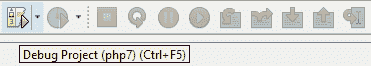

当我们点击调试项目按钮时，NetBeans 启动一个带有 URL`http://localhost/index.php?XDEBUG_SESSION_START=netbeans-xdebug`的浏览器，并激活以前禁用的按钮。

`Debug`工具栏上可用的按钮为我们提供了几个调试选项：

*   单步执行：这告诉调试器进入下一个函数调用并在那里中断。
*   单步执行：这告诉调试器执行下一个函数，然后中断。
*   跳出：这告诉调试器完成当前函数并在它完成后中断。
*   运行到游标：这有点双重作用。与启用的断点结合使用时，它直接从一个断点跳到另一个断点。当断点被禁用时，它会直接跳到我们定位光标的那一行。因此，我们可以以一种自由的方式进行调试，只要将光标放在需要的地方，就可以在调试过程开始后动态地确定下一个断点。

Run-to-Cursor 选项似乎是一种明智而直接的第一种方法。让我们继续在示例应用程序中设置几个断点，如下所示：

*   `index.php`：共有六个断点：

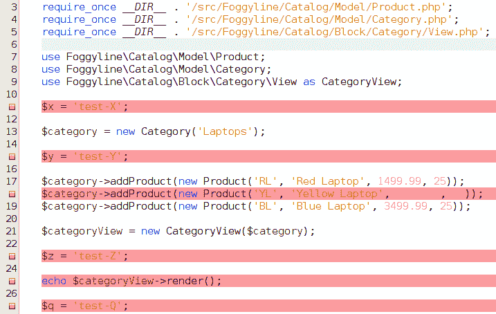

*   `src/Foggyline/Catalog/Model/Category.php`：这一共是一个断点：

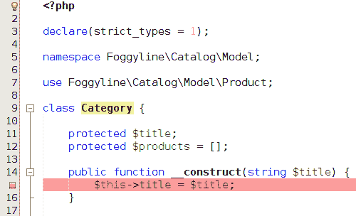

*   `src/Foggyline/Catalog/Block/Category/View.php`：这一共是一个断点：


以下步骤概述了仅使用“运行到光标”按钮进行的调试：

1.  单击调试项目。跳转到`index.php`的第 3 行并记录以下内容：

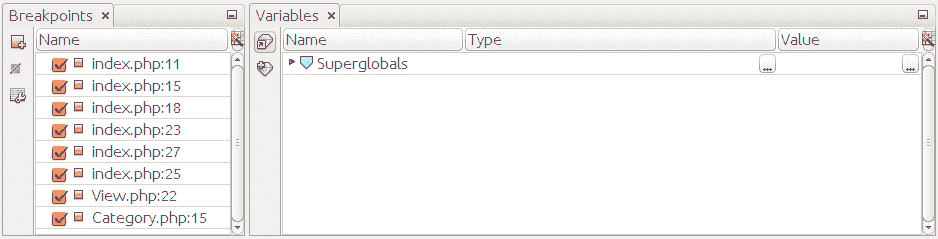

2.  单击 RuntoCursor。跳转到`index.php`的第 11 行并记录以下内容：

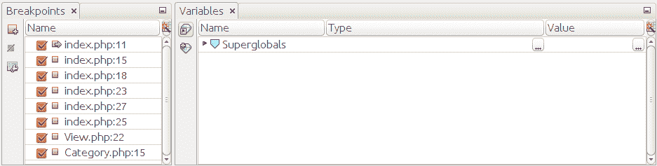

请注意断点选项卡现在如何在 index.php:11 旁边显示一个绿色箭头。

3.  单击 RuntoCursor。跳转到`src/Foggyline/Catalog/Model/Category.php`的第 15 行并记录以下内容：

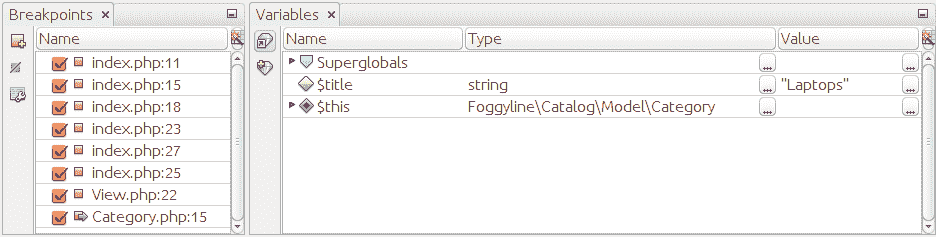

4.  单击 RuntoCursor。跳转到`index.php`文件的第 15 行并记录以下内容：

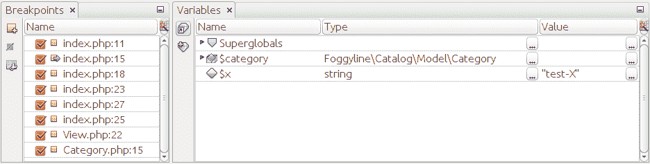

5.  单击 RuntoCursor。跳转到`index.php`文件的第 18 行并记录以下内容：


6.  单击 RuntoCursor。跳转到`index.php`文件的第 23 行并记录以下内容：


7.  单击 RuntoCursor。跳转到`index.php`文件的第 25 行并记录以下内容：

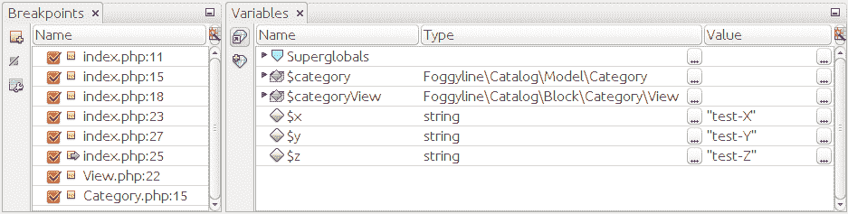

8.  单击 RuntoCursor。跳转到`src/Foggyline/Catalog/Block/Category/View.php`文件的第 22 行并记录以下内容：

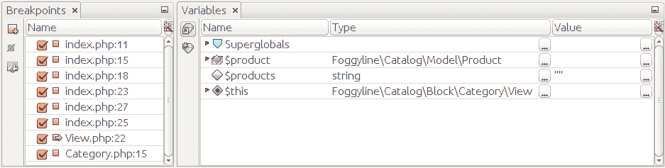

9.  单击 RuntoCursor。跳转到`src/Foggyline/Catalog/Block/Category/View.php`文件的第 22 行并记录以下内容：

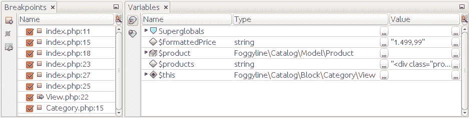

10.  单击 Run to Cursor（运行到光标）。这将跳转到`src/Foggyline/Catalog/Block/Category/View.php`文件的第 22 行，并记录以下内容：

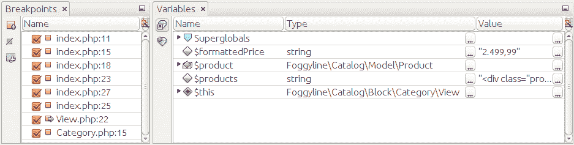

11.  单击 RuntoCursor。跳转到`index.php`文件的第 27 行并记录以下内容：


12.  单击 RuntoCursor。当`index.php`文件到达最后一个调试点时，我们将在第 27 行记录以下内容：

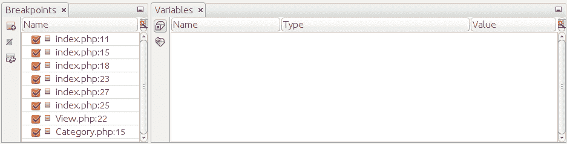

现在我们可以单击 FinishDebugger 会话按钮。

在这十二个步骤的过程中，我们可以清楚地观察 IDE 的行为及其记录的值。它可以很容易地将特定的代码位和代码片段作为目标，然后在调试过程中观察变量的变化。

请注意，在步骤 10 和 11 之间，我们从未看到 Variables 选项卡记录第三个产品的值。这是因为变量在我们经过给定的调试断点后被记录，在本例中，该断点将上下文从`View.php`类文件转移到`index.php`文件。这就是单击“步进”按钮可能会派上用场的地方，因为它可以使我们在执行第三个循环期间进一步深入`while`主体中的代码，从而生成第三个产品的值。

We should encourage mixing and using all of the debugging options in order to properly reach and read-out the variables of interest.

# 追踪

Xdebug 的跟踪功能可以通过`xdebug.auto_trace=1`选项轻松打开。在 Ubuntu 安装中，我们将其添加到`/etc/php/7.0/apache2/conf.d/20-xdebug.ini`文件中，如下所示：

```php
zend_extension=xdebug.so
xdebug.remote_enable=1
xdebug.auto_trace=1

```

修改文件后，我们需要确保 Apache 服务器重新启动：

```php
 service apache2 restart 

```

虽然`xdebug.auto_trace`是开启跟踪功能的必需选项，但其他相关选项包括：

*   `xdebug.collect_assignments`
*   `xdebug.collect_includes`
*   `xdebug.collect_params`
*   `xdebug.collect_return`
*   `xdebug.show_mem_delta`
*   `xdebug.trace_enable_trigger`
*   `xdebug.trace_enable_trigger_value`
*   `xdebug.trace_format`
*   `xdebug.trace_options`
*   `xdebug.trace_output_dir`
*   `xdebug.trace_output_name`
*   `xdebug.var_display_max_children`
*   `xdebug.var_display_max_data`
*   `xdebug.var_display_max_depth`

Supplemental information about individual *tracing* configuration options can be found at [https://xdebug.org/docs/execution_trace](https://xdebug.org/docs/execution_trace).

与调试功能不同，调试功能由 IDE 或文本编辑器控制，我们无法控制跟踪。默认情况下，每次运行应用程序时，跟踪功能都会在`/tmp`目录下创建一个不同的`trace.%c`文件。在 web 应用程序的上下文中，这意味着每次我们在浏览器中刷新页面时，跟踪功能都会为我们创建一个`trace.%c`文件。

我们的特定示例应用程序一旦执行，就会生成一个跟踪文件，非常类似于以下屏幕截图：


对于开发人员来说，输出本身相对容易阅读和理解。当然，当涉及到大型应用程序时，这会变得有点笨拙，因为我们最终会得到一个大型跟踪文件。尽管如此，知道了我们要针对的代码位，我们仍然可以搜索文件并找到所需的代码。让我们假设我们正在寻找整个代码中使用的`number_format()`函数。快速搜索`number_format`将指向`Category/View.php`的第 22 行，旁边是执行时间。对于整个调试工作来说，这是一条有价值的信息。

# 轮廓

使用`xdebug.profiler_enable=1`选项可以轻松打开 Xdebug 的评测功能。安装 Ubuntu 后，我们将修改`/etc/php/7.0/apache2/conf.d/20-xdebug.ini`文件，如下所示：

```php
zend_extension=xdebug.so
xdebug.remote_enable=1
xdebug.auto_trace=1
xdebug.profiler_enable=1

```

修改文件后，我们需要确保 Apache 服务器重新启动：

```php
 service apache2 restart 

```

虽然`xdebug.profiler_enable`是打开分析功能所需的选项，但其他相关选项包括：

*   `xdebug.profiler_aggregate`
*   `xdebug.profiler_append`
*   `xdebug.profiler_enable`
*   `xdebug.profiler_enable_trigger`
*   `xdebug.profiler_enable_trigger_value`
*   `xdebug.profiler_output_dir`
*   `xdebug.profiler_output_name`

Supplemental information about individual profiler configuration options can be found at [https://xdebug.org/docs/profiler](https://xdebug.org/docs/profiler).

与跟踪类似，我们无法从 IDE 或文本编辑器控制评测功能。默认情况下，评测功能在每次执行应用程序时都会在`/tmp`目录下创建一个不同的`cachegrind.out.%p`文件。

我们的特定示例应用程序一旦执行，就会生成一个 cachegrind 文件，非常类似于以下屏幕截图（部分输出）：

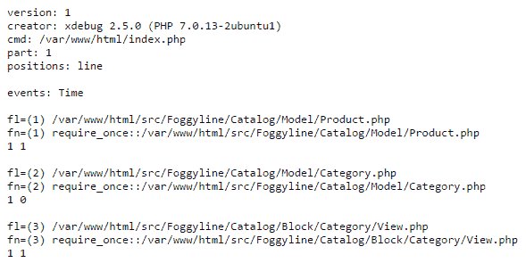

这里包含的信息远不如跟踪文件的可读性，因为这两个文件的目标是不同类型的信息。cachegrind 文件可以拉入一个应用程序，如 KCachegrind 或 QCacheGrind，这样我们就可以对捕获的信息进行更加用户友好和直观的表示：

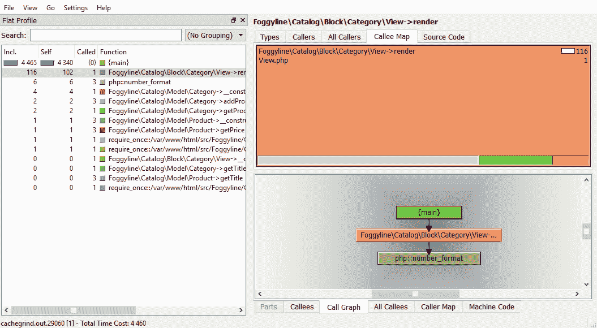

cachegrind 文件输出提供了重要的性能相关信息。我们深入了解了应用程序中使用的所有函数，按单个函数及其所有子函数中花费的时间排序。这使我们能够发现性能瓶颈，即使它在毫秒时间范围内。

# Zend Z 射线

*Rougue Wave 软件*公司提供一款名为 Zend server 的商用 PHP 服务器。Zend Server 的突出特点之一是它的**Z-Ray**扩展。看起来类似于 Xdebug 的跟踪和分析功能，Z-Ray 提供了全面的信息捕获和改进的用户体验。捕获的信息范围从执行时间、错误和警告、数据库查询、函数调用到请求信息。它们以类似于内置浏览器的开发工具的形式提供，使得开发人员能够在几秒钟内轻松检索重要的分析信息。

The Z-Ray extension itself is free, and can be used independently off the commercially available Zend Server. We can install it just like any other PHP extension. Although, at the time of writing, the stand-alone Z-Ray extension is available only for the PHP 5.5 and 5.6 versions, which are now considered outdated.

# 安装 Zend 服务器

考虑到这本书的目标是 PHP7，接下来，我们将获取 Zend 服务器的免费试用版并安装它。我们可以打开 Zend 官方页面，点击下载免费试用按钮：


假设我们使用的是全新的 Ubuntu 17.04 安装，Zend 的下载服务可能会为我们提供`tar.gz`存档下载：


下载并解包后，我们需要使用 PHP 版本参数触发`install_zs.sh`命令，如下所示：


安装完成后，控制台将向我们提供有关如何通过浏览器访问服务器管理界面的信息：

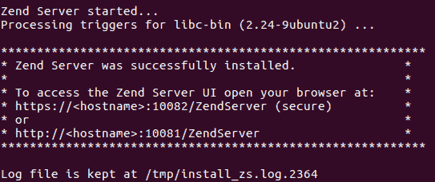

打开`https://localhost:10082/ZendServer`触发 Launch Zend Server 进程的许可协议步骤：

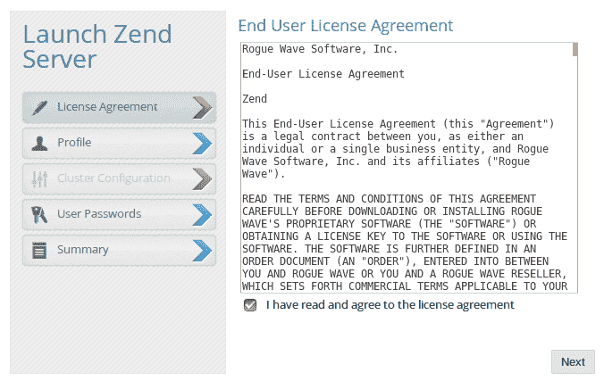

同意许可协议并单击“下一步”按钮，我们将进入 Launch Zend Server 流程的配置文件步骤：

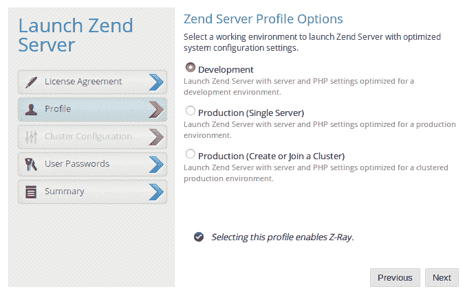

概要文件步骤提供了三个不同的选项：开发、生产（单服务器）和生产（创建或加入集群）。选择开发选项，单击下一步按钮，进入启动 Zend 服务器过程的用户密码步骤：


在这里，我们为管理员和开发人员提供用户密码。单击 Next（下一步）按钮，我们将进入 Launch Zend Server 进程的摘要步骤：

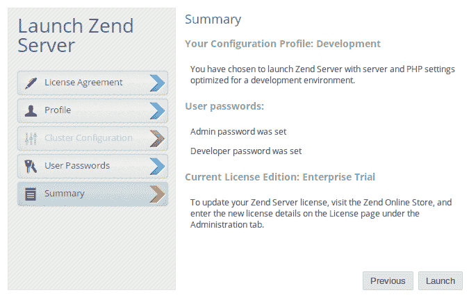

摘要步骤仅确认我们以前的选择和条目。单击启动按钮，我们完成启动 Zend 服务器过程，并进入入门页面：

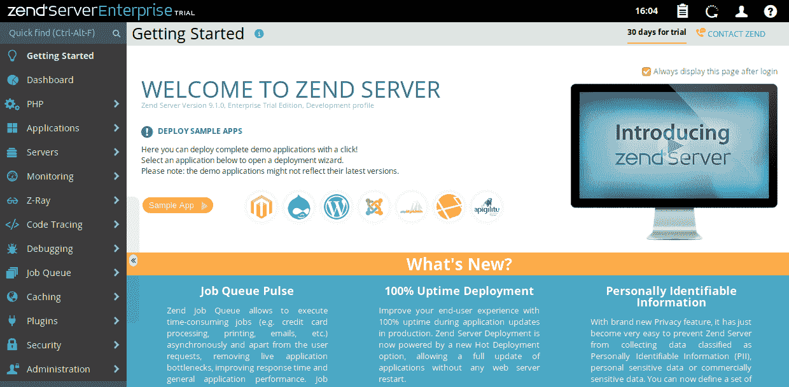

Zend 服务器提供了一个丰富的界面，用于管理运行中服务器的几乎所有方面。从这里，我们可以管理虚拟主机、应用程序、作业队列、缓存、安全性和其他位。在关注 Z-Ray 功能之前，我们需要设置测试应用程序。我们将使用与 Xdebug 相同的应用程序，映射到`test.loc`域。

# 设置虚拟主机

我们首先修改`/etc/hosts`文件，在其中添加`127.0.0.1 test.loc`行条目。

随着`test.loc`主机现在添加到主机文件中，我们返回 Zend 服务器并单击应用程序虚拟主机屏幕下的添加虚拟主机按钮。这将带我们进入添加虚拟主机进程的属性步骤：


这里我们输入`test.loc`作为虚拟主机名，输入`80`作为监听端口。单击 Next（下一步）按钮，进入添加虚拟主机过程的 SSL 配置步骤：


为了简单起见，让我们将此虚拟主机不使用 SSL 选择保持活动状态，然后单击 Next 按钮。这将带我们进入添加虚拟主机过程的模板步骤：

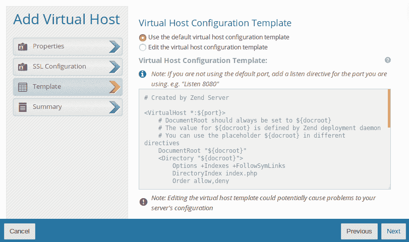

同样，让我们只需将“使用默认虚拟主机配置模板”选项保持为活动状态，然后单击“下一步”按钮。这将引导我们进入添加虚拟主机过程的摘要步骤：


要完成虚拟主机设置，请单击 Finish 按钮。现在应该创建我们的`test.loc`虚拟主机，显示如下详细信息：

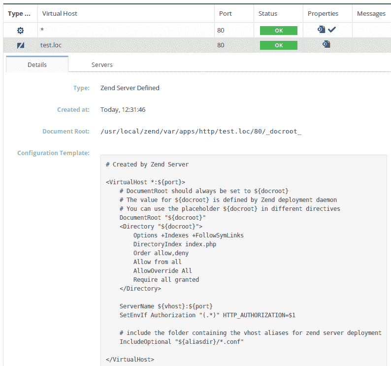

用于我们新创建的虚拟主机的文档根指向`/usr/local/zend/var/apps/http/test.loc/80/_docroot_`目录。在这里，我们将使用以下`git clone`命令转储示例应用程序：

```php
sudo git clone https://github.com/ajzele/MPHP7-CH16.git .

```

上述命令的输出如下所示：

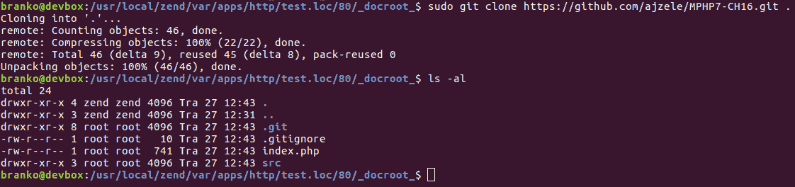

代码就位后，访问浏览器中的`http://test.loc`URL 应该会给我们以下输出：

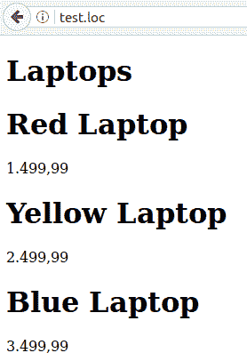

# 使用 Z 射线

现在我们已经启动并运行了测试应用程序，我们终于可以关注 Z-Ray 功能了。在 Zend 服务器管理界面中，在 Z-Ray |模式下，我们需要确保启用的选项是活动选项。现在，如果我们访问浏览器中的`http://test.loc`URL，我们应该能够看到页面底部的 Z-Ray 工具栏：


工具栏本身由几个关键部分组成，每个部分收集一个特定指标：

*   页面请求：


*   执行时间和内存峰值：

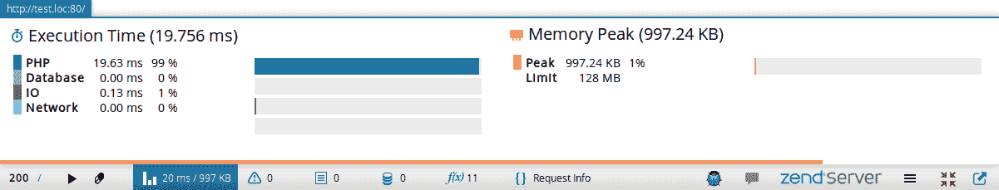

*   监视事件：


*   错误和警告：


*   数据库查询：

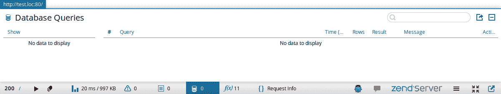

虽然我们的特定示例应用程序没有数据库交互，但以下输出说明了 Z-Ray 从资源密集型 Magento 电子商务平台捕获原始 SQL 数据库查询及其执行时间：

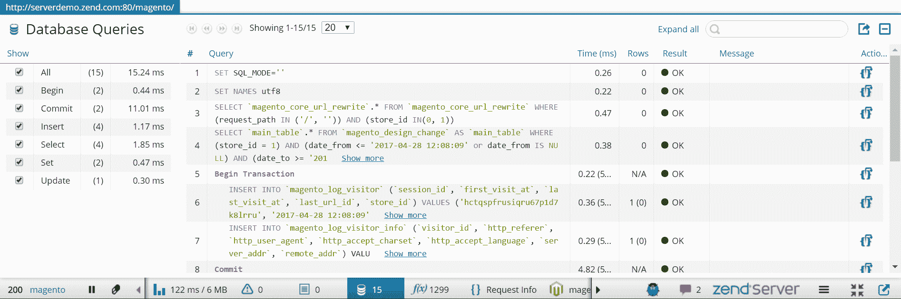

*   功能：


*   请求信息：


Z-Ray 就像 Xdebug 的跟踪和概要功能的混合体，直接传送到浏览器中。这使得它成为开发人员非常方便的工具。捕获 rawSQL 查询为该工具增加了更多的价值，因为通常，这些往往是意想不到的性能瓶颈。

The Z-Ray feature can be easily enabled only for a specific host. The way to do this is by activating the Selective option under the Z-Ray | Mode screen. This type of setup makes it convenient to profile production sites.

# 总结

在本节中，我们讨论了我们为整个应用程序测试贡献的三种独特类型的过程。这些过程被明确标记为调试、跟踪和分析，它们提供了关于应用程序内部信息的独特视角。当跟踪和分析以某种免提模式为我们收集应用程序性能和执行路径数据时，调试允许进入特定代码位的独特体验。无论我们是季节性还是全职软件开发人员，调试、跟踪、，分析是绝对需要掌握的基本技能。如果没有它们，解决真正讨厌的 bug 或编写性能优化的应用程序将成为一个全新的挑战。

接下来，我们将进一步了解 PHP 应用程序托管、资源调配和部署的环境和可用选择。