# 第五章 Symfony 一瞥

Symfony 等全栈框架通过提供从用户界面到数据存储的所有必要组件，有助于简化构建模块化应用程序的过程。这使得随着应用程序的增长，可以快速地交付单个应用程序的各个部分。稍后，我们将通过将应用程序划分为几个较小的模块或 Symfony 术语中的捆绑包来体验这一点。

接下来，我们将安装 Symfony，创建一个空白项目，并开始研究构建模块化应用程序所必需的各个框架功能：

*   控制器
*   路由
*   模板
*   形式
*   捆绑系统
*   数据库和学说
*   测试
*   验证

# 安装 Symfony

安装 Symfony 非常简单。我们可以使用以下命令在 Linux 或 Mac OS X 上安装 Symfony：

```php
sudo curl -LsS https://symfony.com/installer -o /usr/local/bin/symfony
sudo chmod a+x /usr/local/bin/symfony

```

我们可以使用以下命令在 Windows 上安装 Symfony：

```php
c:\> php -r "file_put_contents('symfony', file_get_contents('https://symfony.com/installer'));"

```

一旦执行了该命令，我们可以简单地将新创建的`symfony`文件移动到我们的项目目录中，并在 Windows 中以`symfony`或`php symfony`的形式进一步执行它。

此应触发如下输出：

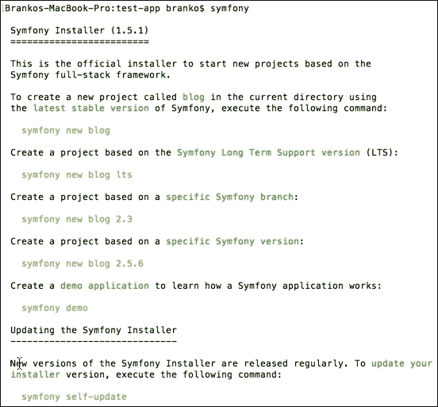

前面的响应表明我们已经成功地安装了 Symfony，现在可以开始创建新项目了。

# 创建空白项目

现在我们已经有了一个 Symfony 安装程序所有设置，让我们继续创建一个新的空白项目。我们通过简单地执行一个`symfony new test-app`命令来实现，如下面的命令行实例所示：

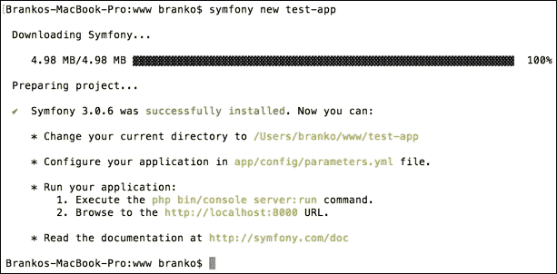

我们正在创建一个新项目，名为`test-app`。我们可以看到，Symfony 安装程序正在从 internet 下载最新的 Symfony 框架，同时输出一条关于如何通过 Symfony 控制台应用程序运行内置 PHP 服务器的简短说明。整个过程可能需要几分钟。

新创建的`test-app`目录的结构如下所示：

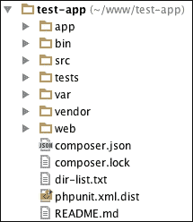

这里为我们创建了许多文件和目录。然而，我们的兴趣集中在`app`和`src`目录上。`app`目录是站点范围的应用程序配置所在的目录。在这里，我们可以找到数据库、路由、安全性和其他服务的配置。此外，这也是默认布局和模板文件所在的位置，如以下屏幕截图所示：

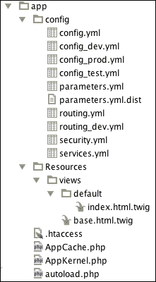

另一方面，`src`目录包含已经模块化的代码，以基本`AppBundle`模块的形式出现，如下面的屏幕截图所示：


我们将在以后的过程中更详细地讨论这些文件的作用。就目前而言，将浏览器指向该项目将使`DefaultController.php`成为实际渲染输出的项目，这是毫无价值的。

# 使用 Symfony 控制台

Symfony 框架附带一个内置控制台工具，我们只需在项目根目录中执行以下命令即可触发该工具：

```php
php bin/console

```

这样，屏幕上会显示大量可用命令，并将其分为以下几组：

*   `assets`
*   `cache`
*   `config`
*   `debug`
*   `doctrine`
*   `generate`
*   `lint`
*   `orm`
*   `router`
*   `security`
*   `server`
*   `swiftmailer`
*   `translation`

这些赋予我们各种功能。我们特别感兴趣的是`doctrine`和`generate`命令。`doctrine`命令，更具体地说是`doctrine:generate:crud`，根据现有条令实体生成 CRUD。此外，`doctrine:generate:entity`命令在现有捆绑包中生成一个新的条令实体。对于需要快速轻松地创建实体的情况，这些方法非常方便，同时还需要创建整个 CRUD。类似地，`generate:doctrine:entity`和`generate:doctrine:crud`做同样的事情。

在继续测试这些命令之前，我们需要确保数据库配置参数已就位，以便 Symfony 可以查看数据库并与数据库对话。为此，我们需要在`app/config/parameters.yml`文件中设置适当的值。

出于本节的目的，让我们继续在默认的`AppBundle`捆绑包中创建一个简单的客户实体，并假设客户实体上有以下属性：`firstname`、`lastname`和`e-mail`。我们首先从项目根目录中运行`php bin/console generate:doctrine:entity`命令，结果如下：

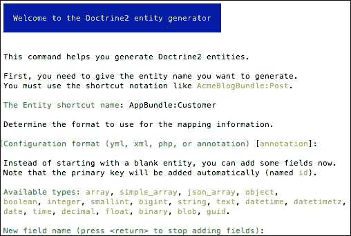

这里我们首先提供`AppBundle:Customer`作为实体名称，并确认使用注释作为配置格式。

最后，我们被要求开始向实体添加字段。输入名字并按 enter 键，我们将通过一系列关于字段类型、长度、可为空和唯一状态的简短问题，如以下屏幕截图所示：

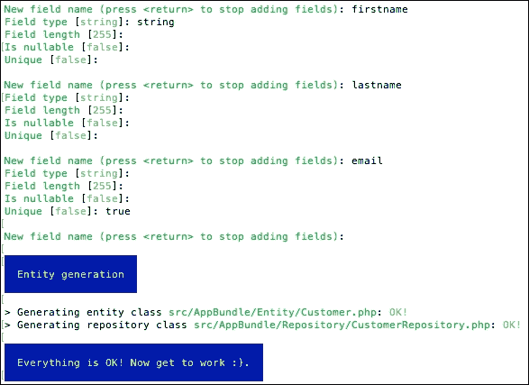

我们现在应该为我们的客户实体生成两个类。通过 Symfony 和 Doctrine 的帮助，这些类被放在**对象关系映射器**（**ORM**的上下文中，因为它们将客户实体与适当的数据库表链接起来。但是，我们还没有指示 Symfony 为我们的实体实际创建表。为此，我们执行以下命令：

```php
php bin/console doctrine:schema:update --force

```

这将产生如下屏幕截图所示的输出：


如果我们现在查看数据库，我们应该会看到一个`customer`表，其中包含使用 SQL create dsyntax 创建的所有正确列，如下所示：

```php
CREATE TABLE `customer` (
 `id` int(11) NOT NULL AUTO_INCREMENT,
 `firstname` varchar(255) COLLATE utf8_unicode_ci NOT NULL,
 `lastname` varchar(255) COLLATE utf8_unicode_ci NOT NULL,
 `email` varchar(255) COLLATE utf8_unicode_ci NOT NULL,
 PRIMARY KEY (`id`),
 UNIQUE KEY `UNIQ_81398E09E7927C74` (`email`)
) ENGINE=InnoDB DEFAULT CHARSET=utf8 COLLATE=utf8_unicode_ci;

```

在这一点上，我们仍然没有实际的 CRUD 功能。我们只是拥有一个 ORM 授权的客户实体类和相应的数据库表。以下命令将为我们生成实际的 CRUD 控制器和模板：

```php
php bin/console generate:doctrine:crud

```

这将产生以下交互式输出：

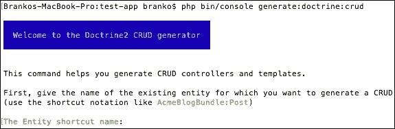

通过提供完全分类的实体名称`AppBundle:Customer`，generator 继续进行一系列附加输入，从生成写入操作、要读取的配置类型到路由前缀，如以下屏幕截图所示：


一旦完成，我们应该能够通过打开类似`http://test.app/customer/`的 URL（假设`test.app`是我们为示例设置的主机）访问我们的客户 CRUD 操作，如下所示：


如果我们点击**新建条目**链接，我们将被重定向到`/customer/new/`URL，如下图所示：

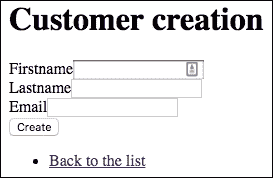

在这里，我们可以输入客户实体的实际值，然后单击**创建**按钮，以便将其保存到数据库`customer`表中。添加一些实体后，初始的`/customer/`URL 现在可以列出所有实体，如以下屏幕截图所示：


在这里我们可以看到**显示**和**编辑**动作的链接。行为是我们可能考虑的顾客所面临的行为，而 To.T9 编辑行为是管理员面对的行动。点击**编辑**动作，将我们带到表单`/customer/1/edit/`的 URL，而本例中的数字`1`是数据库中客户实体的 ID：


在这里，我们可以更改属性值并单击**编辑**将其保留回数据库，或者单击**删除**按钮从数据库中删除实体。

如果我们要使用已存在的电子邮件（标记为唯一字段）创建一个新实体，系统将抛出如下一般错误：

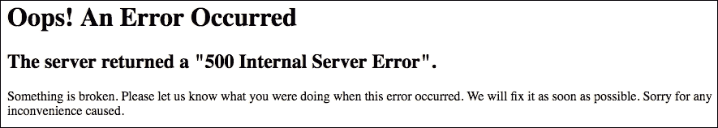

这仅仅是默认的系统行为，随着我们的进一步研究，我们将研究如何使其更加用户友好。现在，我们已经看到 Symfony 的控制台是多么强大。通过几个简单的命令，我们能够创建实体及其整个 CRUD 操作。控制台还可以提供更多功能。我们甚至可以创建自己的控制台命令，因为我们可以实现任何类型的逻辑。然而，为了满足我们的需要，目前的实施暂时就足够了。

# 控制器

控制器在 web 应用程序中扮演着重要角色，它处于任何应用程序输出的最前沿。它们是端点，是在每个 URL 后面执行的代码。从更技术的角度来说，我们可以说控制器是接受 HTTP 请求并返回 HTTP 响应的任何可调用的（函数、对象上的方法或闭包）。响应不绑定到 HTML 等单一格式，它可以是 XML、JSON、CSV、图像、重定向、错误等任何格式。

让我们来看一下前面创建的（部分）AutoT0x 文件，更确切地说是它的 Tyt1 方法：

```php
/**
 * Creates a new Customer entity.
 *
 * @Route("/new", name="customer_new")
 * @Method({"GET", "POST"})
 */
public function newAction(Request $request)
{
  //...

  return $this->render('customer/new.html.twig', array(
    'customer' => $customer,
    'form' => $form->createView(),
  ));
}
```

如果我们忽略实际的数据检索部分（`//…`，那么在这个小例子中有三件重要的事情需要注意：

*   `@Route`：这是 Symfony 指定 HTTP 端点的注释方式，我们将使用该 URL 访问该端点。第一个`"/new"`参数表示实际端点，第二个`name="customer_new"`参数设置此路由的名称，然后我们可以将其用作模板中 URL 生成函数的别名等。值得注意的是，这建立在定义方法的实际`CustomerController`类上的`@Route("/customer")`注释集的基础上，从而使完整 URL 类似于`http://test.app/customer/new`。
*   `@Method`：取一个或多个 HTTP 方法的名称。这意味着只有当 HTTP 请求与之前定义的`@Route`匹配并且属于`@Method`中定义的一种或多种 HTTP 方法类型时，`newAction`方法才会触发。
*   `$this->render`：此返回`Response`对象。`$this->render`调用`Symfony\Bundle\FrameworkBundle\Controller\Controller`类的`render`函数，该函数实例化新的`Response()`，设置其内容，并返回该对象的整个实例。

现在让我们看一下我们的控制器中的 TyrT0Ay 方法，如下面的代码块中部分显示的：

```php
/**
 * Displays a form to edit an existing Customer entity.
 *
 * @Route("/{id}/edit", name="customer_edit")
 * @Method({"GET", "POST"})
 */
public function editAction(Request $request, Customer $customer)
{
  //...
}
```

这里我们看到一个路由，它接受一个单一 ID，在第一个`@Route`注释参数中标记为`{id}`。方法主体（此处排除）不包含任何直接引用以获取`id`参数。我们可以看到，`editAction`函数接受两个参数，一个是`Request`，另一个是`Customer`。但是该方法如何知道接受`Customer`对象呢？这就是 Symfony 的`@ParamConverter`注释发挥作用的地方。它调用转换器将请求参数转换为对象。

`@ParamConverter`注释的好处在于我们可以显式或隐式地使用它。也就是说，如果我们不添加`@ParamConverter`注释，而是在方法参数中添加类型提示，Symfony 将尝试为我们加载对象。这正是我们在上面的示例中遇到的情况，因为我们没有显式地键入`@ParamConverter`注释。

就术语而言，控制器通常用于交换路由。然而，它们不是一回事。

# 路由

最简单地说，路由就是用浏览器中输入的 URL 链接控制器。今天的现代 web 应用程序需要漂亮的 URL。这意味着从像`/index.php?product_id=23`这样的 URL 转移到像`/catalog/product/t-shirt`这样的 URL。这就是路由的作用所在。

Symfony 具有强大的路由机制，使我们能够执行以下操作：

*   创建映射到控制器的复杂管线
*   在模板内生成 URL
*   在控制器内生成 URL
*   从不同位置加载路由资源

Symfony 中的路由工作方式是所有请求都通过`app.php`。然后，Symfony 内核要求路由器检查请求。然后，路由器将传入 URL 与特定路由匹配，并返回有关路由的信息。除其他外，该信息包括应执行的控制器。最后，Symfony 内核执行控制器，该控制器返回一个响应对象。

所有应用程序路由都是从单个路由配置文件加载的，通常是`app/config/routing.yml`文件，如我们的测试应用程序所示：

```php
app:
  resource: "@AppBundle/Controller/"
  type:     annotation
```

该应用程序只是众多可能条目中的一个。其资源值指向`AppBundle`控制器目录，类型设置为 annotation，这意味着将读取类注释以指定确切的路由。

我们可以定义具有多个变体的路线。其中一个显示在以下方框中：

```php
// Basic Route Configuration
/**
 * @Route("/")
 */
public function homeAction()
{
  // ...
}

// Routing with Placeholders
/**
 * @Route("/catalog/product/{sku}")
 */
public function showAction($sku)
{
  // ...
}

// >>Required<< and Optional Placeholders
/**
 * @Route("/catalog/product/{id}")
 */
public function indexAction($id)
{
  // ...
}
// Required and >>Optional<< Placeholders
/**
 * @Route("/catalog/product/{id}", defaults={"id" = 1})
 */
public function indexAction($id)
{
  // ...
}
```

前面的例子展示了几种定义路线的方法。有趣的是带有必需和可选参数的情况。如果我们仔细考虑一下，从最新的示例中删除 ID 将使之前的示例与 sku 匹配。Symfony 路由器将始终选择它找到的第一条匹配路由。我们可以通过在`@Route`注释中添加正则表达式需求来解决这个问题，如下所示：

```php
@Route(
  "/catalog/product/{id}",
  defaults={"id": 1},
  requirements={"id": "\d+"}
)
```

关于控制器和路由还有很多要说的，我们将在开始构建应用程序后看到这一点。

# 模板

之前我们说过控制器接受请求并返回响应。但是，响应通常可以是任何内容类型。实际内容的生成是控制器委托给模板引擎的事情。然后，模板引擎能够将响应转换为 HTML、JSON、XML、CSV、LaTeX 或任何其他基于文本的内容类型。

在过去，程序员将 PHP 与 HTML 混合到所谓的 PHP 模板中（`.php`和`.phtml`。尽管在某些平台上仍然使用这种方法，但这种方法被认为是不安全的，并且在许多方面缺乏安全性。其中之一就是将业务逻辑塞进模板文件中。

为了解决这些缺点，Symfony 打包了自己的模板语言 Twig。与 PHP 不同，Twig 的目的是严格地表达表示，而不是思考程序逻辑。我们不能在 Twig 中执行任何 PHP 代码。而 Twig 代码只不过是一个带有一些特殊语法类型的 HTML。

Twig 定义了三种特殊语法：

*   `{{ ... }}`：将变量或表达式的结果输出到模板。
*   ``：该标签控制模板的逻辑（`if`和`for`循环等）。
*   `{# ... #}`：相当于 PHP`/* comment */`语法。呈现的页面中不包括注释内容。

过滤器是细枝的另一个很好的特性。它们的行为类似于对变量值的链式方法调用，在输出内容之前修改内容，如下所示：

```php
<h1>{{ title|upper }}</h1>

{{ filter upper }}
<h1>{{ title }}</h1>


<h1>{{ title|lower|escape }}</h1>


<h1>{{ title }}</h1>

```

它还支持下列功能：

```php
{{ random(['phone', 'tablet', 'laptop']) }}
```

前面的随机函数调用将从数组中返回一个随机值。有了所有内置的过滤器和函数列表，Twig 还可以在需要时编写自己的过滤器和函数。

与 PHP 类继承类似，Twig 还支持模板和布局继承。让我们快速回顾一下 OrthT0x 文件如下：

```php



<h1>Customer list</h1>
…

```

这里我们看到一个客户`index.html.twig`模板使用`extends`标记从另一个模板扩展一个模板，在本例中`app/Resources/views/`目录中找到`base.html.twig`，内容如下：

```php
<!DOCTYPE html>
<html>
  <head>
    <meta charset="UTF-8" />
    <title>Welcome!</title>
    
    <link rel="icon" type="img/x-icon"href="{{ asset('favicon.ico') }}" />
  </head>
  <body>
    
    
  </body>
</html>
```

这里我们看到几个块标记：`title`、`stylesheets`、`body`和`javascripts`。我们可以在这里声明任意数量的块，并以任何方式命名它们。这使得`extend`标记成为模板继承的关键。它告诉细枝首先评估基本模板，该模板设置布局并定义块，然后子模板（如`customer/index.html.twig`）填充这些块的内容。

模板位于两个位置：

*   `app/Resources/views/`
*   `bundle-directory/Resources/views/`

这意味着为了`render/extend app/Resources/views/base.html.twig`我们将在模板文件中使用`base.html.twig`，为了`render/extend app/Resources/views/customer/index.html.twig`我们将使用`customer/index.html.twig`路径。

当与驻留在捆绑包中的模板一起使用时，我们必须以稍微不同的方式引用它们。在本例中，使用了`bundle:directory:filename`字符串语法。以`FoggylineCatalogBundle:Product:index.html.twig`路径为例。这将是使用其中一个捆绑包模板文件的完整路径。这里，`FoggylineCatalogBundle`是捆绑包名称，`Product`是该捆绑包`Resources/views`目录中的目录名称，`index.html.twig`是`Product`目录中实际模板的名称。

每个模板文件名有两个扩展名，首先指定该模板的格式，然后指定该模板的引擎；例如`*.html.twig`、`*.html.php`和`*.css.twig`。

一旦我们开始构建我们的应用程序，我们将深入了解有关这些模板的更多细节。

# 表格

注册、登录、添加到购物车、结帐，所有这些以及更多都是在网上商店应用程序和其他应用程序中使用 HTML 表单的操作。构建表单是开发人员最常见的任务之一。一个经常需要时间才能把事情做好的人。

Symfony 有一个`form`组件，通过它我们可以以面向对象的方式构建 HTML 表单。该组件本身也是一个独立的库，可以独立于 Symfony 使用。

让我们来看一下，在我们通过控制台定义它时，为我们自动生成的 AuthT0x 文件的内容，即我们的 AutoT1 实体实体。

```php
class Customer {
  private $id;
  private $firstname;
  private $lastname;
  private $email;

  public function getId() {
    return $this->id;
  }

  public function setFirstname($firstname) {
    $this->firstname = $firstname;
    return $this;
  }

  public function getFirstname() {
    return $this->firstname;
  }

  public function setLastname($lastname) {
    $this->lastname = $lastname;
    return $this;
  }

  public function getLastname() {
    return $this->lastname;
  }

  public function setEmail($email) {
    $this->email = $email;
    return $this;
  }

  public function getEmail() {
    return $this->email;
  }
}
```

这里我们有一个普通的 PHP 类，它没有扩展任何内容，也没有以任何其他方式链接到 Symfony。它表示单个客户实体，并为其设置和获取数据。实体类就位后，我们希望呈现一个表单，该表单将获取类使用的所有相关数据。这就是`Form`组件就位的地方。

当我们之前通过控制台使用 CRUD 生成器时，它在`src/AppBundle/Form/CustomerType.php`文件中为我们的客户实体创建了`Form`类，内容如下：

```php
namespace AppBundle\Form;

use Symfony\Component\Form\AbstractType;
use Symfony\Component\Form\FormBuilderInterface;
use Symfony\Component\OptionsResolver\OptionsResolver;

class CustomerType extends AbstractType
{
  public function buildForm(FormBuilderInterface $builder, array $options) {
    $builder
    ->add('firstname')
    ->add('lastname')
    ->add('email')
    ;
  }

  public function configureOptions(OptionsResolver $resolver) {
    $resolver->setDefaults(array(
      'data_class' =>'AppBundle\Entity\Customer'
    ));
  }
}
```

我们可以看到表单组件背后的简单性归结为以下几点：

*   **扩展表单类型**：我们从`Symfony\Component\Form\AbstractType`类进行扩展
*   **实现 buildForm 方法**：这是我们添加要在表单上显示的实际字段的地方
*   **实现配置选项**：至少指定指向我们客户实体的`data_class`配置。

form builder 对象就是在这里进行重载的对象。创建表单不需要花费太多时间。在 PosiT0p 类中，让我们来看看用模板来填充模板的动作。在本例中，我们将重点关注`src/AppBundle/Controller/CustomerController.php`文件中的`newAction`，内容如下：

```php
$customer = new Customer();
$form = $this->createForm('AppBundle\Form\CustomerType', $customer);
$form->handleRequest($request);

if ($form->isSubmitted() && $form->isValid()) {
  $em = $this->getDoctrine()->getManager();
  $em->persist($customer);
  $em->flush();

  return $this->redirectToRoute('customer_show', array('id' =>$customer->getId()));
}

return $this->render('customer/new.html.twig', array(
  'customer' => $customer,
  'form' => $form->createView(),
));
```

前面的代码首先实例化了`Customer` 实体类。`$this->createForm(…)`实际上在调用`$this->container->get('form.factory')->create(…)`，将`form`类名和`customer`对象实例传递给它。然后我们进行`isSubmitted`和`isValid`检查，看看这是 GET 还是有效的 POST 请求。基于该检查，代码要么返回客户列表，要么设置要与模板`customer/new.html.twig`一起使用的`form`和`customer`实例。稍后我们将进一步讨论实际验证。

最后，让我们看看在`app/Resources/views/customer/new.html.twig`文件中找到的实际模板：

```php



<h1>Customer creation</h1>

{{ form_start(form) }}
{{ form_widget(form) }}
<input type="submit" value="Create" />
{{ form_end(form) }}

<ul>
  <li>
    <a href="{{ path('customer_index') }}">Back to the list</a>
  </li>
</ul>

```

这里我们看到了`extends`和`block`标记，以及一些形式的相关函数。Symfony 为 Twig 添加了几个表单呈现功能，如下所示：

*   `form(view, variables)`
*   `form_start(view, variables)`
*   `form_end(view, variables)`
*   `form_label(view, label, variables)`
*   `form_errors(view)`
*   `form_widget(view, variables)`
*   `form_row(view, variables)`
*   `form_rest(view, variables)`

我们的大多数应用程序表单都将像这样自动生成，因此我们能够获得一个功能完整的 CRUD，而不必深入了解表单的其余功能。

# 配置 Symfony

为了跟上现代需求，当今的框架和应用程序需要灵活的配置系统。Symfony 通过其强大的配置文件和环境概念很好地履行了这一职责。

默认 Symfony 配置文件`config.yml`位于`app/config/`目录下，其（部分）内容分段如下：

```php
imports:
  - { resource: parameters.yml }
  - { resource: security.yml }
  - { resource: services.yml }

framework:
…

# Twig Configuration
twig:
…

# Doctrine Configuration
doctrine:
…

# Swiftmailer Configuration
swiftmailer:
…
```

顶级条目如`framework`、`twig`、`doctrine`和`swiftmailer`定义了单个捆绑包的配置。

可选地，配置文件可以是 XML 或 PHP 格式（`config.xml`或`config.php`）。虽然 YAML 简单易读，但 XML 功能更强大，而 PHP 功能强大但可读性较差。

我们可以使用 console 工具转储整个配置，如下所示：

```php
php bin/console config:dump-reference FrameworkBundle

```

上面的示例列出了 core`FrameworkBundle`的配置文件。我们可以使用相同的命令来显示实现容器扩展的任何捆绑包的可能配置，稍后我们将对此进行研究。

Symfony 很好地实现了环境概念。查看`app/config`目录，我们可以看到默认的 Symfony 项目实际上从三个不同的环境开始：

*   `config_dev.yml`
*   `config_prod.yml`
*   `config_test.yml`

每个应用程序都可以在不同的环境中运行。每个环境共享相同的代码，但配置不同。dev 环境可能使用广泛的日志记录，而 prod 环境可能使用广泛的缓存。

触发这些环境的方式是通过前端控制器文件，如以下部分示例所示：

```php
# web/app.php
…
$kernel = new AppKernel('prod', false);
…

# web/app_dev.php
…
$kernel = new AppKernel('dev', true);
…
```

此处缺少测试环境，因为它仅在运行自动测试时使用，无法通过浏览器直接访问。

`app/AppKernel.php`文件是实际加载配置的文件，无论是 YAML、XML 还是 PHP，如以下代码片段所示：

```php
public function registerContainerConfiguration(LoaderInterface $loader)
{
  $loader->load($this->getRootDir().'/config/config_'.$this->getEnvironment().'.yml');
}
```

环境遵循相同的概念，而每个环境导入基本配置文件，然后修改其值以满足特定环境的需要。

# 捆绑系统

大多数流行的框架和平台都支持某种形式的模块、插件、扩展或捆绑包。在大多数情况下，区别实际上只在于命名，而可扩展性和模块化的概念是相同的。使用 Symfony，这些模块块称为 bundle。

bundle 在 Symfony 中是一流的公民，因为它们支持其他组件可用的所有操作。Symfony 中的所有内容都是一个捆绑包，甚至是核心框架。捆绑包使我们能够构建模块化的应用程序，而给定功能的整个代码都包含在一个目录中。

一个捆绑包将所有 PHP 文件、模板、样式表、JavaScript 文件、测试和其他内容保存在一个根目录中。

当我们第一次安装测试应用程序时，它为我们在`src`目录下创建了一个`AppBundle`。当我们继续使用自动生成的 CRUD 时，我们看到我们的包得到了各种目录和文件。

Symfony 需要注意的 bundle 需要添加到`app/AppKernel.php`文件中，使用`registerBundles`方法，如下所示：

```php
public function registerBundles()
{
  $bundles = [
    new Symfony\Bundle\FrameworkBundle\FrameworkBundle(),
    new Symfony\Bundle\SecurityBundle\SecurityBundle(),
    new Symfony\Bundle\TwigBundle\TwigBundle(),
    new Symfony\Bundle\SwiftmailerBundle\SwiftmailerBundle(),
    new Doctrine\Bundle\DoctrineBundle\DoctrineBundle(),
    //…
    new AppBundle\AppBundle(),
  ];

  //…

  return $bundles;
}
```

创建一个新的捆绑包就像创建一个 PHP 文件一样简单。让我们继续创建一个包含如下内容的`src/TestBundle/TestBundle.php`文件：

```php
namespace TestBundle;

use Symfony\Component\HttpKernel\Bundle\Bundle;

class TestBundle extends Bundle
{
  …
}
```

一旦文件就位，我们需要做的就是通过`app/AppKernel.php`文件的`registerBundles`方法进行注册，如下所示：

```php
class AppKernel extends Kernel {
//…
  public function registerBundles() {
    $bundles = [
      // …
      new TestBundle\TestBundle(),
      // …
    ];
    return $bundles;
  }
  //…
}
```

创建包的一种更简单的方法是只运行控制台命令，如下所示：

```php
php bin/console generate:bundle --namespace=Foggyline/TestBundle

```

这将引发一系列关于 bundle 的问题，最终导致 bundle 的创建，如下图所示：

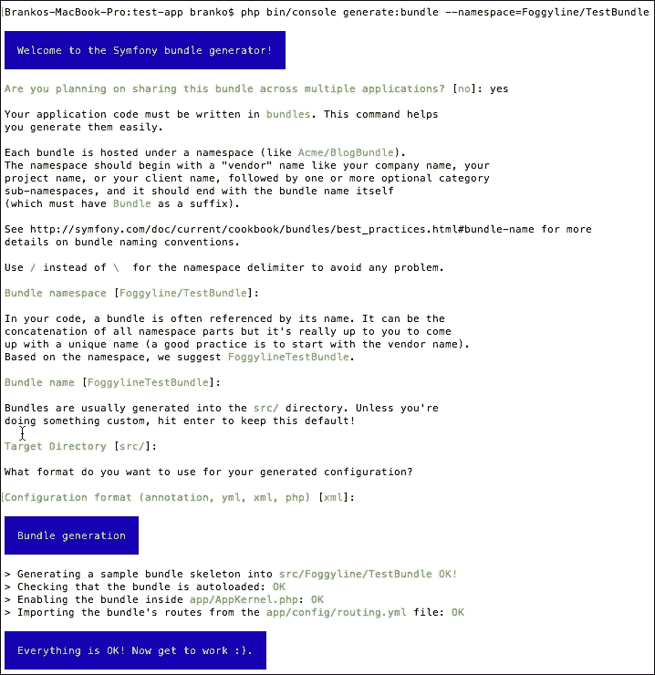

一旦流程完成，将创建一个包含多个目录和文件的新捆绑包，如以下屏幕截图所示：

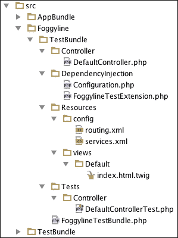

Bundle generator 非常友好，可以创建控制器、依赖注入扩展、路由、准备服务配置、模板，甚至测试。由于我们选择共享捆绑包，Symfony 选择 XML 作为默认配置格式。依赖项扩展仅仅意味着我们可以使用`foggyline_test`作为 Symfony 的主`config.yml`中的根元素来访问我们的包配置。实际的`foggyline_test`元素在`DependencyInjection/Configuration.php`文件中定义。

# 数据库和条令

数据库是几乎所有 web 应用程序的主干。每当我们需要存储或检索数据时，我们都需要数据库的帮助。现代 OOP 世界的挑战是对数据库进行抽象，使我们的 PHP 代码与数据库无关。MySQL 可能是 PHP 世界中最知名的数据库。PHP 本身非常支持使用 MySQL，无论是通过`mysqli_*`扩展还是通过 PDO。然而，这两种方法都是 MySQL 特有的，以接近数据库。Doctrine 通过引入一个抽象级别来解决这个问题，使我们能够处理在 MySQL 中表示表、行及其关系的 PHP 对象。

条令与 Symfony 完全解耦，因此使用它是完全可选的。然而，Symfony 控制台的优点在于它提供了基于 ORM 的自动生成 CRUD，正如我们在前面创建客户实体的示例中所看到的那样。

我们一创建项目，Symfony 就为我们提供了一个自动生成的`app/config/parameters.yml`文件。这是我们在其中提供数据库访问信息的文件，如下例所示：

```php
parameters:
database_host: 127.0.0.1
database_port: null
database_name: symfony
database_user: root
database_password: mysql
```

一旦我们配置了合适的参数，我们就可以使用控制台生成功能。

值得注意的是，此文件中的参数只是一种约定，因为`app/config/config.yml`将它们拉入`doctrine dbal`配置下，如图所示：

```php
doctrine:
dbal:
  driver:   pdo_mysql
  host:     "%database_host%"
  port:     "%database_port%"
  dbname:   "%database_name%"
  user:     "%database_user%"
  password: "%database_password%"
  charset:  UTF8
```

Symfony 控制台工具允许我们基于此配置删除和创建数据库，这在开发过程中非常方便，如以下代码块所示：

```php
php bin/console doctrine:database:drop --force
php bin/console doctrine:database:create
```

我们在前面看到了 console 工具如何使我们能够创建实体及其到数据库表的映射。这将足以满足我们在本书中的需求。一旦我们创建了它们，我们就需要能够对它们执行 CRUD 操作。如果我们对自动生成的 CRUD 控制器`src/AppBundle/Controller/CustomerController.php` 文件进行润色，我们可以将 CRUD 相关代码如下：

```php
// Fetch all entities
$customers = $em->getRepository('AppBundle:Customer')->findAll();

// Persist single entity (existing or new)
$em = $this->getDoctrine()->getManager();
$em->persist($customer);
$em->flush();

// Delete single entity
$em = $this->getDoctrine()->getManager();
$em->remove($customer);
$em->flush();
```

关于学说还有很多要说的，这远远超出了本书的范围。更多信息可在官方页面（[上找到 http://www.doctrine-project.org](http://www.doctrine-project.org) 。

# 测试

如今，测试已经成为每个现代 web 应用程序不可或缺的一部分。通常，术语测试意味着单元和功能测试。单元测试是关于测试我们的 PHP 类。每个 PHP 类都被视为一个单元，因此称为单元测试。另一方面，功能测试测试应用程序的各个层，通常集中于测试整体功能，如登录或注册过程。

PHP 生态系统有一个很棒的单元测试框架，名为**PHPUnit**，可在[下载 https://phpunit.de](https://phpunit.de) 。它使我们能够主要编写单元测试，但也可以编写功能类型测试。Symfony 最大的优点是它内置了对 PHPUnit 的支持。

在开始运行 Symfony 的测试之前，我们需要确保已经安装了 PHPUnit，并且可以作为控制台命令使用。执行时，PHPUnit 会自动尝试从当前工作目录中的`phpunit.xml`或`phpunit.xml.dist`中拾取和读取测试配置（如果可用）。默认情况下，Symfony 在其根文件夹中附带一个`phpunit.xml.dist`文件，因此，`phpunit`命令可以选择其测试配置。

以下是默认`phpunit.xml.dist`文件的部分示例：

```php
<phpunit … >
  <php>
    <ini name="error_reporting" value="-1" />
    <server name="KERNEL_DIR" value="app/" />
  </php>

  <testsuites>
    <testsuite name="Project Test Suite">
      <directory>tests</directory>
    </testsuite>
  </testsuites>

  <filter>
    <whitelist>
      <directory>src</directory>
      <exclude>
        <directory>src/*Bundle/Resources</directory>
        <directory>src/*/*Bundle/Resources</directory>
        <directory>src/*/Bundle/*Bundle/Resources</directory>
      </exclude>
    </whitelist>
  </filter>
</phpunit>
```

`testsuites`元素定义了目录测试，我们的所有测试都位于目录测试中。`filter`元素及其子元素用于为代码覆盖率报告配置白名单。`php`元素及其子元素用于配置 PHP 设置、常量和全局变量。

对像我们这样的默认项目运行`phpunit`命令将产生如下输出：


请注意，捆绑测试不会自动拾取。当我们使用自动生成的 CRUD 时，为我们自动创建的`src/AppBundle/Tests/Controller/CustomerControllerTest.php`文件没有被执行。不是因为默认情况下其内容被注释掉，而是因为`bundle`测试目录对`phpunit`不可见。为了让它执行，我们需要通过添加到目录`testsuite`来扩展`phpunit.xml.dist`文件，如下所示：

```php
<testsuites>
  <testsuite name="Project Test Suite">
    <directory>tests</directory>
    <directory>src/AppBundle/Tests</directory>
  </testsuite>
</testsuites>
```

根据我们构建应用程序的方式，我们可能希望将所有捆绑包添加到`testsuite`列表中，即使我们计划独立分发捆绑包。

关于测试还有很多要说的。我们将在进一步的章节中一点一点地介绍，并涵盖各个 bundle 的需求。目前，知道如何触发测试以及如何向测试配置添加新位置就足够了。

# 验证

验证在现代应用中起着至关重要的作用。当谈到 web 应用程序时，我们可以说我们区分了两种主要的验证类型；表单数据和持久化数据验证。应验证通过 web 表单从用户处获取的输入，与进入数据库的任何持久化数据相同。

Symfony 在这里表现出色，它提供了一个基于 JSR 303 Bean Validation 的验证组件，该组件在[中起草并提供 http://beanvalidation.org/1.0/spec/](http://beanvalidation.org/1.0/spec/) 。回顾我们的`app/config/config.yml`，在`framework`根元素下，可以看到`validation`服务默认开启：

```php
framework:
  validation:{ enable_annotations: true }
```

我们可以通过`$this->get('validator')`表达式调用任何控制器类来访问验证服务，如下例所示：

```php
$customer = new Customer();

$validator = $this->get('validator');

$errors = $validator->validate($customer);

if (count($errors) > 0) {
  // Handle error state
}

// Handle valid state
```

上面这个例子的问题是验证永远不会返回任何错误。原因是我们没有在类上设置任何断言。控制台自动生成的 CRUD 并没有在`Customer`类上定义任何约束。我们可以通过尝试添加新客户并在电子邮件字段中键入任何文本来确认，因为我们可以看到电子邮件不会被验证。

让我们继续编辑`src/AppBundle/Entity/Customer.php`文件，将`@Assert\Email`函数添加到`$email`属性中，如下所示：

```php
//…
use Symfony\Component\Validator\Constraints as Assert;
//…
class Customer
{
  //…
  /**
  * @var string
  *
  * @ORM\Column(name="email", type="string", length=255, unique=true)
  * @Assert\Email(
    *      checkMX = true,
    *      message = "Email '{{ value }}' is invalid.",
    * )
    */
  private $email;
  //…
}
```

断言约束的优点在于，它们接受参数就像接受函数一样。因此，我们可以根据我们的具体需要微调各个约束条件。如果我们现在尝试跳过或添加一个错误的电子邮件地址，我们将收到类似于**电子邮件的消息”john@gmail.test“无效**。

有很多限制条件，关于完整列表，我们可以参考[http://symfony.com/doc/current/book/validation.html](http://symfony.com/doc/current/book/validation.html) 页。

约束可以应用于类属性或公共 getter 方法。虽然属性约束最常见且易于使用，但 getter 方法约束允许我们指定更复杂的验证规则。

下面我们来看一下`src/AppBundle/Controller/CustomerController.php`文件的`newAction`方法：

```php
$customer = new Customer();
$form = $this->createForm('AppBundle\Form\CustomerType', $customer);
$form->handleRequest($request);

if ($form->isSubmitted() && $form->isValid()) {
// …
```

这里我们看到一个`CustomerType`表单的实例被绑定到`Customer`实例。实际的 GET 或 POST 请求数据通过`handleRequest`方法传递给表单实例。表单现在能够理解实体验证约束，并通过其`isValid`方法调用正确响应。这意味着我们不必亲自使用验证服务进行手动验证，表单可以为我们进行验证。

随着各个捆绑包的开发，我们将继续扩展验证功能。

# 总结

在本章中，我们讨论了一些重要的功能，这些功能使 Symfony 如此强大。控制器、模板、条令、ORM、表单和验证是从数据表示和持久性的完整解决方案。我们已经看到了每个组件背后的灵活性和威力。bundle 系统进一步将其封装到单个迷你应用程序或模块中。我们现在能够完全控制传入的 HTTP 请求、操作数据存储并向用户呈现数据，所有这些都在一个包中完成。

接下来，在下一章中，我们将利用在前几章中获得的见解和知识，最终开始根据需求构建模块化应用程序。