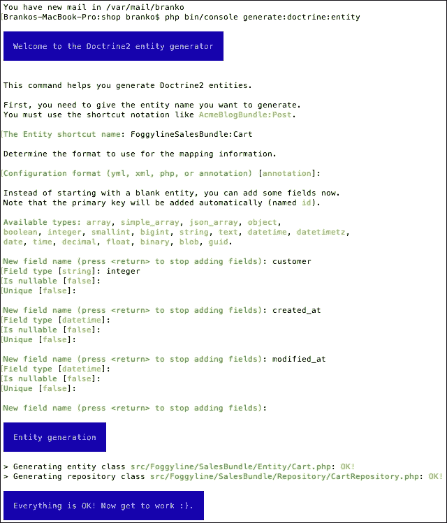
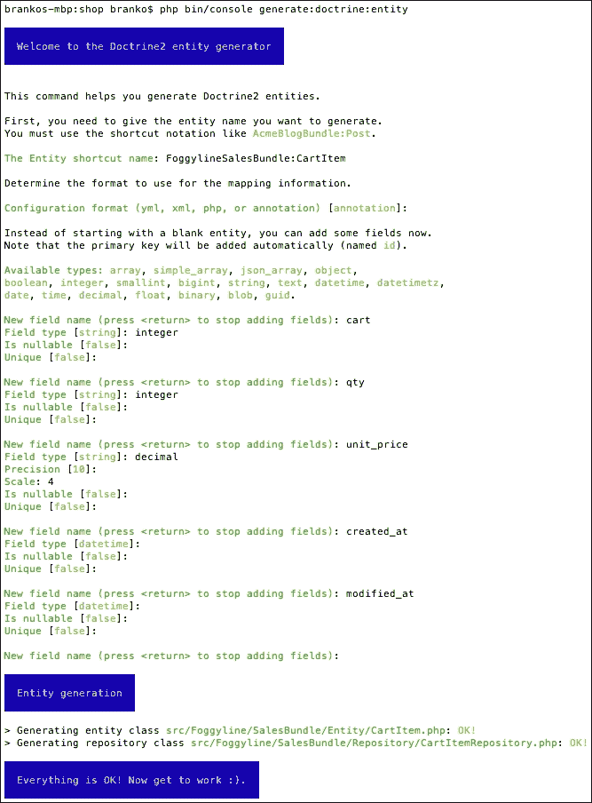
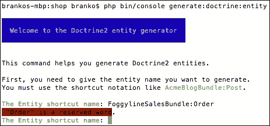
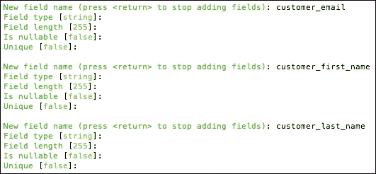
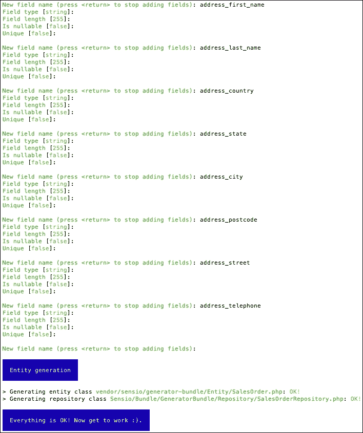

# 十一、构建销售模块

销售模块是我们将构建的一系列模块中的最后一个模块，以提供一个简单但功能强大的 web shop 应用程序。我们将通过在目录顶部添加购物车和结账功能来实现这一点。结帐本身最终将使用前几章中定义的装运和支付服务。这里的整体重点将放在绝对基础上，因为真正的购物车应用程序将采用更健壮的方法。然而，理解如何以一种简单的方式将它们联系在一起是为以后更健壮的 web 应用程序实现打开大门的第一步。

在本章中，我们将介绍销售模块的以下主题：

*   要求
*   依赖关系
*   实施
*   单元测试
*   功能测试

# 要求

[第 4 章](04.html "Chapter 4. Requirement Specification for a Modular Web Shop App")、*模块化网店 App*需求规范中定义的应用需求，给我们一些与购物车和结账相关的线框。基于这些线框，我们可以推测需要创建什么类型的实体才能实现功能。

以下是所需模块实体的列表：

*   运货马车
*   购物车项目
*   顺序
*   订单项目

`Cart`实体包括以下属性及其数据类型：

*   `id`：整数，自动递增
*   `customer_id`：字符串
*   `created_at`：日期时间
*   `modified_at`：日期时间

`Cart Item`主体包括以下属性：

*   `id`：整数，自动递增
*   `cart_id`：整数，引用类别`table id`列的外键
*   `product_id`：整数，引用产品`table id`列的外键
*   `qty`：字符串
*   `unit_price`：十进制
*   `created_at`：日期时间
*   `modified_at`：日期时间

`Order`实体包括以下属性：

*   `id`：整数，自动递增
*   `customer_id`：整数，引用客户`table id`列的外键
*   `items_price`：十进制
*   `shipment_price`：十进制
*   `total_price`：十进制
*   `status`：字符串
*   `customer_email`：字符串
*   `customer_first_name`：字符串
*   `customer_last_name`：字符串
*   `address_first_name`：字符串
*   `address_last_name`：字符串
*   `address_country`：字符串
*   `address_state`：字符串
*   `address_city`：字符串
*   `address_postcode`：字符串
*   `address_street`：字符串
*   `address_telephone`：字符串
*   `payment_method`：字符串
*   `shipment_method`：字符串
*   `created_at`：日期时间
*   `modified_at`：日期时间

`Order Item`主体包括以下属性：

*   `id`：整数，自动递增
*   `sales_order_id`：整数，引用订单`table id`列的外键
*   `product_id`：整数，引用产品`table id`列的外键
*   `title`：字符串
*   `qty`：int
*   `unit_price`：十进制
*   `total_price`：十进制
*   `created_at`：日期时间
*   `modified_at`：日期时间

除了添加这些实体及其 CRUD 页面之外，我们还需要覆盖一个核心模块服务，该服务负责构建类别菜单和销售项目。

# 依赖关系

销售模块在代码中有几个依赖项。这些依赖关系针对客户和目录模块。

# 实施

我们首先创建一个名为`Foggyline\SalesBundle`的新模块。我们在控制台的帮助下，通过运行以下命令来完成此操作：

```php
php bin/console generate:bundle --namespace=Foggyline/SalesBundle

```

该命令触发了一个交互过程，在过程中向我们询问了几个问题，如下所示：


完成后，`app/AppKernel.php`和`app/config/routing.yml`文件将自动修改。`AppKernel`类的`registerBundles`方法已添加到`$bundles`数组下的行：

```php
new Foggyline\PaymentBundle\FoggylineSalesBundle(),
```

`routing.yml`文件已更新为以下条目：

```php
foggyline_payment:
  resource: "@FoggylineSalesBundle/Resources/config/routing.xml"
  prefix:   /
```

为了避免与核心应用代码冲突，我们需要将`prefix: /`改为`prefix: /sales/`。

## 创建购物车实体

让我们继续并创建一个`Cart`实体。我们使用控制台来实现这一点，如下所示：

```php
php bin/console generate:doctrine:entity

```

这将触发交互式生成器，如下图所示：



这将在`src/Foggyline/SalesBundle/`目录中创建和`Repository/CartRepository.php`文件。在此之后，我们需要更新数据库，因此它通过运行以下命令拉入`Cart`实体：

```php
php bin/console doctrine:schema:update --force

```

当`Cart`实体位于位置时，我们可以继续生成`CartItem`实体。

## 创建购物车项目实体

让我们继续并创建一个`CartItem`实体。我们使用现在众所周知的`console`命令：

```php
php bin/console generate:doctrine:entity

```

这将触发交互式生成器，如以下屏幕截图所示：



此在`src/Foggyline/SalesBundle/`目录中创建`Entity/CartItem.php`和`Repository/CartItemRepository.php`。自动生成完成后，我们需要返回并编辑`CartItem`实体以更新`cart`字段关系，如下所示：

```php
/**
 * @ORM\ManyToOne(targetEntity="Cart", inversedBy="items")
 * @ORM\JoinColumn(name="cart_id", referencedColumnName="id")
 */
private $cart;
```

在这里，我们定义了所谓的*双向一对多*关联。一对多关联中的外键在多方定义，在本例中为`CartItem`实体。双向映射需要`OneToMany`关联上的`mappedBy`属性和`ManyToOne`关联上的`inversedBy`属性。本例中的`OneToMany`端是`Cart`实体，因此我们返回`src/Foggyline/SalesBundle/Entity/Cart.php`文件并添加以下内容：

```php
/**
 * @ORM\OneToMany(targetEntity="CartItem", mappedBy="cart")
 */
private $items;

public function __construct() {
  $this->items = new \Doctrine\Common\Collections\ArrayCollection();
}
```

然后，我们需要更新数据库，以便它通过运行以下命令拉入`CartItem`实体：

```php
php bin/console doctrine:schema:update --force

```

有了`CartItem`实体，我们可以继续生成`Order`实体。

## 创建订单实体

让我们继续创建一个`Order`实体。我们使用控制台来实现这一点，如下所示：

```php
php bin/console generate:doctrine:entity

```

如果我们试图提供`FoggylineSalesBundle:Order`作为实体快捷方式名称，生成的输出将抛出一个错误，如以下屏幕截图所示：



相反，我们将使用`SensioGeneratorBundle:SalesOrder`作为实体快捷方式名称，并遵循生成器，如下所示：


接下来是其他与客户信息相关的字段。要了解更多信息，请查看以下屏幕截图：



接下来是订单地址相关的其他字段，如下所示：



值得注意的是，通常我们希望在其自己的表中提取地址信息，即使其成为其自己的实体。然而，为了保持简单，我们将继续将其作为`SalesOrder`实体的一部分。

完成后，将在`src/Foggyline/SalesBundle/`目录中创建`Entity/SalesOrder.php`和`Repository/SalesOrderRepository.php`文件。在此之后，我们需要更新数据库，因此它通过运行以下命令拉入`SalesOrder`实体：

```php
php bin/console doctrine:schema:update --force

```

有了`SalesOrder`实体，我们可以继续生成`SalesOrderItem`实体。

## 创建 SalesOrderItem 实体

让我们继续创建一个`SalesOrderItem`实体。我们使用以下`console`命令启动代码生成器：

```php
php bin/console generate:doctrine:entity

```

当询问实体快捷方式名称时，我们提供`FoggylineSalesBundle:SalesOrderItem`，然后按照以下屏幕截图所示的生成器字段定义进行操作：


此在`src/Foggyline/SalesBundle/`目录中创建`Entity/SalesOrderItem.php`和`Repository/SalesOrderItemRepository.php`文件。自动生成完成后，我们需要返回并编辑`SalesOrderItem`实体以更新`SalesOrder`字段关系，如下所示：

```php
/**
 * @ORM\ManyToOne(targetEntity="SalesOrder", inversedBy="items")
 * @ORM\JoinColumn(name="sales_order_id", referencedColumnName="id")
 */
private $salesOrder;

/**
 * @ORM\OneToOne(targetEntity="Foggyline\CatalogBundle\Entity\Product")
 * @ORM\JoinColumn(name="product_id", referencedColumnName="id")
 */
private $product;
```

在这里，我们定义了两种类型的关系。第一个是与`$salesOrder`相关的双向一对多关联，我们在`Cart`和`CartItem`实体中看到了这一点。第二个是与`$product`相关的单向一对一关联。该引用称为单向引用，因为`CartItem`引用`Product`，而 P`roduct`将不会引用`CartItem`，因为我们不想更改属于另一个模块的内容。

我们仍然需要返回到`src/Foggyline/SalesBundle/Entity/SalesOrder.php`文件并添加以下内容：

```php
/**
 * @ORM\OneToMany(targetEntity="SalesOrderItem", mappedBy="salesOrder")
 */
private $items;

public function __construct() {
  $this->items = new \Doctrine\Common\Collections\ArrayCollection();
}
```

然后，我们需要更新数据库，以便它通过运行以下命令拉入`SalesOrderItem`实体：

```php
php bin/console doctrine:schema:update --force

```

有了`SalesOrderItem`实体，我们就可以开始构建购物车和结账页面了。

## 覆盖添加到购物车 url 服务

`add_to_cart_url`服务最初是在`FoggylineCustomerBundle`中用伪数据声明的。这是因为在销售功能可用之前，我们需要一种在产品上构建添加到购物车 URL 的方法。虽然肯定不理想，但这是一种可行的方法。

现在，我们将用销售模块中声明的服务覆盖该服务，以便提供正确的添加到购物车 URL。我们首先在`src/Foggyline/SalesBundle/Resources/config/services.xml`中定义服务，在服务下添加以下服务元素，如下所示：

```php
<service id="foggyline_sales.add_to_cart_url" class="Foggyline\SalesBundle\Service\AddToCartUrl">
  <argument type="service" id="doctrine.orm.entity_manager"/>
  <argument type="service" id="router"/>
</service>
```

然后我们创建`src/Foggyline/SalesBundle/Service/AddToCartUrl.php`，内容如下：

```php
namespace Foggyline\SalesBundle\Service;

class AddToCartUrl
{
  private $em;
  private $router;

  public function __construct(
    \Doctrine\ORM\EntityManager $entityManager,
    \Symfony\Bundle\FrameworkBundle\Routing\Router $router
  )
  {
    $this->em = $entityManager;
    $this->router = $router;
  }

  public function getAddToCartUrl($productId)
  {
    return $this->router->generate('foggyline_sales_cart_add', array('id' => $productId));
  }
}
```

此处的`router`服务需要名为`foggyline_sales_cart_add`的路由，但该路由仍然不存在。我们通过在`src/Foggyline/SalesBundle/Resources/config/routing.xml`文件的`routes`元素下添加以下条目来创建路由，如下所示：

```php
<route id="foggyline_sales_cart_add" path="/cart/add/{id}">
  <default key="_controller">FoggylineSalesBundle:Cart:add</default>
</route>
```

Route definition 希望在`src/Foggyline/SalesBundle/Controller/CartController.php`文件中找到 cart 控制器内的`addAction`函数，我们定义为如下：

```php
namespace Foggyline\SalesBundle\Controller;

use Symfony\Component\HttpFoundation\Request;
use Symfony\Bundle\FrameworkBundle\Controller\Controller;

class CartController extends Controller
{
  public function addAction($id)
  {
    if ($customer = $this->getUser()) {
      $em = $this->getDoctrine()->getManager();
      $now = new \DateTime();

      $product = $em->getRepository('FoggylineCatalogBundle:Product')->find($id);

      // Grab the cart for current user
      $cart = $em->getRepository('FoggylineSalesBundle:Cart')->findOneBy(array('customer' => $customer));

      // If there is no cart, create one
      if (!$cart) {
        $cart = new \Foggyline\SalesBundle\Entity\Cart();
        $cart->setCustomer($customer);
        $cart->setCreatedAt($now);
        $cart->setModifiedAt($now);
      } else {
        $cart->setModifiedAt($now);
      }

      $em->persist($cart);
      $em->flush();

      // Grab the possibly existing cart item
      // But, lets find it directly
      $cartItem = $em->getRepository('FoggylineSalesBundle:CartItem')->findOneBy(array('cart' => $cart, 'product' => $product));

      if ($cartItem) {
        // Cart item exists, update it
        $cartItem->setQty($cartItem->getQty() + 1);
        $cartItem->setModifiedAt($now);
      } else {
        // Cart item does not exist, add new one
        $cartItem = new \Foggyline\SalesBundle\Entity\CartItem();
        $cartItem->setCart($cart);
        $cartItem->setProduct($product);
        $cartItem->setQty(1);
        $cartItem->setUnitPrice($product->getPrice());
        $cartItem->setCreatedAt($now);
        $cartItem->setModifiedAt($now);
      }

      $em->persist($cartItem);
      $em->flush();

      $this->addFlash('success', sprintf('%s successfully added to cart', $product->getTitle()));

      return $this->redirectToRoute('foggyline_sales_cart');
    } else {
      $this->addFlash('warning', 'Only logged in users can add to cart.');
      return $this->redirect('/');
    }
  }
}
```

在`addAction`方法中有相当多的逻辑。我们首先检查当前用户在数据库中是否已经有购物车条目；如果没有，我们将创建一个新的。然后，我们添加或更新现有购物车项目。

为了让我们新的`add_to_cart`服务真正覆盖`Customer`模块中的服务，我们仍然需要添加一个编译器。我们通过定义内容如下的`src/Foggyline/SalesBundle/DependencyInjection/Compiler/OverrideServiceCompilerPass.php`文件来实现：

```php
namespace Foggyline\SalesBundle\DependencyInjection\Compiler;

use Symfony\Component\DependencyInjection\Compiler\CompilerPassInterface;
use Symfony\Component\DependencyInjection\ContainerBuilder;
use Symfony\Component\DependencyInjection\Definition;

class OverrideServiceCompilerPass implements CompilerPassInterface
{
    public function process(ContainerBuilder $container)
    {
        // Override 'add_to_cart_url' service
        $container->removeDefinition('add_to_cart_url');
        $container->setDefinition('add_to_cart_url', $container->getDefinition('foggyline_sales.add_to_cart_url'));

        // Override 'checkout_menu' service
        // Override 'foggyline_customer.customer_orders' service
        // Override 'bestsellers' service
        // Pickup/parse 'shipment_method' services
        // Pickup/parse 'payment_method' services
    }
}
```

稍后，我们将将其余覆盖添加到此文件。为了暂时解决问题，使`add_to_cart`服务覆盖生效，我们需要在`src/Foggyline/SalesBundle/FoggylineSalesBundle.php`文件的`build`方法中注册*编译器通过*，如下所示：

```php
public function build(ContainerBuilder $container)
{
    parent::build($container);;
    $container->addCompilerPass(new OverrideServiceCompilerPass());
}
```

覆盖现在应该生效，我们的`Sales`模块现在应该提供有效的添加到购物车链接。

## 覆盖签出菜单服务

`Customer`模块中定义的结帐菜单服务有一个简单的用途，即提供到购物车的链接和结帐流程的第一步。由于销售模块当时未知，`Customer`模块提供了一个虚拟链接，我们现在将覆盖该链接。

我们首先在`src/Foggyline/SalesBundle/Resources/config/services.xml`文件的`services`元素下添加以下服务条目，如下所示：

```php
<service id="foggyline_sales.checkout_menu" class="Foggyline\SalesBundle\Service\CheckoutMenu">
<argument type="service" id="doctrine.orm.entity_manager"/>
<argument type="service" id="security.token_storage"/>
<argument type="service" id="router"/>
</service>
```

然后我们添加内容为的`src/Foggyline/SalesBundle/Service/CheckoutMenu.php`文件如下：

```php
namespace Foggyline\SalesBundle\Service;

class CheckoutMenu
{
  private $em;
  private $token;
  private $router;

  public function __construct(
    \Doctrine\ORM\EntityManager $entityManager,
    $tokenStorage,
    \Symfony\Bundle\FrameworkBundle\Routing\Router $router
  )
  {
    $this->em = $entityManager;
    $this->token = $tokenStorage->getToken();
    $this->router = $router;
  }

  public function getItems()
  {
    if ($this->token
      && $this->token->getUser() instanceof \Foggyline\CustomerBundle\Entity\Customer
    ) {
      $customer = $this->token->getUser();

      $cart = $this->em->getRepository('FoggylineSalesBundle:Cart')->findOneBy(array('customer' => $customer));

      if ($cart) {
        return array(
          array('path' => $this->router->generate('foggyline_sales_cart'), 'label' =>sprintf('Cart (%s)', count($cart->getItems()))),
          array('path' => $this->router->generate('foggyline_sales_checkout'), 'label' =>'Checkout'),
        );
      }
    }

    return array();
  }
}
```

该服务需要两条路由`foggyline_sales_cart`和`foggyline_sales_checkout`，因此我们需要修改`src/Foggyline/SalesBundle/Resources/config/routing.xml`文件，在其中添加以下路由定义：

```php
<route id="foggyline_sales_cart" path="/cart/">
  <default key="_controller">FoggylineSalesBundle:Cart:index</default>
</route>

<route id="foggyline_sales_checkout" path="/checkout/">
  <default key="_controller">FoggylineSalesBundle:Checkout:index</default>
</route>
```

新增加的路由需要`cart`和`checkout`控制器。`cart`控制器已经就位，所以我们只需要将`indexAction`添加到其中。现在，让我们添加一个空的，如下所示：

```php
public function indexAction(Request $request)
{
}
```

同样，让我们创建一个内容如下的`src/Foggyline/SalesBundle/Controller/CheckoutController.php`文件：

```php
namespace Foggyline\SalesBundle\Controller;

use Symfony\Component\HttpFoundation\Request;
use Symfony\Bundle\FrameworkBundle\Controller\Controller;
use Symfony\Component\Form\Extension\Core\Type\TextType;
use Symfony\Component\Form\Extension\Core\Type\CountryType;

class CheckoutController extends Controller
{
  public function indexAction()
  {
  }
}
```

稍后，我们将回到这两个`indexAction`方法，并添加适当的方法体实现。

为了结束服务覆盖，我们现在修改先前创建的`src/Foggyline/SalesBundle/DependencyInjection/Compiler/OverrideServiceCompilerPass.php`文件，将`// Override 'checkout_menu'`服务注释替换为以下内容：

```php
$container->removeDefinition('checkout_menu');
$container->setDefinition('checkout_menu', $container->getDefinition('foggyline_sales.checkout_menu'));
```

我们新定义的服务现在应该覆盖`Customer`模块中定义的服务，从而提供正确的结帐和购物车（购物车计数中的项目）URL。

## 覆盖客户订单服务

`foggyline_customer.customer_orders`服务是为当前登录的客户提供以前创建的订单集合。`Customer`模块为此定义了一个虚拟服务，这样我们就可以继续在**我的账户**页面下建立**我的订单**部分。我们现在需要覆盖此服务，使其返回正确的订单。

我们首先在`src/Foggyline/SalesBundle/Resources/config/services.xml`文件的服务下添加以下`service`元素，如下所示：

```php
<service id="foggyline_sales.customer_orders" class="Foggyline\SalesBundle\Service\CustomerOrders">
  <argument type="service" id="doctrine.orm.entity_manager"/>
  <argument type="service" id="security.token_storage"/>
  <argument type="service" id="router"/>
</service>
```

然后添加`src/Foggyline/SalesBundle/Service/CustomerOrders.php`文件，内容如下：

```php
namespace Foggyline\SalesBundle\Service;

class CustomerOrders
{
  private $em;
  private $token;
  private $router;

  public function __construct(
    \Doctrine\ORM\EntityManager $entityManager,
    $tokenStorage,
    \Symfony\Bundle\FrameworkBundle\Routing\Router $router
  )
  {
    $this->em = $entityManager;
    $this->token = $tokenStorage->getToken();
    $this->router = $router;
  }

  public function getOrders()
  {
    $orders = array();

    if ($this->token
    && $this->token->getUser() instanceof \Foggyline\CustomerBundle\Entity\Customer
    ) {
      $salesOrders = $this->em->getRepository('FoggylineSalesBundle:SalesOrder')
      ->findBy(array('customer' => $this->token->getUser()));

      foreach ($salesOrders as $salesOrder) {
        $orders[] = array(
          'id' => $salesOrder->getId(),
          'date' => $salesOrder->getCreatedAt()->format('d/m/Y H:i:s'),
          'ship_to' => $salesOrder->getAddressFirstName() . '' . $salesOrder->getAddressLastName(),
'         'order_total' => $salesOrder->getTotalPrice(),
          'status' => $salesOrder->getStatus(),
          'actions' => array(
            array(
              'label' =>'Cancel',
              'path' => $this->router->generate('foggyline_sales_order_cancel', array('id' => $salesOrder->getId()))
            ),
            array(
              'label' =>'Print',
              'path' => $this->router->generate('foggyline_sales_order_print', array('id' => $salesOrder->getId()))
            )
          )
        );
      }
    }
    return $orders;
  }
}
```

`route generate`方法希望找到两条尚未创建的路径`foggyline_sales_order_cancel`和`foggyline_sales_order_print`。

让我们继续并通过在`src/Foggyline/SalesBundle/Resources/config/routing.xml`文件的`route`元素下添加以下内容来创建它们：

```php
<route id="foggyline_sales_order_cancel"path="/order/cancel/{id}">
  <default key="_controller">FoggylineSalesBundle:SalesOrder:cancel</default>
</route>

<route id="foggyline_sales_order_print" path="/order/print/{id}">
  <default key="_controller">FoggylineSalesBundle:SalesOrder:print</default>
</route>
```

反过来，路由定义要求定义`SalesOrderController`。由于我们的应用程序需要管理员用户能够列出和编辑订单，因此我们将使用以下 Symfony 命令为我们的`Sales Order`实体自动生成 CRUD：

```php
php bin/console generate:doctrine:crud

```

当询问实体快捷方式名称时，我们只需提供`FoggylineSalesBundle:SalesOrder`并继续，允许创建写操作。此时，已经为我们创建了几个文件，以及`Sales`包之外的一些条目。其中一个条目是`app/config/routing.yml`文件中的路由定义，如下所示：

```php
foggyline_sales_sales_order:
  resource: "@FoggylineSalesBundle/Controller/SalesOrderController.php"
  type:     annotation
```

我们应该已经有一个`foggyline_sales`条目了。区别在于`foggyline_sales`指向我们的`router.xml`文件，新创建的`foggyline_sales_sales_order`指向新创建的`SalesOrderController`文件。为了简单起见，我们可以同时保留它们。

自动生成器还在`app/Resources/views/`目录下创建了一个`salesorder`目录，我们需要将其作为`src/Foggyline/SalesBundle/Resources/views/Default/salesorder/`目录转移到我们的包中。

我们现在可以通过在`src/Foggyline/SalesBundle/Controller/SalesOrderController.php`文件中添加以下内容来解决打印和取消操作，如下所示：

```php
public function cancelAction($id)
{
  if ($customer = $this->getUser()) {
    $em = $this->getDoctrine()->getManager();
    $salesOrder = $em->getRepository('FoggylineSalesBundle:SalesOrder')
    ->findOneBy(array('customer' => $customer, 'id' => $id));

    if ($salesOrder->getStatus() != \Foggyline\SalesBundle\Entity\SalesOrder::STATUS_COMPLETE) {
      $salesOrder->setStatus(\Foggyline\SalesBundle\Entity\SalesOrder::STATUS_CANCELED);
      $em->persist($salesOrder);
      $em->flush();
    }
  }

  return $this->redirectToRoute('customer_account');
}

public function printAction($id)
{
  if ($customer = $this->getUser()) {
    $em = $this->getDoctrine()->getManager();
    $salesOrder = $em->getRepository('FoggylineSalesBundle:SalesOrder')
    ->findOneBy(array('customer' => $customer, 'id' =>$id));

    return $this->render('FoggylineSalesBundle:default:salesorder/print.html.twig', array(
      'salesOrder' => $salesOrder,
      'customer' => $customer
    ));
  }

  return $this->redirectToRoute('customer_account');
}
```

`cancelAction`方法仅检查该订单是否属于当前登录的客户；如果是，则允许更改订单状态。`printAction`方法仅在订单属于当前登录的客户时加载订单，并将其传递给`print.html.twig`模板。

然后我们创建`src/Foggyline/SalesBundle/Resources/views/Default/salesorder/print.html.twig`模板，内容如下：

```php

<h1>Printing Order #{{ salesOrder.id }}</h1>
  {#<p>Just a dummy Twig dump of entire variable</p>#}
  {{ dump(salesOrder) }}

```

显然，这只是一个简化的输出，我们可以根据需要进一步定制。重要的一点是，我们已经将`order`对象传递给了模板，现在可以从模板中提取所需的任何信息。

最后，我们将`src/Foggyline/SalesBundle/DependencyInjection/Compiler/OverrideServiceCompilerPass.php`文件中的`// Override 'foggyline_customer.customer_orders'`服务注释替换为如下代码：

```php
$container->removeDefinition('foggyline_customer.customer_orders');
$container->setDefinition('foggyline_customer.customer_orders', $container->getDefinition('foggyline_sales.customer_orders'));
```

这将使服务覆盖生效，并引入我们刚才所做的所有更改。

## 覆盖畅销书服务

`Customer`模块中定义的`bestsellers`服务应该为主页上显示的畅销书功能提供虚拟数据。这个想法是展示商店里五种最畅销的产品。`Sales`模块现在需要覆盖此服务以提供正确的实现，实际销售的产品数量将影响所示畅销书的内容。

我们首先在`src/Foggyline/SalesBundle/Resources/config/services.xml`文件的`service`元素下添加以下定义：

```php
<service id="foggyline_sales.bestsellers" class="Foggyline\SalesBundle\Service\BestSellers">
  <argument type="service" id="doctrine.orm.entity_manager"/>
  <argument type="service" id="router"/>
</service>
```

然后我们定义`src/Foggyline/SalesBundle/Service/BestSellers.php`文件，其内容如下：

```php
namespace Foggyline\SalesBundle\Service;

class BestSellers
{
  private $em;
  private $router;

  public function __construct(
    \Doctrine\ORM\EntityManager $entityManager,
    \Symfony\Bundle\FrameworkBundle\Routing\Router $router
  )
  {
    $this->em = $entityManager;
    $this->router = $router;
  }

  public function getItems()
  {
    $products = array();
    $salesOrderItem = $this->em->getRepository('FoggylineSalesBundle:SalesOrderItem');
    $_products = $salesOrderItem->getBestsellers();

    foreach ($_products as $_product) {
      $products[] = array(
        'path' => $this->router->generate('product_show', array('id' => $_product->getId())),
        'name' => $_product->getTitle(),
        'img' => $_product->getImage(),
        'price' => $_product->getPrice(),
        'id' => $_product->getId(),
      );
    }
    return $products;
  }
}
```

这里，我们获取`SalesOrderItemRepository`类的实例并对其调用`getBestsellers`方法。此方法尚未定义。我们通过如下方式将其添加到文件`src/Foggyline/SalesBundle/Repository/SalesOrderItemRepository.php`文件中：

```php
public function getBestsellers()
{
  $products = array();

  $query = $this->_em->createQuery('SELECT IDENTITY(t.product), SUM(t.qty) AS HIDDEN q
  FROM Foggyline\SalesBundle\Entity\SalesOrderItem t
  GROUP BY t.product ORDER BY q DESC')
  ->setMaxResults(5);

  $_products = $query->getResult();

  foreach ($_products as $_product) {
    $products[] = $this->_em->getRepository('FoggylineCatalogBundle:Product')
    ->find(current($_product));
  }

  return $products;
}
```

在这里，我们使用**条令查询语言****DQL**来构建五大畅销产品的列表。最后，我们需要将`src/Foggyline/SalesBundle/DependencyInjection/Compiler/OverrideServiceCompilerPass.php`文件中的`// Override 'bestsellers'`服务注释替换为如下代码：

```php
$container->removeDefinition('bestsellers');
$container->setDefinition('bestsellers', $container->getDefinition('foggyline_sales.bestsellers'));
```

通过覆盖`bestsellers`服务，我们将公开基于实际销售额的畅销产品列表，供其他模块获取。

## 创建购物车页面

购物车页面是，客户可以通过**添加到购物车**按钮从主页、类别页面或产品页面查看添加到购物车的产品列表。我们之前创建了`CartController`和一个空`indexAction`函数。现在我们继续编辑`indexAction`函数，如下所示：

```php
public function indexAction()
{
  if ($customer = $this->getUser()) {
    $em = $this->getDoctrine()->getManager();

    $cart = $em->getRepository('FoggylineSalesBundle:Cart')->findOneBy(array('customer' => $customer));
    $items = $cart->getItems();
    $total = null;

    foreach ($items as $item) {
      $total += floatval($item->getQty() * $item->getUnitPrice());
    }

    return $this->render('FoggylineSalesBundle:default:cart/index.html.twig', array(
        'customer' => $customer,
        'items' => $items,
        'total' => $total,
      ));
  } else {
    $this->addFlash('warning', 'Only logged in customers can access cart page.');
    return $this->redirectToRoute('foggyline_customer_login');
  }
}
```

在这里，我们检查用户是否登录；如果是，我们将向他们展示购物车及其所有物品。未登录的用户将重定向到客户登录 URL。`indexAction`函数需要`src/Foggyline/SalesBundle/Resources/views/Default/cart/index.html.twig`文件，其内容我们定义如下：

```php


<h1>Shopping Cart</h1>
<div class="row">
  <div class="large-8 columns">
    <form action="{{ path('foggyline_sales_cart_update') }}"method="post">
    <table>
      <thead>
        <tr>
          <th>Item</th>
          <th>Price</th>
          <th>Qty</th>
          <th>Subtotal</th>
        </tr>
      </thead>
      <tbody>
        
        <tr>
          <td>{{ item.product.title }}</td>
          <td>{{ item.unitPrice }}</td>
          <td><input name="item[{{ item.id }}]" value="{{ item.qty }}"/></td>
          <td>{{ item.qty * item.unitPrice }}</td>
        </tr>
        
      </tbody>
    </table>
    <button type="submit" class="button">Update Cart</button>
  </form>
</div>
<div class="large-4 columns">
  <div>Order Total: {{ total }}</div>
  <div><a href="{{ path('foggyline_sales_checkout') }}"class="button">Go to Checkout</a></div>
  </div>
</div>

```

当呈现时，模板将在**更新购物车**按钮旁边显示每个添加产品下的数量输入元素。**更新购物车**按钮提交表单，其操作指向`foggyline_sales_cart_update`路线。

让我们继续创建`foggyline_sales_cart_update`，在`src/Foggyline/SalesBundle/Resources/config/routing.xml`文件的`route`元素下添加以下条目，如下所示：

```php
<route id="foggyline_sales_cart_update" path="/cart/update">
  <default key="_controller">FoggylineSalesBundle:Cart:update</default>
</route>
```

新定义的路由需要在`src/Foggyline/SalesBundle/Controller/CartController.php`文件下找到`updateAction`函数，我们添加如下：

```php
public function updateAction(Request $request)
{
  $items = $request->get('item');

  $em = $this->getDoctrine()->getManager();
  foreach ($items as $_id => $_qty) {
    $cartItem = $em->getRepository('FoggylineSalesBundle:CartItem')->find($_id);
    if (intval($_qty) > 0) {
      $cartItem->setQty($_qty);
      $em->persist($cartItem);
    } else {
      $em->remove($cartItem);
    }
  }
  // Persist to database
  $em->flush();

  $this->addFlash('success', 'Cart updated.');

  return $this->redirectToRoute('foggyline_sales_cart');
}
```

要从购物车中删除产品，我们只需插入`0`作为数量值，然后单击**更新购物车**按钮。这就完成了我们的简单购物车页面。

## 创建支付服务

为了将从购物车转移到收银台，我们需要整理付款和发货服务。之前的`Payment`和`Shipment`模块公开了它们的一些`Payment`和`Shipment`服务，我们现在需要将它们聚合为一个`Payment`和`Shipment`服务，我们的结账过程将使用这些服务。

我们首先用以下代码替换之前在`src/Foggyline/SalesBundle/DependencyInjection/Compiler/OverrideServiceCompilerPass.php`文件下添加的`// Pickup/parse 'payment_method'`服务注释：

```php
$container->getDefinition('foggyline_sales.payment')
  ->addArgument(
  array_keys($container->findTaggedServiceIds('payment_method'))
);
```

`findTaggedServiceIds`方法返回一个带有`payment_method`标记的所有服务的键值列表，然后我们将其作为参数传递给`foggyline_sales.payment`服务。这是在编译期间在 Symfony 中获取服务列表的唯一方法。

然后，我们通过在`service`元素下添加以下内容来编辑`src/Foggyline/SalesBundle/Resources/config/services.xml`文件：

```php
<service id="foggyline_sales.payment" class="Foggyline\SalesBundle\Service\Payment">
  <argument type="service" id="service_container"/>
</service>
```

最后，我们在`src/Foggyline/SalesBundle/Service/Payment.php`文件下创建`Payment`类，如下所示：

```php
namespace Foggyline\SalesBundle\Service;

class Payment
{
  private $container;
  private $methods;

  public function __construct($container, $methods)
  {
    $this->container = $container;
    $this->methods = $methods;
  }

  public function getAvailableMethods()
  {
    $methods = array();

    foreach ($this->methods as $_method) {
      $methods[] = $this->container->get($_method);
    }

    return $methods;
  }
}
```

根据`services.xml`文件中的服务定义，我们的服务接受两个参数，一个是`$container`，另一个是`$methods`。`$methods`参数是在编译期间传递的，在编译期间，我们可以获取所有`payment_method`标记服务的列表。这实际上意味着我们的`getAvailableMethods`现在能够从任何模块返回所有`payment_method`标记的服务。

## 创建发货服务

`Shipment`服务的实现与`Payment`服务非常相似。整个想法是相似的，只是沿途有一些不同。我们首先将之前在`src/Foggyline/SalesBundle/DependencyInjection/Compiler/OverrideServiceCompilerPass.php`文件下添加的`// Pickup/parse shipment_method'`服务注释替换为以下代码：

```php
$container->getDefinition('foggyline_sales.shipment')
  ->addArgument(
  array_keys($container->findTaggedServiceIds('shipment_method'))
);
```

然后，我们通过在`service`元素下添加以下内容来编辑`src/Foggyline/SalesBundle/Resources/config/services.xml`文件：

```php
<service id="foggyline_sales.shipment"class="Foggyline\SalesBundle\Service\Payment">
  <argument type="service" id="service_container"/>
</service>
```

最后，我们在`src/Foggyline/SalesBundle/Service/Shipment.php`文件下创建`Shipment`类，如下所示：

```php
namespace Foggyline\SalesBundle\Service;

class Shipment
{
  private $container;
  private $methods;

  public function __construct($container, $methods)
  {
    $this->container = $container;
    $this->methods = $methods;
  }

  public function getAvailableMethods()
  {
    $methods = array();
    foreach ($this->methods as $_method) {
      $methods[] = $this->container->get($_method);
    }

    return $methods;
  }
}
```

我们现在可以通过统一的`Payment`和`Shipment`服务获取所有`Payment`和`Shipment`服务，从而简化结账流程。

## 创建结账页面

结帐页面将由两个结帐步骤组成，第一个是发货信息收集，第二个是付款信息收集。

我们从装运步骤开始，将我们的`src/Foggyline/SalesBundle/Controller/CheckoutController.php`文件及其`indexAction`更改如下：

```php
public function indexAction()
{
  if ($customer = $this->getUser()) {

    $form = $this->getAddressForm();

    $em = $this->getDoctrine()->getManager();
    $cart = $em->getRepository('FoggylineSalesBundle:Cart')->findOneBy(array('customer' => $customer));
    $items = $cart->getItems();
    $total = null;

    foreach ($items as $item) {
      $total += floatval($item->getQty() * $item->getUnitPrice());
    }

    return $this->render('FoggylineSalesBundle:default:checkout/index.html.twig', array(
      'customer' => $customer,
      'items' => $items,
      'cart_subtotal' => $total,
      'shipping_address_form' => $form->createView(),
      'shipping_methods' => $this->get('foggyline_sales.shipment')->getAvailableMethods()
    ));
  } else {
    $this->addFlash('warning', 'Only logged in customers can access checkout page.');
    return $this->redirectToRoute('foggyline_customer_login');
  }
}
private function getAddressForm()
{
  return $this->createFormBuilder()
  ->add('address_first_name', TextType::class)
  ->add('address_last_name', TextType::class)
  ->add('company', TextType::class)
  ->add('address_telephone', TextType::class)
  ->add('address_country', CountryType::class)
  ->add('address_state', TextType::class)
  ->add('address_city', TextType::class)
  ->add('address_postcode', TextType::class)
  ->add('address_street', TextType::class)
  ->getForm();
}
```

在这里，我们获取当前登录的客户购物车，并将其传递到`checkout/index.html.twig`模板，以及装运步骤所需的其他几个变量。`getAddressForm`方法只是为我们构建了一个地址表单。还有一个对我们新创建的`foggyline_sales.shipment`服务的调用，它使我们能够获取所有可用装运方法的列表。

然后我们创建`src/Foggyline/SalesBundle/Resources/views/Default/checkout/index.html.twig`，内容如下：

```php


<h1>Checkout</h1>

<div class="row">
  <div class="large-8 columns">
    <form action="{{ path('foggyline_sales_checkout_payment') }}" method="post" id="shipping_form">
      <fieldset>
        <legend>Shipping Address</legend>
        {{ form_widget(shipping_address_form) }}
      </fieldset>

      <fieldset>
        <legend>Shipping Methods</legend>
        <ul>
          
          
          <li>
            <label>{{ shipment.title }}</label>
            <ul>
              
              <li>
                <input type="radio" name="shipment_method"
                  value="{{ shipment.code }}____{{ delivery_option.code }}____{{ delivery_option.price }}"> {{ delivery_option.title }}
                  ({{ delivery_option.price }})
                <br>
              </li>
              
            </ul>
          </li>
          
        </ul>
      </fieldset>
    </form>
  </div>
  <div class="large-4 columns">
    
    <div>Cart Subtotal: {{ cart_subtotal }}</div>
    <div><a id="shipping_form_submit" href="#" class="button">Next</a>
    </div>
  </div>
</div>

<script type="text/javascript">
  var form = document.getElementById('shipping_form');
  document.getElementById('shipping_form_submit').addEventListener('click', function () {
    form.submit();
  });
</script>

```

该模板列出了所有与地址相关的表单字段，以及可用的装运方法。JavaScript 部分处理**下一步**按钮点击，基本上将表单提交到`foggyline_sales_checkout_payment`路由。

然后，我们通过在`src/Foggyline/SalesBundle/Resources/config/routing.xml`文件的`routes`元素下添加以下条目来定义路由：

```php
<route id="foggyline_sales_checkout_payment" path="/checkout/payment">
  <default key="_controller">FoggylineSalesBundle:Checkout:payment</default>
</route>
```

进路入口希望在`CheckoutController`内找到`paymentAction`，我们定义如下：

```php
public function paymentAction(Request $request)
{
  $addressForm = $this->getAddressForm();
  $addressForm->handleRequest($request);

  if ($addressForm->isSubmitted() && $addressForm->isValid() && $customer = $this->getUser()) {

    $em = $this->getDoctrine()->getManager();
    $cart = $em->getRepository('FoggylineSalesBundle:Cart')->findOneBy(array('customer' => $customer));
    $items = $cart->getItems();
    $cartSubtotal = null;

    foreach ($items as $item) {
      $cartSubtotal += floatval($item->getQty() * $item->getUnitPrice());
    }

    $shipmentMethod = $_POST['shipment_method'];
    $shipmentMethod = explode('____', $shipmentMethod);
    $shipmentMethodCode = $shipmentMethod[0];
    $shipmentMethodDeliveryCode = $shipmentMethod[1];
    $shipmentMethodDeliveryPrice = $shipmentMethod[2];

    // Store relevant info into session
    $checkoutInfo = $addressForm->getData();
    $checkoutInfo['shipment_method'] = $shipmentMethodCode . '____' . $shipmentMethodDeliveryCode;
    $checkoutInfo['shipment_price'] = $shipmentMethodDeliveryPrice;
    $checkoutInfo['items_price'] = $cartSubtotal;
    $checkoutInfo['total_price'] = $cartSubtotal + $shipmentMethodDeliveryPrice;
    $this->get('session')->set('checkoutInfo', $checkoutInfo);

    return $this->render('FoggylineSalesBundle:default:checkout/payment.html.twig', array(
      'customer' => $customer,
      'items' => $items,
      'cart_subtotal' => $cartSubtotal,
      'delivery_subtotal' => $shipmentMethodDeliveryPrice,
      'delivery_label' =>'Delivery Label Here',
      'order_total' => $cartSubtotal + $shipmentMethodDeliveryPrice,
      'payment_methods' => $this->get('foggyline_sales.payment')->getAvailableMethods()
    ));
  } else {
    $this->addFlash('warning', 'Only logged in customers can access checkout page.');
    return $this->redirectToRoute('foggyline_customer_login');
  }
}
```

前面的代码获取从签出流程的发货步骤提交的内容，将相关值存储到会话中，获取支付步骤所需的变量，并返回`checkout/payment.html.twig`模板。

我们将`src/Foggyline/SalesBundle/Resources/views/Default/checkout/payment.html.twig`文件定义为以下内容：

```php


<h1>Checkout</h1>
<div class="row">
  <div class="large-8 columns">
    <form action="{{ path('foggyline_sales_checkout_process') }}"method="post" id="payment_form">
      <fieldset>
        <legend>Payment Methods</legend>
        <ul>
          
          
          <li>
            <input type="radio" name="payment_method"
              value="{{ payment.code }}"> {{ payment.title }}
            
            <div id="{{ payment.code }}_form">
              {{ form_widget(payment['form']) }}
            </div>
            
          </li>
          
        </ul>
      </fieldset>
    </form>
  </div>
  <div class="large-4 columns">
    
    <div>Cart Subtotal: {{ cart_subtotal }}</div>
    <div>{{ delivery_label }}: {{ delivery_subtotal }}</div>
    <div>Order Total: {{ order_total }}</div>
    <div><a id="payment_form_submit" href="#" class="button">Place Order</a>
    </div>
  </div>
</div>
<script type="text/javascript">
  var form = document.getElementById('payment_form');
  document.getElementById('payment_form_submit').addEventListener('click', function () {
    form.submit();
  });
</script>

```

与发货步骤类似，我们在这里呈现了可用的付款方式，还有一个**下订单**按钮，该按钮由 JavaScript 处理，因为该按钮位于提交表单之外。一旦下了订单，POST 提交就进入了`foggyline_sales_checkout_process`路线，我们在`src/Foggyline/SalesBundle/Resources/config/routing.xml`文件的`routes`元素下定义如下：

```php
<route id="foggyline_sales_checkout_process"path="/checkout/process">
  <default key="_controller">FoggylineSalesBundle:Checkout:process</default>
</route>
```

路由指向`CheckoutController`中的功能，我们定义如下：

```php
public function processAction()
{
  if ($customer = $this->getUser()) {

    $em = $this->getDoctrine()->getManager();
    // Merge all the checkout info, for SalesOrder
    $checkoutInfo = $this->get('session')->get('checkoutInfo');
    $now = new \DateTime();

    // Create Sales Order
    $salesOrder = new \Foggyline\SalesBundle\Entity\SalesOrder();
    $salesOrder->setCustomer($customer);
    $salesOrder->setItemsPrice($checkoutInfo['items_price']);
    $salesOrder->setShipmentPrice
      ($checkoutInfo['shipment_price']);
    $salesOrder->setTotalPrice($checkoutInfo['total_price']);
    $salesOrder->setPaymentMethod($_POST['payment_method']);
    $salesOrder->setShipmentMethod($checkoutInfo['shipment_method']);
    $salesOrder->setCreatedAt($now);
    $salesOrder->setModifiedAt($now);
    $salesOrder->setCustomerEmail($customer->getEmail());
    $salesOrder->setCustomerFirstName($customer->getFirstName());
    $salesOrder->setCustomerLastName($customer->getLastName());
    $salesOrder->setAddressFirstName($checkoutInfo['address_first_name']);
    $salesOrder->setAddressLastName($checkoutInfo['address_last_name']);
    $salesOrder->setAddressCountry($checkoutInfo['address_country']);
    $salesOrder->setAddressState($checkoutInfo['address_state']);
    $salesOrder->setAddressCity($checkoutInfo['address_city']);
    $salesOrder->setAddressPostcode($checkoutInfo['address_postcode']);
    $salesOrder->setAddressStreet($checkoutInfo['address_street']);
    $salesOrder->setAddressTelephone($checkoutInfo['address_telephone']);
    $salesOrder->setStatus(\Foggyline\SalesBundle\Entity\SalesOrder::STATUS_PROCESSING);

    $em->persist($salesOrder);
    $em->flush();

    // Foreach cart item, create order item, and delete cart item
    $cart = $em->getRepository('FoggylineSalesBundle:Cart')->findOneBy(array('customer' => $customer));
    $items = $cart->getItems();

    foreach ($items as $item) {
      $orderItem = new \Foggyline\SalesBundle\Entity\SalesOrderItem();

      $orderItem->setSalesOrder($salesOrder);
      $orderItem->setTitle($item->getProduct()->getTitle());
      $orderItem->setQty($item->getQty());
      $orderItem->setUnitPrice($item->getUnitPrice());
      $orderItem->setTotalPrice($item->getQty() * $item->getUnitPrice());
      $orderItem->setModifiedAt($now);
      $orderItem->setCreatedAt($now);
      $orderItem->setProduct($item->getProduct());

      $em->persist($orderItem);
      $em->remove($item);
    }

    $em->remove($cart);
    $em->flush();

    $this->get('session')->set('last_order', $salesOrder->getId());
    return $this->redirectToRoute('foggyline_sales_checkout_success');
  } else {
    $this->addFlash('warning', 'Only logged in customers can access checkout page.');
    return $this->redirectToRoute('foggyline_customer_login');
  }
}
```

一旦 POST 提交到达控制器，就会创建一个包含所有相关项目的新订单。同时，清除购物车和购物车项目。最后，客户被重定向到订单成功页面。

## 创建订单成功页面

订单成功页面在成熟的网络商店应用程序中具有重要作用。在这里，我们可以感谢客户的购买，并可能提供一些更相关或交叉相关的购物选项，以及一些可选的折扣。虽然我们的应用程序很简单，但是构建一个简单的订单成功页面是值得的。

我们首先在`src/Foggyline/SalesBundle/Resources/config/routing.xml`文件的`routes`元素下添加以下路由定义：

```php
<route id="foggyline_sales_checkout_success" path="/checkout/success">
  <default key="_controller">FoggylineSalesBundle:Checkout:success</default>
</route>
```

路由指向`CheckoutController`中的`successAction`函数，我们定义如下：

```php
public function successAction()
{

  return $this->render('FoggylineSalesBundle:default:checkout/success.html.twig', array(
    'last_order' => $this->get('session')->get('last_order')
  ));
}
```

在这里，我们只需获取当前登录客户最后创建的订单 ID，并将完整订单对象传递给`src/Foggyline/SalesBundle/Resources/views/Default/checkout/success.html.twig`模板，如下所示：

```php


<h1>Checkout Success</h1>
<div class="row">
  <p>Thank you for placing your order #{{ last_order }}.</p>
  <p>You can see order details <a href="{{ path('customer_account') }}">here</a>.</p>
</div>

```

这样，我们就完成了网上商店的整个结账过程。虽然它是绝对简单化的，但它为更健壮的实现奠定了基础。

## 创建门店经理仪表板

现在我们已经完成了签出`Sales`模块，让我们快速回到我们的核心模块`AppBundle`。根据我们的应用程序需求，让我们继续创建一个简单的 store manager 仪表板。

我们首先添加内容如下的`src/AppBundle/Controller/StoreManagerController.php`文件：

```php
namespace AppBundle\Controller;

use Sensio\Bundle\FrameworkExtraBundle\Configuration\Route;
use Symfony\Bundle\FrameworkBundle\Controller\Controller;

class StoreManagerController extends Controller
{
  /**
  * @Route("/store_manager", name="store_manager")
  */
  public function indexAction()
  {
    return $this->render('AppBundle:default:store_manager.html.twig');
  }
}
```

`indexAction`函数只返回`src/AppBundle/Resources/views/default/store_manager.html.twig`文件，其内容定义如下：

```php


<h1>Store Manager</h1>
<div class="row">
  <div class="large-6 columns">
    <div class="stacked button-group">
      <a href="{{ path('category_new') }}" class="button">Add new Category</a>
      <a href="{{ path('product_new') }}" class="button">Add new Product</a>
      <a href="{{ path('customer_new') }}" class="button">Add new Customer</a>
    </div>
  </div>
  <div class="large-6 columns">
    <div class="stacked button-group">
      <a href="{{ path('category_index') }}" class="button">List & Manage Categories</a>
      <a href="{{ path('product_index') }}" class="button">List & Manage Products</a>
      <a href="{{ path('customer_index') }}" class="button">List & Manage Customers</a>
      <a href="{{ path('salesorder_index') }}" class="button">List & Manage Orders</a>
    </div>
  </div>
</div>

```

模板仅呈现类别、产品、客户和订单管理链接。如前几章所述，对这些链接的实际访问由防火墙控制。

# 单元测试

`Sales`模块的鲁棒性远远高于之前的任何模块。有几件事我们可以进行单元测试。但是，我们不会在本章中介绍完整的单元测试。我们将简单地将注意力转向单个单元测试，即针对`CustomerOrders`服务的测试。

我们首先在`phpunit.xml.dist`文件的`testsuites`元素下添加以下行：

```php
<directory>src/Foggyline/SalesBundle/Tests</directory>
```

有了它，从我们商店的根目录运行`phpunit`命令应该可以获取我们在`src/Foggyline/SalesBundle/Tests/`目录下定义的任何测试。

现在，让我们继续为我们的`CustomerOrders`服务创建一个测试。我们通过定义内容如下的`src/Foggyline/SalesBundle/Tests/Service/CustomerOrdersTest.php`文件来实现：

```php
namespace Foggyline\SalesBundle\Test\Service;

use Symfony\Bundle\FrameworkBundle\Test\KernelTestCase;
use Symfony\Component\Security\Core\Authentication\Token\UsernamePasswordToken;

class CustomerOrdersTest extends KernelTestCase
{
  private $container;

  public function setUp()
  {
    static::bootKernel();
    $this->container = static::$kernel->getContainer();
  }

  public function testGetOrders()
  {
    $firewall = 'foggyline_customer';

    $em = $this->container->get('doctrine.orm.entity_manager');

    $user = $em->getRepository('FoggylineCustomerBundle:Customer')->findOneByUsername
      ('ajzele@gmail.com');
    $token = new UsernamePasswordToken($user, null, $firewall, array('ROLE_USER'));

    $tokenStorage = $this->container->get('security.token_storage');
    $tokenStorage->setToken($token);

    $orders = new \Foggyline\SalesBundle\Service\CustomerOrders(
      $em,
      $tokenStorage,
      $this->container->get('router')
    );

    $this->assertNotEmpty($orders->getOrders());
  }
}
```

这里，我们使用和`UsernamePasswordToken`函数来模拟客户登录。然后将密码令牌传递给`CustomerOrders`服务。然后，`CustomerOrders`服务在内部检查令牌存储是否分配了令牌，将其标记为登录用户并返回其订单列表。能够模拟客户登录对于我们为销售模块编写的任何其他测试都是至关重要的。

# 功能测试

与单元测试类似，我们将只关注单个功能测试，因为做任何更健壮的测试都超出了本章的范围。我们将编写一个简单的代码，将产品添加到购物车并访问结帐页面。为了向购物车添加项目，这里我们还需要模拟用户登录。

我们编写`src/Foggyline/SalesBundle/Tests/Controller/CartControllerTest.php`测试如下：

```php
namespace Foggyline\SalesBundle\Tests\Controller;

use Symfony\Bundle\FrameworkBundle\Test\WebTestCase;
use Symfony\Component\BrowserKit\Cookie;
use Symfony\Component\Security\Core\Authentication\Token\UsernamePasswordToken;

class CartControllerTest extends WebTestCase
{
  private $client = null;

  public function setUp()
  {
    $this->client = static::createClient();
  }

  public function testAddToCartAndAccessCheckout()
  {
    $this->logIn();

    $crawler = $this->client->request('GET', '/');
    $crawler = $this->client->click($crawler->selectLink('Add to Cart')->link());
    $crawler = $this->client->followRedirect();

    $this->assertTrue($this->client->getResponse()->isSuccessful());
    $this->assertGreaterThan(0, $crawler->filter('html:contains("added to cart")')->count());

    $crawler = $this->client->request('GET', '/sales/cart/');
    $crawler = $this->client->click($crawler->selectLink('Go to Checkout')->link());

    $this->assertTrue($this->client->getResponse()->isSuccessful());
    $this->assertGreaterThan(0, $crawler->filter('html:contains("Checkout")')->count());
  }

  private function logIn()
  {
    $session = $this->client->getContainer()->get('session');
    $firewall = 'foggyline_customer'; // firewall name
    $em = $this->client->getContainer()->get('doctrine')->getManager();
    $user = $em->getRepository('FoggylineCustomerBundle:Customer')->findOneByUsername('ajzele@gmail.com');

    $token = new UsernamePasswordToken($user, null, $firewall, array('ROLE_USER'));
    $session->set('_security_' . $firewall, serialize($token));
    $session->save();

    $cookie = new Cookie($session->getName(), $session->getId());
    $this->client->getCookieJar()->set($cookie);
  }
}
```

一旦运行，测试将模拟客户登录，向购物车添加项目，并尝试访问结帐页面。根据数据库中的实际客户，我们可能需要更改前面测试中提供的客户电子邮件。

现在运行`phpunit`命令应该可以成功地执行我们的测试。

# 总结

在本章中，我们构建了一个简单但功能强大的`Sales`模块。只有四个简单的实体（`Cart`、`CartItem`、`SalesOrder`和`SalesOrderItem`，我们成功地实现了简单的购物车和结账功能。通过这样做，我们使客户能够真正进行购买，而不仅仅是浏览产品目录。销售模块使用了前几章中定义的付款和发货服务。虽然支付和发货服务被实现为虚构的虚拟服务，但它们确实提供了一个基本框架，我们可以将其用于实际的支付和发货 API 实现。

此外，在本章中，我们通过创建一个简单的界面来处理管理仪表板，该界面仅聚合了一些现有的 CRUD 界面。对仪表板和管理链接的访问受`app/config/security.yml`中的条目保护，仅允许`ROLE_ADMIN`访问。

到目前为止编写的模块一起构成了一个简化的应用程序。编写健壮的网络商店应用程序通常会包括现代电子商务平台（如 Magento）中的数十个其他功能。包括多种语言、货币和网站支持；健全的类别、产品和产品库存管理；购物车和目录销售规则；还有很多其他的。模块化应用程序使开发和维护过程更加容易。

接下来，在最后一章中，我们将研究模块的分发。