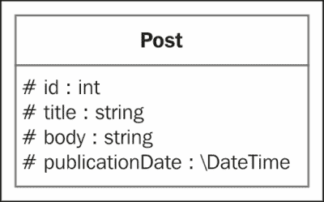

# 二、实体及映射信息

在上一章中，我们发现了条令背后的概念，我们学习了如何使用 Composer 安装它，我们设置了条令命令行工具，并深入到实体管理器。

在本章中，我们将介绍以下主题：

*   创建第一个实体类
*   将其映射到相关的数据库表和带有注释的列
*   使用条令提供的命令助手自动生成数据库模式
*   创建一些 fixture 数据并处理实体管理器以在 web 用户界面中显示数据

因为我们正在构建一个 blog，所以我们的主要实体类将被称为`Post`，如下图所示：



我们的`Post`实体类具有以下四个属性：

*   `id`：数据库表（和博客）中帖子的唯一标识符
*   `title`：职位名称
*   `body`：岗位主体
*   `publicationDate`：该帖子的发布日期

# 创建实体类

如[第 1 章](1.html "Chapter 1. Getting Started with Doctrine 2")、*开始学习条令 2*所述，条令实体只是一个 PHP 对象，将保存在数据库中。在实体类属性的 PHP`DocBlock`注释中添加了条令注释。条令使用注释将对象映射到相关数据库的表，并将属性映射到列。

### 注

**DocBlocks**的最初目的是将技术文档直接集成到源代码中。解析 DocBlocks 的最流行的文档生成器是**phpDocumentator**，可从以下网站获得：[http://www.phpdoc.org](http://www.phpdoc.org) 。

每个实体一旦通过条令持久化，就会和数据库表中的一行相关。

创建一个新文件`Post.php`，在`src/Blog/Entity/`位置包含我们的实体类，代码如下：

```php
  <?php

  namespace Blog\Entity;

  use Doctrine\ORM\Mapping\Entity;
  use Doctrine\ORM\Mapping\Table;
  use Doctrine\ORM\Mapping\Index;
  use Doctrine\ORM\Mapping\Id;
  use Doctrine\ORM\Mapping\GeneratedValue;
  use Doctrine\ORM\Mapping\Column;

  /**
   * Blog Post entity
   *
   * @Entity
   * @Table(indexes={
   * @Index(name="publication_date_idx",    columns="publicationDate")
   * })
   */
  class Post
  {
    /**
     * @var int
     *
     * @Id
     * @GeneratedValue
     * @Column(type="integer")
     */
    protected $id;
    /**
     * @var string
     *
     * @Column(type="string")
     */
    protected $title;
    /**
     * @var string
     *
     * @Column(type="text")
     */
    protected $body;
    /**
     * @var \DateTime
     *
     * @Column(type="datetime")
     */
    protected $publicationDate;
  }
```

# 生成 getter 和 setter

我们在[第 1 章](1.html "Chapter 1. Getting Started with Doctrine 2")、*开始学习第 2 章*中配置的条令命令行工具包括一个有用的命令，它为我们生成实体类的 getter 和 setter 方法。我们将使用它来避免编写`Post`类的代码。

运行以下命令以生成应用程序所有实体类的 getter 和 setter：

```php
 php vendor/bin/doctrine.php orm:generate:entities src/

```

### 注

如果您有多个实体，并且不想为所有实体生成 getter 和 setter，请在`orm:generate:entities`命令中使用`filter`选项。

# 带条令注释的映射

`Post`是一个简单的类，具有四个属性。`$id`的 setter 实际上没有生成。条令直接在实体水合阶段填充`$id`实例变量。稍后我们将看到如何将 ID 生成委托给 DBMS。

条令注释是使用`use`语句从`\Doctrine\ORM\Mapping`名称空间导入的。它们在 DocBlocks 中用于向类及其属性添加映射信息。DocBlocks 只是一种特殊的注释，以`/**`开头。

## 了解@Entity 注释

类级 DocBlock 中使用了`@Entity`注释来指定该类为实体类。

此注释最重要的属性是`repositoryClass`。它允许指定自定义实体存储库类。我们将在[第 4 章](4.html "Chapter 4. Building Queries")、*构建查询*中学习实体存储库，包括如何创建自定义存储库。

## 理解@Table、@Index 和@UniqueConstraint 注释

`@Table`注释是可选的。它可用于向与实体类相关的表中添加一些映射信息。

相关数据库表名称默认为实体类名称。这里是`Post`。可以使用注释的`name`属性进行更改。这是一个让 Doctrine 自动生成表名和列名的良好实践，但更改它们以匹配预先存在的模式可能会很有用。

如您所见，我们使用`@Table`注释在基础表上创建索引。为此，我们使用一个名为`indexes`的属性，该属性包含一个索引列表。每个索引由一个`@Index`注释定义。每个`@Index`必须包含以下两个属性：

*   `name`：索引的名称
*   `columns`：索引列列表

对于`Post`实体类，我们在`publicationDate`列上创建一个名为`publication_date_idx`的索引。

`@Table`注释的最后一个可选属性是`uniqueConstraints`（此处不使用）。它允许在列和列组上创建 SQL 级别的唯一约束。它的语法类似于`@Index:name`来命名约束，`columns`来指定应用约束的列。

此属性仅由模式生成器使用。即使使用了属性，条令也不会自动检查表中的值是否唯一。底层 DBMS 将执行此操作，但它可能会导致 DBMS 级别的 SQL 错误。如果我们想要强制执行数据的唯一性，我们应该在保存新数据之前执行检查。

## 跳入@Column 注释

由于注释`@Column`，每个属性都映射到一个数据库列。

映射的数据库列的名称默认为属性名称，但可以使用`name`参数进行更改。至于表名，最好让条令自己生成名称。

### 注

与表名一样，列名将默认为实体类属性名（如果正确遵循 PSR 样式，则为驼峰式）。

条令还附带了下划线命名策略（例如，与名为`MyEntity`的类相关的数据库表将是`my_entity`，并且可以编写自定义策略。

在条令文档[中了解更多信息 http://docs.doctrine-project.org/en/latest/reference/namingstrategy.html](http://docs.doctrine-project.org/en/latest/reference/namingstrategy.html)

若一个属性并没有标注`@Column`注释，则条令将忽略它。

其`type`属性表示该列的原则映射类型（见下一节）。它是此批注唯一必需的属性。

此注释支持更多属性。与所有其他注释一样，条令文档中提供了受支持属性的完整列表。最重要的属性如下：

*   `unique`：如果为`true`，则该列的值在相关数据库表中必须是唯一的
*   `nullable`：如果为`false`，则该值可以为`NULL`。默认情况下，列不能为`NULL`。
*   `length`：用于`string`类型的值的列的长度
*   `scale`：用于`decimal`类型值的列的刻度
*   `precision`：`decimal`类型值的列精度

至于`@Table`，原则不使用`@Column`注释的属性来验证数据。这些属性仅用于映射和生成数据库架构。没别的了。出于安全和用户体验的原因，您必须验证用户提供的每一条数据。这本书不涉及这个话题。如果您不想手动处理数据验证，请尝试使用[中的 Symfony Validator 组件http://symfony.com/components/Validator](http://symfony.com/components/Validator) 。

### 注

也可以使用生命周期事件（参见[第 5 章](5.html "Chapter 5. Going Further")、*进一步*来处理数据验证：[http://docs.doctrine-project.org/projects/doctrine-orm/en/latest/cookbook/validation-of-entities.html](http://docs.doctrine-project.org/projects/doctrine-orm/en/latest/cookbook/validation-of-entities.html)

## 了解@Id 和@GeneratedValue 注释

`$id`属性有点特殊。这是一个映射到整数的列，但这主要是对象的唯一标识符。

通过`@Id`注释，此列将作为表的主键。

默认情况下，开发人员有责任确保此属性的值在整个表中是唯一的。几乎所有 DBMS 都提供了在插入新行时自动增加标识符的机制。`@GeneratedValue`注释利用了这一点。当属性标记为`@GeneratedValue`时，条令将把标识符的生成委托给底层 DBMS。

### 注

其他 ID 生成策略可在[中找到 http://docs.doctrine-project.org/en/latest/reference/basic-mapping.html#identifier-生成策略](http://docs.doctrine-project.org/en/latest/reference/basic-mapping.html#identifier-generation-strategies)。

条令还支持复合主键。只需在复合主键的所有列中添加一个`@Id`注释。

我们将在[第 3 章](3.html "Chapter 3. Associations")、*关联*中研究另一个使用唯一字符串作为标识符的示例。

## 使用其他注释

存在许多条令映射注释。我们将使用[第 3 章](3.html "Chapter 3. Associations")、*关联*中的一些新注释来创建实体之间的关系。

可用注释的完整列表见[的条令文件 http://docs.doctrine-project.org/projects/doctrine-orm/en/latest/reference/annotations-reference.html](http://docs.doctrine-project.org/projects/doctrine-orm/en/latest/reference/annotations-reference.html) 。

# 理解条令映射类型

`@Column`注释中使用的条令映射类型既不是SQL 类型，也不是 PHP 类型，但它们都映射到这两种类型。对于实例，条令`text`类型将被强制转换为实体中的`string`PHP 类型，并以`CLOB`类型存储在数据库列中。

以下是 PHP 类型和 SQL 类型的原则映射类型对应表：

<colgroup><col style="text-align: left"> <col style="text-align: left"> <col style="text-align: left"></colgroup> 
| 

条令映射类型

 | 

PHP 类型

 | 

SQL 类型

 |
| --- | --- | --- |
| `string` | `string` | `VARCHAR` |
| `integer` | `integer` | `INT` |
| `smallint` | `integer` | `SMALLINT` |
| `bigint` | `string` | `BIGINT` |
| `boolean` | `boolean` | `BOOLEAN` |
| `decimal` | `double` | `DECIMAL` |
| `date` | `\DateTime` | `DATETIME` |
| `time` | `\DateTime` | `TIME` |
| `datetime` | `\DateTime` | `DATETIME`或`TIMESTAMP` |
| `text` | `string` | `CLOB` |
| `object` | 对象采用`serialize()` 和`unserialize()` 方法 | `CLOB` |
| `array` | `array`使用 `serialize()`和`unserialize()`方法 | `CLOB` |
| `float` | `double` | `FLOAT`（双精度） |
| `simple_array` | `array`使用`implode()`和`explode()`值不能包含逗号。 | `CLOB` |
| `json_array` | `object`使用 `json_encode()`和`json_decode()`方法 | `CLOB` |
| `guid` | `string` | `GUID`或`UUID`如果 DBMS 支持，则`VARCHAR`或 |
| `blob` | `resource stream`（见[http://www.php.net/manual/en/language.types.resource.php](http://www.php.net/manual/en/language.types.resource.php) | `BLOB` |

### 注

请记住，我们可以创建自定义类型。欲了解更多信息，请参阅：[http://docs.doctrine-project.org/en/latest/cookbook/custom-mapping-types.html](http://docs.doctrine-project.org/en/latest/cookbook/custom-mapping-types.html)

# 创建数据库架构

Doctrine 足够聪明，可以生成实体映射信息对应的数据库模式。

### 注

最好总是先设计实体，然后再生成相关的数据库模式。

为此，我们将再次使用第一章中安装的命令行工具。在项目的根目录中键入以下命令：

```php
 php vendor/bin/doctrine.php orm:schema-tool:create

```

必须在终端中打印以下文本：

**注意：此操作不应在生产环境中执行。**

**正在创建数据库架构。。。**

**数据库架构创建成功！**

在数据库中创建了一个名为`Post`的新表。您可以使用 SQLite 客户端显示生成表的结构：

```php
 sqlite3 data/blog.db ".schema Post"

```

它应返回以下查询：

```php
  CREATE TABLE Post (id INTEGER NOT NULL, title VARCHAR(255) NOT NULL, body CLOB NOT NULL, publicationDate DATETIME NOT NULL, PRIMARY KEY(id));
  CREATE INDEX publication_date_idx ON Post (publicationDate);
```

下面的屏幕截图是 table Post 的结构：


条令还能够为 MySQL 和其他受支持的 DBMS 生成模式。如果我们将应用程序配置为使用 MySQL 服务器作为 DBMS，并运行相同的命令，则生成的表将类似于以下屏幕截图：


# 安装数据固定装置

**装置**是假数据，允许测试应用程序，而无需在每次安装后手动创建数据的繁琐任务。它们对于自动化测试过程非常有用，并使新开发人员更容易开始处理我们的项目。

### 注

任何应用程序都应包含自动测试。我们正在构建的博客应用程序包含在行为（[中 http://behat.org/](http://behat.org/) 试验。它们在 Packt 网站上的下载中提供。

条令有一个称为数据装置的扩展，可以简化装置的创建。我们将安装并使用它创建一些虚假的博客帖子。

在项目根目录中键入此命令，通过 Composer 安装条令数据装置：

```php
  php composer.phar require doctrine/data-fixtures:1.0.*
```

使用条令数据装置的第一步是创建装置类。在`src/Blog/DataFixtures`目录中创建一个名为`LoadPostData.php`的文件，如下代码所示：

```php
  <?php

  namespace Blog\DataFixtures;

  use Blog\Entity\Post;
  use Doctrine\Common\DataFixtures\FixtureInterface;
  use Doctrine\Common\Persistence\ObjectManager;

  /**
   * Post fixtures
   */
  class LoadPostData implements FixtureInterface
  {
    /**
     * Number of posts to add
     */
    const NUMBER_OF_POSTS = 10;

    /**
     * {@inheritDoc}
     */
    public function load(ObjectManager $manager)
    {
        for ($i = 1; $i <= self::NUMBER_OF_POSTS; $i++) {
            $post = new Post();
            $post
                setTitle(sprintf('Blog post number %d', $i))
                setBody(<<<EOTLorem ipsum dolor sit amet, consectetur adipiscing elit.EOT
                )
                setPublicationDate(new \DateTime(sprintf('-%d days', self::NUMBER_OF_POSTS - $i)))
            ;

            $manager->persist($post);
        }

        $manager->flush();
    }
}
```

此`LoadPostData`类包含创建伪数据的逻辑。它创建了十篇带有生成标题、发布日期和正文的博客文章。

`LoadPostData`类实现在`\Doctrine\Common\DataFixtures\FixtureInterface`目录中定义的`load()`方法。此方法接受`EntityManager`实例的参数：

*   [第 1 章](1.html "Chapter 1. Getting Started with Doctrine 2")的一些提醒，*开始学习条令 2*：调用`EntityManager::persist()`将每个新实体的状态设置为托管状态
*   在流程结束时，对`flush()`方法的调用将使条令执行`INSERT`查询，以有效地将数据保存在数据库中

我们仍然需要为 fixtures 类创建一个加载程序。在项目的`bin/`目录中创建一个名为`load-fixtures.php`的文件，代码如下：

```php
  <?php

  require_once __DIR__.'/../src/bootstrap.php';

  use Doctrine\Common\DataFixtures\Loader;
  use Doctrine\Common\DataFixtures\Purger\ORMPurger;
  use Doctrine\Common\DataFixtures\Executor\ORMExecutor;

 $loader = new Loader();
 $loader->loadFromDirectory(__DIR__.'/../src/Blog/DataFixtures');

 $purger = new ORMPurger();
 $executor = new ORMExecutor($entityManager, $purger);
  $executor->execute($loader->getFixtures());
```

在这个实用程序中，我们初始化我们的应用程序并获得一个实体管理器，如[第 1 章](1.html "Chapter 1. Getting Started with Doctrine 2")、*开始学习条令 2*中所述。然后，我们实例化 Doctrine Data fixtures 提供的 fixtures 加载程序，并告诉它在哪里可以找到 fixtures 文件。

我们现在只有`LoadPostData`类，但我们将在下一章中创建额外的装置。

`ORMExecutor`方法被实例化并执行。它使用`ORMPurger`从数据库中删除现有数据。然后用我们的装置填充数据库。

在我们项目的根目录中运行以下命令以加载我们的装置：

```php
 php bin/load-fixtures.php

```

我们的设备已插入数据库。请注意，每次运行此命令时，数据库中的所有数据都将被永久删除。

检查数据库是否已使用以下命令填充：

```php
 sqlite3 data/blog.db "SELECT * FROM Post;"

```

您将看到十行类似于以下内容：

**1 |博文编号 1 | Lorem ipsum dolor sit amet，Concetetur Adipising Elite.| 2013-11-08 20:01:13**

**2 |博文编号 2 | Lorem ipsum dolor sit amet，Concetetur Adipising Elite.| 2013-11-09 20:01:13**

# 创建一个简单的用户界面

我们将创建一个简单的 UI 来处理我们的帖子。这个界面将允许我们创建、检索、更新和删除博客文章。您可能已经猜到，我们将使用实体管理器来实现这一点。

为了简洁起见，并侧重于原则部分，此 UI 将有许多缺点。*不应在任何类型的生产或公共服务器*中使用。主要关注点如下：

*   **根本不安全**：没有认证系统，没有数据验证，没有 CSRF 保护，每个人都可以访问任何东西
*   **设计糟糕**：没有分离关注点，没有使用类似 MVC 的模式，没有 REST 架构，没有面向对象的代码，等等。

当然，这将是…图形上的极简主义！

*   跨站点请求伪造（CSRF）：[http://en.wikipedia.org/wiki/Cross-site_request_forgery](http://en.wikipedia.org/wiki/Cross-site_request_forgery)
*   关注点的分离：[http://en.wikipedia.org/wiki/Separation_of_concerns](http://en.wikipedia.org/wiki/Separation_of_concerns)
*   模型-视图-控制器（MVC）元模式：[http://en.wikipedia.org/wiki/Model-view-controller](http://en.wikipedia.org/wiki/Model-view-controller)
*   代表性状态转移（REST）：[http://en.wikipedia.org/wiki/Representational_state_transfer](http://en.wikipedia.org/wiki/Representational_state_transfer)

对于现实世界的应用程序，您应该看看 Symfony，它是一个强大的框架，包括原则和大量功能（已经提供的验证组件、表单框架、模板引擎、国际化系统等等）：[http://symfony.com/](http://symfony.com/)

## 挂牌帖子

也就是说，创建页面，在`web/index.php`文件中列出帖子，代码如下：

```php
  <?php

  /**
   * Lists all blog posts
   */

  require_once __DIR__.'/../src/bootstrap.php';

  /** @var $posts \Blog\Entity\Post[] Retrieve the list of all blog posts */
  $posts = $entityManager->getRepository('Blog\Entity\Post')-    >findAll();
  ?>

  <!DOCTYPE html>
  <html>
  <head>
    <meta charset="utf-8">
    <title>My blog</title>
  </head>
  <body>
  <h1>My blog</h1>

 <?php foreach ($posts as $post): ?>
    <article>
        <h1>
            <?=htmlspecialchars($post->getTitle())?>
        </h1>
        Date of publication: <?=$post->getPublicationDate()->format('Y-m-d H:i:s')?>

        <p>
            <?=nl2br(htmlspecialchars($post->getBody()))?>
        </p>

        <ul>
            <li>
                <a href="edit-post.php?id=<?=$post->getId()?>">Edit this post</a>
            </li>
            <li>
                <a href="delete-post.php?id=<?=$post->getId()?>">Delete this post</a>
            </li>
        </ul>
    </article>
  <?php endforeach ?>
  <?php if (empty($posts)): ?>
    <p>
        No post, for now!
    </p>
  <?php endif ?>

  <a href="edit-post.php">
    Create a new post
  </a>
  </html>
```

第一个文件是博客的主页。它列出了所有帖子，并显示指向创建、更新或删除帖子页面的链接。

在应用程序初始化之后，我们使用我们在第一章中编写的配置命令行工具的代码得到一个`EntityManager`。

我们使用这个`EntityManager`来检索`\Blog\Entity\Post`实体的存储库。现在，我们使用由条令提供的默认实体存储库。我们将在[第 4 章](4.html "Chapter 4. Building Queries")、*建筑查询*中了解更多信息。此默认存储库提供了一个`findAll()`方法，用于从数据库检索所有实体的集合。

### 注

`Collection`接口类似于常规 PHP 数组（有一些增强）。该类为普通条令的一部分：[http://www.doctrine-project.org/api/common/2.4/class-Doctrine.Common.Collections.Collection.html](http://www.doctrine-project.org/api/common/2.4/class-Doctrine.Common.Collections.Collection.html)

调用时，条令将查询数据库以查找`Post`表的所有行，并用检索到的数据填充`\Blog\Entity\Post`对象集合。此集合被分配给`$posts`变量。

要浏览此页面，请在项目的根目录中运行以下命令：

```php
  php -S localhost:8000 -t web/
```

它运行内置的 PHP Web 服务器。在你最喜欢的网络浏览器中点击`http://localhost:8000`，你会看到我们的十篇假文章。

### 注

如果不起作用，请确保您的 PHP 版本至少为 5.4。

## 创建和编辑帖子

是时候创建一个页面来添加新的博客帖子了。此页面还将允许编辑现有的帖子。将其放入`web/edit-post.php`文件中，如下代码所示：

```php
  <?php

  /**
   * Creates or edits a blog post
   */

  use Blog\Entity\Post;

  require_once __DIR__.'/../src/bootstrap.php';

  // Retrieve the blog post if an id parameter exists
  if (isset ($_GET['id'])) {
    /** @var Post $post The post to edit */
    $post = $entityManager->find('Blog\Entity\Post', $_GET['id']);

    if (!$post) {
        throw new \Exception('Post not found');
    }
}

  // Create or update the blog post
  if ('POST' === $_SERVER['REQUEST_METHOD']) {
    // Create a new post if a post has not been retrieved and set its date of publication
    if (!isset ($post)) {
 $post = new Post();
        // Manage the entity
 $entityManager->persist($post);

 $post->setPublicationDate(new \DateTime());
    }

 $post
 ->setTitle($_POST['title'])
 ->setBody($_POST['body'])
 ;

    // Flush changes to the database
 $entityManager->flush();

    // Redirect to the index
    header('Location: index.php');
    exit;
}

  /** @var string Page title */
  $pageTitle = isset ($post) ? sprintf('Edit post #%d', $post->getId()) : 'Create a new post';
  ?>

  <!DOCTYPE html>
  <html>
  <head>
    <meta charset="utf-8">
    <title><?=$pageTitle?> - My blog</title>
  </head>
  <body>
  <h1>
    <?=$pageTitle?>
  </h1>

  <form method="POST">
    <label>
        Title
        <input type="text" name="title" value="<?=isset ($post) ? htmlspecialchars($post->getTitle()) : ''?>" maxlength="255" required>
    </label><br>

    <label>
        Body
        <textarea name="body" cols="20" rows="10" required><?=isset ($post) ? htmlspecialchars($post->getBody()) : ''?></textarea>
    </label><br>

    <input type="submit">
  </form>

  <a href="index.php">Back to the index</a>
```

这一页有点棘手：

*   When called with an `id` parameter in the URL, it works on the `Post` entity with the given ID

    ### 注

    最好的做法是使用 slug 而不是标识符。它们隐藏了应用程序的内部，可以被人类记忆，并且更适合搜索引擎优化：[http://en.wikipedia.org/wiki/Slug_（出版）](http://en.wikipedia.org/wiki/Slug_(publishing))。

*   在没有`id`参数的情况下，实例化一个新的`Post`实体
*   当使用`GET`HTTP 方法调用时，在编辑的情况下，它会显示一个填充了`Post`当前数据的表单
*   当使用`Post`HTTP 方法调用时（表单提交时），它会创建或更新一个`Post`实体，然后重定向到博客的主页

如果通过 URL提供了一个 ID，则实体管理器的`find()`方法将使用该 ID 检索存储在数据库中的实体。条令将查询数据库并为我们检索实体。

如果未找到具有此 ID 的`Post`，则将`NULL`值分配给`$post`变量，而不是`\Blog\Entity\Post`的实例。为了避免进一步的错误，如果是这种情况，我们会抛出一个异常。要了解有关 PHP 异常的更多信息，请访问网站[http://php.net/manual/en/language.exceptions.php](http://php.net/manual/en/language.exceptions.php) 。

然后，我们使用新实体作为参数调用实体管理器的`persist()`方法。如[第 1 章](1.html "Chapter 1. Getting Started with Doctrine 2")、*开始学习条令 2*中所述，对`persist()`方法的调用将实体的状态设置为托管状态。这仅对新实体是必要的，因为通过条令检索的实体已经具有托管状态。

接下来，我们设置新创建的对象的发布日期。多亏了条令映射系统，我们只需要将一个`\DateTime`实例传递给`setPublicationDate()`方法，ORM 就会将其转换为 DBMS 为我们所需的格式（参见类型对应表）。

我们还使用前面生成的 getter 和 setter 的 fluent 接口设置了`$title`和`$body`属性。

### 注

如果您不了解 fluent 界面，请阅读以下文章：[http://martinfowler.com/bliki/FluentInterface.html](http://martinfowler.com/bliki/FluentInterface.html)

当调用`flush()`方法时，实体管理器告诉条令将所有受管实体同步到数据库。在这种情况下，只管理我们的`Post`实体。如果是新实体，将生成一条`INSERT`SQL 语句。如果是现有实体，则会向 DBMS 发送一条`UPDATE`语句。

默认情况下，当在事务中调用`EntityManager::flush()`方法时，条令自动包装完成的所有操作。如果发生错误，数据库状态将恢复为刷新调用（回滚）之前的状态。

这通常是最佳选项，但如果您有特定需求，可以停用此自动提交模式。这可参考[http://docs.doctrine-project.org/en/latest/reference/transactions-and-concurrency.html](http://docs.doctrine-project.org/en/latest/reference/transactions-and-concurrency.html) 。

## 删除帖子

让我们创建一个页面来删除`web/delete-post.php`文件中的帖子：

```php
  <?php

  /**
   * Deletes a blog post
   */

  require_once __DIR__.'/../src/bootstrap.php';

  /** @var Post The post to delete */
 $post = $entityManager->find('Blog\Entity\Post', $_GET['id']);
  if (!$post) {
    throw new \Exception('Post not found');
  }

  // Delete the entity and flush
 $entityManager->remove($post);
 $entityManager->flush();

  // Redirects to the index
  header('Location: index.php');
  exit;
```

我们使用 URL 中的 ID 参数检索要删除的帖子。我们告诉条令通过调用`EntityManager::remove()`方法来安排删除它。在此调用之后，实体的状态将被删除。调用`flush()`方法时，条令执行`DELETE`SQL 查询以从数据库中删除数据。

### 注

注意，在调用`flush()`方法并从数据库中删除之后，实体仍然存在于内存中。

# 总结

我们现在有一个最小，但工作的博客应用程序！多亏了信条，将数据持久化、检索和删除到数据库从未如此容易。

我们已经学习了如何使用注释将实体类映射到数据库表和行，我们在不键入 SQL 的情况下生成了数据库模式，我们创建了 fixture，并使用实体管理器将数据与数据库同步。

在下一章中，我们将学习如何映射和管理实体之间的一对一、一对多/多对一以及多对多关联。