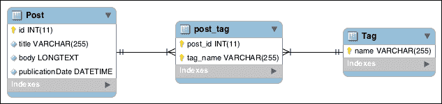

# 第三章社团

在上一章中，我们学习了如何使用条令注释向实体类添加映射信息。我们使用了条令命令行工具提供的代码和数据库模式生成器，并创建了一个极简博客软件，它使用`EntityManager`类来创建、更新、删除和显示博客文章。

在第三章中，我们将通过以下主题学习如何处理实体之间的关联：

*   从学说协会开始
*   使用注释系统理解@manytone 和@OneToMany 注释
*   理解带有标记的@ManyToMany 注释

# 开始学习教义协会

我们将使用注释指定条令关联，如其他映射信息（也支持 XML 和 YAML 配置文件等其他方法，请参见[第 2 章](2.html "Chapter 2. Entities and Mapping Information")、*实体和映射信息*。条令支持以下关联类型：

*   **一对一**：一个实体链接到一个实体
*   **多对一**：多个实体链接到一个实体（仅适用于双向关联，始终为一对多关联的反向侧）
*   **一对多**：一个实体链接多个实体
*   **多对多**：多个实体链接到多个实体

关联可以是单向的，也可以是双向的。单向关联仅具有拥有方，而双向关联同时具有拥有方和反向。换句话说，它们可以解释如下：

*   单向关联只能以一种方式使用：可以从主实体中检索相关实体。例如，用户具有关联的地址。可以从用户检索地址，但无法从地址检索用户。
*   双向关联可以通过两种方式使用：相关实体可以从主实体中检索，主实体可以从相关实体中检索。例如，用户具有关联的订单。可以从用户检索订单，也可以从订单检索用户。

条令只管理协会的拥有方。这意味着您始终需要设置拥有方；否则，如果只设置关联的反向端，`EntityManager`类不会将其持久化。

有一种简单的方法可以识别双向关联的一侧。拥有方必须具有`inversedBy`属性，而反向方必须具有`mappedBy`属性。这些属性引用相关的实体类。

默认情况下，使用存储相关 ID 和外键的列在 SQL 级别持久化一对一和多对一关联。多对多关联始终使用关联表。

列和表的名称（如果适用）由条令自动生成。可以使用`@JoinColumn`注释更改名称，也可以使用注释`@JoinTable`强制使用关联表。

# 通过注释系统理解@manytone 和@OneToMany 注释

让我们从评论开始。我们博客的访问者应该能够对我们的帖子做出反应。我们必须创建一个新的`Comment`条令实体类型来存储读者的评论。`Comment`实体将链接到一个`Post`实体。一篇文章可以有许多评论，一条评论与一篇文章相关联。

下面的E-R 图表示将使用映射信息生成的 MySQL模式：


## 创建注释实体类（拥有方）

`Comment`主体具有以下四个属性：

*   `id`：这是评论的唯一标识符
*   `body`：表示评论文本
*   `publicationDate`：这是评论发表的日期
*   `post_id`：表示与评论相关的帖子

下面是`Comment`实体的第一个代码片段，包含带注释的属性。它必须放在`src/Blog/Entity/`位置的`Comment.php`文件中。

```php
<?php

namespace Blog\Entity;

use Doctrine\ORM\Mapping\Entity;
use Doctrine\ORM\Mapping\Id;
use Doctrine\ORM\Mapping\GeneratedValue;
use Doctrine\ORM\Mapping\Column;
use Doctrine\ORM\Mapping\ManyToOne;

/**
 * Comment entity
 *
 * @Entity
 */
class Comment
{
    /**
     * @var int
     *
     * @Id
     * @GeneratedValue
     * @Column(type="integer")
     */
    protected $id;
    /**
     * @var string
     *
     * @Column(type="text")
     */
    protected $body;
    /**
     * @var \DateTime
     *
     * @Column(type="datetime")
     */
    protected $publicationDate;
    /**
     * @var Post
     *
     * @ManyToOne(targetEntity="Post", inversedBy="comments")
     */
    protected $post;
}
```

此实体类类似于[第 2 章](2.html "Chapter 2. Entities and Mapping Information")、*实体和映射信息*中创建的`Post`实体类。我们使用`@ManyToOne`注释在`Comment`和`Post`实体之间创建多对一关联。使用`targetEntity`属性指定相关实体类。此属性对于每个关联都是必需的。

为了能够直接从`Post`实体检索注释，此关联必须是双向的。`inversedBy`属性将此关联标记为双向关联，并指示拥有此关联反向端的`Post`实体类的属性。这里，这是`Post`的属性。

### 注

对于每个具有`private`或`protected`属性的实体类，`Comment`类必须公开 getter 和 setter 才能访问它们。我们将在本章后面为应用程序的每个实体类生成 getter 和 setter。

## 向 Post 实体类添加反向边

现在，我们需要修改`Post`实体类，以添加此关联的反向端。需要执行以下步骤：

1.  在`src/Blog/Entity/`位置打开`Post.php`文件，添加前面代码段中的 use 语句：

    ```php
      use Doctrine\ORM\Mapping\OneToMany;
      use Doctrine\Common\Collections\ArrayCollection;
    ```

2.  添加`$comments`属性，如下代码段所示：

    ```php
        /**
         * @var Comment[]
         *
         * @OneToMany(targetEntity="Comment", mappedBy="post")
         */
        protected $comments;
    ```

3.  在构造函数中添加其初始化代码，如下一个代码段所示：

    ```php
        /**
         * Initializes collections
         */
        public function __construct()
        {
            $this->comments = new ArrayCollection();
        }
    ```

4.  使用条令命令行工具提供的实体生成器来创建我们刚刚添加到`Comment`和`Post`类中的属性的 getter 和 setter:

    ```php
    php vendor/bin/doctrine.php orm:generate:entities src/

    ```

5.  在生成的`addComment()`方法中，添加以下代码段的高亮行，自动设置关联的归属方：

    ```php
        public function addComment(\Blog\Entity\Comment$comments)
        {
            $this->comments[] = $comments;
            $comments->setPost($this);

            return $this;
        }
    ```

`$comments`属性保存与`Post`实体相关联的注释集合。我们使用`@OneToMany`注释将该属性标记为关联的反面，在`Comment`的`$post`属性中定义。我们已经解释了`targetEntity`属性。`mappedBy`属性相当于关联反面的`inversedBy`属性。它指示拥有关联另一端的相关实体类的属性。

为了使条令能够正确管理元素集合，必须使用条令通用组件提供的特殊类。`Post`实体的`$comments`属性在构造函数中初始化为`Doctrine\Common\Collections\ArrayCollection`的实例。`ArrayCollection`实现`Doctrine\Common\Collections\Collection`接口。这将使条令能够填充和管理集合。

条令`Collection`类实现`Countable`、`IteratorAggregate`和`ArrayAccess`接口（这些接口在 PHP 或 SPL 中预定义）。这样，条令集合就可以像标准 PHP 数组一样使用，并在 foreach 循环中透明地迭代。

### 注

有关预定义接口和标准 PHP 库（SPL）提供的接口的更多信息，请参阅以下 PHP 手册：

[http://php.net/manual/en/reserved.interfaces.php](http://php.net/manual/en/reserved.interfaces.php) 和[http://php.net/manual/en/spl.interfaces.php](http://php.net/manual/en/spl.interfaces.php)

条令命令行工具生成的`addComment()`和`removeComment()`方法演示了使用条令`Collection`类的方法添加和删除项目的方法。

### 注

可用方法的完整列表记录在条令网站上，如下所示：

[http://docs.doctrine-project.org/en/latest/reference/working-with-associations.html](http://docs.doctrine-project.org/en/latest/reference/working-with-associations.html)

正如已经解释的，另一件重要的事情是，条令只管理协会的拥有方。这就是为什么我们在`addComment()`方法中称`Comment`实体的`setPost()`方法。这允许从相反的方面保持关联。

### 注

仅当实体的更改跟踪策略是延迟隐式的（默认情况下是这种情况）时，此操作才有效。延迟隐式策略是最方便使用的策略，但可能会对性能产生负面影响。

同样，请参考以下网站上的条令文件，以了解有关可使用的不同变更跟踪政策的更多信息：

[http://docs.doctrine-project.org/en/latest/reference/change-tracking-policies.html](http://docs.doctrine-project.org/en/latest/reference/change-tracking-policies.html)

稍后，我们将更新 UI 以添加注释功能。首先，必须更新数据库架构。

## 更新数据库架构

与其他注释一样，Doctrine 能够自动创建在 SQL 层存储关联所需的列和外键。再次运行与命令行工具捆绑的`orm:schema-tool:update`命令，如下所示：

```php
php vendor/bin/doctrine.php orm:schema-tool:update --force

```

条令将自动检测对映射所做的更改，并相应地更新 SQL 模式。可以添加`--force`标志以有效执行查询。

### 注

`orm:schema-tool:update`命令不得在生产中使用。它可以永久删除数据（例如，当删除列时）。相反，应该使用条令迁移库来正确处理复杂的迁移。即使这个库还不稳定，它也非常方便。我们可以在以下网站上找到该图书馆：

[http://docs.doctrine-project.org/projects/doctrine-migrations/en/latest/reference/introduction.html](http://docs.doctrine-project.org/projects/doctrine-migrations/en/latest/reference/introduction.html)

## 为注释添加固定装置

至于帖子，我们将为评论创建一些固定装置。在`src/Blog/DataFixtures/`位置创建一个新文件`LoadCommentData.php`。下一个代码段用于此目的：

```php
<?php

namespace Blog\DataFixtures;

use Blog\Entity\Comment;
use Doctrine\Common\DataFixtures\DependentFixtureInterface;
use Doctrine\Common\DataFixtures\Doctrine;
use Doctrine\Common\DataFixtures\FixtureInterface;
use Doctrine\Common\Persistence\ObjectManager;

/**
 * Comment fixtures
 */
class LoadCommentData implements FixtureInterface,DependentFixtureInterface
{
    /**
     * Number of comments to add by post
     */
    const NUMBER_OF_COMMENTS_BY_POST = 5;

    /**
     * {@inheritDoc}
     */
    public function load(ObjectManager $manager)
    {
        $posts = $manager->getRepository('Blog\Entity\Post')->findAll();

        foreach ($posts as $post) {
            for ($i = 1; $i <= self::NUMBER_OF_COMMENTS_BY_POST;$i++) {
                $comment = new Comment();
                $comment
                    ->setBody(<<<EOTLorem ipsum dolor sit amet, consectetur adipiscing elit.EOT
                    )
                    ->setPublicationDate(new \DateTime(sprintf('-%ddays', self::NUMBER_OF_COMMENTS_BY_POST - $i)))
                    ->setPost($post)
                ;

                $manager->persist($comment);
            }
        }

        $manager->flush();
    }

    /**
     * {@inheritDoc}
     */
    public function getDependencies()
    {
        return ['Blog\DataFixtures\LoadPostData'];
    }
}
```

我们使用`EntityManager`类检索`Post`实体存储库，然后使用该存储库检索所有帖子。我们在每个帖子中添加五条评论。这个数据夹具类实现了`Doctrine\Common\DataFixtures\DependentFixtureInterface`接口（方法`getDependencies()`。它告诉数据加载器首先加载`LoadPostData`，因为此数据夹具类依赖于它。

## 列出并创建注释

是时候更新用户界面了。在`web/`位置创建文件`view-post.php`。此页面显示一篇包含所有评论的文章和一个添加新评论的表单，并处理评论创建。

检索帖子和处理注释创建的代码如下：

```php
<?php

/**
 * View a blog post
 */

use Blog\Entity\Comment;

require_once __DIR__ . '/../src/bootstrap.php';
/** @var \Blog\Entity\Post $post The post to edit */
$post = $entityManager->find('Blog\Entity\Post', $_GET['id']);

if (!$post) {
    throw new \Exception('Post not found');
}

// Add a comment
if ('POST' === $_SERVER['REQUEST_METHOD']) {
    $comment = new Comment();
    $comment
        ->setBody($_POST['body'])
        ->setPublicationDate(new \DateTime())
        ->setPost($post)
    ;

    $entityManager->persist($comment);
    $entityManager->flush();

    header(sprintf('Location: view-post.php?id=%d', $post->getId()));
    exit;
}
?>
```

正如你所看到的，管理与教义的简单关联是容易的。设置一个关系就像调用一个 setter 一样简单，该 setter 带有参数中链接的实体。可以使用 getter 访问相关实体。显示帖子详细信息、相关评论以及发布新评论的表单（将其放在同一文件的底部）的代码如下：

```php
<!DOCTYPE html>
<html>
<head>
    <meta charset="utf-8">
    <title><?=htmlspecialchars($post->getTitle())?> - My blog</title>
</head>
<body>

<article>
    <h1>
        <?=htmlspecialchars($post->getTitle())?>
    </h1>
    Date of publication: <?=$post->getPublicationDate()->format('Y-m-d H:i:s')?>
    <p>
        <?=nl2br(htmlspecialchars($post->getBody()))?>
    </p>
    <?php if (count($post->getComments())): ?>
        <h2>Comments</h2>

        <?php foreach ($post->getComments() as $comment): ?>
            <article>
                <?=$comment->getPublicationDate()->format('Y-m-dH:i:s')?>

                <p><?=htmlspecialchars($comment->getBody())?></p>

                <a href="delete-comment.php?id=<?=$comment->getId()?>">Delete this comment</a>
            </article>
        <?php endforeach ?>
    <?php endif ?>

    <form method="POST">
        <h2>Post a comment</h2>

        <label>
            Comment
            <textarea name="body"></textarea>
        </label><br>

        <input type="submit">
    </form>
</article>

<a href="index.php">Back to the index</a>
```

默认情况下，加载相关实体。这意味着，在我们的示例中，条令向DBMS 发送第一个查询以检索帖子，然后在调用`getComments()`时发送另一个查询以检索相关的注释。这样做的好处是，如果不调用`getComments()`方法，则永远不会执行检索关联注释的查询。但是，当总是获取相关的注释时，这是一个无用的开销。

### 注

为了使懒散加载特性能够工作，条令在内部将实体封装到代理类中。代理类负责在请求时获取尚未从数据库加载的关联实体的数据。有关详细信息，请访问：

[http://docs.doctrine-project.org/en/latest/reference/working-with-objects.html#entity-对象图遍历](http://docs.doctrine-project.org/en/latest/reference/working-with-objects.html#entity-object-graph-traversal)

我们可以通过在关联注释上设置一个`fetch`属性来改变这种行为。此属性可以采用以下值：

*   `EAGER`：通常在第一次查询时使用 SQL 连接获取相关实体。
*   `LAZY`：仅当通过另一个 SQL 查询请求时，才会获取相关实体。这是默认值。
*   `EXTRA_LAZY`: This allows performing some operations such as counting on collections that are not already fetched without loading the entire collection in the memory. To learn more about this topic, consult the following tutorial:

    [http://docs.doctrine-project.org/en/latest/tutorials/extra-lazy-associations.html](http://docs.doctrine-project.org/en/latest/tutorials/extra-lazy-associations.html)

加载相关实体的另一种方法是使用条令查询生成器定制生成的请求。我们将在[第 4 章](4.html "Chapter 4. Building Queries")、*构建查询*中演示查询生成器的功能。

通过删除`view-post.php`页面中的评论，我们创建了一个允许删除评论的链接。将代码放入`web/`位置的`delete-comment.php`文件中以使此功能正常工作，如下所示：

```php
<?php

/**
 * Deletes a comment
 */

require_once __DIR__ . '/../src/bootstrap.php';
/** @var Comment $comment The comment to delete */
$comment = $entityManager->find('Blog\Entity\Comment', $_GET['id']);

if (!$comment) {
    throw new \Exception('Comment not found');
}

// Delete the entity and flush
$entityManager->remove($comment);
$entityManager->flush();

// Redirect to the blog post
header(sprintf('Location: view-post.php?id=%d', $comment->getPost()->getId()));
exit;
```

此文件非常类似于[第一章](1.html "Chapter 1. Getting Started with Doctrine 2")中创建的`web/`位置中的`delete-post.php`文件*开始学习条令 2*。它通过`EntityManager`类检索存储库，使用它检索要删除的注释，调用`remove()`，并使用`flush()`将的更改持久化为 DBMS。

## 更新索引

更新`web/`位置中的`index.php`文件，创建指向新的详细帖子视图的链接，如下代码所示：

```php
        <h1>
            <?=htmlspecialchars($post->getTitle())?>
        </h1>
```

要准备好注释功能，请将前面的代码替换为以下代码：

```php
        <h1>
            <a href="view-post.php?id=<?=$post->getId()?>">
                <?=htmlspecialchars($post->getTitle())?>
            </a>
        </h1>
```

# 理解带标签的@manytomy 注释

标签按主题对帖子进行分组。一个标签包含多个帖子，一个帖子有多个标签。这是一个多对多双向关联。条令透明地管理在 SQL 级别存储多对多关系所需的关联表。将生成的 MySQL 架构如以下屏幕截图所示：



## 创建标签实体类（反向侧）

`Tag`实体类只有两个属性：

*   `name`：这是标签的名称，是唯一的，是实体的标识符
*   `posts`：这是与此标签关联的帖子的集合

以下是创建`Tag`实体类的步骤：

1.  使用以下代码段在包含实体类的`src/Blog/Entity/`位置创建一个`Tag.php`文件：

    ```php
    <?php

    namespace Blog\Entity;

    use Doctrine\Common\Collections\ArrayCollection;
    use Doctrine\ORM\Mapping\Entity;
    use Doctrine\ORM\Mapping\Column;
    use Doctrine\ORM\Mapping\Id;
    use Doctrine\ORM\Mapping\ManyToMany;

    /**
     * Tag entity
     *
     * @Entity
     */
    class Tag
    {
        /**
         * @var string
         *
         * @Id
         * @Column(type="string")
         */
        protected $name;
        /**
         * @var Post[]
         *
         * @ManyToMany(targetEntity="Post", mappedBy="tags")
         */
        protected $posts;

        /**
         * Initializes collection
         */
        public function __construct()
        {
            $this->posts = new ArrayCollection();
        }

        /**
         * String representation
         *
         * @return string
         */
        public function __toString()
        {
            return $this->getName();
        }
    }
    ```

2.  使用以下命令生成getter和 setter:

    ```php
    php vendor/bin/doctrine.php orm:generate:entities src/

    ```

3.  在`addPost()`方法`$this->posts[] = $posts;`后增加以下代码行设置关联的归属方：

    ```php
    $posts->addTag($this);
    ```

属性`$name`是`Tag`实体的标识符。与`Post`和`Comment`实体不同，其值不是由 DBMS 自动生成的；这是标签的名字。这就是为什么这里不使用`@GeneratedValue`注释的原因。标记的名称必须是唯一的，并且必须由应用程序设置。

`@ManyToMany`注释用于标记关联。`targetEntity`和`mappedBy`属性的含义与`@OneToMany`注释相同。`@ManyToMany`注释接受反向侧的`mappedBy`属性和拥有侧的`inversedBy`属性。该协会的拥有方为`Post`实体。对于任何条令集合，`$posts`属性在构造函数中初始化。我们还创建了一个`__toString()`方法，返回标记的名称，以便能够将`Tag`的实例转换为字符串。

### 注

`__toString()`魔术方法允许我们将对象转换为字符串。有关更多详细信息，请参阅以下链接：

[http://www.php.net/manual/en/language.oop5.magic.php#object.tostring](http://www.php.net/manual/en/language.oop5.magic.php#object.tostring)

## 更新岗位实体类（所属方）

通过以下步骤修改`src/Blog/Entity/`位置的`Post.php`文件，添加关联的归属方：

1.  添加以下使用说明：

    ```php
    use Doctrine\ORM\Mapping\ManyToMany;
    use Doctrine\ORM\Mapping\JoinTable;
    use Doctrine\ORM\Mapping\JoinColumn;
    ```

2.  使用以下代码段添加`mapped`属性：

    ```php
        /**
         * @var Tag[]
         *
         * @ManyToMany(targetEntity="Tag", inversedBy="posts",fetch="EAGER", cascade={"persist"}, orphanRemoval=true)
         * @JoinTable(
         *      inverseJoinColumns={@JoinColumn(name="tag_name",referencedColumnName="name")}
         * )
         */
        protected $tags;
    ```

3.  在构造函数中初始化属性，如以下代码段所示：

    ```php
        public function __construct()
        {
            // …
            $this->tags = new ArrayCollection();
        }
    ```

4.  要生成 getter 和 setter，可以使用以下命令：

    ```php
    php vendor/bin/doctrine.php orm:generate:entities src/

    ```

这里介绍了`@ManyToMany`注释的两个新属性，即`cascade`和`orphanRemoval`。

默认情况下，设置主实体时，关联实体不会自动设置为托管状态。这必须通过为每个关联实体调用`EntityManager`类的`persist()`方法手动完成。如果将`cascade`属性与`persist`作为值一起使用，则当主实体被持久化时，相关实体将被自动持久化。

这里，当`Post`实体被持久化时，相关标记将被持久化。`cascade`属性可以接受其他值，其中最有用的是`remove`。当使用`remove`时，删除主实体时会删除相关实体。

`CASCADE`操作由**对象关系映射器（ORM）**在内存中处理。它们不等同于 SQL`DELETE CASCADE`操作，并且会占用大量内存。使用它们时应尽量节省，以保持应用程序的性能。

SQL`DELETE CASCADE`操作可以通过`@JoinColumn`注释的`onDelete`属性添加。

当`orphanRemoval`属性设置为`true`时，条令将自动删除不再与主实体链接的实体。如果从`Post`实体的`$tags`集合中删除`Tag`实体，并且该`Post`实体是唯一链接到`Tag`实体的实体，则`Tag`实体将被永久删除。

本章前面已经解释了`fetch`属性。通过`EAGER`值，它告诉 Doctrine 在检索帖子时通过`JOIN`查询自动检索相关标签。这在我们的应用程序中非常有用，因为每次显示帖子时，`Post`实体的标签都会显示出来。

因为`Tag`的标识符没有标注`@GeneratedValue`注释，所以条令无法猜测。`@JoinTable`和`@JoinColumn`注释在这里覆盖默认行为。

我们通过`@JoinTable`的`inverseJoinColumns`属性，为关联的标签相关方（反向方）设置了一个自定义`JOIN`列，其中包含`@JoinColumn`。`@JoinColumn`的`referencedColumnName`属性告诉条令为`Tag`的标识符查找`$name`属性（默认情况下不是`$id`。`name`属性将 SQL 级关联表中包含`Tag`标识符的列的名称设置为`tag_name`（默认为`tag_id`）。

## 再次更新架构

是时候再次更新SQL 模式以匹配我们的更改了。我们在命令行上使用以下命令：

```php
php vendor/bin/doctrine.php orm:schema-tool:update --force

```

## 创建标签固定装置

在`src/Blog/DataFixtures/`处创建一个`LoadTagData.php`文件，其中包含使用以下代码段的标签夹具：

```php
<?php

namespace Blog\DataFixtures;

use Blog\Entity\Tag;
use Doctrine\Common\DataFixtures\DependentFixtureInterface;
use Doctrine\Common\DataFixtures\Doctrine;
use Doctrine\Common\DataFixtures\FixtureInterface;
use Doctrine\Common\Persistence\ObjectManager;

/**
 * Tag fixtures
 */
class LoadTagData implements FixtureInterface,DependentFixtureInterface
{
    /**
     * Number of comments to add by post
     */
    const NUMBER_OF_TAGS = 5;
    /**
     * {@inheritDoc}
     */
    public function load(ObjectManager $manager)
    {
        $tags = [];
        for ($i = 1; $i <= self::NUMBER_OF_TAGS; $i++) {
            $tag = new Tag();
            $tag->setName(sprintf("tag%d", $i));

            $tags[] = $tag;
        }

        $posts = $manager->getRepository('Blog\Entity\Post')->findAll();

        $tagsToAdd = 1;
        foreach ($posts as $post) {
            for ($j = 0; $j < $tagsToAdd; $j++) {
                $post->addTag($tags[$j]);
            }

            $tagsToAdd = $tagsToAdd % 5 + 1;
        }

        $manager->flush();
    }

    /**
     * {@inheritDoc}
     */
    public function getDependencies()
    {
        return ['Blog\DataFixtures\LoadPostData'];
    }
}
```

感谢的`persist`属性，我们可以向帖子添加标签，而无需手动坚持。

在装置完成后，我们必须更新 UI。

## 管理帖子标签

编辑`web/`位置处的`edit-post.php`文件，添加代码管理标签，步骤如下：

1.  在文件顶部添加以下`use`语句：

    ```php
    use Blog\Entity\Tag;
    ```

2.  查找以下代码片段：

    ```php
        $post
            ->setTitle($_POST['title'])
            ->setBody($_POST['body'])
        ;
    ```

3.  在`to extract`后添加此代码，并管理提交的标签：

    ```php
        $newTags = [];
        foreach (explode(',', $_POST['tags']) as $tagName) {
            $trimmedTagName = trim($tagName);
            $tag = $entityManager->find('Blog\Entity\Tag',$trimmedTagName);
            if (!$tag) {
                $tag = new Tag();
                $tag->setName($trimmedTagName);
            }

            $newTags[] = $tag;
        }

        // Removes unused tags
        foreach (array_diff($post->getTags()->toArray(),$newTags) as $tag) {
            $post->removeTag($tag);
        }

        // Adds new tags
        foreach (array_diff($newTags, $post->getTags()->toArray()) as $tag) {
            $post->addTag($tag);
        }
    ```

4.  查找以下代码片段：

    ```php
        <label>
            Body
            <textarea name="body" cols="20" rows="10"required><?=isset ($post) ? htmlspecialchars($post-
            >getBody()) : ''?></textarea>
        </label><br>
    ```

5.  在`to display`之后添加以下表单小部件并更新标签：

    ```php
        <label>
            Tags
            <input type="text" name="tags" value="<?=isset($post) ? htmlspecialchars(implode(', ', $post->getTags()->toArray())) : ''?>" required>
        </label><br>
    ```

每个标记名都是从提交的字符串中提取的。从存储库中检索相应的`Tag`实体，如果未找到，则创建相应的`Tag`实体。

感谢的`toArray()`方法，将`Post`对象的`tag`集合转换为标准 PHP 数组。

标准`array_diff()`功能用于识别删除和添加的`Tag`对象。`array_diff()`的参数必须是可以转换为字符串的对象数组。这里没有问题，因为我们的`Tag`类实现了`__toString()`魔术方法。

删除的标签通过`Post::removeTag()`功能删除，新标签通过`Post::addTag()`添加。

由于`Post`实体类中定义了`CASCADE`属性，我们不需要对每个新标记单独进行保存。

在模板中，标记列表被转换为模式“tagname1、tagname2、tagname3”下的字符串。

# 总结

在本章中，我们学习了如何管理 ORM 原则支持的所有类型的协会。我们学习了单向和双向关联以及拥有方和反向方的概念。我们还使用了在前几章中所学的内容，特别是`EntityManager`类、夹具装入器和生成器。

在下一章中，我们将学习如何使用 DQL 和查询生成器创建复杂查询。

感谢他们，我们将创建按标签分组的帖子列表。我们还将了解聚合函数。