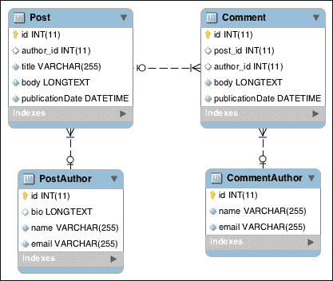
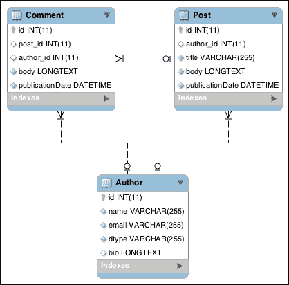

# 五、更进一步

在前几章中，我们学习了 ORM 学说的基础知识。我们现在能够创建复杂的域类、生成底层 SQL 表、加载数据装置和执行高级查询。我们知道开发小型 web 应用程序的模型层所需的一切。

但是，该库提供了更高级的功能。在本章中，我们将简要介绍以前未涉及的各种主题：继承、生命周期回调和本机查询。

# 实现继承

像所有面向对象的编程语言一样，PHP 是在继承概念的基础上设计的；但是，关系数据库并非如此。这是将类映射到表时的常见问题。

ORM 原则提供了以下三种实现继承的方法：

*   映射超类
*   单表继承
*   类表继承

为了了解它们，我们将创建同一模型的三个实现，即面向内容作者的实现。

帖子和评论都有作者。作者必须有姓名和电子邮件地址。波斯特的作者（而且只有他们）也可以有自传。

为了表示这一点，我们将创建两个类：`PostAuthor`和`CommentAuthor`。它们都扩展了一个抽象的`Author`类。每个`Comment`实体链接到`CommentAuthor`类，每个`Post`实体链接到`PostAuthor`类。

## 使用映射超类

映射超类是简单的 PHP 类，它们共享其子实体使用的映射属性。映射的超类本身不是实体。它们由实体扩展。

映射的超类永远不会直接持久化到数据库。它们不能通过查询生成器进行检索，并且不能是关联的反面。

它们与实体扩展的任何其他PHP 类类似，只是它们可以保存将由其后代持久化的属性。

### 注

这种类型的继承不适合这个用例。单表继承在这里更好。

1.  Start by creating the Mapped Superclass. Create a new abstract class called `Author` in the `Author.php` file at the location `src/Blog/Entity/`as shown in the following code:

    ```php
      <?php

      namespace Blog\Entity;

      use Doctrine\ORM\Mapping\MappedSuperclass;
      use Doctrine\ORM\Mapping\Id;
      use Doctrine\ORM\Mapping\GeneratedValue;
      use Doctrine\ORM\Mapping\Column;

      /**
      * Author superclass
      *
      * @MappedSuperclass
      */
      abstract class Author
    {
        /**
         * @var int
         *
         * @Id
         * @GeneratedValue
         * @Column(type="integer")
         */
        protected $id;
        /**
         * @var string
         *
         * @Column(type="string")
         */
        protected $name;
        /**
         * @var string
         *
         * @Column(type="string")
         */
        protected $email;
    }
    ```

    由于`@MappedSuperclass`注释，条令将考虑`PostAuthor`和`CommentAuthor`类继承的`Author`类的映射属性。

2.  Write getters for all the properties and setters for all except the `$id` instance.

    ### 注

    在撰写本文时，条令命令行工具无法为映射的超类生成 getter 和 setter，并且在为子类生成 getter 和 setter 时遇到错误。

3.  Create a `PostAuthor.php` file in the same directory that contains the `PostAuthor` class as shown in the following code:

    ```php
    <?php

    namespace Blog\Entity;

    use Doctrine\Common\Collections\ArrayCollection;
    use Doctrine\ORM\Mapping\Entity;
    use Doctrine\ORM\Mapping\OneToMany;
    use Doctrine\ORM\Mapping\Column;

    /**
     * Post author entity
     *
     * @Entity
     */
    class PostAuthor extends Author
    {
        /**
         * @var string
         *
         * @Column(type="text", nullable=true)
         */
        protected $bio;
        /**
         * @var Post[]
         *
         * @OneToMany(targetEntity="Post", mappedBy="postAuthor")
         */
        protected $posts;

        /**
         * Initializes collections
         */
        public function __construct()
        {
            $this->posts = new ArrayCollection();
        }
    }
    ```

    `PostAuthor`实体类扩展了`Author`映射的超类。`PostAuthor`持有帖子作者的特定数据：一个`bio`属性和一对多的帖子关联。

    在数据库级别，将创建一个名为`PostAuthor`的表，其中包含`Author`和`PostAuthor`类中使用`@Column`注释定义的所有列。

4.  为此类编写 getter 和 setter。
5.  要使此关联正常工作，我们需要将关联所属方的代码添加到`src/Blog/Entity/Post.php`文件中。为此，请添加以下属性：

    ```php
        /**
         * @var PostAuthor
         *
         * @ManyToOne(targetEntity="PostAuthor", inversedBy="posts")
         */
        protected $author;
    ```

6.  你猜对了！为前面的属性编写 getter 和 setter。
7.  Now create a file called `CommentAuthor.php` in the same directory containing the `CommentAuthor` entity class as shown in the following code:

    ```php
      <?php

      namespace Blog\Entity;

      use Doctrine\ORM\Mapping\Entity;

      /**
      * Comment author entity
      *
      * @Entity
      */
      class CommentAuthor extends Author
    {
        /**
         * @var Comment[]
         *
         * @OneToMany(targetEntity="Comment", mappedBy="commentAuthor")
         */
        protected $comments;
    }
    ```

    该实体类与`PostAuthor`类非常相似，只是其关联关系与`Comment`相关，而不是`Post`，并且没有`bio`属性。

    数据库中将创建另一个名为`CommentAuthor`的表。此表将完全独立于`PostAuthor`表。

8.  添加前面的代码后，为同一属性编写 getter 和 setter。
9.  我们还需要添加关联的拥有方。打开`src/Blog/Entity/Comment.php`文件并添加以下属性：

    ```php
        /**
         * @var CommentAuthor
         *
         * @ManyToOne(targetEntity="CommentAuthor", inversedBy="comments")
         */
        protected $author;
    ```

10.  完成上一步后，添加 getter 和 setter。
11.  To understand how this type of inheritance is handled by Doctrine, and to test our code, we will create a fixture by inserting sample data in the `src/DataFixtures/LoadAuthorData.php` file as shown by the following code:

    ```php
    <?php

    namespace Blog\DataFixtures;

    use Blog\Entity\Comment;
    use Blog\Entity\CommentAuthor;
    use Blog\Entity\Post;
    use Blog\Entity\PostAuthor;
    use Doctrine\Common\DataFixtures\Doctrine;
    use Doctrine\Common\DataFixtures\FixtureInterface;
    use Doctrine\Common\Persistence\ObjectManager;

    /**
     * Author fixtures
     */
    class LoadAuthorData implements FixtureInterface
    {
        /**
         * {@inheritDoc}
         */
        public function load(ObjectManager $manager)
        {
            $postAuthor = new PostAuthor();
            $postAuthor->setName('George Abitbol');
            $postAuthor->setEmail('gabitbol@example.com');
            $postAuthor->setBio('L\'homme le plus classe du monde');

            $manager->persist($postAuthor);

            $post = new Post();
            $post->setTitle('My post');
            $post->setBody('Lorem ipsum');
            $post->setPublicationDate(new \DateTime());
            $post->setauthor($postAuthor);

            $manager->persist($post);

            $commentAuthor = new CommentAuthor();
            $commentAuthor->setName('Kévin Dunglas');
            $commentAuthor->setEmail('dunglas@gmail.com');

            $manager->persist($commentAuthor);

            $comment = new Comment();
            $comment->setBody('My comment');
            $comment->setAuthor($commentAuthor);
            $comment->setPublicationDate(new \DateTime());

            $post->addComment($comment);
            $manager->persist($comment);

            $manager->flush();
        }
    }
    ```

    该装置创建`Post`、`PostAuthor`、`Comment`和`CommentAuthor`的实例，然后将它们保存到数据库中。

12.  Update the following schema:

    ```php
     php vendor/bin/doctrine orm:schema-tool:update --force

    ```

    下面的 ER 图表示将使用 MySQL 作为 DBMS 生成的模式：

    

    即使的`PostAuthor`类和`CommentAuthor`类都继承自`Author`映射的超类，它们对应的 SQL 模式也不共享任何内容，也不相关。

13.  然后使用以下命令加载夹具：

    ```php
     php bin/load-fixtures.php

    ```

14.  Use the SQLite client to show the inserted content in each table with the following command:

    ```php
     sqlite3 data/blog.db "SELECT * FROM PostAuthor; SELECT * FROM CommentAuthor;"

    ```

    在上述步骤之后，George 和我的详细信息应显示如下：

    **1《世界高等学府》乔治·阿比特波尔|gabitbol@example.com**

    **1|Kévin Dunglas|dunglas@gmail.com**

### 注

实际上，使用 author 特性的 UI。Packt 网站上提供的奖金代码示例中提供了一个示例。

## 使用单表继承

通过单表继承，层次结构中所有类的数据将存储在同一个数据库表中。将为每个子类的每个属性创建一列。

这种映射策略非常适合简单类型的层次结构，并且在查询相同和不同类型的实体时表现良好。

要将映射的超类更改为单表继承，我们只需对刚刚创建的类进行一些修改：

1.  打开`src/Blog/Entity/Author.php`文件，找到以下代码片段：

    ```php
      use Doctrine\ORM\Mapping\MappedSuperclass;
      use Doctrine\ORM\Mapping\Id;
      use Doctrine\ORM\Mapping\GeneratedValue;
      use Doctrine\ORM\Mapping\Column;

      /**
      * Author mapped superclass
      *
      * @MappedSuperclass
    ```

2.  将前面的代码段替换为以下代码段：

    ```php
      use Doctrine\ORM\Mapping\Entity;
      use Doctrine\ORM\Mapping\InheritanceType;
      use Doctrine\ORM\Mapping\Id;
      use Doctrine\ORM\Mapping\GeneratedValue;
      use Doctrine\ORM\Mapping\Column;

      /**
      * Author superclass
      *
      * @Entity
      * @InheritanceType("SINGLE_TABLE")
    ```

3.  更新架构并使用以下查询再次加载装置：

    ```php
     php vendor/bin/doctrine orm:schema-tool:update --force
     php bin/load-fixtures.php

    ```

下面的截图是单表继承类型的 ER 图：



`PostAuthor`和`CommentAuthor`实体的数据现在都保存在一个名为`Author`的唯一数据库表中。

由于增加了一个**鉴别器列**，实体类型在表中被识别，并由条令自动管理。

默认情况下，此鉴别器列被称为`dtype`和条令类型`string`。由于有`@DiscriminatorColumn`注释，这些值可以被覆盖。此注释应用于标记有`@InheritanceType`注释的实体类（此处为`Author`类）。

存储在该列中的值由 Doctrine 用于确定给定数据库行的实体类类型。它默认为实体类（非完全限定）的名称（小写）。还可以通过在父实体类`@DiscriminatorMap`上添加注释来覆盖每个实体类的已用值。

所有这些注释和单表继承类型记录在：

`http://docs.doctrine-project.org/en/latest/reference/inheritance-mapping.html#single-table-inheritance`

要查看我们用夹具插入到`Author`表中的数据，请运行以下命令：

```php
 sqlite3 data/blog.db "SELECT * FROM Author"

```

结果如下：

**1|Kévin Dunglas|dunglas@gmail.com|评论作者|**

**2 |乔治·阿比特波尔|gabitbol@example.com|后作者|世界名人榜**

## 使用类表继承

信条提供的最后一种策略是类表继承。层次结构的每个类的数据都存储在特定的数据库表中。在数据检索期间，层次结构的所有表都连接在一起。

由于大量使用联接，此策略的效率低于单个表继承，尤其是在大数据情况下。添加的子类越多，检索数据所需的联接越多，查询速度也越慢。

但由于层次结构中的每个实体类都映射到自己的表，因此这种策略也允许很大的灵活性。创建或修改实体类只会影响其直接相关的数据库表。在性能不是优先事项且数据模型复杂的情况下，这种类型的继承可以作为限制或避免复杂甚至有风险的迁移的解决方案。

对于单表继承，我们只需要做一些小的修改，就可以使用类表继承创建我们的`Author`数据模型，步骤如下：

1.  打开`src/Blog/Entity/Author.php`文件，找到下面我们为使用单表继承而添加的`@InheritanceType`注释：

    ```php
      * @InheritanceType("SINGLE_TABLE")
    ```

2.  将参数`SINGLE_TABLE`替换为以下参数：

    ```php
      * @InheritanceType("JOINED")
    ```

3.  Update the schema and load the fixtures, again with the following query:

    ```php
     php vendor/bin/doctrine orm:schema-tool:update --force
     php bin/load-fixtures.php

    ```

    下面的 ER 图表示生成的模式，同样使用 MySQL：

    

    `Author`表包含`PostAuthor`和`CommentAuthor`实体类之间的共享数据。这些子类仅保存其特定数据。它们的`id`列是引用`Author`表的`id`列的外键。这允许数据链接，因为存储子类数据的表中的 ID 与存储顶级类数据的表中的 ID 相同。

    对于单表继承，鉴别器列允许 Doctrine 标识对应于数据库表行的实体类。它们的默认名称和值相同。也可以通过层次结构最顶层实体类上的`@DicriminatorColumn`和`@DicriminatorMap`注释重写它们（此处为`Author`。

    ### 注

    类表继承允许引用关联中层次结构的最顶层类，但加载功能将不再起作用。

    有关类表继承的更多信息，请参阅[中提供的文档 http://docs.doctrine-project.org/en/latest/reference/inheritance-mapping.html#class-表继承](http://docs.doctrine-project.org/en/latest/reference/inheritance-mapping.html#class-table-inheritance)。

4.  To show data we have inserted with fixtures in the `Author`, `CommentAuthor` and `PostAuthor` tables, run the following query with the SQLite client:

    ```php
     sqlite3 data/blog.db "SELECT * FROM Author; SELECT * FROM PostAuthor; SELECT * FROM CommentAuthor;"

    ```

    预期结果如下：

    **1|Kévin Dunglas|dunglas@gmail.com|评论作者**

    **2 |乔治·阿比特波尔|gabitbol@example.com|后作者**

    **2 |世界名人榜**

    **1**

# 开始活动

条令公共组件带有内置事件系统。它允许分派和订阅自定义事件，但其主要目的是管理与实体相关的事件。

在[第 1 章](1.html "Chapter 1. Getting Started with Doctrine 2")*开始学习第 2 条*中，我们了解了实体经理、实体状态和工作单元。实体管理器（及其底层`UnitOfWork`对象）在实体状态发生变化以及数据存储、更新和从数据库中删除时调度事件。它们被称为生命周期事件。

### 注

条令还发出一些与实体生命周期不直接相关的事件。

条令 ORM 提供了以下一系列生命周期事件：

*   `preRemove`：当实体的状态设置为`removed`时，发生此事件
*   `postRemove`：此事件发生在从数据库中删除实体数据之后
*   `prePersist`：当实体的状态从`new`转移到`managed`时，发生此事件
*   `postPersist`：此事件发生在执行`INSERT`SQL 查询后
*   `preUpdate`：此事件发生在`UPDATE`SQL 查询之前
*   `postUpdate`：此事件发生在SQL 查询之后
*   `postLoad`：此事件发生在加载或`EntityManager`中实体刷新后

### 注

条令 ORM上事件（包括非生命周期事件）的完整文档可在[的在线文档中获得 http://docs.doctrine-project.org/en/latest/reference/events.html](http://docs.doctrine-project.org/en/latest/reference/events.html) 。

## 生命周期回调

生命周期回调是使用这些事件的最简单的方法。当生命周期事件发生时，它们允许执行实体类中直接定义的方法。

在我们的博客中，我们存储帖子和评论的发布日期。由于生命周期回调和`prePersist`事件，当实体第一次通过其实体管理器的`persist()`方法时（当状态从`new`变为`managed`时），可以自动设置此日期：

1.  打开`src/Blog/Entity/`文件夹中的`Post.php`文件和`src/Blog/Entity/`文件夹中的`Comment.php`文件。
2.  将以下使用语句添加到两个文件中：

    ```php
      use Doctrine\ORM\Mapping\HasLifecycleCallbacks;
      use Doctrine\ORM\Mapping\PrePersist;
    ```

3.  将`@Entity`旁边的`@HasLifecycleCallbacks`注释添加到两个文件中。这将在这两个实体类中启用生命周期回调。
4.  Then, add the following method to both the files, setting the publication date when the `prePersist` event occurs:

    ```php
        /**
         * Sets publication date to now at persist time
         * 
         * @PrePersist
         */
        public function setPublicationDateOnPrePersist()
        {
            if (!$this->publicationDate) {
                $this->publicationDate = new \DateTime();
            }
        }
    ```

    当`Comment`或`Post`实体通过实体经理的`persist()`方法传递时，执行该方法。如果尚未完成，则将`publicationDate`属性设置为当前时间。

    ### 注

    这些回调方法可以采用可选参数，允许访问与实体相关的`EntityManager`和`UnitOfWork`（允许访问基础变更集）对象，这些对象可以在以下位置引用：

    [http://docs.doctrine-project.org/en/latest/reference/events.html#lifecycle-回调事件参数](http://docs.doctrine-project.org/en/latest/reference/events.html#lifecycle-callbacks-event-argument)

    由于这个调整，我们可以使用`web/view-post.php`和`web/edit-post.php`中的`setPublicationDate()`方法删除调用。

    ### 注

    你应该尝试的一个受欢迎的图书馆是*Gediminas Morkevičius*`DoctrineExtensions`。它包含许多有用的条令行为，包括但不限于时间戳、翻译、软删除和嵌套集。条令扩展可在以下网址找到：

    [https://github.com/l3pp4rd/DoctrineExtensions](https://github.com/l3pp4rd/DoctrineExtensions)

## 了解事件监听器和事件订阅者

条令提供了更强大的事件处理方式：**事件订阅者**和**事件监听器**。与直接在实体类中定义的生命周期回调不同，两者都必须在外部类中定义。我们将快速查看它们。

监听器和订阅者之间的主要区别在于监听器附加到事件，订阅者将自己注册到事件。

让我们创建一个监听器，从`src/Blog/Event/InsultEventListener.php`文件中发布的评论中删除一些法语侮辱：

```php
<?php

namespace Blog\Event;

use Blog\Entity\Comment;
use Doctrine\Common\Persistence\Event\LifecycleEventArgs;

/**
 * Censors French insults in comments
 */
class InsultEventListener
{
    /**
     * Censors on the prePersist event
     *
     * @param LifecycleEventArgs $args
     */
    public function prePersist(LifecycleEventArgs $args)
    {
 $entity = $args->getObject();

        if ($entity instanceof Comment) {
            // Use a black list instead, or better don't do that, it's useless
            $entity->setBody(str_ireplace(['connard', 'lenancker'], 'censored', $entity->getBody()));
        }
    }
}
```

现在，我们将创建一个事件订阅者，当在`src/Blog/Event/MailAuthorOnCommentEventSubscriber.php`文件中发布评论时，该订阅者将向帖子作者发送一封电子邮件，如下代码所示：

```php
<?php

namespace Blog\Event;

use Doctrine\Common\EventSubscriber;
use Doctrine\ORM\Event\LifecycleEventArgs;
use Doctrine\ORM\Events;
use Blog\Entity\Comment;

/**
 * Mails a post author when a new comment is published
 */
class MailAuthorOnCommentEventSubscriber implements EventSubscriber
{

    /**
     * {@inheritDoc}
     */
 public function getSubscribedEvents()
 {
 return [Events::postPersist];
 }

    /**
     * Mails the Post's author when a new Comment is published
     *
     * @param LifecycleEventArgs $args
     */
    public function postPersist(LifecycleEventArgs $args)
    {
        $entity = $args->getObject();

        if ($entity instanceof Comment) {
            if ($entity->getPost()->getAuthor() && $entity->getAuthor()) {
                mail(
                    $entity->getPost()->getAuthor()->getEmail(),'New comment!',
                    sprintf('%s published a new comment on your post %s', $entity->getAuthor()->getName(), $entity->getPost()->getTitle())
                );
            }
        }

    }
}
```

事件的侦听器和订阅者方法的名称必须与其要捕获的事件的名称匹配。与事件相关的实体及其实体管理器可通过`$args`参数获取。在我们的示例中，我们只使用实体。

事件的监听器和订阅者仅在其订阅的事件被调度时才被调用，无论实体的类型如何。他们负责按类型筛选实体。这就是为什么我们使用`instanceof`关键字来检查实体是否属于`Comment`类型。

与事件监听器不同，事件订阅者必须实现`EventSubscriber`接口。`getSubscribedEvents()`方法必须返回要侦听的事件数组。

最后一步是通过事件管理器注册这些事件的侦听器和订阅者。与生命周期回调不同，这不是自动处理的。

打开`src/bootstrap.php`文件，添加以下使用语句：

```php
  use Doctrine\ORM\Events;
  use Doctrine\Common\EventManager;
  use Blog\Event\InsultEventListener;
  use Blog\Event\MailAuthorOnCommentEventSubscriber;
```

然后查找以下代码行：

```php
  $entityManager = EntityManager::create($dbParams, $config, $eventManager);
```

将前一行替换为以下代码段：

```php
$eventManager = new EventManager();
$eventManager->addEventListener([Events::prePersist], new InsultEventListener());
$eventManager->addEventSubscriber(new MailAuthorOnCommentEventSubscriber());

  $entityManager = EntityManager::create($dbParams, $config, $eventManager);
```

我们实例化一个事件管理器，并注册侦听器和订阅者。对于侦听器，我们需要告诉应该为哪些事件调用它。订阅者将自己注册到它感兴趣的事件中。

事件管理器对象在创建时必须链接到实体管理器；这就是为什么它被作为`EntityManager::create()`静态方法的第三个参数通过的原因（参见[第 1 章](1.html "Chapter 1. Getting Started with Doctrine 2")、*开始学习第 2 条*）。

# 编写本机查询

在上一章中，我们学习了如何通过`QueryBuilder`创建 DQL 查询。但 DQL 有一些局限性（即查询不能包含`FROM`和`JOIN`子句中的子查询），有时您希望使用 DBMS 的特定功能（即 MySQL 全文搜索）。在这种情况下，您需要编写本机 SQL 查询。

## NativeQuery 类

`NativeQuery`类允许您执行本机 SQL 查询，并将其结果作为实体。仅支持`SELECT`查询。

为了试验这个特性，我们将创建一个新的命令来显示 100 条最近的注释。这有助于调节它们。

在应用程序的`bin/`目录中创建一个包含名为`last-comments.php`的新命令的文件。

```php
<?php

require_once __DIR__.'/../src/bootstrap.php';

use Doctrine\ORM\Query\ResultSetMappingBuilder;

const NUMBER_OF_RESULTS = 100;

 $resultSetMappingBuilder = new ResultSetMappingBuilder($entityManager);
 $resultSetMappingBuilder->addRootEntityFromClassMetadata('Blog\Entity\Comment', 'c');
 $resultSetMappingBuilder->addJoinedEntityFromClassMetadata(
 'Blog\Entity\Post','p','c','post',[
 'id' => 'post_id','body' => 'post_body','publicationDate' => 'post_publication_date','author_id' => 'post_author_id'
 ])
 ;

 $sql = <<<SQL
 SELECT id, publicationDate, body, post_id
 FROM Comment
 ORDER BY publicationDate DESC
 LIMIT :limit
 SQL;

 $query = $entityManager->createNativeQuery($sql, $resultSetMappingBuilder);
  $query->setParameter('limit', NUMBER_OF_RESULTS);
  $comments = $query->getResult();

  foreach ($comments as $comment) {
    echo sprintf('Comment #%s%s', $comment->getId(), PHP_EOL);
    echo sprintf('Post #%s%s', $comment->getPost()->getId(), PHP_EOL);
    echo sprintf('Date of publication: %s%s', $comment->getPublicationDate()->format('r'), PHP_EOL);
    echo sprintf('Body: %s%s', $comment->getBody(), PHP_EOL);
    echo PHP_EOL;
}
```

`ResultSetMappingBuilder`类用于将 SQL 查询结果映射到条令实体。对其`addRootEntityFromClassMetadata()`方法的调用指定了将水合的主实体类（第一个参数）及其内部别名（第二个参数）。这里是`Comment`。

`addJoinedEntityFromClassMetadata()`方法允许您填充根实体的关联。第一个参数是实体类。第二个是这个实体的内部别名。第三个是其父实体的内部别名。第四个是父实体类中关系的名称。最后是实体属性和 SQL 查询别名之间的映射数组。

当 SQL 列名与实体的属性名不匹配时，最后一个参数很有用。在这里，我们使用它用`Comment`表的`post_id`列填充相关帖子的`id`属性。

`Comment`和`Post`数据库表都有名为`body`、`publication_date`和`author_id`的列。为了避免这种冲突，我们将`Post`实体属性分别映射到`post_body`、`post_publication_date`和`post_author_id`列。您注意到 SQL 查询没有返回这些列。这不是问题；它们将被忽略。

`EntityManager`的`createNativeQuery()`方法以 SQL 查询和`ResultSetMappingBuilder`为参数。与 DQL 查询一样，SQL 查询可以使用命名参数。它们将自动逃逸以防止 SQL 注入攻击。

感谢`NativeQuery`和`ResultSetMappingBuilder`类，查询结果是`Comment`实体（部分水合）及其相关`Post`实体（仅水合`id`属性）的集合。

运行以下代码以查看最后 100 条注释：

```php
 php bin/list-comments.php

```

## DBAL 原则

条令提供了发出本机 SQL 查询的更低级别的方法。您可以通过`EntityManager`检索底层DBAL连接并直接使用。

这对于执行本机`UPDATE`和`DELETE`查询以及检索不用于填充实体的数据非常有用。当然，只有当您有充分的理由或使用 DQL 的`SELECT`、`UPDATE`或`DELETE`查询时，才可以这样做。

为了通过 DBAL 演示本机查询，我们将创建另一个命令来显示有关我们博客的一些简单统计信息。

### 注

由于它们不使用任何特定于 DBMS 的查询，因此应该通过 ORM 执行此命令。本机查询在这里仅用于说明此功能。

在`bin/`目录中为这个名为`stats.php`的新命令创建一个文件，代码如下：

```php
<?php

require_once __DIR__.'/../src/bootstrap.php';

$sql = <<<SQL
SELECT
  COUNT(id) AS nb,
  MAX(publicationDate) AS latest
FROM Post
UNION
SELECT
  COUNT(id),
  MAX(publicationDate)
FROM Comment
SQL;

$query = $entityManager->getConnection()->query($sql);
$result = $query->fetchAll();

  echo sprintf('Number of posts: %d%s', $result[0]['nb'], PHP_EOL);
  echo sprintf('Last post: %s%s', $result[0]['latest'], PHP_EOL);
  echo sprintf('Number of comments: %d%s', $result[1]['nb'], PHP_EOL);
  echo sprintf('Last comment: %s%s', $result[1]['latest'], PHP_EOL);
```

我们使用`EntityManager`通过`getConnection()`方法检索底层`Doctrine\DBAL\Connection`。DBAL 的`Connection`只是`PDO`的一个薄薄包装，它的 API非常相似。我们使用它来计算帖子和评论的总数和最后发布日期。

要显示它们，请运行以下命令：

```php
 php bin/stats.php

```

# 总结

最后一章简要概述了该原则的一些高级特性：通过映射超类处理继承、单表继承和类表继承；条令事件系统，包括生命周期回调、侦听器和订阅者；最后是如何将底层 DBMS 的强大功能释放到具有本机查询的特定用例中。

在本书中，我们学习了如何使用 ORM 在 PHP 应用程序中创建稳定的模型层。我们现在已经熟悉了条令组件背后的概念，并且能够灵活地使用其 ORM。我们还研究了最强大（但也最复杂）的功能，包括实体管理器和实体状态、映射信息、关联、DQL、水合作用、继承、事件和本机查询。还有很多东西需要学习，其中许多主题都值得自己写一本专门的书。

同样，条令项目的在线文档（可在[上获得）http://www.doctrine-project.org/](http://www.doctrine-project.org/) 内容全面，且有很多高级示例。

最后一次回顾，为了在生产中有效地使用条令，必须使用缓存系统（APC、Memcache 和 Reddis），这取决于您的需要以及服务器平台上可用的内容。

最后一件事，信条是欢迎您的贡献的免费开源软件：bug 报告和修复、文档和添加新功能。