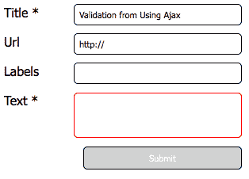
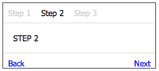
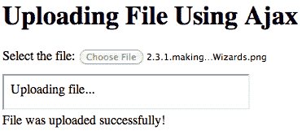
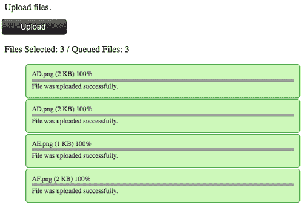
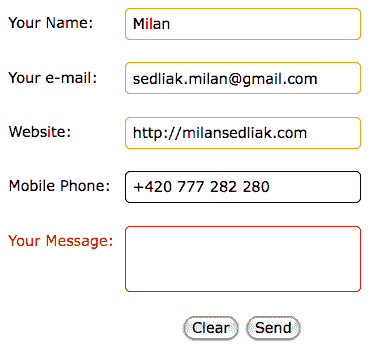
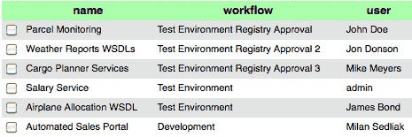
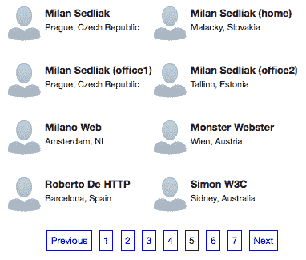
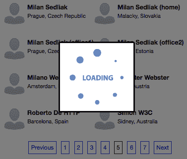

# 第二章基础设施

在本章中，我们将介绍：

*   使用 Ajax 验证表单
*   创建自动建议控件
*   制作表单向导
*   使用 Ajax 上传文件
*   使用 Ajax 上载多个文件
*   创建五星级评级体系
*   使用验证构建 PHP Ajax 联系人表单
*   在 Ajax 中显示表
*   使用 PHP 和 Ajax 构建分页

在本章中，我们将学习如何构建基本的 Ajax 表单。我们将试图了解在哪里可以使用 Ajax 方法，在哪里不能。有很多方法可以使用 Ajax。以下是一些基于用户体验和特定系统性能的“最佳”实践。Ajax 让我们的生活更轻松、更快、更好；如何以及在哪里使用它取决于我们。

# 使用 Ajax 验证表单

Ajax 的主要思想是在不重新加载整个页面的情况下实时从服务器获取数据。在本任务中，我们将使用 Ajax 构建一个带有验证的简单表单。

## 准备好了吗

由于此任务中使用了 JavaScript 库，因此我们将选择 jQuery。我们将下载（如果我们还没有完成）并将其包含在我们的页面中。我们需要准备一些虚拟 PHP 代码来检索验证结果。在本例中，我们将其命名为 `inputValidation.php`。我们只是在检查 `param`变量的存在性。如果在 `GET`请求中引入此变量，我们确认验证并将 `OK`状态发送回页面：

```php
<?php
$result = array();
if(isset($_GET["param"])){
$result["status"] = "OK";
$result["message"] = "Input is valid!";
} else {
$result["status"] = "ERROR";
$result["message"] = "Input IS NOT valid!";
}
echo json_encode($result);
?>

```

## 怎么做。。。

1.  让我们从基本的 HTML 结构开始。我们将定义一个包含三个输入框和一个文本区域的表单。当然，它被放置在`<body>:`

    ```php
    <body>
    <h1>Validating form using Ajax</h1>
    <form class="simpleValidation">
    <div class="fieldRow">
    <label>Title *</label>
    <input type="text" id="title" name="title"
    class="required" />
    </div>
    <div class="fieldRow">
    <label>Url</label>
    <input type="text" id="url" name="url"
    value="http://" />
    </div>
    <div class="fieldRow">
    <label>Labels</label>
    <input type="text" id="labels" name="labels" />
    </div>
    <div class="fieldRow">
    <label>Text *</label>
    <textarea id="textarea" class="required"></textarea>
    </div>
    <div class="fieldRow">
    <input type="submit" id="formSubmitter" value="Submit" disabled="disabled" />
    </div>
    </form>
    </body>

    ```

    中
2.  对于有效输入的视觉确认，我们将定义 CSS 样式：

    ```php
    <style>
    label{ width:70px; float:left; }
    form{ width:320px; }
    input, textarea{ width:200px;
    border:1px solid black; float:right; padding:5px; }
    input[type=submit] { cursor:pointer;
    background-color:green; color:#FFF; }
    input[disabled=disabled], input[disabled] {
    background-color:#d1d1d1; }
    fieldRow { margin:10px 10px; overflow:hidden; }
    failed { border: 1px solid red; }
    </style>

    ```

3.  现在，是时候加入 jQuery 及其功能了：

    ```php
    <script src="js/jquery-1.4.4.js"></script>
    <script>
    var ajaxValidation = function(object){
    var $this = $(object);
    var param = $this.attr('name');
    var value = $this.val();
    $.get("ajax/inputValidation.php",
    {'param':param, 'value':value }, function(data) {
    if(data.status=="OK") validateRequiredInputs();
    else
    $this.addClass('failed');
    },"json");
    }
    var validateRequiredInputs = function (){
    var numberOfMissingInputs = 0;
    $('.required').each(function(index){
    var $item = $(this);
    var itemValue = $item.val();
    if(itemValue.length) {
    $item.removeClass('failed');
    } else {
    $item.addClass('failed');
    numberOfMissingInputs++;
    }
    });
    var $submitButton = $('#formSubmitter');
    if(numberOfMissingInputs > 0){
    $submitButton.attr("disabled", true);
    } else {
    $submitButton.removeAttr('disabled');
    }
    }
    </script>

    ```

4.  我们还将初始化文档 `ready`功能：

    ```php
    <script>
    $(document).ready(function(){
    var timerId = 0;
    $('.required').keyup(function() {
    clearTimeout (timerId);
    timerId = setTimeout(function(){
    ajaxValidation($(this));
    }, 200);
    });
    });
    </script>

    ```

5.  When everything is ready, our result is as follows:

    

## 它是如何工作的。。。

我们创建了一个包含三个输入框和一个文本区域的简单表单。类为 `required`的对象在 `keyup`事件发生并调用 `ajaxValidation`函数后自动进行验证。我们的 `keyup`功能还包括 `Timeoutfunction`，以防止用户仍在书写时拨打不必要的电话。验证基于两个步骤：

*   实际输入框的验证：我们正在通过 Ajax 将插入的文本传递给 `ajax/inputValidation.php`。如果服务器的响应不是 `OK`，我们将此输入框标记为 `failed`。如果响应为 `OK`，则进入第二步。
*   检查表单中的其他必填字段。当表单中没有 `failed`输入框时，我们将启用提交按钮。

## 还有更多。。。

本例中的验证非常基本。我们正在检查服务器的响应状态是否为 `OK`。我们可能永远不会遇到像这里这样的必填字段验证。在这种情况下，最好直接在客户端使用 `length`属性，而不是用大量请求来干扰服务器，只需检查必填字段是空的还是满的。这项任务只是对基本的 `Validation`方法的演示。最好在服务器端使用正则表达式对其进行扩展，以直接检查 URL 表单或标题是否已经存在于我们的数据库中，并让用户知道问题是什么以及他/她如何解决问题。

## 另见

*构建一个 PHP Ajax 联系人表单，并在本章中验证*配方

# 创建自动建议控件

此配方将向我们展示如何创建 autosuggest 控件。当我们需要在大量数据中搜索时，此功能非常有用。基本功能是根据输入框中的文本显示建议数据列表。

## 准备好了吗

我们可以从作为数据源的虚拟 PHP 页面开始。当我们使用 `GET`方法和变量 `string`调用此脚本时，它将返回包含所选字符串的记录（名称）列表：

```php
<?php
$string = $_GET["string"];
$arr = array(
"Adam",
"Eva",
"Milan",
"Rajesh",
"Roshan",
// ...
"Michael",
"Romeo"
);
function filter($var){
global $string;
if(!empty($string))
return strstr($var,$string);
}
$filteredArray = array_filter($arr, "filter");
$result = "";
foreach ($filteredArray as $key => $value){
$row = "<li>".str_replace($string,
"<strong>".$string."</strong>", $value)."</li>";
$result .= $row;
}
echo $result;
?>

```

## 怎么做。。。

1.  一如既往，我们将从 HTML 开始。我们将使用一个输入框和一个未排序的列表 `datalistPlaceHolder:`

    ```php
    <h1>Dynamic Dropdown</h1>
    autosuggest controlcreating<form class="simpleValidation">
    <div class="fieldRow">
    <label>Skype name:</label>
    <div class="ajaxDropdownPlaceHolder">
    <input type="text" id="name" name="name"
    class="ajaxDropdown" autocomplete="OFF" />
    <ul class="datalistPlaceHolder"></ul>
    </div>
    </div>
    </form>

    ```

    定义表单
2.  当 HTML 准备好后，我们将使用 CSS:

    ```php
    <style>
    label { width:80px; float:left; padding:4px; }
    form { width:320px; }
    input, textarea {
    width:200px; border:1px solid black;
    border-radius: 5px; float:right; padding:5px;
    }
    input[type=submit] { cursor:pointer;
    background-color:green; color:#FFF; }
    input[disabled=disabled] { background-color:#d1d1d1; }
    .fieldRow { margin:10px 10px; overflow:hidden; }
    .validationFailed { border: 1px solid red; }
    .validationPassed { border: 1px solid green; }
    .datalistPlaceHolder {
    width:200px; border:1px solid black;
    border-radius: 5px;
    float:right; padding:5px; display:none;
    }
    ul.datalistPlaceHolder li { list-style: none;
    cursor:pointer; padding:4px; }
    ul.datalistPlaceHolder li:hover { color:#FFF;
    background-color:#000; }
    </style>

    ```

3.  现在真正的乐趣开始了。我们将包括 jQuery 库并定义我们的 keyup 事件：

    ```php
    <script src="js/jquery-1.4.4.js"></script>
    autosuggest controlcreating<script>
    var timerId;
    var ajaxDropdownInit = function(){
    $('.ajaxDropdown').keyup(function() {
    var string = $(this).val();
    clearTimeout (timerId);
    timerId = setTimeout(function(){
    $.get("ajax/dropDownList.php",
    {'string':string}, function(data) {
    if(data)
    $('.datalistPlaceHolder').show().html(data);
    else
    $('.datalistPlaceHolder').hide();
    });
    }, 500 );
    });
    }
    </script>

    ```

4.  当一切都设置好后，我们将调用文档 `ready`函数中的 `ajaxDropdownInit`函数：

    ```php
    <script>
    $(document).ready(function(){
    ajaxDropdownInit();
    });
    </script>

    ```

5.  Our autosuggest control is ready. The following screenshot shows the output:

    

## 它是如何工作的。。。

此配方中的 `autosuggest`控件基于输入框和 `datalistPlaceHolder`中的项目列表。在输入框的每个 `keyup`事件之后， `datalistPlaceHolder`将通过 `ajaxDropdownInit`中定义的 Ajax 函数从 `ajax/dropDownList.php`加载项目列表。这个方法的一个很好的特性是 `timerID`变量，当与 `setTimeout`方法一起使用时，它只允许我们在停止键入时（在我们的例子中是 500 毫秒）将请求发送到服务器。它看起来可能不那么重要，但它将节省大量资源。我们不想等待输入框中输入“M”的响应，因为我们已经输入了“Milan”。而不是 5 个请求（每个 150 毫秒），我们只有一个。例如，如果每天有 10000 个用户，那么它的影响是巨大的。

## 还有更多。。。

我们始终需要记住，来自服务器的响应是 JSON 格式的。

```php
[{
'id':'1',
'contactName':'Milan'
},...,{
'id':'99',
'contactName':'Milan (office)'
}]

```

从性能角度来看，在 JavaScript 中使用 JSON 对象并不总是有用的。假设一个 JSON 文件中有 5000 个联系人。

从 5000 个对象构建 HTML 可能需要一段时间，但如果我们构建 JSON 对象，代码如下所示：

```php
[{
autosuggest controlcreating"status": "100",
"responseMessage": "Everything is ok! :)",
"data": "<li><h2><ahref=\"#1\">Milan</h2></li>
<li><h2><ahref=\"#2\">Milan2</h2></li>
<li><h2><ahref=\"#3\">Milan3</h2></li>"
}]

```

在本例中，我们将拥有 HTML 格式的完整数据，不需要创建任何逻辑来创建简单的项目列表。

# 制作表单向导

**表单向导**基本上是分为几个步骤的表单。当我们想要在我们的网站上划分注册过程时，它们对于投票或表格的特殊情况非常有用。它们还用于电子商务网站、购买过程（购物车、付款方式、发货地址、确认、购买本身）。在此配方中，我们将构建一个表单向导（尽可能简单）。

## 准备好了吗

我们将准备虚拟 PHP 文件 `step1.php, step2.php`和 `step3.php`。这些文件的内容很简单：

```php
<?php
echo "STEP 1"; // Same for 2 and 3
?>

```

这里我们将再次包括 jQuery 库：

```php
<script src="js/jquery-1.4.4.js"></script>

```

## 怎么做。。。

1.  我们首先定义 HTML 内容：

    ```php
    <div class="wizard">
    <ul class="wizardNavigation">
    <li class="active first" id="step1">Step 1</li>
    <li id="step2">Step 2</li>
    <li id="step3" class="last">Step 3</li>
    </ul>
    <div class="wizardBody">STEP 1</div>
    <div class="wizardActionButtons">
    <a href="javascript:submitThePage('back');" class="back"
    style="display:none;">Back</a>
    <a href="http:// class="finish" style="display:none;"> Finish</a>
    <a href="javascript:submitThePage('next');"
    class="next">Next</a>
    </div>
    </div>

    ```

2.  接下来，我们将在 HTML 中包括 CSS 样式，如下所示：

    ```php
    <style>
    .wizard { width:300px; overflow:hidden;
    border:1px solid black; }
    .wizardNavigation { overflow:hidden;
    border-bottom:1px solid #D2D2D2; }
    .wizardNavigation li { float:left; list-style:none;
    padding:10px; cursor:default; color:#D2D2D2; }
    .wizardNavigation li.active { color:#000; }
    .wizardBody { clear:both; padding:20px; }
    .wizardActionButtons { padding:10px;
    border-top:1px solid #D2D2D2; }
    .wizardActionButtons .back { float:left; cursor:pointer; }
    .wizardActionButtons .next,
    .wizardActionButtons .finish { float:right; cursor:pointer; }
    .wizard .disabled { color:#D2D2D2; }
    </style>

    ```

3.  接下来，我们将把 JavaScript 放在结束标记`</body>`之前：

    ```php
    <script>
    var submitThePage = function (buttonDirection){
    var $currentTab = $('.wizardNavigation li.active');
    if(buttonDirection == 'next')
    var $actionTab = $currentTab.next('li');
    else
    var $actionTab = $currentTab.prev('li');
    var target = "ajax/"+ $actionTab.attr('id') +".php";
    $.get(target, {'param':'test'},
    function(data) {
    if(data){
    if($actionTab){
    $currentTab.removeClass('active');
    $actionTab.addClass('active');
    }
    displayFinishButton($actionTab.hasClass('last'));
    displayNextButton(!$actionTab.hasClass('last'));
    displayBackButton(!$actionTab.hasClass('first'));
    $('.wizardBody').html(data);
    }
    });
    }
    var displayBackButton = function(enabled){
    enabled == true ?
    $('.back').show() : $('.back').hide();
    }
    var displayNextButton = function(enabled){
    enabled == true ?
    $('.next').show() : $('.next').hide();
    }
    var displayFinishButton = function(enabled){
    enabled == true ?
    $('.finish').show() : $('.finish').hide();
    }
    </script>

    ```

4.  The result is as follows:

    

## 它是如何工作的。。。

向导分为三个部分：

*   第一部分为 `wizardNavigation`，包括向导中的所有步骤（选项卡）。
*   第二个为 `wizardBody`，包含当前步骤（页签）的内容。
*   最后一部分是 `wizardActionButtons`，包含**后退、下一步**和**完成**按钮。**后退**和**下一步**按钮使用 `buttonDirection`参数触发 `submitThePage`功能（**后退**或**下一步**。此函数将 Ajax 请求发送到下一步，下一步由 `$.get()`函数中的 `target`参数表示。目标自动从标签导航中获取，等于每个导航元素的 `id`属性。

## 还有更多。。。

我们已经理解了表单向导的基本思想。但有时我们没有时间或资源来创建自己的 jQuery 功能。在这种情况下，我们可以使用一些免费的 jQuery 插件，比如来自[的 `formwizard`插件 http://plugins.jquery.com/project/formwizard](http://plugins.jquery.com/project/formwizard) 。并非所有插件都是 100%功能性的；每件事都有自己的“错误”。然而，帮助总是很容易获得的。我们可以修改插件以满足我们的需求，然后等待 bug 在插件的下一个版本中得到修复，或者我们可以贡献自己的力量。

# 使用 Ajax 上传文件

在本食谱中，我们将讨论通过 Ajax 上传文件。实际上，没有 Ajax 方法可以做到这一点。我们可以使用 `iframe`方法来模拟 Ajax 功能。

## 准备好了吗

首先，我们将准备 `uploads`文件夹并确保其可访问。在 Mac OS X/Linux 中，我们将使用：

```php
$ sudo chmod 777 'uploads/'

```

### 注

在 Windows 7 中，我们可以右键单击权限窗口中的**文件夹属性【编辑】选择用户**（选择任何人），然后在**允许**栏下选择**完全控制**来分配完全访问权限控制权限。

现在让我们创建一个 HTML`(ajaxUpload.html)` 和一个 PHP 文件`(ajax/uploadFile.php)`。

## 怎么做。。。

1.  `ajaxUpload.html`将如下所示：

    ```php
    <script>
    function submitForm(upload_field){
    upload_field.form.submit();
    upload_field.disabled = true;
    return true;
    }
    </script>

    ```

2.  Our HTML body is as follows:

    ```php
    <h1>Uploading File Using Ajax</h1>
    <form action="ajax/uploadFileSingle.php" target="uploadIframe"
    method="post" enctype="multipart/form-data">
    <div class="fieldRow">
    <label>Select the file: </label>
    <input type="file" name="file" id="file"
    onChange="submitForm(this)" />
    </div>
    </form>
    <iframe id="uploadIframe" name="uploadIframe"></iframe>
    <div id="placeHolder"></div>

    ```

    ajax/uploadFile.php 的内容如下：

    ```php
    <head>
    <script src="../js/jquery-1.4.4.js"></script>
    </head>
    <body>
    <?php
    $upload_dir = "../uploads";
    $result["status"] = "200";
    $result["message"]= "Error!";
    if(isset($_FILES['file'])){
    echo "Uploading file... <br />";
    if ($_FILES['file']['error'] == UPLOAD_ERR_OK) {
    $filename = $_FILES['file']['name'];
    move_uploaded_file($_FILES['file']['tmp_name'],
    $upload_dir.'/'.$filename);
    $result["status"] = "100";
    $result["message"]=
    "File was uploaded successfully!";
    } elseif ($_FILES['file']['error'] ==
    UPLOAD_ERR_INI_SIZE) {
    $result["status"] = "200";
    $result["message"]= "The file is too big!";
    } else {
    $result["status"] = "500";
    $result["message"]= "Unknown error!";
    }
    }
    ?>
    </body>

    ```

3.  在 `$(document).ready:`

    ```php
    <script>
    $(document).ready(function(){
    $('#placeHolder', window.parent.document)
    .html('<?php echo htmlspecialchars($result["message"]); ?>');
    });
    </script>

    ```

    上发起结果消息
4.  The result is as follows:

    

## 它是如何工作的。。。

正如您在本任务中看到的，我们创建了一个简单的表单，可以上载文件。本例的要点在**iframe**中，我们正在向其提交表单。这个 iframe 表示一个带有 PHP 的容器，它提供所选文件的物理上传。上传成功后，我们会在父文档 `placeHolder`中显示结果消息。

## 还有更多。。。

为了增加上传文件的最大允许大小，我们可以使用 `php.ini`中的 `upload_max_filesize`指令。有更多关于上载文件的指令：

<colgroup><col style="text-align: left"> <col style="text-align: left"> <col style="text-align: left"></colgroup> 
| 

指示

 | 

默认值

 |   |
| --- | --- | --- |
| `file_uploads` | `1` | 允许/不允许 HTTP 文件上载 |
| `upload_tmp_dir` | `NULL` | 文件上载期间用于存储文件的临时目录 |
| `upload_max_filesize` | `2M` | 上载文件的最大大小 |
| `max_file_uploads` | `20` | 同时进行的最大文件上载数 |

# 使用 Ajax 上传多个文件

在上一个任务中，我们学习了如何通过使用 iframe 的伪 Ajax 方法上传单个文件。这个例子有一个很大的缺点；我们不能选择多个文件。这只有通过使用 HTML5（并非所有浏览器都完全支持）、Flash 或 Java 才能实现。在这个配方中，我们将构建一个表单，允许我们选择多个文件，并通过单击将它们上载到服务器上。

## 准备好了吗

对于此任务，我们需要下载 jQuery 库、SWFUpload 库（[http://swfupload.org/](http://swfupload.org/) ）和 Adam Royle 的 SWFUpload jQuery 插件（[http://blogs.bigfish.tv/adam/](http://blogs.bigfish.tv/adam/) ）。

## 怎么做。。。

1.  让我们从 HTML 开始：

    ```php
    <div id="swfupload-control">
    <p>Upload files.</p>
    <input type="button" id="button" value="Upload" />
    <p id="queuestatus"></p>
    <ol id="log"></ol>
    </div>

    ```

2.  接下来，我们定义 CSS:

    ```php
    <style>
    #swfupload-control p { margin:10px 5px; }
    #log li { list-style:none; margin:2px; padding:10px;
    font-size:12px; color:#333; background:#fff;
    position:relative; border:1px solid black;
    border-radius: 5px;}
    #log li .progressbar { height:5px; background:#fff; }
    #log li .progress { background:#999; width:0%; height:5px; }
    #log li p { margin:0; line-height:18px; }
    #log li.success { border:1px solid #339933;
    background:#ccf9b9;}
    </style>

    ```

3.  现在，我们将包括 jQuery、 `SWFUpload`和 SWFUpload jQuery 库：

    ```php
    <script src="js/jquery-1.4.4.js"></script>
    <script src="js/swfupload/swfupload.js"></script>
    <script src="js/jquery.swfupload.js"></script>

    ```

4.  接下来我们将定义 `SWFUpload`对象和绑定事件，如下所示：

    ```php
    <script>
    $(function(){
    $('#swfupload-control').swfupload({
    upload_url: "upload-file.php",
    file_post_name: 'uploadfile',
    flash_url : "js/swfupload/swfupload.swf",
    button_image_url :
    'js/swfupload/wdp_buttons_upload_114x29.png',
    button_width : 114,
    button_height : 29,
    button_placeholder : $('#button')[0],
    debug: false
    })
    .bind('fileQueued', function(event, file){
    var listitem='<li id="'+file.id+'" >'+
    file.name+' ('+Math.round(file.size/1024)+' KB)
    <span class="progressvalue" ></span>'+
    '<div class="progressbar" >
    <div class="progress" ></div></div>'+
    '<p class="status" >Pending</p>'+'</li>';
    $('#log').append(listitem);
    $(this).swfupload('startUpload');
    })
    .bind('uploadStart', function(event, file){
    $('#log li#'+file.id)
    .find('p.status').text('Uploading...');
    $('#log li#'+file.id)
    .find('span.progressvalue').text('0%');
    })
    .bind('uploadProgress', function(event, file, bytesLoaded){
    var percentage=Math.round((bytesLoaded/file.size)*100);
    $('#log li#'+file.id)
    .find('div.progress').css('width', percentage+'%');
    $('#log li#'+file.id)
    .find('span.progressvalue').text(percentage+'%');
    })
    .bind('uploadSuccess', function(event, file, serverData){
    var item=$('#log li#'+file.id);
    item.find('div.progress').css('width', '100%');
    item.find('span.progressvalue').text('100%');
    item.addClass('success').find('p.status')
    .html('File was uploaded successfully.');
    })
    .bind('uploadComplete', function(event, file){
    $(this).swfupload('startUpload');
    })
    });
    </script>

    ```

5.  上传文件的 PHP 如下：

    ```php
    <?php
    $uploaddir = './uploads/';
    $file = $uploaddir . basename($_FILES['uploadfile']['name']);
    if (move_uploaded_file($_FILES['uploadfile']['tmp_name'], $file)) { echo "success"; } else { echo "error"; }
    ?>

    ```

6.  Our result looks like the following:

    

## 它是如何工作的。。。

首先，我们为 `swfupload-control`定义了一个简单的 HTML 表单，包括输入按钮。此按钮被 `swf`对象覆盖，允许我们选择多个文件。在 JavaScript 中，我们使用基本设置 `(upload_url, file_post_name, flash_url, button_image_url`定义主 `SWFUpload`对象，等等）。我们可以使用预定义的事件为每个文件构建一个带有进度条的容器。

## 还有更多。。。

`SWFUpload`中定义的事件为我们提供了文件上传期间的完全控制，如下所示：

<colgroup><col style="text-align: left"> <col style="text-align: left"></colgroup> 
| **flashReady** | Flash 控件调用此命令以通知 `SWFUpload`已加载 Flash 影片。 |
| **swfuploaddloaded** | 调用它是为了确保调用 `SWFUpload`方法是安全的。 |
| **文件对话框启动** | 这是在调用 `selectFile`选择文件后触发的。 |
| **文件排队** | 在关闭**文件选择对话框**窗口后，将为排队的每个文件触发此命令。 |
| **文件队列错误** | 关闭**FileSelectionDialog**窗口后，将为每个未排队的文件触发此命令。 |
| **文件对话框完成** | 关闭**文件选择对话框**窗口并处理所有选定的文件后，将触发此操作。 |
| **上传启动** | 这将在文件上载之前立即调用。 |
| **上传进度** | 这是由闪存控制定期触发的。 |
| **上传错误** | 每当上载被中断或未能成功完成时，都会触发此操作。 |
| **上传成功** | 当整个上传都已传输且服务器返回 HTTP 200 状态代码时，将触发此操作。 |
| **上传完成** | 这总是在上传周期结束时触发（在 `uploadError`或 `uploadSuccess).`之后） |

# 打造五星评级体系

在这项任务中，我们将学习如何建立五星评级体系。电子商务网站经常使用此功能对产品、文章或任何值得用户评估的内容进行评级。

## 准备好了吗

让我们准备一个虚拟 PHP 文件 `ajax/saveRating.php`以确认评级已保存：

```php
<?php
$result = array();
$result["status"] = "";
$result["message"] = "";
if(isset($_POST["itemID"]) && isset($_POST["itemValue"])){
$result["status"] = "OK";
$result["message"] = "Rating has been saved successfully.";
} else {
$result["status"] = "ERROR";
$result["message"] = "Provide itemID and itemValue!";
}
echo json_encode($result);
?>

```

我们需要准备一张有星星的 `.gif`图像。这 `.gif`包括恒星的三种变化：第一种是非活动恒星，第二种是“悬停”事件，第三种是活动恒星。


## 怎么做。。。

1.  我们准备从 HTML 部分开始：

    ```php
    <body>
    five star rating systemcreating, steps<h1>Creating Five Stars Rating System</h1>
    <div class="fieldRow">
    <label>Book 123A</label>
    <ul id="book-123a" class="ratingStars">
    <li></li>
    <li class="active"></li>
    <li></li>
    <li></li>
    <li></li>
    </ul>
    </div>
    <div class="fieldRow">
    <label>Book 123B</label>
    <ul id="book-123b" class="ratingStars">
    <li class="active"></li>
    <li></li>
    <li></li>
    <li></li>
    <li></li>
    </ul>
    </div>
    <div class="fieldRow">
    <label>Book 123C</label>
    <ul id="book-123c" class="ratingStars">
    <li></li>
    <li></li>
    <li></li>
    <li></li>
    <li class="active"></li>
    </ul>
    </div>
    <div id="placeHolder"></div>
    </body>

    ```

2.  让我们包括 jQuery 库并定义 JavaScript 功能：

    ```php
    <script src="js/jquery-1.4.4.js"></script>
    <script>
    $(document).ready(function(){
    $('ul.ratingStars li.active').prevAll().addClass('active');
    $('ul.ratingStars li').each(function(){
    var $item = $(this);
    var $itemContainer = $item.parents('ul.ratingStars');
    var containerID = $itemContainer.attr('id');
    var $itemsAll = $itemContainer.find('li');
    $item.mouseover(function(){
    $itemsAll.addClass('default');
    $item.prevAll().addClass('highlighted');
    })
    .mouseout(function(){
    $itemsAll
    .removeClass('default')
    .removeClass('highlighted');
    });
    .bind('click', function(){
    var itemIndex = $itemsAll.index(this);
    $.post('ajax/saveRating.php',
    {'itemID':containerID, 'itemValue': itemIndex},
    function(data) {
    if(data && data.status == "100"){
    $item
    .addClass('active')
    .removeClass('highlighted');
    $item.nextAll().removeClass('active');
    $item.prevAll().addClass('active');
    } else {
    alert('Error!');
    }
    }, "json");
    });
    });
    });
    </script>

    ```

3.  CSS 是本任务的关键部分之一：

    ```php
    <style>
    five star rating systemcreating, stepslabel, ul { float:left; }
    .fieldRow { clear:both; margin:5px 0px; overflow:hidden; }
    ul.ratingStars { list-style:none; margin:0px 0px;
    overflow:hidden; }
    ul.ratingStars li { float:left; width:16px; height:16px;
    background:url('icons/star.gif') no-repeat left top;
    cursor:pointer; }
    ul.ratingStars li.active { background-position: 0px -32px; }
    ul.ratingStars li.default { background-position: 0px 0px; }
    ul.ratingStars li.highlighted,
    ul.ratingStars li:hover { background-position: 0px -16px; }

    ```

4.  Our result is as follows:

    

## 它是如何工作的。。。

基本上，整个评分系统是一个无序的项目列表。每个项目代表一个星形，可提供三种状态；默认、活动或高亮显示。状态的改变是通过改变每颗星的背景位置来完成的。在我们的例子中，我们使用的是 `icons/star.gif`，它包括所有三种可能的状态（灰色、红色和黄色）。定义了一个 `mouseover`事件，该事件将突出显示悬停的星星和所有先前选择的星星。单击星号后，我们将 Ajax post 请求调用到 `ajax/saveRating.php`，并将所有需要的星号设置为激活状态。

## 还有更多。。。

在大多数情况下，我们不希望允许一个用户进行多次投票。在这种情况下，我们可以如下设置 cookie：

```php
...
if(isset($_POST["itemID"]) && isset($_POST["itemValue"])){
setcookie("rated".$id, $id, time()+60*60*60*24*365);
$result["status"] = "OK";
$result["message"] = "Rating has been saved successfully.";
}

```

当 cookie 设置为一年后过期时，我们可以在评级系统中使用它：

```php
if(isset($_COOKIE['rated'.$id])) {
$result["status"] = "550";
$result["message"] = "Already voted!";
}
echo json_encode($result);

```

# 构建带有验证的 PHP Ajax 联系人表单

在提交表单之前对输入框进行验证已经成为 Ajax 非常重要的功能之一。用户不必等到整个表单返回一些无效的输入框消息，然后再尝试重新填充它。在本任务中，我们将使用 Ajax 验证构建一个联系人表单。

## 怎么做。。。

1.  让我们从 HTML 开始：

    ```php
    <body>
    <form id="contactForm" action="#" method="post">
    <h1>PHP Ajax Contact Form</h1>
    <div class="fieldRow">
    <label for="name">Your Name:</label>
    <input type="text" name="name" id="name"
    class="required" />
    </div>
    <div class="fieldRow">
    <label for="email">Your e-mail:</label>
    <input type="text" name="email" id="email"
    class="required email" />
    </div>
    <div class="fieldRow">
    <label for="url">Website:</label>
    <input type="text" name="url" id="url"
    class="url" />
    </div>
    <div class="fieldRow">
    <label for="phone">Mobile Phone:</label>
    <input type="text" name="phone" id="phone"
    class="phone"/>
    </div>
    <div class="fieldRow">
    <label for="message">Your Message:</label>
    <textarea name="message" id="message"
    class="required"></textarea>
    </div>
    <div class="fieldRow buttons">
    <input type="reset" value="Clear" />
    <input type="submit" value="Send" />
    </div>
    </form>
    </body>

    ```

2.  现在，我们可以定义样式：

    ```php
    <style>
    form{ width:450px; }
    label { float:left; width:100px; padding:5px; }
    .fieldRow { overflow:hidden; margin:20px 10px; }
    .buttons { text-align:center; }
    input[type=text], textarea{ width:200px; border:1px solid black; border-radius: 5px; padding:5px; }
    input.required, textarea.required{ border:1px solid orange; }
    .failed input.required, .failed textarea.required{ border:1px solid red; }
    .failed { color:red; }
    </style>

    ```

3.  主要 PHP 验证如下：

    ```php
    "status" => "50500",
    "message" => "Error: No parameters provided."
    );
    if(isset($_POST["param"])){
    $param = $_POST["param"];
    $value = $_POST["value"];
    switch($param){
    default:
    $result["status"] = "10100";
    $result["message"] = "OK";
    break;
    case 'email':
    if(filter_var($value, FILTER_VALIDATE_EMAIL)){
    $result["status"] = "10100";
    $result["message"] = "E-mail is valid!";
    } else {
    $result["status"] = "50502";
    $result["message"] = "Error: E-mail is not
    valid.";
    }
    break;
    case 'url':
    if(filter_var($value, FILTER_VALIDATE_URL)){
    $result["status"] = "10100";
    $result["message"] = "URL is valid!";
    } else {
    $result["status"] = "50502";
    $result["message"] = "Error: URL is not valid.";
    }
    break;
    case 'phone':
    if(preg_match('/^\+?[0-9]+$/', $value)){
    $result["status"] = "10100";
    $result["message"] = "Phone is valid!";
    } else {
    $result["status"] = "50502";
    $result["message"] = "Error: Phone number is not
    valid.";
    }
    break;
    }
    }
    echo json_encode($result);
    ?>

    ```

4.  Ajax 调用的 JavaScript 功能如下：

    ```php
    <script src="js/jquery-1.4.4.js"></script>
    <script>
    $(document).ready(function(){
    $('#contactForm').submit(function(e){
    var $form = $(this);
    $.ajaxSetup({async:false});
    $('.required').each(function(){
    var $this = $(this);
    var value = $this.val();
    if(value.length == 0)
    $this.parents('.fieldRow').addClass('failed');
    else
    $this.parents('.fieldRow').removeClass('failed');
    });
    $('.email').each(function(){
    var $this = $(this);
    var value = $this.val();
    $.post("validators/main.php",
    {'param':'email', 'value':value },
    function(data) {
    if(data.status==10100)
    $this
    .parents('.fieldRow').removeClass('failed');
    else
    $this.parents('.fieldRow').addClass('failed');
    }, "json");
    });
    $('.url').each(function(){
    ...
    $.post("validators/main.php",
    {'param':'url', 'value':value }, function(data) {
    ...
    });
    $('.phone').each(function(){
    ...
    $.post("validators/main.php",
    {'param':'phone', 'value':value }, function(data) {
    ...
    });
    return !$('.failed').length;
    });
    });
    </script>

    ```

5.  The result is as follows:

    

## 它是如何工作的。。。

我们从一个 HTML 源代码开始。它包含四个输入框和一个文本区域。正如您在源代码中看到的，我们正在准备两种类型的验证。第一个用于检查必填字段（标记为 `class="required")`，第二个基于特定类型的数据（电子邮件、URL 和电话）。第一个验证仅在客户端完成，第二个验证涉及向 `validators/main.php`发送 post 请求，对给定参数进行评估。如果输入未通过验证，则标记为 `failed`。如果表单中没有 `failed`输入框，则启用 `submit`事件。当所有请求完成时，事件返回 `true`值。这是通过允许同步请求来完成的-`$.ajaxSetup({async:false})`。请注意，同步请求可能会暂时锁定浏览器，从而在请求处于活动状态时禁用任何操作。

## 还有更多。。。

在本例中，我们在服务器端使用字段验证。这种逻辑并不是我们在现实生活中会用到的。当然，我们应该始终在服务器端进行验证（以防用户关闭 JavaScript），但我们不需要在客户端轻松找到一些东西来打扰服务器，例如电子邮件、URL 或必填字段的验证。jQuery 有一个很好的验证插件，名为 `validate.js`（[http://docs.jquery.com/Plugins/validation](http://docs.jquery.com/Plugins/validation) 。

我们需要做的就是下载带有 `validate`插件的 jQuery 库，并将其包含在我们的源代码中：

```php
<script src="jquery/jquery-latest.js"></script>
<script src="jquery/plugins/validate/jquery.validate.js">
</script>

```

为必填字段定义类 `required`，并为特定验证器定义一些附加类，例如电子邮件：

```php
<form id="commentForm" method="get" action="">
<label for="email">E-Mail</label>
<input id="email" name="email" class="required email" />
</form>

```

然后以特定的形式调用 `validate()`函数：

```php
<script>
$(document).ready(function(){$("#commentForm").validate();});
</script>

```

# 在 Ajax 中显示表格

在本任务中，我们将使用 Ajax 以表格格式显示数据。作为数据源，我们将使用预定义的 JSON 对象。

## 准备好了吗

首先，我们需要准备一个虚拟 JSON 数据源，其中包含表中显示的所有项：

```php
json/requests.json:
[{
"id": "1",
"name": "Milan Sedliak Group",
"workflow": "Front End Q Evaluation",
"user": "Milan Sedliak",
"requestor": "Milan Sedliak",
"status": "submitted",
"email": "milan@milansedliak.com",
"date": "Today 15:30"
},
{...}]

```

## 怎么做。。。

1.  作为基本 HTML，我们可以将此源代码与表格和工具栏的容器一起使用。此工具栏将包括为我们的项目选择功能。

    ```php
    <div class="tableContainer">
    <div class="tableToolbar">
    Select
    <a href="#" class="selectAll">All</a>,
    <a href="#" class="selectNone">None</a>,
    <a href="#" class="selectInverse">Inverse</a>
    </div>
    <table>
    <thead></thead>
    <tbody></tbody>
    </table>
    </div>

    ```

2.  现在，我们可以为我们的 HTML 设置样式：

    ```php
    <style>
    .tableContainer { width:900px; }
    .tableToolbar { background-color:#EEFFEE; height:20px;
    padding:5px; }
    table { border-collapse: collapse; width:100%; }
    table th { background-color:#AAFFAA; padding:4px; }
    table tr td { padding:4px; }
    table tr.odd td { background-color:#E3E3E3; }
    .floatr { float:right; }
    .textAlignR { text-align: right; }
    </style>

    ```

3.  当 HTML 和 CSS 准备好后，我们可以从 JavaScript 开始：

    ```php
    <script src="js/jquery-1.4.4.js"></script>
    <script>
    $(document).ready(function(){
    $.getJSON('json/requests.json', function(data) {
    buildHeader(data);
    buildBody(data);
    });
    });
    var buildHeader = function(data){
    var keys = [];
    var $headRow = $('<tr />');
    for(var key in data[0]){
    if(key=="id")
    var $cell = $('<th />');
    else
    var $cell = $('<th>'+key+'</th>');
    $cell.appendTo($headRow);
    }
    $headRow.appendTo($('.tableContainer table thead'));
    }
    var buildBody = function(data){
    for(var i = 0; i < data.length; i++){
    var dataRow = data[i];
    var $tableRow = $('<tr />');
    for(var key in dataRow){
    var $cell = $('<td />');
    switch(key){
    default:
    $cell.html(dataRow[key]);
    break;
    case 'id':
    var $checkbox = $('<input type="checkbox"
    name="select['+dataRow[key]+']" />');
    $checkbox.appendTo($cell);
    break;
    case 'date':
    $cell.html(dataRow[key]);
    $cell.addClass('textAlignR');
    break;
    }
    $cell.appendTo($tableRow);
    }
    if(i % 2 == 0)
    $tableRow.addClass('odd');
    $tableRow.appendTo($('.tableContainer table tbody'));
    }
    }
    </script>

    ```

4.  The result looks like the following:

    

## 它是如何工作的。。。

开始时，我们从表的基本 HTML 结构开始。我们只定义了表头和表体的位置。在`(document).event`中，我们发送 `getJSON`请求，从服务器获取 `json`对象（`json/requests.json`。我们将数据放入 `data`变量并继续构建一个表。在第一步中，我们构建报头（buildHeader（data））。此函数获取数据，解析 JSON 对象中的键，并将它们用于标题单元格。在第二步中，我们构建主体（buildBody（data））。此函数基于循环，循环将指定表的每一行。我们使用的开关能够根据每个值的键为其提供特定功能。

## 还有更多。。。

在这个任务中，我们用工具箱构建了一个表，它没有任何功能；至少，还没有。在每一行中，我们定义一个复选框。通过此复选框的定义，我们可以指定其他功能：

```php
$checkbox.bind('click', function(e){
$(this).parents('tr').addClass('highlighted');
})
.appendTo($cell);

```

对于前面代码段中提到的工具栏，我们可以指定：

```php
$('.selectAll').bind('click',function(){
$(this) .parents('table')
.find('input[type="checkbox"]').each(function(){
var $checkbox = $(this);
$checkbox.attr('checked', 'checked');
var $row = $checkbox.parents('tr');
$row.addClass('highlighted');
});
});

```

# 使用 PHP 和 Ajax 构建分页

在本任务中，我们将学习如何使用 Ajax 功能构建**分页**。这意味着我们将能够在不重新加载整个网站的情况下打开联系人列表中的页面。

## 怎么做。。。

1.  我们将从 HTML 开始，它包含页面容器、带有第一个显示的联系人页面的联系人网格以及联系人分页：

    ```php
    <div id="pageContainer">
    <div id="contactGrid">
    <div class="contact">
    
    <h2>Milan Sedliak</h2>
    <p>Prague, Czech Republic</p>
    </div>
    <!-- // add more contacts -->
    <div class="contact">
    
    <h2>Milan Sedliak (home)</h2>
    <p>Malacky, Slovakia</p>
    </div>
    </div>
    <ul id="contactPagination">
    <li><a href="#previous" id="previous">Previous</a></l
    <li><a href="#1" id="1">1</a></li>
    <li><a href="#2" id="2">2</a></li>
    <li><a href="#3" id="3">3</a></li>
    <li><a href="#4" id="4">4</a></li>
    <li><a href="#5" id="5" class="active">5</a></li>
    <li><a href="#6" id="6">6</a></li>
    <li><a href="#7" id="7">7</a></li>
    <li><a href="#next" id="next">Next</a></li>
    </ul>
    </div>

    ```

2.  所需 CSS 如下：

    ```php
    <style>
    #pageContainer { width: 410px; margin:0px auto; }
    #contactGrid { width: 410px; margin:10px auto;
    overflow:hidden; position:relative; }
    #contactGrid .contact { float:left; width:200px;
    margin:10px 0px; }
    .contact img { float:left; margin-right:5px;
    margin-bottom:10px; }
    .contact h2 { font-size:14px; }
    .contact p { font-size: 12px; }
    #contactPagination { clear:both; margin-left:50px; }
    #contactPagination li { float:left; list-style:none; }
    #contactPagination li a { padding:5px; margin:5px;
    border:1px solid blue; text-decoration:none; }
    #contactPagination li:hover a { color:orange;
    border:1px solid orange; }
    #contactPagination li a.active { color:black;
    border:1px solid black; }
    </style>

    ```

3.  分页的 JavaScript 功能如下：

    ```php
    <script src="js/jquery-1.4.4.js"></script>
    <script>
    $(document).ready(function(){
    paginationInit();
    });
    var paginationInit = function(){
    $('#contactPagination li a').bind('click', function(e){
    e.preventDefault();
    var $this = $(this);
    var target = $this.attr('id');
    var $currentItem = $('#contactPagination a.active')
    .parents('li');
    var $contactGrid = $('#contactGrid');
    switch(target){
    default:
    $('#contactPagination a').removeClass('active');
    $this.addClass('active');
    var page = target;
    $.get('contacts.php',
    {'page': page}, function(data) {
    $contactGrid.html(data);
    });
    break;
    case 'next':
    var $nextItem = $currentItem.next('li');
    $('#contactPagination a').removeClass('active');
    var $pageToActive = $nextItem.find('a')
    .addClass('active');
    var page = $pageToActive.attr('id');
    $.get('contacts.php',
    {'page': page}, function(data) {
    $contactGrid.html(data);
    });
    break;
    case 'previous':
    var $previousItem = $currentItem.prev('li');
    $('#contactPagination a').removeClass('active');
    var $pageToActive = $previousItem.find('a')
    .addClass('active');
    var page = $pageToActive.attr('id');
    $.get('contacts.php',
    {'page': page}, function(data) {
    $contactGrid.html(data);
    });
    break;
    }
    hidePreviousNextButtons();
    });
    }
    var hidePreviousNextButtons = function(){
    var $currentItem = $('#contactPagination a.active');
    var currentItemID = $currentItem.attr('id');
    var $nextButton = $('#contactPagination #next');
    var $previousButton = $('#contactPagination #previous');
    var lastItemID = $nextButton.parents('li').prev('li')
    .find('a').attr('id');
    var firstItemID = $previousButton.parents('li').next('li')
    .find('a').attr('id');
    currentItemID == lastItemID ?
    $nextButton.hide() : $nextButton.show();
    currentItemID == firstItemID ?
    $previousButton.hide() : $previousButton.show();
    }
    </script>

    ```

4.  要检索所需页面，我们将定义 `contact.php:`

    ```php
    <?php
    if (isset($_GET["page"])) { $page = (int)$_GET["page"]; } else { $page = 1; };
    $start_from = ($page-1) * 20;
    $sql = "SELECT * FROM contacts ORDER BY name ASC LIMIT $start_from, 20";
    $result = mysql_query ($sql,$connection);
    ?>
    <?php
    $result="";
    while ($row = mysql_fetch_assoc($result)) {
    $avatar = htmlspecialchars($row["avatar"]); $fullName = htmlspecialchars($row["fullName"]);
    $address = htmlspecialchars($row["address"]);
    $result .= sprintf('
    <div class="contact">
    
    <h2>%s</h2>
    <p>%s</p>
    </div>',$avatar,$fullName,$address);
    };

    ```

5.  The result is as follows:

    

## 它是如何工作的。。。

我们正在 `paginationInit()`函数中定义分页的主要功能。主要步骤是获取分页中的每个超链接，并根据其 `id`属性为其分配特定功能。当 `id`为 `next`或 `previous`时，表示我们点击了**下一个**或**上一个**按钮。在本例中，我们查找当前处于活动状态的页面并选择 `next/previous`超链接。如果我们已经到达 `first/last`超链接，我们通过调用 `hidePreviousNextButtons()`函数隐藏 `previous/next`按钮。本例中的默认目标是一个数字项（页面）。点击后保存当前活动页面，从 `contacts.php`调用 `GET`请求获取所需页面，并显示在 `contactGrid`中。

## 还有更多。。。

我们学习了如何构建基本分页。现在我们可以玩用户体验了。我们的用户喜欢在页面上看到正在发生的事情。在本例中，我们单击代表页面的链接，等待联系人显示在联系人网格中。现在，我们可以向用户提供一个经典的微调器，作为正在加载内容的通知。

首先，我们需要找到旋转器的 `.gif`图像。我们可以很容易地在互联网上找到一个。当图像准备就绪并保存在我们的图像文件夹中时，我们可以按如下方式定义 CSS：

```php
#spinnerContainer { opacity:0.85; position:absolute;
width:100%; height:100%;
background:url('images/loader-big.gif') no-repeat
center center #000; }

```

我们可以将微调器的显示直接添加到现有函数中；这可以在 Ajax 请求之前完成，当请求 `id`完成时。我们将使用 `.html()`函数覆盖 HTML 内容

```php
$('<div id="spinnerContainer"></div>')
.prependTo($contactGrid);
$.get('contacts.php',
{'page': page}, function(data) {
$contactGrid.html(data);
});

```

修改后的版本如下：

