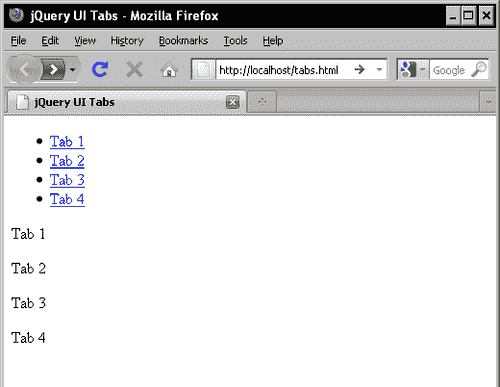
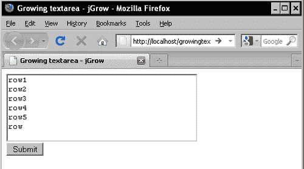
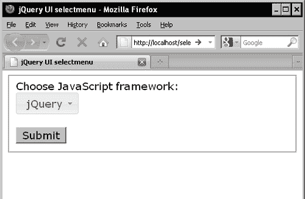
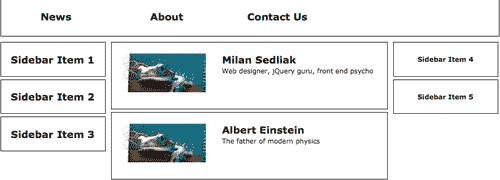
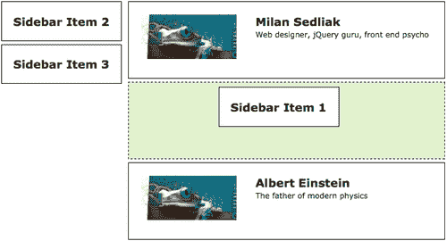

# 第 3 章使用 jQuery 的有用工具

在本章中，我们将介绍：

*   使用 Ajax 制作工具提示
*   从数据库创建自动完成
*   使用 jQuery 构建选项卡导航
*   旋转内容
*   创建图像滑块
*   创建无页分页
*   使用 Lightbox 加载图像
*   使用 jGrow 插件扩展 textarea
*   选择下拉列表的 HTML 替换
*   使用日期选择器改进日期选择
*   拖放功能
*   Ajax 购物车
*   排序和过滤数据
*   添加视觉效果和动画

我们需要 Ajax 工具或插件来获得“Ajaxified”网站。jQuery 插件通常非常节省时间，因为它们大多是即插即用类型的脚本。jQuery 基于选择器的方法使得以不引人注目的方式将普通网页转换为“Ajaxified”网页变得更加容易。在本章中，我们将看到一些高效的 jQuery 插件及其用法。

# 使用 Ajax 制作工具提示

Web 浏览器在**工具提示**中呈现 `title`属性的内容。浏览器的工具提示存在一些问题，例如：

*   它们在不同浏览器中的外观不一致
*   无法设置浏览器工具提示的样式

为了解决这些美观的 UI 问题，我们有许多 jQuery 插件。在本食谱中，我们将研究如何使用 BeautyTips 插件获取工具提示。

## 准备好了吗

我们需要来自[的 BeautyTips jQuery 插件 http://plugins.jquery.com/project/bt](http://plugins.jquery.com/project/bt) 以及 jQuery 核心。或者，我们可能需要以下内容：

*   来自[的**ExplorerCanvas**http://excanvas.sourceforge.net/](http://excanvas.sourceforge.net/) 支持 Internet Explorer 中的 `canvas`元素。请注意，BeautyTips 使用 `canvas`元素生成气泡尖端。
*   来自[的**hoverIntent**插件 http://cherne.net/brian/resources/jquery.hoverIntent.html](http://cherne.net/brian/resources/jquery.hoverIntent.html) ，因为它改变了悬停行为。jQuery 的默认 `hover`事件在绑定元素悬停时触发，这有时会造成糟糕的用户体验，特别是当用户无意中悬停在特定元素上时。hoverIntent 插件通过为悬停事件添加时间间隔和超时来解决这个问题，以便用户的意图得到明确的满足。安装后，BeautyTips 使用 hoverIntent 而不是 hover。
*   来自[的**bgiframe**插件 http://plugins.jquery.com/project/bgiframe](http://plugins.jquery.com/project/bgiframe) 因为它修复了 IE6 z-index 的表单元素问题。当 bgiframe 在页面上可用时，BeautyTips 将自动使用它。
*   当我们需要动画效果时，**放松**插件。

## 怎么做。。。

使用 BeautyTips 插件制作工具提示很容易，因为它只是一个即插即用的设置。让我们看看当用户填写表单时如何提供帮助提示。


下面的代码使得在前面的屏幕截图中更容易显示：

```php
<!DOCTYPE html PUBLIC "-//W3C//DTD XHTML 1.0 Strict//EN"
"http://www.w3.org/TR/xhtml1/DTD/xhtml1-strict.dtd">
<html >
<head>
<script src="js/jquery.min.js" type="text/javascript">
</script>
<script src="js/jquery.hoverIntent.minified.js" type="text/javascript">
</script>
<script src="js/jquery.bgiframe.min.js" type="text/javascript">
</script>
<!--[if IE]>
<script src="js/excanvas.js" type="text/javascript">
</script>
<![endif]-->
<script src="js/jquery.bt.min.js" type="text/javascript">
</script>
<script src="js/jquery.easing. js" type="text/javascript">
</script>
<script src="js/script.js" type="text/javascript">
</script>
<title>Tooltips for form inputs</title>
</head>
<body>
<form method="post" action="action.php">
<fieldset>
<legend>Bio</legend>
<label for="name">Name</label><br />
<input type="text" id="name" title="Hey, how can we call you?"/
<label for="age">Age</label><br />
<input type="text" id="age" title="This site isn't for babies and so we need your age!" /><br />
<label for="gender">Gender</label><br />
<select id="gender" title="Are you she or he in your bio?">
<option value="" selected="selected">- Choose -</option>
<option value="M">Male</option>
<option value="F">Female</option>
</select><br />
<input type="submit" value="Submit" />
</fieldset>
</form>
</body>
</html>

```

而且，在 JavaScript 触发中，使用以下代码更简单：

```php
jQuery(document).ready(function($){
         $('input, select').bt();
});

```

## 它是如何工作的。。。

BeautyTips 使用 `canvas`元素绘制气泡，通常称为工具提示、帮助提示、帮助气泡和对话气泡。使用 `canvas`的主要思想是实现任何形状的气泡。BeautyTips 内置支持普通泡泡、谷歌地图泡泡、Facebook 工具提示和 Netflix 工具提示。它还通过 CSS 支持自定义气泡主题。

如我们的示例所述，为了获得表单输入的工具提示，气泡文本将自动从所附元素的 `title`属性中获取。因此，它会优雅地退化，并符合可访问性标准。在可能需要在 bubble tip 中显示其他文本的情况下，我们可以通过添加以下代码来实现：

```php
$(selector).bt('Bubble tip text');

```

气泡尖端通常放置在元素的右侧。当没有可用空间时，它会自动调整并检测位置。API 也提供了设置位置的功能，如图所示：

```php
$(selector).bt({positions: 'top'});

```

默认触发事件为 `hover`。当在页面上找到 hoverIntent 插件时，它将利用它来改善用户体验。如前文所述，hoverIntent 插件将设置触发 `hover`事件的时间，从而避免在用户意外移动到元素上时触发不必要的事件。通过 API，我们还可以将触发事件定制为 `hover`以外的内容，如图所示：

```php
$(selector).bt({trigger: 'click'});

```

要指定何时隐藏 `trigger`事件，我们必须传递第二个参数。以下代码将在 `focus`事件中触发 `bubble tip`并在 `blur`事件中隐藏：

```php
$(selector).bt({trigger: ['focus', 'blur']});

```

气泡文本内容也可以使用 `ajaxPath`属性作为参数从远程 Ajax 页面加载：

```php
$(selector).bt({ ajaxPath: 'ajax.html', ajaxError: "Ajax error: %error." });

```

## 还有更多。。。

jQuery 生态系统有很多插件，可以轻松获得工具提示。在大多数情况下，BeautyTips 的功能通常是足够的。然而，我们可能会遇到这样一种情况，即我们希望获得其他站点使用的准确（或类似）工具提示。在这里，我们讨论几个这样的插件：

*   **tipsy**

    此插件在[上提供 http://onehackoranother.com/projects/jquery/tipsy/](http://onehackoranother.com/projects/jquery/tipsy/) 。它专注于轻松获取类似 Facebook 的迷你信息工具提示。

*   **BubbleTip**

    此插件位于[http://code.google.com/p/bubbletip/](http://code.google.com/p/bubbletip/) ，帮助我们获得阴影和动画工具提示。

*   **jGrowl**

    在 MacOSX 中，Growl 框架允许开发人员发出警报消息。此 jGrowl 插件位于[http://stanlemon.net/projects/jgrowl.html](http://stanlemon.net/projects/jgrowl.html) 模拟相同的警报功能。我们可以使用这个插件在浏览器上创建漂亮的工具提示/提醒弹出窗口。

*   **qTip**

    这是另一个工具提示插件，位于[http://craigsworks.com/projects/qtip2./](http://craigsworks.com/projects/qtip2./) 。它有很多选择，还提供了直观的工具提示。

# 从数据库创建自动完成

大多数时候，用户对填写表单感到厌烦。然而，从网站的角度来看，用户输入对于数据挖掘和更好的服务非常重要。当最终用户能够快速或轻松地填写表单时，它将帮助最终用户和网站所有者。自动完成就是这样一种帮助最终用户的尝试。总体而言，我们有两种类型的自动完成设计：

*   在浏览器 UI 中，允许浏览器记住某些表单输入
*   在使用自动完成技术快速填写表单的网站中

在本教程中，我们将看到如何在 PHP 脚本中集成 jQueryUIAutoComplete 插件。

## 准备好了吗

我们需要[中的 jQuery UIhttp://jqueryui.com/](http://jqueryui.com/) ，带有自动完成组件。请注意，jQuery UI 下载页面[http://jqueryui.com/download](http://jqueryui.com/download) ，具有类似向导的界面，可轻松选择所需文件。

关于数据库，我们需要一个模式为 `jslibs (id, name)`的表。

## 怎么做。。。

首先，我们将在没有数据库的情况下启动 Autocomplete 集成，然后添加数据库支持。集成 jQueryUIAutoComplete 小部件非常简单。让我们使用自动完成支持来改进轮询应用程序的 UI。请注意，在输入可以是预定集合内的任何内容或来自用户的情况下，通常首选自动完成模式。


```php
<!DOCTYPE html PUBLIC "-//W3C//DTD XHTML 1.0 Strict//EN"
"http://www.w3.org/TR/xhtml1/DTD/xhtml1-strict.dtd">
<html >
<head>
<link rel="stylesheet" type="text/css" href="http://themes/base/jquery.ui.all.css" />
<script type="text/javascript" src="js/jquery.js">
</script>
<script type="text/javascript" src="js/ui/jquery.ui.core.js">
</script>
<script type="text/javascript" src="js/ui/jquery.ui.widget.js">
</script>
<script type="text/javascript" src="js/ui/jquery.ui.position.js">
</script>
<script type="text/javascript" src="js/ui/jquery.ui.autocomplete.js">
</script>
<script type="text/javascript" src="js/script.js">
</script>
<title>jQuery UI Autocomplete</title>
</head>
<body>
<form method="post" action="poll.php">
<div class="ui-widget">
<fieldset>
<legend>Poll</legend>
<label for="jslibs">Your favorite JavaScript framework</label>
<;input id="jslibs" />
<input type="submit" value="Submit" />
</fieldset>
</div>
</form>
</body>
</html>

```

在 JavaScript 代码中，只需通过其 `id:`钩住输入元素即可

```php
jQuery(document).ready(function($){
  $('#jslibs').autocomplete( {
source : ['dojo',       

'ExtJS',
'jQuery',
'MochiKit',
'mootools',
'Prototype',
'YUI']
});
});

```

这里，我们通过 `source`选项对自动完成值进行了硬编码。当 `values`集合的大小很大时，我们必须通过服务器脚本远程提供值。因此，让我们通过创建 `values.php`将远程值功能添加到前面的设置中，如下面的代码片段所示：

```php
<?php
// JSON header...
header('Content-Type: application/json');
// DB connections...
$con = mysql_connect('localhost', 'db_user', 'db_password');
mysql_select_db('db_name', $con);
// 'term' passed from autocomplete component...
$term = isset($_GET['term']) ? mysql_real_escape_string ($_GET['term']) : '';
$values = array();
if ($term) {
$sql = 'SELECT name from jslibs WHERE name LIKE \'%' . $term .

$result = mysql_query($sql, $con);
while ($row = mysql_fetch_assoc($result)) {
$values[] = $row['name'];
}
}
echo json_encode($values);
?>

```

接下来，在自动完成调用中钩住 `values.php`：

```php
jQuery(document).ready(function($){
var cache={}, prevReq;
$('#jslibs').autocomplete({
source: function(request, response){
var term=request.term;
if (term in cache){
response(cache[term]);
return;
}
prevReq=$.getJSON('values.php', request, function(data, status,
req){
cache[term]=data;
if (req===prevReq){
response(data);
}
});
}
});
});

```

## 它是如何工作的。。。

`source`参数保存要自动完成的值。我们可以直接用对象集设置它们。另一个选项是通过远程 Ajax 请求设置它们。由于服务器脚本动态地提取值，因此在不缓存数据时效率会有点低。因此，我们为发送到服务器的每个术语都形成了一个 `cache`缓冲区对象。当用户点击 backspace 或重新输入上一个查询时，这将提高性能。在这种情况下，将立即从本地保存的数据服务请求。

## 还有更多。。。

值得注意的是，jQuery UI Autocomplete 插件具有许多功能，例如，自动完成多个值的能力（例如，在 `delicious.com)`中输入标记时），修复输入数量的能力，等等。下面介绍一些有趣的主题和插件：

*   **Sphinx:**

    服务器端脚本搜索功能效率不高，因为它使用了`LIKE`运算符，这需要进行完整的表扫描。更好的选择是使用 Sphinx 进行全文搜索。有关狮身人面像的更多信息，请访问[http://sphinxsearch.com/](http://sphinxsearch.com/) 。

*   **Geocoded Autocomplete:**

    这是一个有趣的 jQuery 插件，可以使用 GoogleMapsAPI 自动完成本地地址。集成后，用户可以更轻松地输入地址。可在[获取 https://github.com/lorenzsell/Geocoded-Autocomplete](https://github.com/lorenzsell/Geocoded-Autocomplete) 。

# 使用 jQuery 构建选项卡导航

没有导航链接的任何网站都是不完整的。选项卡是一种很好的用户界面方法，可以将导航带到站点。通过 CSS，导航链接可以很容易地设计成标签。jQuery 中有许多选项卡实现。在本教程中，我们将研究如何轻松集成 jQueryUITabs 插件。

## 准备好了吗

我们需要[中的 jQuery UIhttp://jqueryui.com/](http://jqueryui.com/) ，带制表符组件。

## 怎么做。。。

**jQuery UI Tabs**插件使用可访问的标记标准。只要我们使用预定义的 HTML 标记，并使用选择器将其挂接到**jQuery UI 选项卡**，我们就完成了！


```php
<!DOCTYPE html PUBLIC "-//W3C//DTD XHTML 1.0 Strict//EN"
"http://www.w3.org/TR/xhtml1/DTD/xhtml1-strict.dtd">
<html >
<head>
<link rel="stylesheet" type="text/css" href="http://themes/base/jquery.ui.all.css" />
<script type="text/javascript" src="js/jquery.js"></script>
<script type="text/javascript" src="js/ui/jquery.ui.core.js"></script>
<script type="text/javascript" src="js/ui/jquery.ui.widget.js"></script>
tab navigationcreating, steps<script type="text/javascript" src="js/ui/jquery.ui.tabs.js"></script>
<script type="text/javascript" src="js/script.js"></script>
<title>jQuery UI Tabs</title>
</head>
<body>
<div id="tabs">
<ul>
<li><a href="#tab-1">Tab 1</a></li>
<li><a href="#tab-2">Tab 2</a></li>
<li><a href="#tab-3">Tab 3</a></li>
<li><a href="#tab-4">Tab 4</a></li>
</ul>
<div id="tab-1">
<p>Tab 1</p>
</div>
<div id="tab-2">
<p>Tab 2</p>
</div>
<div id="tab-3">
<p>Tab 3</p>
</div>
<div id="tab-4">
<p>Tab 4</p>
</div>
</div>
</body>
</html>

```

在 JavaScript 调用中，我们只需按如下方式绑定它：

```php
jQuery(document).ready(function($){
         $('#tabs').tabs();
tab navigationcreating, steps});

```

## 它是如何工作的。。。

**jQuery UI Tabs**标记在 `tabs`容器内的无序列表中定义了导航链接。选项卡内容放在导航链接旁边。从导航链接到选项卡容器的映射是通过容器的 `id`完成的。

选项卡的主题从 `jquery.ui.all.css`开始通过 JavaScript 应用 CSS 选择器。

如下面的屏幕截图所示，标记提供了优雅的降级。当 JavaScript 由于某种原因不可用时，导航仍然有效，允许链接跳转到容器。



## 还有更多。。。

**jQueryUITabs**插件还提供了其他漂亮的功能，比如加载 Ajax 内容，能够在底部显示选项卡，能够通过 jQueryUISortable 对选项卡进行排序，等等。让我们看看如何实现这些常见功能：

*   **Remote Ajax Tabs:**

    在选项卡中加载远程链接很容易。jQueryUI 选项卡内置了对此的支持。因此，仅更改 HTML 标记就足够了：

    ```php
    <div id="tabs">
    <ul>
    <li><a href="#tab-1">Tab 1</a></li>
    <li><a href="http:///remote-link.html">Tab 2</a></li>
    </ul>
    <div id="tab-1">
    <p>Tab 1</p>
    </div>
    </div>

    ```

    这里，请注意，我们不必为远程链接加载添加任何容器`div`元素。

*   **Sortable Tabs:**

    Firefox 浏览器的标签是**可排序的**——可以通过拖放来改变顺序。**jQuery UI 选项卡**默认不可排序，但可通过`sortable`UI 插件添加该功能

    ```php
    jQuery(document).ready(function($) {
    $('#tabs').tabs().find('.ui-tabs-nav').sortable( {
    axis: 'x'
    });
    });

    ```

    请注意，在无序列表中找到的选项卡的导航链接部分将在进行了`tabs()`调用并且无序列表的`ul`元素已与`sortable()`调用挂钩时动态添加`ui-tabs-nav`类。

*   **Styling Tabs:**

    设置选项卡样式以更改外观很容易。可以通过以下方式进行：

    *   一个名为**ThemeRoller**的在线主题制作工具，位于[http://jqueryui.com/themeroller/](http://jqueryui.com/themeroller/)
    *   手动调整 CSS 声明中以 `ui-tabs-`开头的样式

## 另见

*构建 SEO 友好的 Ajax 网站*配方在[第 7 章](7.html "Chapter 7. Implementing Best Practices to Build Ajax Websites")中*实现构建 Ajax 网站的最佳实践*

# 旋转内容物

在 iPhone 和 Mac 操作系统中滚动具有效果的内容非常吸引人。在 Web2.0 网站中，我们有时也需要浏览或滚动内容。这种内容轮换通常需要用于新闻标题、公告滚动条、时尚效果来呈现幻灯片等内容。jQuery 生态系统有很多用于此目的的插件。然而， `jQuery.scrollTo`插件相对简单，提供了很多效果，因此可以在许多情况下有效地使用。

## 准备好了吗

除了 jQuery 核心库，我们还需要来自[的 `jQuery.scrollTo`插件 http://plugins.jquery.com/project/ScrollTo](http://plugins.jquery.com/project/ScrollTo) 。

## 怎么做。。。

在这里，我们将看到如何使用 JavaScript 动态滚动 `div`容器的内容。最初，HTML 标记很简单，有一个 `div`容器和链接来触发向下或向上滚动事件。


```php
<!DOCTYPE html PUBLIC "-//W3C//DTD XHTML 1.0 Strict//EN"
"http://www.w3.org/TR/xhtml1/DTD/xhtml1-strict.dtd">
<html >
<head>
<link rel="stylesheet" type="text/css" href="styles/style.css" />
<script type="text/javascript" src="js/jquery.js"></script>
<script type="text/javascript" src="js/jquery.scrollTo-min.js"></script>
<script type="text/javascript" src="js/script.js"></script>
<title>Content Scrolling - scrollTo</title>
</head>
<body>
<div id="content">

<p>Lorem ipsum dolor sit amet, consectetur adipiscing elit. Proin non sem eget est vestibulum commodo nec at quam. Nullam et dignissim mi. Maecenas eget sem non nisl ornare pellentesque. Mauris accumsan nunc eu eros tristique at ultrices ipsum interdum. Fusce vel nulla nibh, sed feugiat orci. Ut dignissim velit ac lacus varius ultrices. Morbi sollicitudin fermentum ultricies. Cum sociis natoque penatibus et magnis dis parturient montes, nascetur ridiculus mus. Aliquam vel aliquam leo. Nam consectetur sodales mauris, in pretium diam facilisis a. Duis tincidunt lorem eu felis placerat ac volutpat elit lacinia.</p>
<p>Vivamus ac odio id lectus mollis suscipit. Etiam consequat semper dignissim. Aenean odio dui, interdum eu mattis non, pretium vel massa. Nulla ultrices suscipit euismod. Donec consequat nisl in ante ultricies ornare. Ut sit amet quam sed mauris placerat adipiscing a ut sapien. Suspendisse vel orci lectus. Quisque ut sollicitudin orci. Quisque molestie augue quis quam convallis quis congue magna lobortis. Quisque feugiat felis ut dolor commodo condimentum. Ut volutpat iaculis interdum. Praesent accumsan mollis ultricies. Suspendisse potenti. Duis ac ornare sapien. In hac habitasse platea dictumst. Etiam vel purus ligula. Suspendisse libero velit, convallis non elementum non, accumsan eu urna. Fusce fringilla facilisis hendrerit. Nam sollicitudin mattis diam, id tincidunt urna ornare et. Duis sit amet lacus ut quam bibendum pulvinar eu eu massa.</p>
</div>
<ul>
<li><a id="trigger-down" href="#">Scroll down</a></li>
<li><a id="trigger-up" href="#">Scroll up</a></li>
</ul>
</div>
</body>
</html>

```

在 JavaScript 代码中，触发器链接 `click`事件附加到 `scrollTo()`调用：

```php
jQuery(document).ready(function($){
$('#trigger-down').click(function(){
$('#content').scrollTo(800, 'slow');

return false;
});
$('#trigger-up').click(function(){
$('#content').scrollTo(0, 'slow');
return false;
});
});

```

宽度、高度和溢出属性通过 CSS 设置，以获取内容上的滚动条：

```php
div#content {
width:400px;
height:100px;
overflow: auto;
}

```

## 它是如何工作的。。。

`scrollTo()`是采用可变参数控制滚动效果的单一方法。在上例中， `content`容器已通过 CSS 设置为固定的 `width`和 `height`。为了获得滚动条，我们将 `overflow`属性设置为 `auto`值。因此，加载页面时，某些内容会被隐藏。要向下滚动，我们使用了 `$('#content').scrollTo(800, 'slow')`；。

这里， `800`是内容应该滚动到的偏移值。动画速度设置为 `slow`；如果没有此参数和值，内容将立即滚动。同样，为了向上滚动或重置内容的位置，我们使用了 `$('#content').scrollTo(0, 'slow')`；。

`scrollTo()`的第一个参数接受以下值：

*   **Percentage value:**

    例如，如果我们调用$（`'#content').scrollTo('50%', 'slow'),` 内容将只向上滚动一半。要一直向下滚动，我们也可以使用`$('#content').scrollTo('100%', 'slow')` 而不是$（“#content”）。滚动到（800，'slow'）。

*   **Selector:**

    通过在第一个参数中传递选择器值，可以通过以下方式向上滚动到内容中的特定选择器： `$('#content')` 。滚动到（`'#target','slow').`

*   **Pixel value:**

    它还接受如下像素值：$（“#content”）.scrollTo（'50px'，'slow'）。这将以像素为单位保留偏移值。

*   **jQuery object:**

    还可以通过以下方式传递 jQuery 对象来指定目标： `$('#content').scrollTo($('#target'),'slow').`

除此之外，还有控制轴（水平方向还是垂直方向滚动）、边距、队列（当设置为 `true`时，将使两个轴逐个滚动）的参数，以及回调函数。例如，以下代码段将将内容滚动到特定的目标元素，并且在滚动完成后还会提示警告框：

```php
$('#content').scrollTo('#target', 'slow', {
onAfter: function() {
alert('Done');
}
});

```

## 还有更多。。。

`scrollTo()`是一个通用插件。它通过几个插件进行扩展，以便于使用：

*   **jQuery.SerialScroll:**

    此插件在[上提供 http://flesler.blogspot.com/2008/02/jqueryserialscroll.html.](http://flesler.blogspot.com/2008/02/jqueryserialscroll.html.) 它使用 scrollTo 插件，可用于获取新闻标签或轻松的水平和垂直滚动。

*   **jQuery.LocalScroll:**

    此信息可在[获取 http://flesler.blogspot.com/2007/10/jquerylocalscroll-10.html](http://flesler.blogspot.com/2007/10/jquerylocalscroll-10.html) 。它通过动画改进了锚链接的本地滚动。例如，以下 JavaScript 代码将使所有本地链接通过动画平滑滚动：

```php
$.localScroll();

```

然后，这样的本地链接将在跳跃时产生动画：

```php
<a href="#toc">Table of Contents</a>

```

# 创建图像滑块

在大多数网站中，以相册、功能、屏幕截图等形式在页面中显示图像是常见的要求。在带有一些效果的滑块中显示图像将使其更加有趣，并使网站“Ajaxified”。为了提供这样的效果并更好地完成，有很多 jQuery 插件。在这个食谱中，我们将看到如何使用 jCarousel 插件显示图像滑块。

## 准备好了吗

我们需要来自[的 jCarousel 插件 http://sorgalla.com/projects/jcarousel/](http://sorgalla.com/projects/jcarousel/) 以及 jQuery 核心库。

## 怎么做。。。

在无序列表中使用普通 HTML 标记图像就足以获得照片列表。为了将 jCarousel 插件挂接到无序列表，我们设置了 `id`。为了设置主题，我们将类设置为 `jcarousel-skin-ie7`。


```php
<!DOCTYPE html PUBLIC "-//W3C//DTD XHTML 1.0 Strict//EN"
"http://www.w3.org/TR/xhtml1/DTD/xhtml1-strict.dtd">
<html >
<head>
<link rel="stylesheet" type="text/css" href="http://skins/ie7/skin.css" />
<script type="text/javascript" src="js/jquery.js"></script>
<script type="text/javascript"src ="js/jquery.jcarousel.min.js"></script>
<script type="text/javascript" src="js/script.js"></script>
<title>Image slider - jCarousel</title>
</head>
<body>
<div id="container">

<ul id="carousel" class="jcarousel-skin-ie7">
<li></li>
<li></li>
<li></li>
<li></li>
<li></li>
<li></li>
<li></li>
<li></li>
</ul>
</div>
</body>
</html>

```

接下来，我们通过选择器将 jCarousel 附加到无序列表，如以下代码段所示：

```php
jQuery(document).ready(function($){
image slidercreating$('#carousel').jcarousel();
});

```

这带来了精彩的**图像滑块**，如前一个屏幕截图所示。

## 它是如何工作的。。。

在这里，我们使用简单且可访问的 HTML 标记来显示图像，每个图像都包装在一个无序列表中。我们已经通过它的 `id`将 jCarousel 链接到无序列表，以获得一个漂亮的图像滑块。

jCarousel 与两个 CSS 皮肤捆绑在一起：

*   Tango 符合**Tango 桌面项目**，该项目使[中的所有开源软件能够获得一致的图形用户体验 http://tango.freedesktop.org/](http://tango.freedesktop.org/) 。
*   **IE7**

    jCarousel 迭代无序列表中的每个图像并形成滑动面板。它还负责导航到下一个和上一个图像。默认情况下，图像滑块显示在水平方向。要使其在垂直方向上显示，我们必须将其设置为：

```php
$('#carousel').jcarousel( {
});

```

图像滑块不是圆形的。点击滑块中的最后一个图像后，将禁用“下一个”和“上一个”按钮。有时，我们可能需要有一个滑块，保持滚动在一个循环的方式。使用 jCarousel 实现这一点很简单，只需使用以下代码段即可：

```php
$('#carousel').jcarousel( {
});

```

jCarousel 能够设置下一次或上一次滑动应滚动多少图像：

```php
$('#carousel').jcarousel( {
});

```

## 还有更多。。。

事实上，我们有很多插件和获取图像滑块的方法。以下是 jCarousel 的一些替代方案：

*   **Lightbox:**

    Lightbox 将在本章即将推出的配方中介绍。有些实现具有图像滑动和幻灯片放映选项，因此我们可以使用图像滑块等版本。

*   **GalleryView:**

    GalleryView，可在[获取 http://plugins.jquery.com/project/galleryview](http://plugins.jquery.com/project/galleryview) 具有视觉上令人愉悦的功能，可显示图像库。它还有一个缩略图选项，可以立即查看可用图像。

# 创建无页分页

当页面上的记录超过某些限制时，通常会将记录拆分为多个页面，并允许用户通过页码链接/下一个/上一个/第一个/最后一个链接访问页面。这种系统称为**分页。**在一些 Web2.0 网站中，我们可以找到无页分页。它是独一无二的；底部有一个“更多”链接，点击后，将通过 Ajax 加载其下方的内容。这个用户界面很有趣，因为用户不必单击“上一页”链接即可查看上一页；它们已在当前页面中可用。

## 准备好了吗

我们需要 jQuery 核心库，其中包含一个 DB 表，模式类似于下面的代码段所示：

```php
CREATE TABLE users (
'id' mediumint(8) unsigned NOT NULL auto_increment,
'name' varchar(255) default NULL,
'bio' TEXT default NULL,
PRIMARY KEY ('id')
) TYPE=MyISAM;

```

## 怎么做。。。

我们通过在查询字符串上传递页码来创建简单的分页。这里，我们使用数据库连接语句来连接和选择 `users`表的数据库。在每个页面中，我们都将代码设置为仅加载 `10`记录。在这段代码中，我们混合了**模板**和编程逻辑：

```php
<?php
// DB connections...
$con = mysql_connect('localhost', 'db_user', 'db_password');
mysql_select_db('db_name', $con);
// Pager logic...
$records_per_page = 10;
$page = isset($_GET['page']) ? intval($_GET['page']) : 1;
$nextpage = $page + 1;
$offset = $records_per_page * ($page -1);
// Ajax call?
$_isAjax = isset($_SERVER['HTTP_X_REQUESTED_WITH']) &&
($_SERVER['HTTP_X_REQUESTED_WITH'] == 'XMLHttpRequest');

// Query...
$sql = 'SELECT * from users LIMIT '.$offset. ', '. $records_per_page;
$result = mysql_query($sql, $con);
// Template...
if (!$_isAjax):
?>
<!DOCTYPE html PUBLIC "-//W3C//DTD XHTML 1.0 Strict//EN"
"http://www.w3.org/TR/xhtml1/DTD/xhtml1-strict.dtd">
<html >
<head>
<script type="text/javascript" src="js/jquery.js"></script>
<script type="text/javascript" src="js/script.js"></script>
<title>Pageless paging</title>
</head>
<body>
<h1>Users and Bio</h1>
<div id="users">
<?php
endif;
while($row = mysql_fetch_assoc($result)):
?>
<h2><?php echo htmlspecialchars($row['name']);?></h2>
<p><?php echo htmlspecialchars($row['bio']);?></p>
<?php
endwhile;

?>

<a id="next" href="http://

Load next page</a>
<?php
if (!$_isAjax):
?>
</div>
</body>
</html>
<?php
endif;
?>

```

对于 JavaScript 部分，我们有一个没有任何其他插件的简单调用：

```php
jQuery(document).ready(function($) {
$('#users').delegate('#next', 'click', function() {
$(this).html('Loading...'); // Loader message
$.ajax( {
url: this.href, // URL from next link
success: function(data) {
$('#next').after(data).remove();
}
});
return false;
});
});

```

## 它是如何工作的。。。

这个简单的设置甚至不需要任何插件。在 PHP 代码中，我们通过 MySQL 的 `LIMIT`语法列出了 `$records_per_page`记录。此外，当通过嗅探 `HTTP_X_REQUESTED_WITH`的 Ajax 调用调用时，代码输出不带页眉和页脚的 HTML。为简洁起见，我们使用了模板的基本语法。在 JavaScript 代码中，我们使用了 `delegate()`。这是因为**加载下一页**链接正在动态加载，否则我们可以使用 `click()`方法。请注意， `click()will`只处理页面上的现有元素，而 `delegate()`将处理页面上已经存在的元素以及将来将创建的元素。 `delegate()`方法优雅地处理事件委派，是 `click()`的一个简单替代品。除了 Ajax 调用的分页逻辑和选择性输出之外，使用偶数委托来获取动态加载的链接以响应 `click`事件（JavaScript 中的核心逻辑）非常简单——调用 `$.ajax()`。另外，请注意，当 JavaScript 不可用时，我们的代码可用于页面刷新，从而使其正常降级。

## 还有更多。。。

要测试无页分页，我们可能必须生成虚拟数据。一些编程框架具有生成测试数据的内置支持。也有在线工具可用。

*   **生成数据**

在[找到的在线服务生成数据 http://www.generatedata.com/](http://www.generatedata.com/) 是生成样本测试数据的一个非常好且简单的工具。

# 使用 Lightbox 加载图像

在 Ajax 中，Lightbox 是一个非常有用的概念，它将单击的链接、图像或视频的内容加载到容器窗口中，而无需将用户带到单独的页面。Lightbox 还将页面上的一组图像转换为容器窗口中的幻灯片。最初的 Lightbox 脚本是在原型框架中编写的。在 jQuery 中，有很多可用的实现。然而，ColorBox 插件以更好的用户界面和功能领先。在这个食谱中，我们将看到如何使用 ColorBox 插件来改进 Lightbox。

### 注

灯箱概念是由 Lokesh Dhakar 提出的。有关这方面的更多详细信息，请访问他的网站[http://www.lokeshdhakar.com/projects/lightbox2/](http://www.lokeshdhakar.com/projects/lightbox2/) 。

## 准备好了吗

我们需要来自[的 ColorBox jQuery 插件 http://colorpowered.com/colorbox/](http://colorpowered.com/colorbox/) 以及 jQuery 核心库。

## 怎么做。。。

ColorBox HTML 标记只是一个图像链接列表。我们通过无序列表列出了图像链接。


```php
<!DOCTYPE html PUBLIC "-//W3C//DTD XHTML 1.0 Strict//EN"
"http://www.w3.org/TR/xhtml1/DTD/xhtml1-strict.dtd">
<html >
<head>
<link rel="stylesheet" type="text/css" href="styles/colorbox.css" />
<script type="text/javascript" src="js/jquery.js"></script>
<script type="text/javascript" src="js/jquery.colorbox-min.js"></script>
<script type="text/javascript" src="js/script.js"></script>
<title>Lightbox - ColorBox</title>
</head>
<body>
<ul id="colorbox">
<li><a href="http://uscites.gov/sites/default/files/African%20Elehant%203.jpg" title="Elephant">Elephant</a></li>
<li><a href="http://uscites.gov/sites/default/files/elephant%202.jpg" title="Elephant">Elephant</a></li>
<li><a href="http://uscites.gov/sites/default/files/elephant1.jpg" title="Elephant">Elephant</a></li>
<li><a href="http://uscites.gov/sites/default/files/Tim%20Knepp%20African%20Elephant001_0.jpg" title="Elephant">Elephant</a></li>
<li><a href="http://uscites.gov/sites/default/files/African%20Elephant%201.jpg" title="Elephant">Elephant</a></li>
<li><a href="http://uscites.gov/sites/default/files/African%20Elephant%202.jpg" title="Elephant">Elephant</a></li>
<li><a href="http://uscites.gov/sites/default/files/elephant_bull_amboseli_best.jpg" title="Elephant">Elephant</a></li>
<li><a href="http://uscites.gov/sites/default/files/elephant_pano3.jpg" title="Elephant">Elephant</a></li>
</ul>
</body>
</html>

```

与其他 jQuery 插件类似，它只是通过选择器触发：

```php
jQuery(document).ready(function($){
$('#colorbox a').colorbox();
});

```

这将导致图像加载到 ColorBox 覆盖中，如前面的屏幕截图所示。

## 它是如何工作的。。。

原则上，Lightbox 脚本迭代所有钩住的链接，并阻止它们加载页面刷新。在这里，我们在无序列表中列出了一组图像链接，然后将它们附加到 `colorbox()`调用。ColorBox 首先为正在加载的图像形成覆盖容器。颜色盒尺寸采用以下默认值，可以通过参数设置进行覆盖：

```php
width: false,
initialWidth: "600",
innerWidth: false,
maxWidth: false,
height: false,
initialHeight: "450",
innerHeight: false,
maxHeight: false,

```

使用默认选项时，ColorBox 没有启用自动幻灯片放映功能。要启用自动幻灯片放映，代码如下：

```php
$('#colorbox a').colorbox( {
         slideshow: true
});

```

颜色盒主题可以通过 CSS 轻松更改，它已经有五种不同的样式。

## 还有更多。。。

为相同的功能找到许多实现是很常见的，因为开发人员有时会因为对现有实现的不满而启动一个新项目。出于同样的原因，我们有许多 Lightbox 实现，例如：

*   **Lightbox Clones Matrix:**

    Lightbox 克隆矩阵，可在[上获得 http://planetozh.com/projects/lightbox-clones/](http://planetozh.com/projects/lightbox-clones/) 显示了各种 Lightbox 实现之间的比较。

*   **SlimBox 2:**

    这是另一个 Lightbox 实现。最初在 Mootools 框架中编写的 SlimBox 实现非常轻量级。后来，在版本 2 中，作者将代码移植到 jQuery-[http://www.digitalia.be/software/slimbox2](http://www.digitalia.be/software/slimbox2) 。在特性和 HTML 标记方面，它与 Lokesh Dhakar 最初的 Lightbox 100%兼容。因此，只需更改 JavaScript 库路径，我们就可以用它快速替换原来的 Lightbox。

# 使用 jGrow 插件扩展文本区域

在 web 浏览器中， `textarea`元素的高度和宽度通过 `rows`和 `cols`属性或通过 `height`和 `width`CSS 属性进行控制。当我们在 `textarea`中输入更多文本时，上面的文本将向上移动，留下一个滚动条。为了改进 `textarea`的用户界面，一些 Ajax 专家让 `textarea`在输入更多文本时增长。在这个食谱中，我们将看到如何使用 jGrow 插件来获得这样一个不断增长的 `textarea`。

## 准备好了吗

我们需要来自[的 jGrow jQuery 插件 http://lab.berkerpeksag.com/jGrow](http://lab.berkerpeksag.com/jGrow) 以及 jQuery 核心库。

## 怎么做。。。

在这里，我们使用了一个带有 `id`集的简单 `textarea`，这样就可以很容易地与 jQuery 选择器挂钩。



以下是 HTML 标记：

```php
<!DOCTYPE html PUBLIC "-//W3C//DTD XHTML 1.0 Strict//EN"
textareagrowing, jGrow plugin used"http://www.w3.org/TR/xhtml1/DTD/xhtml1-strict.dtd">
<html >
<head>
<script type="text/javascript" src="js/jquery.js"></script>
<script type="text/javascript" src="js/jquery.jgrow.js"></script>
<script type="text/javascript" src="js/script.js"></script>
<title>Growing textarea - jGrow</title>
</head>
<body>
<form action="submit.php" method="post">
<textarea name="description" id="description" cols="40" rows="4"></textarea>
<br />
<input name="submit" id="submit" value="Submit" type="submit" />
</form>
</body>
</html>

```

同样，像往常一样，我们通过 `textarea:`的 `id`值附加插件

```php
jQuery(document).ready(function($){
         $('#description').jGrow();
});

```

## 它是如何工作的。。。

当连接到 `textarea`时，jGrow 插件在文本区域上方创建一个 `div`元素，并开始保存输入文本。这使得通过 CSS 属性更容易控制高度。在每一个 `keyup`事件上，都会发出一个新的 jGrow 调用来触发，因此，它会在必要时增加高度。

它还有一个限制生长高度的选项，这样它就不会让它生长超过指定的高度：

```php
$('#description').jGrow({

         max_height:'250px'
});

```

## 还有更多。。。

改进 `textarea`UI 将提高可用性。jQuery 生态系统中也有类似的插件。其中一个是**自动增长输入**。就像我们有一个不断增长的 `textarea`，有时我们可能希望有一个不断增长的输入框。在这种情况下，我们可以使用[提供的此插件 http://stackoverflow.com/questions/931207/is-there-a-jquery-autogrow-plugin-for-text-fields](http://stackoverflow.com/questions/931207/is-there-a-jquery-autogrow-plugin-for-text-fields) 。

# 选择下拉列表的 HTML 替换

改进表单选择下拉列表的 UI 是一个有趣的话题。例如，除了 Internet Explorer 之外，其他 web 浏览器都支持 `select`元素中每个选项的样式。这是非常有帮助的，特别是当我们在**选择框**中列出国家时，必须显示国旗和国家名称。由于在 InternetExplorer 中不可能直接设置 `option`元素的样式，一种方法是将它们替换为锚定的有序/无序列表，以便可以设置每个列表的样式。在本食谱中，我们将研究这种 HTML 替换。

## 准备好了吗

我们需要来自[的 jQuery UI selectmenu 插件 https://github.com/fnagel/jquery-ui](http://https://github.com/fnagel/jquery-ui) 以及 jQuery UI 核心。

## 怎么做。。。

完成此操作的 HTML 标记是一个带有 `select`元素的简单表单。注意，我们将使用 jQuery UI selectmenu 插件将 `select`元素转换为无序列表，并通过 CSS 完成样式设置。



```php
<!DOCTYPE html PUBLIC "-//W3C//DTD XHTML 1.0 Strict//EN"
"http://www.w3.org/TR/xhtml1/DTD/xhtml1-strict.dtd">
<html >
<head>
<link rel="stylesheet" type="text/css" href="http://themes/base/jquery.ui.all.css" />
<link rel="stylesheet" type="text/css" href="http://themes/base/ui.selectmenu.css" />
<script type="text/javascript" src="js/jquery.js"></script>
<script type="text/javascript" src="js/ui/jquery.ui.core.js"></script>
<script type="text/javascript" src="js/ui/jquery.ui.widget.js"></script>
<script type="text/javascript" src="js/ui/ui.selectmenu.js"></script>
<script type="text/javascript" src="js/script.js"></script>
<title>jQuery UI selectmenu</title>
</head>
<body>
<form action="submit.php" action="post">
<label for="jslib">Choose JavaScript framework:</label>
<option value="jQuery" selected="selected">jQuery</option>
<option value="Mootools">Mootools</option>
<option value="ExtJs">ExtJs</option>
<option value="YUI">YUI</option>
</select>
<br />
<input name="submit" id="submit" value="Submit" type="submit" />
</form>
</body>
</html>

```

当我们将 jQueryUISelectMenu 附加到 `select`元素时，它将被无序列表替换。

```php
jQuery(document).ready(function($){
         $('#jslib').selectmenu();
});

```

## 它是如何工作的。。。

如前所述，至少就目前而言，在有序/无序列表中，而不是在选择框中，更可能实现简单的样式设置，特别是在 Internet Explorer 中。当 selectbox 附加到插件时，它会迭代选择选项并创建一个无序的选项列表。它还隐藏了原始的选择框。对于模拟 selectbox 的其余效果，所有选择和突出显示都是通过无序列表上的 JavaScript 处理的。

由于该插件与 jQuery UI 兼容，因此它为该插件带来了相同的主题功能。我们可以将主题应用到它，就像其他 jqueryui 元素一样。

## 还有更多。。。

在某些特殊情况下，我们将被迫使用 selectbox 替换。当我们瞄准更多的浏览器时，这种情况就会发生。

*   **Icons for options:**

    在尝试将图标放在选项旁边时，我们需要此替换。一些示例情况是：在“国家”下拉列表中包含国旗图标，在“用户”下拉列表中包含用户头像，等等。

*   **Chosen:**

    此 selectbox 替换插件转换单个 selectbox UI，使其像自动完成一样可搜索。对于 multi-select selectbox，它将转换为 delicious.com 的标记输入 UI。可在以下网址找到：http://harvesthq.github.com/chosen/.

# 使用日期选择器改进日期选择

**日期选择器**或日历小部件是任何 Web2.0 网站的一部分。它有助于快速直观地选择日期，从而避免在用户必须以特定格式输入日期时出现错误。jQueryUI 提供了一个可以应用主题的 datepicker 插件。在本食谱中，我们将了解如何在任何网站中使用或集成此日期选择器。

## 准备好了吗

我们需要[中的 jQuery UIhttp://jqueryui.com/](http://jqueryui.com/) ，带有日期选择器组件。

## 怎么做。。。

为了获取 datepicker 小部件，我们创建了一个日期输入字段来获取出生日期。我们将 `name`和 `id`属性设置为 `dob`。


```php
<!DOCTYPE html PUBLIC "-//W3C//DTD XHTML 1.0 Strict//EN"
"http://www.w3.org/TR/xhtml1/DTD/xhtml1-strict.dtd">
<html >
<head>
<link rel="stylesheet" type="text/css" href="http://themes/base/jquery.ui.all.css" />
<script src="js/jquery.js"></script>
<script src="js/ui/jquery.ui.core.js"></script>
<script src="js/ui/jquery.ui.widget.js"></script>
<script src="js/ui/jquery.ui.datepicker.js"></script>
<script type="text/javascript" src="js/script.js"></script>
<title>jQuery UI Datepicker</title>
</head>
<body>
<form action="submit.php" method="post">
<input name="dob" id="dob" type="text" /><br />
<input name="submit" id="submit" value="Submit" type="submit" />
</form>
</body>
</html>

```

当 `dob`输入字段被 `datepicker()`调用触发时，它会附加日历小部件。单击输入字段时会弹出日历小部件：

```php
jQuery(document).ready(function($){

         $('#dob').datepicker();
});

```

## 它是如何工作的。。。

jQueryUIDatePicker 插件在连接到任何 `input`元素时创建一个动态日历小部件。在其默认行为中，它将在触发附加的输入文本框时弹出。它大大提高了选择日期的可用性。

我们可以通过将内联日历挂接到一个 `div`标记来获取内联日历：

```php
<div id="datepicker"></div>

```

通过设置 `numberOfMonths`参数，也可以在日历中显示更多的月份：

```php
$('#dob').datepicker({
});

```

同样，我们也可以将日期限制在特定范围内：

```php
$('#dob').datepicker( {
});

```

在上述情况下，可选择的日期范围为“从当前日期算起 2 天”到“从当前日期算起 1 个月 15 天”。

默认情况下，日期格式使用美国格式 mm/dd/yy。可以使用 `dateFormat`参数将其更改为另一种格式，比如 ISO 格式，如下所示：

```php
$('#dob').datepicker( {
});

```

## 还有更多。。。

我们有非常好的 jQuery 插件来选择日期。以下是一些有用的 datepicker 插件：

*   **Continuous calendar:**

    这个插件以连续的格式列出日历，使得跨月份选择日期变得更容易。此信息可在[获取 http://old.laughingpanda.org/mediawiki/index.php/Continuous_calendar](http://old.laughingpanda.org/mediawiki/index.php/Continuous_calendar) 。

*   **wdCalendar:**

    这个插件不用于选择日期，但它是一个与谷歌日历类似的成熟日历应用程序。可在[上使用 PHP 服务器脚本 http://www.web-delicious.com/jquery-plugins/](http://www.web-delicious.com/jquery-plugins/) 。

# 拖放功能

拖放功能是现代 Web 的主要功能。它是在网站上移动对象的能力。在本任务中，我们将学习如何使用 `jQuery.sortable()`构建一个漂亮的拖放布局。

## 准备好了吗

首先，我们需要下载带有 jQuery UI 的 jQuery 库，并在关闭`</body>`标记之前将其包括在内：

```php
<script src="js/jquery-1.4.4.js"></script>
<script src="js/jquery-ui-1.8.11.custom.min.js"></script>

```

在本例中，我们将使用从 internet 下载的随机图像（首选尺寸为 200x80 像素）。

## 怎么做。。。

1.  当带有 jQuery UI 的 jQuery 库准备就绪时，我们可以从 HTML 开始。我们将构建四个主要的 `div`元素： `top, sidebar, sidebar2`和 `mainContent`。每一个都包括一个 `sortable`列表：

    ```php
    <div id="page">
    <div id="top">
    <ul class="sortable">
    <li id="news"><h2>News</h2></li>
    <li id="about"><h2>About</h2></li>
    <li id="contact-us"><h2>Contact Us</h2></li>
    </ul>
    </div>
    <div id="sidebar">
    <ul class="sortable">
    <li id="item1">
    <div class="imgContainer">
    </div>
    <h2>Sidebar Item 1</h2>
    </li>
    <li id="item...">...</li>
    <li id="item3">
    <div class="imgContainer">
    </div>
    <h2>Sidebar Item 3</h2>
    </li>
    </ul>
    </div>
    <div id="mainContent">
    <ul class="sortable">
    <li id="milan">
    <div class="imgContainer">
    </div>
    <h2>Milan Sedliak</h2>
    <p>Web designer, jQuery guru, front end psycho</p>
    </li>
    <li id="...">...</li>
    <li id="james">
    <div class="imgContainer">
    </div>
    <h2>James Watt</h2>
    <p>Scottish inventor and mechanical engineer</p>
    </li>
    </ul>
    </div>
    <div id="sidebar2">
    <ul class="sortable">
    <li id="item4">Sidebar Item 4</li>
    <li id="item5">Sidebar Item 5</li>
    </ul>
    </div>
    </div>

    ```

2.  现在，需要应用 CSS 样式：

    ```php
    <style>
    #page { width:900px; margin:0px auto; }
    #top, #sidebar, #sidebar2 { display:block; }
    #top { width:100%; min-height:50px; border: 1px solid #000000; overflow:hidden; margin-bottom:10px; }
    #sidebar { clear:both; float:left; width:190px; }
    #sidebar2 { float:right; width:190px; }
    #mainContent { float:left; width:500px; margin-left:10px; }
    ul li { background-color: #FFFFFF; border: 1px solid #000000;
    cursor: move; display: block; font-weight: bold;
    list-style:none; margin-bottom: 5px; padding: 20px 0;
    text-align: center; }
    #top ul li { width: 200px; float:left; border:none; }
    #top p { display: none; }
    .imgContainer { display:none; }
    .placeholder { background-color: #E2F2CE;
    border: 1px dashed #000000; }
    #mainContent ul li { text-align: left; height:80px; }
    #mainContent p { font-weight: normal; }
    #mainContent h2, #mainContent p { margin-left:200px; }
    #mainContent .imgContainer { display:block; overflow:hidden;
    float:left; width:150px; height:70px; margin-left:20px; }
    </style>

    ```

3.  When the HTML and CSS are ready, we can see the following result:

    

4.  现在我们有了很好的静态布局。让我们从 JavaScript 开始：

    ```php
    <script>
    $(document).ready(function(){
    $('#sidebar ul, #top ul, #sidebar2 ul, #mainContent ul')
    .sortable({
    connectWith: '.sortable',
    placeholder: 'placeholder'
    });
    });
    </script>

    ```

5.  After applying this simple function, our result will look like the following:

    

## 它是如何工作的。。。

主要的魔法发生在 `sortable`函数内部。我们将对文档中的所有列表绑定可排序功能，如下所示：

`$('#sidebar ul, #top ul, #sidebar2 ul, #mainContent ul')`

```php
.sortable();

```

我们将它们相互连接，以便能够将项目从一个列表移动到另一个列表，如下所示：

`connectWith: '.sortable'`，

当对象与其中一个可排序列表足够接近时，我们可以借助 `placeholder: 'placeholder'`看到占位符（带虚线边框的绿色分割）。

## 还有更多。。。

在网站周围移动对象确实很好，但是如果没有保存当前位置的功能，它就没有多大用处。现在，我们将学习如何将这些信息存储在 cookie 中，以及如何在需要时读取它们。我们将使用来自[的 jQuery Cookie 插件 http://plugins.jquery.com/project/Cookie](http://plugins.jquery.com/project/Cookie) ，具体如下：

```php
<script src="js/jquery.cookie.js"></script>

```

我们还将使用 Ajax 在服务器端保存布局信息，如下所示：

*   **Saving items:**

    我们可以创建一个函数`getItems()`，查找文档中每个未排序的列表，将其 ID 保存为 groupName，并查找与此组相关的所有项目。结果将是字符串`items`，格式为`"group1=item1,item2&group2=item3,item4,..."`：

    ```php
    function getItems(){
    var items = [];
    $('ul').each(function(){
    var groupName = $(this).parent().attr('id');
    var groupItems = $(this).sortable('toArray')
    .join(',').toString();
    var item = groupName + '=' + groupItems;
    items.push(item);
    });
    return items.join('&');
    }

    ```

    一旦我们知道如何获取所有项目，我们将希望将它们保存在 cookies 中。为此，我们将在`sortable`函数中使用`update`方法：

    ```php
    $('#sidebar ul, #top ul, #sidebar2 ul, #mainContent ul')
    sortable function.sortable({
    connectWith: '.sortable',
    placeholder: 'placeholder',
    update: function(){
    $.cookie('items', getItems());
    $.ajax({
    type: "POST",
    url: "ajax/saveLayout.php",
    data: { items: getItems()},
    success: function(data) {
    if(data.status=="OK"){
    // processing the further actions
    } else {
    // some logic for error handling
    }
    }
    });
    }
    });

    ```

    我们的`ajax/saveLayout.php`文件可能如下所示：

    ```php
    <?php
    if($_POST["items"]){
    // logic for saving items
    ...
    $result["status"] = "OK";
    $result["message"] = "Items saved...";
    echo json_encode($result);
    }
    ?>

    ```

*   **Loading Items:**

    加载项目与反转功能`getItems`相同。首先，我们需要从 cookies 中读取`items`，cookies 作为字符串存储在那里。我们将通过`'&'`将此字符串拆分为组，通过`'='`将其拆分为组名和项目数组，通过`','`将其拆分为单独的项目。当我们有项目列表时，我们将按组名将其拆分为列表。如果项目未存储在 cookie 中，我们将从服务器加载它们（`ajax/getLayout.php`。

```php
function renderItems(){
if($.cookie('items')!=null){
var items = $.cookie('items');
var groups = items.split('&');
} else {
$.ajax({
type: "POST",
url: "ajax/getLayout.php",
data: {},
success: function(data) {
if(data.status=="OK"){
var items = data.items;
var groups = items.split('&');
} else {
// some logic for error handling
}
}
});
}
for(var key in groups){
var group = groups[key]; // top=item1,item2,item3
var groupArray = group.split('=');
var groupName = groupArray[0]; // top
var groupItemsArray = groupArray[1].split(',');
// item1,item2,item3
for(var itemKey in groupItemsArray){
$('#'+groupItemsArray[itemKey])
.appendTo($('#'+groupName+'>ul'));
}
}
}

```

`ajax/getLayout.php`示例文件如下所示：

```php
<?php
if($_POST){
// logic to retreive items
...
$result["status"] = "OK"; // OK
$result["items"] = "top=news,about,contact-us&sidebar=item2,item3&mainContent=milan-sedliak,albert-einstein,item1,james-watt&sidebar2=item4,item5";
echo json_encode($result);
}
?>

```

`renderItems()`功能可由 `renderButton:`上的 `click`事件触发

```php
$('#renderButton').click(function(){
renderItems();});

```

# Ajax 购物车

购物车在电子商务网站中扮演着重要的角色。在本任务中，我们将学习如何使用 Ajax 功能构建购物车，以提供最佳的用户体验。此任务的结果将如以下屏幕截图所示：


## 准备好了吗

这个任务只需要最新的 jQuery 库和一个样本 `.php`文件 `ajax/shopping-cart.php`。

此脚本将提供检索和接收数据的基本服务器功能：

```php
<?php
if($_POST["productID"] && $_POST["action"]){
$productID = $_POST["productID"];
$action = $_POST["action"];
switch($action){
default:
$result["status"] = "ERROR";
$result["message"] = "Product has been added to the shopping cart.";
break;
case "add":
// logic for adding a product to the shopping cart
$result["status"] = "OK";
$result["message"] = "Product has been added to the shopping cart.";
break;
case "delete":
// logic for removing a product from the shopping cart
$result["status"] = "OK";
$result["message"] = "Product has been removed from the shopping cart.";
break;
}
} else {
$result["status"] = "ERROR";
$result["message"] = "Missing required data";
}
echo json_encode($result);

```

## 怎么做。。。

1.  让我们从 HTML 开始：

    ```php
    <div id="page">
    <div id="shoppingCartContainer">
    <h1>Your Basket:</h1>
    <ul id="shoppingCart">
    <li id="incart-product-template">
    {productname} (<span>$</span>
    <span class="value">{price}</span>)
    <input type="button" value="delete" />
    </li>
    <li id="incart-product3">Product 3 (<span>$</span>
    <span class="value">35</span>)
    <input type="button" value="delete" /></li>
    <li id="incart-product4">Product 4 (<span>$</span>
    <span class="value">12</span>)
    <input type="button" value="delete" /></li>
    <li id="total">Total: $<span>47</span></li>
    </ul>
    </div>
    <div id="productListContainer">
    <ul id="productList">
    <li id="product1">
    <h1>Product 1</h1>
    <div class="productPrice">
    <span class="currency">$</span>
    <span class="value">95</span></div>
    <input type="button" value="Buy" />
    </li>
    <li id="product2">
    <h1>Product 2</h1>
    <div class="productPrice">
    <span class="currency">$</span>
    <span class="value">34</span></div>
    <input type="button" value="Buy" />
    </li>
    <li id="product3">
    <h1>Product 3</h1>
    <div class="productPrice">
    <span class="currency">$</span>
    <span class="value">66</span></div>
    <input type="button" value="Buy" />
    </li>
    </ul>
    </div>
    </div>

    ```

2.  现在，我们需要包括我们的 CSS:

    ```php
    <style>
    * { margin:0px; padding:0px; }
    body { font-family: Arial, sans-serif; font-size: 16px; }
    h1 { font-size:18px; padding: 10px 0; }
    ul li { list-style:none; }
    #page { width:900px; margin:20px auto; }
    #productList li { float:left; width:200px;
    text-align:center; }
    #productListContainer { float:left; }
    #shoppingCartContainer { float:right; }
    #shoppingCart { width: 200px; }
    #shoppingCart li { height:20px; }
    #shoppingCart li span { color:#A3A3A3; font-weight:normal; }
    #shoppingCart li#total { border-top:1px solid gray;
    margin-top:5px; padding-top:5px; text-align:right; }
    #shoppingCart li#total span { color:#000; font-weight:bold; }
    #shoppingCart span { width:50px; font-weight:bold; }
    #shoppingCart input[type=button] { float:right; }
    #incart-product-template { display:none; }
    </style>

    ```

3.  最后也是最重要的 JavaScript 功能：

    ```php
    <script src="js/jquery-1.4.4.js"></script>
    <script>
    $(document).ready(function(){
    // product list functionality
    $('#productList > li > input[type=button]')
    .live('click', function(){
    var $this = $(this).parents('li');
    var productID = $this.attr('id');
    var productName = $this.find('h1').html();
    var productPrice =
    $this.find('.productPrice .value').html();
    var productCurrency =
    $this.find('.productPrice .currency').html();
    $.ajax({
    type: "POST",
    url: "ajax/shopping-cart.php",
    data: { productID: productID, action: "add"},
    success: function(data) {
    if(data.status=="OK"){
    var $item = $('#incart-product-template').clone();
    var itemHTML = $item.html();
    itemHTML =
    itemHTML.replace(/{productname}/gi, productName);
    itemHTML =
    itemHTML.replace(/{price}/gi, productPrice);
    $item.html(itemHTML);
    $item.attr('id', productID);
    $item.show()
    .insertBefore($('#shoppingCart li#total'));
    displayTotalPrice();
    } else {
    // some logic for error handling
    }
    }
    });
    });
    // shopping cart functionality
    $('#shoppingCart li input[type=button]')
    .live('click', function(){
    var $item = $(this).parents('li');
    var itemID = $item.attr('id');
    $.ajax({
    type: "POST",
    url: "ajax/shopping-cart.php",
    data: { productID: itemID, action: "remove"},
    success: function(data) {
    if(data.status=="OK"){
    $item.remove();
    displayTotalPrice();
    } else {
    // some logic for error handling
    }
    }
    });
    });
    });
    // calculate the total price
    var displayTotalPrice = function(){
    var totalPrice = 0;
    $('#shoppingCart
    li:not(#incart-product-template)
    span.value')
    .each(function(){
    totalPrice += parseInt($(this).html());
    });
    $('#shoppingCart #total span').html(totalPrice);
    }
    </script>

    ```

### 它是如何工作的。。。

Ajax 购物车功能有两个主要部分。第一部分处理产品列表。每个产品项目都有一个 `Buy`按钮，我们可以将 `click`事件与向购物车添加产品的功能绑定：

```php
$('#productList > li > input[type=button]')
.live('click', function(){
var $this = $(this).parents('li');
var productID = $this.attr('id');
var productName = $this.find('h1').html();
var productPrice =
$this.find('.productPrice .value').html();
var productCurrency =
$this.find('.productPrice .currency').html();

```

第二部分是购物车本身。默认情况下，包括 `incart-product-template`。此模板用于基于从产品列表中选择的产品构建产品。

```php
itemHTML = itemHTML.replace(/{productname}/gi, productName);

```

### 还有更多。。。

在电子商务网站中，我们需要非常小心，并尽可能保护我们的数据。我们可以准备的攻击之一是**跨站点请求伪造（CSRF）**。CSRF 是一种攻击，诱使受害者加载包含恶意请求的特定页面。该页面就像一个最喜欢的网站（如我们的电子邮件提供商）等待我们的请求（更改密码、发送电子邮件），并尝试获取敏感数据。

保护我们的网站免受 CSRF 攻击的最佳策略是在我们的请求中使用 CSRF 令牌。我们可以为用户生成一个唯一的令牌，并将其存储在会话中。当请求中提供的令牌与会话中存储的令牌匹配时，我们可以接受请求。如果没有，我们将拒绝。

要在源代码中使用此令牌，我们需要在 JavaScipt 中提供它：

```php
var csrf_token = '<%= token_value %>';

```

然后，我们将在 jQuery 源代码中为 `csrf_token`添加一个额外的 post 参数：

```php
$.ajax({
type: "POST",
url: "ajax/shopping-cart.php",
data: {
productID: itemID,
action: "remove",
token: csrf_token
},
success: function(data) {
// our jQuery code
}
});

```

# 数据的排序和过滤

通常，对数据进行排序和筛选的最佳位置是数据库。但是，有时，我们只需要在客户端处理给定的数据。例如，过滤简单的联系人列表或对小数据网格进行排序。在本任务中，我们将学习如何在客户端过滤和排序数据。

## 准备好了吗

我们需要 jQuery 库：

```php
<script src="js/jquery-1.4.4.js"></script>

```

我们还需要来自 `json/developers.json:`的 JSON 格式的数据样本

```php
[{
"fullname" : "Hefin Jones",
"contactlocation" : "St David's, Wales",
"labels" : "MS SQL, DBA"
},
...
{
"fullname" : "Raphaël Gabbarelli",
"contactlocation" : "Rome, Italy",
"labels" : ".Net(C#), Windows Phone 7"
}]

```

## 怎么做。。。

1.  首先，我们将用 `searchPlaceHolder`和 `datalist`构建 HTML 代码，如下面的代码片段所示：

    ```php
    <div class="searchPlaceHolder">
    <label for="search" style="">Type to Search: </label>
    <div class="loader hidden"></div>
    <input type="text" autocomplete="OFF" class="search" name="search" id="search">
    </div>
    <div class="hidden" id="contactItemTemplate">
    <li>
    <div>
    <h1>{fullname}</h1>
    <p>{contactlocation}</p>
    </div>
    <a href="#">{labels}</a>
    </li>
    </div>
    <ul class="datalist">
    </ul>

    ```

2.  我们将使用一些漂亮的 CSS:

    ```php
    <style>
    body {
    font-family: Georgia,"Times New Roman",Times,serif;
    font-size: 12px; font-weight: 400; font-style: normal;
    color: #60493E; }
    ul li { list-style:none; padding:0px; margin:0px; }
    a { color: #0181E3; text-decoration:none; }
    p { padding:0px; margin:0px; }
    h1 {
    font: 14px/125% 'Copse',Georgia,serif;
    letter-spacing: -0.03em; font-weight: 400;
    font-style: normal; color: #8F0206;
    text-shadow: 0 2px 0 #FCF9EE, 0 2px 0 rgba(0, 0, 0, 0.15);
    margin-bottom:0px;
    }
    datasorting.hidden { display:none; }
    .searchPlaceHolder { position:relative; z-index:0; }
    .searchPlaceHolder .loader {
    background: url("./images/loader-grey-on-transparent.gif") no-repeat scroll 0 0 transparent; height: 40px; position: absolute; right: 10px; top: 6px; width: 40px; z-index: 50;}
    .search { width:300px; }
    </style>

    ```

3.  当 HTML 和 CSS 准备好后，我们可以从 JavaScript 开始：

    ```php
    <script>
    var developers = [];
    $(document).ready(function(){
    // get json data from the server
    $.get('/json/developers.json', function(data) {
    if(data){
    developers = data;
    // sort data
    developers = developers.sort(function(a, b){
    var nameA=a.fullname.toLowerCase(),
    nameB=b.fullname.toLowerCase();
    if (nameA < nameB) //sort string ascending
    return -1
    if (nameA > nameB)
    return 1
    return 0 //default return value (no sorting)
    });
    initContacts();
    }
    }, "json");
    initSearch();
    });
    var initContacts = function(searchString){
    var searchString = searchString || "";
    var items="";
    var contactItemTemplate = $('#contactItemTemplate').html();
    for(var i in developers){
    var fullname = developers[i].fullname || "";
    var contactlocation = developers[i].contactlocation || "";
    var labels = developers[i].labels || "";
    if(searchString!=""){
    var targetString = fullname + contactlocation + labels;
    if(targetString.indexOf(searchString) >= 0){
    items += contactItemTemplate
    .replace(/{fullname}/g, fullname)
    .replace(/{contactlocation}/g, contactlocation)
    .replace(/{labels}/g, labels);
    }
    } else {
    items += contactItemTemplate
    .replace(/{fullname}/g, fullname)
    .replace(/{contactlocation}/g, contactlocation)
    .replace(/{labels}/g, labels);
    }
    }
    $('.datalist').html(items);
    }
    var initSearch = function(){
    var timerId;
    $('.search').keyup(function() {
    var string = $(this).val();
    clearTimeout (timerId);
    timerId = setTimeout(function(){
    initContacts(string);
    }, 500 );
    })
    }
    </script>

    ```

4.  When everything is ready, our result looks like the following:

    

## 它是如何工作的。。。

在 `document.ready`事件中，我们向服务器请求数据。此数据保存为 `developers`对象，并按每个开发人员的全名排序。

一旦从服务器检索到数据对象，我们就调用 `initContacts()`；作用此函数处理 developers 对象并在 datalist 中创建开发人员列表。当用户输入搜索词时，将填充 searchString 变量。这将触发开发人员列表的刷新，仅显示其名称、位置或标签包含确切搜索字符串的开发人员。

## 还有更多。。。

上例中的数据排序仅适用于字符串。如果要使用按整数或按日期排序，则必须创建新的排序函数：

*   **Sorting by integer:**

    这是整数排序函数的示例（升序）：

    ```php
    theArray.sort(function(a, b){
    return a.age-b.age;});

    ```

*   **Sorting by date:**

    在此，数据按日期排序：

    ```php
    theArray.sort(function(a, b){
    var dateA=new Date(a.startingDate);
    vaf dateB=new Date(b.startingDate);
    return dateA-dateB;
    });

    ```

# 添加视觉效果和动画

jQuery 最大的优势在于它能够处理 DOM，并创建整洁的效果和动画。在本任务中，我们将学习如何创建具有动态加载图像能力的自己的图像/内容滑块。

## 准备好了吗

我们需要准备一些示例图像并将它们保存到我们的 `images`文件夹中。当然，我们还需要 jQuery 库。

## 怎么做。。。

1.  像往常一样，我们将从 HTML 代码开始：

    ```php
    <div class="slideBox">
    <div id="slider1" class="mslider">
    <ul>
    <li title="1.jpg"></li>
    <li title="2.jpg"></li>
    <li title="3.jpg"></li>
    <li title="5.jpg"></li>
    </ul>
    <div class="navContainer">
    <div class="buttonsContainer">
    <span class="btnPrev button">Prev</span>
    <span class="btnNext button">Next</span>
    </div>
    </div>
    </div>
    </div>

    ```

2.  在这个任务中，CSS 代码非常重要：

    ```php
    <style>
    .slideBox { width:900px; float:left; margin:0px; text-align:center; margin-bottom:50px; }
    #slider1 { height:400px; width:800px; margin:0 auto; }
    .mslider { border:1px solid black; position:relative;
    overflow:hidden; text-align:left; }
    .mslider ul { float:left; margin-left:0px; width:8000px;}
    .mslider ul li { float:left; list-style-type: none;
    margin:0px; }
    .mslider .navContainer { display:none; position:absolute; bottom:0; left:0; background-color:#000;
    width:100%; height:80px; color:white; }
    .mslider .buttonsContainer { float:right; color:white;
    margin-right:10px; margin-top:10px; font-weight:normal;
    text-decoration:none; }
    .mslider .buttonsContainer a { margin:5px; color:white;
    font-weight:normal; text-decoration:none;
    text-shadow:5px 5px 5px #000000; }
    .mslider .buttonsContainer .button { cursor:pointer;
    margin-left:10px; }
    .mSlide-nav-panel { position:absolute; bottom:0; left:0; }
    </style>

    ```

3.  最后是 JavaScript 功能：

    ```php
    <script>
    var activeItem = 0;
    var itemsNb = 0;
    $(document).ready(function(){
    preloadPictures(activeItem);
    $('#slider1').hover(function(){
    $(this).find('.navContainer').fadeIn('200');
    }, function(){
    $(this).find('.navContainer').fadeOut('200');
    });
    // our JS goodness
    $('.btnPrev').bind('click', function(){
    moveTo(activeItem-1);
    });
    $('.btnNext').bind('click', function(){
    moveTo(activeItem+1);
    });
    itemsNb = $('#slider1 > ul > li').length;
    });
    var preloadPictures = function(activeItem){
    for(var i = (activeItem == 0) ? 0:1; i < 2; i++){
    var $activeItem = $(".mslider ul li").eq(activeItem+i);
    var imageNextName = $activeItem.attr('title');
    if(imageNextName!=""){
    var $imageNext =
    $('');
    $activeItem.html("");
    $imageNext.appendTo($activeItem);
    }
    }
    }
    var moveTo = function ( itemNumber ){
    var $btnPrev = $('.btnPrev');
    var $btnNext = $('.btnNext');
    var $mSliderList = $('#slider1 > ul');
    var $mSliderItem = $('#slider1 > ul > li');
    var margin = itemNumber * $mSliderItem.width();
    $mSliderList.animate({ marginLeft: "-" + margin + "px" }, 500 );
    activeItem = itemNumber;
    // hide 'prev' button if the active item is #1
    activeItem == 0 ? $btnPrev.hide():$btnPrev.show();
    // hide 'next' button if the active item is the last item
    activeItem == (itemsNb-1)?$btnNext.hide():$btnNext.show();
    }
    </script>

    ```

4.  The result of the preceding source code is a simple image slider:

    

## 它是如何工作的。。。

滑块有两个主要对象：带有图像的列表和导航。导航包含用于更改当前图像的按钮**（上一页，下一页）**。点击其中一个按钮后，我们调用 `moveTo()`函数。此函数用于设置滑动列表左边框的动画：

```php
$mSliderList.animate({ marginLeft: "-" + margin + "px" }, 500 );

```

动画完成后，我们将检查导航按钮的可见性，如下所示：

```php
// hide 'prev' button if the active item is #1
activeItem == 0 ? $btnPrev.hide():$btnPrev.show();
// hide 'next' button if the active item is the last item
activeItem == (itemsNb-1)?$btnNext.hide():$btnNext.show();

```

滑块使用 `preloadPictures()`功能动态预加载所需图片。当页面第一次加载时，我们会将前两张图片加载到滑块中。第一张图片显示，第二张图片准备平滑滑动。点击**下一个**按钮后，我们将再次调用 `preloadPictures()`功能，将另一张图片预加载到列表中。这将为下一张幻灯片做准备，如下所示：

```php
var preloadPictures = function(activeItem){
/**
* logic for the preloading loop. If the page is loaded
* for the first time, we need to load two pictures.
* This will provide a smooth sliding
* from picture 1.jpg to 2.jpg
**/
for(var i = (activeItem == 0) ? 0:1; i < 2; i++){
var $activeItem = $(".mslider ul li").eq(activeItem+i);
var imageNextName = $activeItem.attr('title');
if(imageNextName!=""){
var $imageNext =
$('');
$activeItem.html("");
$imageNext.appendTo($activeItem);
}
}
}

```

## 还有更多。。。

我们可以在一个滑块中组合更多动画。现在，我们将创建一个描述列表，它将为当前幻灯片提供单独的信息。我们将修改 `navContainer:`

```php
<div class="navContainer">
<div class="descContainer">
<ul class="descList">
<li>
<div class="title">Dotique.sk</div>
<div class="desc">PSD to HTML, CSS, ...</div>
<div class="url">
<a href="/my-work/dotique-sk/">
Read more &gt;&gt;</a>
</div>
</li>
<li>...</li>
<li>
<div class="title">Tatrawell.com</div>
<div class="desc">PSD to HTML, CSS, ...</div>
<div class="url">
<a href="/my-work/tatrawell/">
Read more &gt;&gt;</a>
</div>
</li>
</ul>
</div>
<div class="buttonsContainer">...</div>
</div>

```

我们还将在 CSS 中添加以下内容：

```php
.mslider .descContainer { position:relative; width:580px; height:80px; overflow:hidden; float:left; margin:10px; color:white; }
.mslider ul.descList { float:left; width:600px; height:80px; color:white; }
.mslider ul.descList li { float:left; width:600px; height:80px; }

```

接下来我们将对 `moveTo()`函数进行如下扩展：

```php
var navHeight = $('.navContainer').height();
var marginDescList = (itemNumber * navHeight);
$('.descList').animate({
marginTop: "-" + marginDescList + "px"
}, 500 );

```

现在，我们实现了一个具有专业外观的漂亮图像/内容滑块：

