# 二、使用 PHP 编辑器提高编码效率

> 在本章中，我们将讨论如何使用编辑器提高编码效率，以及如何充分利用 NetBeans 编辑器。

我们将重点关注以下方面：

*   基本 IDE 特性
*   PHP 编辑器
*   重命名重构和即时重命名
*   代码完成
*   代码生成器

让我们继续吧。。。

# 熟悉基本 IDE 功能

作为一个 IDE，NetBeans 支持广泛的特性来促进您的日常 PHP 开发。它包括编辑器、调试器、探查器、版本控制和其他协作功能。基本 IDE 提供了以下有趣的特性：

*   **Quick search:** NetBeans provides you with a searching facility throughout the IDE, such as search within files, types, symbols, menu actions, options, help and open projects, Press *Ctrl+I* to focus on the search box. In the search results list, you will find the typed search term highlighted among the resultant items:

    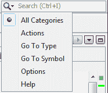

*   **Plugin manager:** From **Tools | Plugins**, you will have the plugin manager from where you can add, remove, or update features. Also, many interesting third-party plugins are available from the plugin portal. Note that from the installed plugin's list, you can deactivate or uninstall plugins (CVS, Mercurial, and so on), which are not of your concern right now, but you may do that to free some resources, and add back those plugins whenever you want:

    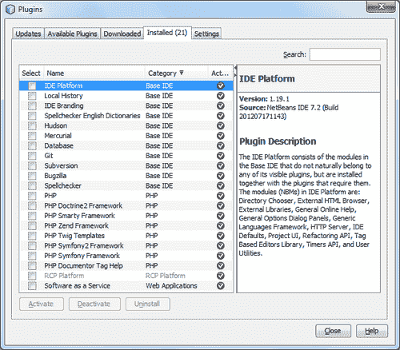

*   **Project manager:** From **Window | Projects** or by pressing *Ctrl+1*, you can fix the **Project Manager** pane of the IDE to perform operations on each of the available projects. Project operations, such as run, debug, test, generate documentation, check local history, set configuration, and set project properties can all be done at the project manager window:

    

*   **File manager:** From **Window | Files** or by pressing *Ctrl+2*, you can fix the **File Manager** pane of the IDE to browse project files or to manipulate general file operations on the files available to the IDE:

    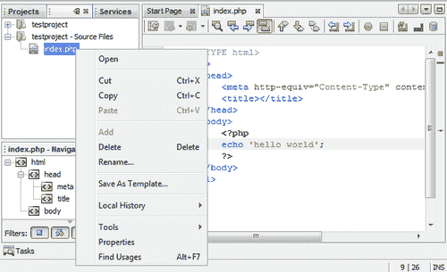

*   **Services manager:** From **Window | Services** or by pressing *Ctrl+5*, you can fix the **Services Manager** pane of the IDE to use the pre-registered **Software as a Service** (**SaaS**) web-service components. Drag the item from the **Services** tab, drop the item in the resource class, and you will have the necessary code generated to access the service. Also, the **Services** pane gives you access to all your connected databases:

    

*   **Task manager:** From **Window | Tasks** or by pressing *Ctrl+6*, you can fix the **Tasks Manager** or Action Items pane of the IDE. NetBeans IDE automatically scans your code and lists the commented lines containing words, such as `TODO` or `FIXME`, and lines with compile errors, quick fixes, and style warnings. Connect to a bug database—**Bugzilla**, and list issue reports for your project right in the IDE. Note that double-clicking on a task will take you straight to where it has been declared:

    

*   **Navigate:** From the **Navigate** menu, the IDE provides navigation to a file, type, symbol, line, bookmark, and so on. Such features are used for a quick jump over the desired location in the project, or outside of it:

    

    如前一个屏幕截图所示，只要我们输入文件名，IDE 就会在**匹配文件**框中显示匹配文件名的动态列表，以便您可以快速打开该文件：

    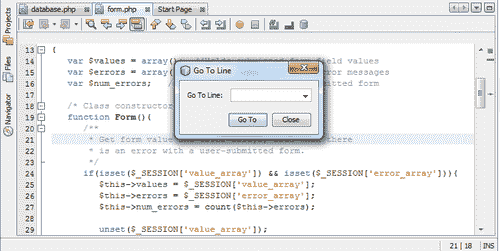

    ### 提示

    按*Alt+Shift+O*打开**转到文件**、*Ctrl+O*打开**转到类型**、*Ctrl+B*打开**转到声明**、*Ctrl+G*打开**转到行**等等。

*   **Templates and sample applications:** You can start a similar new project with the given sample applications in the IDE. To do this, start a new project by pressing *Ctrl+Shift+N* and choose **Samples | PHP** from **Project Categories**. Also, you may use templates, such as the templates of PHP files, and web pages from **Tools | Templates:**

    

*   **Customizable workspace and windows:** The entire IDE workspace is fully customizable, so that you can drag, slide, resize, and place toolbars & panes to your desired place. Also, you can dock or undock panes at your workspace, to make it fully comfortable for access and use:

    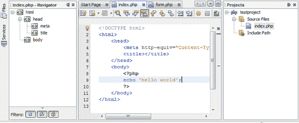

    ### 提示

    您可以轻松管理工作区中的窗口；双击编辑器选项卡以展开它。*Ctrl+Tab*显示打开的文件列表，再次按下将使其在编辑器选项卡之间切换。*Ctrl+Pageup/Down*在打开的文件之间切换。按*Ctrl+W*关闭当前文件窗口。

*   **Multiple monitors:** You can undock any editor tab and drag it outside the IDE, so that it can act like an independent window, and you can easily move it to a second screen. Also, you can reverse the procedure to dock it back again in the previous screen. Note that all of the shortcuts will remain the same in the second screen; for example, drag out the **Files** tab and click anywhere else in the IDE, and then press *CTRL+2* to regain focus on the files window.

    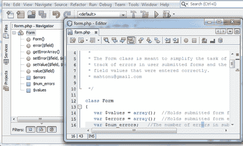

*   **本地历史记录：**本地历史记录类似于一个经典的版本控制系统，它存储文件的多个版本。但是，该存储仅在 NetBeans 安装的本地。本地历史允许您及时检查文件和文件夹中的内容，允许您**区分**它们，最重要的是，允许您将源回滚到以前的某个状态，或还原已删除的文件或文件夹。
*   **Spellchecker:** Spellcheck the text in the editor.

    ### 注

    有关 NetBeans IDE 键盘快捷键，请参见附录。

## 突击测验-熟悉 IDE 的基本功能

1.  哪一项不是 IDE 功能？
    1.  源代码编辑器
    2.  调试器
    3.  插件管理器
    4.  源代码优化器
2.  在哪个菜单下可以启用或聚焦所有 IDE 窗口？
    1.  文件菜单
    2.  工具菜单
    3.  导航菜单
    4.  Windows 菜单
3.  打开**转到文件**窗口的正确命令是什么？
    1.  CTRL+F
    2.  CTRL+SHIFT+O
    3.  ALT+SHIFT+O
    4.  CTRL+G
4.  为什么使用键盘快捷键*CTRL+SHIFT+N*？
    1.  打开新模板文件的步骤
    2.  打开一个新的 PHP 文件
    3.  打开一个新的 PHP 项目
    4.  打开“项目”窗口的步骤
5.  修复**文件管理器**窗格的快捷键是什么？
    1.  CTRL+1
    2.  CTRL+2
    3.  CTRL+3
    4.  CTRL+5

# 探索 PHP 编辑器

在本节中，我们将学习如何在 NetBeans 中充分利用 PHP 编辑器。编辑器提供了非常方便的代码编写特性，我们将通过在编辑器中测试来学习这些重要特性。一旦我们熟悉了以下特性，我们就可以控制编辑器了。您所要做的只是练习针对以下特性提到的命令。我们开始：

*   **Syntax highlighting:** This editor enables the highlighting of syntax elements, such as PHP keywords, variables, constants, HTML tags, and input form attributes. In the editor, the current line is marked with a light blue background, and the line where any error occurred is displayed with a red underline, as shown in the following screenshot:

    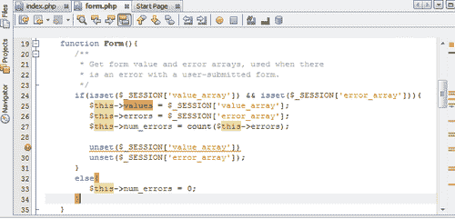

    ### 提示

    双击以选择语法元素。按*Ctrl+F*进行语法搜索，突出显示语法元素的所有出现。

*   **Go To Declaration:** The **Go To Declaration** feature provides an instant jump to the line where a variable or method has been declared from its occurrence:

    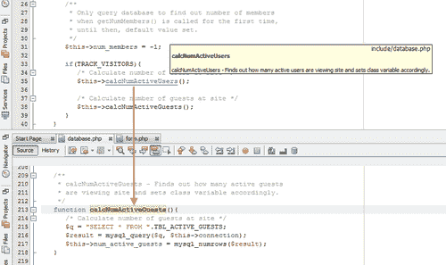

    ### 提示

    要使用此功能，请将光标放置在所需的变量或方法上，然后按*Ctrl+B*，或单击屏幕右侧出现的上下文菜单，选择**导航|转到声明**将光标放置在声明行的开头。按*Ctrl+左键单击*也会将您指向该声明，以及高亮显示的所有事件。

*   **Code navigator:** The **Code navigator** pane dynamically lists the in-file PHP structure, HTML tags in hierarchical order; simply, it lists the namespaces, functions, methods, classes, variables, class properties, HTML tags, and so on within the file. Double-click on any item on the list to go to that declaration:

    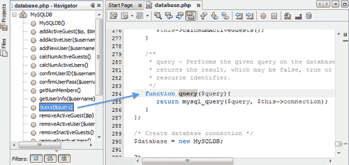

    ### 提示

    从**窗口【导航】导航器**或按*Ctrl+7*键，您可以聚焦代码导航器窗格。列出的项目根据相关项目属性进行图标化。

*   **Code folding:** The editor provides you with the code block fold/unfold feature for classes, methods, comment blocks, HTML tags, CSS style classes, and so on. You can fold/unfold large code blocks using such features, right beside the left margin of the editor, as shown in the following screenshot:

    

    ### 提示

    单击屏幕左侧的“”或“+”按钮以折叠和展开代码块。

*   **Smart indent:** The editor provides an automatic indentation before the code, while typing and hitting on new lines:

    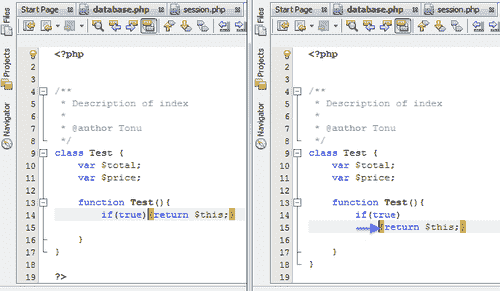

    键入一个`if` 或`for`语句行，然后按*Enter*查看下一行缩进。

*   **Formatting:** To make the code more understandable, the editor provides you with a formatting facility, which maintains appropriate statement hierarchy and applies line breaks, spaces, indents, and so on within the code file:

    

    ### 提示

    选择要格式化的代码块。右键点击关联菜单，选择**格式**，或按*Alt+Shift+F*。要格式化整个代码文件，请选择**源代码**格式，或按*Ctrl+A*和*Alt+Shift+F*键。

*   **Bracket completion:** The consecutive second character of the paired characters item such as single quotes (''), double quotes (""), braces (()), and brackets ([]) are automatically added with the first character type, and the paired consecutive character is removed with the first one deleted again. Also, the pair of curly brackets ({}) is completed when the first character is typed, and *Enter* is pressed. A pair of braces, curly braces, and brackets are highlighted with the yellow color when any of the characters from matching pairs are pointed at with the cursor, as follows:

    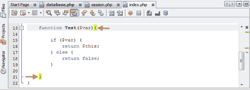

*   **Parameter hints:** The editor prompts you to choose the formal parameters of a PHP default or custom function just as soon as you start typing that function name. The automatic suggestion list with the function names and parameters will show at the bottom of the cursor, and the description of that selected function will show at the top of the cursor:

    

    在上一个自动建议列表中，您可以使用`Up/Down`箭头键进行遍历。您可以点击*输入*插入带有占位符的所需函数名，在括号内插入参数：

    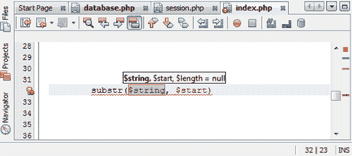

*   **Defining a variable type in comments:** You can define a variable and its type in comments, in the format `/* @var $variable type */`. The `var` tag will be in bold font, if the comment was written correctly:

    

    在前面的屏幕截图中，您可以看到变量名称和类型的注释如何支配自动建议。在前面的示例中，您可以看到方法名是从相应的类名中选取的，在注释中作为变量类型提到。

    键入`vdoc`，然后按`Tab`使用变量文档的代码模板。将生成一条注释，该注释定义了一个变量。选择变量名后，更改变量名，再按`Tab`更改类型：

    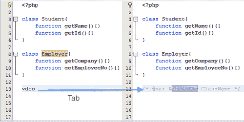

    代码模板在注释位置的上下文中自动生成变量名称和类型；也就是说，如果您在使用变量之前使用模板，那么它将建议使用该变量的名称和类型。

*   **Error messages:** The editor parses your PHP code while typing, marks the syntax errors with a red underline, places a red error bullet in the left margin, and a red error scroll position in the right margin.

    

    ### 提示

    通过将鼠标悬停在错误行上或单击屏幕左侧的红色错误项目符号，可以在工具提示中查看错误详细信息。按*Alt+Enter*显示错误提示。

    有关 NetBeans IDE 键盘快捷键，请参见附录。

## 突击测验-探索 PHP 编辑器

1.  哪些功能不是编辑器功能？
    1.  源代码格式
    2.  代码自动完成
    3.  语法突出显示
    4.  调试
2.  如何格式化代码块？
    1.  右键点击关联菜单选择代码块，选择**格式**
    2.  选择代码块并按*ALT+SHIFT+F*
    3.  选择代码块并选择**源|格式**
    4.  所有这些
3.  什么是语法搜索键盘命令？
    1.  *CTRL+W*
    2.  *CTRL+F*
    3.  *CTRL+ALT+F*
    4.  *CTRL+SHIFT+S*
4.  如何去声明一个方法？
    1.  将光标放在方法上，按*CTRL+B*
    2.  右键点击方法名称，从上下文菜单中选择**导航**进入声明
    3.  按*CTRL 键并在方法名称上左键点击*
    4.  所有这些

# 与编辑一起探索更多

我们已经了解了编辑器，并练习了作为提示给出的快捷方式。在接下来的两个部分中，我们将学习使用编辑器的重命名重构、代码完成和代码生成器功能，这些功能对于提高编码效率非常有用。

在下一节中，我们将讨论并实践以下重要的编辑器功能：

*   重命名重构和即时重命名
*   代码完成
*   代码生成器

# 使用重命名重构和即时重命名

可以在项目中的所有文件中重命名元素（例如类名）。通过此功能，您可以预览所需重命名的每个位置中可能发生的更改，并且可以从重命名中排除单个事件。

即时重命名允许您重命名文件中的元素。即时重命名时，将光标放在要重命名的名称上，按*Ctrl+R*；如果即时重命名适用于该变量，则该变量的所有实例将突出显示如下：

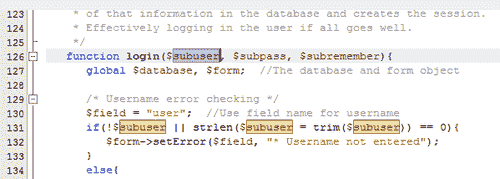

即使更改该名称的一个实例，也会同时重命名文件中的所有其他实例：

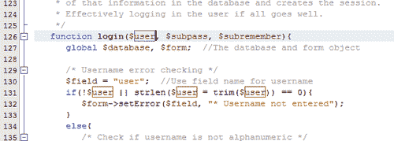

要使用重命名重构，请选择要重命名的元素，然后右键单击，然后选择**重构|重命名**。将打开一个对话框，供您重命名元素，如下一个屏幕截图所示：

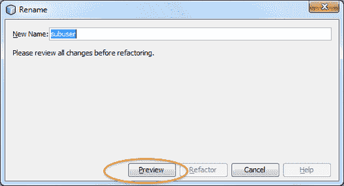

在此屏幕截图中，为元素提供一个新名称，然后单击**预览**。此时将打开重构窗口，其中包含项目中列出的元素的所有实例：

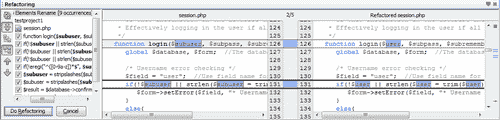

从这个屏幕截图中，您可以排除实例并对所选实例应用**进行重构**。

### 注

有关 NetBeans IDE 键盘快捷键，请参见附录。

## 突击测验-使用重命名重构和即时重命名

1.  如何在整个项目中重构变量名？
    1.  选择变量，然后右键单击并选择**重构|重命名**
    2.  将光标放在变量名上，按*CTRL+SHIFT+R*
    3.  选择变量，选择**源|重命名**
    4.  以上都没有
2.  哪个是即时重命名变量的快捷方式？
    1.  *SHIFT+ALT+R*
    2.  *CTRL+R*
    3.  *CTRL+ALT+R*
    4.  *CTRL+SPACE+R*

# 使用代码完成

代码完成功能使我们能够用最少的击键或仅用键盘命令来完成所需的语法、方法或代码。

### 提示

您可以从**工具【选项】编辑器【代码完成】T1】启用/禁用自动代码完成。默认情况下，所有语言都有复选框。从**语言**下拉列表中选择 PHP，以获得更多特定于 PHP 的代码完成选项。**

以下是编辑器提供的代码完成功能：

*   **Snippets:** This automatically generates code snippets for various elements.

    

    选择**工具【托盘】PHP**代码剪辑，打开**托盘管理器**。从**托盘内容**中拖动相关项目图标，并将其放到代码中的相关位置。将出现一个对话框，用于指定相应代码项的参数。填写参数，并在该位置生成代码。

*   **Context-sensitive proposals:** The editor provides context-sensitive proposals for any number of starting symbols for:
    *   一个 PHP 关键字，包括 `if, else, elseif, while, switch, function`等。
    *   PHP 内置函数。
    *   A pre-defined or user-defined variable.

        键入关键字或函数名的起始字符，然后按*Ctrl+空格*键。下拉列表将显示该背景下的所有适用提案。每个方案均附有说明和参数提示：

        

    要生成适用于当前上下文的 PHP 关键字列表，请在不键入任何内容的情况下按*Ctrl+Space*栏：

    

    要获取变量提示，请键入美元（`$`符号。将显示当前可用的本地和全局变量列表：

    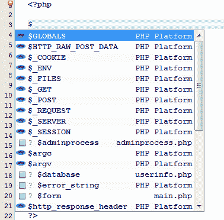

*   **Code templates and abbreviations:** This obtains the expanded code template by using defined abbreviations of that template, such as `cls` for a class template, and is the most interesting code-completion feature. To use this functionality, type the abbreviation and press *Tab:*

    

    您可以看到缩写被替换为相应的 PHP 关键字，并且编辑器已经提供了该关键字的代码模板，如以下截图所示：

    

    要查看代码模板及其相关缩写的列表，请选择**工具|选项|编辑器|代码**模板。您可以添加/删除或编辑 PHP 代码模板，如以下屏幕截图所示：

    

    请注意，编码方法会随着时间的推移而变化。因此，建议每隔几个月检查一次模板，并根据任何新的更改进行更新。

*   **Code completion in constructors:** After the `new` keyword, code completion is displayed along with the list of constructors and parameters for all the classes available in the current project:

    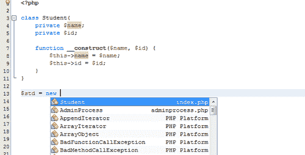

*   **SQL code completion:** When a string begins with SQL keywords such as `select` and `insert`, pressing *Ctrl+Space* after that keyword enables the SQL code-completion feature inside the editor. You can select the database connection in the first step, as shown in the following screenshot:

    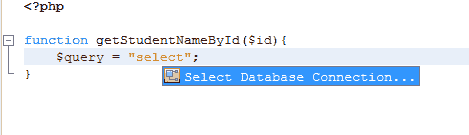

*   Along with being selected, all the database connections registered with the IDE will be displayed as follows:

    

*   After selecting the database connection, the SQL code completion feature offers all the tables associated with that connection:

    

    此外，将显示该表中的列列表（如果有）。SQL 代码完成也适用于表别名。

*   **PHP5.3 名称空间：**代码完成支持 PHP5.3 名称空间。
*   **Overridden and implemented methods:** Code completion between class members offers to override or implement methods.

    ### 提示

    按*Ctrl+空格*键，无论您想在何处使用代码补全。

    有关 NetBeans IDE 键盘快捷键，请参见附录。

## 突击测验-使用代码完成

1.  为什么要使用代码完成功能？
    1.  重构变量
    2.  编写一个新的 PHP 类
    3.  完成所需的语法、方法或代码
    4.  完成一个 PHP 项目
2.  代码完成功能不支持哪种 PHP 语言功能？
    1.  名称空间
    2.  类声明
    3.  重写方法
    4.  以上都没有
3.  启用上下文相关提案的快捷方式是什么？
    1.  Ctrl+Shift+Space
    2.  Ctrl+空格键
    3.  Ctrl+S
    4.  Ctrl+Alt+Space

# 使用代码生成器

编辑器提供上下文敏感的代码生成器，以便生成数据库连接、构造函数、getter 或 setter 等。特定的代码生成器将出现在光标位置的上下文中。例如，在类内部，它将显示用于生成构造函数、getter、setter 等。

例如，在类中按*Alt+Insert*打开所有可能的代码生成器，如下图所示：

我们将讨论以下代码生成器：

*   **Constructors:** Inside a PHP class (but not inside any method's body), you can open the constructor generator by pressing *Alt+Insert*. Select **Generate Constructor**, and a dialog box similar to the following screenshot will appear:

    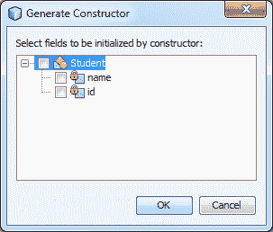

    该窗口附带一个可用字段列表，您可以在构造函数中初始化这些字段。字段名用作构造函数的参数。您可以决定不选择任何字段；在这种情况下，将生成一个空构造函数。

*   **Getters and setters:** By pressing the code generator command inside a PHP class, you can choose **Getters..., Setters...**, or **Getters and Setters** to view the possible functions. If you already have setters, then you will only view the getter methods:

    

    选择**getter/setters**后，出现上一个屏幕截图；您可以指定要为哪个属性生成**getter**或**setter**方法，并可以灵活地选择该方法的命名约定。

*   **Overridden and implemented methods:** You can open the code generator for overridden and implemented methods when there are multiple methods inside the class. A dialog box opens, showing the methods you can insert, and indicates whether they are overridden or implemented:

    

    ### 注

    NetBeans IDE 键盘快捷键见*附录*。

## 突击测验-使用代码生成器

1.  在 PHP 类中打开代码生成器的快捷方式是什么？
    1.  Alt+Insert
    2.  Shift+Alt+Insert
    3.  Ctrl+Alt+Insert
    4.  Ctrl+Insert
2.  什么不能使用代码生成器生成？
    1.  建设者
    2.  接球手和接球手
    3.  重写的方法
    4.  串

# 总结

在本章中，我们发现了 PHP 编辑器的有用特性，并练习了在编写代码时应用的技巧。熟悉我们所看到的编辑器快捷方式将帮助您更快、正确地编写代码。

我们特别关注：

*   PHP 编辑器的功能和快捷方式
*   重命名重构和即时重命名
*   代码补全的使用
*   代码生成器的使用

因此，到目前为止，我们已经准备好了 PHP 开发环境。我们已经安装了 IDE，并学习了如何在需要时使用这些很酷的编辑器功能。在下一章中，我们将直接深入到现实生活中的 PHP 编码，并将开发一个 PHP 项目，以掌握使用 NetBeans 开发 web 应用程序的过程。