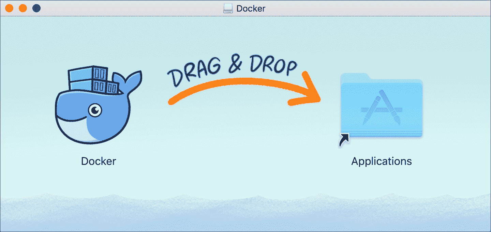
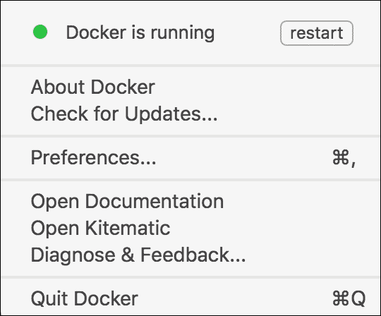
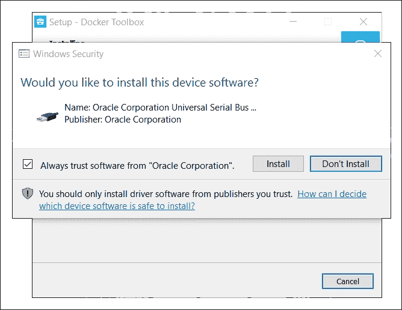
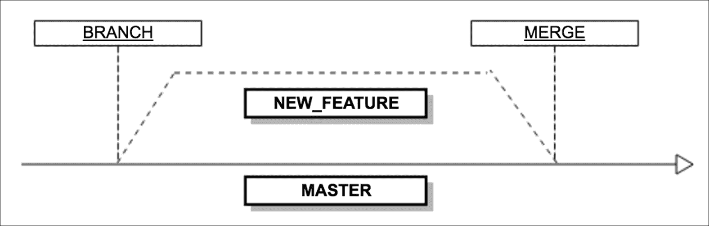
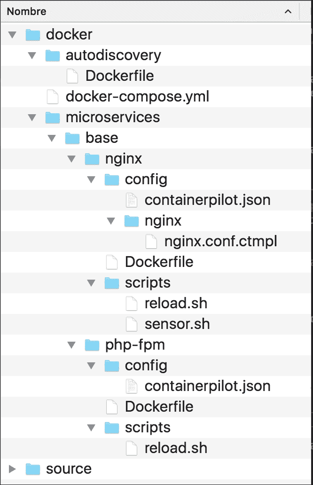
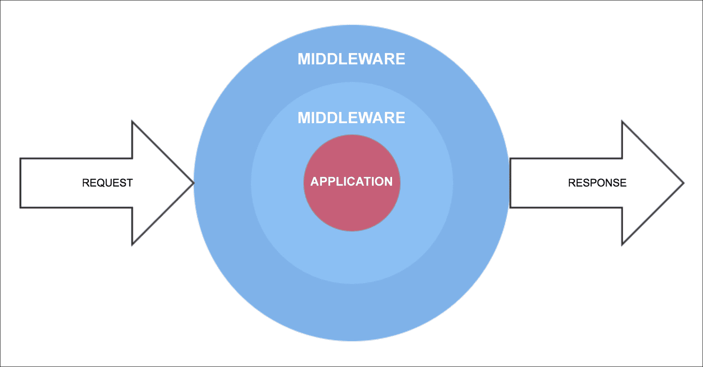

# 第二章发展环境

在本章中，我们将开始基于微服务构建我们的应用程序，现在我们知道了为什么微服务对于我们的应用程序的开发是必要的，以及如果我们将应用程序基于微服务，我们可以享受的优势。

我们将在本书中开发的应用程序（类似于口袋妖怪 GO）称为*发现秘密*。这个应用程序就像一个游戏，使用地理定位来发现世界各地的不同秘密。整个世界都有很多隐藏的秘密，玩家必须尽快找到它们。有 100 种不同类型的秘密，它们每天都会在世界不同的地方产生和出现，因此玩家可以在不同的区域走动，查看附近是否有任何类型的秘密，从而找到它们。

这些秘密将保存在应用程序钱包中，如果玩家发现钱包中已有的秘密，他们将无法收集。

如果玩家接近，他们将能够与其他玩家决斗。决斗包括掷骰子以获得最高数字，输的玩家将随机给另一个玩家一个秘密。

在接下来的章节中，具体功能将更加详细，但在本章中，我们只需要了解应用程序的工作原理，就可以大致了解整个应用程序，从而开始构建基于微服务的基本平台。

# 构建微服务基础平台的设计和架构

基于微服务创建应用程序与单一应用程序不同。因此，我们必须将我们的功能划分为不同的服务。要做到这一点，必须根据每个微服务的需求进行适当的设计和结构。

该设计负责将应用程序划分为逻辑部分，并根据它们之间的现有关系对它们进行分组。该体系结构负责定义哪些具体元素支持每个微服务，例如，数据存储的位置或服务之间的通信。

在本书中，我们将遵循每个微服务的给定结构。在下图中，您将看到其中一个微服务的结构，其余的都是类似的；但是，有些部件是可选的：


所有对我们微服务的请求都来自**反向代理**，因为这允许我们平衡负载。另外，我们使用**NGINX**作为内置 PHP 的**API**的网关。为了降低 PHP 和**NGINX**的负载并提高性能，我们可以使用**缓存**层。

如果我们需要执行大的、消耗资源的任务，或者这些任务不需要在具体的时间窗口中执行，我们的**API**可以使用**队列**系统。

如果我们需要存储一些数据，我们的**API**负责管理访问并将数据保存在我们的**数据存储**中。

### 注

在本书中，我们将使用容器化，这是一种新的虚拟化方法，它可以旋转容器而不是完整的虚拟机。每个容器将只安装运行应用程序所需的最低资源和软件。

我们可以使用遥测（这是一个从容器获取统计数据的系统）和自动发现（这是一个帮助我们查看哪些容器正常工作的系统）来监控容器生态系统。

# 开始使用微服务的要求

现在您已经了解了为什么可以在下一个项目中使用 PHP（特别是最新版本，版本 7），现在是时候讨论 microservices 项目成功的其他要求了。

您可能已经考虑到了应用程序可伸缩性的重要性，但是如何在预算内做到这一点呢？响应是虚拟化。有了这项技术，您将减少资源浪费。过去，同一硬件上一次只能执行一个**操作系统**（**OS**），但随着虚拟化的诞生，您可以同时运行多个 OS。项目中最大的成就是，您将运行更多专用于微服务的服务器，但使用更少的硬件。

考虑到虚拟化和容器化提供的优势，现在在基于微服务的应用程序开发中使用容器是默认标准。有多个集装箱化项目，但使用和支持最多的是 Docker。因此，这是开始使用微服务的主要要求。

以下是我们将在 Docker 环境中使用的不同工具/软件：

*   PHP7
*   数据存储：Percona、MySQL、PostgreSQL
*   反向代理：NGINX、Fabio、Traefik、，
*   依赖关系管理：composer
*   测试工具：PHPUnit、Behat、Selenium
*   版本控制：Git

在[第 5 章](05.html "Chapter 5. Microservices Development")*微服务开发*中，我们将解释如何将每一项添加到我们的项目中。

由于我们的主要需求是一个集装箱化套件，我们将在以下章节中解释如何安装和测试 Docker。

## 码头安装

Docker 可以从两个不同的通道安装，每个通道各有优缺点：

*   **稳定频道**：顾名思义，您从该频道安装的所有内容都经过了全面测试，您将拥有最新 GA 版本的 Docker 引擎。这是最可靠的平台，因此适用于生产环境。通过这个渠道，发布遵循一个版本计划，有很长的测试和测试时间，只是为了确保一切都能按预期工作。
*   **Beta 频道**：如果您需要最新的功能，这是您的频道。所有安装程序都附带了 Docker engine 的实验版本，可以在其中发现 bug，因此不建议将其用于生产环境。该频道是 Docker beta 计划的延续，您可以提供反馈，并且没有版本计划，因此您将有更频繁的版本发布。

我们将为一个稳定的生产环境而开发，因此您可以暂时忘记 beta 频道，因为您需要的只是稳定的版本。

Docker 出生于 Linux，因此最好的实现就是针对这个操作系统。对于其他操作系统，如 Windows 或 macOS，您有两个选项：本机实现和工具箱安装（如果无法使用本机实现）。

### 在 macOS 上安装 Docker

在 macOS 上，您有两种安装 Docker 的选项，具体取决于您的机器是否符合最低要求。对于相对较新的机器（OS X 10.10 Yosemite 及更高版本），您可以安装使用 Hyperkit 的本机实现，Hyperkit 是一种构建在**Hypervisor.Framework**之上的轻量级 OS X 虚拟化解决方案。如果您的旧机器不符合最低要求，则可以安装 Docker 工具箱。

#### Mac 的 Docker（别名，本机实现）与 Docker 工具箱

Docker 工具箱是 Docker 在 macOS 上的第一个实现，它没有深入的操作系统集成。它使用 VirtualBox 来旋转一台 Linux 虚拟机，Docker 将在其中运行。使用将运行所有容器的**虚拟机**（**VM**）存在许多问题，最明显的是性能差。但是，如果您的计算机与本机实现的要求不匹配，则这是理想的选择。

Docker for Mac 是一个具有本机用户界面和自动更新功能的本机 Mac 应用程序，它与 OS X 本机虚拟化（Hypervisor.Framework）、网络和文件系统进行了深入集成。这个版本比 Docker 工具箱更快、更容易使用、更可靠。

#### 最低要求

*   Mac 必须是 2010 或更高型号，具有 Intel 对**内存管理单元**（**MMU**虚拟化的硬件支持；即**扩展页表**（**EPT**）
*   OS X 10.10.3 约塞米蒂或更新版本
*   至少 4 GB 的 RAM
*   不得安装 4.3.30 版之前的 VirtualBox（它与 Docker for Mac 不兼容）

#### Mac 安装过程的 Docker

如果您的机器通过要求，您可以从官方页面下载 Docker for Mac，即[https://www.docker.com/products/docker](https://www.docker.com/products/docker) 。

将映像下载到计算机上后，可以执行以下步骤：

1.  Double-click on the downloaded image (called `Docker.dmg`) to open the installer. Once the image is mounted, you need to drag and drop the Docker app into the `Applications` folder:

    

    在安装过程中，`Docker.app`可能会要求您输入密码，以便在特权模式下安装和设置网络组件。

2.  安装完成后，Docker 将出现在您的 Launchpad 和`Applications`文件夹中。执行应用程序以启动 Docker。Docker 启动后，您将在工具栏中看到鲸鱼图标。这将是您对设置的快速访问。
3.  Click on the toolbar whale for **Preferences...** and other options:

    

4.  点击**关于 Docker**查看您是否正在运行最新版本。

### 在 Linux 上安装 Docker

Docker 生态系统是在 Linux 上开发的，因此在这个操作系统上的安装过程更容易。在以下几页中，我们将只介绍在**社区企业操作系统**（**CentOS**）/**红帽企业 Linux**（**RHEL**）（他们使用 yum 作为包管理器）和 Ubuntu（使用 apt 作为包管理器）上的安装。

#### CentOS/RHEL

Docker 可以在 CentOS 7 和任何其他二进制兼容的 EL7 发行版上执行，但这些兼容发行版不测试或支持 Docker。

#### 最低要求

安装和执行 Docker 的最低要求是拥有 64 位操作系统和 3.10 或更高版本的内核。如果需要了解当前版本，可以打开终端并执行以下命令：

```php
$ uname -r 
3.10.0-229.el7.x86_64 

```

请注意，建议您的操作系统保持最新，因为这样可以避免任何潜在的内核错误。

#### 使用 yum 安装 Docker

首先，您需要有一个具有 root 权限的用户；您可以作为该用户登录您的计算机，或在您选择的终端上使用`sudo`命令。在以下步骤中，我们假设您使用的是 root 用户或特权用户（如果您不使用 root 用户，则将 sudo 添加到命令中）。

首先，确保所有现有软件包都是最新的：

```php
yum update

```

现在您的机器有了最新的可用软件包，您需要添加官方 Docker`yum`存储库：

```php
# tee /etc/yum.repos.d/docker.repo <<-'EOF' 
[dockerrepo] 
name=Docker Repository 
baseurl=https://yum.dockerproject.org/repo/main/centos/7/ 
enabled=1 
gpgcheck=1 
gpgkey=https://yum.dockerproject.org/gpg 
EOF

```

将 yum 存储库添加到 CentOS/RHEL 后，您可以使用以下命令轻松安装 Docker 软件包：

```php
yum install docker-engine 

```

您可以使用`systemctl`命令将 Docker 服务添加到操作系统的启动中（此步骤是可选的）：

```php
systemctl enable docker.service

```

相同的`systemctl`命令可用于启动服务：

```php
 systemctl start docker 

```

现在您已经安装并运行了所有内容，因此可以开始测试和使用 Docker。

### 安装后设置-创建 Docker 组

Docker 作为绑定到 Unix 套接字的守护进程执行。此套接字归 root 所有，因此其他用户访问它的唯一方法是使用`sudo`命令。每次使用 Docker 命令时使用`sudo`命令可能会很痛苦，但您可以创建一个名为`docker`的 Unix 组，并将用户分配给该组。通过做这个小改动，Docker 守护进程将启动并将 Unix 套接字的所有权分配给这个新组。

列出了创建 Docker 组的命令：

```php
groupadd docker
usermod -aG docker my_username

```

执行这些命令后，您需要注销并再次登录以刷新权限。

### 在 Ubuntu 上安装 Docker

Ubuntu 得到官方支持，主要建议使用 LTS（始终建议使用最新版本）：

*   Ubuntu Xenial 16.04（LTS）
*   Ubuntu Trusty 14.04（LTS）
*   UbuntuPrecision12.04（LTS）

与前面的 Linux 安装步骤一样，我们假设您使用的是 root 用户或特权用户来安装和设置 Docker。

#### 最低要求

与其他 Linux 发行版一样，需要 64 位版本，内核版本至少需要为 3.10。较旧的内核版本已知会导致数据丢失和频繁内核恐慌的 bug。

要检查当前内核版本，请打开您喜爱的终端并运行：

```php
$ uname -r
3.11.0-15-generic 

```

#### 使用 apt 安装 Docker

首先，确保您的 apt 源指向 Docker 存储库，特别是如果您以前从 apt 安装过 Docker。此外，请更新您的系统：

```php
apt-get update 

```

现在，您的系统已更新，是时候安装一些必需的软件包和新的 GPG 密钥了：

```php
apt-get install apt-transport-https ca-certificates 
apt-key adv --keyserver hkp://p80.pool.sks-keyservers.net:80 --recv-keys \ 58118E89F3A912897C070ADBF76221572C52609D 

```

使用 Ubuntu，添加官方 Docker 存储库非常容易；您只需在您喜爱的编辑器中创建（或编辑）该`/etc/apt/sources.list.d/docker.list`文件。

如果使用旧存储库中的前几行，请删除所有内容并添加以下条目之一。确保与当前 Ubuntu 版本匹配：

```php
 Ubuntu Precise 12.04 (LTS):  
    deb https://apt.dockerproject.org/repo ubuntu-precise main 
    Ubuntu Trusty 14.04 (LTS):
    deb https://apt.dockerproject.org/repo ubuntu-trusty main 
    Ubuntu Xenial 16.04 (LTS):
    deb https://apt.dockerproject.org/repo ubuntu-xenial main 

```

保存文件后，需要更新`apt`包索引：

```php
apt-get update 

```

如果 Ubuntu 上有以前的 Docker repo，则需要清除旧的 repo：

```php
apt-get purge lxc-docker 

```

在 Trusty 和 Xenial 上，建议您安装允许您使用 AFUS 存储驱动程序的`linux-image-extra-*`内核包。要安装它们，请运行以下命令：

```php
apt-get update && apt-get install linux-image-extra-$(uname -r) linux-image-extra-virtual 

```

确切地说，Docker 需要 3.13 内核版本，因此请确保您拥有正确的内核；如果您的版本较旧，则必须升级。

此时，您的机器将完全可以安装 Docker。只需一个命令即可完成，如`yum`：

```php
apt-get install docker-engine 

```

现在您已经安装并运行了所有内容，可以开始玩和测试 Docker 了。

#### Ubuntu 常见问题

如果在使用 Docker 时看到与交换限制相关的错误，则需要在系统上启用内存和交换。可以通过以下给定步骤在 GNU GRUB 上完成：

1.  编辑`/etc/default/grub`文件。
2.  设置`GRUB_CMDLINE_LINUX`如下：

    ```php
            GRUB_CMDLINE_LINUX="cgroup_enable=memory swapaccount=1"

    ```

3.  更新 grub:

    ```php
     update-grub

    ```

4.  重新启动系统。

#### UFW 转发

Ubuntu 附带了**简单的防火墙**（**UFW**），如果它在运行 Docker 的主机上启用，则需要进行一些调整，因为默认情况下，UFW 将丢弃任何转发流量。此外，UFW 将拒绝任何传入流量，使您的容器无法从其他主机到达。启用 TLS 时 Docker 默认端口为 2376，其他情况下为 2375。在干净的安装上，Docker 在未启用 TLS 的情况下运行。让我们配置 UFW！

首先，您可以检查是否安装并启用了 UFW：

```php
ufw status

```

现在您已经确定 UFW 已经安装并运行，您可以使用您喜爱的编辑器编辑`config`文件`/etc/default/ufw`，并设置`DEFAULT_FORWARD_POLICY`：

```php
    vi /etc/default/ufw
    DEFAULT_FORWARD_POLICY="ACCEPT"
```

您现在可以保存并关闭`config`文件，在重新启动 UFW 后，您的更改将可用：

```php
ufw reload

```

允许进入 Docker 端口的连接可以通过`ufw`命令完成：

```php
ufw allow 2375/tcp

```

#### DNS 服务器

Ubuntu 及其派生版本使用 127.0.0.1 作为`/etc/resolv.conf`文件中的默认名称服务器，因此当您使用此配置启动容器时，您将看到警告，因为 Docker 无法使用本地 DNS 名称服务器。

如果您想避免这些警告，您需要指定 Docker 使用的 DNS 服务器或在`NetworkManager`中禁用`dnsmasq`。请注意，禁用`dnsmasq`将使 DNS 解析稍微慢一点。

要指定 DNS 服务器，您可以使用您喜爱的编辑器打开`/etc/default/docker`文件，并添加以下设置：

```php
    DOCKER_OPTS="--dns 8.8.8.8"
```

将`8.8.8.8`替换为您的本地 DNS 服务器。如果您有多个 DNS 服务器，您可以添加多个用空格分隔的`--dns`记录。考虑下面的例子：

```php
    DOCKER_OPTS="--dns 8.8.8.8 --dns 9.9.9.9"
```

保存更改后，需要立即重新启动 Docker 守护程序：

```php
service docker restart

```

如果您没有本地 DNS 服务器，并且希望禁用`dnsmasq`，请使用编辑器打开`/etc/NetworkManager/NetworkManager.conf`文件，并注释掉以下行：

```php
    dns=dnsmasq
```

保存更改并重新启动 NetworkManager 和 Docker：

```php
restart network-manager
restart docker

```

### 安装后设置–创建 Docker 组

Docker 作为绑定到 Unix 套接字的守护进程执行。此套接字归 root 所有，因此其他用户访问它的唯一方法是使用`sudo`命令。每次使用 docker 命令时使用`sudo`命令可能会很痛苦，但您可以创建一个名为`docker`的 Unix 组，并将用户分配给该组。进行这个小的更改后，Docker 守护进程将启动并将 Unix 套接字的所有权分配给这个新组。

执行以下步骤以创建 Docker 组：

```php
groupadd docker
usermod -aG docker my_username 

```

完成这些步骤后，您需要注销并再次登录以刷新权限。

#### 启动后备箱上的 Docker

Ubuntu 15.04 及以后版本使用`systemd`系统作为其引导和服务管理器，而 14.10 及以前版本则使用`upstart`系统。

对于 15.04 及以上版本的系统，您可以通过运行给定命令将 Docker 守护程序配置为在引导时启动：

```php
systemctl enable docker

```

在使用旧版本的情况下，安装方法会自动将 upstart 配置为在引导时启动 Docker 守护程序。

### 在 Windows 上安装 Docker

Docker 团队做出了巨大的努力，将他们的整个生态系统应用到任何操作系统中，他们没有忘记 Windows。在 macOS 上，您有两个选项可以在此操作系统上安装 Docker：工具箱和更本机的选项。

#### 最低要求

Docker for Windows 需要 64 位 Windows 10 Pro、企业版和教育版（1511 年 11 月更新，版本 10586 或更高版本），并且必须启用`Hyper-V`软件包。

如果您的计算机运行的是其他版本，则可以安装工具箱，该工具箱要求 64 位操作系统至少运行 Windows 7 并在计算机上启用虚拟化。正如您所看到的，它有更轻的要求。

由于 Docker for Windows 需要至少一个 Pro/Enterprise/Education 版本，并且大多数计算机都有不同的版本，因此我们将解释如何使用工具箱安装 Docker。

#### 安装 Docker 工具

Docker 工具使用 VirtualBox 旋转将运行 Docker 引擎的虚拟机。安装包可从`https://www.docker.com/products/docker-toolbox`下载。

安装好安装程序后，只需双击下载的可执行文件即可开始安装过程。

安装程序显示的第一个窗口允许您向 Docker 发送调试信息，以改善生态系统。允许 Docker 引擎从您的开发环境发送调试信息可以帮助社区发现 bug 并改进生态系统。建议至少在您的开发环境中启用此选项：


就像其他 Windows 安装程序一样，您可以选择安装位置。在大多数情况下，默认设置适合您的开发环境。

默认情况下，安装程序将向您的计算机添加所有必需的软件包和一些附加程序。在安装的这一步中，您可以清除一些不需要的软件。一些可选包如下所示：

*   **Docker compose for Windows**：在我们看来，这是必须的，因为我们将在书中使用该软件包。
*   **Kitematic for Windows:**此应用程序是一个 GUI，可轻松管理容器。如果您对命令行不熟悉，可以安装此软件包。
*   **Git for Windows:**这是另一个必须安装的软件包；我们将使用 Git 来存储和管理我们的项目。

在选择了我们想要安装的软件包之后，是时候执行一些额外的任务了。默认选择的任务适合您的开发环境。

现在，在安装开始之前，您只需确认在前面步骤中完成的所有设置。

安装可能需要几分钟才能完成，因此请耐心等待。

在安装过程中，您可能会收到有关 Oracle 设备安装的警报。这是因为这些工具使用 VirtualBox 来启动虚拟机以运行 Docker 引擎。安装此设备以避免将来的麻烦：



祝贺您的 Windows 计算机上安装了 Docker。不要再浪费一分钟，开始测试和玩你的 Docker 生态系统。

## 如何检查 Docker 引擎、组件和机器版本

现在已安装 Docker，只需打开您喜爱的终端并键入以下命令：

```php
$ docker --version && docker-compose --version && docker-machine --version

```

### 检查 Docker 安装的快速示例

您应该让 Docker 运行并执行以下命令：

```php
$ docker run -d -p 8080:80 --name webserver-test nginx

```

前面的命令将执行以下操作：

*   使用`-d`在后台执行容器
*   用`-p 8080:80`将机器的 8080 端口映射到集装箱的 80 端口
*   使用`--name webserver-test`为您的容器指定一个名称
*   获取 NGINX Docker 映像并使容器运行此映像。

现在，打开您最喜欢的浏览器并导航到`http://localhost:8080`，在那里您将看到一个默认的 NGINX 页面。

### 常见管理任务

通过在终端上执行`docker ps`，您可以看到正在运行的容器。

前面的命令为我们提供了在您的计算机上运行的容器、它们使用的映像、创建时的映像、状态以及端口映射或分配的名称的更深入视图。

一旦你玩完你的容器，是时候停止它了。执行`docker stop webserver-test`则容器将结束其使用寿命。

哎呀！你还需要同样的容器。没问题，因为一个简单的`docker start webserver-test`将再次为您旋转容器。

现在，是停止并移除容器的时候了，因为您将不再使用它。在你的终端上执行`docker rm -f webserver-test`就可以了。请注意，此命令将删除容器，但不会删除我们使用的下载图像。对于最后一步，您可以执行`docker rmi nginx`。

# 版本控制-Git 与 SVN

版本控制是一种工具，它可以帮助您回忆以前版本的源代码，以检查它们并使用它们；它不知道所使用的语言或技术，并且可以在纯文本开发的所有软件中使用版本控制。

我们可以将版本控制工具分为以下几类：

*   **集中式版本**：控制系统需要一个集中式服务器来工作，所有开发人员都需要连接到该服务器，以便同步并从中下载更改。
*   **分布式版本**：控制系统不集中；换句话说，每个开发人员在自己的机器上都有整个管理版本控制系统，因此可以在本地工作，然后与公共服务器或每个开发人员同步。**分布式版本控制系统**（**DVCS**）速度更快，因为它们在集中式或共享服务器上需要的更改更少。

Subversion（SVN）是一个集中式版本控制系统，因此，一些开发人员认为它是尊重整个项目的最佳工作方式，因此开发人员只需要在一个地方编写和读取访问控制器。

整个代码都托管在一个地方，因此可以这样认为，SVN 比 Git 更容易理解。事实上，SVN 命令行更简单，并且有更多的 gui 可用于 SVN。原因很清楚：SVN 从 2000 年就存在了，而 Git 是在 5 年后出现的。

SVN 的另一个优点是版本编号系统更清晰；它使用序列号系统（1,2,3,4…），Git 使用 SHA-1 代码，这更难阅读和理解。

最后，使用 SVN，可以获得一个子目录来使用它，而无需拥有整个项目。这对于小项目来说不是问题，但是当您有一个大项目时，这可能会很困难。

## 吉特

在本书中，我们将使用 Git 进行版本控制。我们之所以做出这个决定，是因为 Git 绝对更快、更轻量级（它占用的磁盘空间比 SVN 少 30 倍）。此外，Git 成为 web 开发版本控制的标准版本控制，我们的目标是使用 PHP 创建基于微服务的应用程序，因此 Git 是该项目的一个很好的解决方案。

Git 的优点如下：

*   分支比 SVN 更轻
*   Git 比 SVN 快得多
*   Git 从一开始就是一个 DVCS，因此开发人员可以完全控制其本地应用程序
*   Git 在分支和合并方面提供了更好的听觉效果

在后面的章节中，我们将在我们的项目中使用 Git 命令，解释每一个并给出例子，但是在那之前，让我们来看看基本的：

**如何创建新的存储库**：创建一个新文件夹，打开它，在其中执行 Git，创建一个新的 Git 存储库。

**如何签出现有存储库**：从执行 Git clone`/path/to/repository`的存储库创建本地副本。如果您使用的是远程服务器（以下几行将解释托管集中式服务器），请执行 Git clone`username@host:/path/to/repository`。

要理解 Git 工作流，必须知道有三种不同的树：


*   **工作目录**：包含您项目的文件
*   **指标**：本工程为中间区域；在提交文件之前，文件将一直在此处
*   **头**：指向最后一次提交

将文件添加到索引并提交它们是很容易的任务。使用项目中的文件并对其进行更改后，必须将其添加到索引中：

*   **如何将文件添加到索引**：建议在将文件添加到索引之前先检查文件。您可以通过执行`git diff <file>`来实现这一点。它将向您显示添加和删除的行，以及有关您修改的文件的一些更有趣的信息。一旦您对所做的更改感到满意，您就可以执行`git add <filename>`来添加特定的文件，或者将 Git 添加到您所修改的所有文件中。
*   **如何向头部添加文件**：一旦你将所有必要的文件都包含在索引中，你就必须提交它们。您可以通过执行`git commit -m "Commit message"`来实现这一点。现在这些文件包含在本地副本的头中，但它们仍然不在远程存储库中。
*   **如何将更改发送到远程存储库**：要将您的 HEAD local copy 中包含的更改发送到远程存储库，请执行`git push origin <branch name>;`您可以选择要包含更改的分支，例如 master。如果您没有克隆现有存储库，并且希望将本地存储库连接到远程存储库，请执行`git remote add origin <server>`。

这些分支用于开发独立的功能，将来可以与主分支合并。创建新存储库时的默认分支称为 master。工作流概述如下所示：



*   **如何创建新分支**：进入要创建新分支的分支后，执行`git checkout -b new_feature`
*   **如何更改分支**：您可以通过执行`git checkout <branch name>`在分支间导航
*   **如何删除分支**：执行`git branch -d new_feature`可以删除分支
*   **如何让您的分支对所有人可用**：只有通过执行`git push origin <branch>`将您的分支上传到远程存储库，其他开发人员才能使用分支

如果您想使用远程存储库上所做的更改更新本地副本，您可以执行`git fetch`检查是否有任何新的更新，然后执行`git pull`获取该更新。

要将活动分支与其他分支合并，请执行`git merge <branch>`，Git 将尝试融合两个分支，但有时，如果两个或多个开发人员更改了同一文件，可能会发生冲突，您需要在合并之前手动解决这些冲突，然后将修改后的文件再次放入索引中。

如果失败，您可能希望丢弃本地更改并再次从存储库中获取更改。您可以通过执行`git checkout -- <filename>`来实现这一点。如果您想丢弃所有本地更改和提交，请执行`git fetch origin and git reset --hard origin/master`。

## 托管

当我们在一个团队中工作时，也许我们希望有一个带有集中式服务器的公共存储库。记住 Git 是一个 DVCS，不需要使用一个地方来集中代码，但是如果您出于不同的原因想使用它，我们将介绍两个著名的地方。

hostings 为您提供了使用 web 界面管理存储库的更好方法。

### GitHub

GitHub 是大多数开发人员选择的代码宿主。它基于 Git，Twitter 和 Facebook 等公司使用这项服务发布他们的开源项目。GitHub 在短短几年内就成为最著名的源代码宿主，目前，许多公司在技术面试前都会要求应聘者提供 GitHub 存储库。

这个主机对所有开发者都是免费的；他们可以创建无限的项目，有无限的合作者，只有一个条件；该项目需要开源和公开。如果你想有一个私人项目，你必须付费。

在 GitHub 上公开您的项目是一个向世界展示您的项目并利用大型 GitHub 社区的好机会。可以寻求帮助，因为有许多注册和活跃的开发人员。

您可以访问官方网站[https://github.com/](https://github.com/) 。

### 比特桶

BitBucket 是托管项目的另一个地方。它使用 Git，但您也可以使用 Mercurial。该接口与 GitHub 非常相似。BitBucket 的一个巨大优势是它的公司——Atlassian。它为开发人员提供了许多托管功能，例如，集成其他 Atlassian 工具的可能性，或允许您构建、测试和部署应用程序的小型连续交付工具。

这一个是免费的，不管你想要什么项目：公共的还是私人的。唯一的限制是每个项目只允许五个合作者；如果你需要更多的人参与你的项目，你就得付钱。

**官网**：[https://bitbucket.org/](https://bitbucket.org/) 。

## 版本控制策略

在开发应用程序时，保持代码整洁非常重要，但在与其他开发人员合作时更为重要。在本节中，我们将向您简要介绍您可以在项目中使用的最著名的版本控制策略。

### 集中作业

对于以前使用 SVN（老式）或类似版本控制的开发人员来说，这种策略最为常见。与 Subversion 一样，项目托管在具有唯一入口点的中央存储库中。除了 master（SVN 中的 trunk）之外，该策略不需要更多的分支。

开发人员在本地机器上克隆整个项目，处理项目，然后提交更改。当他们想要发布更改时，他们执行 push。

### 特征分支工作流

这是集中工作的下一步。它也适用于集中式存储库，但是开发人员在其副本中创建了一个本地功能分支，并且该分支也发布在集中式存储库中，因此所有开发人员都有机会参与该功能。分支机构将具有描述性名称或发行数量。

在这个策略中，master 从不包含错误，因此这对于持续集成来说是一个很大的改进。另外，为每个特性指定特定的分支是一种很好的封装，不会干扰主代码库。

### Gitflow 工作流

Gitflow 工作流添加的新概念并不比功能分支工作流多。它只是为每个分支分配不同的角色。Gitflow 工作流也与集中的存储库一起工作，开发人员在其上创建分支，例如功能分支工作流。但是，这些分支具有特定的功能，例如开发、发布或特性。因此，功能分支将与特定版本合并，然后与主版本合并。通过这种方式，可以为同一项目提供不同的版本。

此策略用于大型项目或需要发布的项目。

### 分叉工作流程

最后一种策略与我们在本章中看到的其他策略完全不同。与从集中式服务器克隆一个副本并对其进行操作不同，这一版本为每个开发人员提供了一个分支。这意味着每个开发者都有两个项目副本：一个*私有*副本和一个*服务器端*。

一旦开发人员做出了他们想要的更改，这些更改将被发送给项目维护人员进行审查和检查，以便他们不会破坏项目，然后它们将与主存储库合并。

此策略用于开源项目，因此开发人员不能破坏当前项目。

### 语义版本控制

在我们的微服务或 API 中有一个版本控制系统是非常重要的。这允许用户和您自己拥有一个一致的版本控制系统，这样每个人都可以知道版本或功能的重要性。

将版本号设置为`MAJOR.MINOR.PATCH`：

1.  当进行不兼容的 API 更改时，`MAJOR`将增加，因此开发人员需要丢弃当前的 API 版本并使用新版本。
2.  当添加新功能且与当前代码兼容时，`MINOR`将递增。因此，开发人员不需要仅仅为了更新当前 API 而更改整个 API。
3.  当前版本的新错误修复完成后，`PATCH`将增加。

这是语义版本控制的总结，但您可以在[中找到更多信息 http://semver.org/](http://semver.org/) 。

# 搭建微服务开发环境

使用 Docker 及其容器生态系统的最大好处之一是，您不需要在机器上安装任何其他东西。例如，如果你需要一个 MySQL 数据库，你不需要在你的本地开发者上安装任何东西；使用您想要的版本旋转容器并开始使用它更容易。

这种开发方式更加灵活，因此我们将在整本书中使用 Docker 容器。在本节中，我们将学习如何构建基本的 Docker 环境；这将是我们的基础，我们将改进和适应这一基础的每一个微型服务在随后的章节。

为了简化项目的文件夹结构，我们将在开发机器上设置一些根文件夹：

*   `Docker`：此文件夹将包含所有 Docker 环境
*   `Source`: This folder will have the source of each of our microservices

    

请注意，此结构是灵活的，可以根据您的特定需求进行更改和调整，而不会出现任何问题。

所有需要的文件都可以在我们的 GitHub 存储库中找到，网址为[https://github.com/php-microservices/docker](https://github.com/php-microservices/docker) ，在带有`chapter-02`标签的主分支上。

让我们深入了解 Docker 设置。打开 docker 文件夹，创建一个名为`docker-compose.yml`的文件，其中包含以下内容：

```php
    version: '2'
    services:
```

这两行表示我们正在使用 Docker compose 的最新语法，它们定义了一个服务列表，我们将在每次执行`docker-compose up`时旋转该列表。我们的所有服务将在`services`声明后添加。

## 自动发现服务

自动发现是一种机制，其中我们不指定每个微服务的端点。我们的每一项服务都使用一个共享注册表，在该注册表中，他们表示自己可用。当一个微服务需要知道另一个微服务的位置时，它可以咨询我们的自动发现注册表以了解所需的端点。

对于我们的应用程序，我们将使用自动发现机制来确保我们的微服务可以轻松地进行扩展，如果节点不健康，我们将停止向其发送请求。为此，我们选择使用 concur（由 HashiCorp 提供），这是一个非常小的应用程序，可以添加到我们的项目中。领事集装箱的主要作用是保持一切有序，保持可用和健康服务的列表。

让我们用您最喜欢的 IDE/编辑器打开您的`docker-compose.yml`文件，并在`services:`行之后添加下一段代码，以此开始项目：

```php
    version: '2'
    services:
        autodiscovery:
            build: ./autodiscovery/
            mem_limit: 128m
            expose:
                - 53
                - 8300
                - 8301
                - 8302
                - 8400
                - 8500
            ports:
                - 8500:8500
            dns:
                - 127.0.0.1

```

在 Docker compose 文件中，语法非常容易理解，并且始终遵循相同的流程。第一行定义了一个容器类型（类似于 devs 的类名）；在我们的例子中，它是`autodiscovery`，在这个容器类型中，我们可以指定几个选项以使容器适应我们的要求。

通过`build: ./autodiscovery/`，我们告诉 Docker 在哪里可以找到一个 Dockerfile，它详细描述了我们在容器中想要什么。

`mem_limit: 128m`语句将`autodiscovery`类型的任何容器的内存消耗限制为不超过 128 Mb。请注意，此指令是可选的。

每个容器都需要打开不同的端口，默认情况下，旋转容器时，没有一个端口打开。因此，您需要指定要为每个容器打开哪些端口。例如，带有 web 服务器的容器需要打开`port 80`，但对于运行 MySQL 的容器，所需的端口可能是`3306`。在我们的情况下，我们正在为每一个`autodiscovery`集装箱开放港口`53`、`8300`、`8301`、`8302`、`8400`和`8500`。

如果您试图到达其中一个打开的端口上的容器，它将不起作用。容器生态系统驻留在一个单独的网络中，只有在您的环境和 Docker 网络之间创建一个桥梁时，您才能访问它。我们的`autodiscovery`容器运行 concur，并且在端口`8500`上有一个很好的 web UI。我们希望能够使用这个用户界面；因此，当我们使用`ports`时，我们将本地`8500`端口映射到集装箱`8500`端口。

现在，是时候在`docker-compose.yml file`的相同路径中创建一个名为`autodiscovery`的新文件夹了。在这个新文件夹中，放置一个名为`Dockerfile`的文件，文件行如下：

```php
    FROM consul:v0.7.0 

```

`Dockerfile`中的这句小句子表示我们正在使用一个带有标签`v0.7.0`的 Docker`consul`图像。此图像将从官方 Docker hub（容器图像的存储库）获取。

在这一点上，做一个`$ docker-compose up`将启动一台领事机，试试看。由于我们没有指定`-d`选项，Docker 引擎会将所有日志输出到您的终端。您可以通过简单的*CTRL*+*C*停止您的容器。添加`-d`选项时，Docker compose 作为守护进程运行并返回提示；你可以做一个`$ docker-compose stop`来阻止容器。

## 微服务基础核心——NGINX 和 PHP-FPM

PHP-FPM 是在 web 服务器中执行 PHP 的旧方法的替代方法。使用 PHP-FPM 的主要好处是其内存占用小，在高负载下具有高性能。现在运行 PHP-FPM 的最好的 web 服务器是 NGINX，它是一种非常轻的 web 服务器，在最重要的项目中使用反向代理。

因为我们的应用程序将使用自动发现模式，所以我们需要一种简单的方法来处理服务注册、注销和运行状况检查。您可以使用的最简单和最快的应用程序之一是 ContainerPilot，这是一个由 Joyent 创建的小型微编排应用程序，它与您最喜欢的容器调度器（在我们的例子中是 Docker compose）一起工作。这个小应用程序将作为 PID 1 执行，并将我们希望在容器中运行的应用程序分叉。

我们将使用 ContainerPilot，因为它免除了开发人员处理自动发现的工作，所以我们需要在我们将使用的每个容器上都有最新版本。

让我们开始定义我们的基本`php-fpm`容器。打开`docker-compose.yml`并为`php-fpm`添加新服务：

```php
    microservice_base_fpm: 
      build: ./microservices/base/php-fpm/ 
    links: 
      - autodiscovery 
    expose: 
      - 9000 
    environment: 
      - BACKEND=microservice_base_nginx 
      - CONSUL=autodiscovery 

```

在前面的代码中，我们定义了一个新服务，一个有趣的属性是 links。该属性定义了我们的服务可以看到或连接的其他容器。在我们的示例中，我们希望将这种类型的容器链接到任何`autodiscovery`容器。如果没有这个明确的定义，我们的`fpm`容器将看不到`autodiscovery`服务。

现在，在 IDE/编辑器上创建具有以下内容的`microservices/base/php-fpm/Dockerfile`文件：

```php
    FROM php:7-fpm 

    RUN apt-get update && apt-get -y install \ 
      git g++ libcurl4-gnutls-dev libicu-dev libmcrypt-dev 
      libpq-dev libxml2-dev 
      unzip zlib1g-dev \ 
      && git clone -b php7 
      https://github.com/phpredis/phpredis.git 
      /usr/src/php/ext/redis \
      && docker-php-ext-install curl intl json mbstring 
      mcrypt pdo pdo_pgsql 
      redis xml \ 
      && apt-get autoremove && apt-get autoclean \ 
      && rm -rf /var/lib/apt/lists/* 

    RUN echo 'date.timezone="Europe/Madrid"' >>  
      /usr/local/etc/php/conf.d/date.ini 
    RUN echo 'session.save_path = "/tmp"' >>  
      /usr/local/etc/php/conf.d/session.ini 

    ENV CONSUL_TEMPLATE_VERSION 0.16.0 
    ENV CONSUL_TEMPLATE_SHA1  
    064b0b492bb7ca3663811d297436a4bbf3226de706d2b76adade7021cd22e156 

    RUN curl --retry 7 -Lso /tmp/consul-template.zip \ 
      "https://releases.hashicorp.com/
      consul-template/${CONSUL_TEMPLATE_VERSION}/
      consul-template_${CONSUL_TEMPLATE_VERSION}_linux_amd64.zip" \ 
    && echo "${CONSUL_TEMPLATE_SHA1}  /tmp/consul-template.zip" 
    | sha256sum -c \ 
    && unzip /tmp/consul-template.zip -d /usr/local/bin \ 
    && rm /tmp/consul-template.zip 

    ENV CONTAINERPILOT_VERSION 2.4.3 
    ENV CONTAINERPILOT_SHA1 2c469a0e79a7ac801f1c032c2515dd0278134790 
    ENV CONTAINERPILOT file:///etc/containerpilot.json 

    RUN curl --retry 7 -Lso /tmp/containerpilot.tar.gz \ 
      "https://github.com/joyent/containerpilot/releases/download/
      ${CONTAINERPILOT_VERSION}/containerpilot-
      ${CONTAINERPILOT_VERSION}.tar.gz" 
      \ 
      && echo "${CONTAINERPILOT_SHA1}  /tmp/containerpilot.tar.gz" 
      | sha1sum -c \ 
      && tar zxf /tmp/containerpilot.tar.gz -C /usr/local/bin \ 
      && rm /tmp/containerpilot.tar.gz 

    COPY config/ /etc 
    COPY scripts/ /usr/local/bin 

    RUN chmod +x /usr/local/bin/reload.sh 

    CMD [ "/usr/local/bin/containerpilot", "php-fpm", "--nodaemonize"] 

```

我们对这个文件所做的是告诉 Docker 它需要如何创建我们的`php-fpm`容器。第一行声明了我们想要用作我们容器的基础的官方版本，在这种情况下，PHP7FPM。一旦图像被下载，第一行`RUN`将添加我们将使用的所有额外`PHP`包。

两个`RUN`语句将添加定制的 PHP 配置；请根据您的要求随意调整这些线路。

完成所有 PHP 任务后，就可以在容器上安装一个小应用程序，帮助我们处理模板--`consul-template`。此应用程序用于使用我们存储在领事服务中的信息动态构建配置模板。

如前所述，我们正在使用 ContainerPilot。因此，在`consul-template`安装之后，我们将告诉 Docker 如何安装此应用程序。

此时，Docker 完成安装所有必需的包，并复制 ContainerPilot 所需的一些配置和 shell 脚本

最后一行以 PID 1 开始 ContainerPilot 并分叉`php-fpm`。

现在，让我们解释一下 ContainerPilot 所需的配置文件。打开 IDE/编辑器，创建包含以下内容的`microservices/base/php-fpm/config/containerpilot.json`文件：

```php
    { 
      "consul": "{{ if .CONSUL_AGENT }}localhost{{ else }}{{ .CONSUL }}
      {{ end }}:8500", 
      "preStart": "/usr/local/bin/reload.sh preStart", 
      "logging": {"level": "DEBUG"}, 
      "services": [ 
        { 
          "name": "microservice_base_fpm", 
          "port": 80, 
          "health": "/usr/local/sbin/php-fpm -t", 
          "poll": 10, 
          "ttl": 25, 
          "interfaces": ["eth1", "eth0"] 
        } 
      ], 
      "backends": [ 
        { 
          "name": "{{ .BACKEND }}", 
          "poll": 7, 
          "onChange": "/usr/local/bin/reload.sh" 
        } 
      ], 
      "coprocesses": [{{ if .CONSUL_AGENT }} 
        { 
          "command": ["/usr/local/bin/consul", "agent", 
            "-data-dir=/var/lib/consul", 
            "-config-dir=/etc/consul", 
            "-rejoin", 
            "-retry-join", "{{ .CONSUL }}", 
            "-retry-max", "10", 
          "-retry-interval", "10s"], 
          "restarts": "unlimited" 
        }
      {{ end }}] 
    } 

```

这个 JSON 配置文件非常容易理解。首先，它定义了在哪里可以找到领事容器，以及我们希望在 ContainerPilot 预启动事件上运行哪个命令。在`services`中，您可以定义要声明当前容器正在运行的所有服务。在`backends`上，您可以定义所有正在侦听更改的服务。在我们的例子中，我们正在监听名为`microservice_base_nginx`的服务的更改（在`docker-compose.yml`上定义了`BACKEND`变量）。如果这些服务上的 concur 发生了变化，我们将在容器中执行`onChange`命令。

有关 ContainerPilot 的更多信息，您可以访问官方页面，即[https://www.joyent.com/containerpilot](https://www.joyent.com/containerpilot) 。

现在是创建具有以下内容的`microservices/base/php-fpm/scripts/reload.sh`文件的时候了：

```php
    #!/bin/bash 

    SERVICE_NAME=${SERVICE_NAME:-php-fpm} 
    CONSUL=${CONSUL:-consul} 
    preStart() { 
      echo "php-fpm preStart" 
    } 

    onChange() { 
      echo "php-fpm onChange" 
    } 

    help() { 
      echo "Usage: ./reload.sh preStart  
      => first-run configuration for php-fpm" 
      echo "      ./reload.sh onChange  
      => [default] update php-fom config on 
      upstream changes" 
    } 

    until 
      cmd=$1 
      if [ -z "$cmd" ]; then 
             onChange 
      fi 
      shift 1 
      $cmd "$@" 
      [ "$?" -ne 127 ] 
    do 
      onChange 
      exit 
    done 

```

在这里，我们创建了一个虚拟脚本，但这取决于您如何使其适应您的需求。例如，一旦 ContainerPilot 触发脚本，就可以将其更改为`run execute consul-template`并重建 NGINX 配置。稍后我们将解释一个更复杂的脚本。

我们已经准备好了基本的`php-fpm`容器，但是如果没有 web 服务器，我们的基本环境是不完整的。我们将使用 NGINX，这是一个非常轻和强大的反向代理和 web 服务器。

我们构建 NGINX 服务器的方式与`php-fpm`非常相似，因此我们只解释其中的差异。

### 提示

请记住，所有文件都可以在我们的 GitHub 存储库中使用。

我们将为 NGINX 添加一个新的服务定义到`docker-compose.yml`文件中，并将其链接到我们的`autodiscovery`服务以及我们的`php-fpm`：

```php
    microservice_base_nginx: 
      build: ./microservices/base/nginx/ 
      links: 
        - autodiscovery 
        - microservice_base_fpm 
      environment: 
        - BACKEND=microservice_base_fpm 
        - CONSUL=autodiscovery 
      ports: 
        - 8080:80 

```

在我们的`microservices/base/nginx/config/containerpilot.json`中，我们现在有一个新选项`telemetry`。此配置设置允许我们指定用于从服务收集统计数据的远程遥测服务。将此类服务包括在我们的环境中，可以让我们了解容器的性能：

```php
    "telemetry": { 
      "port": 9090, 
      "sensors": [ 
        { 
          "name": "nginx_connections_unhandled_total", 
          "help": "Number of accepted connnections that were not handled", 
          "type": "gauge", 
          "poll": 5, 
          "check": ["/usr/local/bin/sensor.sh", "unhandled"] 
        }, 
        { 
          "name": "nginx_connections_load", 
          "help": "Ratio of active connections (less waiting) to 
          the maximum  
          worker connections", 
          "type": "gauge", 
          "poll": 5, 
          "check": ["/usr/local/bin/sensor.sh", "connections_load"] 
        }
      ]
    } 

```

如您所见，我们使用定制的 bash 脚本来获取容器统计信息，我们的`microservices/base/nginx/scripts/sensor.sh`脚本的内容如下：

```php
    #!/bin/bash 
    set -e 

    help() { 
      echo 'Make requests to the Nginx stub_status endpoint and 
      pull out metrics' 
      echo 'for the telemetry service. Refer to the Nginx docs 
      for details:' 
      echo 'http://nginx.org/en/docs/http/ngx_http_stub_status_module.html' 
    } 

    unhandled() { 
      local accepts=$(curl -s --fail localhost/nginx-health | awk 'FNR == 3 
      {print $1}') 
      local handled=$(curl -s --fail localhost/nginx-health | awk 'FNR == 3 
      {print $2}') 
      echo $(expr ${accepts} - ${handled}) 
    } 

    connections_load() { 
      local scraped=$(curl -s --fail localhost/nginx-health) 
      local active=$(echo ${scraped} 
      | awk '/Active connections/{print $3}') 
      local waiting=$(echo ${scraped} | awk '/Reading/{print $6}') 
      local workers=$(echo $(cat /etc/nginx/nginx.conf | perl -n -e'/
      worker_connections *(\d+)/ && print $1') ) 
      echo $(echo "scale=4; (${active} - ${waiting}) / ${workers}" | bc) 
    } 

    cmd=$1 
    if [ ! -z "$cmd" ]; then 
      shift 1 
      $cmd "$@" 
      exit 
    fi 

    help 

```

这个 bash 脚本获得一些`nginx`统计数据，我们将使用 ContainerPilot 将这些数据发送到`telemetry`服务器。

我们的`microservices/base/nginx/scripts/reload.sh`比我们之前为`php-fpm`创建的要复杂一些：

```php
    #!/bin/bash 

    SERVICE_NAME=${SERVICE_NAME:-nginx} 
    CONSUL=${CONSUL:-consul} 

    preStart() { 
      consul-template \ 
            -once \ 
            -dedup \ 
            -consul ${CONSUL}:8500 \ 
            -template "/etc/nginx/nginx.conf.ctmpl:/etc/nginx/nginx.conf" 
    } 

    onChange() { 
      consul-template \ 
            -once \ 
            -dedup \ 
            -consul ${CONSUL}:8500 \ 
            -template "/etc/nginx/nginx.conf.ctmpl:/etc/nginx/
            nginx.conf:nginx -s reload" 
    } 

    help() { 
      echo "Usage: ./reload.sh preStart  
      => first-run configuration for Nginx" 
      echo "      ./reload.sh onChange  => [default] update Nginx config on 
      upstream changes" 
    } 

    until 
      cmd=$1 
      if [ -z "$cmd" ]; then 
             onChange 
      fi 
      shift 1 
      $cmd "$@" 
      [ "$?" -ne 127 ] 
    do 
       onChange 
       exit 
    done 

```

如您所见，我们使用`consul-template`在启动时或当 ContainerPilot 检测到我们将要监视的后端服务列表中的更改时重新构建我们的 NGINX 配置。此行为允许我们停止向不健康节点发送请求。

现在，我们已经准备好了基础环境，并准备用一个简单的`$ docker-compose up`测试它。我们将使用所有这些部分来创建更大、更复杂的服务。在接下来的章节中，我们将添加遥测服务或数据存储等。

# 微服务框架

框架是我们可以用于软件开发的框架。使用框架将帮助我们在应用程序中使用标准和健壮的模式，使其更加稳定，并为其他开发人员所熟知。PHP 有许多不同的框架，您可以在日常工作中使用。我们将看到在最常见的框架上使用一些标准，以便您可以为您的项目选择最佳的标准。

## PHP-FIG

多年来，PHP 社区一直致力于自己的项目并遵循自己的规则。自从 PHP 问世的头几年以来，已经发布了数千个不同开发人员的项目，没有一个遵循任何通用标准。

这对于 PHP 开发人员来说是个问题，首先是因为无法知道他们构建应用程序所遵循的步骤是否正确。只有他们自己的经验和互联网才能帮助开发人员猜测他们的代码是否编写正确，以及将来是否可以被其他开发人员阅读。

其次，开发人员觉得他们在试图重新发明轮子。开发人员正在为他们的项目制作相同的现有应用程序，因为没有标准将第三方应用程序安装到他们的项目中。

2009 年，**PHP 框架互操作性小组**（**PHP-FIG**）诞生，其主要目标是创建一个独特的 PHP 开发标准。PHP-FIG 是一个庞大的成员社区，致力于**PHP 标准建议**（**PSR**），讨论使用 PHP 语言的最佳方式。

PHP-FIG 得到了 Drupal、Magento、Joomla！等大型项目的支持！，Phalcon、CakePHP、Yii、Zend 和 Symfony，这就是他们提出的 PSR 由 PHP 框架实现的原因。

一些标准，如 PSR-1 和 PSR-2，是关于代码及其样式的使用（使用制表符或空格、PHP 的开始标记、使用 camelCasing 或文件名），而其他标准是关于自动加载的（PSR-0，然后是 PSR-4）。自 PHP5.3 以来，名称空间就被包括在内，实现`autoloading`是最重要的事情。

`autoloading`可能是 PHP 最重要的改进之一。在 PHP-FIG 之前，框架有自己的方法来实现自动加载，有自己的方式来格式化、初始化和命名，每种方法都不一样，所以这是一场灾难（Java 已经使用其 beans 系统解决了这个问题）。

最后，Composer 实现了自动加载，这是由 PHP-FIG 编写的。因此，开发人员不再需要担心`require_once()`、`include_once()`、`require()`或`include()`。

有关 PHP-FIG 的更多信息，请访问[http://www.php-fig.org/](http://www.php-fig.org/) 。

## PSR-7

在本书中，我们将使用**PHP 标准建议 7**（**PSR-7**）。它是关于 HTTP 消息接口的。这是 web 开发的本质；这是与服务器通信的方式。HTTP 客户端或 web 浏览器向服务器发送 HTTP 请求消息，并使用 HTTP 响应消息进行回复。

这些类型的消息对普通用户是隐藏的，但是开发人员需要知道操作它们的结构。PSR-7 讨论了操作它们的推荐方法，操作简单明了。

我们将使用 HTTP 消息与微服务通信，因此有必要了解它们如何工作以及它们的结构。

HTTP 请求具有以下结构：

```php
 POST /path HTTP/1.1 Host: example.com
    foo=bar&baz=bat
```

在请求中，有所有必要的东西可以让服务器理解请求消息并能够用响应进行回复。在第一行中，我们可以看到用于请求（`GET`、`POST`、`PUT`、`DELETE`）的方法、请求目标和 HTTP 协议版本，然后是一个或多个 HTTP 头、空行和正文。

HTTP 响应如下所示：

```php
 HTTP/1.1 200 OK Content-Type: text/plain
```

这是响应主体。响应具有 HTTP 协议版本，例如请求和 HTTP 状态代码，后跟描述代码的文本。您将在下一章中找到所有可用的状态代码。其余的行与请求类似：一个或多个 HTTP 头、一个空行，然后是正文。

一旦我们了解了 HTTP 请求消息和 HTTP 响应消息的结构，我们就会理解 PHP-FIG 对 PSR-7 的建议。

### 信息

任何消息都是 HTTP 请求消息（RequestInterface）或 HTTP 响应消息（ResponseInterface）。它们扩展了 MessageInterface，可以直接实现。实现者应该实现 RequestInterface 和 ResponseInterface。

### 标题

标头字段名称不区分大小写：

```php
    $message = $message->withHeader('foo', 'bar');
    echo $message->getHeaderLine('foo');
    // Outputs: bar
    echo $message->getHeaderLine('FoO');
    // Outputs: bar
```

具有多个值的标题：

```php
    $message = $message ->withHeader('foo', 'bar') ->
    withAddedHeader('foo', 'baz');
    $header = $message->getHeaderLine('foo'); 
    // $header contains: 'bar, baz'
    $header = $message->getHeader('foo'); // ['bar', 'baz']
```

#### 主机头

通常，主机头与 URI 的主机组件和建立 TCP 连接时使用的主机相同，但可以修改。

`RequestInterface::withUri()`将替换请求主机头。

通过为第二个参数传递 true，可以保持主机的原始状态；它将保留主机头，除非消息没有主机头。

#### 溪流

StreamInterface 用于在读取或写入数据流时隐藏实现细节。

流使用以下三种方法公开其功能：

```php
    isReadable()
    isWritable()
    isSeekable()
```

#### 请求目标和 URI

请求目标位于请求行的第二段：

```php
    origin-form
    absolute-form
    authority-form
    asterisk-form
```

`getRequestTarget()`方法将使用 URI 对象生成原始表单（最常见的请求目标）。

使用`withRequestTarget()`，用户可以使用其他三个选项。例如，星号形式，如图所示：

```php
    $request = $request
    ->withMethod('OPTIONS')
    ->withRequestTarget('*')
    ->withUri(new Uri('https://example.org/'));
```

HTTP 请求将如下所示：

```php
    OPTIONS * HTTP/1.1
```

#### 服务器端请求

RequestInterface 给出了 HTTP 请求的一般表示，但是服务器端请求需要处理到一个账户**公共网关接口**（**CGI**）中。PHP 通过其超全局性提供简化：

```php
    $_COOKIE
    $_GET
    $_POST
    $_FILES
    $_SERVER
```

ServerRequestInterface 围绕这些超全局提供了一个抽象，以减少使用者与超全局的耦合。

#### 上传文件

`$_FILES`超全局在处理数组或文件输入时存在一些众所周知的问题。例如，输入名称为`files`、提交文件为`0`、文件为`1`、PHP 的表示如下：

```php
    array(    
      'files' => array(        
        'name' => array(            
          0 => 'file0.txt',              
          1 => 'file1.html',        
        ),
        'type' => array(
          0 => 'text/plain',             
          1 => 'text/html',
        ),        
    /* etc. */    ), )
```

预期的代表如下：

```php

    array( 
      'files' => array(
        0 => array(
        'name' => 'file0.txt',
        'type' => 'text/plain',
      /* etc. */        ),
      1 => array(
        'name' => 'file1.html',
        'type' => 'text/html',
        /* etc. */        
      ),    
    ), )
```

因此，客户需要了解这类问题，并编写代码来修复给定的数据。

`getUploadedFiles()`为消费者提供规范化结构。

您可以找到更详细的信息以及我们在[中讨论的接口和类 http://www.php-fig.org/psr/psr-7/](http://www.php-fig.org/psr/psr-7/) 。

## 中间件

中间件是过滤应用程序上 HTTP 请求的*机制；它允许您向业务逻辑添加其他层。它在我们想要处理输入和输出通信的代码段之前和之后执行。中间件使用 PSR-7 上的建议修改 HTTP 请求。这就是 PSR-7 和中间件联合的原因。*

中间件最常见的例子是身份验证。在需要登录以获得用户权限的应用程序中，中间件将决定用户是否可以看到应用程序的特定内容：



在上图中，我们可以看到一个典型的 PSR-7HTTP**请求**和**响应**以及两个**中间件**。通常，您将看到中间件实现为 lambda（λ）。

现在，我们来看看一些典型的中间件实现示例：

```php
    use Psr\Http\Message\ResponseInterface; 
    use Psr\Http\Message\ServerRequestInterface;  
    function (ServerRequestInterface $request, ResponseInterface $response, 
    callable $next = null) 
    {    
      // Do things before the program itself and the next middleware   
      // If exists next middleware call it and get its response    
      if (!is_null($next)) {  
      $response = $next($request, $response);    }    
      // Do things after the previous middleware has finished    
      // Return response    
      return $response; 
    }
```

`request`和`response`是对象，最后一个参数`$next`是下一个要调用的中间件的名称。如果中间件是最后一个，则可以将其留空。在代码中，我们可以看到三个不同的部分：第一个是在下一个中间件之前修改和做事情，第二个是中间件调用下一个中间件（如果存在），第三个是在上一个中间件之后修改和做事情。

将`$next`（`$request`、`$response`）表单前后的代码视为中间件周围的洋葱层是一种很好的做法，但对于中间件的执行顺序，必须保持谨慎。

另一个好的实践是将实际应用程序（中间件到达的代码部分，通常是控制器功能）也视为中间件，因为它接收请求和响应，并且必须返回响应，但这次没有下一个参数，因为它是最后一个参数；但是，在此之后，执行将继续。这就是我们必须以与上一个中间件相同的方式查看最终代码的原因。

我们将看到一个完整的示例，以了解如何在基于微服务的应用程序上使用它。正如我们在上图中看到的，有两个中间件，我们将分别调用第一个和第二个，然后将 end 函数称为 endfunction：

```php
    use Psr\Http\Message\ResponseInterface; 
    use Psr\Http\Message\ServerRequestInterface; 
    $first = function (ServerRequestInterface $request, 
    ResponseInterface $response, callable $next) 
    {
      $request = $request->withAttribute('word', 'hello');   
      $response = $next($request, $response);    
      $response = $response->withHeader('X-App-Environment', 
      'development');
      return $response; 
    } class Second {    
      public function __invoke(ServerRequestInterface $request, 
      ResponseInterface $response, callable $next) 
      {
        $response->getBody()->write('word:'. 
        $request->getAttribute('word'));        
        $response = $next($request, $response);       
        $response = $response->withStatus(200, 'OK');
        return $response;    
      } 
    }
    $second = new Second; $endfunction = function (
    ServerRequestInterface $request, ResponseInterface $response) 
    {
      $response->getBody()->write('function reached');   
      return $response; 
    }
```

每个框架都有自己的中间件处理程序，但每个框架的工作方式非常相似。中间件处理程序用于管理堆栈，因此您可以在堆栈上添加更多中间件，它们将被顺序调用。这是一个通用中间件处理程序：

```php
    class MiddlewareHandler {
    public function __construct()
    { //this depends the framework and you are using
        $this->middlewareStack = new Stack; 
        $this->middlewareStack[] = $first;        
        $this->middlewareStack[] = $second; 
        $this->middlewareStack[] = $endfunction;
    }
    ... }
```

执行轨迹如下所示：

1.  用户请求服务器的特定路径。例如，`/`。
2.  执行`first`中间件时，添加`word`等于`hello`。
3.  `first`中间件将执行发送到`second`。
4.  `second`中间件添加了一个句子`word: hello`。
5.  `second`中间件将执行发送到`end`函数。
6.  `end`函数添加句子`function reached`并完成自己的工作。
7.  由`second`中间件继续执行，该中间件将 HTTP 状态 200 设置为响应。
8.  通过`first`中间件继续执行，该中间件添加了一个自定义头。
9.  响应将返回给用户。

当然，如果在中间件执行过程中出现错误，可以使用以下通用代码进行管理：

```php
    try { // Things to do } 
    catch (\Exception $e) { 
      // Error happened return 
      $response->withStatus(500); 
    }
```

响应将立即发送给用户，而不会结束整个执行过程。

## 可用框架

有数百种框架可用于开发您的应用程序，但当您需要一种框架来制作微框架时，有必要寻找一些特征：

*   能够处理每秒最大请求数的微框架
*   在内存方面是轻量级的
*   如果可能的话，有一个伟大的社区为该框架开发应用程序

现在我们来看看目前最常用的五个框架。找到最好的框架并不是唯一的观点，每个开发人员都有自己的观点，所以让我向您介绍以下观点：

<colgroup><col> <col> <col></colgroup> 
| **框架** | **每秒请求数** | **峰值记忆** |
| 法尔康 2.0 | 1,746.90 | 0.27 |
| 苗条 2.6 | 880.24 | 0.47 |
| 流明 5.1 | 412.36 | 0.95 |
| Zend 1.0 | 391.97 | 0.80 |
| Silex 1.3 | 383.66 | 0.86 |

**来源**：*PHP 框架基准*。该项目试图测量现实世界中 PHP 框架的最小开销。

### 法尔康

Phalcon 是一个受欢迎的框架，它因其速度使其成为最快的框架而名声大噪。Phalcon 非常优化和模块化；换句话说，它只使用你需要或想要的东西，而不添加你不会使用的额外东西。

文档非常优秀，但其缺点是社区没有 Silex 或 Slim 那么大，因此第三方的社区很小，当您遇到问题时，有时很难找到快速解决方案。

PhalConorm 是基于 C 语言的。如果您正在开发基于数据库的微服务，这一点非常重要。

总而言之，这是最好的框架；但是，不建议初学者使用。

您可以访问官方网站[https://phalconphp.com](https://phalconphp.com/) 。

### 薄型框架

Slim 是目前最快的 micro RESTful 框架之一。它为您提供了框架应该具备的所有功能。另外，Slim framework 有一个很大的社区：您可以在 Internet 上找到大量的资源、教程和文档，因为有很多开发人员在使用它。

自版本 3 发布以来，该框架有了更好的体系结构，使其在总体体系结构和安全性方面更加完善。这个新版本比版本 2 稍微慢一点，但是所有引入的更改使这个框架适合于所有规模的项目。

文档不错，但可能更好。它太短了。

对于初学者来说，这是一个很好的微框架。

请访问官方网站[http://www.slimframework.com/](http://www.slimframework.com/) 。

### 流明

Lumen 是由 Laravel 制造的最快的微型 RESTful 框架之一。这个微框架是专门为配合超高速微服务和 API 而设计的。流明真的很快，但也有一些微框架速度更快，如 Slim、Silex 和 Phalcon。

这个框架之所以出名，是因为它非常类似于 CodeIgniter 语法，而且非常易于使用，所以这也许就是为什么 Lumen 是使用微框架开始使用微服务的最佳微框架的原因。此外，流明有非常好和清晰的文件；您可以在[找到它 https://lumen.laravel.com/docs](https://lumen.laravel.com/docs) 。如果您使用这个框架，您可以在很短的时间内开始工作，因为安装速度非常快。

Lumen 的另一个优点是，您可以开始使用它，然后，如果您将来需要完整的 Laravel，则很容易将框架转换和更新为 Laravel。

请注意，Lumen 仍然强制实施应用程序结构（约定优先于配置），这可能会限制您在设计应用程序时的选择。

如果你打算使用 Lumen，那是因为你使用了 Laravel，而且你喜欢它；如果你不喜欢拉维，流明不是最好的解决方案。

您可以访问官方网站[https://lumen.laravel.com/](https://lumen.laravel.com/) 。

### 曾德

Lumen 相当于 Laravel，Zend Expressive 相当于 Zend Framework。它是一个为制作微服务而构建的微框架，准备专门在 PSR-7 之后使用，并基于中间件。

您可以在几分钟内设置它，并且您在社区方面拥有 Zend Framework 的所有优势。而且，作为 Zend 的产品是质量和安全的同义词。

它有一个最小的核心，你可以选择你想包括哪些组件。它具有很好的灵活性和扩展能力。

访问官方网站[https://zendframework.github.io/zend-expressive/](https://zendframework.github.io/zend-expressive/) 。

### Silex（基于 Symfony）

Silex 也是一个非常好的微 RESTful PHP 框架。它是五个最快的微框架之一，目前是最著名的微框架之一，因为 Silex 社区是其中一个较大的社区，他们开发了非常好的第三方，因此开发人员为他们的项目提供了许多解决方案。

社区及其与 Symfony 的连接保证了稳定的实施，并提供了大量可用资源。而且，文档非常好，这个微框架特别适合大型项目。

Silex 和 Slim 框架的优点非常相似；也许是竞争让他们变得更好。

请访问官方网站[http://silex.sensiolabs.org/](http://silex.sensiolabs.org/) 。

# 总结

在本章中，我们讨论了在本书中作为示例应用程序构建的内容。我们还向您展示了如何使用 Docker 设置开发机器，我们甚至还讨论了可以使用的不同微框架。在下一章中，我们将学习如何设计应用程序和不同类型的微服务模式。