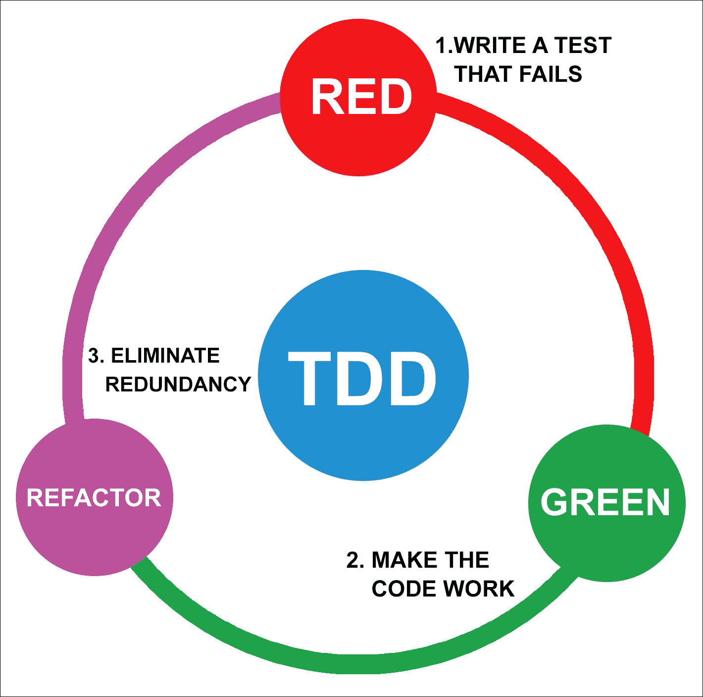

# 第四章检测与质量控制

在本章中，我们将介绍在开发过程之前、期间和之后可以使用的不同测试方法。如您所知，测试应用程序可以避免将来的问题，并为您提供更好的项目概述。

# 在应用程序中使用测试的重要性

在我们的应用程序中使用测试非常重要，因为这些步骤可以避免（或至少减少）未来可能出现的问题或错误，因为我们是人类，并且可能在开发过程中出错，或者因为项目结构不正确，甚至开发人员的理解与客户的要求不匹配。

测试过程将有助于提高代码质量和对功能的理解，进行回归测试以避免在持续集成中包含旧问题，并减少完成项目所需的时间。

测试用于减少应用程序中的失败或错误。开发团队花费大量时间进行 bug 修复，根据 bug 发现的时刻，影响可能更大，也可能更小。下图显示了与开发阶段相关的 bug 修复的相对成本：


在开发中使用测试方法的原因是，我们可以在开发的早期步骤中发现代码中的错误，从而减少修复 bug 的时间。

## 微服务中的测试

基于微服务测试应用程序的挑战不在于测试每个微服务，而在于集成和数据一致性。基于微服务的应用程序需要开发人员更好地理解微服务的体系结构及其工作流，以便能够对其进行测试。这是因为有必要在微服务之间的所有通信点检查每个微服务的信息和功能。

在微服务上使用的测试如下：

*   **单元测试**：在所有基于微服务的应用程序中，甚至在单片应用程序中，都需要使用单元测试。使用它，我们将检查方法或代码模块的必要功能。
*   **集成测试**：单元测试只检查孤立的组件，所以我们还需要检查方法之间的行为。我们将使用集成测试来检查同一微服务的方法之间的行为，所以需要模拟微服务之间的调用。
*   **API 测试**：微服务架构依赖于它们之间的通信。对于每个微服务，需要建立一个 API；这就像一份使用该微服务的*合同*。通过这种测试，我们将检查每个微服务的合同是否有效，以及所有微服务是否相互有效。
*   **端到端测试**：无需任何实体模型方法或调用即可保证应用程序质量。将运行测试以评估所有所需微服务之间的功能。在这些测试过程中，有一些规则可以避免出现问题：
    *   端到端测试很难维护，因此只测试最重要的功能；其余的使用单元测试
    *   可以通过模拟对微服务的调用来测试用户功能
    *   有必要保持一个干净的环境来测试它，因为测试非常依赖于数据，所以前一个测试可以操作数据，然后是下一个测试

一旦我们知道如何继续基于微服务测试我们的应用程序，我们将在开发过程中研究一些这样做的策略。

# 测试驱动开发

**测试驱动开发**（**TDD**）是敏捷哲学的一部分，它似乎解决了普通开发人员的问题，即当应用程序在发展和成长，代码在生病时出现的问题。开发人员修复了问题，使其运行，但我们添加的每一行都可能是一个新的错误，甚至可能破坏其他功能。

TDD 是一种学习技术，帮助开发人员了解他们将构建的应用程序的领域问题，以迭代、增量和建构主义的方式进行：

*   **迭代**因为该技术总是重复相同的过程来获得值
*   **增量**因为对于每个迭代，我们有更多的单元测试要使用
*   **建构主义**因为可以直接测试我们在开发过程中开发的所有东西，以便我们能够立即获得反馈

此外，当我们完成每个单元测试或迭代的开发时，我们可以忘记它，因为它将贯穿整个开发过程，帮助我们通过单元测试记住领域问题。对于健忘的开发人员来说，这是一个很好的方法。

理解 TDD 包括四个方面是非常重要的：分析、设计、开发和测试。换句话说，进行 TDD 就是理解领域问题并正确分析问题，设计好应用程序，开发好应用程序，并对其进行测试。它需要明确；TDD 不仅仅是实现单元测试，而是软件开发的整个过程。

TDD 与基于微服务的项目完美匹配，因为在大型项目中使用微服务将其划分为小微服务，我们的功能就像是通过通信通道连接的小项目的集合。项目大小与使用 TDD 无关，因为在这种技术中，您可以将每个功能划分为几个小示例，要做到这一点，项目是大还是小都无关紧要，如果我们的项目被微服务划分，则更不重要。此外，微服务仍然比单一项目更好，因为单元测试的功能是在微服务中组织的，它将帮助开发人员知道他们可以从哪里开始使用 TDD。

## 如何进行 TDD？

进行 TDD 并不困难，我们只需要遵循一些步骤，并通过改进代码和检查没有破坏任何东西来重复这些步骤：

1.  **编写单元测试**：它需要是最简单、最清晰的测试，一旦完成就必须失败；这是强制性的，如果它没有失败，这意味着有一些事情我们做得不好。
2.  **运行测试**：如果它有错误（失败），这是开发通过测试的最小代码的时刻；只做必要的事情，不要编写额外的代码。一旦开发出通过测试的最低代码，请再次运行测试；如果通过，则转到下一步，如果未通过，则修复它并再次运行测试。
3.  **改进测试**：如果您认为有可能改进您编写的代码，请执行此操作，然后再次运行测试。如果您认为它是完美的，那么编写一个新的单元测试。

下图展示了 TDD 的咒语--**红色**、**绿色**、**重构**：



要进行 TDD，必须在实现功能之前编写测试；如果启动了实现，然后编写了测试，那么它不是 TDD，而是测试。

如果我们在开始开发应用程序之后创建单元测试，那么我们就是在进行经典测试，而不是利用 TDD 的优势。单元测试到位将帮助您确保在整个开发过程中对领域问题的抽象概念是正确的。

显然，做测试总比不做要好，但做 TDD 仍然比只做经典测试要好。

## 我为什么要使用 TDD？

TDD 是对诸如“我应该从哪里开始？”、“我该如何做？”、“我如何编写可以修改而不破坏任何东西的代码？”、以及“我如何知道我必须实现什么？”等问题的回答。

我们的目标不是编写许多没有意义的单元测试，而是按照需求正确地设计 TDD。在 TDD 中，我们不考虑实现函数，而是考虑与域问题相关的函数的良好示例，以消除域问题造成的歧义。

换句话说，我们应该通过 TDD 重现 X 示例中的特定函数或用例，直到我们获得必要的示例来描述函数或任务，而不会产生歧义或误解。

### 提示

TDD 是记录应用程序的最佳方式。

使用其他软件开发方法，我们开始思考体系结构将是什么，将使用什么模式，微服务之间的通信将是什么，但是如果我们计划好所有这些，我们意识到这是不必要的，会发生什么？要过多久我们才能意识到这一点？我们将花费多少精力和金钱？

TDD 通过在多次迭代中创建小示例来定义应用程序的体系结构，直到我们认识到什么是体系结构。这些示例将慢慢地向我们展示要遵循的步骤，以便定义要使用的最佳结构、模式或工具，从而避免在应用程序的第一阶段花费资源。

这并不意味着我们在没有架构的情况下工作。显然，我们必须知道我们的应用程序是网站还是移动应用程序，并使用合适的框架（您可以在[第 2 章](02.html "Chapter 2. Development Environment")、*开发环境*中研究哪种框架适合您的需要），还必须知道应用程序中的互操作性是什么；在我们的例子中，它将是一个基于微服务的应用程序。因此，它将支持我们开始创建第一个单元测试。TDD 将是我们开发应用程序的指导方针，它将生成一个不会因单元测试而产生歧义的体系结构。

TDD 不是万能的；换句话说，它不会给高级和初级开发人员提供相同的结果，但对整个团队都很有用。让我们看看使用 TDD 的一些优点：

*   **代码重用**：这将创建每个功能，其中只包含通过第二阶段（绿色）测试所需的代码。它允许您查看是否有更多的函数使用相同的代码结构或特定函数的一部分；因此，它可以帮助您重用先前编写的代码。
*   **团队合作更容易**：让你对团队同事充满信心。一些架构师或高级开发人员不信任经验差的开发人员，他们需要在提交更改之前检查代码，这就造成了瓶颈，因此 TDD 帮助我们信任经验不足的开发人员。
*   **增加沟通**：增加团队同事之间的沟通。沟通更加流畅，因此团队分享他们在单元测试中反映的项目知识。
*   **避免过度设计**：在第一阶段不要过度设计应用程序。正如我们前面所说的，使用 TDD 可以让您一点一点地了解应用程序，避免在项目中创建无用的结构或模式，而这些结构或模式可能会在将来的阶段中被丢弃。
*   **单元测试是最好的文档**：对特定功能给出良好观点的最好方法是阅读其单元测试，这有助于我们理解它是如何工作的，而不是人类的语言。
*   **允许在设计阶段发现更多用例**：在您必须创建的每个测试中，您将了解功能应该如何更好地工作，以及功能可能具有的所有阶段。
*   **增加了工作做得很好的感觉**：在每次提交代码时，您都会有这样一种感觉：它做得很好，因为其余的单元测试都顺利通过，因此您不会担心破坏其他功能。
*   **提高软件质量**：在重构步骤中，我们努力提高代码的效率和可维护性，验证整个项目在更改后仍然正常工作。

## TDD 算法

遵循 TDD 算法的技术概念和步骤简单明了，通过实践可以改进实现 TDD 算法的正确方法。正如我们前面看到的，只有三个步骤：红色、绿色和重构。

### 红色-写入单元测试

即使没有编写代码，也可以编写测试，您只需要在实现规范之前考虑是否可以编写规范。因此，在第一步中，您应该考虑开始编写的单元测试不是单元测试，而是功能性的示例或规范。

在 TDD 中，该示例或规范不是固定的；换句话说，单元测试可以在将来修改。在开始编写第一个单元测试之前，有必要考虑一下被测试的**软件**（**SUT**）将如何，以及它将如何工作。我们需要考虑它将如何成为 SUT 代码，以及我们将如何检查它是否按照我们希望的方式工作。

TDD 的工作方式促使我们首先设计出满足要求的更舒适、更清晰的产品。

### 绿色-使代码正常工作

一旦编写了示例，我们就必须编写最小代码，使其通过测试；换句话说，将单元测试设置为绿色。不管代码是否丑陋和未优化，这将是我们在下一步和迭代中的任务。

在这一步中，重要的是只为需求编写必要的代码，而不做不必要的事情。这并不意味着写作时不考虑功能，而是要考虑它的效率。这看起来很简单，但您会意识到，您将在第一次编写额外的代码。

如果你专注于这一步，你会想到关于不同条目的 SUT 行为的新问题。但是，您应该很强大，避免编写与当前功能相关的其他功能的额外代码。根据经验，不要对新特性进行编码，而是做笔记，以便在将来的迭代中将它们转换为功能。

### 重构-消除冗余

重构与重写代码不同。您应该能够在不更改行为的情况下更改设计。

在这一步中，您应该消除代码中的重复性，并检查代码是否符合良好实践的原则，同时考虑代码的效率、清晰性和未来的可维护性。这部分取决于每个开发人员的经验。

### 提示

良好重构的关键是分步进行。

要重构一个功能，最好的方法是更改一小部分并执行所有可用的测试，如果测试通过，则继续执行另一小部分，直到您对获得的结果满意为止。

# 行为驱动发展

**行为驱动开发**（**BDD**）是一个扩展 TDD 技术并将其与提供给开发人员的其他设计思想和业务分析相结合的过程，以改进软件开发。

在 BDD 中，我们测试场景和类的行为，以满足可以由许多类组成的场景。

为了让客户、项目所有者、业务分析师或开发人员使用通用语言，使用 DSL 是非常有用的。我们的目标是在[第 3 章](03.html "Chapter 3. Application Design")、*应用程序设计*中的领域驱动设计部分中，提供一种无处不在的语言。

## 什么是 BDD？

正如我们前面所说，BDD 是一种基于 TDD 和 ATDD 的敏捷技术，它促进了项目整个团队之间的协作。

BDD 的目标是让整个团队了解客户的需求，而客户知道团队其他成员从他们的规范中了解了什么。大多数情况下，当项目开始时，开发人员的观点与客户不同，在开发过程中，客户意识到可能他们没有解释，或者开发人员没有正确理解，因此增加了更多的时间来更改代码以满足客户的需要。

因此，BDD 使用规则或通用语言以人类语言编写测试用例，以便客户和开发人员能够理解。它还为测试定义了 DSL。

## 它是如何工作的？

有必要将功能定义为用户情景（我们将在本章的 ATDD 部分中解释这是什么），并检查其验收标准。

一旦定义了用户故事，我们就必须关注描述使用 DSL 的具体用户或情况的项目行为的可能场景。步骤是：给定（上下文），何时（事件发生），然后（结果）。

总之，为用户故事定义的场景给出了检查功能是否完成的验收标准。

### 黄瓜作为 BDD 的 DSL

Cucumber 是一种 DSL 工具，它将以纯文本形式制作的示例作为自动测试执行，利用 BDD 的优势，将业务层和技术整合到项目中，以了解用户最看重的功能，并在定义案例测试和记录项目的同时开发这些功能。

### 提示

Cucumber 最重要的事情是开发人员和客户之间有着相同的理解点。

**小黄瓜**是 Cucumber 使用的语言，它允许您将项目的规范翻译成接近人类的语言，以便客户或其他没有技术技能的人能够理解。此工具和语言可用于 BDD 和 ATDD。让我们看一段示例代码：

```php
    Feature: Search secrets 
     In order to find secrets 
     Users should be able to search for near secrets 

     Scenario: Search secrets by distance 
       Given there are 996 secrets in the game which are no closer than 100 
       meters from me 
       And there are 4 secrets SEC001, SEC005, SEC054, SEC121 that are 
       within 100 
       meters from me 
       When I search for closer secrets 
       Then I should see the following secrets: 
         | Secret code | 
         | SEC001      | 
         | SEC005      | 
         | SEC054      | 
         | SEC121      | 

```

这允许我们定义软件行为，而不必说明它是如何实现的。此外，它允许我们在编写案例自动测试的同时记录功能。使用黄瓜的优点如下：

*   易读
*   易懂
*   易于解析
*   容易讨论

DSL 在工具理解和处理的代码中有三个步骤；详情如下:

1.  **给定**：这是将系统设置为正确状态以检查测试的必要步骤。
2.  **当**时：这是用户操作功能的必要步骤。
3.  **然后**：指系统中发生变化的事物。在这里，我们可以看到它是否符合我们的要求。

此外，还有两个可选步骤：**和**以及**但**，当您需要多个句子来满足要求时，可以在**给定**或**然后**中使用。

在本章中，我们将了解如何使用名为 Selenium 的工具进行 BDD。它是另一个 DSL 工具，但面向 web 开发，而不是纯文本。

# 验收测试驱动开发

项目中最重要的方法可能是**验收测试驱动开发**（**ATDD**）或**故事测试驱动开发**（**STDD**）；它是 TDD，但处于不同的级别。

验收（或客户）测试是项目满足客户要求的业务需求的书面标准。它们是由项目所有者编写的示例（如 TDD 中的示例）。它是每个迭代开发的开始，是 scrum 和敏捷开发之间的桥梁。

在 ATDD 中，我们以与传统方法不同的方式开始实施我们的项目。用人类语言编写的业务需求被一些团队成员和客户同意的可执行文件所取代。这并不是要替换整个文档，而只是部分需求。

使用 ATDD 的优点如下所述：

*   它提供了真实的示例和一种通用语言，供团队理解该领域
*   它允许我们正确地识别域规则
*   可以知道用户故事是否在每次迭代中完成
*   工作流从第一步开始工作
*   在团队定义并接受测试之前，开发不会开始

## 用户故事

ATDD 的用户故事在名称或描述方面与用例类似，但工作方式不同。用户故事不定义需求，避免了人类语言的歧义问题。目标是在没有问题的情况下将想法传达给团队的其他成员。

每个用户故事都是关于客户希望从应用程序中得到什么的清晰简明的示例列表。故事的名字是人类语言的一句话，定义了功能必须做什么。考虑下面的例子：

*   搜索我们位置周围的可用秘密
*   检查我们已经储存的秘密
*   检查谁是战斗的胜利者

他们的目标是倾听客户的意见并帮助他们定义他们对应用程序的期望。用户故事应清晰无歧义，并应使用人类语言，而不是技术语言编写；客户应该理解他们所说的。

一旦我们定义了一个用户故事，就会出现一些问题，应该通过关联每个故事的验收测试来回答这些问题。例如，对于*检查谁是战斗*故事的赢家，一些可能的问题如下所示：

*   如果他们抽签怎么办？
*   赢家赢了什么？
*   失败者会失去什么？
*   一场战斗需要多长时间？

可能的验收试验如下所示：

*   如果他们平局，没有人会赢或输；他们将保守秘密
*   胜利者将获得 10 分，并从失败者的口袋中获得一个秘密
*   失败者会把秘密告诉胜利者
*   一场战斗需要掷三次骰子

可能来自用户故事的问题和答案将生成新的用户故事，以添加到待办事项列表中。

## ATDD 算法

ATDD 的算法类似于 TDD，但是比开发人员接触到更多的人。换句话说，在进行 ATDD 时，每个故事的测试都会在一个包括项目所有者、开发人员和 QA 技术人员的会议上进行，因为团队必须理解需要做什么以及为什么需要这样做，以便他们能够看到代码是否应该这样做。下图显示了 ATDD 循环：


### 讨论

ATDD 算法的出发点是讨论。在这一步中，业务部门将与客户举行会议，以澄清应用程序应如何工作，分析师应根据该对话创建用户故事。此外，他们应该能够解释每个用户故事的满足条件，以便像我们前面在用户故事一节中解释的那样翻译成示例。

在会议结束时，示例应清晰、简洁，这样我们就可以得到一个用户故事示例列表，涵盖客户自己回顾和理解的所有需求。此外，团队将有一个项目概述，以了解用户故事的业务价值，如果用户故事太大，可以将其划分为小用户故事，在该流程的第一次迭代中获得第一个用户故事。

### 蒸馏

高级验收测试由客户和开发团队编写。在这一步中，我们将开始编写从讨论步骤中的示例中获得的测试用例，团队可以参与讨论，帮助澄清信息或指定其真实需求。

测试应涵盖讨论步骤中发现的所有示例，在此过程中可以添加额外的测试；渐渐地，我们对功能有了更好的理解。

在这一步结束时，我们将获得用人类语言编写的必要测试，以便团队（包括客户）能够理解他们在下一步将做什么。这些测试可以像文档一样使用。

### 开发

在开发步骤中，验收测试用例开始由开发团队和项目所有者开发。在这一步中遵循的方法与 TDD 相同——开发人员应该创建一个测试并观察它失败（红色），然后开发最少要通过的行数（绿色）。一旦验收测试为绿色，则应进行验证和测试，以准备交付。

在此过程中，开发人员可能会发现需要添加到测试中的新场景，甚至，如果需要大量工作，可以将其推送到用户情景中。

在这一步的最后，我们将有一个软件，通过验收测试，也许更全面的测试。

### 演示

创建的功能通过运行验收测试用例和手动探索新功能的特性来显示。演示后，团队讨论用户故事是否正确完成，是否满足产品所有者的需求，并决定是否可以继续下一个故事。

# 工具

既然您对 TDD 和 BDD 有了更多的了解，现在是时候解释一些可以在开发工作流中使用的工具了。有很多可用的工具，但我们将只解释最常用的工具。

## 作曲家

Composer 是一个用于管理软件依赖关系的 PHP 工具。您只需要声明项目所需的库，Composer 将管理它们，并在必要时安装和更新它们。这个工具只有几个要求——如果您有 PHP5.3.2+，就可以开始了。在缺少需求的情况下，Composer 将警告您。

您可以在您的开发机器上安装此依赖关系管理器，但由于我们使用的是 Docker，因此我们将直接在我们的**PHP-FPM**（**FastCGI Process manager**容器上安装它。在 Docker 中安装 Composer 非常简单；您只需将以下规则添加到 Dockerfile：

```php
    RUN curl -sS https://getcomposer.org/installer 
    | php -- --install-dir=/usr/bin/ --filename=composer 

```

## PHPUnit

我们项目需要的另一个工具是 PHPUnit，一个单元测试框架。在我们的例子中，我们将使用版本 4.0。与前面一样，我们将把这个工具添加到 PHP-FPM 容器中，以保持开发机器的整洁。如果您想知道为什么除了 Docker 之外，我们没有在开发机器上安装任何东西，那么答案很清楚——将所有东西都放在容器中将帮助您避免与其他项目发生冲突，并使您能够灵活地更改版本，而不必太担心。

作为一种快捷方式，您可以将以下`RUN`命令添加到您的`PHP-FPM``Dockerfile`中，您将安装并准备使用最新的 PHPUnit 版本：

```php
    RUN curl -sSL https://phar.phpunit.de/phpunit.phar -o 
    /usr/bin/phpunit && chmod +x /usr/bin/phpunit 

```

前面的命令将在容器中安装最新的 Composer 版本，但建议通过 Composer 进行安装。打开您的`composer.json`文件并添加以下行：

```php
    "phpunit/phpunit": "4.0.*",
```

一旦您更新了`composer.json`文件，您只需要在容器命令行中进行 Composer 更新，Composer 就会为您安装 PHPUnit。

现在我们已经有了所有的需求，现在是时候安装我们的 PHP 框架并开始做一些 TDD 的事情了。稍后，我们将继续使用新工具更新 Docker 环境。

在前面的章节中，我们讨论了一些 PHP 框架，并选择 Lumen 作为示例。可以根据您喜欢的框架随意调整所有示例。我们的源代码将生活在我们的容器中，但在开发的这一点上，我们不想要不可变的容器。我们希望对代码所做的每一个更改都能在容器中即时可用，以便我们将容器用作存储卷。

要使用我们的源创建一个容器并将其用作存储卷，我们只需编辑我们的`docker-compose.yml`文件并为我们的每个微服务创建一个源容器，如下所示：

```php
    source_battle: 
       image: nginx:stable 
       volumes: 
           - ../source/battle:/var/www/html 
       command: "true" 

```

前面的代码创建了一个名为`source_battle`的容器映像，它存储了我们的战斗源（位于`docker-compose.yml`文件当前路径的`../source/battle`。一旦我们有了可用的源容器，我们就可以编辑每个服务并分配一个卷。例如，我们可以在`microservice_battle_fpm`和`microservice_battle_nginx`容器描述中添加以下行：

```php
    volumes_from: 
               - source_battle 

```

我们的战斗源将在`/var/www/html`路径的源容器中可用，安装 Lumen 的剩余步骤是执行一个简单的编写器。首先，您需要使用一个简单的命令来确保您的基础架构正常运行：

```php
$ docker-compose up

```

前面的命令旋转容器并将日志输出到标准 IO。现在我们已经确定一切都已启动并运行，我们需要进入 PHP-FPM 容器并安装 Lumen。

### 提示

如果您需要知道分配给每个容器的名称，您可以在终端上执行`docker ps`并复制容器名称。例如，我们将在 battle PHP-FPM 容器中输入以下命令：

```php
$ docker exec -it docker_microservice_battle_fpm_1 /bin/bash

```

前面的命令在容器中打开一个交互式 shell，以便您可以执行任何需要的操作。让我们用一个命令安装 Lumen：

```php
# cd /var/www/html && composer create-project --prefer-dist laravel/lumen .

```

对每个微服务重复上述命令。

现在，您已经准备好开始进行单元测试并编写应用程序。

### 单元测试

单元测试是在已知上下文中使用其他代码的一小段代码，以便我们可以检查正在测试的代码是否有效。流明与 PHPUnit 一起开箱即用；因此，我们只需要将所有测试添加到 tests 文件夹中。默认情况下，框架安装附带了一个非常小的示例文件--`ExampleTest.php`，您可以在其中尝试单元测试。为了从单元测试开始，直到您更习惯于创建单元测试，请选择一个 MicroService 源并创建包含以下内容的`app/Dummy.php`文件：

```php
<?php 
namespace App;

class Dummy 
{ 
} 

```

### 提示

从单元测试开始最简单的方法是每次在代码中创建一个新类时，都可以为测试创建一个新类。通过这种方式，您将记住新类需要包含单元测试。例如，假设您需要一个`Battle`类；因此，当您创建类时，您还可以在您的`tests`文件夹中创建一个带有`Test`前缀的新类。

在理想情况下，所有代码都包含在单元测试中，但我们知道这是一种奇怪的情况。大多数情况下，如果幸运的话，您将拥有 70%或 80%的代码覆盖率。我们鼓励您完全覆盖代码，但如果不可能，请至少覆盖核心功能。创建单元测试有两种方法：

*   **先测试，后编码：**我们认为，当您有足够的时间开发项目时，此工作流会更好。首先，创建测试，以确保您确实了解每个新功能。测试就绪后，您将编写通过测试所需的最少代码。通过这种方式编码，您将考虑是什么使您的代码有效，以及是什么使您的代码失败。
*   **先编码，后测试：**当您没有太多时间进行单元测试时，这是一个非常扩展的工作流。您将一如既往地创建代码，并在完成后立即创建单元测试。这种方法会创建一个不太健壮的代码，因为您正在根据已经创建的代码调整单元测试，而不是反过来进行。

记住，总是有时间测试代码是很重要的；这是一项长期投资。在开始时花费时间将使代码更加健壮，并将消除将来的 bug。

### 运行测试

您可能想知道如何运行和检查测试。别担心，这很简单。您只需要输入一个 PHP-FPM 容器。例如，要进入 Battle PHP-FPM 容器，请打开终端并执行以下命令：

```php
$ docker exec -it docker_microservice_battle_fpm_1 /bin/bash

```

执行上述命令后，您将进入容器内。现在是时候确定您当前的路径是`/var/www/html`文件夹了。完成上一步后，可以在该文件夹内执行 phpunit。所有这些操作都可以通过以下命令完成：

```php
# cd /var/www/html
# ./vendor/bin/phpunit

```

`phpunit`命令将读取`phpunit.xml`文件。这个 XML 描述了我们的测试存储和执行的位置。此命令的执行将为我们提供一个漂亮的屏幕，显示通过或失败测试的结果。

### 断言

断言是在已知上下文中的一条语句，我们希望在代码中的某个时刻它是真的，这是单元测试的核心。断言在测试用例中使用，一个测试用例可以在同一个测试中包含多个断言。在 PHPUnit 中，创建测试非常简单，因为您只需要在方法名称中添加`test`前缀。很简单，不是吗？为了澄清所有这些概念，让我们通过一些示例来了解一些可以在单元测试中使用的断言。在您熟悉 PHPUnit 之前，可以随意创建更复杂的测试。

### assertArrayHasKey

`assertArrayHasKey(mixed $key, array $array[, string $message = ''])`断言检查`$array`是否有一个带有`$key`的元素。假设您有一个生成并返回某种配置数据的方法，并且有一个由`storage`标识的特定元素，您需要确保该元素始终存在。将以下方法添加到我们的`Dummy`类中，以模拟配置生成：

```php
    public static function getConfigArray() 
    { 
      return [ 
           'debug'   => true, 
           'storage' => [ 
               'host' => 'localhost', 
               'port' => 5432, 
               'user' => 'my-user', 
               'pass' => 'my-secret-password' 
           ] 
       ]; 
    } 

```

现在我们可以用我们想要的任何方式测试这个`getConfigArray`的响应：

```php
    public function testFailAssertArrayHasKey() 
    { 
       $dummy = new App\Dummy(); 

       $this->assertArrayHasKey('foo', $dummy::getConfigArray()); 
    } 

```

前面的测试将检查由`getConfigArray`返回的数组是否具有由`foo`标识的元素，在我们的示例中，该元素失败：

```php
    public function testPassAssertArrayHasKey() 
    { 
       $dummy = new App\Dummy(); 

       $this->assertArrayHasKey('storage', $dummy::getConfigArray()); 
    } 

```

在这种情况下，该测试将确保`getConfigArray`返回由`storage`标识的元素。如果由于某种原因，您在将来更改了`getConfigArray`方法的实现，此测试将帮助您确保您至少持续接收由`storage`标识的数组元素。

您可以使用`assertArrayNotHasKey()`作为`assertArrayHasKey;`的倒数，它使用相同的参数。

### 资产类别属性

`assertClassHasAttribute(string $attributeName, string $className[, string $message = ''])`断言检查我们的`$className`是否定义了`$attributeName`。修改我们的`Dummy`类并添加一个新属性，如下所示：

```php
    public $foo; 

```

现在，我们可以通过以下测试来测试此公共属性的存在性：

```php
    public function testAssertClassHasAttribute() 
    { 
      $this->assertClassHasAttribute('foo', App\Dummy::class); 
      $this->assertClassHasAttribute('bar', App\Dummy::class); 
    } 

```

前面的代码将通过对`foo`属性的检查，但对`bar`属性的检查将失败。

您可以使用`assertClassNotHasAttribute()`作为`assertClassHasAttribute;`的倒数，它使用相同的参数。

### 资产组合

`assertArraySubset(array $subset, array $array[, bool $strict = '', string $message = ''])`断言检查给定的`$subset`是否在我们的`$array`中可用：

```php
    public function testAssertArraySubset() 
    { 
       $dummy = new App\Dummy(); 

       $this->assertArraySubset(['storage' => 'failed-test'], 
       $dummy::getConfigArray()]); 
    } 

```

前面的示例测试将失败，因为我们的`getConfigArray`方法的响应中不存在`['storage' => 'failed-test']`子集。

### 资产类别统计属性

`assertClassHasStaticAttribute(string $attributeName, string $className[, string $message = ''])`断言检查给定`$className`中是否存在静态属性。我们可以在`Dummy`类中添加一个静态属性，如下所示：

```php
    public static $availableLocales = [ 
           'en_GB', 
           'en_US', 
           'es_ES', 
           'gl_ES' 
    ]; 

```

有了这个静态属性，我们可以自由地测试`$availableLocales`的存在性：

```php
    public function testAssertClassHasStaticAttribute() 
    { 
      $this->assertClassHasStaticAttribute('availableLocales', 
      App\Dummy::class); 
    } 

```

如果需要断言反向，可以使用`assertClassNotHasStaticAttribute();`它使用相同的参数。

### 资产内容（）

有时，您需要检查草堆是否包含特定元素。您可以使用`assertContains()`功能执行此操作：

*   `assertContains(mixed $needle, Iterator|array $haystack[, string $message = ''])`
*   `assertNotContains(mixed $needle, Iterator|array $haystack[, string $message = ''])`
*   `assertContainsOnly(string $type, Iterator|array $haystack[, boolean $isNativeType = null, string $message = ''])`
*   `assertNotContainsOnly(string $type, Iterator|array $haystack[, boolean $isNativeType = null, string $message = ''])`
*   `assertContainsOnlyInstancesOf(string $classname, Traversable|array $haystack[, string $message = ''])`

### assertDirectory（）和 assertFile（）

PHPUnit 不仅允许您测试应用程序的逻辑，还可以测试文件夹和文件的存在性和权限。所有这些都可以通过以下断言实现：

*   `assertDirectoryExists(string $directory[, string $message = ''])`
*   `assertDirectoryNotExists(string $directory[, string $message = ''])`
*   `assertDirectoryIsReadable(string $directory[, string $message = ''])`
*   `assertDirectoryNotIsReadable(string $directory[, string $message = ''])`
*   `assertDirectoryIsWritable(string $directory[, string $message = ''])`
*   `assertDirectoryNotIsWritable(string $directory[, string $message = ''])`
*   `assertFileEquals(string $expected, string $actual[, string $message = ''])`
*   `assertFileNotEquals(string $expected, string $actual[, string $message = ''])`
*   `assertFileExists(string $filename[, string $message = ''])`
*   `assertFileNotExists(string $filename[, string $message = ''])`
*   `assertFileIsReadable(string $filename[, string $message = ''])`
*   `assertFileNotIsReadable(string $filename[, string $message = ''])`
*   `assertFileIsWritable(string $filename[, string $message = ''])`
*   `assertFileNotIsWritable(string $filename[, string $message = ''])`
*   `assertStringMatchesFormatFile(string $formatFile, string $string[, string $message = ''])`
*   `assertStringNotMatchesFormatFile(string $formatFile, string $string[, string $message = ''])`

您的应用程序是否依赖可写文件才能工作？别担心，菲普尼特会支持你的。您可以在测试中添加一个`assertFileIsWritable()`，以便下次有人删除您在断言中指定的文件时，测试将失败。

### 资产字符串（）

在某些情况下，需要检查某些字符串的内容。例如，如果您的代码生成串行代码，则可以检查生成的代码是否符合规范。您可以对字符串使用以下断言：

*   `assertStringStartsWith(string $prefix, string $string[, string $message = ''])`
*   `assertStringStartsNotWith(string $prefix, string $string[, string $message = ''])`
*   `assertStringMatchesFormat(string $format, string $string[, string $message = ''])`
*   `assertStringNotMatchesFormat(string $format, string $string[, string $message = ''])`
*   `assertStringEndsWith(string $suffix, string $string[, string $message = ''])`
*   `assertStringEndsNotWith(string $suffix, string $string[, string $message = ''])`

### assertRegExp（）

`assertRegExp(string $pattern, string $string[, string $message = ''])`断言将对您非常有用，因为您在一个断言中拥有所有正则表达式功能。让我们向虚拟类添加一个静态函数：

```php
    public static function getRandomCode() 
    { 
      return 'CODE-123A'; 
    } 

```

这个新函数返回一个静态字符串代码。让这一代人复杂化吧。要测试生成的字符串代码，现在可以在测试类中执行以下操作：

```php
    public function testAssertRegExp() 
    { 
       $this->assertRegExp('/^CODE\-\d{2,7}[A-Z]$/', 
       App\Dummy::getRandomCode()); 
    } 

```

如您所见，我们使用一个简单的正则表达式来检查由`getRandomCode`生成的输出。

### 资产 JSON（）

使用微服务时，您可能会非常密切地处理 JSON 请求和响应。因此，您有能力测试我们的 JSON 是非常重要的。您可以将 JSON 作为文件或字符串：

*   `assertJsonFileEqualsJsonFile()`
*   `assertJsonStringEqualsJsonFile()`
*   `assertJsonStringEqualsJsonString()`

### 布尔断言

可以使用以下方法检查布尔结果或类型：

*   `assertTrue(bool $condition[, string $message = ''])`
*   `assertFalse(bool $condition[, string $message = ''])`

### 类型断言

有时需要确保元素是特定类的实例或具有特定的内部类型。您可以在测试中使用以下断言：

*   `assertInstanceOf($expected, $actual[, $message = ''])`
*   `assertInternalType($expected, $actual[, $message = ''])`

### 其他断言

PHPUnit 有大量断言，如果不对功能的结果或对象状态应用以下断言，则无法完成测试：

*   `assertCount($expectedCount, $haystack[, string $message = ''])`
*   `assertEmpty(mixed $actual[, string $message = ''])`
*   `assertEquals(mixed $expected, mixed $actual[, string $message = ''])`
*   `assertGreaterThan(mixed $expected, mixed $actual[, string $message = ''])`
*   `assertGreaterThanOrEqual(mixed $expected, mixed $actual[, string $message = ''])`
*   `assertInfinite(mixed $variable[, string $message = ''])`
*   `assertLessThan(mixed $expected, mixed $actual[, string $message = ''])`
*   `assertLessThanOrEqual(mixed $expected, mixed $actual[, string $message = ''])`
*   `assertNan(mixed $variable[, string $message = ''])`
*   `assertNull(mixed $variable[, string $message = ''])`
*   `assertObjectHasAttribute(string $attributeName, object $object[, string $message = ''])`
*   `assertSame(mixed $expected, mixed $actual[, string $message = ''])`

您可以在 PHPUnit 网站上找到关于您可以使用的断言的更多信息，即，[https://phpunit.de/](https://phpunit.de/) 。

### 从头开始单元测试

在这一点上，您可能会对单元测试感到更舒服，并且希望尽快开始编写应用程序，所以让我们开始测试吧！

我们的微服务应用程序使用地理定位来发现秘密和其他玩家。这意味着您的 location microservice 需要一种方法来计算两个地理空间点之间的距离。我们还需要，给定一个原点，获得最近存储点的列表（它们可以是最近的用户或机密）。由于这是一个核心功能，您需要确保我们描述的内容经过充分测试。

在我们的应用程序中，本地化有自己的服务。因此，请使用 IDE 打开 location microservice 的源代码，并创建包含以下内容的`app/Http/Controllers/LocationController.php`文件：

```php
    <?php 

    namespace App\Http\Controllers; 

    use Illuminate\Http\Request; 

    class LocationController extends Controller 
    { 

    } 

```

前面的代码已经在 Lumen 中创建了位置控制器，正如我们前面提到的，一旦创建了这个类，我们就需要为单元测试创建一个类似的类。为此，您只需要创建`tests/app/Http/Controllers/LocationControllerTest.php`文件。如您所见，我们甚至在复制文件夹结构；这是很容易知道我们要测试哪个类的最好方法。

我们希望开始为距离计算和函数创建测试，该函数允许我们在给定特定地理位置点的情况下获取最近的秘密。一种方法是创建两个不同的测试。因此，请在您的`LocationControllerTest.php`中填写以下代码：

```php
    <?php 

    use Laravel\Lumen\Testing\DatabaseTransactions; 

    class LocationControllerTest extends TestCase 
    { 
      public function testDistance() 
      { 
      } 

      public function testClosestSecrets() 
      { 
      } 
    } 

```

我们没有向测试类添加任何特殊的内容，只声明了两个测试。

让我们从`testDistance()`开始。在本测试中，我们希望确保给定两个地理空间点，它们之间的计算距离对于我们的目的来说足够精确。在单元测试中，您需要开始描述已知场景——作为点，我们选择了伦敦（纬度：`51.50`、经度：`-0.13`）和阿姆斯特丹（纬度：`52.37`、经度： `4.90`）。这两个城市之间的已知距离约为 358.06 公里，这是我们的距离计算器得出的结果。让我们用以下代码填充测试：

```php
    public function testDistance() 
    { 
      $realDistanceLondonAmsterdam = 358.06; 

      $london = [ 
           'latitude'  => 51.50, 
           'longitude' => -0.13 
      ]; 

      $amsterdam = [ 
           'latitude'  => 52.37, 
           'longitude' => 4.90 
      ]; 

      $location = new App\Http\Controllers\LocationController(); 

      $calculatedDistance = $location->getDistance($london, $amsterdam); 

      $this->assertClassHasStaticAttribute('conversionRates', 
      App\Http\Controllers\LocationController::class); 
      $this->assertEquals($realDistanceLondonAmsterdam, 
                          $calculatedDistance); 
    } 

```

在前面的代码中，我们定义了已知场景、两点的位置以及两点之间的已知距离。一旦我们准备好已知的场景，我们就创建了一个`LocationController`实例，并使用定义的`getDistance`函数来获得我们想要测试的结果。当我们得到结果后，我们测试了我们的`LocationController`有一个`conversionRate`静态属性，我们可以使用它将距离转换为不同的单位。我们最后一个也是最重要的断言检查计算的距离与这两点之间的已知距离之间的匹配。我们已经准备好了基本测试，现在是开始编写`getDistance`函数的时候了。

两个地理空间点之间的距离计算可以采用非常不同的方式进行。您可以在这里使用策略模式，但为了保持示例的简单性，我们将在控制器内的不同函数中编写不同的计算算法。

打开您的`LocationController`并添加一些辅助代码：

```php
    const ROUND_DECIMALS = 2; 

    public static $conversionRates = [ 
       'km'    => 1.853159616, 
       'mile'  => 1.1515 
    ]; 

    protected function convertDistance($distance, $unit = 'km') 
    { 
      switch (strtolower($unit)) { 
        case 'mile': 
          $distance = $distance * self::$conversionRates['mile']; 
          break; 
        default : 
          $distance = $distance * self::$conversionRates['km']; 
          break; 
      } 

      return round($distance, self::ROUND_DECIMALS); 
    } 

```

在前面的代码中，我们定义了转换率、一个可用于对结果进行四舍五入的常数以及一个简单的转换函数。稍后我们将使用这个`convertDistance`函数。

我们计算距离的第一种方法是使用欧几里德函数来得到我们的结果。下面的代码描述了一个简单的实现：

```php
public function getEuclideanDistance($pointA, $pointB, $unit = 'km') 
    { 
       $distance = sqrt( 
           pow(abs($pointA['latitude'] - $pointB['latitude']), 2) + pow(abs($pointA['longitude'] - $pointB['longitude']), 2) 
       ); 

       return $this->convertDistance($distance, $unit); 
    } 

```

现在我们已经准备好了算法，我们可以将它添加到我们的`getDistance`函数中，如下所示：

```php
    public function getDistance($pointA, $pointB, $unit = 'km') 
    { 
      return $this->getEuclideanDistance($pointA, $pointB, $unit); 
    } 

```

在这一点上，您已经准备好了一切，可以开始测试了。输入位置容器并在`/var/www/html`中运行 PHPUnit。这是我们的第一个方法；PHPUnit 结果将是失败的，此应用程序的输出将告诉您问题所在。在我们的例子中，失败的主要原因是我们使用的算法对于我们的应用来说不够精确。我们无法部署此版本的应用程序，因为它的测试失败，我们必须更改测试或实现测试的代码。

正如我们前面提到的，有多种方法可以计算两点之间的距离，每种方法或多或少都是精确的。我们尝试的第一个实现失败了，因为它用于平原，而我们的世界是一个球体。

再次打开您的`LocationController`并使用 haversine 计算创建新的距离实现：

```php
    public function getHaversineDistance($pointA, $pointB, $unit = 'km') 
    { 
      $distance = rad2deg( 
           acos( 
               (sin(deg2rad($pointA['latitude'])) * 
               sin(deg2rad($pointB['latitude']))) + 
               (cos(deg2rad($pointA['latitude'])) * 
               cos(deg2rad($pointB['latitude'])) * 
               cos(deg2rad($pointA['longitude'] - 
               $pointB['longitude']))) 
           ) 
       ) * 60; 

      return $this->convertDistance($distance, $unit); 
    } 

```

如您所见，这个距离计算函数稍微复杂一些，它考虑了我们世界的球形形式。更改`getDistance`函数以使用我们的新算法：

```php
    return $this->getHaversineDistance($pointA, $pointB, $unit); 

```

现在再次运行 PHPUnit，一切都会好起来；测试将通过，我们的代码已准备好投入生产。

对于单元测试和 TDD，过程始终相同：

1.  创建测试。
2.  使您的代码通过测试。
3.  运行测试，如果测试失败，请从步骤 2 重新开始。

我们希望在我们的位置微服务中拥有的另一个功能是获取我们当前位置附近的最接近的秘密。打开`LocationControllerTest`文件，添加以下代码：

```php
    public function testClosestSecrets() 
    { 
      $currentLocation = [ 
           'latitude'  => 40.730610, 
           'longitude' => -73.935242 
      ]; 

      $location = new App\Http\Controllers\LocationController(); 

      $closestSecrets = $location->getClosestSecrets($currentLocation); 
      $this->assertClassHasStaticAttribute('conversionRates', 
      App\Http\Controllers\LocationController::class); 
      $this->assertContainsOnly('array', $closestSecrets); 
      $this->assertCount(3, $closestSecrets); 

       // Checking the first element 
       $currentElement = array_shift($closestSecrets); 
       $this->assertArraySubset(['name' => 'amber'], $currentElement); 

       // Second 
       $currentElement = array_shift($closestSecrets); 
       $this->assertArraySubset(['name' => 'ruby'], $currentElement); 

       // Third 
       $currentElement = array_shift($closestSecrets); 
       $this->assertArraySubset(['name' => 'diamond'], $currentElement); 
    } 

```

在前面的代码中，我们定义了当前位置（纽约），并要求我们的实现为我们提供最接近的秘密列表。我们的位置实现将有一个秘密的缓存列表，我们知道它们的位置（这将帮助我们知道正确的顺序）。

打开`LocationController.php`并首先添加机密缓存列表。在现实世界中，我们没有硬编码的值，但它足以用于测试目的：

```php
    public static $cacheSecrets = [ 
       [ 
           'id' => 100, 
           'name' => 'amber', 
           'location' => ['latitude'  => 42.8805, 'longitude' => -8.54569, 
           'name'      => 'Santiago de Compostela'] 
       ], 
       [ 
           'id' => 100, 
           'name' => 'diamond', 
           'location' => ['latitude'  => 38.2622, 'longitude' => -0.70107,
           'name'      => 'Elche'] 
       ], 
       [ 
           'id' => 100, 
           'name' => 'pearl', 
           'location' => ['latitude'  => 41.8919, 'longitude' => 12.5113, 
           'name'      => 'Rome'] 
       ], 
       [ 
           'id' => 100, 
           'name' => 'ruby', 
           'location' => ['latitude'  => 53.4106, 'longitude' => -2.9779, 
           'name'      => 'Liverpool'] 
       ], 
       [ 
           'id' => 100, 
           'name' => 'sapphire', 
           'location' => ['latitude'  => 50.08804, 'longitude' => 14.42076, 
           'name'      => 'Prague'] 
       ], 
    ]; 

```

一旦我们准备好了我们的秘密列表，我们可以添加我们的`getClosestSecrets`功能，如下所示：

```php
    public function getClosestSecrets($originPoint) 
    { 
      $closestSecrets    = [];
      $preprocessClosure = function($item) use($originPoint) { 
        return $this->getDistance($item['location'], $originPoint); 
      };  

       $distances = array_map($preprocessClosure, self::$cacheSecrets); 

       asort($distances); 

       $distances = array_slice($distances, 0, 
         self::MAX_CLOSEST_SECRETS, true); 

       foreach ($distances as $key => $distance) { 
         $closestSecrets[] = self::$cacheSecrets[$key]; 
       } 

       return $closestSecrets; 
    } 

```

在这段代码中，我们使用我们的秘密缓存列表来计算原点和每个秘密点之间的距离。一有了距离，我们就对结果进行排序，并返回最接近的三个。

在 location 容器中运行 PHPUnit 将向我们显示所有测试都已通过，从而使我们有信心将代码部署到生产环境中。

将来的提交可以对距离计算或最近的函数进行更改，它们可能会破坏我们的测试。幸运的是，有一个单元测试覆盖了它们，PHPUnit 将抛出一个警报，因此您可以开始重新考虑代码实现。

让你的想象力飞起来，测试一切——从简单的小案例到你能想象到的任何奇怪和模糊的案例。这个想法是，你的应用程序会在午夜或假期期间非常坏地坏掉。对此，除了添加尽可能多的测试，以确保生产中的版本足够稳定，从而降低崩溃风险之外，您无能为力。

## 行为

Behat 是一个开源的行为驱动开发框架。所有的 Behat 测试都是用简单的英语编写的，并封装在可读的场景中。该框架使用了小黄瓜语法，并受到 Ruby 工具 Cumber 的启发。Behat 的主要优点是大多数测试场景都可以被任何人理解。

### 安装

使用 Composer 可以轻松安装 Behat。您只需编辑每个微服务的`composer.json`，并在`"behat/behat" : "3.*"`处添加一行新内容。您的`require-dev`定义如下：

```php
    "require-dev": { 
      "fzaninotto/faker": "~1.4", 
      "phpunit/phpunit": "~4.0", 
      "behat/behat": "3.*" 
    }, 

```

更新`dev`要求后，需要输入每个 PHP-FPM 容器并运行 Composer:

```php
# cd /var/www/html && composer update

```

### 测试执行

运行 Behat 和运行 PHPUnit 一样简单。您只需输入 PHP-FPM 容器，转到`/var/www/html`文件夹，然后运行以下命令：

```php
# vendor/bin/behat

```

### 从头做起

我们的微服务应用程序的关键功能之一是能够发现秘密。用户应该能够保存秘密，为此，他们需要一个钱包。那么，让我们在我们的用户微服务中写下我们的用户故事：

```php
Feature: Secrets wallet 
 In order to play the game 
 As a user 
 I need to be able to put found secrets into a wallet 

 Scenario: Finding a single secret 
    Given there is an "amber" 
    When I add the "amber" to the wallet 
    Then I should have 1 secret in the wallet 

 Scenario: Finding two secrets 
    Given there is an "amber" 
    And there is a "diamond" 
    When I add the "amber" to the wallet 
    And I add the "diamond" to the wallet 
    Then I should have 2 secrets in the wallet 

```

如您所见，项目中的任何人都可以理解测试——从开发人员到涉众。每个测试场景始终具有相同的格式：

```php
Scenario: Some description of the scenario 
 Given some context 
 When some event 
 Then the outcome 

```

您可以向前面的基本模板（and 或 but）添加一些修改器，以增强场景描述的能力。此时，在场景就绪的情况下，您可以将其保存为`features/wallet.feature`文件。

第一次开始在项目上编写 Behat 测试时，需要使用以下命令初始化套件：

```php
# vendor/bin/behat --init

```

前面的命令将创建 Behat 运行场景测试所需的文件。我们将使用的主文件是`features/bootstrap/FeatureContext.php`；此文件将成为我们的测试环境。

一旦我们有了`FeatureContext`文件，就可以开始创建场景步骤了。例如，在您的`FeatureContext`中放置以下方法：

```php
    /** 
    * @Given there is a(n) :arg1 
    */ 
    public function thereIsA($arg1) 
    { 
       throw new PendingException(); 
    } 

```

### 提示

Behat 将文档块用于步骤定义、步骤转换和挂钩。

在前面的代码中，我们告诉 Behat，`thereIsA()`函数匹配每个`Given there is a(n)`步骤。在我们的示例中，该定义将与以下情况中的步骤相匹配：

*   考虑到有一个琥珀
*   有一颗钻石

我们需要映射我们的每个场景步骤，以便我们的`FeatureContext`将结束如下：

```php
    <?php 

     use Behat\Behat\Context\Context; 
     use Behat\Behat\Tester\Exception\PendingException; 
     use Behat\Gherkin\Node\PyStringNode; 
     use Behat\Gherkin\Node\TableNode; 

    /** 
    * Defines application features from the specific context. 
    */ 
    class FeatureContext implements Context 
    { 
      private $secretsCache; 
      private $wallet; 

      public function __construct() 
      { 
        $this->secretsCache = new SecretsCache(); 
        $this->wallet = new Wallet($this->secretsCache); 
      } 

      /** 
      * @Given there is a(n) :secret 
      */ 
      public function thereIsA($secret) 
      { 
        $this->secretsCache->setSecret($secret); 
      } 

      /** 
      * @When I add the :secret to the wallet 
      */ 
      public function iAddTheToTheWallet($secret) 
      { 
        $this->wallet->addSecret($secret); 
      } 

      /** 
      * @Then I should have :count secret(s) in the wallet 
      */ 
      public function iShouldHaveSecretInTheWallet($count) 
      { 
         PHPUnit_Framework_Assert::assertCount( 
           intval($count), 
           $this->wallet 
         ); 
      } 
    } 

```

我们的测试使用我们需要定义的外部类。这些类实现了我们的逻辑，例如，有目的地创建具有以下内容的`features/bootstrap/SecretsCache.php`：

```php
    <?php 
    final class SecretsCache 
    { 
      private $secretsMap = []; 

      public function setSecret($secret) 
      { 
         $this->secretsMap[$secret] = $secret; 
      } 

      public function getSecret($secret) 
      { 
        return $this->secretsMap[$secret]; 
      } 
    } 

```

您还需要使用以下示例代码创建`features/bootstrap/Wallet.php`：

```php
    <?php 
    final class Wallet implements \Countable 
    { 
      private $secretsCache; 
      private $secrets; 

      public function __construct(SecretsCache $secretsCache) 
      { 
        $this->secretsCache = $secretsCache; 
      } 

      public function addSecret($secret) 
      { 
        $this->secrets[] = $secret; 
      } 

      public function count() 
      { 
        return count($this->secrets); 
      } 
    } 

```

前面两个类是我们测试的实现，正如您所看到的，它们具有将秘密存储在钱包中的逻辑。现在，如果您在控制台上运行`vendor/bin/behat`，该工具将检查我们的所有测试场景，并让我们相信我们的代码将按照我们希望的方式运行。

这是一个使用 Behat 测试应用程序的简单示例。在我们的 GitHub 存储库中，您可以找到更具体的示例。此外，可以自由探索 Behat 生态系统；您可以找到多种工具和扩展来帮助您测试应用程序。

## 硒

Selenium 是一套跨多个平台自动化 web 浏览器的工具，可以用作浏览器扩展，也可以安装在服务器上运行浏览器测试。Selenium 的主要优点是，您可以轻松地记录完整的用户旅程，并根据记录创建测试。此测试可以稍后添加到管道中，以便在每次提交时执行，以发现回归。

### Selenium 网络驱动程序

WebDriver 是一种 API，可用于从其他工具运行浏览器测试。它是一个功能强大的测试环境，通常放在一个专用服务器上，在那里等待运行浏览器测试。

### 硒化物

Selenium IDE 是一个 Firefox 扩展，允许您记录、编辑和调试浏览器测试。这个插件不仅是一个录音工具，而且是一个具有自动完成功能的完整 IDE。您甚至可以使用 IDE 记录和创建测试，然后使用 WebDriver 运行它们。

大多数情况下，Selenium 被用作从另一个测试框架执行的补充测试工具。例如，得益于 Mink 项目（[，您可以使用 Selenium 改进您的行为测试 http://mink.behat.org/en/latest/](http://mink.behat.org/en/latest/) ）。此项目是不同浏览器驱动程序的包装，因此您可以在 BDD 工作流中使用它们。

我们将在[第 7 章](07.html "Chapter 7. Security")、*安全*中讨论我们应用程序的部署。我们将学习如何自动化所有这些测试，并将它们集成到我们的 CI/CD 工作流中。

# 总结

在本章中，您研究了在应用程序上使用测试的重要性、诸如 Behat 和 Selenium 等工具，以及实现驱动开发的重要性。在下一章中，您将学习错误处理、依赖关系管理和微服务框架