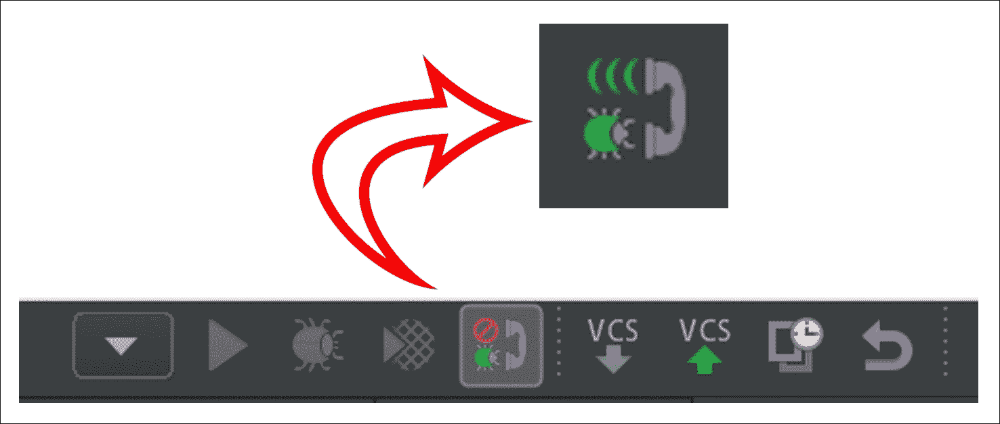
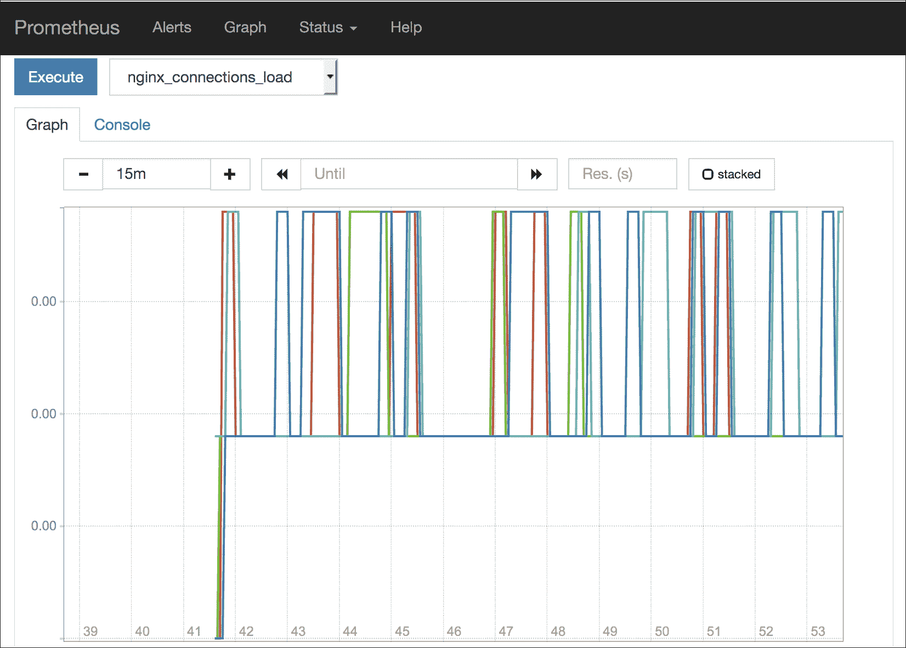
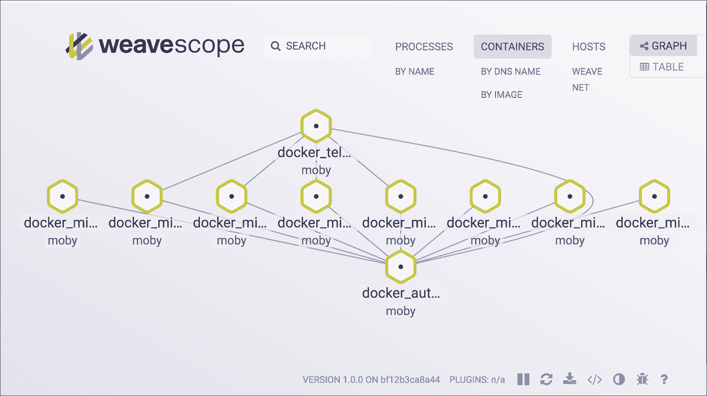

# 六、监控

在最后一章中，我们花了一些时间开发示例应用程序。现在是时候从更高级的主题开始了。在本章中，我们将向您展示如何监控 microservices 应用程序。跟踪应用程序中发生的一切将帮助您随时了解总体性能，甚至可以发现问题和瓶颈。

# 调试和评测

调试和分析在开发复杂的大型应用程序时是非常必要的，所以让我们解释一下它们是什么，以及我们如何利用这些工具。

## 什么是调试？

调试是识别和修复编程错误的过程。这主要是一项手工任务，开发人员需要运用他们的想象力、直觉，并有很大的耐心。

大多数情况下，有必要在代码中包含新指令，以便在具体执行点读取变量的值，或者包含停止执行的代码，以便知道它是否正在通过函数。

但是，此过程可以由调试器管理。这是一个工具或应用程序，它允许我们控制应用程序的执行，以便跟踪每个执行的指令并发现错误或错误，避免在代码中添加代码指令。

调试器使用名为断点的指令。顾名思义，**断点**是应用程序停止的一个点，由开发人员驱动它决定做什么。此时，调试器会提供有关应用程序当前状态的不同信息。

稍后我们将看到有关调试器和断点的更多信息。

## 什么是评测？

与调试一样，评测是一个确定应用程序在性能方面是否正常工作的过程。评测调查应用程序的行为，以便了解执行代码不同部分的专用时间，以发现瓶颈或根据速度或消耗的资源对其进行优化。

评测通常在开发过程中用作调试的一部分，专家有必要在适当的环境中对其进行测量，以从中获取真实数据。

有四种不同类型的探查器：基于事件、统计、支持代码的工具和模拟。

## 使用 Xdebug 在 PHP 中进行调试和评测

现在我们将在我们的项目中安装和设置 Xdebug。这必须安装在我们的 IDE 上，因此根据您使用的 IDE，这个过程将有所不同，但接下来的步骤非常相似。在本例中，我们将在 PHPStorm 上安装它。即使您使用不同的 IDE，在安装 Xdebug 之后，在任何 IDE 中调试代码的工作流程大体相同

### 调试安装

要在 Docker 上安装 Xdebug，我们应该修改适当的`Dockerfile`文件。我们将在用户微服务上安装它，因此打开`docker/microservices/user/php-fpm/Dockerfile`文件并添加以下突出显示的行：

```php
FROM php:7-fpm
RUN apt-get update && apt-get -y install 
git g++ libcurl4-gnutls-dev libicu-dev libmcrypt-dev libpq-dev libxml2-dev unzip zlib1g-dev 
&& git clone -b php7 https://github.com/phpredis/phpredis.git /usr/src/php/ext/redis 
&& docker-php-ext-install curl intl json mbstring mcrypt pdo pdo_mysql redis xml 
&& apt-get autoremove && apt-get autoclean 
&& rm -rf /var/lib/apt/lists/*
RUN apt-get update && apt-get upgrade -y && apt-get autoremove -y 
&& apt-get install -y git libmcrypt-dev libpng12-dev libjpeg-dev libpq-dev mysql-client curl 
&& rm -rf /var/lib/apt/lists/* 
&& docker-php-ext-configure gd --with-png-dir=/usr --with-jpeg-dir=/usr 
&& docker-php-ext-install mcrypt gd mbstring pdo pdo_mysql zip 
&& pecl install xdebug 
&& rm -rf /tmp/pear 
&& echo "zend_extension=$(find /usr/local/lib/php/extensions/ -name xdebug.so)n" >> /usr/local/etc/php/conf.d/xdebug.ini 
&& echo "xdebug.remote_enable=on" >> /usr/local/etc/php/conf.d/xdebug.ini 
&& echo "xdebug.remote_autostart=off" >> /usr/local/etc/php/conf.d/xdebug.ini 
&& echo "xdebug.remote_port=9000" >> /usr/local/etc/php/conf.d/xdebug.ini 
&& curl -sS https://getcomposer.org/installer | php -- --install-dir=/usr/local/bin --filename=composer
RUN echo 'date.timezone="Europe/Madrid"' >> /usr/local/etc/php/conf.d/date.ini
RUN echo 'session.save_path = "/tmp"' >> /usr/local/etc/php/conf.d/session.ini

{{ Omited code }}

RUN curl -sSL https://phar.phpunit.de/phpunit.phar -o /usr/bin/phpunit && chmod +x /usr/bin/phpunit

ADD ./config/php.ini /usr/local/etc/php/
CMD [ "/usr/local/bin/containerpilot", 
"php-fpm", 
"--nodaemonize"]

```

第一个高亮显示的块是`install xdebug`所必需的。`&& pecl install xdebug`行用于使用 PECL 安装 Xdebug，其余行在`xdebug.ini`文件上设置参数。第二个是将`php.ini`文件从本地机器复制到 Docker。

还需要在`php.ini`文件上设置一些值，所以打开它，它位于`docker/microservices/user/php-fpm/config/php.ini`上，并添加以下行：

```php
    memory_limit = 128M
    post_max_size = 100M
    upload_max_filesize = 200M

    [Xdebug]
    xdebug.remote_host=YOUR_LOCAL_IP_ADDRESS

```

为了在 Docker 中可见，您应该输入您的本地 IP 地址而不是`YOUR_LOCAL_IP_ADDRESS`，这样 Xdebug 就可以读取我们的代码。

### 提示

您的本地 IP 地址是您网络中的 IP，而不是公共 IP。

现在，您可以通过执行以下命令进行构建，以便安装调试所需的一切：

```php
docker-compose build microservice_user_fpm

```

这可能需要几分钟。完成后，将安装 Xdebug。

### 调试设置

现在是在我们最喜欢的 IDE 上设置 Xdebug 的时候了。如前所述，我们将使用 PHPStorm，但可以随意使用任何其他 IDE。

我们必须在 IDE 上创建一个服务器，在 PHPStorm 中，这是通过导航到**首选项****语言&框架****PHP**来完成的。因此，添加一个新的，并将`name`设置为`users`，例如`host`设置为`localhost`、`port`设置为`8084`、`debugger`设置为`xdebug`。还需要启用**使用路径映射**来映射我们的路线。

现在，我们需要导航到**工具****DBGp proxy-configuration**，并确保 IDE 密钥字段设置为`PHPSTORM`、`Host`到`users`（该名称必须与您在 servers 部分输入的名称相同），以及`Port`到`9000`。

通过执行以下命令停止和启动 Docker：

```php
docker-compose stop
docker-compose up -d

```

将 PHPStorm 设置为能够侦听调试器：



Xdebug 按钮，用于侦听 PHPStorm 中的连接

### 调试输出

现在可以查看调试器结果了。您只需在代码中设置断点，执行将在该点停止，并提供所有数据值。要执行此操作，请转到您的代码，例如，在`UserController.php`文件上，单击一行的左侧。它将创建一个红点；这是一个断点：


PHPStorm 中的断点

现在，您已经设置了断点并运行了调试器，因此现在是时候使用 Postman 调用调试器了。通过使用`api_key = RSAy430_a3eGR and XDEBUG_SESSION_START = PHPSTORM`参数执行对`http://localhost:8084/api/v1/user`的 POST 调用来尝试断点。执行将在断点处停止，从此处开始执行控制：


PHPStorm 中的调试器控制台

请注意，变量端有参数的所有当前值。在这种情况下，您可以看到`test`参数设置为`"this is a test"`；我们在断点前两行指定了该值。

正如我们所说，现在我们已经控制了执行；这三个基本功能如下：

1.  **越步：**继续执行以下行。
2.  **进入：**这将在函数内继续执行。
3.  **跳出：**在函数外继续执行。

所有这些基本函数都是逐步执行的，因此它将在下一行停止，不需要任何其他断点。

如您所见，这对于查找代码中的错误非常有用。

### 仿形安装

一旦安装了 Xdebug，我们只需要在`docker/microservices/user/php-fpm/Dockerfile`文件中添加以下行即可启用评测：

```php
RUN apt-get update && apt-get upgrade -y && apt-get autoremove -y 
&& apt-get install -y git libmcrypt-dev libpng12-dev libjpeg-dev libpq-dev mysql-client curl 
&& rm -rf /var/lib/apt/lists/* 
&& docker-php-ext-configure gd --with-png-dir=/usr --with-jpeg-dir=/usr 
&& docker-php-ext-install mcrypt gd mbstring pdo pdo_mysql zip 
&& pecl install xdebug 
&& rm -rf /tmp/pear 
&& echo "zend_extension=$(find /usr/local/lib/php/extensions/ -name xdebug.so)n" >> /usr/local/etc/php/conf.d/xdebug.ini 
&& echo "xdebug.remote_enable=onn" >> /usr/local/etc/php/conf.d/xdebug.ini 
&& echo "xdebug.remote_autostart=offn" >> /usr/local/etc/php/conf.d/xdebug.ini 
&& echo "xdebug.remote_port=9000n" >> /usr/local/etc/php/conf.d/xdebug.ini
&& echo "xdebug.profiler_enable=onn" >> /usr/local/etc/php/conf.d/xdebug.ini 
&& echo "xdebug.profiler_output_dir=/var/www/html/tmpn" >> /usr/local/etc/php/conf.d/xdebug.ini 
&& echo "xdebug.profiler_enable_trigger=onn" >> /usr/local/etc/php/conf.d/xdebug.ini 
&& curl -sS https://getcomposer.org/installer | php -- --install-dir=/usr/local/bin --filename=composer

```

通过`profiler_enable`，我们启用探查器，输出目录由`profiler_output_dir`设置。此目录应该存在于我们的用户微服务上，以便获取探查器输出文件。因此，如果尚未创建，请在`/source/user/tmp`上立即创建。

现在，您可以通过执行以下命令进行构建，以便安装调试所需的一切：

```php
docker-compose build microservice_user_fpm

```

这可能需要几分钟。完成后，将安装 Xdebug。

### 仿形设置

它不需要设置，因此只需执行以下命令即可停止和启动 Docker：

```php
docker-compose stop
docker-compose up -d

```

将 PHPStorm 设置为能够侦听调试器，就像我们对调试器所做的那样。

### 分析输出文件

为了生成分析文件，我们需要执行一个调用，就像我们之前对 Postman 所做的那样，因此可以随意执行您想要的方法。它将生成一个位于我们之前创建的文件夹上的名为`cachegrind.out.XX`的文件。

如果打开此文件，您会注意到它很难理解，但是有一些工具可以读取此类内容。PHPStorm 在**工具******分析**Xdebug Profiler 快照**上有一个工具。打开它后，您可以选择要分析的文件，然后该工具将显示对调用中执行的所有文件和函数的详细分析。显示花费的时间、调用的时间和其他有趣的内容对于优化代码和发现瓶颈非常有用。

# 错误处理

错误处理是我们管理应用程序中的错误和异常的方式。为了检测和组织开发过程中可能发生的所有错误，这一点非常重要。

## 什么是错误处理？

在开发中使用术语*错误处理*是指在执行过程中响应异常发生的过程。

通常，异常的出现会破坏应用程序执行的正常工作流程，并执行已注册的异常处理程序，从而为我们提供更多有关正在发生的情况以及如何避免异常的信息。

PHP 处理错误的方式非常基本。默认错误消息由文件名、行和有关浏览器接收到的错误的一点说明组成。在本章中，我们将看到处理错误的三种不同方法。

## 为什么错误处理很重要？

大多数应用程序都非常复杂和庞大，如果我们像这里这样在基于微服务的应用程序上工作，它们也由不同的人甚至不同的团队开发。你能想象如果我们将所有这些东西混合在一起，项目中会出现的所有潜在 bug 吗？不可能了解应用程序可能存在的所有问题或用户将在其中发现的所有问题。

因此，错误处理在以下两个方面有帮助：

*   **Users or consumers**: In microservices, error handling is very useful because it allows the consumers to know the possible problems that an API has and maybe they can figure out if it is a problem related to the introduced parameters in the API call, or the file size of an image. Also, in microservices, it is very useful to use different status codes for the errors in order to let the consumer know what is happening. You can find these codes in the [Chapter 11](11.html "Chapter 11. Best Practices and Conventions"), *Best Practices and Conventions*.

    在商业网站上，错误处理可以避免向用户或客户显示类似`PHP Fatal error: Cannot access empty property`的奇怪消息。相反，它可以说一些简单的东西，比如`There is an error. Please contact us`。

*   **开发人员或您自己**：它允许团队的其他成员甚至您自己了解应用程序中的任何错误，帮助您调试可能出现的问题。有很多工具可以获取这些类型的 bug，并通过电子邮件、写在日志文件中或放在事件日志中发送给您，详细说明错误跟踪、函数参数、数据库调用和其他有趣的事情。

## 使用微服务管理错误处理时面临的挑战

如前所述，我们将解释三种不同的错误处理方法。当我们使用微服务时，我们必须监控所有可能的错误，以便让微服务知道问题所在。

### 基本模具（）函数

在 PHP 中，处理错误的基本方法是使用 die（）命令。让我们看一个例子。假设我们要打开一个文件：

```php
    <?php
      $file=fopen("test.txt","r");
    ?>
```

当执行到达该点并尝试打开名为`test.txt`的文件时，如果该文件不存在，PHP 将抛出如下错误：

```php
Warning: fopen(test.txt) [function.fopen]: failed to open stream:
No such file or directory in /var/www/html/die_example.php on line 2

```

为了避免出现错误消息，我们可以使用`die()`函数，并在其中写入原因，以便执行不会继续：

```php
    <?php
      if(!file_exists("test.txt")) {
        die("The file does not exist");
      } else {
        $file=fopen("test.txt","r");
      }
    ?>
```

这只是 PHP 上基本错误处理的一个示例。显然，有更好的方法来管理这一点，但这是管理错误所需的最低限度。换句话说，避免来自 PHP 应用程序的自动错误消息比手动停止执行并向用户提供人工语言理由更有效。

让我们看看另一种管理方法。

### 自定义错误处理

创建一个系统来管理应用程序中的错误比使用`die()`函数更好。Lumen 为我们提供了此系统，并且在安装时已对其进行了配置。

我们可以通过设置其他参数来配置它。首先是错误细节。通过将其设置为`true`，可以获得有关错误的更多信息。为此，需要在`.env`文件中添加`APP_DEBUG`值并将其设置为`true`。这是在开发环境中工作的推荐方式，以便开发人员能够更多地了解应用程序的问题，但一旦应用程序位于生产服务器上，该值应设置为`false`，以避免向用户提供更多信息。

本系统通过`AppExceptionsHandler`类管理所有异常。此类包含两个方法：`report`和`render`。让我们解释一下。

#### 报告方式

`Report`方法用于记录微服务中发生的异常，甚至可以将它们发送到外部工具，如 Sentry。我们将在本章中介绍这一点。

如前所述，此方法仅在基类上记录问题，但您可以根据需要管理不同的异常。在以下示例中检查如何执行此操作：

```php
    public function report(Exception $e)
    {
      if ($e instanceof CustomException) {
        //
      } else if ($e instanceof OtherCustomException) {
        //
      }
      return parent::report($e);
    }
```

管理不同错误的方法是`instanceof`。如您所见，在前面的示例中，对于每个异常类型，您可以有不同的响应。

也可以通过向`$dontReport`类添加变量来忽略某些异常类型。这是一组您不想报告的不同异常。如果我们不在`Handle`类上使用此变量，默认情况下只会忽略`404`错误。

```php
    protected $dontReport = [
      HttpException::class,
      ValidationException::class
    ];
```

#### 渲染方法

如果`report`方法用于帮助开发人员或您自己，则渲染方法用于帮助用户或消费者。此方法在 HTTP 响应中提供异常，如果是网站，则会将异常发送回用户，如果是 API，则会将异常发送回消费者。

默认情况下，将异常发送到基类以生成响应，但可以对其进行修改。请看下面的代码：

```php
    public function render($request, Exception $e)
    {
      if ($e instanceof CustomException) {
        return response('Custom Message');
      }
      return parent::render($request, $e);
    }
```

如您所见，`render`方法接收两个参数：请求和异常。使用这些参数，您可以为您的用户或消费者做出适当的响应，提供您希望为每个异常提供的信息。例如，通过向 API 的使用者提供错误代码，他们可以在 API 文档中检查错误代码。请看以下示例：

```php
    public function render($request, Exception $e)
    {
      if ($e instanceof CustomException) {
        return response()->json([
            'error' => $e->getMessage(),
            'code' => 44 ,
          ],
        Response::HTTP_UNPROCESSABLE_ENTITY);
      }
      return parent::render($request, $e);
    }
```

消费者将收到带有`code 44`的错误消息；这应该在我们的 API 文档和正确的状态代码中。显然，为了满足消费者的需求，这可能会有所不同。

### 与哨兵的错误处理

最好有一个系统来监控错误。市场上有很多错误跟踪系统，但其中最突出的是 Sentry，这是一个实时跨平台错误跟踪系统，为我们了解微服务中发生的情况提供线索。一个有趣的特性是它支持通过电子邮件或其他媒介发送通知。

使用知名系统有利于您的应用程序，您使用的是一个值得信赖的知名工具，在我们的案例中，该工具与我们的框架 Lumen 易于集成。

我们需要做的第一件事是在 Docker 环境中安装 Sentry；所以，像往常一样，用`docker-compose stop`停止所有容器。所有容器停止后，打开`docker-compose.yml`文件并添加以下容器：

```php
    sentry_redis:
      image: redis
    expose:
      - 6379

    sentry_postgres:
      image: postgres
      environment:
        - POSTGRES_PASSWORD=sentry
        - POSTGRES_USER=sentry
      volumes:
        - /var/lib/postgresql/data
      expose:
        - 5432

      sentry:
        image: sentry
      links:
        - sentry_redis
        - sentry_postgres
      ports:
        - 9876:9000
      environment:
        SENTRY_SECRET_KEY: mymicrosecret
        SENTRY_POSTGRES_HOST: sentry_postgres
        SENTRY_REDIS_HOST: sentry_redis
        SENTRY_DB_USER: sentry
        SENTRY_DB_PASSWORD: sentry

      sentry_celery-beat:
        image: sentry
      links:
        - sentry_redis
        - sentry_postgres
        command: sentry celery beat
      environment:
        SENTRY_SECRET_KEY: mymicrosecret
        SENTRY_POSTGRES_HOST: sentry_postgres
        SENTRY_REDIS_HOST: sentry_redis
        SENTRY_DB_USER: sentry
        SENTRY_DB_PASSWORD: sentry

      sentry_celery-worker:
        image: sentry
      links:
        - sentry_redis
        - sentry_postgres
        command: sentry celery worker
      environment:
        SENTRY_SECRET_KEY: mymicrosecret
        SENTRY_POSTGRES_HOST: sentry_postgres
        SENTRY_REDIS_HOST: sentry_redis
        SENTRY_DB_USER: sentry
        SENTRY_DB_PASSWORD: sentry
```

在前面的代码中，我们首先创建了一个特定的`redis`和`postgresql`容器，供哨兵使用。一旦我们有了所需的数据存储容器，我们就添加并链接了作为 Sentry 核心的不同容器。

```php
docker-compose up -d sentry_redis sentry_postgres sentry

```

前面的命令将增加哨兵设置所需的最小容器数。一旦我们第一次安装了它们，我们就需要配置并填充数据库和用户。我们只需在 Sentry 可用的容器上运行一个命令即可：

```php
docker exec -it docker_sentry_1 sentry upgrade

```

前面的命令将完成 Sentry 运行所需的所有设置，并要求您创建一个帐户，以管理员身份访问 UI；执行此操作以保存它并在以后使用。一旦完成并返回到命令路径，您就可以启动项目的其余容器：

```php
docker-compose up -d

```

一旦一切就绪，您可以在浏览器中打开`http://localhost:9876`，您将看到类似于以下屏幕的屏幕：


哨兵登录页面

使用您在上一步中创建的用户登录，并创建一个新项目以开始跟踪我们的错误/日志。

### 提示

与其使用单个 Sentry 项目来存储所有调试信息，不如将它们划分为逻辑组，例如，一个用于用户 microservice API 的组，等等。

创建项目后，您将需要分配给此项目的 DSN；打开项目设置并选择**客户端密钥**选项。在本节中，您可以找到分配给项目的**DSN**键；您将在代码中使用这些键，以便库知道需要将所有调试信息发送到哪里：


哨兵 DSN 钥匙

祝贺此时，您已经准备好在项目中使用 Sentry。现在是使用 composer 安装`sentry/sentry-laravel`包的时候了。要安装此库，您可以使用以下命令编辑您的`composer.json`文件或输入您的用户 microservice 容器：

```php
docker exec -it docker_microservice_user_fpm_1 /bin/bash

```

进入容器后，发出以下命令以使用 composer 更新您的`composer.json`并为您安装：

```php
composer require sentry/sentry-laravel

```

一旦安装完成，我们需要在我们的微服务上进行配置，因此打开`bootstrap/app.php`文件并添加以下行：

```php
$app->register('SentrySentryLaravelSentryLumenServiceProvider');
# Sentry must be registered before routes are included
require __DIR__ . '/../app/Http/routes.php';
```

现在，我们必须像前面看到的那样配置报告方法，因此转到`app/Exceptions/Handler.php`文件并在报告函数中添加以下行：

```php
    public function report(Exception $e)
    {
       if ($this->shouldReport($e)) {
         app('sentry')->captureException($e);
       }
       parent::report($e);
    }
```

这些行将向 Sentry 报告异常，因此让我们使用以下配置创建`config/sentry.php`文件：

```php
    <?php
      return array(
        'dsn' => '___DSN___',
        'breadcrumbs.sql_bindings' => true,
      );
```

# 应用程序日志

日志是调试信息的记录，在将来查看应用程序的性能或应用程序的运行情况，甚至获取一些统计数据时，这些信息可能非常重要。实际上，所有已知的应用程序都会生成某种日志信息。例如，默认情况下，所有对 NGINX 的请求都记录在`/var/log/nginx/error.log`和`/var/log/nginx/access.log`中。第一个`error.log`存储应用程序生成的任何错误，例如 PHP 异常。第二个是`access.log`，它是由点击您的 NGINX 服务器的每个请求创建的。

作为一名经验丰富的开发人员，您已经知道在应用程序中保留一些日志非常重要，而且您并不是唯一一个执行此任务的人，您可以找到许多可以让您的生活更轻松的库。您可能想知道重要的位置在哪里，您可以在哪里进行日志调用以及需要保存的信息。没有什么经验法则可以让你一直遵循，你只需要考虑未来，以及在最坏的情况下（一个坏掉的应用程序），你需要什么样的信息。

让我们关注我们的示例应用程序；在用户服务中，我们将处理用户注册。在保存新用户注册之前，可以进行日志调用。通过这样做，您可以跟踪您的日志，并知道我们试图保存哪些信息以及何时保存。现在，假设在注册过程中有一个 bug，它以特殊字符中断，但您没有意识到这一点，您只知道有一些用户报告注册问题。你现在要做什么？检查日志！您可以轻松地检查用户试图存储的信息，并检测具有特殊字符的用户是否未注册。

例如，如果您没有使用日志系统，您可以使用`error_log()`在默认日志文件中存储消息：

```php
error_log('Your log message!', 0);

```

`0`参数表示我们希望将消息存储在默认日志文件中。此功能允许我们通过电子邮件发送消息，将`0`参数更改为`1`，并使用电子邮件地址添加额外参数。

所有日志系统允许您定义不同的级别；最常见的是（请注意，它们在不同的日志系统中可以有不同的名称，但概念是相同的）：

*   **信息**：指非关键信息。通常使用此级别存储调试信息，例如，每次呈现特定页面时都可以存储新记录。
*   **警告**：这些错误不是很重要，或者系统可以自行恢复。例如，缺少某些信息会导致应用程序的状态不一致。
*   **错误**：这是关键信息，当然，所有这些都是应用程序中发生的错误。这是您每次发现错误时都要检查的第一级。

## 微服务的挑战

当您使用单体应用程序时，默认情况下，您的日志将存储在同一位置，或者至少只存储在几个服务器中。如果您有任何问题，需要检查日志，您可以在几分钟内获得所有信息。挑战在于，当您处理一个微服务体系结构时，每个微服务都会生成日志信息。更糟糕的是，如果一个微服务有多个实例，每个实例都创建自己的日志数据。

在这种情况下你会怎么做？答案是使用诸如 Sentry 之类的日志系统将所有日志记录存储在同一位置。有了日志服务，您就可以扩展基础架构，而不用担心日志。它们都将存储在同一个位置，让您可以轻松找到有关不同微服务/实例的信息。

## 内腔中的对数

管腔出盒集成**独白**（PSR-3 接口）；此日志库允许您使用不同的日志处理程序。

在 Lumen 框架中，您可以在`.env`文件中设置应用程序的错误详细信息量。`APP_DEBUG`设置定义将生成多少调试信息。主要建议在开发环境中将此标志设置为`true`，但在生产环境中始终设置为`false`。

要在代码中使用日志记录功能，只需确保已取消对`bootstrap/app.php`文件的`$app->withFacades();`行的注释。启用 facades 后，可以在代码的任何位置开始使用 Log 类。

### 提示

默认情况下，Lumen 将在没有任何额外配置的情况下将日志存储在`storage/logs`文件夹中。

我们的记录器提供 RFC 5424 中定义的八个日志记录级别：

*   `Log::emergency($error);`
*   `Log::alert($error);`
*   `Log::critical($error);`
*   `Log::error($error);`
*   `Log::warning($error);`
*   `Log::notice($error);`
*   `Log::info($error);`
*   `Log::debug($error);`

一个有趣的特性是必须添加上下文数据数组的选项。假设您想要记录一个失败用户登录的记录。您可以执行类似于以下代码的操作：

```php
    Log::info('User unable to login.', ['id' => $user->id]);
```

在前面的代码中，我们向日志消息中添加了额外的信息——试图登录到我们的应用程序时遇到问题的用户的 ID。

使用定制处理程序（如 Sentry）设置 Monolog（我们在前面的项目中解释了如何安装它）非常简单，您只需在`bootstrap/app.php`文件中添加以下内容：

```php
    $app->configureMonologUsing(function($monolog) {
      $client = new Raven_Client('sentry-dsn');
      $monolog->pushHandler(
        new MonologHandlerRavenHandler($client, 
                                       MonologLogger::WARNING)
      );
      return $monolog;
    });
```

前面的代码改变了独白的工作方式；在我们的例子中，不是将所有调试信息存储在`storage/logs`文件夹中，而是使用我们的 Sentry 安装和`WARNING`级别。

我们向您展示了在 Lumen 中存储日志的两种不同方式：在本地文件中（如单体应用程序）或使用外部服务。两者都很好，但我们建议微服务开发使用外部工具，如 Sentry。

# 应用监控

在软件开发中，应用程序监视可以定义为确保应用程序以预期方式执行的过程。这个过程允许我们测量和评估应用程序的性能，有助于发现瓶颈或隐藏的问题。

应用程序监视通常通过一个专门的软件进行，该软件从运行软件的应用程序或基础结构收集度量。这些指标可以包括 CPU 负载、事务时间或平均响应时间等。您可以测量的任何东西都可以存储在遥测系统中，以便以后进行分析。

监控单体应用程序很容易；您将所有内容都放在一个地方，所有日志都存储在同一个地方，所有指标都可以从同一台主机收集，您可以知道您的 PHP 线程是否正在杀死您的服务器。您可能发现的主要困难是查找应用程序中性能不佳的部分，例如，PHP 代码的哪一部分正在浪费资源。

当您使用微服务时，您将代码拆分为逻辑部分，这样您就可以知道应用程序的哪一部分性能不佳，但代价很大。您的所有指标都在不同的容器或服务器之间分离，这使得您很难对总体性能有一个全面的了解。通过安装遥测系统，您可以将所有指标发送到同一位置，从而更容易检查和调试应用程序。

## 分级监控

作为开发人员，您需要了解应用程序在所有级别上的性能，从应用程序的顶层到底层，即硬件或虚拟机监控程序级别。在理想情况下，我们可以控制所有级别，但最有可能的情况是，您只能监控到基础架构级别。

下图显示了不同的层以及与服务器堆栈的关系：


监测层

### 应用层

应用程序级别存在于应用程序内部；所有指标都是由您的代码生成的，在我们的例子中是由 PHP 生成的。不幸的是，您找不到专门用于 PHP 的免费或开源的**应用程序性能监控**（**APM**）工具。在任何情况下，你都可以找到有趣的第三方服务，免费计划试一试。

PHP 最著名的两个 APM 服务是 New Relic 和 Datadog。在这两种情况下，安装都遵循相同的路径——在容器/主机上安装一个代理（或库），这个小软件将开始向其服务发送度量，为您提供一个仪表板，您可以在其中操作数据。使用第三方服务的主要缺点是您无法控制此代理或度量系统，但这一缺点可以转化为一个优点—您将拥有一个不需要管理的可靠系统，您只需要担心您的应用程序。

#### 数据狗

Datadog 客户端的安装非常简单。打开您的一个微服务的`composer.json`并在`required`定义中插入以下行：

```php
    "datadog/php-datadogstatsd": "0.3.*"
```

一旦保存更改并进行 composer 更新，就可以在代码中使用`Datadogstatsd`类并开始发送度量。

想象一下，您想监控 secret microservice 获取数据库中所有服务器的时间。打开你的秘密微服务的`app/Http/Controllers/SecretController.php`文件，修改你的类，如下所示：

```php
    use Datadogstatsd;

    /** … Code omitted ... **/
    const APM_API_KEY = 'api-key-from-your-account';
    const APM_APP_KEY = 'app-key-from-your-account';

    public function index(Manager $fractal, SecretTransformer                          
    $secretTransformer, Request $request)
    {
      Datadogstatsd::configure(self::APM_API_KEY, self::APM_APP_KEY);
      $startTime = microtime(true);
      $records = Secret::all();

      $collection = new Collection($records, $secretTransformer);
      $data = $fractal->createData($collection)->toArray();
      Datadogstatsd::timing('secrets.loading.time', microtime(true) -                              
      $startTime, [‘service’ => ‘secret’]);

      return response()->json($data);
    }
```

前面的代码定义了 Datadog 帐户的应用程序和 API 密钥，我们使用它们来设置`Datadogstatsd`接口。该示例记录了检索所有机密记录所花费的时间。`Datadogstatsd::timing()`方法将向我们的外部遥测服务发送度量。在应用程序内部进行监视可以让您决定要在其中生成度量的代码位置。监控此级别时没有经验法则，但您需要记住，了解应用程序的大部分时间都花在哪里很重要，因此在您认为可能成为瓶颈的代码的每个位置添加度量（例如从其他服务或数据库获取数据）。

使用此库，您甚至可以使用以下方法递增和递减自定义度量点：

```php
    Datadogstatsd::increment('another.data.point');
    Datadogstatsd::increment('my.data.point.with.custom.increment', .5);
    Datadogstatsd::increment('your.data.point', 1, ['mytag’' => 'value']);
```

其中三个增加一个点：第一个以一个单位增加`another.data.point`，第二个以`0.5`增加我们的点，第三个增加点，并向公制记录添加自定义标记。

您还可以使用与`::increment()`语法相同的`Datadogstatsd::decrement()`来减少点数。

### 基础设施层面

此级别控制操作系统和应用程序之间的一切。向该层添加监控系统可以让您知道您的容器是否使用了太多内存，或者特定容器的负载是否过高。您甚至可以跟踪应用程序的一些基本指标。

在商业街上有多种监控该层的选项，但我们将为您提供两个有趣的项目。它们都是开源的，即使它们使用不同的方法，您也可以将它们结合起来。

#### 普罗米修斯

Apple T0.普罗米修斯 AuthT1 是一个开源的监听和警报工具包，它是在 SooCu 云中创建的，它是在 OrthT2.云本地计算基础 To3T3 的保护伞下创建的。作为新手并不意味着它没有强大的功能。其中，我们可以突出以下主要特点：

*   通过 pull-over HTTP 收集时间序列
*   通过服务发现（kubernetes、Consor 等）或静态配置进行目标发现
*   支持简单图形的 Web UI
*   强大的查询语言，允许您从数据中提取所需的所有信息

使用 Docker 安装普罗米修斯非常简单，我们只需要为遥测系统添加一个新的容器，并将其与我们的自动发现服务（Consor）链接。在`docker-compose.yml`文件中添加以下行：

```php
    telemetry:
      build: ./telemetry/
      links:
        - autodiscovery
      expose:
        - 9090
      ports:
        - 9090:9090
```

在前面的代码中，我们只告诉 Docker`Dockerfile`所在的位置，链接没有 autodiscovery 容器的容器，并公开和映射一些端口。现在，是创建具有以下内容的`telemetry/Dockerfile`文件的时候了：

```php
FROM prom/prometheus:latest
ADD ./etc/prometheus.yml /etc/prometheus/

```

正如您所看到的，创建遥测容器不需要花费很多时间；我们正在使用官方图像并添加我们的普罗米修斯配置。创建具有以下内容的`etc/prometheus.yml`配置：

```php
    global:
      scrape_interval: 15s
      evaluation_interval: 15s
      external_labels:
      monitor: 'codelab-monitor'

    scrape_configs:
      - job_name: 'containerpilot-telemetry'

    consul_sd_configs:
      - server: 'autodiscovery:8500'
      services: ['containerpilot']
```

同样，设置非常简单，因为我们正在定义一些全局报废间隔和一个名为`containerpilot-telemetry`的作业，该作业将使用我们的自动发现容器，并监控以`containerpilot`名称公布的 Consor 中存储的所有服务。

普罗米修斯有一个简单而强大的网络用户界面。打开您的`localhost:9090`，您可以访问此工具收集的所有指标。创建图形非常简单，选择一个度量，普罗米修斯将为您完成所有工作：



普罗米修斯图形用户界面

此时，您可能想知道如何声明度量。在前面的章节中，我们介绍了`containerpilot`，这是一个工具，我们将在容器中用作 PID 来管理我们的自动发现。`containerpilot`能够声明支持的遥测系统可用的指标，在我们的例子中是普罗米修斯。例如，如果打开`docker/microservices/battle/nginx/config/containerpilot.json`文件，可以找到类似以下代码的内容：

```php
    "telemetry": {
      "port": 9090,
      "sensors": [
        {
          "name": "nginx_connections_unhandled_total",
          "help": "Number of accepted connnections that were not 
                   handled",
          "type": "gauge",
          "poll": 5,
          "check": ["/usr/local/bin/sensor.sh", "unhandled"]
        },
        {
          "name": "nginx_connections_load",
          "help": "Ratio of active connections (less waiting) to the                   
                   maximum worker connections",
          "type": "gauge",
          "poll": 5,
          "check": ["/usr/local/bin/sensor.sh", "connections_load"]
        }
      ]
    }
```

在前面的代码中，我们声明了两个度量：`"nginx_connections_unhandled_total"`和`"nginx_connections_load"`。`ContainerPilot`将在容器内运行`"check"`参数中定义的命令，结果将被普罗米修斯废弃。

你可以用普罗米修斯监控你的基础设施中的任何东西，甚至是普罗米修斯本身。请随意更改我们的基本安装和设置，并将其调整为使用自动驾驶仪模式。如果普罗米修斯的 web 用户界面不足以显示您的图形，您需要更多的功能和控制，您可以轻松地将我们的遥测系统与 Grafana 链接，Grafana 是最强大的工具之一，用于创建具有各种指标的仪表板。

#### 编织范围

**Weave Scope**是一款用于监控您的容器的工具，它与 Docker 和 Kubernetes 合作良好，并具有一些有趣的功能，可以让您的生活更轻松。Scope 为您提供了应用程序和整个基础设施的自上而下的深入视图。使用此工具，您可以实时诊断分布式容器化应用程序中的任何问题。

忘记复杂的配置吧，Scope 会自动检测并开始监视基础架构中运行的每台主机、Docker 容器和任何进程。一旦它获得所有这些信息，它就会创建一个很好的地图，实时显示所有容器之间的交互通信。您可以使用此工具查找内存问题、瓶颈或任何其他问题。您甚至可以检查流程、容器、服务或主机的不同度量。您可以在 Scope 中找到的一个隐藏功能是管理容器、查看日志或附加终端的能力，所有这些都可以从浏览器 UI 中找到。

部署 Weave Scope 有两种选择：在独立模式下，所有组件都在本地运行；或者作为付费云服务，您无需担心任何事情。独立模式在每个基础结构服务器中作为特权容器运行，能够关联来自集群或服务器的所有信息，并在 UI 中显示。

安装非常简单--只需在每个基础结构服务器上运行以下命令：

```php
sudo curl -L git.io/scope -o /usr/local/bin/scope
sudo chmod a+x /usr/local/bin/scope
scope launch

```

启动 Scope 后，立即打开服务器的 IP 地址（如果您像我们一样在本地工作，则打开本地主机）`http://localhost:4040`，您将看到类似于以下屏幕截图的内容：



图形可视化

前面的图像是我们正在构建的应用程序的快照；在这里，您可以看到我们所有的容器以及它们之间在特定时刻的连接。尝试一下，当您对不同的 API 端点进行一些调用时，您将能够看到容器之间的连接正在发生变化。

您能在我们的微服务基础设施中发现任何问题吗？如果是这样，你是对的。如您所见，我们没有将某些容器连接到自动发现服务。Scope 帮助我们找到了未来可能出现的问题，现在请随意解决。

如您所见，您可以使用 Scope 从浏览器监视您的应用程序。您只需要注意谁有权访问特权作用域容器；如果您计划在生产中使用 Scope，请确保限制对此工具的访问。

### 硬件/虚拟机监控程序监控

该层与我们的硬件或虚拟机监控程序级别相匹配，是您可以放置度量的最低位置。该层的维护和监控通常由系统管理员完成，他们可以使用非常知名的工具，如**Zabbix**或**Nagios**。作为一名开发人员，您可能不会担心这个层。如果您在云环境中部署应用程序，您将无法访问该层生成的度量。

# 总结

在本章中，我们解释了如何调试和分析微服务应用程序，这是任何软件开发中的一个重要过程。在日常工作中，您不会花费所有时间调试或分析应用程序；在某些情况下，您将花费大量时间尝试修复 bug。因此，重要的是要有一个可以存储所有错误和调试信息的地方，这些信息将使您更深入地了解应用程序的情况。最后，作为一名完整的堆栈开发人员，我们向您展示了如何监控应用程序堆栈的前两层。