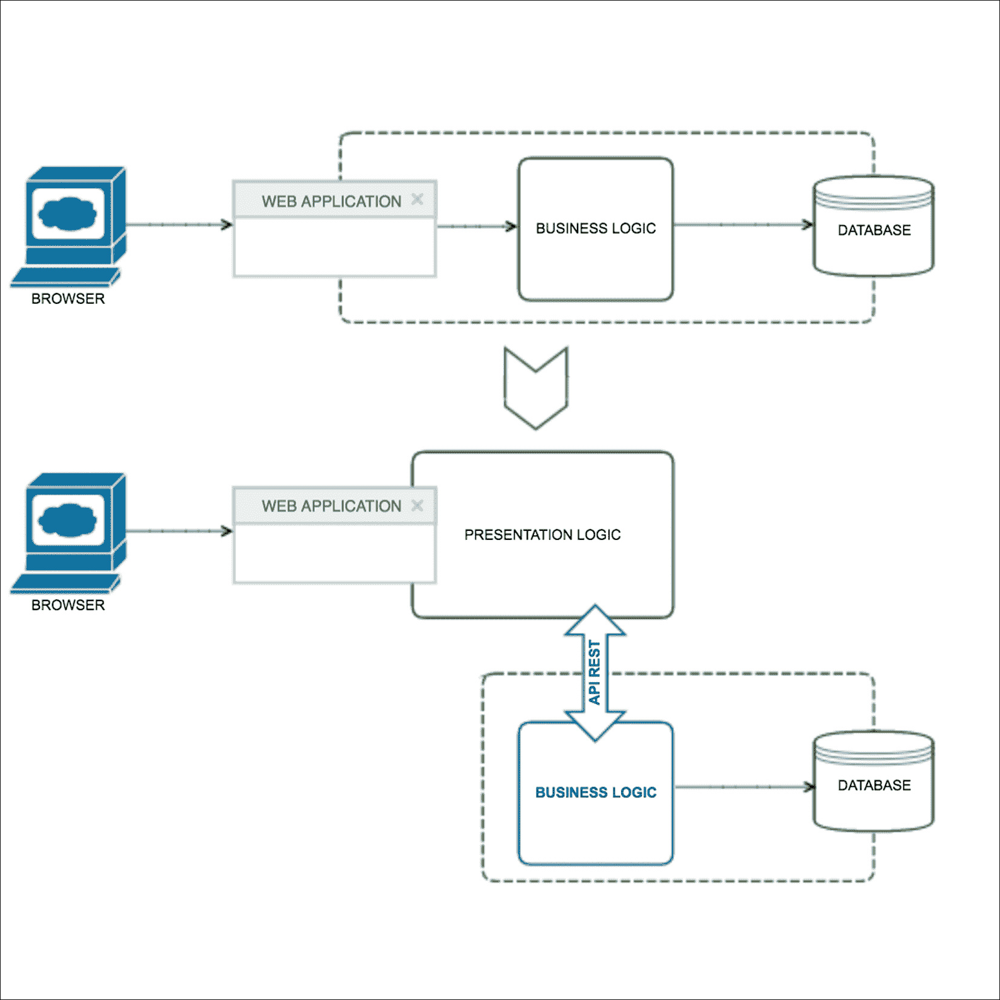

# 九、从单体到微服务

在本章中，我们将介绍在将单体应用程序转换为微服务时可能遵循的一些策略，并提供一些示例。如果我们已经有了一个大而复杂的应用程序，那么这个过程可能会有点困难，但幸运的是，我们可以遵循一些众所周知的策略，以避免整个过程中出现问题。

# 重构策略

将单体应用程序转换为微服务的过程是一个重构代码，目的是使应用程序现代化。这应该逐步进行。试图在一个步骤中将整个应用程序转换为微服务可能会导致问题。渐渐地，它将创建一个基于微服务的新应用程序，最后，您当前的应用程序将消失，因为它将被转换为小微服务，而原始应用程序将为空，或者它也可能是一个微服务。

## 停止潜水

当您的应用程序已经是一个洞时，您必须停止在该洞中潜水。换句话说，停止让你的单体应用程序变大。当您必须实现新功能时，有必要创建新的微服务并将其连接到单体应用程序，而不是继续在单体应用程序中开发新功能。

为此，当实现新功能时，我们将拥有当前的整体、新功能以及另外两件事：

*   **路由器：**负责 HTTP 请求；换句话说，这就像一个网关，它知道需要将每个请求发送到哪里，要么发送到旧的整体，要么发送到新的功能。
*   **Glue code:** This is responsible for connecting the monolithic application to the new functionality. It is very common for the new functionality to need to access the monolithic application in order to get data or any necessary functions from it:

    

    停止跳水策略

关于 glue 代码，从新功能访问应用程序到 monolith 有 3 种不同的可能性：

*   在 monolith 端创建一个 API 供新函数使用
*   直接连接到 monolith 数据库
*   在功能端有一个数据库的同步整块石副本

正如您所看到的，这个策略是在您当前的单体应用程序中开始开发微服务的一种非常好的方式。此外，新功能可以以独立于整体的方式进行扩展、部署和开发，从而改进您的应用程序。然而，这并不能解决问题，它只是避免了使当前问题变得更大，所以让我们再看两种策略。

## 分前端和后端

另一种策略是将逻辑表示部分与数据访问层分开。一个应用程序通常至少有 3 个不同部分：

*   **表示层：**这是用户界面，也就是网站的 HTML 语言
*   **业务逻辑层：**由用于实现业务规则的组件组成
*   **访问数据层：**有访问数据库的组件

表示层与业务逻辑和访问数据层之间通常是分离的。业务层有一个 API，该 API 有一个或多个封装业务逻辑组件的外观。通过这个 API，可以将 monolith 划分为两个较小的应用程序。

划分之后，表示层调用业务逻辑。请看以下示例：



划分前端和后端策略

该部门有两个不同的优势：

*   它允许您扩展和开发两个不同且独立的应用程序
*   它为您提供了一个可用于未来微服务的 API

这个策略的问题在于它只是一个临时的解决方案，它可以转换成一个或两个单体应用程序，所以让我们看看下一个策略，以移除剩下的单体应用程序。

## 提取服务

最后一个策略是将模块与结果或结果整体隔离。一点一点地，我们可以从中提取模块，并从每个模块中创建一个微服务。一旦我们提取了所有重要的模块，生成的整体也将成为一个微服务，或者它甚至会消失。总体思路是创建逻辑功能组，这些功能组将成为您未来的微服务。

单体应用程序通常有许多潜在的模块需要提取。必须通过先选择容易的，然后选择最有利的来设置优先级。更简单的方法将为您提供必要的经验，将模块提取到微服务中，以便以后处理重要的模块。

以下是一些帮助您选择最有益的建议：

*   频繁更改的模块
*   模块需要不同的资源来整合
*   需要昂贵硬件的模块

寻找现有的粗粒度边界很有用，因为它们更容易、更便宜地转换为微服务。

### 如何提取模块

现在，让我们看看如何提取模块，我们将使用一个示例使解释更容易理解。假设您的单体应用程序是一个博客系统。可以想象，核心功能是用户创建的帖子，每个帖子都支持评论。正如您从我们的小说明中所看到的，您可以定义应用程序的不同模块，并决定哪个模块最重要。

清楚应用程序的描述和功能后，可以继续执行从单体应用程序中提取模块的一般步骤：

1.  在模块和 monolith 代码之间创建一个接口。最好的解决方案是双向 API，因为 monolith 需要来自模块的数据，而模块需要来自 monolith 的数据。这个过程并不容易，您可能必须更改单体应用程序中的代码才能使 API 正常工作。
2.  一旦实现了粗粒度接口，就将模块转换为一个独立的微服务。

例如，假设`POST`模块是要提取的候选模块，它们的组件被`Users`和`Comments`模块使用。正如第一步所说，有必要实现粗粒度 API。第一个接口是`Users`用来调用`POST`模块的入口 API，`POST`用来调用`Comments`模块的第二个接口。

在提取的第二步中，将模块转换为独立的微服务。一旦完成这项工作，产生的微服务将是可伸缩的和独立的，因此它将有可能使其增长，甚至从头开始编写。

一点一点地，整体将变得更小，应用程序将拥有更多的微服务。

# 教程：从单体到微服务

在本章的示例中，我们将不使用框架，代码将在不使用 MVC 体系结构的情况下编写，以便关注本章的主题并学习如何将单体应用程序转换为微服务。

没有比练习更好的学习方法了，所以让我们来看一个我们在上一节中定义的博客平台的完整示例。

### 提示

博客平台示例可以从我们的 PHP microservices 存储库下载，因此，如果您想遵循我们的步骤，可以下载它并遵循本指南。

我们的示例是一个基本的博客平台，它具有本教程所需的最少功能。这是一个博客系统，可以实现以下功能：

*   注册新用户
*   登录用户
*   管理员可以发布新文章
*   注册用户可以发布新评论
*   管理员可以创建新的类别
*   管理员可以创建新文章
*   管理员可以管理评论
*   所有用户都可以看到文章

因此，将单体应用程序转换为微服务的第一步是熟悉当前的应用程序。在我们想象的模式中，当前应用程序可分为以下微服务：

*   使用者
*   文章
*   评论
*   类别

在这个例子中很清楚，但在一个真实的例子中，它应该被深入研究，以便将项目划分为小的微服务，这些微服务将按照我们在本章前面解释的优先级执行特定的功能。

## 停止潜水

现在，我们知道了如何遵循前面解释的策略，想象一下，我们想要添加一个新功能，在我们的博客平台中在用户之间发送私人消息。

为了弄清楚这一点，我们需要知道哪些功能将具有新的发送私人消息功能，以便找到粘合代码和从新微服务获取信息的请求（路由）的位置。

因此，新微服务的功能如下：

*   向用户发送消息
*   阅读你的信息

如您所见，这些功能非常基本，但请记住，这只是为了熟悉在单体应用程序中创建新微服务的过程。

我们将创建私有消息微服务，当然，我们将再次使用 Lumen。要快速创建骨架，请在终端上运行以下命令：

```php
composer create-project --prefer-dist laravel/lumen private_messages

```

前面的命令将创建安装了 Lumen 的文件夹。

在[第 2 章](02.html "Chapter 2. Development Environment")*开发环境*中，我们解释了如何创建 Docker 容器。现在，您有机会使用所学的一切，并在 Docker 环境中实现单体和不同的新微服务。根据前面的章节，您应该能够自己完成这项工作。

我们的新功能需要一个地方来存储私有消息，因此我们现在将创建一个表，供私有消息微服务使用。这可以在单独的数据库中创建，甚至可以在同一应用程序的数据库中创建。请记住，如果情况允许，微服务可以共享同一个数据库，但是想象一下，这个微服务将有很多流量，因此将它放在单独的数据库中是一个更好的解决方案。

创建新数据库或连接应用程序数据库并执行以下查询：

```php
    CREATE TABLE `messages` (
      `id` INT NOT NULL AUTO_INCREMENT,
      `sender_id` INT NULL,
      `recipient_id` INT NULL,
      `message` TEXT NULL,
      PRIMARY KEY (`id`));
```

一旦我们创建了表，就需要将新的微服务连接到它，因此打开`.env.example`文件并修改以下行：

```php
    DB_CONNECTION=mysql
    DB_HOST=localhost
    DB_PORT=3306
    DB_DATABASE=private_messages
    DB_USERNAME=root
    DB_PASSWORD=root
```

如果您的数据库不同，请在前面的代码中对其进行更改。

将`.env.example`文件重命名为`.env`，并将`public/index.php`文件上的`$app->run();`代码更改为以下代码；这将允许您调用此微服务：

```php
    $app->run(
      $app->make('request')
    );
```

现在，您可以通过拨打 GET 电话`http://localhost/private_messages/public/`来检查您的微服务是否在邮递员身上正常工作。记住进行所有必要的更改以匹配您的开发基础架构。

安装 Lumen 版本后，您将收到 200 状态代码。

在我们的微服务中，我们需要至少包括以下呼叫：

*   获取`/messages/user/id`：获取用户拥有的消息需要此项
*   POST`/message/sender/id/recipient/id`：向用户发送消息时需要此选项

因此，现在我们将通过在`routes.php`文件末尾添加以下行来在`/private_messages/app/Http/routes.php`上创建路由：

```php
    $app->get('messages/user/{userId}',
              'MessageController@getUserMessages');
    $app->post('messages/sender/{senderId}/recipient/{recipientId}',
               'MessageController@sendMessage');
```

下一步是在`/app/Http/Controllers/MessageController.php`上创建一个名为`MessageController`的控制器，其内容如下：

```php
    <?php

    namespace App\Http\Controllers;

    use Illuminate\Http\Request;

    class MessageController extends Controller
    {
      public function getUserMessages(Request $request, $userId) {
        // getUserMessages code
      }

      public function sendMessage(Request $request, $senderId,
                                  $recipientId) {
        // sendMessage code
      }
    }
```

现在，我们必须告诉 Lumen 有必要使用数据库，因此在`/bootstrap/app.php`上取消注释以下行：

```php
    $app->withFacades();
    $app->withEloquent();
```

现在，我们可以创建两种功能：

```php
    public function getUserMessages(Request $request, $userId) 
    {
 $messages = Message::where('recipient_id',$userId)->get();
 return response()->json($messages);
    }

    public function sendMessage(Request $request, $senderId,
                                $recipientId) 
    {
      $message = new Message();
 $message->fill([
        'sender_id'    => $senderId,
        'recipient_id' => $recipientId,
        'message'      => $request->input('message')]);
 $message->save();
 return response()->json([]);
    }
```

一旦我们的方法完成，微服务就完成了。因此，现在我们必须将单体应用程序连接到私有消息微服务。

我们需要在单体应用程序的`header.php`文件上为注册用户创建一个新按钮：

```php
    <?php if (empty($arrUser['username'])) : ?>
      <li role="presentation"><a href="login.php">Log in</a></li>
      <li role="presentation"><a href="signup.php">Sign up</a></li>
    <?php else : ?>
      <?php if ($arrUser['type'] === 'admin') : ?>
        <li role="presentation">
          <a href="admin/index.php">Admin Panel</a>
        </li>
      <?php endif; ?>
 <li role="presentation">
        <a href="messages.php">Messages</a>
      </li>
      <li role="presentation">
        <a href="index.php?logout=true">Log out</a>
      </li>
    <?php endif; ?>
```

然后，我们需要在`root`文件夹中创建一个名为`messages.php`的新文件，代码如下：

```php
    <?
      include_once 'libraries.php';

      $url = "http://localhost/private_messages/public/messages
              /user/".$arrUser['id'];
      $ch = curl_init();
      curl_setopt($ch, CURLOPT_SSL_VERIFYPEER, false);
      curl_setopt($ch, CURLOPT_RETURNTRANSFER, true);
      curl_setopt($ch, CURLOPT_URL,$url);
      $result=curl_exec($ch);
      curl_close($ch);
      $messages = json_decode($result, true);
```

如您所见，我们正在给微服务打一个`curl`电话，以获取用户消息列表。此外，我们需要获取用户列表以填充用于发送消息的用户选择器。这段代码可以被视为粘合代码，因为有必要将 microservice 数据与 monolith 数据进行匹配。我们将使用以下粘合代码：

```php
    $arrUsers = array();
    $query = "SELECT id, username FROM `users` ORDER BY username ASC";
    $result = mysql_query ($query, $dbConn);
    while ( $row = mysql_fetch_assoc ($result)) {
      array_push( $arrUsers,$row );
    }
```

现在，我们可以构建 html 代码来显示用户消息和发送消息所需的表单：

```php
 include_once 'header.php';
    ?>
    <p class="bg-success">
 <?php if ($_GET['sent']) { ?>
        The message was sent!
      <?php } ?>
    </p>
    <h1>Messages</h1>
    <?php foreach($messages as $message) { ?>
      <div class="panel panel-primary">
        <div class="panel-heading">
          <h3 class="panel-title">
            Message from <?php echo $arrUsers[$message['sender_id']]
                           ['username'];?>
          </h3>
        </div>
        <div class="panel-body">
 <?php echo $message['message']; ?>        </div>
      </div>
 <?php } ?>    <h1>Send message</h1>
      <div>
        <form action="messages.php" method="post">
          <div class="form-group">
            <label for="category_id">Recipient</label>
            <select class="form-control" name="recipient">
              <option value="">Select User</option>
              <option value="">------------------------</option>
 <?php foreach($arrUsers as $user) { ?>                <option value="<?php echo $user['id']; ?>">
 <?php echo $user['username']; ?>
                </option>
 <?php } ?>            </select>
          </div>
          <div class="form-group">
            <label for="name">
              Message
            </label>
            <br />
            <input name="message" type="text" value=""
             class="form-control" />
          </div>
          <input name="sender" type="hidden" 
           value="<?php echo $arrUser['id']; ?>" />

          <div class="form-group">
            <input name="submit" type="submit" value="Send message" 
             class="btn btn-primary" />
          </div>

        </form>
      </div>
 <?php include_once 'footer.php'; ?>

```

请注意，有一个表单用于发送消息，因此我们必须添加一些代码来调用 microservice 以发送消息。在`$messages = json_decode($result, true);`行后添加以下代码：

```php
    if (!empty($_POST['submit'])) {
      if (!empty($_POST['sender'])) {
        $sender = $_POST['sender'];
      }
      if (!empty($_POST['recipient'])) {
        $recipient = $_POST['recipient'];
      }
      if (!empty($_POST['message'])) {
        $message = $_POST['message'];
      }

      if (empty($sender)) {
        $error['sender'] = 'Sender not found';
      }
      if (empty($recipient)) {
        $error['recipient'] = 'Please select a recipient';
      }
      if (empty($message)) {
        $error['message'] = 'Please complete the message';
      }

      if (empty($error)) {
        $url = 'http://localhost/private_messages/public/messages
                /sender/'.$sender.'/recipient/'.$recipient;

        $handler = curl_init();
        curl_setopt($handler, CURLOPT_URL, $url);
        curl_setopt($handler, CURLOPT_POST,true);
        curl_setopt($handler, CURLOPT_RETURNTRANSFER,true);
        curl_setopt($handler, CURLOPT_POSTFIELDS, "message=".$message);
        $response = curl_exec ($handler);

        curl_close($handler);

        header( 'Location: messages.php?sent=true' );
        die;
      }
    }
```

就这样。我们的第一个微服务包含在单体应用程序中。当我们必须在当前单体应用程序中添加新功能时，这就是如何进行的。

## 分前端和后端

如前所述，第二种策略包括将表示层与业务逻辑隔离。这可以通过创建包含所有业务逻辑和数据访问的整个微服务来实现，或者简单地将表示层与业务层隔离，就像**模型视图控制器**（**MVC**结构一样。

对于使用单体应用程序的问题，这不是一个完整的解决方案，因为它导致我们有两个单体应用程序，而不是一个。

为此，我们应该首先在`root`文件夹中创建一个新的`Controller.php`文件。我们可以调用这个类`Controller`，它将包含视图所需的所有方法。例如，`Article`视图需要`getArticle`、`postComment`和`getArticleComments`：

```php
    <?php

    class Controller
    {
      public function connect () {
        $db_con = mysql_pconnect(DB_SERVER,DB_USER,DB_PASS);
        if (!$db_con) {
          return false;
        }
        if (!mysql_select_db(DB_NAME, $db_con)) {
          return false;
        }
        return $db_con;
      }

      public function getArticle($id)
      {
        $dbConn = $this->connect();

        $query = "SELECT articles.id, articles.title, articles.extract,
                         articles.text, articles.updated_at, 
                         categories.value as category,
                         users.username FROM `articles`
                  INNER JOIN 
                  `categories` ON categories.id = articles.category_id
                  INNER JOIN
                  `users` ON users.id = articles.user_id
                  WHERE articles.id = " . $id . " LIMIT 1";
        $result = mysql_query ($query, $dbConn);
        return mysql_fetch_assoc ($result);
      }

      public function getArticleComments($id)
      {
        $dbConn = $this->connect();

        $arrComments = array();
        $query = "SELECT comments.id, comments.comment, users.username
                  FROM `comments` INNER JOIN `users`
                  ON comments.user_id = users.id
                  WHERE comments.status = 'valid'
                  AND comments.article_id = " . $id . "
                  ORDER BY comments.id DESC";

        $result = mysql_query ($query, $dbConn);
        while ($row = mysql_fetch_assoc($result)) {
          array_push($arrComments,$row);
        }

        return $arrComments;
      }

      public function postComment($comment,$user_id,$article_id)
      {
        $dbConn = $this->connect();

        $query = "INSERT INTO `comments` (comment, user_id, article_id)
                  VALUES ('$comment','$user_id','$article_id')";
        mysql_query($query, $dbConn);
      }
    }
```

文章视图应该包括`Controller.php`文件中包含的方法。请看下面的代码：

```php
    <?
      include_once 'libraries.php';
 include_once 'Controller.php';
 $controller = new Controller();

      if ( !empty($_POST['submit']) ) {

        // Validation
        if (!empty($_POST['comment'])) {
          $comment = $_POST['comment'];
        }
        if (!empty($_GET['id'])) {
          $article_id = $_GET['id'];
        }
        if (!empty($arrUser['id'])) {
          $user_id = $arrUser['id'];
        }

        if (empty($comment)) {
          $error['comment'] = true;
        }
        if (empty($article_id)) {
          $error['article_id'] = true;
        }
        if (empty($user_id)) {
          $error['user_id'] = true;
        }
        if ( empty($error) ) {

 $controller->postComment($comment,$user_id,$article_id);
          header ( 'Location: article.php?id='.$article_id);
          die;
        }
      }

 $article = $controller->getArticle($_GET['id']);
 $comments = $controller->getArticleComments($_GET['id']);

      include_once 'header.php';
    ?>

    <h1>Article</h1>

    <div class="panel panel-primary">
      <div class="panel-heading">
        <h3 class="panel-title">
 <?php echo $article['title']; ?>
        </h3>
      </div>
      <div class="panel-body">
        <span class="label label-primary">Published</span> by
        <b><?php echo $article['username']; ?></b> in
        <i><?php echo $article['category']; ?></i>
        <b><?php echo date_format(date_create($article
                                              ['fModificacion']),
                                  'd/m/y h:m'); ?>
        </b>
        <hr/>
 <?php echo $article['text']; ?>      </div>
    </div>

    <h2>Comments</h2>
 <?php foreach ($comments as $comment) { ?> 
      <div class="panel panel-warning">
        <div class="panel-heading">
          <h3 class="panel-title"><?php echo $comment['username']; ?>
                                  said</h3>
        </div>
        <div class="panel-body">
 <?php echo $comment['comment']; ?>        </div>
      </div>
 <?php } ?> 
    <div>
 <?php if ( !empty( $arrUser ) ) { ?> 
        <form action="article.php?id=<?php echo $_GET['id']; ?>"
              method="post">
          <div class="form-group">
            <label for="user">Post a comment</label>
            <textarea class="form-control" rows="3" cols="50"
                      name="comment" id="comment"> 
            </textarea>
          </div>

          <div class="form-group">
            <input name="submit" type="submit" value="Send"
                   class="btn btn-primary" />
          </div>
        </form>

 <?php } else { ?>        <p>
          Please sign up to leave a comment on this article. 
          <a href="signup.php">Sign up</a> or
          <a href="login.php">Log in</a>
        </p>
 <?php } ?>    </div>

    <?php include_once 'footer.php'; ?>
```

为了将业务逻辑层与视图隔离开来，我们应该遵循这些步骤。

### 提示

如果需要，可以将所有视图文件（`header.php`、`footer.php`、`index.php`、`article.php`等）放入名为`views`的文件夹中，以便将它们组织在同一文件夹中。

一旦我们将所有视图与业务逻辑隔离，我们将把所有方法都包含在控制器中，而不是将它们放在表示层中。如前所述，这只是一个临时解决方案，因此我们将研究真正的解决方案，以便将模块提取到微服务中。

## 提取服务

在这个策略中，我们必须选择要隔离的第一个模块，以便从中进行微服务。在这种情况下，我们将在`Categories`模块上开始执行。

这些类别在管理面板上使用最多。可以从中创建、修改和删除类别，然后在创建新文章时选择类别，并在文章中显示类别以指示文章类别。

提取过程不容易；我们必须确保我们知道该模块正在使用的所有位置。为此，我们将创建一个双向 API 或在控制器中创建所有类别方法，然后，我们可以在微服务中隔离它们。

打开`admin/categories.php`文件，我们必须执行与划分前端和后端策略相同的操作——找到引用类别的所有位置，并在控制器上创建新方法。看看这个：

```php
    <?

      session_start ();

      require_once 'config.php';
      require_once 'connection.php';
      require_once 'isUser.php';

 include_once '../Controller.php';
 $controller = new Controller();
      $dbConn = connect();

      /* Omitted code */

      if (!empty($_GET['del'])) {
 $controller->deleteCategory($_GET['del']);

        header( 'Location: categories.php?dele=true' );
        die;
      }

      if (!empty($_POST['submit'])) {
        if (!empty($_POST['name'])) {
          $name = $_POST['name'];
        }
        if (empty($name)) {
          $error['name'] = 'Please enter category name';
        }
        if (empty($error)) {
 $controller->createCategory($name);
          header( 'Location: categories.php?add=true' );
          die;
        }
      }

      if (!empty($_POST['submitEdit'])) {

        /* Ommited code */

        if (empty($error)) {
 $controller->updateCategory($id, $name);
          header( 'Location: categories.php?edit=true' );
          die;
        }
      }

 $arrCategories = $controller->getCategories();

      if (!empty($_GET['id'])) {
 $row = $controller->getCategory($_GET['id']);
      }

      include_once 'header.php';

    ?>
    <!-- Omitted HTML code -->

```

`controller.php`文件必须包含分类方法：

```php
    public function createCategory($name)
    {
      $dbConn = $this->connect();

      $query = "INSERT INTO `categories` (value) VALUES ('$name')";
      mysql_query($query, $dbConn);
    }

    public function updateCategory($id,$name)
    {
      $dbConn = $this->connect();

      $query = "UPDATE `categories` set value = '$name'
                WHERE id = $id";
      mysql_query($query, $dbConn);
    }

    public function deleteCategory($id)
    {
      $dbConn = $this->connect();

      $query = "DELETE FROM `categories` WHERE id = ".$id;
      mysql_query($query, $dbConn);
    }

    public function getCategories()
    {
      $dbConn = $this->connect();

      $arrCategories = array();

      $query = "SELECT id, value FROM `categories` ORDER BY value ASC";
      $resultado = mysql_query ($query, $dbConn);

      while ($row = mysql_fetch_assoc ($resultado)) {
        array_push( $arrCategories,$row );
      }

      return $arrCategories;
    }

    public function getCategory($id)
    {
      $dbConn = $this->connect();

      $query = "SELECT id, value FROM `categories` WHERE id = ".$id;
      $resultado = mysql_query ($query, $dbConn);
      return mysql_fetch_assoc ($resultado);
    }
```

`admin/articles.php`文件中有更多对类别的引用，因此打开它，在`require_once`行之后添加以下行：

```php
    include_once '../Controller.php';
    $controller = new Controller();
```

这些行允许您使用`articles.php`文件中`controller.php`文件中包含的分类方法。修改用于将类别设置为此类别的代码：

```php
    $arrCategories = $controller->getCategories();
```

最后，有必要对文章视图进行一些更改。这是显示文章的视图，它包含创建文章时选择的类别。

要获取文章，执行的查询如下所示：

```php
    SELECT articles.id, articles.title, articles.extract,
           articles.text, articles.updated_at,
           categories.value as category,
           users.username FROM `articles`
 INNER JOIN `categories` ON categories.id = articles.category_id 
    INNER JOIN `users` ON users.id = articles.user_id 
    WHERE articles.id = " . $id . " LIMIT 1;
```

如您所见，查询需要 categories 表。如果您想为 categories microservice 使用不同的数据库，则必须从查询中删除突出显示的行，在查询中选择`articles.category_id`，然后使用创建的方法获取类别名称。因此，查询将如下所示：

```php
    SELECT articles.id, articles.title, articles.extract,
           articles.text, articles.updated_at, articles.category_id,
           users.username FROM `articles` 
    INNER JOIN `users` ON users.id = articles.user_id 
    WHERE articles.id = " . $id . " LIMIT 1;
```

以下是从提供的类别 ID 获取类别名称的代码：

```php
    public function getArticle($id)
    {
      $dbConn = $this->connect();

      $query = "SELECT articles.id, articles.title, articles.extract,
                       articles.text, articles.updated_at,
                       articles.category_id,
                       users.username FROM `articles`
                INNER JOIN `users` ON users.id = articles.user_id
                WHERE articles.id = " . $id . " LIMIT 1;";

      $result = mysql_query ($query, $dbConn);

      $data = mysql_fetch_assoc($result);
 $data['category'] = $this->getCategory($data['category_id']);
 $data['category'] = $data['category']['value'];
      return $data;
    }
```

完成所有这些更改后，我们准备将 category 表隔离到不同的数据库中，以便我们可以从`controller.php`文件中创建的方法创建 categories microservice：

*   `public function createCategory($name)`
*   `public function updateCategory($id,$name)`
*   `public function deleteCategory($id)`
*   `public function getCategories()`
*   `public function getCategory($id)`

正如您所想象的，这些函数用于创建 microservice 类别的`routes.php`文件。所以，让我们创建一个新的微服务，就像我们在停止潜水策略中所做的那样。

通过执行以下命令创建新类别 microservice：

```php
composer create-project --prefer-dist laravel/lumen categories

```

前面的命令将在名为 categories 的文件夹中安装 Lumen，这样我们就可以开始为新的 categories microservice 创建代码。

现在我们有两个选择——第一个是使用当前数据库上的同一个表——我们可以将新的微服务指向当前数据库。第二个选项是在新数据库中创建一个新表，这样新的微服务将使用自己的数据库。

如果要在新数据库中创建新表，可以按如下步骤进行：

*   在 SQL 文件中导出当前类别表。它将保存当前数据。
*   Import the SQL file to the new database. It will create the exported table and data in the new database.

    ### 提示

    导出/导入过程可以使用 SQL 客户端执行，也可以在控制台中执行`mysqldump`。

一旦将新表导入到新数据库或您决定使用当前数据库，则需要设置`.env.example`文件，以便将新的 microservice 连接到正确的数据库，因此打开它并在其上放置正确的参数：

```php
    DB_CONNECTION=mysql
    DB_HOST=localhost
    DB_PORT=3306
    DB_DATABASE=categories
    DB_USERNAME=root
    DB_PASSWORD=root
```

不要忘记将`.env.example`文件重命名为`.env`并更改`public/index.php`上的`$app->run()`行，就像我们之前对以下代码所做的那样：

```php
 $app->run(
 $app->make('request')
 );

```

另外，取消注释`/bootstrap/app.php`上的以下行：

```php
    $app->withFacades();
    $app->withEloquent();
```

现在我们准备向`routes.php`文件添加必要的方法。我们必须在单体应用程序的`Controller.php`上添加分类方法，并将其转换为路由：

*   `public function createCategory($name)`：这是一种创建新类别的 POST 方法。所以，它可以是类似于`$app->post('category', 'CategoryController@createCategory');`的东西。
*   `public function updateCategory($id,$name)`：这是编辑现有类别的 PUT 方法。所以，它可以是类似于`app->put('category/{id}', 'CategoryController@updateCategory');`的东西。
*   `public function deleteCategory($id)`：删除已有类别的删除方式。所以，它可以是类似于`app->delete('category/{id}', 'CategoryController@deleteCategory');`的东西。
*   `public function getCategories()`：这是一种获取所有现有类别的获取方法。所以，它可以是类似于`app->get('categories', 'CategoryController@getCategories');`的东西。
*   `public function getCategory($id)`：这也是一个 GET 方法，但它只获取一个类别。所以，它可以是类似于`app->get('category/{id}', 'CategoryController@getCategory');`的东西。

因此，一旦我们将所有路线添加到`routes.php`文件中，就可以创建类别模型了。为此，在`/app/Model`上创建一个新文件夹，在`/app/Model/Category.php`上创建一个文件，如下所示：

```php
    <?php

      namespace App\Model;

      use Illuminate\Database\Eloquent\Model;

      class Category extends Model {
        protected $table = 'categories';
        protected $fillable = ['value'];
        public $timestamps = false;
      }
```

创建模型后，使用必要的方法创建一个`/app/Http/Controllers/CategoryController.php`文件：

```php
    <?php

      namespace App\Http\Controllers;

      use App\Model\Category;
      use Illuminate\Http\Request;

      class CategoryController extends Controller
      {
        public function createCategory(Request $request) {
          $category = new Category();
          $category->fill(['value' => $request->input('value')]);
          $category->save();

          return response()->json([]);
        }

        public function updateCategory(Request $request, $id) {
          $category = Category::find($id);
          $category->value = $request->input('value');
          $category->save();

          return response()->json([]);
        }

        public function deleteCategory(Request $request, $id) {
          $category = Category::find($id);
          $category->delete();

          return response()->json([]);
        }

        public function getCategories(Request $request) {
          $categories = Category::get();

          return $categories;
        }

        public function getCategory(Request $request, $id) {
          $category = Category::find($id);

          return $category;
        }
      }
```

现在，我们已经完成了我们的分类微服务。你可以在邮递员身上试一试，以检查所有的方法是否有效。例如，邮递员可以使用`http://localhost/categories/public/categories`URL 调用`getCategories`方法。

一旦我们创建了新的 categories microservice 并正常工作，就应该断开 categories 模块并将单体应用程序连接到 microservice。

返回到单体应用程序并找到对 category 方法的所有引用。我们必须通过打电话给新的微服务来取代它们。我们将使用本地的 CURL 调用来进行这些调用，但是您应该考虑使用 GuScript 或者类似的包，就像我们在前面章节中所做的那样。

为此，首先我们应该创建一个函数来在`Controller.php`文件中进行调用。它可以是这样的：

```php
    function call($url, $method, $field = null)
    {
      $ch = curl_init();
      if(($method == 'DELETE') || ($method == 'PUT')) {
        curl_setopt($ch, CURLOPT_CUSTOMREQUEST, $method);
      }
      curl_setopt($ch, CURLOPT_SSL_VERIFYPEER, false);
      curl_setopt($ch, CURLOPT_RETURNTRANSFER, true);
      curl_setopt($ch, CURLOPT_URL,$url);
      if ($method == 'POST') {
        curl_setopt($ch, CURLOPT_POST,true);
      }
      if($field) {
        curl_setopt($ch, CURLOPT_POSTFIELDS, 'value='.$field);
      }
      $result=curl_exec($ch);
      curl_close($ch);
      return json_decode($result, true);
    }
```

前面的代码将用于在每次调用 categories microservice 时重用代码。

转到`/admin/categories.php`文件，用以下代码替换`controller->createCategory($name);`行：

```php
     $controller->call('http://localhost/categories/public/category', 
                       'POST', $name);
```

在前面的代码中，您可以检查我们是否正在对 createcategory 方法进行 POST 调用，并将 value 参数设置为`$name`变量。

在`/admin/categories.php`文件中，找到`controller->updateCategory($id, $name);`行并将其替换为以下代码：

```php
 $controller->call('http://localhost/categories/public/category/'.$id,
                   'PUT', $name);
```

在同一文件中，找到并用以下代码替换`$controller->deleteCategory($_GET['del']);`：

```php
    $controller->call('http://localhost/categories/public
                       /category/'.$_GET['del'], 'DELETE');
```

再次在同一文件中以及在`/admin/articles.php`文件中，找到`$arrCategories = $controller->getCategories();`并用以下代码替换：

```php
$arrCategories = $controller->call('http://localhost/categories
                                    /public/categories', 'GET');
```

最后一个位于`/admin/categories.php`文件中。找到并用以下代码替换`row = $controller->getCategory($_GET['id']);`行：

```php
$row = $controller->call('http://localhost/categories
                          /public/category/'.$_GET['id'], 'GET');
```

一旦我们用对新 categories microservice 的调用替换了单体应用程序上的所有 category 方法，我们就可以删除对单体类别模块的所有引用。

转到`Controller.php`文件并删除以下功能，您不再需要它们，因为它们引用了单体类别模块：

*   `public function deleteCategory($id)`
*   `public function createCategory($name)`
*   `public function updateCategory($id,$name)`
*   `public function getCategories()`
*   `public function getCategory($id)`

最后，如果您为 categories microservice 创建了一个新数据库，则可以通过执行以下查询删除位于单体应用程序数据库中的 categories 表：

```php
    DROP TABLE categories;
```

我们已经完成了从单体应用程序中提取 categories 服务。下一步是选择另一个模块，再次执行相同的步骤，并重复此过程，直到单体应用程序消失或成为微服务。

在[第 7 章](07.html "Chapter 7. Security")*安全*中，我们讨论了微服务中的安全性。要练习所学内容，请查看本章中的所有代码，并从示例中找出不足之处。

# 总结

在本章中，您学习了使用每个步骤的示例代码将单体应用程序转换为微服务所需遵循的策略。从现在起，您已经准备好告别单体应用程序并对其进行转换，以便开始使用微服务。