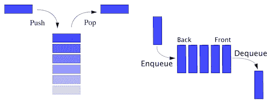
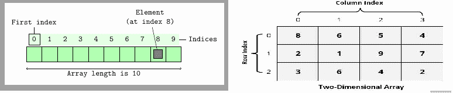
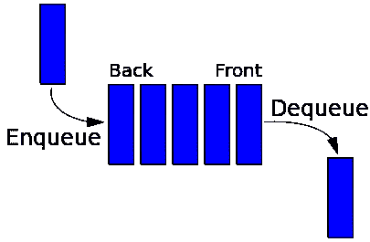

# 数据结构和算法简介

我们生活在一个数字时代。在我们生活的每一个环节和日常需求中，我们都在大量使用技术。没有技术，世界将几乎停滞不前。你有没有试过找出准备一个简单的天气预报需要什么？大量的数据被分析以准备简单的信息，这些信息被实时传递给我们。计算机是技术革命中最重要的发现，在过去的几十年里，它们极大地改变了世界。计算机处理这些大数据集，帮助我们完成每一项技术相关的任务和需求。为了提高计算机的运行效率，我们以不同的格式表示数据，或者我们可以调用不同的结构，这些结构称为数据结构。

数据结构是计算机和编程语言的重要组成部分。除了数据结构，了解如何使用这些数据结构解决问题或找到解决方案也非常重要。从我们简单的手机通讯录到复杂的 DNA 图谱匹配系统，数据结构和算法的使用无处不在。

我们有没有想过，站在超市排队等待付款可以是数据结构的一种表示？或者从一堆文件中取出一张账单可以是数据结构的另一种用途？事实上，在我们的生活中，几乎所有地方都在遵循数据结构概念。无论我们是管理排队付账单还是去交通工具，还是为日常工作维护一堆书或文件，数据结构无处不在，影响着我们的生活。

PHP 是一种非常流行的脚本语言，数十亿个网站和应用程序都是使用它构建的。人们使用**超文本预处理器**（**PHP**）处理从简单应用程序到非常复杂的应用程序，有些应用程序非常数据密集。最大的问题是——我们是否应该将 PHP 用于任何数据密集型应用程序或算法解决方案？我们当然应该。随着 PHP7 的新发布，PHP 进入了高效和健壮的应用程序开发的新可能性。我们的任务是展示并准备了解使用 PHP7 的数据结构和算法的能力，以便我们能够在应用程序和程序中使用它。

# 数据结构和算法的重要性

如果我们考虑计算机的真实生活情况，我们也会使用不同种类的物品和数据的安排，以便我们能够有效地使用它们或在需要时容易地找到它们。如果我们以随机顺序输入电话簿呢？我们能很容易找到联系人吗？我们可能会搜索书中的每个联系人，因为联系人没有按特定顺序排列。只需考虑以下两个图像：


其中一个例子表明，书籍是分散的，由于书籍没有组织，要找到一本特定的书籍需要时间。另一个显示这些书被组织成一堆。第二张图片不仅表明我们正在巧妙地使用这个空间，而且图书搜索也变得更加容易。

让我们考虑另一个例子。我们打算买一场重要足球赛的票。有成千上万的人在等售票亭开门。门票将以先到先得的方式分发。如果我们考虑以下两个图像，哪一个是处理这样一大群人的最好方法？


左图清楚地显示，没有正确的顺序，也无法知道谁先来买票。但如果我们知道人们在有序地排队等候，那么就更容易应付人群，我们会把票交给最先来的人。这是一种被称为*队列*的常见现象，在编程界被大量使用。编程术语不是从外部世界生成的。事实上，大多数数据结构都是从现实生活中得到启发的，并且它们在大多数情况下使用相同的术语。无论我们是在准备任务列表、联系人列表、书堆、饮食图表、家谱还是组织层次结构，我们基本上都在使用不同的排列技术，这些技术在计算世界中被称为数据结构。

到目前为止，我们已经讨论了一些数据结构，但是关于算法呢？我们在日常生活中没有使用任何算法吗？当然有。每当我们从旧电话簿中搜索联系人时，我们肯定不是从一开始就搜索。如果我们正在搜索*Tom*，我们将不会搜索显示*A*、*B、*或*C*的页面。我们直接进入*T*页面，会发现*Tom*是否列在那里。或者，如果我们需要从电话簿中找到医生，我们肯定不会在食品部分搜索。如果我们把电话簿或电话簿看作数据结构，那么我们搜索特定信息的方式称为算法。数据结构帮助我们高效地使用数据，而算法帮助我们高效地对这些数据执行不同的操作。例如，如果我们的电话目录中有 100000 个条目，那么从一开始搜索特定条目可能需要很长时间。但是，如果我们知道医生是从第 200 页到第 220 页列出的，我们可以只搜索这些页面，通过搜索一个小部分而不是整个目录来节省时间：


我们也可以考虑寻找医生的另一种方式。虽然上一段采用了搜索目录特定部分的方法，但我们甚至可以在目录中按字母顺序进行搜索，就像在字典中搜索单词一样。这甚至可以减少我们搜索的时间和条目。可以有许多不同的方法来找到问题的解决方案，每种方法都可以称为算法。从前面的讨论中，我们可以说，对于一个特定的问题或任务，可以有多种方法或算法来执行。那么我们应该考虑使用哪一个呢？我们很快就会讨论这个问题。在谈到这一点之前，我们将重点讨论**PHP 数据类型**和**抽象数据类型**（**ADT**。为了掌握数据结构的概念，我们必须对 PHP 数据类型和 ADT 有很强的理解。

# 理解抽象数据类型（ADT）

PHP 有八种基本数据类型，它们是布尔、整数、浮点、字符串、数组、对象、资源和 null。此外，我们还必须记住，PHP 是一种弱类型语言，在创建这些语言时，我们并不担心数据类型声明。尽管 PHP 有一些静态类型的特性，但 PHP 主要是一种动态类型的语言，这意味着在使用它之前不需要声明变量。我们可以给一个新变量赋值并立即使用它。

对于到目前为止我们讨论过的数据结构示例，我们是否可以使用任何基本数据类型来表示这些结构？也许我们能，也许不能。我们的原始数据类型有一个特定的目标：存储数据。为了在对这些数据执行操作时获得一定的灵活性，我们需要以这样的方式使用数据类型，以便我们可以将它们用作特定的模型并执行一些操作。通过概念模型处理数据的这种特殊方式称为抽象数据类型，或 ADT。ADT 还为数据定义了一组可能的操作。

我们需要了解 ADT 主要是用于算法、数据结构和软件设计的设计和分析的理论概念。相反，数据结构是具体的表示。为了实现 ADT，我们可能需要使用数据类型或数据结构，或者同时使用两者。最常见的 ADT 示例是 s*tack*和*队列：*



将堆栈视为 ADT，它不仅是数据的集合，而且是两个重要的操作，称为 push 和 pop。通常，我们会在堆栈顶部放置一个新条目，称为*推*，当我们想要获取一个项目时，我们会从顶部获取该项目，也称为*弹出*。如果我们考虑 PHP 数组作为堆栈，我们将需要额外的功能来实现这些推送和 POP 操作，将其视为堆栈 ADT。同样，队列也是一个 ADT，具有两个必需的操作：在队列末尾添加一个项目（也称为*排队*），从队列开头删除一个项目（也称为*出列*）。两者听起来很相似，但如果我们仔细观察，我们会发现堆栈是**后进先出**（**后进先出**）模型，而队列是**先进先出**（**FIFO**模型。这两种不同的数学模型使它们成为两种不同的 ADT。

以下是一些常见的 ADT：

*   列表
*   地图
*   设置
*   堆栈
*   队列
*   优先级队列
*   图表
*   树

在接下来的章节中，我们将探索更多的 ADT，并使用 PHP 将它们实现为数据结构。

# 不同的数据结构

我们可以将数据结构分为两组：

*   线性数据结构
*   非线性数据结构

在线性数据结构中，项以线性或顺序的方式进行结构。数组、列表、堆栈和队列都是线性结构的示例。在非线性结构中，数据的结构不是顺序的。图和树是非线性数据结构最常见的例子。

现在让我们以一种总结的方式探索数据结构的世界，包括不同类型的数据结构及其用途。稍后，我们将详细探讨每个数据结构。

编程世界中存在许多不同类型的数据结构。其中，以下是最常用的：

*   结构
*   大堆
*   链表
*   双链表
*   堆栈
*   队列
*   优先级队列
*   设置
*   地图
*   树
*   图表
*   堆

# 结构

通常，变量可以存储单个数据类型，单个标量数据类型只能存储单个值。在许多情况下，我们可能需要将某些数据类型分组为一个单一的复杂数据类型。例如，我们希望将一些学生信息一起存储在学生数据类型中。我们需要学生姓名、地址、电话号码、电子邮件、出生日期、当前班级等。为了将每个学生记录存储到一个唯一的学生数据类型，我们需要一个特殊的结构，允许我们这样做。这可以通过*结构*轻松实现。换句话说，结构是值的容器，通常使用名称访问。虽然结构在 C 编程语言中非常流行，但我们也可以在 PHP 中使用类似的概念。我们将在接下来的章节中探讨这一点。

# 大堆

虽然数组在 PHP 中被认为是一种数据类型，但数组实际上是一种数据结构，它主要用于所有编程平台。在 PHP 中，数组实际上是一个有序映射（我们将在后面的几节中了解映射）。我们可以将多个值作为单个变量存储在单个数组中。矩阵型数据易于存储在数组中，因此在所有编程平台中广泛使用。通常，数组是一个固定大小的集合，由顺序数字索引访问。在 PHP 中，数组的实现方式不同，您可以定义动态数组，而无需定义任何固定大小的数组。在下一章中，我们将进一步探讨 PHP 数组。数组可以有不同的维度。如果一个数组只有一个索引来访问一个元素，我们称之为一维数组。但是如果它需要两个或多个索引来访问一个元素，我们分别称之为二维数组或多维数组。以下是两个阵列数据结构图：



# 链表

链表是一种线性数据结构，它是数据元素（也称为节点）的集合，可以具有不同的大小。通常，列出的项目通过一个被称为链接的指针连接，因此它被称为**链表**。在链表中，一个列表元素通过指针链接到下一个元素。从下图中，我们可以看到链表实际上维护了一个有序的集合。链表是编程语言使用的最常见和最简单的数据结构形式。在单链表中，我们只能前进。在[第 3 章](03.html)中*使用链表*我们将深入了解链表的概念和实现：


# 双链表

双链表是一种特殊类型的链表，我们不仅存储下一个节点，而且还存储节点结构中的前一个节点。因此，它可以在列表中前后移动。它提供了比单个链表或链表更大的灵活性，因为它同时具有上一个和下一个指针。我们将在[第 3 章](03.html)*中使用链表*进一步探讨这些问题。下图描述了一个双链接列表：


# 堆栈

正如我们在前几页中讨论的堆栈一样，我们已经知道堆栈是一种线性数据结构，具有后进先出原则。因此，堆栈只有一端可以添加新项或删除项。它是计算机技术中最古老和最常用的数据结构之一。我们总是使用名为*top 的单点从堆栈中添加或删除项目。*术语 push 用于表示要添加到堆栈顶部的项目，并弹出以从顶部移除项目；下图显示了这一点。我们将在[第 4 章](04.html)、*构建堆栈和队列*中详细讨论堆栈。


# 队列

队列是另一种遵循 FIFO 原则的线性数据结构。队列允许对集合执行两个基本操作。第一个是*排队*，它允许我们在队列后面添加一个项目。第二个是*出列*，它允许我们从队列前面移除一个项目。队列是计算机技术中另一种最常用的数据结构。我们将在[第 4 章](04.html)、*构造堆栈和队列*中了解有关队列的详细信息。



# 设置

集合是用于存储某些值的抽象数据类型。这些值不以任何特定顺序存储，但集合中不应存在任何重复值。集合不像集合那样使用，我们从集合中检索特定的值；集合用于检查其中是否存在值。有时一个集合数据结构可以被排序，我们称之为有序集合。

# 地图

映射是所有键都是唯一的键和值对的集合。我们可以考虑一个映射作为一个关联数组，其中所有的密钥都是唯一的。我们可以使用键和值对添加和删除，以及使用键从地图中进行更新和查找。事实上，PHP 数组是有序映射实现。我们将在下一章中对此进行探讨。

# 树

树是计算世界中应用最广泛的非线性数据结构。它高度用于分层数据结构。树由节点组成，有一个特殊的节点称为树的*根*，它启动树结构。其他节点从根节点下降。树数据结构是递归的，这意味着一棵树可以包含许多子树。节点通过边相互连接。我们将在[第 6 章](06.html)*理解和实现树*中讨论不同类型的树、它们的操作和目的。


# 图表

图数据结构是一种特殊类型的非线性数据结构，由有限数量的顶点或节点、边或弧组成。图既可以是有向图，也可以是无向图。有向图清楚地表示边的方向，而无向图表示边，而不是方向。因此，在无向图中，边的两个方向都被视为一条边。换句话说，我们可以说一个图是一对集合（*V，E*，其中*V*是顶点集合，*E*是边集合：

*V={A，B，C，D，E，F}*

*E={AB，BC，CE，ED，EF，DB}*

在有向图中，边*AB*与边*BA*不同，而在无向图中，*AB*与*BA*相同。图形可以方便地解决编程世界中的许多复杂问题。我们将在[第 9 章](09.html)*将图形付诸行动*中继续讨论图形数据结构。在下图中，我们有：


# 堆

堆是一种特殊的基于树的数据结构，它满足堆属性。最大的键是根，较小的键是叶，称为**最大堆**。或者，最小的键是根，较大的键是叶，称为**min heap**。尽管堆结构的根是树的最大键或最小键，但它不一定是排序结构。堆用于高效地求解图算法，也用于排序。我们将在[第 10 章](10.html)、*理解和使用堆*中探讨堆数据结构。


# 解决问题-算法方法

到目前为止，我们已经讨论了不同类型的数据结构及其用法。但是，我们必须记住的一点是，仅仅将数据放在适当的结构中可能无法解决我们的问题。我们需要利用数据结构来解决问题，或者换句话说，我们将利用数据结构来解决问题。我们需要算法来解决我们的问题。

算法是一个循序渐进的过程，它定义了要按一定顺序执行的指令集，以获得所需的输出。一般来说，算法不限于任何编程语言或平台。它们独立于编程语言。算法必须具有以下特征：

*   **输入**：算法必须有定义明确的输入。它可以是 0 个或多个输入。
*   **输出**：算法必须有定义明确的输出。它必须与所需的输出相匹配。
*   **精度**：所有步骤均精确定义。
*   **有限性**：一个算法必须在一定的步数后停止。它不应该无限期地运行。
*   **无歧义**：算法应该清晰，在任何步骤中都不应该有任何歧义。
*   **独立**：算法应该独立于任何编程语言或平台。

现在让我们创建一个算法。但为了做到这一点，我们需要一份问题陈述。因此，让我们假设我们的图书馆有一批新的书籍。有 1000 本书，它们没有按任何特定顺序排序。我们需要按照清单找到书，并把它们存放在指定的书架上。我们如何从这堆书中找到它们？

现在，我们可以用不同的方法解决这个问题。每种方法都有不同的方法来找到问题的解决方案。我们称这些方法为算法。为了使讨论简短而准确，我们将只考虑两种方法来解决这个问题。我们知道还有其他几种方法，但为了简单起见，让我们只讨论一种算法。

我们将把书存储在一个简单的行中，这样我们就可以看到书名。现在，我们将从列表中选择一本书的名称，并从行的一端到另一端进行搜索，直到找到该书。所以基本上，我们将按照顺序搜索每本书。我们将重复这些步骤，直到我们将所有书籍放在指定的位置。

# 编写伪代码

计算机程序是为机器阅读而编写的。我们必须以某种格式编写它们，并对其进行编译，以便机器理解。但对于程序员以外的人来说，这些编写的代码通常不容易理解。为了以非正式的方式显示这些代码，以便人类也能理解，我们准备了**伪代码**。虽然伪代码不是实际的编程语言代码，但它具有与编程语言类似的结构约定。由于伪代码不能作为真实程序运行，因此没有编写伪代码的标准方法。我们可以按照自己的方式编写伪代码。

以下是我们查找书籍的算法的伪代码：

```php
Algorithm FindABook(L,book_name) 
  Input: list of Books L & name of the search book_name 
  Output: False if not found or position of the book we are looking for. 

  if L.size = 0 return null 
  found := false 
  for each item in L, do 
    if item = book_name, then 
      found := position of the item 
  return found 

```

现在，让我们检查一下我们编写的伪代码。我们正在提供我们正在搜索的书籍列表和名称。我们正在运行一个`foreach`循环来迭代每本书，并与我们正在搜索的书名进行匹配。如果找到了，我们将返回找到它的书的位置，`false`否则。因此，我们编写了一个伪代码来从图书列表中查找书名。但是其他剩下的书呢？我们如何继续搜索，直到找到所有书籍并将其放在正确的书架上

```php
  Algorithm placeAllBooks 
    Input: list of Ordered Books OL, List of received books L 
    Output: nothing. 

    for each book_name in OL, do 
       if FindABook(L,book_name), then 
         remove the book from the list L 
         place it to the bookshelf 

```

现在我们有了解决图书组织问题的算法的完整伪代码。在这里，我们正在浏览订购书籍的列表，并在“已交付”部分找到该书。如果找到了这本书，我们将把它从列表中删除，并放在正确的书架上。

这种编写伪代码的简单方法可以帮助我们以结构化的方式解决更复杂的问题。由于伪代码独立于编程语言和平台，因此大多数情况下算法都是以伪代码表示的。

# 将伪代码转换为实际代码

我们现在将把伪代码转换为实际的 PHP7 代码，如图所示：

```php
function findABook(Array $bookList, String $bookName) { 
    $found = FALSE; 

    foreach($bookList as $index => $book) { 
        if($book === $bookName) { 
             $found = $index; 
             break; 
        } 
    } 
    return $found; 
} 

function placeAllBooks(Array $orderedBooks, Array &$bookList) { 
    foreach ($orderedBooks as $book) { 
    $bookFound = findABook($bookList, $book); 
    if($bookFound !== FALSE) { 
        array_splice($bookList, $bookFound, 1); 
    } 
  } 
} 

$bookList = ['PHP','MySQL','PGSQL','Oracle','Java']; 
$orderedBooks = ['MySQL','PGSQL','Java']; 

placeAllBooks($orderedBooks, $bookList);
echo implode(",", $bookList); 

```

现在让我们了解前面代码中发生了什么。首先，我们在代码的开头定义了一个新函数`findABook`。该函数由两个参数定义。一个是`Array $bookList`，另一个是`String $bookName`。在函数开始时，我们正在将`$found`初始化为`FALSE`，这意味着尚未找到任何内容。`foreach`循环遍历图书列表数组`$bookList`，对于每本书，它都与我们提供的书名`$bookName`匹配。如果我们要查找的图书名称与`$bookList`中的图书匹配，我们将索引（找到匹配项的地方）分配给我们的`$found`变量。既然我们已经找到了，继续循环就没有意义了。因此，我们使用了`break`命令来退出循环。我们正在返回`$found`变量。如果找到该书，`$found`通常会返回大于 0 的整数值，否则返回`false`：

```php
function placeAllBooks(Array $orderedBooks, Array &$bookList) { 
    foreach ($orderedBooks as $book) { 
    $bookFound = findABook($bookList, $book); 
    if($bookFound !== FALSE) { 
        array_splice($bookList, $bookFound, 1); 
    } 
  } 
} 

```

这个特殊的函数`placeAllBooks`实际上会遍历我们订购的书籍`$orderedBooks`。我们正在迭代订购的图书列表，并使用`findABook`函数搜索已交付列表中的每本图书。如果在订购列表（`$bookFound !== FALSE`中找到该书，我们将使用 PHP 的`array_splice()`功能从已交付的图书列表中删除该书：

```php
$bookList = ['PHP','MySQL','PGSQL','Oracle','Java'];
$orderedBooks = ['MySQL','PGSQL','Java'];

```

这两行实际上显示了两个 PHP 数组，它们用于我们收到的书籍列表`$bookList`和我们实际订购的书籍列表`$orderedBooks`。我们只是使用一些虚拟数据来测试实现的代码，如图所示：

```php
placeAllBooks($orderedBooks, $bookList);

```

代码的最后一部分实际上调用了函数`placeAllBooks`来执行整个操作，检查每本书，在我们收到的书中搜索它，如果它在列表中，则将其删除。所以基本上，我们已经将伪代码实现为一个实际的 PHP 代码，我们可以用它来解决我们的问题。

# 算法分析

我们已经完成了上一节中的算法。但有一件事我们还没有做，那就是分析我们的算法。当前场景中的一个有效问题是，为什么我们真的需要对算法进行分析？虽然我们已经编写了实现，但我们不确定编写的代码将使用多少资源。当我们说资源时，我们指的是运行中的应用程序使用的时间和存储资源。我们编写算法来处理任意长度的输入。为了了解我们的算法在输入变大时的行为以及使用了多少资源，我们通常通过将输入长度与步长（时间复杂度）或存储（空间复杂度）联系起来来衡量算法的效率。为了找到最有效的算法来解决问题，对算法进行分析是非常重要的。

我们可以在两个不同的阶段进行算法分析。一个在实施前完成，一个在实施后完成。我们在实现之前所做的分析也被称为*理论分析*，我们假设其他因素，如处理能力和空间将是恒定的。实现后分析被称为算法的*实证分析*，该算法可能因平台或语言而异。在实证分析中，我们可以从系统中获得关于时间和空间利用率的可靠统计数据。

对于我们放置书籍并从购买的物品中查找书籍的算法，我们可以执行类似的分析。此时，我们将更加关注时间复杂性，而不是空间复杂性。我们将在接下来的章节中探讨空间复杂性。

# 计算复杂性

我们在算法分析中测量两种类型的复杂性：

*   **时间复杂度**：时间复杂度是通过算法中关键操作的数量来衡量的。换句话说，时间复杂性量化了算法从开始到结束所花费的时间。
*   **空间复杂度**：空间复杂度定义了算法在其生命周期中所需的空间量（内存中）。这取决于数据结构和平台的选择。

现在让我们关注我们实现的算法，并了解我们为算法所做的操作。在我们的`placeAllBooks`功能中，我们正在搜索我们订购的每一本书。因此，如果我们有 10 本书，我们将搜索 10 次。如果数字是 1000，我们将搜索 1000 次。简单地说，我们可以说如果有*n*数量的书，我们将搜索它*n*次。在算法分析中，输入数主要用*n*表示。

对于我们订购的书籍中的每一项，我们都在使用`findABook`功能进行搜索。在函数内部，我们再次搜索每个接收到的书籍，其中包含我们从`placeAllBooks`函数收到的名称。现在如果我们足够幸运的话，我们可以在收到的书籍列表的开头找到这本书的名字。在这种情况下，我们不必搜索剩余的项目。但是，如果我们非常不幸，而我们正在寻找的那本书却在名单的末尾，那该怎么办呢？然后我们必须搜索每一本书，最后找到它。如果收到的图书数量也是*n*，那么我们必须运行*n*次比较。

如果我们假设其他操作是固定的，那么唯一的变量应该是输入大小。然后，我们可以定义一个边界或数学方程来定义情况，以计算其运行时性能。我们称之为*渐近分析*。渐近分析是输入界，这意味着如果没有输入，其他因素是常数。我们使用渐近分析找出算法的最佳情况、最坏情况和平均情况：

*   **最佳情况**：最佳情况表示执行程序所需的最短时间。对于我们的示例算法，最好的情况是，对于每本书，我们只搜索第一项。所以，我们最终只需要花很少的时间。我们使用**Ω**符号（西格玛符号）来表示最佳情况。
*   **平均情况**：表示执行一个程序所需的平均时间。对于我们的算法来说，平均情况是在大多数时间里查找列表中间的书籍，或者有一半的时间它们位于列表的开头，剩下的一半位于列表的末尾。
*   **最坏情况**：表示程序运行的最长时间。最糟糕的例子是总是在列表的末尾找到书。我们使用**O**（大 oh）符号来描述最坏情况。对于我们算法中的每一次图书搜索，可能需要**O（n）**运行时间。从现在起，我们将使用这个符号来表示算法的复杂性。

# 理解大 O（大 oh）符号

大 O 符号对于算法分析非常重要。我们需要对这个符号有一个坚实的理解，以及将来如何使用它。我们将在本节中讨论大 O 符号。

我们的查找和放置书籍的算法有*n*个项目。对于第一次图书搜索，它将比较最坏情况下的*n*图书数量。如果我们说时间复杂度为*T*，那么对于第一本书，时间复杂度将为：

```php
T(1) = n

```

当我们从列表中删除创建的书籍时，列表的大小现在为*n-1*。对于第二次图书搜索，它将比较最坏情况下的*n-1*图书数量。那么对于第二本书，时间复杂度将为*n-1*。结合这两种时间复杂性，前两本书将是：

```php
T(2) = n + (n - 1)

```

如果我们继续这样做，在*n-1*步骤之后，最后一次图书搜索将只剩下*1*本书可供比较。因此，总体复杂性将如下所示：

```php
T(n) = n + (n - 1) + (n - 2) + . . . . . . .  . . . . + 3 + 2 + 1 

```

现在，如果我们看前面的系列，它看起来不是很熟悉吗？也称为 n 个数的**和**方程，如图所示：


所以我们可以写：

```php
T(n) = n(n + 1)/2 

```

或：

```php
T(n) = n2/2 + n/2 

```

对于渐近分析，我们忽略了低阶项和常数乘子。因为我们有*n2*，所以我们很容易忽略这里的*n*。此外，1/2 常量乘数也可以忽略。现在我们可以用大 O 表示法将时间复杂度表示为*n*平方的顺序：

```php
T(n) = O(n2) 

```

在整本书中，我们将使用这个大的**O**符号来描述算法或操作的复杂性。以下是一些常见的大**O**符号：

| **型** | **符号** |
| 常数 | **O（1）** |
| 线性的 | **O（n）** |
| 对数的 | **O（对数 n）** |
| n 日志 n | **O（n 对数 n）** |
| 二次的 | **O（n<sup>2</sup>** |
| 立方体的 | **O（n<sup>3</sup>** |
| 指数型 | **O（2<sup>n</sup>** |

# 标准 PHP 库（SPL）和数据结构

**标准 PHP 库**（**SPL**）是近几年来 PHP 语言最好的功能之一。创建 SPL 是为了解决 PHP 中缺少的常见问题。SPL 以多种方式扩展了该语言，但 SPL 的一个显著特点是支持数据结构。虽然 SPL 用于许多其他目的，但我们将重点关注 SPL 的数据结构部分。SPL 附带核心 PHP 安装，无需任何扩展或配置更改即可启用。

SPL 通过 PHP 中的面向对象编程提供了一组标准数据结构。支持的数据结构包括：

*   **双链表**：在`SplDoublyLinkedList`中实现。
*   **栈**：在`SplStack`中通过`SplDoublyLinkedList`实现。
*   **队列**：在`SplQueue`中通过`SplDoublyLinkedList`实现。
*   **堆**：在`SplHeap`中实现。它还支持`SplMaxHeap`中的最大堆和`SplMinHeap`中的最小堆。
*   **优先级队列**：在`SplPriorityQueue`中通过`SplHeap`实现。
*   **阵列**：固定大小阵列在`SplFixedArray`中实现。
*   **映射**：在`SplObjectStorage`中实现。

在接下来的章节中，我们将探讨每种 SPL 数据结构实现，了解它们的优缺点，以及它们的性能分析和相应数据结构的实现。但由于这些数据结构已经内置，我们可以使用它们快速恢复功能和应用程序。

PHP7 发布后，所有人都对 PHP 应用程序的总体性能提升感到满意。PHP SPL 在许多情况下都没有类似的性能提升，但我们将在接下来的章节中对其进行分析。

# 总结

在本章中，我们重点讨论了基本数据结构及其名称。我们还学习了如何使用定义的步骤（称为算法）解决问题。我们还学习了分析算法和大的**O**符号以及如何计算复杂性。我们以 SPL 的形式简单介绍了 PHP 中的内置数据结构。

在下一章中，我们将重点介绍 PHP 数组，它是 PHP 中最强大、最灵活的数据类型之一。我们将探讨 PHP 数组的不同用途，以实现不同的数据结构，如哈希表、映射、结构等。