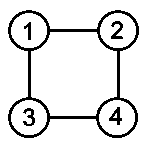
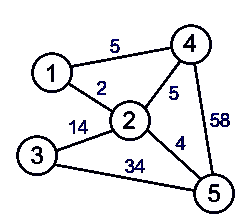
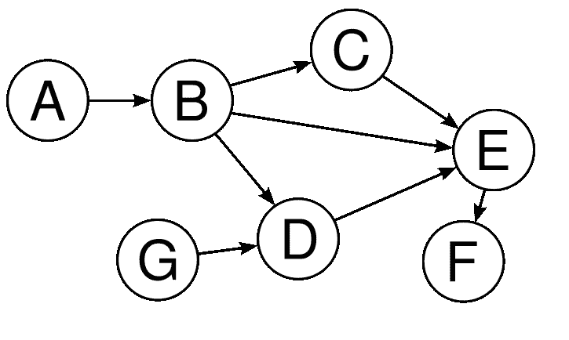
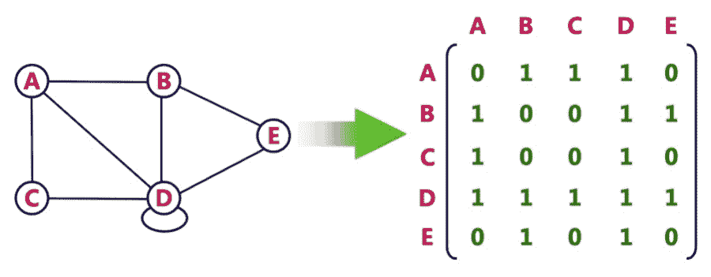
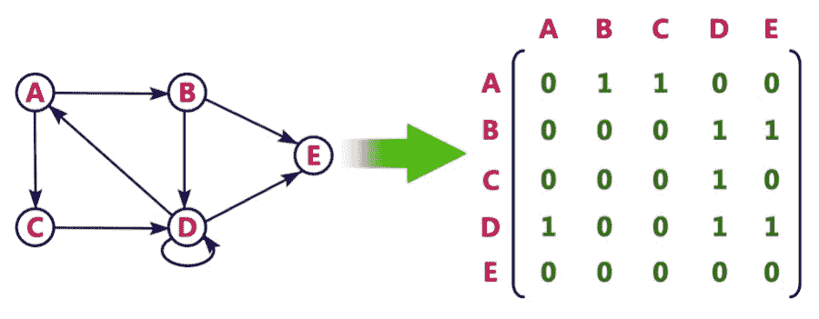
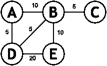
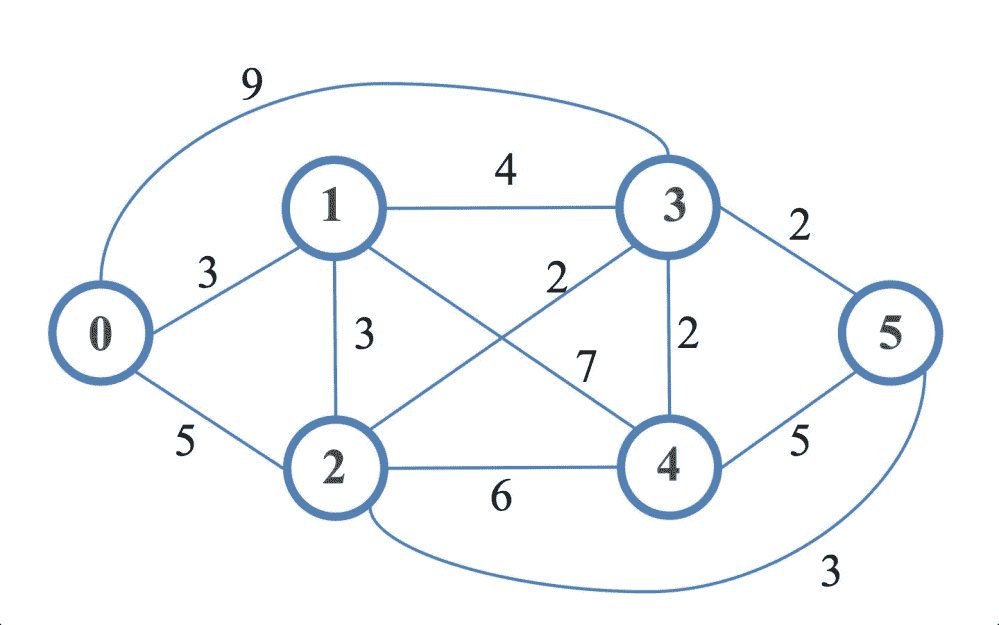

# 九、图的实践

图是用于解决各种实际问题的最有趣的数据结构之一。无论我们谈论的是在地图上显示方向、寻找最短路径、规划复杂的网络流、在社交媒体中查找配置文件之间的连接，还是推荐，我们都在处理图数据结构及其相关算法。图为我们提供了许多解决问题的方法，它们经常被用来解决复杂的问题。因此，了解图以及如何在解决方案中使用图对我们来说非常重要。

# 理解图的性质

图是通过边相互连接的顶点或节点的集合。这些边可以是有序的，也可以是无序的，这意味着边可以有一个与其关联的方向，也可以是非定向的，这也称为双向边。我们使用一个集合*G*表示一个与顶点*V*和边*E*相关的图，如下所示：

*G=（V，E）*


在上图中，我们有五个顶点和六条边：

*V={A，B，C，D，E}*

*E={AB、AC、AD、BD、BE、CD、DE}*

如果我们考虑上一个图，在 Tyt T0 之间的连通性，和 Ty2 T2，B，Ty3 T3，可以表示为 Po.T4，AB，T5，或者，T6，Ba，Ty7T7，因为我们没有定义连通性的方向。图和树数据结构之间的一个显著区别是，图可以形成循环，但树数据结构不能。与树数据结构不同，我们可以从图数据结构中的任何顶点开始。此外，我们可以在任意两个顶点之间有一条直边，而在树中，只有当子节点是父节点的直接后代时，两个节点才能连接。

图有不同的属性和关键字。在进一步讨论图及其应用之前，我们现在将探讨这些术语。

# 角顶

图中的每个节点称为顶点。通常，顶点表示为圆。在我们的图中，节点**A**、**B**、**C**、**D、**和**E**是顶点。

# 边

边是两个顶点之间的连接。通常，它由两个顶点之间绘制的线表示。在前面的图中，我们在**A**和**B**、**A**和**C**、**A**和**D**、**B**和**D**、**C**和**D**、**B**和**E**之间有边，及**D**及**E**。我们可以将边缘表示为**AB**或**A**、**B**。边可以有三种类型：

*   **定向边**：如果边上有箭头标记，则表示定向边。有向边是单向的。箭头的头部是结束顶点，箭头的尾部是开始顶点：


在上图中，我们可以看到**A**有一条指向**B**的边，这意味着**A**、**B**是一条边，但反之亦然（**B**、**A**。这是一个单向边或定向边的例子。

*   **无向边**：无向边是两个顶点之间没有任何方向的连接。这意味着边满足双向关系。下图是一个无向图的示例，其中**A**以两条边（**A**、**B**）和（**B**、**A**相同的方式连接到**B**：


*   **加权边**：当一条边携带额外信息，如成本、距离或其他信息时，我们称该边为加权边。这用于许多图算法。下图中，**A**、**B**的边缘权重为**5**。根据图的定义，这可以是距离、成本或任何东西：


# 相邻

如果两个顶点之间有一条边，则它们是相邻的。如果两个顶点 A 和 B 之间有一条直边，则称它们相邻。在下图中，我们可以看到顶点**1**和顶点**2**与边**e1**相连，因此称为相邻。由于顶点**2**在顶点 3 和 4 之间没有边，因此顶点**2**与顶点**3**和顶点**4**不相邻。

# 发生的事情

如果顶点是边的端点之一，则边将入射到顶点上。此外，如果两条边共享一个顶点，则两条边是关联的。如果我们考虑下面的图，我们可以看到入射边缘（Po.t0，E1，Po.T1，，T2，E2，T5，1），（和 T1，E1，T1，9，E1，T3，E3，T3）。相互之间共享顶点**4**的 e4 和相互之间共享顶点**3**的边（**e2**、**e4**）。同样地，我们可以说顶点**1**入射于边**e1**、**e2**和**e3**、顶点**2**入射于边**e1**、顶点**3**入射于边【T40 e2 和**e4**，顶点**4**入射在**e3**和**e4**的边缘上：


# 内外度

特定顶点的传入边总数称为该顶点的独立度，而特定顶点的传出边总数称为该顶点的独立度。如果我们考虑下面的图的有向边，我们可以认为顶点 T1 T0 有一个 0 的索引和一个 1 的外度，顶点 OrdT2，B，B，T3，T 有一个索引 2 和一个 Out 度 1，顶点 To.T4。索引为 1，出度为 1，顶点**E**索引为 1，出度为 2，最后，顶点**F**索引为 1，出度为 0。

# 路径

路径是一系列顶点和边，它们从一个起始顶点开始，到我们试图到达的另一个顶点结束。在下图中，从**A**到**F**的路径表示为**A**、**B**、**B**、**C**、**C**、【T14 E、【T16 E、**F**：


# 图的类型

根据图的绘制或表示方式，可以使用不同类型的图。每种类型的图都有不同的行为和用法。我们将重点讨论四种主要的图类型。

# 有向图

如果图只包含有向边，则该图称为有向图。有向图也称为有向图或有向网络。下图示有向图。这里，（**A**、**B**、（**B**、**C**、（**C**、**E**、（**E**、**D**、（**E**、**F**）和【T20 D、**边缘是定向的。由于边缘是定向的，所以边缘**AB**与边缘**BA**不同：**


# 无向图

如果图只包含无向边，则该图是无向图。换句话说，无向图中的边是双向的。有时，无向图也称为无向网络。在无向图中，如果顶点 A 连接到顶点 B，则假定（A，B）和（B，A）表示同一条边。下图显示了一个无向图的示例，其中所有边都没有箭头指示方向：



# 加权图

如果图的所有边都是加权边，则该图称为加权图。在接下来的章节中，我们将大量讨论加权图。加权图可以是有向图或无向图。每条边都必须有一个与之关联的值。边的重量始终称为边的成本。下图示具有五个顶点和七条边的无向加权图。这里，顶点**1**与**2**之间的边的权重为**2**，顶点**1**与**4**之间的边的权重为**5**，顶点**4**与**5**之间的边的权重为**58**：



# 有向无环图（DAG）

无环图是没有圈或环的图。如果我们想从特定节点访问其他节点，我们将不会两次访问任何节点。有向无环图，通常称为 DAG，是一个无环的有向图。有向无环图在图算法中有许多用途。有向无环图具有拓扑排序，其中顶点的排序使得每条边的起始端点出现在排序中早于边的终止端点。下图示 DAG：



从第一个角度看，似乎**B**、**C**、**E**和**D**形成了一个循环，但仔细观察表明它们并不形成一个循环，而我们在有向图部分使用的示例是一个循环图的完美示例。

# 用 PHP 表示图

由于图是用顶点和边表示的，所以我们必须在表示图的两个方面考虑。有几种表示图的方法，但最常用的方法如下：

*   邻接表
*   邻接矩阵

# 邻接表

我们可以用一个链表表示一个图，其中一个数组将用于顶点，每个顶点都有一个链表，它将表示相邻顶点之间的边。当在邻接列表中表示时，示例图如下所示：


# 邻接矩阵

在邻接矩阵中，我们将图表示为二维数组，其中每个节点在水平和垂直方向上表示数组索引。如果从 A 到 B 的边是定向的，那么我们将该数组索引[A][B]标记为 1 以标记连接；否则，它是 0。如果边没有方向性，则[A][B]和[B][A]都设置为 1。如果图是加权图，则[a][B]或[B][a]将存储权重，而不是 1。下图显示了使用矩阵的无向图示：



此图显示了矩阵的有向图示：



虽然我们的图示法在邻接列表和矩阵中都显示了数组索引的字母表示法，但我们也可以使用数字索引来表示顶点。

# 再论图的 BFS 和 DFS

我们已经看到了如何在树结构中实现**广度优先搜索**（**BFS**）和**深度优先搜索******搜索**（**DFS**）。我们将重新访问 BFS 和 DFS 以获取图。树实现和图实现的区别在于，在图实现中，我们可以从任何顶点开始，而在树数据结构中，我们可以从树的根开始。另一个重要的事情是我们的图可以有周期，在树中不存在，所以，我们不能重新访问节点或顶点，因为它将在无限循环中结束。我们将使用一个称为图着色的概念，其中我们使用颜色或值来保持不同节点访问的状态，以保持简单。现在让我们编写一些代码来实现图中的 BFS 和 DFS。**

 **# 广度优先搜索

我们现在要实现一个图的 BFS。考虑到下面的无向图，首先，我们需要在矩阵或列表中表示该图。为了简单起见，我们将使用邻接矩阵表示图：


前面的邻接图有六个顶点，这些顶点标记为从**1**到**6**（no 0）。由于我们的顶点是编号的，所以我们可以将它们用作数组索引，以便更快地访问。我们可以这样构造图：

```php
$graph = []; 
$visited = []; 
$vertexCount = 6; 

for($i = 1;$i<=$vertexCount;$i++) { 
    $graph[$i] = array_fill(1, $vertexCount, 0); 
    $visited[$i] = 0; 
} 

```

这里，我们有两个数组，一个用于表示实际图，另一个用于跟踪访问的节点。我们希望确保不会多次访问某个节点，因为它可能会以无限循环结束。因为我们的图有六个顶点，所以我们将`$vertexCount`保留为`6`。然后，我们将图数组初始化为初始值为`0`的二维数组。我们将从数组的`1`开始索引。我们还通过将每个顶点分配给`$visited`数组中的`0`，将每个顶点设置为未访问。现在，我们将在图表示中添加边。由于图是无向的，我们需要为每条边设置两个属性。换句话说，我们需要为标记为 1 和 2 的顶点之间的边设置双向边值，因为它们之间共享一条边。以下是先前图的完整表示代码：

```php
$graph[1][2] = $graph[2][1] = 1; 
$graph[1][5] = $graph[5][1] = 1; 
$graph[5][2] = $graph[2][5] = 1; 
$graph[5][4] = $graph[4][5] = 1; 
$graph[4][3] = $graph[3][4] = 1; 
$graph[3][2] = $graph[2][3] = 1; 
$graph[6][4] = $graph[4][6] = 1; 

```

所以，我们用邻接矩阵来表示这个图。现在，让我们为矩阵定义 BFS 算法：

```php
function BFS(array &$graph, int $start, array $visited): SplQueue { 
    $queue = new SplQueue;
    $path = new SplQueue;

    $queue->enqueue($start);
    $visited[$start] = 1;

    while (!$queue->isEmpty()) { 
      $node = $queue->dequeue();
      $path->enqueue($node);
      foreach ($graph[$node] as $key => $vertex) { 
          if (!$visited[$key] && $vertex == 1) { 
          $visited[$key] = 1;
          $queue->enqueue($key);
          }
      }
    }

    return $path;
}

```

我们实现的 BFS 函数有三个参数：实际图、起始顶点和空数组。我们本可以避免第三个参数，并在 BFS 函数中编写初始化。最终，我们可以选择实现这一目标的任何一种方式。在我们的函数实现中，我们有两个队列：一个用于保存我们需要访问的节点，另一个用于保存访问节点的顺序或搜索路径。在函数的末尾，我们返回路径队列。

在函数内部，我们首先将起始节点添加到队列中。然后，我们从该节点开始访问其相邻节点。如果该节点未被访问并且与当前节点有连接，我们将其添加到队列中进行访问。我们还将当前节点标记为已访问，并将其添加到路径中。现在，我们将使用构造的图矩阵和访问节点调用 BFS 函数。以下是执行 BFS 功能的程序：

```php
$path = BFS($graph, 1, $visited); 

while (!$path->isEmpty()) { 
    echo $path->dequeue()."\t"; 
} 

```

从前面的代码片段中可以看到，我们从节点 1 开始搜索。输出如下所示：

```php
    1       2       5       3       4       6

```

如果我们通过将`BFS`函数调用的第二个参数从 1 更改为 5，将 5 作为起始节点，那么输出将如下所示：

```php
    5       1       2       4       3       6

```

# 深度优先搜索

正如我们在 BFS 中看到的，我们也可以为 DFS 定义任何起始顶点。不同之处在于，对于访问的节点列表，我们将使用栈而不是队列。代码的其他部分将类似于我们的 BFS 代码。我们还将使用与 BFS 实现相同的图。我们将要实现的 DFS 实现是一个迭代实现。下面是它的代码：

```php
function DFS(array &$graph, int $start, array $visited): SplQueue { 
    $stack = new SplStack; 
    $path = new SplQueue; 

    $stack->push($start); 
    $visited[$start] = 1; 

    while (!$stack->isEmpty()) { 
      $node = $stack->pop(); 
      $path->enqueue($node); 
      foreach ($graph[$node] as $key => $vertex) { 
          if (!$visited[$key] && $vertex == 1) { 
          $visited[$key] = 1; 
          $stack->push($key); 
          } 
      } 
    } 

    return $path; 
} 

```

如前所述，对于 DFS，我们必须使用栈而不是队列，因为我们需要栈中的最后一个顶点，而不是第一个顶点（如果我们使用了队列）。对于路径部分，我们使用队列，以便在显示期间按顺序显示路径。下面是调用我们的图`$graph`的代码：

```php
$path = DFS($graph, 1, $visited); 
while (!$path->isEmpty()) { 
    echo $path->dequeue()."\t"; 
} 

```

该代码将产生以下输出：

```php
    1       5       4       6       3       2

```

对于前面的示例，我们从顶点 1 开始，首先访问顶点 5，这是两个相邻顶点中的顶点 1 的标签 5 和 2。现在，顶点 5 有两个带有标签 4 和 2 的顶点。顶点 4 将首先访问，因为它显示为顶点 5 的第一条边（请记住访问节点的从左到右方向）。接下来，我们将从顶点 4 访问顶点 6。因为，我们不能从顶点 6 再进一步，它将返回顶点 4，并使用标签 3 访问未访问的相邻顶点。当我们位于顶点 3 时，有两个相邻的顶点可从顶点 3 获得。它们被标记为顶点 4 和顶点 2。我们之前已经访问了顶点 4，因此无法重新访问它，我们必须从顶点 3 访问顶点 2。由于顶点 2 有三个顶点，即顶点 3、5 和 1，并且所有这些顶点都已被访问，因此我们实际上在这里完成了 DFS 实现。

We can pass an extra parameter if we are looking for a specific end vertex from a starting vertex. In the earlier example, we were just getting the adjacent vertex and visiting all of them. For a specific end vertex, we had to match the target vertex with each of our visiting vertex during the iteration of the DFS algorithm.

# 基于 Kahn 算法的拓扑排序

让我们假设我们有一些任务要做，每个任务都有一些依赖性，这意味着在执行实际任务之前，应该先完成依赖性任务。当任务和依赖项之间存在相互关系时，问题就会出现。现在，我们需要为完成任务制定一个适当的顺序。我们需要一种特殊类型的排序，以便在不违反完成任务规则的情况下对这些关联任务进行排序。拓扑排序将是解决此类问题的正确选择。在拓扑排序中，从顶点 a 到 B 的有向边 AB 的排序方式是 a 在排序中总是排在 B 之前。这将适用于所有顶点和边。应用拓扑排序的另一个重要因素是图必须是 DAG。任何 DAG 都至少有一个拓扑排序。大多数情况下，对于给定的图，可能存在多个拓扑排序。拓扑排序有两种流行的算法：Kahn 算法和 DFS 方法。我们将在这里讨论 Kahn 的算法，因为我们在本书中已经讨论了 DFS 几次。

Kahn 的算法有以下步骤从 DAG 中查找拓扑顺序：

1.  计算每个顶点的索引（传入边），并将所有顶点放入索引为 0 的队列中。另外，将已访问节点的计数初始化为 0。

2.  从队列中删除顶点并对其执行以下操作：

1.将访问的节点数增加 1。

2.将所有相邻顶点的 indegree 减少 1。

3.如果相邻顶点的 indegree 变为 0，则将其添加到队列中。

3.  重复*步骤 2*直到队列为空。
4.  如果访问节点的计数与节点的计数不同，则给定 DAG 不可能进行拓扑排序。

让我们考虑下面的图。这是 DAG 的一个完美例子。现在，我们想使用拓扑排序和 Kahn 算法对其进行排序：


现在让我们用邻接矩阵来表示这个图，就像我们之前对其他图所做的那样。矩阵如下所示：

```php
$graph = [ 
    [0, 0, 0, 0, 1], 
    [1, 0, 0, 1, 0], 
    [0, 1, 0, 1, 0], 
    [0, 0, 0, 0, 0], 
    [0, 0, 0, 0, 0], 
];

```

现在，我们将按照定义的步骤实现 Kahn 算法。以下是它的实现：

```php
function topologicalSort(array $matrix): SplQueue { 
    $order = new SplQueue; 
    $queue = new SplQueue; 
    $size = count($matrix); 
    $incoming = array_fill(0, $size, 0); 

    for ($i = 0; $i < $size; $i++) { 
      for ($j = 0; $j < $size; $j++) { 
          if ($matrix[$j][$i]) { 
          $incoming[$i] ++; 
          } 
      } 
      if ($incoming[$i] == 0) { 
          $queue->enqueue($i); 
      } 
    } 

    while (!$queue->isEmpty()) { 
      $node = $queue->dequeue(); 

      for ($i = 0; $i < $size; $i++) { 
          if ($matrix[$node][$i] == 1) { 
            $matrix[$node][$i] = 0; 
            $incoming[$i] --; 
            if ($incoming[$i] == 0) { 
                $queue->enqueue($i); 
            } 
          } 
      } 
      $order->enqueue($node); 
    } 

    if ($order->count() != $size) // cycle detected 
      return new SplQueue; 

    return $order; 
} 

```

从前面的实现中我们可以看到，我们实际上已经考虑了 Kahn 算法中提到的每一步。我们首先查找顶点的索引，并将 0 个索引顶点放入队列中。然后，我们检查队列的每个节点，减少相邻顶点的索引，并再次将索引为 0 的任何邻居添加到队列中。最后，我们返回排序队列，如果排序顶点的计数与实际顶点计数不匹配，则返回空队列。现在，我们可以调用该函数以队列的形式返回已排序的顶点列表。以下是执行此操作的代码：

```php
$sorted = topologicalSort($graph);

while (!$sorted->isEmpty()) {
    echo $sorted->dequeue() . "\t";
} 

```

现在，这将遍历每个队列元素并打印它们。输出如下所示：

```php
    2       1       0       3       4

```

输出符合我们的期望。从前面的图中我们可以看到，顶点**2**有一个直接边到顶点**1**和顶点**3**，顶点**1**有一个直接边到顶点**0**和顶点**3**。由于顶点**2**没有传入边，我们将从顶点**2**开始进行拓扑排序。顶点**1**有一条传入边，顶点**3**有两条，所以在顶点**2**之后，我们将按照算法访问顶点**1**。同样的原理会将我们带到顶点**0**，然后是顶点**3**，最后是顶点**4**。我们还必须记住，对于给定的图，可能存在多个拓扑序。Kahn 算法的复杂度为**O**（*V+E*，其中**V**为顶点数，**E**为边数。

# 使用 Floyd-Warshall 算法的最短路径

比萨饼配送公司的常见情况是尽快配送比萨饼。在这种情况下，图算法可以帮助我们。Floyd-Warshall 算法是一种非常常见的算法，用于使用所有顶点对（u，v）查找从 u 到 v 的最短路径。最短路径表示互连的两个节点之间的最短可能距离。计算最短路径的图必须是加权图。在某些情况下，重量也可能是负数。该算法非常简单，是最容易实现的算法之一。如图所示：

```php
for i:= 1 to n do 
  for j:= 1 to n do 
     dis[i][j] = w[i][j] 

for k:= 1 to n do 
   for i:= 1 to n do 
      for j:= 1 to n do 
         sum := dis[i][k] + dis[k][j] 
         if (sum < dis[i][j]) 
              dis[i][j] := sum 

```

首先，我们将每个权重复制到成本或距离矩阵中。然后，我们遍历每个顶点，计算出从顶点`i`到顶点`j`再到顶点`k`的访问成本或距离。如果距离或成本小于顶点`i`和顶点`j`之间的直接路径，我们选择路径`i`到`k`到`j`，而不是直接路径`i`到`j`。让我们考虑下面的图：



在这里，我们可以看到一个无向图，每条边上都有权重。现在，如果我们寻找从**A**到**E**的最短路径，那么我们有以下选项：

*   经由**B**的**A**至**E**的距离为**20**
*   经由**D**的**A**至**E**的距离为**25**
*   **A**到**E**通过**D**和**B**的距离为**20**
*   **A**到**E**通过**B**和**D**的距离为**35**

所以我们可以看到最低距离是**20**。现在，让我们用顶点的数字表示以编程方式实现这一点。我们将分别使用 0、1、2、3 和 4，而不是 A、B、C、D 和 E。现在，让我们以邻接矩阵格式表示前面的图：

```php
$totalVertices = 5; 
$graph = []; 
for ($i = 0; $i < $totalVertices; $i++) { 
    for ($j = 0; $j < $totalVertices; $j++) { 
      $graph[$i][$j] = $i == $j ? 0 : PHP_INT_MAX; 
    }
}

```

这里，我们采用了一种差分方法，并将所有边初始化为 PHP 整数的最大值。这样做的原因是为了确保非边的值为 0 不会影响算法逻辑，因为我们正在搜索最小值。现在，我们需要将权重添加到图中，如前面的图所示：

```php
$graph[0][1] = $graph[1][0] = 10;
$graph[2][1] = $graph[1][2] = 5;
$graph[0][3] = $graph[3][0] = 5;
$graph[3][1] = $graph[1][3] = 5;
$graph[4][1] = $graph[1][4] = 10;
$graph[3][4] = $graph[4][3] = 20;

```

因为这是一个无向图，所以我们为两条边指定相同的值。如果它是一个有向图，我们可以为每个权重只创建一个条目。现在，是时候实现 Floyd-Warshall 算法来为任何给定的节点对寻找最短路径了。以下是我们对该功能的实现：

```php
function floydWarshall(array $graph): array {
    $dist = [];
    $dist = $graph;
    $size = count($dist);

    for ($k = 0; $k < $size; $k++)
      for ($i = 0; $i < $size; $i++)
          for ($j = 0; $j < $size; $j++)
        $dist[$i][$j] = min($dist[$i][$j],
    $dist[$i][$k] + $dist[$k][$j]);

    return $dist;
} 

```

正如我们前面提到的，实现非常简单。我们有三个内部循环来计算最小距离，我们还返回函数末尾的距离数组。现在，让我们调用此函数并检查预期结果是否匹配：

```php
$distance = floydWarshall($graph); 

echo "Shortest distance between A to E is:" . $distance[0][4] . "\n"; 
echo "Shortest distance between D to C is:" . $distance[3][2] . "\n"; 

```

以下是代码的输出：

```php
Shortest distance between A to E is:20
Shortest distance between D to C is:10

```

如果我们查看前面的图，我们可以看到**D**和**C**之间的最短距离实际上是**10**，路径是 D→ B→ C（5+5），这是所有可能路线（D）中最短的距离→ A.→ B→ C（20）或 D→ E→ B→ C（35））。

Floyd Warshall 算法的复杂度为**O**（*V3*，其中**V**为图中的顶点数。现在我们将探索另一种算法，该算法以寻找单源最短路径而闻名。

# 使用 Dijkstra 算法的单源最短路径

使用 Floyd-Warshall 算法，我们可以很容易地找到最短路径，但是我们没有得到从节点 X 到 Y 的实际路径。这是因为 Floyd-Warshall 算法计算距离或成本，并且没有存储最小成本的实际路径。例如，使用谷歌地图，我们总能找到从任何给定位置到目的地的路线。谷歌地图可以根据距离、旅行时间或其他因素向我们展示最佳路线。这是使用单源最短路径算法的完美示例。求解单源最短路径问题有多种算法；然而，Dijkstra 的最短路径算法是最流行的。有很多方法可以实现 Dijkstra 算法，比如使用斐波那契堆、最小堆、优先级队列等等。在 Dijkstra 解决方案的性能和改进方面，每个实现都有自己的优势。让我们看一下算法的伪代码：

```php
   function Dijkstra(Graph, source):

      create vertex set Q
      for each vertex v in Graph:   
          dist[v] := INFINITY
          prev[v] := UNDEFINED          
          add v to Q         

      dist[source] := 0           

      while Q is not empty:
          u := vertex in Q with min dist[u]
          remove u from Q

          for each neighbor v of u:
              alt := dist[u] + length(u, v)
              if alt < dist[v]:   
                  dist[v] := alt
                  prev[v] := u

      return dist[], prev[]

```

现在，我们将使用优先级队列实现该算法。首先，让我们选择一个图来实现该算法。我们可以选择下面的无向加权图。它有六个节点，节点和顶点之间有许多连接。首先，我们需要在邻接矩阵中表示以下图：


从上图中可以看出，我们的顶点标有字母**A**到**F**，因此我们将使用顶点名称作为 PHP 关联数组中的键：

```php
$graph = [
    'A' => ['B' => 3, 'C' => 5, 'D' => 9],
    'B' => ['A' => 3, 'C' => 3, 'D' => 4, 'E' => 7],
    'C' => ['A' => 5, 'B' => 3, 'D' => 2, 'E' => 6, 'F' => 3],
    'D' => ['A' => 9, 'B' => 4, 'C' => 2, 'E' => 2, 'F' => 2],
    'E' => ['B' => 7, 'C' => 6, 'D' => 2, 'F' => 5],
    'F' => ['C' => 3, 'D' => 2, 'E' => 5],
];

```

现在，我们将使用优先级队列实现 Dijkstra 算法。我们将使用为上一张图创建的邻接矩阵，找到从源顶点到目标顶点的路径。我们的 Dijkstra 算法将返回一个具有两个节点之间最小距离和跟随路径的数组。我们将以栈的形式返回路径，以便以相反的顺序获得实际路径。以下是实施方案：

```php
function Dijkstra(array $graph, string $source,string $target):array{ 
    $dist = []; 
    $pred = []; 
    $Queue = new SplPriorityQueue(); 

    foreach ($graph as $v => $adj) { 
      $dist[$v] = PHP_INT_MAX; 
      $pred[$v] = null; 
      $Queue->insert($v, min($adj)); 
    } 

    $dist[$source] = 0; 

    while (!$Queue->isEmpty()) { 
      $u = $Queue->extract(); 
      if (!empty($graph[$u])) { 
          foreach ($graph[$u] as $v => $cost) { 
           if ($dist[$u] + $cost < $dist[$v]) { 
            $dist[$v] = $dist[$u] + $cost; 
            $pred[$v] = $u; 
        } 
          } 
      } 
    } 

    $S = new SplStack();
    $u = $target; 
    $distance = 0;

    while (isset($pred[$u]) && $pred[$u]) {
      $S->push($u);
      $distance += $graph[$u][$pred[$u]];
      $u = $pred[$u]; 
    } 

    if ($S->isEmpty()) { 
      return ["distance" => 0, "path" => $S]; 
    } else {
      $S->push($source);
      return ["distance" => $distance, "path" => $S]; 
    }
}

```

从前面的实现中可以看到，首先，我们创建了两个数组来存储距离和前导，以及优先级队列。然后，我们将每个顶点设置为 PHP 的最大整数（`PHP_INT_MAX`）值（伪代码中的无穷大），前一个顶点设置为`NULL`。我们还获取所有相邻节点的最小值，并将它们存储在队列中。循环结束后，我们将源节点距离设置为`0`。然后我们检查队列中的每个节点，并检查最近的邻居以找到最小路径。如果使用`if ($dist[$u] + $cost < $dist[$v])`找到路径，我们将其指定给顶点。

然后我们创建了一个名为`$s`的栈来存储路径。我们从目标顶点开始，访问相邻顶点以到达源顶点。当我们通过相邻顶点移动时，我们还计算了访问这些顶点所覆盖的距离。由于我们的函数同时返回距离和路径，因此我们构造了一个数组来返回给定图、源和目标的距离和路径。如果不存在路径，则返回 0 作为距离，并为输出返回空栈。现在，我们将编写几行代码来使用图`$graph`和函数`Dijkstra`来检查我们的实现：

```php
$source = "A"; 
$target = "F"; 

$result = Dijkstra($graph, $source, $target); 
extract($result); 

echo "Distance from $source to $target is $distance \n"; 
echo "Path to follow : "; 

while (!$path->isEmpty()) { 
    echo $path->pop() . "\t"; 
} 

```

如果我们运行此代码，它将在命令行中具有以下输出：

```php
Distance from A to F is 8
Path to follow : A      C       F

```

从图中可以看出，从**A**到**F**的最短路径是通过**C**，最短距离是*5+3=8*。

Dijkstra 算法的运行复杂度为**O**（*V2*。由于我们使用的是最小优先级队列，所以运行时复杂度为**O**（*E+V log V*。

# 用 Bellman-Ford 算法寻找最短路径

虽然 Dijkstra 的算法是用于寻找单源最短路径的最流行和最有效的算法，但有一个问题它没有解决。如果图有一个负循环，Dijkstra 的算法无法检测到负循环，因此它不起作用。负循环是循环中所有边之和为负的循环。如果一个图包含一个负循环，那么就不可能找到最短路径，因此在找到最短路径的同时解决这个问题是很重要的。这就是为什么我们使用 Bellman-Ford 算法，尽管它比 Dijkstra 算法慢。以下是最短路径 Bellman-Ford 算法的算法伪代码：

```php
function BellmanFord(list vertices, list edges, vertex source) 
  // This implementation takes a vertex source 
  // and fills distance array with shortest-path information 

  // Step 1: initialize graph 
  for each vertex v in vertices: 
    if v is source 
      distance[v] := 0 
    else 
      distance[v] := infinity 

  // Step 2: relax edges repeatedly 
  for i from 1 to size(vertices)-1: 
    for each edge (u, v) with weight w in edges: 
      if distance[u] + w < distance[v]: 
        distance[v] := distance[u] + w 

  // Step 3: check for negative-weight cycles 
    for each edge (u, v) with weight w in edges: 
        if distance[u] + w < distance[v]: 
      error "Graph contains a negative-weight cycle" 

```

我们可以看到，Bellman-Ford 算法在寻找节点间最短路径时也考虑了边和顶点。这被称为松弛过程，也用于 Dijkstra 算法。图算法中的松弛过程是指更新连接到顶点*V*的所有顶点的代价，如果这些代价可以通过包含经由*V*的路径来改善。简单地说，松弛过程是试图降低使用另一个顶点到达顶点的成本。现在，我们将对 Dijkstra 算法中使用的相同图实现该算法。唯一的区别是，我们将在此处为节点和顶点使用数字标签：



现在是用邻接矩阵格式表示图的时候了。以下是 PHP 中的矩阵：

```php
$graph = [ 
    0 => [0, 3, 5, 9, 0, 0], 
    1 => [3, 0, 3, 4, 7, 0], 
    2 => [5, 3, 0, 2, 6, 3], 
    3 => [9, 4, 2, 0, 2, 2], 
    4 => [0, 7, 6, 2, 0, 5], 
    5 => [0, 0, 3, 2, 5, 0] 
]; 

```

以前，我们使用值 0 表示两个顶点之间没有边。如果我们在这里也这样做，那么在松弛过程中，在两条边之间取一个最小值，其中一条表示 0，将始终得到一个 0，这实际上意味着两个顶点之间没有连接。因此，我们必须选择一个较大的数字来表示不存在的边。我们可以使用 PHP 的`MAX_INT_VALUE`常数来表示这些边，这样就不会考虑那些不存在的边。这可以是我们的新图表示：

```php
define("I", PHP_INT_MAX); 

$graph = [ 
    0 => [I, 3, 5, 9, I, I], 
    1 => [3, I, 3, 4, 7, I], 
    2 => [5, 3, I, 2, 6, 3], 
    3 => [9, 4, 2, I, 2, 2], 
    4 => [I, 7, 6, 2, I, 5], 
    5 => [I, I, 3, 2, 5, I] 
]; 

```

现在，让我们编写 Bellman-Ford 算法的实现。我们将使用伪代码中定义的相同方法：

```php
function bellmanFord(array $graph, int $source): array { 
    $dist = []; 
    $len = count($graph); 

    foreach ($graph as $v => $adj) { 
      $dist[$v] = PHP_INT_MAX; 
    } 

    $dist[$source] = 0; 

    for ($k = 0; $k < $len - 1; $k++) { 
      for ($i = 0; $i < $len; $i++) { 
          for ($j = 0; $j < $len; $j++) { 
            if ($dist[$i] > $dist[$j] + $graph[$j][$i]) { 
            $dist[$i] = $dist[$j] + $graph[$j][$i]; 
        } 
          } 
      } 
    } 

    for ($i = 0; $i < $len; $i++) { 
      for ($j = 0; $j < $len; $j++) { 
          if ($dist[$i] > $dist[$j] + $graph[$j][$i]) { 
           echo 'The graph contains a negative-weight cycle!'; 
           return []; 
          } 
      } 
        } 
    return $dist; 
} 

```

与 Dijkstra 的算法不同，我们没有跟踪前辈。我们正在考虑松弛过程中的距离。由于我们在 PHP 中使用的是整数的最大值，因此它会自动取消选择值为 0 的不存在边作为最小路径的可能性。实现的最后一部分检测给定图中的任何负循环，并在这种情况下返回空数组：

```php
$source = 0; 
$distances = bellmanFord($graph, $source); 

foreach($distances as $target => $distance) { 
    echo "distance from $source to $target is $distance \n"; 
} 

```

这将有以下输出，显示从源节点到其他节点的最短路径距离：

```php
distance from 0 to 0 is 0
distance from 0 to 1 is 3
distance from 0 to 2 is 5
distance from 0 to 3 is 7
distance from 0 to 4 is 9
distance from 0 to 5 is 8

```

Bellman-Ford 算法的运行时复杂度为**O**（*V*、*E*。

# 理解最小生成树（MST）

假设我们正在设计一个新的办公园区，其中有多个相互连接的建筑。如果我们通过考虑每个建筑之间的互连来解决这个问题，将需要大量的电缆。但是，如果我们可以通过一个公共连接将所有建筑连接起来，其中每个建筑仅通过一个连接连接到其他建筑，那么此解决方案将减少冗余和成本。如果我们将建筑物视为顶点，将建筑物之间的连通性视为边，我们可以使用这种方法构造一个图。我们试图解决的问题也被称为**最小生成树**或**MST**。考虑下面的图。我们有 10 个顶点和 21 条边。但是，我们可以用九条边（暗线）连接所有 10 个顶点。这将使我们的成本或距离保持在最低水平：


我们可以使用几种算法从给定的图中查找 MST。两种最流行的算法是 Prim 算法和 Kruskal 算法。我们将在接下来的章节中探讨这两种算法。

# Prim 生成树算法的实现

Prim 寻找最小生成树的算法依赖于贪婪方法。贪婪方法被定义为一种算法范式，在该范式中，我们试图通过考虑每个阶段的局部最优解来寻找全局最优解。我们将在[第 11 章](11.html)中探索贪婪算法，*使用先进技术*解决问题。在贪婪方法中，该算法创建边子集，并从边子集中找出代价最小的一个。此边子集将包括所有顶点。它从任意位置开始，通过选择顶点之间最便宜的连接，一次将树增长一个顶点。让我们考虑下面的图：


现在，我们将应用 Prim 算法的一个非常基本的版本来获得最小生成树以及边的最小代价或权重。该图将如下所示作为邻接矩阵：

```php
$G = [ 
    [0, 3, 1, 6, 0, 0], 
    [3, 0, 5, 0, 3, 0], 
    [1, 5, 0, 5, 6, 4], 
    [6, 0, 5, 0, 0, 2], 
    [0, 3, 6, 0, 0, 6], 
    [0, 0, 4, 2, 6, 0] 
]; 

```

现在，我们将实现 Prim 最小生成树的算法。我们假设我们将从顶点 0 开始查找整个生成树，因此我们将在函数中传递图邻接矩阵，它将显示生成树的连接边以及最小成本：

```php
function primMST(array $graph) { 
    $parent = [];   // Array to store the MST 
    $key = [];     // used to pick minimum weight edge         
    $visited = [];   // set of vertices not yet included in MST 
    $len = count($graph); 

    // Initialize all keys as MAX 
    for ($i = 0; $i < $len; $i++) { 
      $key[$i] = PHP_INT_MAX; 
      $visited[$i] = false; 
    } 

    $key[0] = 0; 
    $parent[0] = -1; 

    // The MST will have V vertices 
    for ($count = 0; $count < $len - 1; $count++) { 
  // Pick the minimum key vertex 
  $minValue = PHP_INT_MAX; 
  $minIndex = -1; 

  foreach (array_keys($graph) as $v) { 
      if ($visited[$v] == false && $key[$v] < $minValue) { 
        $minValue = $key[$v]; 
        $minIndex = $v; 
      } 
  } 

  $u = $minIndex; 

  // Add the picked vertex to the MST Set 
  $visited[$u] = true; 

  for ($v = 0; $v < $len; $v++) { 
      if ($graph[$u][$v] != 0 && $visited[$v] == false && 
        $graph[$u][$v] < $key[$v]) { 
          $parent[$v] = $u; 
          $key[$v] = $graph[$u][$v]; 
      } 
  } 
    } 

    // Print MST 
    echo "Edge\tWeight\n"; 
    $minimumCost = 0; 
    for ($i = 1; $i < $len; $i++) { 
      echo $parent[$i] . " - " . $i . "\t" . $graph[$i][$parent[$i]] 
         "\n"; 
      $minimumCost += $graph[$i][$parent[$i]]; 
    } 
    echo "Minimum cost: $minimumCost \n"; 
} 

```

现在，如果我们用我们的图`$G`调用函数`primMST`，以下将是输出和由算法构造的 MST：

```php
Edge    Weight
0 - 1   3
0 - 2   1
5 - 3   2
1 - 4   3
2 - 5   4
Minimum cost: 13

```


还有其他方法可以借助斐波那契堆、优先级队列等实现 Prim 算法。它非常类似于 Dijkstra 的算法来寻找最短路径。我们的实现的时间复杂度为**O**（*V<sup>2</sup>*。使用二进制堆和斐波那契堆，我们可以显著降低复杂性。

# Kruskal 生成树算法

另一种寻找最小生成树的流行算法是 Kruskal 算法。它类似于 Prim 的算法，使用贪婪的方法来寻找解决方案。以下是实现 Kruskal 算法所需的步骤：

1.  创建一个森林**T**（一组树），图中的每个顶点都是一棵独立的树。
2.  创建包含图中所有边的集合**S**。
3.  当**S**为非空且**T**尚未跨越时：

1.从**S**上移除重量最小的边缘。

2.如果该边连接两棵不同的树，则将其添加到森林中，将两棵树合并为一棵树；否则，丢弃该边。

我们将使用与 Prim 算法相同的图。以下是 Kruskal 算法的实现：

```php
function Kruskal(array $graph): array { 
    $len = count($graph); 
    $tree = []; 

    $set = []; 
    foreach ($graph as $k => $adj) { 
    $set[$k] = [$k]; 
    } 

    $edges = []; 
    for ($i = 0; $i < $len; $i++) { 
      for ($j = 0; $j < $i; $j++) { 
        if ($graph[$i][$j]) { 
          $edges[$i . ',' . $j] = $graph[$i][$j]; 
        } 
    } 
    } 

    asort($edges); 

    foreach ($edges as $k => $w) { 
    list($i, $j) = explode(',', $k); 

    $iSet = findSet($set, $i); 
    $jSet = findSet($set, $j); 
    if ($iSet != $jSet) { 
        $tree[] = ["from" => $i, "to" => $j, 
    "cost" => $graph[$i][$j]]; 
        unionSet($set, $iSet, $jSet); 
    } 
    } 

    return $tree; 
} 

function findSet(array &$set, int $index) { 
    foreach ($set as $k => $v) { 
      if (in_array($index, $v)) { 
        return $k; 
      } 
    } 

    return false; 
} 

function unionSet(array &$set, int $i, int $j) { 
    $a = $set[$i]; 
    $b = $set[$j]; 
    unset($set[$i], $set[$j]); 
    $set[] = array_merge($a, $b); 
} 

```

正如我们所看到的，我们有两个独立的函数-`unionSet`和`findSet`-来执行两个不相交集合的并集运算，以及确定集合中是否存在数字。现在，让我们用构建的图运行程序，如下所示：

```php
$graph = [ 
    [0, 3, 1, 6, 0, 0], 
    [3, 0, 5, 0, 3, 0], 
    [1, 5, 0, 5, 6, 4], 
    [6, 0, 5, 0, 0, 2], 
    [0, 3, 6, 0, 0, 6], 
    [0, 0, 4, 2, 6, 0] 
]; 

$mst = Kruskal($graph); 

$minimumCost = 0; 

foreach($mst as $v) { 
    echo "From {$v['from']} to {$v['to']} cost is {$v['cost']} \n"; 
    $minimumCost += $v['cost']; 
} 

echo "Minimum cost: $minimumCost \n"; 

```

这将产生以下输出，与 Prim 算法的输出类似：

```php
From 2 to 0 cost is 1
From 5 to 3 cost is 2
From 1 to 0 cost is 3
From 4 to 1 cost is 3
From 5 to 2 cost is 4
Minimum cost: 13

```

Kruskal 算法的复杂度为**O**（*E log V*），比 Prim 算法的一般实现要好。

# 总结

在本章中，我们讨论了不同的图算法及其操作。图在解决广泛的问题时非常方便。我们已经看到，对于同一个图，我们可以应用不同的算法并获得不同的性能。我们必须根据问题的性质仔细选择要应用的算法。由于一些限制，我们在本书中遗漏了许多其他图主题。有一些主题，如图着色、二部匹配和流问题，应该在适用的情况下进行研究和应用。在下一章中，我们将把重点转移到本书的最后一个数据结构主题，即 heap，并学习 heap 数据结构的不同用法。**