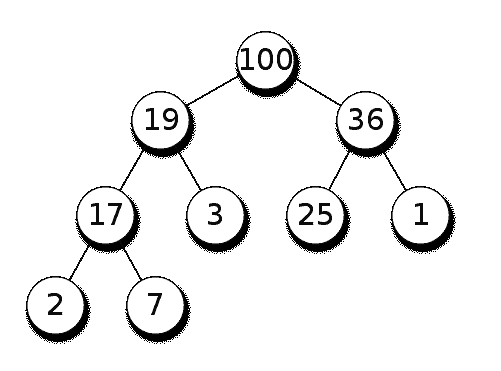

# 理解和使用堆

堆是一种基于树抽象数据类型的专用数据结构，用于许多算法和数据结构。可以使用堆构建的公共数据结构是优先级队列。此外，堆排序所基于的最流行和最有效的排序算法之一是堆数据结构。在本章中，我们将讨论堆的属性、堆的不同变体以及堆操作。我们还将发现堆排序，并将在本章中使用 SPL 实现堆。我们现在将在下一节中探讨堆及其定义。

# 什么是堆？

根据定义，堆是支持堆属性的专用树数据结构。堆属性的定义方式是，堆结构的根将小于或大于其子节点。如果父节点大于子节点，则称为最大堆；如果父节点小于子节点，则称为最小堆。下图显示了最大堆的示例：



如果我们看根节点，**100**的值大于两个子节点**19**和**36**。与**19**类似，该值大于**17**和**3**。对**36**和**17**适用相同的规则。正如我们从树结构中看到的，树不是完全排序的。但重要的事实是，我们总是可以在树的根上找到最大值或最小值，这对于许多用例都非常有效。

堆结构有很多变体，如二进制堆、b 堆、斐波那契堆、三元堆、treap、弱堆等。二进制堆是堆实现中最常用的方法之一。二进制堆是一个完整的二叉树，其中树的所有内部级别都被完全填充。最后一层可以完全填充或部分填充。因为我们考虑的是二进制堆，所以我们可以在对数时间内执行大多数操作。在本书中，我们将重点介绍二进制堆的实现和操作。

# 堆操作

正如我们几次提到的，heap 是一种专门的树数据结构，我们必须确保首先从给定的项列表构造一个 heap。由于 heap 有一个严格的 heap 属性，我们必须在每个步骤上满足 heap 属性。以下是堆的一些核心操作：

*   创建堆
*   插入新值
*   从堆中提取最小值或最大值
*   删除一个值
*   交换

从给定的项目或数字列表创建堆需要我们确保同时满足堆属性和二叉树属性。这意味着父节点必须大于或小于子节点，对于树中的所有节点都是如此。此外，树必须始终是一个完整的二叉树。在创建堆时，我们从一个节点开始，向堆中插入一个新节点。

“插入节点”操作有一组已定义的步骤。我们不能从任意节点开始。插入操作的步骤如下所示：

1.  在堆的底部插入新节点。
2.  如果新节点的顺序正确，请使用父值检查它们。如果顺序正确，就到此为止。
3.  如果它们的顺序不正确，请交换它们并移动到上一步，以检查新交换的节点及其父节点。这一步和前一步一起被称为筛选、堆、冒泡、堆等等。

提取操作（最小或最大）从堆中取出根节点。在此之后，我们必须执行以下操作以确保剩余堆的堆属性：

1.  将堆中的最后一个节点作为新根节点移动。
2.  将新根节点与子节点进行比较，如果它们的顺序正确，请停止。
3.  如果没有，则将根节点与子节点交换（最小子节点为`MinHeap`，最大子节点为`MaxHeap`），然后继续上一步。这一步和前一步一起被称为筛选或堆下，或冒泡或堆下，等等。

在堆中，一个重要的操作是交换。在许多情况下，我们必须在不影响树属性的情况下交换两个节点的两个值。现在我们将使用 PHP7 实现一个二进制堆。

# 在 PHP 中实现二进制堆

实现二进制堆最常用的方法之一是使用数组。由于堆是完整的二叉树，因此可以使用数组轻松实现它们。如果我们考虑根项在索引 1，则子项将位于索引 2 和索引 3。我们可以表示为根为*i*，左子为*2*i*，右子为*2*i+1*。此外，我们还将实现平均堆作为示例。因此，让我们开始了解最小堆实现的类结构。

首先，我们将首先为`MinHeap`创建一个类，该类将有两个属性，一个用于存储堆数组，另一个用于计算任何给定时刻堆中的元素数。下面是该类的代码：

```php
class MinHeap { 

    public $heap; 
    public $count; 

    public function __construct(int $size) { 
        $this->heap = array_fill(0, $size + 1, 0); 
        $this->count = 0; 
    } 
}

```

如果我们查看前面的代码，可以看到我们已经初始化了堆数组，使其具有从 0 索引到`$size + 1`的所有 0 值。因为我们正在考虑将根放在索引 1，所以我们需要一个具有一个额外空间的数组。现在我们需要一种从给定数组构建堆的方法。由于我们必须满足 heap 属性，因此我们必须向堆中添加一个项，并使用 C 步骤检查 heap 属性是否满足。下面是通过一次插入一个项来创建堆的代码块以及`siftUp`过程：

```php
public function create(array $arr = []) { 
    if ($arr) { 
        foreach ($arr as $val) { 
            $this->insert($val); 
        } 
    } 
} 

public function insert(int $i) { 
    if ($this->count == 0) { 
        $this->heap[1] = $i; 
        $this->count = 2; 
    } 
    else { 
        $this->heap[$this->count++] = $i; 
        $this->siftUp(); 
    } 
} 

public function siftUp() { 
    $tmpPos = $this->count - 1; 
    $tmp = intval($tmpPos / 2); 

    while ($tmpPos > 0 &&  
    $this->heap[$tmp] > $this->heap[$tmpPos]) { 
        $this->swap($tmpPos, $tmp); 
        $tmpPos = intval($tmpPos / 2); 
        $tmp = intval($tmpPos / 2); 
    } 
} 

```

首先，我们使用`create`方法从数组构建堆。对于数组中的每个元素，我们使用`insert`方法将其插入堆中。在`insert`方法中，我们检查堆的当前大小是否为 0。如果当前大小为 0，则将第一项添加到索引 1，并将下一个计数器设置为 2。如果堆已经有一个项，我们将把新项存储在最后一个位置并递增计数器。我们还调用`siftUp()`方法来确保新插入的值满足 heap 属性。

在 Endot0-方法中，我们考虑最后的位置和它的父位置进行比较。如果子值小于父值，则交换它们。我们继续此操作，直到到达顶部的根节点。此方法确保如果末尾插入的值最小，则将在树中对其进行筛选。但如果不是，这棵树将保持原样。虽然我们已经讨论过交换，但还没有看到实现。以下是实施方案：

```php
public function swap(int $a, int $b) { 
    $tmp = $this->heap[$a]; 
    $this->heap[$a] = $this->heap[$b]; 
    $this->heap[$b] = $tmp; 
}

```

因为根元素在堆中具有最小值（我们正在实现最小堆）。`extract`方法将始终返回当前堆的最小值：

```php
    public function extractMin() { 
        $min = $this->heap[1]; 
        $this->heap[1] = $this->heap[$this->count - 1]; 
        $this->heap[--$this->count] = 0; 
        $this->siftDown(1); 
        return $min; 
    }

```

`extractMin`方法返回数组的第一个索引，并将其替换为数组的最后一项。然后，它对新放置的根执行 siftDown 检查，以确保 heap 属性。因为我们提取根值，所以我们将最后一个索引值替换为 0，这是我们用来初始化堆数组的。现在我们要编写`siftDown`方法，我们称之为`extract`方法：

```php
public function siftDown(int $k) { 
    $smallest = $k; 
    $left = 2 * $k; 
    $right = 2 * $k + 1; 

    if ($left < $this->count &&  
    $this->heap[$smallest] > $this->heap[$left]) { 
        $smallest = $left; 
    } 

    if ($right < $this->count && $this->heap[$smallest] > $this-  
      >heap[$right]) { 
        $smallest = $right; 
    }

    if ($smallest != $k) {
        $this->swap($k, $smallest); 
        $this->siftDown($smallest); 
    }
} 

```

我们认为索引项 T0 中的项是最小值。然后我们将最小值与左、右子项进行比较。如果有较小的值可用，我们将最小的值与根节点交换，它将继续，直到树满足 heap 属性。每次需要交换时，此函数都会递归调用自身。现在我们还需要一个方法将当前堆显示为字符串。为此，我们可以编写如下的小方法：

```php
public function display() { 
    echo implode("\t", array_slice($this->heap, 1)) . "\n"; 
}

```

如果我们现在把所有的部分放在一起，我们就有了一个可靠的 min-heap 实现。现在让我们运行一个测试，看看我们的实现是否满足最小堆属性。下面是我们可以运行以构建堆并多次从堆中提取最小值的代码：

```php
$numbers = [37, 44, 34, 65, 26, 86, 129, 83, 9]; 
echo "Initial array \n" . implode("\t", $numbers) . "\n"; 
$heap = new MinHeap(count($numbers)); 
$heap->create($numbers); 
echo "Constructed Heap\n"; 
$heap->display(); 
echo "Min Extract: " . $heap->extractMin() . "\n"; 
$heap->display(); 
echo "Min Extract: " . $heap->extractMin() . "\n"; 
$heap->display(); 
echo "Min Extract: " . $heap->extractMin() . "\n"; 
$heap->display(); 
echo "Min Extract: " . $heap->extractMin() . "\n"; 
$heap->display(); 
echo "Min Extract: " . $heap->extractMin() . "\n"; 
$heap->display(); 
echo "Min Extract: " . $heap->extractMin() . "\n"; 
$heap->display(); 

```

如果我们运行此代码，终端中将显示以下输出：

```php
Initial array
37      44      34      65      26      86      129     83      9
Constructed Heap
9       26      37      34      44      86      129     83      65
Min Extract: 9
26      34      37      65      44      86      129     83      0
Min Extract: 26
34      44      37      65      83      86      129     0       0
Min Extract: 34
37      44      86      65      83      129     0       0       0
Min Extract: 37
44      65      86      129     83      0       0       0       0
Min Extract: 44
65      83      86      129     0       0       0       0       0
Min Extract: 65
83      129     86      0       0       0       0       0       0

```

从前面的输出可以看出，当我们构建最小堆时，`9`的最小值在根中。然后我们提取最小值，从堆中提取`9`。然后以下一个最小值`26`为根，然后依次为`34`、`37`、`44`和`65`。每次我们取出最小值时，堆都会重新构造为最小值。由于我们已经看到了堆数据结构的所有适用操作，现在我们将分析不同堆操作的复杂性。

# 分析堆操作的复杂性

由于堆实现有不同的变体，不同的实现的复杂性也不同。堆的关键因素之一是提取操作，提取操作总是需要`O(1)`时间才能从堆中获取最大值或最小值。由于我们关注的是二进制堆实现，我们将看到二进制堆操作的分析：

| **操作** | **复杂度-平均** | **复杂性-最差** |
| 搜索 | `O(n)` | `O(n)` |
| 插入 | `O(1)` | `O(log n)` |
| 删去 | `O(log n)` | `O(log n)` |
| 摘录 | `O(1)` | `O(1)` |
| 空间 | `O(n)` | `O(n)` |

由于堆没有完全排序，因此搜索操作将花费比常规二进制搜索树更多的时间。

# 使用堆作为优先级队列

使用堆数据结构的主要方法之一是创建优先级队列。正如我们在[第 4 章](04.html)*构造堆栈和队列*中所看到的，优先级队列是特殊队列，其中 FIFO 行为取决于元素的优先级，而不是项目添加到队列中的方式。我们已经看到了使用链表和 SPL 的实现。现在，我们将探讨使用 heap，尤其是 max heap 的优先级队列实现。

现在我们将使用`MaxHeap`实现优先级队列。这里，将首先从队列中删除最大优先级项目。我们的实现将与`MinHeap`的上一个实现类似，但有一点不同。我们希望从 0 开始根，而不是从 1 开始根。因此，左侧和右侧子对象的计算也会发生变化。这将帮助我们理解使用数组构造堆的两种方法。下面是`MaxHeap`类的实现：

```php
class MaxHeap { 

    public $heap; 
    public $count; 

    public function __construct(int $size) { 
        $this->heap = array_fill(0, $size, 0); 
        $this->count = 0; 
    } 

    public function create(array $arr = []) { 
        if ($arr) { 
            foreach ($arr as $val) { 
                $this->insert($val); 
            } 
        } 
    } 

    public function display() { 
        echo implode("\t", array_slice($this->heap, 0)) . "\n"; 
    } 

    public function insert(int $i) { 
    if ($this->count == 0) { 
        $this->heap[0] = $i; 
        $this->count = 1; 
    } else { 
        $this->heap[$this->count++] = $i; 
        $this->siftUp(); 
    } 
    } 

public function siftUp() { 
    $tmpPos = $this->count - 1; 
    $tmp = intval($tmpPos / 2); 

    while ($tmpPos > 0 && $this->heap[$tmp] < $this->heap[$tmpPos]) { 
        $this->swap($tmpPos, $tmp); 

        $tmpPos = intval($tmpPos / 2); 
        $tmp = intval($tmpPos / 2); 
    } 
} 

public function extractMax() { 
    $min = $this->heap[0]; 
    $this->heap[0] = $this->heap[$this->count - 1]; 
    $this->heap[$this->count - 1] = 0; 
    $this->count--; 
    $this->siftDown(0); 
    return $min; 
} 

public function siftDown(int $k) { 
    $largest= $k; 
    $left = 2 * $k + 1; 
    $right = 2 * $k + 2; 

    if ($left < $this->count  
      && $this->heap[$largest] < $this->heap[$left]) { 
        $largest = $left; 
    } 

    if ($right < $this->count  
      && $this->heap[$largest] < $this->heap[$right]) { 
        $largest = $right; 
    } 

    if ($largest!= $k) { 
        $this->swap($k, $largest); 
        $this->siftDown($largest); 
    } 
} 

    public function swap(int $a, int $b) { 
      $temp = $this->heap[$a]; 
      $this->heap[$a] = $this->heap[$b]; 
      $this->heap[$b] = $temp; 
    }
}

```

让我们来看一下`MaxHeap`类的实现。我们的`MaxHeap`实现与上一节中的`MinHeap`实现有一些细微的区别。第一个区别是，对于`MaxHeap`我们有一个大小为*n*的数组，而对于`MinHeap`我们有一个大小为*n+1*的数组。这使得我们对`MaxHeap`的插入操作从索引 0 开始插入，而在`MinHeap`中，我们从索引 1 开始插入。`siftUp`功能仅在新插入项的值大于直接父项的值时才将值筛选到顶部。此外，`extractMax`方法返回索引 0 处数组的第一个值，这是堆中的最大值。提取最大值后，我们需要从其余项中获取最大值，并将其存储在索引 0 中。`siftDown`函数还用于检查左侧或右侧子节点值是否大于父节点值，我们交换这些值以将最大值存储在父节点。我们继续递归地这样做，以确保在函数调用结束时，最大值存储在根中。如果我们愿意，这个`MaxHeap`实现可以用作独立的堆实现。由于我们计划使用堆实现优先级队列，我们将添加另一个类来扩展`MaxHeap`类，以显示优先级队列的特征。让我们探索以下代码：

```php
class PriorityQ extends MaxHeap { 

    public function __construct(int $size) {  
        parent::__construct($size); 
    } 

    public function enqueue(int $val) { 
        parent::insert($val); 
    } 

    public function dequeue() { 
        return parent::extractMax(); 
    }

}

```

这里我们只是扩展了`MaxHeap`类，并在隐形模式下使用`insert`和`extractMax`为`enqueue`和`dequeue`操作添加了包装器。现在让我们使用与`MinHeap`相同的编号运行`PriorityQ`代码：

```php
$numbers = [37, 44, 34, 65, 26, 86, 129, 83, 9]; 

$pq = new PriorityQ(count($numbers)); 

foreach ($numbers as $number) { 
    $pq->enqueue($number); 
} 
echo "Constructed Heap\n"; 
$pq->display(); 
echo "DeQueued: " . $pq->dequeue() . "\n"; 
$pq->display(); 
echo "DeQueued: " . $pq->dequeue() . "\n"; 
$pq->display(); 
echo "DeQueued: " . $pq->dequeue() . "\n"; 
$pq->display(); 
echo "DeQueued: " . $pq->dequeue() . "\n"; 
$pq->display(); 
echo "DeQueued: " . $pq->dequeue() . "\n"; 
$pq->display(); 
echo "DeQueued: " . $pq->dequeue() . "\n"; 
$pq->display();

```

从前面的代码中可以看出，我们不是直接从数组构造堆。我们使用 priority queue 类将队列中的每个数字排队。此外，出列操作将从队列中获取最高优先级的项目。如果从命令行运行此代码，我们将获得以下输出：

```php
Constructed Heap
129     86      44      83      26      34      37      65      9
DeQueued: 129
86      83      44      65      26      34      37      9       0
DeQueued: 86
83      65      44      9       26      34      37      0       0
DeQueued: 83
65      37      44      9       26      34      0       0       0
DeQueued: 65
44      37      34      9       26      0       0       0       0
DeQueued: 44
37      26      34      9       0       0       0       0       0
DeQueued: 37
34      26      9       0       0       0       0       0       0

```

正如我们从输出中看到的，`MaxHeap`实现帮助我们获得每个出列操作的最大值项。这是实现优先级队列的方法之一。如果需要，我们还可以一次性对整个堆进行排序，然后使用排序后的数组作为优先级队列。为此，我们可以实现一个称为堆排序的排序函数。它是计算机编程中最有效和最常用的排序机制之一。我们现在将在下一节中探讨这一点。

# 使用堆排序

堆排序要求我们从给定的元素列表构建一个堆，然后不断检查 Heap 属性，以便整个堆始终保持排序。与常规堆不同，在常规堆中，一旦新插入的值满足条件，我们就停止检查 heap 属性，而在堆排序实现期间，我们将继续对下一个元素进行检查。堆排序的伪代码如下所示：

```php
Heapsort(A as array) 
    BuildHeap(A) 
    for i = n-1 to 0 
        swap(A[0], A[i]) 
        n = n - 1 
        Heapify(A, 0) 

BuildHeap(A as array) 
    n = elements_in(A) 
    for i = floor(n/2) to 0 
        Heapify(A,i) 

Heapify(A as array, i as int) 
    left = 2i+1 
    right = 2i+2 
    max = i 

    if (left <= n) and (A[left] > A[i]) 
        max = left 

    if (right<=n) and (A[right] > A[max]) 
        max = right 

    if (max != i) 
        swap(A[i], A[max]) 
        Heapify(A, max) 

```

伪代码表明，每当我们试图对元素列表进行排序时，启动过程都依赖于构建堆。每次向堆中添加一个项时，我们都会通过`heapify`函数检查该项是否满足堆属性。构建堆后，我们将检查所有元素的堆属性。现在让我们基于前面的伪代码实现堆排序：

```php
function heapSort(array &$a) { 
    $length = count($a); 
    buildHeap($a); 
    $heapSize = $length - 1; 
    for ($i = $heapSize; $i >= 0; $i--) { 
      $tmp = $a[0]; 
      $a[0] = $a[$heapSize]; 
      $a[$heapSize] = $tmp; 
      $heapSize--; 
      heapify($a, 0, $heapSize); 
    } 
} 

function buildHeap(array &$a) { 
    $length = count($a); 
    $heapSize = $length - 1; 
    for ($i = ($length / 2); $i >= 0; $i--) { 
        heapify($a, $i, $heapSize); 
    } 
} 

function heapify(array &$a, int $i, int $heapSize) { 
    $largest = $i; 
    $l = 2 * $i + 1; 
    $r = 2 * $i + 2; 
    if ($l <= $heapSize && $a[$l] > $a[$i]) { 
        $largest = $l; 
    } 

    if ($r <= $heapSize && $a[$r] > $a[$largest]) { 
        $largest = $r; 
    } 

    if ($largest != $i) { 
      $tmp = $a[$i]; 
      $a[$i] = $a[$largest]; 
      $a[$largest] = $tmp; 
      heapify($a, $largest, $heapSize); 
    } 
} 

```

现在让我们使用`heapSort`函数对数组进行排序。因为我们通过引用传递参数，所以我们不会从函数返回任何内容。实际数组将在操作结束时进行排序：

```php
$numbers = [37, 44, 34, 65, 26, 86, 143, 129, 9]; 
heapSort($numbers); 
echo implode("\t", $numbers); 

```

如果我们运行此代码，它将在命令行中具有以下输出：

```php
9       26      34      37      44      65      86      129     143

```

如果要将排序改为降序，只需在`heapify`函数中更改比较即可。如果我们考虑席席 T1 算法的时间和空间复杂度，我们将看到堆排序算法对于排序算法具有最好的复杂性：

| 最佳时间复杂度 | `Ω(nlog(n))` |
| 最坏时间复杂度 | `O (nlog(n))` |
| 平均时间复杂度 | `Θ(nlog(n))` |
| 空间复杂性（最坏情况） | `O(1)` |

与合并排序相比，堆排序具有更好的空间复杂度。因此，许多开发人员更喜欢使用堆排序对项目列表进行排序。

# 使用 SplHeap、SplMaxHeap 和 SplMinHeap

如果我们不想实现自己的堆实现，我们可以使用标准 PHP 库-SPL 中的内置堆类。SPL 有三种不同的堆实现。一个是泛型堆，它是`SplHeap`，对于`MaxHeap`我们有`SplMaxHeap`，对于`MinHeap`我们有`SplMinHeap`。重要的是要知道，SPL 类在 PHP7 上运行时并不被认为是非常有性能的。因此，我们不打算在这里详细探讨它们。我们将只关注一个示例，这样，如果我们使用的是 PHP7 以外的任何其他版本，我们都可以使用这些内置类。让我们使用`SplMaxHeap:`来尝试一个示例

```php
$numbers = [37, 44, 34, 65, 26, 86, 143, 129, 9]; 

$heap = new SplMaxHeap; 

foreach ($numbers as $number) { 
    $heap->insert($number); 
} 

while (!$heap->isEmpty()) { 
    echo $heap->extract() . "\t"; 
}

```

因为我们使用了 max-heap，所以我们希望输出按降序排列。以下是命令行的输出：

```php
143     129     86      65      44      37      34      26      9

```

如果我们想以另一种方式对其进行排序，我们可以使用`SplMinHeap`进行排序。

# 总结

在本章中，我们学习了另一种高效的数据结构，名为 heap。当我们使用堆实现优先级队列时，它们被认为是效率最高的实现。我们还了解了另一种高效的排序方法 heap sort，它可以通过堆数据结构实现。在这里，我们将结束关于本书数据结构的讨论。在剩下的章节中，我们将重点介绍高级算法、算法的内置函数和数据结构，以及最后的函数数据结构。首先，我们将在下一章探索动态规划的世界。