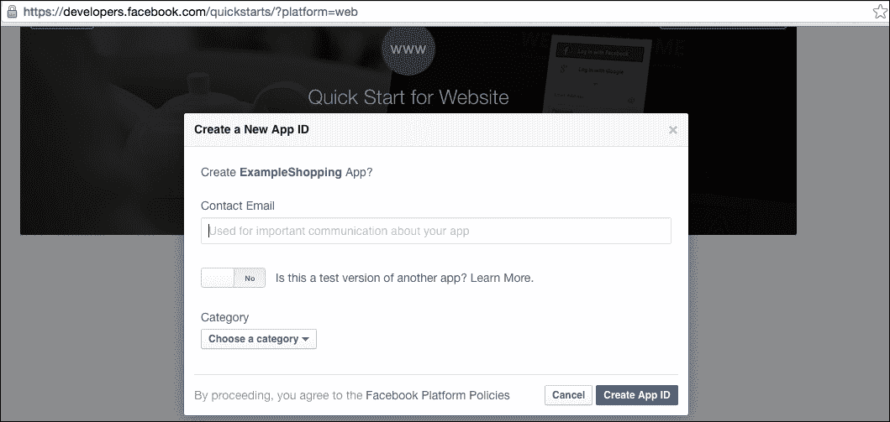
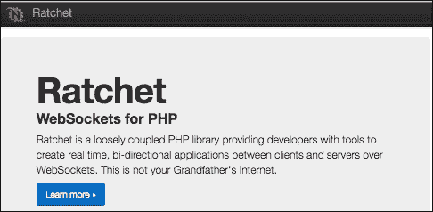
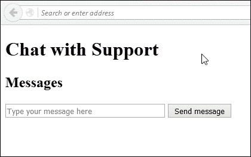

# 三、构建时事通讯服务

根据可靠的词典，时事通讯是定期向社会、企业或组织的成员发布的公告。

在本章中，我们将构建一个电子邮件时事通讯，允许会员订阅和取消订阅，接收特定类别的更新，还允许营销人员检查访问特定链接的人数。

我们将为我们的用户建立一个身份验证系统，以登录和注销时事通讯管理系统，这是一个社交登录系统，供订阅会员轻松检查其订阅，并为订阅者和管理员提供简单的仪表板。

# 认证系统

在本章中，我们将实现一个新的身份验证系统，以允许对新闻稿的管理员进行身份验证。自 PHP5 以来，PHP 已经改进并添加了一个面向对象开发人员用来分隔名称空间的特性。

让我们首先定义一个名为`Newsletter` 的名称空间，如下所示：

```php
<?php 
namespace Newsletter;  
//this must always be in every class that will use namespaces 
class Authentication { 
} 
?> 

```

在前面的示例中，我们的`Newsletter`命名空间将有一个`Authentication`类。当其他类或 PHP 脚本需要使用`Newsletter`的`Authentication`类时，可以使用以下代码简单声明：

```php
Use Newsletter\Authentication; 

```

在我们的`Newsletter`类中，让我们使用**bcrypt**为用户创建一个简单的检查，这是一种创建和存储散列密码的流行且安全的方法。

### 注

从 PHP5.5 开始，bcrypt 就内置在了`password_hash()`PHP 函数中。PHP 的`password_hash()`函数允许密码变成散列。相反，当您需要验证哈希值是否与原始密码匹配时，可以使用`password_verify()`函数。

我们的类将非常简单，它将有一个函数用于验证电子邮件地址，以及输入的哈希密码是否与数据库中的密码相同。我们必须创建一个简单的类，该类只有一个方法`verify()`，它接受用户的电子邮件和密码。我们将使用`bcrypt`验证哈希密码是否与我们数据库中的密码相同：

```php
Class Authorization { 
     public function verify($email, $password) { 
         //check for the $email and password encrypted with bcrypt 
         $bcrypt_options = [ 
            'cost' => 12, 
            'salt' => 'secret' 
         ]; 
         $password_hash = password_hash($password, PASSWORD_BCRYPT, $bcrypt_options); 
         $q= "SELECT * FROM users WHERE email = '". $email. "' AND password = '".$password_hash. "'"; 
         if($result = $this->db->query($q)) { 
                     while ($obj = results->fetch_object()) { 
                           $user_id = $obj->id; 
} 

         } else { 
   $user_id = null; 
} 
         $result->close(); 
         $this->db->close(); 
         return $user_id; 

    } 
} 

```

然而，我们需要让`DB`类能够对我们的数据库进行简单的查询。对于这个简单的一次性项目，我们可以在`Authentication`类中简单地使用依赖注入的概念。

我们应该创建一个相当简单的 IOC 容器类，它允许我们同时实例化数据库。

我们称之为`DbContainer`，它允许我们连接一个类，比如`Authentication`到`DB`类：

```php
Namespace Newsletter; 
use DB; 
Class DbContainer { 
   Public function getDBConnection($dbConnDetails) {  
   //connect to database here: 
    $DB = new \DB($server, $username, $password, $dbname); 
       return $DB; 
  } 
} 

```

但是，如果您立即使用此函数，则会出现一个错误，说明文件无法找到，并将加载`DB`类。

以前，我们使用了`use`系统来要求类。为了让它工作，我们需要创建一个自动加载函数来加载我们的`DB`类，而不必使用`require`语句。

在 PHP 中，我们可以创建`spl_autoload_register`函数，它将自动处理所需的文件。

以下是基于 PHP 手册中的示例的示例实现：

```php
<?php 
/** 
 * After registering this autoload function with SPL, the following line 
 * would cause the function to attempt to load the \Newsletter\Qux class 
 * from /path/to/project/src/Newsletter/Qux.php: 
 *  
 *      new \Newsletter\Qux; 
 *       
 * @param string $class The fully-qualified class name. 
 * @return void 
 */ 
spl_autoload_register(function ($class) { 
    // project-specific namespace prefix 
    $prefix = 'Newsletter'; 
    // base directory for the namespace prefix 
    $base_dir = __DIR__ . '/src/'; 
    // does the class use the namespace prefix? 
    $len = strlen($prefix); 
    if (strncmp($prefix, $class, $len) !== 0) { 
        // no, move to the next registered autoloader 
        return; 
    } 
    // get the relative class name 
    $relative_class = substr($class, $len); 
    // replace the namespace prefix with the base directory,               //replace namespace 
    // separators with directory separators in the relative class      //name, append 
    // with .php 
    $file = $base_dir . str_replace('', '/', $relative_class) . '.php'; 
    // if the file exists, require it 
    if (file_exists($file)) { 
        require $file; 
    } 
}); 

```

使用前面的代码，我们现在需要创建一个`src`目录，并使用此分隔符`\\`约定来分隔应用程序中的文件夹结构。

使用这个示例意味着我们需要将数据库类文件`DB.class.php`放在`src`文件夹中，并将文件名重命名为`DB.php`。

这样做的目的是，当您指定要在另一个 PHP 脚本中使用`DB`类时，PHP 只需在后台自动执行`require src/DB.php`。

继续我们的示例`DbContainer`，我们需要以某种方式在`DbContainer`中传递所有配置信息（即数据库名称、用户名和 MySQL 数据库密码）。

让我们简单地创建一个包含数据库详细信息的文件`dbconfig.php`，并将其作为对象返回，并要求它：

```php
//sample dbconfig.php 
return array('server' => 'localhost', 
  'username' => 'root', 
  'password => '', 
  'dbname' => 'newsletterdb' 
); 

```

在我们的`DbContainer`类中，让我们创建一个`loadConfig()`函数，该函数读取`dbconfig.php`文件并实例化一个数据库连接：

```php
Class DbContainer { 
public function  loadConfig ($filePath) { 

   if($filePath) { 
     $config = require($filePath); 
     return $config; //contains the array  
   } 

} 

```

现在我们需要创建一个`connect()`方法，它将使我们能够简单地连接到 MySQL 数据库，并且只返回连接：

```php
Class DB { 
 //... 
public function connect($server, $username, $password, $dbname) { 
   $this->connection = new MySQLI($server, $username, $password, $dbname); 
     return $this->connection; 
} 
} 

```

我们没有将文件名硬编码到函数中，从而使函数变得灵活。调用`loadConfig()`时，需要将`config`文件的路径放入加载。

我们还使用了`$this`关键字，所以当我们需要引用`DB`类中的其他函数时，我们只需在自动加载程序加载后调用`$DB->nameOfMethod(someParams)`，并在您调用`$DB = new \DB()`时自动实例化`DB`类即可。

这样，我们现在可以灵活地更改`config`文件的路径，以防将`config`文件移动到其他路径，例如，无法通过 Web 直接访问的文件夹。

然后，我们可以很容易地使用这个函数，在一个单独的类中生成一个数据库实例，例如，在我们的`Newsletter`类中，我们现在可以引用`DB`类连接的一个实例，并在`Newsletter`类中实例化它。

现在我们已经完成了，我们应该简单地创建一个引导文件，将`spl_autoload_register`函数和`dbContainer`连接一起加载到数据库。让我们将文件命名为`bootstrap.php`，它应该包含以下内容：

```php
require('spl_autoloader_function.php'); 

$dbContainer = new \DBContainer; //loads our DB from src folder, using the spl_autoload_functionabove. 

$dbConfig = $db->getConfig('dbconfig.php'); 

$dbContainer = getDB($dbConfig); //now contains the array of database configuration details 

```

下一步是使用以下代码连接到数据库：

```php
$DB = new \DB;  
$DBConn = $DB->connect($dbContainer['server'],$dbContainer['username'],$dbContainer['password'],$dbContainer['dbname']); 

```

在我们都连接到数据库之后，我们需要重写授权查询以使用新的初始化类。

让我们在`DB`类中创建一个简单的`select_where`方法，然后从`Authorization`类调用它：

```php
public function select_where($table, $where_clause) { 
   return $this->db->query("SELECT * FROM ". $table." WHERE " . $where_clause); 
} 

```

`Authorization`类现在如下所示：

```php
Class Authorization { 
    //this is used to get the database class into Authorization  
    Public function instantiateDB($dbInstance){ 
       $this->db = $dbInstance; 
    } 

    public function verify($email, $password) { 
         //check for the $email and password encrypted with bcrypt 
         $bcrypt_options = [ 
            'cost' => 12, 
            'salt' => 'secret' 
         ]; 
         $password_hash = password_hash($password, PASSWORD_BCRYPT, $bcrypt_options); 
         //select with condition 
         $this->db->select_where('users', "email = '$email' AND password = '$password_hash'"); 
         if($result = $this->db->query($q)) { 
                     while ($obj = results->fetch_object()) { 
                           $user_id = $obj->id; 
} 

         } else { 
   $user_id = null; 
} 
         $result->close(); 
         $this->db->close(); 
         return $user_id; 

    } 
} 

```

## 为会员创建社交登录

为了让更多的人轻松订阅，我们将实现一种方法，让 Facebook 用户只需登录并订阅我们的时事通讯，而无需键入他们的电子邮件地址。

通过 Facebook 登录可通过**Oauth**工作。第一步是通过转到[生成应用程序身份验证令牌 https://developers.facebook.com/](https://developers.facebook.com/) 。

你应该看到你的应用列表，或者点击要创建的应用。您应该会看到类似于以下屏幕截图的内容：


您应该首先创建一个应用程序，并通过访问应用程序创建页面获取您的应用程序 ID 和应用程序机密，类似于以下屏幕截图：



在创建新应用程序时，Facebook 现在为您提供了一种测试该应用程序 ID 的方法。

这就是它看起来的样子：


这是为了测试应用程序 ID 是否有效。它是可选的，您可以跳过该步骤，只需将应用 ID 和应用机密的值插入前面屏幕截图中显示的代码中即可。

现在，让我们创建`fbconfig.php`文件，该文件将包含一种使用 Facebook SDK 库启用会话的方法。

`fbconfig.php`脚本将包含以下内容：

```php
<?php 
session_start(); 
$domain = 'http://www.socialexample.info'; 
require_once 'autoload.php'; 

use FacebookFacebookSession; 
use FacebookFacebookRedirectLoginHelper; 
use FacebookFacebookRequest; 
use FacebookFacebookResponse; 
use FacebookFacebookSDKException; 
use FacebookFacebookRequestException; 
use FacebookFacebookAuthorizationException; 
use FacebookGraphObject; 
use FacebookEntitiesAccessToken; 
use FacebookHttpClientsFacebookCurlHttpClient; 
use FacebookHttpClientsFacebookHttpable; 

// init app with app id and secret (get from creating an app) 
$fbAppId = '123456382121312313'; //change this. 
$fbAppSecret = '8563798aasdasdasdweqwe84'; 
FacebookSession::setDefaultApplication($fbAppId, $fbAppSecret); 
// login helper with redirect_uri 
    $helper = new FacebookRedirectLoginHelper($domain . '/fbconfig.php' ); 
try { 
  $session = $helper->getSessionFromRedirect(); 
} catch( FacebookRequestException $ex ) { 
echo "Hello, sorry but we've encountered an exception and could not log you in right now"; 
} catch( Exception $ex ) { 
  // Tell user something has happened 
  echo "Hello, sorry but we could not log you in right now";       
} 
// see if we have a session 
if ( isset( $session ) ) { 
  // graph api request for user data 
  $request = new FacebookRequest( $session, 'GET', '/me' ); 
  $response = $request->execute(); 
  // get response 
//start a graph object with the user email 
  $graphObject = $response->getGraphObject(); 
  $id = $graphObject->getProperty('id');  
  $fullname = $graphObject->getProperty('name');  
  $email = $graphObject->getProperty('email'); 

     $_SESSION['FB_id'] = $id;            
     $_SESSION['FB_fullname'] = $fullname; 
     $_SESSION['FB_email'] =  $email; 

//save user to session 
     $_SESSION['UserName'] = $email; //just for demonstration purposes 
//redirect user to index page        
    header("Location: index.php"); 
} else { 
  $loginUrl = $helper->getLoginUrl(); 
 header("Location: ".$loginUrl); 
} 
?> 

```

在这里，我们基本上以`session_start()`开始一个会话，并通过将其保存到变量中来设置我们网站的域。然后我们自动加载 FBSDK，这将需要 Facebook 所需的文件和类来访问其 API 进行登录。

然后，我们使用`use`关键字在其他 Facebook SDK 类上建立了几个依赖项。我们使用 app ID 和 app secret 设置了`facebookSession`类，然后尝试通过调用`getSessionfromRedirect()`方法启动会话。

如果在尝试启动会话时发现任何错误，我们只需让用户知道我们无法让他登录，但如果一切顺利进行，我们将使用用户的电子邮件启动一个图形对象。

出于演示目的，我们保存了一个用户名，该用户名实际上是用户在使用 Facebook 图获得电子邮件后的电子邮件地址。

我们将通过检查每个人的电子邮件地址来验证他们的身份，为了让用户更容易登录，让我们将他们的电子邮件存储为用户名。

我们需要用`index.php`来完成我们的网站，向用户显示我们网站的内部内容。从 Facebook 页面登录后，我们将用户重定向到`index.php`页面。

我们现在将保持简单，并显示登录用户的 Facebook 个人资料中的全名。我们将添加注销链接，为用户提供注销选项：

```php
<?php 
session_start();  
?> 
<!doctype html> 
<html xmlns:fb="http://www.facebook.com/2008/fbml"> 
  <head> 
    <title>Login to SocialNewsletter.com</title> 
<link href=" https://maxcdn.bootstrapcdn.com/bootstrap/3.3.6/css/bootstrap.min.css" rel="stylesheet">  
 </head> 
  <body> 
  <?php if ($_SESSION['FB_id']): ?>      <!--  After user login  --> 
<div class="container"> 
<div class="hero-unit"> 
  <h1>Hello <?php echo $_SESSION['UserName']; ?></h1> 
  <p>How to login with PHP</p> 
  </div> 
<div class="span4"> 
 <ul class="nav nav-list"> 
<li class="nav-header">FB ID: <?php echo $_SESSION['FB_id']; ?></li> 
<li> Welcome <?php echo $_SESSION['FB_fullName']; ?></li> 
<div><a href="logout.php">Logout</a></div> 
</ul></div></div> 
    <?php else: ?>     <!-- Before login -->  
<div class="container"> 
<h1>Login with Facebook</h1> 
           Not Connected with Facebook. 
<div> 
      <a href="fbconfig.php">Login with Facebook</a></div> 
      </div> 
    <?php endif ?> 
  </body> 
</html> 

```

登录后，我们只需为用户显示仪表板。我们将在下一节讨论如何为用户创建基本仪表板。

## 会员仪表板

最后，当会员登录我们的应用程序后，他们现在可以使用会员订阅页面订阅时事通讯。让我们首先构建用于存储成员详细信息及其订阅的数据库。`member_details`表将包括以下内容：

*   `firstname`和`lastname`：用户的真实姓名
*   `email`：能够给用户发送电子邮件
*   `canNotify`：布尔值（true 或 false），如果他们接受关于其他优惠的电子邮件通知

### 提示

这里有一些关于 MySQL 中的布尔类型的有趣内容。当您创建一个使用布尔值（true 或 false）的字段时，MySQL 实际上只是将其别名为`TINYINT(1)`。布尔值基本上是 0 表示 false，1 表示 true。更多信息请参考[http://dev.mysql.com/doc/refman/5.7/en/numeric-type-overview.html](http://dev.mysql.com/doc/refman/5.7/en/numeric-type-overview.html) 。

`member_details`表将处理此问题，并将使用以下 SQL 代码创建此表：

```php
CREATE TABLE member_details(  
  id INT(11) PRIMARY KEY AUTO_INCREMENT, 
  firstname VARCHAR(255), 
  lastname VARCHAR(255), 
  email VARCHAR(255), 
  canNotify TINYINT(1), 
  member_id INT(11) 
); 

```

登录时，我们的成员将存储在`users`表中。让我们使用以下 SQL 代码创建它：

```php
CREATE TABLE users ( 
   id INT(11) PRIMARY KEY AUTO_INCREMENT 
   username VARCHAR(255), 
   password VARCHAR(255), 
); 

```

现在，构建一个视图，向我们的成员显示我们拥有的所有不同订阅。我们通过检查表`subscriptions`来实现这一点。`subscriptions`表模式定义如下：

*   ``id` Int(11)`：这是`subscriptions`表的主键，设置为`AUTO_INCREMENT`
*   `newsletter_id Int(11)`：这是他们订阅的`newsletter_id`
*   `active BOOLEAN`：表示用户当前是否已订阅（默认 1）

使用 SQL，它将如下所示：

```php
CREATE TABLE subscriptions ( 
  `id` INT(11) PRIMARY KEY AUTO_INCREMENT, 
  `newsletter_id` INT(11) NOT NULL, 
  `member_id` INT(11) NOT NULL, 
  `active` BOOLEAN DEFAULT true 
); 

```

我们还必须创建`newsletters`表，该表将以 JSON 格式保存所有时事通讯、其模板和内容。通过在我们的数据库中使用 JSON 作为存储格式，现在应该可以很容易地从数据库中获取数据，并将 JSON 解析为适当的值以插入到我们的模板中。

因为我们的新闻稿将存储在数据库中，所以我们需要为它创建适当的 SQL 模式。这就是它的设计方式：

*   `Id INT(11)`：在数据库中为我们的时事通讯编制索引
*   `newsletter_name (Text)`：我们时事通讯的标题
*   `newsletter_count INT(11)`：记录我们特定时事通讯的版本

*   `Status (String)`：记录我们的时事通讯的状态，如果它已经发布、未发布或待发布
*   `Slug (String)`：能够在我们的社交时事通讯网站上通过浏览器查看时事通讯
*   `Template (Text)`：存储 HTML 模板
*   `Content (Text)`：存储将进入我们 HTML 模板的数据
*   `Published_at (Date)`：记录出版日期
*   `Created_at (Date)`：记录新闻稿首次创建的时间
*   `Updated_at (Date)`：记录某人上次更新时事通讯的时间

用于此操作的 SQL 如下所示：

```php
CREATE TABLE newsletters ( 
id INT(11) PRIMARY KEY AUTO_INCREMENT, 
newsletter_name (TEXT), 
newsletter_count INT(11) NOT NULL DEFAULT '0', 
marketer_id INT(11) NOT NULL, 
is_active TINYINT(1), 
created_at DATETIME, 

); 

```

当用户取消订阅时，这将有助于表明他们以前订阅过此新闻稿。这就是为什么我们要存储一个`active`字段，这样当他们取消订阅时，我们只需将其设置为 0，而不是删除记录。

`marketer_id`将用于未来的管理部分，我们将提到负责管理时事通讯订阅的人员。

时事通讯也可能有许多出版物，这些出版物将是发送到每个订阅的实际时事通讯。以下 SQL 代码用于创建发布：

```php
CREATE TABLE publications ( 
  newsleterId INT(11) PRIMARY KEY AUTO_INCREMENT, 
  status VARCHAR(25), 
  content TEXT, 
  template TEXT, 
  sent_at DATETIME, 
  created_at DATETIME, 
); 

```

现在，让我们在`Newsletter`类中构建方法，以选择登录成员订阅以显示在仪表板中：

```php
Class Dashboard { 
  public function getSubscriptions($member_id) { 
  $query = $db->query("SELECT * FROM subscriptions, newsletters WHERE subscriptions.member_id ='". $member_id."'"); 
  if($query->num_rows() > 0) { 
      while ($row = $result->fetch_assoc()) { 
          $data  = array(  
            'name' => $row->newsletter_name,  
            'count' => $row->newsletter_count, 
            'mem_id' => $row->member_id,  
            'active' => $row->active 
         ); 
      } 
      return $data; 
  }  
} 
} 

```

根据前面的代码，我们只创建了一个函数，该函数将获取给定成员 ID 的订阅。首先，我们创建`"SELECT * FROM subscriptions, newsletters WHERE subscriptions.member_id ='". $member_id."`查询。之后，我们使用 MySQLi result 对象的`fetch_assoc()`方法循环查询结果。现在我们已经将其存储在`$data`变量中，我们返回变量，在下面的代码中，我们通过调用以下函数在表中显示数据：

```php
 $member_id = $_SESSION['member_id']; 
 $dashboard = new Dashboard; 
 $member_subscriptions = $dashboard->getSubscriptions($member_id); 
 ?> 
  <table> 
    <tr> 
      <td>Member Id</td><td>Newsletter Name</td><td>Newsletter count</td><td>Active</td> 
     </tr> 
<?php 
 foreach($member_subscriptions as $subs) { 
    echo '<tr> 
     <td>'. $subs['mem_id'] . '</td>' .  
     '<td>' . $subs['name'].'</td>' .  
     '<td>' . $subs['count'] . '</td>'. 
     '<td>' . $subs['active'] . '</td> 
     </tr>'; 
 } 
 echo '</table>'; 

```

## 营销人员仪表盘

我们的营销人员管理他们拥有的每一份时事通讯，他们将能够登录到我们的系统，并能够查看订阅了多少会员及其电子邮件地址。

这将是一个管理系统，使营销人员能够更新成员的记录，查看最近的订阅，并允许营销人员向其新闻稿的任何成员发送自定义电子邮件。

我们将有一个名为`marketers`的表，其中包含以下字段：

*   `id`：存储索引
*   营销商名称：存储营销商的名称
*   营销者电子邮件：存储营销者的电子邮件地址
*   营销商密码：存储营销商的登录密码

我们创建上述字段的 SQL 很简单：

```php
CREATE TABLE marketers ( 
id INT(11) AUTO_INCREMENT, 
marketer_name VARCHAR(255) NOT NULL, 
marketer_email VARCHAR(255) NOT NULL, 
marketer_password VARCHAR(255) NOT NULL, 

PRIMARY KEY `id`  
); 

```

在另一个表中，我们将定义营销人员与其管理的新闻稿之间的多对多关系。

我们需要一个`id`作为索引，一个是拥有新闻稿的营销人员的 ID，一个是由营销人员拥有的新闻稿的 ID。

创建此表的 SQL 语句如下所示：

```php
CREATE TABLE newsletter_admins ( 
  Id INT(11) AUTO_INCREMENT, 
  marketer_id INT(11) , 
  newsletter_id INT(11), 
  PRIMARY KEY `id`, 
); 

```

现在，让我们构建一个查询，用于获取他们拥有的新闻稿的管理员。这将是一个简单的类，我们将在其中引用所有数据库函数：

```php
<?php  
class NewsletterDb { 
public $db; 

function __construct($dbinstance) { 
$this->db = $dbinstance; 
} 

//get admins = marketers 
public function get_admins ($newsletter_id) { 
$query = "SELECT * FROM newsletter_admins LEFT JOIN marketers ON marketers.id = newsletter_admins.admin_id.WHERE newsletters_admins.newsletter_id = '".$newsletter_id."'"; 
  $this->db->query($query); 
} 
} 

```

### 营销人员管理制度

我们需要一种方式让营销人员登录并通过密码验证。我们需要一个管理员的方式来创建帐户，并注册一个营销人员和他们的新闻稿。

让我们先构建那个部分。

在我们的管理视图中，我们需要设置默认值，并为执行的每个操作请求经过身份验证的密码。这是我们不需要存储在数据库中的东西，因为只有一个管理员。

在我们的`config`/`admin.php`文件中，我们将定义用户名和密码如下：

```php

<?php 
$admin_username = 'admin'; 
$password = 'test1234'; 
?> 

```

然后，我们只需在登录页面`login.php`中包含该文件。我们只需检查它。登录页面的代码如下所示：

```php
<html> 
<?php  
if(isset($_POST['username']) && isset($_POST['password'])) { 
  //check if they match then login 
  if($_POST['username'] == $admin_username  
    && $_POST['password'] == $password) { 
   //create session and login 
   $_SESSION['logged_in'] = true; 
   $_SESSION['logged_in_user'] = $admin_username; 
      header('http://ourwebsite.com/admin/welcome_dashboard.php'); 
 } 
 ?> 
} 
</html> 

```

请注意，我们必须正确设置我们的网站 URL，这取决于我们在哪里开发它。在前面的示例中，页面将重定向到[http://ourwebsite.com/admin/welcome_dashboard.php](http://ourwebsite.com/admin/welcome_dashboard.php) 登录后。我们可以创建变量来存储域和要重定向到的 URL 片段，以便这可以是动态的；请参见以下示例：

```php
$domain = 'http://ourwebsite.com'; 
$redirect_url = '/admin/welcome_dashboard.php'; 
header($domain . $redirect_url); 

```

登录后，我们需要构建一个简单的 CRUD（创建、读取、更新、删除）系统来管理将管理其新闻稿的营销人员。

以下是获取营销人员列表及其管理的新闻稿的代码：

```php
Function get_neewsletter_marketers() { 
  $q = "SELECT * FROM marketers LEFT JOIN newsletters '; 
  $q .= "WHERE marketers.id = newsletters.marketer_id"; 

  $res = $db->query($q); 

  while ($row = $res->fetch_assoc()) { 
   $marketers = array( 
     'name' => $row['marketer_name'], 
     'email' => $row['marketer_email'], 
     'id' => $row['marketer_id'] 
    ); 
  } 
  return $marketers; 
} 

```

我们需要添加一种编辑、创建和删除营销人员的方法。让我们创建一个`dashboard`/`table_header.php`以包含在脚本顶部。

以下是`table_header.php` 代码的样子：

```php
<table> 
<tr> 
 <th>Marketer Email</th> 
  <th>Edit</th> 
 <th>Delete</th> 
</tr> 

```

我们现在将创建一个`for()`循环，通过每个营销人员进行循环。让我们创建一种方法，通过数据库中的所有营销人员进行选择。首先，让我们调用函数来获取数据：

```php
$marketrs = get_newsletter_marketers(); 

```

然后，让我们使用一个`foreach()`循环来循环所有营销人员：

```php
foreach($marketers as $marketer) { 
  echo '<tr><td>'. $marketer['email'] .'</td> 
   <td><a href="edit_marketer.php?id='. $marketer['id'].'">Edit</a></td> 
  <td><a href="delete_marketer.php">delete</td> 
  </tr>'; 
} 
echo '</table>'; 

```

然后，我们用一个结束元素结束代码，该元素用于带有`</table>`的表。

让我们创建`delete_marketer.php`脚本和`edit_marketer.php`脚本。以下是删除脚本：

```php
function delete_marketer($marketer_id) { 
  $q = "DELETE FROM marketers WHERE marketers.id = '" .   $marketer_id . "'"; 
   $this->db->query($q); 
} 
$marketer_id = $_GET['id']; 
delete_marketer($marketer_id); 

```

以下是由表单组成的编辑脚本，该表单将在提交后更新数据：

```php
if(empty($_POST['submit'])) { 
  $marketer_id = $_GET['id']; 
  $q = "SELECT * FROM marketers WHERE id = '" . $marketer_id."'"; 

 $res = $db->query($q); 

  while ($row = $res->fetch_assoc()) { 
   $marketer = array( 
     'name' => $row['marketer_name'], 
     'email' => $row['marketer_email'], 
     'id' => $row['id'] 
    ); 
  } 

  ?> 
  <form action="update_marketer.php" method="post"> 
   <input type="hidden" name="marketer_id" value="<?php echo $marketer['id'] ?>"> 
   <input type="text" name="marketer_name" value="<?php echo $marketer['name'] ?>"> 
   <input type="text" name="marketer_email" value="<?php echo $marketer['email'] ?>"> 
  <input type="submit" name="submit" /> 
</form> 
  <?php 

  } else { 
     $q = "UPDATE marketers SET marketer_name='" . $_POST['marketer_name'] . ", marketer_email = '". $_POST['marketer_email']."' WHERE id = '".$_POST['marketer_id']."'"; 
   $this->db->query($q); 
   echo "Marketer's details has been updated"; 
  } 
?> 

```

## 为我们的新闻稿定制模板

每个营销人员都需要展示他们的时事通讯。在我们的例子中，我们可以让他们创建一个简单的边栏时事通讯和一个简单的自上而下的时事通讯。要构建一个简单的侧栏，我们可以创建如下所示的 HTML 模板：

```php
<html> 
<!doctype html> 

<sidebar style="text-align:left"> 
{{MENU}} 
</sidebar> 

<main style="text-align:right"> 
   {{CONTENT}} 
</main> 
</html> 

```

在前面的代码中，我们使用内嵌标记为 HTML 电子邮件设置样式，这仅仅是因为一些电子邮件客户端不呈现从 HTML 外部引用的样式表。

我们可以使用**regex**用数据替换`{{MENU}}`和`{{CONTENT}}`模式来填充它们。

我们的数据库将内容存储为 JSON，一旦我们解析 JSON，我们将有内容和菜单数据插入到各自的位置。

在我们的数据库中，我们需要添加`newsletter_templates`表。以下是我们将如何创建它：

```php
CREATE TABLE newsletter_templates ( 
 Id INT(11) PRIMARY KEY AUTO_INCREMENT, 
Newsletter_id INT(11) NOT NULL, 
   Template TEXT NOT NULL, 
   Created_by INT(11) NOT NULL   
) ENGINE=InnoDB; 

```

有了模板，我们需要一种方法让营销人员更新模板。

在仪表板中，我们将显示新闻稿的模板列表。

让我们按如下方式创建表单：

```php
$cleanhtml = htmlentities('<html> 
<!doctype html> 

<sidebar style="text-align:left"> 
{{MENU}} 
</sidebar> 

<main style="text-align:right"> 
   {{CONTENT}} 
</main> 
</html> 
'); 
<form> 
   <h2>Newsletter Custom Template</h2> 
  <textarea name="customtemplate"> 
<?php echo $cleanhtml; ?> 
</textarea> 
  <input type="submit" value="Save Template" name="submit"> 
  </form> 

```

我们还通过向`textarea`添加值来填充它。注意，在前面的代码中，我们需要首先使用`htmlentities`清理模板的 HTML 代码。这是因为我们的 HTML 可能会被解释为网页的一部分，在浏览器呈现时会导致问题。

我们现在一切就绪，以便我们的时事通讯发送实际的时事通讯。要进行发送，我们需要创建一个脚本，该脚本将循环发送新闻稿中的所有成员，然后只需使用 PHP 邮件函数发送它们。

使用 PHP 邮件功能，我们只需循环浏览数据库中的所有时事通讯成员。

这就是该脚本的外观：

```php
$template = require('template.class.php'); 
$q = "SELECT * FROM newsletter_members WHERE newsletter_id = 1"; //if we're going to mail newsletter #1  
$results = $db->query($q); 
While ($rows =$results->fetch_assoc() ) { 
  //gather data  
  $newsletter_title = $row['title']; 
  $member_email = $row['template']; 
  $menu = $row['menu']; //this is a new field to contain any menu html 
  $content = $row['content']; 
  $content_with_menu = $template->replace_menu($menu, $content); 
  $emailcontent = $template->         replace_contents($content,$content_with_menu); 
  //mail away! 
  mail($member_email, 'info@maillist.com', $newsletter_title ,$email_content); 
} 

```

我们需要完成`replace_menu`和`replace_contents`功能。让我们简单地构建文本替换函数，该函数将替换前面代码中已经获取的内容。数据来自数据库中的新闻稿表：

```php
class Template { 
   public function replace_menu($menu, $content) { 
     return  str_replace('{{MENU}}', $menu, $content); 
   } 
   public function replace_contents ($actualcontent, $content) { 
    return str_replace('{{CONTENT}}', $actualcontent,  $content); 
   }  
} 

```

请注意，我们修改了我们的表格，使其在时事通讯中有一个菜单。此菜单必须由用户创建，并带有 HTML 标记。它基本上是一个链接的 HTML 列表。菜单的正确标记应如下所示：

```php
<ul> 
  <li><a href="http://someUrl.com">some URL</a></li> 
<li><a href="http://someNewUrl.com">some new URL</a></li> 
<li><a href="http://someOtherUrl.com">some other URL</a></li> 
</ul> 

```

## 链路跟踪

对于我们的链接跟踪系统，我们需要允许营销人员嵌入链接，这些链接实际上通过我们的系统，以便我们跟踪链接上的点击次数。

我们将要做的实际上是创建一个服务，它将自动将我们输入的链接缩短为随机散列。URL 看起来像`http://example.com/link/xyz123`，散列`xyz123`将存储在我们的数据库中。当用户访问该链接时，我们将匹配该链接。

让我们创建 links 表并创建一个函数来帮助我们生成缩短的链接。至少，我们需要能够存储链接的标题、实际链接、缩短的链接以及谁创建了链接，以便我们可以将其放在营销人员的仪表板上。

链接表的 SQL 如下所示：

```php
CREATE TABLE links ( 
   id INT(11) PRIMARY KEY AUTO_INCREMENT, 
   link_title TEXT NOT NULL, 
   actual_link TEXT, 
   shortened_link VARCHAR(255), 
   created DATETIME, 
   created_by INT(11) 
); 

```

现在，让我们创建以下函数，它将生成一个随机散列：

```php
public function createShortLink($site_url,$title, $actual_url,$created_by) { 
    $created_date = date('Y-m-d H:i:s'); 
  $new_url = $site_url . "h?=" . md5($actual_url); 
  $res = $this->db->query("INSERT INTO links VALUES (null, $title ,'". $actual_url. "', '". $new_url.", '". $created_date."','".$created_by."'"),; 
  )); 
   return $res; 
} 

```

我们还需要存储链接的点击次数。我们将使用另一个表将`link_id`链接到点击数，我们将在每次有人使用缩短的链接时更新该表：

```php
CREATE TABLE link_hits ( 
   link_id INT(11), 
   num_hits INT(11) 
); 

```

我们不需要索引前面的 SQL 表，因为我们实际上不需要对它进行快速搜索。每次我们生成一个新的 URL 时，我们应该用默认为 0 的`num`点击数填充已经存在的表：

在`createShortLink`功能中增加以下功能：

```php
$res = $this->db->query("INSERT INTO links VALUES (null, '$actual_url',$title, '$new_url', '$created_date', '$created_by'"); 

$new_insert_id = $this->db->insert_id; 

$dbquery = INSERT INTO link_hits VALUES($new_insert_id,0); 

$this->db->query($dbquery); 

```

`insert_id`是 MySQL 最后一条插入记录的 ID。该函数返回每次添加新行时生成的新 ID。

让我们生成包含两个函数的链接命中类，一个用于初始化数据库，另一个用于在用户每次单击链接时更新`link_hits`表：

```php
Class LinkHit {       

     Public function __construct($mysqli) { 
          $this->db = $mysqli; 
      } 

   public function  hitUpdate ($link_id) { 

  $query = "UPDATE link_hits SET num_hits++ WHERE link_id='".    $link_id. "'"; 

   //able to update 
     $this->db->query($query)       
   } 

   Public function checkHit ($shorturl) { 
   $arrayUrl = parse_url($shortUrl); 
parse_str($parts['query'],$query); 
$hash = $query['h'];  

   $testQuery = $this->db->query("SELECT id FROM links WHERE shortened_link LIKE '%$hash%'"); 
   if($this->db->num_rows > 0) { 
         while($row = $testQuery->fetch_array() ) { 
   return $row['id']; 
          } 
   } else { 
     echo "Could not find shorted link"; 
     return null; 
  } 
} 

//instantiating the function: 
$mysqli = new mysqli('localhost','test_user','test_password','your_database'); 
$Link = new LinkHit($mysqli); 
$short_link_id = $Link->checkHit("http://$_SERVER[HTTP_HOST]$_SERVER[REQUEST_URI]"); 

if($short_link_id !== null) { 
  $link->hitUpdate($isShort); 
} 

```

为了让我们的营销人员查看链接，我们需要在门户网站的`links`页面上显示他们的链接。

我们创建了一个函数，用于检查登录的管理员用户的链接及其点击：

```php
$user_id = $_SESSION['user_id']; 
$sql = "SELECT * FROM links LEFT JOIN link_hits ON links.id = link_hits.link_id WHERE links.created_by='" . $user_id. "'"; 
$query = $mysqli->query($sql); 
?> 
<table> 
<tr> 
<td>Link id</td><td>Link hits</td></tr> 
<?php 
while($obj = $query->fetch_object()) { 
  echo '<tr><td>'.$obj->link.'</td> 
<td>' . $obj->link_hits.'</td></tr></tr>'; 
} 
?> 
</table> 

```

在前面的代码中，我们只是通过检查变量`$_SESSION['user_id']`来获取登录用户的 ID。然后我们通过执行字符串变量`$SQL`执行 SQL 查询。在此之后，我们循环遍历结果并将结果显示到 HTML 表中。请注意，当我们显示一个永久性的 HTML 标记（如表的开头、标题和`</table>`标记的结尾）时，我们将退出 PHP 代码。

PHP 在不使用 echo 语句的情况下性能稍好一些，这就是 PHP 脚本的美妙之处，您确实可以进入 PHP 部分，然后进入代码中的 HTML 部分。您可能对这个想法的美妙之处有不同的看法，但我们只是想展示一下 PHP 在这个练习中可以做什么。

## 支持 AJAX 套接字聊天

此系统允许订阅者联系特定新闻稿组的管理员。它将只包含一个联系人表单。此外，我们还需要实现一种向管理员实时发送通知的方法。

我们将基本上向管理员添加一个套接字连接，这样当有人发送查询时，它将在营销人员的仪表板上闪烁一个通知。

使用**socket.io**和一种称为 WebSocket 的浏览器技术，这非常简单。

### socket.io 简介

对于 socket.io，我们不需要创建代码来定期检查服务器上的事件。我们只需传递用户使用 AJAX 输入的数据，并通过发出事件来触发套接字的侦听器。它通过 WebSocket 提供长时间的轮询和通信，并受到现代 web 浏览器的支持。

### 注

WebSocket 扩展了通过浏览器进行套接字连接的概念。欲了解更多关于 WebSocket 的信息，请访问[http://www.html5rocks.com/en/tutorials/websockets/basics/](http://www.html5rocks.com/en/tutorials/websockets/basics/) 。

socket.io 站点上的示例代码仅包括`socket.io.js`脚本：

```php
<script src="socket.io/socket.io.js"></script> 

```

我们的 PHP Web 服务器将使用名为**棘轮**的东西，它的网站位于[http://socketo.me](http://socketo.me) 。它基本上允许我们将 WebSocket 用于 PHP。

这是他们的网站：



Ratchet 只是一个工具，允许 PHP 开发人员“*通过 WebSocket*在客户端之间创建实时、双向的应用程序”。通过创建双向数据流，它允许开发人员创建诸如实时聊天和其他实时应用程序之类的东西。

让我们按照他们在[上的教程开始 http://socketo.me/docs/hello-world](http://socketo.me/docs/hello-world) 。

使用 Ratchet，我们必须安装**Composer**，并将以下内容添加到我们项目目录中的`composer.json`文件中：

```php
{ 
    "autoload": { 
        "psr-0": { 
            "MyApp": "src" 
        } 
    }, 
    "require": { 
        "cboden/ratchet": "0.3.*" 
    } 
} 

```

如果您以前有使用 Composer 的经验，那么它基本上是使用`psr-0`标准来编写需要自动加载的脚本的路径。然后我们在同一个目录中运行`composer install`。设置 Ratchet 之后，我们需要设置适当的组件来处理某些事件。

我们需要创建一个名为`SupportChat`的文件夹，并将`Chat.php`放入其中。这是因为在前面的`composer.json`文件中使用 psr-0，它希望在`src`目录中有一个目录结构。

让我们用需要实现的存根函数创建一个类：

```php
namespace SupportChat; 
use Ratchet\MessageComponentInterface; 
use Ratchet\ConnectionInterface; 

class SupportChat implements MessageComponentInterface { 
  Protected $clients; 
  Public function __construct() { 
    $this->clients = new \SplObjectStorage; 
  } 
} 

```

我们需要声明`$clients`变量来存储将连接到聊天应用程序的客户端。

让我们实现客户端打开连接时的接口：

```php
Public function onOpen(ConnectionInterface $conn) { 
  $this->clients->attach($conn); 
  echo "A connection has been established"; 
} 

```

现在我们创建如下的`onMessage`和`onClose`方法：

```php
Public function onMessage (ConnectionInterface $from, $msg) { 
 foreach ($this->clients as $client) { 
        if ($from !== $client) { 
            $client->send($msg); 
        } 
    } 
} 

public function onClose(ConnectionInterface $conn) { 
$this->clients->detach($conn); 
} 

```

让我们创建一个`onError`方法来处理错误，如下所示：

```php
public function onError (ConnectionInterface $conn) { 
$this->clients->detach($conn); 
} 

```

现在我们需要实现应用程序的客户端（浏览器）。

在您的`htdocs`或`public`文件夹中创建名为`app.js`的文件，代码如下：

```php
var messages = []; 

// connect to the socket server 
var conn = new WebSocket('ws://localhost:8088'); 
conn.onopen = function(e) { 
   console.log('Connected to server:', conn); 
} 

conn.onerror = function(e) { 
   console.log('Error: Could not connect to server.'); 
} 

conn.onclose = function(e) { 
   console.log('Connection closed'); 
} 

// handle new message received from the socket server 
conn.onmessage = function(e) { 
   // message is data property of event object 
   var message = JSON.parse(e.data); 
   console.log('message', message); 

   // add to message list 
   var li = '<li>' + message.text + '</li>'; 
   $('.message-list').append(li); 
} 

// attach onSubmit handler to the form 
$(function() { 
   $('.message-form').on('submit', function(e) { 
         // prevent form submission which causes page reload 
         e.preventDefault(); 

         // get the input 
         var input = $(this).find('input'); 

         // get message text from the input 
         var message = { 
               type: 'message', 
               text: input.val() 
         }; 

         // clear the input 
         input.val(''); 

         // send message to server 
         conn.send(JSON.stringify(message)); 
   }); 
}); 

```

我们需要为前面要使用的代码创建 HTML。我们应该将文件命名为`app.js`。现在，让我们实现一个简单的输入文本，供用户输入消息：

```php
<!DOCTYPE html> 
<html> 
<head> 
   <title>Chat with Support</title> 
   <script src="https://cdnjs.cloudflare.com/ajax/libs/jquery/2.2.3/jquery.js"></script> 
   <script src="app.js"></script> 
</head> 
<body> 

   <h1>Chat with Support</h1> 

   <h2>Messages</h2> 
   <ul class="message-list"></ul> 
   <form class="message-form"> 
         <input type="text" size="40" placeholder="Type your message here" /> 
         <button>Send message</button> 
   </form> 
</body> 
</html> 

```

`App.js`是我们前面编写的 JavaScript 代码应该去的地方。我们还需要创建一个 WebSocket 服务器来处理端口`8088`上的 WebSocket：

```php

<?php 
// import namespaces 
use Ratchet\Server\IoServer; 
use Ratchet\WebSocket\WsServer; 
use SupportChat\Chat; 

// use the autoloader provided by Composer 
require dirname(__DIR__) . '/vendor/autoload.php'; 

// create a websocket server 
$server = IoServer::factory( 
    new WsServer( 
        new Chat() 
    ) 
    , 8088 
); 

$server->run(); 

```

我们的聊天应用现在可以供公众使用了。但是，我们需要启动聊天服务器，它将通过启动`php bin/server.php`来处理 WebSocket。

请注意，在 Windows 上，它将提示正在使用的网络：


只需点击**允许访问**，然后点击**确定**。

现在当我们访问`http://localhost/client.html`时，我们应该看到以下内容：



但是，我们需要通过添加用户名和支持电子邮件来增加联系表单，以便通过电子邮件回复他，以防支持部门没有人回复用户。

我们的表格如下所示：

```php
<form class="message-form" id="chatform"> 
         <input type="text" name="firstname" size="25" placeholder="Your Name"> 
         <input type="text" name="email" size="25" placeholder="Email"> 

         <input type="text" name="message" size="40" placeholder="Type your message here" /> 
         <button>Send message</button> 
   </form> 

```

因为我们已经添加了这些细节，所以我们需要将它们存储在数据库中。我们可以通过将所有数据转发到另一个 PHP 脚本来完成发送。在 JavaScript 中，代码将向处理程序添加一种方式，将表单中的值发送给`sendsupportmessage.php`。

下面是使用 jQuery 的 JavaScript 代码的外观：

```php
<script> 
$(document).ready(function() { 
   $('submit').on('click', function() { 
     $.post('sendsupportmessage.php', $("#chatform").serialize()) 
       .done(function(data) { 
         alert('Your message has been sent'); 
      }); 
   }); 
}); 
</script> 

```

在接收消息的脚本`sendsupportmessage.php`中，我们需要解析信息并创建一封电子邮件发送到支持电子邮件`contact@yoursite.com`；请参见以下示例：

```php
<?php 
  if( !empty($_POST['message'])) { 
    $message = htmlentities($_POST['message']); 
  } 

  if( !empty($_POST['email'])) { 
    $email = htmlentities($_POST['email']); 
  } 

  if( !empty($_POST['firstname']) ) { 
    $firstname = htmlentities($_POST['firstname']); 
  }  

  $emailmessage = 'A support message from ' . $firstname . '; 
  $emailmessage .=  ' with email address: ' . $email . '; 
  $emailmessage .= ' has been received. The message is '. $message; 

   mail('contact@yoursite.com', 'Support message', $emailmessage);  

  echo "success!"; 
?> 

```

脚本只是检查提交的值是否为空。根据经验，使用`!empty ()`而不是使用`isset()`函数检查设置值会更好，因为 PHP 可能会评估空字符串（`''`仍被设置：

```php
$foo = ''; 
if(isset($foo)) { print 'But no its empty'; } 
else { print 'PHP7 rocks!'; } 

```

我们现在需要在使用 AJAX 向服务器发送消息时向用户显示，并更新 AJAX 框。在 JavaScript 代码中，我们应该将`.done()`回调代码更改为：

```php
.done(function(data) { 
   if(data === 'succcess!') { 
     var successHtml = '<li>Your message was sent</li>'; 
     $('.message-list').append(successHtml); 

   } 
      } 

```

好极了请注意，我们更改了警报框调用，而是将消息`Your message was sent`追加回消息列表中。我们的支持表单现在发送消息来自谁，我们的支持团队可以在他们的电子邮件中接收消息。

# 总结

你在这一章学到了很多。总之，我们建立了一个简单的管理系统来管理我们的营销人员。在这之后，我们还为时事通讯的成员创建了一种登录方式，将用户引导到主页。

然后，我们回顾了如何使用简单的模板系统发送电子邮件，该模板系统允许用户将自己的菜单和内容添加到布局中。我们还可以使用 Facebook PHP SDK 及其身份验证过程添加 Facebook 社交登录。

在本章的后半部分，我们构建了一个简单的聊天系统，它将立即向我们网站的支持电子邮件地址发送电子邮件。我们查看了 Ratchet，这是一个 PHP 库，帮助我们在 PHP 中处理实时消息，并使用 AJAX 将数据异步发送到另一个脚本，该脚本将向支持电子邮件发送电子邮件。

我们现在创建了一个令人印象深刻的时事通讯应用程序，它比常规应用程序更具社交登录功能和支持聊天框，并允许其他时事通讯营销人员通过网站管理其内容。