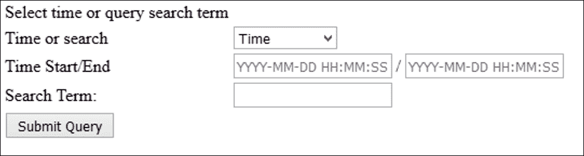
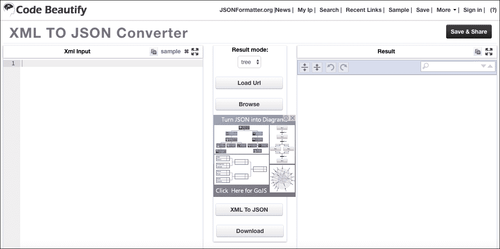

# 第四章。使用 Elasticsearch 构建一个具有搜索功能的简单博客

在本章中，我们将创建一个简单的博客，可以创建和删除帖子。然后，我们将致力于为我们的博客添加一些功能，例如：

*   使用 CRUD 和管理功能实现一个非常简单的博客
*   工作并安装 Elasticsearch 和 Logstash
*   试用 Elasticsearch 的 PHP 客户端
*   学习构建用于使用 Elasticsearch 的工具
*   为数据库的搜索建立缓存
*   根据我们的 Elasticsearch 信息构建图表

# 创建 CRUD 和管理系统

首先，让我们构建帖子的 SQL。数据库表应至少包含文章标题、文章内容、文章日期以及修改和发布日期。

SQL 应该是这样的：

```php
CREATE TABLE posts( 
id INT(11) PRIMARY KEY AUTO INCREMENT, 
post_title TEXT, 
post_content TEXT, 
post_date DATETIME, 
modified DATETIME, 
published DATETIME 
); 

```

现在让我们创建一个函数来读取数据。一个典型的博客站点有评论和一些与博客文章相关的 SEO 元数据。但在本章中，我们将不创建此部分。无论如何，添加一个与评论数据相关的表并在另一个表中包含关于每个帖子的 SEO 元数据的数据应该是相当简单的。

让我们从创建管理系统开始。我们需要登录，因此我们必须创建一个简单的登录注销脚本：

```php
//admin.php 
<form action="admin.php" method="post"> 
Username: <input type="text" name="username"><br /> 
Password: <input type="text" name="username"><br /> 
<input type="submit" name="submit"> 
</form> 
<?php 
$db = new mysqli(); //etc 

Function checkPassword($username, $password) { 
//generate hash 
    $bpassword = password_hash($password); 

//clean up username for sanitization 
$username = $db->real_escape_string($username); 

    $query = mysqli_query("SELECT * FROM users WHERE password='".$bpassword."' AND username = '". $username. "'"); 
if($query->num_rows() > 0) { 
return true; 
     } 
return false; 
} 

if(isset$_POST[' assword']) && isset ($_POST['username']) ) { 
If(checkPassword($_POST['username'], $_POST['password'])) { 
$_SESSION['admin'] = true; 
$_SESSION['logged_in'] = true; 
$_SESSION['expires'] = 3600; //1 hour 
      $_SESSION['signin_time'] = time(); //unix time 
      header('Location: admin_crud_posts.php'); 
} 
else { 
       //lead the user out 
header('Location: logout.php'); 
    } 
   } 
} 

```

当您登录到`admin.php`时，设置会话，然后重定向到 CRUD 页面。

admin CRUD 页面的脚本如下所示：

```php
<?php 
$db = new mysqli(); //etc 
function delete($post_id) { 
   $sql_query = "DELETE FROM posts WHERE id= '". $post_id."'"; 
  $db->query($sql_query); 

} 

function update($postTitle, $postContent, $postAuthor, $postId) { 
$sql_query = "UPDATE posts  
   SET  title = '".$postTitle. "',  
   post_content = '". $postContent. "',  
   post_author='". $postAuthor."'   
   WHERE id = '".$postId."'"; 
   $db->query($sql_query); 
} 

function create($postTitle, $postContent, $postAuthor) { 

$insert_query = "INSERT INTO posts (null , 
    '" . $postTitle."', 
    '". $postContent."', 
   '" $postAuthor."')";  

$db->query($insert_query); 

} 

$query = "SELECT * FROM posts"; 
$result = $db->query($query); 

//display 
?> 
<table> 
<tr> 
<td>Title</td> 
<td>Content</td> 
<td>Author</td> 
<td>Administer</td> 
</tr> 
while($row = $db->fetch_array($query,MYSQLI_ASSOC)) { 
  $id = $row['id']; 
echo '<tr>'; 

echo '<td>' .$row['title'] . '</td>'; 

echo '<td>' . $row['content'] . '</td>';   

echo '<td>' . $row['author'] . '</td>'; 

echo '<td><a href="edit.php?postid='.$id.'">Edit</a>'; 
echo '<a href="delete.php?postid='.$id.'">Delete</a>'.</td>';' 
echo '</tr>'; 
} 
echo "</table>"; 

?> 

```

在前面的脚本中，我们只定义了一些函数，这些函数将为我们处理 CRUD 操作。要显示数据，我们只需在数据库中循环并将其输出到表中。

编辑和删除页面是用户界面所需的脚本以及编辑或删除帖子的功能，如下所示：

`edit.php`：

```php
<?php 
function redirect($home) { 
header('Location: '. $home); 
} 
if(!empty($_POST)) { 
   $query = 'UPDATE posts SET title='" .  $_POST['title']. "', content='". $_POST['content']."' WHERE id = ".$_POST['id']; 
   $db->query($query); 
   redirect('index.php'); 
} else { 
  $id = $_GET['id']; 
  $q = "SELECT * FROM posts WHERE id= '".$_GET['id'] . "'" 
?> 
<form action="edit.php" method="post"> 

<input name="post_title type="text" value=" ="<?php echo  $_POST[ 
title'] ?>"> 

<input type="text" value="<?php echo $_POST['content'] ?>"> 

<input type="hidden" value="<?php echo $_GET['id'] ?>"> 

</form> 
<?php 
} 
?> 

```

让我们创建删除帖子的实际功能。以下是`delete.php`的样子：

```php
<?php 

function redirect($home) { 
    header('Location: '. $home); 
} 
if(isset ($_GET['postid'])) { 
    $query = "DELETE FROM  posts WHERE id = '".$_GET['post_id']."'"; 
$db->query($query); 
redirect('index.php'); 
} 

```

我们的 PHP 日志程序 Monolog 将使用 Elasticsearch 的 Logstash 插件向 Elasticsearch 添加帖子。

我们将设置一个 Logstash 插件，它首先检查文档是否存在，如果不存在，则插入它。

要更新 Elasticsearch，我们需要执行一个**upsert**，它将更新同一条记录（如果它存在），如果它不存在，它将创建一条新记录。

此外，我们还实现了一种方法，可以删除 CRUD 中可见的帖子，但不能从数据库中删除帖子，因为我们需要它来进行检索。

对于需要执行的每个操作，我们只需使用`$_GET['id']`来确定单击该操作时要执行的操作。

与任何博客一样，我们需要一个头版供用户显示可阅读的帖子：

`index.php`：

```php
<html> 
<?php 
$res = $db->query("SELECT * FROM posts LIMIT 10"); 
foreach$posts as $post { 
<h1><?phpecho $post[]?> 
?> 
} 
?> 

```

在前面的代码中，我们广泛使用了速记开头`php`标记，以便我们能够关注页面布局。请注意它是如何在 PHP 模式中穿插和穿插的，但看起来我们只是在使用一个模板，这意味着我们可以看到 HTML 标记的大致轮廓，而不必过多地了解 PHP 代码的细节。

## 播种后台

没有任何数据，我们的博客毫无用处。因此，出于演示目的，我们将只使用一个 seeder 脚本自动用数据填充我们的表。

让我们使用一个流行的库来生成假内容，**Faker**，该库可在[上找到 https://github.com/fzaninotto/Faker](https://github.com/fzaninotto/Faker) 。

对于 Faker，您所要做的就是通过提供其`autoload.php` 文件的所需路径来加载它，并使用 composer（`composer require fzaninotto/faker`加载它。

生成假内容的完整脚本如下所示：

```php
<?php 
require "vendor/autoload"; 
$faker = FakerFactory::create(); 
for($i=0; $i < 10; $i++) { 
  $id = $i; 
  $post = $faker->paragraph(3, true); 
  $title  = $faker->text(150);  
  $query = "INSERT INTO posts VALUES (".$id.",'".$title."','".$post . "','1')" 
} 

?> 

```

现在让我们继续了解 Elasticsearch，这是我们博客文章的数据库搜索引擎。

## 什么是弹性搜索？

**Elasticsearch**是一个搜索服务器。它是一个全文搜索引擎，带有 HTTP web 界面和无模式的 JSON 文档。这意味着我们使用 JSON 存储新的可搜索数据。输入这些文档的 API 使用 HTTP 协议。在本章中，我们将学习如何使用 PHP 并构建一个可以执行以下操作的丰富搜索引擎：

*   设置 Elasticsearch PHP 客户端
*   将搜索数据添加到 Elasticsearch 以编制索引
*   了解如何使用关键字进行关联
*   缓存我们的搜索结果
*   使用 Elasticsearch 和 Logstash 存储 apache 日志
*   将用于存储的 XML 解析为 Elasticsearch

## 安装 Elasticsearch 和 PHP 客户端

创建用于 Elasticsearch 消费的 web 界面。

据您所知，只需使用 Elasticsearch 的最新源代码即可安装 Elasticsearch。

安装说明如下：

1.  转到[https://www.elastic.co/](https://www.elastic.co/) 下载与您的计算机系统相关的源文件，无论是 Mac OSX、Linux 还是 Windows 计算机。
2.  将文件下载到计算机后，应运行安装说明。
3.  例如，对于 Mac OSX 和 Linux 操作系统，您可以执行以下操作：

*   安装 Java1.8。
*   通过 curl 下载 Elasticsearch（在命令行中）：

```php
curl -L -O 
      https://download.elastic.co/elasticsearch/release/org/elasticsearch
      /distribution/tar/elasticsearch/2.1.0/elasticsearch-2.1.0.tar.gz

```

*   提取存档并将目录更改为：

```php
tar -zxvf elasticsearch-2.1.0.tar.gz
cd /path/to/elasticsearch/archive

```

*   启动它：

```php
cd bin
./elasticsearch

```

安装 Elasticsearch for Mac OSX 的另一种方法是使用自制软件，该软件可在[上获得 http://brew.sh/](http://brew.sh/) 。然后，使用 brew 和以下命令安装它：

```php
brew install elasticsearch

```

1.  For Windows operating systems, you just need to click through the wizard installation program, as shown in the following screenshot:

    

2.  安装后，还需要安装**日志存储代理**。Logstash 代理负责从各种输入源向 Elasticsearch 发送数据。
3.  您可以从 Elasticsearch 网站下载，并按照计算机系统的安装说明进行操作。
4.  对于 Linux，您可以下载一个`tar`文件，然后您就可以使用 Linux 的另一种方式，即使用包管理器，它可以是`apt-get`或`yum`，具体取决于您对 Linux 的喜好。

您可以通过安装**邮递员**并对`http://localhost:9200`进行`GET request`测试 Elasticsearch：

1.  打开 Google Chrome 并访问[安装 Postmanhttps://www.getpostman.com/](https://www.getpostman.com/) 。你可以在 Chrome 上安装它，方法是打开附加组件并搜索邮递员。
2.  Once Postman is installed, you can register or skip registration:

    

3.  Now try doing a `GET request` to `http://localhost:9200`:

    

4.  下一步是在 composer 中试用用于 Elasticsearch 的 PHP 客户端库。以下是如何做到这一点：
5.  首先，将 Elasticsearch 包含在您的`composer.json`文件中：

    ```php
          { 
          "require":{ 
          "elasticsearch/elasticsearch":"~2.0" 
          } 
          } 

    ```

6.  获取作曲家：

    ```php
          curl-s http://getcomposer.org/installer | php 
          phpcomposer.phar install --no-dev 

    ```

7.  通过将新客户机包含在项目中来实例化它：

    ```php
          require'vendor/autoload.php'; 

          $client =Elasticsearch\ClientBuilder::create()->build(); 

    ```

现在，让我们尝试为文档编制索引。为此，我们创建一个 PHP 文件以使用 PHP 客户端，如下所示：

```php
$params=[ 
    'index'=> 'my_index', 
    'type'=> 'my_type', 
    'id'=> 'my_id', 
    'body'=>['testField'=> 'abc'] 
]; 

$response = $client->index($params); 
print_r($response); 

```

我们还可以通过使用以下代码创建脚本来检索该文档：

```php
$params=[ 
    'index'=> 'my_index', 
    'type'=> 'my_type', 
    'id'=> 'my_id' 
]; 

$response = $client->get($params); 
print_r($response); 

```

如果我们正在执行搜索，代码如下所示：

```php
$params=[ 
    'index'=> 'my_index', 
    'type'=> 'my_type', 
    'body'=>[ 
        'query'=>[ 
            'match'=>[ 
                'testField'=> 'abc' 
] 
] 
] 
]; 

$response = $client->search($params); 
print_r($response); 

```

简而言之，Elasticsearch PHP 客户端使插入、搜索和从 Elasticsearch 获取文档变得更加容易。

### 构建 PHP Elasticsearch 工具

上述功能可用于创建支持 PHP 的用户界面，以使用 Elasticsearch PHP 客户端插入、查询和搜索文档。

下面是一个简单的引导（HTML CSS 框架）表单：

```php
<div class="col-md-6"> 
<div class="panel panel-info"> 
<div class="panel-heading">Create Document for indexing</div> 
<div class="panel-body"> 
<form method="post" action="new_document" role="form"> 
<div class="form-group"> 
<label class="control-label" for="Title">Title</label> 
<input type="text" class="form-control" id="newTitle" placeholder="Title"> 
</div> 
<div class="form-group"> 
<label class="control-label" for="exampleInputFile">Post Content</label> 
<textarea class="form-control" rows="5" name="post_body"></textarea> 
<p class="help-block">Add some Content</p> 
</div> 
<div class="form-group"> 
<label class="control-label">Keywords/Tags</label> 
<div class="col-sm-10"> 
<input type="text" class="form-control" placeholder="keywords, tags, more keywords" name="keywords"> 
</div> 
<p class="help-block">You know, #tags</p> 
</div> 
<button type="submit" class="btnbtn-default">Create New Document</button> 
</form> 
</div> 
</div> 
</div> 

```

这是表单的外观：


当用户提交内容的详细信息时，我们需要捕获用户输入的内容、关键字或标签。PHP 脚本将输入到 MySQL，然后输入到我们的脚本中，这将把它推到我们的 Elasticsearch 上：

```php
public function insertData($data) { 
  $sql = "INSERT INTO posts ('title', 'tags', 'content') VALUES('" . $data['title] . "','" . $data['tags'] . "','" .$data['content'] . ")"; 
mysql_query($sql); 
} 

insertData($_POST); 

```

现在，让我们尝试将此文档发布到 Elasticsearch：

```php
$params=[ 
    'index'=> 'my_posts', 
    'type'=>'posts', 
    'id'=>'posts', 
    'body'=>[ 
       'title'=>$_POST['title'], 
       'tags' => $_POST['tags'], 
       'content' => $_POST['content'] 
] 
]; 

$response = $client->index($params); 
print_r($response); 

```

## 向我们的 Elasticsearch 添加文档

Elasticsearch 使用索引将每个数据点存储到其数据库中。从 MySQL 数据库中，我们需要将数据发布到 Elasticsearch 中。

让我们讨论一下 Elasticsearch 中的索引实际上是如何工作的。它比 MySQL 的传统搜索更快的原因是它搜索索引。

在 Elasticsearch 中索引是如何工作的？它使用**ApacheLucene**创建了一个称为**反向索引**的东西。反向索引意味着它不必扫描每个条目就可以查找搜索词。这基本上意味着它有一个查找表，列出了所有进入系统的单词。

以下是麋鹿堆叠结构的概述：


在上图中，我们可以看到**输入源**，通常是日志或其他数据源，进入**Logstash**。从**Logstash**进入**Elasticsearch**。

一旦数据到达**Elasticsearch**，它将进行一些标记化和过滤。**标记化**是将字符串分解为不同部分的过程。**过滤**是将一些术语分类到单独的索引中。例如，我们可能有一个 Apache 日志索引，然后还有另一个输入源，例如**Redis**，将其推入另一个可搜索索引。

可搜索索引是我们前面提到的反向索引。可搜索索引基本上是通过存储每个术语并将其原始内容引用到索引中来实现的。这类似于在索引数据库中执行的操作。当我们创建主键并使用它作为索引来搜索整个记录时，这是相同的过程。

您可以在集群中有许多节点执行此索引，所有节点都由 Elasticsearch 引擎处理。在上图中，节点标记为**N1**到**N4**。

### 查询弹性搜索

我们现在了解了每个部分，那么如何查询 Elasticsearch 呢？首先，让我们了解 Elasticsearch。当您开始运行 Elasticsearch 时，您应该向`http://localhost:9200`发送一个 HTTP 请求。

我们可以使用 ElasticSearchWebAPI 来实现这一点，它允许我们使用 RESTfulHTTP 请求来访问 Elasticsearch 服务器。此 RESTful API 是将记录插入 Elasticsearch 的唯一方法。

### 安装日志库

Logstash 只是一个中央日志系统，所有发送到 Elasticsearch 的消息都将通过该系统。

要设置日志存储，请遵循 Elasticsearch 网站上提供的指南：

[https://www.elastic.co/guide/en/logstash/current/getting-started-with-logstash.html](https://www.elastic.co/guide/en/logstash/current/getting-started-with-logstash.html) 。

Elasticsearch 和 Logstash 协同工作，将不同类型的索引日志放入 Elasticsearch。

我们需要在两个数据点之间创建一个称为**传输**或中间件的东西。为此，我们需要建立日志库。它被称为用于弹性搜索和更多功能的**摄取工作马**。它是一个数据收集引擎，将数据从数据源传输到目标，即 Elasticsearch。Logstash 基本上就像一个简单的数据管道。

我们将创建一个 cronjob，它基本上是一个后台任务，它将从 post 表中添加新条目，并将它们放入 Elasticsearch 中。

熟悉管道概念的 Unix 和 Linux 用户将熟悉管道的功能。

Logstash 只是将原始日志消息转换为一种称为**JSON**的格式。

### 提示

**JSON**也称为**JavaScript 对象表示法**，是 web 服务之间传输数据的常用格式。它是轻量级的，许多编程语言，包括 PHP，都有编码和解码 JSON 格式消息的方法。

### 设置日志存储配置

Logstash 配置的输入部分与正确读取和解析日志数据有关。它由输入数据源和要使用的解析器组成。下面是一个示例配置，我们将从`redis`输入源读取：

```php
input { 
redis { 
key =>phplogs 
data_type => ['list'] 
  } 
} 

```

但首先，为了能够推送到`redis`，我们应该安装并使用`phpredis`，这是一个允许 PHP 将数据插入`redis`的扩展库。

### 安装 PHP Redis

安装 PHP Redis 应该很简单。它在大多数 Linux 平台的软件包存储库中都可用。您可以在[上阅读有关如何安装的文档 https://github.com/phpredis/phpredis](https://github.com/phpredis/phpredis) 。

安装后，您可以通过创建并运行以下脚本来测试 PHP Redis 安装是否正常工作：

```php
<?php 
$redis = new Redis() or die("Cannot load Redis module."); 
$redis->connect('localhost'); 
$redis->set('random', rand(5000,6000)); 
echo $redis->get('random'); 

```

在前面的示例中，我们可以启动一个新的 Redis 连接，并从那里将一个名为`random`的键设置为一个介于`5000`和`6000`之间的数字。最后，我们通过调用`echo $redis->get('random')`呼出刚才输入的数据。

有了这些，让我们使用 PHP 的日志库**Monolog**来创建真正的 PHP 代码，将日志存储在 Redis 中。

让我们创建一个日志项目将使用的`composer.json`。

在终端中，让我们运行 initialize composer：

```php
composer init 

```

它将以交互方式询问一些问题，然后创建一个`composer.json`文件。

现在通过键入以下命令安装 Monolog：

```php
composer require monolog/monolog
```

让我们设置从 MySQL 数据库读取的 PHP 代码，然后将其推送到 Elasticsearch：

```php
<?php 
require'vendor/autoload.php' 

useMonolog\Logger; 
useMonolog\Handler\RedisHandler; 
useMonolog\Formatter\LogstashFormatter; 
usePredis\Client; 

$redisHandler=newRedisHandler(newClient(),'phplogs'); 
$formatter =newLogstashFormatter('my_app'); 
$redisHandler->setFormatter($formatter); 

// Create a Logger instance  
$logger =newLogger('logstash_test', array($redisHandler)); 
$logger->info('Logging some infos to logstash.'); 

```

在前面的代码中，我们创建了一个名为`phplogs`的日志名为`redisHandler`。然后我们将`LogstashFormatter`实例设置为使用应用程序名`my_app`。

在脚本的末尾，我们创建了一个新的`logger`实例，将其连接到`redisHandler`，并调用`logger`的`info()`方法来记录数据。

Monolog 将格式化程序的职责与实际日志记录分开。`logger`负责创建消息，格式化程序将消息格式化为适当的格式，以便 Logstash 能够理解。反过来，Logstash 通过管道将其传输到 Elasticsearch，在那里，有关日志的数据被编入索引，并存储在 Elasticsearch 索引中，以供以后查询。

这就是 Elasticsearch 的奇妙之处。只要您有 Logstash，就可以从不同的输入源中选择 Logstash 进行处理，Elasticsearch 将在 Logstash 推送到它时保存数据。

### 编码和解码 JSON 消息

现在我们知道了如何使用 Monolog 库，我们需要将它集成到我们的博客应用程序中。我们将通过创建一个 cronjob 来检查当天的新博客文章，并通过使用 PHP 脚本将它们存储在 Elasticsearch 中。

首先，让我们创建一个名为`server_scripts`的文件夹，将所有 CronJob 放在其中：

```php
$ mkdir ~/server_scripts 
$ cd ~/server_scripts 

```

下面是我们的代码：

```php
<?php 
$db_name = 'test'; 
$db_pass = 'test123'; 
$db_username = 'testuser' 
$host = 'localhost'; 
$dbconn = mysqli_connect(); 
$date_now = date('Y-m-d 00:00:00'); 
$date_now_end = date('Y-m-d 00:00:00',mktime() + 86400); 
$res = $dbcon->query("SELECT * FROM posts WHERE created >= '". $date_now."' AND created < '". $date_now_end. "'"); 

while($row = $dbconn->fetch_object($res)) { 
  /* do redis queries here */ 

} 

```

使用 Logstash，我们可以读取我们的`redis`数据，让它完成它的工作，然后它将处理它，并使用 Logstash 的以下输出插件代码输出它：

```php
output{ 
elasticsearch_http{ 
host=> localhost 
} 
} 

```

## 在 Elasticsearch 中存储 Apache 日志

监视日志是任何 web 应用程序的一个重要方面。大多数关键系统都有所谓的仪表板，这正是我们将在本部分中使用 PHP 构建的。

作为本章的补充，让我们讨论另一个日志主题，服务器日志。有时，我们希望能够确定服务器在特定时间的性能。

使用 Elasticsearch 可以做的另一件事是存储 Apache 日志。对于我们的应用程序，我们可以添加这一点，以便更多地了解我们的用户。

例如，如果我们有兴趣监视用户正在使用的浏览器以及用户访问我们的站点时来自何处，这可能会很有用。

为此，我们只需使用 Apache 输入插件设置一些配置，如下所示：

```php
input { 
file { 
path => "/var/log/apache/access.log" 
start_position => beginning  
ignore_older => 0  
    } 
} 

filter { 
grok { 
match => { "message" => "%{COMBINEDAPACHELOG}"} 
    } 
geoip { 
source => "clientip" 
    } 
} 

output { 
elasticsearch {} 
stdout {} 
} 

```

从 Elasticsearch 安装 Kibana 时，可能会创建一个**Kibana**仪表板；但是，它要求最终用户已经知道如何使用该工具创建各种查询。

但是，需要简化高层管理人员查看数据的过程，而不必知道如何创建 Kibana 仪表盘。

为了让最终用户不必学习如何使用 Kibana 和创建仪表板，我们只需在请求仪表板页面时查询**ILog**信息。对于图表库，我们将使用一个名为**Highcharts**的流行库。然而，为了获得信息，我们需要创建一个简单的查询，以 JSON 格式向我们返回一些信息。

处理 Apache 日志，我们可以使用 PHP Elasticsearch 客户端库创建它。它是一个简单的客户端库，允许我们查询 Elasticsearch 以获取我们需要的信息，包括点击次数。

我们将为我们的网站创建一个简单的柱状图，以显示登录到数据库中的访问次数。

例如，我们将使用 PHP Elasticsearch SDK 查询 Elasticsearch 并显示 Elasticsearch 结果。

我们还必须使直方图动态化。基本上，当用户想要在特定日期之间进行选择时，我们应该能够设置 Highcharts，以获取数据点并创建一个图表。如果您尚未签出 Highcharts，请参阅[http://www.highcharts.com/](http://www.highcharts.com/) 。


### 获取过滤后的数据，用 Highcharts 显示

像任何图表用户一样，我们有时需要能够过滤掉我们在图表中看到的任何东西。我们应该能够通过更改 Highcharts 将呈现的数据来进行过滤，而不是依赖 Highcharts 为我们提供控件来过滤数据。

在下面的 Highcharts 代码中，我们为页面添加了以下容器分隔符；首先，我们使用 JavaScript 从 Elasticsearch 引擎获取数据：

```php
<script> 

$(function () {  
client.search({ 
index: 'apachelogs', 
type: 'logs', 
body: { 
query: { 
       "match_all": { 

       }, 
       {  
         "range": { 
             "epoch_date": { 
               "lt": <?php echo mktime(0,0,0, date('n'), date('j'), date('Y') ) ?>, 

               "gte": <?php echo mktime(0,0,0, date('n'), date('j'), date('Y')+1 ) ?> 
          } 
         } 
       }  
          } 
       } 
}).then(function (resp) { 
var hits = resp.hits.hits; 
varlogCounts = new Array(); 
    _.map(resp.hits.hits, function(count) 
    {logCounts.push(count.count)}); 

  $('#container').highcharts({ 
chart: { 
type: 'bar' 
        }, 
title: { 
text: 'Apache Logs' 
        }, 
xAxis: { 
categories: logDates 
        }, 
yAxis: { 
title: { 
text: 'Log Volume' 
            } 
        }, 
   plotLines: [{ 
         value: 0, 
         width: 1, 
         color: '#87D82F' 
         }] 
   }, 
   tooltip: { 
   valueSuffix: ' logs' 
    }, 
   plotOptions: { 
   series: { 
         cursor: 'pointer', 
         point: { 
   }, 
   marker: { 
   lineWidth: 1 
       } 
     } 
   }, 
   legend: { 
         layout: 'vertical', 
         align: 'right', 
         verticalAlign: 'middle', 
         borderWidth: 0 
      }, 
   series: [{ 
   name: 'Volumes', 
   data: logCounts 
       }] 
      });  

}, function (err) { 
console.trace(err.message); 
    $('#container').html('We did not get any data'); 
}); 

}); 
   </script> 

   <div id="container" style="width:100%; height:400px;"></div> 

```

这是通过使用 JavaScript 的 filter 命令完成的，然后将数据解析到 Highcharts 图中。您还需要在筛选函数中使用下划线，这将有助于排序我们要向用户显示的数据。

让我们首先构建表单来过滤 Highcharts 直方图。

CRUD 视图中搜索过滤器的 HTML 代码如下所示：

```php
<form> 
<select name="date_start" id="dateStart"> 
<?php 
$aWeekAgo = date('Y-m-d H:i:s', mktime( 7 days)) 
    $aMonthAgo = date(Y-m-d H:i:s', mktime( -30));    
//a month to a week 
<option value="time">Time start</option> 
</select> 
<select name="date_end" id="dateEnd"> 
<?php 
    $currentDate= date('Y-m-d H:i:s');        
$nextWeek = date('', mktime(+7 d)); 
    $nextMonth = date( ,mktime (+30)); 
?> 
<option value=""><?php echo substr($currentData,10);?> 
</option> 
<button id="filter" name="Filter">Filter</button> 
</form> 

```

为了快速重新呈现图表，我们必须在每次单击 filter 按钮时使用普通的旧 JavaScript 附加一个侦听器，然后简单地删除包含 Highcharts 图表的`div`元素的信息。

以下 JavaScript 代码将使用 jQuery 和下划线以及第一个条形图中的相同代码更新过滤器：

```php
<script src="https://code.jquery.com/jquery-2.2.4.min.js" integrity="sha256-BbhdlvQf/xTY9gja0Dq3HiwQF8LaCRTXxZKRutelT44=" crossorigin="anonymous"></script> 

<script src="txet/javascript"> 
$("button#filter").click {  
dateStart = $('input#dateStart').val().split("/"); 
dateEnd = $('input#dateEnd').val().split("/"); 
epochDateStart = Math.round(new Date(parseInt(dateStart[])]), parseInt(dateStart[1]), parseInt(dateStart[2])).getTime()/1000); 
epochDateEnd = Math.round(new Date(parseInt(dateEnd [])]), parseInt(dateEnd [1]), parseInt(dateEnd[2])).getTime()/1000); 

       }; 

client.search({ 
index: 'apachelogs', 
type: 'logs', 
body: { 
query: { 
       "match_all": { 

       }, 
       {  
         "range": { 
             "epoch_date": { 
               "lt": epochDateStart, 

               "gte": epochDateEnd 
          } 
         } 
       }  
          } 
       } 
}).then(function (resp) { 
var hits = resp.hits.hits; //look for hits per day fromelasticsearch apache logs 
varlogCounts = new Array(); 
    _.map(resp.hits.hits, function(count) 
    {logCounts.push(count.count)}); 

$('#container').highcharts({ 
chart: { 
type: 'bar' 
        }, 
title: { 
text: 'Apache Logs' 
        }, 
xAxis: { 
categories: logDates 
        }, 
yAxis: { 
title: { 
text: 'Log Volume' 
            } 
        } 

   }); 
}); 
</script> 

```

在前面的代码中，我们包含了`jquery`和下划线库。当点击按钮以关注某些日期时，我们通过表单设置`$_GET['date']`，然后 PHP 使用一个简单的技巧获取信息，我们通过刷新包含图形的`div`元素来重新呈现包含图形的`div`，然后要求 Highcharts 重新呈现数据。

为了让这更酷一点，我们可以使用 CSS 动画效果，让它看起来像是在对焦相机。

这可以使用 jQuery CSS 转换技术完成，然后将其调整回正常大小并重新加载新图形：

```php
$("button#filter").click( function() { 
   //..other code 
  $("#container").animate ({ 
width: [ "toggle", "swing" ], 
height: [ "toggle", "swing" ] 
}); 

}); 

```

现在我们已经学习了如何使用 JavaScript 进行过滤，并允许使用过滤器样式过滤 JSON 数据。注意 filter 是一个相对较新的 JavaScript 函数；它只在**ECMAScript 6**中引入。我们已经使用它创建了一个仪表板，上层管理层需要它来为自己的目的生成报告。

我们可以使用下划线库，它具有过滤功能。

我们将只加载 Elasticsearch 中的最新日志，然后，如果我们想要执行搜索，我们将创建一种方法来筛选和指定要在日志中搜索的数据。

让我们为将由 Elasticsearch 搜索的 Apache 日志创建 Logstash 配置。

我们所需要做的就是将输入日志存储配置指向 Apache 日志位置（通常是`/var/log/apache2`目录中的一个文件）。

这是 Apache 的基本日志存储配置，它读取位于`/var/log/apache2/access.log`的 Apache 访问日志文件：

```php
input {    file { 
path => '/var/log/apache2/access.log' 
        } 
} 

filter { 
grok { 
    match =>{ "message" => "%{COMBINEDAPACHELOG}" } 
  } 
date { 
match => [ "timestamp" , "dd/MMM/yyyy:HH:mm:ss Z" ] 
  } 
} 

```

它使用了一种称为 grok 过滤器的东西，该过滤器匹配任何类似 Apache 日志格式的内容，并将时间戳匹配到`dd/MMM/yyyy:HH:mm:ss Z`日期格式。

如果您认为 Elasticsearch 是彩虹的尽头，Apache 日志是彩虹的起点，那么 Logstash 就像彩虹一样，将日志从两端传输到 Elasticsearch 可以理解的格式。

**Grokking**是一个术语，用于描述将消息格式重新格式化为 Elasticsearch 可以解释的格式。这仅仅意味着它将搜索一个模式并为该模式筛选匹配项，特别是，它将在 JSON 中查找日志的时间戳、消息和其他属性，这就是 Elasticsearch 随后存储在其数据库中的内容。

## 查看 Elasticsearch 日志的仪表板应用程序

现在让我们为我们的博客创建一个仪表板，让我们可以查看 Elasticsearch 中的数据，包括帖子和 Apache 日志。我们将使用 PHP Elasticsearch SDK 查询 Elasticsearch 并显示 Elasticsearch 结果。

我们将只加载 Elasticsearch 中的最新日志，然后，如果我们想要执行搜索，我们将创建一种方法来筛选和指定要在日志中搜索的数据。

这是搜索筛选器窗体的外观：



在`search.php`中，我们将创建一个用于在 Elasticsearch 中搜索值的简单表单：

```php
<form action="search_elasticsearch.php" method="post"> 
<table> 
   <tr> 
<td>Select time or query search term 
<tr><td>Time or search</td> 
<td><select> 
    <option value="time">Time</option> 
     <option value="query">Query Term</option> 
<select> 
</td>  
</tr> 
<tr> 
<td>Time Start/End</td> 
  <td><input type="text" name="searchTimestart" placeholder="YYYY-MM-DD HH:MM:SS" > /  
  <input type="text" name="searchTimeEnd" placeholder="YYYY-MM-DD HH:MM:SS" > 
</td> 
</tr> 
<tr> 
<td>Search Term:</td><td><input name="searchTerm"></td> 
</tr> 
<tr><td colspan="2"> 
<input type="submit" name="search"> 
</td></tr> 
</table> 
</form> 

```

当用户点击**提交**时，我们将向用户显示结果。

我们的表单应该简单地向我们显示当天 Apache 日志和博客文章的记录。

这就是我们如何使用 curl 在命令行中查询`ElasticSearch`的信息：

```php
$ curl http://localhost:9200/_search?q=post_date>2016-11-15

```

现在我们将从 Elasticsearch 获得一个 JSON 响应：

```php
{"took":403,"timed_out":false,"_shards":{"total":5,"successful":5,"failed":0},"hits":{"total":1,"max_score":0.01989093,"hits":[{"_index":"posts","_type":"post","_id":"1","_score":0.01989093,"_source":{ 
  body: { 
    "user" : "kimchy", 
    "post_date" : "2016-11-15T14:12:12", 
    "post_body" : "trying out Elasticsearch" 
  }  
}}]}} 

```

我们也可以使用 REST 客户端（在 Firefox 中查询 RESTful API 的一种方式）来查询数据库，只需指定`GET`方法和路径，并将 URL 中的`q`变量设置为要搜索的参数：


## 带有结果缓存的简单搜索引擎

要安装 PHP Redis，请访问[https://github.com/phpredis/phpredis](https://github.com/phpredis/phpredis) 。

每次用户搜索时，我们都可以将他们最近的搜索保存在 Redis 中，如果已经存在，则只显示这些结果。实现可能如下所示：

```php
<?php 
$db = new mysqli(HOST, DB_USER, DB_PASSWORD, DB_NAME); //define the connection details 

if(isset($_POST['search'])) {  

$hashSearchTerm = md5($_POST['search']); 
    //get from redis and check if key exist,  
    //if it does, return search result    
    $rKeys = $redis->keys(*); 

   if(in_array($rKeys, $hashSearchTerm){  
         $searchResults =  $redis->get($hashSearchTerm); 
         echo "<ul>"; 
         foreach($searchResults as $result) { 
                 echo "<li> 
     <a href="readpost.php?id=" . $result ['postId']. "">".$result['postTitle'] . "</a> 
        </li>" ; 
         echo "</ul>"; 
        } 
   } else { 
     $query = "SELECT * from posts WHERE post_title LIKE '%".$_POST['search']."%' OR post_content LIKE '%".$_POST['search']."%'"; 

     $result = $db->query($query); 
     if($result->num_rows() > 0) { 
     echo "<ul>;" 
     while ($row = $result->fetch_array(MYSQL_BOTH))  
       { 
       $queryResults = [ 
       'postId' => $row['id'], 
       'postTitle' => $row['post_title']; 
        ]; 

        echo "<li> 
     <a href="readpost.php?id=" . $row['id']. "">".$row['post_title'] . "</a> 
        </li>" ; 
       } 
     echo "</ul>"; 

     $redis->setEx($hashSearchTerm, 3600, $queryResults); 

     } 
   } 
} //end if $_POST 
else { 
  echo "No search term in input"; 
} 
?> 

```

Redis 是一本简单的字典。它将一个键和该键的值存储在其数据库中。在前面的代码中，我们使用它来存储对用户搜索结果的引用，以便下次执行相同的搜索时，我们可以从 Redis 数据中提取我们拥有的内容。

在前面的代码中，我们将搜索项转换为散列，这样就可以很容易地将其识别为通过的同一查询，并且可以很容易地将其存储为键（该键应仅为一个字符串，不允许使用空格）。如果在散列之后，我们在 Redis 中找到了密钥，那么我们从 Redis 获取它，而不是从数据库获取它。

Redis 可以通过使用`$redis->setEx`方法保存密钥使密钥过期，该方法允许我们存储密钥，并在*X*秒后使其过期。在本例中，我们将其存储 3600 秒，相当于一小时。

## 缓存基础

缓存的概念是将已搜索的项目返回给用户，以便对于正在搜索相同精确搜索结果的其他用户，应用程序不再需要从 MySQL 数据库执行完整的数据库获取。

拥有缓存的坏处在于必须执行缓存失效。

### Redis 数据缓存失效

**缓存失效**是指您需要终止并删除缓存数据的时候。这是因为缓存在一段时间后可能不再是实时的。当然，在失效后，您需要更新缓存中的数据，这在有新的数据请求时发生。缓存失效过程可以采用以下三种方法之一：

*   **清除**是指我们立即从缓存数据中删除内容。
*   **刷新**只是获取新数据，覆盖已有数据。这意味着，即使缓存中存在匹配项，我们也将使用来自任何地方的新信息刷新该匹配项。
*   **Ban**基本上是将以前缓存的内容添加到 Ban 列表中。当另一个客户端获取相同的信息，并且在检查黑名单时，如果它已经存在，则缓存的内容只会得到更新。

我们可以在后台连续运行 cronjob，它将使用该搜索的新结果更新每个缓存结果。

这就是 crontab 中每 15 分钟运行一次的后台 PHP 脚本的样子：

```php
0,15,30,45 * * * * php /path/to/phpfile 

```

要让 Logstash 将数据放入 Redis，我们只需执行以下操作：

```php
# shipper from apache logs to redis data 
output { 
redis { host => "127.0.0.1" data_type => "channel" key => "logstash-%{@type}-%{+yyyy.MM.dd.HH}" } 
} 

```

这就是从缓存中删除数据的 PHP 脚本的工作方式：

```php
functiongetPreviousSearches() { 
return  $redis->get('searches'); //an array of previously searched searchDates 
} 

$prevSearches = getPreviousSearches(); 

$prevResults = $redis->get('prev_results');  

if($_POST['search']) { 

  if(in_array($prevSEarches)&&in_array($prevResults[$_POST['search']])) { 
if($prevSEarches[$_POST['search'])] { 
            $redis->expire($prevSearches($_POST['searchDate'])) { 
         Return $prevResults[$_POST['search']]; 
} else { 
         $values =$redis->get('logstash-'.$_POST['search']); 
             $previousResults[] = $values; 
         $redis->set('prev_results', $previousResults); 

          } 

} 
     }   
  } 

```

在前面的脚本中，我们基本上检查前面搜索的`searchDate`，如果有，我们将其设置为过期。

如果它也出现在`previousResults`数组中，我们将其提供给用户；否则，我们将执行一个新的`redis->get`命令来获取搜索日期的结果。

## 使用浏览器本地存储作为缓存

缓存存储的另一个选项是将其保存在客户端浏览器中。该技术被称为**本地存储**。

我们可以将其用作用户的简单缓存并存储搜索结果，如果用户想要搜索相同的内容，我们只需检查 localStorage 缓存。

### 提示

`localStorage`只能存储 5MB 的数据。但是考虑到一个普通的文本文件只有几千字节，这是相当多的。

我们可以使用`elasticsearch.js`客户端而不是 PHP 客户端向 Elasticsearch 发出请求。浏览器兼容版本可从[下载 https://www.elastic.co/guide/en/elasticsearch/client/javascript-api/current/browser-builds.html](https://www.elastic.co/guide/en/elasticsearch/client/javascript-api/current/browser-builds.html) 。

我们也可以使用 Bower 安装`elasticsearch.js`客户端：

```php
bower install elasticsearch 

```

出于我们的目的，我们可以通过使用 jQuery 创建客户机来利用 jQuery 构建：

```php
var client = new $.es.Client({ 
hosts: 'localhost:9200' 
}); 

```

我们现在应该能够使用 JavaScript 来填充`localStorage`。

因为我们只是在客户端查询和显示，这是一个完美的匹配！

请注意，我们可能无法记录使用客户端脚本搜索的数据。但是，我们可以将搜索查询历史保存为一个模型，其中包含搜索的项和键。

基本 JavaScript`searchQuery`对象如下所示：

```php
varsearchQuery = { 
search: {queryItems: [ { 
'title: 'someName',  
  'author': 'Joe',  
   'tags': 'some tags'}  
] }; 
}; 

```

我们可以通过运行以下 JavaScript 文件来测试客户端是否工作：

```php
client.ping({ 
requestTimeout: 30000, 

  // undocumented params are appended to the query string 
hello: "elasticsearch" 
}, function (error) { 
if (error) { 
console.error('elasticsearch cluster is down!'); 
  } else { 
console.log('All is well'); 
  } 
}); 

```

可以通过执行以下操作将结果缓存到`localStorage`中：

```php
localStorage.setItem('results',JSON.stringify(results)); 

```

我们将使用从`elasticsearch`中找到的数据填充结果，然后只检查之前是否完成了相同的查询。

我们还需要保持数据的新鲜性。让我们假设在用户感到厌烦并刷新页面以尝试查看新信息之前大约需要 15 分钟。

同样，我们检查搜索结果是否在过去显示过：

```php
var searches = localStorage.get('searches'); 
if(searches != mktime( date('H'), date('i')-15) ) { 
  //fetch again 
varsearchParams = { 
index: 'logdates', 
body:  
query: { 
match: { 
date: $('#search_date').value; 

} 
client.search(); 
} else { 
  //output results from previous search; 
prevResults[$("#search_date").val()]; 
} 

```

现在，每当搜索条件过期时，比如说 15 分钟后，我们只需清除缓存并输入 Elasticsearch 找到的新搜索结果。

## 与溪流一起工作

在这里，我们将利用 PHP 的 Monolog 库，然后将数据流化，而不是推送完整的字符串。使用流的好处在于，它们可以很容易地通过管道传输到 Logstash 中，然后将其作为索引数据存储到 Elasticsearch 中。Logstash 还具有创建数据流和流式传输数据的功能。

我们可以直接输入数据，甚至不需要使用 Logstash，也可以使用流。有关流的更多信息，请参阅[http://php.net/manual/en/book.stream.php](http://php.net/manual/en/book.stream.php) 。

例如，这里有一种将某些数据推送到 Elasticsearch 的方法：`http://localhost/dev/streams/php_input.php`：

```php
curl -d "Hello World" -d "foo=bar&name=John" http://localhost/dev/streams/php_input.php 

```

在`php_input`中，我们可以输入以下代码：

```php
readfile('php://input') 

```

我们将得到`Hello World&foo=bar&name=John`，这意味着 PHP 能够使用 PHP 输入流获取第一个字符串作为流。

要使用 PHP 流，让我们手动使用 PHP 创建一个流。在处理输出缓冲时，PHP 开发人员通常已经有一些处理流数据的经验。

输出缓冲的思想是收集流，直到它完成，然后将其显示给用户。

当流尚未完成，并且需要等待结束字符才能完全传输数据时，这一点特别有用。

我们可以将流推入 Elasticsearch！这可以使用 Logstash 输入插件来处理流。以下是 PHP 输出到流的方式：

```php
<?php 
require 'vendor/autoload.php'; 
$client = new Elasticsearch\Client(); 
ob_start(); 
$log['body'] = array('hello' => 'world', 'message' => 'some test'); 
$log['index'] = 'test'; 
$log['type'] = 'log'; 
echo json_encode($log);  
//flush output of echo into $data 
$data = ob_get_flush(); 
$newData = json_decode($data); //turn back to array 
$client->index($newData); 

```

## 使用 PHP 存储和搜索 XML 文档

我们还可以处理 XML 文档并将它们插入 Elasticsearch。为此，我们可以将数据转换为 JSON，然后将 JSON 推入 Elasticsearch。

首先，您可以查看以下 XML 到 JSON 转换器：

如果您想检查 XML 是否已正确转换为 JSON，请查看位于[的**XML 到 JSON 转换器**工具 http://codebeautify.org/xmltojson](http://codebeautify.org/xmltojson) ；从这里，您可以轻松了解如何将 XML 导出为 JSON：



## 使用 Elasticsearch 搜索社交网络数据库

在本节中，我们将简单地使用我们的知识将其应用于使用 PHP 构建的现有社交网络。

让我们假设有用户希望能够搜索他们的社交提要。在这里，我们构建了一个全面的自动下拉搜索系统。

每次用户发帖时，我们都需要能够将所有数据存储在 Elasticsearch 中。

但是，在我们的搜索查询中，我们会将搜索结果与用户获取的实际单词进行匹配。如果它不匹配每个字符中的查询，我们将不显示它。

我们首先需要构建提要。SQL 架构将如下所示：

```php
CREATE TABLE feed ( 
Id INT(11) PRIMARY KEY, 
Post_title TEXT, 
post_content TEXT, 
post_topics TEXT, 
post_time DATETIME, 
post_type VARCHAR(255), 
posted_by INT (11) DEFAULT '1'  
) ; 

```

`Post_type`将处理 post 照片、视频、链接或纯文本的类型。

因此，如果用户添加了一种类型的图片，它将被保存为图像类型。当一个人搜索帖子时，他们可以按类型进行过滤。

每次用户保存一张新照片或一篇新文章时，我们也会将数据存储到 Elasticsearch 中，如下所示：

```php
INSERT INTO feed (`post_title`, `post_content`, `post_time`, `post_type`) VALUES ('some title', 'some content', '2015-03-20 00:00:00', 'image', 1); 

```

现在，当用户插入之前的新帖子时，我们需要制作一个输入表单。我们将构建一个可以上传带有标题的照片或只添加文本的：

```php
<h2>Post something</h2> 

<form type="post" action="submit_status.php" enctype="multipart/form-data"> 
Title:<input name="title" type="text" /> 
Details: <input name="content" type="text"> 
Select photo:  
<input type="file" name="fileToUpload" id="fileToUpload"> 
<input type="hidden" value="<?php echo $_SESSION['user_id'] ?>" name="user_id"> 
<input name="submit" type="submit"> 

</form> 

```

`submit_status.php`脚本将有以下代码保存到数据库中：

```php
<?php 
use Elasticsearch\ClientBuilder; 

   require 'vendor/autoload.php'; 

$db = new mysqli(HOST, DB_USER, DB_PASSWORD, DATABASE); 

 $client = ClientBuilder::create()->build(); 
if(isset($_POST['submit'])) { 
  $contentType = (!empty($_FILES['fileToUpload'])) ? 'image' : ' 

$db->query("INSERT INTO feed (`post_title`, `post_content`, `post_time`, `post_type`, `posted_by`)  
VALUES ('". $_POST['title'] ."','" . $_POST['content'] . "','" . date('Y-m-d H:i:s'). "','" . $contentType . "','" . $_POST['user_id']); 

//save into elasticsearch 
$params = [ 
    'index' => 'my_feed', 
    'type' => 'posts', 
    'body' => [  
      'contenttype' => $contentType, 
      'title'  => $_POST['title'], 
      'content' => $_POST['content'],         
      'author' => $_POST['user_id'] 
    ] 
]; 
       $client->index($params); 
  } 

 ?> 

```

### 显示随机搜索引擎结果

前面的提要数据库表是每个人都将发布到的表。我们需要启用随机显示提要上的内容。我们可以将帖子插入提要而不是存储。

通过从 Elasticsearch 搜索并随机重新排列数据，我们可以使搜索更加有趣。在某种程度上，这确保了使用我们的社交网络的人们能够在他们的订阅源中看到随机的帖子。

为了从帖子中进行搜索，我们将在 Elasticsearch 数据库中搜索数据，而不是直接查询 SQL。

首先，让我们了解如何将数据插入名为`posts`的 Elasticsearch 索引中。打开 Elasticsearch 后，我们只需执行以下操作：

```php
$ curl-XPUT 'http://localhost:9200/friends/'-d '{ 
"settings":{ 
"number_of_shards":3, 
"number_of_replicas":2 
} 
}' 

```

我们可能还想搜索我们的朋友，如果我们有很多朋友，他们不会都在订阅源上。所以，我们只需要另一个索引来搜索，`friends`索引。

以下代码在 Linux 命令行中运行时，将允许我们创建一个新的`friends`索引：

```php
$ curl-XPUT 'http://localhost:9200/friends/'-d '{ 
"settings":{ 
"number_of_shards":3, 
"number_of_replicas":2 
} 
}' 

```

因此，我们现在可以使用`friends`索引存储朋友的数据：

```php
$ curl-XPUT 'http://localhost:9200/friends/posts/1'-d '{ 
"user":"kimchy", 
"post_date":"2016-06-15T14:12:12", 
"message":"fred the friend" 
}' 

```

我们通常会寻找朋友的朋友，当然，我们会向我们的用户显示，如果有任何朋友与搜索查询。

## 总结

在本章中，我们讨论了如何创建博客系统，尝试了 Elasticsearch，并能够做到以下几点：

*   创建一个简单的博客应用程序并在 MySQL 中存储数据
*   安装 Logstash 和 Elasticsearch
*   使用卷曲练习使用 Elasticsearch
*   使用 PHP 客户端将数据输入 Elasticsearch
*   使用 Highcharts 从 Elasticsearch 获得的图表信息（点击数）
*   使用`elasticsearch.js`客户端查询 Elasticsearch 信息
*   在浏览器中使用 Redis 和 localStorage 进行缓存