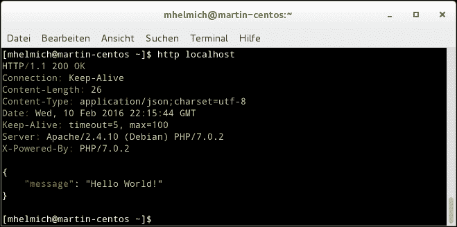
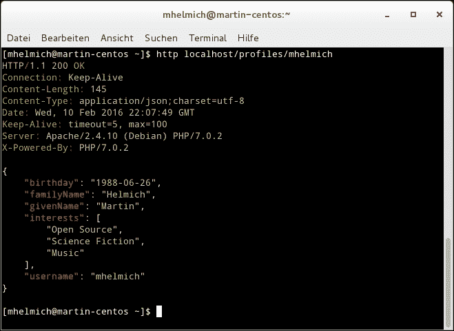

# 五、创建 RESTful Web 服务

本章的目标是实现可用于管理用户配置文件的 RESTful Web 服务。每个用户都有一些基本的联系信息（例如用户名、给定姓名和姓氏）、身份验证密码和个人资料图像。

该服务将使用 Slim micro framework 实现，Slim micro framework 是一个小型轻量级框架，可作为 PHP5.5 及更高版本的开源库（MIT 许可）使用（当然，我们将使用 PHP7）。对于持久性，将使用 MongoDB 数据库。这为探索 PHP 的 MongoDB 扩展提供了一个绝佳的机会，它取代了用 PHP7 删除的旧的（名称类似，但完全不同）Mongo 扩展。

在本章中，我们将介绍以下内容：

*   RESTful Web 服务的基础知识，最重要的是常见的 HTTP 请求和响应方法
*   安装和使用 Slim 框架，以及 PSR-7 标准的基础知识
*   使用 Slim 框架和 MongoDB 存储设计和实现实例 RESTful Web 服务
*   如何使用 PSR-7 流并使用 GridFS 在 MongoDB 数据库中存储大型文件

# 宁静的基础

在本节中，我们将简要介绍 RESTfulWeb 服务的基础知识。您将了解 REST Web 服务的基本架构目标以及通常用于实现此类服务的**超文本传输协议**（**HTTP**的最常见协议语义。

## REST 架构

术语**表示状态传输**由 Roy Fielding 于 2000 年提出，描述了分布式系统的体系结构风格，原则上独立于任何具体的通信协议。实际上，大多数 REST 架构都是使用**超文本传输协议**——简言之，HTTP 来实现的。

每个 RESTful Web 服务的关键组件是资源。每种资源应满足以下要求：

*   **可寻址性**：每个资源必须通过一个**统一资源标识符**（**URI**进行标识，该标识符在 RFC 3986 中是标准化的。例如，用户名为`johndoe`的用户可能具有 URI`http://example.com/api/users/johndoe`。
*   **无状态**：参与者之间的交流是无状态的；这意味着 REST 应用程序通常不使用用户会话。相反，每个请求都需要包含服务器完成请求所需的所有信息。
*   **统一接口**：每个资源必须通过一套标准方法进行访问。当使用 HTTP 作为传输协议时，您通常会使用 HTTP 方法来查询或修改资源的状态。本章的下一节简要概述了最常见的 HTTP 标准方法和响应代码。
*   **资源与表示的解耦**：每个资源可以有多个表示。例如，REST 服务可能同时提供用户配置文件的 JSON 和 XML 表示。通常，客户机指定服务器响应的格式，服务器将选择最适合客户机指定要求的表示。此过程称为**内容协商**。

在本章中，您将学习在一个小型 RESTful Web 服务中实现所有这些体系结构原则。您将使用不同的表示实现几种不同的资源类型，并学习如何使用不同的 HTTP 方法和响应代码来查询和修改这些资源。此外，您还将了解如何利用高级 HTTP 功能（如丰富的缓存控制头集）。

## 常用 HTTP 方法及响应码

HTTP 定义了一组标准方法（或*动词*），客户端可以在请求中使用，服务器可以在响应所述请求时使用状态代码。在 REST 体系结构中，不同的请求方法用于查询或修改由请求 URI 标识的资源的服务器端状态。这些请求方法和响应状态代码在 RFC 7231 中标准化。**表 1**和**表 2**概述了最常见的请求方法和状态代码。

请求方法`GET`、`HEAD`和`OPTIONS`定义为*安全*。在处理此类请求时，服务器不应修改自己的状态。此外，safe 方法以及`PUT`和`DELETE`方法都被定义为*幂等元*。幂等性意味着重复的相同请求应具有与单个请求相同的效果-例如，对`/api/users/12345`URI 的多个`DELETE`请求仍应导致删除一个资源。

表 1，常见 HTTP 请求方法：

<colgroup><col> <col></colgroup> 
| **HTTP 方式** | **说明** |
| `GET` | 用于查询 URI 标识的资源的状态。服务器以查询资源的表示形式进行响应。 |
| `HEAD` | 与`GET`类似，只是服务器只返回响应头，不返回实际的资源表示。 |
| `POST` | `POST`请求可以在其请求正文中包含资源表示。服务器应将此对象存储为请求 URI 标识的资源的新子资源。 |
| `PUT` | 与`POST`一样，`PUT`请求在其请求体中也包含资源表示。服务器应确保具有给定 URI 和表示的资源存在，并在必要时创建一个。 |
| `DELETE` | 删除具有指定 URI 的资源。 |
| `OPTIONS` | 可由客户端用于查询给定资源允许哪些操作。 |

表 2：常见 HTTP 响应状态代码：

<colgroup><col> <col></colgroup> 
| **状态码** | **说明** |
| `200 OK` | 请求已成功处理；响应消息通常包含请求资源的表示。 |
| `201 Created` | 与`200 OK`类似，但除此之外，还明确表示请求创建了一个新资源。 |
| `202 Accepted` | 请求已接受处理，但尚未处理。当服务器异步处理耗时的请求时，这非常有用。 |
| `400 Bad Request` | 服务器无法解释客户端的请求。当请求包含无效的 JSON 或 XML 数据时，可能会出现这种情况。 |
| `401 Unauthorized` | 客户端需要在访问此资源之前进行身份验证。响应可以包含有关所需身份验证的更多信息，并且可以使用适当的凭据重复请求。 |
| `403 Forbidden` | 可以在客户端经过身份验证但未被授权访问给定资源时使用。 |
| `404 Not Found` | 当 URI 指定的资源不存在时使用。 |
| `405 Method Not Allowed` | 指定的资源不允许使用请求方法。 |
| `500 Internal Server Error` | 处理请求时服务器上发生错误。 |

# Slim 框架的第一步

在本节中，您将介绍使用 Slim 框架的第一步。为此，您将首先使用 Composer 安装框架，然后构建一个小示例应用程序，向您展示框架的基本原理。

## 安装薄型

使用 Composer 可以轻松安装 Slim 框架。它至少在 5.5 版中需要 PHP，但在 PHP7 中也能很好地工作。首先使用 Composer 初始化一个新项目：

```php
$ composer init .

```

这将为我们的项目创建一个新的项目级`composer.json`文件。现在，您可以将 slim/slim 包添加为依赖项：

```php
$ composer require slim/slim

```

## 一个小样本应用程序

现在可以开始在 PHP 应用程序中使用 Slim 框架了。为此，请在 web 服务器的文档根目录中创建一个包含以下内容的`index.php`文件：

```php
<?php 
use \Slim\App; 
use \Slim\Http\Request; 
use \Slim\Http\Response; 

require "vendor/autoload.php"; 

$app = new App(); 
$app->get("/", function(Request $req, Response $res): Response { 
    return $res->withJson(["message" => "Hello World!"]); 
}); 
$app->run(); 

```

让我们看看 Slim 框架是如何工作的。这里的中心对象是`$app`变量，`Slim\App`类的一个实例。然后可以使用此应用程序实例注册路由。每个路由都是 HTTP 请求路径到处理 HTTP 请求的简单回调函数的映射。这些处理函数需要接受一个请求和一个响应对象，并且需要返回一个新的响应对象。

在测试此应用程序之前，您可能需要配置 web 服务器以将所有请求重写到`index.php`文件中。如果您使用 Apache 作为 web 服务器，则可以通过文档根目录中的一个简单的`.htaccess`文件来完成：

```php
RewriteEngine on 
RewriteCond %{REQUEST_FILENAME} !-f 
RewriteCond %{REQUEST_FILENAME} !-d 
RewriteRule ^([^?]*)$ /index.php [NC,L,QSA] 

```

此配置将所有 URL 的请求重写到您的`index.php`文件中。

你可以用浏览器测试你的 API（当然仍然很简单）。如果您喜欢命令行，我可以推荐**HTTPie**命令行工具。HTTPie 基于 Python，您可以使用操作系统的包管理器或 Python 自己的包管理器**pip**轻松安装它：

```php
apt-get install httpie
# Alternatively:
pip install --upgrade httpie

```

然后，您可以在命令行上使用`HTTPie`轻松执行 RESTful HTTP 请求，并获得语法突出显示的输出。当与示例应用程序一起使用时，请参见下图以获取 HTTPie 的示例输出：



带有 Slim 示例应用程序的 HTTPie 示例输出

### 接受 URL 参数

细长管线的路径中也可以包含参数。在您的`index.php`中，在最后一条`$app->run()`语句之前添加以下路径：

```php
$app->get( 
    '/users/{username}', 
    function(Request $req, Response $res, array $args): Response { 
        return $res->withJson([ 
          'message' => 'Hello ' . $args['username' 
        ]); 
    } 
); 

```

如您所见，任何路由规范都可以在花括号中包含任意参数。然后，route handler 函数可以接受包含 URL 中所有路径参数的第三个参数作为关联数组（如上例中的用户名参数）。

## 通过消息体接受 HTTP 请求

到目前为止，您只处理过 HTTP`GET`请求。当然，Slim 框架还支持 HTTP 协议定义的任何其他类型的请求方法。然而，`GET`和`POST`请求之间一个有趣的区别是，一些请求（如`POST`、`PUT`和其他请求）可以包含请求主体。

请求主体由结构化数据组成，这些数据根据一些预定义的编码序列化为字符串。当向服务器发送请求时，客户端使用**内容类型**HTTP 头告诉服务器请求主体使用哪种编码。常见编码包括以下内容：

*   `application/x-www-form-urlencoded`通常由浏览器在提交 HTML 表单时使用
*   `application/json`用于 JSON 编码
*   用于 XML 编码的`application/xml`或`text/xml`

幸运的是，Slim 框架支持所有这些编码，并确定自动解析请求体的正确方法。您可以使用以下简单路由处理程序进行测试：

```php
$app->post('/users', function(Request $req, Response $res): Response { 
    $body = $req->getParsedBody(); 
    return $response->withJson([ 
        'message' => 'creating user ' . $body['username'] 
    ]); 
}); 

```

注意`Request`类提供的`getParsedBody()`方法的使用。此方法将使用请求正文，并根据请求中存在的内容类型标头自动使用正确的解码方法。

现在，您可以使用`POST`数据提供给此路由的任何上述内容编码。可以使用以下 curl 命令轻松测试这一点：

```php
$ curl -d '&username=martin&firstname=Martin&lastname=Helmich' http://localhost/users 
$ curl -d '{"username":"martin","firstname":"Martin","lastname":"Helmich"}' -H'Content-Type: application/json' http://localhost/users
$ curl -d '<user><username>martin</username><firstname>Martin</firstname><lastname>Helmich</lastname></user>' -H'Content-Type: application/xml'

```

所有这些请求都将从 Slim 应用程序生成相同的响应，因为它们包含完全相同的数据，只是使用了不同的内容编码。

## PSR-7 标准

Slim 框架的主要功能之一是 PSR-7 合规性。PSR-7 是由**PHP 框架互操作性组**（**图**）定义的**PHP 标准建议**（**PSR**）并描述了一组标准接口，可由 HTTP 服务器和用 PHP 编写的客户端库实现，以提高这些产品之间的可操作性（或者用简单的英语，使这些库能够相互使用）。

PSR-7 定义了一组框架可以实现的 PHP 接口。下图说明了 PSR-7 标准定义的接口。您甚至可以使用 Composer 获取`psr/http-messages`包，在项目中安装这些接口：


PSR-7 标准定义的接口

您在前面的示例中使用的`Slim\Http\Request`和`Slim\Http\Response`类已经实现了这些 PSR-7 接口（`Slim\Http\Request`类实现了`ServerRequestInterface`和`Slim\Http\Response`类实现了`ResponseInterface`。

当您想要同时使用两个不同的 HTTP 库时，这些标准化接口变得特别有用。作为一个有趣的例子，考虑一个符合 PSR7 的 HTTP 服务器框架，比如 SLIM 与 PSR7 兼容的客户机库一起使用，例如，OutT1，GuScript OutT2^（如果您想用作曲家安装它，请使用包密钥 To.T0.）。您可以使用这两个库，并轻松地将它们连接在一起，形成一个简单的反向代理：

```php
$httpClient = new \GuzzleHttp\Client(); 

$app = new \Slim\App(); 
$app->any('{path:.*}', 
    function( 
        ServerRequestInterface $req, 
        ResponseInterface $response 
    ) use ($client): ResponseInterface { 
        return $client->send( 
            $request->withUri( 
                $request->getUrl()->withHost('your-upstream-server.local') 
            ) 
        ); 
    } 
); 

```

这里到底发生了什么？Slim 请求处理程序获取作为第一个参数传递的`ServerRequestInterface`的实现（请记住；此接口继承常规`RequestInterface`，需要返回`ResponseInterface`实现。方便的是，`GuzzleHttp\Client`的`send()`方法也接受`RequestInterface`并返回`ResponseInterface`。因此，您可以简单地重用处理程序中接收到的请求对象，并将其导入 Guzzle 客户端，还可以重用 Guzzle 客户端返回的响应对象。Guzzle 的`send()`方法实际上返回`GuzzleHttp\Psr7\Response`类的实例（而不是`Slim\Http\Response`。这是完全可以接受的，因为这两个类实现了相同的接口。此外，前面的示例使用 PSR-7 接口定义的方法修改请求 URI 的主机部分。

### 提示

**不可变对象**您可能想知道前面代码示例中的`withUri`和`withHost`方法。为什么 PSR-7 接口不暗示声明方法，例如`setUri`或`setHost`？答案是，所有 PSR-7 实现都被设计为不可变的。这意味着对象在创建后不会被修改。所有以`with`开头的方法（PSR-7 实际上定义了很多）都是为了返回一个带有修改属性的原始对象副本而设计的。因此，基本上，您将传递原始对象的克隆，而不是使用 setter 方法修改对象：

`// using mutable objects (not supported by PSR-7)`

`$uri->setHost('foobar.com');`

`// using immutable objects`

`$uri = $uri->withHOst('foobar.com');`

## 中间件

中间件是 Slim 框架和类似库的最重要特性之一。它允许您在将 HTTP 请求传递给实际的请求处理程序之前修改 HTTP 请求，在从请求处理程序返回 HTTP 响应之后修改 HTTP 响应，或者完全绕过请求处理程序。这方面有很多可能的用例：

*   您可以在中间件中处理身份验证和授权。身份验证包括根据给定的请求参数识别用户（可能 HTTP 请求包含授权标头或具有会话 ID 的 cookie），而授权涉及检查是否允许经过身份验证的用户访问特定资源。
*   您可以通过计算特定用户的请求并在命中实际请求处理程序之前提前返回错误响应代码来实现 API 的速率限制。
*   通常，在请求处理程序处理之前，使用附加数据丰富请求的所有类型的操作。

中间件也是可链接的。该框架可以管理任意数量的中间件组件，传入的请求将通过管道传输到所有注册的中间件。中间件的每一项都必须可以作为函数调用，并接受一个`RequestInterface`、一个`ResponseInterface`和一个表示中间件下一个实例（或请求处理程序本身）的函数。

下面的代码示例显示了向应用程序添加 HTTP 身份验证（公认非常简单）的中间件：

```php
$app->add(function (Request $req, Response $res, callable $next): Response {
    $auth = $req->getHeader('Authorization');
    if (!$auth) {
        return $res->withStatus(401);
    }
    if (substr($auth, 0, 6) !== 'Basic ' ||
        base64_decode(substr($auth, 6)) !== 'admin:secret') {
        return $res->withStatus(401);
    }
    return $next($req, $res);
}

$app->get('/users/{username}', function(Request $req, Response $res): Response {
    // Handle the request
});

$app->get('/users/{username}', function(Request $req, Response $res): Response { 
    // Handle the request 
}); 

```

`$app->add()`函数可用于注册中间件，该中间件将在任何请求时调用。如您所见，中间件功能本身看起来类似于常规的请求处理程序，唯一的区别是第三个参数`$next`。每个请求都可以通过数量可能不确定的中间件传递。`$next`函数让中间件组件控制是否将请求传递给链中中间件的下一个组件（或注册的请求处理程序本身）。但是，需要注意的是，中间件不必在任何时候调用`$next`函数。在前面的示例中，未经授权的 HTTP 请求甚至永远不会到达实际的请求处理程序，因为处理身份验证的中间件在没有有效身份验证时根本不会调用`$next`。

这就是 PSR-7 发挥作用的地方。由于 PSR-7，您可以开发和分发中间件，它们将与所有也实现 PSR-7 的框架和库一起工作。这保证了图书馆之间的互操作性，也确保了图书馆的共享生态系统可以被广泛重用。对`PSR-7 middlewares`的简单互联网搜索会产生大量的库，你几乎可以开箱即用。

# 实现 REST 服务

在本章中，您将开始实现实际的用户配置文件服务。作为第一步，我们将设计服务的 RESTful API，然后继续实现设计的 API 端点。

## 设计服务

现在是时候开始我们在本章中要实现的实际任务了。在本章中，您将使用 Slim 框架和 MongoDB 开发一个 RESTful Web 服务来访问和读取用户配置文件。简言之，在设计 REST Web 服务时，您应该采取的第一步是考虑您希望向用户提供的资源。

### 提示

**保持 RESTful**请务必围绕您使用 HTTP 动词（如`POST`、`PUT`和`DELETE`修改其状态的资源进行设计。我经常看到 HTTP API 是围绕过程而不是资源开发的，它们最终形成了类似于基于 RPC 的 API 设计的 URL，如`POST /users/create`或`POST /users/update`。

下表显示了我们将在本章中使用的资源和操作。有几个中心资源：

*   `/profiles`是所有已知配置文件的集合。它是只读的-意味着只允许`GET`（和`HEAD`）操作-并且包含所有用户配置文件的集合。API 的用户应该能够通过一组约束过滤集合，或者将返回的集合限制为给定的长度。过滤和限制都可以作为可选的查询参数来实现：

```php
      GET /profiles?firstName=Martin&limit=10 

```

*   `/profiles/{username}`是代表单个用户的资源。对该资源的`GET`请求将返回该用户的配置文件，而`PUT`请求将创建配置文件或更新它（如果它已经存在），并且`DELETE`请求将删除该配置文件。
*   `/profiles/{username}/image`表示用户的个人资料图像。可通过`PUT`操作进行设置，通过`GET`操作进行读取，通过`DELETE`操作进行移除。

<colgroup><col> <col></colgroup> 
| **路线** | **目的** |
| `GET /profiles` | 列出所有用户，可选择按搜索参数筛选 |
| `GET /profiles/{username}` | 返回单个用户 |
| `PUT /profiles/{username}` | 使用给定用户名创建新用户或使用该用户名更新现有用户 |
| `DELETE /profiles/{username}` | 删除用户 |
| `PUT /profiles/{username}/image` | 为用户存储新的配置文件映像 |
| `GET /profiles/{username}/image` | 检索用户的配置文件图像 |
| `DELETE /profiles/{username}/image` | 删除配置文件图像 |

可能出现的一个问题是，为什么这个示例使用`PUT`请求来创建新概要文件，而不是`POST`。我经常看到`POST`与*创建对象*相关，而`PUT`与*更新对象*相关——这是对 HTTP 标准的错误解释。注意，我们使用用户名作为概要文件 URI 的一部分。这意味着，当为具有给定用户名的新用户创建配置文件时，您已经知道资源在创建后将具有哪个 URI。

这正是`PUT`资源的用途——确保具有给定表示的资源存在于具有给定 URI 的资源中。优点是您可以依赖于`PUT`请求是幂等的。这意味着对`/profiles/martin-helmich`的十几个相同`PUT`请求不会造成任何伤害，而对`/profiles/`的十几个相同`POST`请求很可能会创建十几个不同的用户配置文件。

## 启动项目

在开始实施 REST 服务之前，您可能需要考虑一些系统需求。为了简单起见，在本例中，我们将使用一组链接的 Docker 容器。首先，使用官方 MongoDB 映像创建一个运行 MongoDB 实例的新容器：

```php
 **$ docker run --name profiles-db -d mongodb** 

```

对于应用程序容器，可以使用官方的 PHP 映像。但是，由于 MongoDB PHP 驱动程序不是标准 PHP 发行版的一部分，您需要通过**PECL**安装它。为此，您可以创建一个自定义的**Dockerfile**来构建您的应用程序容器：

```php
FROM php:7-apache 

RUN apt-get update && \ 
    apt-get install -y libssl-dev && \ 
    pecl install mongodb && \ 
    docker-php-ext-enable mongodb 
RUN a2enmod rewrite 

```

接下来，构建容器并运行它。将其链接到已经运行的 MongoDB 容器：

```php
$ docker build -t packt-chp5 .
$ docker run --name profiles-web --link profiles-db:db \
-v $PWD:/var/www/html -p 80:80 packt-chp5

```

这将创建一个运行 PHP7 的新 Apache 容器，当前工作目录映射到 web 服务器的文档根目录。`-p 80:80`标志允许从浏览器或命令行客户端使用`http://localhost`访问 Apache 容器。

与本章的第一个示例一样，我们将使用 Composer 来管理项目的依赖项和自动加载类。您可以从以下`composer.json`文件开始：

```php
{ 
    "name": "packt-php7/chp5-rest-example", 
    "type": "project", 
    "authors": [{ 
        "name": "Martin Helmich", 
        "email": "php7-book@martin-helmich.de" 
    }], 
    "require": { 
        "php": ">=7.0", 
        "slim/slim": "^3.1", 
        "mongodb/mongodb": "^1.0", 
        "phpunit/phpunit": "^5.1", 
        "ext-mongodb": "*" 
    }, 
    "autoload": { 
        "psr-4": { 
            "Packt\\Chp5": "src/" 
        } 
    } 
} 

```

创建`composer.json`文件后，使用`composer install`安装项目的依赖项。如果您不是在匹配所有指定约束的环境中运行 Composer，则可以向 Composer 命令添加`--ignore-platform-reqs`标志。

在本例中，我们将使用 Composer 的 PSR-4 自动加载器，`Packt\Chp5`作为基本名称空间，所有类都位于`src/`目录中。这意味着需要在文件`src/Foo/Bar.php`中定义一个类，如`Packt\Chp5\Foo\Bar`。

## 用 MongoDB 搭建持久层

在本例中，我们将采取的第一步是构建应用程序域的面向对象模型——用户配置文件。在第一步中，这不会过于复杂。让我们首先定义一个具有以下属性的`Profile`类：

*   唯一标识用户的用户名，可以用作登录用户名
*   名字和姓氏
*   用户关心的兴趣和爱好列表
*   用户的生日
*   用户密码的散列值，当您希望用户在编辑自己的配置文件之前进行身份验证（并阻止他们编辑其他人的配置文件）时，该值将很有用

这可以实现为一个简单的 PHP 类。请注意，该类当前是完全不可变的，因为只能使用构造函数设置其属性。此外，此类不包含任何类型的持久性逻辑（意味着从数据库获取数据或将数据放回数据库）。在*分离关注点*之后，建模数据和将其从数据库中持久化到数据库中是两个不同的关注点，应该在不同的类中处理。

```php
declare(strict_types = 1); 
namespace Packt\Chp5\Model; 

class Profile 
{ 
    private $username; 
    private $givenName; 
    private $familyName; 
    private $passwordHash; 
    private $interests; 
    private $birthday; 

    public function __construct( 
        string $username, 
        string $givenName, 
        string $familyName, 
        string $passwordHash, 
        array $interests = [], 
        DateTime $birthday = null 
    ) { 
        $this->username     = $username; 
        $this->givenName    = $givenName; 
        $this->familyName   = $familyName; 
        $this->passwordHash = $passwordHash; 
        $this->interests    = $interests; 
        $this->birthday     = $birthday; 
    } 

    // getter methods omitted for brevity 
} 

```

现在，您可以在应用程序中为用户配置文件建模，但您还不能对它们做任何事情。我们的第一个目标是在 MongoDB 数据库后端存储`Profile`类的实例。这将在`Packt\Chp5\Service\ProfileService`类中完成：

```php
declare(strict_types = 1); 
namespace Packt\Chp5\Service; 

use MongoDB\Collection; 
use Packt\Chp5\Model\Profile; 

class ProfileService 
{ 
    private $profileCollection; 

    public function __construct(Collection $profileCollection) 
    { 
        $this->profileCollection = $profileCollection; 
    } 
} 

```

`ProfileService`获取`MongoDB\Collection`类的一个实例，该实例作为依赖项传递到其构造函数中。该类由`mongodb/mongodb`Composer 包提供，并为单个 MongoDB 集合建模（虽然不完全正确，但集合相当于一个 MySQL 表）。同样，我们遵循关注点分离：建立到数据库的连接不是`ProfileService's`关注点，将在不同的地方处理。

让我们首先在此服务中实现一个方法，该方法可以向数据库添加新的用户配置文件。该方法的合适名称为`insertProfile`：

```php
    public function insertProfile(Profile $profile): Profile
    {
        $record = $this->profileToRecord($profile);
        $this->profileCollection->insertOne($profile);
        return $profile;
    }

    private function profileToRecord(Profile $profile): array 
    { 
        return [ 
            'username'     => $profile->getUsername(), 
            'passwordHash' => $profile->getPasswordHash(), 
            'familyName'   => $profile->getFamilyName(), 
            'givenName'    => $profile->getGivenName(), 
            'interests'    => $profile->getInterests(), 
            'birthday'     => $profile->getBirthDay()->format('Y-m-d') 
        ]; 
    } 
} 

```

请注意，此代码示例包含一个私有方法`profileToRecord()`，该方法将`Profile`类的实例转换为普通 PHP 数组，该数组将作为文档存储在集合中。这段代码被提取到它自己的方法中，因为以后将它作为一个可重用的函数将非常有用。实际插入由集合的`insertOne`方法执行，该方法将简单的 PHP 数组作为参数。

作为下一步，让我们继续使用另一种方法`updateProfile`扩展配置文件服务，该方法可以更新现有的配置文件（您猜对了）：

```php
    public function updateProfile(Profile $profile): Profile 
    { 
        $record = $this->profileToRecord($profile); 
        $this->profileCollection->findOneAndUpdate( 
            ['username' => $profile->getUsername()], 
            ['$set' => $record] 
        ); 
        return $profile; 
    } 

```

传递给`findOneAndUpdate`方法的第一个参数是 MongoDB 查询。它包含一组文档应该匹配的约束（在本例中，文档的`username`属性等于`$profile->getUsername()`返回的任何值）。

就像 SQL 查询一样，这些查询可能会变得任意复杂。例如，下面的查询将匹配名为`Martin`且出生于 1980 年 1 月 1 日之后的所有用户，如开源软件或科幻文学。您可以在[找到 MongoDB 查询选择运算符的完整参考 https://docs.mongodb.com/manual/reference/operator/query/](https://docs.mongodb.com/manual/reference/operator/query/) 。

```php
[ 
  'givenName' => 'Martin', 
  'birthday' => [ 
    '$gte' => '1980-01-01' 
  ], 
  'interests' => [ 
    '$elemMatch' => [ 
      'Open Source', 
      'Science Fiction' 
    ] 
] 

```

`findOneAndUpdate()`的第二个参数包含一组更新操作，将应用于找到的与给定查询匹配的第一个文档。在本例中，`$set`运算符包含将在匹配文档上更新的属性值数组。与查询一样，这些 update 语句可能会变得更复杂。以下内容将把所有匹配用户的名字更新为`Max`和`add`音乐，并添加到他们的兴趣列表中：

```php
[ 
  '$set' => [ 
    'givenName' => 'Max', 
  ], 
  '$addToSet' => [ 
    'interests' => ['Music'] 
  ] 
] 

```

使用一个简单的测试脚本，您现在已经可以测试这个概要文件服务了。为此，您需要建立到 MongoDB 数据库的连接。如果您以前使用过 Docker 命令，MongoDB 服务器的主机名将只是`db`：

```php
declare(strict_types = 1); 
$manager = new \MongoDB\Driver\Manager('mongodb://db:27017'); 
$collection = new \MongoDB\Collection($manager, 'database-name', 'profiles'); 

$profileService = new \Packt\Chp5\Service\ProfileService($collection); 
$profileService->insertProfile(new \Packt\Chp5\Model\Profile( 
    'jdoe', 
    'John', 
    'Doe', 
    password_hash('secret', PASSWORD_BCRYPT), 
    ['Open Source', 'Science Fiction', 'Death Metal'], 
    new \DateTime('1970-01-01') 
)); 

```

添加和更新用户配置文件很好，但是配置文件服务还不支持从数据库加载这些配置文件。为此，您可以使用更多的方法扩展您的`ProfileService`。从一个`hasProfile`方法开始，该方法只需检查给定用户名的配置文件是否存在：

```php
public function hasProfile(string $username): bool 
{ 
    return $this->profileCollection->count(['username' => $username]) > 0; 
} 

```

`hasProfile`方法只是检查数据库中是否存储了给定用户名的配置文件。为此，使用集合的`count`方法。此方法接受 MongoDB 查询对象，并将返回与此约束匹配的所有文档的计数（在本例中，是具有给定用户名的所有文档的数量）。当具有给定用户名的配置文件已经存在时，`hasProfile`方法将返回 true。

继续实现`getProfile`方法，该方法从数据库加载用户配置文件并返回`Profile`类的相应实例：

```php
public function getProfile(string $username): Profile 
{ 
    $record = $this->profileCollection->findOne(['username' => $username]); 
    if ($record) { 
        return $this->recordToProfile($record); 
    } 
    throw new UserNotFoundException($username); 
} 

private function recordToProfile(BSONDocument $record): Profile 
{ 
    return new Profile( 
        $record['username'], 
        $record['givenName'], 
        $record['familyName'], 
        $record['passwordHash'], 
        $record['interests']->getArrayCopy(), 
        new \DateTime($record['birthday']); 
    ); 
} 

```

`getProfile`方法使用集合的`findOne`方法（附带接受相同的查询对象），该方法返回与约束匹配的第一个文档（如果找不到文档，则返回 null）。当找不到具有给定用户名的配置文件时，将抛出`Packt\Chp5\Exception\UserNotFoundException`。这个类的实现留给读者作为练习。该文档（如果找到）随后被传递到私有的`recordToProfile`方法中，该方法将反转您之前已经实现的`profileToRecord`方法。请注意，所有 MongoDB 查询方法都不会将普通数组作为文档返回，而是始终返回`MongoDB\Model\BSONDocument`类的实例。您可以像使用常规数组一样使用这些数组，但当类型暗示函数参数或返回值时，可能会被它绊倒。

## 添加和检索用户

现在您已经成功地实现了概要文件 REST 服务的持久性逻辑，现在可以开始实现实际的 REST Web 服务了。

在前面的示例中，我们使用了简单的回调函数作为 Slim 框架的请求处理程序：

```php
$app->get('/users', function(Request $req, Response $res): Response { 
    return $response->withJson(['foo' => 'bar']); 
}); 

```

这对于快速入门非常好，但随着应用程序的增长，维护起来会变得困难。为了以更具可伸缩性的方式构造应用程序，您可以利用这样一个事实：Slim 请求处理程序不必是匿名函数，实际上可以是任何可调用的函数。在 PHP 中，还可以通过实现`__invoke`方法使对象可调用。您可以使用它来实现一个请求处理程序，该请求处理程序可以是具有自己属性的有状态类。

不过，在实现请求处理程序之前，让我们先看看 web 服务的响应。由于我们选择了 JSON 作为主要的表示格式，因此您经常需要将`Profile`类的实例转换为 JSON 对象——当然，反过来也是如此。为了保持此转换逻辑的可重用性，建议在单独的单元中实现此功能。为此，您可以实现一个`ProfileJsonMapping`特征，如下例所示：

```php
namespace Packt\Chp5\Mapper; 

trait ProfileJsonMapping 
{ 
    private function profileToJson(Profile $profile): array 
    { 
        return [ 
            'username'   => $profile->getUsername(), 
            'givenName'  => $profile->getGivenName(), 
            'familyName' => $profile->getFamilyName(), 
            'interests'  => $profile->getInterests(), 
            'birthday'   => $profile->getBirthday()->format('Y-m-d') 
        ]; 
    } 

    private function profileFromJson(string $username, array $json): Profile 
    { 
        return new Profile( 
            $username, 
            $json['givenName'], 
            $json['familyName'], 
            $json['passwordHash'] ?? password_hash($json['password']), 
            $json['interests'] ?? [], 
            new \DateTime($json['birthday']) 
        ); 
    } 
} 

```

处理好表示逻辑后，现在可以通过实现获取单个用户配置文件的路由来继续。在本例中，我们将在`Packt\Chp5\Route\ShowUserRoute`类中实现此路由，并使用前面显示的`ProfileJsonMapping`特征：

```php
namespace Packt\Chp5\Route; 
// imports omitted for brevity 

class ShowProfileRoute 
{ 
    use ProfileJsonMapping; 
    private $profileService; 

    public function __construct(ProfileService $profileService) 
    { 
        $this->profileService = $profileService; 
    } 

    public function __invoke(Request $req, Response $res, array $args): Response 
    { 
        $username = $args['username']; 
        if ($this->profileService->hasProfile($username)) { 
            $profile = $this->profileService->getProfile($username); 
            return $res->withJson($this->profileToJson($profile)); 
        } else { 
            return $res 
                ->withStatus(404) 
                ->withJson(['msg' => 'the user ' . $username . ' does not exist']); 
        } 
    } 
} 

```

正如您所看到的，这个类中的`__invoke`方法与您在前面的示例中看到的回调请求处理程序具有相同的签名。此外，这个 route 类使用您在上一节中实现的`ProfileService`。实际的处理程序首先检查是否存在具有给定用户名的配置文件，并在请求的配置文件不存在时返回一个**404 Not Found**状态代码。否则，`Profile`实例将转换为普通数组，并作为 JSON 字符串返回。

您现在可以在`index.php`中初始化 Slim 应用程序，如下所示：

```php
use MongoDB\Driver\Manager; 
use MongoDB\Collection; 
use Packt\Chp5\Service\ProfileService; 
use Packt\Chp5\Route\ShowProfileRoute; 
use Slim\App; 

$manager        = new Manager('mongodb://db:27017'); 
$collection     = new Collection($manager, 'database-name', 'profiles'); 
$profileService = new ProfileService($collection); 

$app = new App(); 
$app->get('/profiles/{username}', new 
ShowProfileRoute($profileService)); 
$app->run(); 

```

如果您的数据库仍然包含上一节中的一些测试数据，那么您现在可以测试此 API，例如，使用 HTTPie。



使用 RESTAPI 访问用户配置文件

为了创建新的用户配置文件（并更新现有配置文件），现在可以创建一个新的请求处理程序类。由于对`/profiles/{username}`的`PUT`请求将创建新的配置文件或更新现有配置文件，因此新的请求处理程序需要同时执行以下两项操作：

```php
namespace Packt\Chp5\Route; 
// Imports omitted for brevity 

class PutProfileRoute 
{ 
    use ProfileJsonMapping; 
    private $profileService; 

    public function __construct(ProfileService $profileService) 
    { 
        $this->profileService = $profileService; 
    } 

    public function __invoke(Request $req, Response $res, array $args): Response 
    { 
        $username      = $args['username']; 
        $profileJson   = $req->getParsedBody(); 
        $alreadyExists = $this->profileService->hasProfile($username); 

        $profile = $this->profileFromJson($username, $profileJson); 
        if ($alreadyExists) { 
            $profile = $this->profileService->updateProfile($profile); 
            return $res->withJson($this->profileToJson($profile)); 
        } else { 
            $profile = $this->profileService->insertProfile($profile); 
            return $res->withJson($this->profileToJson($profile))->withStatus(201); 
        } 
    } 
} 

```

在本例中，我们使用`Request`类的`getParsedBody`方法来检索解析后的消息体。幸运的是，该方法足够智能，可以查看请求的`Content-Type`头并自动选择合适的解析方法（对于`application/json`请求，将使用`json_decode`方法解析请求体）。

检索解析后的消息体后，使用`ProfileJsonMapping`trait 中定义的`profileFromJson`方法从此体创建`Profile`类的实际实例。根据此用户名的配置文件是否已经存在，我们可以使用`ProfileService`类中实现的方法插入或更新用户配置文件。请注意，根据是创建新配置文件还是更新现有配置文件，将返回不同的 HTTP 状态代码（创建新配置文件时返回`201 Created`，否则返回`200 OK`。

### 提示

**验证呢？**您会注意到，目前，您可以将任何内容作为正文参数传递，请求处理程序将尝试将其保存为用户配置文件，即使缺少必要的属性或正文不包含有效的 JSON。PHP7 的新类型安全特性将为您提供一些安全性，因为由于使用了`declare(strict_types=1)`启用的严格类型，当输入体中缺少某些字段时，它们只需抛出一个`TypeError`。在*验证输入*一节中，将介绍更全面的输入验证实施：

```php
// As both parameters have a "string" type hint, strict typing will 
// cause PHP to throw a TypeError when one of the two parameters should 
// be null 
$profile = new Profile( 
    $jsonObject['familyName'], 
    $jsonObject['givenName'] 
); 

```

您现在可以在您的`index.php`中将此类与新路由连接：

```php
$app = new App(); 
$app->get('/profiles/{username}', new 
ShowProfileRoute($profileService)); 
$app->put('/profiles/{username}', new 
PutProfileRoute($profileService)); 
$app->run(); 

```

之后，您可以尝试使用 HTTPie 创建新的用户配置文件：

```php
$ http PUT http://localhost/profiles/jdoe givenName=John familyName=Doe \ 
password=secret birthday=1970-01-01 

```

您还可以尝试通过使用不同的参数集重复相同的 PUT 请求来更新创建的概要文件。HTTP 响应代码（`201 Created`或`200 OK`允许您确定是创建了新配置文件还是更新了现有配置文件。

## 列出并搜索用户

API 的当前状态允许用户读取、创建和更新特定的用户配置文件。但是，web 服务仍然缺少搜索配置文件集合或列出所有已知用户配置文件的功能。对于清单概要文件，您可以使用新函数`getProfiles`扩展`ProfileService`类：

```php
namespace Packt\Chp5\Service\ProfileService; 
// ... 

class ProfileService 
{ 
    // ... 

 public function getProfiles(array $filter = []): Traversable
 { 
 $records = $this->profileCollection->find($filter); 
 foreach ($records as $record) { 
 yield $this->recordToProfile($record); 
 } 
 } 
} 

```

如果您不熟悉此语法：前面的函数是一个**生成器**函数。`yield`语句将导致函数返回`Generator`类的实例，该类本身实现`Traversable`接口（意味着可以使用`foreach`循环对其进行迭代）。这种结构在处理大型数据集时特别方便。由于`find`函数本身也返回一个`Traversable`，因此您可以将匹配的概要文件文档从数据库流式传输，将它们惰性地映射到用户对象，并将数据流传递到您的请求处理程序中，而无需将整个对象集合放入内存中。

为了进行比较，请考虑以下实现，这些实现与普通数组而不是生成器一起使用。您会注意到，由于使用了`ArrayObject`类，即使是方法的接口也保持不变（返回`Traversable`。但是，此实现存储了在`ArrayObject`实例中找到的所有概要文件实例的列表，而以前的实现一次只处理一个对象：

```php
public function getProfiles(array $filter = []): Traversable 
{ 
    $records  = $this->profileCollection->find($filter); 
    $profiles = new ArrayObject(); 

    foreach ($records as $record) { 
        $profiles->append($this->recordToProfile($record)); 
    } 

    return $profiles; 
} 

```

由于 MongoDB API 直接接受用于匹配文档的结构良好的查询对象，而不是自定义的基于文本的语言（是的，我在看你，SQL），因此您不必担心传统的基于 SQL 的系统（不总是，但经常）容易受到的注入攻击。这允许我们的`getProfiles`函数在`$filter`参数中接受一个查询对象，我们只需将该查询对象导入`find`方法。

在下一步中，您可以通过添加新参数对结果集进行排序来扩展`getProfiles`函数：

```php
public function getProfiles( 
    array  $filter        = [], 
 string $sorting       = 'username', 
 bool   $sortAscending = true 
): Traversable { 
    $records = $this->profileCollection->find($filter, ['sort' => [ 
 $sorting => $sortAscending ? 1 : -1 
 ]]); 

    // ... 
} 

```

使用此新函数，可以轻松实现一个新类`Packt\Chp5\Route\ListProfileRoute`，您可以使用该类查询整个用户集合：

```php
namespace Packt\Chp5\Route; 

class ListProfileRoute 
{ 
    use ProfileJsonMapping; 

    private $profileService; 

    public function __construct(ProfileService $profileService) 
    { 
        $this->profileService = $profileService; 
    } 

    public function __invoke(Request $req, Response $res): Response 
    { 
        $params = $req->getQueryParams(); 

        $sort = $params['sort'] ?? 'username'; 
        $asc  = !($params['desc'] ?? false); 
        $profiles     = $this->profileService->getProfiles($params, $sort, $asc); 
        $profilesJson = []; 

        foreach ($profiles as $profile) { 
            $profilesJson[] = $this->profileToJson($profile); 
        } 

        return $response->withJson($profilesJson); 
    } 
} 

```

之后，您可以在您的 Slim 应用程序的`index.php`文件中注册新的请求处理程序：

```php
$app = new App(); 
$app->get('/profiles', new ListProfileRoute($profileService)); 
$app->get('/profiles/{username}', new ShowProfileRoute($profileService)); 
$app->put('/profiles/{username}', new PutProfileRoute($profileService)); 
$app->run(); 

```

## 删除配置文件

到目前为止，删除用户配置文件应该是一项简单的任务。首先，在`ProfileService`类中需要一个新方法：

```php
class ProfileService 
{ 
    // ... 

 public function deleteProfile(string $username) 
 { 
 $this->profileCollection->findOneAndDelete(['username' =>
 $username]); 
 } 
} 

```

MongoDB 集合的`findOneAndDelete`方法完全符合它的承诺。此函数的第一个参数是 MongoDB 查询对象，因为您已经在前面的部分中使用了它。与此查询对象匹配的第一个文档将从集合中删除。

之后，您可以实现一个新的请求处理程序类，该类使用概要文件服务删除概要文件（如果存在）。当尝试删除不存在的用户时，请求处理程序将使用正确的状态代码**404 Not Found**进行响应：

```php
namespace Packt\Chp5\Route; 
// Imports omitted... 

class DeleteProfileRoute 
{ 

    /** @var ProfileService */ 
    private $profileService; 

    public function __construct(ProfileService $profileService) 
    { 
        $this->profileService = $profileService; 
    } 

    public function __invoke(Request $req, Response $res, array $args): Response 
    { 
        $username = $args['username']; 
        if ($this->profileService->hasProfile($username)) { 
            $this->profileService->deleteProfile($username); 
            return $res->withStatus(204); 
        } else { 
            return $res 
                ->withStatus(404) 
                ->withJson(['msg' => 'user "' . $username . '" does not exist']); 
        } 
    } 
} 

```

您会注意到，在我们的示例代码库中现在有一些重复的代码。

`ShowProfileRoute`和`DeleteProfileRoute`都需要检查具有给定用户名的用户配置文件是否存在，如果不存在，则返回`404 Not Found`响应。

这是一个很好的使用中间件的用例。如前一节所述，中间件可以自己发送对 HTTP 请求的响应，也可以将请求传递给下一个中间件组件或实际的请求处理程序。这允许您实现从路由参数获取用户名的中间件，检查该用户是否存在配置文件，如果该用户不存在，则返回错误响应。如果该用户确实存在，则可以将请求传递给请求处理程序：

```php
namespace Packt\Chp5\Middleware 

class ProfileMiddleware 
{ 
    private $profileService; 

    public function __construct(ProfileService $profileService) 
    { 
        $this->profileService = $profileService; 
    } 

    public function __invoke(Request $req, Response $res, callable $next): Response 
    { 
        $username = $request->getAttribute('route')->getArgument('username'); 
        if ($this->profileService->hasProfile($username)) { 
            $profile = $this->profileService->getProfile($username); 
            return $next($req->withAttribute('profile', $profile)); 
        } else { 
            return $res 
                ->withStatus(404) 
                ->withJson(['msg' => 'user "' . $username . '" does not exist'); 
        } 
    } 
} 

```

所有 PSR-7 请求都可以具有任意属性，这些属性可以通过`$req->withAttribute($name, $value)`设置，并通过`$req->getAttribute($name)`检索。这允许中间件将任何类型的值传递给实际的请求处理程序-这正是`ProfileMiddleware`通过将`profile`属性附加到请求所做的。然后，实际的请求处理程序可以通过调用`$req->getAttribute('profile')`检索已经加载的用户配置文件。

中间件的注册方式与常规请求处理程序类似。每次您向`$app->get(...)`或`$app->post(...)`注册一个新的请求处理程序时，此方法将返回一个路由配置实例，您可以向该实例分配不同的中间件。在您的`index.php`文件中，您可以这样注册您的中间件：

```php
$profileMiddleware = new ProfileMiddleware($profileService); 

$app = new App(); 
$app->get('/profiles', new ListProfileRoute($profileService)); 
$app->get('/profiles/{username}', new ShowProfileRoute($profileService)) 
 ->add($profileMiddleware); 
$app->delete('/profiles/{username}', new DeleteProfileRoute($profileService)) 
 ->add($profileMiddleware); 
$app->put('/profiles/{username}', new PutProfileRoute($profileService)); 
$app->run(); 

```

注册`GET /profiles/{username}`和`DELETE /profiles{username}`路由的中间件后，您可以修改相应的路由处理程序，以简单地使用 profile request 属性并删除错误检查：

```php
class ShowProfileRoute 
{ 
    // ... 

    public function __invoke(Request $req, Response $res): Response 
    { 
 $profile = $req->getAttribute('profile'); 
        return $res->withJson($this->profileToJson($profile)); 
    } 
} 

```

`DeleteProfileRoute`类也是如此：

```php
class DeleteProfileRoute 
{ 
    // ... 

    public function __invoke(Request $req, Response $res): Response 
    { 
 $profile = $req->getAttribute('profile'); 
        $this->profileService->deleteProfile($profile->getUsername()); 
        return $res->withStatus(204); 
    } 
} 

```

## 验证输入

在实现`PUT /profiles/{username}`路由时，您可能已经注意到，我们没有太多地关注用户输入的验证。在某种程度上，我们实际上可以使用 PHP7 新的严格类型来验证用户输入。您可以通过在代码的第一行使用`declare(strict_types = 1)`语句来激活严格键入。考虑下面的例子：

```php
return new Profile( 
    $username, 
    $json['givenName'], 
    $json['familyName'], 
    $json['passwordHash'] ?? password_hash($json['password']), 
    $json['interests'] ?? [], 
    $json['birthday'] ? new \DateTime($json['birthday']) : NULL 
); 

```

例如，假设`Profile`类的`$givenName`参数是由`string`暗示的类型，则在未设置`$json['givenName']`时，前面的语句将抛出一个`TypeError`。然后，您可以使用`try`/`catch`语句捕获此错误，并返回相应的**400 错误请求**HTTP 响应：

```php
try { 
    $this->jsonToProfile($req->getParsedBody()); 
} catch (\TypeError $err) { 
    return $response 
        ->withStatus(400) 
        ->withJson(['msg' => $err->getMessage()]); 
} 

```

但是，这只提供基本的错误检查，因为您只能验证数据类型，不能断言逻辑约束。此外，这种方法提供了糟糕的用户体验，因为错误响应只包含第一个触发的错误。

为了实现更复杂的验证，您可以向应用程序添加另一个中间件（在这里使用中间件是一个不错的选择，因为它允许您将验证逻辑的关注点封装在单个类中）。我们把这个类叫做`Packt\Chp5\Middleware\ProfileValidationMiddleware`：

```php
namespace Packt\Chp5\Middleware; 

class ProfileValidationMiddleware 
{ 
    private $profileService; 

    public function __construct(ProfileService $profileService) 
    { 
        $this->profileService = $profileService; 
    } 

    public function __invoke(Request $req, Response $res, callable $next): Response 
    { 
        $username      = $request->getAttribute('route')->getArgument('username'); 
        $profileJson   = $req->getParsedBody(); 
        $alreadyExists = $this->profileService->hasProfile($username); 

        $errors = []; 

        if (!isset($profileJson['familyName'])) { 
            $errors[] = 'missing property "familyName"'; 
        }  

        if (!isset($profileJson['givenName'])) { 
            $errors[] = 'missing property "givenName"'; 
        }  

        if (!$alreadyExists && 
            !isset($profileJson['password']) && 
            !isset($profileJson['passwordHash']) 
        ) { 
            $errors[] = 'missing property "password" or "passwordHash"; 
        } 

        if (count($errors) > 0) { 
            return $res 
                ->withStatus(400) 
                ->withJson([ 
                    'msg' => 'request body does not contain a valid user profile', 
                    'errors' => $errors 
                ]); 
        } else { 
            return $next($req, $res); 
        } 
    } 
} 

```

声明验证中间件类后，可以在`index.php`文件中注册：

```php
$profileMiddleware = new ProfileMiddleware($profileService); 
$validationMiddleware = new ProfileValidationMiddleware($profileService); 

$app = new App(); 
$app->get('/profiles', new ListProfileRoute($profileService)); 
$app->get('/profiles/{username}', new ShowProfileRoute($profileService)) 
    ->add($profileMiddleware); 
$app->delete('/profiles/{username}', new DeleteProfileRoute($profileService)) 
    ->add($profileMiddleware); 
$app->put('/profiles/{username}', new PutProfileRoute($profileService)) 
 ->add($validationMiddleware); 
$app->run(); 

```

# 流和大文件

到目前为止，我们的 web 服务可以对用户配置文件执行基本操作。在本章中，我们将扩展用户配置文件服务，以处理用户的配置文件映像。在本章中，您将学习如何使用 PHP 流处理甚至非常大的文件。

## 档案图片上传

基本上，在 RESTful 应用程序中，可以像对待任何其他资源一样对待图像。您可以使用`POST`和/或`PUT`操作创建和更新它，也可以使用`GET`检索它。唯一的区别是所选择的资源表示形式。现在，您将使用具有 JPEG 或 PNG 表示的资源及其各自的`image/jpeg`或`image/png`内容类型，而不是使用`application/json`作为内容类型的 JSON 编码。

在这一点上，了解 PSR-7 标准如何对 HTTP 请求和响应体进行建模将非常有用。从技术上讲，每个消息（请求和响应）正文都只是一个字符串，因此可以将其建模为简单的 PHP 字符串。这适用于您在过去几节中处理过的消息，但在处理较大的消息（例如，图像）时可能会出现问题。这就是为什么 PSR-7 将所有消息体建模为用户可以读取（对于请求体）或写入（对于响应体）的流。您可以通过管道将数据从一个流传输到一个文件或另一个网络流中，而无需将整个内容放入 PHP 进程的内存中。

在下一步中，我们将实现用户的配置文件映像作为新资源。用户的配置文件映像将具有 URI`/profiles/{username}/image`。加载用户的图像将是一个简单的`GET`请求（返回带有适当的`Content-Type: image/jpeg`或`image/png`头和图像的二进制内容作为消息体的响应）。更新一个图像将以另一种方式工作，使用带有内容类型头的`PUT`请求，并将图像内容作为消息体。

首先实现一个新的请求处理程序类，在该类中从请求流中读取块并将其写入文件：

```php
namespace Packt\Chp5\Route; 

class PutImageRoute 
{ 
    private $imageDir; 

    public function __construct(string $imageDir) 
    { 
        $this->imageDir = $imageDir; 
    } 

    public function __invoke(Request $req, Response $res): Response 
    { 
        if (!is_dir($this->imageDir)) { 
            mkdir($this->imageDir); 
        } 

        $profile    = $req->getAttribute('profile'); 
        $fileName   = $this->imageDir . '/' . $profile->getUsername(); 
 $fileHandle = fopen($fileName, 'w'); 
 while (!$req->getBody()->eof()) { 
 fwrite($fileHandle, $req->getBody()->read(4096)); 
 } 
 fclose($fileHandle); 
        return $res->withJson(['msg' => 'image was saved']); 
    } 
} 

```

此请求处理程序使用`fopen(...)`打开一个文件句柄进行写入，然后以 4KB 的块读取请求正文并将其写入打开的文件中。此解决方案的优点是，保存的文件是 4KB 还是 400MB 实际上并不重要。由于您在任何时候都只读取 4KB 的输入块，所以您的内存使用量或多或少是恒定的，与输入大小无关。

### 提示

**关于可伸缩性**在本地文件系统中存储文件的可伸缩性不是很强，在这种情况下只应将其视为示例。为了保持这种可伸缩性，您可以将映像目录放在网络存储（例如 NFS）上，或者使用其他分布式存储解决方案。在下面的章节*使用 GridFS 存储*中，您还将学习如何使用 GridFS 以可伸缩的方式存储文件。

接下来，在 Slim 应用程序中注册请求处理程序：

```php
$profileMiddleware = new ProfileMiddleware($profileService); 
$validationMiddleware = new ProfileValidationMiddleware($profileService); 

$app = new App(); 
// ... 
$app->put('/profiles/{username}/image', new PutImageRoute(__DIR__ . '/images'))
 ->add($profileMiddleware); 
$app->run(); 

```

为了测试此路由，请在您的计算机上找到任意大小的图像文件，并在命令行上使用以下 curl 命令（请记住；由于我们正在为新路由使用`profileMiddleware`，您需要为此指定数据库中实际存在的用户配置文件）：

```php
curl --data-binary @very-big-image.jpeg -H 'Content-Type: image/jpeg' -X PUT 
-v http://localhost/profiles/jdoe/image

```

运行此命令后，您应该在项目文件夹的`images/`目录中找到一个与原始文件内容完全相同的`jdoe`文件。

以类似的方式将配置文件图像发送回用户。为此，实现一个名为`Packt\Chp5\Route\ShowImageRoute`的新请求处理程序：

```php
namespace Packt\Chp5\Route; 

class ShowImageRoute 
{ 
    /** @var string */ 
    private $imageDir; 

    public function __construct(string $imageDir) 
    { 
        $this->imageDir = $imageDir; 
    } 

    public function __invoke(Request $req, Response $res, array $args): Response 
    { 
        $profile     = $req->getAttribute('profile'); 
        $filename    = $this->imageDir . '/' . $profile->getUsername(); 
        $fileHandle  = fopen($filename, 'r'); 
        $contentType = mime_content_type($filename); 

        return $res 
            ->withStatus(200) 
            ->withHeader('Content-Type', $contentType) 
            ->withBody(new Body($fileHandle)); 
    } 
} 

```

这里，我们使用`mime_content_type`方法加载上传文件的实际内容类型。需要内容类型，因为 HTTP 响应需要包含内容类型标头，而浏览器需要该标头才能正确显示图像。

此外，我们正在使用`Slim\Http\Body`类，这使得实现更加容易：该类实现 PSR-7`StreamInterface`并且可以用开放流（例如，可能是开放文件处理程序）初始化。然后，Slim 框架将负责将此文件的内容传递给用户。

此请求处理程序也可以在`index.php`中注册：

```php
$app = new \Slim\App(); 
// ... 
$app->get('/profiles/{username}/image', new
ShowImageRoute(__DIR__ . '/images')) 
 ->add($profileMiddleware); 
$app->put('/profiles/{username}/image', new PutImageRoute(__DIR__ . '/images')) 
    ->add($profileMiddleware); 
$app->run(); 

```

如果您在实现`PUT`路由后上传了测试映像，现在可以使用相同的用户配置文件测试`GET`路由。由于 curl 命令只返回大量二进制数据，因此最好在您选择的浏览器中访问`http://localhost/profiles/jdoe/image`。

## 使用 GridFS 存储

对于小型站点来说，将用户上传的文件存储在服务器的本地文件系统中是一个可行的解决方案。但是，一旦您觉得需要横向扩展应用程序，就需要研究分布式文件系统。例如，您可以使用通过 NFS 文件系统装载的网络设备替换用户映像文件夹。由于您在本章中已经大量使用 MongoDB，因此在本节中您将了解 GridFS。GridFS 是一种规范，用于在 MongoDB 数据库中存储可能非常大的文件。

GridFS 规范很简单。您将需要两个集合-`fs.files`和`fs.chunks`。前者将用于存储文件元数据，而后者将存储文件的实际内容。由于 MongoDB 文档默认限制为 16MB，因此每个存储的文件将被分成若干块（默认）255kB 的*块*。文件文档将具有以下格式：

```php
{ 
  "_id": <object ID> 
  "length": <file size in bytes>, 
  "chunkSize": <size of each chunk in bytes, default 261120>, 
  "uploadDate": <timestamp at which the file was saved>, 
  "md5": <MD5 checksum of the file, as hex string>, 
  "filename": <the file's name>, 
  "contentType": <MIME type of file contents>, 
  "aliases": <list of alternative file names>, 
  "metadata": <arbitrary metadata> 
} 

```

区块文档将具有以下形式：

```php
{ 
  "_id": <chunk ID>, 
  "files_id": <object ID of the file this chunk belongs to>, 
  "n": <index of the chunk within the file>, 
  "data": <binary data, of the file's chunk length> 
} 

```

请注意，GridFS 只是一个关于如何在 MongoDB 数据库中存储文件的建议，您可以自由地在 MongoDB 存储中实现任何其他类型的文件存储。然而，GridFS 是一个被广泛接受的标准，您很可能会发现几乎每种语言都有 GridFS 实现。因此，如果您想使用 PHP 应用程序将文件写入 GridFS 存储，然后使用 Python 程序从中读取文件，您将发现两种运行时的标准实现，您可以直接使用，而无需重新发明轮子。

在 PHP7 中，您可以使用`helmich/gridfs`库访问 GridFS。您可以使用 Composer 获得它：

```php
composer require helmich/gridfs

```

GridFS 是围绕桶定向的。每个 bucket 可以包含任意数量的文件，并在内部将它们存储在两个 MongoDB 集合`<bucket name>.files`和`<bucket name>.chunks`中。

首先在`index.php`中修改应用程序引导，使用`Helmich\GridFS\Bucket`类为用户配置文件映像创建一个新的 bucket。每个 bucket 都可以用一个`BucketOptions`实例进行初始化，您可以在其中配置多个 bucket 选项，比如 bucket 名称。

创建 bucket 后，可以将其作为依赖项传递到`ShowImageRoute`和`PutImageRoute`类：

```php
$manager = new \MongoDB\Driver\Manager('mongodb://db:27017'); 
$database = new \MongoDB\Database($manager, 'database-name'); 

$bucketOptions = (new \Helmich\GridFS\Options\BucketOptions)
 ->withBucketName('profileImages');
$bucket = new \Helmich\GridFS\Bucket($database, $bucketOptions); 
$profiles = $database->selectCollection('profiles'); 

// ... 

$app->get('/profiles/{username}/image', new 
ShowImageRoute($bucket)) 
    ->add($profileMiddleware); 
$app->put('/profiles/{username}/image', new 
PutImageRoute($bucket)) 
    ->add($profileMiddleware); 
$app->run(); 

```

`PutImageRoute`和`ShowImageRoute`现在获得一个作为依赖项传递的 GridFS 桶。您现在可以调整这些类，将上传的文件写入该 bucket。让我们从调整`PutImageRoute`类开始：

```php
use Helmich\GridFS\BucketInterface; 

class PutImageRoute 
{ 
 private $bucket; 

    public function __construct(BucketInterface $bucket) 
    { 
 $this->bucket = $bucket 
    } 

    // ... 
} 

```

GridFS bucket 的接口在`BucketInterface`中描述，我们在本例中使用它。您现在可以修改`PutImageRoute`的`__invoke`方法，将上传的档案图像存储在 bucket 中：

```php
public function __invoke(Request $req, Response $res, array $args): Response 
{ 
    $profile       = $req->getAttribute('profile'); 
    $contentType   = $req->getHeader('content-type')[0]; 
    $uploadOptions = (new \Helmich\GridFS\Options\UploadOptions) 
      ->withMetadata(['content-type' => $contentType]); 

    $stream = $req->getBody()->detach(); 
    $fileId = $this->bucket->uploadFromStream( 
        $profile->getUsername(), 
        $stream, 
        $uploadOptions 
    ); 
    fclose($stream); 
    return $res->withJson(['msg' => 'image was saved']); 
} 

```

在本例中，我们使用`$req->getBody()->detach()`方法从请求主体获取实际的底层输入流。然后将该流与文件名（在本例中，仅为用户名）和`UploadOptions`对象一起传递到 bucket 的`uploadFromStream`方法中。`UploadOptions`对象定义文件上传的配置选项；其中，您可以指定任意元数据，这些元数据将与 GridFS 自己的元数据一起存储在`<bucketname>.files`集合中。

现在，剩下的就是调整`ShowProfileRoute`以同时使用 GridFS 桶。首先，修改类的构造函数以接受一个`BucketInterface`作为参数，就像我们对`PutProfileRoute`所做的一样。然后，您可以调整`__invoke`方法，从 GridFS bucket 下载请求的配置文件图像：

```php
public function __invoke(Request $req, Response $res, array $args): Response 
{ 
    $profile = $req->getAttribute('profile'); 
    $stream = $this->bucket->openDownloadStreamByName($profile->getUsername()); 
    $file = $stream->file(); 

    return $res 
        ->withStatus(200) 
        ->withHeader('content-type', $file['metadata']['content-type']) 
        ->withBody(new \Helmich\GridFS\Stream\Psr7\DownloadStreamAdapter($stream)); 
} 

```

在本例中，我们使用 Bucket 的`openDownloadStreamByName`方法在 Bucket 中按文件名查找文件，并返回一个 stream 对象，我们可以从中下载文件。

打开的下载流是`Helmich\GridFS\Stream\DownloadStream`接口的实现。不幸的是，您不能在 HTTP 响应中直接使用此接口。但是，您可以使用`Helmich\GridFS\Stream\Psr7\DownloadStreamAdapter`接口从 GridFS 流创建 PSR-7 兼容流，您可以在 HTTP 响应中使用该流。

# 总结

在本章中，您已经了解了 RESTfulWeb 服务的基本架构原则，以及如何使用 Slim 框架自行构建一个 RESTfulWeb 服务。我们还了解了 PSR-7 标准，该标准允许您用 PHP 编写 HTTP 组件，这些组件可以跨框架移植，并且具有高度的可重用性。最后，您还学习了如何使用 PHP 新的 MongoDB 扩展直接访问存储的集合，以及如何与其他高级抽象（如 GridFS 标准）结合使用。

您新获得的 Slim 知识和您对 PSR-7 标准的理解将在下一章中对您有所帮助，您将使用 Ratchet 框架构建实时聊天应用程序，然后使用 PSR-7 将 Ratchet 与 Slim 框架集成。