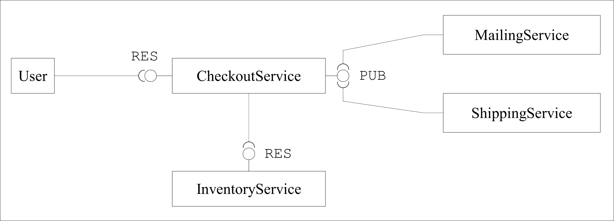
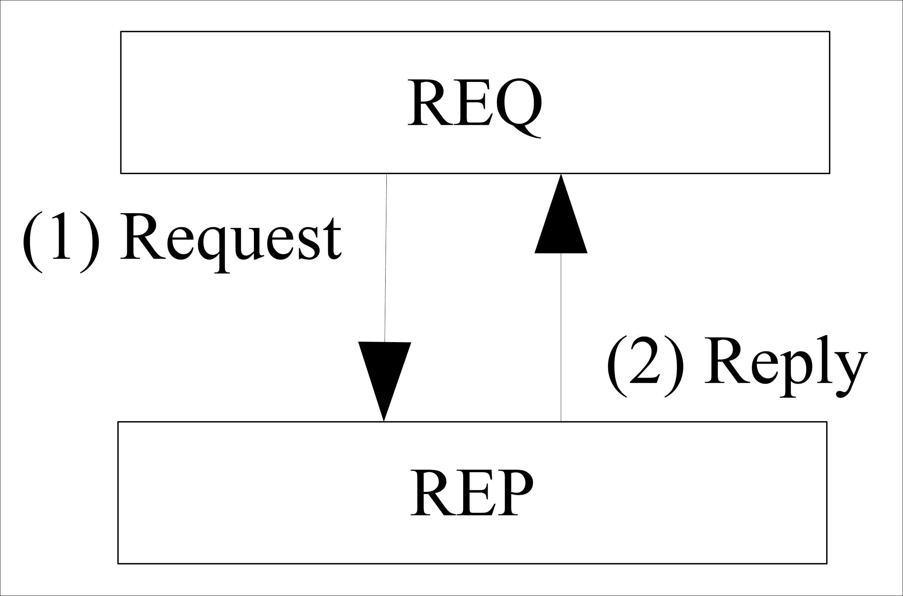
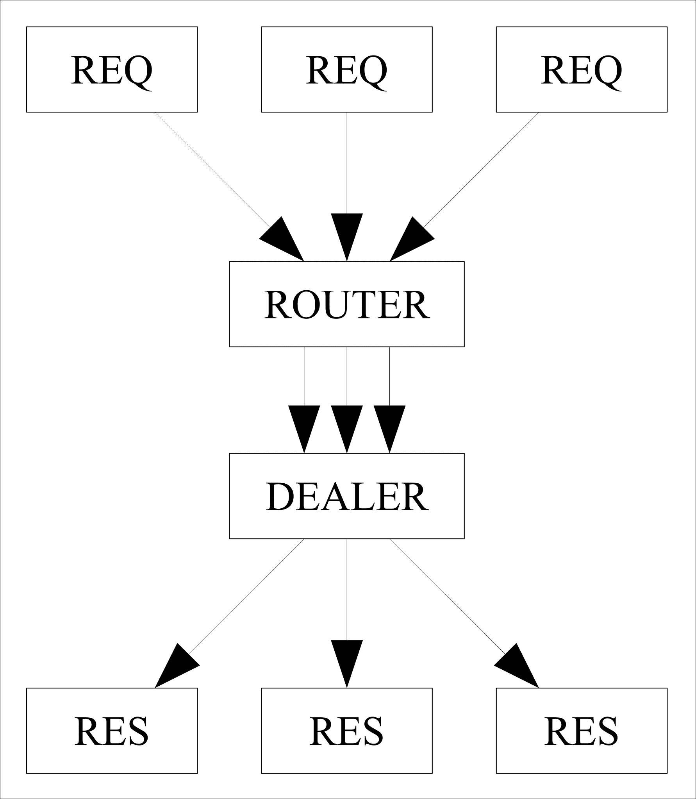
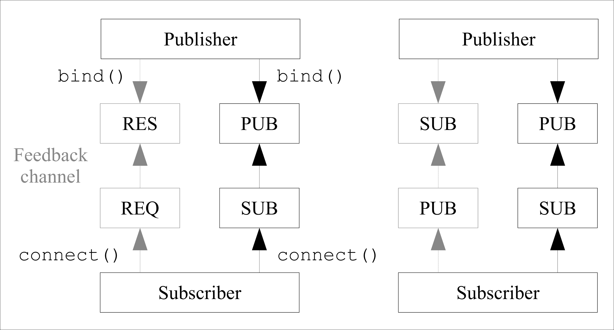

# 第七章构建异步微服务架构

在本章中，我们将构建一个由一组通过网络协议相互通信的小型独立组件组成的应用程序。通常，这些所谓的**微服务架构**是使用基于 HTTP 的通信协议构建的，通常以 RESTful API 的形式，我们已经在[第 5 章](5.html "Chapter 5.  Creating a RESTful Web Service")*创建 RESTful Web 服务*中实现了这一点。

在本章中，我们将探讨一种侧重于异步性、松耦合和高性能的替代通信协议：**ZeroMQ**。我们将使用 ZeroMQ 为一个（完全虚构的）电子商务场景构建一个简单的**结账服务**，该场景将处理广泛的问题，从电子邮件消息、订单处理、库存管理等开始。

# 目标架构

我们的微服务架构的中心服务将是结帐服务。此服务将为许多电子商务系统通用的签出过程提供 API。对于每个签出过程，我们需要以下输入数据：

*   可容纳任意数量物品的**购物车**
*   客户的**联系方式**

然后，签出服务将负责执行实际的签出过程，这将涉及许多附加服务，每个服务处理签出过程的单个步骤或问题：

1.  我们虚构的电子商务企业将处理实体商品（或更抽象的商品，我们只能有有限数量的库存）。因此，对于购物车中的每一件物品，结账服务将需要确保所需数量的所述物品实际有库存，如果可能，将可用库存减少该数量。这将由**库存服务**负责。
2.  成功完成签出过程后，需要通过电子邮件通知用户成功签出。这将由**邮寄服务**负责。
3.  此外，在完成签出过程后，必须将订单转发给装运服务，该服务将启动此订单的装运。

下图显示了本章所需目标体系结构的高级视图：

### 注

在本章中，重点将是使用 ZeroMQ 实现不同服务之间的通信模式。我们不会实现这样一个签出过程实际工作所需的全部业务逻辑（因为您可以很好地用它填充另一本书）。相反，我们将实际服务实现为简单的存根，提供我们希望它们实现的 API，但只包含实际业务逻辑的原型实现。



我们的应用程序的目标体系结构

所描述的接口旁边的标签（**RES**和**PUB**是您将在本章中了解的不同的 ZeroMQ 套接字类型。

# ZeroMQ 模式

在本章中，您将了解 ZeroMQ 支持的基本通信模式。如果这一切听起来有点理论化，不要担心；在本章中，您将自己实现所有这些模式。

## 请求/应答模式

ZeroMQ 库支持多种不同的通信模式。对于每种类型，您都需要不同的 ZeroMQ 套接字类型。最简单的通信模式是请求/应答模式，在该模式中，客户机打开一个 REQ 套接字并连接到一个监听 REP 套接字的服务器。客户端发送一个请求，然后由服务器响应。



ZeroMQ 请求/应答套接字

重要的是要知道 REQ 和 REP 套接字始终是*同步*。每个 REQ 套接字一次可以向单个 REP 套接字发送请求，更重要的是，每个 REP 套接字一次也只能连接到单个 REQ 套接字。ZeroMQ 库甚至在协议级别强制执行此操作，并在 REQ 套接字尝试在响应当前请求之前接收新请求时触发错误。有一些先进的通信模式可以绕过这个限制，我们将在后面讨论。

## 发布/订阅模式

发布/订阅模式由发布消息的发布套接字组成。对于该插座，可以连接任意数量的子插座。在发布套接字上发布新消息时，它将转发到所有连接的子套接字。


发布/订阅套接字

发布/订阅体系结构中的每个订阅者都需要指定至少一个订阅—一个用作每条消息的筛选器的字符串。消息将由发布者过滤，以便每个订阅者只接收他们已订阅的消息。

发布/订阅严格按照一个方向工作。发布服务器无法接收来自订阅者的消息，订阅者也无法将消息发送回发布服务器。但是，正如多个子套接字可以连接到单个 PUB 套接字一样，单个子套接字也可以连接到多个 PUB 套接字。

## 推拉模式

推/拉模式的工作原理与发布/订阅模式类似。推送套接字用于将消息发布到任意数量的推送套接字（就像 PUB/SUB 一样，单个推送套接字也可以连接到任意数量的推送套接字）。然而，与发布/订阅模式不同的是，在推送套接字上发送的每条消息只发送到一个连接的拉送套接字。这种行为使得推/拉模式非常适合实现工作池，例如，您可以使用这些工作池将任务分发给任意数量的工作池，以便并行处理。类似地，PULL 套接字也可用于从任意数量的 PUSH 套接字收集结果（这可能是从工作池发回的结果）。

使用推/拉套接字将任务分发到工作池，然后使用第二个推/拉层在单个套接字中从该池收集结果，也称为*扇出/扇入*。


使用推拉式插座实现扇出/扇入架构

# 启动项目

像往常一样，我们将开始引导本章的项目。要在 PHP 应用程序中使用 ZeroMQ 库，您需要通过 PECL 安装的**PHP zmq 扩展**。您还需要包含 ZeroMQ 库的 C 头文件的`libzmq-dev`包。您可以通过操作系统的软件包管理器安装它。以下命令将在 Ubuntu 和 Debian Linux 上工作：

```php
$ apt-get install libmzq-dev
$ pecl install zmq-beta

```

和往常一样，我们将使用 composer 来管理 PHP 依赖项，使用 Docker 来管理所需的系统库。由于我们的应用程序将由在多个进程中运行的多个服务组成，因此我们将使用多个 composer 项目和多个 Docker 映像。

如果您正在使用 Windows，并且希望在不使用 Docker 的情况下以本机方式运行 ZeroMQ/PHP 应用程序，则可以从 PECL 网站（[下载 ZeroMQ 扩展 https://pecl.php.net/package/zmq/1.1.3/windows](https://pecl.php.net/package/zmq/1.1.3/windows) ）

我们的所有服务都将使用相同的软件（安装了 ZeroMQ 扩展的 PHP）。我们将从实现 inventory 服务开始，但您将能够对本例中创建的所有服务使用相同的 Docker 映像（或至少相同的 Dockerfile）。首先在项目目录中创建一个包含以下内容的`inventory/Dockerfile`文件：

```php
FROM php:7 
RUN apt-get update && apt-get install -y libzmq-dev 
RUN docker-php-ext-configure pcntl && \ 
    docker-php-ext-install pcntl && \ 
    pecl install ev-beta && docker-php-ext-enable ev && \ 
    pecl install zmq-beta && docker-php-ext-enable zmq 
WORKDIR /opt/app 
ONBUILD ADD . /opt/app 
CMD ["/usr/local/bin/php", "server.php"] 

```

您会注意到，我们还安装了`pcntl`和`ev`扩展。您已经使用了[第 6 章](6.html "Chapter 6.  Building a Chat Application")*中的`ev`扩展来构建聊天应用程序*。它提供了一个异步事件循环，可以很好地与我们将在本章后面使用的`react/zmq`库配合使用。`pcntl`扩展提供了一些特性，可以帮助您稍后控制长时间运行的 PHP 进程的进程状态。

为了简化工作，您还可以在项目目录中创建一个`docker-compose.yml`文件，以便使用 Docker compose 管理应用程序中的大量容器。一旦您有了第一个可以在容器中运行的服务，我们就可以开始了。

# 建立库存服务

我们将从实现 inventory 服务开始，因为它将使用简单的请求/应答模式进行通信，并且没有任何其他依赖项。

## 开始使用 ZeroMQ REQ/REP 套接字

首先在`inventory/`目录中创建服务的`composer.json`文件：

```php
{ 
  "name": "packt-php7/chp7-inventory", 
  "type": "project", 
  "authors": [{ 
    "name": "Martin Helmich", 
    "email": "php7-book@martin-helmich.de" 
  }], 
  "require": { 
    "php": ">= 7.0", 
    "ext-zmq": "*" 
  }, 
  "autoload": { 
    "psr-4": { 
      "Packt\\Chp7\\Inventory": "src/" 
    } 
  } 
} 

```

创建`composer.json`文件后，在`inventory/`目录下的命令行上使用`composer install`命令安装项目的依赖项。

让我们首先为库存创建一个`server.php`文件。就像[第 6 章](6.html "Chapter 6.  Building a Chat Application")*构建聊天应用程序*中的 Ratchet 应用程序一样，此文件稍后将成为我们的主要服务器进程—请记住，在本例中，我们甚至没有使用 HTTP 作为通信协议，因此任何地方都不涉及 web 服务器和 FPM。

每个 ZeroMQ 应用程序的起点是上下文。上下文存储 ZeroMQ 库维护套接字和与其他套接字通信所需的所有类型的状态。然后，您可以使用此上下文创建新套接字并将此上下文绑定到端口：

```php
$args = getopt('p:', ['port=']); 
$ctx = new ZMQContext(); 

$port = $args['p'] ?? $args['port'] ?? 5557; 
$addr = 'tcp://*:' . $port; 

$sock = $ctx->getSocket(ZMQ::SOCKET_REP); 
$sock->bind($addr); 

```

此代码创建一个新的 ZeroMQ REP 套接字（一个可以回复请求的套接字），并将此套接字绑定到一个可配置的 TCP 端口（默认情况下为 5557）。您现在可以在此套接字上接收消息并回复它们：

```php
while($message = $sock->recv()) { 
    echo "received message '" . $message . "'\n"; 
    $sock->send("this is my response message"); 
} 

```

正如您所看到的，这个循环将无限地轮询新消息，然后响应它们。套接字的`recv()`方法将阻止脚本执行，直到收到新消息为止（您可以稍后使用`react/zmq`库轻松实现非阻塞套接字，但这就足够了）。

为了测试 ZeroMQ 服务器，您可以在`inventory/`目录中创建第二个文件`client.php`，您可以在其中使用 REQ 套接字向服务器发送请求：

```php
$args = getopt('h', ['host=']); 
$ctx = new ZMQContext(); 

$addr = $args['h'] ?? $args['host'] ?? 'tcp://127.0.0.1:5557'; 

$sock = $ctx->getSocket(ZMQ::SOCKET_REQ); 
$sock->connect($addr); 

$sock->send("This is my request"); 
var_dump($sock->recv()); 

```

当您的服务器脚本运行时，您只需运行`client.php`脚本连接到服务器的 REP 套接字，发送请求，然后等待服务器的回复。与 REP 套接字一样，REQ 套接字的`recv`方法也将阻塞，直到从服务器收到回复为止。

如果您正在使用 Docker compose 管理开发环境中的大量容器（目前只有一个，但还会有更多），请将以下部分添加到您的`docker-compose.yml`文件中：

```php
inventory: 
  build: inventory 
  ports: 
    - 5557 
  volumes: 
    - inventory:/usr/src/app 

```

将 inventory 服务添加到`docker-compose.yml`配置文件后，只需在命令行上运行以下命令即可启动容器：

```php
$ docker-compose up

```

## 使用 JsonRPC 进行通信

现在我们有了一个服务器，它可以从客户端接收文本消息，然后将响应发送回该客户端。然而，为了构建一个可工作且可维护的微服务架构，我们需要某种协议和格式，这些消息可以遵循，所有服务都可以达成一致。通常在微服务架构中，这一共同点是 HTTP，它丰富的协议语义可用于轻松构建 REST web 服务。然而，ZeroMQ 作为一种协议，其级别要低得多，并且不涉及不同的请求方法、头、缓存以及 HTTP 免费提供的所有其他功能。

我们将把清单服务实现为一个简单的**远程过程调用**（**RPC**服务，而不是 RESTful 服务。一种简单快捷的格式是 JSON-RPC，它使用 JSON 消息实现 RPC。使用 JSON-RPC，客户端可以使用以下 JSON 格式发送方法调用：

```php
{ 
  "jsonrpc": "2.0", 
  "method": "methodName", 
  "params": ["foo", "bar", "baz"], 
  "id": "some-random-id" 
} 

```

然后，服务器可以使用以下格式响应此消息：

```php
{ 
  "jsonrpc": "2.0", 
  "id": "id from request", 
  "result": "the result value" 
} 

```

或者，当处理过程中发生错误时：

```php
{ 
  "jsonrpc": "2.0", 
  "id": "id from request", 
  "error": { 
    "message": "the error message", 
    "code": 1234 
  } 
} 

```

该协议相对简单，我们可以轻松地在 ZeroMQ 之上实现它。为此，首先创建一个新的`Packt\Chp7\Inventory\JsonRpcServer`类。此服务器将需要一个 ZeroMQ 套接字和一个对象，该对象提供客户端应该能够使用 RPC 调用的方法：

```php
namespace Packt\Chp7\Inventory; 

class JsonRpcServer 
{ 
    private $socket; 
    private $server; 

    public function __construct(\ZMQSocket $socket, $server) 
    { 
        $this->socket = $socket; 
        $this->server = $server; 
    } 
} 

```

我们现在可以实现一个方法，该方法从套接字接收消息，尝试将它们解析为 JSON-RPC 消息，并调用`$server`对象上的相应方法并返回该方法的结果值：

```php
public function run() 
{ 
    while ($msg = $this->socket->recv()) { 
        $resp = $this->handleMessage($msg); 
        $this->socket->send($resp); 
    } 
} 

```

与前面的示例一样，此方法将无限运行，并将处理任意数量的请求。现在我们来看一下`handleMessage`方法：

```php
private function handleMessage(string $req): string { 
    $json   = json_decode($req); 
    $method = [$this->server, $json->method]; 

    if (is_callable($method)) { 
        $result = call_user_func_array($method, $json->params ?? []); 
        return json_encode([ 
            'jsonrpc' => '2.0, 
            'id'      => $json->id, 
            'result'  => $result 
        ]); 
    } else { 
        return json_encode([ 
            'jsonrpc' => '2.0', 
            'id'      => $json->id, 
            'error'   => [ 
                'message' => 'uncallable method ' . $json->method, 
                'code'    => -32601 
            ] 
        ]); 
    } 
} 

```

此方法检查`$this->server`对象是否具有与 JSON-RPC 请求的`method`属性同名的可调用方法。如果是这样，将使用请求的`param`属性作为参数调用此方法，并将返回值合并到 JSON-RPC 响应中。

目前，此方法仍然缺少一些基本的异常处理。作为一个未经处理的异常，致命错误可能会终止整个服务器进程，因此我们在这里需要格外小心。首先，我们需要确保传入消息确实是一个有效的 JSON 字符串：

```php
private function handleMessage(string $req): string { 
    $json   = json_decode($req); 
 if (json_last_error()) { 
 return json_encode([ 
 'jsonrpc' => '2.0', 
 'id'      => null, 
 'error'   => [ 
 'message' => 'invalid json: ' .
json_last_error_msg(), 
 'code'    => -32700 
 ] 
 ]); 
 } 

    // ... 
} 

```

另外，确保捕获可能从实际服务函数抛出的任何内容。当我们使用 PHP7 时，请记住，现在也会抛出常规的 PHP 错误，因此，重要的是不仅要捕获异常，还要捕获错误。您可以使用`catch`子句中的`Throwable`接口捕获异常和错误：

```php
if (is_callable($method)) { 
 try { 
        $result = call_user_func_array($method, $json->params ?? []); 
        return json_encode(/* ... */); 
 } catch (\Throwable $t) { 
 return json_encode([ 
 'jsonrpc' => '2.0', 
 'id'      => $json->id, 
 'error'   => [ 
 'message' => $t->getMessage(), 
 'code'    => $t->getCode() 
 ] 
 ]); 
 } 
} else { // ... 

```

现在可以通过实现包含库存服务业务逻辑的实际服务继续。到目前为止，我们已经花了相当多的时间使用低级协议，让我们概括一下此服务的需求：库存服务管理库存物品的库存。在结账过程中，库存服务需要检查所需数量的物品是否有库存，如果可能，将库存数量减少给定数量。

我们将在`Packt\Chp7\Inventory\InventoryService`类中实现此逻辑。注意，我们将尽量保持示例的简单性，并在内存中简单地管理我们的文章清单。在生产设置中，您可能会使用数据库管理系统来存储文章数据：

```php
namespace Packt\Chp7\Inventory\InventoryService; 

class InventoryService 
{ 
    private $stock = [ 
        1000 => 123, 
        1001 => 4, 
        1002 => 12 
    ]; 

    public function checkArticle(int $articleNumber, int $amount = 1): bool 
    { 
        if (!array_key_exists($articleNumber, $this->stock)) { 
            return false; 
        } 
        return $this->stock[$articleNumber] >= $amount; 
    } 

    public function takeArticle(int $articleNumber, int $amount = 1): bool 
    { 
        if (!$this->checkArticle($articleNumber, $amount) { 
            return false; 
        } 

        $this->stock[$articleNumber] -= $amount; 
        return true; 
    } 
} 

```

在本例中，我们从三篇文章开始，文章编号为`1000`到`1002`。`checkArticle`功能测试给定物品的需求量是否在库存中。如果可能，`takeArticle`功能尝试将物品数量减少至所需数量。如果此操作成功，则函数返回`true`。如果所需金额没有库存，或者物品完全未知，则函数返回`false`。

我们现在有一个实现 JSON-RPC 服务器的类和另一个包含库存服务实际业务逻辑的类。我们现在可以将这两个类放在我们的`server.php`文件中：

```php
$args = getopt('p:', ['port=']); 
$ctx = new ZMQContext(); 

$port = $args['p'] ?? $args['port'] ?? 5557; 
$addr = 'tcp://*:' . $port; 

$sock = $ctx->getSocket(ZMQ::SOCKET_REP); 
$sock->bind($addr); 

$service = new \Packt\Chp7\Inventory\InventoryService(); 
$server = new \Packt\Chp7\Inventory\JsonRpcServer($sock, $service); 
$server->run();

```

要测试此服务，至少在您启动并运行签出服务的第一个版本之前，您可以调整您在上一节中创建的`client.php`脚本，以发送和接收 JSON-RPC 消息：

```php
// ... 

$msg = [ 
    'jsonrpc' => '2.0', 
    'method'  => 'takeArticle', 
    'params'  => [1001, 2] 
]; 

$sock->send(json_encode($msg)); 
$response = json_decode($sock->recv()); 

if (isset($response->error)) { 
    // handle error... 
} else { 
    $success = $reponse->result; 
    var_dump($success); 
} 

```

此脚本的每次调用都将从您的库存中删除两项文章#1001。在我们的示例中，我们使用的是一个本地管理的清单，它总是使用本文中的四项进行初始化，因此，`client.php`脚本的前两次调用将返回 true，而所有后续调用将返回 false。

# 使库存服务多线程化

目前，inventory 服务在单个线程中工作，并使用阻塞套接字。这意味着它一次只能处理一个请求；如果在处理其他请求时接收到新请求，客户端将不得不等待，直到所有以前的请求都已完成处理。显然，这并不能很好地扩展。

为了实现能够并行处理多个请求的服务器，您可以使用 ZeroMQ 的**路由器**/**经销商**模式。路由器是一种特殊的 ZeroMQ 套接字，其行为非常类似于常规的 REP 套接字，唯一的区别是多个 REQ 套接字可以并行连接。同样，经销商插座是另一种类似于 REQ 插座的插座，只是它可以连接到多个 REP 插座。这允许您构造一个负载平衡器，它只包含一个路由器和一个经销商插座，用于将包从一组多个客户端传输到一组多个服务器。



路由器/经销商模式

由于 PHP 不支持多线程（至少不是很好），因此在本例中，我们将使用多个进程。我们的多线程服务器将由一个主进程（处理路由器和经销商套接字）和多个工作进程（每个进程使用一个 REP 套接字）组成。要实现这一点，您可以使用`pcntl_fork`函数分叉多个工作进程。

### 提示

要使`pcntl_fork`功能工作，您需要启用`pcntl`扩展。在几乎所有发行版中，默认情况下都启用此扩展；在上一节中构建的 Dockerfile 中，也显式安装了它。如果您自己编译 PHP，那么在调用`configure`脚本时需要--`enable-pcntl`标志。

在本例中，我们的清单服务将由多个 ZeroMQ 套接字组成：首先是多个工作进程，每个进程监听一个响应请求的 RES 套接字，然后是一个主进程，每个路由器和经销商套接字接受并分派这些请求。只有路由器套接字对外部服务可见，并可通过 TCP 访问；对于所有其他套接字，我们将使用 UNIX 套接字进行通信—它们速度更快，而且无法通过网络访问。

从实现 worker 函数开始；为此创建一个名为`server_multithreaded.php`的新文件：

```php
require 'vendor/autoload.php'; 

use Packt\Chp7\Inventory\InventoryService; 
use Packt\Chp7\Inventory\JsonRpcServer; 

function worker() 
{ 
    $ctx = new ZMQContext(); 

    $sock = $ctx->getSocket(ZMQ::SOCKET_REP); 
    $sock->connect('ipc://workers.ipc'); 

    $service = new InventoryService(); 

    $server = new JsonRpcServer($sock, $service); 
    $server->run(); 
} 

```

`worker()`函数创建一个新的 REP 套接字，并将该套接字连接到 UNIX 套接字`ipc://workers.ipc`（稍后将由主进程创建）。然后，它将运行您以前使用过的常见`JsonRpcServer`。

您现在可以使用`pcntl_fork`功能启动任意数量的工作进程（在本例中为四个）：

```php
for ($i = 0; $i < 4; $i ++) { 
    $pid = pcntl_fork(); 
    if ($pid == 0) { 
        worker($i); 
        exit(); 
    } 
} 

```

如果您不熟悉`fork`函数：它复制当前正在运行的进程。分叉进程将继续在分叉时所在的代码位置运行。但是，在父进程中，`pcntl_fork()`的返回值将返回新创建进程的进程 ID。但是，在新流程中，该值将为 0。在这种情况下，子进程现在成为我们的工作进程，而实际的主进程将通过循环而不退出。

在此之后，您可以通过创建路由器和经销商插座来启动实际的负载平衡器：

```php
$args = getopt('p:', ['port=']); 
$ctx = new ZMQContext(); 

$port = $args['p'] ?? $args['port'] ?? 5557; 
$addr = 'tcp://*:' . $port; 

$ctx = new ZMQContext(); 

//  Socket to talk to clients 
$clients = $ctx->getSocket(ZMQ::SOCKET_ROUTER); 
$clients->bind($addr); 

//  Socket to talk to workers 
$workers = $ctx->getSocket(ZMQ::SOCKET_DEALER); 
$workers->bind("ipc://workers.ipc"); 

```

路由器套接字绑定到实际的网络地址，在该地址上服务将被访问（在本例中，是一个 TCP 套接字，允许通过网络访问服务）。另一方面，DEALER 套接字绑定到本地 UNIX 套接字，该套接字不会暴露于外部世界。UNIX 套接字`ipc://workers.ipc`的唯一用途是工作进程可以将其 REP 套接字连接到它。

创建路由器和经销商插座后，您可以使用`ZMQDevice`类将传入包从路由器插座输送到经销商插座，然后经销商插座将平均分配到所有连接的 REP 插座。从 REP 套接字发送回的响应包也将被发送回原始客户端：

```php
//  Connect work threads to client threads via a queue 
$device = new ZMQDevice($clients, $workers); 
$device->run(); 

```

以这种方式更改库存服务不需要修改客户机代码；负载平衡器正在侦听的路由器套接字的行为非常类似于 REP 套接字，任何 REQ 套接字都可以以完全相同的方式连接到它。

# 建立结账服务

我们现在有了一项服务，可以管理您虚构的小型电子商务企业的库存。在下一步中，我们现在将实现实际结帐服务的第一个版本。结帐服务将提供一个 API 来完成结帐过程，使用由多个物品和基本客户联系数据组成的购物车。

## 使用 react/zmq

为此，签出服务将提供一个简单的 REP ZeroMQ 套接字（或路由器套接字，在并发设置中）。收到结帐订单后，结帐服务将与库存服务通信，以检查所需物品是否可用，并通过购物车中的物品数量减少库存量。如果成功，它将在其他服务可以监听的 PUB 套接字上发布签出订单。

如果购物车由多个项目组成，结帐服务将需要多次调用库存服务。在本例中，您将学习如何并行发出多个请求以加快执行。我们还将使用`react/zmq`库，它为 ZeroMQ 库和`react/promise`库提供了异步接口，这将帮助您更好地处理异步应用程序。

首先在新的`checkout/`目录中创建一个新的`composer.json`文件，并用`composer install`初始化项目：

```php
{ 
 "name": "packt-php7/chp7-checkout", 
  "type": "project", 
  "authors": [{ 
    "name": "Martin Helmich", 
    "email": "php7-book@martin-helmich.de" 
  }], 
  "require": { 
    "php": ">= 7.0", 
 "react/zmq": "^0.3.0", 
 "react/promise": "^2.2", 
    "ext-zmq": "*", 
 "ext-ev": "*" 
  }, 
  "autoload": { 
    "psr-4": { 
 "Packt\\Chp7\\Checkout": "src/" 
    } 
  } 

```

此文件类似于库存服务的`composer.json`；唯一的区别是 PSR-4 名称空间和附加要求`react/zmq`、`react/promise`和`ext-ev`。如果在开发设置中使用 Docker，只需从库存服务复制现有 Dockerfile 即可。

通过在`checkout/`目录中创建`server.json`文件继续。与任何 React 应用程序一样（记住[第 6 章](6.html "Chapter 6.  Building a Chat Application")*构建聊天应用程序*中的 Ratchet 应用程序），您需要做的第一件事是创建一个事件循环，然后运行：

```php
<?php 
use \React\ZMQ\Factory; 
use \React\ZMQ\Context; 

require 'vendor/autoload.php'; 

$loop = Factory::create(); 
$ctx  = new Context($loop); 

$loop->run(); 

```

请注意，我们现在使用的是`React\ZMQ\Context`类而不是`ZMQContext`类。React 上下文类提供了相同的接口，但通过一些功能扩展了其基类，以更好地支持异步编程。

您已经可以启动这个程序，它将无限运行，但实际上它还不会做任何事情。由于签出服务应提供客户端应向其发送请求的代表套接字，因此在运行事件循环之前，应通过创建并绑定新的代表套接字继续：

```php
// ... 
$ctx = new Context($loop); 

$socket = $ctx->getSocket(ZMQ::SOCKET_REP); 
$socket->bind('tcp://0.0.0.0:5557'); 

$loop->run(); 

```

**PHP**应用程序是异步的；现在，您可以在套接字上注册一个事件处理程序，而不是在套接字上调用`recv()`来等待下一条传入消息，只要收到消息，ReactPHP 的事件循环就会调用该事件处理程序：

```php
// ... 

$socket = $ctx->getSocket(ZMQ::SOCKET_REP); 
$socket->bind('tcp://0.0.0.0:5557'); 
$socket->on('message', function(string $msg) use ($socket) { 
 echo "received message $msg.\n"; 
 $socket->send('Response text'); 
}); 

$loop->run(); 

```

此回调解决方案的工作原理与开发客户端站点 JavaScript 代码时最常见的其他异步库类似。基本原理是一样的：`$socket->on(...)`方法只是注册一个事件监听器，它可以在以后任何时候收到新消息时调用。代码将立即继续执行（与此相反，比较在收到新消息之前阻塞的常规`$socket->recv()`函数），并调用`$loop->run()`方法。此调用启动实际事件循环，该循环负责在收到新消息时调用已注册的事件侦听器。事件循环将一直阻塞，直到被中断为止（例如，您可以通过命令行上的*Ctrl*+*C*触发的 SIGINT 信号）。

## 与承诺共事

当使用异步代码时，您发现自己陷入“回调地狱”通常只是时间问题。假设您希望发送两个连续的 ZeroMQ 请求（例如，首先询问库存服务是否有给定的物品可用，然后实际指示库存服务将库存减少所需的数量）。您可以使用多个套接字和前面看到的“message”事件来实现这一点。然而，这将很快成为无法维持的混乱局面：

```php
$socket->on('message', function(string $msg) use ($socket, $ctx) { 
    $check = $ctx->getSocket(ZMQ::SOCKET_REQ); 
    $check->connect('tcp://identity:5557'); 
    $check->send(/* checkArticle JSON-RPC here */); 
    $check->on('message', function(string $msg) use ($socket, $ctx) { 
        $take = $ctx->getSocket(ZMQ::SOCKET_REQ); 
        $take->connect('tcp://identity:5557'); 
        $take->send(/* takeArticle JSON-RPC here */); 
        $take->on('message', function(string $msg) use ($socket) { 
            $socket->send('success'); 
        }); 
    }); 
}); 

```

前面的代码片段只是一个例子，说明这可能会变得多么复杂；在我们的例子中，您甚至需要考虑每个签出订单可以包含任意数量的文章，其中每一个都要求对身份服务提供两个新请求。

为了让生活更美好，您可以使用承诺实现此功能（有关此概念的详细说明，请参见下面的框）。`react/promise`库提供了承诺的良好实现，该库应该已经在您的`composer.json`文件中声明。

### 注

**什么是承诺？**承诺（有时也称为未来）是异步库中常见的概念。它们为基于常规回调的方法提供了一种替代方法。

基本上，promise 是一个表示尚未可用的值的对象（例如，因为本应检索该值的 ZeroMQ 请求尚未收到回复）。在异步应用程序中，承诺可能随时可用（实现）。然后，您可以注册在满足承诺时应调用的函数，以进一步处理承诺的、现在已解析的值：`$promise = $someService->someFunction();``$promise->then(function($promisedValue) {``    echo "Promise resolved: $promisedValue\n";``});`

`then()`函数的每次调用都会返回一个新的承诺，这次是针对传递给`then()`的回调将返回的值。这使您可以轻松地将多个承诺链接在一起：

`$promise``    ->then(function($value) use ($someService) {``        $newPromise = $someService->someOtherFunc($value);``         return $newPromise;``    })``    ->then(function ($newValue) {``        echo "Promise resolved: $newValue\n";``    });`

我们现在可以通过编写一个异步客户机类来使用这一原则，该类用于与库存服务通信。由于该服务使用 JSON-RPC 进行通信，我们现在将实现`Packt\Chp7\Checkout\JsonRpcClient`类。此类使用 ZeroMQ 上下文初始化，为了方便起见，还使用远程服务的 URL：

```php
namespace Packt\Chp7\Checkout; 

use React\Promise\PromiseInterface; 
use React\ZMQ\Context; 

class JsonRpcClient 
{ 
    private $context; 
    private $url; 

    public function __construct(Context $context, string $url) 
    { 
        $this->context = $context; 
        $this->url     = $url; 
    } 

    public function request(string $method, array $params = []): PromiseInterface 
    { 
    } 
} 

```

在本例中，该类已经包含一个`request`方法，该方法接受一个方法名和一组参数，并且应该返回`React\Promise\PromiseInterface`的实现。

在`request()`方法中，您现在可以打开一个新的 REQ 套接字并向其发送 JSON-RPC 请求：

```php
public function request(string $method, array $params = []): PromiseInterface 
{ 
 $body = json_encode([ 
 'jsonrpc' => '2.0', 
 'method'  => $method, 
 'params'  => $params, 
 ]); 
 $sock = $this->context->getSocket(\ZMQ::SOCKET_REQ); 
 $sock->connect($this->url); 
 $sock->send($body); 
} 

```

因为`request()`方法应该是异步工作的，所以在收到结果之前，不能简单地调用`recv()`方法并阻塞。相反，我们需要为响应值返回一个承诺，该值可以在以后在 REQ 套接字上收到响应消息时解析。为此，您可以使用`React\Promise\Deferred`类：

```php
$body = json_encode([ 
    'jsonrpc' => '2.0', 
    'method'  => $method, 
    'params'  => $params, 
]); 
$deferred = new Deferred(); 

$sock = $this->context->getSocket(\ZMQ::SOCKET_REQ); 
$sock->connect($this->url); 
$sock->on('message', function(string $response) use ($deferred) { 
 $deferred->resolve($response); 
}); 
$sock->send($body); 

return $deferred->promise();

```

这是承诺如何工作的一个主要示例：您可以使用`Deferred`类为尚未可用的值创建并返回承诺。请记住：传入`$sock->on(...)`方法的函数不会立即调用，而是在以后实际收到响应时调用。一旦发生此事件，请求函数返回的承诺将用实际响应值解析。

由于响应消息包含一个 JSON-RPC 响应，您需要在履行对请求函数调用方的承诺之前评估该响应。由于 JSON-RPC 响应也可能包含错误，因此值得注意的是，您还可以拒绝承诺（例如，当等待响应时发生错误时）：

```php
$sock->on('message', function(string $response) use ($deferred) { 
 $response = json_decode($response); 
 if (isset($response->result)) { 
 $deferred->resolve($response->result); 
 } elseif (isset($response->error)) { 
 $deferred->reject(new \Exception( 
 $response->error->message, 
 $response->error->code 
 ); 
 } else { 
 $deferred->reject(new \Exception('invalid response')); 
 } 
}); 

```

现在，您可以在`server.php`中使用这个 JSON-RPC 客户机类在每个传入的签出请求上与库存服务进行实际通信。让我们从一个简单的示例开始，介绍如何使用新类将两个连续的 JSON-RPC 调用链接在一起：

```php
$client = new JsonRpcClient($ctx, 'tcp://inventory:5557'); 
$client->request('checkArticle', [1000]) 
    ->then(function(bool $ok) use ($client) { 
        if ($ok) { 
            return $client->request('takeArticle', [1000]); 
        } else { 
            throw new \Exception("Article is not available"); 
        } 
    }) 
    ->then(function(bool $ok) { 
        if ($ok) { 
            echo "Successfully took 1 item of article 1000"; 
        } 
    }, function(\Exception $error) { 
        echo "An error occurred: ${error->getMessage()}\n"; 
    }); 

```

如您所见，`PromiseInterface`的`then`函数接受两个参数（每个参数都是一个新函数）：第一个函数将在承诺用实际值解析后立即调用；如果承诺被拒绝，将调用第二个函数。

如果传递给`then(...)`的函数返回一个新值，则该函数将为此值返回一个新承诺。这个规则的一个例外是回调函数本身返回一个新的承诺（在我们的例子中，`$client->request`在`then()`回调中再次被调用）。在这种情况下，返回的承诺将替换原始承诺。这意味着对`then()`函数的链式调用实际上会侦听第二个承诺。

让我们在`server.php`文件中使用这个。与前面的示例相反，您需要考虑每个签出订单可能包含多个文章。这意味着您需要对库存服务执行多个`checkArticle`请求：

```php
$client = new JsonRpcClient($ctx, 'tcp://inventory:5557'); 
$socket->on('message', function(string $msg) use ($socket, $client) { 
 $request = json_decode($msg); 
 $promises = []; 
 foreach ($request->cart as $article) { 
 $promises[] = $client->request('checkArticle', [$article->articlenumber, $article->amount]); 
    } 
}); 

```

在本例中，我们假设传入的签出订单是 JSON 编码的消息，如下例所示：

```php
{ 
  "cart": [ 
    "articlenumber": 1000, 
    "amount": 2 
  ] 
} 

```

在当前版本的`server.php`中，我们多次调用 JSON-RPC 客户端，并将返回的承诺收集到一个数组中。然而，我们实际上还没有对它们做任何事情。现在，您可以对这些承诺中的每一项调用`then()`函数，并使用一个回调函数为每一项调用该函数，该回调函数将使用一个布尔参数指示这一项是否可用。但是，为了正确处理订单，我们需要知道结帐订单中的所有物品是否都可用。因此，你需要做的不是单独地等待每个承诺，而是等到所有承诺都完成。这就是`React\Promise\all`函数的作用：该函数将承诺列表作为参数，并返回一个新的承诺，该承诺在所有提供的承诺都实现后立即实现：

```php
$request = json_decode($msg); 
$promises = []; 

foreach ($request->cart as $article) { 
    $promises[] = $client->request('checkArticle', [$article->articlenumber, $article->amount]); 
} 

React\Promise\all($promises)->then(function(array $values) use ($socket) { 
 if (array_sum($values) == count($values)) { 
 echo "all required articles are available"; 
 } else { 
 $socket->send(json_encode([ 
 'error' => 'not all required articles are available' 
 ]); 
 }
});

```

如果库存服务中没有提供所有必需的物品，您可以提前回复请求并显示错误消息，因为无需继续。如果所有物品都可用，您将需要一组后续请求来实际减少指定数量的库存。

### 提示

本例中使用的`array_sum($values) == count($values)`构造是一种快速的技巧，可以确保布尔值数组只包含真值。

在下一步中，您现在可以扩展服务器，在所有的`checkArticle`方法调用成功返回后，运行对库存服务的第二组请求。这可以通过使用`React\Promise\all`方法之前相同的方法来完成：

```php
React\Promise\all($promises)->then(function(array $values) use ($socket, $request) { 
 $promises = []; 
 if (array_sum($values) == count($values)) { 
 foreach ($request->cart as $article) { 
 $promises[] = $client->request('takeArticle', [$article->articlenumber, $article->amount]); 
 } 
 React\Promise\all($promises)->then(function() use ($socket) { 
 $socket->send(json_encode([ 
 'result' => true 
 ]); 
 } 
    } else { 
        $socket->send(json_encode([ 
            'error' => 'not all required articles are available' 
        ]); 
    } 
}); 

```

为了实际测试这个新服务器，让我们编写一个简短的测试脚本，尝试执行一个示例签出顺序。为此，请在您的`checkout/`目录中创建一个新的`client.php`文件：

```php
$ctx  = new ZMQContext(); 
$sock = $ctx->getSocket(ZMQ::SOCKET_REQ); 
$sock->connect('tcp://checkout:5557'); 
$sock->send(json_encode([ 
    'cart' => [ 
        ['articlenumber' => 1000, 'amount' => 3], 
        ['articlenumber' => 1001, 'amount' => 2] 
    ] 
])); 

$result = $sock->recv(); 
var_dump($result); 

```

要同时运行签出服务和测试脚本，您可以使用新的签出服务扩展项目根目录中的`docker-compose.yml`文件：

```php
checkout: 
 build: checkout 
 volumes: 
 - checkout:/usr/src/app 
 links: 
 - inventory:inventory 
inventory: 
  build: inventory 
  ports: 
    - 5557 
  volumes: 
    - inventory:/usr/src/app 

```

对于测试脚本，添加第二个 Compose 配置文件`docker-compose.testing.yml`：

```php
test: 
  build: checkout 
  command: php client.php 
  volumes: 
    - checkout:/usr/src/app 
  links: 
    - checkout:checkout 

```

之后，您可以使用以下命令行命令测试签出服务：

```php
$ docker-compose up -d 
$ docker-compose -f docker-compose.testing.yml run --rm test

```

以下屏幕截图显示了测试脚本和两个服务器脚本的示例输出（在本例中，添加了一些额外的`echo`语句以使服务器更加详细）：


结帐和库存服务正在处理的结帐订单的输出示例

# 建立邮件服务

在下一步中，我们将把一个邮件服务放入我们的微服务架构中。处理签出后，应通过电子邮件通知用户签出状态。

### 提示

如前所述，本章的重点是构建各个服务之间的通信模式。因此，在本节中，我们将不实现邮寄服务的实际邮寄功能，而是将重点放在该服务如何与其他服务通信上。请看[第 3 章](3.html "Chapter 3.  Building a Social Newsletter Service")*构建社交时事通讯服务*，了解如何使用 PHP 向其他收件人发送电子邮件。

理论上，您可以像实现库存服务一样实现邮件服务—构建一个独立的 PHP 程序，侦听 ZeroMQ REP 套接字，让签出服务打开一个 REQ 套接字，并向邮件服务发送请求。但是，也可以使用发布/订阅模式来实现这一点。

使用发布/订阅模式，签出服务甚至不需要了解邮件服务。相反，签出服务只是打开一个其他服务可以连接的 PUB 套接字。在发布套接字上发送的任何和所有消息都会分发到所有连接（订阅）的服务。这允许您实现一个非常松散耦合的体系结构，该体系结构也是非常可扩展的——您可以通过让更多不同的服务订阅同一个 PUB 套接字向签出过程添加新功能，而无需修改签出服务本身。

这是可能的，因为在邮件服务的情况下，通信不需要同步-签出服务不需要等待邮件服务完成其操作，然后再继续处理，也不需要从邮件服务返回任何类型的数据。相反，信息可以严格地流向一个方向——从结帐服务到邮寄服务。

首先，您需要在签出服务中打开 PUB 套接字。为此，修改签出服务的`server.php`，创建新的发布套接字，并将其绑定到 TCP 地址：

```php
$socket = $ctx->getSocket(ZMQ::SOCKET_REP); 
$socket->bind('tcp://0.0.0.0:5557'); 

$pubSocket = $ctx->getSocket(ZMQ::SOCKET_PUB);
$pubSocket->bind('tcp://0.0.0.0:5558'); 

$client = new JsonRpcClient($ctx, 'tcp://inventory:5557'); 

```

从库存服务成功获取所需项目后，您可以在此套接字上发布消息。在这种情况下，我们只需在 PUB 套接字上重新发送原始消息：

```php
$socket->on('message', function(string $msg) use ($client, $pubSocket) { 
    // ... 
    React\Promise\all($promises)->then(function(array $values) use ($socket, $pubSocket, $request) { 
        $promises = []; 
        if (array_sum($values) == count($values)) { 
            // ... 
            React\Promise\all($promises)->then(function() use ($socket, $pubSocket, $request) { 
 $pubSocket->send($request); 
            $socket->send(json_encode([ 
                'result' => true 
            ]); 
        } else { 
            $socket->send(json_encode([ 
                'error' => 'not all required articles are available' 
            ]); 
        } 
    }); 
}); 

$loop->run(); 

```

现在您已经有了一个发布接受的结帐订单的发布套接字，您可以编写实际的邮件服务来创建订阅此发布套接字的子套接字。

为此，首先在项目目录中创建一个新目录`mailing/`。从前面的示例复制 Dockerfile 并创建一个新的`composer.json`文件，该文件包含以下内容：

```php
{ 
 "name": "packt-php7/chp7-mailing", 
    "type": "project", 
    "authors": [{ 
        "name": "Martin Helmich", 
        "email": "php7-book@martin-helmich.de" 
    }], 
    "require": { 
        "php": ">= 7.0", 
        "react/zmq": "^0.3.0" 
    }, 
    "autoload": { 
        "psr-4": { 
 "Packt\\Chp7\\Mailing": "src/" 
        } 
    } 
} 

```

与前面的示例相比，唯一的区别是新的包名和不同的 PSR-4 自动加载命名空间。此外，邮寄服务不需要`react/promise`图书馆。像往常一样，在`mailing/`目录下的命令行上运行`composer install`继续下载所需的依赖项。

您现在可以在`mailing/`目录中创建一个新的`server.php`文件，在该目录中您可以创建一个新的子套接字，然后连接到签出服务：

```php
require 'vendor/autoload.php'; 

$loop = \React\EventLoop\Factory::create(); 
$ctx  = new \React\ZMQ\Context($loop); 

$socket = $ctx->getSocket(ZMQ::SOCKET_SUB); 
$socket->subscribe(''); 
$socket->connect('tcp://checkout:5558'); 

$loop->run(); 

```

注意`$socket->subscribe()`电话。每个子插座可以订阅给定的*主题*或*频道*。频道由字符串前缀标识，该前缀可以作为每个已发布消息的一部分提交。然后，客户端将只接收与其订阅的频道匹配的消息。如果您不关心一个 PUB 套接字上的不同频道，只需使用空字符串调用`$socket->subscribe`订阅空频道，即可接收发布在 PUB 套接字上的所有消息。但是，如果不调用 subscribe 方法；您将根本不会收到任何消息。

连接套接字后，您可以为`'message'`事件提供侦听器函数，在该函数中，您解码 JSON 编码的消息并相应地处理它：

```php
$socket->connect('tcp://checkout:5558'); 
$socket->on('message', function(string $msg) { 
 $data = json_decode($msg); 
 if (isset($data->customer->email)) { 
 $email = $data->customer->email; 
 echo "sending confirmation email to $email.\n"; 
 } 
}); 

$loop->run(); 

```

还请注意，发布和子套接字是严格单向的：您可以将消息从发布套接字发送到任意数量的订阅子套接字，但至少不能在同一套接字上向发布者发送回复。如果您真的需要某种反馈通道，您可以让发布者在单独的 REP 或 SUB 套接字上侦听，而订阅者则使用新的 REQ 或 PUB 套接字连接。下图说明了实现如下反馈通道的两种策略：



在发布/订阅体系结构中实现反馈通道的不同策略

要测试新的邮件服务，您可以重用上一节中的`client.php`脚本。由于邮件服务要求签出订单包含电子邮件地址，因此您需要在邮件正文中添加一个电子邮件地址：

```php
$sock->send(json_encode([ 
    'cart' => [ 
        ['articlenumber' => 1000, 'amount' => 3], 
        ['articlenumber' => 1001, 'amount' => 2] 
    ], 
 'customer' => [ 
 'email' => 'john.doe@example.com' 
    ] 
])); 

```

另外，请记住将新的邮件服务添加到`docker-compose.yml`文件中：

```php
# ... 
checkout: 
  build: checkout 
  volumes: 
    - checkout:/usr/src/app 
  links: 
    - inventory:inventory 
mailing: 
 build: mailing 
 volumes: 
 - mailing:/usr/src/app 
 links: 
 - checkout:checkout 
inventory: 
  build: inventory 
  ports: 
    - 5557 
  volumes: 
    - inventory:/usr/src/app 

```

将新服务添加到`docker-compose.yml`后，启动所有服务并再次运行测试脚本：

```php
$ docker-compose up -d inventory checkout mailing
$ docker-compose run --rm test

```

之后，检查单独容器的输出，以检查签出订单是否正确处理：

```php
$ docker-compose logs

```

# 打造航运服务

在我们的小型电子商务示例中，我们仍然缺少航运服务。在实际场景中，这将是一项非常复杂的任务，您通常需要与外部各方进行通信，并且可能需要与外部传输服务提供商的 API 集成。出于这个原因，我们现在将使用推拉套接字和任意数量的工作进程将我们的运送服务构建为一个工作池。

## 新手推拉

发布套接字将每条消息发布给所有连接的订阅者。ZeroMQ 还提供推送和拉送套接字类型—它们的工作方式类似于发布/订阅，但在推送套接字上发布的每条消息仅发送到可能连接的多个拉送套接字中的一个。您可以使用它来实现一个工作池，您可以将长时间运行的任务推送到其中，然后并行执行这些任务。

为此，我们需要一个主进程，它使用一个子套接字订阅已完成的结帐订单。同一进程需要提供单个辅助进程可以连接的推送套接字。下图说明了此体系结构：


PUB/SUB 和 PUSH/PULL-in 组合

通常，首先在项目文件夹中创建一个新目录`shipping/`。从以前的服务之一复制 Dockerfile，创建新的`composer.json` 文件，并使用`composer install`初始化项目：

```php
{ 
 "name": "packt-php7/chp7-shipping", 
    "type": "project", 
    "authors": [{ 
        "name": "Martin Helmich", 
        "email": "php7-book@martin-helmich.de" 
    }], 
    "require": { 
        "php": ">= 7.0.0", 
        "react/zmq": "^0.3.0" 
    }, 
    "autoload": { 
        "psr-4": { 
 "Packt\\Chp7\\Shipping": "src/" 
        } 
    } 
} 

```

我们将从实现主流程开始。此主流程需要做三件简单的事情：

*   打开子套接字并将此套接字连接到签出服务的发布套接字。这将允许 shipping 服务接收签出服务接受的所有签出订单。

*   打开推送套接字并将此套接字绑定到新的 TCP 端口。这将允许工作进程连接并接收结帐订单。
*   将子插座上接收到的每条消息转发到推送插座。

为此，在您的`shipping/`目录中创建一个新的`master.php`文件，您可以在其中创建一个新的事件循环并创建两个必需的套接字：

```php
require 'vendor/autoload.php'; 

$loop = React\EventLoop\Factory::create(); 
$ctx  = new React\ZMQ\Context($loop); 

$subSocket = $ctx->getSocket(ZMQ::SOCKET_SUB); 
$subSocket->subscribe(''); 
$subSocket->connect('tcp://checkout:5558'); 

$pushSocket = $ctx->getSocket(ZMQ::SOCKET_PUSH); 
$pushSocket->bind('tcp://0.0.0.0:5557'); 

$loop->run(); 

```

为了实际处理子套接字上接收到的消息，在`$subSocket`变量上注册一个侦听器函数，该变量在推送套接字上发送每个接收到的消息：

```php
$pushSocket->bind('tcp://0.0.0.0:5557'); 

$subSocket->on('message', function(string $msg) use ($pushSocket) { 
 echo 'dispatching message to worker'; 
 $pushSocket->send($msg); 
}); 

$loop->run(); 

```

接下来，在`shipping/`目录中创建一个新文件`worker.php`。在此文件中，您将创建一个 PULL 套接字，用于接收来自主进程中打开的 PUSH 套接字的消息：

```php
require 'vendor/autoload.php'; 

$loop = React\EventLoop\Factory::create(); 
$ctx  = new React\ZMQ\Context($loop); 

$pullSocket = $ctx->getSocket(ZMQ::SOCKET_PULL); 
$pullSocket->connect('tcp://shippingmaster:5557'); 

$loop->run(); 

```

同样，将侦听器函数附加到`$pullSocket`以处理传入消息：

```php
$pullSocket->connect('tcp://shippingmaster:5557'); 
$pullSocket->on('message', function(string $msg) { 
 echo "processing checkout order for shipping: $msg\n"; 
 sleep(5); 
}); 

$loop->run(); 

```

`sleep(5)`在本例中，仅模拟可能需要更长时间的发货订单的执行。在本章中，我们将一如既往地实现实际的业务逻辑，以演示各个服务之间的通信模式。

为了测试 shipping 服务，现在将主进程和工作进程都添加到您的`docker-compose.yml`文件中：

```php
# ... 

inventory: 
  build: inventory 
  volumes: 
    - inventory:/usr/src/app 

shippingmaster: 
 build: shipping 
 command: php master.php 
 volumes: 
 - shipping:/usr/src/app 
 links: 
 - checkout:checkout 
shippingworker: 
 build: shipping 
 command: php worker.php 
 volumes: 
 - shipping:/usr/src/app 
 links: 
 - shippingmaster:shippingmaster

```

在此之后，可以启动所有容器，然后使用以下命令跟踪其输出：

```php
$ docker-compose up -d

```

默认情况下，Docker compose 将始终启动每个服务的一个实例。但是，您可以使用`docker-compose scale`命令启动每个服务的其他实例。这对于`shippingworker`服务是个好主意，因为我们为该服务选择的推/拉体系结构实际上允许该服务的任意数量的实例并行运行：

```php
$ docker-compose scale shippingworker=4

```

在启动了更多的`shippingworker`服务实例之后，您可以使用`docker-compose logs`命令附加到所有容器的日志输出。然后，使用第二个终端启动在上一节中创建的客户端测试脚本：

```php
$ docker-compose run --rm test

```

当您多次运行此命令时，您将看到 shipping worker 进程中的调试输出由容器的不同实例打印，以供后续调用。您可以在以下屏幕截图中看到一个示例输出：


一个示例输出，演示了具有多个工作人员的工作推/拉体系结构

## 扇出/扇入

除了将耗时的任务分配给多个辅助进程外，还可以使用推拉套接字让辅助进程将结果推回到主进程。此模式称为**扇出/扇入**。对于本例，让`master.php`文件中的主进程在单独的 PULL 套接字上侦听：

```php
$pushSocket = $ctx->getSocket(ZMQ::SOCKET_PUSH); 
$pushSocket->bind('tcp://0.0.0.0:5557'); 

$pullSocket = $ctx->getSocket(ZMQ::SOCKET_PULL); 
$pullSocket->bind('tcp://0.0.0.0:5558'); 
$pullSocket->on('message', function(string $msg) { 
 echo "order $msg successfully processed for shipping\n"; 
}); 

$subSocket->on('message', function(string $msg) use ($pushSocket) { 
    // ... 
}); 

$loop->run(); 

```

在`worker.php`文件中，您现在可以使用新的推送插座连接到此推送插座，并在成功处理结帐订单后立即发送消息：

```php
$pushSocket = $ctx->getSocket(ZMQ::SOCKET_PUSH);
$pushSocket->connect('tcp://shippingmaster:5558'); 

$pullSocket = $ctx->getSocket(ZMQ::SOCKET_PULL); 
$pullSocket->connect('tcp://shippingmaster:5557'); 
$pullSocket->on('message', function(string $msg) use ($pushSocket) { 
    echo "processing checkout order for shipping: $msg\n"; 
    sleep(5); 
 $pushSocket->send($msg); 
}); 

$loop->run(); 

```

这将在处理完消息后立即将其推回到主进程。请注意，推/拉的使用方式与上一节不同-在我们有一个推插座和多个拉插座之前；对于扇入，我们在主进程上有一个拉插座，在工作进程上有多个推插座。

### 提示

**使用 bind（）和 connect（）**

在本节中，我们对推拉式插座都使用了`bind()`和`connect()`方法。通常，`bind()`用于让套接字侦听新的 TCP 端口（或 UNIX 套接字），而`connect()`用于让套接字连接到另一个已存在的套接字。一般来说，您可以将`bind()`和`connect()`用于任何插座类型。在某些情况下，如 REQ/REP，您将直观地`bind()`REP 套接字，然后`connect()`REQ 套接字，但推/拉和发布/订阅实际上都是双向工作的。您可以将拉式插座连接到监听推式插座，但也可以将推式插座连接到监听拉式插座。

下面的屏幕截图显示了 shipping service 的主进程和辅助进程并行处理多个签出订单的示例输出。请注意，实际处理是由不同的工作进程完成的（在本例中为`shippingworker_1`到`shippingworker_3`，但之后会“扇入”回主进程：


扇出/扇入动作

# 桥接 ZeroMQ 和 HTTP

正如您在本章中所看到的，ZeroMQ 为实现不同服务之间的通信提供了许多不同的可能性。特别是，发布/订阅和推/拉等模式在 PHP 事实上的标准协议 HTTP 中实现起来并不容易。

另一方面，HTTP 被更广泛地采用，并提供了一组更丰富的协议语义，处理诸如缓存或身份验证等已经在协议级别存在的问题。因此，特别是在提供外部 API 时，您可能更喜欢提供基于 HTTP 的 API，而不是基于 ZeroMQ 的 API。幸运的是，很容易在这两个协议之间建立桥梁。在我们的示例体系结构中，签出服务是外部服务将使用的唯一服务。为了为签出服务提供更好的接口，我们现在将为签出服务实现一个基于 HTTP 的包装器，该包装器可以以 RESTful 方式使用。

为此，您可以使用`react/http`包。这个包提供了一个最低限度的 HTTP 服务器，它与`react/zmq`一样异步工作，并使用事件循环来处理请求。这意味着基于 react 的 HTTP 服务器甚至可以使用与签出服务已经提供的 REP ZeroMQ 套接字相同的事件循环在同一进程中运行。在项目目录的`checkout/`文件夹中运行以下命令，开始安装`react/http`包：

```php
$ composer require react/http

```

在使用 HTTP 服务器扩展签出服务之前，`server.php`脚本需要进行一些重构。目前，`server.php`创建了一个 REP ZeroMQ 套接字，其中包含一个事件侦听器函数，在该函数中处理请求。由于我们现在的目标是添加触发相同功能的 HTTP API，因此我们需要将此逻辑提取到单独的类中。首先创建`Packt\Chp7\Checkout\CheckoutService`类：

```php
namespace Packt\Chp7\Checkout; 

use React\Promise\PromiseInterface; 

class CheckoutService 
{ 
    private $client; 

    public function __construct(JsonRpcClient $client) 
    { 
        $this->client = $client; 
    } 

    public function handleCheckoutOrder(string $msg): PromiseInterface 
    { 
    } 
} 

```

`handleCheckoutOrder`方法将保存之前直接在`server.php`文件中实现的逻辑。由于 ZeroMQ REP socket 和 HTTP 服务器稍后都将使用此方法，因此此方法不能直接发送响应消息，而只会返回一个承诺，该承诺随后可在`server.php`中使用：

```php
public function handleCheckoutOrder(string $msg): PromiseInterface 
{ 
    $request = json_decode($msg); 
    $promises = []; 

    foreach ($request->cart as $article) { 
        $promises[] = $this->client->request('checkArticle', [$article->articlenumber, $article->amount]); 
    } 

    return \React\Promise\all($promises) 
        ->then(function(array $values):bool { 
            if (array_sum($values) != count($values)) { 
                throw new \Exception('not all articles are in stock'); 
            } 
            return true; 
        })->then(function() use ($request):PromiseInterface { 
            $promises = []; 

            foreach ($request->cart as $article) { 
                $promises[] = $this->client->request('takeArticle', [$article->articlenumber, $article->amount]); 
            } 

            return \React\Promise\all($promises); 
        })->then(function(array $values):bool { 
            if (array_sum($values) != count($values)) { 
                throw new \Exception('not all articles are in stock'); 
            } 
            return true; 
        }); 
} 

```

承诺的一致使用和不关心返回消息实际上允许一些简化；您可以简单地抛出异常，而不是直接返回错误消息，这将导致此函数返回的*承诺*被自动拒绝。

现有的`server.php`文件现在可以通过几行代码简化：

```php
$client          = new JsonRpcClient($ctx, 'tcp://inventory:5557'); 
$checkoutService = new CheckoutService($client); 

$socket->on('message', function($msg) use ($ctx, $checkoutService, $pubSocket, $socket) { 
    echo "received checkout order $msg\n"; 

 $checkoutService->handleCheckoutOrder($msg)->then(function() use ($pubSocket, $msg, $socket) { 
 $pubSocket->send($msg); 
 $socket->send(json_encode(['msg' => 'OK'])); 
 }, function(\Exception $err) use ($socket) { 
 $socket->send(json_encode(['error' => $err->getMessage()])); 
 }); 
}); 

```

接下来，您可以开始使用 HTTP 服务器。为此，首先需要一个简单的套接字服务器，然后可以将其传递到实际的 HTTP 服务器类中。这可以在事件循环运行之前在`server.php`中的任何点完成：

```php
$httpSocket = new \React\Socket\Server($loop); 
$httpSocket->listen(8080, '0.0.0.0'); 
$httpServer = new \React\Http\Server($httpSocket); 

$loop->run(); 

```

HTTP 服务器本身有一个`'request'`事件，您可以为其注册一个侦听器函数（类似于 ZeroMQ 套接字的`'message'`事件）。侦听器函数获取作为参数传递的请求和响应对象。这些是`React\Http\Request`各自`React\Http\Response`类的实例：

```php
$httpServer->on('request', function(React\Http\Request $req, React\Http\Response $res) { 
    $res->writeHead(200); 
    $res->end('Hello World'); 
}); 

```

不幸的是，React HTTP 的`Request`和`Response`类与各自的 PSR-7 接口不兼容。但是，如果需要，您可以相对轻松地转换它们，正如[第 6 章](6.html "Chapter 6.  Building a Chat Application")中的*桥接棘轮和 PSR-7 应用程序*一节所示，*构建聊天应用程序*。

在此侦听器函数中，您可以首先检查请求方法和路径是否正确，然后发送错误代码，否则：

```php
$httpServer->on('request', function(React\Http\Request $req, React\Http\Response $res) { 
 if ($request->getPath() != '/orders') { 
 $msg = json_encode(['msg' => 'this resource does not exist']); 
 $response->writeHead(404, [ 
 'Content-Type' => 'application/json;charset=utf8', 
 'Content-Length' => strlen($msg) 
 ]); 
 $response->end($msg); 
 return; 
 } 
 if ($request->getMethod() != 'POST') { 
 $msg = json_encode(['msg' => 'this method is not allowed']); 
 $response->writeHead(405, [ 
 'Content-Type' => 'application/json;charset=utf8', 
 'Content-Length' => strlen($msg) 
 ]); 
 $response->end($msg); 
 return; 
 } 
}); 

```

这就是它变得棘手的地方。ReactPHP HTTP 服务器是如此异步，以至于当触发`request`事件时，请求主体尚未从网络套接字读取。要获得实际的请求主体，您需要监听请求的`data`事件。但是，请求正文是以 4096 字节的块读取的，因此对于大型请求正文，数据事件实际上可能被调用多次。读取完整请求正文的最简单方法是检查`Content-Length`头并在数据事件处理程序中检查是否已经读取了这个字节：

```php
$httpServer->on('request', function(React\Http\Request $req, React\Http\Response $res) { 
    // error checking omitted... 

 $length = $req->getHeaders()['Content-Length']; 
 $body   = ''; 
 $request->on('data', function(string $chunk) use (&$body) { 
 $body .= $chunk; 
 if (strlen($body) == $length) { 
 // body is complete! 
 } 
 }); 
}); 

```

当然，当发送方在其请求中使用所谓的分块传输编码时，这将不起作用。然而，使用分块传输读取请求正文的方式与此类似；在这种情况下，退出条件不依赖于`Content-Length`头，而是在读取第一个空块时。

在阅读完完整的请求正文后，您可以将此正文传递到您以前使用过的`$checkoutService`中：

```php
$httpServer->on('request', function(React\Http\Request $req, React\Http\Response $res) use ($pubSocket, $checkoutService) { 
    // error checking omitted... 

    $length = $req->getHeaders()['Content-Length']; 
    $body   = ''; 

    $request->on('data', function(string $chunk) use (&$body, $pubSocket, $checkoutService) { 
        $body .= $chunk; 
        if (strlen($body) == $length) { 
 $checkoutService->handleCheckoutOrder($body) 
 ->then(function() use ($response, $body, $pubSocket) {
 $pubSocket->send($body); 
 $msg = json_encode(['msg' => 'OK']); 
 $response->writeHead(200, [ 
 'Content-Type' => 'application/json', 
 'Content-Length' => strlen($msg) 
 ]); 
 $response->end($msg); 
 }, function(\Exception $err) use ($response) { 
 $msg = json_encode(['msg' => $err->getMessage()]); 
 $response->writeHead(500, [ 
 'Content-Type' => 'application/json', 
 'Content-Length' => strlen($msg) 
 ]); 
 $response->end($msg); 
 }); 
        } 
    }); 
}); 

```

`CheckoutService`类的使用方式与以前完全相同。现在唯一的区别是如何将响应发送回客户端；如果 ZeroMQ REP 套接字接收到原始请求，则会向发送请求的 REQ 套接字发送相应的响应。现在，如果 HTTP 服务器接收到请求，则发送具有相同内容的 HTTP 响应。

您可以使用命令行工具（如 curl 或 HTTPie）测试新的 HTTP API：

```php
$ http -v localhost:8080/orders
cart:='[{"articlenumber":1000,"amount":3}]' customer:='{"email":"john.doe@example.com"}'

```

以下屏幕截图显示了使用前面的 HTTPie 命令测试新 API 端点时的示例输出：


测试新的 HTTP API

# 总结

在本章中，您已经了解了 ZeroMQ 作为一种新的通信协议，以及如何在 PHP 中使用它。与 HTTP 不同，ZeroMQ 支持其他比简单请求/应答模式更复杂的通信模式。特别是发布/订阅和推/拉模式，它们允许您构建松散耦合的体系结构，这些体系结构很容易通过新功能进行扩展，并且可以很好地扩展。

您还了解了如何使用 ReactPHP 框架使用事件循环构建异步服务，以及如何使用承诺来管理异步性。我们还讨论了如何将基于 ZeroMQ 的应用程序与*常规*HTTP API 集成。

虽然前面的章节都集中于不同的网络通信模式（在[第 5 章](5.html "Chapter 5.  Creating a RESTful Web Service")中的 RESTful HTTP、*创建 RESTful Web 服务*、[第 6 章](6.html "Chapter 6.  Building a Chat Application")中的 WebSocket、*构建聊天应用程序*以及现在的 ZeroMQ），我们将在下一章中重新开始，学习如何使用 PHP 为自定义表达式语言构建解析器。