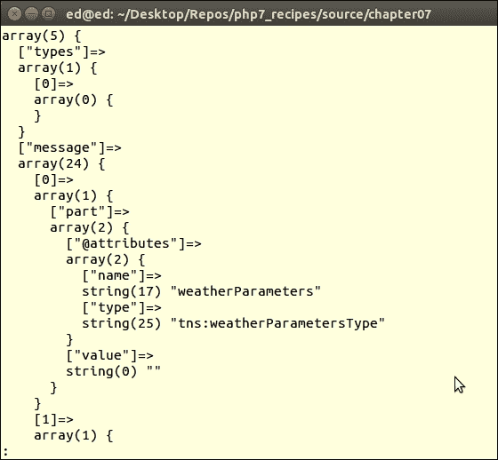
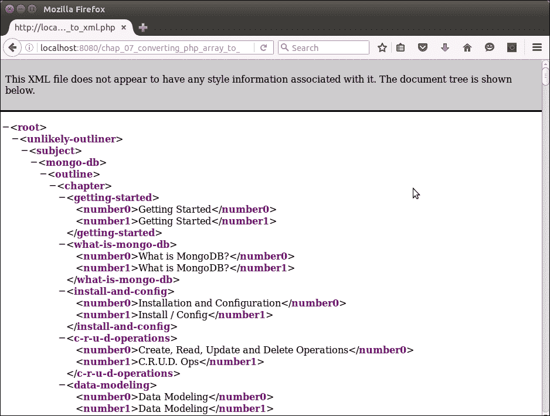
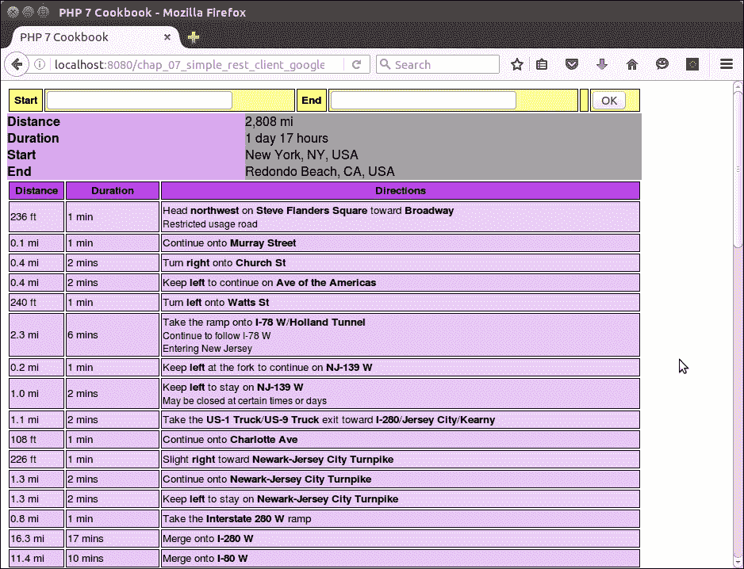
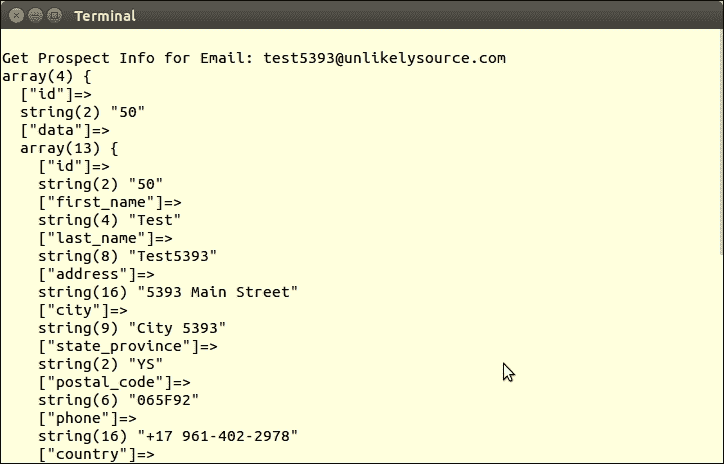

# 第 7 章访问 Web 服务

在本章中，我们将介绍以下主题：

*   PHP 与 XML 之间的转换
*   创建一个简单的 REST 客户机
*   创建简单的 REST 服务器
*   创建一个简单的 SOAP 客户端
*   创建简单的 SOAP 服务器

# 导言

对外部 web 服务进行后台查询正在成为任何 PHP web 实践中越来越多的一部分。能够提供适当、及时和丰富的数据意味着为您的客户和您开发的网站带来更多业务。我们从两个方法开始，旨在实现**可扩展标记语言**（**XML**与本机 PHP 之间的数据转换。接下来，我们将向您展示如何实现一个简单的**表示性状态传输**（**REST**）客户端和服务器。之后，我们将注意力转向**SOAP**客户端和服务器。

# PHP 与 XML 之间的转换

当考虑到 PHP 本地数据类型和 XML 之间的转换阿纳尔损坏时，我们通常会考虑数组作为主要目标。考虑到这一点，从 PHP 数组转换为 XML 的过程与反向转换所需的方法截然不同。

### 注

还可以考虑将物体进行转换；然而，用 XML 呈现对象方法是很困难的。但是，属性可以通过使用`get_object_vars()`函数来表示，该函数将对象属性读入数组。

## 怎么做。。。

1.  首先，我们定义一个`Application\Parse\ConvertXml`类。此类将包含将从 XML 转换为 PHP 数组的方法，反之亦然。我们需要 SPL 中的`SimpleXMLElement`和`SimpleXMLIterator`类：

    ```php
    namespace Application\Parse;
    use SimpleXMLIterator;
    use SimpleXMLElement;
    class ConvertXml
    {
    }
    ```

2.  接下来，我们定义一个`xmlToArray()`方法，该方法将接受`SimpleXMLIterator`实例作为参数。它将被递归调用，并从 XML 文档生成一个 PHP 数组。我们利用的`SimpleXMLIterator`能力推进 XML 文档，使用`key()`、`current()`、`next()`和`rewind()`方法导航：

    ```php
    public function xmlToArray(SimpleXMLIterator $xml) : array
    {
      $a = array();
      for( $xml->rewind(); $xml->valid(); $xml->next() ) {
        if(!array_key_exists($xml->key(), $a)) {
          $a[$xml->key()] = array();
        }
        if($xml->hasChildren()){
          $a[$xml->key()][] = $this->xmlToArray($xml->current());
        }
        else{
          $a[$xml->key()] = (array) $xml->current()->attributes();
          $a[$xml->key()]['value'] = strval($xml->current());
        }
      }
      return $a;
    }
    ```

3.  对于反向过程（也称为递归过程），我们定义了两种方法。第一个方法`arrayToXml()`建立初始`SimpleXMLElement`实例，然后调用第二个方法`phpToXml()`：

    ```php
    public function arrayToXml(array $a)
    {
      $xml = new SimpleXMLElement(
      '<?xml version="1.0" standalone="yes"?><root></root>');
      $this->phpToXml($a, $xml);
      return $xml->asXML();
    }
    ```

4.  请注意，在第二种方法中，如果其中一个数组元素是对象，则使用`get_object_vars()`。您还将注意到，不允许将数字单独作为 XML 标记，这意味着在数字前面添加一些文本：

    ```php
    protected function phpToXml($value, &$xml)
    {
      $node = $value;
      if (is_object($node)) {
        $node = get_object_vars($node);
      }
      if (is_array($node)) {
        foreach ($node as $k => $v) {
          if (is_numeric($k)) {
            $k = 'number' . $k;
          }
          if (is_array($v)) {
              $newNode = $xml->addChild($k);
              $this->phpToXml($v, $newNode);
          } elseif (is_object($v)) {
              $newNode = $xml->addChild($k);
              $this->phpToXml($v, $newNode);
          } else {
              $xml->addChild($k, $v);
          }
        }
      } else  {
          $xml->addChild(self::UNKNOWN_KEY, $node);
      }
    }
    ```

## 它是如何工作的。。。

作为示例 XML 文档，您可以为美国国家气象局使用**Web 服务定义语言**（**WSDL**）。这是一个 XML 文档，描述了一个 SOAP 服务，可以在[中找到 http://graphical.weather.gov/xml/SOAP_server/ndfdXMLserver.php?wsdl](http://graphical.weather.gov/xml/SOAP_server/ndfdXMLserver.php?wsdl) 。

我们将使用`SimpleXMLIterator`类来提供一种迭代机制。然后，您可以配置自动加载，并获得一个`Application\Parse\ConvertXml`实例，使用`xmlToArray()`将 WSDL 转换为 PHP 数组：

```php
require __DIR__ . '/../Application/Autoload/Loader.php';
Application\Autoload\Loader::init(__DIR__ . '/..');
use Application\Parse\ConvertXml;
$wsdl = 'http://graphical.weather.gov/xml/'
. 'SOAP_server/ndfdXMLserver.php?wsdl';
$xml = new SimpleXMLIterator($wsdl, 0, TRUE);
$convert = new ConvertXml();
var_dump($convert->xmlToArray($xml));
```

生成的数组如下所示：



要进行相反的操作，请使用本配方中描述的`arrayToXml()`方法。作为源文档，您可以使用一个包含 MongoDB 培训视频大纲的`source/data/mongo.db.global.php`文件，该视频可通过 O'Reilly Media 获得（免责声明：作者！）。使用相同的自动加载器配置和`Application\Parse\ConvertXml`的实例，下面是您可以使用的示例代码：

```php
$convert = new ConvertXml();
header('Content-Type: text/xml');
echo $convert->arrayToXml(include CONFIG_FILE);
```

以下是浏览器中的输出：



# 创建一个简单的 REST 客户端

REST 客户端使用**超文本传输协议**（**HTTP**）生成对外部 web 服务的请求。通过更改 HTTP 方法，我们可以使外部服务执行不同的操作。虽然有很多方法（或动词）可用，但我们将只关注`GET`和`POST`。在这个配方中，我们将使用**适配器**软件设计模式来展示实现 REST 客户端的两种不同方式。

## 怎么做。。。

1.  在定义 REST 客户机适配器之前，我们需要定义公共类来表示请求和响应信息。首先，我们将从一个抽象类开始，该类具有请求或响应所需的方法和属性：

    ```php
    namespace Application\Web;

    class AbstractHttp
    {
    ```

2.  接下来，我们定义表示 HTTP 信息的类常量：

    ```php
    const METHOD_GET = 'GET';
    const METHOD_POST = 'POST';
    const METHOD_PUT = 'PUT';
    const METHOD_DELETE = 'DELETE';
    const CONTENT_TYPE_HTML = 'text/html';
    const CONTENT_TYPE_JSON = 'application/json';
    const CONTENT_TYPE_FORM_URL_ENCODED = 
      'application/x-www-form-urlencoded';
    const HEADER_CONTENT_TYPE = 'Content-Type';
    const TRANSPORT_HTTP = 'http';
    const TRANSPORT_HTTPS = 'https';
    const STATUS_200 = '200';
    const STATUS_401 = '401';
    const STATUS_500 = '500';
    ```

3.  然后，我们定义请求或响应所需的属性：

    ```php
    protected $uri;      // i.e. http://xxx.com/yyy
    protected $method;    // i.e. GET, PUT, POST, DELETE
    protected $headers;  // HTTP headers
    protected $cookies;  // cookies
    protected $metaData;  // information about the transmission
    protected $transport;  // i.e. http or https
    protected $data = array();
    ```

4.  逻辑上，为这些属性定义 getter 和 setter:

    ```php
    public function setMethod($method)
    {
      $this->method = $method;
    }
    public function getMethod()
    {
      return $this->method ?? self::METHOD_GET;
    }
    // etc.
    ```

5.  某些属性需要通过密钥访问。为此，我们定义了`getXxxByKey()`和`setXxxByKey()`方法：

    ```php
    public function setHeaderByKey($key, $value)
    {
      $this->headers[$key] = $value;
    }
    public function getHeaderByKey($key)
    {
      return $this->headers[$key] ?? NULL;
    }
    public function getDataByKey($key)
    {
      return $this->data[$key] ?? NULL;
    }
    public function getMetaDataByKey($key)
    {
      return $this->metaData[$key] ?? NULL;
    }
    ```

6.  在某些情况下，请求将需要参数。我们将假设参数是以 PHP 数组的形式存储在`$data`属性中的。然后，我们可以使用`http_build_query()`函数

    ```php
    public function setUri($uri, array $params = NULL)
    {
      $this->uri = $uri;
      $first = TRUE;
      if ($params) {
        $this->uri .= '?' . http_build_query($params);
      }
    }
    public function getDataEncoded()
    {
      return http_build_query($this->getData());
    }
    ```

    构建请求 URL
7.  最后，我们在原始请求的基础上设置了`$transport`：

    ```php
    public function setTransport($transport = NULL)
    {
      if ($transport) {
          $this->transport = $transport;
      } else {
          if (substr($this->uri, 0, 5) == self::TRANSPORT_HTTPS) {
              $this->transport = self::TRANSPORT_HTTPS;
          } else {
              $this->transport = self::TRANSPORT_HTTP;
          }
        }
      }
    ```

8.  在此配方中，我们将定义一个`Application\Web\Request`类，当我们希望生成请求时，该类可以接受参数，或者，当实现一个接受请求的服务器时，用传入请求信息填充属性：

    ```php
    namespace Application\Web;
    class Request extends AbstractHttp
    {
      public function __construct(
        $uri = NULL, $method = NULL, array $headers = NULL, 
        array $data = NULL, array $cookies = NULL)
        {
          if (!$headers) $this->headers = $_SERVER ?? array();
          else $this->headers = $headers;
          if (!$uri) $this->uri = $this->headers['PHP_SELF'] ?? '';
          else $this->uri = $uri;
          if (!$method) $this->method = 
            $this->headers['REQUEST_METHOD'] ?? self::METHOD_GET;
          else $this->method = $method;
          if (!$data) $this->data = $_REQUEST ?? array();
          else $this->data = $data;
          if (!$cookies) $this->cookies = $_COOKIE ?? array();
          else $this->cookies = $cookies;
          $this->setTransport();
        }  
    }
    ```

9.  现在我们可以把注意力转向一个反应类。在本例中，我们将定义一个`Application\Web\Received`类。该名称反映了我们正在重新打包从外部 web 服务接收的数据的事实：

    ```php
    namespace Application\Web;
    class Received extends AbstractHttp
    {
      public function __construct(
        $uri = NULL, $method = NULL, array $headers = NULL, 
        array $data = NULL, array $cookies = NULL)
      {
        $this->uri = $uri;
        $this->method = $method;
        $this->headers = $headers;
        $this->data = $data;
        $this->cookies = $cookies;
        $this->setTransport();
      }  
    }
    ```

### 创建基于流的 REST 客户端

现在我们准备考虑两种不同的方法来实现 REST 客户端。第一种方法是使用底层 PHP I/O 层作为**流**。该层提供了一系列包装器，用于提供对外部流资源的访问。默认情况下，任何 PHP 文件命令都将使用文件包装器，该包装器允许访问本地文件系统。我们将使用`http://`或`https://`包装器来实现`Application\Web\Client\Streams`适配器：

1.  首先，我们定义一个`Application\Web\Client\Streams`类：

    ```php
    namespace Application\Web\Client;
    use Application\Web\ { Request, Received };
    class Streams
    {
      const BYTES_TO_READ = 4096;
    ```

2.  接下来，我们定义一个方法将请求发送到外部 web 服务。在`GET`的情况下，我们将参数添加到 URI 中。在`POST`的情况下，我们创建一个包含元数据的流上下文，该元数据指示我们正在提供数据的远程服务。使用 PHP Streams，发出请求只需编写 URI，在`POST`的情况下，还需要设置流上下文。然后我们使用一个简单的`fopen()`：

    ```php
    public static function send(Request $request)
    {
      $data = $request->getDataEncoded();
      $received = new Received();
      switch ($request->getMethod()) {
        case Request::METHOD_GET :
          if ($data) {
            $request->setUri($request->getUri() . '?' . $data);
          }
          $resource = fopen($request->getUri(), 'r');
          break;
        case Request::METHOD_POST :
          $opts = [
            $request->getTransport() => 
            [
              'method'  => Request::METHOD_POST,
              'header'  => Request::HEADER_CONTENT_TYPE 
              . ': ' . Request::CONTENT_TYPE_FORM_URL_ENCODED,
              'content' => $data
            ]
          ];
          $resource = fopen($request->getUri(), 'w', 
          stream_context_create($opts));
          break;
        }
        return self::getResults($received, $resource);
    }
    ```

3.  最后，我们来看一下如何检索结果并将其打包到一个`Received`对象中。您会注意到，我们添加了一个条款来解码以 JSON 格式接收的数据：

    ```php
    protected static function getResults(Received $received, $resource)
    {
      $received->setMetaData(stream_get_meta_data($resource));
      $data = $received->getMetaDataByKey('wrapper_data');
      if (!empty($data) && is_array($data)) {
        foreach($data as $item) {
          if (preg_match('!^HTTP/\d\.\d (\d+?) .*?$!', 
              $item, $matches)) {
              $received->setHeaderByKey('status', $matches[1]);
          } else {
              list($key, $value) = explode(':', $item);
              $received->setHeaderByKey($key, trim($value));
          }
        }
      }
      $payload = '';
      while (!feof($resource)) {
        $payload .= fread($resource, self::BYTES_TO_READ);
      }
      if ($received->getHeaderByKey(Received::HEADER_CONTENT_TYPE)) {
        switch (TRUE) {
          case stripos($received->getHeaderByKey(
                       Received::HEADER_CONTENT_TYPE), 
                       Received::CONTENT_TYPE_JSON) !== FALSE:
            $received->setData(json_decode($payload));
            break;
          default :
            $received->setData($payload);
            break;
              }
        }
        return $received;
    }
    ```

### 定义基于 cURL 的 REST 客户端

现在我们来看一下 REST 客户机的第二种方法，其中一种基于 cURL 扩展：

1.  对于这种方法，我们将假定相同的请求和响应类。初始类定义与前面讨论的 Streams 客户机的定义基本相同：

    ```php
    namespace Application\Web\Client;
    use Application\Web\ { Request, Received };
    class Curl
    {
    ```

2.  `send()`方法比使用流时要简单得多。我们需要做的就是定义一个选项数组，剩下的就让 cURL 来做：

    ```php
    public static function send(Request $request)
    {
      $data = $request->getDataEncoded();
      $received = new Received();
      switch ($request->getMethod()) {
        case Request::METHOD_GET :
          $uri = ($data) 
            ? $request->getUri() . '?' . $data 
            : $request->getUri();
              $options = [
                CURLOPT_URL => $uri,
                CURLOPT_HEADER => 0,
                CURLOPT_RETURNTRANSFER => TRUE,
                CURLOPT_TIMEOUT => 4
              ];
              break;
    ```

3.  `POST`需要稍微不同的旋度参数：

    ```php
    case Request::METHOD_POST :
      $options = [
        CURLOPT_POST => 1,
        CURLOPT_HEADER => 0,
        CURLOPT_URL => $request->getUri(),
        CURLOPT_FRESH_CONNECT => 1,
        CURLOPT_RETURNTRANSFER => 1,
        CURLOPT_FORBID_REUSE => 1,
        CURLOPT_TIMEOUT => 4,
        CURLOPT_POSTFIELDS => $data
      ];
      break;
    }
    ```

4.  然后我们执行一系列 cURL 函数，并通过`getResults()`：

    ```php
    $ch = curl_init();
    curl_setopt_array($ch, ($options));
    if( ! $result = curl_exec($ch))
    {
      trigger_error(curl_error($ch));
    }
    $received->setMetaData(curl_getinfo($ch));
    curl_close($ch);
    return self::getResults($received, $result);
    }
    ```

    运行结果
5.  `getResults()`方法将结果打包成`Received`对象：

    ```php
    protected static function getResults(Received $received, $payload)
    {
      $type = $received->getMetaDataByKey('content_type');
      if ($type) {
        switch (TRUE) {
          case stripos($type, 
              Received::CONTENT_TYPE_JSON) !== FALSE):
              $received->setData(json_decode($payload));
              break;
          default :
              $received->setData($payload);
              break;
        }
      }
      return $received;
    }
    ```

## 它是如何工作的。。。

请确保将前面的所有代码复制到这些类中：

*   `Application\Web\AbstractHttp`
*   `Application\Web\Request`
*   `Application\Web\Received`
*   `Application\Web\Client\Streams`
*   `Application\Web\Client\Curl`

对于本图，您可以向 Google Maps API 发出 REST 请求，以获取两点之间的驾驶方向。您还需要按照[中给出的说明为此目的创建 API 密钥 https://developers.google.com/maps/documentation/directions/get-api-key](https://developers.google.com/maps/documentation/directions/get-api-key) 。

然后，您可以定义一个`chap_07_simple_rest_client_google_maps_curl.php`调用脚本，该脚本使用`Curl`客户端发出请求。您还可以考虑定义一个使用 Type T3^客户端发出请求的 Type T2 调用脚本：

```php
<?php
define('DEFAULT_ORIGIN', 'New York City');
define('DEFAULT_DESTINATION', 'Redondo Beach');
define('DEFAULT_FORMAT', 'json');
$apiKey = include __DIR__ . '/google_api_key.php';
require __DIR__ . '/../Application/Autoload/Loader.php';
Application\Autoload\Loader::init(__DIR__ . '/..');
use Application\Web\Request;
use Application\Web\Client\Curl;
```

然后，您可以获取起点和终点：

```php
$start = $_GET['start'] ?? DEFAULT_ORIGIN;
$end   = $_GET['end'] ?? DEFAULT_DESTINATION;
$start = strip_tags($start);
$end   = strip_tags($end);
```

您现在可以填充`Request`对象，并使用它生成请求：

```php
$request = new Request(
  'https://maps.googleapis.com/maps/api/directions/json',
  Request::METHOD_GET,
  NULL,
  ['origin' => $start, 'destination' => $end, 'key' => $apiKey],
  NULL
);

$received = Curl::send($request);
$routes   = $received->getData()->routes[0];
include __DIR__ . '/chap_07_simple_rest_client_google_maps_template.php';
```

为了便于说明，您还可以定义一个表示视图逻辑的模板，以显示请求的结果：

```php
<?php foreach ($routes->legs as $item) : ?>
  <!-- Trip Info -->
  <br>Distance: <?= $item->distance->text; ?>
  <br>Duration: <?= $item->duration->text; ?>
  <!-- Driving Directions -->
  <table>
    <tr>
    <th>Distance</th><th>Duration</th><th>Directions</th>
    </tr>
    <?php foreach ($item->steps as $step) : ?>
    <?php $class = ($count++ & 01) ? 'color1' : 'color2'; ?>
    <tr>
    <td class="<?= $class ?>"><?= $step->distance->text ?></td>
    <td class="<?= $class ?>"><?= $step->duration->text ?></td>
    <td class="<?= $class ?>">
    <?= $step->html_instructions ?></td>
    </tr>
    <?php endforeach; ?>
  </table>
<?php endforeach; ?>
```

以下是在浏览器中看到的请求结果：



## 还有更多。。。

**PHP 标准建议**（**PSR-7**）精确定义了在 PHP 应用程序之间发出请求时要使用的请求和响应对象。这在[附录](14.html "Appendix A. Defining PSR-7 Classes")*定义 PSR-7 类*中有详细介绍。

## 另见

有关`Streams`的更多信息，请参阅此 PHP 文档页面[http://php.net/manual/en/book.stream.php](http://php.net/manual/en/book.stream.php) 。一个经常被问到的问题是“HTTP PUT 和 POST 之间有什么区别”。有关此主题的精彩讨论，请参考[http://stackoverflow.com/questions/107390/whats-the-difference-between-a-post-and-a-put-http-request](http://stackoverflow.com/questions/107390/whats-the-difference-between-a-post-and-a-put-http-request) 。有关从谷歌获取 API 密钥的更多信息，请参考以下网页：

[https://developers.google.com/maps/documentation/directions/get-api-key](https://developers.google.com/maps/documentation/directions/get-api-key)

[https://developers.google.com/maps/documentation/directions/intro#Introduction](https://developers.google.com/maps/documentation/directions/intro#Introduction)

# 创建一个简单的 REST 服务器

在实现 REST 服务器时，有几个注意事项。这三个问题的答案将让您定义 REST 服务：

*   如何捕获原始请求？
*   您想发布什么**应用程序编程接口**（**API**）？
*   您计划如何将 HTTP 谓词（例如，`GET`、`PUT`、`POST`和`DELETE`映射到 API 方法？

## 怎么做。。。

1.  我们将通过构建在前面配方中定义的请求和响应类上来实现 REST 服务器，*创建一个简单的 REST 客户端*。回顾上一个配方中讨论的课程，包括以下内容：
    *   `Application\Web\AbstractHttp`
    *   `Application\Web\Request`
    *   `Application\Web\Received`
2.  我们还需要基于`AbstractHttp`定义一个正式的`Application\Web\Response`响应类。这个类与其他类的主要区别在于它接受一个`Application\Web\Request`实例作为参数。主要工作是通过`__construct()`方法完成的。同样重要的是设置`Content-Type`标题和状态：

    ```php
    namespace Application\Web;
    class Response extends AbstractHttp
    {

      public function __construct(Request $request = NULL, 
                                  $status = NULL, $contentType = NULL)
      {
        if ($request) {
          $this->uri = $request->getUri();
          $this->data = $request->getData();
          $this->method = $request->getMethod();
          $this->cookies = $request->getCookies();
          $this->setTransport();
        }
        $this->processHeaders($contentType);
        if ($status) {
          $this->setStatus($status);
        }
      }
      protected function processHeaders($contentType)
      {
        if (!$contentType) {
          $this->setHeaderByKey(self::HEADER_CONTENT_TYPE, 
            self::CONTENT_TYPE_JSON);
        } else {
          $this->setHeaderByKey(self::HEADER_CONTENT_TYPE, 
            $contentType);
        }
      }
      public function setStatus($status)
      {
        $this->status = $status;
      }
      public function getStatus()
      {
        return $this->status;
      }
    }
    ```

3.  We are now in a position to define the `Application\Web\Rest\Server` class. You may be surprised at how simple it is. The real work is done in the associated API class:

    ### 注

    注意 PHP7 组使用语法的用法：

    ```php
    use Application\Web\ { Request,Response,Received }
    ```

    ```php
    namespace Application\Web\Rest;
    use Application\Web\ { Request, Response, Received };
    class Server
    {
      protected $api;
      public function __construct(ApiInterface $api)
      {
        $this->api = $api;
      }
    ```

4.  接下来，我们定义一个`listen()`方法作为请求的目标。服务器实现的核心是这行代码：

    ```php
    $jsonData = json_decode(file_get_contents('php://input'),true);
    ```

5.  This captures raw input, which is assumed to be in JSON format:

    ```php
    public function listen()
    {
      $request  = new Request();
      $response = new Response($request);
      $getPost  = $_REQUEST ?? array();
      $jsonData = json_decode(
        file_get_contents('php://input'),true);
      $jsonData = $jsonData ?? array();
      $request->setData(array_merge($getPost,$jsonData));
    ```

    ### 注

    我们还添加了身份验证的规定。否则，任何人都可能提出请求并获取潜在的敏感数据。您会注意到，我们没有执行身份验证的服务器类；相反，我们将其留给 API 类：

    ```php
    if (!$this->api->authenticate($request)) {
        $response->setStatus(Request::STATUS_401);
        echo $this->api::ERROR;
        exit;
    }
    ```

6.  然后我们将 API 方法映射到主要 HTTP 方法`GET`、`PUT`、`POST`和`DELETE`：

    ```php
    $id = $request->getData()[$this->api::ID_FIELD] ?? NULL;
    switch (strtoupper($request->getMethod())) {
      case Request::METHOD_POST :
        $this->api->post($request, $response);
        break;
      case Request::METHOD_PUT :
        $this->api->put($request, $response);
        break;
      case Request::METHOD_DELETE :
        $this->api->delete($request, $response);
        break;
      case Request::METHOD_GET :
      default :
        // return all if no params
      $this->api->get($request, $response);
    }
    ```

7.  最后，我们打包响应并发送出去，JSON 编码：

    ```php
      $this->processResponse($response);
      echo json_encode($response->getData());
    }
    ```

8.  `processResponse()`方法设置头并确保结果打包为`Application\Web\Response`对象：

    ```php
    protected function processResponse($response)
    {
      if ($response->getHeaders()) {
        foreach ($response->getHeaders() as $key => $value) {
          header($key . ': ' . $value, TRUE, 
                 $response->getStatus());
        }
      }        
      header(Request::HEADER_CONTENT_TYPE 
      . ': ' . Request::CONTENT_TYPE_JSON, TRUE);
      if ($response->getCookies()) {
        foreach ($response->getCookies() as $key => $value) {
          setcookie($key, $value);
        }
      }
    }
    ```

9.  如前所述，真正的工作是由 API 类完成的。我们首先定义一个抽象的类，该类确保表示主要方法`get()`、`put()`等，并且所有这些方法都接受请求和响应对象作为参数。您可能会注意到，我们添加了一个`generateToken()`方法，该方法使用 PHP7`random_bytes()`函数生成一个真正随机的 16 字节序列：

    ```php
    namespace Application\Web\Rest;
    use Application\Web\ { Request, Response };
    abstract class AbstractApi implements ApiInterface
    {
      const TOKEN_BYTE_SIZE  = 16;
      protected $registeredKeys;
      abstract public function get(Request $request, 
                                   Response $response);
      abstract public function put(Request $request, 
                                   Response $response);
      abstract public function post(Request $request, 
                                    Response $response);
      abstract public function delete(Request $request, 
                                      Response $response);
      abstract public function authenticate(Request $request);
      public function __construct($registeredKeys, $tokenField)
      {
        $this->registeredKeys = $registeredKeys;
      }
      public static function generateToken()
      {
        return bin2hex(random_bytes(self::TOKEN_BYTE_SIZE));    
      }
    }
    ```

10.  我们还定义了相应的接口，可用于架构和设计目的，以及代码开发控制：

    ```php
    namespace Application\Web\Rest;
    use Application\Web\ { Request, Response };
    interface ApiInterface
    {
      public function get(Request $request, Response $response);
      public function put(Request $request, Response $response);
      public function post(Request $request, Response $response);
      public function delete(Request $request, Response $response);
      public function authenticate(Request $request);
    }
    ```

11.  这里，我们展示了一个基于`AbstractApi`的示例 API。此类利用[第 5 章](05.html "Chapter 5. Interacting with a Database")中定义的数据库类*与数据库*：

    ```php
    namespace Application\Web\Rest;
    use Application\Web\ { Request, Response, Received };
    use Application\Entity\Customer;
    use Application\Database\ { Connection, CustomerService };

    class CustomerApi extends AbstractApi
    {
      const ERROR = 'ERROR';
      const ERROR_NOT_FOUND = 'ERROR: Not Found';
      const SUCCESS_UPDATE = 'SUCCESS: update succeeded';
      const SUCCESS_DELETE = 'SUCCESS: delete succeeded';
      const ID_FIELD = 'id';      // field name of primary key
      const TOKEN_FIELD = 'token';  // field used for authentication
      const LIMIT_FIELD = 'limit';
      const OFFSET_FIELD = 'offset';
      const DEFAULT_LIMIT = 20;
      const DEFAULT_OFFSET = 0;

      protected $service;

      public function __construct($registeredKeys, 
                                  $dbparams, $tokenField = NULL)
      {
        parent::__construct($registeredKeys, $tokenField);
        $this->service = new CustomerService(
          new Connection($dbparams));
      }
    ```

    交互
12.  所有方法都将请求和响应作为参数接收。您将注意到使用`getDataByKey()`检索数据项。实际的数据库交互由服务类执行。您可能还注意到，在所有情况下，我们都设置了一个 HTTP 状态代码来通知客户机成功或失败。在`get()`的情况下，我们寻找一个 ID 参数。如果收到，我们仅提供单个客户的信息。否则，我们将提供一份使用限额和抵销的所有客户的列表：

    ```php
    public function get(Request $request, Response $response)
    {
      $result = array();
      $id = $request->getDataByKey(self::ID_FIELD) ?? 0;
      if ($id > 0) {
          $result = $this->service->
            fetchById($id)->entityToArray();  
      } else {
        $limit  = $request->getDataByKey(self::LIMIT_FIELD) 
          ?? self::DEFAULT_LIMIT;
        $offset = $request->getDataByKey(self::OFFSET_FIELD) 
          ?? self::DEFAULT_OFFSET;
        $result = [];
        $fetch = $this->service->fetchAll($limit, $offset);
        foreach ($fetch as $row) {
          $result[] = $row;
        }
      }
      if ($result) {
          $response->setData($result);
          $response->setStatus(Request::STATUS_200);
      } else {
          $response->setData([self::ERROR_NOT_FOUND]);
          $response->setStatus(Request::STATUS_500);
      }
    }
    ```

13.  `put()`方法用于插入客户数据：

    ```php
    public function put(Request $request, Response $response)
    {
      $cust = Customer::arrayToEntity($request->getData(), 
                                      new Customer());
      if ($newCust = $this->service->save($cust)) {
          $response->setData(['success' => self::SUCCESS_UPDATE, 
                              'id' => $newCust->getId()]);
          $response->setStatus(Request::STATUS_200);
      } else {
          $response->setData([self::ERROR]);
          $response->setStatus(Request::STATUS_500);
      }      
    }
    ```

14.  `post()`方法是用于更新现有客户条目：

    ```php
    public function post(Request $request, Response $response)
    {
      $id = $request->getDataByKey(self::ID_FIELD) ?? 0;
      $reqData = $request->getData();
      $custData = $this->service->
        fetchById($id)->entityToArray();
      $updateData = array_merge($custData, $reqData);
      $updateCust = Customer::arrayToEntity($updateData, 
      new Customer());
      if ($this->service->save($updateCust)) {
          $response->setData(['success' => self::SUCCESS_UPDATE, 
                              'id' => $updateCust->getId()]);
          $response->setStatus(Request::STATUS_200);
      } else {
          $response->setData([self::ERROR]);
          $response->setStatus(Request::STATUS_500);
      }      
    }
    ```

15.  顾名思义，`delete()`删除了一个客户条目：

    ```php
    public function delete(Request $request, Response $response)
    {
      $id = $request->getDataByKey(self::ID_FIELD) ?? 0;
      $cust = $this->service->fetchById($id);
      if ($cust && $this->service->remove($cust)) {
          $response->setData(['success' => self::SUCCESS_DELETE, 
                              'id' => $id]);
          $response->setStatus(Request::STATUS_200);
      } else {
          $response->setData([self::ERROR_NOT_FOUND]);
          $response->setStatus(Request::STATUS_500);
      }
    }
    ```

16.  最后，在本例中，我们定义了`authenticate()`以提供一种低级机制来保护 API 的使用：

    ```php
    public function authenticate(Request $request)
    {
      $authToken = $request->getDataByKey(self::TOKEN_FIELD) 
        ?? FALSE;
      if (in_array($authToken, $this->registeredKeys, TRUE)) {
          return TRUE;
      } else {
          return FALSE;
      }
    }
    }
    ```

## 它是如何工作的。。。

定义以下类，这些类在前面的配方中讨论过：

*   `Application\Web\AbstractHttp`
*   `Application\Web\Request`
*   `Application\Web\Received`

然后，您可以定义以下类别，如本配方所述，并在此表中总结：

<colgroup><col style="text-align: left"> <col style="text-align: left"></colgroup> 
| 

类应用程序\Web\*

 | 

在这些步骤中进行了讨论

 |
| --- | --- |
| `Response` | 2. |
| `Rest\Server` | 3 - 8 |
| `Rest\AbstractApi` | 9 |
| `Rest\ApiInterface` | 10 |
| `Rest\CustomerApi` | 11 - 16 |

您现在可以自由开发自己的 API 类。但是，如果您选择按照图`Application\Web\Rest\CustomerApi`进行操作，您还需要确保实现这些类，这些类在[第 5 章](05.html "Chapter 5. Interacting with a Database")中介绍，*与数据库*交互：

*   `Application\Entity\Customer`
*   `Application\Database\Connection`
*   `Application\Database\CustomerService`

您现在可以定义一个调用 REST 服务器的`chap_07_simple_rest_server.php`脚本：

```php
<?php
$dbParams = include __DIR__ .  '/../../config/db.config.php';
require __DIR__ . '/../Application/Autoload/Loader.php';
Application\Autoload\Loader::init(__DIR__ . '/..');
use Application\Web\Rest\Server;
use Application\Web\Rest\CustomerApi;
$apiKey = include __DIR__ . '/api_key.php';
$server = new Server(new CustomerApi([$apiKey], $dbParams, 'id'));
$server->listen();
```

然后，您可以使用内置 PHP 7 开发服务器在端口`8080`上侦听 REST 请求：

```php
php -S localhost:8080 chap_07_simple_rest_server.php 

```

要测试您的 API，请使用`Application\Web\Rest\AbstractApi::generateToken()`方法生成可放入`api_key.php`文件中的身份验证令牌，如下所示：

```php
<?php return '79e9b5211bbf2458a4085707ea378129';
```

然后，您可以使用一个通用 API 客户端（如前一个配方中所述），或一个浏览器插件，如潮州的 RESTClient（参见[http://restclient.net/](http://restclient.net/) 获取更多信息）以生成样本请求。请确保为您的请求包含令牌，否则定义的 API 将拒绝该请求。

以下是对`ID``1`的`POST`请求示例，该请求将`balance`字段设置为`888888`的值：


## 还有更多。。。

有许多库可以帮助您实现 REST 服务器。我最喜欢的一个例子是在单个文件中实现 REST 服务器：[https://www.leaseweb.com/labs/2015/10/creating-a-simple-rest-api-in-php/](https://www.leaseweb.com/labs/2015/10/creating-a-simple-rest-api-in-php/)

各种框架，如 CodeIgniter 和 Zend 框架，也有 REST 服务器实现。

# 创建一个简单的 SOAP 客户端

与实现 REST 客户机或服务器的过程相比，使用 SOAP 非常容易，因为有一个 PHP SOAP 扩展提供了这两种功能。

### 注

一个常见问题是“SOAP 和 REST 之间有什么区别？”SOAP 在内部使用 XML 作为其数据格式。SOAP 使用 HTTP，但仅用于传输，并且不知道其他 HTTP 方法。REST 直接操作 HTTP，可以使用任何数据格式，但 JSON 是首选。另一个关键区别是 SOAP 可以与 WSDL 结合使用，这使得服务可以自我描述，因此更公开。因此，SOAP 服务通常由国家卫生组织等公共机构提供。

## 怎么做。。。

对于本例，我们将对美国国家气象局提供的现有 SOAP 服务发出 SOAP 请求：

1.  首先要考虑的是标识**WSDL**文档。WSDL 是描述服务的 XML 文档：

    ```php
    $wsdl = 'http://graphical.weather.gov/xml/SOAP_server/'
      . 'ndfdXMLserver.php?wsdl';
    ```

2.  接下来，我们使用 WSDL 创建一个`soap client`实例：

    ```php
    $soap = new SoapClient($wsdl, array('trace' => TRUE));
    ```

3.  然后，我们可以自由初始化一些变量，以预测天气预报请求：

    ```php
    $units = 'm';
    $params = '';
    $numDays = 7;
    $weather = '';
    $format = '24 hourly';
    $startTime = new DateTime();
    ```

4.  然后，我们可以发出一个`LatLonListCityNames()`SOAP 请求，该请求在 WSDL 中被标识为一个操作，用于服务支持的城市列表。请求以 XML 格式返回，建议创建一个`SimpleXLMElement`实例：

    ```php
    $xml = new SimpleXMLElement($soap->LatLonListCityNames(1));
    ```

5.  不幸的是，城市列表及其相应的纬度和经度位于不同的 XML 节点中。因此，我们使用`array_combine()`PHP 函数创建一个关联数组，其中纬度/经度是键，城市名称是值。然后，我们可以稍后使用它来显示 HTML`SELECT`下拉列表，使用`asort()`按字母顺序排列列表：

    ```php
    $cityNames = explode('|', $xml->cityNameList);
    $latLonCity = explode(' ', $xml->latLonList);
    $cityLatLon = array_combine($latLonCity, $cityNames);
    asort($cityLatLon);
    ```

6.  然后我们可以从 web 请求中获取城市数据，如下所示：

    ```php
    $currentLatLon = (isset($_GET['city'])) ? strip_tags(urldecode($_GET['city'])) : '';
    ```

7.  我们希望拨打的 SOAP 电话是`NDFDgenByDay()`。我们可以通过检查 WSDL:

    ```php
    <message name="NDFDgenByDayRequest">
    <part name="latitude" type="xsd:decimal"/>
    <part name="longitude" type="xsd:decimal"/>
    <part name="startDate" type="xsd:date"/>
    <part name="numDays" type="xsd:integer"/>
    <part name="Unit" type="xsd:string"/>
    <part name="format" type="xsd:string"/>
    </message>
    ```

    来确定提供给 SOAP 服务器的参数的性质
8.  如果设置了`$currentLatLon`的值，我们可以处理请求。我们将请求包装在一个`try {} catch {}`块中，以防抛出任何异常：

    ```php
    if ($currentLatLon) {
      list($lat, $lon) = explode(',', $currentLatLon);
      try {
          $weather = $soap->NDFDgenByDay($lat,$lon,
            $startTime->format('Y-m-d'),$numDays,$unit,$format);
      } catch (Exception $e) {
          $weather .= PHP_EOL;
          $weather .= 'Latitude: ' . $lat . ' | Longitude: ' . $lon;
          $weather .= 'ERROR' . PHP_EOL;
          $weather .= $e->getMessage() . PHP_EOL;
          $weather .= $soap->__getLastResponse() . PHP_EOL;
      }
    }
    ?>
    ```

## 它是如何工作的。。。

将前面的所有代码复制到`chap_07_simple_soap_client_weather_service.php`文件中。然后，您可以添加视图逻辑，以显示包含城市列表以及结果的表单：

```php
<form method="get" name="forecast">
<br> City List: 
<select name="city">
<?php foreach ($cityLatLon as $latLon => $city) : ?>
<?php $select = ($currentLatLon == $latLon) ? ' selected' : ''; ?>
<option value="<?= urlencode($latLon) ?>" <?= $select ?>>
<?= $city ?></option>
<?php endforeach; ?>
</select>
<br><input type="submit" value="OK"></td>
</form>
<pre>
<?php var_dump($weather); ?>
</pre>
```

以下是在浏览器中请求俄亥俄州克利夫兰市天气预报的结果：


## 另见

有关 SOAP 和 REST 之间的区别的详细讨论，请参阅[中的文章 http://stackoverflow.com/questions/209905/representational-state-transfer-rest-and-simple-object-access-protocol-soap?lq=1](http://stackoverflow.com/questions/209905/representational-state-transfer-rest-and-simple-object-access-protocol-soap?lq=1) 。

# 创建一个简单的 SOAP 服务器

与 SOAP 客户端一样，我们可以使用 PHPSOAP 扩展来实现 SOAP 服务器。实现中最困难的部分将是从 API 类生成 WSDL。我们在这里不讨论这个过程，因为有很多好的 WSDL 生成器可用。

## 怎么做。。。

1.  首先，您需要一个将由 SOAP 服务器处理的 API。对于本例，我们定义了一个`Application\Web\Soap\ProspectsApi`类，它允许我们创建、读取、更新和删除`prospects`表：

    ```php
    namespace Application\Web\Soap;
    use PDO;
    class ProspectsApi
    {
      protected $registerKeys;
      protected $pdo;

      public function __construct($pdo, $registeredKeys)
      {
        $this->pdo = $pdo;
        $this->registeredKeys = $registeredKeys;
      }
    }
    ```

2.  然后定义与创建、读取、更新和删除相对应的方法。在本例中，这些方法被命名为`put()`、`get()`、`post()`和`delete()`。反过来，这些调用方法生成从 PDO 实例执行的 SQL 请求。`get()`的示例如下：

    ```php
    public function get(array $request, array $response)
    {
      if (!$this->authenticate($request)) return FALSE;
      $result = array();
      $id = $request[self::ID_FIELD] ?? 0;
      $email = $request[self::EMAIL_FIELD] ?? 0;
      if ($id > 0) {
          $result = $this->fetchById($id);  
          $response[self::ID_FIELD] = $id;
      } elseif ($email) {
          $result = $this->fetchByEmail($email);
          $response[self::ID_FIELD] = $result[self::ID_FIELD] ?? 0;
      } else {
          $limit = $request[self::LIMIT_FIELD] 
            ?? self::DEFAULT_LIMIT;
          $offset = $request[self::OFFSET_FIELD] 
            ?? self::DEFAULT_OFFSET;
          $result = [];
          foreach ($this->fetchAll($limit, $offset) as $row) {
            $result[] = $row;
          }
      }
      $response = $this->processResponse(
        $result, $response, self::SUCCESS, self::ERROR);
        return $response;
      }

      protected function processResponse($result, $response, 
                                         $success_code, $error_code)
      {
        if ($result) {
            $response['data'] = $result;
            $response['code'] = $success_code;
            $response['status'] = self::STATUS_200;
        } else {
            $response['data'] = FALSE;
            $response['code'] = self::ERROR_NOT_FOUND;
            $response['status'] = self::STATUS_500;
        }
        return $response;
      }
    ```

3.  然后，您可以从 API 生成 WSDL。有相当多的基于 PHP 的 WSDL 生成器可用（请参见*有更多的…*部分）。大多数要求在将发布的方法之前添加`phpDocumentor`标记。在我们的示例中，这两个参数都是数组。下面是前面讨论的 API 的完整 WSDL:

    ```php
    <?xml version="1.0" encoding="UTF-8"?>
      <wsdl:definitions xmlns:tns="php7cookbook" targetNamespace="php7cookbook" xmlns:soap="http://schemas.xmlsoap.org/wsdl/soap/" xmlns:s="http://www.w3.org/2001/XMLSchema" xmlns:wsdl="http://schemas.xmlsoap.org/wsdl/" xmlns:soapenc="http://schemas.xmlsoap.org/soap/encoding/">
      <wsdl:message name="getSoapIn">
        <wsdl:part name="request" type="tns:array" />
        <wsdl:part name="response" type="tns:array" />
      </wsdl:message>
      <wsdl:message name="getSoapOut">
        <wsdl:part name="return" type="tns:array" />
      </wsdl:message>
      <!—some nodes removed to conserve space -->
      <wsdl:portType name="CustomerApiSoap">
      <!—some nodes removed to conserve space -->
      <wsdl:binding name="CustomerApiSoap" type="tns:CustomerApiSoap">
      <soap:binding transport="http://schemas.xmlsoap.org/soap/http" style="rpc" />
        <wsdl:operation name="get">
          <soap:operation soapAction="php7cookbook#get" />
            <wsdl:input>
              <soap:body use="encoded" encodingStyle= "http://schemas.xmlsoap.org/soap/encoding/" namespace="php7cookbook" parts="request response" />
            </wsdl:input>
            <wsdl:output>
              <soap:body use="encoded" encodingStyle= "http://schemas.xmlsoap.org/soap/encoding/" namespace="php7cookbook" parts="return" />
            </wsdl:output>
        </wsdl:operation>
      <!—some nodes removed to conserve space -->
      </wsdl:binding>
      <wsdl:service name="CustomerApi">
        <wsdl:port name="CustomerApiSoap" binding="tns:CustomerApiSoap">
        <soap:address location="http://localhost:8080/" />
        </wsdl:port>
      </wsdl:service>
      </wsdl:definitions>
    ```

4.  Next, create a `chap_07_simple_soap_server.php` file, which will execute the SOAP server. Start by defining the location of the WSDL and any other necessary files (in this case, one for database configuration). If the `wsdl` parameter is set, deliver the WSDL rather than attempting to process the request. In this example, we use a simple API key to authenticate requests. We then create a SOAP server instance, assign an instance of our API class, and run `handle()`:

    ```php
    <?php
    define('DB_CONFIG_FILE', '/../config/db.config.php');
    define('WSDL_FILENAME', __DIR__ . '/chap_07_wsdl.xml');

    if (isset($_GET['wsdl'])) {
        readfile(WSDL_FILENAME);
        exit;
    }
    $apiKey = include __DIR__ . '/api_key.php';
    require __DIR__ . '/../Application/Web/Soap/ProspectsApi.php';
    require __DIR__ . '/../Application/Database/Connection.php';
    use Application\Database\Connection;
    use Application\Web\Soap\ProspectsApi;
    $connection = new Application\Database\Connection(
      include __DIR__ . DB_CONFIG_FILE);
    $api = new Application\Web\Soap\ProspectsApi(
      $connection->pdo, [$apiKey]);
    $server = new SoapServer(WSDL_FILENAME);
    $server->setObject($api);
    echo $server->handle();
    ```

    ### 注

    根据`php.ini`文件的设置，您可能需要禁用 WSDL 缓存，如下所示：

    ```php
    ini_set('soap.wsdl_cache_enabled', 0);
    ```

    如果传入的`POST`数据有问题，可以按如下方式调整此参数：

    ```php
    ini_set('always_populate_raw_post_data', -1);
    ```

## 它是如何工作的。。。

通过首先创建目标 API 类，然后生成 WSDL，您可以轻松地测试这个配方。然后，您可以使用内置 PHP Web 服务器通过以下命令提供 SOAP 服务：

```php
php -S localhost:8080 chap_07_simple_soap_server.php 

```

然后，您可以使用前面配方中讨论的 SOAP 客户机进行调用，以测试 SOAP 服务：

```php
<?php
define('WSDL_URL', 'http://localhost:8080?wsdl=1');
$clientKey = include __DIR__ . '/api_key.php';
try {
  $client = new SoapClient(WSDL_URL);
  $response = [];
  $email = some_email_generated_by_test;
  $email = 'test5393@unlikelysource.com';
  echo "\nGet Prospect Info for Email: " . $email . "\n";
  $request = ['token' => $clientKey, 'email' => $email];
  $result = $client->get($request,$response);
  var_dump($result);

} catch (SoapFault $e) {
  echo 'ERROR' . PHP_EOL;
  echo $e->getMessage() . PHP_EOL;
} catch (Throwable $e) {
  echo 'ERROR' . PHP_EOL;
  echo $e->getMessage() . PHP_EOL;
} finally {
  echo $client->__getLastResponse() . PHP_EOL;
}
```

以下是电子邮件地址`test5393@unlikelysource.com:`的输出



## 另见

一个简单的谷歌搜索，搜索 PHP 的 WSDL 生成器，很容易得到十几个结果。用于为`ProspectsApi`类生成 WSDL 的基于[https://code.google.com/archive/p/php-wsdl-creator/](https://code.google.com/archive/p/php-wsdl-creator/) 。有关`phpDocumentor`的更多信息，请参阅[页面 https://www.phpdoc.org/](https://www.phpdoc.org/) 。