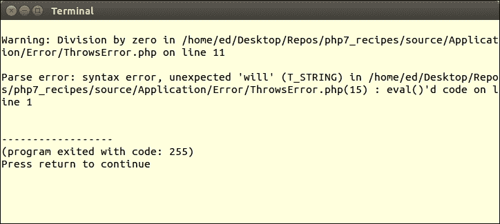
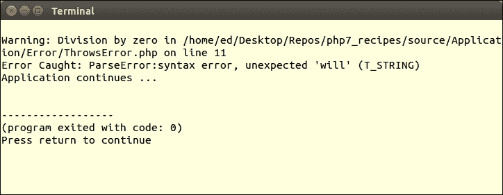
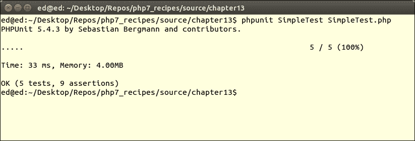
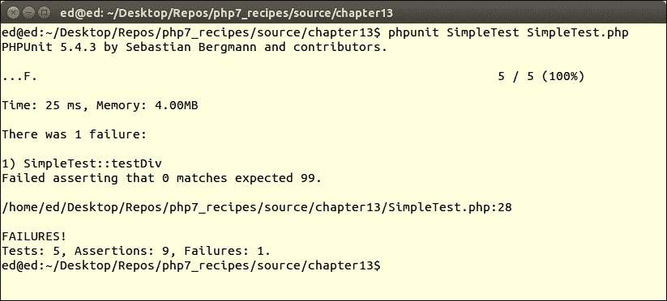
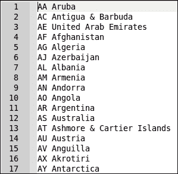
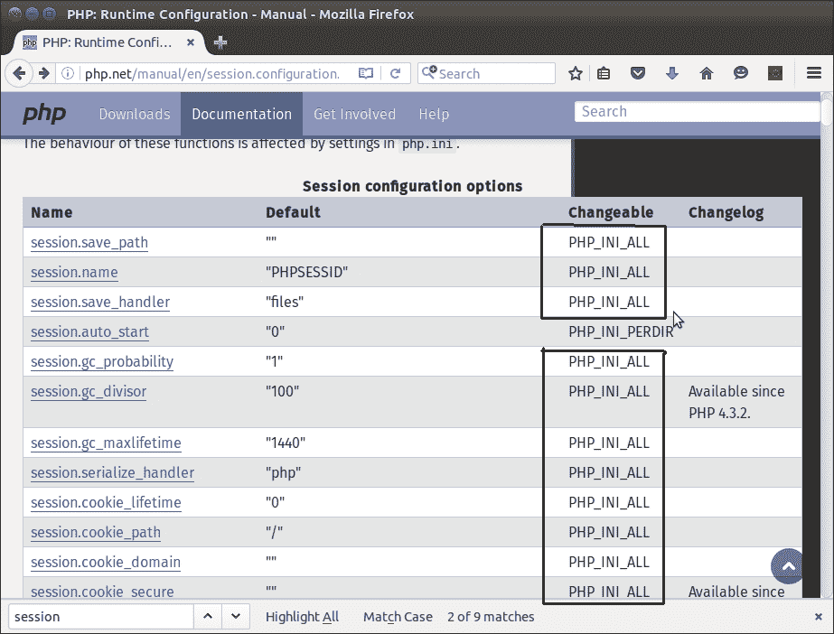
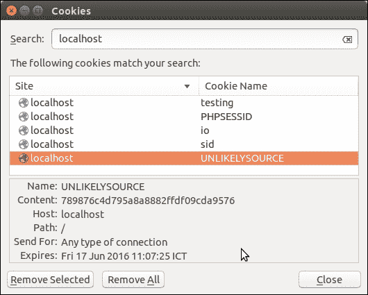
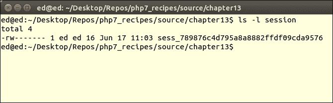

# 十三、最佳实践、测试和调试

在本章中，我们将介绍以下主题：

*   使用特性和接口
*   通用异常处理程序
*   通用错误处理程序
*   写一个简单的测试
*   编写测试套件
*   生成假测试数据
*   使用`session_start`参数定制会话

# 导言

在本章中，我们将向您展示特性和接口是如何协同工作的。然后，我们将注意力转向回退机制的设计，该机制将在无法（或忘记）定义特定`try/catch`块的情况下捕获错误和异常。然后，我们将进入单元测试领域，首先向您展示如何编写简单的测试，然后展示如何将这些测试组合到测试套件中。接下来，我们定义一个类，它允许您创建任意数量的通用测试数据。在本章结束时，我们将讨论如何使用新的 PHP7 功能轻松管理会话。

# 使用特性和接口

使用接口作为建立一组类的分类的手段，并保证某些方法的存在，这被认为是最佳实践。Traits 和接口通常一起工作，是实现的一个重要方面。如果您有一个经常使用的接口，该接口定义了一个代码不变的方法（例如 setter 或 getter），那么定义一个包含实际代码实现的特性也很有用。

## 怎么做。。。

1.  对于这个示例，我们将使用`ConnectionAwareInterface`，首先在[第 4 章](04.html "Chapter 4. Working with PHP Object-Oriented Programming")中介绍，*使用 PHP 面向对象编程*。此接口定义了一个设置`$connection`属性的`setConnection()`方法。`Application\Generic`命名空间中的两个类`CountryList`和`CustomerList`包含冗余的代码，这与接口中定义的方法相匹配。
2.  以下是变更前`CountryList`的样子：

    ```php
    class CountryList
    {
      protected $connection;
      protected $key   = 'iso3';
      protected $value = 'name';
      protected $table = 'iso_country_codes';

      public function setConnection(Connection $connection)
      {
        $this->connection = $connection;
      }
      public function list()
      {
        $list = [];
        $sql  = sprintf('SELECT %s,%s FROM %s', $this->key, 
                        $this->value, $this->table);
        $stmt = $this->connection->pdo->query($sql);
        while ($item = $stmt->fetch(PDO::FETCH_ASSOC)) {
          $list[$item[$this->key]] =  $item[$this->value];
        }
        return $list;
      }

    }
    ```

3.  我们现在将`list()`转入一种称为`ListTrait`

    ```php
    trait ListTrait
    {
      public function list()
      {
        $list = [];
        $sql  = sprintf('SELECT %s,%s FROM %s', 
                        $this->key, $this->value, $this->table);
        $stmt = $this->connection->pdo->query($sql);
        while ($item = $stmt->fetch(PDO::FETCH_ASSOC)) {
               $list[$item[$this->key]] = $item[$this->value];
        }
        return $list;
      }
    }
    ```

    的特质
4.  我们可以然后将`ListTrait`中的代码插入一个新类`CountryListUsingTrait`，如下所示：

    ```php
    class CountryListUsingTrait
    {
      use ListTrait;   
      protected $connection;
      protected $key   = 'iso3';
      protected $value = 'name';
      protected $table = 'iso_country_codes';
      public function setConnection(Connection $connection)
      {
        $this->connection = $connection;
      }

    }
    ```

5.  接下来，我们观察到许多类需要设置连接实例。同样，这需要一种特质。然而，这一次，我们将 trait 放在`Application\Database`名称空间中。以下是新特性：

    ```php
    namespace Application\Database;
    trait ConnectionTrait
    {
      protected $connection;
      public function setConnection(Connection $connection)
      {
        $this->connection = $connection;
      }
    }
    ```

6.  特征通常用于避免代码重复。通常情况下，您还需要确定使用该特性的类。实现这一点的一个好方法是开发一个与特性匹配的接口。在本例中，我们将定义`Application\Database\ConnectionAwareInterface`：

    ```php
    namespace Application\Database;
    use Application\Database\Connection;
    interface ConnectionAwareInterface
    {
      public function setConnection(Connection $connection);
    }
    ```

7.  这是修订后的`CountryListUsingTrait`课程。注意，由于新特性受其在名称空间中的位置的影响，我们需要在类的顶部添加一个`use` 语句。您还将注意到，我们实现`ConnectionAwareInterface`是为了确定这个类需要 trait 中定义的方法这一事实。注意，我们正在利用新的 PHP7 组使用语法：

    ```php
    namespace Application\Generic;
    use PDO;
    use Application\Database\ { 
    Connection, ConnectionTrait, ConnectionAwareInterface 
    };
    class CountryListUsingTrait implements ConnectionAwareInterface
    {
      use ListTrait;
      use ConnectionTrait;

      protected $key   = 'iso3';
      protected $value = 'name';
      protected $table = 'iso_country_codes';

    }
    ```

## 它是如何工作的。。。

首先，确保已经创建了在[第 4 章](04.html "Chapter 4. Working with PHP Object-Oriented Programming")*中使用 PHP 面向对象编程*开发的类。这些包括在[第 4 章](04.html "Chapter 4. Working with PHP Object-Oriented Programming")中讨论的`Application\Generic\CountryList`和`Application\Generic\CustomerList`类，*使用 PHP 面向对象编程*，在*配方中使用接口*。将每个类保存在`Application\Generic`文件夹中的新文件中，分别保存为`CountryListUsingTrait.php`和`CustomerListUsingTrait.php`。确保更改类名以匹配文件的新名称！

如步骤 3 所述，从`CountryListUsingTrait.php` 和`CustomerListUsingTrait.php`中删除`list()`方法。添加`use ListTrait;`以代替移除的方法。将删除的代码放入同一文件夹中名为`ListTrait.php`的单独文件中。

您还将注意到两个列表类之间的代码进一步重复，在本例中为`setConnection()`方法。这需要另一种特质！

从`CountryListUsingTrait.php` 和`CustomerListUsingTrait.php`列表类中删除`setConnection()` 方法，并将删除的代码放入一个名为`ConnectionTrait.php`的单独文件中。由于此特征在逻辑上与`ConnectionAwareInterface`和`Connection`相关，因此将文件放在`Application\Database`文件夹中并相应地指定其名称空间是有意义的。

最后，如步骤 6 所述定义`Application\Database\ConnectionAwareInterface` 。以下是所有更改后的最终`Application\Generic\CustomerListUsingTrait`课程：

```php
<?php
namespace Application\Generic;
use PDO;
use Application\Database\Connection;
use Application\Database\ConnectionTrait;
use Application\Database\ConnectionAwareInterface;
class CustomerListUsingTrait implements ConnectionAwareInterface
{

  use ListTrait;
  use ConnectionTrait;

  protected $key   = 'id';
  protected $value = 'name';
  protected $table = 'customer';
}
```

您现在可以将[第 4 章](04.html "Chapter 4. Working with PHP Object-Oriented Programming")中提到的`chap_04_oop_simple_interfaces_example.php`文件*与 PHP 面向对象编程*一起复制到一个名为`chap_13_trait_and_interface.php`的新文件中。将参考从`CountryList`更改为`CountryListUsingTrait`。同样，将参考从`CustomerList`更改为`CustomerListUsingTrait`。否则，代码可以保持不变：

```php
<?php
define('DB_CONFIG_FILE', '/../config/db.config.php');
require __DIR__ . '/../Application/Autoload/Loader.php';
Application\Autoload\Loader::init(__DIR__ . '/..');
$params = include __DIR__ . DB_CONFIG_FILE;
try {
    $list = Application\Generic\ListFactory::factory(
      new Application\Generic\CountryListUsingTrait(), $params);
    echo 'Country List' . PHP_EOL;
    foreach ($list->list() as $item) echo $item . ' ';
    $list = Application\Generic\ListFactory::factory(
      new Application\Generic\CustomerListUsingTrait(), 
      $params);
    echo 'Customer List' . PHP_EOL;
    foreach ($list->list() as $item) echo $item . ' ';

} catch (Throwable $e) {
    echo $e->getMessage();
}
```

输出将与[第 4 章](04.html "Chapter 4. Working with PHP Object-Oriented Programming")的*使用接口*配方*使用面向对象编程*中描述的完全相同。您可以在以下屏幕截图中看到输出的国家/地区列表部分：


下一幅图像显示输出的客户列表部分：


# 通用异常处理程序

当与`try/catch`块中的代码结合使用时，异常尤其有用。然而，在某些情况下使用这种结构可能会很尴尬，使代码实际上无法阅读。另一个需要考虑的问题是，许多类最终抛出了您没有预料到的异常。在这种情况下，最好有某种回退异常处理程序。

## 怎么做。。。

1.  首先，我们定义一个通用异常处理类`Application\Error\Handler`：

    ```php
    namespace Application\Error;
    class Handler
    {
      // code goes here
    }
    ```

2.  我们定义表示日志文件的属性。如果未提供名称，则以年、月和日命名。在构造函数中，我们使用`set_exception_handler()`将`exceptionHandler()`方法（在该类中）指定为回退处理程序：

    ```php
    protected $logFile;
    public function __construct(
      $logFileDir = NULL, $logFile = NULL)
    {
      $logFile = $logFile    ?? date('Ymd') . '.log';
      $logFileDir = $logFileDir ?? __DIR__;
      $this->logFile = $logFileDir . '/' . $logFile;
      $this->logFile = str_replace('//', '/', $this->logFile);
      set_exception_handler([$this,'exceptionHandler']);
    }
    ```

3.  接下来，我们定义`exceptionHandler()`方法，该方法将`Exception`对象作为参数。我们将日期和时间、异常的类名及其消息记录在日志文件中：

    ```php
    public function exceptionHandler($ex)
    {
      $message = sprintf('%19s : %20s : %s' . PHP_EOL,
        date('Y-m-d H:i:s'), get_class($ex), $ex->getMessage());
      file_put_contents($this->logFile, $message, FILE_APPEND); 
    }
    ```

4.  If we specifically put a `try/catch` block in our code, this will override our universal exception handler. If, on the other hand, we do not use try/catch and an exception is thrown, the universal exception handler will come into play.

    ### 提示

    **最佳实践**

    您应该始终使用 try/catch 来捕获异常，并可能在应用程序中继续。这里描述的异常处理程序只允许应用程序在未捕获抛出的异常的情况下“优雅地”结束。

## 它是如何工作的。。。

首先，将前面配方中显示的代码放入`Application\Error`文件夹中的`Handler.php`文件中。接下来，定义一个将引发异常的测试类。为了便于说明，创建一个将引发异常的`Application\Error\ThrowsException`类。例如，设置一个 PDO 实例，错误模式设置为`PDO::ERRMODE_EXCEPTION`。然后创建一条保证失败的 SQL 语句：

```php
namespace Application\Error;
use PDO;
class ThrowsException
{
  protected $result;
  public function __construct(array $config)
  {
    $dsn = $config['driver'] . ':';
    unset($config['driver']);
    foreach ($config as $key => $value) {
      $dsn .= $key . '=' . $value . ';';
    }
    $pdo = new PDO(
      $dsn, 
      $config['user'],
      $config['password'],
      [PDO::ATTR_ERRMODE => PDO::ERRMODE_EXCEPTION]);
      $stmt = $pdo->query('This Is Not SQL');
      while ($row = $stmt->fetch(PDO::FETCH_ASSOC)) {
        $this->result[] = $row;
      }
  }
}
```

接下来，定义一个名为`chap_13_exception_handler.php`的调用程序，该程序设置自动加载，使用适当的类：

```php
<?php
define('DB_CONFIG_FILE', __DIR__ . '/../config/db.config.php');
$config = include DB_CONFIG_FILE;
require __DIR__ . '/../Application/Autoload/Loader.php';
Application\Autoload\Loader::init(__DIR__ . '/..');
use Application\Error\ { Handler, ThrowsException };
```

此时，如果在未实现通用处理程序的情况下创建`ThrowsException`实例，则会生成一个`Fatal Error`，因为异常已被抛出但未被捕获：

```php
$throws1 = new ThrowsException($config);
```


另一方面，如果您使用`try/catch`块，将捕获异常并允许您的应用程序继续，前提是它足够稳定：

```php
try {
    $throws1 = new ThrowsException($config);
} catch (Exception $e) {
    echo 'Exception Caught: ' . get_class($e) . ':' . $e->getMessage() . PHP_EOL;
}
echo 'Application Continues ...' . PHP_EOL;
```

您将观察以下输出：


为了演示异常处理程序的使用，定义一个`Handler`实例，在`try/catch`块之前传递一个表示包含日志文件的目录的参数。在`try/catch`之后，在块外创建`ThrowsException`的另一个实例。当您运行这个示例程序时，您会注意到第一个异常是在`try/catch`块中捕获的，第二个异常是由处理程序捕获的。您还将注意到，在处理程序之后，应用程序将结束：

```php
$handler = new Handler(__DIR__ . '/logs');
try {
    $throws1 = new ThrowsException($config);
} catch (Exception $e) {
    echo 'Exception Caught: ' . get_class($e) . ':' 
      . $e->getMessage() . PHP_EOL;
}
$throws1 = new ThrowsException($config);
echo 'Application Continues ...' . PHP_EOL;
```

以下是已完成示例程序的输出以及日志文件的内容：


## 另见

*   查看`set_exception_handler()`函数的文档可能是个好主意。特别是，看看 Anonymous 发表的评论（7 年前发布，但仍然相关），该评论澄清了该功能的工作原理：[http://php.net/manual/en/function.set-exception-handler.php](http://php.net/manual/en/function.set-exception-handler.php) 。

# 通用错误处理程序

开发通用错误处理程序的过程与前面的方法非常相似。然而，两者之间存在一定的差异。首先，在 PHP7 中，一些错误会被抛出并捕获，而另一些错误则会使应用程序死机。为了进一步混淆问题，一些错误被视为异常，而其他错误则是从新的 PHP7`Error`类派生的。幸运的是，在 PHP7 中，`Error`和`Exception`都实现了一个名为`Throwable`的新接口。因此，如果您不确定代码是否会抛出一个`Exception`或`Error`，只需捕获一个`Throwable`实例，您就可以同时捕获这两个实例。

## 怎么做。。。

1.  修改前面配方中定义的`Application\Error\Handler` 类。在构造函数中，设置一个新的`errorHandler()`方法作为默认错误处理程序：

    ```php
    public function __construct($logFileDir = NULL, $logFile = NULL)
    {
      $logFile    = $logFile    ?? date('Ymd') . '.log';
      $logFileDir = $logFileDir ?? __DIR__;
      $this->logFile = $logFileDir . '/' . $logFile;
      $this->logFile = str_replace('//', '/', $this->logFile);
      set_exception_handler([$this,'exceptionHandler']);
      set_error_handler([$this, 'errorHandler']);
    }
    ```

2.  然后，我们使用记录的参数定义新方法。与异常处理程序一样，我们将信息记录到日志文件中：

    ```php
    public function errorHandler($errno, $errstr, $errfile, $errline)
    {
      $message = sprintf('ERROR: %s : %d : %s : %s : %s' . PHP_EOL,
        date('Y-m-d H:i:s'), $errno, $errstr, $errfile, $errline);
      file_put_contents($this->logFile, $message, FILE_APPEND);
    }
    ```

3.  另外，为了能够区分错误和异常，在`exceptionHandler()`方法中发送到日志文件的消息中添加`EXCEPTION`：

    ```php
    public function exceptionHandler($ex)
    {
      $message = sprintf('EXCEPTION: %19s : %20s : %s' . PHP_EOL,
        date('Y-m-d H:i:s'), get_class($ex), $ex->getMessage());
      file_put_contents($this->logFile, $message, FILE_APPEND);
    }
    ```

## 它是如何工作的。。。

首先，对前面定义的`Application\Error\Handler` 进行更改。接下来，创建一个抛出错误的类，在本例中，该错误可以定义为`Application\Error\ThrowsError`。例如，您可以有一个方法尝试执行除零操作，另一个方法尝试使用`eval()`解析非 PHP 代码：

```php
<?php
namespace Application\Error;
class ThrowsError
{
  const NOT_PARSE = 'this will not parse';
  public function divideByZero()
  {
    $this->zero = 1 / 0;
  }
  public function willNotParse()
  {
    eval(self::NOT_PARSE);
  }
}
```

然后，您可以定义一个名为`chap_13_error_throwable.php`的调用程序，该程序设置自动加载，使用适当的类，并创建`ThrowsError`的实例：

```php
<?php
require __DIR__ . '/../Application/Autoload/Loader.php';
Application\Autoload\Loader::init(__DIR__ . '/..');
use Application\Error\ { Handler, ThrowsError };
$error = new ThrowsError();
```

如果随后调用两个方法，没有 try/catch 块，也没有定义通用错误处理程序，那么第一个方法将生成一个`Warning`，而第二个方法将抛出一个`ParseError`：

```php
$error->divideByZero();
$error->willNotParse();
echo 'Application continues ... ' . PHP_EOL;
```

因为这是一个错误，程序执行停止，您将不会看到`Application continues ...`：



如果将方法调用包装在`try/catch`块中并捕获`Throwable`，代码执行将继续：

```php
try {
    $error->divideByZero();
} catch (Throwable $e) {
    echo 'Error Caught: ' . get_class($e) . ':' 
      . $e->getMessage() . PHP_EOL;
}
try {
    $error->willNotParse();
} catch (Throwable $e) {
    echo 'Error Caught: ' . get_class($e) . ':' 
    . $e->getMessage() . PHP_EOL;
}
echo 'Application continues ... ' . PHP_EOL;
```

从下面的输出中，您还将注意到程序以`code 0`退出，这告诉我们一切正常：



最后，在`try/catch`块之后，再次运行错误，将 echo 语句移到末尾。您将在输出中看到错误被捕获，但在日志文件中，请注意，`DivisionByZeroError`被异常处理程序捕获，而`ParseError`被错误处理程序捕获：

```php
$handler = new Handler(__DIR__ . '/logs');
$error->divideByZero();
$error->willNotParse();
echo 'Application continues ... ' . PHP_EOL;
```


## 另见

*   PHP7.1 允许您在`catch``()`子句中指定多个类。所以，你可以说`catch``(Exception``|``Error $e)``{``xxx``}`而不是一个`Throwable`单字

# 写一个简单的测试

测试 PHP 代码的主要方法是使用**PHPUnit**，它基于一种称为**单元测试**的方法。单元测试背后的原理非常简单：将代码分解为尽可能最小的逻辑单元。然后单独测试每个单元，以确认它的性能符合预期。这些期望被编码成一系列的**断言**。如果所有的断言返回`TRUE`，则该单元已通过测试。

### 注

在过程 PHP 的情况下，一个单元就是一个函数。对于 OOP PHP，单元是类中的一个方法。

## 怎么做。。。

1.  第一步是直接将 PHPUnit 安装到开发服务器上，或者下载源代码，源代码以单个**phar**（**PHP 存档**文件）的形式提供。快速访问 PHPUnit 的官方网站（[https://phpunit.de/](https://phpunit.de/) 让我们直接从主页下载。
2.  It is a best practice, however, to use a package manager to both install and maintain PHPUnit. For this purpose, we will use a package management program called **Composer**. To install Composer, visit the main website, [https://getcomposer.org/](https://getcomposer.org/), and follow the instructions on the download page. The current procedure, at the time of writing, is as follows. Note that you need to substitute the hash of the current version in place of `<hash>`:

    ```php
    php -r "copy('https://getcomposer.org/installer', 'composer-setup.php');"
    php -r "if (hash_file('SHA384', 'composer-setup.php') === '<hash>') { 
        echo 'Installer verified'; 
    } else { 
        echo 'Installer corrupt'; unlink('composer-setup.php'); 
    } echo PHP_EOL;"
    php composer-setup.php
    php -r "unlink('composer-setup.php');"
    ```

    ### 提示

    **最佳实践**

    使用包管理程序（如 Composer）的优势在于，它不仅可以安装，还可以用于更新应用程序使用的任何外部软件（如 PHPUnit）。

3.  接下来，我们使用 Composer 安装 PHPUnit。这是通过创建一个`composer.json`文件来实现的，该文件包含一系列概述项目参数和依赖关系的指令。对这些指令的完整描述超出了本书的范围；然而，出于本配方的目的，我们使用关键参数`require`创建了一组最小的指令。您还将注意到，该文件的内容采用**JavaScript 对象表示法**（**JSON**格式：

    ```php
    {
      "require-dev": {
        "phpunit/phpunit": "*"
      }
    }
    ```

4.  To perform the installation from the command line, we run the following command. The output is shown just after:

    ```php
    php composer.phar install

    ```

    

5.  PHPUnit 及其依赖项放在一个`vendor`文件夹中，如果它不存在，Composer 将创建该文件夹。然后，调用 PHPUnit 的主命令以符号方式链接到`vendor/bin`文件夹中。如果您将此文件夹放在您的`PATH`中，您所需要做的就是运行此命令，该命令将检查版本并顺便确认安装：

    ```php
    phpunit --version

    ```

### 运行简单测试

1.  出于本图的目的，假设我们有一个`chap_13_unit_test_simple.php`文件，其中包含`add()`函数：

    ```php
    <?php
    function add($a = NULL, $b = NULL)
    {
      return $a + $b;
    }
    ```

2.  然后将测试编写为扩展`PHPUnit\Framework\TestCase`的类。如果要测试函数库，请在测试类的开头包含包含函数定义的文件。然后，您将编写以单词`test`开头的方法，通常后跟您正在测试的函数的名称，可能还有一些额外的 CamelCase 单词来进一步描述测试。出于本配方的目的，我们将定义一个`SimpleTest`测试类：

    ```php
    <?php
    use PHPUnit\Framework\TestCase;
    require_once __DIR__ . '/chap_13_unit_test_simple.php';
    class SimpleTest extends TestCase
    {
      // testXXX() methods go here
    }
    ```

3.  断言构成了任何测试集的核心。`See also`部分为您提供了完整断言列表的文档参考。断言是一种 PHPUnit 方法，它将已知值与您希望测试的值进行比较。一个例子是`assertEquals()`，它检查第一个参数是否等于第二个参数。下面的示例测试了一个名为`add()`的方法，并确认**2**是`add(1,1)`的返回值：

    ```php
    public function testAdd()
    {
      $this->assertEquals(2, add(1,1));
    }
    ```

4.  您还可以测试某些内容是否为*非*真。该示例断言 1+1 不等于 3:

    ```php
    $this->assertNotEquals(3, add(1,1));
    ```

5.  用于测试字符串时非常有用的断言是`assertRegExp()`。在本例中，假设我们正在测试一个函数，该函数从多维数组中生成一个 HTML 表：

    ```php
    function table(array $a)
    {
      $table = '<table>';
      foreach ($a as $row) {
        $table .= '<tr><td>';
        $table .= implode('</td><td>', $row);
        $table .= '</td></tr>';
      }
      $table .= '</table>';
      return $table;
    }
    ```

6.  我们可以构造一个简单的测试，确认输出包含`<table>`，一个或多个字符，后跟`</table>`。此外，我们希望确认存在`<td>B</td>`元素。在编写测试时，我们构建了一个测试数组，由三个子数组组成，其中包含字母 a-C、D-F 和 G-I。然后我们将测试数组传递给函数，并对结果运行断言：

    ```php
    public function testTable()
    {
      $a = [range('A', 'C'),range('D', 'F'),range('G','I')];
      $table = table($a);
      $this->assertRegExp('!^<table>.+</table>$!', $table);
      $this->assertRegExp('!<td>B</td>!', $table);
    }
    ```

7.  要测试一个类，而不是包含函数库，只需包含定义要测试的类的文件即可。为了便于说明，让我们将前面显示的函数库移到一个`Demo`类中：

    ```php
    <?php
    class Demo
    {
      public function add($a, $b)
      {
        return $a + $b;
      }

      public function sub($a, $b)
      {
        return $a - $b;
      }
      // etc.
    }
    ```

8.  In our `SimpleClassTest` test class, instead of including the library file, we include the file that represents the `Demo` class. We need an instance of `Demo` in order to run tests. For this purpose, we use a specially designed `setup()` method, which is run before each test. Also, you will note a `teardown()` method, which is run immediately after each test:

    ```php
    <?php
    use PHPUnit\Framework\TestCase;
    require_once __DIR__ . '/Demo.php';
    class SimpleClassTest extends TestCase
    {
      protected $demo;
      public function setup()
      {
        $this->demo = new Demo();
      }
      public function teardown()
      {
        unset($this->demo);
      }
      public function testAdd()
      {
        $this->assertEquals(2, $this->demo->add(1,1));
      }
      public function testSub()
      {
        $this->assertEquals(0, $this->demo->sub(1,1));
      }
      // etc.
    }
    ```

    ### 注

    每次测试前后运行`setup()`和`teardown()`的原因是为了确保一个全新的测试环境。这样，一个测试的结果不会影响另一个测试的结果。

### 测试数据库模型类

1.  在测试具有数据库访问权限的类（如模型类）时，其他考虑因素也会起作用。主要考虑的是，您应该针对测试数据库而不是生产中使用的真实数据库运行测试。最后一点是，通过使用测试数据库，您可以提前用适当的受控数据填充它。`setup()`和`teardown()`也可用于添加或删除测试数据。
2.  作为使用数据库的类的示例，我们将定义一个类`VisitorOps`。新类将包括添加、删除和查找访问者的方法。注意，我们还添加了一个方法来返回最新执行的 SQL 语句：

    ```php
    <?php
    require __DIR__ . '/../Application/Database/Connection.php';
    use Application\Database\Connection;
    class VisitorOps
    {

    const TABLE_NAME = 'visitors';
    protected $connection;
    protected $sql;

    public function __construct(array $config)
    {
      $this->connection = new Connection($config);
    }

    public function getSql()
    {
      return $this->sql;
    }

    public function findAll()
    {
      $sql = 'SELECT * FROM ' . self::TABLE_NAME;
      $stmt = $this->runSql($sql);
      while ($row = $stmt->fetch(PDO::FETCH_ASSOC)) {
        yield $row;
      }
    }

    public function findById($id)
    {
      $sql = 'SELECT * FROM ' . self::TABLE_NAME;
      $sql .= ' WHERE id = ?';
      $stmt = $this->runSql($sql, [$id]);
      return $stmt->fetch(PDO::FETCH_ASSOC);
    }

    public function removeById($id)
    {
      $sql = 'DELETE FROM ' . self::TABLE_NAME;
      $sql .= ' WHERE id = ?';
      return $this->runSql($sql, [$id]);
    }

    public function addVisitor($data)
    {
      $sql = 'INSERT INTO ' . self::TABLE_NAME;
      $sql .= ' (' . implode(',',array_keys($data)) . ') ';
      $sql .= ' VALUES ';
      $sql .= ' ( :' . implode(',:',array_keys($data)) . ') ';
      $this->runSql($sql, $data);
      return $this->connection->pdo->lastInsertId();
    }

    public function runSql($sql, $params = NULL)
    {
      $this->sql = $sql;
      try {
          $stmt = $this->connection->pdo->prepare($sql);
          $result = $stmt->execute($params);
      } catch (Throwable $e) {
          error_log(__METHOD__ . ':' . $e->getMessage());
          return FALSE;
      }
      return $stmt;
    }
    }
    ```

3.  对于涉及数据库的测试，建议使用测试数据库而不是实时生产数据库。因此，您需要一组额外的数据库连接参数，用于在`setup()`方法中建立数据库连接。
4.  您可能希望建立一个一致的样本数据块。这可以通过`setup()`方法插入测试数据库。
5.  最后，您可能希望在每次测试后重置测试数据库，这是通过`teardown()`方法完成的。

### 使用模拟类

1.  In some cases, the test will access complex components that require external resources. An example is a service class that needs access to a database. It is a best practice to minimize database access in a test suite. Another consideration is that we are not testing database access; we are only testing the functionality of one specific class. Accordingly, it is sometimes necessary to define **mock** classes that mimic the behavior of the their parent class, but that restrict access to external resources.

    ### 提示

    **最佳实践**

    将测试中的实际数据库访问限制为模型（或等效）类。否则，运行整个测试集所需的时间可能会过长。

2.  在本例中，为了举例说明，定义一个服务类`VisitorService`，它使用前面讨论的`VisitorOps`类：

    ```php
    <?php
    require_once __DIR__ . '/VisitorOps.php';
    require_once __DIR__ . '/../Application/Database/Connection.php';
    use Application\Database\Connection;
    class VisitorService
    {
      protected $visitorOps;
      public function __construct(array $config)
      {
        $this->visitorOps = new VisitorOps($config);
      }
      public function showAllVisitors()
      {
        $table = '<table>';
        foreach ($this->visitorOps->findAll() as $row) {
          $table .= '<tr><td>';
          $table .= implode('</td><td>', $row);
          $table .= '</td></tr>';
        }
        $table .= '</table>';
        return $table;
      }
    ```

3.  出于测试目的，我们为`$visitorOps`属性添加了一个 getter 和 setter。这允许我们插入一个模拟类来代替真实的`VisitorOps`类：

    ```php
    public function getVisitorOps()
    {
      return $this->visitorOps;
    }

    public function setVisitorOps(VisitorOps $visitorOps)
    {
      $this->visitorOps = $visitorOps;
    }
    } // closing brace for VisitorService
    ```

4.  接下来，我们定义一个模仿其父类功能的`VisitorOpsMock`模拟类。类常量和属性是继承的。然后，我们添加模拟测试数据，以及一个 getter，以防以后需要访问测试数据：

    ```php
    <?php
    require_once __DIR__ . '/VisitorOps.php';
    class VisitorOpsMock extends VisitorOps
    {
      protected $testData;
      public function __construct()
      {
        $data = array();
        for ($x = 1; $x <= 3; $x++) {
          $data[$x]['id'] = $x;
          $data[$x]['email'] = $x . 'test@unlikelysource.com';
          $data[$x]['visit_date'] = 
            '2000-0' . $x . '-0' . $x . ' 00:00:00';
          $data[$x]['comments'] = 'TEST ' . $x;
          $data[$x]['name'] = 'TEST ' . $x;
        }
        $this->testData = $data;
      }
      public function getTestData()
      {
        return $this->testData;
      }
    ```

5.  接下来，我们重写`findAll()`以使用`yield`返回测试数据，就像在父类中一样。注意，我们仍然构建 SQL 字符串，因为父类就是这样做的：

    ```php
    public function findAll()
    {
      $sql = 'SELECT * FROM ' . self::TABLE_NAME;
      foreach ($this->testData as $row) {
        yield $row;
      }
    }
    ```

6.  为了模拟`findById()`，我们只需从`$this->testData`返回该数组键。对于`removeById()`，我们从`$this->testData`：

    ```php
    public function findById($id)
    {
      $sql = 'SELECT * FROM ' . self::TABLE_NAME;
      $sql .= ' WHERE id = ?';
      return $this->testData[$id] ?? FALSE;
    }
    public function removeById($id)
    {
      $sql = 'DELETE FROM ' . self::TABLE_NAME;
      $sql .= ' WHERE id = ?';
      if (empty($this->testData[$id])) {
          return 0;
      } else {
          unset($this->testData[$id]);
          return 1;
      }
    }
    ```

    取消设置作为参数提供的数组键
7.  添加数据稍微复杂一些，因为我们需要模拟`id`参数可能不提供的事实，因为数据库通常会自动为我们生成此参数。为了避免这个问题，我们检查了`id`参数。如果未设置，则找到最大的数组键和增量：

    ```php
    public function addVisitor($data)
    {
      $sql = 'INSERT INTO ' . self::TABLE_NAME;
      $sql .= ' (' . implode(',',array_keys($data)) . ') ';
      $sql .= ' VALUES ';
      $sql .= ' ( :' . implode(',:',array_keys($data)) . ') ';
      if (!empty($data['id'])) {
          $id = $data['id'];
      } else {
          $keys = array_keys($this->testData);
          sort($keys);
          $id = end($keys) + 1;
          $data['id'] = $id;
      }
        $this->testData[$id] = $data;
        return 1;
      }

    } // ending brace for the class VisitorOpsMock
    ```

### 使用匿名类作为模拟对象

1.  模拟对象上的一个不错的变体涉及使用新的 PHP7 匿名类，而不是创建定义模拟功能的正式类。使用匿名类的优点是可以扩展现有类，从而使对象看起来合法。如果只需要重写一个或两个方法，这种方法尤其有用。
2.  对于这个示例，我们将修改前面介绍的`VisitorServiceTest.php`，称之为`VisitorServiceTestAnonClass.php`：

    ```php
    <?php
    use PHPUnit\Framework\TestCase;
    require_once __DIR__ . '/VisitorService.php';
    require_once __DIR__ . '/VisitorOps.php';
    class VisitorServiceTestAnonClass extends TestCase
    {
      protected $visitorService;
      protected $dbConfig = [
        'driver'   => 'mysql',
        'host'     => 'localhost',
        'dbname'   => 'php7cookbook_test',
        'user'     => 'cook',
        'password' => 'book',
        'errmode'  => PDO::ERRMODE_EXCEPTION,
      ];
        protected $testData;
    ```

3.  您将注意到，在`setup()`中，我们定义了一个扩展`VisitorOps`的匿名类。我们只需要覆盖`findAll()`方法：

    ```php
    public function setup()
    {
      $data = array();
      for ($x = 1; $x <= 3; $x++) {
        $data[$x]['id'] = $x;
        $data[$x]['email'] = $x . 'test@unlikelysource.com';
        $data[$x]['visit_date'] = 
          '2000-0' . $x . '-0' . $x . ' 00:00:00';
        $data[$x]['comments'] = 'TEST ' . $x;
        $data[$x]['name'] = 'TEST ' . $x;
      }
      $this->testData = $data;
      $this->visitorService = 
        new VisitorService($this->dbConfig);
      $opsMock = 
        new class ($this->testData) extends VisitorOps {
          protected $testData;
          public function __construct($testData)
          {
            $this->testData = $testData;
          }
          public function findAll()
          {
            return $this->testData;
          }
        };
        $this->visitorService->setVisitorOps($opsMock);
    }
    ```

4.  注意在`testShowAllVisitors()`中，当执行`$this->visitorService->showAllVisitors()`时，访客服务调用匿名类，而访客服务则调用被覆盖的`findAll()`：

    ```php
    public function teardown()
    {
      unset($this->visitorService);
    }
    public function testShowAllVisitors()
    {
      $result = $this->visitorService->showAllVisitors();
      $this->assertRegExp('!^<table>.+</table>$!', $result);
      foreach ($this->testData as $key => $value) {
        $dataWeWant = '!<td>' . $key . '</td>!';
        $this->assertRegExp($dataWeWant, $result);
      }
    }
    }
    ```

### 使用模拟生成器

1.  另一个技巧是使用`getMockBuilder()`。尽管这种方法不允许对生成的模拟对象进行大量的有限控制，但在您只需要确认返回某个类的对象，并且在运行指定方法时，该方法返回一些预期值的情况下，它非常有用。
2.  In the following example, we copied `VisitorServiceTestAnonClass`; the only difference is in how an instance of `VisitorOps` is supplied in `setup()`, in this case, using `getMockBuilder()`. Note that although we did not use `with()` in this example, it is used to feed controlled parameters to the mocked method:

    ```php
    <?php
    use PHPUnit\Framework\TestCase;
    require_once __DIR__ . '/VisitorService.php';
    require_once __DIR__ . '/VisitorOps.php';
    class VisitorServiceTestAnonMockBuilder extends TestCase
    {
      // code is identical to VisitorServiceTestAnon
      public function setup()
      {
        $data = array();
        for ($x = 1; $x <= 3; $x++) {
          $data[$x]['id'] = $x;
          $data[$x]['email'] = $x . 'test@unlikelysource.com';
          $data[$x]['visit_date'] = 
            '2000-0' . $x . '-0' . $x . ' 00:00:00';
          $data[$x]['comments'] = 'TEST ' . $x;
          $data[$x]['name'] = 'TEST ' . $x;
      }
      $this->testData = $data;
        $this->visitorService = 
          new VisitorService($this->dbConfig);
        $opsMock = $this->getMockBuilder(VisitorOps::class)
                        ->setMethods(['findAll'])
                        ->disableOriginalConstructor()
                        ->getMock();
                        $opsMock->expects($this->once())
                        ->method('findAll')
                        ->with()
                        ->will($this->returnValue($this->testData));
                        $this->visitorService->setVisitorOps($opsMock);
      }
      // remaining code is the same
    }
    ```

    ### 注

    我们已经展示了如何创建简单的一次性测试。然而，在大多数情况下，需要测试的类很多，最好是一次测试所有类。这可以通过开发一个*测试套件*来实现，在下一个配方中将详细讨论。

## 它是如何工作的。。。

首先，您需要安装 PHPUnit，如步骤 1 到 5 所述。确保在路径中包含`vendor/bin`，以便可以从命令行运行 PHPUnit。

### 运行简单测试

接下来，定义一个带有一系列简单函数的`chap_13_unit_test_simple.php`程序文件，如`add()`、`sub()`等，如步骤 1 所述。然后，您可以定义一个包含在`SimpleTest.php`中的简单测试类，如步骤 2 和 3 所述。

假设`phpunit`在您的`PATH`中，从终端窗口切换到包含为此配方开发的代码的目录，并运行以下命令：

```php
phpunit SimpleTest SimpleTest.php

```

您应该看到以下输出：



在`SimpleTest.php`中进行更改，使测试失败（步骤 4）：

```php
public function testDiv()
{
  $this->assertEquals(2, div(4, 2));
  $this->assertEquals(99, div(4, 0));
}
```

以下是修改后的输出：



接下来，将`table()`功能添加到`chap_13_unit_test_simple.php`（步骤 5），将`testTable()`添加到`SimpleTest.php`（步骤 6）。重新运行单元测试并观察结果。

要测试一个类，请将`chap_13_unit_test_simple.php`中开发的函数复制到`Demo`类（步骤 7）。在对步骤 8 中建议的`SimpleTest.php`进行修改后，重新运行简单测试并观察结果。

### 测试数据库模型类

首先，创建一个要测试的示例类`VisitorOps`，如本小节步骤 2 所示。您现在可以定义一个类，我们将调用`SimpleDatabaseTest`来测试`VisitorOps`。首先，使用`require_once`加载要测试的类。（我们将讨论如何在下一个配方中合并自动加载！）然后定义关键属性，包括测试数据库配置和测试数据。您可以使用`php7cookbook_test`作为测试数据库：

```php
<?php
use PHPUnit\Framework\TestCase;
require_once __DIR__ . '/VisitorOps.php';
class SimpleDatabaseTest extends TestCase
{
  protected $visitorOps;
  protected $dbConfig = [
    'driver'   => 'mysql',
    'host'     => 'localhost',
    'dbname'   => 'php7cookbook_test',
    'user'     => 'cook',
    'password' => 'book',
    'errmode'  => PDO::ERRMODE_EXCEPTION,
  ];
  protected $testData = [
    'id' => 1,
    'email' => 'test@unlikelysource.com',
    'visit_date' => '2000-01-01 00:00:00',
    'comments' => 'TEST',
    'name' => 'TEST'
  ];
}
```

接下来，定义插入测试数据的`setup()`，并确认最后一条 SQL 语句是`INSERT`。还应检查返回值是否为正值：

```php
public function setup()
{
  $this->visitorOps = new VisitorOps($this->dbConfig);
  $this->visitorOps->addVisitor($this->testData);
  $this->assertRegExp('/INSERT/', $this->visitorOps->getSql());
}
```

然后定义`teardown()`，删除测试数据并确认`id = 1`的查询返回为`FALSE`：

```php
public function teardown()
{
  $result = $this->visitorOps->removeById(1);
  $result = $this->visitorOps->findById(1);
  $this->assertEquals(FALSE, $result);
  unset($this->visitorOps);
}
```

第一个测试是针对`findAll()`的。首先，确认结果的数据类型。您可以使用`current()`获取最上面的元素。我们确认共有五个元素，其中一个为`name`，其值与测试数据中的值相同：

```php
public function testFindAll()
{
  $result = $this->visitorOps->findAll();
  $this->assertInstanceOf(Generator::class, $result);
  $top = $result->current();
  $this->assertCount(5, $top);
  $this->assertArrayHasKey('name', $top);
  $this->assertEquals($this->testData['name'], $top['name']);
}
```

下一个测试是针对`findById()`。与`testFindAll()`几乎相同：

```php
public function testFindById()
{
  $result = $this->visitorOps->findById(1);
  $this->assertCount(5, $result);
  $this->assertArrayHasKey('name', $result);
  $this->assertEquals($this->testData['name'], $result['name']);
}
```

您不必为`removeById()`的测试费心，因为这已经在`teardown()`中完成了。同样，不需要测试`runSql()`，因为这是其他测试的一部分。

### 使用模拟类

首先，定义一个`VisitorService`服务类，如本小节步骤 2 和步骤 3 所述。接下来，定义一个`VisitorOpsMock`模拟类，这将在步骤 4 到 7 中讨论。

您现在可以为服务类开发一个测试`VisitorServiceTest`。请注意，您需要提供自己的数据库配置，因为使用测试数据库而不是生产版本是最佳做法：

```php
<?php
use PHPUnit\Framework\TestCase;
require_once __DIR__ . '/VisitorService.php';
require_once __DIR__ . '/VisitorOpsMock.php';

class VisitorServiceTest extends TestCase
{
  protected $visitorService;
  protected $dbConfig = [
    'driver'   => 'mysql',
    'host'     => 'localhost',
    'dbname'   => 'php7cookbook_test',
    'user'     => 'cook',
    'password' => 'book',
    'errmode'  => PDO::ERRMODE_EXCEPTION,
  ];
}
```

在`setup()`中，创建服务实例，并插入`VisitorOpsMock`代替原始类：

```php
public function setup()
{
  $this->visitorService = new VisitorService($this->dbConfig);
  $this->visitorService->setVisitorOps(new VisitorOpsMock());
}
public function teardown()
{
  unset($this->visitorService);
}
```

在我们的测试中，从访问者列表中生成一个 HTML 表，然后您可以查找某些元素，因为您可以控制测试数据，提前知道预期的内容：

```php
public function testShowAllVisitors()
{
  $result = $this->visitorService->showAllVisitors();
  $this->assertRegExp('!^<table>.+</table>$!', $result);
  $testData = $this->visitorService->getVisitorOps()->getTestData();
  foreach ($testData as $key => $value) {
    $dataWeWant = '!<td>' . $key . '</td>!';
    $this->assertRegExp($dataWeWant, $result);
  }
}
}
```

然后，您可能希望尝试最后两小节中建议的变体，*使用匿名类作为模拟对象*，以及*使用模拟生成器*。

## 还有更多。。。

其他断言测试数字、字符串、数组、对象、文件、JSON 和 XML 上的操作，如下表所示：

<colgroup><col style="text-align: left"> <col style="text-align: left"></colgroup> 
| 

类别

 | 

断言

 |
| --- | --- |
| 全体的 | `assertEquals()`、`assertFalse()`、`assertEmpty()`、`assertNull()`、`assertSame(), assertThat()`、`assertTrue()` |
| 数字的 | `assertGreaterThan()`、`assertGreaterThanOrEqual()`、`assertLessThan()`、`assertLessThanOrEqual()`、`assertNan()`、`assertInfinite()` |
| 一串 | `assertStringEndsWith()`、`assertStringEqualsFile()`、`assertStringStartsWith()`、`assertRegExp()`、`assertStringMatchesFormat()`、`assertStringMatchesFormatFile()` |
| 数组/迭代器 | `assertArrayHasKey()`、`assertArraySubset()`、`assertContains()`、`assertContainsOnly()`、`assertContainsOnlyInstancesOf()`、`assertCount()` |
| 文件 | `assertFileEquals()`、`assertFileExists()` |
| 物体 | `assertClassHasAttribute()`、`assertClassHasStaticAttribute()`、`assertInstanceOf()`、`assertInternalType()`、`assertObjectHasAttribute()` |
| JSON | `assertJsonFileEqualsJsonFile()`、`assertJsonStringEqualsJsonFile()`、`assertJsonStringEqualsJsonString()` |
| XML | `assertEqualXMLStructure()`、`assertXmlFileEqualsXmlFile()`、`assertXmlStringEqualsXmlFile()`、`assertXmlStringEqualsXmlString()` |

## 另见。。。

*   有关单元测试的良好讨论，请看这里：[https://en.wikipedia.org/wiki/Unit_testing](https://en.wikipedia.org/wiki/Unit_testing) 。
*   有关`composer.json`文件指令的更多信息，请参阅[https://getcomposer.org/doc/04-schema.md](https://getcomposer.org/doc/04-schema.md) 。
*   有关完整的断言列表，请查看此 PHPUnit 文档页面：[https://phpunit.de/manual/current/en/phpunit-book.html#appendixes.assertions](https://phpunit.de/manual/current/en/phpunit-book.html#appendixes.assertions) 。
*   PHPUnit 文档也在这里详细使用了：[https://phpunit.de/manual/current/en/phpunit-book.html#test-doubles.mock-objects](https://phpunit.de/manual/current/en/phpunit-book.html#test-doubles.mock-objects)

# 编写测试套件

您可能已经注意到，在阅读了前面的配方之后，手动运行`phpunit`并指定测试类和 PHP 文件名可能会很快变得单调乏味。在处理使用数十个甚至数百个类和文件的应用程序时，尤其如此。PHPUnit 项目有一个内置功能，可以用一个命令处理运行多个测试。这样一组测试称为**测试套件**。

## 怎么做。。。

1.  最简单的情况是，您只需将所有测试移动到一个文件夹中：

    ```php
    mkdir tests
    cp *Test.php tests

    ```

2.  您需要调整包含或需要外部文件的命令，以说明新位置。所示的示例（`SimpleTest`是在前面的配方中开发的：

    ```php
    <?php
    use PHPUnit\Framework\TestCase;
    require_once __DIR__ . '/../chap_13_unit_test_simple.php';

    class SimpleTest extends TestCase
    {
      // etc.
    ```

3.  然后，您可以简单地以目录路径作为参数运行`phpunit`。PHPUnit 将自动运行该文件夹中的所有测试。在本例中，我们假设有一个`tests`子目录：

    ```php
    phpunit tests

    ```

4.  您可以使用`--bootstrap`选项指定在运行测试之前执行的文件。此选项的典型用途是启动自动加载：

    ```php
    phpunit --boostrap tests_with_autoload/bootstrap.php tests

    ```

5.  下面是实现自动加载的示例`bootstrap.php`文件：

    ```php
    <?php
    require __DIR__ . '/../../Application/Autoload/Loader.php';
    Application\Autoload\Loader::init([__DIR__]);
    ```

6.  另一种可能性是使用 XML 配置文件定义一组或多组测试。下面是一个仅运行简单*测试的示例：

    ```php
    <phpunit>
      <testsuites>
        <testsuite name="simple">
          <file>SimpleTest.php</file>
          <file>SimpleDbTest.php</file>
          <file>SimpleClassTest.php</file>
        </testsuite>
      </testsuites>
    </phpunit>
    ```

7.  下面是另一个基于目录运行测试并指定引导文件的示例：

    ```php
    <phpunit bootstrap="bootstrap.php">
      <testsuites>
        <testsuite name="visitor">
          <directory>Simple</directory>
        </testsuite>
      </testsuites>
    </phpunit>
    ```

## 它是如何工作的。。。

确保前面配方*中讨论的所有测试*都已定义。然后，您可以创建一个`tests`文件夹，并将所有`*Test.php`文件移动或复制到此文件夹中。然后需要调整`require_once`语句中的路径，如步骤 2 所示。

为了演示 PHPUnit 如何在包含您为本章定义的源代码的目录中运行文件夹中的所有测试，请运行以下命令：

```php
phpunit tests

```

您应该看到以下输出：


要演示通过引导文件自动加载的使用，请创建一个新的`tests_with_autoload`目录。在此文件夹中，定义一个带有步骤 5 所示代码的`bootstrap.php` 文件。在`tests_with_autoload`中创建两个目录：`Demo`和`Simple`。

从包含本章源代码的目录中，将文件（在上一个配方的步骤 12 中讨论）复制到`tests_with_autoload/Demo/Demo.php`中。在打开`<?php`标记后，添加此行：

```php
namespace Demo;
```

接下来，将`SimpleTest.php` 文件复制到`tests_with_autoload/Simple/ClassTest.php`。（注意文件名的变化！）。您需要将前几行更改为以下内容：

```php
<?php
namespace Simple;
use Demo\Demo;
use PHPUnit\Framework\TestCase;

class ClassTest extends TestCase
{
  protected $demo;
  public function setup()
  {
    $this->demo = new Demo();
  }
// etc.
```

之后，创建一个`tests_with_autoload/phpunit.xml`文件，将所有内容汇集在一起：

```php
<phpunit bootstrap="bootstrap.php">
  <testsuites>
    <testsuite name="visitor">
      <directory>Simple</directory>
    </testsuite>
  </testsuites>
</phpunit>
```

最后，更改到包含本章代码的目录。现在，您可以运行包含引导文件以及自动加载和名称空间的单元测试，如下所示：

```php
phpunit -c tests_with_autoload/phpunit.xml

```

输出应如下所示：


## 另见。。。

*   有关编写 PHPUnit 测试套件的更多信息，请参阅此文档页面：[https://phpunit.de/manual/current/en/phpunit-book.html#organizing-tests.xml-configuration](https://phpunit.de/manual/current/en/phpunit-book.html#organizing-tests.xml-configuration)。

# 生成虚假测试数据

测试和调试过程的一部分包括合并真实的测试数据。在某些情况下，特别是在测试数据库访问和生成基准时，需要大量的测试数据。实现这一点的一种方法是将从网站上抓取数据的过程结合起来，然后将这些数据以真实但随机的组合方式放在一起，插入数据库中。

## 怎么做。。。

1.  第一步是确定测试应用程序所需的数据。另一个考虑因素是网站是否面向国际受众，还是市场主要来自一个国家？
2.  为了产生一致的伪数据工具，将数据从其来源移动到可用的数字格式非常重要。第一种选择是一系列数据库表。另一个不那么吸引人的选择是 CSV 文件。
3.  You may end up converting the data in stages. For example, you could pull data from a web page that lists country codes and country names into a text file.

    

4.  因为这个列表很短，所以很容易将它剪切并粘贴到文本文件中。
5.  We can then do a search for " " and replace with "`\n`", which gives us this:

    

6.  然后可以将其导入电子表格，然后您可以将其导出为 CSV 文件。从这里开始，将其导入数据库是一件简单的事情。例如，phpMyAdmin 就有这样一个设施。
7.  为了便于说明，我们将假设我们正在生成最终将出现在`prospects`表中的数据。下面是用于创建此表的 SQL 语句：

    ```php
    CREATE TABLE 'prospects' (
      'id' int(11) NOT NULL AUTO_INCREMENT,
      'first_name' varchar(128) NOT NULL,
      'last_name' varchar(128) NOT NULL,
      'address' varchar(256) DEFAULT NULL,
      'city' varchar(64) DEFAULT NULL,
      'state_province' varchar(32) DEFAULT NULL,
      'postal_code' char(16) NOT NULL,
      'phone' varchar(16) NOT NULL,
      'country' char(2) NOT NULL,
      'email' varchar(250) NOT NULL,
      'status' char(8) DEFAULT NULL,
      'budget' decimal(10,2) DEFAULT NULL,
      'last_updated' datetime DEFAULT NULL,
      PRIMARY KEY ('id'),
      UNIQUE KEY 'UNIQ_35730C06E7927C74' ('email')
    ) ENGINE=InnoDB DEFAULT CHARSET=utf8;
    ```

8.  现在是时候创建一个能够生成虚假数据的类了。然后我们将创建方法来为上面显示的每个字段生成数据，除了自动生成的`id`：

    ```php
    namespace Application\Test;

    use PDO;
    use Exception;
    use DateTime;
    use DateInterval;
    use PDOException;
    use SplFileObject;
    use InvalidArgumentsException;
    use Application\Database\Connection;

    class FakeData
    {
      // data generation methods here
    }
    ```

    之外
9.  接下来，我们定义将作为流程一部分使用的常量和属性：

    ```php
    const MAX_LOOKUPS     = 10;
    const SOURCE_FILE     = 'file';
    const SOURCE_TABLE    = 'table';
    const SOURCE_METHOD   = 'method';
    const SOURCE_CALLBACK = 'callback';
    const FILE_TYPE_CSV   = 'csv';
    const FILE_TYPE_TXT   = 'txt';
    const ERROR_DB        = 'ERROR: unable to read source table';
    const ERROR_FILE      = 'ERROR: file not found';
    const ERROR_COUNT     = 'ERROR: unable to ascertain count or ID column missing';
    const ERROR_UPLOAD    = 'ERROR: unable to upload file';
    const ERROR_LOOKUP    = 'ERROR: unable to find any IDs in the source table';

    protected $connection;
    protected $mapping;
    protected $files;
    protected $tables;
    ```

10.  然后定义用于生成随机字母、街道名称和电子邮件地址的属性。您可以将这些阵列视为种子，可以对其进行修改和/或扩展以满足您的需要。例如，您可以将巴黎的街道名称片段替换为法国观众：

    ```php
    protected $alpha = 'ABCDEFGHIJKLMNOPQRSTUVWXYZ';
    protected $street1 = ['Amber','Blue','Bright','Broad','Burning',
      'Cinder','Clear','Dewy','Dusty','Easy']; // etc. 
    protected $street2 = ['Anchor','Apple','Autumn','Barn','Beacon',
      'Bear','Berry','Blossom','Bluff','Cider','Cloud']; // etc.
    protected $street3 = ['Acres','Arbor','Avenue','Bank','Bend',
      'Canyon','Circle','Street'];
    protected $email1 = ['northern','southern','eastern','western',
      'fast','midland','central'];
    protected $email2 = ['telecom','telco','net','connect'];
    protected $email3 = ['com','net'];
    ```

11.  在构造函数中，我们接受一个`Connection`对象，用于数据库访问，一个到伪数据的映射数组：

    ```php
    public function __construct(Connection $conn, array $mapping)
    {
      $this->connection = $conn;
      $this->mapping = $mapping;
    }
    ```

12.  要生成街道名称，而不是尝试创建数据库表，使用一组种子数组生成随机组合可能更有效。下面是一个如何工作的示例：

    ```php
    public function getAddress($entry)
    {
      return random_int(1,999)
       . ' ' . $this->street1[array_rand($this->street1)]
       . ' ' . $this->street2[array_rand($this->street2)]
       . ' ' . $this->street3[array_rand($this->street3)];
    }
    ```

13.  根据所需的真实性级别，还可以构建一个将邮政编码与城市匹配的数据库表。邮政编码也可以随机生成。下面是一个生成英国邮政编码的示例：

    ```php
    public function getPostalCode($entry, $pattern = 1)
    {
      return $this->alpha[random_int(0,25)]
       . $this->alpha[random_int(0,25)]
       . random_int(1, 99)
       . ' '
       . random_int(1, 9)
       . $this->alpha[random_int(0,25)]
       . $this->alpha[random_int(0,25)];
    }
    ```

14.  生成虚假电子邮件同样可以使用一组种子数组生成随机结果。我们还可以对其进行编程，以接收现有的带有参数的`$entry`数组，并使用这些参数创建地址的名称部分：

    ```php
    public function getEmail($entry, $params = NULL)
    {
      $first = $entry[$params[0]] ?? $this->alpha[random_int(0,25)];
      $last  = $entry[$params[1]] ?? $this->alpha[random_int(0,25)];
      return $first[0] . '.' . $last
       . '@'
       . $this->email1[array_rand($this->email1)]
       . $this->email2[array_rand($this->email2)]
       . '.'
       . $this->email3[array_rand($this->email3)];
    }
    ```

15.  对于日期生成，一种方法是接受现有的带有参数的`$entry`数组作为参数。参数将是一个数组，其中第一个值是开始日期。第二个参数是从开始日期*减去*的最大天数。这有效地让您从一个范围返回一个随机日期。请注意，我们使用`DateTime::sub()`减去随机天数。`sub()`需要一个`DateInterval`实例，我们使用`P`、随机天数和`'D'`：

    ```php
    public function getDate($entry, $params)
    {
      list($fromDate, $maxDays) = $params;
      $date = new DateTime($fromDate);
      $date->sub(new DateInterval('P' . random_int(0, $maxDays) . 'D'));
      return $date->format('Y-m-d H:i:s');
    }
    ```

    构建该实例
16.  如本配方开头所述，我们用于生成假数据的数据源会有所不同。在某些情况下，如前几步所示，我们使用种子数组并构建假数据。在其他情况下，我们可能希望使用文本或 CSV 文件作为数据源。下面是这种方法的外观：

    ```php
    public function getEntryFromFile($name, $type)
    {
      if (empty($this->files[$name])) {
          $this->pullFileData($name, $type);
      }
      return $this->files[$name][
      random_int(0, count($this->files[$name]))];
    }
    ```

17.  您会注意到，我们首先需要将文件数据拉入一个数组，该数组形成返回值。这是为我们做这件事的方法。如果找不到指定的文件，我们将抛出一个`Exception`。文件类型被标识为我们的类常量之一：`FILE_TYPE_TEXT`或`FILE_TYPE_CSV`。根据类型，我们使用`fgetcsv()`或`fgets()`：

    ```php
    public function pullFileData($name, $type)
    {
      if (!file_exists($name)) {
          throw new Exception(self::ERROR_FILE);
      }
      $fileObj = new SplFileObject($name, 'r');
      if ($type == self::FILE_TYPE_CSV) {
          while ($data = $fileObj->fgetcsv()) {
            $this->files[$name][] = trim($data);
          }
      } else {
          while ($data = $fileObj->fgets()) {
            $this->files[$name][] = trim($data);
          }
      }
    ```

18.  这个过程最复杂的方面可能是从数据库表中提取随机数据。我们接受表名、包含主键的列的名称、在查找表中的数据库列名和目标列名之间映射的数组作为参数：

    ```php
    public function getEntryFromTable($tableName, $idColumn, $mapping)
    {
      $entry = array();
      try {
          if (empty($this->tables[$tableName])) {
            $sql  = 'SELECT ' . $idColumn . ' FROM ' . $tableName 
              . ' ORDER BY ' . $idColumn . ' ASC LIMIT 1';
            $stmt = $this->connection->pdo->query($sql);
            $this->tables[$tableName]['first'] = 
              $stmt->fetchColumn();
            $sql  = 'SELECT ' . $idColumn . ' FROM ' . $tableName 
              . ' ORDER BY ' . $idColumn . ' DESC LIMIT 1';
            $stmt = $this->connection->pdo->query($sql);
            $this->tables[$tableName]['last'] = 
              $stmt->fetchColumn();
        }
    ```

19.  我们现在可以设置准备好的语句并初始化一些关键变量：

    ```php
    $result = FALSE;
    $count = self::MAX_LOOKUPS;
    $sql  = 'SELECT * FROM ' . $tableName 
      . ' WHERE ' . $idColumn . ' = ?';
    $stmt = $this->connection->pdo->prepare($sql);
    ```

20.  我们在`do...while`循环中放置的实际查找。原因是我们需要至少运行一次查询才能获得结果。只有当我们没有得到结果时，我们才能继续循环。我们在最低 ID 和最高 ID 之间生成一个随机数，然后在查询的参数中使用它。请注意，我们还减少了一个计数器，以防止出现无止境循环。这是在 ID 不连续的情况下，在这种情况下，我们可能会意外地生成一个不存在的 ID。如果我们超过最大尝试次数，仍然没有结果，我们抛出一个`Exception`：

    ```php
    do {
      $id = random_int($this->tables[$tableName]['first'], 
        $this->tables[$tableName]['last']);
      $stmt->execute([$id]);
      $result = $stmt->fetch(PDO::FETCH_ASSOC);
    } while ($count-- && !$result);
      if (!$result) {
          error_log(__METHOD__ . ':' . self::ERROR_LOOKUP);
          throw new Exception(self::ERROR_LOOKUP);
      }
    } catch (PDOException $e) {
        error_log(__METHOD__ . ':' . $e->getMessage());
        throw new Exception(self::ERROR_DB);
    }
    ```

21.  然后，我们使用映射数组使用目标表中预期的键从源表中检索值：

    ```php
    foreach ($mapping as $key => $value) {
      $entry[$value] = $result[$key] ?? NULL;
    }
    return $entry;
    }
    ```

22.  这个类的核心是一个`getRandomEntry()`方法，它生成一个伪数据数组。我们一次循环通过`$mapping`一个条目，并检查各种参数：

    ```php
    public function getRandomEntry()
    {
      $entry = array();
      foreach ($this->mapping as $key => $value) {
        if (isset($value['source'])) {
          switch ($value['source']) {
    ```

23.  `source`参数用于实现有效的策略模式。我们支持`source`的四种不同可能性，都定义为类常量。第一个是`SOURCE_FILE`。在本例中，我们使用前面讨论的`getEntryFromFile()`方法：

    ```php
            case self::SOURCE_FILE :
                $entry[$key] = $this->getEntryFromFile(
                $value['name'], $value['type']);
              break;
    ```

24.  回调选项根据`$mapping`数组中提供的回调返回一个值：

    ```php
            case self::SOURCE_CALLBACK :
                $entry[$key] = $value['name']();
              break;
    ```

25.  `SOURCE_TABLE`选项使用`$mapping`中定义的数据库表作为查找。注意前面讨论过的`getEntryFromTable()`可以返回一个值数组，这意味着我们需要使用`array_merge()`来合并结果：

    ```php
            case self::SOURCE_TABLE :
                $result = $this->getEntryFromTable(
                $value['name'],$value['idCol'],$value['mapping']);
                $entry = array_merge($entry, $result);
              break;
    ```

26.  `SOURCE_METHOD`选项也是默认选项，使用该类中已经包含的方法。我们检查是否包含参数，如果包含，则将这些参数添加到方法调用中。注意使用`{}`来影响插值。如果我们做了一个`$this->$value['name']()`PHP7 调用，由于抽象语法树（AST）重写，它会像这样插入，`${$this->$value}['name']()`，这不是我们想要的：

    ```php
            case self::SOURCE_METHOD :
            default :
              if (!empty($value['params'])) {
                  $entry[$key] = $this->{$value['name']}(
                    $entry, $value['params']);
              } else {
                  $entry[$key] = $this->{$value['name']}($entry);
              }
            }
        }
      }
      return $entry;
    }
    ```

27.  我们定义了一种通过`getRandomEntry()`循环生成多行伪数据的方法。我们还添加了一个插入到目标表的选项。如果启用了此选项，我们将设置一个准备好的语句进行插入，并检查是否需要截断此表中当前的任何数据：

    ```php
    public function generateData(
    $howMany, $destTableName = NULL, $truncateDestTable = FALSE)
    {
      try {
          if ($destTableName) {
            $sql = 'INSERT INTO ' . $destTableName
              . ' (' . implode(',', array_keys($this->mapping)) 
              . ') '. ' VALUES ' . ' (:' 
              . implode(',:', array_keys($this->mapping)) . ')';
            $stmt = $this->connection->pdo->prepare($sql);
            if ($truncateDestTable) {
              $sql = 'DELETE FROM ' . $destTableName;
              $this->connection->pdo->query($sql);
            }
          }
      } catch (PDOException $e) {
          error_log(__METHOD__ . ':' . $e->getMessage());
          throw new Exception(self::ERROR_COUNT);
      }
    ```

28.  Next, we loop through the number of lines of data requested, and run `getRandomEntry()`. If a database insert is requested, we execute the prepared statement in a `try/catch` block. In any event, we turn this method into a generator using the `yield` keyword:

    ```php
    for ($x = 0; $x < $howMany; $x++) {
      $entry = $this->getRandomEntry();
      if ($insert) {
        try {
            $stmt->execute($entry);
        } catch (PDOException $e) {
            error_log(__METHOD__ . ':' . $e->getMessage());
            throw new Exception(self::ERROR_DB);
        }
      }
      yield $entry;
    }
    }
    ```

    ### 提示

    **最佳实践**

    如果要返回的数据量很大，最好在生成数据时生成数据，从而节省阵列所需的内存。

## 它是如何工作的。。。

要做的第一件事是确保为随机数据生成准备好数据。在此配方中，我们将假定目标表为`prospects`，其具有步骤 7 中所示的以下 SQL 数据库定义。

作为姓名的数据源，您可以为名字和姓氏创建文本文件。在本图中，我们将引用`data/files` 目录，以及文件`first_names.txt`和`surnames.txt`。对于城市、州或省、邮政编码和国家，从[等来源下载数据可能会很有用 http://www.geonames.org/](http://www.geonames.org/) ，并上传到`world_city_data`表。对于其余字段，如地址、电子邮件、状态等，您可以使用`FakeData`中内置的方法，也可以定义回调。

接下来，确保定义`Application\Test\FakeData`，添加步骤 8 到 29 中讨论的内容。完成后，创建一个名为`chap_13_fake_data.php`的调用程序，该程序设置自动加载并使用适当的类。还应定义与数据库配置路径匹配的常量，并命名文件：

```php
<?php
define('DB_CONFIG_FILE', __DIR__ . '/../config/db.config.php');
define('FIRST_NAME_FILE', __DIR__ . '/../data/files/first_names.txt');
define('LAST_NAME_FILE', __DIR__ . '/../data/files/surnames.txt');
require __DIR__ . '/../Application/Autoload/Loader.php';
Application\Autoload\Loader::init(__DIR__ . '/..');
use Application\Test\FakeData;
use Application\Database\Connection;
```

接下来，定义一个映射数组，该数组使用目标表（prospects）中的列名作为键。然后需要为`source`、`name`和所需的任何其他参数定义子键。首先，“`first_name`”和“`last_name`”都将使用文件作为源，“名称”指向文件的名称，“`type`”表示文本的文件类型：

```php
$mapping = [
  'first_name'   => ['source' => FakeData::SOURCE_FILE,
  'name'         => FIRST_NAME_FILE,
  'type'         => FakeData::FILE_TYPE_TXT],
  'last_name'    => ['source' => FakeData::SOURCE_FILE,
  'name'         => LAST_NAME_FILE,
  'type'         => FakeData::FILE_TYPE_TXT],
```

`'address'`、`'email'`和`'last_updated'`都使用内置方法作为数据源。最后两个参数还定义要传递的参数：

```php
  'address'      => ['source' => FakeData::SOURCE_METHOD,
  'name'         => 'getAddress'],
  'email'        => ['source' => FakeData::SOURCE_METHOD,
  'name'         => 'getEmail',
  'params'       => ['first_name','last_name']],
  'last_updated' => ['source' => FakeData::SOURCE_METHOD,
  'name'         => 'getDate',
  'params'       => [date('Y-m-d'), 365*5]]
```

`'phone'`、`'status'`和`'budget'`都可以使用回调来提供虚假数据：

```php
  'phone'        => ['source' => FakeData::SOURCE_CALLBACK,
  'name'         => function () {
                    return sprintf('%3d-%3d-%4d', random_int(101,999),
                    random_int(101,999), random_int(0,9999)); }],
  'status'       => ['source' => FakeData::SOURCE_CALLBACK,
  'name'         => function () { $status = ['BEG','INT','ADV']; 
                    return $status[rand(0,2)]; }],
  'budget'       => ['source' => FakeData::SOURCE_CALLBACK,
                     'name' => function() { return random_int(0, 99999) 
                     + (random_int(0, 99) * .01); }]
```

最后，`'city'`从查找表中提取数据，该表还提供`'mapping'`参数中列出的字段的数据。然后可以不定义这些键。请注意，您还应该为表指定表示主键的列：

```php
'city' => ['source' => FakeData::SOURCE_TABLE,
'name' => 'world_city_data',
'idCol' => 'id',
'mapping' => [
'city' => 'city', 
'state_province' => 'state_province',
'postal_code_prefix' => 'postal_code', 
'iso2' => 'country']
],
  'state_province'=> [],
  'postal_code'  => [],
  'country'    => [],
];
```

然后，您可以定义目标表`Connection`实例，并创建`FakeData`实例。`foreach()`循环足以显示给定数量的条目：

```php
$destTableName = 'prospects';
$conn = new Connection(include DB_CONFIG_FILE);
$fake = new FakeData($conn, $mapping);
foreach ($fake->generateData(10) as $row) {
  echo implode(':', $row) . PHP_EOL;
}
```

10 行的输出如下所示：


## 还有更多。。。

以下是网站的摘要，其中列出了生成测试数据时可能用到的各种数据列表：

<colgroup><col style="text-align: left"> <col style="text-align: left"> <col style="text-align: left"></colgroup> 
| 

数据类型

 | 

统一资源定位地址

 | 

笔记

 |
| --- | --- | --- |
| 名字 | [http://nameberry.com/](http://nameberry.com/) |   |
|   | [http://www.babynamewizard.com/international-names-lists-popular-names-from-around-the-world](http://www.babynamewizard.com/international-names-lists-popular-names-from-around-the-world) |   |
| 原始姓名列表 | [http://deron.meranda.us/data/census-dist-female-first.txt](http://deron.meranda.us/data/census-dist-female-first.txt) | 美国女性名字 |
|   | [http://deron.meranda.us/data/census-dist-male-first.txt](http://deron.meranda.us/data/census-dist-male-first.txt) | 美国男性名字 |
|   | [http://www.avss.ucsb.edu/NameFema.HTM](http://www.avss.ucsb.edu/NameFema.HTM) | 美国女性名字 |
|   | [http://www.avss.ucsb.edu/namemal.htm](http://www.avss.ucsb.edu/namemal.htm) | 美国男性名字 |
| 姓氏 | [http://names.mongabay.com/data/1000.html](http://names.mongabay.com/data/1000.html) | 美国人口普查中的姓氏 |
|   | [http://surname.sofeminine.co.uk/w/surnames/most-common-surnames-in-great-britain.html](http://surname.sofeminine.co.uk/w/surnames/most-common-surnames-in-great-britain.html) | 英国人姓氏 |
|   | [https://gist.github.com/subodhghulaxe/8148971](https://gist.github.com/subodhghulaxe/8148971) | PHP 数组形式的美国姓氏列表 |
|   | [http://www.dutchgenealogy.nl/tng/surnames-all.php](http://www.dutchgenealogy.nl/tng/surnames-all.php) | 荷兰姓氏 |
|   | [http://www.worldvitalrecords.com/browsesurnames.aspx?l=A](http://www.worldvitalrecords.com/browsesurnames.aspx?l=A) | 国际姓氏；只需更改最后一个字母，即可获得以该字母开头的姓名列表 |
| 城市 | [http://www.travelgis.com/default.asp?framesrc=/cities/](http://www.travelgis.com/default.asp?framesrc=/cities/) | 世界城市 |
|   | [https://www.maxmind.com/en/free-world-cities-database](https://www.maxmind.com/en/free-world-cities-database) |   |
|   | [https://github.com/David-Haim/CountriesToCitiesJSON](https://github.com/David-Haim/CountriesToCitiesJSON) |   |
|   | [http://www.fallingrain.com/world/index.html](http://www.fallingrain.com/world/index.html) |   |
| 邮政编码 | [https://boutell.com/zipcodes/](https://boutell.com/zipcodes/) | 仅限美国；包括城市、邮政编码、纬度和经度 |
|   | [http://www.geonames.org/export/](http://www.geonames.org/export/) | 国际的城市名称，邮政编码，一切！；免费下载 |

# 使用会话启动参数定制会话

在 PHP7 之前，为了覆盖安全会话管理的`php.ini`设置，您必须使用一系列`ini_set()`命令。这种方法非常烦人，因为您还需要知道哪些设置可用，并且很难在其他应用程序中重复使用相同的设置。但是，从 PHP7 开始，您可以向`session_start()`命令提供一个参数数组，该命令会立即设置这些值。

## 怎么做。。。

1.  我们从开始开发一个`Application\Security\SessOptions`类，该类将保存会话参数，并且能够启动会话。我们还定义了一个类常量，以防传递无效的会话选项：

    ```php
    namespace Application\Security;
    use ReflectionClass;
    use InvalidArgumentsException;
    class SessOptions
    {
      const ERROR_PARAMS = 'ERROR: invalid session options';
    ```

2.  Next we scan the list of `php.ini` session directives (documented at [http://php.net/manual/en/session.configuration.php](http://php.net/manual/en/session.configuration.php)). We are specifically looking for directives that, in the `Changeable` column, are marked `PHP_INI_ALL`. Such directives can be overridden at runtime, and are thus available as arguments to `session_start()`:

    

3.  然后我们将这些定义为类常量，这将使这个类更适合的开发目的。大多数体面的代码编辑器将能够扫描该类，并为您提供常量列表，从而便于管理会话设置。请注意，并不是所有的设置都显示出来，为了节省书中的空间：

    ```php
    const SESS_OP_NAME         = 'name';
    const SESS_OP_LAZY_WRITE   = 'lazy_write';  // AVAILABLE // SINCE PHP 7.0.0.
    const SESS_OP_SAVE_PATH    = 'save_path';
    const SESS_OP_SAVE_HANDLER = 'save_handler';
    // etc.
    ```

4.  然后我们可以定义构造函数，它接受一个`php.ini`会话设置数组作为参数。我们使用`ReflectionClass`获取类常量列表，并通过循环运行`$options`参数以确认设置是允许的。还要注意使用了`array_flip()`，它翻转键和值，这样我们的类常量的实际值就形成了数组键，类常量的名称就变成了值：

    ```php
    protected $options;
    protected $allowed;
    public function __construct(array $options)
    {
      $reflect = new ReflectionClass(get_class($this));
      $this->allowed = $reflect->getConstants();
      $this->allowed = array_flip($this->allowed);
      unset($this->allowed[self::ERROR_PARAMS]);
      foreach ($options as $key => $value) {
        if(!isset($this->allowed[$key])) {
          error_log(__METHOD__ . ':' . self::ERROR_PARAMS);
          throw new InvalidArgumentsException(
          self::ERROR_PARAMS);
        }
      }
      $this->options = $options;
    }
    ```

5.  然后我们用另外两种方法结束；一个允许我们从外部访问允许的参数，而另一个启动会话：

    ```php
    public function getAllowed()
    {
      return $this->allowed;
    }

    public function start()
    {
      session_start($this->options);
    }
    ```

## 它是如何工作的。。。

将本配方中讨论的所有代码放入`Application\Security`目录中的`SessOptions.php`文件中。然后，您可以定义一个名为`chap_13_session_options.php`的调用程序来测试新类，该程序设置自动加载并使用该类：

```php
<?php
require __DIR__ . '/../Application/Autoload/Loader.php';
Application\Autoload\Loader::init(__DIR__ . '/..');
use Application\Security\SessOptions;
```

接下来，定义一个数组，该数组使用类常量作为键，并根据需要使用值来管理会话。注意，在这里显示的示例中，会话信息存储在子目录`session`中，您需要创建该子目录：

```php
$options = [
  SessOptions::SESS_OP_USE_ONLY_COOKIES => 1,
  SessOptions::SESS_OP_COOKIE_LIFETIME => 300,
  SessOptions::SESS_OP_COOKIE_HTTPONLY => 1,
  SessOptions::SESS_OP_NAME => 'UNLIKELYSOURCE',
  SessOptions::SESS_OP_SAVE_PATH => __DIR__ . '/session'
];
```

您现在可以创建`SessOptions`实例并运行`start()`来启动会话。您可以在此处使用`phpinfo()`来显示会话的一些信息：

```php
$sessOpt = new SessOptions($options);
$sessOpt->start();
$_SESSION['test'] = 'TEST';
phpinfo(INFO_VARIABLES);
```

如果您使用浏览器的开发工具查找有关 Cookie 的信息，您会注意到名称已设置为`UNLIKELYSOURCE`，过期时间为 5 分钟：



如果您扫描会话目录，您会看到会话信息已经存储在那里：



## 另见。。。

*   有关会话相关的`php.ini`指令的更多信息，请参阅此摘要：[http://php.net/manual/en/session.configuration.php](http://php.net/manual/en/session.configuration.php)