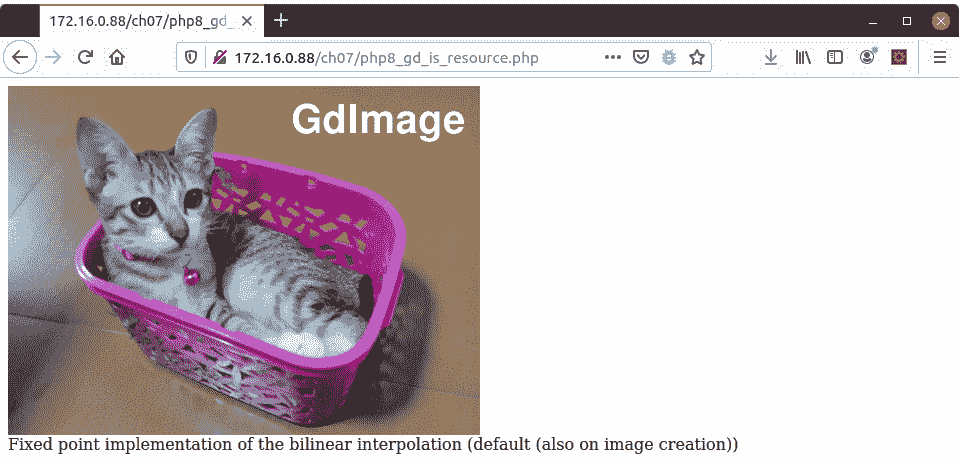
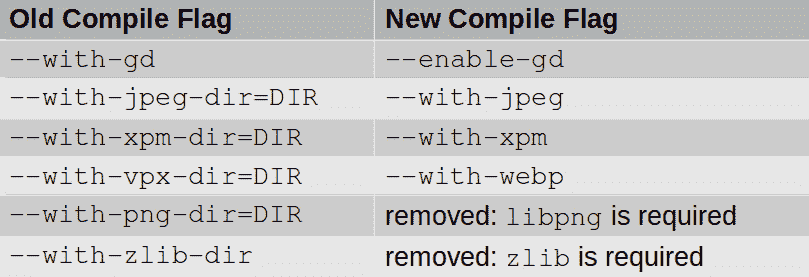

# *第 7 章*：使用 PHP8 扩展时避免陷阱

**PHP 的主要优势之一是：超文本预处理器**（**PHP**语言）是它的扩展。PHP8 中引入的对 PHP 语言的更改也要求扩展开发团队同时更新其扩展。在本章中，您将了解对扩展进行了哪些主要更改，以及如何在将现有应用程序更新为 PHP8 时避免陷阱。

一旦您完成了本章中介绍的示例代码和主题的回顾，您将能够准备任何现有的 PHP 代码，以便迁移到 PHP8。除了了解各种扩展的更改外，您还将深入了解它们的操作。在 PHP8 中使用扩展时，此功能将允许您做出明智的决策。

本章涵盖的主题包括以下内容：

*   理解从资源到对象的转变
*   了解对**可扩展标记语言**（**XML**扩展的更改
*   避免更新的`mbstring`扩展出现问题
*   处理`gd`扩展的更改
*   发现对`Reflection`扩展的更改
*   使用其他扩展 gotchas

# 技术要求

为了检查和运行本章中提供的代码示例，这里列出了推荐的最低硬件：

*   基于 x86_64 的台式 PC 或笔记本电脑
*   1**GB**（**GB**可用磁盘空间
*   4 GB 的**随机存取存储器**（**RAM**）
*   500**千比特每秒**（**Kbps**或更快的互联网连接

此外，您还需要安装以下软件：

*   码头工人
*   Docker Compose

请参考[*第 1 章*](01.html#_idTextAnchor013)*中的*技术要求*部分，介绍新的 PHP8 OOP 功能，*了解有关 Docker 和 Docker Compose 安装的更多信息，以及如何构建 Docker 容器，如用于演示本书中使用的代码的容器。在本书中，我们将您还原本书样本代码的目录称为`/repo`。

本章的源代码位于以下位置：

[https://github.com/PacktPublishing/PHP-8-Programming-Tips-Tricks-and-Best-Practices/tree/main/ch07](https://github.com/PacktPublishing/PHP-8-Programming-Tips-Tricks-and-Best-Practices/tree/main/ch07 )

现在，我们可以通过检查 PHP8 中面向对象而非资源的总体趋势来开始讨论。

# 理解从资源到对象的转变

PHP 语言一直与**资源**有着不稳定的关系。资源表示与外部系统的连接，例如文件句柄或使用客户端 URL（**cURL**扩展名）与远程 web 服务的连接。然而，资源的一个大问题是，它们无法尝试数据类型化。无法区分文件句柄和`cURL`连接—它们都被标识为资源。

在 PHP8 中，一项主要的工作是远离资源，用对象替换它们。在 PHP8 之前，这种趋势的最早例子之一是`PDO`类。当您创建一个`PDO`实例时，它会自动创建一个数据库连接。从 PHP8 开始，许多以前生成资源的函数现在生成对象实例。让我们从现在生成对象而不是资源的扩展函数开始讨论。

## PHP 8 扩展资源到对象的迁移

了解 PHP8 中的哪些函数现在生成对象而不是资源，这一点很重要。好消息是扩展函数也被重写，以将对象作为参数而不是资源。坏消息是，在初始化资源（现在是对象）并使用`is_resource()`函数测试成功的情况下，可能存在向后兼容的代码中断。

下表总结了以前返回资源但现在返回对象实例的函数：


表 7.1–PHP 8 资源到对象的迁移

*表 7.1*为现在生成对象而非资源的函数提供了有价值的指南。在将任何现有应用程序迁移到 PHP8 之前，请参阅此表。下一节将详细介绍潜在的向后兼容代码中断，以及如何调整有问题的代码的指导原则，然后再讨论这些好处。

## 涉及 is_ 资源（）的潜在代码中断

您可能面临的一个问题是，在 PHP8 之前编写的代码假设*表 7.1*中列出的函数返回*资源*。因此，聪明的开发人员习惯于使用`is_resource()`作为测试，以查看连接是否成功建立。

尽管这是一种非常明智的检查方法，但在升级 PHP8 后，这种技术现在引入了向后兼容的代码中断。下面的示例演示了这个问题。

在这个代码示例中，外部网站的`cURL`连接被初始化。接下来的几行使用`is_resource()`功能测试成功：

```php
// //repo/ch07/php7_ext_is_resource.php
$url = 'https://unlikelysource.com/';
$ch  = curl_init($url);
if (is_resource($ch))
    echo "Connection Established\n"
else
    throw new Exception('Unable to establish connection');
```

PHP 7 的以下输出显示了成功：

```php
root@php8_tips_php7 [ /repo/ch07 ]# 
php php7_ext_is_resource.php 
Connection Established
```

在 PHP 8 中运行的相同代码的输出不成功，我们可以在这里看到：

```php
root@php8_tips_php8 [ /repo/ch07 ]# 
php php7_ext_is_resource.php 
PHP Fatal error:  Uncaught Exception: Unable to establish connection in /repo/ch07/php7_ext_is_resource.php:9
```

PHP8 的输出具有欺骗性，因为已经建立了一个连接*！但是，由于程序代码正在检查`cURL`句柄是否是资源，因此代码会抛出一个`Exception`错误。失败的原因是返回的是`CurlHandle`实例，而不是资源。*

 *在这种情况下，您可以通过替换`!empty()`（非空）来避免代码中断，并在 PHP 8 和任何早期 PHP 版本中成功运行代码，如下所示：

```php
// //repo/ch07/php8_ext_is_resource.php
$url = 'https://unlikelysource.com/';
$ch  = curl_init($url);
if (!empty($ch))
    echo "Connection Established\n";
else
    throw new Exception('Unable to establish connection');
var_dump($ch);
```

以下是在 PHP 7 中运行的代码示例的输出：

```php
root@php8_tips_php7 [ /repo/ch07 ]# 
php php8_ext_is_resource.php 
Connection Established
/repo/ch07/php8_ext_is_resource.php:11:
resource(4) of type (curl)
```

以下是在 PHP 8 中运行的相同代码示例：

```php
root@php8_tips_php8 [ /repo/ch07 ]# 
php php8_ext_is_resource.php 
Connection Established
object(CurlHandle)#1 (0) {}
```

正如您从两个输出中看到的，代码成功运行：在 PHP7 中，`$ch`是一个*资源*。在 PHP8 中，`$ch`是一个`CurlHandle`实例。既然您了解了关于`is_resource()`的潜在问题，那么让我们来看看这一变化带来的好处。

## 对象相对于资源的优势

在 PHP8 之前，在向函数或方法传递资源或从函数或方法返回资源时，无法提供数据类型。生成对象而不是资源的一个明显优势是可以利用对象类型提示。

为了说明这一优势，设想一组**超文本传输协议**（**HTTP**客户端类，它们实现一个**策略软件设计模式**。一种策略是使用`cURL`扩展发送消息。另一种策略使用 PHP 流，如下所示：

1.  我们首先定义一个`Http/Request`类。类构造函数将给定 URL 解析为其组件部分，如以下代码片段所示：

    ```php
    // /repo/src/Http/Request.php
    namespace Http;
    class Request {
        public $url      = '';
        public $method   = 'GET';
        // not all properties shown
        public $query    = '';
        public function __construct(string $url) {
            $result = [];
            $parsed = parse_url($url);
            $vars   = array_keys(get_object_vars($this));
            foreach ($vars as $name)
                $this->$name = $parsed[$name] ?? '';
            if (!empty($this->query))
                parse_str($this->query, $result);
            $this->query = $result;
            $this->url   = $url;
        }
    }
    ```

2.  接下来，我们定义一个`CurlStrategy`类，它使用`cURL`扩展发送消息。注意，`__construct()`方法使用构造函数参数提升。您可能还注意到，我们为`$handle`参数提供了一个`CurlHandle`数据类型。这是仅在 PHP8 中可用的巨大优势，它确保了任何创建此策略类实例的程序都必须提供正确的资源数据类型。代码在下面的代码片段中进行了说明：

    ```php
    // /repo/src/Http/Client/CurlStrategy.php
    namespace Http\Client;
    use CurlHandle;
    use Http\Request;
    class CurlStrategy {
        public function __construct(
            public CurlHandle $handle) {}
    ```

3.  然后我们定义用于发送消息的实际逻辑，如下所示：

    ```php
        public function send(Request $request) {
            // not all code is shown
            curl_setopt($this->handle, 
                CURLOPT_URL, $request->url);
            if (strtolower($request->method) === 'post') {
                $opts = [CURLOPT_POST => 1,
                    CURLOPT_POSTFIELDS =>
                        http_build_query($request->query)];
                curl_setopt_array($this->handle, $opts);
            }
            return curl_exec($this->handle);
        }
    }
    ```

4.  然后我们可以对`StreamsStrategy`类做同样的事情。同样，在下面的代码片段中，请注意我们如何使用类作为构造函数参数类型提示，以确保策略的正确使用：

    ```php
    // /repo/src/Http/Client/StreamsStrategy.php
    namespace Http\Client;
    use SplFileObject;
    use Exception;
    use Http\Request;
    class StreamsStrategy {
        public function __construct(
            public ?SplFileObject $obj) {}
        // remaining code not shown
    ```

5.  然后，我们定义一个调用两种策略并交付结果的调用程序。设置自动加载后，我们创建一个新的`Http\Request`实例，提供一个任意 URL 作为参数，如下所示：

    ```php
    // //repo/ch07/php8_objs_returned.php
    require_once __DIR__ 
        . '/../src/Server/Autoload/Loader.php';
    $autoload = new \Server\Autoload\Loader();
    use Http\Request;
    use Http\Client\{CurlStrategy,StreamsStrategy};
    $url = 'https://api.unlikelysource.com/api
        ?city=Livonia&country=US';
    $request = new Request($url);
    ```

6.  接下来，我们定义一个`StreamsStrategy`实例并发送请求，如下所示：

    ```php
    $streams  = new StreamsStrategy();
    $response = $streams->send($request);
    echo $response;
    ```

7.  然后我们定义一个`CurlStrategy`实例并发送相同的请求，如下面的代码片段所示：

    ```php
    $curl     = new CurlStrategy(curl_init());
    $response = $curl->send($request);
    echo $response;
    ```

两种策略的输出是相同的。此处显示了部分输出（请注意，此示例只能在 PHP8 中使用！）：

```php
root@php8_tips_php8 [ /repo/ch07 ]# 
php php8_objs_returned.php 
CurlStrategy Results:
{"data":[{"id":"1227826","country":"US","postcode":"14487","city":"Livonia","state_prov_name":"New York","state_prov_code":"NY","locality_name":"Livingston","locality_code":"051","region_name":"","region_code":"","latitude":"42.8135","longitude":"-77.6635","accuracy":"4"},{"id":"1227827","country":"US","postcode":"14488","city":"Livonia Center","state_prov_name":"New York","state_prov_code":"NY","locality_name":"Livingston","locality_code":"051","region_name":"","region_code":"","latitude":"42.8215","longitude":"-77.6386","accuracy":"4"}]}
```

现在让我们看看资源到对象迁移的另一个方面：它对迭代的影响。

## 可遍历到迭代聚集迁移

PHP5 中首次引入了**可遍历**接口。它没有方法，主要是为了允许对象使用简单的`foreach()`循环进行迭代而创建的。随着 PHP 开发的不断发展，经常需要获得内部迭代器。因此，在 PHP8 中，许多以前实现了`Traversable`的类现在实现了`IteratorAggregate`。

这并不意味着增强类不再支持`Traversable`接口固有的能力。恰恰相反：`IteratorAggregate`扩展了`Traversable`！此增强意味着您现在可以在任何受影响类的实例上调用`getIterator()`。这可能带来巨大的好处，因为在 PHP8 之前，无法访问各种扩展中使用的内部迭代器。下表总结了受此增强影响的扩展和类：


表 7.2–现在实现 IteratorAggregate 而不是可遍历的类

在本节中，我们向您介绍了 PHP8 中引入的一个重大变化：使用对象而不是资源的趋势。您了解到的优势之一是，与资源相比，对象允许您进行更大的控制。本节介绍的另一个优点是 PHP8 向`IteratorAggregate`的转变允许访问以前无法访问的内置迭代器。

现在我们将注意力转向对基于 XML 的扩展的更改。

# 了解 XML 扩展的变化

XML 版本 1.0 于 1998 年作为**万维网联盟**（**W3C**规范引入。XML 与**超文本标记语言****HTML**有一些相似之处；然而，XML 的主要目的是提供一种格式化数据的方法，使机器和人类都能读取。XML 仍然被广泛使用的原因之一是它易于理解，并且在表示树结构数据方面做得非常出色。

PHP 提供了许多扩展，允许您使用和生成 XML 文档。PHP8 中的许多扩展都引入了一些更改。在大多数情况下，这些变化都很小；但是，如果您希望成为一名全面、知情的 PHP 开发人员，那么了解这些变化是很重要的。

让我们首先看看对`XMLWriter`扩展的更改。

## 检查 XMLWriter 扩展差异

所有`XMLWriter`扩展过程函数现在接受并返回`XMLWriter`对象，而不是资源。但是，如果您查看了关于`XMLWriter`扩展的官方 PHP 文档，您将看不到对过程函数的引用。原因有两个：首先，PHP 语言正慢慢地从离散过程函数转向**面向对象编程**（**OOP**）。

第二个原因是`XMLWriter`过程函数实际上只是`XMLWriter`OOP 方法的包装！例如，`xmlwriter_open_memory()`是`XMLWriter::openMemory()`的包装，`xmlwriter_text()`是`XMLWriter::text()`的包装，依此类推。

如果您真的打算使用过程编程技术使用`XMLWriter`扩展，`xmlwriter_open_memory()`将在 PHP8 中创建`XMLWriter`实例，而不是资源。同样，所有的`XMLWriter`扩展过程函数都使用`XMLWriter`实例，而不是资源。

与本章中提到的任何扩展一样，它们现在生成的是对象实例而不是资源，因此有可能出现向后兼容的中断。例如，您使用`XMLWriter`过程函数和`is_resource()`检查资源是否已创建。我们在此不向您展示示例，因为问题和解决方案与上一节中描述的相同：使用`!empty()`而不是`is_resource()`。

使用`XMLWriter`扩展 OOP**应用程序编程接口**（**API**）代替过程 API 是*最佳实践*。幸运的是，OOPAPI 从 PHP5.1 开始就可以使用了。下面是下一个示例中使用的示例 XML 文件：

```php
<?xml version="1.0" encoding="UTF-8"?>
<fruit>
    <item>Apple</item>
    <item>Banana</item>
</fruit>
```

这里显示的示例在 PHP7 和 PHP8 中都可以使用。本例的目的是使用`XMLWriter`扩展来构建前面所示的 XML 文档。以下是实现此目的的步骤：

1.  我们首先创建一个`XMLWriter`实例。然后，我们打开一个到共享内存的连接并初始化 XML 文档类型，如下所示：

    ```php
    // //repo/ch07/php8_xml_writer.php
    $xml = new XMLWriter();
    $xml->openMemory();
    $xml->startDocument('1.0', 'UTF-8');
    ```

2.  接下来，我们使用`startElement()`初始化`fruit`根节点，并添加一个子节点项，其值为`Apple`，如下所示：

    ```php
    $xml->startElement('fruit');
    $xml->startElement('item');
    $xml->text('Apple');
    $xml->endElement();
    ```

3.  接下来，我们添加另一个子节点项，其值为`Banana`，如下所示：

    ```php
    $xml->startElement('item');
    $xml->text('Banana');
    $xml->endElement();
    ```

4.  最后，我们关闭`fruit`根节点并结束 XML 文档。以下代码段中的最后一个命令显示当前 XML 文档：

    ```php
    $xml->endElement();
    $xml->endDocument();
    echo $xml->outputMemory();
    ```

以下是在 PHP 7 中运行的示例程序的输出：

```php
root@php8_tips_php7 [ /repo/ch07 ]# php php8_xml_writer.php 
<?xml version="1.0" encoding="UTF-8"?>
<fruit><item>Apple</item><item>Banana</item></fruit>
```

如您所见，生成了所需的 XML 文档。如果我们在 PHP8 中运行相同的程序，结果是相同的（未显示）。

现在我们将注意力转向`SimpleXML`扩展的更改。

## 处理对 SimpleXML 扩展的更改

`SimpleXML`扩展是面向对象的，应用广泛。因此，了解在 PHP8 中对该扩展所做的几个重要更改是至关重要的。好消息是您不必重写任何代码！更好的消息是，这些更改大大改进了`SimpleXML`扩展功能。

从 PHP 8 开始，`SimpleXMLElement`类现在实现了**标准 PHP 库**（**SPL**）`RecursiveIterator`接口，并包含`SimpleXMLIterator`类的功能。在 PHP8 中，`SimpleXMLIterator`现在是`SimpleXMLElement`的空扩展。当你认为 XML 经常用来表示复杂的树形结构数据时，这种看似简单的更新具有重要的意义。

例如，查看温莎*住宅*的家谱局部视图，如下所示：


图 7.1–复杂树结构数据示例

如果我们使用 XML 对这个建模，文档可能如下所示：

```php
<?xml version="1.0" encoding="UTF-8"?>
<!-- /repo/ch07/tree.xml -->
<family>
  <branch name="Windsor">
    <descendent gender="M">George V</descendent>
    <spouse gender="F">Mary of Treck</spouse>
    <branch name="George V">
      <descendent gender="M">George VI</descendent>
      <spouse gender="F">Elizabeth Bowes-Lyon</spouse>
      <branch name="George VI">
        <descendent gender="F">Elizabeth II</descendent>
        <spouse gender="M">Prince Philip</spouse>
        <branch name="Elizabeth II">
          <descendent gender="M">Prince Charles</descendent>
          <spouse gender="F">Diana Spencer</spouse>
          <spouse gender="F">Camilla Parker Bowles</spouse>
          <branch name="Prince Charles">
            <descendent gender="M">William</descendent>
            <spouse gender="F">Kate Middleton</spouse>
          </branch>
          <!-- not all nodes are shown -->
        </branch>
      </branch>
    </branch>
  </branch>
</family>
```

然后我们开发代码来解析树。然而，在 PHP8 之前的 PHP 版本中，我们需要定义一个递归函数来解析整个树。为此，我们将遵循以下步骤：

1.  我们首先定义一个递归函数，该函数显示子代的名称和配偶（如果有），如下面的代码段所示。此函数还可以标识后代的性别，并检查是否有子代。如果后者为`true`，则函数会调用自身：

    ```php
    function recurse($branch) {
        foreach ($branch as $node) {
            echo $node->descendent;
            echo ($node->descendent['gender'] == 'F')
                 ? ', daughter of '
                 : ', son of ';
            echo $node['name'];
            if (empty($node->spouse)) echo "\n";
            else echo ", married to {$node->spouse}\n";
            if (!empty($node->branch)) 
                recurse($node->branch);
        }
    }
    ```

2.  We then create a `SimpleXMLElement` instance from the external XML file and call the recursive function, as follows:

    ```php
    // //repo/ch07/php7_simple_xml.php
    $fn = __DIR__ . '/includes/tree.xml';
    $xml = simplexml_load_file($fn);
    recurse($xml);
    ```

    这个代码块在 PHP7 和 PHP8 中都可以使用。以下是在 PHP 7 中运行的输出：

    ```php
    root@php8_tips_php7 [ /repo/ch07 ]# php php7_simple_xml.php
    George V, son of Windsor, married to Mary of Treck
    George VI, son of George V, married to Elizabeth Bowes-Lyon
    Elizabeth II, daughter of George VI, married to Philip
    Prince Charles, son of Elizabeth II, married to Diana Spencer
    William, son of Prince Charles, married to Kate Middleton
    Harry, son of Prince Charles, married to Meghan Markle
    Princess Anne, daughter of Elizabeth II, married to M.Phillips
    Princess Margaret, daughter of George VI, married to A.Jones
    Edward VIII, son of George V, married to Wallis Simpson
    Princess Mary, daughter of George V, married to H.Lascelles
    Prince Henry, son of George V, married to Lady Alice Montegu
    Prince George, son of George V, married to Princess Marina
    Prince John, son of George V
    ```

    然而，在 PHP8 中，因为`SimpleXMLElement`现在实现了`RecursiveIterator`，所以产生相同结果的代码更简单。

3.  与前面显示的示例一样，我们从外部文件定义了一个`SimpleXMLElement`实例。但是，不需要定义递归函数-我们只需要定义一个`RecursiveIteratorIterator`实例，如下所示：

    ```php
    // //repo/ch07/php8_simple_xml.php
    $fn = __DIR__ . '/includes/tree.xml';
    $xml = simplexml_load_file($fn);
    $iter = new RecursiveIteratorIterator($xml,
        RecursiveIteratorIterator::SELF_FIRST);
    ```

4.  之后，我们只需要一个简单的`foreach()`循环，其内部逻辑与前面示例中相同。不需要检查分支节点是否存在，也不需要由`RecursiveIteratorIterator`实例处理的递归！您需要的代码如下所示：

    ```php
    foreach ($iter as $branch) {
        if (!empty($branch->descendent)) {
            echo $branch->descendent;
            echo ($branch->descendent['gender'] == 'F')
                 ? ', daughter of '
                 : ', son of ';
            echo $branch['name'];
            if (empty($branch->spouse)) echo "\n";
            else echo ", married to {$branch->spouse}\n";
        }
    }
    ```

下面显示了在 PHP8 中运行的代码示例的输出。如您所见，输出完全相同：

```php
root@php8_tips_php8 [ /repo/ch07 ]# php php8_simple_xml.php 
George V, son of Windsor, married to Mary of Treck
George VI, son of George V, married to Elizabeth Bowes-Lyon
Elizabeth II, daughter of George VI, married to Philip
Prince Charles, son of Elizabeth II, married to Diana Spencer
William, son of Prince Charles, married to Kate Middleton
Harry, son of Prince Charles, married to Meghan Markle
Princess Anne, daughter of Elizabeth II, married to M.Phillips
Princess Margaret, daughter of George VI, married to A.Jones
Edward VIII, son of George V, married to Wallis Simpson
Princess Mary, daughter of George V, married to H.Lascelles
Prince Henry, son of George V, married to Lady Alice Montegu
Prince George, son of George V, married to Princess Marina
Prince John, son of George V
```

重要提示

请注意，当您使用 Docker 容器运行这些示例时，此处显示的输出已稍微修改，以适合页面宽度。

现在让我们看一下其他 XML 扩展更改。

## 了解其他 XML 扩展更改

对其他 PHP8XML 扩展进行了许多更改。在大多数情况下，这些更改都是很小的，并且不会出现向后兼容的代码中断。然而，如果我们不解决这些额外的变化，我们将是失职的。我们建议您完成本小节中剩余的更改，以便提高您的意识。使用这些 XML 扩展将使您能够对 PHP8 更新后行为不一致的应用程序代码进行故障排除。

### 对 libxml 扩展的更改

**libxml**扩展利用**Expat C 库**，提供各种 PHP XML 扩展（[使用的 XML 解析函数 https://libexpat.github.io/](https://libexpat.github.io/) 。

您的服务器上安装的`libxml`版本有新的要求。运行 PHP8 时的最低版本必须是 2.9.0（或更高版本）。此更新需求的主要好处之一是增加了针对**XML 外部实体**（**XXE**处理攻击的保护。

推荐的最低版本`libxml`默认情况下禁用依赖`libxml`扩展加载外部 XML 实体的 PHP XML 扩展的能力。这反过来又减少了针对 XXE 攻击进行保护所需的昂贵且耗时的额外步骤。

提示

有关 XXE 攻击的更多信息，请使用以下链接咨询**开放式 Web 应用程序安全项目**（**OWASP**）：[https://owasp.org/www-community/vulnerabilities/XML_External_Entity_（XXE）_ 处理](https://owasp.org/www-community/vulnerabilities/XML_External_Entity_(XXE)_Processing)。

### 对 XMLReader 扩展的更改

`XMLReader`扩展是对`XMLWriter`扩展的补充。当`XMLWriter`扩展设计用于生成 XML 文档时，`XMLReader`扩展设计用于读取。

两种方法`XMLReader::open()`和`XMLReader::xml()`现在被定义为**静态方法**。您仍然可以创建`XMLReader`实例，但如果您扩展`XMLReader`并重写其中任何一个方法，请确保将它们声明为静态。

### 对 XMLParser 扩展的更改

`XMLParser`扩展是最古老的 PHP XML 扩展之一。因此，它几乎完全由过程函数组成，而不是类和方法。然而，在 PHP8 中，此扩展遵循生成对象而不是资源的趋势。因此，当您运行`xml_parser_create()`或`xml_parser_create_ns()`时，将创建`XMLParser`实例，而不是资源。

正如*中提到的涉及 is_resource（）*部分的潜在代码中断，您只需将使用`is_resource()`的任何检查替换为`!empty()`。资源到对象迁移的另一个副作用是使`xml_parser_free()`功能冗余。要停用解析器，只需使用`XmlParser`对象。

现在您已经了解了与 XML 扩展相关的更改，这将帮助您更有效地解析和管理 XML 数据。通过利用本节中提到的新特性，您可以生成比 PHP8 之前更高效、性能更好的代码。现在我们来看一下`mbstring`扩展。

# 避免更新后的 mbstring 扩展出现问题

`mbstring`扩展最初是在 PHP4 中引入的，此后一直是该语言的活跃部分。这个扩展的最初目的是为各种日语字符编码系统提供支持。自那时起，最显著的是增加了对多种其他编码的支持，支持基于**通用编码字符集 2**（**UCS-2**）、**UCS-4**、**Unicode 转换格式 8**（**UTF-8**、**UTF-16**的编码，**UTF-32**、**Shift 日本工业标准**（**SJIS**）和**国际标准化组织 8859**（**ISO-8859**等。

如果您不确定服务器上支持哪些编码，只需运行`mb_list_encodings()`命令，如下所示（显示部分输出）：

```php
root@php8_tips_php7 [ /repo/ch07 ]# 
php -r "var_dump(mb_list_encodings());"
Command line code:1:
array(87) {
  ... only selected output is shown ...
  [14] =>  string(7) "UCS-4BE"
  [16] =>  string(5) "UCS-2"
  [19] =>  string(6) "UTF-32"
  [22] =>  string(6) "UTF-16"
  [25] =>  string(5) "UTF-8"
  [26] =>  string(5) "UTF-7"
  [27] =>  string(9) "UTF7-IMAP"
  [28] =>  string(5) "ASCII"
  [29] =>  string(6) "EUC-JP"
  [30] =>  string(4) "SJIS"
  [31] =>  string(9) "eucJP-win"
  [32] =>  string(11) "EUC-JP-2004"
  [76] =>  string(6) "KOI8-R"
  [78] =>  string(9) "ArmSCII-8"
  [79] =>  string(5) "CP850"
  [80] =>  string(6) "JIS-ms"
  [81] =>  string(16) "ISO-2022-JP-2004"
  [86] =>  string(7) "CP50222"
}
```

正如您在前面的输出中所看到的，在我们用于本书的 PHP7.1 Docker 容器中，支持 87 种编码。在 PHP8.0Docker 容器（未显示输出）中，支持 80 种编码。现在让我们看看 PHP8 中引入的更改，从`mb_str*()`函数开始。

## 在 mb_str*（）函数中发现指针参数差异

在[*第 6 章*](06.html#_idTextAnchor129)*理解 PHP8 的功能差异*中，您了解了 PHP8 如何在核心`str*pos()`、`str*str()`和`str*chr()`函数中引入对**指针参数处理**的更改。两个主要的指针参数差异是能够接受一个空指针参数和严格的类型检查，以确保指针参数仅为字符串。为了保持的一致性，PHP8 在相应的`mb_str*()`函数中引入了相同的更改。

让我们先看看空指针参数处理。

### mb_str*（）函数空指针参数处理

为了使`mbstring`扩展与核心字符串函数的更改保持一致，下面的`mbstring`扩展函数现在允许一个空指针参数。重要的是要注意，这并不意味着参数可以省略或是可选的！此更改的意思是，作为指针参数提供的任何值现在也可以包括被视为*空*的值。在`empty()`函数（[的文档中可以找到一种快速了解 PHP 认为什么是空的好方法 https://www.php.net/empty](https://www.php.net/empty) 。下面是允许空指针参数值的`mbstring`函数列表：

*   `mb_strpos()`
*   `mb_strrpos()`
*   `mb_stripos()`
*   `mb_strripos()`
*   `mb_strstr()`
*   `mb_stristr()`
*   `mb_strrchr()`
*   `mb_strrichr()`

    提示

    这里提到的八个`mbstring`扩展函数中的每一个都与其核心 PHP 对应函数完全并行。有关这些功能的更多信息，请参阅此参考文档：[https://www.php.net/manual/en/ref.mbstring.php](https://www.php.net/manual/en/ref.mbstring.php) 。

下面的简短代码示例说明了上述八个函数中的空针处理。以下是实现这一目标的步骤：

1.  首先，我们初始化一个多字节文本字符串。在下面的例子中，这是*的泰语翻译，敏捷的棕色狐狸跳过了栅栏*。指针参数设置为`NULL`，并初始化要测试的函数数组：

    ```php
    // /repo/ch07/php8_mb_string_empty_needle.php
    $text   = 'สุนัขจิ้งจอกสีน้ำตาลกระโดดข้ามรั้วอย่างรวดเร็ว';
    $needle = NULL;
    $funcs  = ['mb_strpos',   'mb_strrpos', 'mb_stripos',
               'mb_strripos', 'mb_strstr', 'mb_stristr',
               'mb_strrchr',  'mb_strrichr'];
    ```

2.  然后我们定义一个`printf()`模式，并循环测试要测试的函数。对于每个函数调用，我们提供后跟空指针参数的文本，如下所示：

    ```php
    $patt = "Testing: %12s : %s\n";
    foreach ($funcs as $str)
        printf($patt, $str, $str($text, $needle));
    ```

PHP 7 的输出如下所示：

```php
root@php8_tips_php7 [ /repo/ch07 ]# 
php php8_mb_string_empty_needle.php
PHP Warning:  mb_strpos(): Empty delimiter in /repo/ch07/php8_mb_string_empty_needle.php on line 12
Testing:    mb_strpos : 
Testing:   mb_strrpos : 
PHP Warning:  mb_stripos(): Empty delimiter in /repo/ch07/php8_mb_string_empty_needle.php on line 12
Testing:   mb_stripos : 
Testing:  mb_strripos : 
PHP Warning:  mb_strstr(): Empty delimiter in /repo/ch07/php8_mb_string_empty_needle.php on line 12
Testing:    mb_strstr : 
PHP Warning:  mb_stristr(): Empty delimiter in /repo/ch07/php8_mb_string_empty_needle.php on line 12
Testing:   mb_stristr : 
Testing:   mb_strrchr : 
Testing:  mb_strrichr : 
```

如您所见，输出为空，在某些情况下，会发出`Warning`消息。在 PHP 8 中运行的输出与预期完全不同，我们可以在这里看到：

```php
root@php8_tips_php8 [ /repo/ch07 ]# 
php php8_mb_string_empty_needle.php
Testing:    mb_strpos : 0
Testing:   mb_strrpos : 46
Testing:   mb_stripos : 0
Testing:  mb_strripos : 46
Testing:    mb_strstr : สุนัขจิ้งจอกสีน้ำตาลกระโดดข้ามรั้วอย่างรวดเร็ว
Testing:   mb_stristr : สุนัขจิ้งจอกสีน้ำตาลกระโดดข้ามรั้วอย่างรวดเร็ว
Testing:   mb_strrchr : 
Testing:  mb_strrichr : 
```

有趣的是，当这段代码在 PHP8 中运行时，一个空指针参数返回一个整数`0`表示`mb_strpos()`和`mb_stripos()`，整数`46`表示`mb_strrpos()`和`mb_strripos()`。在 PHP8 中，在本例中，空指针参数被解释为字符串的开头或结尾。`mb_strstr()`和`mb_stristr()`的结果都是整个字符串。

### mb_str*（）函数数据类型检查

为了保持与核心`str*()`函数的对齐，指针参数必须是对应`mb_str*()`函数中的字符串类型。如果您提供的是一个**美国信息交换标准代码**（**ASCII**）值而不是字符串，那么受影响的函数现在将抛出一个`ArgumentTypeError`错误。本小节未显示任何示例，因为[*第 6 章*](06.html#_idTextAnchor129)*理解 PHP8 的功能差异，*已经提供了核心`str*()`功能差异的示例。

### mb_strrpos（）中的差异

在早期版本的 PHP 中，允许将字符编码作为第三个参数传递给`mb_strrpos()`，而不是偏移量。PHP8 不再支持这种糟糕的做法。相反，您可以提供 OutT1 作为第三个参数，或者考虑使用 PHP 8 的 TUR3 T3。命名参数 AUT T4。（在 To.T5A.To.T6A.第 1 章 AutoT7A. Ty8T8，Ont9）引入了新的 PHP 8 OOP 特征，Ty10T.，在 TUR11T11.理解命名参数 AUT12TY 段）避免将值作为可选参数提供。

现在让我们看一个代码示例，它演示了 PHP7 和 PHP8 之间在处理方面的差异。进行如下工作：

1.  我们首先定义一个常量来表示我们希望使用的字符编码。指定了一个文本字符串，表示*的泰语翻译。这只敏捷的棕色狐狸跳过了篱笆*。然后我们使用`mb_convert_encoding()`来确保使用正确的编码。代码在下面的代码片段中进行了说明：

    ```php
    // /repo/ch07/php7_mb_string_strpos.php
    define('ENCODING', 'UTF-8');
    $text    = 'สุนัขจิ้งจอกสีน้ำตาลกระโดดข้ามรั้วอย่างรวดเร็ว';
    $encoded = mb_convert_encoding($text, ENCODING);
    ```

2.  然后我们将*围栏*的泰语翻译分配给`$needle`，并在文本中回显字符串的长度和`$needle`的位置。然后我们调用`mb_strrpos()`来查找`$needle`的最后一次出现。请注意，在下面的代码片段中，我们故意遵循将编码用作第三个参数而不是偏移量的错误做法：

    ```php
    $needle  = 'รั้ว';
    echo 'String Length: ' 
        . mb_strlen($encoded, ENCODING) . "\n";
    echo 'Substring Pos: ' 
        . mb_strrpos($encoded, $needle, ENCODING) . "\n";
    ```

此代码示例的输出在 PHP 7 中运行良好，如下所示：

```php
root@php8_tips_php7 [ /repo/ch07 ]# 
php php7_mb_string_strpos.php
String Length: 46
Substring Pos: 30
```

从前面的输出可以看出，多字节字符串的长度为`46`，指针的位置为`30`。另一方面，在 PHP 8 中，我们最终得到一条致命的`Uncaught TypeError`消息，如下所示：

```php
root@php8_tips_php8 [ /repo/ch07 ]# 
php php7_mb_string_strpos.php
String Length: 46
PHP Fatal error:  Uncaught TypeError: mb_strrpos(): Argument #3 ($offset) must be of type int, string given in /repo/ch07/php7_mb_string_strpos.php:14
```

从 PHP8 输出中可以看到，`mb_strrpos()`的第三个参数必须是一个整数形式的偏移值。重写此示例的一种简单方法是利用 PHP8*命名参数*。以下是重写的代码行：

```php
echo 'Substring Pos: ' 
    . mb_strrpos($encoded, $needle, encoding:ENCODING) . "\n";
```

输出与 PHP7 考试 ple 相同，此处未显示。现在让我们关注`mbstring`扩展的**正则表达式**（**正则表达式**）——处理差异。

## 检查 mb_ereg*（）函数的变化

`mb_ereg*()`系列函数允许**正则表达式**处理使用多字节字符集编码的字符串。相比之下，核心 PHP 语言提供了与**Perl 兼容的正则表达式**（**PCRE**）系列函数，这些函数具有现代和更先进的功能。

如果在使用 PCRE 函数时向正则表达式模式添加`u`（小写字母*U*）修饰符，则接受任何**UTF-8**编码的多字节字符串。然而，UTF-8 是唯一被接受的*多字节字符编码。如果您正在处理其他字符编码并希望执行正则表达式功能，则需要转换为 UTF-8 或使用`mb_ereg*()`系列函数。现在让我们来看一下`mb_ereg*()`函数系列的一些变化。*

### PHP8 中需要 Oniguruma 库

这一系列函数的一个变化是 PHP 安装的编译方式。在 PHP8 中，您的操作系统必须提供`libonig`库。此库提供**Oniguruma**功能。（见 https://github.com/kkos/oniguruma 更多信息。）旧的`--with-onig`PHP 源代码编译配置选项已被删除，以便使用`pkg-config`检测`libonig`。

### 对 mb_ereg_replace（）的更改

以前，您可以将整数作为参数提供给`mb_ereg_replace()`。此参数被解释为**ASCII 码点**。在 PHP8 中，这样的参数现在被类型转换为`string`。如果需要 ASCII 码点，则需要使用`mb_chr()`。由于对`string`的类型转换是无声完成的，因此可能存在向后兼容的代码中断，因为您不会看到任何`Notice`或`Warning`消息。

下面的程序代码示例说明了 PHP7 和 PHP8 之间的差异。我们将遵循以下步骤：

1.  首先，我们定义要使用的编码，并将*两只快速跳过围栏的棕色狐狸*的泰语翻译作为多字节字符串分配给`$text`。接下来，我们使用`mb_convert_encoding()`来确保使用正确的编码。然后，我们使用`mb_regex_encoding()`将`mb_ereg*`设置为所选的编码。代码在下面的代码片段中进行了说明：

    ```php
    // /repo/ch07/php7_mb_string_strpos.php
    define('ENCODING', 'UTF-8');
    $text = 'สุนัขจิ้งจอกสีน้ำตาล 2 ตัวกระโดดข้ามรั้ว';
    $str  = mb_convert_encoding($text, ENCODING);
    mb_regex_encoding(ENCODING);
    ```

2.  然后我们调用`mb_ereg_replace()`并提供一个整数值`50`作为第一个参数，并将其替换为字符串`"3"`。原始字符串和修改后的字符串都会回显。您可以在此处查看代码：

    ```php
    $mod1 = mb_ereg_replace(50, '3', $str);
    echo "Original: $str\n";
    echo "Modified: $mod1\n";
    ```

注意，`mb_ereg_replace()`的第一个参数应该是一个字符串，但是我们提供了一个整数。在 PHP8 之前的`mbstring`扩展版本中，如果提供了一个整数作为第一个参数，它将被视为 ASCII 码点。

如果我们在 PHP7 中运行此代码示例，则数字`50`将被解释为`"2"`的 ASCII 码点值，正如预期的那样，我们可以在这里看到：

```php
root@php8_tips_php7 [ /repo/ch07 ]# 
php php7_mb_string_ereg_replace.php 
Original: สุนัขจิ้งจอกสีน้ำตาล 2 ตัวกระโดดข้ามรั้ว
Modified: สุนัขจิ้งจอกสีน้ำตาล 3 ตัวกระโดดข้ามรั้ว
```

从前面的输出中可以看到，数字`2`被数字`3`替换。然而，在 PHP8 中，数字`50`被类型转换为字符串。由于此源字符串不包含数字`50`，因此不进行替换，如下所示：

```php
root@php8_tips_php8 [ /repo/ch07 ]# 
php php7_mb_string_ereg_replace.php 
Original: สุนัขจิ้งจอกสีน้ำตาล 2 ตัวกระโดดข้ามรั้ว
Modified: สุนัขจิ้งจอกสีน้ำตาล 2 ตัวกระโดดข้ามรั้ว
```

这里的危险在于，如果代码依赖于此静默解释过程，则应用程序可能会失败或表现出不一致的行为。您还将注意到缺少`Notice`或`Warning`消息。PHP8 依赖开发人员提供正确的参数！

如果您确实需要使用 ASCII 码点，*最佳实践*是使用`mb_chr()`生成所需的搜索字符串。修改后的代码示例可能如下所示：

`$mod1 = mb_ereg_replace(mb_chr(50), '3', $str);`

您现在已经了解了`mbstring`扩展中发生的变化。如果没有这些信息，您很容易编写错误代码。不知道这些信息的开发人员最终可能会在 PHP8 中犯错误，比如假设`mbstring`别名仍然存在。这种错误的理解很容易导致在 PHP8 迁移后花费数小时跟踪程序代码中的错误。

现在是时候来看看另一个有重大变化的扩展了：GD 扩展。

# 处理 GD 扩展的变更

**GD 扩展**是利用`GD`库的图像处理扩展。GD 最初代表**GIF Draw**。奇怪的是，在 Unisys 吊销了生成 GIF 时使用的压缩技术的开源许可证后，`GD`库不得不撤销对**图形交换格式**（**GIF**的支持。然而，2004 年之后，Unisys 在这项技术上的专利过期，GIF 支持也恢复了。目前，PHP`GD`扩展为**联合摄影专家组**（**JPEG**或**JPG**）、**便携式网络图形**（**PNG**）、**GIF**、**X 位图**（【T27 XBM）提供支持，**X PixMap**（**XPM**）、**无线位图**（**WBMP**）、**WebP**、**位图**（**BMP**等）格式。

提示

有关 GD 库的更多信息，请参阅[https://libgd.github.io/](https://libgd.github.io/) 。

现在让我们看看资源到对象迁移对`GD`扩展的影响。

## GD 扩展资源到对象迁移

与之前使用*资源*的其他 PHP 扩展一样，`GD`扩展也主要从`resource`迁移到`object`。正如在*PHP 8 扩展资源到对象迁移*一节中提到的，所有的`imagecreate*()`函数现在都生成`GdImage`对象，而不是资源。

有关如何在 PHP8 迁移后显示代码中断的示例，请在两个不同的浏览器选项卡（在本地计算机上）中运行这些示例，并比较差异。首先，我们使用以下 URL 运行 PHP7 示例：[http://172.16.0.77/ch07/php7_gd_is_resource.php](http://172.16.0.77/ch07/php7_gd_is_resource.php) 。结果如下：


图 7.2–PHP 7 GD 图像资源

正如您从前面的输出中看到的，识别了`resource`扩展名，但没有描述性信息。现在，让我们使用以下 URL 运行 PHP 8 示例：http://172.16.0.88/ch07/php8_gd_is_resource.php. 结果如下：



图 7.3–PHP8 GD 图像对象实例

PHP8 的输出不仅将返回类型标识为`GdImage`实例，还将在图像下方显示描述性信息。

现在我们将注意力转向其他`GD`扩展更改。

## GD 扩展编译标志更改

`GD`扩展不仅利用了 GD 库，还利用了许多支持库。需要这些库来支持各种图形格式。以前，在从源代码编译定制版本的 PHP 时，需要指定*JPEG*、*PNG*、*XPM*和*VPX*格式的库的位置。此外，由于压缩是减少最终文件总大小的一个重要方面，因此还需要`ZLIB`的位置。

当从源代码处编译 PHP8 时，有许多重要的配置标志更改，这些更改最初是在 PHP7.4 中引入的，随后被引入 PHP8 中。主要的变化是不再需要指定库所在的目录。PHP8 现在使用`pkg-config`操作系统来定位库。

下表总结了编译标志的更改。这些标志在实际编译过程本身之前与`configure`实用程序一起使用：



表 7.3–GD 编译选项更改

您将从表中注意到，大多数`--with-*-dir`选项被`--with-*`替换。此外，*PNG*和*ZLIB*支持现在是自动的；但是，您的操作系统上必须安装有`libpng`和`zlib`。

现在我们来看看对`GD`扩展的其他小改动。

## 其他 GD 扩展变更

除了上一节中描述的主要变更之外，还发生了一些其他次要变更，如函数签名变更和新函数。让我们先来看看`imagecropauto()`函数。

以下是`imagecropauto()`的旧函数签名：

```php
imagecropauto(resource $image , int $mode = -1, 
              float $threshold = .5 , int $color = -1 )
```

在 PHP8 中，`$image`参数现在是`GdImage`类型。`$mode`参数现在默认为`IMG_CROP_DEFAULT`预定义常量。

另一个变化影响`imagepolygon()`、`imageopenpolygon()`和`imagefilledpolygon()`功能。以下是`imagepolygon()`的旧函数签名：

```php
imagepolygon(resource $image, array $points, 
             int $num_points, int $color)
```

在 PHP8 中，`$num_points`参数现在是可选的。如果省略，点数计算如下：`count($points)/2`。但是，这意味着`$points`数组中的元素数必须是偶数！

最后一个重要的变化是增加了一个新功能`imagegetinterpolation()`。这是它的功能签名：

`imagegetinterpolation(GdImage $image) : int`

返回值是一个本身并不是很有用的整数。但是，如果您检查文档中的`imagesetinterpolation()`功能(https://www.php.net/manual/en/function.imagesetinterpolation.php)，您将看到插值方法代码列表以及说明。

现在您已经知道了在`GD`扩展中引入了哪些更改。接下来，我们将检查对`Reflection`扩展的更改。

# 发现反射延伸的变化

**反射扩展**用于对中的对象、类、方法和函数执行*内省*。`ReflectionClass`和`ReflectionObject`分别生成类或对象实例的信息。`ReflectionFunction`提供有关程序级功能的信息。此外，`Reflection`扩展还有一组由刚才提到的主要类生成的次要类。这些次级课程包括`ReflectionMethod`、由`ReflectionClass::getMethod()`制作、由`ReflectionProperty`制作、由`ReflectionClass::getProperty()`制作等。

您可能会想：*谁使用此扩展？*答案是：任何需要对外部类集执行分析的应用程序。这可能包括执行自动**代码生成**、**测试**或**文档生成**的软件。执行**水合**（从数组填充对象）的类也受益于`Reflection`扩展。

提示

我们在书中没有足够的空间来涵盖每一个`Reflection`扩展类和方法。如果您希望获得更多信息，请查看此处的文档参考：[https://www.php.net/manual/en/book.reflection.php](https://www.php.net/manual/en/book.reflection.php) 。

现在让我们来看一个`Reflection`扩展使用示例。

## 反射扩展用法

我们现在将展示一个代码示例，演示如何使用`Reflection`扩展生成**docblocks**（一个`docblock`是一个 PHP 注释，它使用一种特殊语法来表示方法的用途、其传入参数和返回值）。以下是实现这一目标的步骤：

1.  我们首先定义一个创建目标类的`ReflectionClass`实例的`__construct()`方法，如下所示：

    ```php
    // /repo/src/Services/DocBlockChecker.php
    namespace Services;
    use ReflectionClass;
    class DocBlockChecker {
        public $target = '';    // class to check
        public $reflect = NULL; // ReflectionClass instance
        public function __construct(string $target) {
            $this->target = $target;
            $this->reflect = new ReflectionClass($target);
        }
    ```

2.  然后我们定义一个`check()`方法，该方法获取所有类方法，返回一个`ReflectionMethod`实例数组，如下所示：

    ```php
        public function check() {
            $methods = [];
            $list = $this->reflect->getMethods();
    ```

3.  然后我们循环所有方法，并使用`getDocComment()`检查`docblock`是否已经存在，如下所示：

    ```php
          foreach ($list as $refMeth) {
              $docBlock = $refMeth->getDocComment();
    ```

4.  如果一个`docblock`不存在，我们启动一个新的，然后调用`getParameters()`，返回一个`ReflectionParameter`实例数组，如下面的代码片段所示：

    ```php
              if (!$docBlock) {
                  $docBlock = "/**\n * " 
                      . $refMeth->getName() . "\n";
                  $params = $refMeth->getParameters();
    ```

5.  如果我们有参数，我们收集信息进行显示，如下所示：

    ```php
                if ($params) {
                  foreach ($params as $refParm) {
                    $type = $refParm->getType() 
                          ?? 'mixed';
                    $type = (string) $type;
                    $name = $refParm->getName();
                    $default = '';
                    if (!$refParm->isVariadic() 
                     && $refParm->isOptional()) {
                      $default=$refParm->getDefaultValue(); }
                    if ($default === '') {
                      $default = "(empty string)"; }
                    $docBlock .= " * @param $type "
                      . "\${$name} : $default\n";
                  }
              }
    ```

6.  然后我们设置返回类型，并将`docblock`分配给`$methods`数组，然后返回该数组，如下所示：

    ```php
               if ($refMeth->isConstructor())
                   $return = 'void';
                else
                    $return = $refMeth->getReturnType() 
                              ?? 'mixed';
                $docBlock .= " * @return $return\n";
                $docBlock .= " */\n";
            }
            $methods[$refMeth->getName()] = $docBlock;
        }
        return $methods;
      }
    }
    ```

7.  现在新的`docblock`检查类完成了，我们定义了一个调用程序，如下面的代码片段所示。调用程序以`/repo/src/Php7/Reflection/Test.php`类为目标（此处未显示）。该类混合了方法，其中包含参数和返回值：

    ```php
    // //repo/ch07/php7_reflection_usage.php
    $target = 'Php7\Reflection\Test';
    require_once __DIR__ 
        . '/../src/Server/Autoload/Loader.php';
    use Server\Autoload\Loader;
    use Services\DocBlockChecker;
    |$autoload = new Loader();
    $checker = new DocBlockChecker($target);
    var_dump($checker->check());
    ```

调用程序的输出如下所示：

```php
root@php8_tips_php7 [ /repo/ch07 ]# 
php php7_reflection_usage.php 
/repo/ch07/php7_reflection_usage.php:10:
array(4) {
  '__construct' =>  string(75) 
"/**
 * __construct
 * @param PDO $pdo : (empty string)
 * @return void
 */"
  'fetchAll' =>  string(41) 
"/**
 * fetchAll
 * @return Generator
 */"
  'fetchByName' =>  string(80) 
"/**
 * fetchByName
 * @param string $name : (empty string)
 * @return array
 */"
  'fetchLastId' =>  string(38) 
"/**
 * fetchLastId
 * @return int
 */"
}
```

如您所见，此类构成了潜在自动文档或代码生成应用程序的基础。

现在让我们来看一下`Reflection`扩展改进。

## 学习反射扩展改进

对`Reflection`扩展也有一些改进，这对您了解可能很重要。请记住，尽管使用`Reflection`扩展的开发人员数量有限，但有一天您可能会发现自己处于使用此扩展的代码的情况下。如果您在 PHP8 升级后注意到异常行为，本节介绍的内容将为您提供故障排除过程中的一个良好开端。

### 反射类型修改

`ReflectionType`类现在在 PHP8 中是抽象的。当您使用`ReflectionProperty::getType()`或`ReflectionFunction::getReturnType()`方法时，您可能会注意到返回了一个`ReflectionNamedType`实例。此更改不会影响程序代码的正常运行，除非您依赖于返回的`ReflectionType`实例。但是，`ReflectionNamedType`扩展了`ReflectionType`，因此任何`instanceof`操作都不会受到影响。

值得注意的是，`isBuiltIn()`方法已经从`ReflectionType`移动到`ReflectionNamedType`。同样，由于`ReflectionNamedType`扩展了`ReflectionType`，因此在当前代码中不应出现任何向后兼容的中断。

### ReflectionParameter:：*DefaultValue*增强的方法

在早期版本的 PHP 中，与默认值相关的`ReflectionParameter`方法无法反映内部 PHP 函数。这在 PHP8 中发生了变化。以下`ReflectionParameter`方法现在也可以从内部函数返回默认值信息：

*   `getDefaultValue()`
*   `getDefaultValueConstantName()`
*   `isDefaultValueAvailable()`
*   `isDefaultValueConstant()`

从列表中可以看到，方法名称是自解释的。现在我们将展示一个利用这些增强功能的代码示例。以下是实现这一目标的步骤：

1.  首先，我们定义一个函数，它接受一个`ReflectionParameter`实例并返回一个带有参数名和默认值的数组，如下所示：

    ```php
    // /repo/ch07/php8_reflection_parms_defaults.php
    $func = function (ReflectionParameter $parm) {
        $name = $parm->getName();
        $opts = NULL;
        if ($parm->isDefaultValueAvailable())
            $opts = $parm->getDefaultValue();
    ```

2.  接下来，我们定义一个`switch()`语句来净化选项，如下所示：

    ```php
        switch (TRUE) {
            case (is_array($opts)) :
                $tmp = '';
                foreach ($opts as $key => $val)
                    $tmp .= $key . ':' . $val . ',';
                $opts = substr($tmp, 0, -1);
                break;
            case (is_bool($opts)) :
                $opts = ($opts) ? 'TRUE' : 'FALSE';
                break;
            case ($opts === '') :
                $opts = "''";
                break;
            default :
                $opts = 'No Default';
        }
        return [$name, $opts];
    };
    ```

3.  然后，我们确定要反映哪个函数并提取其参数。在下面的示例中，我们反映了`setcookie()`：

    ```php
    $test = 'setcookie';
    $ref = new ReflectionFunction($test);
    $parms = $ref->getParameters();
    ```

4.  然后我们循环通过`ReflectionParameter`实例的数组并产生如下输出：

    ```php
    $patt = "%18s : %s\n";
    foreach ($parms as $obj)
        vprintf($patt, $func($obj));
    ```

以下是在 PHP 7 中运行的输出：

```php
root@php8_tips_php7 [ /repo/ch07 ]# 
php php8_reflection_parms_defaults.php 
Reflecting on setcookie
         Parameter : Default(s)
      ------------ : ------------
              name : No Default
             value : No Default
           expires : No Default
              path : No Default
            domain : No Default
            secure : No Default
          httponly : No Default
```

结果总是`No Default`，因为在 PHP7 和更早版本中，`Reflection`扩展无法读取内部 PHP 函数的默认值。另一方面，PHP 8 的输出要精确得多，我们可以在这里看到：

```php
root@php8_tips_php8 [ /repo/ch07 ]# 
php php8_reflection_parms_defaults.php 
Reflecting on setcookie
         Parameter : Default(s)
      ------------ : ------------
              name : No Default
             value : ''
expires_or_options : No Default
              path : ''
            domain : ''
            secure : FALSE
          httponly : FALSE
```

从输出中可以看出，PHP8 中的`Reflection`扩展能够准确地报告内部函数的默认值！

现在让我们看一下其他`Reflection`扩展更改。

### 其他反射扩展更改

在 PHP8 之前的 PHP 版本中，`ReflectionMethod::isConstructor()`和`ReflectionMethod::isDestructor()`无法反映接口中定义的神奇方法。在 PHP8 中，这两个方法现在为接口中定义的相应魔术方法返回`TRUE`。

当使用`ReflectionClass::getConstants()`或`ReflectionClass::getReflectionConstants()`方法时，现在添加了一个新的`$filter`参数。该参数允许您按可见性级别过滤结果。因此，新参数可以接受以下任何新添加的预定义常量：

*   `ReflectionClassConstant::IS_PUBLIC`
*   `ReflectionClassConstant::IS_PROTECTED`
*   `ReflectionClassConstant::IS_PRIVATE`

您现在已经了解了如何使用`Reflection`扩展，以及在 PHP8 迁移之后会发生什么。是时候来看看其他一些在 PHP8 中看到变化的扩展了。

# 与其他扩展 gotchas 一起工作

除了本章已经讨论的 PHP 扩展之外，PHP8 还对几个 PHP 扩展引入了许多其他值得注意的更改。正如我们在本书中一再强调的那样，意识到这些变化对你未来的 PHP 开发生涯非常重要。

让我们首先看看对数据库扩展的更改。

## 新数据库扩展操作系统库要求

任何使用**MySQL**、**MariaDB**、**PostgreSQL**或**PHP 数据对象**（**PDO**的开发人员都需要了解对支持操作系统库的新要求。下表总结了 PHP 8 所需的最低新版本：


表 7.4–PHP 8 数据库库要求

从上表可以看出，有两个主要的库更改。`libpq`af 同时影响`PostgreSQL`分机和`PDO`分机的驱动程序。`libmysqlclient`是**MySQL 改进的**（**MySQLi**扩展）使用的库，也是`PDO`扩展的 MySQL 驱动程序。还应该注意的是，如果您使用的是 MariaDB，一个流行的 MySQL 开源版本，那么新的最低`MySQL`库要求也适用于您。

现在您已经了解了数据库扩展的更改，接下来我们将关注 ZIP 扩展。

## 审查对邮政分机的更改

ZIP**扩展名**用于以编程方式创建和管理压缩归档文件，利用`libzip`操作系统库。还存在其他压缩扩展，如**Zlib**、**bzip2**、**LZF**、**PHP 归档格式**（**phar**）和**Roshal 归档压缩**（**RAR**；但是，其他扩展都没有提供`ZIP`扩展提供的丰富功能。另外，在大多数情况下，其他扩展是专用的，通常不适合通用 ZIP 文件管理。

让我们首先看看这个扩展最显著的变化。

### 处理 ZIP 扩展 OOP 迁移

ZIP 扩展的最大变化是一个潜在的大规模向后兼容代码出现故障。从 PHP8 开始，过程 API（所有过程函数）已被弃用！尽管这目前不影响任何代码，但所有 ZIP 扩展功能最终将从该语言中删除。

*最佳实践*是使用`ZipArchive`类将任何`ZIP`扩展过程代码迁移到 OOP API。下面的代码示例说明了如何从过程代码迁移到目标代码，打开一个`test.zip`文件并生成一个条目列表：

```php
// /repo/ch07/php7_zip_functions.php
$fn  = __DIR__ . '/includes/test.zip';
$zip = zip_open($fn);
$cnt = 0;
if (!is_resource($zip)) exit('Unable to open zip file');
while ($entry = zip_read($zip)) {
    echo zip_entry_name($entry) . "\n";
    $cnt++;
}
echo "Total Entries: $cnt\n";
```

此处是在 PHP7 中运行的输出：

```php
root@php8_tips_php7 [ /repo/ch07 ]# 
php php7_zip_functions.php 
ch07/includes/
ch07/includes/test.zip
ch07/includes/tree.xml
ch07/includes/test.png
ch07/includes/kitten.jpg
ch07/includes/reflection.html
ch07/php7_ext_is_resource.php
ch07/php7_gd_is_resource.php
... not all entries shown ...
ch07/php8_simple_xml.php
ch07/php8_xml_writer.php
ch07/php8_zip_oop.php
Total Entries: 27
```

从前面的输出中可以看到，总共找到了`27`个条目。（另外，请注意，并不是所有的 ZIP 文件条目都显示出来。）但是，如果我们在 PHP 8 中尝试相同的代码示例，我们会得到一个非常不同的结果，正如我们在这里看到的：

```php
root@php8_tips_php8 [ /repo/ch07 ]# 
php php7_zip_functions.php 
PHP Deprecated:  Function zip_open() is deprecated in /repo/ch07/php7_zip_functions.php on line 5
PHP Deprecated:  Function zip_read() is deprecated in /repo/ch07/php7_zip_functions.php on line 8
PHP Deprecated:  Function zip_entry_name() is deprecated in /repo/ch07/php7_zip_functions.php on line 9
ch07/includes/
Deprecated: Function zip_entry_name() is deprecated in /repo/ch07/php7_zip_functions.php on line 9
... not all entries shown ...
ch07/php8_zip_oop.php
PHP Deprecated:  Function zip_read() is deprecated in /repo/ch07/php7_zip_functions.php on line 8
Total Entries: 27
```

正如您从前面的 PHP8 输出中所看到的，代码示例是有效的，但会发出一系列弃用`Notice`消息。

以下是您需要如何在 PHP 8 中编写相同的代码示例：

```php
// /repo/ch07/php8_zip_oop.php
$fn  = __DIR__ . '/includes/test.zip';
$obj = new ZipArchive();
$res = $obj->open($fn);
if ($res !== TRUE) exit('Unable to open zip file');
for ($i = 0; $entry = $obj->statIndex($i); $i++) {
    echo $entry['name'] . "\n";
}
echo "Total Entries: $i\n";
```

输出（未显示）与上一示例完全相同。有趣的是，重写的示例也可以在 PHP7 中使用！还值得注意的是，在 PHP8 中，您可以使用`ZipArchive::count()`获得总的条目数（每个目录）。您可能也注意到，为了检查 ZIP 存档是否正确打开，在 PHP8 中，您不能再使用`is_resource()`。

### 新的 ZipArchive 类方法

除了资源到对象的迁移外，`ZipArchive`类还做了一些改进。一个这样的改进是增加了以下新方法：

*   `setMtimeName()`
*   `setMtimeIndex()`
*   `registerProgressCallback()`
*   `registerCancelCallback()`
*   `replaceFile()`
*   `isCompressionMethodSupported()`
*   `isEncryptionMethodSupported()`

方法名称是不言自明的。`Mtime`为**修改时间**。

### addGlob（）和 addPattern（）的新选项

`ZipArchive::addGlob()`和`ZipArchive::addPattern()`方法有一组新的选项。这两种方法相似，都用于将文件添加到存档中。区别在于`addGlob()`使用与核心 PHP`glob()`命令相同的文件模式，而`addPattern()`使用正则表达式过滤文件。新的选项集总结如下：

*   `flags`：允许您使用*位运算符*组合适当的类常量
*   `comp_method`：指定使用任何`ZipArchive::CM_*`常量作为参数的压缩方法
*   `comp_flags`：使用所需的`ZipArchive::FL_*`常数指定压缩标志
*   `enc_method`：用于指定所需的字符编码（使用任何`ZipArchive::FL_ENC_*`标志）
*   `enc_password`：允许您指定加密密码（如果已为此 ZIP 存档设置）

这里还值得一提的是，PHP8 之前的`remove_path`选项必须是有效的目录路径。从 PHP8 开始，这个选项是一个简单的字符串，表示要删除的字符。这允许您删除文件名前缀以及不需要的目录路径。

虽然我们仍在检查选项，但值得注意的是添加了两个新的编码方法类常量：`ZipArchive::EM_UNKNOWN`和`ZipArchive::EM_TRAD_PKWARE`。此外，还添加了一个新的`lastId`属性，以便您能够确定最后一个 ZIP 存档条目的索引值。

### 其他 ZipArchive 方法更改

除了前面提到的变更之外，PHP8 中还有一些其他`ZipArchive`方法发生了变更。在本节中，我们总结了其他`ZipArchive`方法的变化，如下所示：

*   `ZipArchive::extractTo()`之前使用当前日期和时间作为修改时间。从 PHP8 开始，此方法恢复原始文件修改时间。
*   `ZipArchive::getStatusString()`即使在`ZipArchive::close()`被调用后仍返回结果。
*   `ZipArchive::addEmptyDir()`、`ZipArchive::addFile()`和`ZipArchive::addFromString()`方法都有一个新的`flags`参数。您可以使用任何适当的`ZipArchive::FL_*`类常量，并使用位运算符组合。
*   `ZipArchive::open()`现在可以打开一个空（零字节）文件。

现在您对`ZIP`扩展引入的更改和改进有了一个想法，让我们检查一下正则表达式领域的更改。

## 检查 PCRE 扩展变化

**PCRE**扩展包含许多函数，用于使用*正则表达式执行模式匹配。*术语*正则**表达式*通常缩短为*正则表达式*。**正则表达式**是描述另一个字符串的字符串。以下是在`PCRE`扩展中需要注意的一些变化。

模式中的无效转义序列不再被解释为文本。在过去，你可以使用`X`修饰语；然而，在 PHP8 中，这个修饰符现在被忽略了。令人高兴的是，为了帮助您处理内部 PCRE 模式分析错误，添加了一个新的`preg_last_error_msg()`函数，在遇到 PCRE 错误时返回一条可读的消息。

`preg_last_error()`功能允许您确定模式分析期间是否发生内部 PCRE 错误。但是，此函数仅返回一个整数。在 PHP8 之前，由开发人员查找代码并找出实际错误。

提示

`preg_last_error()`返回的错误代码列表如下：

[https://www.php.net/manual/en/function.preg-last-error.php#refsect1-function.preg-last-error-returnvalues](https://www.php.net/manual/en/function.preg-last-error.php#refsect1-function.preg-last-error-returnvalues)

后面有一个简短的代码示例，说明了上述问题。以下是实现这一目标的步骤：

1.  首先，我们定义了一个执行匹配的函数，并检查是否发生了任何错误，如下所示：

    ```php
    $pregTest = function ($pattern, $string) {
        $result  = preg_match($pattern, $string);
        $lastErr = preg_last_error();
        if ($lastErr == PREG_NO_ERROR) {
            $msg = 'RESULT: ';
            $msg .= ($result) ? 'MATCH' : 'NO MATCH';
        } else {
            $msg = 'ERROR : ';
            if (function_exists('preg_last_error_msg'))
                $msg .= preg_last_error_msg();
            else
                $msg .= $lastErr;
        }
        return "$msg\n";
    };
    ```

2.  然后，我们创建一个故意包含`\8+`无效转义序列的模式，如下所示：

    ```php
    $pattern = '/\8+/';
    $string  = 'test 8';
    echo $pregTest($pattern, $string);
    ```

3.  接下来，我们定义一个故意导致 PCRE 超过其回溯限制的模式，如下所示：

    ```php
    $pattern = '/(?:\D+|<\d+>)*[!?]/';
    $string  = 'test ';
    echo $pregTest($pattern, $string);
    ```

以下是 PHP 7.1 中的输出：

```php
root@php8_tips_php7 [ /repo/ch07 ]# php php7_pcre.php 
RESULT: MATCH
ERROR : 2
```

从前面的输出中可以看到，无效模式被视为文本值 8。因为字符串中存在 8，所以认为找到了匹配项。对于第二种模式，超过回溯限制；然而，PHP7.1 无法报告问题，迫使您查找它。

PHP 8 中的输出非常不同，如下所示：

```php
root@php8_tips_php8 [ /repo/ch07 ]# php php7_pcre.php 
PHP Warning:  preg_match(): Compilation failed: reference to non-existent subpattern at offset 1 in /repo/ch07/php7_pcre.php on line 5
ERROR : Internal error
ERROR : Backtrack limit exhausted
```

从前面的输出中可以看到，PHP8 生成一条`Warning`消息。您还可以看到`preg_last_error_msg()`产生了一条有用的消息。现在我们来看一下**国际化**（**国际**扩展。

## 处理 Intl 扩展更改

**Intl 扩展**由几个类组成，这些类处理许多应用程序方面，这些应用程序方面可能会根据区域设置而变化。各种类处理诸如国际化数字和货币格式、文本解析、日历生成、时间和日期格式以及字符集转换等任务。

PHP 8 中 Intl 扩展的主要变化是以下新的日期格式：

*   `IntlDateFormatter::RELATIVE_FULL`
*   `IntlDateFormatter::RELATIVE_LONG`
*   `IntlDateFormatter::RELATIVE_MEDIUM`
*   `IntlDateFormatter::RELATIVE_SHORT`

下面的代码示例显示了新的格式。以下是实现这一目标的步骤：

1.  首先，我们定义一个`DateTime`实例和一个包含新格式代码的数组，如下所示：

    ```php
    $dt = new DateTime('tomorrow');
    $pt = [IntlDateFormatter::RELATIVE_FULL,
        IntlDateFormatter::RELATIVE_LONG,
        IntlDateFormatter::RELATIVE_MEDIUM,
        IntlDateFormatter::RELATIVE_SHORT
    ];
    ```

2.  然后，我们循环遍历这些格式并回显输出，如下所示：

    ```php
    foreach ($pt as $fmt) 
        echo IntlDateFormatter::formatObject($dt, $fmt)."\n";
    ```

这个例子在 PHP7 中不起作用。以下是 PHP8 的输出：

```php
root@php8_tips_php8 [ /repo/ch07 ]# 
php php8_intl_date_fmt.php 
tomorrow at 12:00:00 AM Coordinated Universal Time
tomorrow at 12:00:00 AM UTC
tomorrow, 12:00:00 AM
tomorrow, 12:00 AM
```

正如您所看到的，新的相对日期格式工作得非常好！我们现在简要地回到`cURL`扩展。

## 了解卷曲延伸变化

`cURL`扩展利用`libcurl`(http://curl.haxx.se/)提供强大且高效的 HTTP 客户端功能。在 PHP8 中，必须在服务器的操作系统上安装`libcurl`版本 7.29（或更高版本）。

PHP8 的另一个区别是这个扩展现在使用对象而不是资源。在本章前面的*表 7.1**PHP 8 资源到对象迁移*中描述了这一变化。在涉及 is_resource（）部分的*潜在代码中断中显示了一个示例。此更改的一个副作用是，任何`curl*close()`函数都是冗余的，因为当对象未设置或超出范围时，连接将关闭。*

现在让我们来看一下对`COM`扩展的更改。

## 审查 COM 扩展更改

**组件对象模型**（**COM**是一个仅限 Windows 的扩展，它使以一种语言编写的编程代码能够调用并与任何其他 COM 感知编程语言编写的代码进行互操作。这些信息对于任何计划开发在 Windows 服务器上运行的 PHP 应用程序的 PHP 开发人员来说都很重要。

`COM`扩展最重要的变化是现在自动执行区分大小写。因此，您不能再从类型库导入任何不区分大小写的常量。此外，您不能再将`com_load_typelib()`函数的第二个参数`$case_insensitive`指定为`FALSE`。

按照这些思路，`COM`扩展`php.ini`处理区分大小写的设置已经改变。这些措施包括：

*   `com.autoregister_casesensitive`：在 PHP8 中永久启用。
*   `com.typelib_file`：名称以`#cis`或`#case_insensitive`结尾的任何类型库不再导致常量不区分大小写。

一个变化是新的`php.ini`设置`com.dotnet_version`。此设置设置用于 dotnet 对象的**.NET**版本。现在我们来研究其他值得注意的扩展更改。

## 检查其他扩展变更

值得一提的是，其他 PHP 扩展还有一些其他的变化。*下表 7.5*总结了这些变化：


表 7.5–PHP 8 数据库库要求

现在您已经了解了 PHP8 中扩展的更改。本章到此结束。现在，是时候回顾一下了！

# 总结

在本章中，您学习到的最重要的概念之一是从资源到对象的总体趋势。您了解了这一趋势在本章介绍的各种 PHP 扩展中的显著位置，以及如何开发变通方法以避免依赖于资源的代码中出现问题。您还学习了如何检测和开发代码来处理 XML 扩展中的更改，特别是在`SimpleXML`和`XMLWriter`扩展中。

本章中涉及的另一个重要扩展是`mbstring`扩展。您学会了检测依赖于已更改的`mbstring`功能的代码。正如您所了解的，`mbstring`扩展的更改在很大程度上反映了对等效核心 PHP 字符串函数所做的更改。

您还了解了对`GD`、`Reflection`和`ZIP`扩展的重大更改。在本章中，您还了解了对许多数据库扩展的更改，以及需要注意的其他扩展更改。总而言之，通过阅读本章和学习示例，您将了解到，在执行 PHP8 升级后，您现在可以更好地防止应用程序失败。

在下一章中，您将了解 PHP8 中已弃用或删除的功能。*