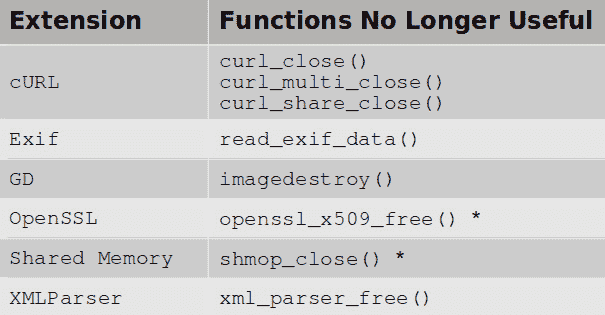
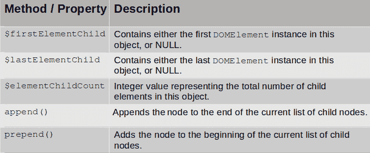
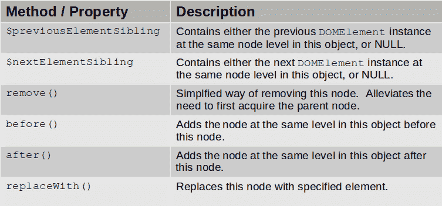
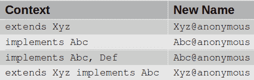

# *第 9 章*：掌握 PHP8 最佳实践

在本章中，将向您介绍目前在 PHP8 中实施的最佳实践。我们将介绍几个重要的方法签名更改，以及它们的新用法如何继续帮助您生成更好代码的 PHP 趋势。我们还将了解私有方法、接口、特征和匿名类的用法是如何改变的。最后，我们将讨论名称空间解析方式的重要变化。

掌握本章将介绍的最佳实践不仅可以帮助您编写更好的代码，还可以帮助您避免在未能掌握这些新实践时可能出现的潜在代码中断。此外，本章讨论的技术将帮助您编写比过去更高效的代码。

在本章中，我们将介绍以下主题：

*   发现方法签名更改
*   处理私人方法
*   使用接口和特性
*   控制匿名类的使用
*   了解名称空间中的更改

# 技术要求

要检查并运行本章中提供的代码示例，建议使用的最低硬件如下：

*   基于 X86_64 的台式 PC 或笔记本电脑
*   1 GB 可用磁盘空间
*   4 GB 内存
*   500 Kbps 或更快的 internet 连接

此外，您还需要安装以下软件：

*   码头工人
*   Docker Compose

有关如何安装 Docker 和 Docker Compose 以及如何构建用于演示本书代码的 Docker 容器的更多信息，请参考[*第 1 章*](01.html#_idTextAnchor013)*中的*技术要求*部分*介绍新的 PHP 8 OOP 功能。在本书中，我们将参考您在其中还原示例代码的目录`/repo`。

本章的源代码位于此处：[https://github.com/PacktPublishing/PHP-8-Programming-Tips-Tricks-and-Best-Practices](https://github.com/PacktPublishing/PHP-8-Programming-Tips-Tricks-and-Best-Practices) 。我们将从检查重要的方法签名更改开始。

# 发现方法签名更改

PHP8 中引入了几个**方法签名更改**。如果您的代码扩展了本节所述的任何类或实现了本节所述的任何方法，那么理解这些签名更改非常重要。只要您知道这些更改，您的代码就会正常运行，从而减少 bug。

PHP8 中引入的签名更改反映了更新的*最佳实践*。因此，如果您编写的代码使用了正确的方法签名，那么您就是在遵循这些最佳实践。我们将从回顾 PHP8 对 magic 方法签名的更改开始讨论。

## 管理魔术方法签名

在 PHP8 中，的定义和**神奇方法**的使用朝着标准化迈出了重要的一步。这是通过以严格参数和返回数据类型的形式引入精确的魔力方法签名来实现的。与 PHP8 中的大多数改进一样，包含此更新是为了防止滥用魔术方法。总体结果是代码更好，bug 更少。

这种增强的缺点是，如果您的代码提供了错误的参数或返回值类型，就会抛出一个`Error`。另一方面，如果您的代码确实提供了正确的参数数据类型和返回值类型，或者如果您的代码根本不使用参数或返回值数据类型，那么此增强将不会产生不利影响。

以下代码块总结了 PHP 8 及更高版本中 magic 方法的新参数和返回值数据类型：

```php
__call(string $name, array $arguments): mixed;
__callStatic(string $name, array $arguments): mixed;
__clone(): void;
__debugInfo(): ?array;
__get(string $name): mixed;
__invoke(mixed $arguments): mixed;
__isset(string $name): bool;
__serialize(): array;
__set(string $name, mixed $value): void;
__set_state(array $properties): object;
__sleep(): array;
__unserialize(array $data): void;
__unset(string $name): void;
__wakeup(): void;
```

现在，让我们来看三个简单的例子，它们说明了神奇方法签名更改的影响：

1.  第一个示例涉及`NoTypes`类，该类定义了`__call()`，但没有定义任何数据类型：

    ```php
    // /repo/ch09/php8_bc_break_magic.php
    class NoTypes {
        public function __call($name, $args) {
            return "Attempt made to call '$name' "
                 . "with these arguments: '"
                 . implode(',', $args) . "'\n";
        }
    }
    $no = new NoTypes();
    echo $no->doesNotExist('A','B','C');
    ```

2.  The following example (in the same file as the preceding example) is of the `MixedTypes` class, which defines `__invoke()` but uses an `array` data type rather than a `mixed` one:

    ```php
    class MixedTypes {
        public function __invoke(array $args) : string {
            return "Arguments: '"
                 . implode(',', $args) . "'\n";
        }
    }
    $mixed= new MixedTypes();
    echo $mixed(['A','B','C']);
    ```

    以下是前面步骤中显示的代码示例的 PHP 7 输出：

    ```php
    root@php8_tips_php7 [ /repo/ch09 ]# 
    php php8_bc_break_magic.php 
    Attempt made to call 'doesNotExist' with these arguments: 'A,B,C'
    Arguments: 'A,B,C'
    ```

    下面是相同的代码示例，但在 PHP 8 下运行：

    ```php
    root@php8_tips_php8 [ /repo/ch09 ]# 
    php php8_bc_break_magic.php 
    Attempt made to call 'doesNotExist' with these arguments: 'A,B,C'
    Arguments: 'A,B,C'
    ```

    如您所见，这两组输出是相同的。显示的第一个类`NoTypes`可以工作，因为没有定义数据类型提示。有趣的是，`MixedTypes`类在 PHP8 及以下版本中都能工作，因为新的`mixed`数据类型实际上是所有类型的联合。因此，您可以安全地使用任何特定数据类型来代替`mixed`。

3.  在最后一个示例中，我们将定义`WrongType`类。在这个类中，我们将使用与 PHP8 要求不匹配的返回数据类型定义一个名为`__isset()`的神奇方法。这里，我们使用的是`string`，而在 PHP8 中，它的返回类型需要是`bool`：

    ```php
    // /repo/ch09/php8_bc_break_magic_wrong.php
    class WrongType {
        public function __isset($var) : string {
            return (isset($this->$var)) ? 'Y' : '';
        }
    }
    $wrong = new WrongType();
    echo (isset($wrong->nothing)) ? 'Set' : 'Not Set';
    ```

该示例在 PHP7 中工作，因为它依赖于一个事实，即如果未设置变量，则在该示例中返回空字符串，然后将其插值为一个`FALSE`布尔值。以下是 PHP7 的输出：

```php
root@php8_tips_php7 [ /repo/ch09 ]# 
php php8_bc_break_magic_wrong.php 
Not Set
```

然而，在 PHP 8 中，由于魔术方法签名现已标准化，因此示例失败，如下所示：

```php
root@php8_tips_php8 [ /repo/ch09 ]# 
php php8_bc_break_magic_wrong.php
PHP Fatal error:  WrongTypes::__isset(): Return type must be bool when declared in /repo/ch09/php8_bc_break_magic_wrong.php on line 6
```

如您所见，PHP8 严格执行其神奇的方法签名。

提示

*最佳实践*：修改任何使用魔法方法的代码，以遵循新的严格方法签名。有关严格魔术方法签名的更多信息，请访问[https://wiki.php.net/rfc/magic-methods-signature](https://wiki.php.net/rfc/magic-methods-signature) 。

您现在知道了要寻找什么，以及如何纠正涉及魔术方法的潜在代码中断。现在，让我们看看反射扩展方法签名的变化。

## 检查反射方法签名更改

如果您的应用程序正在使用`invoke()`或`newInstance()`反射扩展方法，则可能会发生向后的兼容代码中断。在 PHP7 及以下版本中，下面列出的所有三种方法都接受无限数量的参数。但是，在方法签名中，只列出了一个参数，如下所示：

*   `ReflectionClass::newInstance($args)`
*   `ReflectionFunction::invoke($args)`
*   `ReflectionMethod::invoke($args)`

在 PHP8 中，方法签名准确地反映了现实情况，因为`$args`前面有`variadics`操作符。以下是新方法签名：

*   `ReflectionClass::newInstance(...$args)`
*   `ReflectionFunction::invoke(...$args)`
*   `ReflectionMethod::invoke($object, ...$args)`

只有当您的自定义类扩展了这三个类中的任何一个，并且您的自定义类也覆盖了前面项目符号列表中列出的三个方法中的任何一个时，此更改才会中断您的代码。

最后，将`isBuiltin()`方法从`ReflectionType`移动到`ReflectionNamedType`。如果您正在使用`ReflectionType::isBuiltIn()`，则可能出现代码中断。

现在，让我们看看 PDO 扩展中的方法签名更改。

## 处理 PDO 扩展签名更改

PDO 扩展有两个重要的方法签名更改。当应用不同的**获取模式**时，需要这些变更来解决方法调用中的不一致性。以下是对`PDO::query()`的新方法签名：

```php
PDO::query(string $query, 
    ?int $fetchMode = null, mixed ...$fetchModeArgs)
```

这是`PDOStatement::setFetchMode()`的新签名：

```php
PDOStatement::setFetchMode(int $mode, mixed ...$args)
```

提示

PHP7.4 至 PHP8 迁移指南中引用了`PDO::query()`方法签名更改，如下所示：https://www.php.net/manual/en/ migration80.compatible.php#migration80.compatible.pdo。

这两个新的方法签名比旧的签名更加统一，并且当您使用不同的获取模式时，它们完全覆盖了语法上的差异。使用两种不同的获取模式执行`PDO::query()`的简单代码示例说明了为什么需要规范化方法签名：

1.  让我们首先包括一个包含数据库连接参数的配置文件。在此基础上，我们将创建一个`PDO`实例：

    ```php
    // /repo/ch09/php8_pdo_signature_change.php
    $config = include __DIR__ . '/../src/config/config.php';
    $db_cfg = $config['db-config'];
    $pdo    = new PDO($db_cfg['dsn'], 
        $db_cfg['usr'], $db_cfg['pwd']);
    ```

2.  现在，让我们定义一个 SQL 语句并发送它以便准备：

    ```php
    $sql    = 'SELECT hotelName, city, locality, '
            . 'country, postalCode FROM hotels '
            . 'WHERE country = ? AND city = ?';
    $stmt   = $pdo->prepare($sql);
    ```

3.  接下来，我们将执行准备好的语句，并将 fetch 模式设置为`PDO::FETCH_ASSOC`。请注意，当我们使用此 fetch 模式时，`setFetchMode()`方法只提供了一个参数：

    ```php
    $stmt->execute(['IN', 'Budhera']);
    $stmt->setFetchMode(PDO::FETCH_ASSOC);
    while ($row = $stmt->fetch()) var_dump($row);
    ```

4.  最后，我们将再次执行同一条准备好的语句。这一次，我们将取数模式设置为`PDO::FETCH_CLASS`。请注意，当我们使用此获取模式时，`setFetchMode()`方法提供了两个参数：

    ```php
    $stmt->execute(['IN', 'Budhera']);
    $stmt->setFetchMode(
        PDO::FETCH_CLASS, ArrayObject::class);
    while ($row = $stmt->fetch()) var_dump($row);
    ```

第一个查询中的输出是关联数组。第二个查询生成一个`ArrayObject`实例。以下是输出：

```php
root@php8_tips_php8 [ /repo/ch09 ]# 
php php8_pdo_signature_change.php 
array(5) {
  ["hotelName"]=>  string(10) "Rose Lodge"
  ["city"]=>  string(7) "Budhera"
  ["locality"]=>  string(7) "Gurgaon"
  ["country"]=>  string(2) "IN"
  ["postalCode"]=>  string(6) "122505"
}
object(ArrayObject)#3 (6) {
  ["hotelName"]=>  string(10) "Rose Lodge"
  ["city"]=>  string(7) "Budhera"
  ["locality"]=>  string(7) "Gurgaon"
  ["country"]=>  string(2) "IN"
  ["postalCode"]=>  string(6) "122505"
  ["storage":"ArrayObject":private]=>  array(0) {  }
}
```

重要的是要注意，即使方法签名已更改，您也可以保持现有代码不变：这*不会*出现向后兼容的代码中断！

现在，让我们看看声明为`static`的方法。

## 处理新定义的静态方法

PHP8 中另一个潜在的重大变化是现在声明了几个方法`static`。如果您已经将这里描述的类和方法用作直接的对象实例，那么您就没有问题了。

以下方法现在声明为静态：

*   `tidy::repairString()`
*   `tidy::repairFile()`
*   `XMLReader::open()`
*   `XMLReader::xml()`

如果重写前面提到的某个类，可能会发生代码中断。在这种情况下，您*必须*将被重写的方法声明为`static`。下面是一个简单的示例，说明了潜在的问题：

1.  首先，让我们定义一个具有不匹配的`<div>`标记的字符串：

    ```php
    // /repo/ch08/php7_tidy_repair_str_static.php
    $str = <<<EOT
    <DIV>
        <Div>Some Content</div>
        <Div>Some Other Content
    </div>
    EOT;
    ```

2.  然后，定义一个扩展`tidy`的匿名类，修复该字符串，并返回包含所有小写 HTML 标记的字符串：

    ```php
    $class = new class() extends tidy {
        public function repairString($str) {
            $fixed = parent::repairString($str);
            return preg_replace_callback(
                '/<+?>/',
                function ($item) { 
                    return strtolower($item); },
                $fixed);
        }
    };
    ```

3.  最后，回显修复后的字符串：

    ```php
    echo $class->repairString($str);
    ```

如果我们在 PHP7 中运行此代码示例，输出如下：

```php
root@php8_tips_php7 [ /repo/ch09 ]# 
php php7_tidy_repair_str_static.php 
<!DOCTYPE html>
<html>
<head>
<title></title>
</head>
<body>
<div>
<div>Some Content</div>
<div>Some Other Content</div>
</div>
</body>
</html>
```

如您所见，不匹配的`<div>`标记已经修复，并且生成了格式正确的 HTML 文档。您还将注意到，所有标记都是小写的。

然而，在 PHP 8 中，出现了一个方法签名问题，如您在此处所见：

```php
root@php8_tips_php8 [ /repo/ch09 ]# 
php php7_tidy_repair_str_static.php 
PHP Fatal error:  Cannot make static method tidy::repairString() non static in class tidy@anonymous in /repo/ch09/php7_tidy_repair_str_static.php on line 11
```

如您所见，在 PHP8 中，`repairString()`方法现在声明为`static`。我们前面定义的匿名类中`repairString()`的方法签名需要重写，如下所示：

```php
public static function repairString(
    string $str, 
    array|string|null $config = null, 
    ?string $encoding = null) { // etc.
```

重写后的输出（未显示）与前面显示的 PHP7 输出相同。另外，请注意最后一行现在也可以写为：

```php
echo $class::repairString($str);
```

现在您已经了解了新定义为静态的方法，让我们看一个相关的主题；即静态返回类型。

## 使用静态返回类型

在 PHP 中，**static**关键字在多个上下文中使用。它的基本用途超出了本文讨论的范围。在本节中，我们将重点介绍`static`作为返回数据类型的新用法。

由于`static`被认为是`self`的一个亚型，因此它可以用来拓宽`self`的较窄返回类型。但是，`static`关键字不能用作类型提示，因为它会违反*Liskov 替换原则*。这也会让开发人员感到困惑，因为`static`已经在太多其他上下文中使用了。

提示

下面的文章描述了引入静态返回类型之前的背景讨论：[https://wiki.php.net/rfc/static_return_type](https://wiki.php.net/rfc/static_return_type) 。以下文档引用了后期静态绑定：[https://www.php.net/manual/en/language.oop5.late-static-bindings.php](https://www.php.net/manual/en/language.oop5.late-static-bindings.php) 。在[*第 5 章*](05.html#_idTextAnchor104)*中讨论了*Liskov 替换原理*，在*理解扩展的 PHP 8 方差支持*部分中发现了潜在的 OOP 向后兼容性中断*。

这种新返回数据类型最常用的是在使用**fluent 接口**的类中。后者是一种技术，其中对象方法返回当前对象状态的实例，从而允许以*流畅*（可读）的方式使用方法调用链。在下面的示例中，请注意对象如何构建 SQL`SELECT`语句：

1.  首先，我们必须定义一个`Where`类，该类接受无限数量的参数以形成 SQL`WHERE`子句。注意返回数据类型为`static`：

    ```php
    // /src/Php8/Sql/Where.php
    namespace Php8\Sql;
    class Where {
        public $where = [];
        public function where(...$args) : static {
            $this->where = array_merge($this->where, $args);
            return $this;
        }
        // not all code is shown
    }
    ```

2.  现在，让我们定义主类`Select`，它提供了构建 SQL`SELECT`语句部分的方法。再次注意，显示的方法都返回当前类实例，返回数据类型为`static`：

    ```php
    // /src/Php8/Sql/Select.php
    namespace Php8\Sql;
    class Select extends Where {
        public $from  = '';
        public $limit  = 0;
        public $offset  = 0;
        public function from(string $table) : static {
            $this->from = $table;
            return $this;
        }
        public function order(string $order) : static {
            $this->order = $order;
            return $this;
        }
        public function limit(int $num) : static {
            $this->limit = $num;
            return $this;
        }
        // not all methods and properties are shown
    }
    ```

3.  最后，我们必须定义一个调用程序，该程序提供构建 SQL 语句所需的值。注意，`echo`语句使用 fluent 接口，以编程方式创建 SQL 语句更容易理解：

    ```php
    // /repo/ch09/php8_static_return_type.php
    require_once __DIR__ 
        . '/../src/Server/Autoload/Loader.php';
    $loader = new \Server\Autoload\Loader();
    use Php8\Sql\Select;
    $start = "'2021-06-01'";
    $end   = "'2021-12-31'";
    $select = new Select();
    echo $select->from('events')
               ->cols(['id', 'event_name', 'event_date'])
               ->limit(10)
               ->where('event_date', '>=', $start)
               ->where('AND', 'event_date', '<=', $end)
               ->render();
    ```

以下是在 PHP 8 中运行的代码示例的输出：

```php
root@php8_tips_php8 [ /repo/ch09 ]# 
php php8_static_return_type.php 
SELECT id,event_name,event_date FROM events WHERE event_date >= '2021-06-01' AND event_date <= '2021-12-31' LIMIT 10
```

当然，这个例子在 PHP7 中不起作用，因为`static`关键字不能作为返回数据类型使用。接下来，让我们看看特殊`::class`常量的扩展用法。

## 扩展：：类常量的使用

特殊的`::class`常量是一个非常有用的构造，因为它可以无声地扩展到一个完整的名称空间，再加上一个类名字符串。了解它是如何使用的，以及它在 PHP8 中的使用是如何扩展的，可以节省大量时间。它的使用还可以使代码更具可读性，特别是在处理冗长的名称空间和类名时。

特殊的`::class`常量是范围解析运算符（`::`和`class`关键字的组合。然而，与`::parent`、`::self`和`::static`不同，`::class`构造可以在类定义之外使用。从某种意义上说，`::class`构造是一种*魔法常量*，因为它会导致与其关联的类神奇地扩展到其完整名称空间，再加上类名。

在我们了解它是如何在 PHP8 中扩展使用之前，让我们先看看它的常规用法。

### 常规：：类常量用法

特殊的`::class`常量经常用于名称空间过长的情况，这样不仅可以节省大量不必要的输入，还可以保持源代码的可读性。

在这个简单示例中，使用`Php7\Image\Strategy`名称空间，我们希望创建一个策略类列表：

1.  首先，让我们确定名称空间并设置自动加载器：

    ```php
    // /repo/ch09/php7_class_normal.php
    namespace Php7\Image\Strategy;
    require_once __DIR__ 
        . '/../src/Server/Autoload/Loader.php';
    $autoload = new \Server\Autoload\Loader();
    ```

2.  在引入特殊的`::class`常量之前，要生成完整名称空间类名的列表，必须将其全部写成字符串，如下所示：

    ```php
    $listOld = [
        'Php7\Image\Strategy\DotFill',
        'Php7\Image\Strategy\LineFill',
        'Php7\Image\Strategy\PlainFill',
        'Php7\Image\Strategy\RotateText',
        'Php7\Image\Strategy\Shadow'
    ];
    print_r($listOld);
    ```

3.  使用特殊的`::class`常量，可以减少所需的键入量，还可以使代码更具可读性，如下所示：

    ```php
    $listNew = [
        DotFill::class,
        LineFill::class,
        PlainFill::class,
        RotateText::class,
        Shadow::class
    ];
    print_r($listNew);
    ```

如果我们运行这个代码示例，我们将看到这两个列表在 PHP7 和 PHP8 中是相同的。以下是 PHP7 的输出：

```php
root@php8_tips_php7 [ /repo/ch09 ]# 
php php7_class_normal.php 
Array (
    [0] => Php7\Image\Strategy\DotFill
    [1] => Php7\Image\Strategy\LineFill
    [2] => Php7\Image\Strategy\PlainFill
    [3] => Php7\Image\Strategy\RotateText
    [4] => Php7\Image\Strategy\Shadow
)
Array (
    [0] => Php7\Image\Strategy\DotFill
    [1] => Php7\Image\Strategy\LineFill
    [2] => Php7\Image\Strategy\PlainFill
    [3] => Php7\Image\Strategy\RotateText
    [4] => Php7\Image\Strategy\Shadow
)
```

正如您所看到的，特殊的`::class`常量导致在编译时将类名扩展为完整的名称空间，加上类名，导致两个列表包含相同的信息。

现在，让我们看看 PHP8 中的特殊`::class`常量用法。

### 扩展的特殊：：类常量用法

与 PHP8 在语法一致性方面的其他改进一样，现在可以在活动对象实例上使用特殊`::class`常量。尽管效果与使用`get_class()`相同，但使用特殊`::class`常量作为从程序性转向 OOP 的一般最佳实践的一部分是有意义的。

在本例中，扩展的`::class`语法用于确定抛出的错误类型：

1.  当抛出一个`Error`或`Exception`时，最好在错误日志中创建一个条目。在这个同时适用于 PHP7 和 PHP8 的示例中，这个`Error`或`Exception`的类名包含在日志消息中：

    ```php
    // /repo/ch09/php7_class_and_obj.php
    try {
        $pdo = new PDO();
        echo 'No problem';
    } catch (Throwable $t) {
        $msg = get_class($t) . ':' . $t->getMessage();
        error_log($msg);
    }
    ```

2.  在 PHP8 中，您可以通过重写示例获得相同的结果，如下所示：

    ```php
    // /repo/ch09/php8_class_and_obj.php
    try {
        $pdo = new PDO();
        echo 'No problem';
    } catch (Throwable $t) {
        $msg = $t::class . ':' . $t->getMessage();
        error_log($msg);
    }
    ```

正如您从第二段代码中所看到的，语法更加简洁，避免了使用过程函数。但是，我们必须强调，在本例中，没有性能增益。

现在您已经了解了特殊`::class`持续使用的变化，让我们快速了解一下逗号。

## 利用尾随逗号

PHP 长期以来一直允许在定义数组时使用尾随逗号。例如，此处显示的语法并不少见：

```php
$arr = [1, 2, 3, 4, 5,];
```

但是，不允许在函数或方法签名中执行相同的操作：

```php
function xyz ($fn, $ln, $mid = '',) { /* code */ }
```

虽然这并不是什么大不了的事，但在定义数组时可以添加一个尾随逗号，但在函数或方法签名时却不允许有同样的自由，这很烦人！

PHP8 现在允许在函数和方法签名中使用尾随逗号。新规则也适用于与匿名函数相关的`use()`语句。

为了说明这个变化，考虑下面的例子 T1。在此示例中，定义了一个匿名函数，用于呈现全名：

```php
// /repo/ch09/php8_trailing_comma.php
$full = function ($fn, $ln, $mid = '',) {
    $mi = ($mid) ? strtoupper($mid[0]) . '. ' : '';
    return $fn . ' ' . $mi . $ln;
};
echo $full('Fred', 'Flintstone', 'John');
```

如您所见，匿名函数的第三个参数后面有一个逗号。以下是 PHP7 的输出：

```php
root@php8_tips_php7 [ /repo/ch09 ]# 
php php8_trailing_comma.php 
PHP Parse error:  syntax error, unexpected ')', expecting variable (T_VARIABLE) in /repo/ch09/php8_trailing_comma.php on line 4
```

在 PHP 8 中，允许使用尾随逗号，并显示预期的输出，如下所示：

```php
root@php8_tips_php8 [ /repo/ch09 ]# 
php php8_trailing_comma.php 
Fred J. Flintstone
```

虽然在函数或方法定义中使用尾随逗号不一定是最佳做法，但它确实使 PHP8 在处理尾随逗号的总体方式上保持一致。

现在，让我们把注意力转向仍然存在但不再有任何用途的方法。

## 学习不再需要的方法

主要由于 PHP8 资源到对象的迁移，许多函数和方法不再需要。在撰写本文时，它们并没有被弃用，但这些函数不再具有任何实际用途。

类似地，在 PHP8 之前的 PHP 版本中，您将使用`fopen()`打开文件句柄资源。一旦完成对文件的处理，您通常会在文件句柄资源上使用`fclose()`来关闭连接。

现在，假设您使用的是`SplFileObject`而不是`fopen()`。当文件的工作完成后，您可以简单地取消设置对象。这与使用`fclose()`实现相同的功能，使`fclose()`冗余。

下表总结了现有的、仍然可以使用但在 PHP8 中不再具有任何实用价值的函数。标有星号的也不推荐使用：



表 9.1——不再有用的功能

现在您已经了解了 PHP8 中主要的方法签名和用法更改，让我们看看在使用接口和特性时需要考虑的最佳实践。

# 使用接口和特性

PHP8 trait 实现已经通过几种方式进行了扩展。还有几个新的接口可能会改变您使用 DOM 和 DateTime 扩展的方式。在很大程度上，这些变化提高了这两个扩展的能力。但是，由于方法签名在某些情况下发生了更改，您可能会遇到潜在的代码中断。因此，密切关注本节中的讨论非常重要，以确保现有和未来的 PHP 代码保持功能。

首先，让我们看看新的 DOM 扩展接口。

## 发现新的 DOM 扩展接口

*生活成本*经济统计数据每年由世界各国政府发布。它描述了一个普通公民每年的生活成本。随着 web 技术的成熟，一个类似的原则也得到了应用——首先是 HTML，现在是 DOM。**DOM 生活标准**由**网络超文本应用技术工作组**（**WHATWG**）（[维护 https://whatwg.org/](https://whatwg.org/) 。

之所以这些信息对 PHP 开发人员很重要，是因为在 PHP8 中，决定将 PHPDOM 扩展迁移到 DOM 生活标准。因此，从 PHP8 开始，将根据生活水平的变化对该扩展应用一系列增量和连续的更改。

在大多数情况下，更改是向后兼容的。但是，由于某些方法签名会更改以保持对标准的遵守，因此您可能会遇到代码中断。PHP8 中 DOM 扩展最重要的变化是引入了两个新接口。让我们检查一下这些接口，然后讨论它们对 PHP 开发的影响。

### 检查新的 DOMParentNode 接口

两个新接口中的第一个是**DOMParentNode**。以下类在 PHP 8 中实现此接口：

*   `DOMDocument`
*   `DOMElement`
*   `DOMDocumentFragment`

以下是接口定义：

```php
interface DOMParentNode {
    public readonly ?DOMElement $firstElementChild;
    public readonly ?DOMElement $lastElementChild;
    public readonly int $childElementCount;
    public function append(
        ...DOMNode|string|null $nodes) : void;
    public function prepend(
        ...DOMNode|string|null $nodes) : void;
}
```

需要注意的是，PHP 开发人员没有可用的*只读*属性。但是，接口规范将属性显示为只读，因为它们是内部生成的，不能更改。

提示

实际上，2014 年引入的 PHP RFC 建议在类属性中添加一个*只读*属性。然而，该提议被撤回，因为定义一个常数或简单地标记一个属性`private`可以实现相同的效果！有关本提案的更多信息，请参见[https://wiki.php.net/rfc/readonly_properties](https://wiki.php.net/rfc/readonly_properties) 。

下表总结了新`DOMParentNode`接口的属性和方法：



表 9.2–DOMParentNode 接口方法和属性

新接口表示的功能并没有向现有 DOM 功能添加任何新内容。其主要目的是使 PHPDOM 扩展符合生活标准。

提示

将来在架构上更新 DOM 扩展还有另一个目的。在 PHP 的未来版本中，DOM 扩展将能够操作 DOM 树的整个分支。例如，当您在将来发出一个`append()`时，您不仅可以附加一个节点，还可以附加其所有子节点。有关更多信息，请参阅以下 RFC:[https://wiki.php.net/rfc/dom_living_standard_api](https://wiki.php.net/rfc/dom_living_standard_api) 。

现在，让我们看看第二个新接口。

### 检查新的 DOMChildNode 接口

两个新接口中的第二个接口是**DOMChildNode**。`DOMElement`和`DOMCharacterData`类在 PHP8 中实现了这个接口。

此处为接口定义：

```php
interface DOMChildNode {
    public readonly ?DOMElement $previousElementSibling;
    public readonly ?DOMElement $nextElementSibling;
    public function remove() : void;
    public function before(
        ...DOMNode|string|null $nodes) : void;
    public function after(
        ...DOMNode|string|null $nodes) : void;
    public function replaceWith(
        ...DOMNode|string|null $nodes) : void;
}
```

下表总结了`DOMChildNode`的方法和性质：



表 9.3–DOMChildNode 接口方法和属性

在本例中，该功能与现有的 DOM 功能略有不同。最重要的偏离是`DOMChildNode::remove()`。在 PHP8 之前，要删除节点，必须访问其父节点。假设`$topic`是`DOMElement`实例，PHP 7 或更早版本的代码可能出现如下：

```php
$topic->parentNode->removeChild($topic);
```

在 PHP 8 中，相同的代码可以编写如下：

```php
$topic->remove();
```

除了前面两个表中提到的新方法之外，DOM 功能保持不变。现在，让我们看看如何在 PHP8 中重写移动子节点以利用新接口。

### DOM 使用示例–比较 PHP7 和 PHP8

为了说明新接口的使用，让我们看一个代码示例。在本节中，我们将展示一段代码，该代码使用 DOM 扩展来将表示`Topic X`的节点从一个文档移动到另一个文档：

1.  下面是一个 HTML 片段，它包含一组嵌套的`<div>`标记：

    ```php
    <!DOCTYPE html>
    <!-- /repo/ch09/dom_test_1.html -->
    <div id="content">
    <div id="A">Topic A</div>
    <div id="B">Topic B</div>
    <div id="C">Topic C</div>
    <div id="X">Topic X</div>
    </div>
    ```

2.  第二个 HTML 片段包括主题 D、E 和 F:

    ```php
    <!DOCTYPE html>
    <!-- /repo/ch09/dom_test_2.html -->
    <div id="content">
    <div id="D">Topic D</div>
    <div id="E">Topic E</div>
    <div id="F">Topic F</div>
    </div>
    ```

3.  要从两个片段中的每一个创建`DOMDocument`实例，我们可以进行静态调用；也就是说，`loadHTMLFile`。请注意，这种用法在 PHP7 中已被弃用，在 PHP8 中已被删除：

    ```php
    $doc1 = DomDocument::loadHTMLFile( 'dom_test_1.html');
    $doc2 = DomDocument::loadHTMLFile('dom_test_2.html');
    ```

4.  然后我们可以将`Topic X`提取到`$topic`中，并将作为`$new`导入到第二个文档中。接下来，检索目标节点；也就是说，`content`：

    ```php
    $topic = $doc1->getElementById('X');
    $new = $doc2->importNode($topic);
    $new->textContent= $topic->textContent;
    $main = $doc2->getElementById('content');
    ```

5.  这里是 PHP7 和 PHP8 开始不同的地方。在 PHP7 中，要移动节点，代码必须如下：

    ```php
    // /repo/ch09/php7_dom_changes.php
    $main->appendChild($new);
    $topic->parentNode->removeChild($topic);
    ```

6.  然而，在 PHP8 中，当使用新接口时，代码更加紧凑。要删除 PHP8 中的主题，无需引用父节点：

    ```php
    // /repo/ch09/php8_dom_changes.php
    $main->append($new);
    $topic->remove();
    ```

7.  对于 PHP7 和 PHP8，我们可以像这样查看生成的 HTML:

    ```php
    echo $doc1->saveHTML();
    echo $doc2->saveHTML();
    ```

8.  的另一个区别是如何提取`$main`的新最后一个子元素的值。以下是它在 PHP7 中的显示方式：

    ```php
    // /repo/ch09/php7_dom_changes.php
    echo $main->lastChild->textContent . "\n";
    ```

9.  在 PHP8 中也是一样的：

    ```php
    // /repo/ch09/php8_dom_changes.php
    echo $main->lastElementChild->textContent . "\n";
    ```

两个代码示例的输出略有不同。在 PHP 7 中，您将看到一个弃用通知，如下所示：

```php
root@php8_tips_php7 [ /repo/ch09 ]# php php7_dom_changes.php 
PHP Deprecated:  Non-static method DOMDocument::loadHTMLFile() should not be called statically in /repo/ch09/php7_dom_changes.php on line 6
```

如果我们尝试在 PHP8 中运行 PHP7 代码，将抛出致命的`Error`，因为不再允许`loadHTMLFile()`方法的静态使用。否则，如果我们运行纯 PHP 8 示例，输出将如下所示：

```php
root@php8_tips_php8 [ /repo/ch09 ]# php php8_dom_changes.php 
<!DOCTYPE html>
<html><body><div id="content">
<div id="A">Topic A</div>
<div id="B">Topic B</div>
<div id="C">Topic C</div>
</div>
</body></html>
<!DOCTYPE html>
<html><body><div id="content">
<div id="D">Topic D</div>
<div id="E">Topic E</div>
<div id="F">Topic F</div>
<div id="X">Topic X</div></div>
</body></html>
Last Topic in Doc 2: Topic X
```

如您所见，在这两种情况下，`Topic X`都从第一个 HTML 片段移动到了第二个 HTML 片段中。

在 PHP 的未来版本中，希望 DOM 扩展继续增长，同时遵循 DOM 的生活标准。此外，它的使用也越来越容易，提供了更多的灵活性和效率。

现在，让我们关注`DateTime`扩展中的变化。

## 使用新的日期时间方法

在处理日期和时间时，创建`DateTimeImmutable`实例通常很有用。`DateTimeImmutable`对象与`DateTime`对象相同，只是其属性值不能更改。知道如何在`DateTime`和`DateTimeImmutable`之间来回切换是一项有用的技术，可以避免许多隐藏的逻辑错误。

在讨论 PHP8 的改进之前，让我们先看看`DateTimeImmutable`解决的潜在问题。

### DateTimeImmutable 的用例

在这个简单的示例中，将创建一个包含三个实例的数组，分别表示从今天开始的 30 天、60 天和 90 天。这些将用于构成 30-60-90 天应收账款账龄报告的基础：

1.  首先，让我们初始化几个表示间隔、日期格式和数组的关键变量，以保存最终值：

    ```php
    // /repo/ch09/php7_date_time_30-60-90.php
    $days  = [0, 30, 60, 90];
    $fmt   = 'Y-m-d';
    $aging = [];
    ```

2.  现在，让我们定义一个循环，将间隔添加到`DateTime`实例中，以生成（希望如此！）表示第 0、30、60 和 90 天的数组。资深开发人员很可能已经发现了这个问题！

    ```php
    $dti = new DateTime('now');
    foreach ($days as $span) {
        $interval = new DateInterval('P' . $span . 'D');
        $item = $dti->add($interval);
        $aging[$span] = clone $item;
    }
    ```

3.  接下来，显示已生成的日期集：

    ```php
    echo "Day\tDate\n";
    foreach ($aging as $key => $obj)
        echo "$key\t" . $obj->format($fmt) . "\n";
    ```

4.  The output, which is a complete disaster, is shown here:

    ```php
    root@php8_tips_php7 [ /repo/ch09 ]# 
    php php7_date_time_30-60-90.php 
    Day    Date
    0    2021-11-20
    30    2021-06-23
    60    2021-08-22
    90    2021-11-20
    ```

    正如您所看到的，问题在于`DateTime`类不是一成不变的。因此，每次我们添加`DateInterval`时，原始值都会被更改，导致显示的日期不准确。

5.  然而，通过对进行一个简单的修改，我们可以纠正这个问题。我们需要做的不是最初创建一个`DateTime`实例，而是创建一个`DateTimeImmutable`实例：

    ```php
    $dti = new DateTimeImmutable('now');
    ```

6.  然而，要用`DateTime`实例填充数组，我们需要将`DateTimeImmutable`转换为`DateTime`。在 PHP7.3 中，引入了`DateTime::createFromImmutable()`方法。因此，当该值被分配给`$aging`时，修改后的代码可能如下所示：

    ```php
    $aging[$span] = DateTime::createFromImmutable($item);
    ```

7.  否则，您将不得不创建一个新的`DateTime`实例，如下所示：

    ```php
    $aging[$span] = new DateTime($item->format($fmt));
    ```

通过这一更改，正确的输出将如下所示：

```php
Day    Date
0    2021-05-24
30    2021-06-23
60    2021-07-23
90    2021-08-22
```

您现在知道了`DateTimeImmutable`的用法，也知道了如何转换为`DateTime`。您将高兴地知道，在 PHP8 中，通过引入`createFromInterface()`方法，两种对象类型之间的转换变得更加容易。

### 检查 createFromInterface（）方法

在 PHP8 中，在`DateTime`和`DateTimeImmutable`之间转换，然后再转换，要容易得多。两个类都添加了一个名为`createFromInterface()`的新方法。方法签名只是调用一个`DateTimeInterface`实例，这意味着`DateTime`或`DateTimeImmutable`的实例都是此方法可接受的参数。

下面的简短代码示例演示了在 PHP 8 中从一种类型转换为另一种类型是多么容易：

1.  首先，让我们定义一个`DateTimeImmutable`实例及其`echo`类和日期：

    ```php
    // /repo/ch09/php8_date_time.php
    $fmt = 'l, d M Y';
    $dti = new DateTimeImmutable('last day of next month');
    echo $dti::class . ':' . $dti->format($fmt) . "\n";
    ```

2.  然后，从`$dti`创建一个`DateTime`实例，并添加一个 90 天的间隔，显示其类别和当前日期：

    ```php
    $dtt = DateTime::createFromInterface($dti);
    $dtt->add(new DateInterval('P90D'));
    echo $dtt::class . ':' . $dtt->format($fmt) . "\n";
    ```

3.  最后，从`$dtt`创建一个`DateTimeImmutable`实例，并显示其类别和日期：

    ```php
    $dtx = DateTimeImmutable::createFromInterface($dtt);
    echo $dtx::class . ':' . $dtx->format($fmt) . "\n";
    ```

以下是在 PHP 8 中运行的此代码示例的输出：

```php
root@php8_tips_php8 [ /repo/ch09 ]# php php8_date_time.php 
DateTimeImmutable:Wednesday, 30 Jun 2021
DateTime:Tuesday, 28 Sep 2021
DateTimeImmutable:Tuesday, 28 Sep 2021
```

正如您所看到的，我们使用相同的`createFromInterface()`方法创建实例。当然，请记住，我们实际上并不是在*将*类实例转换为另一个实例。相反，我们正在创建克隆实例，但属于不同的类类型。

你现在知道为什么你可能想要`DateTimeImmutable`而不是`DateTime`。您还知道，在 PHP8 中，一个名为`createFromInterface()`的新方法提供了一种从一个实例到另一个实例的统一方法。接下来，我们将了解如何在 PHP8 中改进处理特性。

## 了解 PHP 8 特性处理改进

在 PHP 版本 5.4 中首次引入了**traits**的实现。从那时起，一系列持续的改进已经完成。PHP8 继续了这一趋势，它提供了一种方法，当多个特征有冲突的方法时，可以清楚地确定使用哪些方法。此外，除了消除可见性声明中的不一致之外，PHP8 还解决了 traits 如何处理（或不处理）抽象方法的问题。

作为一名开发人员，完全掌握 traits 的使用可以让您编写更高效、更易于维护的代码。Traits 可以帮助您避免产生冗余代码。它们解决了需要跨名称空间或跨不同类继承结构使用相同逻辑的问题。本节提供的信息使您能够在 PHP8 下运行的代码中正确使用 traits。

首先，让我们看看 PHP8 中特征之间的冲突是如何解决的。

### 解决性状间冲突的方法

只需列出以逗号分隔的特征名称，即可使用多个特征。然而，如果两个特征定义了相同的方法，则可能会出现潜在的问题。为了解决这些冲突，PHP 提供了`as`关键字。在 PHP7 及以下版本中，为了避免两个同名方法之间的冲突，您可以简单地重命名其中一个方法。执行重命名的代码可能如下所示：

```php
use Trait1, Trait2 { <METHOD> as <NEW_NAME>; }
```

然而，这种方法的问题是 PHP 正在做一个无声的假设：`METHOD`被假设来自`Trait1`！PHP8 继续努力实施良好的编码实践，不再允许这种假设。PHP8 中的解决方案是使用`insteadof`而不是`as`更具体。

下面是一个简单的例子，说明了这个问题：

1.  首先，让我们定义两个定义相同方法的特征，`test()`，但返回不同的结果：

    ```php
    // /repo/ch09/php7_trait_conflict_as.php
    trait Test1 {
        public function test() {
            return '111111';
        }
    }
    trait Test2 {
        public function test() {
            return '222222';
        }
    }
    ```

2.  然后，定义一个匿名类，该类使用这两个特征并将`test()`指定为`otherTest()`，以避免命名冲突：

    ```php
    $main = new class () {
        use Test1, Test2 { test as otherTest; }
        public function test() { return 'TEST'; }
    };
    ```

3.  接下来，为两种方法的返回值`echo`定义一个代码块：

    ```php
    echo $main->test() . "\n";
    echo $main->otherTest() . "\n";
    ```

此处是 PHP7 的输出：

```php
root@php8_tips_php7 [ /repo/ch09 ]# 
php php7_trait_conflict_as.php 
TEST
111111
```

正如您所看到的，PHP7 默默地假设我们打算将`Trait1::test()`重命名为`otherTest()`。然而，从示例代码来看，根本不清楚这是程序员的意图！

在 PHP 8 中运行相同的代码示例，我们得到了不同的结果：

```php
root@php8_tips_php8 [ /repo/ch09 ]# 
php php7_trait_conflict_as.php 
PHP Fatal error:  An alias was defined for method test(), which exists in both Test1 and Test2\. Use Test1::test or Test2::test to resolve the ambiguity in /repo/ch09/php7_trait_conflict_as.php on line 6
```

显然，PHP8 不会做出这种无声的假设，因为它们很容易导致意外行为。在本例中，最佳实践是使用范围解析（`::`运算符。以下是重写的代码：

```php
$main = new class () {
    use Test1, Test2 { Test1::test as otherTest; }
    public function test() { return 'TEST'; }
};
```

如果我们要在 PHP8 中重新运行代码，那么输出将与 PHP7 中显示的输出相同。范围解析运算符确认`Trait1`是`test()`方法的源特征，从而避免任何歧义。现在，让我们看看 PHP8 特性如何处理抽象方法签名。

### 使用特征抽象签名检查

API 开发人员非常清楚，将方法标记为`abstract`是向 API 用户发出信号，说明方法是强制性的，但尚未定义。此技术允许 API 开发人员不仅指定方法名称，还指定其签名。

然而，在 PHP7 及以下版本中，trait 中定义的抽象方法忽略了签名，这就破坏了最初使用抽象方法的部分目的！在 PHP8 中将 trait 与抽象方法一起使用时，将对照使用 trait 的类中的实现检查其签名。

以下示例适用于 PHP 7，但在 PHP 8 中失败，因为方法签名不同：

1.  首先，让我们声明严格的类型检查，并用抽象方法定义一个 trait；也就是说，`add()`。注意，方法签名调用的是整数数据类型：

    ```php
    // /repo/ch09/php7_trait_abstract_signature.php
    declare(strict_types=1);
    trait Test1 {
        public abstract function add(int $a, int $b) : int;
    }
    ```

2.  接下来，定义一个匿名类，该类使用 trait 并定义`add()`。请注意，该类的数据类型是`float`的所有内容：

    ```php
    $main = new class () {
        use Test1;
        public function add(float $a, float $b) : float {
            return $a + $b;
        }
    };
    ```

3.  然后，回显添加`111.111`和`222.222`的结果：

    ```php
    echo $main->add(111.111, 222.222) . "\n";
    ```

在 PHP 7 中运行的这个小代码示例的结果令人惊讶：

```php
root@php8_tips_php7 [ /repo/ch09 ]# 
php php7_trait_abstract_signature.php 
333.333
```

正如您从结果中看到的，trait 中抽象定义的方法签名被完全忽略了！然而，在 PHP8 中，结果却大不相同。以下是在 PHP 8 中运行的代码输出：

```php
root@php8_tips_php8 [ /repo/ch09 ]# 
php php7_trait_abstract_signature.php 
PHP Fatal error:  Declaration of class@anonymous::add(float $a, float $b): float must be compatible with Test1::add(int $a, int $b): int in /repo/ch09/php7_trait_abstract_signature.php on line 9
```

前面的 PHP8 输出告诉我们，无论抽象方法定义的来源是什么，都可以执行良好的编码实践。

本节的最后一个主题将向您展示如何在 traits 中处理抽象私有方法。

### traits 中私有抽象方法的处理

通常，在 PHP 中，您不能在抽象的超类中对**抽象私有方法**实施控制，因为它不会被继承。然而，在 PHP8 中，您可以在 trait 中定义一个抽象私有方法！当您在进行 API 开发时，`using`类需要定义指定的私有方法，这可以作为使用代码强制机制。

请注意，尽管可以在 PHP8 trait 中将抽象方法指定为 private，但是在使用该 trait 的类中可以很容易地重写 trait 方法可见性。因此，在本节中我们将不展示任何代码示例，因为私有抽象特征方法的效果与在其他可见性级别使用抽象特征方法的效果完全相同。

提示

有关 PHP8 中特征抽象方法处理的更多信息，请查看以下 RFC:[https://wiki.php.net/rfc/abstract_trait_method_validation](https://wiki.php.net/rfc/abstract_trait_method_validation) 。

现在，让我们看看私有方法中的一般用法变化。

# 处理私有方法

开发人员创建超类的原因之一是对子类的方法签名施加一定程度的控制。在解析阶段，PHP 通常会确认方法签名匹配。这将导致其他开发人员正确使用您的代码。

同样，如果一个方法被标记为`private`，让 PHP 执行同样严格的方法签名检查是没有意义的。私有方法的目的是它对扩展类不可见。如果在扩展类中定义了同名的方法，则可以随意定义。

为了说明这个问题，让我们定义一个名为`Cipher`的类和一个名为`encrypt()`的私有方法。`OpenCipher`子类重新定义了此方法，在 PHP 7 下运行时会导致致命错误：

1.  首先，让我们定义一个`Cipher`类，其构造函数为`$key`和`$salt`生成随机值。它还定义了一个名为`encode()`的公共方法，该方法调用私有`encrypt()`方法：

    ```php
    // /repo/src/Php7/Encrypt/Cipher.php
    namespace Php7\Encrypt;
    class Cipher {
        public $key  = '';
        public $salt = 0;
        public function __construct() {
            $this->salt  = rand(1,255);
            $this->key   = bin2hex(random_bytes(8));
        }
        public function encode(string $plain) {
            return $this->encrypt($plain);
        }
    ```

2.  接下来，让我们定义一个名为`encrypt()`的私有方法，它使用`str_rot13()`生成加密文本。注意，该方法标记为`final`。尽管这没有任何意义，但出于本说明的目的，假设这是为了：

    ```php
        final private function encrypt(string $plain) {       
            return base64_encode(str_rot13($plain));
        }
    }
    ```

3.  最后，让我们定义一个简短的调用程序，该程序创建类实例并调用已定义的方法：

    ```php
    // /repo/ch09/php7_oop_diffs_private_method.php
    include __DIR__ . '/../src/Server/Autoload/Loader.php';
    $loader = new \Server\Autoload\Loader();
    use Php7\Encrypt\{Cipher,OpenCipher};
    $text = 'Super secret message';
    $cipher1 = new Cipher();
    echo $cipher1->encode($text) . "\n";
    $cipher2 = new OpenCipher();
    var_dump($cipher2->encode($text));
    ```

如果我们在 PHP7 中运行调用程序，我们将得到以下输出：

```php
oot@php8_tips_php7 [ /repo/ch09 ]# 
php php7_oop_diffs_private_method.php 
RmhjcmUgZnJwZXJnIHpyZmZudHI=
PHP Fatal error:  Cannot override final method Php7\Encrypt\Cipher::encrypt() in /repo/src/Php7/Encrypt/OpenCipher.php on line 21
```

在这里，您可以看到`Cipher`的输出是正确生成的。然而，一个致命的`Error`被抛出，同时一条消息指出我们无法覆盖`final`方法。理论上，私有方法对于子类应该是完全不可见的。但是，从输出中可以清楚地看到，情况并非如此。`Cipher`超类的私有方法的方法签名会影响我们在子类中重新定义相同方法的能力。

然而，在 PHP8 中，这个矛盾已经得到解决。以下是在 PHP 8 中运行的相同代码的输出：

```php
root@php8_tips_php8 [ /repo/ch09 ]# 
php php7_oop_diffs_private_method.php
PHP Warning:  Private methods cannot be final as they are never overridden by other classes in /repo/src/Php7/Encrypt/Cipher.php on line 17
RmhjcmUgZnJwZXJnIHpyZmZudHI=
array(2) {
  ["tag"]=>  string(24) "woD6Vi73/IXLaKHFGUC3aA=="
  ["cipher"]=>  string(28) "+vd+jWKqo8WFPd7SakSvszkoIX0="
```

从前面的输出中可以看到，应用程序成功了，并且显示了父类和子类的输出。我们还可以看到一个`Warning`，通知我们私有方法不能标记为`final`。

提示

有关私有方法签名的背景讨论的更多信息，请参阅以下文档参考：

[https://wiki.php.net/rfc/inheritance_private_methods](https://wiki.php.net/rfc/inheritance_private_methods) 。

既然您已经了解了 PHP8 是如何防止子类在超类中看到私有方法的，那么让我们来关注 PHP8 中匿名类的差异。

# 控制匿名类的使用

**匿名类**根据其的定义，没有名称。但是，出于信息的目的，PHP 信息函数，例如`var_dump()`、`var_export()`、`get_class()`以及反射扩展中的其他类，将把匿名类简单地报告为`class@anonymous`。但是，当一个匿名类扩展另一个类或实现一个接口时，让 PHP 信息函数反映这一事实可能会有所帮助。

在 PHP8 中，扩展类或实现接口的匿名类现在通过将分配给匿名类的标签更改为`Xyz@anonymous`，其中`Xyz`是类或接口的名称来反映这一事实。如果匿名类实现了多个接口，则只会显示第一个接口。如果匿名类扩展了一个类并实现了一个或多个接口，那么它扩展的类的名称将出现在它的标签中。下表总结了这些可能性：



表 9.4——匿名班级促销

请记住，PHP 已经可以测试匿名类，看看它是否属于某一继承行。例如，`instanceof`操作员可用于此目的。下面的示例演示了如何测试匿名类的继承性，以及如何查看其新名称：

1.  对于本例，我们将定义一个`DirectoryIterator`实例，该实例从当前目录

    ```php
    // /repo/ch09/php8_oop_diff_anon_class_renaming.php
    $iter = new DirectoryIterator(__DIR__);
    ```

    中获取文件列表
2.  然后，我们将定义一个扩展`FilterIterator`的匿名类。在这个类中，我们将定义产生布尔结果的`accept()`方法。如果结果为`TRUE`，则该项将出现在最终迭代中：

    ```php
    $anon = new class ($iter) extends FilterIterator {
        public $search = '';
        public function accept() {
            return str_contains(
                $this->current(), $this->search);
        }
    };
    ```

3.  接下来，我们将生成一个文件列表，这些文件的名称中包含`bc_break`：

    ```php
    $anon->search = 'bc_break';
    foreach ($anon as $fn) echo $fn . "\n";
    ```

4.  在接下来的两行中，我们将使用`instanceof`测试匿名类是否实现了`OuterIterface`：

    ```php
    if ($anon instanceof OuterIterator)
        echo "This object implements OuterIterator\n";
    ```

5.  最后，我们将使用`var_dump()`：

    ```php
    echo var_dump($anon);
    ```

    简单地转储匿名类的内容

下面是在 PHP8 下运行的输出。我们无法在 PHP7 中运行此示例，因为该版本缺少`str_contains()`函数！

```php
root@php8_tips_php8 [ /repo/ch09 ]# 
php php8_oop_diff_anon_class_renaming.php
php8_bc_break_construct.php
php8_bc_break_serialization.php
php8_bc_break_destruct.php
php8_bc_break_sleep.php
php8_bc_break_scanner.php
php8_bc_break_serializable.php
php8_bc_break_magic_wrong.php
php8_bc_break_magic.php
php8_bc_break_magic_to_string.php
This object implements OuterIterator
object(FilterIterator@anonymous)#2 (1) {
  ["search"]=>  string(8) "bc_break"
}
```

如您所见，`instanceof`正确地报告了匿名类实现了`OuterInterface`（因为它扩展了`FilterIterator`，后者反过来实现了`OuterInterface`。您还可以看到`var_dump()`将匿名类的名称报告为`FilterIterator@anonymous`。

现在您已经了解了 PHP8 中匿名类命名的变化，让我们看看名称空间处理的变化。

# 了解名称空间的变化

PHP5.3 中引入了**名称空间**的概念，作为隔离类层次结构的一种手段。不幸的是，用于解析名称空间名称的原始算法有几个缺陷。除了过于复杂之外，命名空间和类名在内部被**标记化**的方式也不一致，导致了意外错误。

在我们讨论其好处和潜在的向后兼容中断之前，让我们先看看名称空间标记化过程是如何改变的。

## 发现标记化的差异

标记化过程是解释过程的一个重要部分，在执行 PHP 代码时发生。在生成字节码的过程中，PHP 解析引擎将 PHP 程序代码分解为令牌。

下表总结了命名空间标记化更改：


表 9.5–PHP 8 中的命名空间标记化差异

如您所见，PHP8 名称空间标记化更加简单和简化。

提示

有关解析器令牌的更多信息，请参阅以下文档参考：[https://www.php.net/manual/en/tokens](https://www.php.net/manual/en/tokens) 。

这一变化的影响产生了极其积极的结果。首先，您现在可以使用保留关键字作为名称空间的一部分。另外，在将来，随着新的关键字被引入到语言中，PHP 将不会强迫您更改应用程序中的名称空间。新的标记化过程也有助于将`Attributes`与名称空间一起使用。

首先，让我们看看在名称空间中使用关键字。

## 在命名空间中使用保留关键字

PHP7 中的名称空间标记化过程产生了一系列字符串（`T_STRING`和反斜杠（`T_NS_SEPARATOR`标记）。这种方法的问题是，如果其中一个字符串恰好是 PHP 关键字，则在解析过程中会立即抛出语法错误。然而，PHP8 只生成一个令牌，如前面的表 9.5 所示。最终，这意味着您可以在名称空间中放置几乎任何内容，而不必担心保留关键字冲突。

下面的代码示例说明了 PHP8 和早期版本在名称空间处理方面的差异。在本例中，PHP 关键字被用作名称空间的一部分。在 PHP 7 中，由于标记化过程不准确，`List`被视为关键字，而不是名称空间的一部分：

```php
// /repo/ch09/php8_namespace_reserved.php
namespace List\Works\Only\In\PHP8;
class Test {
    public const TEST = 'TEST';
}
echo Test::TEST . "\n";
```

以下是 PHP7 的输出：

```php
root@php8_tips_php7 [ /repo/ch09 ]# 
php php8_namespace_reserved.php 
PHP Parse error:  syntax error, unexpected 'List' (T_LIST),
expecting '{' in /repo/ch09/php8_namespace_reserved.php on line 3
```

在 PHP 8 中，程序代码段按预期工作，如下所示：

```php
root@php8_tips_php8 [ /repo/ch09 ]# 
php php8_namespace_reserved.php 
TEST
```

现在，您已经了解了 PHP8 和早期 PHP 版本之间的标记化过程的区别，以及它的潜在好处，让我们看看潜在的向后兼容代码中断。

## 暴露不好的名称空间命名实践

同样的 PHP8 标记化过程使您不必担心关键字冲突，也可能最终暴露出不好的名称空间命名实践。任何带有空格的名称空间现在都被视为无效。然而，无论如何，在名称空间中包含空白是一种糟糕的做法！

下面的简单代码示例说明了这一原理。在本例中，您会注意到名称空间包含空白：

```php
// /repo/ch09/php7_namespace_bad.php
namespace Doesnt \Work \In \PHP8;
class Test {
    public const TEST = 'TEST';
}
echo Test::TEST . "\n";
```

如果我们在 PHP7 中运行这段代码，它可以正常工作。以下是 PHP7 的输出：

```php
root@php8_tips_php7 [ /repo/ch09 ]# 
php php7_namespace_bad.php
TEST
```

然而，在 PHP8 中，抛出一个`ParseError`，如下所示：

```php
root@php8_tips_php8 [ /repo/ch09 ]# 
php php7_namespace_bad.php
PHP Parse error:  syntax error, unexpected fully qualified name "\Work", expecting "{" in /repo/ch09/php7_namespace_bad.php on line 3
```

空格充当解析器在标记化过程中使用的分隔符。在这个代码示例中，PHP8 假设名称空间为`Doesnt`。下一个标记是`\Work`，它标记了一个完全限定的类名。但是，此时不需要这样做，这就是抛出错误的原因。

我们对 PHP8 中名称空间处理的更改的讨论到此结束。您现在可以更好地在 PHP8 中创建名称空间名称，它不仅遵循最佳实践，而且还可以利用其独立于关键字命名冲突的优势。

# 总结

正如您所了解的，PHP8 在定义魔术方法方面要严格得多。在本章中，您了解了方法签名的更改以及如何通过正确使用魔术方法来减少潜在的 bug。您还了解了反射和 PDO 扩展中的方法签名更改。有了本章中的知识，您可以避免迁移到 PHP8 时出现的潜在问题。此外，您还了解了如何调用静态方法的更改，以及新的静态返回类型。

然后，您学习了如何充分利用私有方法，以及如何更好地控制匿名类。您还学到了一些关于新语法可能性的技巧，以及哪些方法由于语言的变化而过时。

您还学习了如何正确使用接口和特性来促进代码的高效使用。您了解了为使 DOM 扩展达到新的 DOM 生活标准而引入的新接口。此外，您还了解了如何使用 DateTime 扩展中引入的新方法。

最后，您学习了如何清理名称空间的使用并生成更紧凑的代码。您现在更好地了解了名称空间标记化过程是如何不准确的，以及在 PHP8 中是如何改进的。

下一章将向您介绍每个开发人员努力追求的东西：提高性能的提示、技巧和技术。