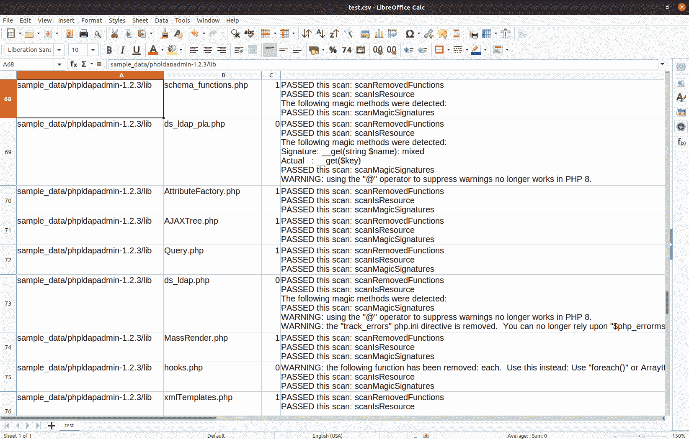
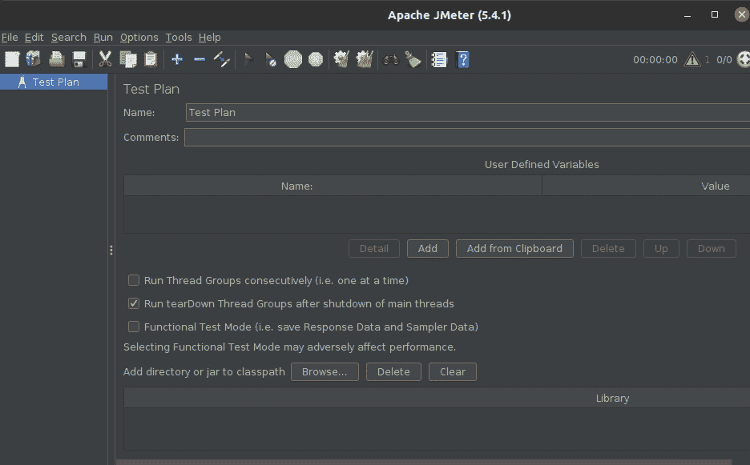

# *第 11 章*：将现有 PHP 应用程序迁移到 PHP 8

在本书中，您一直被警告可能出现代码中断。不幸的是，没有任何好的工具可以扫描现有代码并检查潜在的代码中断。在本章中，我们将带领您完成一组类的开发，这些类构成 PHP8**向后兼容**（**BC**）中断扫描程序的基础。此外，还将学习将现有客户 PHP 应用程序迁移到 PHP8 的推荐过程。

在阅读了本章并仔细研究了示例之后，您将能够更好地处理 PHP8 迁移。了解了整个迁移过程后，您就有了信心，能够以最少的问题执行 PHP8 迁移。

本章涵盖的主题包括以下内容：

*   了解开发、分段和生产环境
*   学习如何在迁移前发现 BC 中断
*   执行迁移
*   测试和排除迁移故障

# 技术要求

要检查并运行本章中提供的代码示例，建议使用的最低硬件如下：

*   基于 x86_64 的台式 PC 或笔记本电脑
*   1**GB**（**GB**可用磁盘空间
*   4 GB 内存
*   500**千比特每秒**（**Kbps**或更快的互联网连接

此外，您还需要安装以下软件：

*   码头工人
*   Docker Compose

请参考[*第 1 章*](01.html#_idTextAnchor013)*中的*技术要求*部分，介绍新的 PHP8 OOP 特性*，了解有关 Docker 和 Docker Compose 安装的更多信息，以及如何构建用于演示本书中所述代码的 Docker 容器。在本书中，我们将您还原本书样本代码的目录称为`/repo`。

本章的源代码位于[https://github.com/PacktPublishing/PHP-8-Programming-Tips-Tricks-and-Best-Practices](https://github.com/PacktPublishing/PHP-8-Programming-Tips-Tricks-and-Best-Practices) 。现在，我们可以通过查看作为整个迁移过程一部分使用的环境来开始讨论。

# 了解开发、分期和生产环境

网站更新的最终目标是以尽可能无缝的方式将更新后的应用程序代码从开发转移到生产。此应用程序代码的移动称为**部署**。在这种情况下，移动涉及将应用程序代码和配置文件从一个**环境**复制到另一个环境。

在详细介绍将应用程序迁移到 PHP8 之前，让我们先看看这些环境是什么。了解不同环境可能采取的形式对于您作为开发人员的角色至关重要。了解了这一点，您就能够以最少的错误将代码部署到生产环境中。

## 定义环境

我们使用*环境*一词来描述软件堆栈的组合，包括操作系统、web 服务器、数据库服务器和 PHP 安装。在过去，环境等同于一台*服务器*。然而，在这个现代，术语*服务器*具有欺骗性，因为它意味着在某个看不见的服务器房间里，一个金属盒中的物理计算机位于机架上。如今，考虑到大量的云服务提供商和高性能的虚拟化技术（例如 Docker），这种情况很可能不会发生。因此，当我们使用术语*环境*时，理解为物理或虚拟服务器。

环境一般分为三个不同的类别：**开发**、**分期**和**生产**。一些组织还提供单独的**测试**环境。让我们首先看一下在所有环境中都有哪些共性。

### 公共组件

需要注意的是，进入所有环境的内容都是由生产环境中的内容驱动的。生产环境是应用程序代码的最终目标。因此，所有其他环境应尽可能与操作系统、数据库、web 服务器和 PHP 安装相匹配。因此，例如，如果生产环境启用 PHP OPCache 扩展，那么所有其他环境也必须启用此扩展。

所有环境，包括生产环境，至少需要安装操作系统和 PHP。根据应用程序的需要，安装 web 服务器和数据库服务器也很常见。web 和数据库服务器的类型和版本应尽可能与生产环境的类型和版本相匹配。

一般来说，开发环境与生产环境的匹配程度越高，部署后出现错误的可能性就越小。

现在我们来看一下进入开发环境的内容。

### 开发环境

开发环境是您最初开发和测试代码的地方。它的独特之处在于它拥有应用程序维护和开发所需的工具。这将包括包含一个源代码存储库（例如 Git），以及启动、停止和重置环境所需的各种脚本。

开发环境通常会有脚本来触发自动部署过程。这样的脚本可以用代替**提交钩子**，设计用于在您向源代码存储库发出提交时激活。其中一个例子是**Git Hooks**，它是可以放在`.git/hooks`目录中的脚本文件。

提示

有关 Git 挂钩的更多信息，请查看此处的文档：[https://git-scm.com/book/en/v2/Customizing-Git-Git-Hooks](https://git-scm.com/book/en/v2/Customizing-Git-Git-Hooks) 。

传统的开发环境由一台带有数据库服务器、web 服务器和 PHP 的个人计算机组成。这种传统的范例没有考虑到目标生产环境中可能存在的变化。例如，如果您有 12 个定期与您合作的客户，那么所有 12 个客户都拥有完全相同的操作系统、数据库服务器、web 服务器和 PHP 版本的可能性很小！*最佳实践*是以虚拟机或 Docker 容器的形式尽可能接近地模拟生产环境。

因此，代码编辑器或**IDE**（**集成开发环境**）不位于开发环境中。而是在开发环境之外执行代码创建和编辑。然后，您可以通过直接将文件通过共享目录复制到虚拟开发环境中，或者将更改提交到源代码存储库，然后从开发环境虚拟机内部提取更改，从而在本地推送更改。

在开发环境中执行单元测试也是合适的。开发单元测试不仅可以为您的代码在生产环境中工作提供更大的保证，而且也是在应用程序开发的早期阶段发现错误的好方法。当然，您需要在本地环境中进行尽可能多的调试！在开发中捕获和修复一个 bug 通常需要花费十分之一的时间来修复在生产中发现的 bug！

现在让我们来检查登台环境。

### 登台环境

对于大型应用程序开发项目来说，让多个开发人员都在同一个代码库上工作是很常见的。在这种情况下，使用版本控制存储库是至关重要的。*暂存*环境是所有开发人员在开发环境测试和调试阶段完成后上传代码的地方。

暂存环境必须是生产环境的*精确副本*。您可以将暂存环境可视化为汽车工厂装配线上的最后一步。这就是来自一个或多个开发环境的所有不同部分适合的地方。暂存环境是生产应如何显示的原型。

需要注意的是，登台服务器通常具有直接互联网访问；然而，它通常位于一个安全区域，需要密码才能访问。

最后，让我们看看生产环境。

### 生产环境

生产环境通常由客户直接维护和托管。该环境也称为**生活环境**。以宝莱坞制作为例，如果开发环境是实践，舞台环境是彩排，而制作环境是现场表演（也许不包括唱歌和跳舞！）。

生产环境可以直接访问互联网，但受到防火墙的保护，通常还受到入侵检测和预防系统的进一步保护（例如，[https://snort.org/](https://snort.org/) ）。此外，生产环境可能隐藏在面向 internet 的 web 服务器上运行的反向代理配置后面。否则，至少在理论上，生产环境应该是登台环境的*精确克隆*。

现在，您已经了解了应用程序代码从开发到生产过程中所处的环境，让我们来看看 PHP8 迁移的关键第一步：发现潜在的 BC 代码中断。

# 学习如何在迁移前发现 BC 中断

理想情况下，您应该着手进行 PHP8 迁移，并制定一个行动计划。此行动计划的关键部分包括了解当前代码库中存在多少潜在的 BC 中断。在本节中，我们将向您展示如何开发一个 BC 中断嗅探器，该嗅探器可以自动查找数百个代码文件中潜在的 BC 中断。

首先，我们将回顾一下我们到目前为止对 PHP8 中可能出现的 BC 问题的了解。

## 获得 BC 中断的概述

你已经知道，在阅读了本书的前几章之后，潜在的代码中断来自多个来源。让我们简要总结一下迁移后可能导致代码失败的一般趋势。请注意，本章不涉及这些主题，因为这些主题在本书的前几章中都已涉及：

*   资源到对象迁移
*   支持操作系统库的最低版本
*   `Iterator`至`IteratorAggregate`迁移
*   删除的函数
*   使用变化
*   魔术签名法

通过添加基于`preg_match()`或`strpos()`的简单回调，可以检测到许多更改。使用变化更难检测，因为一眼就可以看出，如果不广泛使用`eval()`，自动中断扫描仪无法检测使用结果。

现在让我们看看中断扫描配置文件是如何显示的。

## 创建 BC 中断扫描配置文件

配置文件允许我们独立于 BC break scanner 类开发一组搜索模式。使用这种方法，BC break scanner 类定义了用于执行搜索的实际逻辑，而配置文件提供了特定条件的列表以及警告和建议的补救措施。

只要查找 PHP8 中已删除的函数的存在，就可以检测到相当多的潜在代码中断。为此，一个简单的`strpos()`搜索就足够了。另一方面，更复杂的搜索可能需要我们开发一系列回调。让我们首先看看如何基于简单的`strpos()`搜索开发配置。

### 定义简单的 strpos（）搜索配置

在简单`strpos()`搜索的情况下，只需提供一个键/值对数组，其中键是被删除函数的名称，值是其建议的替换。BC break scanner 类中的搜索逻辑可以执行以下操作：

```php
$contents = file_get_contents(FILE_TO_SEARCH);
foreach ($config['removed'] as $key => $value)
    if (str_pos($contents, $key) !== FALSE)  echo $value;
```

我们将在下一节介绍完整的 BC break scanner 类实现。现在，我们只关注配置文件。以下是前几个`strpos()`搜索条目的显示方式：

```php
// /repo/ch11/bc_break_scanner.config.php
use Migration\BreakScan;
return [
    // not all keys are shown
    BreakScan::KEY_REMOVED => [
        '__autoload' => 'spl_autoload_register(callable)',
        'each' => 'Use "foreach()" or ArrayIterator',
        'fgetss' => 'strip_tags(fgets($fh))',
        'png2wbmp' => 'imagebmp',
        // not all entries are shown
    ],
];
```

不幸的是，一些 PHP8 向后不兼容可能被证明超出了简单的`strpos()`搜索的能力。我们现在将的注意力转向检测 PHP8 资源到对象迁移引起的潜在中断。

### 检测与 is_ 资源（）关联的 BC 中断

在[*第 7 章*](07.html#_idTextAnchor162)*使用 PHP8 扩展时避免陷阱*中，在*PHP8 扩展资源到对象迁移*一节中，您了解到 PHP 中有一种远离资源、面向对象的总趋势。您可能还记得，这一趋势本身并不构成任何 BC 中断的威胁。但是，如果在确认已建立连接时，您的代码使用了`is_resource()`，则有可能发生 BC 中断。

为了说明 BC 中断的可能性，我们的 BC 中断扫描配置文件需要列出以前生成资源但现在生成对象的任何函数。然后，我们需要在 BC break scan 类（下面讨论）中添加一个使用此列表的方法。

以下是受影响功能的潜在配置键的显示方式：

```php
// /repo/ch11/bc_break_scanner.config.php
return [    // not all keys are shown
    BreakScan::KEY_RESOURCE => [
        'curl_init',
        'xml_parser_create',
        // not all entries are shown
    ],
];
```

在 break scan 类中，我们需要做的就是首先确认调用了`is_resource()`，然后检查`BreakScan::KEY_RESOURCE`数组下列出的函数是否存在。

现在我们开始关注**魔法方法签名**违规行为。

### 检测魔法方法签名冲突

PHP8 严格执行魔术方法签名。如果您的类使用松散的定义，而您不执行方法签名数据类型，并且如果您不为 magic 方法定义返回值数据类型，则您可以避免潜在的代码中断。另一方面，如果您的 magic 方法签名确实包含数据类型，并且这些数据类型与 PHP8 中强制执行的严格定义的集不匹配，那么您可能会遇到代码中断！

因此，我们需要创建一组正则表达式来检测 magic 方法签名冲突。此外，我们的配置应该包括正确的签名。通过这种方式，如果检测到冲突，我们可以在生成的消息中显示正确的签名，从而加快更新过程。

以下是魔术方法签名配置的显示方式：

```php
// /repo/ch11/bc_break_scanner.config.php
use Php8\Migration\BreakScan;
return [    
    BreakScan::KEY_MAGIC => [
    '__call' => [ 'signature' => 
        '__call(string $name, array $arguments): mixed',
        'regex' => '/__call\s*\((string\s)?'
            . '\$.+?(array\s)?\$.+?\)(\s*:\s*mixed)?/',
        'types' => ['string', 'array', 'mixed']],
    // other configuration keys not shown
    '__wakeup' => ['signature' => '__wakeup(): void',
        'regex' => '/__wakeup\s*\(\)(\s*:\s*void)?/',
        'types' => ['void']],
    ]
    // other configuration keys not shown
];
```

您可能会注意到，我们包含了一个额外的选项，`types`。这是为了自动生成正则表达式而包含的。未显示执行此操作的代码。如果您感兴趣，请查看`/path/to/repo/ch11/php7_build_magic_signature_regex.php`。

让我们来看看如何处理复杂的中断检测，而简单的`strpos()`搜索是不够的。

### 寻址复杂 BC 中断检测

在简单`strpos()`搜索证明不足的情况下，我们可以开发另一组键/值对，其中值是回调。例如，以潜在的 BC 中断为例，其中一个类定义了一个`__destruct()`方法，但在`__construct()`方法中也使用了`die()`或`exit()`。在 PHP8 中，在这些情况下，`__destruct()`方法可能不会被调用。

在这种情况下，简单的`strpos()`搜索是不够的。相反，我们必须发展逻辑，实现以下功能：

*   检查是否定义了`__destruct()`方法。如果是这样的话，就不需要继续了，因为 PHP8 没有中断的危险。
*   检查`__construct()`方法中是否使用了`die()`或`exit()`。如果是，发出潜在 BC 中断的警告。

在我们的 BC 中断扫描配置数组中，回调采用匿名函数的形式。它接受文件内容作为参数。然后，我们将回调分配给一个数组配置键，并在回调返回`TRUE`时包含要传递的警告消息：

```php
// /repo/ch11/bc_break_scanner.config.php
return [
    // not all keys are shown
   BreakScan::KEY_CALLBACK => [
    'ERR_CONST_EXIT' => [
      'callback' => function ($contents) {
        $ptn = '/__construct.*?\{.*?(die|exit).*?}/im';
        return (preg_match($ptn, $contents)
                && strpos('__destruct', $contents)); },
      'msg' => 'WARNING: __destruct() might not get '
               . 'called if "die()" or "exit()" used '
               . 'in __construct()'],
    ], // etc.
    // not all entries are shown
];
```

在我们的 BC break scanner 类（下面讨论）中，调用回调所需的逻辑可能如下所示：

```php
$contents = file_get_contents(FILE_TO_SEARCH);
$className = 'SOME_CLASS';
foreach ($config['callbacks'] as $key => $value)
    if ($value['callback']($contents)) echo $value['msg'];
```

如果检测其他潜在 BC 中断的要求超出了回调的能力，那么我们将直接在 BC 中断扫描类中定义一个单独的方法。

如您所见，可以开发一个配置数组，该数组不仅支持简单的`strpos()`搜索，还支持使用回调数组进行更复杂的搜索。

现在您已经了解了配置数组中的内容，是时候定义执行中断扫描的主类了。

## 开发 BC 中断扫描类

`BreakScan`类将定向到单个文件。在这个类中，我们定义了利用刚才介绍的各种中断扫描配置的方法。如果我们需要扫描多个文件，调用程序将生成一个文件列表，并一次将它们传递给`BreakScan`一个。

`BreakScan`类可以分为两个主要部分：定义基础设施的方法和定义如何执行给定扫描的方法。后者主要由配置文件的结构决定。对于每个配置文件部分，我们都需要一个`BreakScan`类方法。

让我们先来看看基础设施的方法。

### 定义 BreakScan 类基础结构方法

在本节中，我们将了解`BreakScan`类的初始部分。我们还介绍了执行基础架构相关活动的方法：

1.  首先，我们设置类基础设施，将其放置在`/repo/src/Php8/Migration`目录中：

    ```php
    // /repo/src/Php8/Migration/BreakScan.php
    declare(strict_types=1);
    namespace Php8\Migration;
    use InvalidArgumentException;
    use UnexpectedValueException;
    class BreakScan {
    ```

2.  接下来，我们定义一组类常量来呈现指示任何给定扫描后失败性质的消息：

    ```php
        const ERR_MAGIC_SIGNATURE = 'WARNING: magic method '
            . 'signature for %s does not appear to match '
            . 'required signature';
        const ERR_NAMESPACE = 'WARNING: namespaces can no '
            . 'longer contain spaces in PHP 8.';
        const ERR_REMOVED = 'WARNING: the following function'
            . 'has been removed: %s.  Use this instead: %s';
        // not all constants are shown
    ```

3.  我们还定义了一组表示配置数组键的常数。我们这样做是为了保持配置文件中的键定义和调用程序（稍后讨论）之间的一致性：

    ```php
        const KEY_REMOVED         = 'removed';
        const KEY_CALLBACK        = 'callbacks';
        const KEY_MAGIC           = 'magic';
        const KEY_RESOURCE        = 'resource';
    ```

4.  然后，我们初始化密钥属性，表示配置、要扫描的文件内容和任何消息：

    ```php
        public $config = [];
        public $contents = '';
        public $messages = [];
    ```

5.  `__construct()`方法接受我们的中断扫描配置文件作为参数，并循环遍历所有键以确保它们存在：

    ```php
        public function __construct(array $config) {
            $this->config = $config;
            $required = [self::KEY_CALLBACK,
                self::KEY_REMOVED,
                self::KEY_MAGIC, 
                self::KEY_RESOURCE];
            foreach ($required as $key) {
                if (!isset($this->config[$key])) {
                    $message = sprintf(
                        self::ERR_MISSING_KEY, $key);
                    throw new Exception($message);
                }
            }
        }
    ```

6.  然后我们定义一个方法，读取要扫描的文件的内容。请注意，我们删除了回车符（`"\r"`和换行符（`"\n"`），以便通过正则表达式进行扫描更容易处理：

    ```php
        public function getFileContents(string $fn) {
            if (!file_exists($fn)) {
                self::$className = '';
                $this->contents  = '';
                throw new  Exception(
                    sprintf(self::ERR_FILE_NOT_FOUND, $fn));
            }
            $this->contents = file_get_contents($fn);
            $this->contents = str_replace(["\r","\n"],
                ['', ' '], $this->contents);
            return $this->contents;
        }
    ```

7.  Some of the callbacks need a way to extract just the class name, or just the namespace. For that purpose, we define the static `getKeyValue()` method:

    ```php
        public static function getKeyValue(
            string $contents, string $key, string $end) {
            $pos = strpos($contents, $key);
            $end = strpos($contents, $end, 
                $pos + strlen($key) + 1);
            return trim(substr($contents, 
                $pos + strlen($key), 
                $end - $pos - strlen($key)));
        }
    ```

    此方法查找关键字（例如，`class`。然后，它将查找关键字后面直到分隔符的内容（例如，`';'`）。因此，如果您想要获得类名，您将执行以下命令：`$name = BreakScan::geyKeyValue($contents,'class',';')`。

8.  我们还需要一种检索和重置`$this->messages`的方法。下面是两种方法：

    ```php
        public function clearMessages() : void {
            $this->messages = [];
        }
        public function getMessages(bool $clear = FALSE) {
            $messages = $this->messages;
            if ($clear) $this->clearMessages();
            return $messages;
        }
    ```

9.  然后，我们定义一个运行所有扫描的方法（将在下一节中介绍）。此方法还收集检测到的潜在 BC 中断数，并报告总数：

    ```php
        public function runAllScans() : int {
            $found = 0;
            $found += $this->scanRemovedFunctions();
            $found += $this->scanIsResource();
            $found += $this->scanMagicSignatures();
            $found += $this->scanFromCallbacks();
            return $found;
        }
    ```

现在，您已经了解了基本的`BreakScan`类基础结构是如何出现的，让我们看看各个扫描方法。

### 检查个别扫描方法

四种单独的扫描方法直接对应于中断扫描配置文件中的顶级键。每种方法都应在`$this->messages`中累积关于潜在 BC 中断的消息。此外，每个方法都应返回一个整数，表示检测到的潜在 BC 中断的总数。

现在让我们按顺序检查这些方法：

1.  The first method we examine is `scanRemovedFunctions()`. In this method, we search for the function name followed either directly by an open parenthesis, `'('`, or by a space and open parenthesis, `' ('`. If the function is found, we increment `$found`, and add the appropriate warning and suggested replacement to `$this-> messages`. If no potential breaks are found, we add a success message and return `0`:

    ```php
    public function scanRemovedFunctions() : int {
        $found = 0;
        $config = $this->config[self::KEY_REMOVED];
        foreach ($config as $func => $replace) {
            $search1 = ' ' . $func . '(';
            $search2 = ' ' . $func . ' (';
            if (
                strpos($this->contents, $search1) !== FALSE
                || 
                strpos($this->contents, $search2) !== FALSE)
            {
                $this->messages[] = sprintf(
                    self::ERR_REMOVED, $func, $replace);
                $found++;
            }
        }
        if ($found === 0)
            $this->messages[] = sprintf(
                self::OK_PASSED, __FUNCTION__);
        return $found;
    }
    ```

    这种方法的主要问题是，如果函数前面没有空格，它的使用将不会被检测到。然而，如果我们不在搜索中包含前导空格，我们可能会以假阳性告终。例如，如果没有前导空格，`foreach()`的每个实例在查找`each()`时都会触发中断扫描程序的警告！

2.  接下来我们来看一个方法，该方法扫描`is_resource()`用法。如果找到引用，此方法将在不再生成资源的函数列表中运行。如果`is_resource()`和其中一种方法都找到了，则会标记潜在的 BC 中断：

    ```php
    public function scanIsResource() : int {
        $found = 0;
        $search = 'is_resource';
        if (strpos($this->contents, $search) === FALSE)
            return 0;
        $config = $this->config[self::KEY_RESOURCE];
        foreach ($config as $func) {
            if ((strpos($this->contents, $func) !== FALSE)){
                $this->messages[] =
                    sprintf(self::ERR_IS_RESOURCE, $func);
                $found++;
            }
        }
        if ($found === 0)
            $this->messages[] = 
                sprintf(self::OK_PASSED, __FUNCTION__);
        return $found;
    }
    ```

3.  然后我们看一下需要什么来检查我们的回调列表。正如您所记得的，我们需要在简单`strpos()`不足的情况下使用回调。因此，我们首先收集所有回调子键，然后依次循环每个回调子键。如果没有底层键*回调*，则抛出`Exception`。否则，我们运行回调，提供`$this->contents`作为参数。如果发现任何潜在的 BC 中断，我们将添加相应的错误消息，并增加`$found`：

    ```php
    public function scanFromCallbacks() {
        $found = 0;
        $list = array_keys($this-config[self::KEY_CALLBACK]);
        foreach ($list as $key) {
            $config = $this->config[self::KEY_CALLBACK][$key] 
                ?? NULL;
            if (empty($config['callback']) 
                || !is_callable($config['callback'])) {
                $message = sprintf(self::ERR_INVALID_KEY,
                    self::KEY_CALLBACK . ' => ' 
                    . $key . ' => callback');
                throw new Exception($message);
            }
            if ($config['callback']($this->contents)) {
                $this->messages[] = $config['msg'];
                $found++;
            }
        }
        return $found;
    }
    ```

4.  最后，我们转向目前为止最复杂的方法，它扫描无效的魔法方法签名。主要问题是方法签名差异很大，因此我们需要构建单独的正则表达式来正确测试有效性。正则表达式存储在 BC break 配置文件中。如果检测到魔术方法，我们将检索其正确的签名并将其添加到`$this->messages`。
5.  首先，我们通过查找与`function __`：

    ```php
    public function scanMagicSignatures() : int {
        $found   = 0;
        $matches = [];
        $result  = preg_match_all(
            '/function __(.+?)\b/', 
            $this->contents, $matches);
    ```

    匹配的任何东西来检查是否存在任何魔法方法
6.  如果匹配数组不是空的，我们循环遍历匹配集，并为`$key`指定神奇的方法名称：

    ```php
       if (!empty($matches[1])) {
            $config = $this->config[self::KEY_MAGIC] ?? NULL;
            foreach ($matches[1] as $name) {
                $key = '__' . $name;
    ```

7.  如果没有设置与这个假定的魔术方法匹配的配置键，我们假设它不是一个魔术方法，或者是一个不在配置文件中的方法，因此不需要担心。否则，如果存在一个键，我们将提取一个子字符串，表示分配给`$sub`：

    ```php
                if (empty($config[$key])) continue;
                if ($pos = strpos($this->contents, $key)) {
                    $end = strpos($this->contents, 
                        '{', $pos);
                $sub = (empty($sub) || !is_string($sub))
                     ? '' : trim($sub);
    ```

    的方法调用
8.  然后，我们从配置中提取正则表达式，并将其与子字符串匹配。该模式表示该特定魔术方法的正确签名。如果`preg_match()`返回`FALSE`，我们知道实际签名不正确，并将其标记为潜在 BC 中断。我们检索并存储警告消息并增加`$found`：

    ```php
                $ptn = $config[$key]['regex'] ?? '/.*/';
                if (!preg_match($ptn, $sub)) {
                    $this->messages[] = sprintf(
                      self::ERR_MAGIC_SIGNATURE, $key);
                    $this->messages[] = 
                      $config[$key]['signature'] 
                      ?? 'Check signature'
                    $found++;
        }}}}
        if ($found === 0)
            $this->messages[] = sprintf(
                self::OK_PASSED, __FUNCTION__);
         return $found;
    }
    ```

我们对`BreakScan`班的考试到此结束。现在我们将注意力转向定义运行编程到`BreakScan`类中的扫描所需的调用程序。

### 构建 BreakScan 类调用程序

调用`BreakScan`类的程序的主要任务是接受一个 path 参数，并递归地构建位于该路径中的 PHP 文件列表。然后，我们循环遍历列表，依次提取每个文件的内容，并运行 BC 中断扫描。最后，我们展示了一个报告，它可以是稀疏的，也可以是详细的，具体取决于所选的详细级别。

请记住，我们将要讨论的`BreakScan`类和调用程序都设计为在 PHP7 下运行。我们不使用 PHP8 的原因是因为我们假设开发人员希望在进行 PHP8 更新之前运行 BC 中断扫描程序*：*

1.  我们首先配置自动加载器，并从命令行（`$argv`或 URL（`$_GET`）获取路径和详细级别。此外，我们还提供了一个选项，可以将结果写入 CSV 文件，并接受该文件的名称作为参数。您可能会注意到，我们也会执行一定程度的输入清理，尽管理论上 BC break scanner 只能由开发人员直接在开发服务器上使用：

    ```php
    // /repo/ch11/php7_bc_break_scanner.php
    define('DEMO_PATH', __DIR__);
    require __DIR__ . '/../src/Server/Autoload/Loader.php';
    $loader = new \Server\Autoload\Loader();
    use Php8\Migration\BreakScan;
    // some code not shown
    $path = $_GET['path'] ?? $argv[1] ?? NULL;
    $show = $_GET['show'] ?? $argv[2] ?? 0;
    $show = (int) $show;
    $csv  = $_GET['csv']  ?? $argv[3] ?? '';
    $csv  = basename($csv);
    ```

2.  我们接下来确认路径。如果未找到，则退出并显示使用信息（`$usage`未显示）：

    ```php
    if (empty($path)) {
        if (!empty($_SERVER['REQUEST_URI']))
            echo '<pre>' . $usage . '</pre>';
        else
            echo $usage;
        exit;
    }
    ```

3.  然后我们抓取 BC break 配置文件并创建一个`BreakScan`实例：

    ```php
    $config  = include __DIR__ 
    . '/php8_bc_break_scanner_config.php';
    $scanner = new BreakScan($config);
    ```

4.  为了建立文件列表，我们使用一个`RecursiveDirectoryIterator`，包装在一个`RecursiveIteratorIterator`中，从给定路径开始。然后通过`FilterIterator`过滤此列表，将扫描限制为仅限于 PHP 文件：

    ```php
    $iter = new RecursiveIteratorIterator(
        new RecursiveDirectoryIterator($path));
    $filter = new class ($iter) extends FilterIterator {
        public function accept() {
            $obj = $this->current();
            return ($obj->getExtension() === 'php');
        }
    };
    ```

5.  如果开发人员选择 CSV 选项，则会创建一个`SplFileObject`实例。同时，我们写出一个标题数组。此外，我们还定义了一个匿名函数，用于写入 CSV 文件：

    ```php
    if ($csv) {
        $csv_file = new SplFileObject($csv, 'w');
        $csv_file->fputcsv(
            ['Directory','File','OK','Messages']);
    }
    $write = function ($dir, $fn, $found, $messages) 
        use ($csv_file) {
        $ok = ($found === 0) ? 1 : 0;
        $csv_file->fputcsv([$dir, $fn, $ok, $messages]);
        return TRUE;
    };
    ```

6.  我们通过循环浏览`FilterIterator`实例提供的文件列表来启动扫描。当我们一个文件一个文件地扫描时，每次通过时`$found`都被调零。然而，我们保留了`$total`，以给出最终潜在 BC 中断的总数。您可能还注意到，我们将文件与目录区分开来。如果目录更改，其名称将显示为标题：

    ```php
    $dir   = '';
    $total = 0;
    foreach ($filter as $name => $obj) {
        $found = 0;
        $scanner->clearMessages();
        if (dirname($name) !== $dir) {
            $dir = dirname($name);
            echo "Processing Directory: $name\n";
        }
    ```

7.  我们使用`SplFileObject::isDir()`确定文件列表中的项是否为目录。如果是这样，我们继续列表中的下一项。然后我们将文件内容推入`$scanner`并运行所有扫描。然后以字符串的形式检索消息：

    ```php
        if ($obj->isDir()) continue;
        $fn = basename($name);
        $scanner->getFileContents($name);
        $found    = $scanner->runAllScans();
        $messages = implode("\n", $scanner->getMessages());
    ```

8.  我们使用`switch()`块根据`$show`表示的显示级别执行操作。级别`0`仅显示发现潜在 BC 中断的文件。级别`1`显示加消息。级别`2`显示所有可能的输出，包括成功消息：

    ```php
        switch ($show) {
            case 2 :
                echo "Processing: $fn\n";
                echo "$messages\n";
                if ($csv) 
                    $write($dir, $fn, $found, $messages);
                break;
            case 1 :
                if (!$found) break;
                echo "Processing: $fn\n";
                echo BreakScan::WARN_BC_BREAKS . "\n";
                printf(BreakScan::TOTAL_BREAKS, $found);
                echo "$messages\n";
                if ($csv) 
                    $write($dir, $fn, $found, $messages);
                break;
            case 0 :
            default :
                if (!$found) break;
                echo "Processing: $fn\n";
                echo BreakScan::WARN_BC_BREAKS . "\n";
                if ($csv) 
                    $write($dir, $fn, $found, $messages);
        }
    ```

9.  最后，我们累计总数并显示最终结果：

    ```php
        $total += $found;
    }
    echo "\n" . str_repeat('-', 40) . "\n";
    echo "\nTotal number of possible BC breaks: $total\n";
    ```

现在您已经了解了调用可能出现的方式，让我们看看测试扫描的结果。

### 扫描应用程序文件

出于演示目的，在与本书相关的源代码中，我们包含了一个较旧的版本的**phpLdapAdmin**。您可以在`/path/to/repo/sample_data/phpldapadmin-1.2.3`找到源代码。对于本演示，我们在 PHP 7 容器中打开了一个 shell，并运行以下命令：

```php
root@php8_tips_php7 [ /repo ]# 
php ch11/php7_bc_break_scanner.php \
    sample_data/phpldapadmin-1.2.3/ 1 |less
```

以下是运行此命令的部分结果：

```php
Processing: functions.php
WARNING: the code in this file might not be 
compatible with PHP 8
Total potential BC breaks: 4
WARNING: the following function has been removed: function __autoload.  
Use this instead: spl_autoload_register(callable)
WARNING: the following function has been removed: create_function.  Use this instead: Use either "function () {}" or "fn () => <expression>"
WARNING: the following function has been removed: each.  Use this instead: Use "foreach()" or ArrayIterator
PASSED this scan: scanIsResource
PASSED this scan: scanMagicSignatures
WARNING: using the "@" operator to suppress warnings 
no longer works in PHP 8.
```

从输出中可以看出，尽管`functions.php`通过了`scanMagicSignatures`和`scanIsResource`扫描，但该代码文件使用了 PHP8 中删除的三个函数：`__autoload()`、`create_function()`和`each()`。您还将注意到，该文件使用`@`符号来抑制错误，这在 PHP8 中不再有效。

如果指定了 CSV 文件选项，则可以在任何电子表格程序中打开它。以下是它在 Libre Office Calc 中的显示方式：



图 11.1–在 Libre Office Calc 中打开的 CSV 文件

您现在有了一个想法，即如何创建一个自动程序来检测潜在的 BC 中断。请记住，代码远非完美，并没有涵盖每一个可能的代码中断。为此，在仔细阅读本书中的材料后，你必须依靠自己的判断。

现在是时候把我们的注意力转向实际的迁移本身了。

# 执行迁移

执行从当前版本到 PHP 版本 8 的实际迁移非常类似于将一组新特性部署到现有应用程序的过程。如果可能的话，你可能会考虑并行运行两个网站，直到你确信新版本如预期的那样运行。为此，许多组织将登台环境与生产环境并行运行。

在本节中，我们将介绍一个**十二步指南**来执行成功的迁移。尽管我们主要关注迁移到 PHP8，但这十二个步骤可以应用于您可能希望执行的任何 PHP 更新。理解并仔细遵循这些步骤对于制作网站的成功至关重要。在这十二个步骤中，有很多地方，如果遇到问题，可以恢复到早期版本。

在我们详细介绍之前，这里是一个从旧版本的 PHP 到 PHP 8 的十二步迁移过程的概述：

1.  仔细阅读 PHP 文档附录中相应的迁移指南。在我们的例子中，我们选择从 PHP7.4x 迁移到 PHP8.0x。（[https://www.php.net/manual/en/appendices.php](https://www.php.net/manual/en/appendices.php) ）。
2.  确保当前代码在当前版本的 PHP 上工作。
3.  备份数据库（如果有）、所有源代码以及任何关联的文件和资产（例如，CSS、JavaScript 或图形图像）。
4.  为版本控制软件中即将更新的应用程序代码创建一个新分支。
5.  扫描 BC 中断（可能使用上一节讨论的`BreakScan`类）。
6.  更新任何不兼容的代码。
7.  根据需要重复*步骤 5*和*6*。
8.  将源代码上载到存储库。
9.  在更新为 PHP8 的虚拟环境中测试源代码，该虚拟环境模拟生产服务器。
10.  如果虚拟化仿真不成功，返回*步骤 5*。
11.  将登台服务器（或等效虚拟环境）更新为 PHP8，确保可以切换回旧版本。
12.  运行您可以想象的所有测试。如果不成功，切换回主分支，返回*步骤 5*。如果成功，请将临时环境克隆到生产环境。

现在让我们依次看一下每个步骤。

## 步骤 1–查看迁移指南

在 PHP 的每一个主要版本中，PHP 核心团队都会发布**迁移指南**。本书中我们主要关注的指南是*从 PHP7.4.x 迁移到 PHP8.0.x*，位于[https://www.php.net/manual/en/migration80.php](https://www.php.net/manual/en/migration80.php) 。本迁移指南分为四个部分：

*   新功能
*   向后不兼容的更改
*   不推荐的功能
*   其他变化

如果您是从 PHP7.4 以外的版本迁移到 PHP8.0，那么您还应该查看从当前 PHP 版本到 PHP8 的所有以前的迁移指南。现在我们来看看迁移过程中推荐的其他步骤。

## 步骤 2–确保当前代码有效

在您开始对当前代码库进行更改以确保其在 PHP8 中工作之前，确保其工作是绝对重要的。如果代码现在不起作用，那么一旦迁移到 PHP8，它肯定不会起作用！运行任何单元测试和任何**黑盒测试**，以确保代码在当前版本的 PHP 中正常运行。

如果在迁移之前对当前代码进行了任何更改，请确保这些更改反映在版本控制软件的主分支（通常称为**主分支**）中。

## 步骤 3–备份所有内容

下一步是备份所有内容。这包括数据库、源代码、JavaScript、CSS、图像等。此外，请不要忘记备份重要的配置文件，如`php.ini`文件、web 服务器配置以及与 PHP 和 web 通信相关的任何其他配置文件。

## 步骤 4–创建版本控制分支

在此步骤中，您应该在版本控制系统中创建一个新分支，并签出该分支。在主分支中，您应该只有当前有效的代码。

这是使用 Git 执行此类命令的方式：

```php
$ git branch php8_migration
$ git checkout php8_migration
Switched to branch 'php8_migration'
```

显示的第一个命令创建了一个名为`php8_migration`的分支。第二个命令导致`git`切换到新的分支。在此过程中，所有现有代码都将移植到新分支。主分支现在是安全的，不会在新分支中进行任何更改。

有关使用 Git 的版本控制的更多信息，请查看此处：[https://git-scm.com/](https://git-scm.com/) 。

## 步骤 5–扫描 BC 中断

现在是时候好好利用`BreakScan`类了。运行调用程序并提供项目的起始目录路径以及详细级别（`0`、`1`或`2`）。您还可以将 CSV 文件指定为第三个选项，如前面的*图 11.1*所示。

## 步骤 6–修复不兼容

在这一步中，知道中断的位置后，可以继续修复不兼容。您应该能够这样做：代码继续在当前版本的 PHP 中运行，但也可以在 PHP8 中运行。正如我们在本书中一直指出的，BC 中断在很大程度上源于糟糕的编码实践。通过修复不兼容性，您可以同时改进代码。

## 步骤 7–根据需要重复步骤 5 和 6

有一句著名的台词，在许多好莱坞电影中反复出现，医生对焦虑的病人说，*吃两片阿司匹林，早上给我打电话*。同样的建议也适用于解决 BC 中断的过程。你必须有耐心，继续修复和扫描，修复和扫描。继续这样做，直到扫描显示不再有潜在的 BC 断裂。

## 步骤 8–将更改提交到存储库

一旦您相对确信没有进一步的 BC 中断，就应该将更改提交到您在版本控制软件中创建的新 PHP8 迁移分支。继续，在这一点上推动更改。一旦在生产服务器上整理出 PHP 更新，您就可以从该分支检索更新的代码。

记住这一点：您当前的工作代码安全地存储在主分支中。在这个阶段，您只保存到 PHP8 迁移分支，因此您可以随时切换回。

## 步骤 9–在模拟虚拟环境中测试

把这一步看作是对真实事物的彩排。在这一步中，您将创建一个虚拟环境（例如，使用 Docker 容器），以最接近地模拟生产服务器。在这个虚拟环境中，然后安装 PHP8。一旦创建了虚拟环境，就可以在其中打开一个命令 shell，并从 PHP8 迁移分支下载源代码。

然后，您可以运行单元测试，以及您认为必要的任何其他测试，以测试更新的代码。希望这是您捕获任何其他错误的地方。

## 步骤 10–如果测试不成功，则返回步骤 5

如果在虚拟环境中执行的单元测试、黑盒测试或其他测试显示应用程序代码失败，则必须返回到*步骤 5*。面对某些故障，继续进行现场生产是极不明智的！

## 步骤 11–在登台环境上安装 PHP 8

下一步是在登台环境中安装 PHP8。您可能还记得我们在本章第一部分的讨论，传统的流程是从开发环境到阶段，然后再到生产。在登台环境上完成所有测试后，您可以将登台克隆到生产环境。

PHP 安装在主网站[PHP.net](http://php.net)上有很好的文档记录，因此这里不需要进一步的详细信息。相反，在本节中，我们将简要介绍 PHP 安装，重点介绍在 PHP8 和当前 PHP 版本之间切换的能力。

提示

有关在各种环境中安装 PHP 的信息，请参阅此文档页面：[https://www.php.net/manual/en/install.php](https://www.php.net/manual/en/install.php) 。

为了便于说明，我们选择讨论在 Linux 的两个主要分支上安装 PHP8：Debian/Ubuntu 和 Red Hat/CentOS/Fedora。让我们从 Debian/Ubuntu Linux 开始。

### 在 Debian/Ubuntu Linux 上安装 PHP8

安装 PHP8 的最佳方式是通过可用的预编译二进制文件集。较新的 PHP 版本往往比发布日期晚得多，PHP8 也不例外。在这种情况下，建议您使用（**个人软件包存档（PPA**），PPA 托管在[https://launchpad.net/~ondrej](https://launchpad.net/~ondrej)是应用最广泛和最广泛的。

如果要在自己的计算机上模拟以下步骤，请使用以下命令运行预装了 PHP 7.4 的 Ubuntu Docker 映像：

```php
docker run -it \
  unlikelysource/ubuntu_focal_with_php_7_4:latest /bin/bash
```

为了在 Debian 或 UbuntuLinux 上安装 PHP8，在生产服务器（或演示容器）上打开一个命令 shell，作为*root*用户，按如下步骤进行操作。或者，如果*根*用户访问不可用，则在显示的每个命令前面加上`sudo`。

在命令 shell 中，要安装 PHP 8，请按以下步骤进行：

1.  使用**apt**实用程序更新和升级当前包集。可以使用任何包管理器；然而，我们展示了使用`apt`来保持此处所述安装步骤之间的一致性：

    ```php
    apt update
    apt upgrade
    ```

2.  将`Ondrej PPA`存储库添加到您的`apt`来源：

    ```php
    add-apt-repository ppa:ondrej/php
    ```

3.  安装 PHP8。这只安装 PHP8 核心和基本扩展：

    ```php
    apt install php8.0
    ```

4.  使用以下命令扫描存储库中的其他扩展，并根据需要使用`apt`安装它们：

    ```php
    apt search php8.0-*
    ```

5.  执行 PHP 版本检查以确保您现在正在运行 PHP8:

    ```php
    php --version
    ```

以下是版本检查输出：

```php
root@ec873e16ee93:/# php --version
PHP 8.0.7 (cli) (built: Jun  4 2021 21:26:10) ( NTS )
Copyright (c) The PHP Group
Zend Engine v4.0.7, Copyright (c) Zend Technologies
with Zend OPcache v8.0.7, Copyright (c), by Zend Technologies
```

现在您已经基本了解了 PHP8 的安装过程，让我们看看如何在当前版本和 PHP8 之间切换。为了便于说明，我们假设 PHP7.4 是安装 PHP8 之前的当前 PHP 版本。

### 在 Debian 和 Ubuntu Linux 中切换 PHP 版本

如果您查看查看 PHP 的位置，将注意到 PHP7.4，早期版本，在 PHP8 安装之后仍然存在。您可以使用`whereis php`来实现此目的。我们的 simulation Docker Ubuntu 容器上的输出如下所示：

```php
root@ec873e16ee93:/# whereis php
php: /usr/bin/php /usr/bin/php8.0 /usr/bin/php7.4 /usr/lib/php /etc/php /usr/share/php7.4-opcache /usr/share/php8.0-opcache /usr/share/php8.0-readline /usr/share/php7.4-readline /usr/share/php7.4-json /usr/share/php8.0-common /usr/share/php7.4-common
```

如您所见，我们现在已经安装了 PHP 的 7.4 和 8.0 版本。要在两者之间切换，请使用以下命令：

```php
update-alternatives --config php
```

然后会出现一个选项屏幕，允许您选择应该激活哪个 PHP 版本。以下是输出屏幕在 Ubuntu Docker 图像上的显示方式：

```php
root@ec873e16ee93:/# update-alternatives --config php 
There are 2 choices for the alternative php 
(providing /usr/bin/php).
  Selection    Path             Priority   Status
------------------------------------------------------------
* 0            /usr/bin/php8.0   80        auto mode
  1            /usr/bin/php7.4   74        manual mode
  2            /usr/bin/php8.0   80        manual mode
Press <enter> to keep the current choice[*], or type selection number:
```

切换后，您可以再次执行`php --version`，确认另一版本的 PHP 处于活动状态。

现在让我们把注意力转向在 Red Hat Linux 及其衍生产品上安装 PHP8。

### 在 Red Hat、CentOS 或 Fedora Linux 上安装 PHP 8

在 Red Hat、CentOS 或 Fedora Linux 上的 PHP 安装遵循一系列类似于 Debian/Ubuntu 安装过程的命令。的主要区别在于，您最有可能使用`dnf`和`yum`的组合来安装预编译的 PHP 二进制文件。

如果您愿意遵循我们在本节中概述的安装，您可以使用已经安装了 PHP7.4 的 Fedora Docker 容器。以下是运行模拟的命令：

```php
docker run -it unlikelysource/fedora_34_with_php_7_4 /bin/bash
```

与上一节中描述的 PPA 环境非常相似，在红帽世界中，**Remi 的 RPM 存储库**项目（[http://rpms.remirepo.net/](http://rpms.remirepo.net/) 提供**红帽包管理**（**RPM**格式）的预编译二进制文件。

要在 Red Hat、CentOS 或 Fedora 上安装 PHP 8，请在生产服务器（或演示环境）上打开一个命令 shell，并作为*root*用户，按如下步骤进行操作：

1.  首先，确认您正在使用的操作系统版本和发行版是一个好主意。为此，使用了`uname`命令以及一个简单的`cat`命令来查看发布（作为文本文件存储在`/etc`目录中）：

    ```php
    [root@9d4e8c93d7b6 /]# uname -a
    Linux 9d4e8c93d7b6 5.8.0-55-generic #62~20.04.1-Ubuntu
    SMP Wed Jun 2 08:55:04 UTC 2021 x86_64 x86_64 x86_64 GNU/Linux
    [root@9d4e8c93d7b6 /]# cat /etc/fedora-release 
    Fedora release 34 (Thirty Four)
    ```

2.  开始之前，请确保更新`dnf`并安装配置管理器：

    ```php
    dnf upgrade  
    dnf install 'dnf-command(config-manager)'
    ```

3.  您可以然后将 Remi 的存储库添加到您的包源中，使用您喜欢的版本号代替`NN`：

    ```php
    dnf install \
      https://rpms.remirepo.net/fedora/remi-release-NN.rpm
    ```

4.  此时，您可以使用`dnf module list`确认安装的 PHP 版本。我们还使用`grep`来限制只显示给 PHP 的模块列表。`[e]`名称表示*已启用*：

    ```php
    [root@56b9fbf499d6 /]# dnf module list |grep php
    php                    remi-7.4 [e]     common [d] [i],
    devel, minimal    PHP scripting language                        php                    remi-8.0         common [d], devel, minimal        PHP scripting language
    ```

5.  然后检查 PHP 的当前版本：

    ```php
    [root@d044cbe477c8 /]# php --version
    PHP 7.4.20 (cli) (built: Jun  1 2021 15:41:56) (NTS)
    Copyright (c) The PHP Group
    Zend Engine v3.4.0, Copyright (c) Zend Technologies
    ```

6.  接下来，我们重置 PHP 模块，并安装 PHP8:

    ```php
    dnf -y module reset php
    dnf -y module install php:remi-8.0
    ```

7.  另一个快速的 PHP 版本检查显示我们现在使用的是 PHP8 而不是 PHP7:

    ```php
    [root@56b9fbf499d6 /]# php -v
    PHP 8.0.7 (cli) (built: Jun  1 2021 18:43:05) 
    ( NTS gcc x86_64 ) Copyright (c) The PHP Group
    Zend Engine v4.0.7, Copyright (c) Zend Technologies
    ```

8.  要切换回 PHP 的早期版本，请按如下操作，其中`X.Y`是您计划使用的版本：

    ```php
    dnf -y module reset php
    dnf -y module install php:remi-X.Y
    ```

这就完成了 Red Hat、CentOS 或 Fedora 的 PHP 安装说明。对于本演示，我们只向您展示了 PHP 命令行安装。如果您计划将 PHP 与 web 服务器一起使用，您还需要安装相应的 PHP web 服务器包，和/或安装 PHP-FPM（FastCGI 处理模块）包。

现在我们来看最后一步。

## 步骤 12–测试并克隆登台环境到生产环境

在最后一步中，您将源代码从 PHP8 迁移分支下载到登台环境中，并运行所有可以想象的测试以确保一切正常。一旦确定成功，就可以将登台环境克隆到生产环境中。

如果您正在使用虚拟化，克隆过程可能只需要创建一个相同的 Docker 容器或虚拟磁盘文件。否则，如果涉及到实际的硬件，您可能最终会克隆硬盘驱动器，或者任何适合您的设置的方法。

我们关于如何执行迁移的讨论到此结束。现在让我们来看一下测试和故障排除。

# 迁移测试及故障排除

在理想情况下，迁移故障排除将在登台服务器或模拟虚拟环境上进行，远远早于实际投入生产之前。然而，正如经验丰富的开发人员所知道的，我们需要抱最好的希望，但要做最坏的准备！在本节中，我们将介绍容易被忽略的测试和故障排除的其他方面。

在本节中，如果您遵循 Debian/Ubuntu 或 Red Hat/CentOS/Fedora 安装过程，则可以退出临时 shell。返回本课程使用的 Docker 容器，并在 PHP8 容器中打开一个命令 shell。请参阅[*第 1 章*](01.html#_idTextAnchor013)*中的*技术要求*部分，介绍新的 PHP 8 OOP 功能*，如果您不确定如何进行此操作，请参阅更多信息。

## 测试和故障排除工具

这里有太多优秀的测试和故障排除工具可供记录，因此我们将重点放在几个开源工具上，以帮助测试和故障排除。

### 使用 Xdebug

**Xdebug**是一个提供诊断、分析、跟踪和步骤调试等功能的工具。它是一个 PHP 扩展，因此能够为您提供详细信息，以防您遇到无法轻松解决的问题。主网站为[https://xdebug.org/](https://xdebug.org/) 。

要启用 Xdebug 扩展，您可以像安装任何其他 PHP 扩展一样安装它：使用`pecl`命令，或者从[下载并编译源代码 https://pecl.php.net/package/xdebug](https://pecl.php.net/package/xdebug) 。

此外，至少应设置以下`/etc/php.ini`设置：

```php
zend_extension=xdebug.so
xdebug.log=/repo/xdebug.log
xdebug.log_level=7
xdebug.mode=develop,profile
```

*图 11.2*显示了使用`/repo/ch11/php8_xdebug.php`调用的`xdebug_info()`命令的输出：


图 11.2–xdebug_info（）输出

现在让我们看一看另一个从外部角度检查应用程序的工具。

### 使用 ApacheJMeter

对于测试 web 应用程序，一个非常有用的开源工具是**ApacheJMeter**（[https://jmeter.apache.org/](https://jmeter.apache.org/) ）。它允许您开发一系列模拟浏览器请求的测试计划。您可以模拟数百个用户请求，每个请求都有自己的 cookie 和会话。尽管它主要是为 HTTP 或 HTTPS 设计的，但它也支持十几种其他协议。除了一个优秀的图形用户界面外，它还有一个命令行模式，使得在自动化部署过程中合并 JMeter 成为可能。

安装非常简单，只需从[下载一次 https://jmeter.apache.org/download_jmeter.cgi](https://jmeter.apache.org/download_jmeter.cgi) 。您必须先安装**Java 虚拟机**（**JVM**）才能运行 JMeter。测试计划的执行超出了本书的范围，但文档内容相当广泛。另外，请记住，JMeter 是从客户机而不是服务器上运行的。因此，如果您希望在本书的 Docker 容器中测试网站，则需要在本地计算机上安装 Apache JMeter，然后构建指向 Docker 容器的测试计划。PHP 8 容器的 IP 地址通常为`172.16.0.88`。

*图 11.3*显示了本地计算机上运行的 Apache JMeter 的打开屏幕：



图 11.3-ApacheJMeter

在此屏幕上，您可以开发一个或多个测试计划，指示要访问的 URL、模拟`GET`和`POST`请求、设置用户数量等。

提示

如果您在尝试运行`jmeter`：`Can't load library: /usr/lib/jvm/java-11-openjdk-amd64/lib/ libawt_xawt.so`时遇到此错误，请尝试安装*OpenJDK 8*。然后，您可以使用前面部分提到的技术在 Java 版本之间切换。

现在让我们来看看在升级 PHP8 之后，Composer 的潜在问题。

## 与作曲家处理问题

开发人员在迁移到 PHP8 后面临的一个常见问题是使用第三方软件。在本节中，我们将讨论有关使用流行的 PHP*Composer*包管理器的潜在问题。

您可能遇到的第一个问题与 Composer 本身的版本有关。2020 年，Composer 版本 2 发布。并非主包装网站（[上的所有 300000 多个包装 https://packagist.org/ 但](https://packagist.org/)已更新至第 2 版。因此，为了安装给定的软件包，您可能会发现自己必须在 Composer 2 和 Composer 1 之间切换。每个版本的最新版本可在以下位置获得：

*   第 1 版：[https://getcomposer.org/download/latest-1.x/composer.phar](https://getcomposer.org/download/latest-1.x/composer.phar)
*   第二版：[https://getcomposer.org/download/latest-2.x/composer.phar](https://getcomposer.org/download/latest-2.x/composer.phar)

另一个更严重的问题与您可能使用的各种 Composer 软件包的平台需求有关。每个包都有自己的`composer.json`文件，有自己的要求。在许多情况下，包提供程序可能会添加 PHP 版本要求。

问题是，虽然大多数 Composer 软件包现在都在 PHP7 上工作，但这些需求是以排除 PHP8 的方式指定的。PHP8 更新后，当您使用 Composer 更新第三方软件包时，会发生错误，更新失败。讽刺的是，大多数 PHP7 包也可以在 PHP8 上工作！

例如，我们安装了一个名为`laminas-api-tools`的 Composer 项目。在编写本文时，尽管包本身已经为 PHP8 做好了准备，但它的许多依赖包还没有准备好。运行命令以安装 API 工具时，遇到以下错误：

```php
root@php8_tips_php8 [ /srv ]# 
composer create-project laminas-api-tools/api-tools-skeleton
Creating a "laminas-api-tools/api-tools-skeleton" project at "./api-tools-skeleton"
Installing laminas-api-tools/api-tools-skeleton (1.3.1p1)
  - Downloading laminas-api-tools/api-tools-skeleton (1.3.1p1)
  - Installing laminas-api-tools/api-tools-skeleton (1.3.1p1):
Extracting archiveCreated project in /srv/api-tools-skeleton
Loading composer repositories with package information
Updating dependencies
Your requirements could not be resolved to an installable set of packages.
  Problem 1
    - Root composer.json requires laminas/laminas-developer-tools dev-master, found laminas/laminas-developer-tools[dev-release-1.3, 0.0.1, 0.0.2, 1.0.0alpha1, ..., 1.3.x-dev, 2.0.0, ..., 2.2.x-dev] but it does not match the constraint.
  Problem 2
    - zendframework/zendframework 2.5.3 requires php ^5.5     || ^7.0 -> your php version (8.1.0-dev) does not satisfy     that requirement.
```

核心问题在刚才显示的输出的最后一部分中突出显示，其中一个依赖包需要 PHP`^7.0`。在`composer.json`文件中，这表示从 PHP7.0 到 PHP8.0 的一系列版本。在这个特定的示例中，使用的 Docker 容器运行 PHP8.1，因此我们遇到了一个问题。

幸运的是，在这种情况下，我们确信如果这个包在 PHP8.0 中运行，它也应该在 PHP8.1 中运行。因此，我们需要做的就是添加`--ignore-platform-reqs`标志。当我们重试安装时，您可以从以下输出中看到，安装成功：

```php
root@php8_tips_php8 [ /srv ]# 
composer create-project --ignore-platform-reqs \
    laminas-api-tools/api-tools-skeleton
Creating a "laminas-api-tools/api-tools-skeleton" project at "./api-tools-skeleton"
Installing laminas-api-tools/api-tools-skeleton (1.6.0)
  - Downloading laminas-api-tools/api-tools-skeleton (1.6.0)
  - Installing laminas-api-tools/api-tools-skeleton (1.6.0):
Extracting archive
Created project in /srv/api-tools-skeleton
Installing dependencies from lock file (including require-dev)
Verifying lock file contents can be installed on current
platform.
Package operations: 109 installs, 0 updates, 0 removals
- Downloading laminas/laminas-zendframework-bridge (1.3.0)
- Downloading laminas-api-tools/api-tools-asset-manager
(1.4.0)
- Downloading squizlabs/php_codesniffer (3.6.0)
- Downloading dealerdirect/phpcodesniffer-composer-installer
(v0.7.1)
- Downloading laminas/laminas-component-installer (2.5.0)
... not all output is shown
```

在刚才显示的输出中，没有出现平台需求错误，我们可以继续使用应用程序。

现在让我们把注意力转向单元测试。

## 进行单元测试

使用**PHPUnit**进行单元测试是确保应用程序在添加新功能或 PHP 更新后运行的关键因素。大多数开发人员创建一组单元测试，以至少执行证明应用程序按预期执行所需的最低限度的测试。测试是扩展了`PHPUnit\Framework\TestCase`的类中的方法。测试的核心是所指的**断言**。

提示

关于如何创建和运行测试的说明超出了本书的范围。然而，您可以在 PHPUnit 的主要网站[上浏览大量的优秀文档和示例 https://phpunit.de/](https://phpunit.de/) 。

PHP 迁移后可能会遇到的问题是**PHPUnit**（[https://phpunit.de/](https://phpunit.de/) 本身可能会失败！这是因为 PHPUnit 每年都有一个新版本，对应于当年最新的 PHP 版本。PHPUnit 的旧版本基于官方支持的 PHP 版本。因此，目前为您的应用程序安装的 PHPUnit 版本完全可能是不支持 PHP8 的旧版本。最简单的解决方案是使用 Composer 执行更新。

为了说明可能的问题，让我们假设应用程序的测试目录当前包括 PHP 单元 5。如果我们在运行 PHP7.1 的 Docker 容器中运行一个测试，那么一切都会正常工作。以下是输出：

```php
root@php8_tips_php7 [ /repo/test/phpunit5 ]# php --version
PHP 7.1.33 (cli) (built: May 16 2020 12:47:37) (NTS)
Copyright (c) 1997-2018 The PHP Group
Zend Engine v3.1.0, Copyright (c) 1998-2018 Zend Technologies
    with Xdebug v2.9.1, Copyright (c) 2002-2020, by Derick
Rethans
root@php8_tips_php7 [ /repo/test/phpunit5 ]#
vendor/bin/phpunit 
PHPUnit 5.7.27 by Sebastian Bergmann and contributors.
........                                                          8 / 8 (100%)
Time: 27 ms, Memory: 4.00MB
OK (8 tests, 8 assertions)
```

但是，如果我们在运行 PHP8 的 Docker 容器中运行相同的版本，结果会截然不同：

```php
root@php8_tips_php8 [ /repo/test/phpunit5 ]# php --version
PHP 8.1.0-dev (cli) (built: Dec 24 2020 00:13:50) (NTS)
Copyright (c) The PHP Group
Zend Engine v4.1.0-dev, Copyright (c) Zend Technologies
    with Zend OPcache v8.1.0-dev, Copyright (c), 
    by Zend Technologies
root@php8_tips_php8 [ /repo/test/phpunit5 ]#
vendor/bin/phpunit 
PHP Warning:  Private methods cannot be final as they are never overridden by other classes in /repo/test/phpunit5/vendor/ phpunit/phpunit/src/Util/Configuration.php on line 162
PHPUnit 5.7.27 by Sebastian Bergmann and contributors.
........                                                            8 / 8 (100%)
Time: 33 ms, Memory: 2.00MB
OK (8 tests, 8 assertions)
```

从输出中可以看到，PHPUnit 本身报告了一个错误。当然，一个简单的解决方案是，在升级 PHP8 之后，您还需要重新运行 Composer 并更新与应用程序一起使用的所有第三方软件包。

这就结束了我们关于测试和故障排除的讨论。现在，您知道可以使用哪些附加工具来帮助您进行测试和故障排除。但是，请注意，这绝不是所有测试和故障排除工具的综合列表。还有很多，一些是免费的，开源的，还有一些提供免费试用期，还有更多的只能通过购买才能获得。

# 总结

在本章中，您了解了如何使用术语*环境*而不是*服务器*，因为现在许多网站都使用虚拟化服务。然后，您了解了部署阶段使用的三种不同的环境：开发、暂存和生产。

接下来介绍了一种能够扫描应用程序代码以查找潜在代码中断的自动化工具。正如您在该部分中了解到的，中断扫描应用程序可能包括一个配置文件，该文件处理删除的功能、对方法签名的更改、不再生成资源的函数，以及一组用于复杂用法检测的回调、一个扫描类和一个收集文件名的调用程序。

接下来，我们向您展示了一个典型的十二步 PHP8 迁移过程，当您最终准备好升级生产环境时，该过程将确保更大的成功机会。每一步都是为了发现潜在的代码中断而设计的，在出现错误的情况下，会有回退过程。您还学习了如何在两个常见平台上安装 PHP8，以及如何轻松恢复到旧版本。最后，您了解了一些免费的开源工具，这些工具可以帮助您进行测试和故障排除。

总而言之，在仔细阅读本章并研究示例之后，您现在不仅可以使用现有的测试和故障排除工具，还可以了解如何开发自己的扫描工具，从而大大降低 PHP 8 迁移后可能出现的代码中断风险。您现在还非常清楚迁移到 PHP8 涉及到什么，并且可以在不担心失败的情况下执行更平滑的转换。您新的预测和解决迁移问题的能力将减轻您可能遇到的任何焦虑。您还可以期待拥有快乐和满意的客户。

下一章将向您介绍 PHP 编程中令人激动的新趋势，这些新趋势可以进一步提高性能。