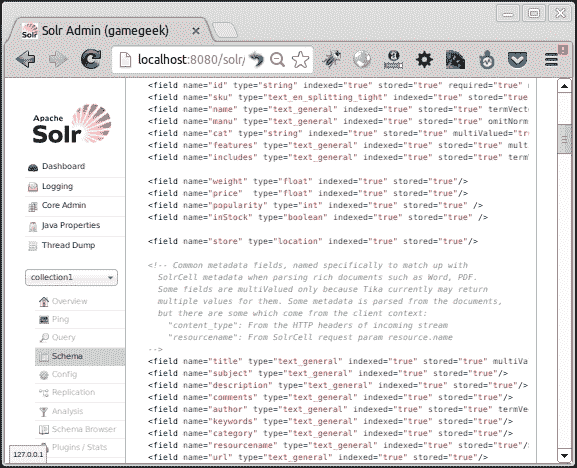

# 二、从 Solr 插入、更新和删除文档

我们将从讨论 Solr 模式开始本章。我们将探索 Solr 提供的默认模式。此外，我们将探讨：

*   将样本数据推送到 Solr 中
*   将示例文档添加到 Solr 索引
*   使用 PHP 将文档添加到 Solr 索引
*   使用 PHP 更新 Solr 中的文档
*   使用 PHP 删除 Solr 中的文档
*   使用提交、回滚和索引优化

# Solr 模式

Solr 模式主要由字段和字段类型组成。它定义了要存储在 Solr 索引中的字段，以及在这些字段中索引或搜索数据时应进行的处理。在内部，该模式用于为用于创建要使用 Lucene API 编制索引的文档的字段分配属性。Solr 可用的默认模式可位于`<solr_home>/example/solr/collection1/conf/schema.xml`中。这里，`collection1`是核心的名称。

### 注

Solr 服务器可以有多个核心，每个核心可以有自己的模式。

让我们打开`schema.xml`文件，仔细检查一下。在 XML 文件中，我们可以看到有一个字段部分，其中包含多个字段。此外，还有另一个关于类型的部分。类型部分包含`fieldType`的不同条目，这些条目根据索引和查询期间字段的处理方式定义字段的类型。让我们了解如何创建一个`fieldType`条目。

`fieldType`条目由字段定义中使用的名称属性组成。class 属性定义了`fieldType`项的行为。其他一些属性包括：

*   `sortMissingLast`：如果将设置为 true，则该属性将导致没有该字段的文档位于有该字段的文档之后。
*   `sortMissingFirst`：如果设置为 true，该属性将导致没有该字段的文档出现在有该字段的文档之前。
*   `precisionStep`：`precisionstep`的值越低，表示精度越高，索引中的术语越多，索引越大，范围查询越快。`0`禁用不同精度级别的索引。
*   `positionIncrementGap`: It defines the positions between the last token of one entry and the first token of next entry in a multivalued field. Let us take an example.

    假设文档中的多值字段中有两个值。第一个值为`aa bb`，第二个值为`xx yy`。理想情况下，索引期间分配给这些令牌的位置将分别是`0`、`1`、`2`和`3`，用于令牌`aa`、`bb`、`xx`和`yy`。

    搜索`bb xx`将在其结果中给出此文档。为了防止这种情况发生，我们必须给出一个大的`positionIncrementGap`比如`100`。现在分配给这些代币的位置将分别是`0`、`1`、`100`和`101`，用于代币`aa`、`bb`、`xx`和`yy`。搜索`bb xx`不会给出结果，因为`bb`和`xx`彼此不近。

`FieldType`条目是原始的，如`String`、`Int`、`Boolean`、`Double`、`Float`或派生字段类型。派生字段类型可以包含分析器部分，用于定义索引或查询期间将发生的处理。每个分析仪部分由一个**标记器**和多个过滤器组成。它们定义了数据的处理方式。例如，有一个`fieldType text_ws`，其中**分析仪**是一个`WhiteSpaceTokenizerFactory`。因此，在`text_ws`类型的字段中索引或搜索的任何数据都将在空白处将数据分解为多个标记。另一个`fieldType text_general`有单独的用于索引和查询的分析器条目。在索引分析过程中，数据通过称为`StandardTokenizerFactory`的标记器，然后通过多个过滤器。以下是我们使用的过滤器：

*   `StopFilterFactory`：该过滤器用于删除`stopwords.txt`中定义的停止字
*   `SynonymFilterFactory`：该过滤器用于将同义词分配给`index_synonyms.txt`中定义的词
*   `LowerCaseFilterFactory`：此过滤器用于将所有令牌中的文本转换为小写

同样，在搜索过程中，对该字段上的查询进行了不同的分析。这是由类型查询的分析器定义的。

大多数必需的字段类型通常在默认模式中提供。但如果我们觉得有必要，我们可以继续创建一个新的字段类型。

每个字段由一个名称和一个类型（必须）以及一些其他属性组成。让我们浏览一下这些属性：

*   `name`：此属性显示字段的名称。
*   `type`：此属性定义字段的类型。所有类型都定义为我们前面讨论过的`fieldType`条目。
*   `indexed`：如果必须索引此字段中的数据，则此属性为真。索引字段中的文本被分解为标记，并从标记中创建索引，该索引可用于基于这些标记搜索文档。
*   `stored`：如果此字段中的数据也需要存储，则此属性为真。已编制索引的数据不能用于构造原始文本。所以字段中的文本是单独存储的，用于检索文档的原始文本。
*   `multivalued`：如果字段在单个文档中包含多个值，则该属性为真。与文档关联的多个值的一个示例是**标记**。一个文档可以有多个标记，要搜索任何标记，必须返回同一个文档。
*   `required`：如果在索引创建过程中必须为每个文档填充字段，则此属性为 true。

除了普通字段外，模式还包含一些动态字段，这增加了定义字段名称的灵活性。例如，名为`*_i`的动态字段将匹配以`_i`结尾的任何字段，例如`genre_i`或`xyz_i`。

模式中的其他部分包括：

*   **uniqueKey**：此部分定义了一个唯一且必须的字段。此字段将用于强制所有文档之间的唯一性。
*   **copyField**：本节可以将多个字段复制到一个字段中。因此，我们可以有多个具有不同字段类型的文本字段和一个超级字段，其中所有文本字段都被复制，以便在所有字段中进行通用搜索。

# 将示例文档添加到 Solr 索引

让我们将一些样本数据推送到 Solr 中。转到`<solr_dir>/example/exampledocs`。执行以下命令将所有示例文档添加到 Solr 索引中：

```php
java -Durl=http://localhost:8080/solr/update -Dtype=application/csv -jar post.jar books.csv
java -Durl=http://localhost:8080/solr/update  -jar post.jar *.xml
java -Durl=http://localhost:8080/solr/update -Dtype=application/json -jar post.jar books.json

```

要检查已编制索引的文档数量，请转到以下 URL：

```php
http://localhost:8080/solr/collection1/select/?q=*:*
```

这是对 Solr 的查询，要求返回索引中的所有文档。XML 输出中的`numFound`字段指定 Solr 索引中的文档数量。


我们正在使用默认的模式。要检查架构，请转到以下 URL：

```php
http://localhost:8080/solr/#/collection1/schema
```

以下屏幕截图显示了示例架构文件`schema.xml`的内容：



我们可以看到有多个字段：`id`、`title`、`subject`、`description`、`author`等。配置 Solr 就是要设计模式以满足现场需求。我们还可以看到，`id`字段是唯一的。

如前所述，我们可以通过`post.jar`程序在 Solr 中插入文档。为此，我们需要创建一个 XML、CSV 或 JSON 文件，指定文档中的字段和值。一旦文件准备好了，我们可以简单地调用前面提到的命令之一，将文件中的文档插入 Solr。文件的 XML 格式如下所示：

```php
<add>
  <doc>
      <field name="id">0553573403</field>
      <field name="cat">book</field>
      <field name="name">A game of thrones</field>
      <!--add more fields -->
  </doc>
  <!-- add more docs here -->
</add>
```

`post.jar`文件是处理文件中多个文档的程序。如果我们要插入大量的文档，并且这些文档是 CSV、XML 或 JSON 格式，那么我们可以使用它。用于在 Solr 中插入文档的 PHP 代码依次创建 Solr URL 并使用适当的数据进行`curl`调用。

```php
curl http://localhost:8080/solr/update?commit=true -H "Content-Type: text/xml" --data-binary '<add><doc><field name="id">...</field></doc>...</add>'
```

# 使用 PHP 向 Solr 索引添加文档

让我们看看使用 Solarium 库向 Solr 添加文档的代码。当我们执行以下查询时，我们可以看到我们的 Solr 索引中有三本作者*George R Martin*的书：

```php
http://localhost:8080/solr/collection1/select/?q=martin
```

让我们添加另外两本书，它们也已发布到我们的索引中：

1.  使用以下代码创建日光浴室客户端：

    ```php
    $client = new Solarium\Client($config);
    ```

2.  使用以下代码创建更新查询的实例：

    ```php
    $updateQuery = $client->createUpdate();
    ```

3.  创建要添加的文档并向文档中添加字段。

    ```php
    $doc1 = $updateQuery->createDocument();
    $doc1->id = 112233445;
    $doc1->cat = 'book';
    $doc1->name = 'A Feast For Crows';
    $doc1->price = 8.99;
    $doc1->inStock = 'true';
    $doc1->author = 'George R.R. Martin';
    $doc1->series_t = '"A Song of Ice and Fire"';
    $doc1->sequence_i = 4;
    $doc1->genre_s = 'fantasy';
    ```

4.  Similarly, another document `$doc2` can be created.

    ### 注

    请注意，`id`字段是唯一的。因此，我们必须为添加到 Solr 的不同文档保留不同的`id`字段。

5.  将文档添加到更新查询，然后执行`commit`命令：

    ```php
    $updateQuery->addDocuments(array($doc1, $doc2));
    $updateQuery->addCommit();
    ```

6.  最后，执行以下查询：

    ```php
    $result = $client->update($updateQuery);
    ```

7.  Let us execute the code using the following command:

    ```php
    php insertSolr.php
    ```

    执行代码后，搜索 martin 会得到五个结果

8.  要添加单个文档，我们可以使用以下代码行调用`addDocument`函数来更新查询实例：

    ```php
    $updateQuery->addDocument($doc1);
    ```

# 使用 PHP 更新 Solr 中的文档

让我们看看如何使用 PHP 代码和 Solarium 库更新 Solr 中的文档。

1.  首先检查我们的索引中是否有带`smith`字样的文档。

    ```php
    http://localhost:8080/solr/collection1/select/?q=smith
    ```

2.  我们可以看到`numFound=0`，这意味着没有此类文件。让我们在索引中添加一本书，作者的姓氏为`smith`。

    ```php
    $updateQuery = $client->createUpdate();
    $testdoc = $updateQuery->createDocument();
    $testdoc->id = 123456789;
    $testdoc->cat = 'book';
    $testdoc->name = 'Test book';
    $testdoc->price = 5.99;
    $testdoc->author = 'Hello Smith';
    $updateQuery->addDocument($testdoc);
    $updateQuery->addCommit();
    $client->update($updateQuery);
    ```

3.  如果我们再次运行相同的 select 查询，我们可以看到现在索引中有一个文档的作者为`Smith`。现在让我们将作者姓名更新为`Jack Smith`，将价格标签更新为`7.59`：

    ```php
    $testdoc = $updateQuery->createDocument();
    $testdoc->id = 123456789;
    $testdoc->cat = 'book';
    $testdoc->name = 'Test book';
    $testdoc->price = 7.59;
    $testdoc->author = 'Jack Smith';
    $updateQuery->addDocument($testdoc, true);
    $updateQuery->addCommit();
    $client->update($updateQuery);
    ```

4.  再次运行相同的查询时，我们可以看到，现在作者姓名和价格在 Solr 上的索引中更新了。

在 Solr 中更新文档的过程与在 Solr 中添加文档的过程类似，只是我们必须将`overwrite`标志设置为`true`。如果未设置任何参数，Solarium 将不会向 Solr 传递任何标志。但在 Solr 端，`overwrite`标志默认设置为`true`。因此，Solr 的任何文档都将使用相同的唯一密钥替换以前的文档。

Solr 内部没有更新命令。为了更新文档，当我们提供唯一键和覆盖标志时，Solr 会在内部删除并再次插入文档。

我们需要再次添加文档的所有字段，即使是不需要更新的字段。因为 Solr 将删除完整的文档并插入新文档。

方法签名中另一个有趣的参数是时间内提交。

```php
$updateQuery->addDocument($doc1, $overwrite=true, $commitwithin=10000)
```

前面的代码要求 Solr 在 10 秒内覆盖文档并提交。本章后面将对此进行解释。

我们还可以使用`addDocuments(array($doc1, $doc2))`命令在一次调用中更新多个文档。

# 使用 PHP 删除 Solr 中的文档

现在让我们继续并从 Solr 中删除此文档。

```php
$deleteQuery = $client->createUpdate();
$deleteQuery->addDeleteQuery('author:Smith');
$deleteQuery->addCommit();
$client->update($deleteQuery);
```

现在，如果我们在 Solr 上运行以下查询，则找不到该文档：

```php
http://localhost:8080/solr/collection1/select/?q=smith
```

我们在这里所做的是，我们在 Solr 中创建了一个查询，搜索 author 字段包含`smith`单词的所有文档，然后将其作为删除查询传递。

我们可以通过`addDeleteQueries`方法添加多个删除查询。这可用于在一次调用中删除多组文档。

```php
$deleteQuery->addDeleteQuery(array('author:Burst', 'author:Alexander'));
```

执行此查询时，将从索引中删除作者字段为`Burst`或`Alexander`的所有文档。

除了通过查询删除外，我们还可以通过 ID 删除。我们添加到索引中的每本书都有一个`id`字段，我们已将其标记为唯一。要按 ID 删除，只需调用`addDeleteById($id)`函数即可。

```php
$deleteQuery->addDeleteById('123456789');
```

我们也可以使用`addDeleteByIds(array $ids)`一次性删除多个文档。

### 注

除了使用 PHP 代码删除文档外，我们还可以使用`curl`调用通过 ID 或查询删除文档。对 delete by ID 的 curl 调用如下：

```php
curl http://localhost:8080/solr/collection1/update?commitWithin=1000 -H "Content-Type: text/xml" --data-binary '<delete><id>123456789</id></delete>'
```

`curl`查询删除调用如下：

```php
curl http://localhost:8080/solr/collection1/update?commitWithin=1000 -H "Content-Type: text/xml" --data-binary '<delete><query>author:smith</query></delete>'
```

以下是一种从 Solr 索引中删除所有文档的简单方法：

```php
curl http://localhost:8080/solr/collection1/update?commitWithin=1000 -H "Content-Type: text/xml" --data-binary '<delete><query>*:*</query></delete>'

```

# 提交、回滚和索引优化

我们一直作为参数传递给`addDocument()`函数的`commitWithin`参数指定了此添加文档操作的提交时间。这样就可以控制何时执行提交到 Solr 本身。Solr 在满足更新延迟要求的同时，将提交次数优化到最小。

回滚选项通过`addRollback()`功能公开。可以在上次提交之后和当前提交之前执行回滚。一旦完成提交，就无法回滚更改。

```php
$rollbackQuery = $client->createUpdate();
$rollbackQuery->addRollback();
```

索引优化是不一定需要的任务之一。但优化的索引比未优化的索引具有更好的性能。要使用 PHP 代码优化索引，我们可以使用`addOptimize(boolean $softCommit, boolean $waitSearcher, int $maxSegments)`函数。它有参数来启用软提交，等待新的搜索程序打开，以及要优化的段数。还要注意，索引优化会减慢 Solr 上所有其他查询的执行速度。

```php
$updateQuery = $client->createUpdate();
$updateQuery->addOptimize($softcommit=true, $waitSearcher=false, $maxSegments=10)
```

对于更高级的选项，我们还可以使用`addParam()`函数向查询字符串添加键值对。

```php
$updateQuery->addParam('name', 'value');
```

通常建议在一个请求中组合多个命令。命令按添加到请求中的顺序执行。但我们也应该注意不要构建超出请求限制的大型查询。在异常情况下使用回滚，以避免在运行批量查询时进行部分更新/删除，并单独执行提交。

```php
  try
  {
      $client->update($updateQuery);
  }catch(Solarium\Exception $e)
  {
      $rollbackQuery = $client->createUpdate();
      $rollbackQuery->addRollback();
      $client->update($rollbackQuery);
  }
  $commitQry = $client->createUpdate();
  $commitQry->addCommit();
  $client->update($commitQry);
```

在前面的代码段中，如果`update`查询抛出异常，那么它将回滚。

# 总结

在本章中，我们首先讨论 Solr 模式。我们对 Solr 模式的工作原理有了基本的了解。然后，我们将一些示例文档添加到 Solr 索引中。然后，我们看到了多段代码，用于向 Solr 索引添加、更新和删除文档。我们还了解了如何使用 cURL 删除文档。我们讨论了提交和回滚如何在 Solr 索引上工作。我们还看到了一个如何在代码中使用回滚的示例。我们讨论了使用 PHP 代码进行索引优化以及优化 Solr 索引的好处。

在下一章中，我们将看到如何使用 PHP 代码在 Solr 上执行搜索查询，并探索 Solr 可用的不同查询模式。