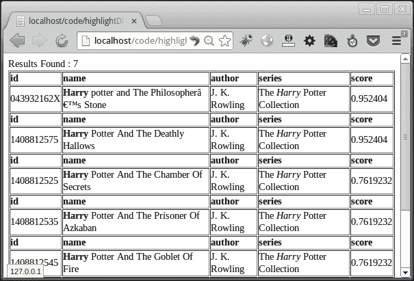

# 五、使用 PHP 和 Solr 突出显示结果

Solr 提供的高级功能之一是突出显示搜索结果中匹配的关键字。除了突出显示的匹配之外，还可以指定我们希望 Solr 在每个字段中返回的突出显示的代码段的数量。在本章中，我们将使用 PHP 和 Solarium 库探索 Solr 的所有突出功能。我们将讨论的主题包括：

*   Solr 突出显示配置
*   使用 PHP 和 Solarium 在 Solr 中突出显示
*   对不同字段使用不同的突出显示标记
*   使用快速矢量高亮显示

### 注

需要突出显示的字段必须存储在 Solr 中。

# Solr 高亮显示配置

Solr 有两种类型的荧光灯，**普通荧光灯**和**快速矢量荧光灯**。常规高亮显示适用于大多数查询类型，但不能很好地扩展到大型文档。另一方面，fast vector highlighter 可以很好地扩展到大型文档，但支持较少的查询类型。虽然我个人没有遇到过快速矢量荧光灯不工作的情况。

### 注

快速矢量荧光灯需要设置`termVectors`、`termPositions`和`termOffsets`才能工作。

让我们看看突出显示的 Solr 配置。在`<solr_directory>/example/solr/collection1/conf/solrconfig.xml`处打开 Solr 配置。搜索属性为`class="solr.HighlightComponent"`和`name="highlight"`的 XML 元素`searchComponent`。我们可以看到文件中定义了多个**碎片器**、一个 HTML**格式化程序**和一个 HTML**编码器**。我们还有多个`fragmentsBuilders`、多个`fragListBuilders`和多个`boundaryScanners`定义，如下表所示：

*   **片段器：**是突出显示文本的文本片段生成器。默认碎片器是由`default="true"`标记的间隙。
*   **格式化程序**：用于格式化输出，并指定用于突出显示输出的 HTML 标记。标签是可自定义的，可以在 URL 中传递。
*   **fragListBuilder:**仅与`FastVectorHighlighter`一起使用。用于定义荧光笔为`FastVectorHighlighter`创建的片段大小（以字符为单位）。默认的`fragListBuilder`为`single`，可以用来表示整个字段应该使用，没有任何碎片。
*   **fragmentsBuilder**：用于和`FastVectorHighlighter`一起指定用于高亮显示的标签。可以使用`hl.tag.pre`和`hl.tag.post`参数进行覆盖。
*   **边界扫描器**：仅定义如何为`FastVectorHighlighter`确定边界。默认的`boundaryScanner`将边界字符定义为`.,!?\t\n`和空格。

### 注

有关突出显示参数的更多详细信息，请访问以下 URL:[https://cwiki.apache.org/confluence/display/solr/Standard+荧光灯](https://cwiki.apache.org/confluence/display/solr/Standard+Highlighter)

# 使用 PHP 和 Solarium 在 Solr 中突出显示

让我们使用 PHP 尝试常规的高亮显示。在我们的索引中搜索`harry`，并突出显示两个字段`name` 和`series_t`，如下代码所示：

```php
  $query->setQuery('harry');
  $query->setFields(array('id','name','author','series_t','score','last_modified'));
```

首先从以下查询中获取高亮显示组件：

```php
  $hl = $query->getHighlighting();
```

使用以下查询设置要突出显示的字段：

```php
  $hl->setFields('name,series_t');
```

使用以下查询将突出显示的 HTML 标记设置为粗体：

```php
  $hl->setSimplePrefix('<strong>');
  $hl->setSimplePostfix('</strong>');
```

设置每个字段要生成的突出显示的代码段的最大数量。在这种情况下，可以生成从 0 到 2 的任意数量的突出显示的代码段，如以下查询中的所示：

```php
  $hl->setSnippets(2);
```

设置字符的大小，以考虑突出显示。0 使用整个字段值，没有任何碎片，如下查询所示：

```php
  $hl->setFragSize(0);
```

设置`mergeContiguous`标志，将相邻片段合并为单个片段，如下代码所示：

```php
  $hl->setMergeContiguous(true);
```

设置`highlightMultiTerm`标志，对范围、通配符、模糊和前缀查询启用高亮显示，如下查询所示：

```php
  $hl->setHighlightMultiTerm(true);
```

运行查询并收到结果集后，我们需要使用以下查询从结果集中检索突出显示的结果：

```php
  $hlresults = $resultSet->getHighlighting();
```

对于结果集中的每个文档，我们需要从突出显示的结果集中获取突出显示的文档。我们需要在`getResult()`函数中将唯一 ID 作为标识符传递，以获取高亮显示的文档，如下代码所示：

```php
foreach($resultSet as $doc)
{
  $hldoc = $hlresults->getResult($doc->id);
  $hlname = implode(',',$hldoc->getField('name'));
  $hlseries = implode(',',$hldoc->getField('series_t'));
}
```

在这里，每个文档的突出显示字段（我们使用`getField()`方法获取的，函数作为数组返回。这就是为什么我们必须在显示前将其内爆。我们可以看到，在输出中，字段使用粗体-`<strong>`和`</strong>`标记突出显示。

在 Solr 日志中，我们可以看到我们在 PHP 代码中指定的所有参数，如下所示：

```php
  336647163 [http-bio-8080-exec-1] INFO  org.apache.solr.core.SolrCore  – [collection1] webapp=/solr path=/select params={hl.fragsize=0&hl.mergeContiguous=true&hl.simple.pre=    <strong>&hl.fl=name,series_t&wt=json&hl=true    &rows=25&hl.highlightMultiTerm=true&omitHeader=true&fl=id,name,author,series_t,score,last_modified&hl.snippets=2&start=0&q=harry&hl.simple.post=</strong>} hits=7 status=0 QTime=203
```

为启用高亮显示而传递的参数为`hl=true`，要高亮显示的字段指定为`hl.fl=name,series_t`。

# 针对不同字段使用不同的突出显示标签

我们可以为不同的字段使用不同的突出显示标记。让我们用`bold`标记突出显示`name`，用`italics`标记突出显示`series`。在我们的代码中设置`per`字段标记，如下所示：

```php
  $hl->getField('name')->setSimplePrefix('<strong>')->setSimplePostfix('</strong>');
  $hl->getField('series_t')->setSimplePrefix('<em>')->setSimplePostfix('</em>');
```

输出显示字段`name`以粗体标记突出显示，而字段`series`以斜体标记突出显示，如以下屏幕截图所示：



用不同的标记突出显示不同的字段。

我们也可以使用`setQuery()`函数设置一个单独的查询来突出显示除正常查询以外的结果。在前面的程序中，我们将搜索`harry`时的`harry potter`高亮显示改为发生，如下代码所示：

```php
  $hl->setQuery('harry potter');
```

在检查 Solr 日志时，可以看到用于突出显示的查询作为`hl.q`参数传递给 Solr，如下代码所示：

```php
  344378867 [http-bio-8080-exec-9] INFO  org.apache.solr.core.SolrCore  – [collection1] webapp=/solr path=/select params={f.series_t.hl.simple.pre=<i>&f.name.hl.simple.post=</b>&f.name.hl.simple.pre=<b>&hl.fl=name,series_t&wt=json&hl=true&rows=25&omitHeader=true&hl.highlightMultiTerm=true&fl=id,name,author,series_t,score,last_modified&f.series_t.hl.simple.post=</i>&hl.snippets=2&start=0&q=harry&hl.q=harry+potter} hits=7 status=0 QTime=27
```

# 使用快速矢量高亮显示

让我们为两个字段`name`和`*_t`更改`schema.xml`并启用**术语向量**、**术语位置**和**术语偏移量**（这将匹配以`_t`-`series_t`结尾的所有字段。

```php
  <field name="name" type="text_general" indexed="true" stored="true" termVectors="true" termPositions="true" termOffsets="true"/>
  <dynamicField name="*_t"  type="text_general" indexed="true"  stored="true" termVectors="true" termPositions="true" termOffsets="true"/>
```

重新启动 Tomcat。根据您的系统（Windows 或 Linux）和安装类型，重新启动 Tomcat 的机制将有所不同。请检查 Tomcat 文档，以便系统重新启动 Tomcat。

由于模式现在已更改，我们需要重新索引我们在[第 2 章](2.html "Chapter 2. Inserting, Updating, and Deleting Documents from Solr")、*插入、更新和删除 Solr*中索引的所有文档。同时索引本章中的`books.csv`文件。在代码中，启用快速高亮显示，并设置用于高亮显示的`fragmentsBuilder`（HTML 标记），如下查询所示：

```php
  $hl->setUseFastVectorHighlighter(true);
  $hl->setFragmentsBuilder('colored');
```

在输出中，我们可以看到`harry`突出显示。要更改默认突出显示，我们需要在`solrconfig.xml`文件中添加一个新的**fragmentsBuilder**。浏览`solrconfig.xml`文件，搜索带有彩色名称的标签`fragmentsBuilder`。这有两个属性-`hl.tag.pre`和`hl.tag.post`。我们可以在这里指定用于快速向量高亮显示的 pre 和 post 标记。在其后面新建一个名为`fasthl`的`fragmentsbuilder`，如下代码所示：

```php
  <fragmentsBuilder name="fasthl" class="solr.highlight.ScoreOrderFragmentsBuilder">
  <lst name="defaults">
  <str name="hl.tag.pre"><![CDATA[<b style="background:cyan">]]></str>
  <str name="hl.tag.post"><![CDATA[</b>]]></str>
  </lst>
  </fragmentsBuilder>
```

重新启动 Tomcat 并更改 PHP 代码，以使用此新的`fragmentbuilder`进行高亮显示，如下查询所示：

```php
  $hl->setFragmentsBuilder('fasthl');
```

现在输出将包含以浅蓝色突出显示的`harry`。

也可以使用`setTagPrefix()`和`setTagPostfix()`功能在运行时更改突出显示标记。在下面的代码中，我们正在将代码中用于快速向量高亮显示的标记更改为石灰色：

```php
  $hl->setTagPrefix('<b style="background:lime">')->setTagPostfix('</b>');
```

配置文件用于设置默认高亮标记。出于格式化目的，可以在运行时使用 PHP 函数调用更改标记。

以下是 Solarium 中提供的一些附加功能，可用于满足您的要求：

*   `setUsePhraseHighlighter(boolean $use)`：将`true`设置为当短语术语出现在文档的查询短语中时，仅高亮显示它们。默认值为`true`。
*   `setRequireFieldMatch(boolean $require)`：仅当查询在该特定字段中匹配时，才将`true`设置为高亮显示字段。默认情况下，这是 false，因此无论哪个字段与查询匹配，都会在所有请求的字段中突出显示术语。需要`setUsePhraseHighlighter(true)`。
*   `setRegexPattern(string $pattern)`：仅用于普通荧光灯。用于设置用于分段的正则表达式。
*   `setAlternateField(string $field)`：如果所有术语都不匹配且无法生成代码段，我们可以设置一个备用/回退字段用于生成代码段。
*   `setMaxAlternateFieldLength(int $length)`：仅当设置了备用字段时使用。它指定要返回的备用字段的最大字符数。默认为`unlimited`。

# 总结

我们了解了如何使用 PHP 代码向 Solr 请求突出显示的搜索结果。我们看到了常规和 fastvector 荧光灯。我们看到了用于更改常规和 fastvector highlighter 突出显示标记的函数和参数。我们还进行了一些函数、Solr 配置和模式更改，以调整高亮显示和生成的代码段。

在下一章中，我们将深入讨论评分机制。我们将探索 debug 和 stats 组件，这将使我们能够改进相关性排名并分别从索引中获取统计信息。