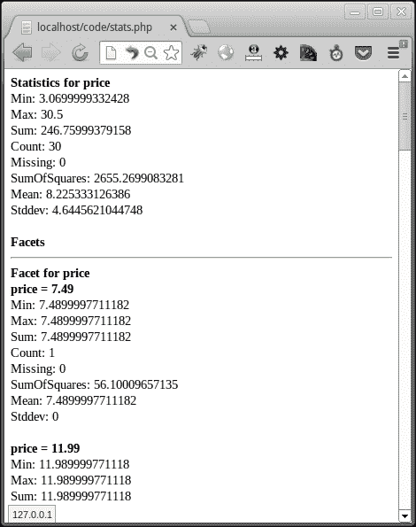
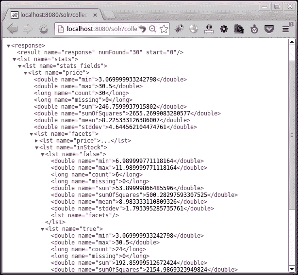

# 六、调试和统计组件

Debug 和 stats 是 Solarium 中的两个组件，用于获取有关索引统计信息以及如何执行查询和返回结果的更多信息。在本章中，我们将探讨这两个组件，并深入了解如何使用 stats 组件检索索引统计信息。我们还将了解 Solr 如何计算相关性分数，以及如何使用 PHP 获取和显示 Solr 返回的查询解释。我们将探讨：

*   Solr 如何进行相关性排名
*   通过 PHP 代码执行调试
*   在 Solr 接口上运行调试
*   显示调试查询的输出
*   使用 stats 组件显示查询结果统计信息

你可以说我为什么要研究这些组件的理论？这将帮助我实现什么？使用调试组件的好处是理解和分析搜索结果的排名方式。为什么某个文档位于顶部，而另一个文档位于末尾？此外，如果您想改变排名以适应您希望结果显示的方式，则必须增强某些字段，并在应用增强后再次调试和分析查询的执行情况。在一行中，调试组件帮助我们分析和修改排名以满足我们的需求。stats 组件主要用于显示索引统计信息—可以用来显示正在处理的索引的复杂性。

# Solr 相关性排名

当一个查询被传递到 Solr 时，它被转换成一个合适的查询字符串，然后由 Solr 执行。对于结果中的每个文档，Solr 计算文档排序所依据的相关性分数。默认情况下，评分较高的文档在结果中具有优先权。

解相关算法称为**tf idf 模型**，其中**tf**代表**术语频率**，而**idf**代表**逆文档频率**。相关性计算中使用的参数的含义，以便我们能够解释调试查询的输出，解释如下：

*   **tf**：术语频率是指术语在文档中出现的频率。术语频率越高，文档得分越高。
*   **idf**：逆文档频率是该术语出现的文档数量的倒数。它表明该术语在索引中的所有文档中都是罕见的。具有罕见术语的文档得分较高。
*   **协调**：协调因子表示在一个文档中找到了多少查询项。查询词越多的文档得分越高。
*   **queryNorm**：这是一个规范化因子，用于使查询之间的分数具有可比性。由于所有文档都乘以相同的 QueryForm，因此不会影响文档排名。
*   **字段规范**：字段规范化会惩罚具有大量术语的字段。如果一个字段包含的术语比另一个字段多，则其得分低于另一个字段。

我们之前已经看到查询时间增加了。调试查询的目的是查看相关性是如何计算的，并使用我们关于查询时间提升的知识根据我们的需求调整输出。

# 通过 PHP 代码执行调试

要使用 PHP 调试 Solr 查询，我们需要从查询中获取调试组件。

除了获取默认查询的调试信息外，我们还可以调用`explainOther()`函数来获取与`explainOther()`函数中指定的查询匹配的某些文档对主查询的分数，如下查询所示：

```php
  $query->setQuery('cat:book OR author:martin^2');
  $debugq = $query->getDebug();
  $debugq->setExplainOther('author:king');
```

在前一段代码中，我们正在搜索所有书籍，并通过作者`martin`和`2`提升书籍。除此之外，我们还获得了作者`king`所著书籍的调试信息。

运行查询后，我们需要从`ResultSet`获取调试组件。然后我们使用它来获取查询字符串、解析的查询字符串、查询解析器以及关于调试其他查询的信息，如以下代码所示：

```php
  echo 'Querystring: ' . $dResultSet->getQueryString() . '<br/>';
  echo 'Parsed query: ' . $dResultSet->getParsedQuery() . '<br/>';
  echo 'Query parser: ' . $dResultSet->getQueryParser() . '<br/>';
  echo 'Other query: ' . $dResultSet->getOtherQuery() . '<br/>';
```

我们需要迭代调试结果集，对于每个文档，我们需要获得总分值、匹配和分数计算描述。我们还可以进入调试信息的详细信息，并获取查询中与文档相关的每个术语的值、匹配和计算描述，如以下代码所示：

```php
  foreach ($dResultSet->getExplain() as $key => $explanation) {
  echo '<h3>Document key: ' . $key . '</h3>';
  echo 'Value: ' . $explanation->getValue() . '<br/>';
  echo 'Match: ' . (($explanation->getMatch() == true) ? 'true' : 'false')  . '<br/>';
  echo 'Description: ' . $explanation->getDescription() . '<br/>';
  echo '<h4>Details</h4>';
  foreach ($explanation as $detail) {
  echo 'Value: ' . $detail->getValue() . '<br/>';
  echo 'Match: ' . (($detail->getMatch() == true) ? 'true' : 'false')  . '<br/>';
  echo 'Description: ' . $detail->getDescription() . '<br/>';
  echo '<hr/>';
}
}
```

为了获得另一个查询的调试信息，我们需要调用`getExplainOther()`函数，并遵循与上面相同的过程。除了评分信息之外，我们还可以得到查询执行的每个阶段所花费的时间。此可通过使用以下`getTiming()`功能获得。

```php
  echo 'Total time: ' . $dResultSet->getTiming()->getTime() . '<br/>';
```

为了获取查询的每个阶段所花费的时间，我们需要迭代`getPhases()`函数的输出，并获取与阶段名称相关的数据。

```php
  foreach ($dResultSet->getTiming()->getPhases() as $phaseName => $phaseData) {
  echo '<h4>' . $phaseName . '</h4>';
  foreach ($phaseData as $subType => $time) {
  echo $subType . ': ' . $time . '<br/>';
}
}
```

# 在 Solr 接口上运行调试

在我们的示例中，Solr 查询 URL 中附加的参数是`debugQuery=true`、`explainOther=author:king`和`debug.explain.structured=true`。让我们通过访问 URL`http://localhost:8080/solr/collection1/select/?omitHeader=true&debugQuery=true&fl=id,name,author,series_t,score,price&start=0&q=cat:book+OR+author:martin^2&rows=5`来检查 Solr 输出的调试查询

以下是上一个查询输出的屏幕截图：


我们可以在 Solr 查询结果界面的结果组件之后看到调试组件。它包含原始查询和解析查询。调试组件中的 explain 元素包含分数和为获得分数而进行的计算

由于调试 Solr 查询是调优相关性所必需的，因此使用 Solr 接口查看调试输出更有意义。调试组件的 PHP 接口可用于创建一个交互式用户界面，在该界面中，从用户获取字段级提升，并用于计算和显示相关性。这样的界面可以用来查看 boost 中的更改如何影响相关性分数，并对其进行调整。

# 统计组件

stats 组件可以用于返回 Solr 查询返回的文档集中索引数字字段的简单统计信息。让我们来统计一下我们索引中所有书籍的价格。我们还将讨论`price`和可用性（`inStock`），并查看输出。

### 提示

建议使用模板引擎，而不是在 PHP 中编写 HTML 代码。

创建查询以获取所有书籍，并将行数设置为`0`，因为我们对结果不感兴趣，只对统计信息感兴趣，这将作为单独的组件获取，如以下查询中所示：

```php
  $query->setQuery('cat:book');
  $query->setRows(0);
```

获取 stats 组件，为字段`price`创建统计信息，并在`price`和`inStock`字段上创建面。

```php
  $statsq = $query->getStats();
  $statsq->createField('price')->addFacet('price')->addFacet('inStock');
```

执行查询并从结果集中获取 stats 组件，如以下查询中所示：

```php
  $resultset = $client->select($query);
  $statsResult = $resultset->getStats();
```

循环遍历我们先前在 stats 组件中获取的字段。获取每个字段的所有统计信息，如以下代码所示：

```php
  foreach($statsResult as $field) {
  echo '<b>Statistics for '.$field->getName().'</b><br/>';
  echo 'Min: ' . $field->getMin() . '<br/>';
  echo 'Max: ' . $field->getMax() . '<br/>';
  echo 'Sum: ' . $field->getSum() . '<br/>';
  echo 'Count: ' . $field->getCount() . '<br/>';
  echo 'Missing: ' . $field->getMissing() . '<br/>';
  echo 'SumOfSquares: ' . $field->getSumOfSquares() . '<br/>';
  echo 'Mean: ' . $field->getMean() . '<br/>';
  echo 'Stddev: ' . $field->getStddev() . '<br/>';
```

获取统计结果集中每个字段的 facet，获取 facet 结果中每个元素的统计信息，如所示，如下代码所示：

```php
  foreach ($field->getFacets() as $fld => $fct) {
  echo '<hr/><b>Facet for '.$fld.'</b><br/>';
  foreach ($fct as $fctStats) {
  echo '<b>' . $fld . ' = ' . $fctStats->getValue() . '</b><br/>';
  echo 'Min: ' . $fctStats->getMin() . '<br/>';
  echo 'Max: ' . $fctStats->getMax() . '<br/>';
  echo 'Sum: ' . $fctStats->getSum() . '<br/>';
  echo 'Count: ' . $fctStats->getCount() . '<br/>';
  echo 'Missing: ' . $fctStats->getMissing() . '<br/>';
  echo 'SumOfSquares: ' . $fctStats->getSumOfSquares() . '<br/>';
  echo 'Mean: ' . $fctStats->getMean() . '<br/>';
  echo 'Stddev: ' . $fctStats->getStddev() . '<br/><br/>';
}
}
```

我们的脚本输出可以在以下屏幕截图中看到：



在检查 Solr 日志时，我们可以看到正在执行的查询如下：

```php
4105213 [http-bio-8080-exec-2] INFO  org.apache.solr.core.SolrCore  – [collection1] webapp=/solr path=/select params={omitHeader=true&fl=*,score&start=0&stats.field=price&stats=true&q=cat:book&f.price.stats.facet=price&f.price.stats.
facet=inStock&wt=json&rows=0} hits=30 status=0 QTime=7
```

要启用统计，我们必须通过`stats=true`以及`stats.field`和刻面参数。我们可以使用 URL`http://localhost:8080/solr/collection1/select/?omitHeader=true&rows=0&stats.field=price&stats=true&q=cat:book&f.price.stats.facet=price&f.price.stats.facet=inStock`在 Solr 上看到相同的统计输出，如以下屏幕截图所示：



在前面的屏幕截图中，我们可以看到**价格**的统计信息以及**价格**和**库存**的统计信息。在我们的全部藏书中，最低价格为**3.06**，最高价格为**30.5**。所有价格之和为**246.76**，平均值为**8.225**。我们可以在 facet 输出中看到每个元素的类似信息。

# 总结

本章让我们对我们的指数和结果的排名有了一些了解。我们看到了用于计算相关性得分的参数，以及如何使用 PHP 从 Solr 中提取计算。我们讨论了调试查询的使用。我们了解了如何从索引中提取查询数字字段的统计信息，以及如何使用 PHP 显示信息。从这些模块检索到的信息用于分析和改进 Solr 搜索结果。统计数据也可用于报告目的。

在下一章中，我们将探讨如何使用 Solr 和 PHP 构建拼写建议。我们还将构建一个自动完成功能，在搜索过程中建议查询选项。