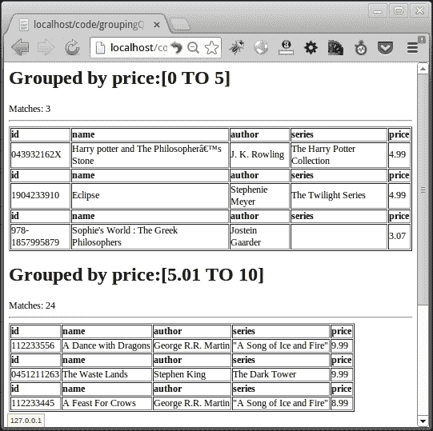
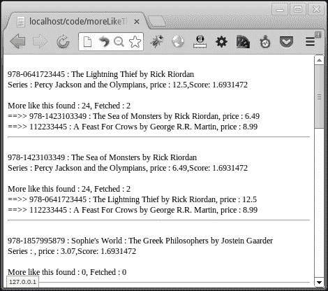
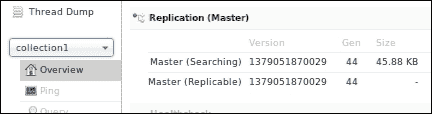
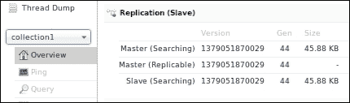

# 八、高级解决方案——分组、更相似的查询和分布式搜索

在本章中，我们将介绍 Solr 的一些高级概念。我们将根据某些标准查看分组结果。我们还将根据文档中的某些术语查找类似于特定文档的结果。我们将探索可用于水平扩展 Solr 搜索基础设施的分布式搜索。本章将涉及的主题包括

*   按字段对结果进行分组
*   按查询对结果进行分组
*   使用 PHP 运行 morelikethis 查询
*   优化 morelikethis 查询的参数
*   分布式搜索
*   设置分布式搜索
*   使用 PHP 执行分布式搜索
*   设置 Solr 主从机
*   使用 PHP 的负载平衡 Solr 查询

# 按字段分组结果

结果分组是一项功能，根据特定标准将结果组合在一起。Solr 为我们提供了基于字段或基于查询的分组。让我们搜索所有书籍并根据作者姓名和流派对结果进行分组。应在非标记化字段上进行分组，因为分组输出对于完整字段值而不是单个标记更有意义。作者姓名和流派的非标记字符串字段为`author_s`和`genre_s`。为什么？还记得我们在[第 2 章](2.html "Chapter 2. Inserting, Updating, and Deleting Documents from Solr")中讨论过一个称为动态字段的概念吗？*从 Solr*中插入、更新和删除文档。`*_s`类型的动态字段定义为`string`，如下代码所示，在 Solr 中没有标记：

```php
  <dynamicField name="*_s"  type="string"  indexed="true"  stored="true" />
```

我们需要获取分组组件，并添加需要分组的字段，如下查询所示：

```php
  $grp = $query->getGrouping();
  $grp->addField('author_s');
  $grp->addField('genre_s');
```

我们还可以通过以下查询设置 Solr 应为每个组返回的项目数：

```php
  $grp->setLimit(3);
```

并通过以下查询返回组的总数：

```php
  $grp->setNumberOfGroups(true);
```

要显示分组信息，我们需要首先通过以下查询从结果集中获取分组组件：

```php
  $groups = $resultSet->getGrouping();
```

由于我们已经在多个字段上进行了分组，我们将在结果集中得到多个组。对于 groups 数组中的每个组，我们将使用以下代码获得匹配数和组元素数：

```php
  foreach($groups as $grpName => $grpFld)  {
  echo '<h1> Grouped by ' . $grpName . '</h1>';
  echo 'Total Matches: ' . $grpFld->getMatches();
  echo 'Number of groups: ' . $grpFld->getNumberOfGroups();
  foreach($grpFld as $grpVal)     {
  echo '<h2>Grouping for ' . $grpVal->getValue() . ' : ' . $grpVal->getNumFound() . '</h2>';
  foreach($grpVal as $doc){
  echo $doc->id;
  echo $doc->name;
  echo $doc->author;
        }
    }
}
```

我们正在迭代组元素的数量，以查找组中元素的名称/标题和数量。对于每个组元素，从该组元素获取文档。

Solr 查询日志中的查询如下所示：

```php
1013311 [http-bio-8080-exec-2] INFO  org.apache.solr.core.SolrCore  – [collection1] webapp=/solr path=/select params={omitHeader=true&group.ngroups=true&fl=id,name,author,series_t,score,last_modified&start=0&q=cat:book&group.limit=3&group.field=author_s&group.field=genre_s&group=true&wt=json&rows=25} hits=30 status=0 QTime=4

```

传递的参数是`group=true`以启用分组，每个字段都有一个`group.field=<field_name>`参数。参数`group.limit`用于指定每个组元素要检索的文档数量。输出如以下屏幕截图所示：


按字段分组的输出。

# 查询分组结果

也可以按查询分组，而不是按字段分组。让我们为不同的价格范围创建组。除了在分组组件上使用`addField()`函数外，还必须使用`addQuery()`函数，将我们的查询指定为函数中的一个参数，如下所示：

```php
  $grp->addQuery('price:[0 TO 5]');
  $grp->addQuery('price:[5.01 TO 10]');
  $grp->addQuery('price:[10.01 TO *]');
```

在这里，我们创建了 3 个组，价格范围为 0 至 5 美元、5.01 至 10 美元和 10 美元以上。

我们也可以通过`setSort()`功能设置组内排序，如下查询：

```php
  $grp->setSort('price desc');
```

显示组的代码与前面讨论的类似。代码的输出如以下屏幕截图所示：



从 Solr 日志中我们可以看到，代替了`group.field`参数，我们得到了多个`group.query`参数。

```php
  1404903 [http-bio-8080-exec-4] INFO  org.apache.solr.core.SolrCore  – [collection1] webapp=/solr path=/select params={omitHeader=true&group.ngroups=true&fl=id,name,author,series_t,score,price&start=0&q=cat:book&group.limit=3&group.query=price:[0+TO+5]&group.query=price:[5.01+TO+10]&group.query=price:[10.01+TO+*]    &group.sort=price+desc&group=true&wt=json&rows=25} hits=30 status=0 QTime=38
```

# 使用 PHP 运行更像此查询

**更类似于 Solr 的**特性，可用于基于文档中的术语构造查询。此功能帮助我们检索与查询结果中的类似的文档。我们必须指定运行更类似于此功能的字段。为了提高效率，建议我们为这些字段设置`termVectors=true`。让我们通过看一个例子来了解这个功能是如何工作的。假设我们想要的书与结果中出现的书相似。书籍的相似性来源于作者及其所属系列。因此，我们必须告诉 Solr 根据字段“`author`和`series`获取与当前所选图书类似的图书。Solr（Lucene）在内部将索引中所有文档（本例中为书籍）中指定字段内的所有标记与当前所选书籍的字段进行比较。根据匹配的令牌数量，它检索结果并对结果进行排序，以便具有最大令牌匹配的文档位于顶部。

让我们将`termVectors=true`添加到我们的字段`author`&`*_t`（对于`series_t`）。术语向量是具有位置信息的术语频率对的集合。术语向量是 Solr/Lucene 索引的基本构建块。我们需要再次为这些文件编制索引。

### 注

有关 Lucene 索引如何工作的更多信息，请查看[上的文档 http://lucene.apache.org/core/4_5_1/core/org/apache/lucene/codecs/lucene45/package-summary.html](http://lucene.apache.org/core/4_5_1/core/org/apache/lucene/codecs/lucene45/package-summary.html)

在我们的 PHP 代码中，我们必须从查询中获取`MoreLikeThis`组件，并添加要在其上运行此功能的字段，如下所示：

```php
  $mltquery = $query->getMoreLikeThis();
  $mltquery->setFields('author,series_t');
```

这段代码表示我们希望在字段“`author`和`series_t`上运行更类似于此的相似性特性。这应该适用于相当大的数据集，但让我们对其进行一些调整，以便使用以下查询为我们的小型图书索引运行它：

```php
  $mltquery->setMinimumDocumentFrequency(1);
  $mltquery->setMinimumTermFrequency(1);
```

这设置了将文档分类为类似文档的最小限制。我们将在“调优更像此查询参数”一节中详细讨论这些参数。

在运行查询之后，我们需要从结果集中获得更类似于此的组件。然后在处理结果集中的文档时，我们需要从更像的`resultset`组件中获取类似的文档，如下面的代码所示：

```php
  $resultset = $client->select($query);
  $mltResult = $resultset->getMoreLikeThis();
  foreach($resultset as $doc) {
  echo $doc->id.', '.$doc->name.', '.$doc->author;
  $mltdocs = $mltResult->getResult($doc->id);
  if($mltdocs)   {
  echo "\n".$mltdocs->getMaximumScore();
  echo "\n".$mltdocs->getNumFound();
  echo 'Docs fetched : '.count($mltdocs);
  foreach($mltdocs as $mltdoc){
  echo "\n".$mltdoc->id.' : '.$mltdoc->name.' ['.$mltdoc->score.'] ';
        }
    }
}
```

一旦我们为一个文档获取了相似的文档，我们就可以循环浏览这些文档并获得相似文档的详细信息。以下屏幕截图显示了此程序的输出：



我们可以在 Solr 日志中看到，传递给 Solr 的两个主要参数是`mlt=true`&`mlt.fl=author,series_t`。要直接从 Solr 中查看相同的结果，我们可以在`http://localhost:8080/solr/collection1/select/?mlt=true&rows=10&mlt.count=2&mlt.mindf=1&mlt.fl=author,series_t&fl=id,name,author,series_t,score,price&start=0&q=cat:book&mlt.mintf=1`处使用以下查询。

这里，参数解释如下：

*   **mlt.count**：此指定我们要为结果集中的每个文档获取的类似文档的数量
*   **mlt.mindf**：这是被忽略的最小文档频率，至少在这么多文档中不会出现
*   **mlt.mintf**：这是最小术语频率，超过该频率后，源文档中的术语将被忽略

# 更像是这个参数的调整

让我们看看一些额外的功能，它们可以用来调整更类似于此功能的功能。我们可以使用以下功能：

*   **setMinimumDocumentFrequency（）**和**setMinimumTermFrequency（）**：这是为了设置我们前面看到的的最低文档频率和最低术语频率。如果未设置变量，则不会将其传递给 Solr，Solr 使用`minimumDocumentFrequency`作为`5`和`minimumTermFrequency`作为`2`的默认参数。
*   **setMinimumWordLength（）**：可用于设置忽略以下单词的最小字长。
*   **setMaximumWordLength（）**：该选项可用于设置最大字长，超过该字长的单词将被忽略。
*   **setMaximumQueryTerms（）**：可用于设置任何生成的查询中包含的查询术语的最大数量。如果未设置，则不会将其传递给 Solr，在这种情况下，将应用 Solr 的默认值 25。
*   **setMaximumNumberOfTokens（）**：用于设置每个单据字段中未存储`TermVector`支持的要解析的最大令牌数。默认值为 5000，如果我们不向 Solr 传递任何参数，将应用该值。
*   **setBoost（）**：如果`true`它通过有趣的术语相关性来提升查询。默认为`false`。
*   **setCount（）**：用于在 Solr 中设置`mlt.count`参数。它指定要为结果集中的每个文档获取多少个类似的文档。
*   **setQueryFields（）**：可以指定查询字段及其提升。这些字段也必须在`setFields()`功能中设置。

# 分布式搜索

当一个索引变得太大而无法装入一台机器时，我们可以将其切分并在多台机器上分发。分片需要一种策略，该策略根据特定字段中的特定值决定文档要索引到的分片。此策略可以基于日期、文档类型等。虽然索引必须对多个碎片单独进行，但搜索必须通过单个界面进行。我们应该能够指定碎片，查询应该在所有碎片上运行，并返回所有碎片的结果。Solarium 使搜索多个碎片变得容易。Solarium 支持通过`DistributedSearch`组件进行分布式搜索。这允许我们使用单个接口查询多个碎片，并从所有碎片中获取结果。

扩展搜索基础设施的另一种方法是创建主从 Solr 体系结构。主节点可用于在索引中添加文档，从节点可用于提供搜索。此体系结构有助于在大量服务器上扩展搜索。通常建议创建同时具有副本和碎片的基础结构。Solr 云是一个解决方案，它提供了一个易于管理和监控的基础设施。

# 设置分布式搜索

让我们创建一个新的 Solr 实例，作为一个单独的碎片使用。转到安装 Solr 的目录，创建一份`example`文件夹`example2`的副本。这将创建一个新的 Solr 实例，在其中复制索引和模式。现在启动`example2`文件夹中的 Solr 服务器。我们在端口 8983 上运行了一个新的 Solr 实例。我们前面的实例在端口 8080 上运行。

### 注

Linux 用户对应的命令有：

```php
  cd <Solr home>
  cp –r example example2
  cd example2
  java -jar start.jar –Djetty.port=8983
```

对于 Windows 用户，您只需使用 Windows 资源管理器复制`example`文件夹，然后在`cd`之后的命令提示符下运行`java-jar start.jar –Djetty.port=8983`到`example2`文件夹即可。

要杀死现有服务器，请在 Solr 服务器正在运行的命令提示符上按*Ctrl*+*C*。

要检查 Solr 实例，请转到`http://localhost:8983/solr/`。

因为我们已经将索引复制为，所以 Solr 的新实例将包含我们拥有的所有文档。让我们从索引中删除所有文档，并将一些新文档推送到索引中。

`http://localhost:8983/solr/update?stream.body=<delete><query>*:*</query></delete>`

`http://localhost:8983/solr/update?stream.body=<commit/>`

使用以下命令从`books2.csv`文件中添加更多书籍：

```php
  java -Durl=http://localhost:8983/solr/update -Dtype=application/csv -jar post.jar <path/to/file/>books2.csv
```

# 使用 PHP 执行分布式搜索

要在多个碎片上进行搜索，首先我们需要从 Solr 获取分布式搜索组件。然后添加要搜索的碎片，如以下代码所示：

```php
  $dSearch = $query->getDistributedSearch();
  $dSearch->addShard('shard1','localhost:8080/solr');
  $dSearch->addShard('shard2','localhost:8983/solr');
  $resultSet = $client->select($query);
```

在执行搜索之后，我们得到一个结果集，该结果集包含来自两个碎片的结果，并且可以像前面使用的结果集一样使用它。

当我们执行搜索时，我们可以看到两台服务器上的 Solr 日志都接收到与此搜索相关的条目。传递的参数是`shard.url` （包含 Solr 的 URL）和`isShard=true`。

不必一个一个地添加碎片，我们可以使用`addShards()`函数在一次 go 中添加多个碎片，如下面给出的：

```php
  $dSearch->addShards(array(
    'shard1' => 'localhost:8080/solr',
    'shard2' => 'localhost:8983/solr'
));
```

索尔已经出现了索尔云。因此，我们不需要使用碎片，而是可以建立一个 Solr 云，在那里数据被自动切分，我们可以与任何 Solr 实例联系以获得查询结果。

Solr 云有一个集合的概念。因此，我们需要使用`addCollection()`或`addCollections()`函数来添加集合，而不是添加核心。该功能在 Solarium 3.1 及更高版本中提供。

# 设置 Solr 主从

我们可以设置 Solr 复制，其中主 Solr 服务器用于索引，主 Solr 服务器和从 Solr 服务器都可以用于搜索。在 Solr 中设置复制非常简单。请查看名为/`replication`的`requestHandler`。只需在 Solr 中创建一个`example`文件夹副本`example3`，并使用以下命令清空`example3`文件夹中的索引文件：

```php
 cp -r example example3
 rm -rf example3/solr/collection1/data

```

在主服务器（`example`文件夹）中，更改`solrconfig.xml`文件以添加复制主服务器的配置参数，代码如下：

```php
  <lst name="master">
  <str name="replicateAfter">commit</str>
  <str name="replicateAfter">startup</str>
  <str name="confFiles">schema.xml,stopwords.txt</str>
  </lst>
```

在这里，我们指定了复制应该在启动之后以及在 Solr 上提交之后进行。并且应该复制`schema.xml`和`stopwords.txt`文件。

在`slave`Solr（`example3`文件夹）上，更改`solrconfig.xml`文件以添加从属 Solr 配置参数。需要指定的参数是主 Solr 服务器 URL 和检查 Solr 的轮询间隔。此处，轮询间隔定义为 HH:MM:SS（小时：分钟：秒），如以下代码所示：

```php
  <lst name="slave">
  <str name="masterUrl">http://localhost:8080/solr</str>
  <str name="pollInterval">00:00:60</str>
  </lst>
```

重新启动 Tomcat 并使用前面使用的`java –jar start.jar`命令启动`example3`文件夹中的 Solr 服务器。这将在端口 8983 上启动 Solr。此 Solr 服务器将充当从服务器，并轮询主服务器以获取更新。所有索引文件都复制到从属 Solr 上，如以下屏幕截图所示：



主服务器的 Solr 接口。

在前面的屏幕截图中所示的主服务器的 Solr 界面中，我们可以看到它被定义为复制主服务器，并带有索引的版本号。在如下所示的 Solr slave 服务器中，我们可以看到有一个 slave 和对 master 的引用。请注意，屏幕截图中的版本号是匹配的：



从服务器的 Solr 接口。

# 使用 PHP 的负载平衡 Solr 查询

Solarium 附带一个负载平衡器插件，可用于在多个 Solr 服务器之间建立冗余。负载平衡器插件具有以下功能：

*   支持多台服务器，每台服务器都有自己的重量。
*   如果查询失败，使用故障转移模式的功能请尝试其他 Solr 服务器。
*   阻止某些查询类型。默认情况下，更新被阻止。
*   强制特定服务器进行下一次查询。

添加所有要将查询分发到 Solarium 客户端配置的 Solr 服务器。在本例中，我们将添加最近使用以下代码设置的主和从 Solr 服务器：

```php
$config = array(
    "master" => array(
        "master" => array(
            "host"=>"127.0.0.1",
            "port"=>"8080",
            "path"=>"/solr",
            "core"=>"collection1",
        ),      
    ),
    "slave" => array(
        "slave" => array(
            "host"=>"127.0.0.1",
            "port"=>"8983",
            "path"=>"/solr",
            "core"=>"collection1",
        ),
    )
);
```

接下来，我们需要从 Solarium 客户端创建端点，从客户端获取负载平衡器插件，并使用各自的权重将端点添加到负载平衡器，如以下代码所示：

```php
  $masterEndpoint = $client->createEndpoint("master");
  $slaveEndpoint = $client->createEndpoint("slave");
  $lb = $client->getPlugin('loadbalancer');
  $lb->addEndpoint($masterEndpoint, 1);
  $lb->addEndpoint($slaveEndpoint, 5);
```

在任何服务器上的查询失败后，启用故障转移到另一个 Solr 服务器。在声明 Solr 服务器不可访问并使用以下查询故障切换到另一台服务器之前，将最大重试次数限制为 2 次：

```php
  $lb->setFailoverEnabled(true);
  $lb->setFailoverMaxRetries(2);
```

这里我们将主服务器的权重设置为`1`，从服务器的权重设置为`5`。因此，平均每 6 个查询中就有 1 个将转到主查询。如果我们想强制对主机进行查询，可以使用`setForcedEndpointForNextQuery()`功能，如下查询所示：

```php
  $lb->setForcedEndpointForNextQuery('master');
```

# 总结

在本章中，我们讨论了 Solr 和 Solarium 库中提供的一些高级功能。我们看到了基于字段和查询的结果分组。我们还看到了一个类似这样的功能，它可以用于根据原始文档的某些字段从 Solr 中提取类似于特定文档的结果。我们了解了如何使用复制和分片将 Solr 扩展到单机之外。我们看到了 Solarium 为 scaling Solr 提供的功能。