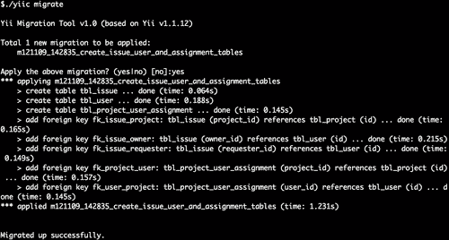
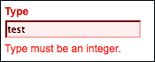
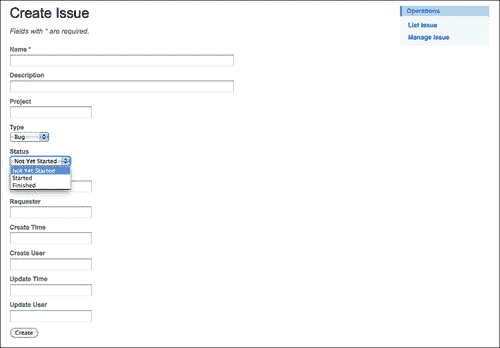
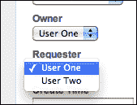
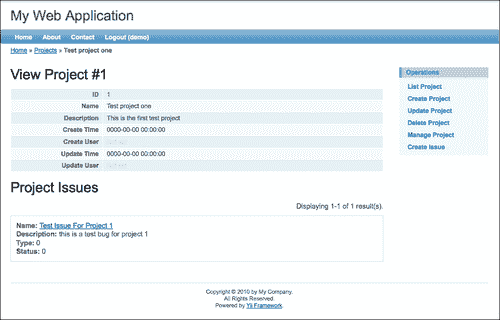
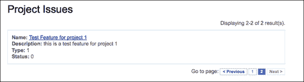
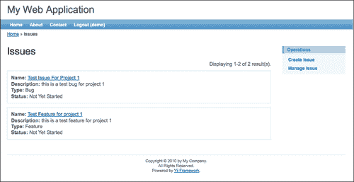
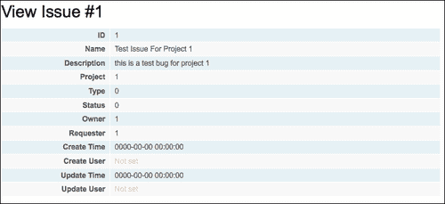

# 五、管理问题

在上一章中，我们围绕项目实体提供了基本功能。该项目是在跟踪星应用的基础。然而，项目本身并不是非常有用。项目是我们希望此应用程序管理的问题的基本容器。由于管理项目问题是此应用程序的主要目的，我们希望开始添加一些基本的问题管理功能。

# 特征规划

我们已经能够创建和列出项目，但无法管理与项目相关的问题。在本章的最后，我们希望应用程序公开项目问题或任务上的所有 CRUD 操作。（我们倾向于交替使用术语*问题*和*任务*，但在我们的数据模型中，任务实际上只是问题的一种类型。）我们还希望将问题上的所有 CRUD 操作限制在特定项目的上下文中。也就是说，*发行的*属于*项目*。在能够对项目问题执行任何 CRUD 操作之前，用户必须已选择要在其中工作的现有项目。

为了实现上述目标，我们需要：

*   设计数据库模式并构建支持项目问题的对象
*   创建 Yii 模型类，使应用程序能够轻松地与我们创建的数据库表交互
*   创建包含功能的控制器类，以允许我们：
    *   创造新问题
    *   从数据库检索项目中现有问题的列表
    *   更新/编辑现有问题
    *   删除现有问题
*   创建视图以呈现这些（以上）操作的用户界面

这张单子足以让我们前进。让我们从进行必要的数据库更改开始。

# 设计方案

回到[第 3 章](03.html "Chapter 3. The TrackStar Application")*TrackStar 应用*中，我们对*问题*实体提出了一些初步想法。我们建议它有一个*名称*、一个*类型*、一个*所有者*、一个*请求者*、一个*状态*和一个*描述*。我们还提到，在创建`tbl_project`表时，我们将向创建的每个表添加基本的审计历史信息，以跟踪更新表的日期、时间和用户。但是，类型、所有者、请求者和状态本身就是它们自己的实体。为了保持模型的灵活性和可扩展性，我们将分别对其中一些模型进行建模。*所有者*和*请求者*都是系统的用户，因此将被安置在名为`tbl_user`的单独表格中。我们已经在`tbl_project`表中引入了*用户*的概念，因为我们添加了`create_user_id`和`update_user_id`列来跟踪最初创建项目的用户的标识符，以及负责最后更新项目详细信息的用户。尽管我们还没有正式引入该表，但这些字段将用作`user`表的外键。`tbl_issue`表中的`owner_id`和`requestor_id`列也将是与此`tbl_user`表相关的外键。

我们可以用同样的方式对类型和状态属性进行建模。然而，在我们的需求需要模型中的这种额外复杂性之前，我们可以保持简单。`tbl_issue`表上的`type`和`status`列将保留可映射到命名类型和状态的整数值。但是，我们不会使用单独的表使我们的模型复杂化，而是将这些表建模为我们为问题实体创建的 AR 模型类中的基本类常量（`const`）值。如果所有这些都有点模糊，不要担心；在接下来的章节中，它将更有意义。

## 定义一些关系

由于我们正在引入`tbl_user`表，我们需要返回并定义用户和项目之间的关系。回到[第 3 章](03.html "Chapter 3. The TrackStar Application")*TrackStar 应用程序*中，我们指定用户（我们称他们为项目成员）将与零个或多个项目关联。我们还提到，项目也可以有多个（一个或多个）用户。由于项目可以有许多用户，并且这些用户可以与许多项目相关联，我们称之为项目和用户之间的**多对多**关系。在关系数据库中建模多对多关系的最简单方法是使用关联表（也称为赋值表）。所以我们也需要将这个表添加到我们的模型中。

下图概述了用户、项目和问题之间的基本实体关系。项目可以有零到多个用户。用户需要与至少一个项目关联，但可以与多个项目关联。问题只属于一个项目，而项目可以有从零到多个问题。最后，一个问题分配给（或由）一个用户。


# 建筑对象及其关系

我们需要创建三个新表，即`tbl_issue`、`tbl_user`和我们的关联表`tbl_project_user_assignment`。您可能还记得我们在[第 4 章](04.html "Chapter 4. Project CRUD")*CRUD 项目*中介绍了 Yii 数据库迁移。由于我们现在准备对数据库结构进行更改，我们将为此使用 Yii 迁移，以便更好地管理这些更改的应用程序。

由于我们同时将这些数据添加到数据库中，所以我们将在一次迁移中完成这项工作。在命令行中，切换到`protected/`目录并发出以下命令：

```php
$ ./yiic migrate create create_issue_user_and_assignment_tables

```

这将导致一个新的迁移文件被添加到`protected/migrations/`目录中。

打开这个新创建的文件，实现 safeUp（）和 safeDown（）方法如下：

```php
  // Use safeUp/safeDown to do migration with transaction
  public function safeUp()
  {
    //create the issue table
    $this->createTable('tbl_issue', array(
      'id' => 'pk',
        'name' => 'string NOT NULL',
        'description' => 'text',
        'project_id' => 'int(11) DEFAULT NULL',
      'type_id' => 'int(11) DEFAULT NULL',
      'status_id' => 'int(11) DEFAULT NULL',
      'owner_id' => 'int(11) DEFAULT NULL',
      'requester_id' => 'int(11) DEFAULT NULL',
      'create_time' => 'datetime DEFAULT NULL',
      'create_user_id' => 'int(11) DEFAULT NULL',
      'update_time' => 'datetime DEFAULT NULL',
      'update_user_id' => 'int(11) DEFAULT NULL',
       ), 'ENGINE=InnoDB');

    //create the user table
    $this->createTable('tbl_user', array(
      'id' => 'pk',
      'username' => 'string NOT NULL',
        'email' => 'string NOT NULL',
        'password' => 'string NOT NULL',
      'last_login_time' => 'datetime DEFAULT NULL',
      'create_time' => 'datetime DEFAULT NULL',
      'create_user_id' => 'int(11) DEFAULT NULL',
      'update_time' => 'datetime DEFAULT NULL',
      'update_user_id' => 'int(11) DEFAULT NULL',
       ), 'ENGINE=InnoDB');

    //create the assignment table that allows for many-to-many 
//relationship between projects and users
    $this->createTable('tbl_project_user_assignment', array(
      'project_id' => 'int(11) NOT NULL',
      'user_id' => 'int(11) NOT NULL',
      'PRIMARY KEY (`project_id`,`user_id`)',
     ), 'ENGINE=InnoDB');

    //foreign key relationships

    //the tbl_issue.project_id is a reference to tbl_project.id 
    $this->addForeignKey("fk_issue_project", "tbl_issue", "project_id", "tbl_project", "id", "CASCADE", "RESTRICT");

    //the tbl_issue.owner_id is a reference to tbl_user.id 
    $this->addForeignKey("fk_issue_owner", "tbl_issue", "owner_id", "tbl_user", "id", "CASCADE", "RESTRICT");

    //the tbl_issue.requester_id is a reference to tbl_user.id 
    $this->addForeignKey("fk_issue_requester", "tbl_issue", "requester_id", "tbl_user", "id", "CASCADE", "RESTRICT");

    //the tbl_project_user_assignment.project_id is a reference to tbl_project.id 
    $this->addForeignKey("fk_project_user", "tbl_project_user_assignment", "project_id", "tbl_project", "id", "CASCADE", "RESTRICT");

    //the tbl_project_user_assignment.user_id is a reference to tbl_user.id 
    $this->addForeignKey("fk_user_project", "tbl_project_user_assignment", "user_id", "tbl_user", "id", "CASCADE", "RESTRICT");

  }

  public function safeDown()
  {
    $this->truncateTable('tbl_project_user_assignment');
    $this->truncateTable('tbl_issue');
    $this->truncateTable('tbl_user');
    $this->dropTable('tbl_project_user_assignment');
    $this->dropTable('tbl_issue');
    $this->dropTable('tbl_user');
  }
```

这里我们实施的是`safeUp()`和`safeDown()`方法，而不是标准的`up()`和`down()`方法。这样做会在数据库事务中运行这些语句，目的是将它们作为单个单元提交或回滚。

### 注

事实上，因为我们使用的是 MySQL，所以这些`create table`和`drop table`语句不会在单个事务中运行。某些 MySQL 语句会导致隐式提交，因此在本例中使用`safeUp()`和`safeDown()`方法没有多大用处。我们将保留此内容，以帮助用户理解为什么 Yii 迁移提供了`safeUp()`和`safeDown()`方法。参见[http://dev.mysql.com/doc/refman/5.5/en/implicit-commit.html](http://dev.mysql.com/doc/refman/5.5/en/implicit-commit.html) 了解更多详情。

现在，我们可以从命令行运行迁移：



这次迁移创建了我们必需的数据库对象。现在，我们可以将重点转向创建活动记录模型类。

# 创建活动记录模型类

现在我们已经创建了这些表，我们需要创建 Yii 模型 AR 类，以便在应用程序中轻松地与这些表交互。在上一章中，我们使用 Gii 代码生成工具创建`Project`模型类时做到了这一点。我们将在此提醒您这些步骤，但请不要使用所有屏幕截图。有关使用 Gii 工具创建活动记录类的更详细演练，请参阅[第 4 章](04.html "Chapter 4. Project CRUD")、*项目 CRUD*。

## 创建问题模型类

通过`http://localhost/trackstar/index.php?r=gii`导航到 Gii 工具并选择**模型生成器**链接。将表格前缀保留为**tbl**。将**表名**字段填写为`tbl_issue`，将**模型类**字段自动填充为**问题**。同时确保选中了**构建关系**复选框。这将确保在新模型类中自动为我们创建关系。

填写完表格后，点击**预览**按钮，获得一个弹出窗口链接，该链接将显示所有即将生成的代码。然后点击**生成**按钮，在`/protected/models/`目录下实际创建新的`Issue.php`模型类文件。

## 创建用户模型类

在这一点上，这可能会成为您的旧帽子，因此我们将把创建`User`AR 类留给您作为练习。在下一章中，当我们深入讨论用户身份验证和授权时，这个特定的类变得更加重要。

你可能会问，“那`tbl_project_user_assignment`表的 AR 类呢？”。虽然可以为此表创建 AR 类，但这不是必需的。AR 模型为我们的应用程序提供了一个**对象关系映射**（**ORM**层），以帮助我们更轻松地处理领域对象。但是，*ProjectUserAssignment*不是我们应用程序的域对象。它只是关系数据库中的一个构造，帮助我们建模和管理项目和用户之间的多对多关系。维护一个单独的 AR 类来处理这个表的管理是额外的复杂性，我们暂时可以避免。我们可以直接使用 Yii 的 DAO 管理这个表上的插入、更新和删除。

# 创建问题 CURD 操作

现在我们已经有了 issue AR 类，我们可以转而构建必要的功能来管理项目问题。我们将再次依靠 Gii 代码生成工具来帮助我们创建此功能的基础。我们在上一章中对项目进行了详细介绍。在这里，我将再次提醒您解决问题的基本步骤：

1.  导航至`http://localhost/trackstar/index.php?r=gii`处的 Gii 发生器菜单，并选择**CURD 发生器**链接。
2.  使用**发布**作为**模型类**字段的值填写表格。这将自动填充**控制器 ID**也是**问题**。**基本控制器类**和**代码模板**字段可以保留其预定义的默认值。
3.  Click on the **Preview** button to get a list of all the files that the Gii tool is proposing to create. The following screenshot shows this list of files:

    

4.  You can click on each individual link to preview the code to be generated. Once satisfied, click on the **Generate** button to have all of these files created. You should receive the following message of success:

    

# 使用问题 CURD 操作

让我们试试这个。点击上一个屏幕截图中显示的**立即试用**链接，或者直接导航到`http://localhost/trackstar/index.php?r=issue`。您将看到类似于以下屏幕截图所示的内容：


## 创刊

由于我们尚未添加任何新的问题，因此没有可列出的问题。让我们改变这一点，创建一个新的。点击**创建问题**链接。（如果这会带您进入登录页面，然后使用`demo/demo`或`admin/admin`登录。成功登录后，您将被正确重定向。）您现在应该看到一个新的问题输入表单，类似于以下屏幕截图所示：


当查看这个输入表单时，我们可以看到它在数据库表中的每一列都有一个输入字段，就像在数据库表中定义的一样。然而，正如我们在设计模式和构建表时所知道的，其中一些字段不是直接输入字段，而是表示与其他实体的关系。例如，我们不应该在此表单上有一个**类型**自由格式文本输入字段，而应该使用一个下拉输入表单字段，该字段填充了允许的问题类型选择。对于**状态**字段，也可以进行类似的论证。**所有者**和**请求者**字段也应该是下拉列表，显示分配到问题所在项目中工作的用户的姓名选择。此外，由于所有问题管理都应在特定项目的上下文中进行，**项目**字段甚至不应成为此表单的一部分。最后，**创建时间**、**创建用户**、**更新时间**、**更新用户**字段都是表单提交后需要计算确定的值，用户不能直接操作。

似乎我们已经确定了一些我们想要对这个初始输入表单进行的更正。正如我们在前一章中提到的，由 Gii 工具生成的自动创建的 CRUD“脚手架”代码只是一个起点。它本身很少能够满足应用程序的所有特定功能需求。

### 增加下拉字段

我们将从添加问题类型的下拉列表开始。问题只有三种类型，即*bug*、*特性*和*任务*。创建新问题时，我们希望看到的是一个下拉式输入型表单字段，其中包含这三个选项。我们将通过`Issue`模型类本身提供其可用类型的列表来实现这一点。因为我们没有创建单独的数据库表来保存问题类型，所以我们将把它们作为类常量直接添加到`Issue`活动记录模型类中。

在`Issue`模型类的顶部，添加以下三个常量定义：

```php
const TYPE_BUG=0;
const TYPE_FEATURE=1;
const TYPE_TASK=2;
```

现在将一个新方法添加到此类中，`Issue::getTypeOptions()`，该类将基于这些定义的常量返回一个数组：

```php
/**
  * Retrieves a list of issue types
  * @return array an array of available issue types.
  */
public function getTypeOptions()
{
  return array(
    self::TYPE_BUG=>'Bug',
    self::TYPE_FEATURE=>'Feature',
    self::TYPE_TASK=>'Task',
  );
}
```

我们现在有了一种检索可用问题类型列表的方法，但在输入表单中仍然没有显示这些值的下拉字段，我们可以从中进行选择。现在让我们补充一下。

### 新增出库类型下拉列表

打开包含新发行创建表单`protected/views/issue/_form.php`的文件，找到表单上**类型**字段对应的行：

```php
<div class="row">
  <?php echo $form->labelEx($model,'type_id'); ?>
  <?php echo $form->textField($model,'type_id'); ?>
  <?php echo $form->error($model,'type_id'); ?>
</div> 
```

这些台词需要澄清一下。为了理解这一点，我们需要参考`_form.php`文件顶部的一些代码，如下所示：

```php
<?php $form=$this->beginWidget('CActiveForm', array(
  'id'=>'issue-form',
  'enableAjaxValidation'=>false,
)); ?>
```

这是使用 Yii 中的`CActiveForm`小部件定义`$form`变量。**小部件**稍后将详细介绍。现在，我们可以通过更好地理解`CActiveForm`来理解此代码。`CActiveForm`可以被认为是一个帮助类，它提供了一组方法来帮助我们创建与数据模型类关联的表单。在本例中，它用于基于`Issue`模型类创建输入表单。

为了完全理解视图文件中的变量，我们还将查看呈现视图文件的控制器代码。如前所述，将数据从控制器传递到视图的一种方法是显式声明一个数组，数组的键是视图文件中可用变量的名称。由于这是新问题的创建操作，因此呈现表单的控制器方法为`IssueController::actionCreate()`。该方法如下所示：

```php
/**
   * Creates a new model.
   * If creation is successful, the browser will be redirected to the 'view' 
 * page.
   */
  public function actionCreate()
  {
    $model=new Issue;

    // Uncomment the following line if AJAX validation is needed
    // $this->performAjaxValidation($model);

    if(isset($_POST['Issue']))
    {
      $model->attributes=$_POST['Issue'];
      if($model->save())
        $this->redirect(array('view','id'=>$model->id));
    }

    $this->render('create',array(
      'model'=>$model,
    ));
  }
```

这里我们看到，当视图被渲染时，它被传递给一个`Issue`模型类的实例，该实例将作为一个名为`$model`的变量在视图中可用。

现在让我们回到负责在表单上呈现**类型**字段的代码。第一行是：

```php
$form->labelEx($model,'type_id');
```

此行使用`CActiveForm::labelEx()`方法呈现问题模型属性`type_id`的 HTML 标签。它接受模型类的一个实例和我们希望为其生成标签的相应模型属性。将使用模型类别`Issue:: attributeLabels()`方法确定标签。如果我们看一下下面列出的方法，我们会看到属性`type_id`映射到一个标签`'Type'`，这正是我们看到的呈现为该表单字段标签的内容：

```php
public function attributeLabels()
{
    return array(
      'id' => 'ID',
      'name' => 'Name',
      'description' => 'Description',
      'project_id' => 'Project',
 'type_id' => 'Type',
      'status_id' => 'Status',
      'owner_id' => 'Owner',
      'requester_id' => 'Requester',
      'create_time' => 'Create Time',
      'create_user_id' => 'Create User',
      'update_time' => 'Update Time',
      'update_user_id' => 'Update User',
    );
}
```

使用`labelEx()`方法也是我们必填字段旁边的红色小星号的原因。当需要属性时，`labelEx()`方法将添加额外的`CSS`类名（`CHtml::requiredCss`，默认为“`required`”）和星号（使用`CHtml::afterRequiredLabel`，默认为`' <span class="required">*</span>'`）。

下一行`<?php echo $form->textField($model,'type_id'); ?>`使用`CActiveForm::textField()`方法为`Issue`模型属性`type_id`呈现文本输入字段。模型类`Issue::rules()`方法中为`type_id`定义的任何验证规则将作为表单验证规则应用于此输入表单。

最后，`<?php echo $form->error($model,'type_id'); ?>`行使用`CActiveForm::error()`方法在提交时呈现与`type_id`属性相关的任何验证错误。

您可以使用类型字段尝试此验证。在我们的 MySQL 模式定义中，`type_id`列被定义为整数类型，因此，Gii 在`Issue::rules()`方法中生成了一个验证规则来强制执行这一点：

```php
  public function rules()
  {
    // NOTE: you should only define rules for those attributes that
    // will receive user inputs.
    return array(
      array('name', 'required'),
 array('project_id, type_id, status_id, owner_id, requester_id, create_user_id, update_user_id', 'numerical', 'integerOnly'=>true),

```

因此，如果我们试图在**类型**表单字段中提交一个字符串值，我们将在字段下方收到一个内联错误，如以下屏幕截图所示：



现在，我们更准确地了解了我们所拥有的，我们就更能够改变它。我们需要做的是将此字段从自由形式的文本输入字段更改为下拉条目类型。`CActiveForm`类有一个`dropDownList()`方法，可以为模型属性生成一个下拉列表，这可能并不奇怪。让我们将调用`$form->textField`（在文件`/protected/views/issue/_form.php`中）的行替换为以下内容：

```php
<?php echo $form->dropDownList($model,'type_id', $model->getTypeOptions()); ?>
```

这仍然将较早的模型作为第一个参数，将 model 属性作为第二个参数。第三个参数指定下拉选项列表。这应该是一个由`value=>display`对组成的数组。我们已经在`Issue.php`模型类中创建了`getTypeOptions()`方法来返回这种格式的数组，所以我们可以直接使用它。

### 注

需要注意的是，Yii 框架基类使用了 PHP`_get`“magic”函数。这允许我们在子类中编写方法，例如`getTypeOptions()`，并使用语法`->typeOptions`将这些方法引用为类属性。因此，我们也可以在请求 issue type options 数组`$model->typeOptions`时使用等效的语法。

保存您的工作并再次查看我们的问题输入表单。您应该会看到一个不错的问题类型选择下拉菜单，代替自由格式文本字段，如以下屏幕截图所示：


### 添加状态下拉列表：自己动手

对于问题状态，我们将采取相同的方法。正如[第 3 章](03.html "Chapter 3. The TrackStar Application")*TrackStar 应用*中提到的，当我们介绍该应用时，问题可能处于以下三种状态之一：

*   尚未开始
*   起动
*   完成了

我们将在`Issue`模型类中为状态值创建三个类常量。然后我们将创建一个新方法`Issue::getStatusOptions()`，以返回可用问题状态的数组。最后，我们将修改`_form.php`文件以呈现状态选项的下拉列表，而不是状态的自由格式文本输入字段。

我们将把状态下拉列表的实现留给您。您可以遵循我们对类型采用的相同方法。进行此更改后，表单的外观应类似于以下屏幕截图所示：



我们还应该注意，当我们将这些字段从自由格式文本输入字段更改为下拉字段时，最好在`rules()`方法中添加范围验证，以确保提交的值在下拉列表允许的值范围内。在上一章中，我们看到了 Yii 框架提供的所有验证器的列表。`CRangeValidator`属性使用中的别名*，是定义此验证规则的好选择。所以我们可以定义这样一个规则如下：*

```php
array('type_id', 'in', 'range'=>self::getAllowedTypeRange()),
```

然后我们添加一个方法来返回允许的数值类型值数组：

```php
public static function getAllowedTypeRange()
{
  return array(
    self::TYPE_BUG,
    self::TYPE_FEATURE,
    self::TYPE_TASK,
  );
}
```

同样地，我们的`status_id`也需要这样做。我们还将把它作为一个练习留给您来实现。

# 修复所有者和请求者字段

我们注意到问题创建表单的另一个问题是，所有者和请求者字段也是自由格式的文本输入字段。但是，我们知道，这些是 issue 表中的整数值，用于将外键标识符保存到`tbl_user`表的`id`列。因此，我们还需要为这些字段添加下拉字段。我们不会采用与类型和状态属性完全相同的方法，因为问题所有者和请求者需要从`tbl_user`表中获取。此外，由于并非系统中的每个用户都与问题所在的项目相关，因此这些问题不能作为下拉列表使用，下拉列表中填充了从整个`tbl_user`表中获取的数据。我们需要将列表限制为仅与此项目相关联的用户。

这带来了我们需要解决的另一件事。正如本章开头的*功能规划*部分所述，我们需要在特定项目的背景下管理我们的问题。也就是说，在创建新问题之前，应该选择一个特定的项目。目前，我们的应用程序不强制执行此工作流。

让我们逐一解决这些变化。首先，在使用任何功能来管理与该项目相关的问题之前，我们将修改应用程序以强制执行要识别的有效项目。一旦选择了一个项目，我们将确保我们的所有者和请求者下拉选择仅限于与该项目关联的用户。

## 强制执行项目上下文

在允许访问管理问题之前，我们希望确保存在有效的项目上下文。为此，我们将实现所谓的过滤器。Yii 中的一个**过滤器**是一段代码，配置为在控制器动作执行之前或之后执行。一个常见的例子是，如果我们想确保用户在执行控制器操作方法之前登录。我们可以编写一个简单的访问过滤器，在执行操作之前检查这个需求。另一个例子是，如果我们想在执行一个操作后执行一些额外的日志记录或其他审计逻辑。我们可以编写一个简单的审计过滤器来提供这种事后处理。

在这种情况下，我们希望确保在创建新问题之前选择了有效的项目。因此，我们将在`IssueController`类中添加一个项目过滤器来完成此任务。

### 定义过滤器

筛选器可以定义为控制器类方法，也可以是单独的类。使用简单方法时，方法名称必须以单词*filter*开头，并具有特定的签名。例如，如果我们要创建一个名为*someMethodName*的筛选方法，那么我们的完整筛选方法将如下所示：

```php
public function filterSomeMethodName($filterChain)
{
...
}
```

另一种方法是编写一个单独的类来执行过滤逻辑。当使用独立类方法时，该类必须扩展`CFilter`，然后根据是在调用操作之前还是之后执行逻辑，重写`preFilter()`或`postFilter()`方法中的至少一个。

### 增加过滤器

因此，让我们在`IssueController`类中添加一个过滤器来处理有效项目的检查。我们将采用类方法方法。

打开`protected/controllers/IssueController.php`并在类的底部添加以下方法：

```php
public function filterProjectContext($filterChain)
{   
     $filterChain->run(); 
} 
```

好的，我们现在定义了一个过滤器。然而，它还没有起到多大作用。它只执行`$filterChain->run()`，继续过滤过程，并允许执行该方法过滤的动作方法。这引出了另一点。我们如何定义哪些操作方法应该使用此筛选器？

### 指定过滤后的动作

控制器类的 Yii 框架基类是`CController`。它有一个需要重写的`filters()`方法，以指定需要应用过滤器的操作。事实上，这个方法已经在我们的`IssueController.php`类中被重写了。这是在我们使用 Gii 工具自动生成此类时为我们完成的。它已经添加了一个简单的*accessControl*过滤器，该过滤器在`CController`基类中定义，用于处理一些基本授权，以确保用户有足够的权限执行某些操作。如果您尚未登录并单击**创建问题**链接，则在允许创建新问题之前，您将被引导到登录页面进行身份验证。访问控制过滤器对此负责。在下一章中我们将重点讨论用户身份验证和授权时，我们将更详细地介绍它。

现在，我们只需要将新过滤器添加到此配置阵列中。要指定我们的新过滤器应应用于创建操作，请通过添加突出显示的代码来更改`IssueController::filters()`方法，如下所示：

```php
/**
 * @return array action filters
 */
public function filters()
{
  return array(
    'accessControl', // perform access control for CRUD operations  
 'projectContext + create', //check to ensure valid project context
  );
}
```

`filters()`方法应该返回一个过滤器配置数组。前面的代码返回一个配置，指定`projectContext`过滤器（定义为类中的方法）应应用于`actionCreate()`方法。配置语法允许使用“+”和“-”符号来指定是否应用筛选器。例如，如果我们决定将此筛选器应用于除`actionUpdate()`和`actionView()`操作方法之外的所有操作，我们可以指定：

```php
return array(
        'projectContext - update, view' ,
 );
```

不应同时指定加号和减号运算符。对于任何给定的过滤器配置，应该只需要一个。plus 运算符表示“仅将过滤器应用于以下操作”。减号运算符表示“将过滤器应用于除以下操作之外的所有操作*。如果配置中既没有“+”也没有“-”，则过滤器将应用于所有操作。*

目前，我们将仅限于创建操作。因此，正如前面在`+ create`配置中定义的，当任何用户试图创建新问题时，将调用我们的筛选方法。

### 增加过滤逻辑

好的，现在我们已经定义了一个过滤器，并且我们已经将其配置为在 issue controller 类中每次尝试的`actionCreate()`方法调用时调用。但是，它仍然不执行必要的逻辑。由于我们希望在尝试操作之前确保项目上下文，因此需要在调用`$filterChain->run()`之前将逻辑放在 filter 方法中。

我们将向控制器类本身添加一个项目属性。然后，我们将在 URL 中使用 querystring 参数来指示项目标识符。我们的预操作过滤器将检查现有项目属性是否为 null；如果是，它将使用 querystring 参数尝试基于主键标识符选择项目。如果成功，将执行该操作；如果失败，将引发异常。以下是执行所有这些操作所需的相关代码：

```php
class IssueController extends CController
{
     ....
     /**
   * @var private property containing the associated Project model instance.
   */
     private $_project = null; 

     /**
   * Protected method to load the associated Project model class
       * @param integer projectId the primary identifier of the associated Project
 * @return object the Project data model based on the primary key 
   */
     protected function loadProject($projectId)    {
     //if the project property is null, create it based on input id
     if($this->_project===null)
     {
      $this->_project=Project::model()->findByPk($projectId);
      if($this->_project===null)
                  {
          throw new CHttpException(404,'The requested project does not exist.'); 
         }
     }

     return $this->_project; 
  } 

  /**
   * In-class defined filter method, configured for use in the above filters() 
 * method. It is called before the actionCreate() action method is run in 
 * order to ensure a proper project context
   */
  public function filterProjectContext($filterChain)
  {   
//set the project identifier based on GET input request variables       if(isset($_GET['pid']))
      $this->loadProject($_GET['pid']);   
    else
      throw new CHttpException(403,'Must specify a project before performing this action.');

    //complete the running of other filters and execute the requested action
    $filterChain->run();

  }
  ...
}
```

这样，如果您现在试图通过点击该 URL`http://localhost/trackstar/index.php?r=issue`处问题列表页面上的**创建问题**链接来创建新问题，您应该会看到一条“错误 403”错误消息，同时显示我们之前指定的错误文本。

这很好。这表明我们已经正确地实现了代码，以防止在没有确定项目时创建新问题。克服此错误的最快方法是向用于创建新问题的 URL 添加一个`pid`querystring 参数。让我们这样做，这样我们就可以为过滤器提供一个有效的项目标识符，并继续表单以创建一个新问题。

### 添加项目 ID

回到[第 4 章](04.html "Chapter 4. Project CRUD")*项目 CRUD*中，我们在项目上测试和实施 CRUD 操作时，向应用程序添加了几个新项目。因此，您的开发数据库中可能仍然有一个有效的项目。如果没有，只需使用应用程序再次创建一个新项目。完成后，请注意创建的*项目 ID*，因为我们需要将此 ID 添加到新发行的 URL 中。

我们需要更改的链接位于问题列表页面`/protected/views/issue/index.php`的视图文件中。在该文件的顶部，您将看到在我们的菜单项中定义用于创建新问题的链接的位置。这在以下突出显示的代码中指定：

```php
$this->menu=array(
 array('label'=>'Create Issue', 'url'=>array('create')),
  array('label'=>'Manage Issue', 'url'=>array('admin')),
);
```

要向该链接添加 querystring 参数，我们只需在为`url`参数定义的数组中附加一个*名称=>值*对。我们为过滤器添加的代码期望 querystring 参数为`pid`（对于项目 id）。此外，由于我们在本例中使用的是第一个（project id=1）项目，因此我们将修改**创建问题**链接，如下所示：

```php
array('label'=>'Create Issue', 'url'=>array('create', 'pid'=>1)),

```

现在，当您查看问题列表页面时，您将看到**创建问题**超链接打开一个 URL，并在末尾附加一个 querystring 参数：

`http://localhost/trackstar/index.php?r=issue/create&pid=1`

此 querystring 参数允许筛选器正确设置项目上下文。因此，这次当您单击链接时，将显示创建新问题的表单，而不是 403 错误页面。

### 注

有关在 Yii 中使用过滤器的更多详细信息，请参见[http://www.yiiframework.com/doc/guide/1.1/en/basics.controller#filter](http://www.yiiframework.com/doc/guide/1.1/en/basics.controller#filter) 。

### 更改项目详情页面

将*项目 id*添加到**创建新问题**链接的 URL 中是确保我们的过滤器按预期工作的良好第一步。但是，我们现在已经对链接进行了硬编码，以便始终将新问题与项目 ID=1 相关联。这当然不是我们想要的。我们要做的是让创建新问题的菜单选项成为项目详细信息页面的一部分。通过这种方式，一旦您从项目列表页面选择了一个项目，特定的项目上下文将是已知的，并且我们可以动态地将该项目 ID 附加到 createnewissue 链接。让我们改变一下。

打开项目详细信息查看文件`/protected/views/project/view.php`。在这个文件的顶部，您会注意到包含在`$this->menu`数组中的菜单项。我们需要添加另一个链接，以在已定义菜单链接列表的末尾创建新问题：

```php
$this->menu=array(
  array('label'=>'List Project', 'url'=>array('index')),
  array('label'=>'Create Project', 'url'=>array('create')),
  array('label'=>'Update Project', 'url'=>array('update', 'id'=>$model->id)),
  array('label'=>'Delete Project', 'url'=>'#', 'linkOptions'=>array('submit'=>array('delete','id'=>$model->id),'confirm'=>'Are you sure you want to delete this item?')),
  array('label'=>'Manage Project', 'url'=>array('admin')),
 array('label'=>'Create Issue', 'url'=>array('issue/create', 'pid'=>$model->id)),
);
```

我们所做的是移动菜单选项，为页面创建一个新问题，列出特定项目的详细信息。我们使用了一个类似于之前的链接，但这次我们必须指定完整的*controllerID/actionID*对（`issue/create`。此外，我们没有将项目 ID 硬编码为 1，而是在视图文件中使用了`$model`变量，这是特定项目的 AR 类。这样，无论我们选择哪个项目，该变量都将始终反映该项目的正确项目`id`属性。

有了这个链接，我们还可以删除在`protected/views/issue/index.php`视图文件中将项目 ID 硬编码为`1`的另一个链接。

现在，我们在创建新问题时已经正确设置了项目上下文，我们可以将项目字段作为用户输入表单字段删除。打开新出库单`/protected/views/issue/_form.php`的查看文件。删除与项目输入字段关联的以下行：

```php
<div class="row">
    <?php echo $form->labelEx($model,'project_id'); ?>
    <?php echo $form->textField($model,'project_id'); ?>
    <?php echo $form->error($model,'project_id'); ?>
</div>
```

但是，由于`project_id`属性不会随表单一起提交，我们需要根据刚刚实现的过滤器设置的参数设置`project_id`参数。因为我们已经知道相关的项目 ID，所以让我们显式地将`Issue::project_id`设置为之前实现的过滤器创建的项目实例的`id`属性的值。因此，按照以下突出显示的代码修改`IssueController::actionCreate()`方法：

```php
public function actionCreate()
{
  $model=new Issue;
 $model->project_id = $this->_project->id;

```

现在，当我们提交表单时，将正确设置 issue active record 实例的`project_id`属性。即使我们还没有设置所有者和请求者下拉列表，我们也可以提交表单，并使用正确的项目 ID 设置创建新问题。

## 返回到所有者和请求者下拉列表

最后，我们可以回到我们开始要做的事情，那就是将所有者和请求者字段更改为该项目有效成员的下拉选项。为了正确地做到这一点，我们需要将一些用户与项目关联起来。由于用户管理是下一章的重点，我们将通过直接 SQL 将关联直接添加到数据库来手动完成此操作。让我们使用以下 SQL 添加两个测试用户：

```php
INSERT INTO tbl_user (email, username, password) VALUES ('test1@notanaddress.com','User One', MD5('test1')), ('test2@notanaddress.com','User Two', MD5('test2'));
```

### 注

我们在这里使用单向`MD5`散列算法，因为它易于使用，并且在 MySQL 和 PHP 的 5.x 版本中广泛可用。然而，现在已知`MD5`作为一种单向散列算法在安全性方面是“坏的”，因此不建议您在生产环境中使用此散列算法。请考虑使用 TaleT2A.BCRIPT ORD T3^为您的实际生产应用。以下是一些提供有关*Bcrypt*更多信息的 URL：

[http://en.wikipedia.org/wiki/Bcrypt](http://en.wikipedia.org/wiki/Bcrypt)

[http://php.net/manual/en/function.crypt.php](http://php.net/manual/en/function.crypt.php)

[http://www.openwall.com/phpass/](http://www.openwall.com/phpass/)

当您在`trackstar`数据库上运行此操作时，它将在我们的系统中创建两个 ID 为 1 和 2 的新用户。我们还可以使用以下 SQL 手动将这两个用户分配给 project#1：

```php
INSERT INTO tbl_project_user_assignment (project_id, user_id) 
VALUES (1,1), (1,2);   
```

在运行前面的 SQL 语句之后，我们为 project#1 分配了两个有效成员。

Yii 中关系活动记录的一个奇妙特性是能够直接从问题`$model`实例本身访问问题所属项目的有效成员。当我们使用 Gii 工具最初创建问题模型类时，我们确保勾选了**构建关系**复选框。这指示 Gii 查看底层数据库并定义相关关系。这可以在`/protected/models/Issue.php`中的`relations()`方法中看到。由于我们在向数据库添加适当的关系后创建了此类，因此该方法应如下所示：

```php
      /**
   * @return array relational rules.
   */
  public function relations()
  {
    //NOTE: you may need to adjust the relation name and the related
    // class name for the relations automatically generated below.
    return array(
      'requester' => array(self::BELONGS_TO, 'User', 'requester_id'),
      'owner' => array(self::BELONGS_TO, 'User', 'owner_id'),
      'project' => array(self::BELONGS_TO, 'Project', 'project_id'),
    );
  }
```

前面代码片段中的`//NOTE`注释表明，您可能有稍微不同的类属性名称，或者希望有稍微不同的类属性名称，并鼓励您根据需要进行调整。此阵列配置定义模型实例上的属性，这些属性本身就是其他 AR 实例。有了这些关系，我们可以非常轻松地访问相关的 AR 实例。例如，假设我们想要访问与问题关联的项目。我们可以使用以下语法执行此操作：

```php
//create the model instance by primary key:
$issue = Issue::model()->findByPk(1);
//access the associated Project AR instance
$project = $issue->project;
```

因为我们在数据库中定义其他表和关系之前创建了`Project`模型类，所以还没有定义任何关系。但是现在我们已经定义了一些关系，我们需要将它们添加到`Project::relations()`方法中。打开项目 AR 类`/protected/models/Project.php`并将整个`relations()`方法替换为以下内容：

```php
   /**
     * @return array relational rules.
     */
    public function relations()
    {
return array(
            'issues' => array(self::HAS_MANY, 'Issue', 'project_id'),
            'users' => array(self::MANY_MANY, 'User', 'tbl_project_user_assignment(project_id, user_id)'),
        );
    }
```

有了这些，我们就可以用极其简单的语法轻松地访问与项目相关的所有问题和/或用户。例如：

```php
//instantiate the Project model instance by primary key:  
$project = Project::model()->findByPk(1);
//get an array of all associated Issue AR instances
$allProjectIssues = $project->issues;
//get an array of all associated User AR instance
$allUsers = $project->users;
//get the User AR instance representing the owner of 
//the first issue associated with this project
$ownerOfFirstIssue = $project->issues[0]->owner;
```

通常，我们必须编写复杂的 SQL join 语句来访问此类相关数据。在 Yii 中使用关系 AR 可以避免这种复杂性和繁琐。我们现在可以以一种非常优雅、简洁、面向对象的方式访问这些关系，这种方式非常容易阅读和理解。

### 生成数据以填充下拉列表

为了实现有效的用户下拉列表，我们将采用与状态和类型下拉数据类似的方法。我们将在`Project`模型类中添加一个`getUserOptions()`方法。

打开文件`/protected/models/Project.php`并在类的底部添加以下方法：

```php
/**
 * @return array of valid users for this project, indexed by user IDs
 */ 
public function getUserOptions()
{
  $usersArray = CHtml::listData($this->users, 'id', 'username');
      return $usersArray;
} 
```

在这里，我们使用 Yii 的`CHtml`助手类来帮助我们从与项目相关联的每个用户创建一个`id=>username`对数组。记住，project 类中的`users`属性（在`relations()`方法中定义）映射到一个用户 AR 实例数组。`CHtml::listData()`方法可以接受此列表，并以适合`CActiveForm::dropDownList()`的格式生成有效数组。

现在我们有了返回所需数据的`getUserOptions()`方法，我们应该实现下拉菜单来显示返回的数据。我们已经使用了一个过滤器来设置来自`$_GET`请求的相关项目 ID，并且在`IssueController::actionCreate()`方法的开头，我们使用这个值来设置新问题实例的`project_id`属性。现在，通过 Yii 的关系 AR 功能的强大功能，我们可以使用相关的`Project`模型轻松填充下拉列表中的用户。以下是我们需要在发行表格中进行的更改：

打开包含输入表单元素`/protected/views/issue/_form.php`的视图文件，找到`owner_id`和`requester_id`的两个文本输入字段表单元素定义，并将其替换为以下代码：

```php
<?php echo $form->textField($model,'owner_id'); ?>
with this:
<?php echo $form->dropDownList($model,'owner_id', $model->project->getUserOptions()); ?>
and also replace this line:
<?php echo $form->textField($model,'requester_id'); ?>
with this:
<?php echo $form->dropDownList($model,'requester_id', $model->project->getUserOptions()); ?>
```

现在，如果我们再次查看我们的问题创建表单，我们会看到两个填充良好的下拉字段，分别为**所有者**和**请求者**：



### 做最后一次改变

因为我们已经打开了创建问题表单视图文件，所以让我们快速进行最后一个更改。出于基本历史记录和审核目的，每个表上的创建时间和用户以及上次更新的时间和用户字段不应向用户公开。稍后，我们将更改应用程序逻辑，以便在插入和更新时自动填充这些字段。现在，让我们把它们作为表单上的输入删除。

只需从`/protected/views/issue/_form.php`中完全删除以下行：

```php
<div class="row">
    <?php echo $form->labelEx($model,'create_time'); ?>
    <?php echo $form->textField($model,'create_time'); ?>
    <?php echo $form->error($model,'create_time'); ?>
  </div>

  <div class="row">
    <?php echo $form->labelEx($model,'create_user_id'); ?>
    <?php echo $form->textField($model,'create_user_id'); ?>
    <?php echo $form->error($model,'create_user_id'); ?>
  </div>

   <div class="row">
      <?php echo $form->labelEx($model,'update_time'); ?>
      <?php echo $form->textField($model,'update_time'); ?>
      <?php echo $form->error($model,'update_time'); ?>
   </div>

  <div class="row">
    <?php echo $form->labelEx($model,'update_user_id'); ?>
    <?php echo $form->textField($model,'update_user_id'); ?>
    <?php echo $form->error($model,'update_user_id'); ?>
  </div>
```

下面的屏幕截图显示了我们的新发行创建表单在进行所有这些更改后的外观：


# 剩下的 CURD

本章的目标是针对问题实施所有 CRUD 操作。我们已经完成了创建功能，但仍然需要完成问题的读取、更新和删除。幸运的是，大多数基金会已经通过使用 GUI CRUD 生成功能来铺设。但是，由于我们希望在项目上下文中管理所有问题，因此需要对访问此功能的方式进行一些调整。

## 列举问题

尽管`IssueController`类中有`actionIndex()`方法显示数据库中所有问题的列表，但我们不需要此功能，因为它目前已编码。我们希望只列出与特定项目相关的问题，而不是列出数据库中所有问题的单独页面。因此，我们将修改应用程序，将问题列表显示为项目详细信息页面的一部分。由于我们正在利用 Yii 中的关系 AR 模型，所以进行这种更改将是一个很快的过程。

### 变更项目控制员

首先，让我们修改`ProjectController`类中的`actionView()`方法。由于我们希望显示与特定项目相关的问题列表，因此可以在项目详细信息页面的同一页面上执行此操作。方法`actionView()`是显示项目详细信息的方法。

将该方法更改为：

```php
    /**
         * Displays a particular model.
         * @param integer $id the ID of the model to be displayed
         */
        public function actionView($id)
        {
                $issueDataProvider=new CActiveDataProvider('Issue', array(
                        'criteria'=>array(
                                'condition'=>'project_id=:projectId',
                                'params'=>array(':projectId'=>$this->loadModel($id)->id),
                        ),
                        'pagination'=>array(
                                'pageSize'=>1,
                        ),
                 ));

                $this->render('view',array(
                        'model'=>$this->loadModel($id),
                        'issueDataProvider'=>$issueDataProvider,
                ));

        }
```

这里我们使用`CActiveDataProvider`框架类来提供使用`CActiveRecord`对象的数据。它将使用关联的 AR 模型类从数据库中检索数据，这种方式非常容易与名为`CListView`的大型内置框架列表组件结合使用。我们将使用此组件在视图文件中显示问题列表。我们已经使用 criteria 属性指定了一个条件，即它应该只检索与正在显示的项目相关联的问题。我们还使用 pagination 属性将问题列表限制为每页只有一个问题。我们将其设置得很低，这样我们就可以通过添加另一个问题来快速演示分页功能。我们将很快演示这一点。

我们做的最后一件事是将此数据提供程序添加到调用`render()`中定义的数组中，以使其可用于`$issueDataProvider`变量中的视图文件。

### 更改项目视图文件

正如我们刚才提到的，我们将使用一个名为`CListView`的框架组件在项目详细信息页面上显示我们的问题列表。打开`/protected/views/project/view.php`并将其添加到该文件的底部：

```php
<br />
<h1>Project Issues</h1>

<?php $this->widget('zii.widgets.CListView', array(
  'dataProvider'=>$issueDataProvider,
  'itemView'=>'/issue/_view',
)); ?>
```

这里我们将`CListView`的`dataProvider`属性设置为我们在上面创建的问题数据提供程序。然后我们将其配置为使用`protected/views/issue/_view.php`文件作为模板来呈现数据提供程序中的每个项目。当我们生成问题的 CRUD 时，Gii 工具已经为我们创建了此文件。我们在这里利用它在项目详细信息页面上显示问题。

### 注

您可能还记得在[第一章](01.html "Chapter 1. Meet Yii")*Meet Yii*中，**Zii**是与 Yii 框架打包的官方扩展库。这些扩展由核心 Yii 框架团队开发和维护。你可以在这里阅读更多关于 Zii 的信息：[http://www.yiiframework.com/doc/guide/1.1/en/extension.use#zii-扩展名](http://www.yiiframework.com/doc/guide/1.1/en/extension.use#zii-extensions)

我们还需要对`/protected/views/issue/_view.php`文件进行一些更改，我们将其指定为每个问题的布局模板。将该文件的全部内容更改为以下内容：

```php
<div class="view">

  <b><?php echo CHtml::encode($data->getAttributeLabel('name')); ?>:</b>
  <?php echo CHtml::link(CHtml::encode($data->name), array('issue/view', 'id'=>$data->id)); ?>
  <br />

  <b><?php echo CHtml::encode($data->getAttributeLabel('description')); ?>:</b>
  <?php echo CHtml::encode($data->description); ?>
  <br />

  <b><?php echo CHtml::encode($data->getAttributeLabel('type_id')); ?>:</b>
  <?php echo CHtml::encode($data->type_id); ?>
<br />

  <b><?php echo CHtml::encode($data->getAttributeLabel('status_id')); ?>:</b>
  <?php echo CHtml::encode($data->status_id); ?>

</div>
```

现在，如果我们通过查看项目编号 1（`http://localhost/trackstar/index.php?r=project/view&id=1`的项目详细信息页面保存并查看结果，并假设您在该项目下至少创建了一个示例问题（如果没有，只需使用此页面中的**创建问题**链接创建一个），我们应该可以看到以下屏幕截图中显示的内容：



由于我们将数据提供程序的分页属性设置得非常低（请记住，我们仅将其设置为 1），因此我们可以再添加一个问题来演示内置分页功能。再添加一个问题会更改问题的显示，使其具有允许我们在项目问题列表中从一页转到另一页的链接，如以下屏幕截图所示：



# 最终调整

现在，我们有了一个与项目相关的问题列表，并将其显示在项目详细信息页面上。我们还可以查看问题的详细信息（即阅读），以及更新和删除问题的链接。因此，我们的基本 CURD 操作已经到位。

然而，在我们完成应用程序的这一部分之前，仍有一些问题需要解决。我们会注意到，问题显示列表显示了**类型**、**状态**、**所有者**和**请求者**字段的数字 ID 号。我们应该对此进行更改，以便显示这些的文本值。此外，由于问题已经在特定项目下，因此将项目 ID 显示为问题列表数据的一部分有点多余。所以我们可以去掉它。最后，我们需要处理显示在各种其他问题相关表单上的一些导航链接，以确保我们始终返回到此项目详细信息页面，作为所有问题管理的起点。

我们将一次解决一个问题。

## 获取状态并键入要显示的文本

之前，我们在`Issue`AR 类中添加了公共方法，用于检索状态和类型选项，以填充问题创建表单上的下拉列表。我们需要在此 AR 类上添加类似的方法，以返回特定状态或类型 ID 的文本。

将以下两个新的公共方法添加到`Issue`模型类（`/protected/models/Issue.php`中），以检索当前问题的状态并键入文本：

```php
   /**
   * @return string the status text display for the current issue
   */ 
  public function getStatusText()
  {
    $statusOptions=$this->statusOptions;
    return isset($statusOptions[$this->status_id]) ? $statusOptions[$this->status_id] : "unknown status ({$this->status_id})";
  }

  /**
   * @return string the type text display for the current issue
   */ 
  public function getTypeText()
  {
    $typeOptions=$this->typeOptions;
    return isset($typeOptions[$this->type_id]) ? $typeOptions[$this->type_id] : "unknown type ({$this->type_id})";
  }
```

它们返回状态文本值（“尚未启动”、“已启动”或“已完成”），并为`Issue`实例键入文本值（“Bug”、“Feature”或“Task”）。

### 将文本显示添加到表单中

现在我们有了两个新的公共方法，它们将返回要显示的列表的有效状态并键入文本，我们需要使用它们。更改`/protected/views/issue/_view.php`中的以下代码行。

将此`<?php echo CHtml::encode($data->type_id); ?>`更改为：

```php
<?php echo CHtml::encode($data->getTypeText()); ?>
```

而这个`<?php echo CHtml::encode($data->status_id); ?>`到这个：

```php
<?php echo CHtml::encode($data->getStatusText()); ?>
```

在这些更改之后，**项目**`http://localhost/trackstar/index.php?r=issue&pid=1`的问题列表页面不再显示问题类型和状态字段的整数值。现在，它看起来像以下屏幕截图中显示的内容：



由于我们使用同一个视图文件在项目详细信息页面上显示问题列表，因此这些更改也反映在那里。

## 更改问题详细视图

我们还需要对该问题的详细视图进行一些其他更改。当前，如果我们查看问题详细信息，将显示如下屏幕截图所示：



这是使用我们尚未更改的视图文件。它仍然显示我们不需要显示的项目 ID，以及作为整数值的**类型**和**状态**，而不是它们关联的文本值。打开用于呈现此显示的视图文件`/protected/views/issue/view.php`，我们注意到它正在使用 Zii 扩展小部件`CDetailView`，这是我们以前从未见过的。这类似于用于显示列表的`CListView`小部件，但用于显示单个数据模型实例的详细信息，而不是显示多个实例的列表视图。以下是此文件中显示此小部件使用的相关代码：

```php
<?php $this->widget('zii.widgets.CDetailView', array(
  'data'=>$model,
  'attributes'=>array(
    'id',
    'name',
    'description',
    'project_id',
    'type_id',
    'status_id',
    'owner_id',
    'requester_id',
    'create_time',
    'create_user_id',
    'update_time',
    'update_user_id',
  ),
)); ?>
```

在这里，我们将`CDetailView`小部件的数据模型设置为`Issue`模型类实例（即我们要显示其细节的特定实例），然后设置要在渲染细节视图中显示的模型实例属性列表。属性可以指定为`Name:Type:Label`格式的字符串，其中`Type`和`Label`都是可选的，也可以指定为数组本身。在这种情况下，只指定属性的名称。

如果将属性指定为数组，则可以通过声明 value 元素进一步自定义显示。我们将采用这种方法来指定模型类方法`Issue::getTypeText()`和`Issue::getStatusText()`分别用于获取**类型**和**状态**字段的文本值。

让我们将`CDetailView`的使用更改为使用以下配置：

```php
<?php $this->widget('zii.widgets.CDetailView', array(
  'data'=>$model,
  'attributes'=>array(
    'id',
    'name',
    'description',
    array(        
      'name'=>'type_id',
        'value'=>CHtml::encode($model->getTypeText())
    ),
    array(        
      'name'=>'status_id',
        'value'=>CHtml::encode($model->getStatusText())
    ),
    'owner_id',
    'requester_id',
    ),
)); ?>
```

这里我们已经从显示中删除了一些属性，即`project_id`、`create_time`、`update_time`、`create_user_id`和`update_user_id`属性。稍后我们将处理其中一些的填充和显示，但现在我们可以从细节显示中删除它们。

我们还更改了`type_id`和`status_id`属性的声明，以使用数组规范，从而可以使用 value 元素。我们已经指定使用相应的`Issue::getTypeText()`和`Issue::getStatusText()`方法来获取这些属性的值。完成这些更改后，查看问题详细信息页面将显示以下内容：


好的，我们离我们想要的越来越近了，但是我们仍然需要做一些改变。

## 显示所有者和请求者名称

情况看起来好多了，但我们仍然看到为**所有者**和**请求者**显示整数标识符，而不是实际的用户名。我们将采用类似的方法来处理类型和状态文本显示。我们将在`Issue`模型类上添加两个新的公共方法，以返回这两个属性的名称。

### 使用关系 AR

由于我们的问题和用户被表示为单独的数据库表，并通过外键关系进行关联，因此我们可以直接从视图文件中的`$model`访问`owner`和`requester`用户名。利用 Yii 的关系 AR 模型特性的强大功能，显示相关的`User`模型类实例的 username 属性非常简单。

如前所述，模型类`Issue::relations()`方法是定义关系的地方。如果我们看一下这种方法，我们会看到以下内容：

```php
/**
   * @return array relational rules.
   */
  public function relations()
  {
    // NOTE: you may need to adjust the relation name and 
//the related class name for the relations automatically generated 
//below.
    return array(
 'owner' => array(self::BELONGS_TO, 'User', 'owner_id'),
      'project' => array(self::BELONGS_TO, 'Project', 'project_id'),
 'requester' => array(self::BELONGS_TO, 'User', 'requester_id'),
    );
  }
```

突出显示的代码与我们的需求最相关。有`owner`和`requester`属性被定义为与`User`模型类的关系。这些定义指定这些属性的值为`User`模型类实例。`owner_id`和`requester_id`参数指定各自`User`类实例的唯一主键。所以我们可以像访问`Issue`模型类的其他属性一样访问这些属性。

为了显示所有者和请求者`User`类实例的用户名，我们再次将`CDetailView`配置更改为以下内容：

```php
<?php $this->widget('zii.widgets.CDetailView', array(
  'data'=>$model,
  'attributes'=>array(
    'id',
    'name',
    'description',
    array(        
      'name'=>'type_id',
        'value'=>CHtml::encode($model->getTypeText())
    ),
    array(        
      'name'=>'status_id',
        'value'=>CHtml::encode($model->getStatusText())
    ),
 array( 
 'name'=>'owner_id',
 'value'=>isset($model->owner)?CHtml::encode($model->owner->username):"unknown"
 ),
 array( 
 'name'=>'requester_id',
 'value'=>isset($model->requester)?CHtml::encode($model->requester->username):"unknown"      ),
  ),
)); ?>
```

在做了这些更改之后，我们的问题详细列表开始看起来不错了。以下屏幕截图显示了我们迄今为止取得的进展：


## 做一些最后的导航调整

我们很快就要完成本章中规定要实现的功能。唯一要做的就是稍微清理一下我们的导航系统。您可能已经注意到，仍然有一些选项允许用户在项目上下文之外导航到整个问题列表，或创建新问题。就我们的 TrackStar 应用程序而言，我们对问题所做的一切都应该在特定项目的上下文中进行。早些时候，我们为创建一个新问题而实施了这个项目上下文，这是一个良好的开端，但我们仍然需要做一些更改。

我们将注意到的一点是，应用程序仍然允许用户导航到所有项目中所有问题的列表。例如，在一个问题详细信息页面上，例如`http://localhost/trackstar/index.php?r=issue/view&id=1`，我们看到在右侧的菜单导航栏中有**列表问题**和**管理问题**链接，分别对应于`http://localhost/trackstar/index.php?r=issue/index`和`http://localhost/trackstar/index.php?r=issue/admin`（请记住，要访问管理页面，您必须以`admin/admin`身份登录）。这些仍然显示所有项目中的所有问题。因此，我们需要将此列表限制为特定项目。

由于这些链接源自“问题详细信息”页面，并且该特定问题具有关联的项目，因此我们可以首先更改要在特定项目 ID 中传递的链接，然后使用该项目 ID 作为条件来限制我们的问题在`IssueController::actionIndex()`和`IssueController::actionAdmin()`方法中的查询。

首先，让我们更改链接。打开`/protected/views/issue/view.php`文件，找到文件顶部的菜单项数组。将菜单配置更改为：

```php
$this->menu=array(
 array('label'=>'List Issues', 'url'=>array('index', 'pid'=>$model->project->id)),
 array('label'=>'Create Issue', 'url'=>array('create', 'pid'=>$model->project->id)),
  array('label'=>'Update Issue', 'url'=>array('update', 'id'=>$model->id)),
  array('label'=>'Delete Issue', 'url'=>'#', 'linkOptions'=>array('submit'=>array('delete','id'=>$model->id),'confirm'=>'Are you sure you want to delete this item?')),
 array('label'=>'Manage Issues', 'url'=>array('admin', 'pid'=>$model->project->id)),
);
```

所做的更改将突出显示。我们在**创建问题**链接以及问题列表页面和问题管理员列表页面中添加了一个新的 querystring 参数。我们已经知道，我们必须对 create 链接进行此更改，因为我们之前已经实现了一个过滤器，以强制在创建新问题之前提供有效的项目上下文。我们将不必对该链接进行任何进一步的更改。但是对于索引和管理链接，我们需要改变它们相应的操作方法，以利用这个新的 querystring 变量。

因为我们已经配置了一个过滤器来使用 querysting 变量加载相关的项目，所以让我们充分利用这一点。我们将添加到过滤器配置中，以便在执行`IssueController::actionIndex()`和`IssueController::actionAdmin()`方法之前调用我们的过滤器方法。将`IssueController::filters()`方法更改为：

```php
public function filters()
  {
    return array(
      'accessControl', // perform access control for CRUD operations
 'projectContext + create index admin', //perform a check to ensure valid project context 
    );
  }
```

有了此选项，关联的项目将被加载并可供使用。让我们在`IssueController::actionIndex()`方法中使用它。将该方法更改为：

```php
  public function actionIndex()
  {
$dataProvider=new CActiveDataProvider('Issue', array(
 'criteria'=>array(
 'condition'=>'project_id=:projectId',
 'params'=>array(':projectId'=>$this->_project->id),
 ),
 ));
    $this->render('index',array(
      'dataProvider'=>$dataProvider,
    ));
  }
```

在这里，正如我们之前所做的那样，我们只是在创建模型数据提供程序时添加一个条件，以便只检索与项目相关的问题。这将使问题列表仅限于项目下的问题。

我们需要对管理员列表页面进行相同的更改。然而，该视图文件`/protected/views/issue/admin.php`使用模型类`Issue::search()`方法的结果来提供问题列表。因此，我们实际上需要做两个更改，以使用此清单强制执行项目上下文。

首先，我们需要修改`IssueController::actionAdmin()`方法，在发送给视图的模型实例上设置正确的`project_id`属性。以下突出显示的代码显示了此必要的更改：

```php
public function actionAdmin()
  {
    $model=new Issue('search');

    if(isset($_GET['Issue']))
      $model->attributes=$_GET['Issue'];

 $model->project_id = $this->_project->id;

    $this->render('admin',array(
      'model'=>$model,
    ));
  }
```

然后我们需要在`Issue::search()`模型类方法中添加我们的标准。下面突出显示的代码标识了我们需要对此方法进行的更改：

```php
public function search()
  {
    // Warning: Please modify the following code to remove attributes that
    // should not be searched.

    $criteria=new CDbCriteria;

    $criteria->compare('id',$this->id);

    $criteria->compare('name',$this->name,true);

    $criteria->compare('description',$this->description,true);

    $criteria->compare('type_id',$this->type_id);

    $criteria->compare('status_id',$this->status_id);

    $criteria->compare('owner_id',$this->owner_id);

    $criteria->compare('requester_id',$this->requester_id);

    $criteria->compare('create_time',$this->create_time,true);

    $criteria->compare('create_user_id',$this->create_user_id);

    $criteria->compare('update_time',$this->update_time,true);

    $criteria->compare('update_user_id',$this->update_user_id);

 $criteria->condition='project_id=:projectID';

    $criteria->params=array(':projectID'=>$this->project_id);

    return new CActiveDataProvider(get_class($this), array(
      'criteria'=>$criteria,
    ));
  }
```

在这里，我们删除了使用`project_id`的`$criteria->compare()`调用，直接使用`$criteria->condition()`，即`project_id`值完全等于我们的项目上下文。有了这些更改，管理员页面上列出的问题现在仅限于与特定项目相关的问题。

### 注

`/protected/views/issues/`下的视图文件中有几个地方包含需要添加`pid`查询字符串才能正常工作的链接。我们将其作为练习留给读者，让他们按照这些示例中提供的相同方法进行适当的更改。在我们继续应用程序开发时，我们将假设创建新问题或显示问题列表的所有链接都已正确格式化，以包含适当的`pid`查询字符串参数。

# 总结

在本章中，我们能够涵盖许多不同的主题。基于我们应用程序中*问题*、*项目*和*用户*之间的关系，我们问题管理功能的实现要比我们在上一章中处理的项目实体管理复杂得多。幸运的是，Yii 多次帮助我们减轻了编写处理这种复杂性所需的所有代码的痛苦。

我们依靠我们的好友 Gii 创建活动记录模型，并针对问题实体初步实施所有基本 CRUD 操作。我们再次使用 Yii 迁移来帮助促进所需的数据库模式更改，以支持问题功能。我们在 Yii 中使用了关系活动记录，并看到了使用此功能检索相关数据库信息是多么容易。我们引入了控制器过滤器，作为进入请求生命周期的一种手段，并在控制器操作方法之前和/或之后实现业务逻辑。我们演示了如何在 Yii 表单中使用下拉列表。

到目前为止，我们在基本应用程序方面已经取得了很大的进展，而且不需要编写大量代码。Yii 框架本身完成了大部分繁重的工作。我们现在有了一个工作应用程序，它允许我们管理项目，也可以管理这些项目中的问题。这是我们的应用程序试图实现的核心。我们应该为迄今取得的成就感到自豪。

然而，在这个应用程序真正准备好投入生产使用之前，我们还有很长的路要走。缺少的一个主要部分是用户管理所需的所有功能。在接下来的两章中，我们将深入讨论用户身份验证和授权。我们将首先展示 Yii 用户身份验证的工作原理，然后根据数据库中存储的用户名和密码对用户进行身份验证。