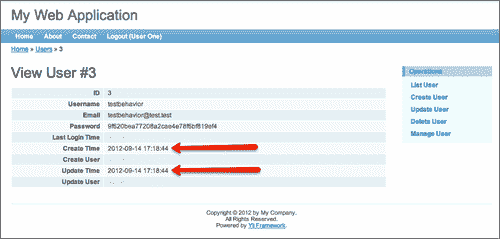
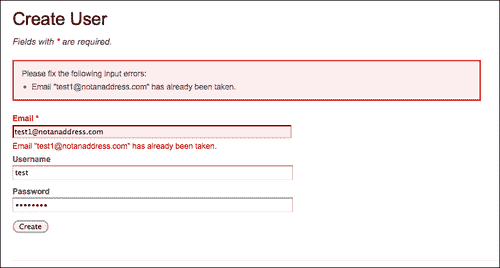
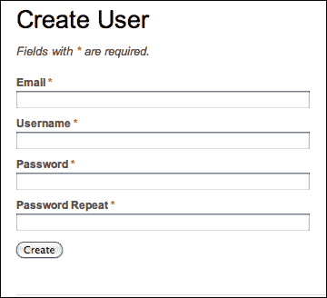
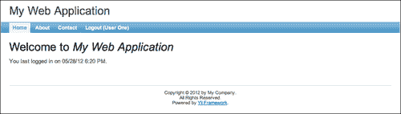

# 六、用户管理与认证

我们在很短的时间内取得了很大的进展。奠定了我国轨道交通应用的基础。我们现在能够管理项目和项目内的问题，这是本应用程序的主要目的。当然，还有很多事情要做。

在[第 3 章](03.html "Chapter 3. The TrackStar Application")*TrackStar 应用程序*中，当我们介绍此应用程序时，我们将其描述为基于用户的应用程序，该应用程序提供创建用户帐户的能力，并在用户经过身份验证和授权后授予对应用程序功能的访问权。为了使此应用程序对多个人有用，我们需要添加在项目中管理用户的功能。这将是下两章的重点。

# 特征规划

当我们使用`yiic`命令行工具最初创建 TrackStar 应用程序时，我们注意到基本登录功能是自动为我们创建的。登录页面允许两种用户名/密码凭证组合，`demo/demo`和`admin/admin`。您可能还记得，为了在前两章中对项目和发布实体执行一些 CRUD 操作，我们必须登录到应用程序。

这个基本的身份验证框架代码提供了一个很好的开端，但是我们需要做一些更改以支持任意数量的用户。我们还需要将用户 CRUD 功能添加到应用程序中，以允许我们管理这些多个用户。本章将着重于扩展身份验证模型，以使用`tbl_user`数据库表，并添加所需的功能，以便进行基本的用户数据管理。

为了实现上述目标，我们需要在以下方面开展工作：

*   创建包含功能的控制器类，以允许我们：
    *   创建新用户
    *   从数据库中检索现有用户的列表
    *   更新/编辑现有用户
    *   删除现有用户
*   创建视图文件和表示层逻辑，以：
    *   显示表单以允许新用户创建
    *   显示所有现有用户的列表
    *   显示表单以允许编辑现有用户
    *   添加一个删除按钮，以便我们可以删除用户
*   对“创建新用户”表单进行调整，以便外部用户可以将其用作自注册过程
*   更改身份验证过程以使用数据库验证登录凭据

# 用户CURD

在构建基于用户的 web 应用程序时，我们必须有一种添加和管理用户的方法。我们在[第 5 章](05.html "Chapter 5. Managing Issues")*管理问题*中向我们的数据库添加了一个`tbl_user`表。您可能还记得，我们将其作为创建关联 AR 模型类的练习留给读者。如果您正在跟进，并且没有创建必要的用户模型类，那么现在就需要这样做。

以下是使用Gii 代码创建工具创建模型类的简要提示：

1.  通过`http://localhost/trackstar/index.php?r=gii`导航到 Gii 工具并选择**模型生成器**链接。
2.  将表格前缀保留为`tbl_`。将**表名**字段填写为`tbl_user`，将**模型类**名称字段自动填充为**用户**。
3.  填写完表格后，点击**预览**按钮，获得一个弹出窗口链接，该链接将向您显示所有即将生成的代码。
4.  最后，点击**生成**按钮，在`/protected/models/ directory`中实际创建新的`User.php`模型类文件。

随着`User`AR 类的就位，创建 CRUD 脚手架是一个简单的过程。我们以前使用 Gii 工具完成过这项工作。作为提醒，以下是必要的步骤：

1.  通过`http://localhost/trackstar/index.php?r=gii`导航到该工具。
2.  点击可用发电机列表中的**CURD发生器**链接。
3.  在**模型类**名称字段中键入`User`。相应的**控制器 ID**将与**用户**自动填充。
4.  然后，您将看到在生成之前预览每个文件的选项。点击**生成**按钮，将在其正确位置生成所有相关 CRUD 文件。

有了这个，我们可以在`http://localhost/trackstar/index.php?r=user/index`查看我们的用户列表页面。在上一章中，我们在系统中手动创建了两个用户，以便能够正确处理项目、问题和用户之间的关系。这就是为什么我们会在这个页面上看到一些用户。以下屏幕截图显示了如何为我们显示此页面：


我们也可以通过访问`http://localhost/trackstar/index.php?r=user/create`查看新的**创建用户**表单。如果您当前未登录，则在能够查看表单之前，您将首先被路由到登录页面。因此，您可能必须使用`demo/demo`或`admin/admin`登录才能查看此表单。

首先在我们的项目实体上创建并使用了 CRUD 操作功能，然后又解决了一些问题，现在我们非常熟悉 Gii 代码生成工具最初是如何实现这些功能的。生成的用于创建和更新的代码是一个很好的开始，但需要进行一些调整以满足特定的应用程序需求。我们刚才为创建新用户而生成的表单也不例外。对于`tbl_user`表中定义的每一列，它都有一个输入表单字段。我们不想为用户输入公开所有这些字段。提交表单后，应以编程方式设置上次登录时间、创建时间和用户以及更新时间和用户的列。

## 更新我们的常用审计历史记录栏

在前面的章节中，当我们介绍我们的**项目**和**问题**CRUD 功能时，我们还注意到我们的表单有更多的输入字段。由于我们已将所有数据库表定义为具有相同的创建和更新时间和用户列，因此我们自动创建的每个输入表单都公开了这些字段。在[第 4 章](04.html "Chapter 4. Project CRUD")、*项目CURD*中处理项目创建表单时，我们完全忽略了这些字段。然后，在[第 5 章](05.html "Chapter 5. Managing Issues")*管理问题*中的新问题创建表单中，我们采取步骤删除表单中显示的字段，但我们从未在逻辑中添加，以便在添加新行时正确设置这些值。

让我们用一分钟来补充这个必要的逻辑。由于我们所有的实体表`tbl_project`、`tbl_issue`和`tbl_user`都定义了相同的列，因此我们可以将逻辑添加到一个公共基类，然后让每个单独的 AR 类从这个新基类扩展。这是将相同功能应用于相同类型实体的常用方法。然而，作为`CComponent`的任何实例或`CComponent`的派生类的 Yii 组件（通常是 Yii 应用程序中的大多数类）为您提供了另一种更灵活的选择。

### 组件行为

Yii 中的行为是实现`IBehavior`接口的类，其方法可以通过附加到组件来扩展组件的功能，而不是组件显式扩展类。行为可以附加到多个组件，组件可以附加多个行为。跨组件重用行为使它们非常灵活，通过能够将多个行为附加到同一组件，我们能够为我们的 Yii 组件类实现一种*多重继承*。

我们将使用这种方法向模型类添加所需的功能。我们之所以采用这种方法，而不仅仅是将逻辑直接添加到我们的`User`模型类，是因为我们的其他模型类`Issue`和`Project`也需要同样的逻辑。与其在每个 AR 模型类中复制代码，不如将功能放在行为中，然后将行为附加到模型类，这样我们就可以在一个地方为每个 AR 模型类正确设置这些字段。

为了让组件使用行为的方法，必须将行为附加到组件。这就像在组件上调用`attachBehavior()`方法一样简单：

```php
$component->attachBehavior($name, $behavior);
```

在前面的代码中，`$name`是组件内行为的唯一标识符。连接后，组件可以调用行为类中定义的方法：

```php
$component->myBehaviorMethod();
```

在前面的代码中，`myBehaviorMethod()`是在`$behavior`类中定义的，但是可以像在`$component`类中定义一样调用它。

对于模型类，我们可以将所需的行为添加到`behaviors()`方法，这是我们将对这些模型类采取的方法。现在我们只需要创建一个要附加的行为。

事实上，与 Yii 框架打包在一起的 Zii 扩展库已经有了一个现成的行为，它将更新我们在每个基础表上的日期时间列`create_time`和`update_time`。这种行为称为`CTimestampBehavior`。所以，让我们使用这个行为。

让我们从我们的`User`模型课开始。将以下方法添加到`protected/models/User.php`：

```php
public function behaviors() 
{
  return array(
     'CTimestampBehavior' => array(
       'class' => 'zii.behaviors.CTimestampBehavior',
       'createAttribute' => 'create_time',
       'updateAttribute' => 'update_time',
      'setUpdateOnCreate' => true,
    ),
   );
}
```

这里我们将 Zii 扩展库的`CTimestampBehavior`附加到我们的`User`模型类。我们已经指定了创建时间和更新时间属性，并且还配置了在创建新记录时设置更新时间的行为。有了这个，我们可以尝试一下。创建一个新用户，您将看到为我们自动插入的`create_time`和`update_time`记录。很酷吧？



这很好，但我们需要在其他模型类中重复这一点。我们可以在每个方法中复制`behaviors()`方法，并在添加更多模型类时继续这样做。或者，我们可以将其放在一个公共基类中，并让每个模型类扩展这个新的基类。这样，我们只需要定义一次`behaviors()`方法。

在保存和更新记录时，我们还需要插入`create_user_id`和`update_user_id`列。我们可以用多种方法来处理这个问题。由于一个组件可以附加多个行为，我们可以创建一个新行为，类似于`CTimestampBehavior`，它更新创建和更新用户 ID 列。或者，我们可以简单地扩展`CTimestampBehavior`，并向这个子类添加额外的功能。或者我们可以直接点击`beforeSave`模型事件，并在那里设置必要的字段。扩展现有行为以添加此额外功能可能在实际应用程序中最有意义；然而，为了演示另一种方法，让我们利用活动记录`beforeSave`事件，并在一个公共基类中执行此操作，所有 AR 模型类都可以从该基类扩展。这样，在构建自己的 Yii 应用程序时，您将接触到几种不同的方法，并有更多的选项可供选择。

因此，我们需要为 AR 模型类创建一个新的基类。我们还将创建这个新类`abstract`，因为它不应该直接实例化。首先，继续从`User`AR 类中删除`behaviors()`方法，因为我们将把它放在基类中。然后创建一个新文件`protected/models/TrackStarActiveRecord.php`，并添加以下代码：

```php
<?php
abstract class TrackStarActiveRecord extends CActiveRecord
{
   /**
   * Prepares create_user_id and update_user_id attributes before saving.
   */

  protected function beforeSave()
  {

    if(null !== Yii::app()->user)
      $id=Yii::app()->user->id;
    else
      $id=1;

    if($this->isNewRecord)
      $this->create_user_id=$id;

    $this->update_user_id=$id;

    return parent::beforeSave();
  }

  /**
   * Attaches the timestamp behavior to update our create and update times
   */
  public function behaviors() 
  {
    return array(
       'CTimestampBehavior' => array(
         'class' => 'zii.behaviors.CTimestampBehavior',
         'createAttribute' => 'create_time',
         'updateAttribute' => 'update_time',
        'setUpdateOnCreate' => true,
      ),
     );
  }

}
```

这里，正如所讨论的，我们覆盖了`CActiveRecord::beforeSave()`方法。这是`CActiveRecord`为允许定制其流程工作流而公开的众多事件之一。有两种方法允许我们进入记录保存工作流，并在活动记录保存之前或之后执行任何必要的逻辑：`beforeSave()`和`afterSave()`。在本例中，我们决定在保存活动记录之前，即在将其写入数据库之前，显式设置 create 和 update user 字段。

我们通过使用属性`$this->isNewRecord`确定是否处理新记录（即插入）或现有记录（即更新），并适当设置字段。然后，我们确保通过返回`parent::beforeSave()`来调用父实现，以确保它有机会完成它需要做的所有事情。我们正在对`Yii::app()->user`执行`NULL`检查，以处理可能在 web 应用程序上下文之外使用此模型类的实例，例如在 Yii 控制台应用程序中（将在后面的章节中介绍）。如果我们没有有效的用户，我们只是默认使用第一个用户`id = 1`，我们可以将其设置为超级用户。

此外，如前所述，我们已经将`behaviors()`方法移动到此基类，以便所有扩展它的 AR 模型类都将附加此行为。

为了尝试这一点，我们现在需要修改现有的三个 AR 类`Project.php`、`User.php`和`Issue.php`中的每一个，以从新的抽象类扩展而不是直接从`CActiveRecord`扩展。因此，例如，与以下内容不同：

```php
class User extends CActiveRecord
{
…}
```

我们需要：

```php
class User extends TrackStarActiveRecord
{ 
…}
```

我们需要对其他模型类进行类似的更改。

现在，如果我们添加另一个新用户，我们将看到所有四个审计历史列分别填充了时间戳和用户 ID。

有了这些更改，我们应该从创建新项目、问题和用户的每个表单中删除这些字段（我们已经在上一章的问题表单中删除了它们）。这些表单字段的 HTML 位于`protected/views/project/_form.php`、`protected/views/issue/_form.php`和`protected/views/user/_form.php`文件中。我们需要从每个文件中删除的行如下所示：

```php
<div class="row">
    <?php echo $form->labelEx($model,'create_time'); ?>
    <?php echo $form->textField($model,'create_time'); ?>
    <?php echo $form->error($model,'create_time'); ?>
  </div>

  <div class="row">
    <?php echo $form->labelEx($model,'create_user_id'); ?>
    <?php echo $form->textField($model,'create_user_id'); ?>
    <?php echo $form->error($model,'create_user_id'); ?>
  </div>

  <div class="row">
    <?php echo $form->labelEx($model,'update_time'); ?>
    <?php echo $form->textField($model,'update_time'); ?>
    <?php echo $form->error($model,'update_time'); ?>
  </div>

  <div class="row">
    <?php echo $form->labelEx($model,'update_user_id'); ?>
    <?php echo $form->textField($model,'update_user_id'); ?>
    <?php echo $form->error($model,'update_user_id'); ?>
  </div>
```

从用户创建表单`protected/views/user/_form.php`中，我们还可以删除上次登录时间字段：

```php
<div class="row">
    <?php echo $form->labelEx($model,'last_login_time'); ?>
    <?php echo $form->textField($model,'last_login_time'); ?>
    <?php echo $form->error($model,'last_login_time'); ?>
  </div>
```

因为我们要从表单输入中删除这些字段，所以还应该删除在关联规则方法中为这些字段定义的验证规则。定义这些验证规则是为了确保用户提交的数据有效且格式正确。删除这些规则也会阻止它们成为批量分配属性的一部分，当我们获取所有提交的 querystring 或 post 变量并将它们的值分配给 AR 模型属性时，就会发生这种情况。例如，我们在 AR 模型的创建和更新控制器操作中看到如下行：

```php
$model->attributes=$_POST['User'];
```

这是对发布表单字段中的所有模型属性进行大规模赋值。作为一种附加的安全措施，这仅适用于为其指定了验证规则的属性。您可以使用`CSafeValidator`作为一种方式，将没有任何验证规则的模型属性标记为此批量分配的安全属性。

由于这些字段不会由用户填写，并且我们不需要大量分配，因此我们可以删除这些规则。

好的，让我们把它们去掉。在`rules()`方法中打开`protected/models/User.php`和，删除以下两条规则：

```php
array('create_user_id, update_user_id', 'numerical', 'integerOnly'=>true),
array('last_login_time, create_time, update_time', 'safe'),
```

project 和 issue AR 类定义了类似的规则，但不完全相同。删除这些规则时，请确保保留仍适用于用户输入字段的规则。

删除上述`last_login_time`属性的规则是有意的。我们也应该将其从作为用户输入字段公开中删除。此字段需要在成功登录后自动更新。因为我们打开了视图文件并删除了其他字段，所以我们决定现在也删除这个字段。然而，我们将等待添加必要的应用程序逻辑，直到我们做了一些其他更改并涵盖了一些其他主题。

实际上，虽然我们仍然掌握着`User`类的这个验证规则方法，但我们应该做另一个更改。我们希望确保每个用户的电子邮件和用户名都是唯一的。我们应该在提交表单时验证此要求。此外，我们还应该验证为电子邮件提交的数据是否符合标准电子邮件格式。您可能还记得在[第 4 章](04.html "Chapter 4. Project CRUD")*CRUD 项目*中，我们介绍了 Yii 的内置验证器，其中两个非常适合我们的需要。我们将使用`CEmailValidator`和`CUniqueValidator`类来实现我们的验证需求。我们可以通过在`rules()`方法中添加以下两行代码来快速添加这些规则：

```php
array('email, username', 'unique'),
array('email', 'email'),
```

整个`User::rules()`方法现在应该如下所示：

```php
public function rules()
  {
    // NOTE: you should only define rules for those attributes that
    // will receive user inputs.
    return array(
      array('email', 'required'),
array('email, username, password', 'length', 'max'=>255,
array('email, username', 'unique'),
array('email', 'email'),
      // The following rule is used by search().
      // Please remove those attributes that should not be searched.
      array('id, email, username, password, last_login_time, create_time, create_user_id, update_time, update_user_id', 'safe', 'on'=>'search'),
    );
  }
```

上述规则中的*唯一*声明是一个别名，表示 Yii 的内置验证器`CUniqueValidator`。这将根据基础数据库表验证模型类属性的唯一性。添加此验证规则后，我们将在尝试输入数据库中已存在的电子邮件和/或用户名时收到错误。此外，随着电子邮件验证的增加，当电子邮件表单字段中的值不是正确的电子邮件格式时，我们将收到一个错误。

在上一章中，当我们第一次创建`tbl_user`表时，我们添加了两个测试用户，这样我们就可以使用一些数据。这两个用户中的第一个用户的电子邮件地址为`test1@notanaddress.com`。尝试使用此电子邮件添加其他用户。以下屏幕截图显示了收到的错误消息，以及在尝试后突出显示错误字段：



提交非有效电子邮件格式的值也会产生错误消息。

## 增加密码确认字段

除了刚才所做的更改之外，我们还应该添加一个新字段，以强制用户确认他们输入的密码。这是用户注册表格的标准实践，有助于用户在输入此重要信息时避免出错。幸运的是，Yii 附带了另一个内置的验证器，`CCompareValidator`，它的功能与您认为的完全相同。它比较两个属性的值，如果它们不相等，则返回错误。

为了利用这种内置验证，我们需要向模型类添加一个新属性。将以下属性添加到`User`模型 AR 类的顶部：

```php
public $password_repeat;
```

我们通过将`_repeat`附加到要比较的属性的名称来命名该属性。比较验证器将允许您指定要比较的任意两个属性，或将属性与常量值进行比较。如果在声明比较规则时未指定比较属性或值，则默认情况下，它将查找以与被比较的名称相同的名称开头的属性，并在末尾添加`_repeat`。这就是我们以这种方式命名属性的原因。现在我们可以在`User::rules()`方法中添加一个简单的验证规则，如下所示：

```php
array('password', 'compare'),
```

如果不使用`_repeat`约定，则需要指定要与之进行比较的属性。例如，如果我们想将`$password`属性与名为`$confirmPassword`的属性进行比较，我们可以使用：

```php
array('password', 'compare', 'compareAttribute'=>'confirmPassword'),
```

由于我们已经显式地将`$password_repeat`属性添加到用户 AR 类中，并且没有为其定义验证规则，因此我们还需要告诉模型类允许在调用`setAttributes()`方法时批量设置此字段。如前所述，我们通过显式地将新属性添加到`User`模型类的*安全*属性列表中来实现这一点。为此，将以下内容添加到`User::rules()`数组中：

```php
array('password_repeat', 'safe'),
```

让我们对验证规则再做一次更改。我们当前在用户表单上的所有字段都是必需的。目前，我们所需的规则仅适用于`email`字段。当我们对这个`User::rules()`方法进行更改时，让我们将用户名和密码也添加到此列表中：

```php
array('email, username, password, password_repeat', 'required'),
```

### 注

有关验证规则的更多信息，请参见：[http://www.yiiframework.com/doc/guide/1.1/en/form.model#declaring-验证规则](http://www.yiiframework.com/doc/guide/1.1/en/form.model#declaring-validation-rules)

好了，现在我们所有的规则都制定好了。但是，我们仍然需要在表单中添加密码确认字段。我们现在就开始吧。

要添加此字段，请打开`protected/views/user/_form.php`，并在密码字段下方添加以下代码块：

```php
<div class="row">
    <?php echo $form->labelEx($model,'password_repeat'); ?>
    <?php echo $form->passwordField($model,'password_repeat',array('size'=>60,'maxlength'=>255)); ?>
    <?php echo $form->error($model,'password_repeat'); ?>
  </div>
```

所有这些表单更改就绪后，**创建用户**表单应如以下屏幕截图所示：



现在，如果我们试图在**密码**和**密码重复**字段中提交具有不同值的表单，我们将遇到如下截图所示的错误：


## 散列密码

在离开新用户创建过程之前，我们应该做的最后一个更改是在将用户密码存储到数据库之前创建一个哈希版本。在将敏感用户信息添加到持久存储之前，对其应用单向哈希算法是一种非常常见的做法。

我们将利用另一种方法`CActiveRecord`将此逻辑添加到`User.php`AR 类中，该方法允许我们自定义默认的活动记录工作流。这一次，我们将覆盖`afterValidate()`方法，并在验证所有输入字段之后，但在保存记录之前，对密码应用基本的单向散列。

### 注

类似于我们在设置创建和更新时间戳时使用的`CActiveRecord::beforeSave()`方法，这里我们覆盖`CActiveRecord::beforeValidate()`方法。这是`CActiveRecord`公开的允许定制其流程工作流的众多事件之一。作为快速提醒，如果您在 AR 类上调用`save()`方法时没有显式发送`false`作为参数，则会触发验证过程。此过程在 AR 类中执行`rules()`方法中指定的验证。公开的两种方法允许我们进入验证工作流，并在验证之前或之后执行任何必要的逻辑，即，`beforeValidate()`和`afterValidate()`。在本例中，我们决定在执行验证之后对密码进行散列。

打开`User`AR 类，在类的底部添加以下内容：

```php
    /**
   * apply a hash on the password before we store it in the database
   */
  protected function afterValidate()
  {   
    parent::afterValidate();
  if(!$this->hasErrors())
      $this->password = $this->hashPassword($this->password);
  }

  /**
   * Generates the password hash.
   * @param string password
     * @return string hash
   */
    public function hashPassword($password)
  {
    return md5($password);
  }
```

### 注

我们在前一章中提到了这一点，但值得再次提及。我们在这里使用单向 MD5 哈希算法，因为它易于使用，并且在 5.x 版本的 MySQL 和 PHP 上广泛可用。然而，现在已经知道 MD5 作为一种单向散列算法在安全性方面是“坏的”，因此不建议您在生产环境中使用这种散列算法。请考虑使用 BLIPT 为您的实际生产应用程序。以下是一些URL，提供了有关 Bcrypt 的更多信息：

*   [http://en.wikipedia.org/wiki/Bcrypt](http://en.wikipedia.org/wiki/Bcrypt)
*   [http://php.net/manual/en/function.crypt.php](http://php.net/manual/en/function.crypt.php)
*   [http://www.openwall.com/phpass/](http://www.openwall.com/phpass/)

这样，它将在所有其他属性验证都成功通过之后对密码进行散列。

### 注

这种方法适用于全新的记录，但对于更新，如果用户不更新其密码信息，则可能会对已哈希的值进行哈希运算。我们可以通过多种方式处理这一问题，但为了暂时保持简单，我们需要确保每次用户希望更新其用户数据时，我们都会要求用户提供有效的密码。

我们现在可以向应用程序添加新用户。由于我们最初使用 Gii 工具的**CURD发生器**链接创建此表单，因此我们还为用户提供了读取、更新和删除功能。尝试添加一些新用户，查看他们的列表，更新一些信息，然后删除一些条目，以确保一切正常。（请记住，要执行删除操作，您需要以`admin`而不是`demo`的身份登录。）

# 对使用数据库的用户进行身份验证

正如我们所知，通过使用`yiic`命令创建我们的新应用程序，为我们创建了一个基本的登录表单和用户身份验证过程。该认证方案非常简单。它询问输入表单的用户名/密码值，如果它们是`demo/demo`或`admin/admin`，则通过，否则失败。这显然不是一个永久的解决方案，而是一个建立的基础。我们将在此基础上修改身份验证过程，以使用我们已经作为模型一部分的`tbl_user`数据库表。但是在我们开始更改默认实现之前，让我们仔细看看 YII 如何实现身份验证模型。

## 引入 Yii 认证模型

Yii 认证框架的核心是一个名为**用户**的应用程序组件，在最一般的情况下，它是实现`IWebUser`接口的对象。我们默认实现使用的特定类是框架类`CWebUser`。此用户组件封装了应用程序当前用户的所有身份信息。当我们最初使用`yiic`工具创建应用程序时，该组件被配置为自动生成应用程序代码的一部分。配置可以在`protected/config/main.php`文件中看到，在`components`数组元素下：

```php
'user'=>array(
  // enable cookie-based authentication
  'allowAutoLogin'=>true,
),
```

由于它被配置为应用程序组件，名称为`'user'`，因此我们可以使用`Yii::app()->user`在整个应用程序中的任何位置访问它。

我们还注意到，这里也设置了类属性`allowAutoLogin`。默认情况下，此属性为`false`，但将其设置为`true`可将用户信息存储在持久浏览器 cookie 中。然后，该数据用于在后续访问时自动对用户进行身份验证。这将允许我们在登录表单上有一个**记住我**复选框，这样，如果用户选择，他们可以在随后访问站点时自动登录到应用程序。

Yii 身份验证框架定义了一个单独的实体来容纳实际的身份验证逻辑。这称为**标识类**，通常可以是实现`IUserIdentity`接口的任何类。该类的主要角色之一是封装身份验证逻辑，以方便不同的实现。根据应用程序需求，我们可能需要根据数据库中存储的值验证用户名和密码，或者允许用户使用其 OpenID 凭据登录，或者与现有 LDAP 方法集成。将特定于身份验证方法的逻辑与应用程序登录过程的其余部分分离，使我们能够轻松地在这些实现之间切换。identity 类提供了这种分离。

当我们最初创建应用程序时，为我们生成了一个用户标识类文件，即`protected/components/UserIdentity.php`。它扩展了 Yii 框架类`CUserIdentity`，它是使用用户名和密码的身份验证实现的基类。让我们仔细看看这个类生成的代码：

```php
<?php
/**
 * UserIdentity represents the data needed to identity a user.
 * It contains the authentication method that checks if the provided
 * data can identify the user.
 */
class UserIdentity extends CUserIdentity
{
  /**
   * Authenticates a user.
   * The example implementation makes sure if the username and password
   * are both 'demo'.
   * In practical applications, this should be changed to authenticate
   * against some persistent user identity storage (e.g. database).
   * @return boolean whether authentication succeeds.
   */
  public function authenticate()
  {
    $users=array(
      // username => password
      'demo'=>'demo',
      'admin'=>'admin',
    );
    if(!isset($users[$this->username]))
      $this->errorCode=self::ERROR_USERNAME_INVALID;
    else if($users[$this->username]!==$this->password)
      $this->errorCode=self::ERROR_PASSWORD_INVALID;
    else
      $this->errorCode=self::ERROR_NONE;
    return !$this->errorCode;
  }
}
```

定义标识类的大部分工作是实现`authenticate()`方法。这就是我们放置特定于身份验证方法的代码的地方。此实现仅使用硬编码的用户名/密码值`demo/demo`和`admin/admin`。它将根据用户名和密码类属性（父类`CUserIdentity`中定义的属性）检查这些值，如果它们不匹配，它将设置并返回相应的错误代码。

为了更好地理解这些部分如何融入到整个端到端身份验证过程中，让我们从登录表单开始了解逻辑。如果我们导航到登录页面`http://localhost/trackstar/index.php?r=site/login`，我们会看到一个简单的表单，允许输入用户名、密码和我们之前讨论过的**下次记住我**功能的可选复选框。提交此表格将调用`SiteController::actionLogin()`方法中包含的逻辑。下面的序列图描述了从提交表单开始在成功登录期间发生的类交互。


该过程首先将表单模型类`LoginForm`上的类属性设置为提交的表单值。然后调用`LoginForm->validate()`方法，该方法根据`rules()`方法中定义的规则验证这些属性值。该方法定义如下：

```php
public function rules()
{
  return array(
    // username and password are required
    array('username, password', 'required'),
    // rememberMe needs to be a boolean
    array('rememberMe', 'boolean'),
    // password needs to be authenticated
    array('password', 'authenticate'),
  );
}
```

这些规则中的最后一条规定密码属性必须使用自定义方法`authenticate()`进行验证，该方法在`LoginForm`类中也定义如下：

```php
/**
   * Authenticates the password.
   * This is the 'authenticate' validator as declared in rules().
   */
  public function authenticate($attribute,$params)
  {
    $this->_identity=new UserIdentity($this->username,$this->password);
    if(!$this->_identity->authenticate())
      $this->addError('password','Incorrect username or password.');
  }
```

继续按照序列图，`LoginForm`中的密码验证调用同一类中的`authenticate()`方法。此方法创建正在使用的身份验证标识类的新实例，在本例中为`/protected/components/UserIdentity.php`，然后调用其`authenticate()`方法。该方法`UserIdentity::authenticate()`如下：

```php
/**
   * Authenticates a user.
   * The example implementation makes sure if the username and password
   * are both 'demo'.
   * In practical applications, this should be changed to authenticate
   * against some persistent user identity storage (e.g. database).
   * @return boolean whether authentication succeeds.
   */
  public function authenticate()
  {
    $users=array(
      // username => password
      'demo'=>'demo',
      'admin'=>'admin',
    );
    if(!isset($users[$this->username]))
      $this->errorCode=self::ERROR_USERNAME_INVALID;
    else if($users[$this->username]!==$this->password)
      $this->errorCode=self::ERROR_PASSWORD_INVALID;
    else
      $this->errorCode=self::ERROR_NONE;
    return !$this->errorCode;
  }
```

这是为了使用用户名和密码执行身份验证而实现的。在此实现中，只要用户名/密码组合为`demo/demo`或`admin/admin`，此方法将返回`true`。由于我们正在经历一次成功登录，身份验证成功，`SiteController`调用`LoginForm::login()`方法，如下图：

```php
/**
   * Logs in the user using the given username and password in the model.
   * @return boolean whether login is successful
   */
  public function login()
  {
    if($this->_identity===null)
    {
      $this->_identity=new UserIdentity($this->username,$this->password);
      $this->_identity->authenticate();
    }
    if($this->_identity->errorCode===UserIdentity::ERROR_NONE)
    {
      $duration=$this->rememberMe ? 3600*24*30 : 0; // 30 days
      Yii::app()->user->login($this->_identity,$duration);
      return true;
    }
    else
      return false;
  }
```

我们可以看到，这会依次调用`Yii::app()->user->login`（即`CWebUser::login()`），传入`CUserIdentity`类实例以及为 autologin 设置 cookie 的持续时间。

默认情况下，web 应用程序配置为使用 Yii 框架类`CWebuser`作为用户应用程序组件。它的`login()`方法包含一个标识类和一个可选的持续时间参数，用于设置浏览器 cookie 上的生存时间。在前面的代码中，我们看到，如果在提交表单时选中了**记住我**复选框，则将其设置为`30 days`。如果未通过持续时间，则将其设置为零。值为零将导致根本不创建 cookie。

`CWebUser::login()`方法获取 identity 类中包含的信息，并在用户会话期间将其保存在持久存储中。默认情况下，此存储是 PHP 会话存储。

所有这些完成后，`LoginForm`上最初由我们的控制器类调用的`login()`方法返回`true`，表示成功登录。然后控制器类重定向到`Yii::app()->user->returnUrl`中的 URL 值。如果希望确保用户重定向回其上一页，即在决定（或被迫）登录之前，用户在应用程序中的任何位置，则可以在整个应用程序的某些页面上设置此选项。此值默认为应用程序条目 URL。

### 更改身份验证实现

现在，我们已经了解了整个身份验证过程，我们可以很容易地看到需要在何处进行更改，以使用我们的`tbl_user`表来验证通过登录表单提交的用户名和密码凭据。我们可以简单地更改 user identity 类中的`authenticate()`方法，用提供的用户名和密码值验证是否存在匹配行。由于目前我们的`UserIdentity.php`类中除了 authenticate 方法外没有其他内容，所以让我们用以下代码完全替换此文件的内容：

```php
<?php

/**
 * UserIdentity represents the data needed to identity a user.
 * It contains the authentication method that checks if the provided
 * data can identity the user.
 */

class UserIdentity extends CUserIdentity
{
  private $_id;

  public function authenticate()
  {
    $user=User::model()->find('LOWER(username)=?',array(strtolower($this->username)));
    if($user===null)
      $this->errorCode=self::ERROR_USERNAME_INVALID;
    else if(!$user->validatePassword($this->password))
      $this->errorCode=self::ERROR_PASSWORD_INVALID;
    else
    {
      $this->_id=$user->id;
      $this->username=$user->username;
$this->setState('lastLogin', date("m/d/y g:i A", strtotime($user->last_login_time)));
      $user->saveAttributes(array(
        'last_login_time'=>date("Y-m-d H:i:s", time()),
      ));
      $this->errorCode=self::ERROR_NONE;
    }
    return $this->errorCode==self::ERROR_NONE;
  }

  public function getId()
  {
    return $this->_id;
  }
}
```

由于我们将让我们的`User`模型类进行实际的密码验证，我们还需要在`User`模型类中添加以下方法：

```php
/**
   * Checks if the given password is correct.
   * @param string the password to be validated
   * @return boolean whether the password is valid
   */
  public function validatePassword($password)
  {
    return $this->hashPassword($password)===$this->password;
  }
```

应该指出的是，这段新代码中存在一些问题。首先，它现在试图通过创建一个新的`User`模型 AR 类实例，从`tbl_user`表中检索一行，其中用户名与`UserIdentity`类的属性值相同（请记住，该值设置为登录表单中的值）。由于我们在创建新用户时强制了用户名的唯一性，因此最多只能找到一个匹配行。如果找不到匹配的行，将设置一条错误消息，指示用户名不正确。如果找到匹配的行，它将通过调用新的`User::validatePassword()`方法来比较密码。如果密码未通过验证，它将设置一条错误消息，指示密码不正确。

如果身份验证成功，那么在方法返回之前还会发生一些其他事情。首先，我们在`UserIdentity`类上为用户 ID 设置了一个新属性。父类中的默认实现是返回 ID 的用户名。因为我们使用的是数据库，并且有一个数字主键作为唯一的用户标识符，我们希望确保这是在请求用户 ID 时在整个应用程序中设置和返回的内容。例如，在执行代码`Yii::app()->user->id`时，我们希望确保返回数据库中的唯一 ID，而不是用户名。

### 扩展用户属性

这里发生的第二件事是将用户标识上的一个属性设置为从数据库返回的最后一次登录时间，然后将数据库中的`last_login_time`字段更新为当前时间。前面代码段中执行此操作的特定代码如下所示：

```php
$this->setState('lastLogin', date("m/d/y g:i A", strtotime($user->last_login_time)));
$user->saveAttributes(array(
  'last_login_time'=>date("Y-m-d H:i:s", time()),
));
```

用户应用程序组件`CWebUser`从标识类中定义的显式 ID 和名称属性，然后从名为`identity states`的数组中设置的`name=>value`对派生其用户属性。这些是可以在整个用户会话中持久化的额外用户值。例如，我们将名为`lastLogin`的属性设置为数据库中`last_login_time`字段的值。这样，在整个应用程序的任何位置，都可以通过以下方式访问此属性：

```php
Yii::app()->user->lastLogin;
```

我们在存储上次登录时间和 ID 时采用不同方法的原因是*ID*恰好是`CUserIdentity`类上显式定义的属性。因此，除了*名称*和*ID*之外，需要在整个会话中保持的所有其他用户属性都可以以类似的方式设置。

### 注

当启用基于 cookie 的身份验证时（通过将`CWebUser::allowAutoLogin`设置为`true`，持久性信息将存储在 cookie 中。因此，您应该*不要*以与我们存储用户上次登录时间相同的方式存储敏感信息（例如，您的密码）。

有了这些更改，您现在需要为数据库中`tbl_user`表中定义的用户提供正确的用户名和密码组合。当然，使用`demo/demo`或`admin/admin`将不再有效。试试看。您应该能够以本章前面创建的任何用户的身份登录。如果您跟随并拥有与我们相同的用户数据，则凭证用户名：`User One`，密码：`test1`应该可以使用。

### 注

现在，我们已经更改了登录过程以对数据库进行身份验证，我们将无法访问任何项目、问题或用户实体的删除功能。原因是，在允许访问之前，存在授权检查，以确保用户是管理员。目前，我们的数据库用户均未配置为授权管理员。别担心，授权是下一章的重点，所以我们很快就能再次访问该功能。

## 在主页上显示上次登录时间

现在，我们正在更新数据库中的上次登录时间并在登录时将其保存到持久会话存储中，让我们继续在欢迎屏幕上显示这一次，用户成功登录后将看到这一次。这也将有助于让我们感觉更好，因为所有这些都在按预期进行。

打开负责显示我们主页`protected/views/site/index.php`的默认视图文件。在欢迎声明下方添加以下突出显示的代码行：

```php
<h1>Welcome to <i><?php echo CHtml::encode(Yii::app()->name); ?></i></h1>
<?php if(!Yii::app()->user->isGuest):?>
<p>
   You last logged in on <?php echo Yii::app()->user->lastLogin; ?>.  
</p>
<?php endif;?>
```

既然我们在这里，让我们继续删除所有其他自动生成的帮助文本，这是我们刚才添加的行下面的所有内容。保存并再次登录后，您应该会看到类似于以下屏幕截图的内容，其中显示欢迎消息，后跟表示您上次成功登录的格式化时间：



# 总结

本章是我们关注用户管理、身份验证和授权的两个章节中的第一章。我们为应用程序用户创建了管理 CRUD 操作的能力，在创建新用户的过程中进行了许多调整。我们为所有活动记录类添加了一个新的基类，以便可以轻松管理所有表上的审计历史记录表列。我们还更新了代码，以正确管理存储在数据库中的用户上次登录时间。在这样做的过程中，我们了解到如何利用`CActiveRecord`验证工作流来允许预验证/后验证和预保存/后保存处理。

然后，我们将重点放在理解 Yii 身份验证模型上，以便增强它以满足我们的应用程序需求，从而根据存储在数据库中的值验证用户凭据。

现在我们已经讨论了身份验证，我们可以将重点转向 Yii 的身份验证和身份验证框架的第二部分，*授权*。这是下一章的重点。