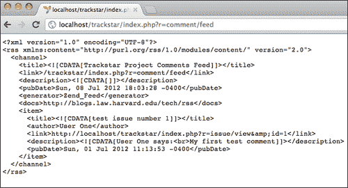

# 第 9 章。添加 RSS Web 提要

在前一章中，我们添加了用户对问题留下评论并显示这些评论列表的功能，利用 portlet 体系结构，我们可以在整个应用程序的任何位置轻松一致地显示该列表。在本章中，我们将在这个特性的基础上，将这个评论列表作为 RSS 数据源公开。此外，我们将使用另一个开源框架 Zend framework 中现有的 feed 功能来演示 Yii 应用程序与其他框架和库集成是多么容易。

# 特征规划

本章的目标是使用用户生成的评论创建的内容创建 RSS 提要。我们应该允许用户订阅跨越所有项目的评论提要，以及订阅单个项目提要。幸运的是，我们之前构建的小部件功能已经能够返回所有项目中最近的注释列表，并将数据限制在一个特定项目中。因此，我们已经编写了访问必要数据的适当方法。本章的大部分内容将着重于以正确的格式将数据发布为 RSS 提要，并向我们的应用程序添加链接，以允许用户订阅这些提要。

以下是我们为实现这些目标将要完成的高级任务列表：

*   下载 Zend Framework 并将其安装到 Yii 应用程序中
*   在控制器类中创建新操作以响应提要请求并以 RSS 格式返回适当的数据
*   更改我们的 URL 结构以便于使用
*   将新创建的提要添加到项目列表页面以及每个单独的项目详细信息页面

# 一点背景——内容联合、RSS 和 Zend 框架

网络内容联合已经存在多年，但在过去几年中才获得了巨大的普及。Web 内容联合是指以标准格式发布信息，以便其他网站可以轻松使用，读者应用程序也可以轻松使用。许多新闻网站长期以来一直在以电子方式联合其内容，但互联网上大量的网络日志（也称为博客）已经将内容联合（称为 feed）变成了几乎所有网站的预期功能。我们的 TrackStar 应用程序也不例外。

**Really Simple Syndication**（**RSS**）是一种 XML 格式规范，为 web 内容联合提供了标准。有其他格式可以使用，但由于 RSS 在大多数网站中的压倒性流行，我们将专注于以这种格式提供我们的提要。

Zend被称为“PHP 公司”。他们提供的帮助应用程序开发的产品之一是 Zend Framework。该框架提供了可以集成到其他框架应用程序中的组件。Yii 足够灵活，允许我们使用其他框架。我们将只使用 Zend 框架库的一个组件，称为`Zend_Feed`，这样我们就不必编写所有底层的“管道”代码来生成 RSS 格式的 web 提要。有关Zend_Feed 的更多信息，请访问[http://www.zendframework.com/manual/en/zend.feed.html](http://www.zendframework.com/manual/en/zend.feed.html) 。

# 安装 Zend 框架

由于我们正在使用Zend 框架来帮助支持我们的 RSS 需求，因此我们首先需要下载并安装该框架。要下载框架文件，请访问[http://www.zend.com/community/downloads](http://www.zend.com/community/downloads) 。因为我们将只使用这个框架的一个组件，所以这个框架的最小版本就足够了。我们使用的是 1.1.12 版。

展开下载的框架文件时，应看到以下高级目录和文件结构：

*   `INSTALL.txt`
*   `LICENSE.txt`
*   `README.txt`
*   `bin/`
*   `library/`

为了在我们的 Yii 应用程序中使用这个框架，我们需要移动应用程序目录结构中的一些文件。让我们在应用程序的`/protected`目录下创建一个名为`vendors/`的新目录。然后，将 Zend Framework 目录`/library/Zend`移动到新创建的目录下。一切就绪后，确保 TrackStar 应用程序中存在`protected/vendors/Zend/Feed.php`。

# 使用 Zend_ 饲料

**Zend_ 提要**是 Zend 框架的一个小组件，它将创建 web 提要的所有复杂性封装在一个简单易用的界面后面。它将帮助我们在很短的时间内获得一个工作的、经过测试的、与 RSS 兼容的数据源。我们需要做的就是按照 Zend_Feed 所期望的方式格式化我们的评论数据，剩下的事情就由 Zend_Feed 来完成了。

我们需要一个存放代码的地方来处理我们的提要请求。我们可以为此创建一个新的控制器，但为了简单起见，我们只需在主`CommentController.php`文件中添加一个新的操作方法来处理请求。我们将在这里列出整个方法，然后讨论它正在做什么，而不是一次添加一点到该方法中。

```php
Open up CommentController.php and add the following public method:
/**
   * Uses Zend Feed to return an RSS formatted comments data feed
   */
  public function actionFeed()
  {
    if(isset($_GET['pid'])) 
    {
      $comments = Comment::model()->with(array(
                'issue'=>array(
                  'condition'=>'project_id=:projectId', 
                  'params'=>array(':projectId'=>intval($_GET['pid'])),
                )))->recent(20)->findAll();      
    }
    else   
      $comments = Comment::model()->recent(20)->findAll();  

    //convert from an array of comment AR class instances to an name=>value array for Zend
    $entries=array(); 

    foreach($comments as $comment)
    {

        $entries[]=array(
                'title'=>$comment->issue->name,     
                'link'=>CHtml::encode($this->createAbsoluteUrl('issue/view',array('id'=>$comment->issue->id))),  
                'description'=> $comment->author->username . ' says:<br>' . $comment->content,
                'lastUpdate'=>strtotime($comment->create_time),   
                'author'=>CHtml::encode($comment->author->username),
         );
    }  

    //now use the Zend Feed class to generate the Feed
    // generate and render RSS feed
    $feed=Zend_Feed::importArray(array(
         'title'   => 'Trackstar Project Comments Feed',
         'link'    => $this->createAbsoluteUrl(''),
         'charset' => 'UTF-8',
         'entries' => $entries,      
     ), 'rss');

    $feed->send();

  }
```

这一切都相当简单。首先，我们检查输入请求查询字符串是否存在`pid`参数，我们使用该参数指示特定的项目 ID。请记住，我们希望有选择地允许数据提要将内容限制为与单个项目关联的注释。接下来，我们使用与前一章中相同的方法来填充我们的小部件，以检索最多 20 条最新注释的列表，这些注释可以跨所有项目，也可以指定特定于该项目的项目 ID。

您可能还记得，该方法返回一个`Comment`AR 类实例数组。我们迭代这个返回的数组，并将数据转换为`Zend_Feed`组件接受的格式。`Zend_Feed`接受一个简单数组，该数组包含元素本身就是数组，包含每个注释条目的数据。每个条目都是一个简单的`name=>value`对关联数组。为了符合特定的 RSS 格式，我们的每个条目必须至少包含一个标题、一个链接和一个描述。我们还添加了两个可选字段，一个名为`lastUpdate`，将`Zend_Feed`转换为 RSS 字段`pubDate`，另一个用于指定作者。

为了以正确的格式获取数据，我们利用了一些额外的辅助方法。首先，我们使用控制器的`createAbsoluteUrl()`方法，而不仅仅是`createUrl()`方法，以生成完全限定的 URL。使用`createAbsoluteUrl()`将生成类似以下内容的链接：

`http://localhost/trackstar/index.php?r=issue/view&id=5`而不仅仅是`/index.php?r=issue/view&id=5`

此外，为了避免由PHP 的`DOMDocument::createElement()`方法生成的`unterminated entity reference`等错误，`Zend_Feed`使用该方法生成 RSS XML，我们需要使用方便的帮助函数`CHtml::encode`将所有适用字符转换为 HTML 实体。因此，我们对链接进行编码，这样看起来像`http://localhost/trackstar/index.php?r=issue/view&id=5`的 URL 将转换为`http://localhost/trackstar/index.php?r=issue/view&amp;id=5`。

我们还需要对 RSS 格式的其他数据执行此操作。描述和标题字段都生成为一个`CDATA`块，因此在这些字段上不需要使用编码。

一旦我们所有的条目被正确填充和格式化，我们就使用 Zend_ 提要的`importArray()`方法，该方法接受一个数组来构建 RSS 提要。最后，一旦 feed 类从条目的输入数组中构建并返回，我们就在该类上调用`send()`方法。这会将格式正确的 RSS XML 和适当的头返回给客户端。

在此之前，我们需要对`CommentController.php`文件和类进行几次配置更改。我们需要在注释控制器中包含一些 Zend 框架文件。在`CommentController.php`顶部添加以下语句：

```php
Yii::import('application.vendors.*');
require_once('Zend/Feed.php');
require_once('Zend/Feed/Rss.php');
```

最后，修改`CommentController::accessRules()`方法允许任何用户访问我们新增的`actionFeed()`方法：

```php
public function accessRules()
  {
    return array(
      array('allow',  // allow all users to perform 'index' and 'view' actions
 'actions'=>array('index','view','feed'),
        'users'=>array('*'),
      ),
```

这就是它的全部。如果我们现在导航到`http://localhost/trackstar/index.php?r=comment/feed`，我们可以查看我们努力的结果。由于浏览器处理 RSS 提要的方式不同，您的体验可能与下面的屏幕截图有所不同。如果在 Firefox 浏览器中查看，您应该看到以下屏幕截图：


但是，在 Chrome 浏览器中查看时，我们会看到显示的原始 XML，如以下屏幕截图所示：



这可能取决于您的版本。还可能会提示您选择要安装的可用 RSS 阅读器扩展，例如 Google reader 或用于 Chrome 的 RSS 提要阅读器扩展。

# 创建用户友好的 URL

到目前为止，在整个开发过程中，我们一直在使用我们的 Yii 应用程序 URL 结构的默认格式。这种格式在[第 2 章](02.html "Chapter 2. Getting Started")、*入门*中讨论，在*回顾我们的请求路由*一节中，使用了查询字符串方法。我们有一个主参数“r”，代表*路由*，后面是 controllerID/actionID 对，然后是可选的 querystring 参数，根据调用的特定操作方法的需要。我们为新提要创建的 URL 也不例外。这是一个冗长、繁琐且难看的 URL。一定有更好的办法！嗯，事实上有。

通过使用所谓的*路径*格式，我们可以使前面提到的 URL 看起来更清晰、更容易解释，它消除了查询字符串，并将`GET`参数放入 URL 的路径信息部分：

以我们的评论源 URL 为例，我们将使用`http://localhost/trackstar/index.php/comment/feed/`而不是`http://localhost/trackstar/index.php?r=comment/feed`。

此外，我们不需要为每个请求指定输入脚本。我们还可以利用 Yii 的请求路由配置选项来消除指定 controllerID/actionID 对的需要。我们的请求可以如下所示：

`http://localhost/trackstar/commentfeed`

此外，通常在提要 URL 的末尾指定`.xml`扩展名。因此，如果我们可以将 URL 更改为如下所示，那就太好了：

`http://localhost/trackstar/commentfeed.xml`

这大大简化了用户的 URL，也是将 URL 正确索引到主要搜索引擎（通常称为“搜索引擎友好 URL”）中的一种优秀格式。让我们看看如何使用 Yii 的 URL 管理功能来改变我们的 URL 以匹配所需的格式。

## 使用 URL 管理器

Yii 中内置的URL 管理器是一个应用组件，可以在`protected/config/main.php`文件中配置。让我们打开该文件，并将新的 URL 管理器组件声明添加到组件数组中：

```php
'urlManager'=>array(
    'urlFormat'=>'path',
 ),    
```

只要我们坚持使用默认值并将组件命名为`urlManager`，我们就不需要指定组件的类，因为它在`CWebApplication.php`框架类中被预先声明为`CUrlManager.php`。

通过这一简单的添加，我们的 URL 结构已更改为整个站点的路径格式。例如，以前，如果我们想查看 ID 为 1 的特定问题，我们使用以下 URL 发出请求：

`http://localhost/trackstar/index.php?r=issue/view&id=1`

现在，有了这些更改之后，我们的 URL 如下所示：

`http://localhost/trackstar/index.php/issue/view/id/1`

您会注意到，我们所做的更改影响了整个应用程序中生成的所有 URL。要查看此内容，请再次访问我们的提要，访问`http://localhost/trackstar/index.php/comment/feed/`。我们注意到，我们所有的问题链接都已重新格式化为我们的新结构。这一切都要归功于我们始终使用控制器方法和其他帮助器方法来生成 URL。我们可以在一个配置文件中更改 URL 格式，更改将自动在整个应用程序中传播。

我们的 URL 看起来更好了，但是我们仍然指定了输入脚本`index.php`，并且我们还不能在提要 URL 的末尾附加`.xml`后缀。因此，让我们隐藏`index.php`文件作为 URL 的一部分，并设置请求路由，以理解`commentfeed.xml`的请求实际上意味着`CommentController::actionFeed()`的请求。让我们先解决后一个问题。

### 配置路由规则

Yii URL 管理器允许我们指定定义 URL 解析和创建方式的规则。规则包括定义路线和模式。该模式用于匹配 URL 的路径信息部分，以确定用于解析或创建 URL 的规则。模式可能包含使用语法`ParamName:RegExp`的命名参数。解析 URL 时，匹配规则将从路径信息中提取这些命名参数，并将它们放入`$_GET`变量中。当应用程序创建 URL 时，匹配规则将从`$_GET`中提取命名参数，并将其放入已创建 URL 的路径信息部分。如果模式以`/*`结尾，则意味着可以将额外的`GET`参数附加到 URL 的路径信息部分。

要指定 URL 规则，请将`CUrlManager`文件的`rules`属性设置为`pattern=>route`格式的规则数组。

例如，让我们看一下以下两条规则：

```php
'urlManager'=>array(
  'urlFormat'=>'path',
  'rules'=>array(
  'issues'=>'issue/index',
  'issue/<id:\d+>/*'=>'issue/view',
  ),
)
```

此代码中指定了两条规则。第一条规则说，如果用户请求 URL`http://localhost/trackstar/index.php/issues`，则应将其视为`http://localhost/trackstar/index.php/issue/index`，在构建这样一个 URL 时同样适用。因此，例如，如果我们在应用程序中使用控制器的`createUrl('issue/index')`方法创建 URL，它将生成`/trackstar/index.php/issues`而不是`/trackstar/index.php/issue/index`。

第二条规则包含一个命名参数`id`，该参数使用`<ParamName:RegExp>`语法指定。它说，例如，如果用户请求 URL`http://localhost/trackstar/index.php/issue/1`，则应将其视为`http://localhost/trackstar/index.php/issue/view/id/1`。在构建这样的 URL 时，也同样适用。

还可以将路由指定为数组本身，以允许设置其他属性，例如 URL 后缀以及路由是否应视为区分大小写。在为注释提要指定规则时，我们将利用这些特性。

让我们在`urlManager`应用程序组件配置中添加以下规则：

```php
'urlManager'=>array(
        'urlFormat'=>'path',   
 'rules'=>array(   'commentfeed'=>array('comment/feed', 'urlSuffix'=>'.xml', 'caseSensitive'=>false),
      ), 
), 
```

这里，我们使用了`urlSuffix`属性来指定所需的 URL`.xml`后缀。

现在，我们可以使用以下 URL 访问提要：

`http://localhost/trackstar/index.php/commentFeed.xml`

#### 从 URL 中删除输入脚本

现在我们只需要从 URL 中删除部分`index.php`。这分为两个步骤，如下所示：

1.  更改 web 服务器配置，将所有与现有文件或目录不对应的请求重新路由到`index.php`。
2.  将`urlManager`组件的`showScriptName`属性设置为`false`。

第一步考虑应用程序如何路由请求，而后一步考虑如何在整个应用程序中创建 URL。

由于我们使用的是 Apache HTTP Server，我们可以通过在应用程序根目录中创建一个`.htaccess`文件并向该文件添加以下指令来执行第一步：

```php
# Turning on the rewrite engine is necessary for the following rules and features.
# FollowSymLinks must be enabled for this to work.
<IfModule mod_rewrite.c>
  Options +FollowSymlinks
  RewriteEngine On
</IfModule>

# Unless an explicit file or directory exists, redirect all request to Yii entry script
<IfModule mod_rewrite.c>
  RewriteCond %{REQUEST_FILENAME} !-f
  RewriteCond %{REQUEST_FILENAME} !-d
  RewriteRule . index.php
</IfModule>
```

### 注

此方法仅适用于 ApacheHTTP 服务器。如果使用不同的 web 服务器，则需要参考 web 服务器重写规则。还请注意，此信息可以放在主 Apache 配置文件中，作为使用`.htaccess`文件方法的替代方法。

有了这个`.htaccess`文件，我们现在可以通过导航到`http://localhost/trackstar/commentfeed.xml`（或者`http://localhost/trackstar/commentFeed.xml`，因为我们将区分大小写设置为 false）来访问我们的提要。

然而，即使这样，如果我们在应用程序中使用一个控制器方法或一个`CHtml`助手方法来创建 URL，比如在控制器类中执行`$this->createAbsoluteUrl('comment/feed');`，它将生成以下 URL，其中`index.php`仍在 URL 中：

`http://localhost/trackstar/index.php/commentfeed.xml`

为了指示它在生成 URL 时不使用条目脚本名称，我们需要在`urlManager`组件上设置该属性。我们在`main.php`配置文件中再次这样做，如下所示：

```php
'urlManager'=>array(
    'urlFormat'=>'path',   
    'rules'=>array(
       'commentfeed'=>array('comment/feed', 'urlSuffix'=>'.xml', 'caseSensitive'=>false),
  ), 
 'showScriptName'=>false,
 ),   
```

为了处理 URL 中项目 ID 的添加，我们需要将注释提要数据限制为与特定项目关联的注释，为此我们需要添加另一条规则，如下所示：

```php
'urlManager'=>array(
        'urlFormat'=>'path',   
        'rules'=>array(   
 '<pid:\d+>/commentfeed'=>array('comment/feed', 'urlSuffix'=>'.xml', 'caseSensitive'=>false),
         'commentfeed'=>array('comment/feed', 'urlSuffix'=>'.xml', 'caseSensitive'=>false),
      ), 
      'showScriptName'=>false,
),
```

此规则还使用`<Parameter:RegEx>`语法指定模式，以允许在 URL 的`commentfeed.xml`部分之前指定项目 ID。有了这个规则，我们可以将 RSS 提要限制为特定于项目的注释。例如，如果我们只需要与项目#`2`关联的注释，URL 格式将是：

`http://localhost/trackstar/2/commentfeed.xml`

# 添加馈电链路

现在我们已经创建了我们的提要，并修改了 URL 结构，使其更方便用户和搜索引擎，我们需要添加用户订阅提要的功能。一种方法是在呈现要添加 RSS 提要链接的页面之前添加以下代码。让我们对项目列表页面和特定的项目详细信息页面都这样做。我们将从项目列表页面开始。本页面采用`ProjectController::actionIndex()`方式呈现。将该方法更改如下：

```php
public function actionIndex()
{
    $dataProvider=new CActiveDataProvider('Project');

 Yii::app()->clientScript->registerLinkTag(
 'alternate',
 'application/rss+xml',
 $this->createUrl('comment/feed'));

    $this->render('index',array(
      'dataProvider'=>$dataProvider,
    ));
}
```

此处显示的突出显示的代码将以下内容添加到呈现 HTML 的`<head>`标记中：

```php
<link rel="alternate" type="application/rss+xml" href="/commentfeed.xml" />
```

在许多浏览器中，这会自动在地址栏中生成一个小 RSS 提要图标。以下屏幕截图描述了 Safari 地址栏中此图标的外观：


我们做了类似的更改，将此链接添加到特定的项目详细信息页面。这些页面的呈现由`ProjectController::actionView()`方法处理。将该方法更改为以下内容：

```php
public function actionView($id)
  {
    $issueDataProvider=new CActiveDataProvider('Issue', array(
      'criteria'=>array(
         'condition'=>'project_id=:projectId',
         'params'=>array(':projectId'=>$this->loadModel($id)->id),
       ),
       'pagination'=>array(
         'pageSize'=>1,
       ),
     ));

 Yii::app()->clientScript->registerLinkTag(
 'alternate',
 'application/rss+xml',
 $this->createUrl('comment/feed',array('pid'=>$this->loadModel($id)->id)));

    $this->render('view',array(
      'model'=>$this->loadModel($id),
      'issueDataProvider'=>$issueDataProvider,
    ));

  }
```

这几乎与我们添加到索引方法中的相同，只是我们指定了项目 ID，以便我们的注释条目仅限于与该项目相关的条目。类似的图标现在将显示在我们的项目详细信息页面的地址栏中。单击这些图标可以让用户订阅这些评论源。

### 注

`registerLinkTag()`方法允许您也将媒体属性指定为第四个参数，然后您可以进一步将其他支持的属性指定为`name=>value`对数组，作为第五个参数。见[http://www.yiiframework.com/doc/api/1.1/CClientScript/#registerLinkTag-详细信息](http://www.yiiframework.com/doc/api/1.1/CClientScript/#registerLinkTag-detail)了解使用此方法的更多信息。

# 总结

本章演示了将 Yii 与其他外部框架集成是多么容易。我们专门使用了流行的 Zend 框架来演示这一点，并且能够快速地向我们的应用程序添加符合 RSS 的 web 提要。虽然我们专门使用了`Zend_Feed`，但我们确实演示了如何将任何 Zend Framework 组件集成到应用程序中。这进一步扩展了已经非常广泛的 Yii 功能，使 Yii 应用程序功能极其丰富。

我们还了解了 Yii 中的 URL 管理功能，并在整个应用程序中更改了 URL 格式，使其更方便用户和搜索引擎。这是改进应用程序外观和感觉的第一步，到目前为止，我们忽略了这一点。在下一章中，我们将进一步了解 Yii 应用程序的表示层。风格、主题，以及通常使事物看起来良好是下一章的重点。